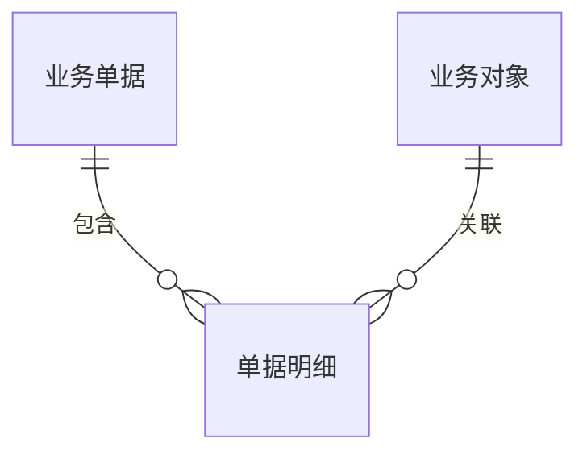

# 业务实体关系

按业务对象画关系与来源，标明可选关联、一对多或多对多、历史引用和归属。不提前指定数据库表、索引或未核实的 API。

下面仅为 Mermaid ER 语法示例，不是项目的数据模型：

```mermaid
erDiagram
  业务单据 ||--o{ 单据明细 : 包含
  业务对象 ||--o{ 单据明细 : 关联
```

实际模型的字段口径见[数据字典](dictionary.md)，数量与金额约束引用[共享规则](../04-rules/README.md)。
