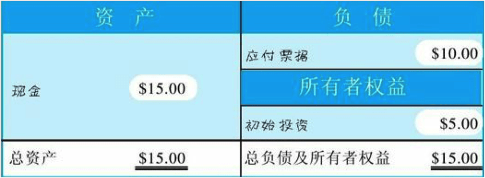
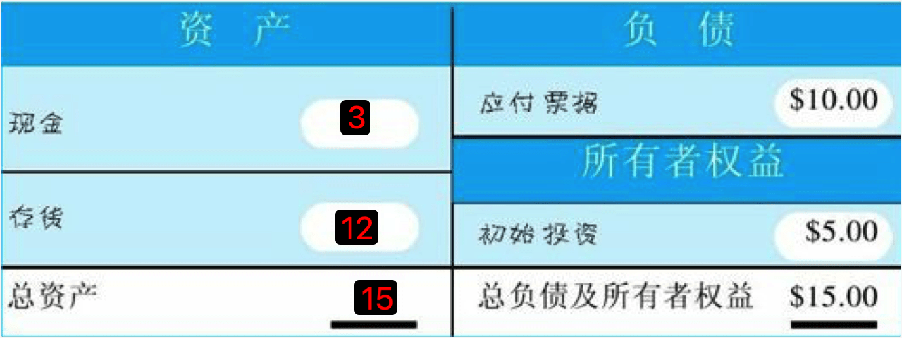
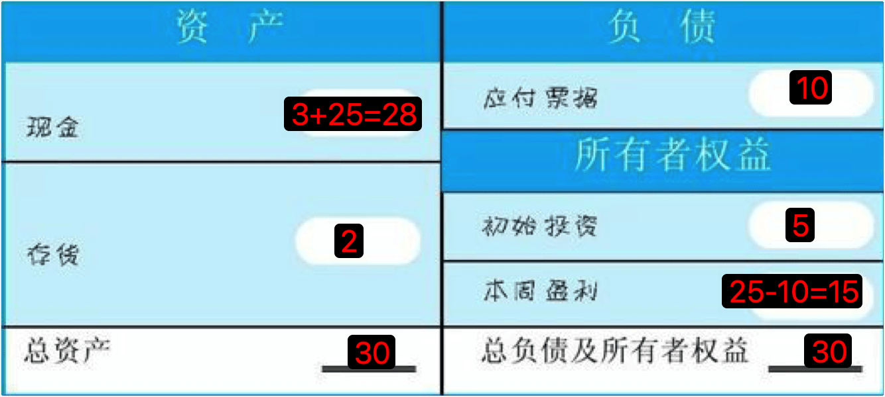
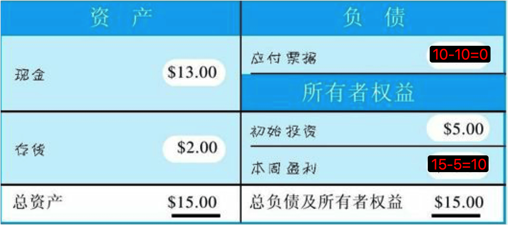
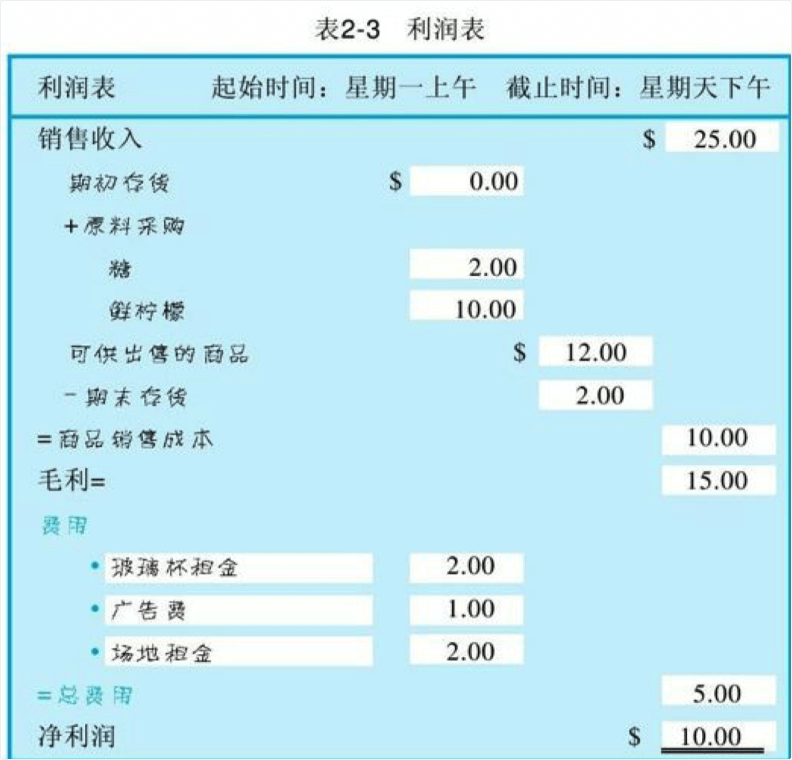
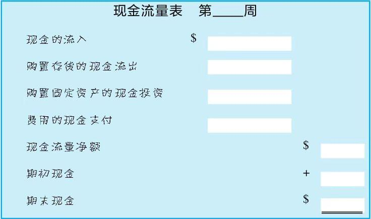
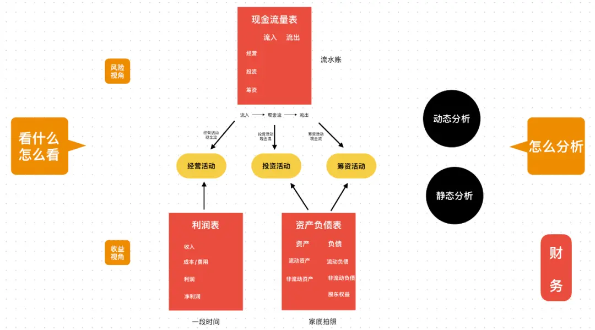

# 财务

## 目录
1. [会计基础](#会计基础)
1. [财务关键字速查](#财务关键字速查)

---

### 会计基础

**资产负债表（Balance Sheet）**：某时点 snapshot，**资产 = 负债 + 所有者权益**。左：有什么（现金、存货、固定资产等）；右：谁提供的（负债=欠别人的，权益=股东享有）。资产按流动性排序；负债按到期先后排序。


  

**利润表（Income Statement / P&L）**：一段时期的经营成果。**毛利 = 收入 − 成本**，**净利润 = 收入 − 成本 − 费用**。核心比率：毛利率 = 毛利/收入（产品竞争力），净利率 = 净利润/收入（整体盈利）。成本=与生产直接相关；费用=与生产不直接相关，含发给所有者的薪酬（无实物产品时对应：营业成本、费用）。



**现金流量表（Cash Flow Statement）**：一段时期内现金的流入与流出，分经营、投资、筹资。**自由现金流 = 经营现金流 − 资本性支出**，是估值与偿债能力的重要指标。



**三表勾稽**：① 利润表净利润 → 资产负债表的未分配利润；② 利润表净利润为现金流量表起点；③ 现金流量表期末现金 = 资产负债表货币资金。

**一句话**：利润表=这段时期赚没赚钱；现金流量表=钱有没有真的进来/出去；资产负债表=到该时点还剩什么、欠什么。**盈利≠有现金**：维持运转的是现金，没利润可撑一阵，没现金无法运作。

#### 核算基础：权责发生制 vs 收付实现制

| 权责发生制（Accrual） | 收付实现制（Cash） |
|----------------------|-------------------|
| 权利/义务发生时确认 | 实际收付时确认 |
| 有存货必须采用 | 可用于纯服务（诊所、律所、咨询等） |

我国企业一般要求权责发生制。有存货时若用收付实现制，易通过年底加大采购人为做低成本、少交税，故被禁止。

#### 记账：单式 vs 复式、借贷记账法

- **单式**：只记收支流水，不看账户对应。
- **复式**：每笔业务至少记两个账户，**有借必有贷，借贷必相等**。我国常用**借贷记账法**，借/贷为方向符号，不是字面意思；值恒为正。

| 科目类型 | 借方 | 贷方 |
|---------|------|------|
| 资产、成本、费用 | 增加 | 减少 |
| 负债、权益、收入 | 减少 | 增加 |

**本质**：资金在资产、负债、权益之间的流动；每笔业务至少两笔分录，保持**资产 = 负债 + 所有者权益**。

#### 支出：资本化 vs 费用化

- **资本化**：受益>1 年且金额达公司设定标准（如 500/1000 美元）→ 进资产负债表（固定资产、无形资产等），通过折旧/摊销进费用。
- **费用化**：短期、小额、重复 → 直接进利润表费用。

**折旧**：直线法、双倍余额递减等；建筑物一般直线法。折旧是**非付现费用**，减固定资产、记折旧费。备抵：累计折旧。

#### 存货与计价

**流程**：原材料 → 在产品（WIP）→ 产成品。**坏账**：无法收回的应收，计提坏账准备。

**发出计价**（中国准则）：**先进先出（FIFO）**、**加权平均**、**个别计价**。**LIFO 中国已禁止**（美国 GAAP 仍可用）。FIFO 在涨价时：销货成本偏低、利润偏高；加权平均平滑价格波动；个别计价适用于高单价、可辨认物品（如珠宝）。

#### 应收、应付与现金流

**应付票据**：借入现金形成，通常带息、期限较长。**应付账款**：赊购形成，多 30 天内、通常无息。

**应收应付**：体现货币时间价值。尽量把现金留在己方（少应收、多应付），可从利息差中获益。

#### 资产（Assets）

过去形成、企业控制、预期带来经济利益的资源。

- **流动资产**（1 年或一营业周期内变现）：货币资金、交易性金融资产、应收票据、应收账款、预付款项、存货、合同资产、一年内到期非流动资产等。
- **非流动资产**：长期股权投资、债权投资、固定资产、在建工程、使用权资产、投资性房地产、无形资产、开发支出、长期待摊费用、递延所得税资产等。

#### 负债（Liabilities）

过去形成、预期导致经济利益流出的现时义务。

- **流动负债**（1 年内）：短期借款、应付票据、应付账款、合同负债、应付职工薪酬、应交税费、一年内到期非流动负债等。
- **非流动负债**：长期借款、应付债券、租赁负债、长期应付款、预计负债、递延收益、递延所得税负债等。

#### 所有者权益（Equity）

资产 − 负债。含：实收资本/股本、资本公积、其他综合收益、盈余公积、未分配利润等。

#### 账套、科目、辅助核算

```
账套（一个财务主体/公司一套）
 └─ 科目表（COA, Chart of Accounts）
     └─ 科目（级次：如 1002 银行存款 → 100201 工行）
         ├─ 科目类型（资产/负债/权益/成本/损益 → 借贷规则、报表项目）
         └─ 辅助核算（部门、客户、供应商、项目、职员等）
```

**账套**：独立数据集，含准则、本位币、会计期间、凭证与账簿。**科目**：按经济内容分类，决定资金记到哪。**辅助核算**：把重复维度（客户、部门、项目等）从科目里拆出来，避免科目爆炸；**多维分析 = 科目 + 辅助核算**（如：按科目查“差旅费”，按部门查“销售部”，按职员查“某人”）。

#### 币种

- **原币**：业务发生币种（USD、EUR 等）。
- **本位币**：账套记账币种（如中国公司 CNY）。
- **支付币种**：实际付款币种，可与申请币种不同。

#### 红字冲销（红冲）

已过账凭证不可改删，只能**另做一笔反向分录抵销**。对应系统设计：过账后数据只读，修改=追加负向/反向记录，类似 immutable + 负向流水。

#### 会计事项

能用货币计量、且引起至少一个会计要素（资产、负债、权益、收入、费用、利润）变动的经济业务；复式下至少影响两个科目。**可理解为财务里的 Atomic Transaction**。

#### 凭证与单据类型

| 类型 | 本质 | 产生时点 | 可否直接记账 |
|------|------|----------|--------------|
| 原始凭证 | 业务事实 | 业务发生时 | 经审核后可以 |
| 预制凭证 | 规则/系统推导 | 业务中或事前 | 视制度，需重点审核 |
| 记账凭证 | 法定记账依据 | 业务完成后 | ✅ |

**会计单据**：为记账与核查服务的全部材料（发票、合同、回单、报账单、记账凭证、台账）。**会计凭证**：狭义指原始凭证+记账凭证，为**直接入账依据**。凭证单据、核算凭证多为口语化说法，常指记账凭证或可入账凭证。

#### 报账单

员工/业务因公发生费用后，汇总明细并附原始凭证，申请报销或入账的**业务单**。本身不是会计凭证，但驱动生成会计凭证。

**流转**：原始凭证（发票）→ 报账单 → 费用/发票台账 → 会计凭证 → 账簿/税务。**费用明细项**：报账单中的最小费用单元。

#### 计提

在损失或损耗发生前，按谨慎性原则**预先估计并确认价值减少**。

- **折旧/摊销**：系统性、有计划的消耗（固定资产折旧、无形资产摊销）。
- **减值准备**：针对不确定性（坏账准备、存货跌价、固定资产/无形资产减值）。

**残值率**：固定资产预计使用结束时可收回价值占原值的比例，用于算折旧基数。

#### 对账（Reconciliation）

**账证**：账簿 vs 凭证。**账账**：总账 vs 明细（如应收账款总额 vs 各客户明细之和）。**账实**：账面 vs 实际（如银行日记账 vs 银行对账单）。

**对账单（Statement）**：外部证据，用于核对与签认。**银行对账单**→ 编《银行存款余额调节表》、找未达账项。**往来对账单**→ 确认应收/应付与对方一致。

#### 付款单与核销

**付款单**：记录资金流出，用作核销应付、以及生成记账凭证的原始依据。

**核销（Clearing）**：把“应付”与“付款”一一对应，勾销负债、更新往来余额。

| 步骤 | 单据 | 财务影响 |
|------|------|----------|
| 收票/收贷 | 应付单 | 应付账款↑ |
| 付款 | 付款单 | 银行存款↓ |
| 匹配 | 核销 | 应付与资金流水对应，负债销减 |

#### 清结算

- **清算（Clearing）**：资金划转前，对交易核对、轧差（如 A 应付 B 100、B 应付 A 30 → A 付 B 70）、算手续费/税费/抽成。
- **结算（Settlement）**：按清算结果完成资金划拨，更新账务，闭环状态（如“待结算”→“已结清”）。

#### 其他名词

- **业务财务一体化（业财）**：资产负债表、利润表偏**收益与资源**；现金流量表偏**风险与持续经营能力**。业财系统需同时支撑“有多少家底、赚多少”与“钱能不能转得动”。



- **财务主体（Accounting Entity）**：独立核算、编制报表的边界。可=独立公司、集团或内部独立记账单元。**开票主体**：开发票的一方，多为财务主体；一集团可多开票主体。
- **台账（Ledger）**：某类业务的明细账册，按时序记录，支持筛选、钻取；与汇总型报表相对。
- **确认单**：业务“已交付、双方认可”的凭据；对财务而言是**可开票、可确认收入/付款**的触发点。
- **卡片**：单项固定资产的独立档案；**卡片台账**=全部资产卡片集合。
- **SWIFT/BIC**：国际银行电汇用的银行识别码。
- **收付款认领**：将一笔银行流水识别为对应哪笔应收/应付或业务。
- **分账（Split Payment）**：一笔交易按约定比例/金额分配给多方的过程。
- **分摊**：将费用/成本/收入按规则分到多对象（部门、产品）或多期间。
- **费控系统**：管理报账流程与审批的系统；报账单是其中单据形态。
- **SPU / SKU**：SPU=标准产品单元（如 iPhone 16 Pro）；SKU=库存量单位（如 黑色/256G，对应单价与库存）。SPU 与 SKU 为父子关系。
- **EBS 凭证**：转换为 Oracle EBS 格式并同步记账的凭证。
- **凭证字号**：凭证字（记/收/付/转/现收/现付/银收/银付/转）+ 凭证号（每月从 1 起）。例：银付字第 008 号。
- **待摊费用**：已支出、按受益期分摊的费用；资产负债表中列示。
- **快闪店**：短期临时店面，用于品牌、新品或清库存。

### 财务关键字速查
| 关键字 | 英文 | 释义 |
|--------|------|------|
| 资产负债表 | Balance Sheet, BS | 时点报表，资产=负债+所有者权益 |
| 利润表 | Income Statement, P&L, 损益表 | 时期经营成果，收入−成本−费用=净利润 |
| 现金流量表 | Cash Flow Statement, CFS | 时期现金流入流出，分经营/投资/筹资 |
| 毛利 | Gross Profit | 收入−成本；毛利率=毛利/收入 |
| 销货成本 | COGS, Cost of Goods Sold | 与生产/服务直接相关的成本，利润表中减项 |
| 净利 | Net Income, 净利润 | 收入−成本−费用；净利率=净利/收入 |
| 自由现金流 | FCF, Free Cash Flow | 经营现金流−资本性支出 |
| ROE | Return on Equity | 净资产收益率=净利润/所有者权益 |
| 流动比率 | Current Ratio | 流动资产/流动负债，短期偿债能力 |
| 权责发生制 | Accrual Basis | 权利/义务发生时确认，与收付时点无关 |
| 收付实现制 | Cash Basis | 实际收付时确认 |
| 复式记账 | Double-entry | 有借必有贷、借贷必相等，至少两科目 |
| 借贷记账法 | Debit-Credit | 借/贷为方向符号，资产/费用借增贷减，负债/权益/收入借减贷增 |
| 资本化 | Capitalize | 支出进资产负债表，通过折旧/摊销进费用 |
| 费用化 | Expense | 支出直接进利润表费用 |
| 资本性支出 | CapEx, Capital Expenditure | 购建长期资产的支出，进资产负债表后通过折旧/摊销进费用 |
| 收益性支出 | OpEx, Operating Expense | 日常经营费用，直接进利润表 |
| 会计期间 | Accounting Period | 报表覆盖的时间范围（月/季/年） |
| 折旧 | Depreciation | 固定资产价值按期的系统性分摊；非付现费用 |
| 摊销 | Amortization | 无形资产、长期待摊的价值按期分摊 |
| 递延 | Deferral | 已收/已付、在以后期间确认收入/费用；如递延收益、递延所得税 |
| 计提 | Provision | 预先估计并确认费用或减值 |
| 备抵 | Allowance, 抵减 | 与主科目反方向、用于冲减的科目，如累计折旧、坏账准备 |
| 流动资产 | Current Assets | 1年或一营业周期内可变现的资产 |
| 非流动资产 | Non-current Assets | 长期持有或使用的资产 |
| 流动负债 | Current Liabilities | 1年内需偿还的负债 |
| 净资产 | Net Assets | 资产−负债=所有者权益 |
| 未分配利润 | Retained Earnings | 累计净利润减已分配股利，在所有者权益中；利润表净利转入 |
| 应收账款 | AR, Accounts Receivable | 因赊销形成的应向客户收取的款项 |
| 应付账款 | AP, Accounts Payable | 因赊购形成的应付给供应商的款项 |
| 应付票据 | Notes Payable | 因借款等形成的带息、期限较长的付款承诺 |
| FIFO | First In First Out | 先进先出；发出存货按先购入的单位成本计价 |
| LIFO | Last In First Out | 后进先出；中国准则已禁止 |
| WIP | Work in Process | 在产品、半成品 |
| 坏账 | Bad Debt | 无法收回的应收账款 |
| 坏账准备 | Allowance for Doubtful Accounts | 应收的备抵，预估无法收回的金额 |
| 原始凭证 | Source Document | 证明业务发生的单据（发票、收据、合同等） |
| 记账凭证 | Accounting Voucher | 据以入账的、含借贷分录的凭证 |
| 过账 | Post | 将凭证记入账簿；过账后具法律效力、不可直接改删 |
| 关账 | Close | 期末结账，锁定该期凭证与账簿，完成损益结转 |
| 红冲 | Reversal, 红字冲销 | 用反向分录抵销错误或原有分录 |
| 对账 | Reconciliation | 账证、账账、账实核对，确保一致 |
| 核销 | Clearing, 勾销 | 将应付与付款、应收与收款一一对应并销减 |
| 清算 | Clearing | 交易数据核对、轧差、算费，资金未转移 |
| 结算 | Settlement | 按清算结果完成资金划拨 |
| 轧差 | Netting | 多方应收应付相抵后只结算净额 |
| 未达账项 | Items in Transit | 一方已记账、对方尚未记账的款项 |
| 账套 | Set of Books | 一财务主体的完整账务数据集 |
| 科目 | Account | 按经济内容分类的记账单元 |
| 科目表 | COA, Chart of Accounts | 账套内全部科目的清单及层级 |
| 中转科目 |  | 是会计核算里的过渡性会计科目，核心作用是临时归集、过渡、结转资金或成本费用，本身不形成企业的资产、负债、所有者权益，也不属于最终的损益，期末通常无余额或按规则结转后清零 |
| 辅助核算 | Dimensions, 多维 | 挂于科目上的分析维度：部门、客户、供应商、项目、职员等 |
| 财务主体 | Accounting Entity | 独立核算、编报表的边界（公司、集团或内部单元） |
| 开票主体 | Invoicing Entity | 开具发票的一方 |
| 本位币 | Local/Functional Currency | 账套记账本位货币（如中国公司 CNY） |
| 原币 | Original Currency | 业务发生的币种 |
| 分账 | Split Payment | 一笔交易资金按比例/金额分给多方 |
| 分摊 | Allocation | 费用/成本/收入按规则分到多对象或多期间 |
