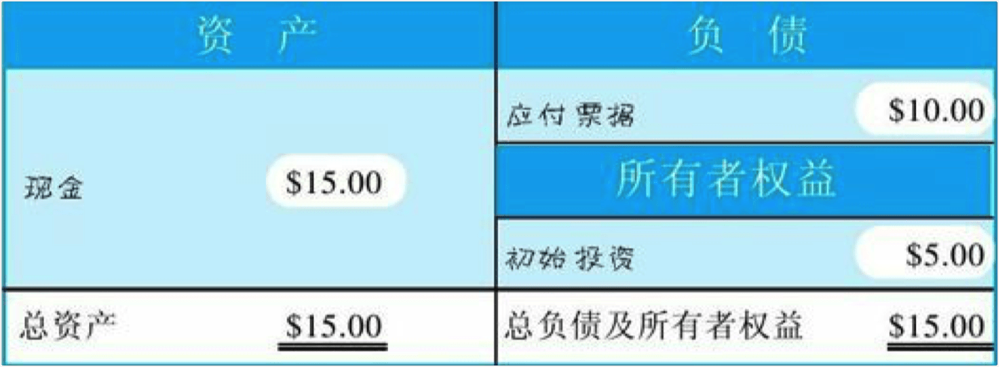
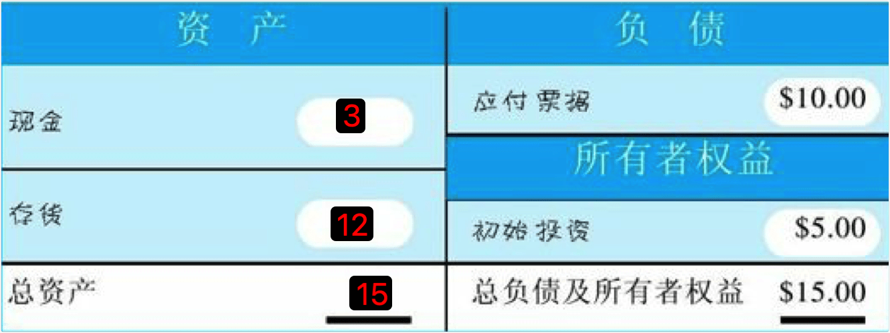
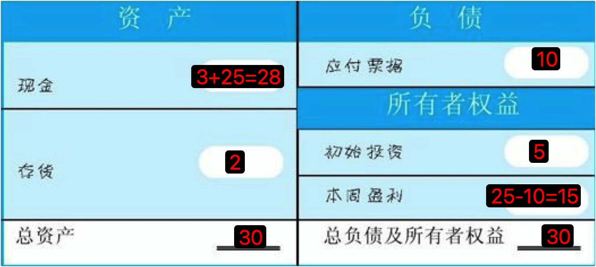
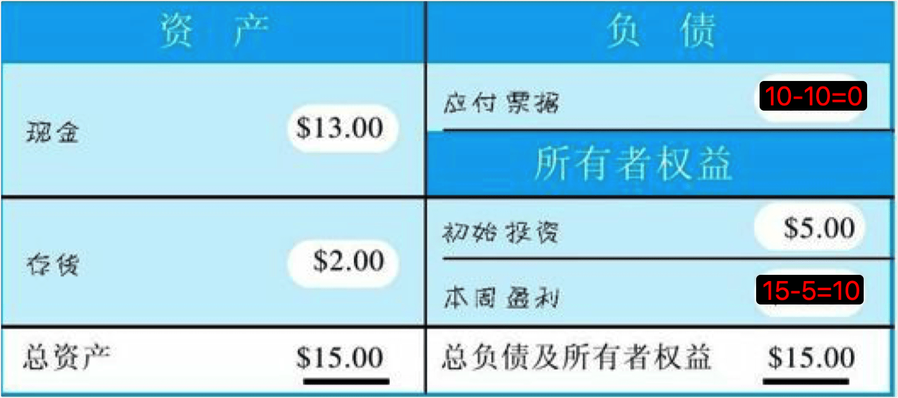
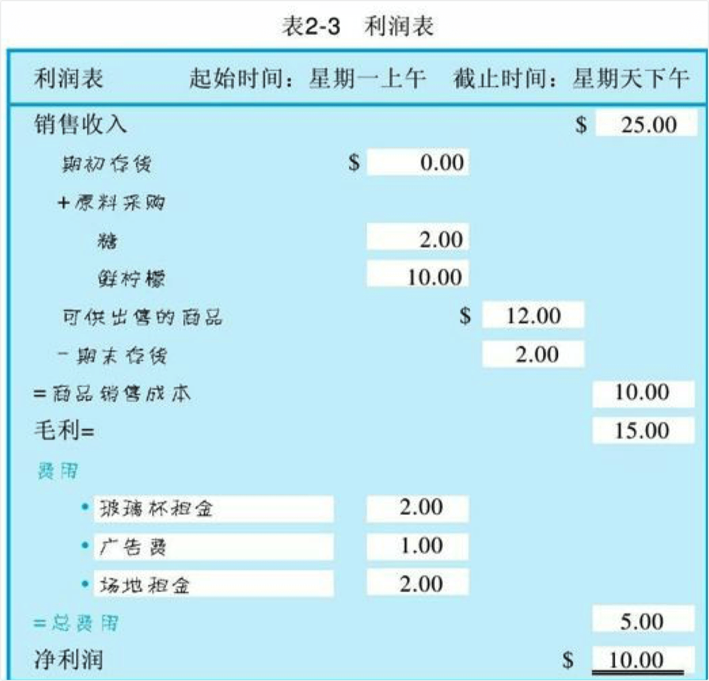

# 财务

## 目录
1. [基础](#基础)
1. [《世界上最简答的会计书》](#世界上最简答的会计书)

### 基础
1. 三张表

    1. 资产负债表

        资产负债表能够反映企业在特定日期的财务状况，其核心公式为：**资产 = 负债 + 所有者权益**。通过这张表，可以了解企业拥有哪些经济资源（资产），以及这些资源的来源，是通过债务融资（负债），还是股东投入（所有者权益）。分析资产负债表时，重点关注资产结构，即流动资产与固定资产的占比情况，以及负债率和净资产规模
    2. 利润表（损益表）

        利润表展示了企业在一定会计期间的经营成果，其核心逻辑为：**收入 - 成本 - 费用 = 净利润**。在实际分析中，**毛利率（毛利 / 收入）**是衡量产品竞争力的重要指标，较高的毛利率通常说明产品具有较强的市场竞争力，能够在扣除直接成本后仍有较多的利润空间。**净利率（净利润 / 收入）**则用于衡量企业的整体盈利能力，反映了企业在扣除所有成本和费用后的盈利水平。
    3. 现金流量表

        现金流量表将企业的现金流量分为经营活动、投资活动和筹资活动三大板块。经营活动现金流反映了企业核心业务的现金收支情况，是企业现金的主要来源。自由现金流等于经营现金流减去资本支出，它是判断企业真实价值的关键指标之一。
1. 财务知识体系搭建

    1. 核心技能（0→1 阶段）

        1. 会计基础：学习**复式记账法**，理解每一项经济业务都要以相等的金额，在两个或两个以上相互联系的账户中进行登记的原理，以及科目分类的规则，掌握各类会计科目的性质和用途，还有凭证录入的规范流程。可以参考《会计学原理》，这本书系统地介绍了会计的基本概念、原则和方法。
        2. 财务报表分析：深入研究三张报表之间的关系，即资产负债表、利润表和现金流量表之间数据的相互关联和验证关系。同时，掌握比率分析方法，通过《财务报表分析》等专业书籍学习流动比率、ROE（净资产收益率）等相关知识。
        3. 税务入门：了解增值税、企业所得税、个税等主要税种的计算规则，可参考国家税务总局官网的政策解读，获取最权威和最新的税收政策信息。
1. 年度编制被公认为是一个标准的会计期间。

### 《世界上最简答的会计书》
1. 资产负债表

    编制目的就是在人和物之间建立一种联系，它 表明了你在生意中所拥有的东西，以及这些东西与那些拥有它的人或对 此有要求权的人们之间的关系

    资产负债表，好比一张快照。

    

    存货 就是一种资产。

    
    
    

    待摊费用

    公司只要在一个会计期间的 期初和期末 各做一张资产负债表即可

    1. 应付票据：现金。应付账款：存货

        应付票据 因收到他人的借款而产生，获得现金；应付账款 因为赊账购买原材料等物品而产生，获得商品或服务。欠款需要未来某天偿还。

        应付账款的还款期限较短，通常是30天。应付票据的还款期限较长，可能会长达几年。这就是应付账款被列在负债类首位的原因，负债项目的排列通常根据各类债务到期的期限长短来列示。

        通常，应付账款不需要支付 利息，除非你无法按时还款。应付票据 通常需要支付利息。
2. 利润表（损益表）

    利润表就如同一张动态的影片，因为它有开始和结束。这个时间段可以是一周、一个月、一个季度等。无论时间的长短，都称为会计期间。

    毛利 = 收入 - 成本

    毛利率 = 毛利 / 收入

    净利润 = 毛利 - 费用

    净利率 = 净利润 / 收入

    利润表将成本分为两类：商品销售成本，其囊括 了产品生产过程中所有的支出；费用，其囊括了企业经营中与产品生产 不直接相关的其他支出。对于那些没有有形产品的公司（即服务类行 业），这两类称为营业成本（又称服务成本）及费用。

    

    产品 生产的工艺是从 原材料 到 在产品 再到 产成品。

    坏账
3. 现金流量表

- 权责发生制，收付实现制。当有**存货**时，必须用权责发生制。如 服务行业，如诊所、律师行、会计师事务所、培训公司、咨询公司、房地产中介公司以及保洁公司等，才可以用收付实现制来核算。

    >每年年末，当我们预测年终会盈利且要支付所得税款时，会想方设法合理地避税，于是我们会用现金购买大量存货，以加大销售成本，减少利润，达到少纳甚至不纳税的目的。但政府不会同意。因此有存货的企业只能用权责发生制进行核算
- 存货的 先进先出法、后进先出法

    关于存货的计价采用先进先出法还是后进先出法对于企业来说非常重要，这主要取决于公司的两大经营策略：公司的纳税筹划策略是什么？公司所处行业的产品价格走势如何？​（当然，你无法预测未来几年产品的价格，但根据最近25个月的价格你可以预期到未来的价格趋势。​）

    >先进先出法和后进先出法仅仅是存货计价的方法，当真正耗用或出售存货时，不会按照这些会计方式进行，而是按照经营者判断的方式。

    一家公司若已经从先进先出法改为后进先出法核算，但要再一次改变，就不太可能获得美国国税局的批准。如果你已经从后进先出法转变到了先进先出法核算，需要补缴因此少计的所得税。
