# [Charles](https://www.charlesproxy.com/)使用

HTTP调试工具：通过将Charles设置成**系统的网络访问代理服务器**，使得所有的网络访问请求都通过它来完成，从而实现网络封包的截取和分析。

>1. 需要安装同样位数的**java**，所有浏览器都可以使用Charles来截取请求，前提是必须关闭防火墙和关闭浏览器代理插件（或设置使用系统代理）。
>2. 移动设备设置HTTP代理之后就能以代理环境并经过电脑hosts访问网络（HTTP代理至WAMPSERVER无法经过电脑hosts）。
>
>Charles默认端口号是**8888**。

1. 面板

	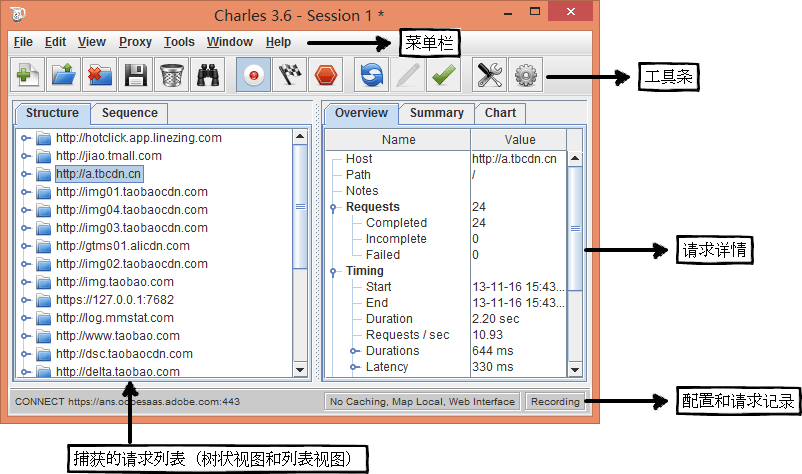

	>当你刷新页面的时候，只会在当前session中捕获请求。当关闭session后会导致已经在此session捕获的网站无法在其他session捕获，需要重新启动Charles或新建session。
2. 显示捕获列表方式

    1. Structure

        视图将网络请求按访问的域名分类

        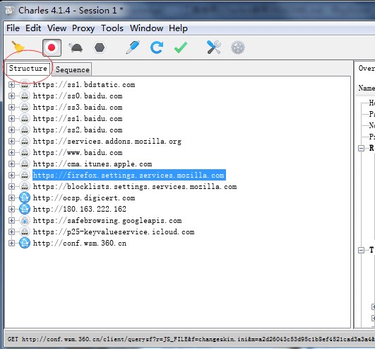

    2. Sequence

        视图将网络请求按访问的时间排序（有**Filter**功能）

        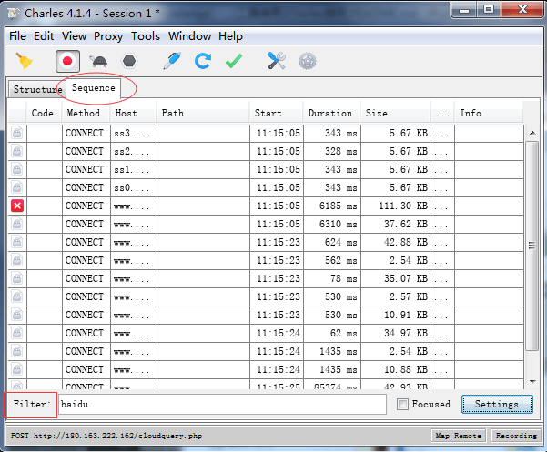

    >针对一个域名或网址，右键选择**Focus**或**Ignore**可以专门查看或忽略请求。
3. 查找

    Ctrl/commad + f调出。

	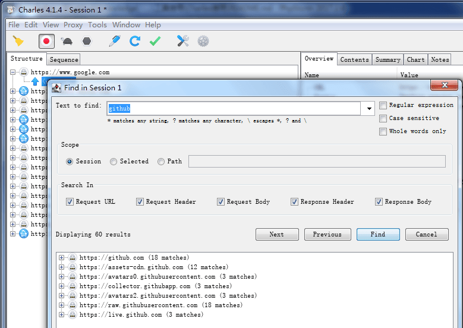
4. 代理配置

    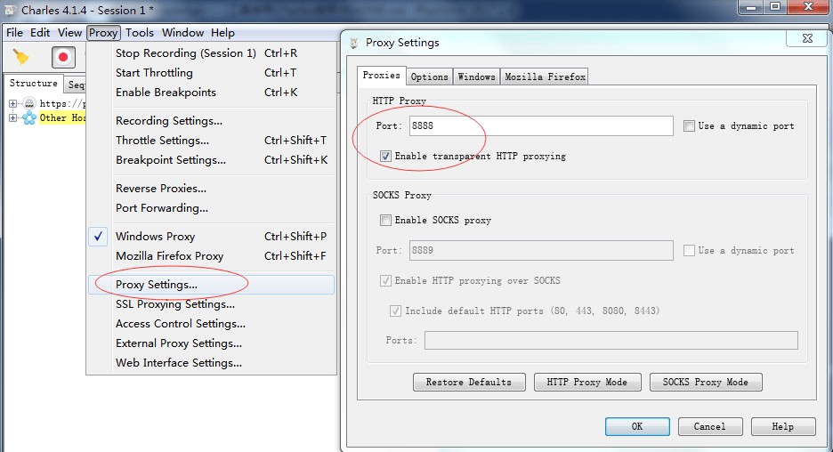
5. 捕获系统请求

    设置是否成为系统代理，取消勾选**Window Proxy**或**macOS Proxy**后不再抓取本机请求（仅抓取8888端口内容）。

    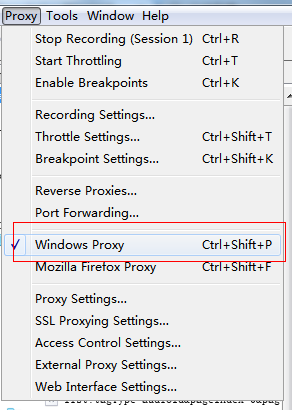
6. 捕获移动端请求

    移动设备的调试，我们需要把HTTP代理到Charles上：

    1. 使移动设备和本机在一个局域网内（不需要同一个ip段、也不需要是电脑发射的Wi-Fi，只要是同一个路由器下即可）；

        >如果无法抓取信息，可以重启Charles、重新设置HTTP代理或查看**Access Control Settings**是否允许访问。有可能某些路由器设置成无法捕获，就需要使用自备发射的Wi-Fi。
    2. 移动设备的Wi-Fi设置：服务器ip设置成电脑ip，端口号设置成8888；

        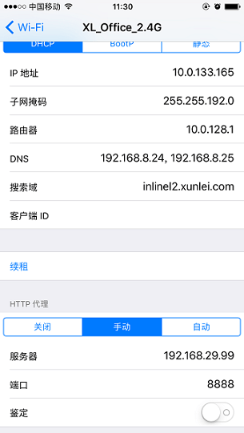
    3. Charles设置允许接收的ip地址的范围（有新的不在允许范围内的ip地址请求时，会自动询问是否允许接收）：

        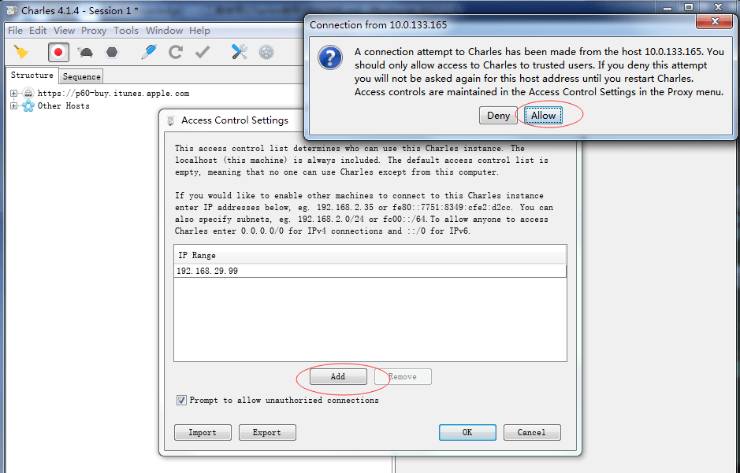

        >进入设置**Proxy - Access Control Settings**，如果接收的ip范围是192.168.1.xxx的话，那么就添加并设置成`192.168.1.0/24`；如果全部范围都接收的话，那么就直接设置成`0.0.0.0/0`。

>Charles支持HTTPS和HTTP，不支持sockets。

7. Map至本地

    1. 将**单文件**代理至本地的源码文件：

        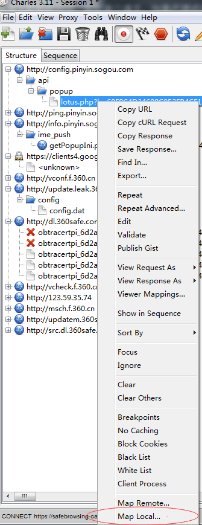

        点击“Map Local”后：

        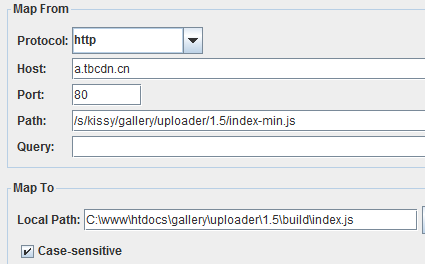

    2. 将**子目录**代理至本地，使用通配符`*`：

        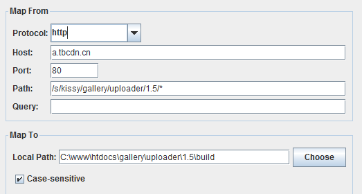

        本地地址选择个子目录，不需要通配符。

    - 校验是否代理成功，最省力的方式是点击工具条上的刷新按钮，刷新单个请求，如果代理成功，Charles会往“Notes”界面打个log:

        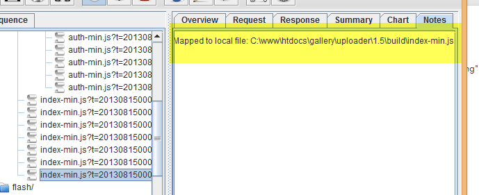
8. Map至网址：

    选择“Map Remote”

    

    
9. 网速模拟功能

	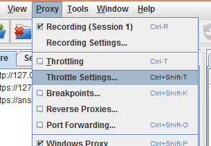
10. 断点功能

	Charles能够截断发送请求前（篡改Request）和响应后（篡改Response），修改request和response的所有信息。

	场景：ajax发送请求，我们需要测试接口的各种边界情况，如出错、超时等表现，Charles的断点+随意篡改，非常方便测试，右键选择“BreakPoints”，开启断点：

	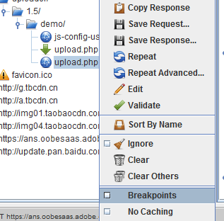

	>小技巧：断点配合repeat功能：
	>
	>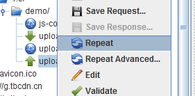

	断点列表查看：

	

	
11. 重复发送请求

	repeat功能对于前端的价值是不需要刷新页面，只需要repeat请求，还可以进行压力测试。

	**repeat**重复发送一次请求；**repeat Advances**可以自定义重复次数和重复间隔。

    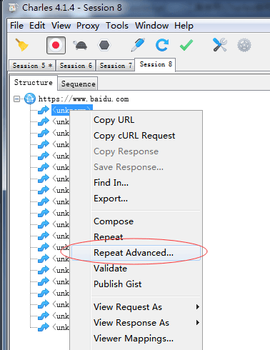

    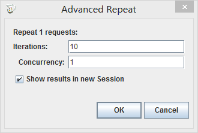
12. HTTPS分析

    若未安装Charles根证书，则仅能捕获加密后的HTTPS请求。

    1. 电脑安装证书

        1. 在 **Help->SSL Proxying->Install Charles Root Certificate**安装证书；
        2. 去系统设置信任此证书：

            1. macOS：在**钥匙串访问**中双击设置信任

                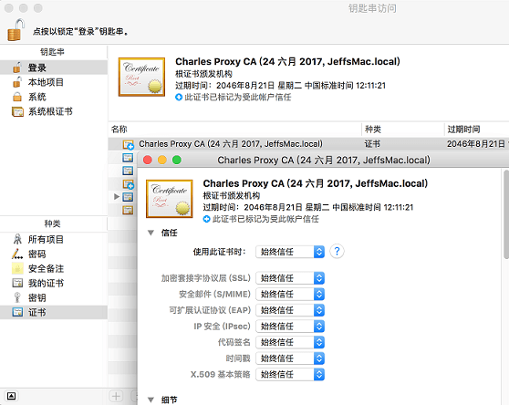
            2. Windows：把证书拖动到**受信任的根证书颁发机构**

                [Windows管理受信任的根证书](https://technet.microsoft.com/zh-cn/library/cc754841(v=ws.11).aspx#BKMK_addlocal)。
    2. 移动设备安装证书

        移动设备设置好HTTP代码后，访问[chls.pro/ssl](chls.pro/ssl)下载证书并信任。
13. 捕获记录控制

	捕获的请求太多，容易产生干扰，Charles可以对捕获记录进行过滤。

	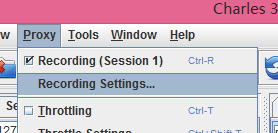

	然后配置“exclude”：

	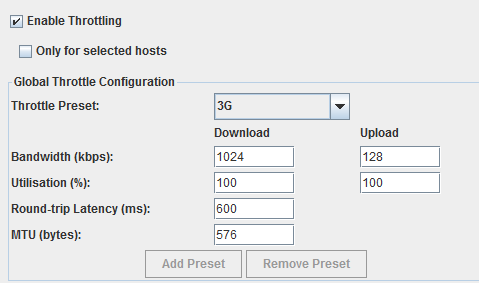
14. web界面

    Charles有个有趣的web界面：

	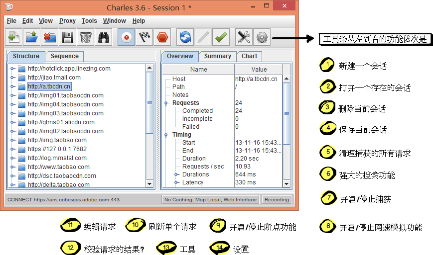
	
	强大的是可以控制是否远程可以访问这个界面，还可以设置用户名和密码。
	浏览器输入<http://control.charles/>

>tips：如果charles是非正常状态下关闭的话，有些浏览器的代理就不会被自动取消，会出现无法访问网络情况。重新打开Charles再正常关闭可以解决。