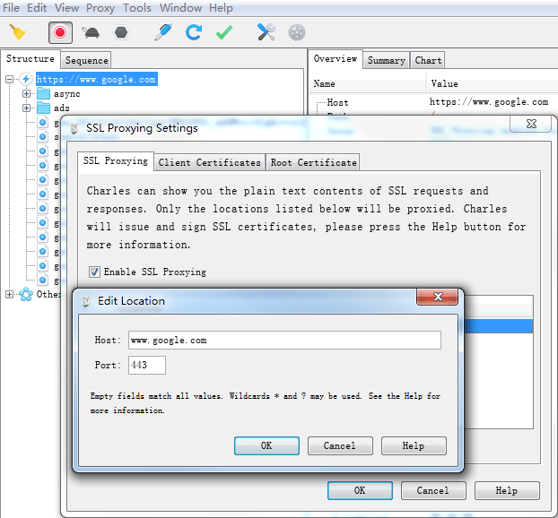
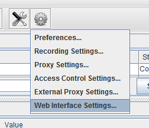

#Charles使用

Charles是目前最强大的http调试工具，在界面和功能上远强于Fiddler。
>需要安装同样位数的**java**，所有浏览器都可以使用Charles来截取请求，前提是必须关闭防火墙和关闭浏览器代理插件；手机设置了代理之后就能以代理环境访问网络（通过hosts），Charles默认端口号是**8888**。

1. 界面功能初探
	

	工具条包含了Charles的大部分功能：
	

	>Charles有个**session**的概念，可以理解为浏览器中的tab，这个功能在需要调试多个站点页面时很实用，当你刷新页面的时候，只会在当前session中捕获请求。
	
	Charles显示抓包内容有两种模式：**Structure**、**Sequence**：
	- Structure形式如下图，优点：可以很清晰的看到请求的数据结构，而且是以域名划分请求信息的，可以很清晰的去分析和处理数据:
		

	- Sequence形式如下图，优点：可以很清晰的看到全部请求，不用一层一层的去点开，这里是以数据请求的顺序去执行的，也就是说那个请求快就在前面显示:
		
	
	Charles的过滤查找功能：
	

	请求详情：
	

2. 本地代理和远程代理
	Charles的代理服务器端口为**8888**，即你的本机**ip:8888**。
	
	将一个文件代理成本地的源码文件：
	

	点击“Map Local”后：
	
	
	Charles是支持子目录代理，使用通配符*：
	

	本地地址选择个子目录，不需要通配符。
	校验是否代理成功，最省力的方式是点击工具条上的刷新按钮，刷新单个请求，如果代理成功，Charles会往“Notes”界面打个log:
	

	>小技巧：所有的配置开关都可以通过工具条上的“工具”设置（倒数第二个按钮）。
	
	去掉代理配置：
	

	>小技巧：建议开启No Caching，不缓存请求。
	
	手机或平板页面的调试，我们需要把请求代理到pc端的Charles上：
	1. 使手机和电脑在一个局域网内，不一定非要是一个ip段，只要是同一个路由器下就可以了，比如电脑连接的有线网ip为192.168.16.12，然后手机链接到wifi的ip为192.168.1.103，但是这个有线网和无线网的最终都是来自于一个外部ip，这样的话也是可以的。
	2. charles设置需要设置下允许接收的ip地址的范围：进入设置**Proxy - Access Control Settings**，然后如果接收的ip范围是192.168.1.xxx的话，那么就添加并设置成192.168.1.0/24；如果全部范围都接收的话，那么就直接设置成0.0.0.0/0。
		
	
	输入代理端口8888之后，电脑必须打开Charles后手机才可以上网。
	1. ios或android的配置：
		

		服务器ip设置成pc的ip，端口好设置成8888即可。
	
	2. 远程代理：
		

	代理配置：
		
		
		Charles支持https和http，不支持sockets。
	
3. 网速模拟功能
	在线上环境通常有些因为网速慢导致的bug，在本机无法重现，可以使用**throttle**功能。

	首先配置throttle：
	

	我们要看页面在3G环境下的表现： 
	

	Bandwidth（带宽）、Utilistation（利用百分比）、Round-trip（往返延迟）、MTU（字节）。

4. 断点功能
	Charles能够断到发送请求前（篡改Request）和请求后（篡改Response）。 
	场景：ajax发送请求，我们需要测试接口的各种边界情况，比如出错、超时等表现，Charles的断点+随意篡改，非常方便测试：
	

	右键选择“BreakPoints”，开启断点：
	
	>小技巧：不用在web界面中操作，使用repeat功能，就可再次发送一样的请求：

	断点列表查看：
	
	
	可以指定断点“get”请求还是“post”请求。 

5. 重复发送请求 
	repeat功能对于测试同学特别有用，可以检验接口的健壮性。 
	repeat功能对于前端的价值是不需要刷新页面，只需要repeat请求，比如检验代理是否成功，修改请求后执行等。 
	

	“repeat”重复发送一次请求。 
	“repeat Advances”可以自定义重复次数和重复间隔。 
	

6. 捕获记录控制 
	捕获的请求太多，容易产生干扰，Charles可以对捕获记录进行过滤。 
	

	然后配置“exclude”： 
	

7. web界面 
    Charles有个有趣的web界面： 
	
	
	强大的是可以控制是否远程可以访问这个界面，还可以设置用户名和密码。
	浏览器输入<http://control.charles/>
	
8. 
	>tips：如果charles是非正常状态下关闭的话，有些浏览器的代理就不会被自动取消，会出现无法访问网络情况。重新打开Charles再正常关闭可以解决。
