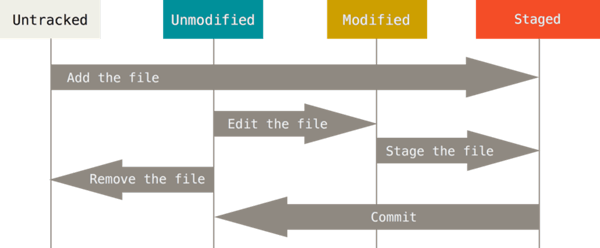

# Git心得

## 目录
1. [Git的文件状态](#git的文件状态)
1. [基本操作](#基本操作)
1. [Zen-like commit messages（Angular）格式](#zen-like-commit-messagesangular格式)
1. [命令生成commit message && changelog](#命令生成commit-message--changelog)
1. [git-flow使用](#git-flow使用)
1. [如何在一台电脑中使用2（多个）个Github账号的SSH keys](#如何在一台电脑中使用2多个个github账号的ssh-keys)
1. [设置gitconfig](#设置gitconfig)
1. [.gitkeep文件](#gitkeep文件)
1. [GitLab CI](#gitlab-ci)
1. [减少Git项目下载大小](#减少git项目下载大小)
1. [`husky`+`lint-staged`](#huskylint-staged)

---
### Git的文件状态
1. `untracked`

    未跟踪（不在版本控制内）。
2. 已跟踪

    1. `unmodify`

        未修改。版本库中的文件快照与文件完全一致。

        1. 若被修改, 则成为modified文件；
        2. 若使用`git rm `，则移出版本库, 成为untracked文件（或删除文件）。
    2. `modified`

        已修改。

        1. 若使用`git add`，则成为staged文件；
        2. 若使用`git checkout`，则丢弃修改，成为unmodify文件。
    3. `staged`

        暂存。

        1. 若使用`git commit`，则将修改同步到库中，这时库中的文件和本地文件又变为一致，成为unmodify文件；
        2. 若使用`git reset HEAD`，则取消暂存, 成为modified文件。



### 基本操作
>参考：[git-tips](https://github.com/521xueweihan/git-tips)。

1. 获取提交历史（SHA-1校验、作者名字、作者电子邮件地址、提交时间、提交说明）

    ```git
    git log

    git log --pretty=oneline --graph --decorate --all   # 展示简化的commit

    git log --all --grep='「内容」' # 筛选符合「内容」的commit

    git log 「分支1」 ^「分支2」       # 筛选「分支1」存在、但「分支2」不存在的commit（可以用HEAD指代当前分支）
    ```
2. 撤销未push内容

    1. 恢复untracked的文件（版本控制内的文件）

        ```git
        git checkout -- 「文件名或.」
        ```
    2. 清除`git add`的内容

        ```git
        git reset HEAD [「文件名」]          # 不修改文件、使已修改文件恢复到状态unstaged或untracked

        git reset --hard HEAD [「文件名」]   # 恢复unstaged或git add（committed）的文件，untracked不恢复
        ```
    3. 撤销`git commit`的请求

        ```git
        git reset 「SHA」                 # 撤销commit至「SHA」，不修改文件、使已修改文件恢复到untracked

        git reset --hard 「SHA」          # 撤销commit至「SHA」，恢复git add的全部文件（untracked不恢复）
        ```
    4. 清除所有不在版本控制内的内容（如：.idea、node_modules）

        >1. `git status --ignored`：查看包括忽略文件的所有信息。
        >2. `git ls-files --others -i --exclude-standard`：展示忽略文件。

        ```git
        git clean [「文件路径」] -xdf
        ```
3. 操作（删除、合并、修改描述）远程版本库的commit

    >慎重，无法恢复。

    1. `reset`

        向前逐个删除commit（除了第一个commit）。

        ```git
        git reset --hard HEAD~「数字」     # 取消当前版本之前的N次提交
        # 或
        git reset --hard 「SHA」          # 取消至某SHA

        # 若需要，则可以新增commit

        git push origin HEAD --force    # 强制提交到远程版本库

        # 若删除的是其他用户已经拉取的commit，则会变成其他用户本地的commit
        # 若删除的是其他用户还未拉取的commit，则其他用户不会有感知
        ```

        >最多能取消至第二条commit；要删除第一条commit，不如先删除仓库再创建仓库，或使用下面的「清空一个分支中的所有commit记录」。
    2. `rebase`

        >破坏所有commit，其他用户必须`git pull --rebase`。

        操作任意commit。

        ```git
        git rebase -i --root 「分支名」  # 选择commit处理状态
        # 编辑commit信息

        # git rebase --abort           # 取消所有rebase操作
        # git rebase --continue        # 出现冲突时候能够合并继续处理
        # git rebase --skip            # （当无法使用--continue）出现冲突时丢弃commit，会造成内容丢失（慎重使用）

        git push origin HEAD --force   # 强制提交到远程版本库

        # 其他用户需要
        git pull --rebase
        ```

        >当处理太多commits时候容易造成冲突。

    ><details>
    ><summary>不同项目对<code>git push --force</code>限制不同</summary>
    >
    >1. [GitLab](https://about.gitlab.com/)默认**master**分支是**protected**状态，无法`git push --force`。
    >
    >    可以在Gitlab设置里面通过：*project* > *Settings* > *Repository* > *Protected branches* > *Unprotect*，打开权限（不推荐长期开启）。
    >2. Github默认允许`git push --force`。
    ></details>
4. 回退

    用一个新的commit提交去覆盖回退之前某一个commit提交的内容。

    ```git
    git revert 「SHA」    # 可能产生冲突，需要解决冲突并`git add 「冲突文件」`（-n 不自动产生commit）
    git revert 「合并的commit的SHA」 -m 1 # 回退merged commit，选择第1个parent保留（或`-m 2`选择第2个parent保留）

    git push
    ```

    - 回退之前回退的内容，直接`git revert 「之前回退产生SHA」`

        >e.g. a. 修改内容 -> b. 回退a，修改内容消失 -> c. 回退b，已经消失的修改内容恢复
5. 合并

    1. `merge`

        ```git
        # 其他分支更新至最新内容
        git checkout 「其他分支」
        git pull origin 「其他分支」

        # 把其他分支内容合并至收集改动分支
        git checkout 「收集改动分支」
        git merge 「其他分支」
        # if两分支没有分叉（相同或父子关系），不产生额外commit
        # if有分叉且未产生冲突，则自动新增一个合并commit
        # if产生冲突
        #   则手动解决（`<<<<<<< HEAD`至`=======`为收集改动分支内容；`=======`至`>>>>>>> 其他分支`为其他分支内容）；
        #   或使用`git mergetool`半自动化解决。
        #   修改完毕后需要add -> commit
        # if产生冲突，可以使用`git merge --abort`取消本次合并，退回合并前文件状态

        git push origin 「收集改动分支」
        ```

        1. 快进模式（fast-forward）

            >默认。

            `git merge 「其他分支」`

            Git默认使用Fast forward模式，删除「其他分支」后，会丢掉分支信息。
        2. 普通模式（no fast-forward）

            `git merge 「其他分支」 --no-ff -m "commit信息"`

            合并时生成一个新的commit（没有分叉也会生成），包含「其他分支」相对本分支所有的commits修改内容（可以用于统一review）。
    2. `rebase`

        ```git
        git rebase 「其他分支」       # 把其他分支的commit当做祖先commit，本身分支的commit紧随其后
        # if产生冲突，则需要对本分支每一个commit冲突进行处理，
        #   修改冲突文件 -> add（不要commit） -> git rebase --continue
        ```

>1. 若需要另一个分支的所有代码变动（移植commit），则采用`merge`或`rebase`。
>2. 若需要其他分支的几个commit（生成新的commit），则采用`cherry-pick`。
>3. 若需要另一个分支中某些文件/文件夹的修改（不产生commit，只获得修改），则采用`checkout`。

6. cherry-pick

    ```git
    git cherry-pick 「多个SHA」  # 把（其他分支的）多个commit合并至当前分支

    # 若产生冲突，则需要解决冲突 或 放弃

    # 1. 解决冲突
    解决代码冲突
    git add .
    git cherry-pick --continue

    # 2. 放弃
    git cherry-pick --abort
    ```

    - 切出 指定分支或SHA 的部分修改内容（文件或文件夹），不生成commit，可以仅对这些内容进行git操作

        ```git
        # 1. 切换至目标分支（如：新建一个分支 或 直接切换到需要修改的分支）

        # 2. 切出其他分支或commit的修改内容（目标分支和 其他分支或SHA 不在同一个工作流）
        git checkout 「其他分支或SHA」 「文件或文件夹」

        # 3. git操作这些选定内容，如：合并到目标分支。方便从一个分支或commit中提取出部分内容进行git操作
        ```
7. 解决冲突

    1. 冲突标记：git会在冲突时，标记两个分支对同一个地方的修改

        1. `<<<<<<< HEAD`至`=======`为收集改动分支内容；
        2. `=======`至`>>>>>>> 其他分支`为其他分支内容。

        ><details>
        ><summary>e.g. </summary>
        >
        >```text
        ><<<<<<< HEAD
        >本分支修改的内容
        >=======
        >其他分支修改的内容
        >>>>>>>> develop
        >```
        ></details>
    2. 解决冲突：冲突只是把两个分支修改内容合并一起并且增加标记，无论是否修改内容（甚至可以保持标记），都以`git add 「修改的文件」`表示解决冲突

        正常情况下，人工合并两个修改，并删除冲突标记。
8. 更新远程仓库引用

    ```git
    git fetch -fp
    ```
9. branch

    >`HEAD`是指向目前所在的分支的游标（或不指向分支时，是detached狀態）。

    1. 查看分支

        ```git
        git branch -a
        ```
    2. 本地新建分支

        ```git
        git branch 「分支名」
        ```
    3. 推送（新建）远程分支

        ```git
        git push origin 「分支名」   # 新建远程分支（不需要提交commit即可创建远程分支）
        ```
    4. 切换分支

        ```git
        git checkout 「分支名」

        git checkout -b 「分支名」   # 新建并切换至新分支

        git checkout -b 「分支名」 origin/「分支名」  # 从远程分支中，新建并切换至新分支
        ```

        >`git checkout 「SHA」   # 切换到某个commit`
    5. 删除分支

        ```git
        git branch -d 「分支名」      # 删除本地分支

        git push origin -d 「分支名」 # 删除远程分支（不需要先删除本地分支）
        git push origin :「分支名」   # 删除远程分支（不需要先删除本地分支）
        ```
    6. 重命名分支

        >在原分支基础上新建本地分支，再推送至远程，然后删除原分支。

        ```git
        git branch -m 「原分支名」 「新分支名」     # 删除本地原分支，新建本地新分支

        # 要推送至远程，依然需要推送（新建）远程分支、删除远程分支
        ```
10. tag

    ```git
    git tag [-l 「完整内容或*」] [-n]     # 列出现有（本地+远程）标签

    git show 「名字」                    # 查看tag详细信息

    git tag 「名字」 [「SHA」]            # 新建轻量级标签（没有SHA则最新commit）
    git tag 「名字」 -a [「SHA」]         # 新建含附注标签（打开编辑器）（没有SHA则最新commit）
    git tag 「名字」 -m 「信息」 [「SHA」]   # 新建含附注标签（没有SHA则最新commit）

    git push origin 「名字」            # 推送一个本地新建标签至远程
    git push origin --tags           # 推送所有本地新建标签至远程

    git tag -d 「名字」                 # 删除本地tag

    git push origin -d tag 「名字」     # 删除远程tag
    git push origin :refs/tags/「名字」 # 删除远程tag

    git checkout 「tag名」              # 切换到分支
    ```
11. stash

    ```git
    git stash [push]                # 往堆栈推送一个新的储藏，并且恢复修改过的被追踪的文件
    -m=「信息」

    git stash list                  # 查看所有储藏

    git stash apply                 # 应用最后一个储藏
    git stash apply stash@{「数字」}   # 应用指定的一个储藏

    git stash pop                   # 应用最后一个储藏，删除最后一个储藏

    git stash drop                  # 删除最后一个储藏
    git stash drop stash@{「数字」}    # 删除指定的一个储藏

    git stash clear                 # 删除所有储藏
    ```
12. submodule

    1. 新增子模块

        ```git
        git submodule add 「子模块仓库」     # 在仓库中加入子模块

        git submodule set-branch -b 「分支名」 「子模块目录」   # 设置子模块对应的远程分支名（默认为：default branch）

        推送 .gitmodules 和 子模块文件（夹） # 更改推到远程分支（子模块文件包含了子模块指向的SHA）
        ```
    2. 拉取、更新子模块

        ```git
        git submodule init                  # 根据 .gitmodules 初始化

        git submodule update                # 拉取、更新子模块仓库至 本地已保存的SHA
        # 或
        git submodule update --remote       # 拉取、更新子模块仓库至 远程分支（若未设置分支名，则default branch）下最新SHA（会改变子模块文件夹的SHA）

        # git submodule update --init 等于 git submodule init + git submodule update
        # git submodule update --init --remote 等于 git submodule init + git submodule update --remote

        git submodule update --init --recursive # 循环初始化。若子模块有嵌套的子模块
        ```
    3. 修改、推送子模块

        ```git
        # 0. 拉取、更新子模块
        git submodule init
        git submodule update [--remote]


        # 1. 修改、推送子模块
        cd 「子模块目录」
        git checkout -b 「分支名」 origin/「分支名」          # 从远程分支中，新建并切换至新分支
        修改、git add 「修改的文件」、git commit、git push    # 修改、推送子模块「分支名」


        # 2. 推送包含子模块的仓库
        cd 「包含子模块的仓库」
        git add 「子模块目录」、git commit、git push         # 推送子模块指向新的SHA
        ```
    4. 删除子模块

        ```git
        git rm --cached 「子模块文件夹」

        rm -rf 「子模块文件夹」

        编辑 .gitmodules，删除子模块信息

        编辑 .git/config，删除子模块信息
        ```
13. 清空一个分支中的所有commit记录

    ```git
    git checkout --orphan 「新分支名」 # 基于当前分支创建一个独立的分支，不包含任何commit

    git add -A                       # 添加所有文件变化至暂存空间

    git commit -m "「commit内容」"    # commit

    git branch -D 「原本分支名」       # 删除原本分支

    git branch -m 「原本分支名」       # 重新命名当前新分支为原本分支名

    git push -f origin 「原本分支名」  # 强制推送
    ```
14. 使用[git-lfs](https://github.com/git-lfs/git-lfs)管理大文件。
15. 遇到`unable to update local ref`

    尝试：`git gc`

### [Zen-like commit messages（Angular）格式](https://github.com/angular/angular.js/blob/master/DEVELOPERS.md#-git-commit-guidelines)
```text
<type>(<scope>): <subject>

<description>       # 可选

<extra>             # 可选
```

<details>
<summary>e.g.</summary>

```text
feat(details): 添加了分享功能

给页面添加了分享功能

- 添加分享到微博的功能
- 添加分享到xx的功能
```
</details>

>任何一行都不得超过72个字符（或100个字符），避免自动换行影响美观。

1. **\<type\>**

    commit的类别。

    1. `feat`：新功能。
    2. `fix`：修补bug。
    3. `perf`：提升性能的改动。
    4. `refactor`：重构（即不是新增功能，也不是修改bug的代码变动）。
    5. `style`：格式化（不影响代码运行的变动，如：格式化代码）。
    6. `docs`：文档（如：README.md）。
    7. `test`：增加测试。
    8. `chore`：构建过程或辅助工具的变动（如：package.json）。

    - 其他：

        1. `build`：影响生成系统或外部依赖项的更改（如：gulp、broccoli、npm）。
        2. `ci`：对ci配置文件和脚本的更改（如：travis、circle、browserstack、saucelabs）。
        3. `revert`：撤销之前的commit。

            ><details>
            ><summary>e.g.</summary>
            >
            >```text
            >revert: feat: add 'graphiteWidth' option
            >
            >This reverts commit 667ecc1654a317a13331b17617d973392f415f02.
            >```
            ></details>
2. **\<scope\>**

    commit影响的范围，即简要说明修改会涉及的部分。
3. **\<subject\>**

    commit的简短描述。

    1. 以动词开头，使用第一人称现在时

        >e.g. 是`change`，而不是~~changed~~或~~changes~~。
    2. 第一个字母小写
    3. 结尾不加~~句号~~
4. **\<description\>**

    commit的详细描述。

    1. 使用第一人称现在时
5. **\<extra\>**

    1. 不兼容变动

        以`BREAKING CHANGE`开头的内容。
    2. 关闭issue

        `Closes #1, #2`。

### 命令生成commit message && changelog
>仅是用命令生成commit message或changelog，和手写的并无区别，没有额外进行其他操作。

1. Zen-like commit messages（Angular）

    1. 安装[cz-cli](https://github.com/commitizen/cz-cli)

        `npm install -g commitizen`
    2. 设置Commitizen-friendly的仓库

        1. 全局

            `echo '{ "path": "cz-conventional-changelog" }' > ~/.czrc`
        2. 局部（Node.js仓库）

            >需要`package.json`：`npm init --yes`。

            `commitizen init cz-conventional-changelog --save-dev --save-exact --force`
    3. 使用`git cz`代替`git commit`

        出现Zen-like的提交信息选择。
2. changelog

    >若commit message符合上面规范才有效。

    1. 安装[conventional-changelog-cli](https://github.com/conventional-changelog/conventional-changelog/tree/master/packages/conventional-changelog-cli)

        `npm install -g conventional-changelog-cli`
    2. 生成

        >生成tag间的新内容，仅包括commit message是：type为`feat/fix/perf`、或extra为`BREAKING CHANGE`。

        `conventional-changelog -p angular -i CHANGELOG.md -s`

        >若[修改了.git/config的仓库地址](https://github.com/realgeoffrey/knowledge/blob/master/工具使用/Git心得/README.md#如何在一台电脑中使用2多个个github账号的ssh-keys)，则需要替换生成好的changelog文件的仓库地址。

### [git-flow](https://github.com/nvie/gitflow)使用
>也可以用更加先进的[GitHub flow](https://guides.github.com/introduction/flow/)（多了一步Pull Request合并到主干分支）。

1. 初始化：

    ```git
    git flow init -fd   # （整个项目首次声明一次即可）
    ```

    <details>
    <summary>若默认不符合要求，则手动配置输入</summary>

    `git flow init -f`输入至`.git\config`文件：

    ```text
    [gitflow "branch"]
        master = master
        develop = develop
    [gitflow "prefix"]
        feature = feature/
        bugfix = bugfix/
        release = release/
        hotfix = hotfix/
        support = support/
        versiontag =
    ```
    </details>

>所有`start`、`finish`之前，都要先把develop和master分支origin pull至最新远程分支。

2. 开发新需求：

    ```git
    git flow feature start 「需求名」 [「develop的SHA」]
        # -> 基于「develop的SHA」或最新develop，在本地创建并切换至「feature/需求名」分支

    提交具体需求的commits到本地或推送远程「feature/需求名」
    # 必须满足「QA测试通过、同事review通过、依赖的接口上线完成、后台依赖数据配置完成」之后才可以继续进行下面操作

    # 本地必须先pull feature/需求名、develop分支，解决冲突、merge，否则无法执行命令
    git flow feature finish 「需求名」
        # -> 「feature/需求名」合并（--no-ff）至本地develop分支
        # -> 删除本地「feature/需求名」分支，切换至develop分支
        # -> 可能删除远程的「feature/需求名」分支

    git checkout develop
    git push origin develop
        # -> 推送至远程develop分支
    ```

    >可以分别开发多个需求，再一起发布（release），把已经存在的release分支合并develop分支。
3. 发布版本：

    ```git
    git flow release start 「版本号」 [「develop的SHA」]
        # -> 基于「develop的SHA」或最新develop，在本地创建并切换至「release/版本号」分支

    提交需要改动的commits到本地或推送远程「release/版本号」
        # 修复临时发现的问题（可选）
        # 确定改动完成改动后：
            # 1. 更新package.json版本号
            # 2. 更新changelog（手写或命令生成）

    # 本地必须先pull release/版本号、develop分支、master分支，解决冲突、merge，否则无法执行命令
    git flow release finish 「版本号」
        # tag描述（手写或复制changelog）
        # -> 「release/版本号」合并（--no-ff）至本地develop分支、本地master分支
        # -> 新建本地「版本号」tag
        # -> 删除本地「release/版本号」分支，切换至develop分支
        # -> 可能删除远程的「release/版本号」分支

    git checkout develop
    git push origin develop
        # -> 推送至远程develop分支

    git checkout master
    git push origin master
        # -> 推送至远程master分支

    git push origin 「版本号」
        # -> 推送至远程tag
    ```

    >若要把已经完成的feature内容添加到已存在的release分支，仅需release分支合并develop分支（`git checkout 「release/版本号」; git merge develop`），而不需要release start
4. 线上bug修复：

    >类似于release。

    ```git
    git flow hotfix start 「版本号」 [「master的SHA」]
        # -> 基于「master的SHA」或最新master，在本地创建并切换至「hotfix/版本号」分支

    提交具体需求的commits到本地或推送远程「hotfix/版本号」
        # 确定改动完成改动后：
            # 1. 更新package.json版本号
            # 2. 更新changelog（手写或命令生成）

    # 本地必须先pull hotfix/版本号、develop分支、master分支，解决冲突、merge，否则无法执行命令
    git flow hotfix finish 「版本号」
        # tag描述（手写或复制changelog）
        # -> 「hotfix/版本号」合并（--no-ff）至本地master分支、本地develop分支
        # -> 新建本地「版本号」tag
        # -> 删除本地「release/版本号」分支，切换至develop分支
        # -> 可能删除远程的「release/版本号」分支

    git checkout develop
    git push origin develop
        # -> 推送至远程develop分支

    git checkout master
    git push origin master
        # -> 推送至远程master分支

    git push origin 「版本号」
        # -> 推送至远程tag
    ```

>git-flow的所有`finish`操作都是用`--no-ff`方式合并。

><details>
><summary>e.g. 手写changelog、tag描述</summary>
>
>1. changelog
>
>    ```text
>    # Change Log
>
>    ## [1.0.1] - 2017-07-16
>
>    - 重构 某功能 by @wushi
>    - 修复 某功能 by @yangjiu
>    - 更新 某功能 by @sunba
>    - 修改 某功能 by @qianqi
>    - 优化 某功能 by @zhaoliu
>    - 新增 某功能 by @wangwu
>    - 下线 某功能 by @lisi
>    - 移除 某功能 by @zhangsan
>
>    ## [1.0.0] - 2017-06-08
>
>    - 上线 某功能 by @zhengfeijie
>    ```
>2. tag描述
>
>    ```text
>    2017-07-18
>
>    - 重构 某功能 by @wushi
>    - 修复 某功能 by @yangjiu
>    - 更新 某功能 by @sunba
>    - 修改 某功能 by @qianqi
>    - 优化 某功能 by @zhaoliu
>    - 新增 某功能 by @wangwu
>    - 下线 某功能 by @lisi
>    - 移除 某功能 by @zhangsan
>    - 上线 某功能 by @名字
>    ```
>
>建议都用[命令生成](https://github.com/realgeoffrey/knowledge/blob/master/工具使用/Git心得/README.md#zen-like-commit-messagesangular格式)（commit message -> changelog -> tag描述）
></details>

### 如何在一台电脑中使用2（多个）个Github账号的SSH keys

>在github网站中：不同账户无法使用相同的**SSH key**。

1. 生产多对的**SSH keys**，并放入 **.ssh文件夹**（自动生成并放入`~/.ssh/`）：

    ```shell
    ssh-keygen -f 「地址/名字」
    ```
2. 为不同账户地址设置对应的SSH key路径：

    **~/.ssh/config**文件添加

    ```text
    # `用户名@别名:仓库名.git`（「仓库名」可能包含多个`/`）
    #   e.g. git clone git@realgeoffrey.github.com:realgeoffrey/knowledge.git
    Host 账户1.github.com         # 别名（可任意取）
        HostName github.com      # 别名替换成的真实服务器名
        User git                 # 用户名
        IdentityFile ~/.ssh/「键1」

    Host 账户2.github.com
        HostName github.com
        User git
        IdentityFile ~/.ssh/「键2」


    # 一个源下，若只有一个账户，则不需要额外的别名
    Host gitlab.xxx
        HostName gitlab.xxx
        User 「名字ID」
        IdentityFile ~/.ssh/「键3」
    ```
3. 克隆仓库时把**仓库地址**的HostName改为别名：

    `git@github.com:账户/仓库.git` -> `git@账户.github.com:账户/仓库.git`
    ```git
    #进入文件夹1
    git clone git@账户1.github.com:账户1/仓库.git

    #进入文件夹2
    git clone git@账户2.github.com:账户2/仓库.git
    ```
    >若已经克隆过的仓库，则仅需要修改`.git/config`文件夹内的`url`仓库地址即可。

### 设置gitconfig
>`git config --global或--local 「参数」`要把`--global或--local`写在第三个参数位置，否则无效。

1. 用户名和邮箱

    1. 全局设置

        ```git
        git config --global user.email 「邮箱」
        git config --global user.name 「用户名」
        ```
    2. 为具体项目设置

        ```git
        cd 进入某个git仓库
        git config user.email 「邮箱」
        git config user.name 「用户名」
        ```
2. 全局忽略文件

    1. 添加忽略文件

        ```git
        git config --global core.excludesfile ~/.gitignoreglobal
        ```
    2. 打开添加的文件.gitignoreglobal，填写要全局忽略的文件（夹）

        ><details>
        ><summary>e.g.</summary>
        >
        >```text
        >.idea
        >.DS_Store
        >```
        ></details>
3. http代理、https代理

    ```text
    git config --global http.proxy 'http://127.0.0.1:7890'
    # 或 git config --global http.proxy 'socks5://127.0.0.1:7891'

    git config --global https.proxy 'http://127.0.0.1:7890'
    # 或 git config --global https.proxy 'socks5://127.0.0.1:7891'
    ```
4. 开启对文件名大小写敏感

    >默认文件名大小写不敏感。

    ```git
    git config --global core.ignorecase false
    ```

- 展示所有`configs`、`alias`

    ```git
    git config --local --list   # 当前目录
    git config --global --list  # 全局
    ```
- 删除某个设置

    ```git
    git config --unset 「配置名」
    ```

### .gitkeep文件
>因为Git不跟踪空文件夹，所以项目中的空文件夹都无法进入Git版本控制。

由社区带头，把`.gitkeep`空白文件放在需要上传的空文件夹内并加入版本控制，使「空文件夹」也能被Git版本追踪。

### GitLab CI
>可阅读：[用 GitLab CI 进行持续集成](https://scarletsky.github.io/2016/07/29/use-gitlab-ci-for-continuous-integration/)。

1. 在服务器安装Runners，并在gitlab仓库内配置并开启相应Runners

    >注意安装Runners时设置执行shell脚本的用户名，权限问题。
2. 在仓库根目录添加`.gitlab-ci.yml`并设置要在服务器运行的脚本、运行的时机：

    >shell脚本。

    1. build仓库代码、或开启的服务；
    2. build完毕之后的程序，保存到Docker镜像中（Docker镜像保证多个地方拉取的内容一致），该Docker镜像保存到服务器；
    3. 利用Docker镜像发布内容到CDN或k8s等。
3. 推送内容到远程就会根据`.gitlab-ci.yml`设置要求进行对应服务器的对应操作

>gitlab-ci问题可以考虑按钮`Clear Runner Caches`清除缓存。

### 减少Git项目下载大小
1. 仅在Git项目中选择下载某些文件夹或文件

    >Git1.7.0以后加入了**Sparse Checkout模式**，允许Check Out指定文件或文件夹。但是只能选择一次（？），若要更改选择的文件夹或文件，则必须全部重新操作。

    1. 在空白文件夹内，创建空的本地仓库，然后将远程仓库地址加入到项目的**.git/config**文件中：

        ```git
        git init
        git remote add -f origin 「仓库地址」
        ```
    2. 设置git允许使用**Sparse Checkout模式**：

        ```git
        git config core.sparsecheckout true
        ```
    3. 选择需要单独克隆的文件或文件夹，写入 **.git/info/sparse-checkout**文件：

        ```shell
        # 所有包括有 images 的文件夹或文件（如：/xxx/xxx/images/*、/images/*、images）
        echo 'images' >> .git/info/sparse-checkout

        echo 'js/release' >> .git/info/sparse-checkout
        ```
    4. 仅对设置过的内容进行所有git操作：

        ```git
        git pull origin 「分支名」
        ```
2. 减少克隆深度

    `git clone 「仓库地址」 --depth 「数字」`

### `husky`+`lint-staged`
1. 使用[husky](https://github.com/typicode/husky)设置：方便的[git hooks](https://git-scm.com/book/zh/v2/自定义-Git-Git-钩子)。

    >或[simple-git-hooks](https://github.com/toplenboren/simple-git-hooks)代替。
2. 使用[lint-staged](https://github.com/okonet/lint-staged)设置：针对git的staged文件进行lints操作（如：eslint、prettier、等）。

配合效果：针对git的staged文件，在git hooks时期，进行lints操作（如：eslint、prettier、等）。
