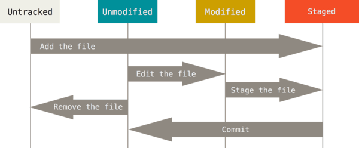

# Git心得

## 目录
1. [Git的文件状态](#git的文件状态)
1. [基本操作](#基本操作)
1. [Conventional Commits（约定式提交）格式](#conventional-commits约定式提交格式)
1. [生成commit message和changelog](#生成commit-message和changelog)
1. [git-flow使用](#git-flow使用)
1. [如何在一台电脑中使用2个（多个）SSH keys](#如何在一台电脑中使用2个多个ssh-keys)
1. [推送到多个远程仓库](#推送到多个远程仓库)
1. [设置gitconfig](#设置gitconfig)
1. [.gitkeep文件](#gitkeep文件)
1. [GitLab CI](#gitlab-ci)
1. [减少Git项目下载大小](#减少git项目下载大小)
1. [找回删除的分支信息](#找回删除的分支信息)
1. [修改`commit`与强推策略（`--amend` / `rebase -i` / `reset` / `--force-with-lease`）](#修改commit与强推策略--amend--rebase--i--reset----force-with-lease)
1. [`husky`+`lint-staged`+`commitlint`+`commitizen`](#huskylint-stagedcommitlintcommitizen)

---
### Git的文件状态
1. `untracked`

    未跟踪，尚未纳入版本控制。
2. 已跟踪

    1. `unmodified`

        未修改。
    2. `modified`

        已修改。
    3. `staged`

        暂存。

    ```text
    unmodified --修改--> modified --git add--> staged --git commit--> unmodified
    staged --git restore --staged--> modified
    modified --git restore--> unmodified
    ```



### 基本操作
>参考：[git-tips](https://github.com/521xueweihan/git-tips)。

1. 查看提交历史（包括 SHA-1 校验值、作者姓名、作者邮箱、提交时间和提交说明）

    ```shell
    git log

    git log --pretty=oneline --graph --decorate --all   # 以单行图形方式展示简化的提交历史

    git log --all --grep='「内容」' # 筛选提交说明中包含「内容」的提交

    git log 「分支1」 ^「分支2」       # 筛选「分支1」中存在、但「分支2」中不存在的提交（可用 HEAD 指代当前分支）

    git log --author="「作者」" --since="2023-01-01" --until="2023-12-31"
    ```
2. 撤销未推送内容

    ```shell
    git restore 「文件或.」                   # 丢弃未暂存修改
    git restore --staged 「文件或.」          # 取消暂存，保留工作区修改

    git reset --soft HEAD~「数量」            # 撤销提交，修改保留在暂存区
    git reset HEAD~「数量」                   # 撤销提交，修改保留在工作区并取消暂存
    git reset --hard HEAD~「数量」            # 撤销提交并丢弃修改，慎用
    ```

    清理未跟踪文件前先预览：

    ```shell
    git clean -nd                              # 预览未跟踪文件
    git clean -ndX                             # 预览被忽略文件
    git clean -fd                              # 删除未跟踪文件和目录
    git clean -fdX                             # 仅删除被忽略文件和目录
    ```
3. 修改已推送的提交历史

    >以下操作会改变`commit hash`。公共分支应优先新增提交或使用`git revert`；确需改写历史时，请先备份分支，并使用`--force-with-lease`。

    ```shell
    git branch backup/「分支名」

    git reset --hard 「目标SHA」               # 将分支回退到目标提交
    # 或
    git rebase -i --root                       # 交互式修改全部提交

    git push --force-with-lease origin HEAD
    ```

    如需在保留历史的前提下撤销已推送的合并提交，应使用`revert`，而非`reset`：

    ```shell
    git revert -m 1 「合并提交SHA」
    git push
    ```
4. 回退

    ```shell
    git revert 「提交SHA」                    # 新建一个反向提交
    git revert -m 1 「合并提交SHA」           # 回退合并提交，通常保留第一个父提交
    git push
    ```

    如需恢复被`revert`撤销的内容，可再次执行`git revert 「上次revert产生的提交SHA」`。
5. 合并

    1. `merge`

        ```shell
        git fetch origin
        git switch 「目标分支」
        git merge 「其他分支」
        git push origin 「目标分支」
        ```

        强制生成合并提交：`git merge --no-ff 「其他分支」`。
    2. `rebase`

        ```shell
        git switch 「当前开发分支」
        git rebase origin/「目标分支」

        # 冲突时：修改文件 -> git add -> 继续或中止
        git rebase --continue
        git rebase --abort
        ```

>合并整个分支使用`merge/rebase`；选取部分提交使用`cherry-pick`；获取部分文件使用`git restore --source`。

6. cherry-pick

    ```shell
    git cherry-pick 「SHA1」 「SHA2」

    # 冲突时：修改文件 -> git add -> 继续或中止
    git cherry-pick --continue
    git cherry-pick --abort
    ```

    从其他分支或提交中获取文件，但不自动提交：

    ```shell
    git restore --source 「分支或SHA」 -- 「文件或目录」
    ```
7. 解决冲突

    编辑冲突文件，删除`<<<<<<<`、`=======`、`>>>>>>>`标记，然后执行：

    ```shell
    git add 「冲突文件」
    git status
    # 再执行 merge/rebase/cherry-pick 对应的 --continue，或 --abort
    ```
8. 更新远程仓库引用

    ```shell
    git fetch --all --prune
    ```
9. branch

    ```shell
    git branch -a                                      # 查看本地和远程跟踪分支
    git switch 「分支名」                              # 切换分支
    git switch -c 「新分支名」                         # 新建并切换
    git switch -c 「新分支名」 --track origin/「远程分支名」

    git push -u origin 「分支名」                      # 首次推送并设置上游
    git branch -d 「分支名」                           # 删除已合并的本地分支
    git branch -D 「分支名」                           # 强制删除本地分支
    git push origin --delete 「分支名」                # 删除远程分支

    git branch -m 「原分支名」 「新分支名」            # 重命名本地分支
    git push -u origin 「新分支名」
    git push origin --delete 「原分支名」
    ```
10. tag

    ```shell
    git tag --list                                     # 列出本地标签
    git tag --list '「模式」'                           # 按模式筛选
    git ls-remote --tags origin                        # 列出远程标签
    git show 「标签名」                                 # 查看标签

    git tag 「标签名」                                  # 基于 HEAD 创建轻量标签
    git tag -a 「标签名」 「SHA」 -m "「说明」"         # 基于指定提交创建附注标签
    git push origin 「标签名」
    git push origin --tags                             # 推送所有本地标签

    git tag -d 「标签名」
    git push origin --delete 「标签名」

    git switch --detach 「标签名」                     # 以分离 HEAD 状态查看标签
    git switch -c 「新分支名」 「标签名」               # 基于标签创建分支
    ```
11. stash

    ```shell
    git stash push -m "「说明」"                       # 储藏已跟踪文件的修改
    git stash push -u -m "「说明」"                    # 同时储藏未跟踪文件
    git stash list
    git stash show -p stash@{「数字」}
    git stash apply stash@{「数字」}                    # 应用但保留储藏；省略名称则使用最新项
    git stash pop stash@{「数字」}                      # 应用并删除储藏；省略名称则使用最新项
    git stash drop stash@{「数字」}
    git stash clear                                    # 清空所有储藏
    ```
12. submodule

    1. 新增子模块

        ```shell
        git submodule add -b 「分支名」 「仓库地址」 「子模块目录」
        git add .gitmodules 「子模块目录」
        git commit
        ```
    2. 拉取、更新子模块

        ```shell
        git submodule update --init --recursive          # 更新到主仓库记录的SHA
        git submodule update --remote --recursive        # 更新到配置分支的最新提交
        ```
    3. 修改并推送子模块

        ```shell
        cd 「子模块目录」
        git switch 「分支名」
        git add . && git commit && git push

        cd 「包含子模块的仓库」
        git add 「子模块目录」
        git commit && git push
        ```
    4. 删除子模块

        ```shell
        git submodule deinit -f 「子模块目录」
        git rm -f 「子模块目录」
        rm -rf .git/modules/「子模块目录」
        git commit
        ```
13. 清空一个分支中的所有commit记录

    ```shell
    git switch --orphan 「新分支名」

    git add -A                       # 将所有文件变更加入暂存区

    git commit -m "「commit内容」"    # 提交

    git branch -D 「原本分支名」       # 删除原分支

    git branch -m 「原本分支名」       # 将当前新分支重命名为原分支名

    git push --force-with-lease origin 「原本分支名」
    ```
14. 使用[git-lfs](https://github.com/git-lfs/git-lfs)管理大文件。
15. 遇到`unable to update local ref`

    可先尝试执行`git fetch --prune`；若仍然失败，请根据报错中的具体引用检查`.git/refs`，或重新克隆仓库。
16. 对比

    ```shell
    git diff 「分支名或tag或commit」 「分支名或tag或commit」 「多个文件或文件夹」
    ```


### [Conventional Commits（约定式提交）格式](https://www.conventionalcommits.org/zh-hans/v1.0.0/)
<details>
<summary></summary>

```text
<type>[optional scope][!]: <description>

[optional body]

[optional footer]
```

<details>
<summary>e.g.</summary>

```text
feat(details): 添加分享功能

给页面添加了分享功能

- 添加分享到微博的功能
- 添加分享到xx的功能
```
</details>

常用`type`：`feat`、`fix`、`docs`、`style`、`refactor`、`perf`、`test`、`build`、`ci`、`chore`、`revert`。

- `scope`：可选，表示影响范围，如`feat(parser): ...`。
- 破坏性变更：在`:`前加`!`，或在 footer 中写`BREAKING CHANGE: ...`。
- 关联 issue：在 footer 中写`Closes #1`。
</details>

### 生成commit message和changelog
<details>
<summary></summary>
1. 安装本地依赖：

    ```shell
    npm install --save-dev commitizen cz-conventional-changelog conventional-changelog-cli
    ```
2. 在`package.json`中配置Commitizen：

    ```json
    {
      "config": {
        "commitizen": {
          "path": "cz-conventional-changelog"
        }
      }
    }
    ```
3. 使用：

    ```shell
    npx cz
    npx conventional-changelog -p angular -i CHANGELOG.md -s
    ```

>生成 changelog 前，提交信息需遵循约定式提交格式。
</details>

### [git-flow](https://github.com/petervanderdoes/gitflow-avh)使用
<details>
<summary></summary>
>适合需要`develop`、`release`、`hotfix`分支的发布流程；简单项目可使用[GitHub flow](https://docs.github.com/zh/get-started/using-github/github-flow)。

1. 初始化

    ```shell
    git flow init -d
    ```

2. 开发新需求

    ```shell
    git flow feature start 「需求名」
    git flow feature publish 「需求名」       # 需要远程协作时

    # 完成开发并提交后
    git flow feature finish 「需求名」
    git push origin develop
    ```
3. 发布版本

    ```shell
    git flow release start 「版本号」
    git flow release publish 「版本号」       # 需要远程协作时

    # 更新版本号和 CHANGELOG 并提交后
    git flow release finish 「版本号」
    git push origin develop 「生产分支」
    git push origin 「版本号」
    ```
4. 修复线上问题

    ```shell
    git flow hotfix start 「版本号」

    # 修复、更新版本号和 CHANGELOG 并提交后
    git flow hotfix finish 「版本号」
    git push origin develop 「生产分支」
    git push origin 「版本号」
    ```

</details>

### 如何在一台电脑中使用2个（多个）SSH keys

>在 GitHub 等网站中，同一个**SSH key**无法同时用于不同账户。

1. 为每个账户生成独立密钥：

    ```shell
    ssh-keygen -t ed25519 -f ~/.ssh/「密钥名」 -C "「邮箱或说明」"
    ```
2. 配置`~/.ssh/config`：

    >文档：[GitHub](https://docs.github.com/zh/authentication/connecting-to-github-with-ssh/managing-deploy-keys#using-multiple-repositories-on-one-server)、[GitLab](https://docs.gitlab.com/ee/user/ssh.html#use-different-accounts-on-a-single-gitlab-instance)。

    ```text
    Host 账户1.github.com             # 自定义别名
        HostName github.com
        User git
        IdentityFile ~/.ssh/「密钥1」
        IdentitiesOnly yes

    Host 账户2.github.com
        HostName github.com
        User git
        IdentityFile ~/.ssh/「密钥2」
        IdentitiesOnly yes

    Host 账户3.xx.mygitlab.com
        HostName xx.mygitlab.com
        User git
        Port 「端口号」                 # 默认22时删除此行
        IdentityFile ~/.ssh/「密钥3」
        IdentitiesOnly yes
    ```

    若 GitHub 的 SSH 22 端口受阻，请将每个 GitHub 别名改为：

    ```text
    Host 账户1.github.com
        HostName ssh.github.com
        User git
        Port 443
        HostKeyAlias github.com
        IdentityFile ~/.ssh/「密钥1」
        IdentitiesOnly yes
    ```

3. 使用别名克隆或修改已有远程地址：

    ```shell
    git clone git@账户1.github.com:账户/仓库.git
    git clone git@账户3.xx.mygitlab.com:账户/仓库.git

    git remote set-url origin git@账户1.github.com:账户/仓库.git
    ```

4. 测试连接：

    ```shell
    ssh -G 账户1.github.com | grep -E '^(hostname|user|port|identityfile)'
    ssh -T git@账户1.github.com
    ssh -T git@账户3.xx.mygitlab.com
    ```

    若提示主机密钥已变更，请先确认服务端确实更换了密钥，再执行：

    ```shell
    ssh-keygen -R xx.mygitlab.com              # 默认22端口
    ssh-keygen -R '[xx.mygitlab.com]:端口号'   # 自定义端口
    ssh -T git@账户3.xx.mygitlab.com
    ```

- 仅当旧服务器明确要求`ssh-rsa`时，在对应`Host`中添加：

    ```text
    Host 旧服务器别名
        HostKeyAlgorithms +ssh-rsa
        PubkeyAcceptedAlgorithms +ssh-rsa
    ```

### 推送到多个远程仓库
>`git remote`的配置保存在`.git/config`的`[remote "别名"]`中，例如：
>
>```text
>[remote "origin"]  # 默认别名：origin
>	url = git@realgeoffrey.github.com:realgeoffrey/knowledge.git    # 一次 push 会推送到所有 URL
>	url = git@realgeoffrey.github.com:realgeoffrey/knowledge2.git
>	url = git@realgeoffrey.github.com:realgeoffrey/knowledge3.git
>	fetch = +refs/heads/*:refs/remotes/origin/*                     # pull/fetch 使用上面的第一个 URL
>
>[remote "别名"]
>	url = git@realgeoffrey.github.com:realgeoffrey/knowledge4.git
>	fetch = +refs/heads/*:refs/remotes/别名/*
>```

0. 查看已配置的远程仓库

    使用`git remote -v`或`git remote --verbose`查看远程仓库。其中，`fetch`表示拉取所用的 Git 远程仓库，以配置中的第一个 URL 为拉取地址；`push`/`url`表示推送目标，一次操作会推送到所有 URL。
1. 新增一个远程仓库别名

    `git remote add 「别名」 「git远程仓库」`

    - 推送时指定远程仓库别名：`git push 「别名」 「任意本地分支名，默认：当前本地分支名」:「任意远程分支名，默认：与前者同名」`
2. 在已有别名下新增一个推送目标（`push`/`url`）

    `git remote set-url --add 「别名」 「git远程仓库」`

    - 单次推送会推送到该别名下所有由`push`/`url`配置的远程仓库。

>如需保持多个仓库同步，建议`在每个仓库中配置向全部远程 URL push，并将 pull 地址设为仓库自身`。任一仓库产生新 commit 后，直接 push 即可将变更同步到所有已配置的远程仓库，从而保持内容一致。

### 设置gitconfig
>使用`git config --global/local/system/worktree/file 「参数」`时，`--global`等作用域选项应放在第三个参数位置，否则无效。写入配置时默认使用`--local`；读取配置时没有默认作用域，必须显式指定。

>以下是较为精简的 Git 配置实践：

1. 用户名和邮箱（用于判断推送者的账号信息）

    >GitHub 不会校验提交中的用户名和邮箱是否与 Git 服务器账户一致，因此理论上可以将任意账户设置为提交者（即伪装成其他用户）。不过，可在账户设置中开启[警戒模式](https://docs.github.com/zh/authentication/managing-commit-signature-verification/displaying-verification-statuses-for-all-of-your-commits)，用于标识该账户的 commit 是`Verified`、`Unverified`还是`Partially verified`。

    1. 全局设置

        ```shell
        git config --global user.email 「邮箱」
        git config --global user.name 「用户名」
        ```
    2. 为具体项目设置

        ```shell
        cd 进入某个git仓库
        git config user.email 「邮箱」
        git config user.name 「用户名」
        ```
2. 全局忽略文件

    1. 添加忽略文件

        ```shell
        git config --global core.excludesfile ~/.gitignoreglobal
        ```
    2. 新建`.gitignoreglobal`文件，并填写需要全局忽略的文件或目录

        ><details>
        ><summary>e.g.</summary>
        >
        >```text
        >.idea
        >.DS_Store
        >```
        ></details>
3. HTTP代理、HTTPS代理

    >`http.proxy`和`https.proxy`仅作用于 HTTP/HTTPS 协议，SSH 连接不使用 HTTP/HTTPS 代理。

    ```text
    git config --global http.proxy 'http://127.0.0.1:7890'  # 或 'socks5://127.0.0.1:7891' # 作用于 HTTP 和 HTTPS 请求（优先级低于 https.proxy）

    git config --global https.proxy 'http://127.0.0.1:7890' # 或 'socks5://127.0.0.1:7891' # 作用于 HTTPS 请求（优先级高于 http.proxy）

    # 去除设置：
    # git config --global --unset http.proxy
    # git config --global --unset https.proxy
    ```
4. http/https请求的凭据（密码）

   >在 Git 中，`credential.helper`（凭据助手）决定系统如何处理 HTTP/HTTPS 账户和密码。

    | 选项名称 | 存储方式 | 存储时长 | 适用场景与特点 |
    |---|---|---|---|
    | 默认 | 不储存 | - | 每次执行`git pull`或`git push`时，终端都会提示手动输入用户名和密码 |
    | cache | 内存 | 默认 15 分钟 | 临时使用。凭据不落盘，适合公用电脑或 VPS。可通过`--timeout`修改时长 |
    | store | 磁盘明文文件 | 永久 | 安全性较低。凭据以明文形式存储在磁盘中，通常位于`~/.git-credentials` |
    | osxkeychain | 系统钥匙串 | 永久 | Mac 用户首选。使用 macOS 加密钥匙串存储，安全且使用方便 |
    | wincred | 凭据管理器 | 永久 | Windows用户首选。集成在系统自带的凭据管理器中，安全性高 |
    | manager (GCM) | 加密存储 | 永久 | 支持跨平台、多因子验证（2FA）和 OAuth，由微软维护 |

    `git config --global credential.helper 「值」 # 设置`
5. 开启对文件名大小写敏感

    >每个 Git 项目默认都会显式配置为不区分文件名大小写，因此需要在各项目中单独开启大小写敏感（项目配置优先于全局配置）。

    ```shell
    git config --global core.ignorecase false   # 全局
    git config core.ignorecase false            # 当前目录
    ```
6. 其他建议设置在全局的配置

    ```shell
    # 推荐：
    git config --global color.ui auto           # Git 自动判断是否在终端输出中使用颜色（默认值为 auto）
    git config --global core.autocrlf input     # 提交时自动将 Windows 的 CRLF 换行符转换为 Unix 风格的 LF，checkout 文件时不做修改
    git config --global rebase.autoStash true   # 存在未 commit 的变更（已暂存或未暂存）和落后的 commit 时，执行`rebase`或`pull --rebase`会自动执行 git stash → `rebase`或`pull --rebase` → git stash pop；若发生冲突，则需手动解决，而不是直接报错并中止
    ```

    - 使用门槛较高，新手慎用

        ```shell
        git config --global pull.rebase true
        # （针对 commit）执行 pull 时，使用 rebase（变基）而非默认的 merge。
        # 注意：若领先的 commit 已解决过冲突，再执行 rebase 可能需要处理更多冲突。VS Code 的同步（Sync）会先执行 pull
        # pull.rebase=true ： git pull  ≈  git fetch + git rebase


        # 可能增加操作复杂度的配置
        git config --global pull.ff only
        # 只允许 fast-forward 合并，否则报错退出。该设置会使 pull.rebase true 失效，因为无法 fast-forward 时会直接退出，不会改用 rebase
        # pull.ff=only：本地没有新增提交（仅落后）-> pull 成功；本地有新增提交（需要 merge/rebase）-> pull 直接失败
        ```

- 查看所有`configs`、`alias`（不是最终值，而是某一层级中的全部值）

    ```shell
    git config --local --list   # 当前目录
    git config --global --list  # 全局（~/.gitconfig）
    ```
- 删除某个设置

    ```shell
    git config --unset 「配置名」
    ```
- 查看某个 key 的最终值

    >配置优先级：`.git/config` > `~/.gitconfig` > `/etc/gitconfig`

    ```shell
    git config 「配置名」   # 最终值

    git config --show-origin 「配置名」   # 最终值 + 来源

    git config --show-origin --get-all 「配置名」   # 所有值 + 来源，根据优先级自行判断

    git config --list --show-origin # 列出所有配置、值及其来源，根据优先级自行判断
    ```

### .gitkeep文件
Git不跟踪空目录。需要保留目录时，在其中添加并提交`.gitkeep`；该文件名只是惯例，没有特殊功能。

### GitLab CI
<details>
<summary></summary>
文档：[GitLab CI/CD快速开始](https://docs.gitlab.com/ci/quick_start/)、[YAML语法](https://docs.gitlab.com/ci/yaml/)。

1. 在`Settings > CI/CD > Runners`中确认存在可用的 Runner。GitLab.com 通常可直接使用托管 Runner。
2. 在仓库根目录创建`.gitlab-ci.yml`。以下以 Node.js 项目为例：

    ```yaml
    stages:
      - test

    test:
      stage: test
      script:
        - npm ci
        - npm test
    ```
3. 提交并推送后，在`Build > Pipelines`中查看结果。可按需使用`rules`控制分支、合并请求或定时任务的执行条件。
</details>

### 减少Git项目下载大小
<details>
<summary></summary>
1. 只检出需要的目录：

    ```shell
    git clone --filter=blob:none --sparse 「仓库地址」 「本地目录」
    cd 「本地目录」

    git sparse-checkout set 「目录1」 「目录2」
    git sparse-checkout add 「目录3」       # 增加目录
    git sparse-checkout list                # 查看当前目录
    git sparse-checkout disable             # 恢复完整工作区
    ```
2. 只克隆最近的提交：

    ```shell
    git clone --depth 「数量」 「仓库地址」
    ```

</details>

### 找回删除的分支信息
>适用场景：某个分支提交过代码，后来本地和远程分支都被删了，现在想找回提交信息。

- 适用于本地和远程 Git 仓库：

    - 删除分支通常只是删除引用，不会立即删除 commit 对象。
    - 只要相关 commit 尚未被`git gc`清理，就仍有机会找回。
    - reflog 是保存在本地且有时效的操作记录，会详细记录 checkout、reset、rebase 等操作；分支删除后可查看 HEAD reflog。
    - 默认情况下，reflog 和不可达对象（悬空commit）都会随时间过期；拖得越久，找回概率越低。

1. 先找 `commit hash`

    1. 先从远程平台找线索

        - 查 PR / MR
        - 查 CI/CD 记录、代码评审通知、邮件、IM 机器人消息、issue 中引用过的 commit hash
        - GitHub / GitLab 的活动流有时会显示“创建分支 / 删除分支 / 推送 commit”等记录，但这取决于平台的保留策略，不能作为稳定方案。
    1. 再从本地找

        >可按以下步骤排查：

        ```shell
        # 1. 先看这些提交是否其实还被其他分支引用着
        git log --all --graph --decorate --oneline --date=iso

        # 2. 查 HEAD reflog 和其他仍存在引用的 reflog
        git reflog --date=iso
        git reflog --date=iso --all | rg '分支名|提交日期|删除日期|提交信息'    # 筛选条件均为可选
        # 常见线索：
        # - checkout: moving from master to feature-xx
        # - commit: xxxxx
        # - branch: Created from ...
        # - branch: deleted refs/heads/feature-xx

        # 3. 找到疑似 commit 后，先确认是否为目标提交（若能正常输出，则说明尚未被 GC）
        git show --stat --summary <commit-hash>

        # 4. 看它是否已被你本地当前可见的分支包含
        git branch --contains <commit-hash> -a

        # 5. 若 reflog 中未找到，再检查未被引用但尚未回收的 commit（悬空 commit）
        git fsck --full --unreachable --no-reflogs
        git fsck --full --unreachable --no-reflogs | rg 'unreachable commit|不可达 commit'
        ```

        ><details>
        ><summary>可达对象、不可达对象、悬空 Commit</summary>
        >
        >1. 可达对象 (Reachable Object)：“安全名单”
        >
        >    只要能通过现有分支（Branch）、标签（Tag）、HEAD 指针或引用日志（reflog）追溯到的 Git 对象，包括提交、文件树和文件内容。
        >
        >    它们是当前仓库正在使用的有效数据，绝对安全，永远不会被 Git 的垃圾回收机制（GC）清理。
        >2. 不可达对象 (Unreachable Object)：“清理候选人”
        >
        >    与可达对象相反。由于引用被删除或重置，已没有任何引用能够关联到这些对象，它们仅存于 Git 对象库中。
        >
        >    这些对象可能被清理。能否找回取决于 reflog 过期策略、`gc.pruneExpire`配置，以及对象是否仍被其他引用持有等因素；因此，间隔时间越长，找回概率越低。
        >3. 悬空 Commit (Dangling Commit)：“不可达对象的具体形态”
        >
        >    它是不可达对象中最常见的一类，特指那些没有任何分支或引用指向它的提交记录（Commit）。
        >
        >    产生原因：通常是执行`git reset --hard`回退历史，或删除尚未合并的分支。
        ></details>
1. 找到 `commit hash`后

    1. 本地恢复

        1. 恢复分支：`git switch -c 「新分支名」 <commit-hash>`
        1. 恢复提交：`git cherry-pick <commit-hash>`
    1. 尝试远程直接访问：`「网站前置路径」/commit/「commit-hash」`

        这种方式也不一定可行：只有远程服务器上仍存在该 commit 对象，且当前用户拥有访问权限时，页面才能打开。

### 修改`commit`与强推策略（`--amend` / `rebase -i` / `reset` / `--force-with-lease`）

>以下操作都会重写提交历史，被重写的`commit hash`会改变；若相关提交已`push`，按“推荐策略”处理。操作前可先建临时备份：`git branch backup/「分支名」`。

1. 修正最近一次`commit`：使用`git commit --amend`。适合补交遗漏文件、追加少量修改、修改`commit message`，或在 PR 前将小幅修改并入同一个`commit`。

    ```shell
    git add 「遗漏或修改的文件」

    git commit --amend              # 合并暂存区内容，并打开编辑器修改commit message
        # --no-edit                 # 合并暂存区内容，沿用原commit message
        # -m "「新的commit message」"  # 合并暂存区内容，并直接写入新的commit message
    ```
1. 修改多个`commit`

    1. 精细修改多个`commit`：优先使用交互式`rebase -i`整理历史。它可以逐个修改提交说明、合并或删除提交，也可以停在某次提交上修改内容；需要保留多个提交的独立边界时，应优先使用。

        ```shell
        git rebase -i HEAD~「数量」      # 修改最近N个commit

        # reword：只修改commit message
        # edit：停在指定commit，修改文件 -> git add -> git commit --amend -> git rebase --continue
        # squash / fixup：把当前commit合并进上一个commit
        # drop：删除该commit

        git rebase --abort             # 放弃本次rebase
        git rebase --continue          # 解决冲突或完成edit后继续
        ```
    1. 快速撤销多个`commit`并重新提交：可使用`reset`（配合`--soft`或默认的`--mixed`）。它会撤销最近 N 个提交并保留修改，适合将多个提交重新压缩为一个新提交；这种方式不会保留原有的提交边界。

        ```shell
        git reset HEAD~「数量」 # 默认--mixed：撤销最近 N 个 commit，修改保留在工作区，并取消暂存
            # --soft         # 撤销最近 N 个 commit；不改工作区，被撤销 commit 的变化保留在暂存区
        ```

- 推荐策略：

    1. 尚未`push`：可用`--amend`（仅最近一次）、`rebase -i`（精细整理多次）或`reset`（撤销多次后重新提交）整理历史；完成后普通`git push`即可，不需要`-f`（无条件覆盖远程分支）或`--force-with-lease`（仅在远程分支未被他人推进时允许覆盖）。
    2. 已`push`但确认无人基于这些提交继续开发：可整理历史后（上面的方式）用`git push --force-with-lease`更新远程。
    3. 已`push`且属于公共分支，或不确定是否有人依赖：不要重写历史后强推；优先新增`commit`解决问题，必要时用`git revert`回退错误提交。

    ><details>
    ><summary>强推前检查差异（辅助判断是否应该强推）</summary>
    >
    >```shell
    >git fetch origin
    >git log --oneline --left-right --graph HEAD...@{u}
    ># 输出：
    >  # 只有 < ：本地领先，上游没有新提交
    >  # 只有 > ：本地落后
    >  # 同时有 < 和 > ：本地和上游已经分叉
    >  # 没有输出：本地和上游一致
    >
    ># 看到 > 时，先判断它是准备被替换的旧提交，还是他人新增的提交；若包含他人新增提交，不要直接强推。
    ># 该命令只能辅助查看差异；最终能否推送，还取决于远程是否再次更新、分支是否受保护、当前账号是否有权限。
    >
    ># 更严格：改写历史前先记录上游当前hash，推送时显式指定lease。
    >git rev-parse @{u}     # 假设输出 abc123
    >git push --force-with-lease=refs/heads/「分支名」:abc123
    >```
    ></details>

>`--force-with-lease`仍然是强推，但会先检查远程分支是否还停在指定位置或本地记录的位置；若远程已变更，它会拒绝覆盖。`-f` / `--force`没有这层保护，可能把他人的提交从远程分支历史中移走，导致对方本地分支与远程分叉，需要重新`fetch`、`rebase`、`cherry-pick`，或从`reflog`找回。

### `husky`+`lint-staged`+`commitlint`+`commitizen`
1. 使用[husky](https://github.com/typicode/husky)配置[Git hooks](https://git-scm.com/book/zh/v2/自定义-Git-Git-钩子)。

    >或[simple-git-hooks](https://github.com/toplenboren/simple-git-hooks)替代。

    可配置`pre-commit`（如执行`lint-staged`）、`commit-msg`（如执行`commitlint`）等钩子。
2. 使用[lint-staged](https://github.com/okonet/lint-staged)对 Git 暂存区中的文件执行 lint 任务（如 ESLint、Prettier 等）。

    多个任务中只要有一个失败（FAILED），其他任务便会终止（KILLED），并且仅输出失败任务的错误信息。
3. `commitlint`（校验提交信息）与`commitizen`（辅助填写提交信息）共用同一份规则配置：

    ```shell
    # 安装并配置 commitlint
    npm i -g @commitlint/cli @commitlint/config-conventional

    echo "module.exports = {extends: ['@commitlint/config-conventional']};" > ~/.commitlintrc.js


    # 安装并配置 commitizen
    npm i -g commitizen @commitlint/cz-commitlint

    echo '{ "path": "@commitlint/cz-commitlint" }' > ~/.czrc
    ```

组合使用后，可在 Git hooks 执行期间对暂存区文件运行 lint 任务（如 ESLint、Prettier 等），校验 Git commit，并通过命令辅助生成提交信息。

>如需跳过 Git hooks，可在大多数相关 Git 命令后添加`--no-verify`。
