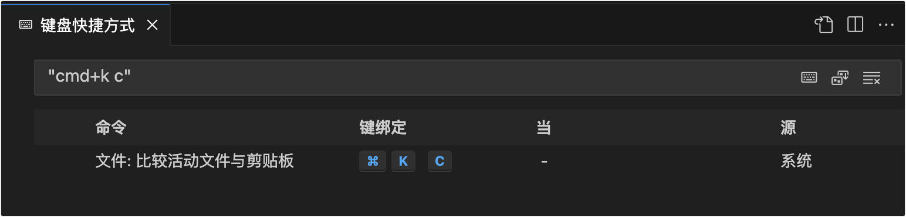
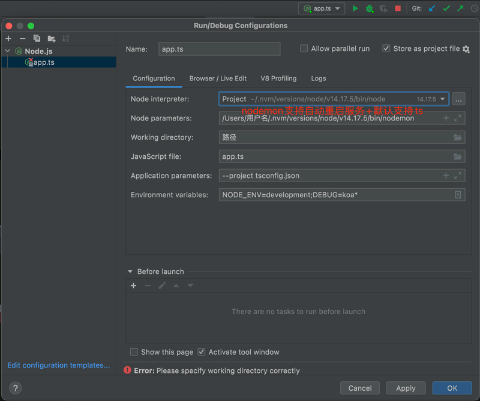

# IDEs' Setting

### Cursor
>继承Visual Studio Code。

1. [settings-cursor.json](./settings-cursor.json)
2. [keybindings-cursor.json](./keybindings-cursor.json)

### Visual Studio Code
1. [settings.json](./settings.json)
2. [keybindings.json](./keybindings.json)

    - 

### WebStorm
1. 在线同步设备可以用：

    ><https://www.jetbrains.com/help/idea/sharing-your-ide-settings.html>。

    1. [Settings Sync](https://plugins.jetbrains.com/plugin/20868-settings-sync) JetBrains账号间同步（2022.3+默认这个）。
    2. 或 手动导出导入配置（如：我的[settings.zip](./settings.zip)）。
    3. 或 [~~Settings Repository (Deprecated)~~](https://plugins.jetbrains.com/plugin/7566-settings-repository-deprecated-)设置外部同步仓库（如：我的[JetBrainsSettingsRepository](https://github.com/realgeoffrey/JetBrainsSettingsRepository)）。

<details>
<summary></summary>

2. **Help -> Edit Custom VM Options** can change the memories for the IDE.

>~~IDE has its own language plugins. or using 3rd part pack: Chinese Language Pack：please go to [jetbrains-in-chinese](https://github.com/pingfangx/jetbrains-in-chinese) (or [WebStorm-Chinese](https://github.com/ewen0930/WebStorm-Chinese), [PhpStorm-Chinese](https://github.com/ewen0930/PhpStorm-Chinese), or [PyCharm-Chinese](https://github.com/ewen0930/PyCharm-Chinese)).~~

3. （Windows）Terminal的vi乱码解决办法：

    在Git安装目录下的etc目录下的bash.bashrc文件（如：`C:\Program Files\Git\etc\bash.bashrc`），最后一行添加：

    ```text
    export LANG="zh_CN.UTF-8"
    export LC_ALL="zh_CN.UTF-8"
    ```
4. IDE错误（如：无法搜索文件等）的解决办法：

    点击File,选择Invalidate Caches/Restart...

- <details>

    <summary>IDE针对Node.js调试（支持：TypeScript+自动重启）</summary>

    

    ```xml
    <component name="ProjectRunConfigurationManager">
      <configuration default="false" name="app.ts" type="NodeJSConfigurationType" application-parameters="--project tsconfig.json" nameIsGenerated="true" node-parameters="$USER_HOME$/.nvm/versions/node/v14.17.5/bin/nodemon" path-to-js-file="app.ts" working-dir="$PROJECT_DIR$">
        <envs>
          <env name="NODE_ENV" value="development" />
          <env name="DEBUG" value="koa*" />
        </envs>
        <method v="2" />
      </configuration>
    </component>
    ```
    </details>
</details>
