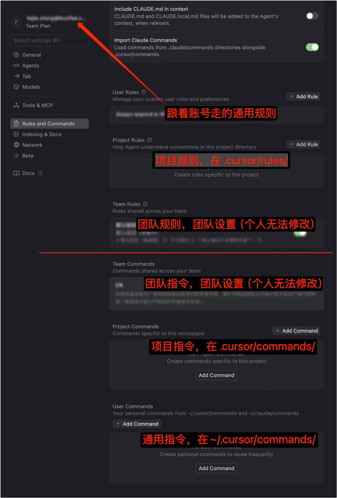

# IDEs' Setting

## TOC

1. [Cursor](#cursor)
1. [Visual Studio Code](#visual-studio-code)
1. [WebStorm](#webStorm)

---

### Cursor
>继承Visual Studio Code。

1. [settings-cursor.json](./settings-cursor.json)
2. [keybindings-cursor.json](./keybindings-cursor.json)

- rules规则、commands指令，都只作用于agents聊天（各种mode），不会作用于Tab补全或其他AI生成或IDE功能的地方。

    1. 规则<https://cursor.com/cn/docs/context/rules>

        1. 规则的描述（.mdc）带着元数据（`description`、`globs`、`alwaysApply`），能设置何时自动启用；也可以手动@某个规则启用。
        1. 大型语言模型在不同补全之间不会保留记忆。规则在提示级别提供 持久、可重用的上下文。应用后，规则内容会被加入到模型上下文的开头。这为AI在生成代码、理解编辑或协助处理工作流时提供一致的指导、开发规范、约束。
    1. 指令

        必须手动输入`/`触发，用来执行特定的任务流（如写测试、重构代码）。快速调用常用的 Prompt 模板。

    ><details>
    ><summary>配置规则、指令</summary>
    >
    >
    ></details>
- Agent Skills
- hook
- subagents
- 模型上下文协议（MCP）
- AGENTS.md

| cursor支持功能 | 自动生效 | 可手动调用 | 核心角色 |
| --------- | ----- | ------- | ------ |
| AGENTS.md | 是（隐式全局加载） | 否 | **描述整个项目大纲**，作为AI的README，`.cursor/rules`的简化替代<br>放高层策略、优先级和全局限制；不要放实现细节或敏感数据 |
| Rules     | 是（隐式加载） | 是（可`@`引用） | **具体行为规则与约束**（安全、合规、格式等）<br>将规则拆成小模块，按优先级编号；支持被 Skill/Command 引用 |
| Skills    | 是（隐式加载，根据上下文按需加载） | 是（可`/`引用） | **SOP**封装、标准化（描述、指令、工具定义）<br>规定审查标准和输出格式，按需加载资源成为上下文 |
| Commands  | 否 | 是（`/`触发） | **快捷入口**：手动触发入口，封装执行其他功能 |
| Hooks     | 是（事件触发） | 否 | **生命周期自动化**：在特定事件时执行操作 |
| Subagents | 否（由主Agent委派启动） | 否 | **专项分工**：上下文隔离、并行处理、领域专业化 |
| MCP       | 否（由AI调用） | 否 | **外部能力扩展**：打破沙箱限制，允许 Cursor 读写数据库、操作浏览器、访问本地文件系统以外的资源 |

### Visual Studio Code
1. [settings.json](./settings.json)
2. [keybindings.json](./keybindings.json)

    - 

    - IDE读取[jsconfig.json和tsconfig.json](https://www.typescriptlang.org/zh/tsconfig/)进行[JS语言服务](https://github.com/microsoft/TypeScript/wiki/JavaScript-Language-Service-in-Visual-Studio)。

### WebStorm
1. 在线同步设备可以用：

    ><https://www.jetbrains.com/help/idea/sharing-your-ide-settings.html>。

    1. [Settings Sync](https://plugins.jetbrains.com/plugin/20868-settings-sync) JetBrains账号间同步（2022.3+默认这个）。
    2. 或 手动导出导入配置（如：我的[settings.zip](./settings.zip)）。
    3. 或 [~~Settings Repository (Deprecated)~~](https://plugins.jetbrains.com/plugin/7566-settings-repository-deprecated-)设置外部同步仓库（如：我的[JetBrainsSettingsRepository](https://github.com/realgeoffrey/JetBrainsSettingsRepository)）。

<details>
<summary></summary>

2. **Help -> Edit Custom VM Options** can change the memories for the IDE.

>~~IDE has its own language plugins. or using 3rd part pack: Chinese Language Pack：please go to [jetbrains-in-chinese](https://github.com/pingfangx/jetbrains-in-chinese) (or [WebStorm-Chinese](https://github.com/ewen0930/WebStorm-Chinese), [PhpStorm-Chinese](https://github.com/ewen0930/PhpStorm-Chinese), or [PyCharm-Chinese](https://github.com/ewen0930/PyCharm-Chinese)).~~

3. （Windows）Terminal的vi乱码解决办法：

    在Git安装目录下的etc目录下的bash.bashrc文件（如：`C:\Program Files\Git\etc\bash.bashrc`），最后一行添加：

    ```text
    export LANG="zh_CN.UTF-8"
    export LC_ALL="zh_CN.UTF-8"
    ```
4. IDE错误（如：无法搜索文件等）的解决办法：

    点击File,选择Invalidate Caches/Restart...

- <details>

    <summary>IDE针对Node.js调试（支持：TypeScript+自动重启）</summary>

    

    ```xml
    <component name="ProjectRunConfigurationManager">
      <configuration default="false" name="app.ts" type="NodeJSConfigurationType" application-parameters="--project tsconfig.json" nameIsGenerated="true" node-parameters="$USER_HOME$/.nvm/versions/node/v14.17.5/bin/nodemon" path-to-js-file="app.ts" working-dir="$PROJECT_DIR$">
        <envs>
          <env name="NODE_ENV" value="development" />
          <env name="DEBUG" value="koa*" />
        </envs>
        <method v="2" />
      </configuration>
    </component>
    ```
    </details>
</details>
