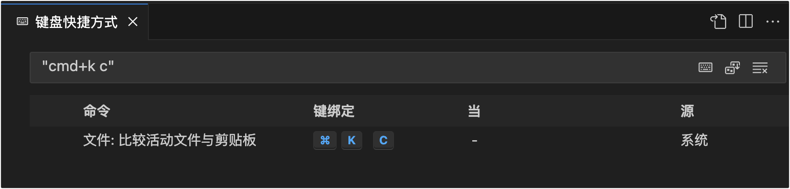
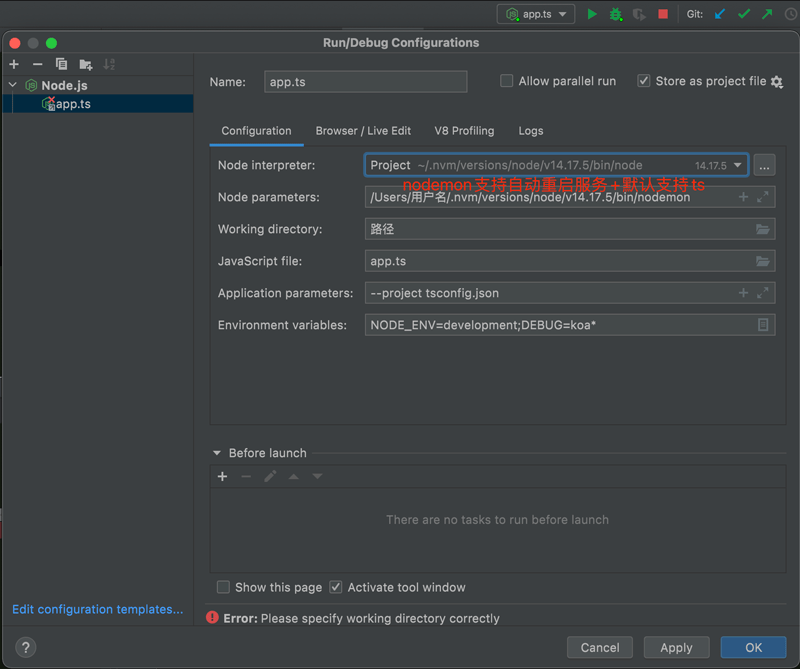

# IDEs' Setting

## TOC

1. [Cursor](#cursor)
1. [Visual Studio Code](#visual-studio-code)
1. [WebStorm](#webStorm)

---

### Cursor
>继承Visual Studio Code。

1. [settings-cursor.json](./settings-cursor.json)
2. [keybindings-cursor.json](./keybindings-cursor.json)

3. AI配置相关

    1. rules规则、commands指令

        1. 规则<https://cursor.com/cn/docs/context/rules>

            1. 规则的描述（.mdc）带着元数据（`description`、`globs`、`alwaysApply`），能设置何时自动启用；也可以手动@某个规则启用。
            1. 大型语言模型在不同补全之间不会保留记忆。规则在提示级别提供 持久、可重用的上下文。应用后，规则内容会被加入到模型上下文的开头。这为AI在生成代码、理解编辑或协助处理工作流时提供一致的指导、开发规范、约束。
        1. 指令

            必须手动输入`/`触发，用来执行特定的任务流（如写测试、重构代码）。快速调用常用的 Prompt 模板。

        - 可配置 项目级`.cursor/rules或commands/`、用户级`~/.cursor/commands/`（用户级规则设置在ide中；`~/.cursor/rules/`放的规则会作为每个项目的规则）、团队级 的规则、指令

    ><details>
    ><summary>rules、commands、skills、hooks、subagents、MCP等 都只作用于agents聊天（各种mode），不会作用于Tab补全或其他AI功能</summary>
    >核心原因是延迟（Latency）。如：Tab补全，需要伴随你的每一次击键实时响应，要求极高的响应速度。如果你每敲一个字母都要等 GPT-4 思考一秒钟，编码体验将是灾难性的。因此，Cursor 专门设计了这个模型，让其在处理极其庞大的代码上下文时，只需生成很少的 Token（预测你的下一步代码），从而实现毫秒级的极速响应。
    ></details>

    2. Agent Skills

        项目级配置`.agents/skills/` `.cursor/skills/` `.claude/skills/` `.codex/skills/`、用户级配置`~/.agents/skills/` `~/.cursor/skills/` `~/.claude/skills/` `~/.codex/skills/`
    3. hook

        项目级配置`.cursor/hooks.json`（被配置使用的具体hook脚本`.cursor/hooks/脚本`），用户级配置`~/.cursor/hooks.json`（被配置使用的具体hook脚本`~/.cursor/hooks/脚本`）
    4. subagents

        项目级配置：`.cursor/agents/` `.claude/agents/` `.codex/agents/`，用户级配置`~/.cursor/agents/` `~/.claude/agents/` `~/.codex/agents/`

    >若关闭了「Include third-party Plugins, Skills, and other configs. Automatically import agent configs from other tools」，则不会加载其他AI的配置，如`.claude/`、`.codex/`等（`.agents/`无论如何都会加载）

    5. MCP（模型上下文协议）

        项目级配置`.cursor/mcp.json`，用户级配置`~/.cursor/mcp.json`
    6. AGENTS.md

    | cursor支持功能 | 自动生效 | 可手动调用 | 核心角色 |
    | --------- | ----- | ------- | ------ |
    | AGENTS.md    | 是（隐式全局加载） | 否 | **描述整个项目大纲**，作为AI的README，`.cursor/rules`的简化替代<br>放高层策略、优先级和全局限制；不要放实现细节或敏感数据 |
    | Rules(*.mdc) | 是（隐式加载） | 是（可`@`引用） | **具体行为规则与约束**（安全、合规、格式等）<br>将规则拆成小模块，按优先级编号；支持被 Skill/Command 引用 |
    | Skills       | 是（隐式加载，根据上下文按需加载） | 是（可`/`引用） | **SOP**封装、标准化（描述、指令、工具定义）<br>规定审查标准和输出格式，按需加载资源成为上下文 |
    | Commands     | 否 | 是（用`/`触发） | **快捷入口**：手动触发入口，封装执行其他功能 |
    | Hooks        | 是（事件触发） | 否 | **生命周期自动化**：在特定事件时执行操作 |
    | Subagents    | （由主Agent委派启动） | 否 | **专项分工**：上下文隔离、并行处理、领域专业化 |
    | MCP          | （由AI调用） | 否 | **外部能力扩展**：打破沙箱限制，允许 Cursor 读写数据库、操作浏览器、访问本地文件系统以外的资源<br>用（隐性/显性）指令提示AI执行相关MCP指令解决问题 |

    7. plugins：将 [rules、commands、skills、hooks、subagents、MCP](https://cursor.com/cn/docs/reference/plugins) 打包成可分发的包，配置都跟着插件安装路径（项目级或用户级），而不是各个功能路径。也支持用户级私有plugins（不需要发布公开的github，仅把某plugin文件夹复制到`~/.cursor/plugins/local/某plugin`即可）

    >与claude code的扩展基本一致：<https://code.claude.com/docs/zh-CN/features-overview>

    >各个AI工具都会在`~/`放置自己的全局AI配置，并且可能读取其他AI工具的配置路径，如：`.agents`、`.claude`、`.codex`、`.copilot`、`.cursor`、`.qoder`

### Visual Studio Code
1. [settings-vscode.json](./settings-vscode.json)
2. [keybindings-vscode.json](./keybindings-vscode.json)

    - 

    - IDE读取[jsconfig.json和tsconfig.json](https://www.typescriptlang.org/zh/tsconfig/)进行[JS语言服务](https://github.com/microsoft/TypeScript/wiki/JavaScript-Language-Service-in-Visual-Studio)。

        `jsconfig.json`/`tsconfig.json`里的`baseUrl`/`paths`等不影响代码“执行”，它只影响IDE（+ TypeScript）编译阶段的“路径解析”，👉 运行时（Node / 浏览器）默认完全不认识这些 alias，需要再通过构建工具（Vite、webpack等）或运行时插件才能使代码指向正确路径。
3. 运行和调试

    <details>
    <summary>支持 当前文件（浏览器的.html、.js，Node.js的.js等）、webpack或vite运行的框架项目（vue.js、React）、Node.js框架项目</summary>

    1. launch模式（每次都启动一个全新的、纯净的 Chrome 实例）

        1. 当前文件：直接运行，不能配置launch.json（没找到如何配置）
        2. webpack或vite运行的项目（vue.js、React）

            ```jsonc
            {
              "version": "0.2.0",
              "configurations": [
                {
                  "type": "chrome",
                  "request": "launch",
                  "name": "针对 localhost 启动 Chrome",
                  "url": "http://localhost:3000", // 本地项目启动的端口
                  "webRoot": "${workspaceFolder}"
                  // "webRoot": "${workspaceFolder}/create-vue3"
                }
              ]
            }
            ```
    1. Node.js的不依赖浏览器调试服务

        ```json
        {
          "version": "0.2.0",
          "configurations": [
            {
              "type": "node",
              "request": "launch",
              "name": "Egg Debug",
              "runtimeExecutable": "npm",
              "runtimeArgs": [
                "run",
                "dev",
                "--",
                "--inspect-brk"
              ],
              "cwd": "${workspaceFolder}/egg",
              "console": "integratedTerminal",
              "restart": true,
              "autoAttachChildProcesses": true
            }
          ]
        }
        ```
    </details>

### WebStorm
1. 在线同步设备可以用：

    ><https://www.jetbrains.com/help/idea/sharing-your-ide-settings.html>。

    1. [Settings Sync](https://plugins.jetbrains.com/plugin/20868-settings-sync) JetBrains账号间同步（2022.3+默认这个）。
    2. 或 手动导出导入配置（如：我的[settings.zip](./settings.zip)）。
    3. 或 [~~Settings Repository (Deprecated)~~](https://plugins.jetbrains.com/plugin/7566-settings-repository-deprecated-)设置外部同步仓库（如：我的[JetBrainsSettingsRepository](https://github.com/realgeoffrey/JetBrainsSettingsRepository)）。

<details>
<summary></summary>

2. **Help -> Edit Custom VM Options** can change the memories for the IDE.

>~~IDE has its own language plugins. or using 3rd part pack: Chinese Language Pack：please go to [jetbrains-in-chinese](https://github.com/pingfangx/jetbrains-in-chinese) (or [WebStorm-Chinese](https://github.com/ewen0930/WebStorm-Chinese), [PhpStorm-Chinese](https://github.com/ewen0930/PhpStorm-Chinese), or [PyCharm-Chinese](https://github.com/ewen0930/PyCharm-Chinese)).~~

3. （Windows）Terminal的vi乱码解决办法：

    在Git安装目录下的etc目录下的bash.bashrc文件（如：`C:\Program Files\Git\etc\bash.bashrc`），最后一行添加：

    ```text
    export LANG="zh_CN.UTF-8"
    export LC_ALL="zh_CN.UTF-8"
    ```
4. IDE错误（如：无法搜索文件等）的解决办法：

    点击File,选择Invalidate Caches/Restart...

- <details>

    <summary>IDE针对Node.js调试（支持：TypeScript+自动重启）</summary>

    

    ```xml
    <component name="ProjectRunConfigurationManager">
      <configuration default="false" name="app.ts" type="NodeJSConfigurationType" application-parameters="--project tsconfig.json" nameIsGenerated="true" node-parameters="$USER_HOME$/.nvm/versions/node/v14.17.5/bin/nodemon" path-to-js-file="app.ts" working-dir="$PROJECT_DIR$">
        <envs>
          <env name="NODE_ENV" value="development" />
          <env name="DEBUG" value="koa*" />
        </envs>
        <method v="2" />
      </configuration>
    </component>
    ```
    </details>
</details>
