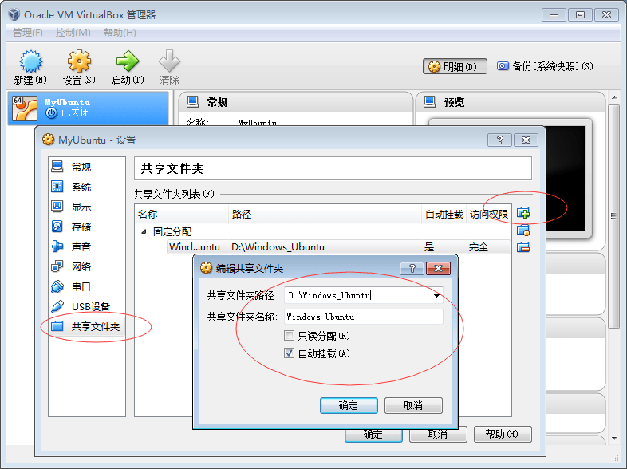

#Laravel框架配置+LNMP环境配置（Ubuntu15.04）

1. 安装**Ubuntu Desktop**或**Ubuntu Server**
	>安装完毕之后可以删除ios虚拟光盘
	
2. 安装LNMP环境
	1. 安装**php5-fpm**，并安装**php5-mcrypt**和**php5-curl**和**php5-cli**和**php5-gd**扩展：
		`sudo apt-get install php5-fpm php5-mcrypt php5-curl php5-cli php5-gd`
		
		开启php5enmod mcrypt： 
		`sudo php5enmod mcrypt`
		>如果升级了php5导致产生“permission denied”错误，打开 */etc/php5/fpm/pool.d/www.conf* 更改第44行开始，把“；”去除，打开listen.owner和listen.group
		
	2. 安装**mysql-server**、**php5-mysql**：
		>desktop还可以安装：**mysql-client**、**mysql-workbench**
		
		`sudo apt-get install mysql-server php5-mysql`
		
	3. 安装**nginx**：
		`sudo apt-get install nginx`
	
3. 卸载apache扩展
	`sudo apt-get autoremove apache2
	sudo apt-get autoremove apache`
	
4. 修改项目权限
	把自己的帐号加入www-data组(ubuntu的linux所在组)中:
	`sudo usermod -a -G www-data “用户名”`
	
	更改项目文件夹的所有权，把组设置为www-data所有：
	`sudo chown -R “用户名”:www-data “项目目录”`
	
	更改项目文件夹的权限（r=4 w=2 x=1 所有者、组、其他）：
	`sudo chmod -R 775 “项目目录”`
	
5. 
    >下载php框架Laravel（<http://laravel.com/>）并安装
	>   将下载的安装文件移动至 */usr/local/bin* ：
	>   `sudo mv “laravel地址” /usr/local/bin
	>   cd /usr/local/bin
	>   sudo laravel new mylaravel.com`

	>>  若无法安装，检查LNMP环境是否安装、apache是否删除、php5扩展是否安装和开启
	
	>   安装完成，移动文件夹至 *www文件夹* 中：
	>   `sudo mv /home/kyo/mylaravel.com /opt/www`
	
	>>  可以再设置文件夹的所有者和权限
	
	>   要注意把下载下来的文档中app/storage/下的文件设置权限为组www-data可修改和访问，否则会有权限问题。每一次对app/storage下文件或者文件夹进行修改（一般是新建），都要把内容修改所在组为www-data，这样才可以用浏览器访问得到storage下的文件，并且把权限改为775：
	>   `sudo chown –R “用户名”:www-data “地址前缀”/app/storage
	>   sudo chmod –R 775 “地址前缀”/app/storage`
	
6. 在服务器nginx配置虚拟主机：
	`sudo gedit /etc/nginx/sites-enabled/default`
	
	>在文件开头加入虚拟主机地址(以下代码很容易造成服务器各种坑，强烈建议把以下代码复制进txt文档中编辑过再复制出，因为编码问题很可能导致服务器配置无法识别以下代码)：
	
	```
	server{
		listen 80;
		server_name mylaravel.com;
		root /opt/www/mylaravel.com/public;
		index index.php index.html index.htm;
		location / {
			try_files $uri $uri/ /index.php?$query_string;
		}
		location ~ \.php$ {
			try_files $uri =404;
			fastcgi_split_path_info ^(.+\.php)(/.+)$;
			fastcgi_pass unix:/var/run/php5-fpm.sock;
			fastcgi_index index.php;
			include fastcgi_params;
			#include snippets/fastcgi-php.conf;
		}
	}
	```
	
	若要换端口，仅需修改虚拟机配置的端口号（listen 端口号）
	
	删除备份文件default~(有修改的话都需要删除备份文件)：
	`sudo rm /etc/nginx/sites-enabled/default~`
	
	删除了备份文件，就可以执行重启nginx（若没有删除就无法重启，只能先stop再start）：
	`sudo service nginx restart`
	
	配置dns域名解析：
	`sudo vi /etc/hosts`
	
	加入解析域名：
	`127.0.0.1	mylaravel.com`
	
	有问题可以查看nginx错误日志 */var/log/nginx* ，或查看laravel错误日志 *mylaravel.com/app/storage/logs/laravel.log*
	
7. 
    >用apache2配置虚拟主机
	>   配置虚拟机文件：打开目录 */etc/apache2/sites-available/* ，新建虚拟主机配置文件：命名为域名.conf（如abc.com.conf或192.168.20.111..conf），添加内容：
	>   ```
	>   <VirtualHost *:8080>
	>       DocumentRoot /home/kyo/www/abc	#文件路径
	>       ServerName abc.com	#域名(或192.168.20.111)
	>       ErrorLog	/home/www/abc/app/storage/logs/apache.log	#错误log
	>       CustomLog	/home/www/abc/app/storage/logs/access.log combined	#用户log
	>       <Directory /home/kyo/VirtualXP/htdocs/>
	>           AllowOverride All	#为了伪静态与可能发生的权限问题
	>       </Directory> 
	>   </VirtualHost>
	>   ```
	
	>   激活虚拟主机配置：
	>   `sudo a2ensite abc.com	或sudo a2ensite 192.168.20.111`
	
	>>  注销虚拟主机配置：`sudo a2dissite abc.com`
	
	>   重启Apache服务器：
	>   `sudo service apache2 restart`
	
	>   激活rewrite模块，才能使用.htaccess伪静态技术：
	>   `sudo a2enmod rewrite`
	
	>   若要换端口，①需要修改虚拟机配置的端口号，②在 */etc/apache2/ports.conf* 中修改默认端口号，或额外添加一个Listen 端口号（这样可以达到用一个服务器配置不同端口号）
	
8. 修改服务器上传文件大小
	1. 修改php上传文件大小限制
		查找php配置文件路径，在终端输入：
		`php5-fpm -i|grep php.ini`
		
		根据找到的路径打开php.ini，修改 upload_max_filesize 为100M、修改 post_max_size 为150M，重启php：
		`sudo service php5-fpm restart`
		
	2. 修改nginx上传文件大小限制
		修改nginx配置文件，在虚拟主机配置文件 */etc/nginx/sites-enabled/default* 或者全局配置文件 */etc/nginx/nginx.conf* 内增加：
		`client_max_body_size 150m;`
	
9. 服务器开启gzip压缩（在apache或nginx里设置）
	在配置文件中，加入：
	```
	gzip on;//开启Gzip
	gzip_min_length 1k;//不压缩临界值
	gzip_buffers 4 16k;//缓存
	gzip_comp_level 2;//压缩级别1~10
	gzip_types text/html application/x-javascript text/css application/xml  text/javascript;//压缩文件类型
	gzip_disable "MSIE [1-6]\.";//ie对Gzip不友好支持，禁止对ie压缩
	```
	
10. 安装软件
	1. 安装**openssh-server**
		`sudo apt-get install openssh-server`
		用于被远程连接，windows安装xshell程序可以远程连接安装了openssh-server的主机。
		
	2. 
	    >desktop版设置共享文件夹（安装完毕之后可以删除安装盘和增强功能安装包）
		>   1. 虚拟机为linux（desktop）：
		>	    虚拟机运行期间，在虚拟机窗口选择“设备”->“安装增强设备”，成功执行之后，关闭虚拟机，在虚拟机设置共享文件夹：

		>	    

		>	    再次运行虚拟机，终端执行： 
		>   	`mkdir “文件夹路径”
		>	    sudo mount -t vboxsf “虚拟机设置的文件夹名称” “文件夹路径”`
			
		>	    把挂载共享文件夹写入开机启动中：
		>	    `sudo vim /etc/rc.local`
			
		>   	在“exit 0”之前添加：
		>	    `mount -t vboxsf “虚拟机设置的文件夹名称” “文件夹路径”`
			
		>   2. 虚拟机为windows xp：
		>	    在“软件中心”安装Virtual Box，配置安装xp镜像iso。
		>	    安装“增强功能”（虚拟机中双击我的电脑中virtul box图标或者在视窗下选择“设备”->“安装增强功能”）；安装完毕后在视窗下选择“设备”->“共享文件夹”，分配好共享路径（勾选“自动挂载”）；最后在虚拟机中映射路径 (注意文件名不要有空格号)。
			
		>   3. 虚拟机为linux(server)暂无好的解决办法
		
	3. 
	    >安装less编辑器
		>   `sudo apt-get install node-less`
		
		>>  转换less为css：
		>>  `lessc 地址file.less > 地址file.css`
		
	4. 安装shadowsocks客户端
		下载linux版本shadowsocks-go版本并解压：
		<http://shadowsocks.org/en/download/clients.html>
		
		右键选择shadowsocks属性，在“权限”选项卡选中“允许作为程序执行文件”，运行客户端：
		`sudo 路径/shadowsocks -k="密钥" -l=本地端口 -m="aes-256-cfb加密方式" -p=服务器端口 -s="服务器地址"`
		
		可以把以上代码（删除sudo）写入 */etc/rc.local* 中开机启动。
		安装并配置chrome插件switchysharp :socks V5 127.0.0.1 本地端口号。
		
	5. 安装webstorm/phpstorm
		先安装JDK：可以下载安装，也可以在“软件中心”输入JDK，点击“显示不常用项”，安装完毕后安装下载linux版本webstorm/phpstorm，解压出软件，根据安装文档打开bin路径，然后执行./的sh脚本文件。
		
	6. 安装rapid svn 
		图形界面：
		在“软件中心”搜索并下载rapid svn，选择checkout（签出），url填写局域网http地址，目标目录填写本地存放地址。
		增加：文件右键->Add
		删除：文件右键->删除
		提交：文件或总的文件夹选择commit
		Server：
		`sudo apt-get intall subversion`
		
	7. 安装meld diff
		在“软件中心”搜索安装meld diff，并在rapid svn中配置此软件：svn->查看->首选项->程序选项卡 “diff tool”填入①meld ②%1 %2。
		
	8. 安装服务器搜索工具xunsearch
		xunsearch官网（<http://www.xunsearch.com/>）下载，并解压出文件夹，打开文件夹，运行脚本即可完成安装。
		`cd 文件夹
		sh setup.sh`
		>若安装失败，查看setup.log纠错后再执行脚本一遍
		
		安装运行完成后（可以删除下载的安装文件夹），执行：
		`sudo 安装目录/xunsearch/bin/xs-ctl.sh restart`
		
		放置到系统启动自动运行文件 */etc/rc.local* 内（在exit 0之前）：
		`路径/xunsearch/bin/xs-ctl.sh restart`
		
	9. 安装groovy语言`
sudo apt-get install groovy`
		
	10. 设置vpn
		“系统设置”->“网络”，添加一个接口为“VPN”、连接类型为“点到点隧道协议（PPTP）”的连接；VPN网关、用户名、密码设置正确后，高级设置里选开“使用点到点加密”、选开“发送PPP回响包”。保存之后会新增一个vpn连接，成功选择vpn连接成功后，会在连接图标上出现一把锁。
		
	11. 
        >安卓环境配置
	    >   *JDK->Genymotion->android sdk->IDE->ndk*
		>>  ubuntu环境下genymotion模拟器兼容性差、死机无法使用，因此放弃在ubuntu下进行的安卓开发
