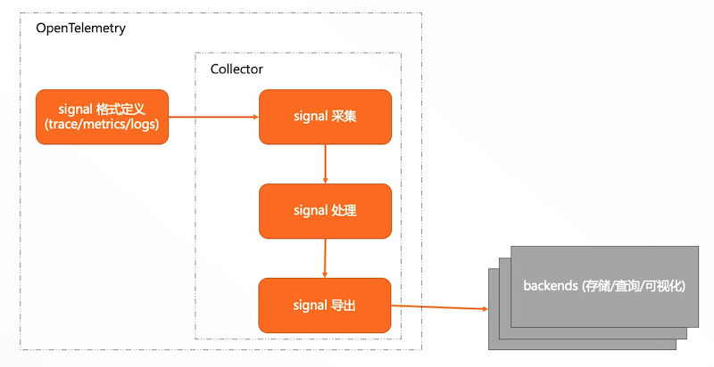

# [OpenTelemetry](https://opentelemetry.io)

## 目录
1. [OpenTelemetry](#opentelemetry)

---
### OpenTelemetry
>参考：[OpenTelemetry 可观测性的未来](https://github.com/rootsongjc/opentelemetry-obervability)。

1. 介绍OpenTelemetry（OTel）

    1. 是什么？

        OpenTelemetry是一组标准和工具的集合，旨在管理观测类数据、**分布式链路追踪**，如：trace、metrics、logs、等（未来可能有新的观测类数据类型出现）。这些数据可供支持OpenTelemetry的后端中间件进行：存储、查询、可视化等服务，用以实现数据观测、性能分析、系统监控、服务告警等能力。

        OpenTelemetry提供与厂商（vendor）无关的实现，旨在提供基于云环境的可观测性软件的标准化方案，是用于收集远程监测数据并将其导出到目标系统的专用协议（遥测），根据用户的需要将观测类数据导出到不同的后端（如：开源的Prometheus、Jaeger或云厂商的服务中），遥测产生数据的方式与分析数据的方式相分离。

        >1. 可观测性（observability）：是一种根据系统生成外部数据（可观测性的 "三大支柱"：日志Logging、指标Metric、跟踪Tracing）研判系统内部发生情况的能力。帮助跨职能团队理解和回答有关高度分布式系统中正在发生的事情的具体问题。
        >2. 遥测（telemetering）：广义上是，对象参量的近距离测量值传输至远距离的测量站来实现远距离测量的技术。
    2. 不是什么？

        OpenTelemetry不提供与可观测性相关的后端服务，这类后端服务通常提供：存储、查询、可视化等服务。

    

    3. 规范：[opentelemetry-specification](https://github.com/open-telemetry/opentelemetry-specification)

        规范了观测数据的数据模型以及采集、处理、导出方法，包括：trace、metrics、logs（未来不排除会有新的类型）。
    4. 描述：[opentelemetry-proto](https://github.com/open-telemetry/opentelemetry-proto)

        同时为了方便使用，通过[protobuf](https://github.com/protocolbuffers/protobuf)来描述。
2. 概念

    - 事务（transaction）

        分布式系统需要执行的所有动作，以便服务能够做一些有用的事情，事务都需要消耗资源。特定某个事务，就是完成某一个特定动作进行的完整链路。
    - 属性（attribute）

        最基本的数据结构。定义为一个键和一个值。OpenTelemetry的每个数据结构都包含一个属性列表。
    - 事件（event）

        最基本的对象。事件只是一个时间戳和一组属性。

        >使用一组属性而不是简单的消息/报文，可以使分析工具正确地索引事件，并使它们可以被搜索到。
    - 上下文（context）

        把不独特、一组事件共有的属性拉出到围绕事件的封装中，在那里它们可以被写入一次。

        1. 资源（resource）

            静态上下文。一旦程序启动，这些资源属性的值通常不会改变。观察服务和机器。
        2. 跨度（span）

            动态上下文。观察事务。

            - 通过添加以下这些基础属性，所有的事件现在可以被组织成一个**图**，代表它们的因果关系。

                1. traceid

                    识别整个事务
                2. spanid

                    识别当前操作
                3. parentid

                    识别父操作

        >不是所有的事件都有两种类型的上下文。只有资源的自由浮动事件，如程序启动时发出的事件，被称为日志（log）。作为分布式事务的一部分而发生的事件被称为跨度事件（span event）。
    - 追踪（trace）

        用traceid、spanid、parentid等属性把 事件 组织成的 图的事件。
    - 指标（metric）

        观察事件的总体情况。
3. [架构](https://jimmysong.io/opentelemetry-obervability/architectural-overview.html)
