#Wamp环境配置（Windows）
>官网<http://www.wampserver.com>下载。本文中使用的版本是Wampserver2.2e，其中包括Apache:2.2.22、MySQL:5.5.24、PHP:5.3.13、PHPMyAdmin:3.5.1、SqlBuddy:1.3.3、XDebug:2.2.0。win7以上系统可以安装最新版，xp只能安装2.2e及更低版本。
	
1. 安装
	>不要试图从 Wamp5 1.x（x 代表任意数字）版本升级到这个版本，如果已经安装了 Wamp5.1.x，请保存数据，然后在安装这个新版本之前卸载 Wamp5，并删除相关文件夹。对于新用户来说，本机上没有安装过 WampServer，所以不考虑这个问题。
	>但是，需要说明的是，如果计算机中安装着 Apache 或者 PHP 解释器 或者 MySQL 数据库的话，也最好先将它们卸载。因为程序安装完成之后要打开相应的端口，如果之前安装的这些程序没有卸载掉，端口仍然占用，会使本程序打开端口失败。
	
	安装接近尾声时会提示选择默认浏览器，后续会输入一些 PHP的邮件参数信息，可以保留默认设置。
	
2. 调整语言
	程序安装好并启动，右击系统托盘中WampServer图标，选择**language->chinese**。
	
3. 配置www目录
	进入程序所在的文件夹，找到 *..\wamp\Scripts* 下的**config.inc.php**，文本打开并找到 **\$wwwDir** （默认为安装目录的 www 文件夹），修改为`$wwwDir = 'D:/www;'`，如图：
	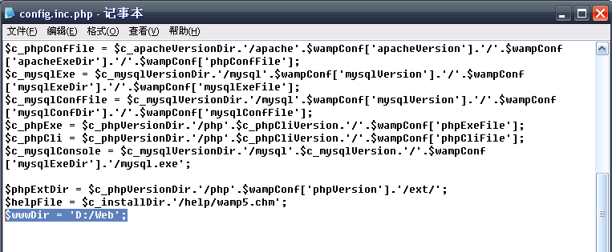
	
	>注意：Windows 里的文件夹为 D:\www，这里的是 `D:/www`。
	
	保存文件，退出 Wamp再次进入即可生效。
	
	生效后点击系统托盘中的图标，点击“www 目录”菜单项后就会打开设置的目录（请先确保系统中存在此文件夹）。
	
4. 配置 Apache Web 服务器
	设置主目录：单击系统托盘中的WampServer，选择**Apache->httpd.conf**配置文件，找到如下图所示的代码（DocumentRoot，注意前面没有井号#），注意Windows路径里面的“\”（反斜杠）都要替换成“/”（正斜杠），路径外面的双引号要保留：
	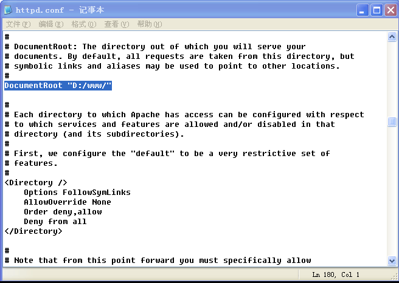
	
	继续查找如下，设置的目录要和上一步所设置的目录一样，如图所示：
	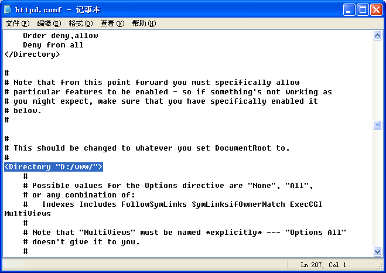	
	
	重新启动 Apache Web 服务器生效修改 。
	
5. 配置 PHP 解释器
	- PHP 核心配置：
		默认情况下，PHP不允许执行一些函数，但是这些往往造成一些应用不能实现，因此需调整过来，单击系统托盘，选择菜单中的 **PHP->PHP设置**，依次点击下图右边所示的那些允许启用的项（设置完一个后等待服务器完全重启再进行下一个设置）：
		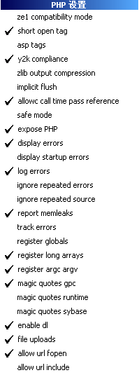
		
	- PHP 时区设置：
		单击系统托盘，选择菜单的**PHP->php.ini**，找到[Date]字段，去掉date.timezone前的分号，并在等号后面加上`"Asia/Shanghai"`如图所示：
		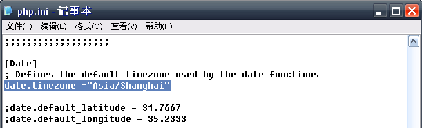

6. 配置 MySQL 数据库
	在phpMyAdmin主页面的菜单中点击**权限**或**用户**，在“用户概览”能看到 root 账户，单击 root 用户一行最后的编辑权限链接，如图：
	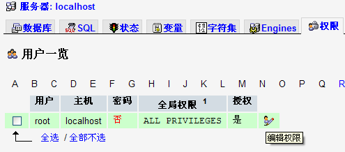

	出现如下图所示的界面（在主页面的中间部分）：
	
	
	当修改完密码，出现成功信息后，再点击主菜单的任意一项，就会产生错误，如下图所示：
	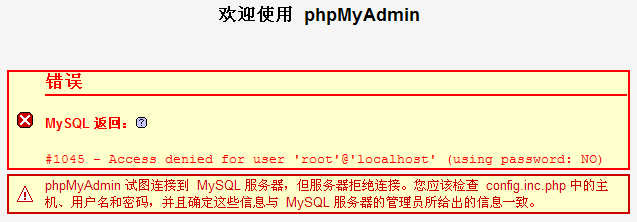
	
	打开WampServer安装目录的 *apps\phpmyadmin3.5.1* 下的**config.inc.php**，文本打开，找到如下图所示选中的代码部分，单引号内的字符串就是更改之后的密码，如果是默认配置，单引号内为空，即空密码。将刚才生成的密码粘贴到单引号内，保存后就可以继续操作了：
	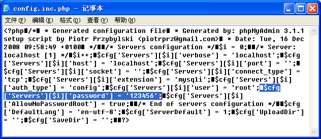
	
7. phpMyAdmin上传最大限制设置
	php配置：文本打开目录 *wamp\bin\php\php5.2.9-2* 下的 **php.ini**，修改**upload_max_filesize、post_max_size、max_execution_time、max_input_time、memory_limit**。
	1. 打开修改功能
		查找**File Uploads**，设置默认允许HTTP文件上传，设置`file_uploads = On`。
		

	2. 设置上传临时目录
		查找**upload_tmp_dir**，此选项设置的是文件上传时存放文件的临时目录，必须给这个选项赋值，否则上传功能就无法实现（如果在linux环境下，必须赋予这个目录可写权限）：设置`upload_tmp_dir = "d:/wamp/tmp"`。
		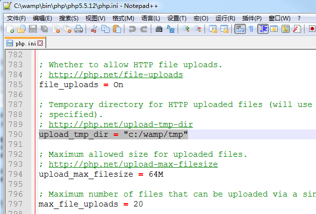

	3. 设置上传文件、数据字节最大限制
		查找**upload_max_filesize**，此选项设定文件上传大小限制，设置`upload_max_filesize = 100M`。
		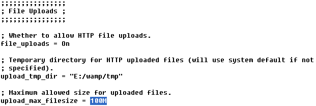

		查找**post_max_size**，此选项代表允许POST的数据最大字节长度。此值需大于upload_max_filesize，小于memory_limit值，一般设定该值与upload_max_filesize值相等或者略大。设置`post_max_size = 150M`。
		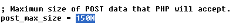

	4. 设置脚本页面执行、接受数据最大时间及占用最大内存
		查找**max_execution_time**，该值设置每个脚本最大允许执行时间(秒)，0表示没有限制，脚本执行超过设置时间则会报脚本执行超时错误，不推荐设定为0。设置`max_execution_time = 200`。
		查找**max_input_time**，该值设置php页面接受数据最大时间。设置`max_input_time = 400`。
		查找**memory_limit**，该值设置php页面占用的最大内存，上传文件越大则内存占用越大。设置`memory_limit = 960M`。
		

	5. phpAdmin配置：修改 *\wamp\apps\phpmyadmin3.1.3.1\libraries\config.default.php* 配置文件中的时间限制。
		查找**\$cfg['ExecTimeLimit']**，0为没有时间限制，设置`$cfg['ExecTimeLimit'] = 0;`。
		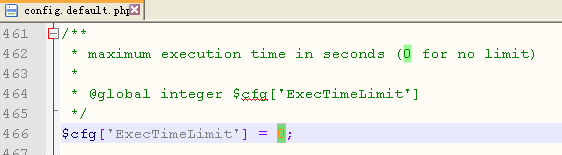

8. Apache配置虚拟主机
	1. 文本打开 *...wamp\bin\apache\Apache2.2.22\conf* 下的**httpd.conf**文件，找到如下模块:
		```
		# Virtual hosts
		#Include conf/extra/httpd-vhosts.conf
		```
		
		去掉第二个的#，修改为:
		```
		# Virtual hosts
		Include conf/extra/httpd-vhosts.conf
		```
		
	2. 文本打开 *...wamp\bin\apache\Apache2.4.4\conf\extra*下的**httpd-vhosts**文件，配置localhost虚拟主机，把原内容修改成如下：
		```
		<VirtualHost *:80>
			ServerAdmin webmaster@dummy-host.localhost
			DocumentRoot "D:\www"
			ServerName localhost
			ServerAlias localhost
			ErrorLog "logs/dummy-host.localhost-error.log"
			CustomLog "logs/dummy-host.localhost-access.log" common
		</VirtualHost>
		```
		 
		在默认配置后面添加虚拟主机：
		```
		<VirtualHost *:80>
			DocumentRoot "D:\www\123.com" 
			ServerName www.123.com
			ServerAlias 123.com
		</VirtualHost>   
		```
		
		在www文件内新建123.com文件夹。
		
	3. 文本	打开 *C:\WINDOWS\system32\drivers\etc* 下的**hosts**，增加代码：
		```
		127.0.0.1 www.123.com
		127.0.0.1 123.com
		```
	4. 重启Apache，虚拟主机配置成功！

	5. 
		>在浏览器中打开123.com，若发现如下错误403 Forbidden错误：
		>Forbidden
		>You don't have permission to access / on this server.
		>这主要是目录访问权限没有设置，需要设置对目录的访问权。
		>打开**httpd**文件，找到如下语句：
		>```
		><Directory />
		>   Options FollowSymLinks
		>   AllowOverride None
		>   Order deny,allow
		>   Deny from all
		></Directory>
		>```
		>复制以上代码，并进行目录修改，把**/**替换为`D:\www\123.com`，修改*...\wamp\bin\apache\Apache2.2.11\conf\extra*下的**httpd-vhosts.conf**文件：
		>```
		><VirtualHost *:80>
		>   DocumentRoot "D:\www\123.com" 
		>   ServerName www.123.com
		>   ServerAlias 123.com
		>   <Directory D:\www\123.com>
		>       Options FollowSymLinks
		>       AllowOverride None
		>       Order deny,allow
		>       Deny from all
		>   </Directory>
		></VirtualHost>
		>```
		>在浏览器中测试发现还是打不开，提示如上403 Forbidden错误，修改其中的Deny from all为`allow from all`

9. 后续
	升级chrome之后导致出现 Aestan Tray Menu 找不到有效路径问题，查看wamp安装目录下**wampmanager.ini**和**wampmanager.conf**两个文件，把里面所有chrome浏览器错误路径修改为现在正确路径，再关闭wamp，重启即解决问题。
