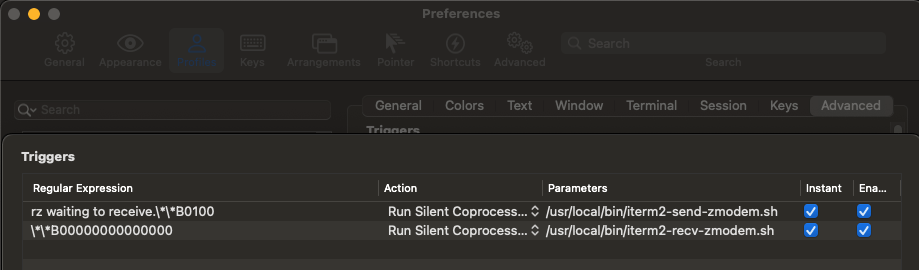

# 命令行备忘

## 目录
1. [命令花费时间](#命令花费时间)
1. [判断命令来源](#判断命令来源)
1. [URL连接测试](#url连接测试)
1. [IPv6相关命令](#ipv6相关命令)
1. [`ssh`](#ssh)
1. [远程复制文件（夹）](#远程复制文件夹)
1. [同步文件（夹）](#同步文件夹)
1. [图形界面文件上传/下载（lrzsz）](#图形界面文件上传下载lrzsz)
1. [改密码](#改密码)
1. [指令在PATH变量的路径](#指令在path变量的路径)
1. [hosts文件位置](#hosts文件位置)
1. [验证文件的数字签名](#验证文件的数字签名)
1. [查看本机IP](#查看本机ip)
1. [执行文件](#执行文件)
1. [系统shell类型](#系统shell类型)
1. [（Unix-like）开机自动运行的脚本](#unix-like开机自动运行的脚本)
1. [查看端口占用、网络链接，查看进程并杀死](#查看端口占用网络链接查看进程并杀死)
1. [查看端口占用，杀掉进程](#查看端口占用杀掉进程)
1. [查看磁盘空间占用](#查看磁盘空间占用)
1. [创建文件](#创建文件)
1. [查看文件](#查看文件)
1. [清空文件内容](#清空文件内容)
1. [查看group、user](#查看groupuser)
1. [指令的别名](#指令的别名)
1. [`adb`](#adb)
1. [`sleep`](#sleep)
1. [`xargs`](#xargs)
1. [批量删除文件](#批量删除文件)
1. [`mysql`](#mysql)
1. [`read`](#read)
1. [`sed`](#sed)
1. [`ln`](#ln)
1. [Shell环境的运行参数](#shell环境的运行参数)
1. [macOS命令](#macos命令)

    1. [（macOS）brew更新](#macosbrew更新)
    1. [（macOS）打开文件（夹）](#macos打开文件夹)
    1. [（macOS）钥匙串](#macos钥匙串)
    1. [（macOS）删除描述文件](#macos删除描述文件)

---
>- 学会在终端中进行命令查询
>
>    1. `「命令」 --help`
>    2. `man 「命令」`
>    3. `info 「命令」`
>    4. `whatis 「命令」`
>
>    >`「命令」`可以是 「命令」+「指令」，如：`docker info`。
>
>    阅读英文文档时，英文水平是痛点，跳着看容易看不懂……

>可阅读：[bash-guide](https://github.com/Idnan/bash-guide)。

#### 命令花费时间
```shell
time 「命令」
# e.g. time ls
```

#### 判断命令来源
```shell
type 命令
```

#### URL连接测试
1. `ping`

    向域名或IP（没有~~协议头、端口、路径~~）传出一个ICMP的请求回显数据包，并等待接收回显回应数据包。判断网络是否畅通、查看连接速度信息。

    >发送的ICMP请求是一个固定的协议，不能设定端口号，因此也不能用`ping`来检测某端口是否可访问。若目标IP不返回ICMP数据包，则也无法ping通。

    ```shell
    ping 「域名或IP」
    ```
2. `curl`

    发起HTTP请求，查看返回信息（HTTP响应）。

    ```shell
    curl 「URL」                  # 返回HTTP响应正文
    -i                          # 返回完整HTTP响应（响应头+响应正文）
    -H 「'一个请求头'」             # 设置请求头的请求
    -X 「请求方法，如：POST」        # 设置请求方法的请求
    -g                          # 关闭解析`{}`、`[]`
    -x 「protocol://host:port」   # 通过代理访问，如：http://127.0.0.1:8899
    ```
3. `telnet`

    可测试IP+端口是否可连接（不可以填写~~域名~~）。互联网远程登录服务的标准协议和主要方式。

    ```shell
    telnet 「IP」 「端口」
    # 若连通则会有进一步操作；若不连通则trying或退出
    ```
4. `nslookup`

    查询DNS的记录，查看域名解析是否正常，在网络故障的时候用来诊断网络问题。
5. `dig`

    从DNS域名服务器查询主机地址信息。
6. `ab`

    压力测试工具。

#### IPv6相关命令
```shell
nslookup -type=AAAA 「域名」

dig 「域名」 AAAA

# ping6 「域名」

# ping -6 「域名」

# curl -6 「URI」
```

#### `ssh`
```shell
ssh 「用户名@地址」 -p 「端口号，默认：22」
```

- 若某远程主机识别已更改，则需删除保存在本机的此IP所有秘钥（删除`known_hosts`保存某ip的秘钥；或直接暴力整个删除文件）

    ```shell
    ssh-keygen -R 「地址」
    ```

#### 远程复制文件（夹）
```shell
scp -P 「端口号，默认：22」 「来源文件」 「目标路径」
```

1. 远程 -> 本地

    ```shell
    scp 「远程用户名@远程地址」:「远程文件」 「本地存放路径」
    ```
2. 本地 -> 远程

    ```shell
    scp 「本地文件」 「远程用户名@远程地址」:「远程存放路径」
    ```

>注意：本机和远程主机的目录权限、文件权限。

#### 同步文件（夹）
```shell
rsync 「来源文件」 「目标文件」
```

仅传输有差异内容，性能更好，参数更复杂。

#### 图形界面文件上传/下载（[lrzsz](https://www.ohse.de/uwe/software/lrzsz.html)）
```shell
rz

sz 「文件路径」
```

><details>
><summary>macOS的iTerm2配置使用。</summary>
>
>1. 安装
>
>    `brew install lrzsz`
>2. 命令配置
>
>    1. `cd /usr/local/bin`
>    2. 在目录下创建2个文件
>
>        1. `vi iterm2-recv-zmodem.sh`
>
>            ```shell
>            #!/bin/bash
>            # Author: Matt Mastracci (matthew@mastracci.com)
>            # AppleScript from http://stackoverflow.com/questions/4309087/cancel-button-on-osascript-in-a-bash-script
>            # licensed under cc-wiki with attribution required
>            # Remainder of script public domain
>
>            osascript -e 'tell application "iTerm2" to version' > /dev/null 2>&1 && NAME=iTerm2 || NAME=iTerm
>            if [[ $NAME = "iTerm" ]]; then
>                FILE=`osascript -e 'tell application "iTerm" to activate' -e 'tell application "iTerm" to set thefile to choose folder with prompt "Choose a folder to place received files in"' -e "do shell script (\"echo \"&(quoted form of POSIX path of thefile as Unicode text)&\"\")"`
>            else
>                FILE=`osascript -e 'tell application "iTerm2" to activate' -e 'tell application "iTerm2" to set thefile to choose folder with prompt "Choose a folder to place received files in"' -e "do shell script (\"echo \"&(quoted form of POSIX path of thefile as Unicode text)&\"\")"`
>            fi
>
>            if [[ $FILE = "" ]]; then
>                echo Cancelled.
>                # Send ZModem cancel
>                echo -e \\x18\\x18\\x18\\x18\\x18
>                sleep 1
>                echo
>                echo \# Cancelled transfer
>            else
>                cd "$FILE"
>                /usr/local/bin/rz -E -e -b
>                sleep 1
>                echo
>                echo
>                echo \# Sent \-\> $FILE
>            fi
>            ```
>        2. `vi iterm2-send-zmodem.sh`
>
>            ```shell
>            #!/bin/bash
>            # Author: Matt Mastracci (matthew@mastracci.com)
>            # AppleScript from http://stackoverflow.com/questions/4309087/cancel-button-on-osascript-in-a-bash-script
>            # licensed under cc-wiki with attribution required
>            # Remainder of script public domain
>
>            osascript -e 'tell application "iTerm2" to version' > /dev/null 2>&1 && NAME=iTerm2 || NAME=iTerm
>            if [[ $NAME = "iTerm" ]]; then
>                FILE=`osascript -e 'tell application "iTerm" to activate' -e 'tell application "iTerm" to set thefile to choose file with prompt "Choose a file to send"' -e "do shell script (\"echo \"&(quoted form of POSIX path of thefile as Unicode text)&\"\")"`
>            else
>                FILE=`osascript -e 'tell application "iTerm2" to activate' -e 'tell application "iTerm2" to set thefile to choose file with prompt "Choose a file to send"' -e "do shell script (\"echo \"&(quoted form of POSIX path of thefile as Unicode text)&\"\")"`
>            fi
>            if [[ $FILE = "" ]]; then
>                echo Cancelled.
>                # Send ZModem cancel
>                echo -e \\x18\\x18\\x18\\x18\\x18
>                sleep 1
>                echo
>                echo \# Cancelled transfer
>            else
>                /usr/local/bin/sz "$FILE" -e -b
>                sleep 1
>                echo
>                echo \# Received $FILE
>            fi
>            ```
>    3. `chmod 777 iterm2-*`
>    4. iTerm2 -> Preferences -> Profiles -> Advanced -> Triggers Edit
>
>        ```text
>        Regular expression: rz waiting to receive.\*\*B0100
>        Action: Run Silent Coprocess
>        Parameters: /usr/local/bin/iterm2-send-zmodem.sh
>
>        Regular expression: \*\*B00000000000000
>        Action: Run Silent Coprocess
>        Parameters: /usr/local/bin/iterm2-recv-zmodem.sh
>        ```
>        
>3. 在iTerm2中使用`rz`、`sz`
></details>

#### 改密码

```shell
passwd
```

#### 指令在PATH变量的路径
```shell
which 「指令」
```

#### hosts文件位置
1. macOS、Linux

    `/etc/hosts`
2. Windows

    `C:\Windows\System32\drivers\etc\hosts`

#### 验证文件的数字签名
1. MD5

    ```shell
    # macOS
    md5 「文件」
    md5 -s 「字符串」    # 或`echo -n 「字符串」 | md5`

    # Linux
    md5sum 「文件」
    echo -n 「字符串」 | md5sum

    # Windows
    md5sum.exe 「文件」
    echo -n 「字符串」 | md5sum.exe
    ```
2. SHA

    ```shell
    # macOS、Linux
    shasum 「文件」
    echo -n 「字符串」 | shasum
    # 使用特定算法：`-a, --algorithm   1 (default), 224, 256, 384, 512, 512224, 512256`
    # Linux额外还可以使用特定算法：`sha224sum sha256sum sha384sum sha512sum`

    # Windows
    sha1sum.exe 「文件」
    echo -n 「字符串」 | sha1sum.exe
    # 使用特定算法：`sha224sum.exe sha256sum.exe sha384sum.exe sha512sum.exe`
    ```

#### 查看本机IP
```shell
# macOS、Linux
ifconfig    # 查看`en0`的`inet`（IPv4）或`inet6`（IPv6）

# Windows
ipconfig    # 查看`以太网适配器 本地连接 的 IPv4 地址`
```

#### 执行文件
>要对路径名/文件名中的`标点`和`空格`进行`\`转义。

```shell
./「文件名」.sh

. 「路径名/文件名」.sh
```

#### 系统shell类型
1. 查看系统安装的所有shell

    ```shell
    cat /etc/shells
    ```
2. 查看系统使用的shell

    ```shell
    echo $SHELL
    ```
3. 修改系统使用的shell

    ```shell
    chsh -s 「shell路径，如：/bin/zsh 或 /bin/bash 等」
    ```

#### （Unix-like）开机自动运行的脚本
```shell
# macOS、Linux
vi ~/.bash_profile  # bash
vi ~/.zshrc         # zsh

# 如：可以把定义环境变量放在里面`export NODE_ENV=development`

# source 脚本   # 当前运行一遍
```

#### 查看端口占用、网络链接，查看进程并杀死
1. 所有端口占用、网络连接情况（Linux）

    ```shell
    # Linux
    netstat -antp
    ```
2. 某端口占用

    ```shell
    # macOS、Linux
    netstat -ant | grep 「端口号」
    lsof -i :「端口号」              # sudo su
    ```
3. 查看进程并杀死

    ```shell
    ps -ef   #
    ps -efc  # command改成进程名展示
    ps -ef | grep '「命令关键字」' | grep -v grep  # 搜索「命令关键字」、排除grep


    # 杀死进程
    kill -9 「PID」   # 杀死具体PID的进程
    kill $(ps -ef | grep '「命令关键字」' | grep -v grep | awk '{print $2}')  # 杀死所有关键字相关的进程（排除grep）

    # 杀死所有同名进程（慎）
    killall 「名称」
    ```

    >当macOS手势突然失效，尝试`killall Dock`。

#### 查看端口占用，杀掉进程
1. macOS、Linux

    ```shell
    lsof -i :「端口号」              # sudo su

    kill -9 「PID」
    # macOS的「活动监视器」也可以查到「PID」并关闭进程
    ```
2.  Windows（需要在cmd.exe进行）

    ```shell
    netstat -aon | findstr 「端口号」  # 获得某端口号的任务PID

    tasklist | findstr 「PID」          # 获得某PID的任务名
    # 获得任务名之后可以再用`tasklist | findstr 「任务名」`确认是否有多个子任务

    taskkill /F /T /PID 「PID」           # 需要杀死主进程，否则仅杀死的子进程会被主进程再次创建
    # 或`taskkill /F /T /IM 「任务名」`
    # 或去任务管理器结束进程（打开进程->查看->选择列的PID）
    ```

#### 查看磁盘空间占用
1. 以磁盘分区为单位查看文件系统的磁盘空间情况

    ```shell
    df -h
    ```
2. 指定的目录或文件所占用的磁盘空间

    ```shell
    # macOS
    du -h -d1 「路径」

    # Linux
    du -h --max-depth=1 「路径」
    ```
3. 查找超过10M的文件

    ```shell
    find 「路径」 -size +10M
    ```

#### 创建文件
1. `touch 「文件名」`

    >若文件已存在，则更新文件时间为当前系统时间。
2. `vi 「文件名」`

    >编辑文件。若文件不存在，则先创建后编辑。
3. `echo "「内容」" > 「文件名」`

    >若文件已存在，则替换文件内容。
>4. `less/more/cat 「已存在文件」 > 「文件名」`，`cd >/>> 「文件名」`

#### 查看文件
1. `cat`、`nl`
2. `tac`颠倒输出
3. `more`、`less`一页一页输出
4. `tail`查看文件尾部

    ```shell
    tail -n 「行数」 「文件名」
    tail -f 「文件名」        # 流式输出（文件改动后重新输出）
    ```
5. `head`查看文件头部
6. `od`以二进制方式输出

- 查看文件属性

    `ls -lh 「文件名」`

#### 清空文件内容
1. 文件大小为0

    ```shell
    : > 「文件名」
    > 「文件名」
    true > 「文件名」
    ```
2. 文件大小为1

    ```shell
    echo '' > 「文件名」
    echo > 「文件名」
    ```

#### 查看group、user
1. 查看所有组

    ```shell
    cat /etc/group  # 返回的每一条是一个组的信息：`组名:密码:组id:组内用户列表`
    ```
2. 查看所有用户

    ```shell
    cat /etc/passwd # 返回的每一条是一个用户的信息：`用户名:密码:用户id:所在组id:备注:用户的home目录:shell命令所在目录`
    ```
3. `groups`

    ```shell
    groups          # 返回当前用户所在的组名

    groups 「用户名」 # 返回「用户名」所在的组名
    ```

#### 指令的别名
```shell
# 只能为命令定义别名，无法为其他部分（比如很长的路径）定义别名

alias   # 查看已设置的内容

alias 「自定义命令名」='「执行命令1」; 「执行命令2」'   # 新增 别名=执行命令

alias 「自定义命令名」      # 打印设置的执行命令

# 别名也可以接受参数，参数会直接传入原始命令

unalias 「自定义命令名」    # 删除 别名
```

#### `adb`
1. 查看已连接的设备（尝试连接手机）

    ```shell
    adb devices -l
    # List of devices attached
    # 「序列号」       device usb:「？？？」 product:「手机型号」 model:「手机型号」 device:「手机型号」 transport_id:「数字」
    ```
2. 系统消息输出

    ```shell
    adb logcat

    # 或

    adb shell   # 启动交互式Unix shell对设备发起命令
    logcat | grep 「筛选内容」
    ```
3. 端口转发

    1. 手机访问「手机端口号」的流量都会转发到PC的「PC端口号」：

        ```shell
        adb reverse --list  # 打印所有 手机->PC 的映射端口哦连接列表

        adb reverse tcp:「手机端口号」 tcp:「PC端口号」 # 新增一个端口映射

        adb reverse --remove tcp:「手机端口号」      # 删除一个端口映射

        adb reverse --remove-all                 # 删除所有端口映射
        ```
    2. PC访问「PC端口号」的流量都会转发到手机的「手机端口号」：

        ```shell
        adb forward --list  # 打印所有 PC->手机 的映射端口哦连接列表

        adb forward tcp:「PC端口号」 tcp:「手机端口号」 # 新增一个端口映射

        adb forward --remove tcp:「PC端口号」       # 删除一个端口映射

        adb forward --remove-all                 # 删除所有端口映射
        ```

    >可以混合配置使用，如：手机端口号A -> PC端口号B > 手机端口号C。
4. 查看手机中所有安装的包

    ```shell
    adb shell pm list packages
    # package:「包名」
    # e.g. com.tencent.mtt.hippy.example:com.tencent.mtt.hippy.example
    ```
5. 查看界面性能数据

    >来自：[测试界面性能](https://developer.android.com/training/testing/performance)。

    ```shell
    # 需要打开了「GPU呈现模式分析」为「在adb shell dumpsys gfxinfo中」
    adb shell dumpsys gfxinfo 「PACKAGE_NAME」
    adb shell dumpsys gfxinfo 「PACKAGE_NAME」 framestats
    ```
6. 安装本地包

    ```shell
    adb install 「包地址」
    ```

#### `sleep`
```shell
sleep 「秒数」  # 延迟一段时间，再向下继续执行命令
```

#### `xargs`
将标准输入转为命令行参数。

```shell
echo 1.txt 2.txt 3.txt | xargs touch
```

#### 批量删除文件
```shell
find ./ -name "文件名" -exec rm -rf {} \;
```

#### [`mysql`](https://dev.mysql.com/doc/refman/8.0/en/)
1. 连接mysql

    ```shell
    mysql -h 「IP」 -P 「端口号」 -u 「用户名」 -p「密码（-p与密码没有空格）」 -D 「数据库名」 --default-character-set=utf8
    ```
2. 进入mysql后命令行

    >`;`作为结束输入的标志。

    1. 查看

        ```shell
        # 查看所有数据库
        show databases;

        # 访问某数据库
        use 「数据库名」;

        # 查看某数据库的所有表
        show tables;

        # 查看某表的所有字段信息
        describe 「表名」;  # 等价于：`show columns from 「表名」;`

        # 查看某表的所有字段信息（+full 包括所有额外信息）
        show [full] columns from 「表名」;

        # 查看用户
        select user from mysql.user;

        # 展示使用权限
        show grants;
        ```
    2. 修改数据库

        ```shell
        # 新建数据库
        create database 「数据库名」;

        # 删除数据库
        drop database 「数据库名」;

        # 修改数据库的配置参数
        alter database 「表名」 「内容」;
        ```
    3. 修改表

        ```shell
        # 新建表
        create table 「表名」(「字段」 「类型」);

        # 删除表
        drop table 「表名」;

        # 修改表名
        rename table 「原表名」 to 「新表名」;

        # 修改表字段信息
        alter table 「表名」 「内容」;
        ```
    4. 授权

        ```shell
        grant 「权限。如：`all`，`select, update`」 on 「库名 或 *」.「表名 或 *」 to '「用户名」'@'「ip」' identified by '「用户密码」';
        ```

        - 撤销

            ```shell
            revoke 「权限。如：`all`，`select, update`」 on 「库名 或 *」.「表名 或 *」 from '「用户名」'@'「ip」';
            ```
    5. 增删改查 数据

        `select/delete/update/insert`、`from 「表名」`、`order by 「字段名」`、`where`、`or`、`and`、`like`

#### `read`
```shell
# 用户输入到变量名（默认以空格作为输入结果分隔，以 IFS 变量决定）。若没有变量名，则默认输入到 REPLY 变量
read 「n个变量名（以空格分隔），默认REPLY」
-t 「数字，默认 TMOUT 变量值」   # 输入超时时间（秒）
-p 「提示信息」
-a 「变量名」                  # 赋值给数组（以0开始）
-n 「数字」                    # 截取字符数
-e                          # 自动补全
-d 「用户输入结束符」
-r                          # raw 模式，表示不把用户输入的反斜杠字符解释为转义字符
-s                          # 使得用户的输入不显示在屏幕上，这常常用于输入密码或保密信息
-u 「文件描述符」               # 使用文件描述符作为输入
```

- 读取文件到变量

    ```shell
    #!/bin/bash

    filename='「文件绝对地址」'

    while read myline
    do
      echo "$myline"
    done < $filename
    ```

#### `sed`
sed默认读取整个文件并对每一行进行修改。

1. 修改原文件

    ```shell
    # macOS
    sed -i "「原文件备份文件的后缀，若为空则不添加备份文件。参数为必须」" "s/「匹配内容」/「修改内容」/g" 「原文件」   # 修改原文件，可选生成原文件的备份文件

    # Linux
    sed -i "s/「匹配内容」/「修改内容」/g" 「原文件」            # 修改原文件
    sed "s/「匹配内容」/「修改内容」/g" 「原文件」 > 「新文件」   # 原文件不变，替换后内容保存在新文件


    # 若替换的内容有`/`，则用`#`替换`/`作为分割符
    # e.g.
    sed "s#abc/def#${变量名}#g" 文件名1 > 文件名2
    ```

#### `ln`
```shell
ln 「源文件」 「目标文件」             # 硬链接，会在 目标文件 上生成一个与 源文件 大小相同的文件（不能是文件夹）
ln -s 「源文件/目录」 「目标文件/目录」  # 软链接，会在 目标位置 上生成一个 源文件/目录 的镜像，不占用磁盘空间（类似Windows的快捷方式）
# 硬链接、软链接：文件都保持同步变化
```

#### Shell环境的运行参数
- 修改当前Shell环境的运行参数（不会继承到子Shell），即定制环境

    1. [`set`](https://www.gnu.org/software/bash/manual/html_node/The-Set-Builtin.html) + 配置项

        >e.g. `set -u`
    2. `bash`（或其他Shell） + 配置项 + 脚本

        会完全脚本的忽略Shebang行（Shebang行加的运行参数也会被忽略）。

        >e.g. `bash -u ./脚本`
    3. 脚本Shebang行 + 配置项

        >e.g. `#!/bin/sh -u`

```shell
# 运行参数的配置项：

-u          # 若遇到不存在的变量，则报错并停止执行。或：`-o nounset`
+u          # 默认。取消`-u`的效果。或：`+o nounset`

-x          # 运行结果之前，先输出执行的那一行命令（用`+ 指令内容`的方式输出，环境变量`PS4`的值决定输出符号）。或：`-o xtrace`
+x          # 默认。取消`-x`的效果。或：`+o xtrace`

-e          # 脚本只要发生错误，就终止执行（管道）。或：`-o errexit`
+e          # 默认。取消`-e`的效果。`+o errexit`

# 管道命令，是多个子命令通过管道运算符`|`组合成为一个大的命令。Bash会把最后一个子命令的退出码，作为整个命令的退出码
-o pipefail # 只要一个子命令失败，整个管道命令就失败，脚本就会终止执行
+o pipefail # 默认。取消`-o pipefail`效果

-E          # 一旦设置了`-e`参数，会导致函数内的错误不会被`trap`命令捕获。`-E`参数可以纠正这个行为，使得函数也能继承trap命令
+E          # 默认。取消`-E`的效果

-n          # 不运行命令，只检查语法是否正确。或：`-o noexec`

-f          # 不对通配符进行文件名扩展。或：`-o noglob`
+f          # 默认。取消`-f`的效果。`+o noglob`

-v          # 打印Shell接收到的每一行输入。。或：`-o verbose`
+v          # 默认。取消`-v`的效果。`+o verbose`
```

---
### macOS命令

#### （macOS）brew更新
```shell
brew update && brew upgrade && brew upgrade --cask
# 更新用brew安装的软件，也更新brew自身
```

>brew cask可以安装大部分软件，使用`brew search 「软件名」`进行搜索（建议对非App Store安装的应用，都尝试用brew cask安装）。

#### （macOS）打开文件（夹）
```shell
open 「路径/文件」
    -t # Opens with default text editor
```

>安装[duti](https://github.com/moretension/duti)（brew install duti），可为各种文档设置默认应用程序。如：设置纯文本的默认应用程序为Sublime`duti -s com.sublimetext.4 public.plain-text all`、设置纯文本的默认应用程序为TextEdit`duti -s com.apple.TextEdit public.plain-text all`。

#### （macOS）钥匙串
`钥匙串`应用可以查看本机保存的密码（大部分应用都会把密码保存在钥匙串）。

#### （macOS）删除描述文件
>来自：[macOS：删除 MDM 配置描述文件](https://blog.csdn.net/cneducation/article/details/111466407)。

1. 进入[恢复模式](https://support.apple.com/zh-cn/HT201255)
2. 进入描述文件的文件夹，删掉所有文件后新建空文件夹、文件

    ```shell
    # Macintosh HD 是目标的启动卷
    cd /Volumes/Macintosh HD/private/var/db/ConfigurationProfiles
    rm -rf *
    mkdir Settings
    touch Settings/.profilesAreInstalled
    ```
3. 重启

>为什么删了描述文件，还是可以连上公司的Wifi？
