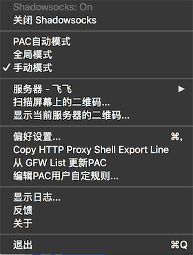
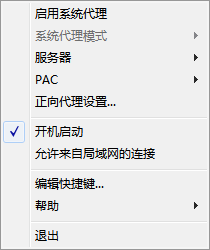
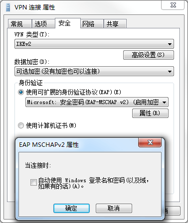

# 科学上网

## 目录
1. [服务端安装](#服务端安装)

    1. [通过Docker安装服务器：Shadowsocks、Cisco IPSec（IPSec Xauth PSK）或IPsec/L2TP（L2TP/IPsec PSK）](#通过docker安装服务器shadowsockscisco-ipsecipsec-xauth-psk或ipsecl2tpl2tpipsec-psk)
    1. [非Docker环境安装服务器：Shadowsocks、IKEv2（IKEv1）](#非docker环境安装服务器shadowsocksikev2ikev1)
1. [客户端配置](#客户端配置)

    1. [Shadowsocks](#shadowsocks客户端配置)
    1. [Cisco IPSec（IPSec Xauth PSK）或IPsec/L2TP（L2TP/IPsec PSK）](#cisco-ipsecipsec-xauth-psk或ipsecl2tpl2tpipsec-psk客户端配置)
    1. [IKEv2（IKEv1）](#ikev2ikev1客户端配置)

---
## 服务端安装

>使用Docker是最快捷的方式。

### 通过Docker安装服务器：Shadowsocks、Cisco IPSec（IPSec Xauth PSK）或IPsec/L2TP（L2TP/IPsec PSK）
>[Docker](https://www.docker.com/)建议Linux内核在3.0以上。[Bandwagon](https://bwh1.net/)内核只有2.6，无法使用Docker；[vultr](https://my.vultr.com/)可以使用Docker。

- 安装、启动Docker（若已安装Docker，不要再次安装/启动）

    ```bash
    curl -fsSL https://get.docker.com/ | sh # 安装。或用官网安装方式

    service docker start    # 启动
    ```

    - 启动、停止、重启、删除 容器实例

        ```bash
        docker ps                # 获取容器信息，包括ID（`-a`：显示所有的容器，包括未运行的）


        docker start “容器ID”   # 启动容器

        docker stop “容器ID”    # 停止容器（`-t=“时间 默认10”`：若超时未能关闭则强制kill）
        # 或
        docker kill “容器ID”    # 直接关闭容器

        docker restart “容器ID” # 重启容器（无论容器是否已启动）

        docker rm “容器ID”      # 删除容器
        ```
1. Shadowsocks服务端安装

    >来自：[Shadowsocks-libev Docker Image](https://github.com/shadowsocks/shadowsocks-libev/blob/master/docker/alpine/README.md#shadowsocks-libev-docker-image)。

    ```bash
    docker pull shadowsocks/shadowsocks-libev

    docker run -e PASSWORD=密码 -p 服务端口号:8388 -p 服务端口号:8388/udp -d --restart always shadowsocks/shadowsocks-libev  # 默认加密方式：aes-256-gcm
    ```
2. Cisco IPSec（IPSec Xauth PSK）或IPsec/L2TP（L2TP/IPsec PSK）服务端安装

    >来自：[docker-ipsec-vpn-server](https://github.com/hwdsl2/docker-ipsec-vpn-server)。

    1. 新建一个配置文件，包含：共享的密钥、帐户名称、密码。（帐户名称和密码可以设置多个）

        >文件位置和文件名可任意。

        ```text
        VPN_IPSEC_PSK=共享的密钥
        VPN_USER=帐户名称1 帐户名称2
        VPN_PASSWORD=密码1 密码2
        ```
    2. 启动

        ```bash
        docker pull hwdsl2/ipsec-vpn-server

        docker run --name ipsec-vpn-server --env-file “配置文件地址” --restart=always -p 500:500/udp -p 4500:4500/udp -d --privileged hwdsl2/ipsec-vpn-server
        ```

### 非Docker环境安装服务器：Shadowsocks、IKEv2（IKEv1）
<details>
<summary>（推荐<a href="https://github.com/realgeoffrey/knowledge/blob/master/工具使用/科学上网/README.md#通过docker安装服务器shadowsockscisco-ipsecipsec-xauth-psk">通过Docker安装服务器</a>）</summary>

1. Shadowsocks服务端安装

    >来自：[teddysun:shadowsocks_install](https://github.com/teddysun/shadowsocks_install#shadowsocks-gosh)。

    1. 在Linux服务器（CentOS，Debian，Ubuntu）安装[shadowsocks-go](https://github.com/shadowsocks/shadowsocks-go)。

        ```bash
        wget --no-check-certificate -O shadowsocks-go.sh https://raw.githubusercontent.com/teddysun/shadowsocks_install/master/shadowsocks-go.sh

        chmod +x shadowsocks-go.sh
        ./shadowsocks-go.sh 2>&1 | tee shadowsocks-go.log
        ```

        >1. 密码：自己设定（默认：teddysun.com）
        >2. 服务器端口号：自己设定（默认：8989）
    2. 查看状态

        ```bash
        /etc/init.d/shadowsocks start   # 启动
        /etc/init.d/shadowsocks stop    # 停止
        /etc/init.d/shadowsocks restart # 重启
        /etc/init.d/shadowsocks status  # 状态
        ```
    3. 卸载

        ```bash
        ./shadowsocks-go.sh uninstall
        ```
2. IKEv2（IKEv1）服务端安装

    >来自：[quericy:one-key-ikev2-vpn](https://github.com/quericy/one-key-ikev2-vpn)。

    >除了第一个vps类型选择、倒数第二个独立IP使用SNAT规则，其他都可以简单使用默认。

    1. 下载、运行脚本

        ```bash
        wget --no-check-certificate https://raw.githubusercontent.com/quericy/one-key-ikev2-vpn/master/one-key-ikev2.sh

        chmod +x one-key-ikev2.sh
        bash one-key-ikev2.sh
        ```
    2. 输入配置
        1. 选择**vps类型**：

            1. Xen、KVM
            2. OpenVZ
        2. 设置**IP**：

            服务器IP，绑定的域名（默认：服务器IP）。
        3. 选择**证书类型**：

            1. yes：证书颁发机构签发的SSL证书

                （未测试）
            2. no：生成自签名证书（默认：生成自签名证书）

                选择默认的Country（C）、Organization（O）、Common Name（CN）。
        4. 设置**pkcs12证书的密码**（默认：空）。
        5. 选择是否使用**SNAT规则**（默认：不使用）

            独立IP的vps才可以使用SNAT，可提升防火墙对数据包的处理速度。若服务器网络设置了NAT（如：AWS的弹性IP机制），则填写网卡连接接口的IP地址。
        6. 选择**防火墙配置**：

            1. yes：firewall
            2. no：iptables（默认）。
    3. 配置用户名、密码、密钥

        1. 默认用户名、密码、密钥将以绿字显示，可根据提示自行修改，多用户则在配置文件中按格式一行一个（多用户时用户名不能使用%any）

            ```bash
            vi /usr/local/etc/ipsec.secrets
            ```
        2. 保存并重启服务生效

            ```bash
            ipsec restart
            ```

            >隔段时间需要人工重启一次。
    4. 客户端验证

        1. 将提示信息中生成的证书文件**ca.cert.pem**复制到客户端，修改后缀名为**ca.cert.cer**后导入。

            远程复制：

            ```bash
            scp -P 端口号 服务器名@服务器地址:/root/my_key/ca.cert.pem 本地存放路径
            ```
        2. 设备使用Ikev1无需导入证书，而是需要在连接时输入密钥（PSK）。
    5. ipsec启动问题

        服务器重启后ipsec不会自启动。

        1. 命令需要手动开启，

            ```bash
            ipsec start   # 启动服务

            ipsec stop    # 关闭服务
            ipsec restart # 重启服务
            ipsec reload  # 重新读取
            ipsec status  # 查看状态
            ipsec --help  # 查看帮助
            ```
        2. 添加 **/usr/local/sbin/ipsec start**到自启动脚本文件中（如：rc.local等）

            ```bash
            vi /etc/rc.d/rc.local

            # 添加
            /usr/local/sbin/ipsec start
            ```
    6. 卸载

        1. 卸载

            ```bash
            cd ~/strongswan-5.5.1

            make uninstall
            ```
        2. 删除脚本所在目录的相关文件（one-key-ikev2.sh、strongswan.tar.gz、strongswan文件夹、my_key文件夹）。
        3. 检查iptables配置。
</details>

---
## 客户端配置

### Shadowsocks客户端配置

>客户端安装：[macOS](https://github.com/shadowsocks/ShadowsocksX-NG)、[Windows](https://github.com/shadowsocks/shadowsocks-windows)。

1. macOS

    

    1. PAC自动模式：

        监听特定端口号的请求（默认代理端口号：`1080`），再按照PAC（代理自动配置）列表决定是否使用Shadowsocks代理。
    2. 全局模式：

        走系统代理（系统层面的默认代理）的所有请求都走Shadowsocks代理。
    3. 手动模式：

        监听特定端口号的请求（默认代理端口号：`1080`），都走Shadowsocks代理。
2. Windows

    

    1. 开启软件：

        监听特定端口号的请求（默认代理端口号：`1080`），都走Shadowsocks代理。
    2. 启动系统代理（全局模式）：

        走系统代理（系统层面的默认代理）的所有请求都走Shadowsocks代理。
    3. PAC：

        代理自动配置，一般使用[gfwlist](https://github.com/gfwlist/gfwlist)列表。
    4. 允许来自局域网的连接：

        同局域网下，其他设备设置HTTP代理为主机IP和端口号（可以用Charles），则走代理主机的Shadowsocks代理。

- Chrome插件[SwitchyOmega](https://github.com/FelisCatus/SwitchyOmega)，能够对Chrome发出的所有请求都进行代理配置。

    >SwitchyOmega配置备份文件：
    >
    >[https://raw.githubusercontent.com/realgeoffrey/knowledge/master/工具使用/科学上网/OmegaOptions.bak](https://raw.githubusercontent.com/realgeoffrey/knowledge/master/工具使用/科学上网/OmegaOptions.bak)

### Cisco IPSec（IPSec Xauth PSK）或IPsec/L2TP（L2TP/IPsec PSK）客户端配置
>1. 参考：[配置 IPSec/Xauth VPN 客户端](https://github.com/hwdsl2/setup-ipsec-vpn/blob/master/docs/clients-xauth-zh.md)。
>2. 参考：[配置 IPsec/L2TP VPN 客户端](https://github.com/hwdsl2/setup-ipsec-vpn/blob/master/docs/clients-zh.md)。

### IKEv2（IKEv1）客户端配置
1. iOS

    >设置 -> 通用 -> VPN

    1. 类型：IKEv2。
    2. 服务器地址：和证书保持一致。
    3. 远程ID：和服务器地址一致。
    4. 本地ID：（不填）。
    5. 鉴定

        1. 用户鉴定：用户名。
        2. 用户名：服务端设置的值。
        3. 密码：服务端设置的值。
    6. 证书

        1. 若服务器使用**SSL证书**，则客户端不需要导入证书。
        2. 若服务器使用**自签名证书**，则客户端必须导入证书。

            客户端用Safari导入ca.cert.cer并选择**始终信任此证书**。
2. macOS

    >系统偏好设置 -> 网络

    1. 接口：VPN。
    2. VPN类型：IKEv2。
    3. 服务器地址：和证书保持一致。
    3. 远程ID：和服务器地址一致。
    4. 本地ID：（不填）。
    5. 鉴定设置

        1. 用户名。
        2. 用户名：服务端设置的值。
        3. 密码：服务端设置的值。
    6. 证书

        1. 若服务器使用**SSL证书**，则客户端不需要导入证书。
        2. 若服务器使用**自签名证书**，则客户端必须导入证书。

            客户端添加ca.cert.cer后，进入“钥匙串访问”把证书设置为“始终信任”。
3. Windows

    1. 设置新的连接或网络 -> 连接到工作区 -> 使用我的Internet连接（VPN）。
    2. Internet地址：和证书保持一致。
    3. 创建好后右键属性 -> 设置VPN类型

        
    4. 用户名：服务端设置的值。
    5. 密码：服务端设置的值。
    6. 证书

        1. 若服务器使用**SSL证书**，则客户端不需要导入证书。
        2. 若服务器使用**自签名证书**，则客户端必须导入证书。

            1. 搜索`mmc.exe`，打开控制台
            2. 文件 -> 添加/删除管理单元

                选择“证书”添加。
            3. 证书 -> 受信任的根证书颁发机构 -> 证书，右键 -> 所有任务 -> 导入，选择ca.cert.cer导入成功。
