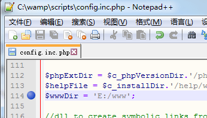
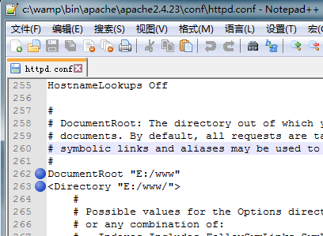
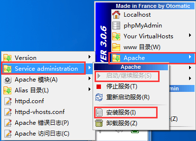
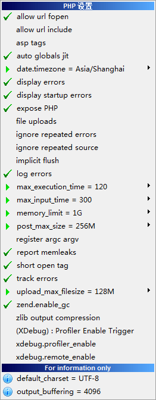
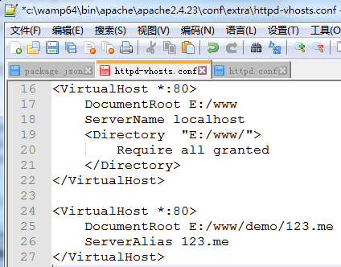

# WAMP环境配置（Windows）

>[官网](http://www.wampserver.com)下载。本文使用版本 **Wampserver 3.0.6 64 bit x64** ，其中包括Apache 2.4.23、PHP 5.6.25/7.0.10、MySQL 5.7.14、PhpMyAdmin 4.6.4、Adminer 4.2.5、PhpSysInfo 3.2.5。
>
>win7以上系统可以安装最新版，xp只能安装2.2e及更低版本。
	
1. 安装

	安装接近尾声时会提示选择程序打开的**浏览器**和**文本编辑器**。
2. 调整语言

	程序安装好并启动，右击系统托盘中WampServer图标，选择 **language->chinese** 。
3. 配置 www 目录

	进入程序所在的文件夹，找到 *..\wamp\Scripts* 下的 **config.inc.php**，文本打开并找到`$wwwDir`（默认为安装目录的 www 文件夹），修改为自定义位置`$wwwDir = 'E:/www'`，如图：

	
	
	>注意：Windows 里的文件夹为`E:\www`，这里的是 `E:/www`，斜杠方向有区别。
	
	保存文件，退出 Wamp再次进入即可生效。
	
	左击系统托盘中的WampServer，选择 **www 目录** 菜单项后就会打开设置好的目录。

	>请先确保系统中存在此文件夹。
4. 配置 Apache Web 服务器

	1. 设置主目录

	    左击系统托盘中的WampServer，选择 **Apache->httpd.conf** 配置文件。找到`DocumentRoot`，设置为`DocumentRoot "E:/www"`；找到`<Directory "${INSTALL_DIR}/www/">`，设置为`<Directory "E:/www/">`：

	    
	2. 启动

        若Apache没有启动，则左击系统托盘中的WampServer，选择 **Apache->Service administration->安装服务**再选择**启动/继续服务**：

        
5. 配置 PHP 解释器

    左击系统托盘中的WampServer，选择 **PHP->PHP 设置** ，依次点击下图右边所示的那些允许启用的项（设置完一个后等待服务器完全重启再进行下一个设置），不同系统服务可能不同。

    1. **date.timezone** 设置为`Asia/Shanghai`
    2. **max_execution_time** 设置为`120`
    3. **max_input_time** 设置为`300`
    4. **memory_limit** 设置为`1G`
    5. **post_max_size** 设置为`256M`
    6. **upload_max_filesize** 设置为`128M`

    
6. 配置 MySQL 数据库

	左击系统托盘中的WampServer，选择 **phpMyAdmin** 。默认用户为`root`，密码为空。
7. 配置 虚拟主机
	1. 文本打开 *...wamp\bin\apache\Apache2.4.23\conf\extra* 下的 **httpd-vhosts**，配置localhost虚拟主机，把原内容修改成如下：

	    >我想把测试内容放在*www/demo文件夹*中，其他内容可以放在*www/其他文件夹*中。

		```text
        <VirtualHost *:80>
            DocumentRoot E:/www/demo
            ServerName localhost
        </VirtualHost>
		```
		 
		在默认配置后面添加新的虚拟主机：
		```text
        <VirtualHost *:80>
            DocumentRoot E:/www/demo/123.me
            ServerAlias 123.me
        </VirtualHost>
		```
		
		>在www文件内新建demo文件夹，再在demo文件夹内新建123.me文件夹。

        
	2. 打开 *C:\WINDOWS\system32\drivers\etc* 下的 **hosts**，增加代码：

		```text
		127.0.0.1 123.me
		```
	3. 重启Apache，虚拟主机配置成功。
8. 在APACHE服务器上的访问方式上去除index.php

    在项目代码的根目录中新建`.htaccess`文件，添加：

    ```text
    RewriteEngine on
    RewriteCond %{REQUEST_FILENAME} !-d
    RewriteCond %{REQUEST_FILENAME} !-f
    RewriteRule ^(.*)$ index.php/$1 [L]
    ```
9. 后续

	升级chrome之后导致出现 Aestan Tray Menu 找不到有效路径问题，查看 `..\wamp` 下的 **wampmanager.ini** 和 **wampmanager.conf**，把里面所有chrome浏览器错误路径修改为现在正确路径，再关闭wamp，重启即解决问题。