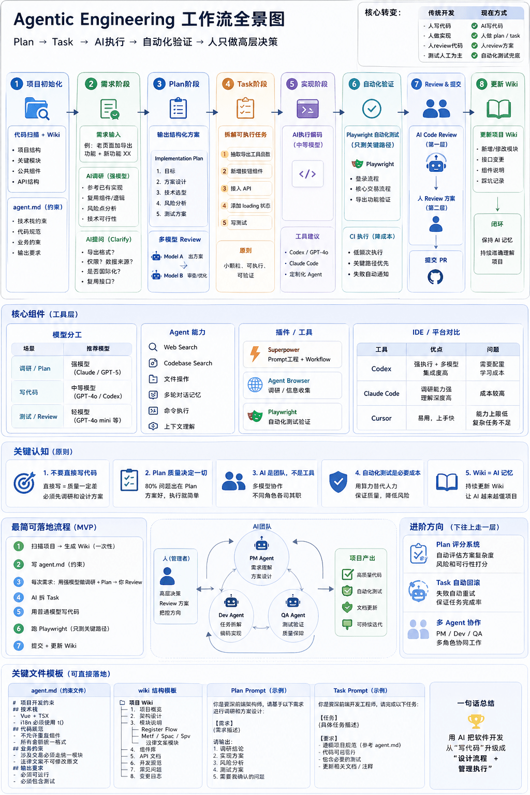

# AI笔记

## 目录
1. [从 Vibe Coding 到 Agentic Engineering](#从-vibe-coding-到-agentic-engineering)
1. [Agentic Engineering 工作流（针对实现某个需求）](#agentic-engineering-工作流针对实现某个需求)

---

### 从 Vibe Coding 到 Agentic Engineering

Agentic Engineering 的核心是把软件交付改造成一个可被智能体理解、执行、验证和沉淀的系统。工程师的重心从逐行实现转向定义目标、边界、上下文、工具、验证标准和反馈闭环。

这不是放弃开发者身份，而是升级责任边界：人负责产品判断、架构约束、风险识别、验收标准和关键代码审查；AI 负责在明确约束内完成搜索、计划、实现、测试、修复和文档更新。

高质量 AI 产出 = 清晰 Spec + 可见上下文 + 稳定工具 + 可执行验证 + 人类审查。

<details>
<summary>前提：思想上对自己定位的转变</summary>

要扮演**产品经理、架构师**角色，搭好代码架构、理清系统，让ai在稳固的地基上实现具体代码

>Agentic Engineering：从写代码的人，转变为设计系统的人。设计系统（做什么、输出什么、怎么验证）会占用较多时间。架构思维最重要。再管理这个系统的执行

**抛弃单纯的开发者身份**，**不要控制代码实现**，虽然cr是需要的（Agentic Engineering可能也已经不看代码，不review了。转而review plan）

还需要扮演**测试**的角色，对ai产出进行验证

在让ai开始写代码前，要和ai聊清楚需求，可以是“参考某某页面实现导出功能”这样直接的，也可以是来来回回聊很多次，把具体实现细节反复推敲清楚后再动手。

>全栈学习java不需要在基础语法上浪费时间，只需要了解spring boot的核心思路，然后数据库表结构设计是重要的需要学习，其他都交给ai来实现。数据库设计好了，功能聊好了，代码就是固定的，可以放心交给ai。
</details>

| 面向 | Vibe Coding（氛围编程） | Agentic Engineering（智能体工程） |
| --- | --- | --- |
| 交付方式 | Prompt -> 结果 -> 手工修补 | 规则定义(Spec -> Plan) -> Execute -> Verify -> Learn |
| 人的角色 | 临时指挥者、补丁作者 | 产品负责人、架构师、验证者 |
| AI 的角色 | 代码补全或片段生成 | 可调用工具、能自检的执行单元 |
| 上下文 | 临时聊天记录 | 仓库内可版本化的文档、规则、计划、测试 |
| 质量来源 | 依赖模型临场表现 | 依赖约束、测试、评审和自动化检查 |
| 可复制性 | 低，每次重新解释 | 高，规则和流程可复用 |
| 主要风险 | 需求漂移、局部最优、隐性技术债 | 上下文过载、权限过大、验证不足 |

- 核心原则

    1. **Spec 先于实现**：先讲清楚目标、非目标、用户路径、数据契约、边界条件和验收标准，再让 AI 写代码。
    1. **上下文即基础设施**：把架构、领域知识、运行方式、测试命令、编码规范沉淀到仓库内，而不是散落在聊天记录里。
    1. **小任务、强边界**：任务要能在一个 PR 或一次明确变更中完成，避免让 AI 同时改需求、架构、样式、测试和文档。
    1. **验证优先**：每个任务都要有可执行的验收方式，例如单元测试、类型检查、lint、端到端测试、截图对比或明确输出。
    1. **人审关键决策**：AI 可以先做 code review，但核心业务逻辑、权限、安全、数据迁移、计费、并发和异常恢复仍需要人审。
    1. **先强后省**：需求澄清、架构设计、疑难排查用强模型；格式化、批量修改、常规测试和文档整理可用低成本模型。
    1. **工具比提示词更重要**：稳定的命令、脚本、MCP、测试夹具、日志和可观测性，通常比继续打磨 prompt 更能提升产出稳定性。

>学习路径:
>
>1. 精通一个主力工具，例如 Codex 或 Claude Code，理解它的上下文、权限、执行和验证机制。
>1. 掌握四项核心能力：Spec 编写、任务编排、评估体系、测试驱动。
>1. 学习业界实践，但只吸收可验证、可迁移的流程，不迷信工具排名。
>1. 做真实项目，从需求澄清、计划、实现、测试、review 到部署完整走一遍。
>1. 学新技术栈时，优先掌握架构模型、生态约定、数据设计、调试方式和部署链路；样板语法和重复实现可以更多交给 AI。
>
>AI 越强，人的产品判断、架构能力、安全意识、系统设计和验证能力越值钱。

### Agentic Engineering 工作流（针对实现某个需求）

1. 项目初始化

    1. 扫描代码结构，建立仓库 Wiki 或 `docs/` 知识库。
    1. 创建 `AGENTS.md` 或等价规则文件，写清项目约定、常用命令、测试策略、危险操作边界。
    1. 将架构图、数据模型、领域术语、外部依赖、部署方式和常见故障处理沉淀为可检索文档。
    1. 保持入口规则短而稳定；详细知识放到专题文档中，由入口文件指向。
2. 需求阶段（优先用**强模型**）

    1. 输入业务目标、用户场景、成功标准和限制条件。
    1. 让 AI 先做调研和方案比较；复杂任务优先使用**强模型**。
    1. 让 AI 主动提问，补齐缺失信息。
    1. 在动手前 review plan，而不是等代码生成后再猜它为什么这么写。

        >甚至调研结果可以给其他更强的模型优化（review plan）

    可参考 [everything-claude-code](https://github.com/affaan-m/everything-claude-code)、[superpowers](https://github.com/obra/superpowers) 等实践库，但要把外部经验改造成适合自己仓库的规则，而不是直接复制。
3. 任务拆分

    1. 把需求拆成可独立验证的小任务。
    1. 每个任务写明输入、输出、影响文件、约束、验收命令。
    1. 避免“顺便重构”“顺便优化性能”“顺便统一样式”这类无边界任务。
4. 实现阶段（可用普通模型）

    1. 先让 AI 读相关文件并确认实现路径。
    1. 只授权必要工具和必要目录。
    1. 让 AI 按计划实现，并在每个关键节点运行验证。
    1. 出现失败时要求修根因，不接受跳过测试、删除断言或扩大 mock 来制造通过。
5. 自动化验证（用低成本模型）

    自动化测试的本质是用可重复的反馈替代人工盯守。优先验证关键路径，不追求一开始就全量覆盖。

    常用验证层次：

    1. 类型检查、lint、格式化。
    1. 单元测试和集成测试。
    1. 数据迁移、权限、安全和幂等性检查。
    1. 前端使用 Playwright、截图对比或可访问性检查。
    1. CI 中执行稳定测试，本地只跑与本次变更强相关的测试。
6. Review

    1. AI review：检查明显 bug、遗漏测试、边界条件、重复实现和不符合项目规范的地方。
    1. 人 review：重点看需求是否被正确实现、架构是否被破坏、关键逻辑是否安全。
    1. 对复杂任务，同时 review plan、diff、测试结果和文档更新。
7. 知识闭环

    1. 将新规则、新坑点、新命令和架构变化写回 `docs/` 或 `AGENTS.md`。
    1. 定期清理过期文档，避免 AI 读取陈旧上下文。
    1. 把失败案例转成测试、脚本、检查清单或规则，而不是只记在脑子里。

>注意：模型要有web search能力；cursor编排能力越来越跟不上codex、claude code的水平

<details>
<summary>流程图</summary>


</details>

- 需求输入模板

    ```md
    ## 背景
    - 当前系统/页面/模块是什么？
    - 用户现在遇到什么问题？

    ## 目标
    - 这次要交付什么可见结果？
    - 如何判断完成？

    ## 非目标
    - 明确本次不做什么，避免范围膨胀。

    ## 约束
    - 技术栈、兼容性、性能、安全、权限、样式、数据结构限制。

    ## 参考
    - 相关文件、相似实现、截图、接口文档、线上行为。

    ## 验收
    - 必须运行哪些命令？
    - 必须覆盖哪些测试用例？
    - 前端是否需要截图或浏览器验证？

    ## 交付
    - 期望输出：代码、测试、文档、迁移脚本、PR 描述。
    ```
