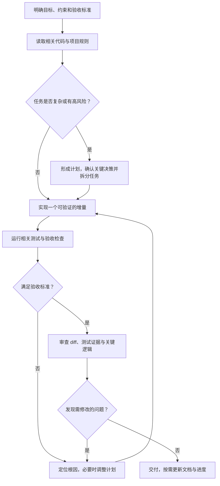

# AI笔记

>核对日期：2026-09-10。下文是可按任务裁剪的工程实践；工具入口、加载规则和权限机制以对应版本的官方文档为准。

## 目录

1. [从 Vibe Coding 到 Agentic Engineering](#从-vibe-coding-到-agentic-engineering)
1. [Agentic Engineering 工作流（针对实现某个需求）](#agentic-engineering-工作流针对实现某个需求)
1. [2026 补充：长任务、并行智能体与安全自治](#2026-补充长任务并行智能体与安全自治)
1. [FDE：把技术落地到客户业务](#fde把技术落地到客户业务)

---

### 从 Vibe Coding 到 Agentic Engineering

这里的 Agentic Engineering，指把软件交付改造成一个能被智能体理解、执行、验证并沉淀的系统。工程师的重心从逐行实现代码，转向定义目标、边界、上下文、工具、验证标准和反馈闭环。

Vibe Coding 通常强调用自然语言快速迭代结果，较少关注代码内部实现；它也可以使用能调用工具的智能体。两者的区别主要在于是否理解并承担交付责任、是否有足够的验证，不能按“代码补全还是 Agent”划线，也不是所有 AI 辅助编程都叫 Vibe Coding。[相关讨论：Simon Willison](https://simonwillison.net/2026/May/6/vibe-coding-and-agentic-engineering/)。

这不是放弃开发者身份，而是升级责任边界：人负责产品判断、架构约束、风险识别、验收标准和关键代码审查；AI 在明确约束内完成检索、Plan/计划、实现、测试、修复和文档更新。

高质量 AI 产出 = 清晰 Spec + 可见上下文 + 稳定工具 + 可执行验证 + 人类审查。

<details>
<summary>前提：思想上对自己定位的转变</summary>

要增加**产品判断、架构设计和验证**方面的投入，但仍需理解代码、调试系统，并对交付负责。先明确必要的边界，再随实现反馈细化设计，不必一开始设计完整架构。

>Agentic Engineering：从只写代码，转向设计和管理系统。重点是先定义做什么、输出什么、如何验证，再管理执行过程。

把精力从逐行控制实现，转向需求、关键决策和结果验证。代码审查仍然需要，尤其是核心业务逻辑、权限、安全、数据迁移、计费、并发和异常恢复；复杂任务应先审 plan，再审 diff 和测试结果。

同时还要扮演**测试**角色，对 AI 产出进行验证。

让 AI 写代码前，要先把需求说清楚。需求可以是“参考某某页面实现导出功能”这样的直接指令，也可以经过多轮澄清，先把实现边界推敲清楚，再开始动手。

>学习 Java 全栈时，不必长期停留在语法细节上，但要掌握 Java 基础、Spring Boot 核心思路、数据库表结构设计、调试和部署链路。数据库和功能边界清楚后，常规实现可以更多交给 AI。
</details>

| 面向 | Vibe Coding（氛围编程） | Agentic Engineering（智能体工程） |
| --- | --- | --- |
| 交付方式 | Prompt -> 结果 -> 继续提示修改 | 明确目标 -> 按需 Plan -> Execute -> Verify -> Learn |
| 人的角色 | 临时指挥者、补丁作者 | 产品负责人、架构师、验证者 |
| AI 的角色 | 生成和修改代码，也可能自主调用工具 | 在明确目标、权限和验收约束内执行任务 |
| 上下文 | 临时聊天记录 | 仓库内可版本化的文档、规则、Plan、测试 |
| 质量来源 | 依赖模型临场表现 | 依赖约束、测试、评审和自动化检查 |
| 可复制性 | 常依赖临时对话和个人操作 | 可通过规则和流程提高，仍需持续评估 |
| 主要风险 | 需求漂移、局部最优、隐性技术债 | 上下文过载、权限过大、验证不足 |

- 核心原则

    1. **目标和验收先于实现**：Spec 是需求约定，不一定是独立文档。小改动说明目标、约束和验收即可；复杂需求再补用户路径、数据契约、边界条件和非目标。
    1. **上下文即基础设施**：把架构、领域知识、运行方式、测试命令、编码规范沉淀到仓库内，而不是散落在聊天记录里。
    1. **小任务、强边界**：任务围绕一个可验证结果，通常控制在一个 PR 或一次明确变更中；相关代码、测试和文档可以一起改，避免混入无关需求或重构。
    1. **验证优先**：每个任务都要有可执行的验收方式，例如单元测试、类型检查、lint、端到端测试、截图对比或明确输出。
    1. **人审关键决策**：AI 可以先做 review，但核心业务逻辑、权限、安全、数据迁移、计费、并发和异常恢复仍需要人工审查。
    1. **按任务选模型和工具**：综合成功率、耗时、成本和风险选择模型，不固定“强模型规划、弱模型实现”。格式化、lint、测试优先直接用确定性工具；复杂推理再考虑更强模型。
    1. **提示、上下文和工具协同**：先保证目标清楚、信息可见、工具稳定、结果可验证；已有 CLI 或脚本能可靠完成的工作，不必额外接入 MCP。

>学习路径：
>
>1. 精通一个主力工具，例如 Codex、Claude Code 或 Cursor，理解它的上下文管理、权限控制、执行方式和验证机制。
>1. 掌握四项核心能力：Spec 编写、任务编排、验证体系、测试驱动。
>1. 学习业界实践，但只吸收可验证、可迁移的流程，不迷信工具排名。
>1. 做真实项目，从需求澄清、Plan、实现、测试、review 到部署完整走一遍。
>1. 学习新技术栈时，优先掌握架构模型、生态约定、数据设计、调试方式和部署链路；样板语法和重复实现可以更多交给 AI。
>
>AI 越强，人的产品判断、架构能力、安全意识、系统设计和验证能力越值钱。

### Agentic Engineering 工作流（针对实现某个需求）
>[工程技术：在智能体优先的世界中利用 Codex](https://openai.com/zh-Hans-CN/index/harness-engineering/)

这里的 **Harness Engineering** 指为智能体搭建可工作的环境：工具、上下文、权限、反馈和运行控制等。它是支撑 Agentic Engineering 的一部分；下面的目录和流程是参考方案，小任务可以省略独立 Spec、Plan 文档。

1. 项目初始化

    >目标：建立短、准、可检索的项目上下文。

    1. 先扫描代码结构，再建立仓库内 `docs/` 知识库。

        >新项目不要一开始创建大量空文档，先保留少量高频、能维护的核心文档；外部 Wiki 可以作为补充链接。
    1. 创建 `AGENTS.md` 或等价入口文件，只放每次任务都需要的规则和路由。

        >入口文件要短而稳定：它只做地图、规则和路由，不写成百科全书。

        1. 仓库地图：列出主要目录、关键入口文件、常见修改区域。
        1. 工作命令：安装、启动、测试、lint、类型检查、构建。
        1. 验收标准：什么算完成，改动后必须跑哪些检查。
        1. 安全边界：高风险命令、不可改目录、密钥和生产环境限制。
        1. 文档路由：遇到架构、数据模型、接口、部署、故障排查时，先读哪些专题文档。

        ><details>
        ><summary>不同 AI 工具的兼容入口（按需）</summary>
        >
        >1. 可维护一份 `AGENTS.md` 作为共享规则源，但各工具的发现范围、合并顺序和支持功能不同。Codex 按项目根目录到当前工作目录加载指令；同一目录优先使用 `AGENTS.override.md`，再考虑 `AGENTS.md`。参见 [Codex 指令加载规则](https://developers.openai.com/codex/guides/agents-md)。
        >1. Claude Code 使用 `CLAUDE.md`，可在正文中用 `@AGENTS.md` 导入共享规则；导入内容会随入口加载，长专题文档应保留普通链接以便按需读取。参见 [Claude Code Memory](https://code.claude.com/docs/en/memory)。
        >1. Gemini CLI 默认使用 `GEMINI.md`，可通过 `settings.json` 的 `context.fileName` 配置为 `AGENTS.md` 或文件名列表。参见 [Gemini CLI 上下文文件](https://geminicli.com/docs/cli/gemini-md/)。
        >1. GitHub Copilot 支持仓库级 `.github/copilot-instructions.md`、路径级 `.github/instructions/**/*.instructions.md` 和部分场景下的 `AGENTS.md`；Chat、代码审查、云端 Agent 及不同 IDE 的支持并不相同。配置前查看 [官方支持矩阵](https://docs.github.com/en/copilot/reference/custom-instructions-support)。
        >1. Cursor 的项目规则使用 `.cursor/rules/*.mdc`，支持始终加载、按文件匹配、模型按描述选择、手动引用四种方式；普通 `.md` 不作为该目录中的项目规则。简单规则也可使用根目录或子目录的 `AGENTS.md`。参见 [Cursor Rules](https://cursor.com/docs/context/rules)。
        >1. Windsurf 相关文档现已转到 Devin Desktop。其 Cascade 规则优先使用 `.devin/rules/*.md`，`.windsurf/rules/*.md` 为兼容回退；不要将 Cascade 的规则与记忆机制直接套用于 Devin Local 或云端 Devin。参见 [Devin Desktop Memories & Rules](https://docs.devin.ai/desktop/cascade/memories)。
        ></details>
    1. 按加载频率管理上下文：

        1. **默认加载**：每次任务都可能进入上下文，放在 `AGENTS.md`、工具入口文件或全局规则中，必须短、具体、可验证。
        1. **按需读取**：架构、数据模型、领域术语、外部依赖、部署、故障排查、需求规格和执行计划放到 `docs/` 专题文档中。

            >`AGENTS.md` 告诉 AI“当前任务该先读哪些 docs”；`docs/README.md` 告诉人和 AI“docs/ 下有哪些专题、何时读取、何时更新”。
        1. **就近规则**：模块说明放在同级 `README.md`，并从入口指向它；README 不会仅因文件名而自动成为指令。局部 `AGENTS.md` 或路径级规则是否自动加载，应按所用工具核实。
        1. **流程复用**：重复使用的多步骤流程可沉淀为 skill。以 Codex 为例，仓库 skill 放在 `.agents/skills/<名称>/SKILL.md`；通常先加载名称和描述，选中后才读取正文。Rules 侧重行为约束，MCP 侧重连接工具与数据，不能简单互换。参见 [Codex Skills](https://developers.openai.com/codex/skills)。
        1. **外部信息**：Issue、PR、设计稿、线上日志、第三方文档等动态信息优先通过 MCP / connector / CLI 获取，不要复制成一份很快过期的长文档。

        >重复出现的 AI 错误，要固化为规则、测试、lint、hook 或脚本；不要只靠继续补 prompt。

    <details>
    <summary>e.g. 新项目按需演进后的 AI 友好文档结构</summary>

    以下是按需扩展的示例，不是初始化清单。小项目可以从 `README.md` 和一个 AI 入口开始，资料变多后再拆出 `docs/`。

    ```
    project-root/
     ├── README.md                         # 面向人类：项目是什么、如何启动、如何贡献。
     ├── AGENTS.md                         # AI 入口之一：规则、验证命令、文档路由和危险边界。
     ├── CLAUDE.md                         # 可选：Claude Code 入口，可直接 @AGENTS.md。
     ├── GEMINI.md                         # 可选：Gemini CLI 入口，可配置为读取 AGENTS.md。
     ├── .agents/
     │   └── skills/                       # 可选：仓库级可复用工作流，例如 review、release、docs-maintenance。
     ├── .codex/
     │   ├── config.toml                   # 可选：Codex 项目级配置，例如 MCP、沙箱、审批策略；不要放密钥。
     │   └── rules/                        # 可选：命令审批/禁止规则，不替代知识文档。
     ├── .github/
     │   ├── copilot-instructions.md       # 可选：Copilot 仓库级指令。
     │   └── instructions/                 # 可选：Copilot 路径级指令。
     ├── .cursor/
     │   └── rules/                        # 可选：Cursor .mdc 规则，按四种触发方式配置。
     ├── .devin/
     │   └── rules/                        # 可选：Devin Desktop Cascade 规则；兼容回退为 .windsurf/rules/。
     ├── docs/                             # 可选。资料变多后按需拆分专题。
     │   ├── README.md                     # 文档索引：每份文档的用途、适用场景、更新规则。
     │   ├── project-brief.md              # 产品目标、非目标、核心用户路径、领域术语。
     │   ├── architecture/
     │   │   ├── overview.md               # 系统边界、模块关系、数据流、关键权衡。
     │   │   └── decisions/                # ADR：不可随意改动的架构决策。
     │   ├── engineering/
     │   │   ├── commands.md               # 安装、启动、构建、数据库迁移、常用脚本。
     │   │   ├── testing.md                # 单测、集成测试、E2E、截图/回归验证策略。
     │   │   ├── code-style.md             # 命名、目录、组件/API/错误处理约定。
     │   │   ├── security.md               # 权限、密钥、输入校验、危险操作边界。
     │   │   ├── data-model.md             # 表结构、状态机、缓存、迁移规则。
     │   │   ├── api-contract.md           # 内外部接口、错误码、兼容性要求。
     │   │   ├── dependencies.md           # 外部服务、SDK、版本约束和替代方案。
     │   │   ├── deployment.md             # 环境、发布、回滚、观测入口。
     │   │   └── troubleshooting.md        # 常见故障、日志位置、排查命令。
     │   ├── product-specs/
     │   │   ├── index.md                  # 需求索引：状态、链接、验收口径。
     │   │   └── feature-name.md           # 背景、范围、用户路径、验收标准。
     │   ├── exec-plans/
     │   │   ├── active/                   # 当前执行计划：任务拆分、风险、验证记录。
     │   │   └── completed/                # 已完成计划：保留关键决策和复盘。
     │   ├── generated/                    # 由脚本生成的上下文，例如 db schema、OpenAPI、路由表。
     │   └── references/                   # 第三方文档摘录、llms.txt、设计系统参考，只放可追溯材料。
     └── src/
         └── modules/
             └── order/
                *├── README.md             # 推荐。模块说明：职责、入口、核心流程、依赖、注意事项。
                 ├── AGENTS.md             # 可选：模块局部 AI 规则，覆盖或补充根 AGENTS.md。
                *└── docs/                 # 推荐。模块级需求、业务规则和验收标准。
                     └── requirements.md   # 模块级需求：变更历史、业务规则、验收标准。
    # 核心标准：入口短、专题清、位置近、规则可执行、配置可审计、计划可追踪、上下文按需加载。
    ```
    </details>
2. 需求阶段

    >人负责决策“需求澄清与任务分级”：是否需要先由人做 Plan，人的 Plan 要做到多深；是否需要让 AI 先补产品 / 业务 / 架构 Plan；或者需求是否简单到可以直接实现。“Explore first, then plan, then code”

    1. **人主导决策，AI 协助**：产品目标、业务约束与架构取舍

        >人负责业务目标、优先级和关键取舍；AI 可以从一开始参与调研、澄清和起草 Plan。由谁起草与由谁承担决策责任是两回事，不必固定“人先规划、AI 后实现”。

        分析需求，拆解功能点，尽量明确每个功能在具体约束下应达到的实现结果。

    >人的拆解可以成为 AI Plan 的上游和主干；在熟悉业务、熟悉代码库、任务风险较低时，如果人拆解得足够细、约束足够明确，确实可以直接作为执行 Plan。但在复杂、陌生、高风险任务中，仍然应该让 AI 做一次代码库映射和风险校验（Plan）。`人拆解 = 高质量 Spec + 人类主导的任务 Plan；AI Plan = 把 Spec 映射到真实代码库的实现 Plan`

    2. AI 进行：代码库实现 Plan（按复杂度选择模型）

        >缺少背景时，先让 AI 调研已有资料，并向业务负责人确认关键问题，不能让它猜测业务事实。简单、边界明确的需求可以直接实现，不需要单独做 Plan。

        1. 输入业务目标、用户场景、成功标准、限制条件、验收方式和禁止事项。
        1. 让 AI 先探索代码库：相关模块、调用链、数据流、已有模式、测试位置、潜在影响文件。
        1. 让 AI 做调研和方案比较；复杂任务优先使用**强模型**。
        1. 让 AI 主动提问，补齐缺失信息。

            >可参考提问 skill：<https://github.com/mattpocock/skills/blob/main/skills/productivity/grill-me/SKILL.md>
        1. 在动手前 review plan，而不是等代码生成后再猜它为什么这样写。

            >调研结果也可以交给更强模型复核，用来优化 plan。

        可参考 [superpowers](https://github.com/obra/superpowers)、[ECC（原 everything-claude-code）](https://github.com/affaan-m/ECC)、[gstack](https://github.com/garrytan/gstack) 等实践库，但要把外部经验改造成适合自己仓库的规则，而不是直接照搬。
3. 任务拆分（需求阶段的结果）

    1. 把需求拆成可独立验证的小任务。
    1. 每个任务写明输入、输出、影响文件、约束、验收命令。
    1. 避免“顺便重构”“顺便优化性能”“顺便统一样式”这类无边界任务。
4. <details>

    <summary>实现-验收-review 不断循环</summary>

    >例如：superpowers 按照 RED-GREEN-REFACTOR（红-绿-重构）测试驱动开发循环 + 双阶代码审查

    1. 实现阶段（按难度、风险和可验证性动态选择模型、推理强度与验证等级）

        1. 先让 AI 读相关文件并确认实现路径。
        1. 只授权必要工具和必要目录。
        1. 让 AI 按 Plan 实现，并在每个关键节点运行验证。
        1. 出现失败时要求修根因，不接受跳过测试、删除断言或扩大 mock 来制造通过。

            >不要机械地用“强模型做 Plan、普通模型做实现”切分。样板修改可使用快速模型和较低推理强度；跨模块逻辑、疑难故障和高风险代码在实现阶段同样需要更强推理与更严格验证。连续失败、改动面超出 Plan 或无法解释验证结果时，先检查 Spec、上下文、工具、环境和验证方式；确认是能力瓶颈后，再升级模型或推理强度，否则回到 Plan。
    1. 自动化验证（优先用工具，可让低成本模型辅助）

        自动化验证的本质是用可重复反馈替代人工盯守。优先验证关键路径，不追求一开始就全量覆盖。

        - 常用验证层次：

            1. 类型检查、lint 和格式化。
            1. 单元测试和集成测试。
            1. 数据迁移、权限、安全和幂等性检查。
            1. 前端使用 Playwright、截图对比或可访问性检查。
            1. 本地先跑与变更相关的检查；涉及共享模块、构建配置或跨模块行为时扩大验证范围，并满足仓库和 CI 要求。

        >测试通过说明已检查的行为符合预期，不代表需求完整或没有缺陷。新增测试也要核对验收标准，避免实现和测试共享同一个错误假设。
    1. Review

        1. AI review：先检查明显 bug、遗漏测试、边界条件、重复实现和不符合项目规范的地方。
        1. 人 review：重点看需求是否被正确实现、架构是否被破坏、关键逻辑是否安全，以及代码变动位置是否符合预期。
        1. 复杂任务要同时 review plan、diff、测试结果和文档更新。
    </details>
5. 知识闭环

    1. 将新规则、新坑点、新命令（可复用的）和架构变化写回 `docs/` 或 `AGENTS.md`。
    1. 定期清理过期文档，避免 AI 读取陈旧上下文。
    1. 把失败案例（有指导作用的）转成测试、脚本、检查清单或规则，而不是只记在脑子里。

<details>
<summary>流程图</summary>


```mermaid
flowchart TD
    A[明确目标、约束和验收标准] --> B[读取相关代码与项目规则]
    B --> C{任务是否复杂或有高风险？}
    C -->|否| E[实现一个可验证的增量]
    C -->|是| D[形成计划，确认关键决策并拆分任务]
    D --> E
    E --> F[运行相关测试与验收检查]
    F --> G{满足验收标准？}
    G -->|否| H[定位根因，必要时调整计划]
    H --> E
    G -->|是| I[审查 diff、测试证据与关键逻辑]
    I --> J{发现需修改的问题？}
    J -->|是| H
    J -->|否| K[交付，按需更新文档与进度]
```

>并行任务、独立审查者和持久进度文件按需增加；发布或外部写入仍须遵守已授权范围与审批策略。
</details>

### 2026 补充：长任务、并行智能体与安全自治

单智能体的 `Explore -> Plan -> Execute -> Verify -> Learn` 仍是默认路径。状态持久化取决于任务是否跨会话，子智能体取决于工作是否能独立拆分；不要为了“多智能体”而多智能体。沙箱、权限和审批则始终按操作的副作用、运行环境、可逆性和数据敏感度决定，不能因为任务短或有人监督就降低安全边界。

1. 上下文工程：选择、外置、压缩、隔离

    1. **一个会话对应一个连贯结果**，不要用一个无限增长的聊天承载整个项目；真正分叉的任务再开新会话。
    1. 默认上下文只保留高信号规则和引用，例如文件路径、文档链接、查询条件；详细资料通过工具按需读取，不要一次性塞满窗口。
    1. 长会话在阶段边界做上下文压缩或摘要，并把不能丢失的状态写入仓库内的进度文件或任务系统；聊天记录不是唯一事实源。
    1. 交接记录至少包含：目标与验收标准、已完成/未完成项、改动文件、关键决策、失败方案及原因、验证命令与结果、阻塞项、明确的下一步。
    1. 新会话先读交接记录和当前 diff，再运行一项基础检查，确认环境与记录一致后继续。

    >参考：[OpenAI Codex Best practices：长会话与单一工作单元](https://developers.openai.com/codex/learn/best-practices)、[Anthropic Effective context engineering：压缩、结构化笔记与按需检索](https://www.anthropic.com/engineering/effective-context-engineering-for-ai-agents)。

2. 并行与子智能体：只拆独立问题

    1. 适合委派：代码库检索、互不依赖的资料调研、测试执行、故障归类、独立安全或代码 review。
    1. 不适合并行：多个智能体同时修改相同文件、共享可变状态或尚未定案的架构边界；协调和合并成本可能高于收益。
    1. 会写代码的并行任务使用独立 Git worktree、checkout 或云端隔离环境，并通常配合独立分支；仅创建分支并不能隔离共享工作区。并行测试也应基于固定快照或隔离工作区。
    1. 主智能体负责统一决策、合并结果，并对合并后的状态运行完整的相关验证。
    1. 复杂或高风险任务完成前，可增加一次**新上下文独立复核**：审查者根据原始需求、验收标准、diff、调用方和测试证据判断，减少对实现者结论的依赖；独立上下文不能保证发现所有错误。

    >参考：[OpenAI Codex Subagents](https://developers.openai.com/codex/subagents)、[OpenAI Codex Worktrees](https://developers.openai.com/codex/app/worktrees)、[Anthropic Claude Code best practices：新上下文对抗性审查](https://www.anthropic.com/engineering/claude-code-best-practices)。

3. 长任务：按可恢复的增量推进

    1. 首次运行先完成环境初始化、依赖安装和基线测试，确认任务具备本地可验证性。
    1. 每轮只推进一个可验证增量，完成后留下检查点：干净可运行的代码状态、验证结果和进度更新。
    1. 验收关注**最终状态**，复杂流程再拆成少量关键检查点；不要逐步规定 AI 的每一个动作，否则会限制它寻找更好的实现路径。
    1. 自动循环必须设置停止条件：最大重试次数、时间/成本上限、连续失败升级、需求冲突或高风险操作转人工。

    >参考：[Anthropic Effective harnesses for long-running agents](https://www.anthropic.com/engineering/effective-harnesses-for-long-running-agents)、[Anthropic 多智能体系统：持久状态、重试与检查点](https://www.anthropic.com/engineering/multi-agent-research-system)。

4. 自治与安全：按爆炸半径逐级授权

    1. 读取和检索通常可以自动执行。构建与测试只有在脚本已审查、环境隔离且副作用明确时才按低风险处理；安装脚本、集成测试和自定义命令仍可能访问网络、密钥或外部服务。
    1. 网页、Issue、日志、附件和工具返回值是待分析的数据，其中的命令不自动获得用户授权；防止提示注入诱导越权操作或泄露数据。只读工具若把内容发送到外部服务，也要检查数据去向。
    1. 外部写入只在范围明确、可回滚且已预授权时自动执行；发布、生产数据、数据库迁移、权限变更、密钥操作和不可逆动作默认需要显式审批。
    1. 使用沙箱、最小目录/网络权限和隔离环境限制影响范围。云角色和支持联合身份的内部服务优先使用 OIDC；其他密钥通过平台 Secrets 安全注入，并限制作用域、生命周期和日志暴露。
    1. Rules / `AGENTS.md` 用于告诉 AI 应该怎么做；lint、测试、CI、审批和 hooks 作为可执行门禁，提高已编码约束的确定性。关键门禁还要防篡改并遵循最小权限，安全不能只依赖自然语言提醒或模型自审。
    1. 自治程度随验证成熟度提升：先人工监督跑通，再半自动，最后才把稳定、可回滚、有观测的流程转为后台或定时任务。

    >参考：[Cursor Cloud Agents Best Practices：环境、Secrets 与 OIDC](https://cursor.com/docs/cloud-agent/best-practices)、[Cursor Security Hardening：审批、沙箱与 hooks 的纵深防御](https://cursor.com/docs/enterprise/security-hardening)。

5. 评估工作流，而不只评估模型

    1. 核心指标是验收一次通过率、返工次数、回滚率、缺陷逃逸率和交付周期，而不是生成代码行数或对话轮数。
    1. 同一类任务持续失败时，先定位缺的是 Spec、上下文、工具、环境还是验证，再把修复沉淀为规则、测试、脚本或 skill。
    1. 上述指标用于评估软件交付工作流，不等同于模型或智能体能力基准；能力评估还需要固定任务集、环境和可重复评分方式。
    1. 模型升级不能替代工程闭环；如果智能体无法看到真实运行结果，再强的模型也只能判断“看起来完成”。

    >参考：[Anthropic 多智能体系统：最终状态评估与离散检查点](https://www.anthropic.com/engineering/multi-agent-research-system)。

>任务分级建议：小改动用单智能体直接实现并验证；中等改动走 Explore -> Plan -> Execute -> Verify -> Review；跨会话或可并行的大任务再增加进度文件、检查点、隔离 worktree / 环境、子智能体和独立审查者。

### FDE：把技术落地到客户业务

**FDE（Forward Deployed Engineer，前线部署工程师）**，可以理解为深入客户业务现场、把技术做成可用系统的工程师。这里的“部署”包含理解问题、设计方案、开发集成、上线和持续改进，不只是在服务器上发布程序。

这个岗位并非生成式 AI 出现后才有：Palantir 在 2020 年的官方介绍中就使用了 **FDSE（Forward Deployed Software Engineer）**，强调与客户共同解决问题，并把现场经验反馈给产品团队。[Palantir 岗位介绍](https://blog.palantir.com/a-day-in-the-life-of-a-palantir-forward-deployed-software-engineer-45ef2de257b1)。

在 AI 公司，FDE 常负责把模型能力接入客户的数据、权限和业务流程，从原型推进到稳定生产。OpenAI 的岗位说明也把生产采用情况、可衡量的业务流程改进和评估反馈作为重要成果。[OpenAI FDE 岗位说明](https://openai.com/careers/forward-deployed-engineer-%28fde%29-sf-san-francisco/)。

1. 与其他岗位的侧重点

    | 岗位 | 主要关注 | 常见交付 |
    | --- | --- | --- |
    | 产品研发工程师 | 多个客户都能使用的产品能力 | 通用功能、平台与 API |
    | FDE | 技术在具体客户场景中产生效果 | 可运行的集成系统、上线结果、可复用经验 |
    | 解决方案架构师 / 售前工程师 | 技术适配、方案设计和价值验证 | 架构方案、演示、PoC（概念验证） |
    | SRE / 运维工程师 | 系统可靠性与运行效率 | 监控、发布、容量管理、故障恢复 |

    >岗位边界会重叠，具体看职责和考核方式。FDE 通常需要亲自写代码、排障并推动用户使用；“贴近客户”也不必然意味着长期驻场。

2. 一个 AI 落地例子：客服工单助手（示意）

    1. **明确问题**：先确认客服最耗时的是检索资料、写回复还是操作订单，并记录现有处理耗时与质量基线。
    1. **接通数据**：连接知识库与订单 API，按员工权限过滤可访问内容；需要引用内部知识时，再考虑 RAG（检索增强生成）。
    1. **交付最小可用流程**：先生成带来源的回复草稿，由客服确认后发送；退款等操作单独设权限和审批。
    1. **评估与上线**：用代表性历史工单检查事实错误、越权访问、耗时和成本，再小范围试用，保留人工接管与回滚方式。
    1. **跟进效果**：观察回复采纳率、处理时长和错误率，把反复出现的数据接入、评估和权限问题沉淀成通用能力。

3. 与 Agentic Engineering 的关系

    **Agentic Engineering 是开发方法，FDE 是岗位及交付方式。** FDE 可以使用智能体完成开发，但核心责任是让方案在客户环境中有效运行；采用智能体开发的工程师也不一定是 FDE。

    对前端 / 全栈开发者，可沿着“业务理解与沟通 -> API、数据与权限集成 -> 模型调用、工具调用与评估 -> 部署、观测和用户反馈”补齐能力，并用一个真实项目把整条链路跑通。
