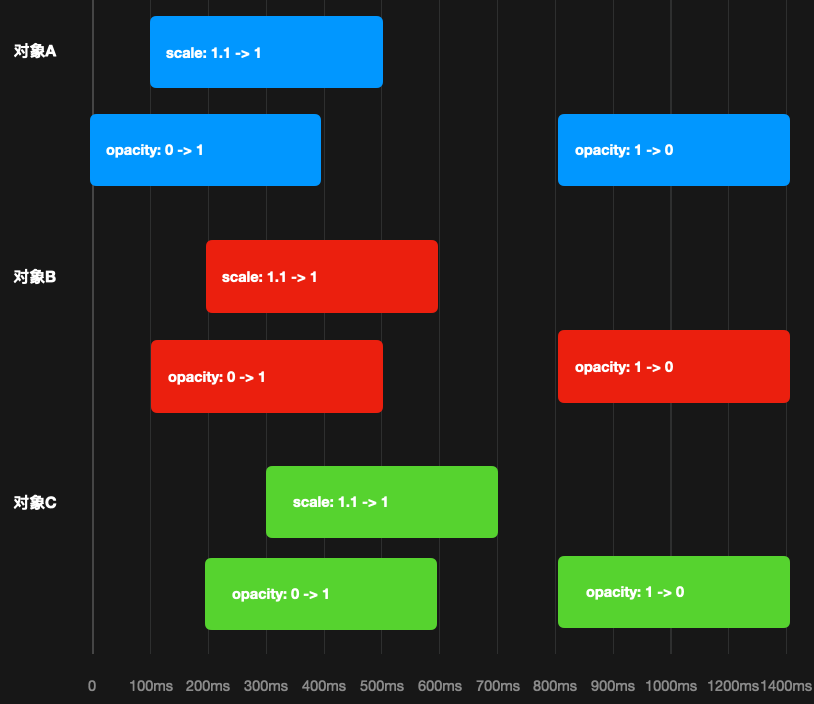
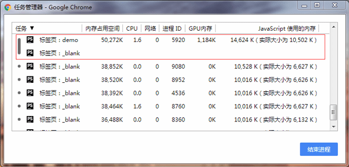
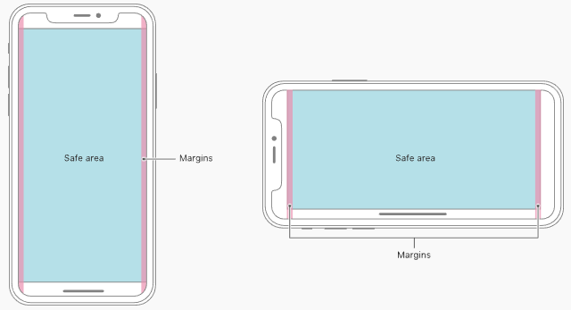

# HTML+CSS学习笔记

## 目录
1. [经验总结](#经验总结)

    1. [渲染性能（rendering performance）](#渲染性能rendering-performance)
    1. [水平居中、垂直居中](#水平居中垂直居中)
    1. [自适应宽度布局](#自适应宽度布局)
    1. [`flex`优雅解决布局、自适应问题](#flex优雅解决布局自适应问题)
    1. [经验技巧](#经验技巧)
    1. [Tips](#tips)
1. [CSS](#css)

    1. [CSS选择器](#css选择器)
    1. [CSS继承](#css继承)
    1. [CSS盒模型](#css盒模型)
    1. [`margin`合并](#margin合并)
    1. [BFC（Block Formatting Context）块级格式上下文](#bfcblock-formatting-context块级格式上下文)
    1. [层叠上下文（stacking context）](#层叠上下文stacking-context)
    1. [媒体查询](#媒体查询)
    1. [块级元素的`width`](#块级元素的width)
    1. [使元素强制表现为`block`的CSS设置](#使元素强制表现为block的css设置)
    1. [换行属性](#换行属性)
    1. [CSS的小数、百分比](#css的小数百分比)
    1. [`em`、`%`](#em)
    1. [`line-height`](#line-height)
    1. [``的`src`属性](#img的src属性)
    1. [安全区域适配](#安全区域适配)
    1. [滚动条](#滚动条)
    1. [`@font-face`](#font-face)
    1. [`text-align: justify;`](#text-align-justify)
    1. [CSS渐变](#css渐变)
    1. [裁剪属性](#裁剪属性)
    1. [`table-layout`](#table-layout)
    1. [横竖屏切换（模拟手机屏幕旋转）](#横竖屏切换模拟手机屏幕旋转)
1. [HTML + CSS](#html--css)

    1. [禁用`<a>`的鼠标、键盘事件](#禁用a的鼠标键盘事件)
    1. [插件避免被其他样式污染方式](#插件避免被其他样式污染方式)
    1. [网页图标favicon的兼容写法](#网页图标favicon的兼容写法)
    1. [富文本编辑器](#富文本编辑器)

---

## 经验总结

### 渲染性能（rendering performance）

><details>
><summary>每一帧耗时</summary>
>
>1. 为了视觉上连贯，浏览器对每一帧画面的所有工作需要在16ms（1000ms / 60f ~= 16.66ms/f）内完成。
>2. 渲染画面时，浏览器需要进行一些流程工作：渲染队列的管理、渲染线程与其他线程之间的切换等。因此一帧中花费在像素渲染管道（JS -> Style -> render tree）的时间要控制在10至12ms内，再余出4至6ms进行流程工作。
>3. 一帧画面理想的耗时组合为：`16ms = 3~4ms的JS代码 + 7~8ms的渲染工作 + 4~6ms的流程工作`。
></details>

1. 像素渲染管道：

    `CSS/JS` -> `Style（计算样式）` >> `Render Tree（渲染树）`：`Layout（布局）` -> `Paint（绘制）` -> `Composite（渲染层合并）`

    >Render Tree：改变前一个步骤需要后一个步骤也做出处理，所以若能够仅处理越后面的步骤，对性能耗费越少。

    1. `CSS/JS`：

        使用CSS（动画：`animation-@keyframes`、`transition`）或JS或Web Animation API，实现视觉变化效果。

        >1. JS动画（命令式）比CSS动画（说明式）消耗多一些资源，浏览器会对CSS动画自动进行优化。
        >
        >    1. CSS的`animation`相关事件：
        >
        >        `animationstart`、`animationend`、`animationcancel`、`animationiteration`
        >    2. CSS的`transition`相关事件：`transitionend`
        >2. 动画其实就是按某种顺序、**平滑**地修改样式：如：颜色、大小、间距、`transform`等。
    2. `Style`：

        根据CSS选择器，生成完整的CSSOM。
    3. `Layout`：

        具体计算每个节点最终在屏幕上显示的大小和位置。
    4. `Paint`：

        >耗费性能最大的工作。

        填充像素的过程。包括绘制文字、颜色、图像、边框、阴影等，也就是DOM所有的可视效果。一般来说，这个绘制过程是在多个层（composite layers）上完成。
    5. `Composite`：

        在每个层（composite layers）上完成绘制过程后，浏览器会将所有层按照合理的顺序合并成一个图层再显示。

>第一次确定节点的大小和位置是`Layout`，随后对节点大小和位置的重新计算是`reflow`。同理`Paint`与`repaint`。

2. `reflow`、`repaint`：

    >CSS属性触发reflow、repaint、composite的情况：[CSS Triggers](https://csstriggers.com/)。

    1. `reflow`（重排）：

        某个元素上执行动画时，浏览器需要每一帧都检测是否有元素受到影响，并调整它们的大小、位置，通常这种调整都是联动的。

        1. 当遇到reflow问题时，考虑调整JS代码书写。
        2. 触发一个元素layout改变，几乎总是导致整个DOM都要reflow。
    2. `repaint`（重绘）：

        浏览器还需要监听元素的外观变化，通常是背景色、阴影、边框等可视元素，并进行repaint。

        1. 当遇到repaint问题时，对于仅改变composite属性的元素，考虑单独提升到一个层（composite layers）中。
        2. 浏览器不会始终repaint整个层（composite layers），而是智能地对DOM中失效的部分进行repaint。
    3. `composite`：

        每次reflow、repaint后浏览器还需要层合并再输出到屏幕上。

    >那些容易忽略的**能引起布局改变的样式修改**，它们可能不产生动画，但当浏览器需要重新进行样式的计算和布局时，依然会产生reflow和repaint。
3. 创建composite layers（层、渲染层、复合层），交由GPU处理（CPU不再处理）：

    >GPU（图形处理器）是与处理和绘制图形相关的硬件，专为执行复杂的数学和几何计算而设计的，可以让CPU从图形处理的任务中解放出来，从而执行其他更多的系统任务。

    1. 强制普通元素提升到单独层的方法：

        1. `will-change: ;`（现代浏览器，最佳方式）。
        2. `transform: translateZ(0);`（hack方式）。

        >有些情况无法互相替代。
    2. 自带单独层的元素：

        1. 使用加速视频解码的`<video>`元素。
        2. 拥有3D（WebGL）上下文或加速的2D上下文的`<canvas>`元素。
        3. Flash等混合插件。
    3. 其他提升至单独层的方法：

        1. `transform 3D`或`perspective`。
        2. 若有一个元素，它的兄弟元素在层中渲染，而这个兄弟元素的`z-index`比较小，则这个元素（不管是不是应用了硬件加速样式）也会被放到层中。
        3. 对自己的`opacity`做CSS动画或使用一个动画变换的元素。
        4. 拥有加速CSS过滤器的元素。
        5. 元素有一个包含层的后代节点（换句话说，就是一个元素拥有一个后代元素，该后代元素在自己的层里）。

    >有时，虽然提升元素，却仍需要repaint。
4. 动画性能最好、消耗最低的属性（必须自身元素已提升至单独层）：

    对于以下属性修改，若元素自身被提升至单独层，则仅触发composite，否则触发paint -> composite。

    1. 位置：`transform: translate(xpx, ypx);`
    2. 缩放：`transform: scale(x, y);`
    3. 旋转：`transform: rotate(xdeg);`
    4. 倾斜：`transform: skew(xdeg,ydeg);`
    5. 透明：`opacity: x;`
5. 渲染性能优化方法：

    >参考：[渲染性能](https://developers.google.com/web/fundamentals/performance/rendering/)。

    1. 优化JS的执行效率

        1. 把DOM元素的操作划分成多个小任务，分别在多个帧中去完成。
        2. 不在连续的动画过程中做高耗时的操作（如：大面积reflow、repaint、复杂JS计算）。
        3. 对于动画效果的实现，建议使用`requestAnimationFrame`（或[velocity动画库](https://github.com/julianshapiro/velocity)），避免使用~~setTimeout、setInterval~~。
        4. 把耗时长的JS代码放到`Web Worker`中去做。
        5. 用操作class替代~~直接操作CSS属性~~。
    2. 缩小样式计算的范围和降低复杂度

        1. 降低样式选择器的复杂度、提升[选择器性能](https://github.com/realgeoffrey/knowledge/blob/master/网站前端/HTML+CSS学习笔记/README.md#css选择器)。

            ><details>
            ><summary>可以使用基于class的方式，如：BEM</summary>
            >
            >1. `block-name__element-name--modifier-name--modifier-val`（[getbem.com](http://getbem.com/naming/)）
            >2. `block-name__element-name_modifier-name_modifier-val`（[en.bem.info](https://en.bem.info/methodology/naming-convention/)）
            ></details>
        2. 减少需要执行样式计算的元素的个数（随着元素递增而计算量线性递增）。
    3. 避免大规模、复杂的layout与reflow

        1. 避免强制同步布局

            >强制同步布局（forced synchronous layouts）：使用JS强制浏览器提前执行layout。

            实行**先读后写**原则：先批量读取元素样式属性（返回上一帧的值），再对样式属性、类名等进行写操作。

            ><details>
            ><summary>e.g.</summary>
            >
            >```javascript
            >/* bad：强制同步布局，可能产生布局抖动 */
            >dom.forEach(function (elem) {
            >    if (window.scrollY < 200) { // 计算读取layout
            >        elem.style.opacity = 0.5;   // JS写入样式
            >    }
            >});
            >
            >/* good：先读后写 */
            >if (window.scrollY < 200) { // 计算读取layout
            >    /* 批量JS写入样式 */
            >    dom.forEach(function (elem) {
            >        elem.style.opacity = 0.5;
            >    });
            >}
            >```
            ></details>
        2. 避免布局抖动

            >布局抖动（layout thrashing）：快速多次进行强制同步布局。
        3. 使用离线DOM操作样式完毕，再添加或替换到文档中；把文档中要操作的DOM设置为`display: none;`再操作样式，操作完毕后恢复复显示。
        4. `position: absollute/fixed;`的元素reflow开销较小。
        5. 使用[`flex`](https://github.com/realgeoffrey/knowledge/blob/master/网站前端/HTML+CSS学习笔记/弹性盒子（Flexbox）.md)布局（对于相同数量的元素、视觉外观，flex布局的时间更少）。
    4. 简化绘制的复杂度、减小绘制区域

        合理划分层，动静分离，可避免大面积重绘。
    5. 优先使用层（composite layers）来统一操作动画，并控制层数量

        若元素仅改变composite，则将其提升至单独的层。

        1. 只使用`transform/opacity`来实现动画效果。
        2. 用`will-change/translateZ`属性把动画元素提升到单独的层中。
        3. 避免滥用层提升、避免创建过多层（更多的层需要更多的内存和更复杂的管理）。
        4. 使用3D硬件加速提升动画性能时，最好给元素增加一个`z-index`属性（改变层叠上下文的顺序），人为干扰层排序，可以有效减少Chrome创建不必要的层，提升渲染性能。

            >若有一个元素，它的兄弟元素在层中渲染，而这个兄弟元素的`z-index`比较小，则这个元素（不管是不是应用了硬件加速样式）也会被放到层中。
    6. 对用户输入、滚动事件进行[函数防抖](https://github.com/realgeoffrey/knowledge/blob/master/网站前端/JS学习笔记/README.md#函数防抖函数节流)处理

        >滚动会触发高频率重新渲染，scroll事件的处理函数也会被高频率触发。

        1. 避免使用运行时间过长的事件处理程序，它们会阻塞页面的滚动渲染。
        2. 避免在事件处理程序中修改样式属性。
        3. 对事件处理程序去抖动（debounce），存储事件对象的值，然后在`requestAnimationFrame`回调函数中修改样式属性。
6. 经验：

    1. 追查性能问题、优化动画时：
        1. 打开**Layer Borders**、**Paint Flashing**选项；
        2. 使用Chrome [Performance](https://developers.google.com/web/tools/chrome-devtools/evaluate-performance/timeline-tool)工具检查。
    2. 低性能设备（Android）优先调试。

        1. （除了**CSS3旋转属性**与**内嵌滚动条**同时出现无法解决）样式问题都可以像处理ie6问题一样通过真机试验出解决方案。
        2. 有些低版本机型会有类似ie6的CSS问题，包括**CSS3的厂商前缀（`-webkit-`等）**、**层叠关系（`z-index`）**，并且要更注意**渲染性能（层产生）**。
    3. 字体模糊或抖动、图像锯齿等，可以考虑交由GPU处理。
    4. `transform: translate`进行非整数平移时，会产生模糊（注意百分比可能会计算成非整数）。
    5. <details>

        <summary>制作动画，最好从设计师那里获得 动画demo + 动效参数文档（对象、变化属性、时机时长、缓动函数）。</summary>

        

        >一份清晰的标注文档，能将动效的细节参数跟开发更好的明确下来；开发也能够减少动画流程记忆，加快动画开发效率。

        </details>

    - 因为某些原因（参考：[如何在 Windows 上享受更棒的字体渲染  | 实用技巧](https://sspai.com/post/52557)），`微软雅黑`等字体在Windows进行Hint处理会导致模糊、笔画高低不平。

        前端解决方案（避免Hint导致以上问题）：替换字体、提升`font-size`、去除粗体。如：微软雅黑，≥17px的粗体，≥14的非粗体。

        >Hint：Windows对于低分辨率屏幕下字体显示进行的特殊处理，当**屏幕分辨率过低**或**字太小**不足以显示所有文字细节时，Windows会启动Hint让文字变得更清晰。
        >
        >每个字体本身会带有一个GASP表，Windows的渲染引擎会根据这些GASP表来判断是否需要做处理。然而如果字体的GASP表不完善，就会让Hint误操作。

### 水平居中、垂直居中
1. 水平居中

    1. 内容宽度确定

        ```css
        .son {
            width: 宽度;
            margin: 0 auto;
        }
        ```
    2. 内容宽度不确定

        1. 父级`display: flex; justify-content: center;`；或父级`display: flex;`，单子级`margin: 0 auto;`。

            >兼容ie11+。

            ```scss
            .father {
                display: flex;
                justify-content: center;
            }

            /* 或 */

            .father {
                display: flex;

                .son {  /* 单子级的margin左右占满父级 */
                    margin: 0 auto;
                }
            }
            ```
        2. 子级`display: table; margin: 0 auto;`。

            >兼容ie8+。

            ```css
            .son {
                display: table;
                margin: 0 auto;
            }
            ```
        3. 父级`position: relative;`，子级`position: absolute; left: 50%; transform: translateX(-50%);`。

            >兼容ie9+。

            ```scss
            .father {
                position: relative;

                .son {
                    position: absolute;
                    left: 50%;
                    transform: translateX(-50%);
                    -ms-transform: translateX(-50%);
                }
            }
            ```
        4. 父级`text-align: center;`，子级`display: inline-block;`。

            ```scss
            .father {
                text-align: center;
                font-size: 0;

                .son {
                    display: inline-block;
                    *display: inline;
                    *zoom: 1;

                    font-size: ;
                }
            }
            ```
2. 垂直居中

    1. 内容高度确定

        父级`position: relative;`，子级`position: absolute; top: 50%; margin-top: 负一半高度;`。
    2. 内容高度不确定

        1. 父级`display: flex; align-items: center;`。

            >兼容ie11+。

            ```scss
            .father {
                display: flex;
                align-items: center;
            }
            ```
        2. 父级`display: table-cell; vertical-align: middle;`，子级`display: inline-block;`。

            ```scss
            .father { /* （为兼容低版本ie）不能是float或absolute，可以在外嵌套float或absolute */
                display: table-cell;
                vertical-align: middle;

                /* ie6/7需要：height/font-size = 1.14 */
                *height: 114px;
                *font-size: 100px;

                .son {  /* （为兼容低版本ie）必须是行内元素 */
                    display: inline-block;
                    *display: inline;
                    *zoom: 1;
                    /*vertical-align: middle;*/
                }
            }
            ```

            [CodePen demo](https://codepen.io/realgeoffrey/pen/RXoEyW)
        3. 父级`position: relative;`，子级`position: absolute; top: 50%; transform: translateY(-50%);`。

            >兼容ie9+。

            ```scss
            .father {
                position: relative;

                .son {
                    position: absolute;
                    top: 50%;
                    transform: translateY(-50%);
                    -ms-transform: translateY(-50%);
                }
            }
            ```
        4. 辅助参考元素`display: inline-block; vertical-align: middle; height: 100%;`，子级`display: inline-block; vertical-align: middle;`。

            1. 伪元素：

                >兼容ie8+。

                ```scss
                .father {
                    font-size: 0;

                    &:before {
                        content: "";
                        display: inline-block;
                        vertical-align: middle;
                        height: 100%;
                    }
                    .son {
                        display: inline-block;
                        vertical-align: middle;

                        font-size: ;
                    }
                }
                ```
            2. 额外元素：

                ```html
                <style>
                    .father {
                        font-size: 0;
                    }
                    span {
                        display: inline-block;
                        *display: inline;
                        *zoom: 1;
                        vertical-align: middle;
                        height: 100%;
                    }
                    .son {
                        display: inline-block;
                        *display: inline;
                        *zoom: 1;
                        vertical-align: middle;

                        font-size: ;
                    }
                </style>

                <div class="father">
                    <span></span>
                    <div class="son"></div>
                </div>
                ```
3. 水平、垂直居中

    1. 内容高度、宽度确定

        父级`position: relative;`，子级`position: absolute; top: 50%; left: 50%; margin-top: 负一半高度; margin-left: 负一半宽度;`。
    2. 内容高度、宽度不确定

        1. 父级`display: table-cell; text-align: center; vertical-align: middle;`，子级`display: inline-block;`。

            ```scss
            .father {
                display: table-cell;
                text-align: center;
                vertical-align: middle;

                /* ie6/7需要：height/font-size = 1.14 */
                *height: 114px;
                *font-size: 100px;

                .son {
                    display: inline-block;
                    *display: inline;
                    *zoom: 1;
                    /*vertical-align: middle;*/
                }
            }
            ```
        2. 父级`position: relative;`，子级`position: absolute; top: 50%; left: 50%; transform: translate(-50%, -50%);`。

            >兼容ie9+。

            ```scss
            .father {
                position: relative;

                .son {
                    position: absolute;
                    top: 50%;
                    left: 50%;
                    transform: translate(-50%, -50%);
                    -ms-transform: translate(-50%, -50%);
                }
            }
            ```
        3. 父级`display: flex; justify-content: center; align-items: center;`。

            >兼容ie11+。

            ```css
            .father {
                display: flex;
                justify-content: center;
                align-items: center;
            }
            ```

### 自适应宽度布局
1. [`flex`实现](https://github.com/realgeoffrey/knowledge/blob/master/网站前端/HTML+CSS学习笔记/弹性盒子（Flexbox）.md#flex布局实践)
2. `float`

    >`float`节点：可以填补在**之后节点**的水平`margin`内（`padding`内不可以）；不可以填补在**之前节点**的水平`margin`内。

    1. 中间内容自适应，两边固定（中间内容最后加载）

        ```html
        <style type="text/css">
            .float-l {
                float: left;
                _display: inline;
                width: 左边块宽度;
            }
            .float-r {
                float: right;
                _display: inline;
                width: 右边块宽度;
            }
            .middle {
                margin-left: 大于等于左边块宽度;
                margin-right: 大于等于右边块宽度;
            }
        </style>

        <div class="clearfix">
            <div class="float-l">左边内容</div>
            <div class="float-r">右边内容</div>
            <div class="middle">中间内容</div>
        </div>
        ```

        >1. DOM结构不能颠倒，需要中间结构放最后;
        >2. 节点上能设定`clear: both;`。
    2. 中间内容自适应，两边固定（中间内容最先加载）

        >所谓的「双飞翼布局」。

        ```html
        <style type="text/css">
            .main-out,
            .float-l,
            .float-r {
                float: left;
                _display: inline;
            }
            .middle-out {
                width: 100%;
            }
            .middle-in {
                margin: 0 大于等于右边块宽度 0 大于等于左边块宽度;
            }
            .float-l {
                width: 左边块宽度;
                margin-left: -100%;
            }
            .float-r {
                width: 右边块宽度;
                margin-left: -左边块宽度;
            }
        </style>

        <div class="clearfix">
            <div class="middle-out">
                <div class="middle-in">
                    中间内容
                </div>
            </div>
            <div class="float-l">左边内容</div>
            <div class="float-r">右边内容</div>
        </div>
        ```

        >1. DOM结构不能颠倒，需要中间结构放最前;
        >2. 节点上能设定`clear: both;`。
    3. 中间与两边内容都自适应

        ```html
        <style type="text/css">
            .float-l {
                float: left;
                _display: inline;
            }
            .float-r {
                float: right;
                _display: inline;
            }
            .middle {
                display: table-cell;
                *display: inline-block;
                width: 9999px;
                *width: auto;
            }
        </style>

        <div class="clearfix">
            <div class="float-l">左边内容</div>
            <div class="float-r">右边内容（没有足够空间则整体换行）</div>
            <div class="middle">中间内容（没有足够空间则整体换行）</div>
        </div>
        ```

        >1. DOM结构不能颠倒，需要中间结构放最后;
        >2. 节点上能设定`clear: both;`;
        >3. 完全由内容决定布局；
        >4. 第一块内容要给第二块内容留下足够空间，否则第二块放不下会整个换行；第一块+第二块要给第三块留下足够空间，否则第三块放不下会整个换行。

### [`flex`](https://github.com/realgeoffrey/knowledge/blob/master/网站前端/HTML+CSS学习笔记/弹性盒子（Flexbox）.md#flex语法)优雅解决布局、自适应问题
1. 不使用`flex`导致不方便处理的问题：

    1. 栅格系统
    2. [自适应宽度布局](https://github.com/realgeoffrey/knowledge/blob/master/网站前端/HTML+CSS学习笔记/README.md#自适应宽度布局)
    3. [水平居中、垂直居中](https://github.com/realgeoffrey/knowledge/blob/master/网站前端/HTML+CSS学习笔记/README.md#水平居中垂直居中)

        >[图标和文字并排垂直水平居中](https://github.com/realgeoffrey/knowledge/blob/master/网站前端/HTML+CSS学习笔记/实现具体业务.md#图标和文字并排垂直水平居中)
    4. [粘性页脚](https://github.com/realgeoffrey/knowledge/blob/master/网站前端/HTML+CSS学习笔记/实现具体业务.md#粘性页脚)
    5. [多列等高](https://github.com/realgeoffrey/knowledge/blob/master/网站前端/HTML+CSS学习笔记/实现具体业务.md#多列等高)
2. `flex`具体解决方案：[`flex`布局实践](https://github.com/realgeoffrey/knowledge/blob/master/网站前端/HTML+CSS学习笔记/弹性盒子（Flexbox）.md#flex布局实践)。

### 经验技巧
1. 命名间隔

    >`-`短横线隔开式（kebab-case）、小驼峰式（camelCase）、大驼峰式（PascalCase）、`_`。

    1. HTML的class和id：`-`。
    2. 图片命名：`_`。
    3. 其他文件（除了.vue组件文件）：`-`。
    4. JS相关：

        1. JS的变量和函数：小驼峰式（构造函数：大驼峰式）。
        2. .vue组件文件：大驼峰式或`-`（且需要2个以上单词）。

            >页面文件（如：nuxt的pages）：按照路由访问命名（习惯用`-`）。
2. 大小写

    1. CSS属性名和属性值：不区分大小写。

        >`content`的属性值区分大小写。`font-family`的属性值不区分大小写。
    2. CSS选择器：

        1. 大部分不区分大小写；
        2. `类选择器`、`ID选择器`、`自定义属性的属性选择器的属性值`区分大小写。
    3. CSS变量：区分大小写。
    4. HTML标签：不区分大小写。
    5. HTML标签的属性名和属性值：

        1. 属性名不区分大小写；

            >自定义属性的属性名也不区分大小写。
        2. 大部分属性值不区分大小写；
        3. `class`、`id`、`value`、`自定义属性`等的属性值区分大小写。
    6. JS相关：

        1. `attribute`不区分大小写（`.attributes`、`.getAttribute/setAttribute/removeAttribute/hasAttribute/toggleAttribute`）
        2. `property`的属性名是固定的，不因为`attributes`而改变。

3. 引号使用

    1. HTML标签的`attribute`的值、CSS样式属性的值（如：`content`、`font-family`、`quotes`）：

        >除了有空格之外，都允许不加引号。建议：HTML标签的`attribute`的值都添加，CSS样式属性的值都不添加。

        双引号`"`
    2. JS代码的字符串：

        单引号`'`
4. CSS命名规范

    1. BEM（以及变种）

        1. `block-name__element-name--modifier-name--modifier-val`
        2. `is-状态`

        >1. `--modifier`：仅包括多种外观的不同样式，如：size、type、color、font。
        >2. `is-状态`：仅包括JS控制状态显示的不同样式，如：active、disabled、show。

        - `j-`：仅给JS使用的选择器，意味着不会有样式添加到这个选择器上。

        >其他CSS模块化理论：OOCSS、SMACSS。
    2. <details>

        <summary><del>已过时的方案</del></summary>

        1. 布局`.g-`（grid）

            将页面分割为几个大块的布局，一般来说是页面最外层的类名。
        2. 模块`.m-`（module）

            可重复使用的较大的整体。
        3. 元件`.u-`（unit）

            不可再分的较为小巧的个体，通常被重复用于各种模块中。
        4. 状态`.z-`（zhuangtai）

            为状态类样式加入前缀，统一标识，方便识别，只作为后代选择器使用（如：`.z-hover`或`.z-active`）。
        5. 样式区分`.i-`（icon）

            同一批内容的不同样式（如：仅背景不同的几个按钮），可以用`.i-1`、`.i-2`区分样式。

            >若在模块上，则可以使用**选择器扩展**而不加前缀`.i-`，如：`.m-xxx`扩展内容`.m-xxx-1`、`.m-xxx .btn`扩展内容`.m-xxx .btn-1`。
        6. JS功能`.j-`（JS）

            仅作为JS锚点使用，不添加任何CSS样式。

        >- 皮肤`.s-`（skin）
        >
        >    把皮肤型的样式抽离出来。
    </details>
5. 经验

    1. （标签）语义化：让机器可以读懂内容

        >先用纯HTML标签语义化结构，再加入CSS满足样式，最后加入交互。

        1. 去掉或丢失样式能够让页面呈现出清晰的结构。
        2. 有利于SEO（爬虫依赖于标签来确定上下文和各个关键字的权重）。
        3. 方便其他设备解析（如：屏幕阅读器、盲人阅读器、移动设备）以特殊方式渲染网页。
        4. 便于团队开发和维护，更具可读性、减少差异化。
    2. 合理减少层级嵌套，行内元素不要嵌套块级元素（如：`<a>`不嵌套`<div>`）。
    3. 用父节点的class去管理子节点。
    4. 有些WAP端（如：Android各奇葩机型）页面的点击按钮制作大一些，否者难以点击触发JS效果。
6. CSS编码规范

    绝大部分同意[fex-team:tyleguide](https://github.com/fex-team/styleguide/blob/master/css.md#css编码规范)。

    >可以设置为IDEs的**Reformat Code**的排版样式。
7. CSS注释方式

    除了普通注释之外，还可以把注释内容放在根元素的伪元素中：

    ```css
    :root:before {
      content: "author: 重构; design: 设计师; update: 更新时间;";
      display: none;
    }
    ```

### Tips
1. 限定布局宽度，让内容决定布局高度。
2. `<a>`的属性`target="_blank"`，在一些浏览器中，无论`href`值是什么内容（包括`#`和`javascript:`）都会打开新页面。
3. 在拥有`target="_blank"`的`<a>`中添加`rel="noopener"`或`rel="noreferrer"`。

    >没有`target="_blank"`属性的新打开的页面和原页面不存在关系。

    1. 没有添加额外的`rel`属性的开启新窗口：

        1. 新页面将与原页面在同一个进程上运行，若执行开销大的JS，会互相影响性能。
        2. 新页面可以通过`window.opener`访问原窗口对象，并使用`window.opener.location`改变原页面导航。

        ><details>
        ><summary>Chrome任务管理器展示：<code>target="_blank"</code>但未设置<code>rel</code></summary>
        >
        >
        ></details>
    2. 添加额外的`rel`属性：

        1. `rel="noopener"`的新窗口：

            与原页面不在同一个进程、且`window.opener`返回`null`。

            - 相同：`window.open(地址, '_blank', 'noopener')`。
        2. `rel="noreferrer"`（不限于`target="_blank"`）：

            >包含`rel="noopener"`。

            （不在一个进程、且`window.opener`返回`null`，）http请求不发送`Referer`（`document.referrer`返回`''`）。

            - 相同：`window.open(地址, '_blank', 'noreferrer')`。
4. （SEO）对不想宣传的链接，在`<a>`中添加`rel="nofollow"`。

    ><details>
    ><summary>告诉搜索引擎「不要跟踪此网页上的链接」或「不要跟踪此特定链接」</summary>
    >
    >1. 可以用于阻止在PR值高的网站上以留言等方式添加链接从而提高自身网站排名的行为，以改善搜索结果的质量，防止垃圾链接的蔓延。
    >2. 网站站长也可对其网页中的付费链接使用nofollow来防止该链接降低搜索排名。
    >3. 对一些重要度低的网页内容使用nofollow，还可以使搜索引擎以不同的优先级别来抓取网页内容。
    ></details>
5. 404和5xx错误需要制作页面。
6. 没有设置宽度的`float`元素，其宽度等于子节点宽度：

    1. 主流浏览器等于最外层子节点宽度。
    2. ie6等于所有子节点中最大的宽度。
7. `inline`、`inline-block`的元素前可能有空隙（其实是行内标签前面的空白符，若拥有`font-size`之后便会有高宽），通过以下办法解决：

    1. 把`inline`、`inline-block`节点设置为`block`。
    2. 给父级节点设置`font-size: 0;`（可用此方法排查是否是空格造成的）。
8. 页面是按照顺序加载资源，当且仅当有使用需求时才会去加载外部资源。

    已加载完成的CSS文件内有多个URL请求（`background`），但仅在页面节点要引用某个URL请求时（无论节点是否隐藏），才会去请求这个资源，而不是在加载CSS文件时就加载外部资源。可以用于监控用户行为（当用户某些操作导致展示背景时加载外部资源——外部资源可以是上报接口）。
9. 使用动态DOM加载，替代内容的`display: none;`（免去构建复杂的DOM）：

    1. `<script type="text/template"></script>`
    2. `<template></template>`
    3. `<textarea style="display:none;"></textarea>`
10. WAP端页面或支持伪类的浏览器，能用`:before/after`的就不要添加标签（但是不要在`content`里加业务文字）。
11. 单选`<input type="radio">`、多选`<input type="checkbox">`按钮开关自定义样式：

    用`input:checked + 兄弟节点`操作选项选中与否的不同样式；可以隐藏`<input>`，点击在`<label>`上改变`<input>`的`:checked`状态（`<label>`的`for`绑定`<input>`的`id`），用自定义样式来制作单选框、复选框。避免使用JS。
12. 输入框仅输入数字的：

    1. `<input type="number" pattern="[0-9]*" onchange="处理函数">`
    2. <details>

        <summary>处理函数（jQuery）</summary>

        ```javascript
        $(输入框).on('change', function () {
            const $this = $(this);
            let val = $this.val();

            val = parseFloat(val.split('.').slice(0, 2).join('.'));  // 去除多余的小数点（type="text"才有用）

            if (Number.isNaN(val)) {    // 去除无效输入
                val = 默认值;
            } else {    // 处理最小最大值
                val = Math.max(Math.min(val, 最大值), 最小值);
            }

            if (val.toString().split('.')[1] && val.toString().split('.')[1].length > 小数位数) {  // 保留小数位数
                val = val.toFixed(小数位数);
            }

            $this.val(val);
        });
        ```
        </details>
13. `<datalist>`为`<input>`的输入值添加建议（`<input>`的`list`绑定`<datalist>`的`id`）

    <details>
    <summary>e.g.</summary>

    ```html
    <input list="标记"/>
    <datalist id="标记">
      <option value="建议值1">
      <option value="建议值2">
    </datalist>
    ```
    </details>
14. Android2.3出现渲染问题可以在渲染错误的节点上添加`position: relative;`（类似ie6的haslayout）。
15. 避免：

    1. 避免~~放大、缩小图片~~，使用原始大小展现。
    2. 避免使用不可缓存且增加额外HTTP请求的 ~~<iframe>~~。
16. 超出内容区域的内容：

    1. 用绝对定位把内容设置在外部

        不要把超出内容区域的绝对定位设置在`<body>`直接子级，而是设置在`<body>`下拥有`overflow: hidden;`的父级下。
    2. ~~大背景模式~~
17. `CSS.supports(CSS语句)`或`CSS.supports(CSS属性, 值)`判断浏览器是否支持一个给定CSS语句。

    >`CSS.supports('--变量名', '非空任意值')`可判断是否支持CSS变量。
18. 切图时``外嵌套一层标签，好应对可能要在图片上添加东西的需求。
19. 没有 **背景内容（透明背景无效、局部背景只能在有背景处有效）、或文本、或其他内容（如：``、`<iframe>`等）** 承载的节点无法触发鼠标事件。

    >RN的实现可能也会有这种效果。

    可以在全区域添加背景使鼠标事件有效。

    1. 加透明背景：`background: rgba(0, 0, 0, .002)`（小于`0.002`的透明度无效）。
    2. 加1x1像素的透明图：`background: url(1x1像素透明图地址) repeat;`。
20. CSS的`content`不要放业务逻辑耦合的内容（如：`楼主`等业务逻辑词汇），可以放固定不变的交互逻辑的内容（如：`：`、`展开/收起`）。
21. `border`分为上、右、下、左，每一块区域的`border-width`不为`0`时都是梯形（`width`或`height`为`0`时为三角形），`border-width`决定梯形（或三角形）的高。

    某些边设为`border-width`不为`0`、`border-right-color`为`transparent`可以制造一些形状。
22. 用`filter: drop-shadow`（图像本身形状和alpha通道的阴影）替代`box-shadow`（盒阴影）
23. 若在视口中**添加/删除**节点导致滚动条变化，则浏览器会尽量保持视口最顶部节点固定不变（从而瞬间改变滚动条位置以使视口顶部节点尽量保持不随滚动条变化而位移）
24. `overflow: hidden`无法处理`position: fixed`的子孙节点。
25. `position: absolute`超出浏览器可能导致Android出现滚动条（虽然不能滚动）

    尝试用`position: fixed`替代。
26. 字体高度抖动

    可能和设置在父级的`line-height`有关，尝试把`line-height`改到设置在包裹文字的节点。
27. 国际化处理

    todo

    1. 翻译系统
    2. 书写顺序

        1. 设置`<html>`的`dir="ltr或rtl"`
        2. 用插件处理样式中左右相关的样式，分离成左右排版顺序的逻辑
28. （针对某些iOS机型，）`animation`和`transition`两种动画方式共用有兼容问题

---
## CSS

### CSS选择器
1. 权重

    1. 优先级（从低到高）：

        >低等级的权重值叠加再多，也无法大于高等级的权重值（一个[反例](http://www.zhangxinxu.com/wordpress/2012/08/256-class-selector-beat-id-selector/)）。

        1. **1级**：

            元素选择器（type selectors）、伪元素选择器（pseudo-elements）。
        2. **2级**：

            类选择器（class selectors）、伪类选择器（pseudo-classes）、属性选择器（attribute selectors）。
        3. **3级**：

            ID选择器（ID selectors）。
        4. **4级**

            内嵌样式（标签的`style`属性值）。
        5. **5级**

            `!important`。

        - 不改变权重：

            `*`、关系符号（`,`、` `、`>`、`+`、`~`）、`:not()`。
    2. 原则：

        1. 元素应用属性值规则：

            1. 应用**权重大的**。
            2. 权重相等，应用**文档顺序最后的**（外联与内联之间也按文档顺序排列）。

            - 不影响应用：

                1. ~~元素在文档的位置、选择器间的距离。~~

                    ><details>
                    ><summary>e.g.</summary>
                    >
                    >```html
                    ><style>
                    >    /* 权重相同，仅取决于样式的文档顺序 */
                    >    .a p {color: red;}
                    >    .b p {color: blue;}
                    >
                    >    /* `body h1`与`html h1`权重相同，仅取决于样式的文档顺序 */
                    ></style>
                    >
                    ><div class="a">
                    >    <div class="b">
                    >        <p>.a -> .b -> p(blue)</p>
                    >    </div>
                    ></div>
                    ><div class="b">
                    >    <div class="a">
                    >        <p>.b -> .a -> p(blue)</p>
                    >    </div>
                    ></div>
                    >```
                    ></details>
                2. ~~样式相对于元素的位置。~~

                    >无视样式距离元素的相对位置（外联与内联），仅取决于样式与样式之间的文档顺序。
        2. 优先级基于形式，而不是结果。

            >e.g. `[id=foo]`依然是属性选择器优先级（2级），而不是~~ID选择器优先级（3级）~~。
        3. 继承祖先元素的样式，优先级永远低于目标元素。

            ><details>
            ><summary>e.g.</summary>
            >
            >```html
            ><style>
            >  #parent {
            >    color: red !important;
            >  }
            >  .son {
            >    color: blue
            >  }
            ></style>
            >
            ><div id="parent">
            >  parent(red)
            >  <div class="son">
            >    son(blue)
            >  </div>
            ></div>
            >```
            ></details>
2. 性能

    >CSS选择器对性能的影响源于**浏览器匹配选择器和文档元素时所消耗的时间**。

    1. 样式系统**从右向左**进行规则匹配

        1. 只要当前选择符的左边还有其他选择符，样式系统就会继续向左移动，直到找到和规则匹配的元素或因为不匹配而退出。
        2. 选择器最右边的选择符是决定效率的**关键选择器**，越具体的关键选择器，其性能越高。

        >从右向左解析的原因：[Stack Overflow: Why do browsers match CSS selectors from right to left?](https://stackoverflow.com/questions/5797014/why-do-browsers-match-css-selectors-from-right-to-left)：更快地判断出某选择器不匹配某DOM，从而更高效匹配完所有内容。
    2. 效率（从高到低）

        1. ID选择器
        2. 类选择器
        3. 元素选择器
        4. 相邻兄弟选择器（`+`）
        5. 子元素选择器（`>`）
        6. 后代元素选择器（` `）
        7. 通配符选择器（`*`）
        8. 属性选择器
        9. 伪类选择器、伪元素选择器

        >尽量把`元素选择器`前面的`后代元素选择器`改成`子元素选择器`。因为可能有很多匹配的元素选择器，会向前查找过多而影响性能。但是`ID选择器`或`类选择器`前面的`子元素选择器`则无所谓，因为不会匹配太多选择器、不会向前查找太多次。
    3. 避免使用 ~~@import~~，只用`<link>`；避免使用~~CSS表达式（CSS expression）~~。
    4. 移除空CSS规则、合理使用`display`、不滥用`float`、不滥用Web字体。
3. [类型](https://github.com/realgeoffrey/knowledge/blob/master/网站前端/前端内容/标准库文档.md#选择器类型)

### CSS继承
>1. 初始值：该默认值由官方CSS规范定义（对于继承属性，初始值只能被用于没有指定值的根元素上；对于非继承属性，初始值可以被用于任意没有指定值的元素上）
>2. user agent stylesheet：浏览器默认样式表，不同浏览器不同。
>3. ~~user style sheets：用户自定义的CSS。~~
>4. author style sheets：开发人员定义的CSS，内联样式（inline css）、内部样式（internal css，embedded css）、外部样式（external css）。

1. 继承属性

    若元素的一个继承属性没有指定值，则取父元素的同属性的计算值（computed value）。只有文档根元素取该属性的初始值（initial value）。

    ><details>
    ><summary>若子节点设置了某属性 且 没有语法错误（语法错误导致本行CSS设置无效），则任何情况都不会再使用父级继承属性——继承属性是在子级未设置此属性时才生效</summary>
    >
    >```html
    ><style>
    >  .father {
    >    font-family: fantasy;
    >  }
    >  .son1 {
    >    font-family: "存在/不存在字体"; /* 不会使用父级继承属性，尽管这个字体不存在 */
    >  }
    >  .son2 {
    >    font-family: 语法错误导致本行CSS不生效 11; /* 语法错误，程序删除本行错误语句。继承父级 */
    >  }
    >  .son3 {
    >    /* 继承父级 */
    >  }
    ></style>
    >
    ><div class="father">
    >  father
    >  <div class="son1">
    >    son1，若设置了属性值，则不会使用父级继承属性，尽管这个字体不存在
    >  </div>
    >  <div class="son2">
    >    son2，语法错误，程序删除本行错误语句。继承父级
    >  </div>
    >  <div class="son3">
    >    son3，继承父级
    >  </div>
    ></div>
    >```
    ></details>
2. 非继承属性

    若元素的一个非继承属性没有指定值（user agent stylesheet也算已经指定值了），则取该属性的初始值。

- 特殊CSS属性（值）：

    1. `inherit`

        将属性设置为其父元素对应属性的计算值（仅一层父级，不会再向上继承祖先级），可用于：`继承属性/非继承属性`。
    2. `initial`

        将属性设置为其初始值（初始值不是user agent stylesheet，初始值由官方CSS规范定义）。

        >在继承属性上，初始值可能是意外的（因为是针对文档根元素）。应该使用`inherit/unset/revert`关键字替代。
    3. `unset`

        若该属性默认可继承，则值为`inherit`；否则值为`initial`。
    4. `revert`

        >CSS4。
    5. `all: inherit/initial/unset/revert`

        将该元素所有属性（除了 ~~`unicode-bidi`~~、~~`direction`~~）重置为：`inherit/initial/unset/revert`。

### CSS盒模型
1. 每个元素都被表示为一个矩形的盒子，盒子有四个边：

    外边距边（margin）、边框边（border）、内填充边（padding）、内容边（content）。
2. `box-sizing`值：

    >以宽度为例。

    1. `content-box`（默认）

        布局所占宽度 = width + padding左右 + border左右
    2. `border-box`

        布局所占宽度 = width = content + padding左右 + border左右
    3. ~~`padding-box`~~

        （已废弃）
3. [margin合并](https://github.com/realgeoffrey/knowledge/blob/master/网站前端/HTML+CSS学习笔记/README.md#margin合并)

>ie低版本盒模型比较特殊。

### `margin`合并
1. W3C定义：在CSS中，两个或多个毗邻（父子元素或兄弟元素）的普通流中的块元素垂直方向上的margin会发生叠加。这种方式形成的外边距即可称为外边距叠加（collapsed margin）。

    1. 毗邻：是指没有被**非空内容**、**padding**、**border**或**clear**分隔开。
    2. 普通流：除了`float: left/right`、`positon: absolute/fixed`之外的内容，父级是`flex`的节点不是普通流。
2. 产生独立的BFC结构可避免margin合并。

>ie6、7触发[haslayout](https://github.com/realgeoffrey/knowledge/blob/master/网站前端/兼容至ie6/README.md#haslayout)会影响margin合并的发生。

### BFC（Block Formatting Context）块级格式上下文

- <details>

    <summary>W3C定义</summary>

    1. 浮动元素、绝对定位元素、非块级盒子的块级容器（如：`inline-blocks`、`table-cells`、`table-captions`）、`overflow`值不为「visiable」的块级盒子，都会为它们的内容创建新的块级格式化上下文。
    2. 在一个块级格式化上下文里，盒子从包含块的顶端开始垂直地一个接一个地排列，两个盒子之间的垂直的间隙是由它们的margin 值所决定的。两个相邻的块级盒子的垂直外边距会发生叠加。
    3. 在块级格式化上下文中，每一个盒子的左外边缘（margin-left）会触碰到容器的左边缘（border-left）（对于从右到左的格式来说，则触碰到右边缘），即使存在浮动也是如此，除非这个盒子创建一个新的块级格式化上下文。
    </details>

1. BFC是一个独立的布局环境，可以理解为一个箱子，箱子里物品的摆放不受外界影响，且每个BFC都遵守同一套布局规则。
2. 对容器添加以下CSS属性使其成为独立的BFC

    1. `float: left / right;`
    2. `overflow: hidden / auto / scroll;`
    3. `display: inline-block / table-cell / table-caption / flex / inline-flex;`
    4. `position: absolute / fixed;`

>ie6、7不支持BFC，但是有[haslayout](https://github.com/realgeoffrey/knowledge/blob/master/网站前端/兼容至ie6/README.md#haslayout)。

### 层叠上下文（stacking context）
>参考：[张鑫旭：深入理解CSS中的层叠上下文和层叠顺序](http://www.zhangxinxu.com/wordpress/2016/01/understand-css-stacking-context-order-z-index/)。

1. 满足以下任意条件则形成**层叠上下文**：

    >`z-index: auto;`不形成层叠上下文。

    1. 根元素`<html>`。
    2. **`z-index`属性值不为~~auto~~的`position: relative/absolute;`定位元素。**
    3. `position: fixed;`（仅限Chrome，其他浏览器遵循需要`z-index`为数值）。
    4. `z-index`属性值不为~~auto~~的`flex`子项（父元素`display: flex/inline-flex;`）。
    5. `opacity`属性值`< 1`的元素。
    6. `transform`属性值不为~~none~~的元素。
    7. `will-change`属性值指定任意CSS属性（即便没有直接指定这些属性的值）。
    8. `-webkit-overflow-scrolling`属性值为`touch`的元素。
    9. `filter`属性值不为~~none~~的元素。
    10. `mix-blend-mode`属性值不为~~normal~~的元素。
    11. `perspective`属性值不为~~none~~的元素。
    12. `isolation`属性值为`isolate`的元素。
2. 层叠顺序（stacking order）

    `z-index`

    - 比较2个元素的层叠顺序：

        1. 上溯找到此2个元素同时最接近的祖先元素；
        2. 此祖先元素分别向2个元素搜索到的第一个**层叠上下文**元素进行对比层叠顺序（`z-index`）

        >[CodePen demo](https://codepen.io/realgeoffrey/pen/oNNeNLJ)
3. `z-index`使用注意

    1. 应该只给堆叠在一起的节点设置此属性。
    2. 尽量在页面中不要使`z-index`的数值`> 4`，否则就要考虑是否过度使用此属性。

- 分层实践

    不同层之间的层叠顺序已先确定，高`z-index`层内部所有内容均会遮盖低`z-index`层内部所有内容。层内部可以再继续分层。

    ```html
    <main class="main">
      <section class="layer layer--1">
        内部再进行z-index排序，不会影响外层.layer的排序（layer--1的内容永远会被layer--2层遮盖）
      </section>
      <section class="layer layer--2">
        内部再进行z-index排序，不会影响外层.layer的排序（layer--1的内容永远会被layer--2层遮盖）
      </section>
    </main>
    ```

    ```scss
    .main {
      position: relative;
      /* 高、宽 */
    }
    .layer {
      position: absolute;
      width: 100%;
      height: 100%;

      pointer-events: none;     /* 父级容器鼠标事件穿透 */

      > * {
        pointer-events: auto;   /* 子级恢复 */
      }

      &.layer--1 {
        z-index: 1;
      }
      &.layer--2 {
        z-index: 2;
      }
    }
    ```

### 媒体查询
>参考：[MDN：使用媒体查询](https://developer.mozilla.org/zh-CN/docs/Web/Guide/CSS/Media_queries)。

1. CSS样式中`@media`、`@import`
2. HTML标签中`<style>`、`<link>`、`<source>`等的`media`属性
3. JS中`window.matchMedia`（返回`MediaQueryList`对象），`MediaQueryList`对象的`change`事件和`matches`等属性

    ><details>
    ><summary>e.g.</summary>
    >
    >```javascript
    >var mql = window.matchMedia('(prefers-color-scheme: dark)') // 深色方案
    >
    >mql.addEventListener('change', function () {
    >  console.log(this.matches, this)
    >})
    >```
    ></details>

### 块级元素的`width`
1. `auto`（默认）：

    换算具体值为：**本元素width = 父级width - 本元素（margin + padding + border）水平值**。

    >当块级width为默认的auto时，设置负的水平margin会使width增加。
2. `100%`：

    父级的px为自己的px。

### 使元素强制表现为`block`的CSS设置
1. `float: left/right;`
2. `position: absolute/fixed;`

>意味着有以上CSS属性的行内标签可以当做块级标签使用。

### 换行属性
1. 单词内断字

    >默认效果：若此行放不下则整个单词换行，若下行也放不下则溢出（保持单词不断字）。

    1. `word-break`

        1. `normal`（默认）

            默认效果。
        2. `break-all`

            若此行放不下则直接断字。
    2. `word-wrap`或`overflow-wrap`

        1. `normal`（默认）

            默认效果。
        2. `break-word`

            若此行放不下则整个单词先换行，若下行也放不下才断字。

    >1. 对于用户输入或不确定长度的内容，建议都加上`word-wrap: break-word;`，避免内容宽度溢出。
    >2. 或直接在`<body>`上设置，让所有内容继承（ie10-使用`word-wrap: break-word;`会导致无法出现`text-overflow`的溢出效果，因此ie10-不要在body上全局添加）。
2. `white-space`

    处理空白和内容换行。

    | 值 | 空格和制表符 | 换行符和`<br>` | 到达宽度极限 |
    | :--- | :--- | :--- | :--- |
    | `normal`（默认） | 连续的合并为一个 | 当做空格 | 换行 |
    | `nowrap` | 连续的合并为一个 | 当做空格 | 不换行 |
    | `pre` | 保留 | 换行 | 不换行 |
    | `pre-wrap` | 保留 | 换行 | 换行 |
    | `pre-line` | 连续的合并为一个 | 换行 | 换行 |
3. `text-overflow`

    溢出的样式。

    1. `clip`（默认）

        截断文本。
    2. `ellipsis`

        省略号。

    >需要和`overflow: hidden;`、`white-space: nowrap;`配合产生溢出。
4. `flex-wrap`

    Flex容器内，一条主轴排不下的情况，如何换行。

    1. `nowrap`（默认）：不换行。
    2. `wrap`：换行，第一行在上方。
    3. `wrap-reverse`：换行，第一行在下方。
5. `word-spacing`

    空白字符包裹的非空白字符的间距。
6. `letter-spacing`

    字符的间距。

### CSS的小数、百分比
1. 浏览器会把小数以及百分比换算成整数的单位（px）

    1. 四舍五入：Firefox、ie8+。
    2. 直接向下取整：Chrome、Safari、ie7。

    >RN（客户端）可以用小数点的数值，不会~~取整~~（以具体机型的具体样式为准）。
2. 多个子节点浮动的总宽度接近100%会表现成100%

    <details>
    <summary>设置百分比宽度时，用百分比小数点后<strong>六位</strong>的四舍五入值可以兼容大多数浏览器</summary>

    ```css
    .col-1, .col-2, .col-3, .col-4, .col-5, .col-6, .col-7, .col-8, .col-9, .col-10, .col-11, .col-12 {
        float: left;
    }
    .col-1 {width: 8.333333%;}
    .col-2 {width: 16.666667%;}
    .col-3 {width: 25%;}
    .col-4 {width: 33.333333%;}
    .col-5 {width: 41.666667%;}
    .col-6 {width: 50%;}
    .col-7 {width: 58.333333%;}
    .col-8 {width: 66.666667%;}
    .col-9 {width: 75%;}
    .col-10 {width: 83.333333%;}
    .col-11 {width: 91.666667%;}
    .col-12 {width: 100%;}
    ```
    </details>
3. 使用`rem`，因为换算成`px`而四舍五入或向下取整可能导致切图问题的解决方案：

    1. 切图四周多给2px透明距离（1倍图多给2px、2倍图多给4px、3倍图多给6px，以此类推）。
    2. 内容填色的图片用`width: 100%;`。
    3. 内容的间隙多设置一些`padding`，再用`负margin`中和。

### `em`、`%`
1. `em`单位：

    相对于节点自己的font-size的倍数（先计算出自己的font-size最终值）。

    ><details>
    ><summary>若font-size的单位为<code>em</code>，用从父级继承的font-size值乘以倍数</summary>
    >
    >e.g.
    >```css
    >.father {
    >    font-size: 10px;
    >}
    >.son {
    >    font-size: 2em; /* 20px：继承的font-size * 2 */
    >    padding: 2em;   /* 40px：自己的font-size * 2 */
    >}
    >```
    ></details>
2. `%`单位：

    ><details>
    ><summary>包含块（containing block）</summary>
    >
    >不能简单地理解成是父元素。若是`position: static/relative;`元素，包含块是其父元素；若是`position: absolute;`元素，包含块是离它最近的`position: relative/absolute/fixed;`的祖先元素；若是`position: fixed;`元素，包含块是视口（viewport）。
    ></details>

    1. 乘以包含块的`width`：

        `margin`、`padding`、`left`、`right`、`width`、`max-width`、`min-width`、`text-indent`、`grid-template-columns`、`grid-auto-columns`、`column-gap`
    2. 乘以包含块的`height`：

        `top`、`bottom`、`height`、`max-height`、`min-height`、`grid-template-rows`、`grid-auto-rows`、`row-gap`
    3. 乘以继承的`font-size`：

        `font-size`
    4. 乘以节点自己的`font-size`：

        `line-height`
    5. 乘以节点自己的`line-height`：

        `vertical-align`
    6. 乘以节点自己的`width/height`：

        >x轴方向的百分比：乘以节点自己的`width`；y轴方向的百分比：乘以节点自己的`height`。可以配合`calc`进行动态设计，如：`calc(100% - 50px)`。

        `border-radius`、`background-size`、`translate`、`transform-origin`、`zoom`、`clip-path`、`border-image-width`
    7. 乘以主轴长度（`flex`）：

        `flex-basis`
    8. 特殊：

        1. `background-position`

            百分比值会同时应用于元素和图像。

            ><details>
            ><summary>e.g.</summary>
            >
            >1. `50% 50%`会把图片的（50%, 50%）这一点与框的（50%, 50%）处对齐，相当于设置了`center center`。
            >2. `0% 0%`相当于`left top`。
            >3. `100% 100%`相当于`right bottom`。
            ></details>
        2. `border-image-slice`

            相对于图片尺寸。
        3. `filter`系列函数
    9. 节点自己是`position: absolute;`：

        离它最近的`positon: relative/absolute/fixed;`的祖先元素；若没有，则相对于视口。
    10. 节点自己是`position: fixed;`：

        相对于视口。

    >若某个元素设置了百分比的属性，则后代元素继承的是这个元素计算后具体的px值。

### `line-height`
- 值的不同情况：无单位数字、带单位值、百分比、`normal`

    其中的`em`、`%`、`无单位数字`，都是相对于元素自身最终的font-size值的倍数。

    - `line-height`是继承属性：

        1. `em`和`%`是计算出具体px再向后继承（其子节点的line-height=父级给的具体px）。
        2. `无单位数字`是直接继承系数，其子节点会分别计算（子节点的line-height=父级给的无单位数字，再继续和自身font-size相乘）。

1. 单行文本情况下：

    1. 行内元素的高度由`line-height`决定。
    2. 块级元素的高度先由`height`决定，若没有设置`height`再由`line-height`决定（ie6是`line-height`优先决定）。
2. 元素高度表现为：

    **内容区域（content area） + 行间距（vertical spacing） = 行高（line-height）**

    >1. 内容区域（鼠标选中后的高度）：只与`font-size`、`font-family`有关，与 ~~`line-height`~~ 无关。
    >2. 行间距：摇摆不定，可以为负值，仅为达成以上等式而变化。若行高小于内容区域，则行间距是负数，此时文字被裁切，上下行间部分重合。

>ie6以及部分浏览器不能用line-height控制图片与文字的对齐位置，使用其他垂直居中方式（如：使用`display: flex; align-items: center;`）。

### ``的`src`属性

1. 不要用**空的``加上背景来用作默认图**，必须用其他标签来替代。
2. 要谨慎给``设置背景（如：内容图片或头像的初始图，不要使用背景，应该使用[JS延时加载-图片lazyload](https://github.com/realgeoffrey/knowledge/blob/master/网站前端/JS方法积累/实用方法/README.md#jquery图片延时加载lazyload)前的默认图），因为当图片是透明图时，会出现背景。
3. 隐藏没有`src`属性或`src`属性为空的``：

    ```css
    img[src=""] {   /* ie8+ */
        visibility: hidden; /* 属性为空隐藏 */
    }
    img:not([src]) {    /* ie9+ */
        visibility: hidden; /* 属性不存在隐藏 */
    }
    ```
4. （PC或WAP）下载保存的图片，与图片的`style`、节点属性等无关，仅与图片资源本身有关。
5. 当``的地址为空或错误时，会出现浏览器默认灰色边框（和图片错误图标），无法去除，只能使用图片的`error`事件替换成默认图解决：[默认图组件](https://github.com/realgeoffrey/knowledge/blob/master/网站前端/JS方法积累/实用方法/README.md#react默认图组件)。

- ``CSS相关特性：

    1. 设置``中[可替换元素](https://developer.mozilla.org/zh-CN/docs/Web/CSS/Replaced_element)的位置、拉升：`object-position`、`object-fit`。

        >类似于针对背景图的位置、拉升：`background-position`、`background-size`（当`background-repeat: no-repeat`时）。
    2. ``的`display`属性的默认值是`inline`，但是它的默认分辨率是由被嵌入的图片的原始宽高来确定的，使得它就像`inline-block`一样。
    3. ``可以设置`vertical-align`来指定与其他行内元素的垂直对齐方式。

        >`vertical-align`用来指定`inline`、`inline-block`、`table-cell`元素的垂直对齐方式。

### 安全区域适配
1. iOS

    iPhone的安全区域（[Apple: Adaptivity and Layout](https://developer.apple.com/design/human-interface-guidelines/ios/visual-design/adaptivity-and-layout/#layout-guides-and-safe-area)）：一个可视窗口范围，处于安全区域的内容不受 ~~圆角（corners）~~、~~齐刘海（sensor housing）~~、~~小黑条（Home Indicator）~~ 影响，如下图蓝色区域。

    

    - 针对iPhone X之后的全面屏：

        1. 设置`viewport-fit=cover`

            `<meta name="viewport" content="其他..., viewport-fit=cover">`
        2. 使用iOS11新特性CSS变量

            1. `safe-area-inset-left`：安全区域距离左边边界距离
            2. `safe-area-inset-right`：安全区域距离右边边界距离
            3. `safe-area-inset-top`：安全区域距离顶部边界距离
            4. `safe-area-inset-bottom`：安全区域距离底部边界距离

            - `constant(变量名)`、`env(变量名)`进行使用

                >iOS的专属CSS方法，包括：
                >
                >    1. iOS11~11.2：`constant`
                >    2. iOS11.2+：`env`、`min`、`max`

        <details>
        <summary>e.g.</summary>

        ```html
        <meta name="viewport" content="width=device-width, viewport-fit=cover">
        ```

        ```css
        height:60px;                                          /* 兼容其他 */
        height:calc(60px + constant(safe-area-inset-bottom)); /* iOS < 11.2 */
        height:calc(60px + env(safe-area-inset-bottom));      /* iOS >= 11.2 */


        padding-bottom: 0;
        padding-bottom: constant(safe-area-inset-bottom);
        padding-bottom: env(safe-area-inset-bottom);

        padding-left: max(12px, env(safe-area-inset-left))    /* iOS >= 11.2 */
        padding-right: min(12px, env(safe-area-inset-right))  /* iOS >= 11.2 */
        ```
        </details>
2. Android

    1. 针对Android的刘海屏、水滴屏等问题，写个固定值笼统处理。
    2. 因为Android的屏幕版本太多，不同机型不同App需要单独适配，要想完美适配只能和原生进行交互，客户端可获取安全区域数据，从客户端拿到高度用于页面样式。

### 滚动条
1. 若`overflow-x`和`overflow-y`相同，则等同于`overflow`；若不同，且其中一个值为`visible`，另一个为`hidden/scroll/auto`，则`visible`重置为`auto`。
2. 默认滚动条均来自`<html>`（而不是`<body>`）

    因此，除去默认滚动条应在`<html>`上设置`overflow`值。
3. JS获取文档滚动高度为：

    1. `document.body.scrollTop || document.documentElement.scrollTop`
    2. jQuery：`$(window).scrollTop()`或`$(document).scrollTop()`；Zepto：`$(window).scrollTop()`
4. 滚动条会占用容器的可用高度或宽度（[JS获取滚动轴宽度（或高度）](https://github.com/realgeoffrey/knowledge/blob/master/网站前端/JS方法积累/实用方法/README.md#原生js获取滚动条宽度或高度)）。

    >针对右边滚动条：（除了`<html>`的）DOM的滚动条，可以设置`margin-right: -某px;`（[`width: auto;`](https://github.com/realgeoffrey/knowledge/blob/master/网站前端/HTML+CSS学习笔记/README.md#块级元素的width)）[使滚动条向右移动、移出此DOM容器（`padding-right: 某px;`可以产生与滚动条的间隔）](https://github.com/realgeoffrey/knowledge/blob/master/网站前端/HTML+CSS学习笔记/实现具体业务.md#滚动条在容器外部)。
5. 能滚动的DOM（父`overflow`值非 ~~`hidden`~~）在iOS有额外滚动距离的效果，导致被遮盖的节点被显露：

    可以在父级设置`overflow: hidden`阻止滚动，从而规避需要被遮盖的节点被显露。

### `@font-face`
>使用[www.iconfont.cn](https://www.iconfont.cn/)方便生成字体图标，每个字体图标对应一个Unicode（也可用现存文字已使用的Unicode作为字体图标的Unicode）。

1. 加载

    1. `@font-face`的`src`中加载的字体地址受跨域的约束，若想跨域加载字体，则需设置CORS。
    2. 加载字体时机：

        1. ie8：定义了`@font-face`，就会去下载字体，不论实际有没有应用该字体。
        2. Firefox、ie9+：定义了`@font-face` 且 页面有元素应用了该字体，就会去下载，不论该元素是否有文本内容。
        3. Chrome、Safari：定义了`@font-face` 且 页面有元素应用了该字体 且 该元素有文本内容，才会去下载字体。
    3. 兼容多种浏览器的兼容写法：

        >参考：[iconfont：代码应用](https://www.iconfont.cn/help/detail?spm=a313x.7781069.1998910419.d8d11a391&helptype=code)。

        ```html
        <style>
        @font-face {
          font-family: "某字体族名";
          src: url('iconfont.eot'); /* IE9 */
          src: url('iconfont.eot?#iefix') format('embedded-opentype'), /* IE6-IE8 */
          url('iconfont.woff') format('woff'),
          url('iconfont.ttf') format('truetype'), /* chrome, firefox, opera, Safari, Android, iOS 4.2+ */
          url('iconfont.svg#某字体族名') format('svg'); /* iOS 4.1- */
        }

        .iconfont {
          font-family: "某字体族名" !important;
        }
        .icon-xx:before {
          content: "\e625";
        }
        </style>


        <!-- 使用 -->
        <i class="iconfont">&#xe625;</i>
        或
        <i class="iconfont icon-xx"></i>
        ```

        ><details>
        ><summary><code>font-family</code>设置值时，在列表末尾应该添加至少一个通用字体族名。</summary>
        >
        >`font-family`会[继承](https://github.com/realgeoffrey/knowledge/blob/master/网站前端/HTML+CSS学习笔记/README.md#css继承)父级，但若子级设置了`font-family`就不再向上继承（覆盖），无论子级设置的字体是否全都不可用（未找到字体）。因此无论如何，都应该在设置字体时在列表末尾添加至少一个通用字体族名（否则按照浏览器默认字体处理）。如：`font-family: 字体族名, 通用字体族名;`。
        >
        >- CSS的通用字体族名：
        >
        >    1. `serif`
        >
        >        带衬线字体，笔画结尾有特殊的装饰线或衬线。
        >    2. `sans-serif`
        >
        >        无衬线字体，即笔画结尾是平滑的字体。
        >    3. `monospace`
        >
        >        等宽字体，即字体中每个字宽度相同。
        >    4. `cursive`
        >
        >        草书字体。这种字体有的有连笔，有的还有特殊的斜体效果。因为一般这种字体都有一点连笔效果，所以会给人一种手写的感觉。
        >    5. `fantasy`
        >
        >        主要是那些具有特殊艺术效果的字体。
        >    6. `system-ui`
        >
        >        从浏览器所处平台处获取的默认用户界面字体。
        >    7. `math`
        >
        >        针对显示数学相关字符的特殊样式问题而设计的字体：支持上标和下标、跨行括号、嵌套表达式和具有不同含义的 double struck glyph。
        >    8. `emoji`
        >
        >        专门用于呈现 Emoji 表情符号的字体。
        >    9. `fangsong`
        >
        >        一种汉字字体，介于宋体和楷体之间。这种字体常用于某些政府文件。
        ></details>
2. 加入了字体后的使用方式

    1. CSS：

        `content: "\16进制数";`
    2. HTML：

        `&#x16进制数;`或`&#10进制数;`

        ><details>
        ><summary>HTML的字符实体（character entity）：<code>&名字;</code>或<code>&#序号;</code>（序号：<code>x16进制数</code>或<code>10进制数</code>）</summary>
        >
        >用于显示保留字符（否则将被解释为HTML代码）和不可见字符。[官方实体清单](https://html.spec.whatwg.org/multipage/named-characters.html)。
        ></details>
    3. JS：

        `dom.innerHTML =`

        1. `'&#x16进制数;'`或`'&#10进制数;'`（都可省去`;`）；
        2. `'\u4位16进制数'`或`'\u{16进制数}'`或`'\x2位16进制数'`或`'\3位8进制数'`。

            >数字数量有限制：[Unicode](https://github.com/realgeoffrey/knowledge/blob/master/网站前端/程序员的自我修养/README.md#unicode)。

### `text-align: justify;`
`text-align`：定义行内内容（如：文字）如何相对它的块父元素对齐。并不控制块元素自己的对齐，只控制它的行内内容的对齐。

1. `text-align: justify;`：文字向两侧对齐，但对最后一行无效。
2. `text-align-last`：文本中最后一行对齐规则。
3. `text-align: justify-all;`：和`justify`一致，且最后一行也是文字向两侧对齐。

>不推荐中文的文章用这个属性值，建议用默认或者`text-align: start;`；对固定的文本可以使用这个属性，达到设计稿效果。

### CSS渐变
CSS渐变是以CSS背景图的形式展示，但没有内在尺寸（没有固定大小、也没有宽高比），其实际大小取决于其填充元素大小。

1. 可以添加在[CSS背景图](https://developer.mozilla.org/en-US/docs/Web/CSS/image)能添加的地方。

    如：`background-image`、`list-style-image`、`border-image-source`、`cursor`、`mask-image`、`shape-outside`、`mask-border-source`、等。
2. 作为CSS背景图属性的属性值

    >如：`background-image: linear-gradient(#e66465, #9198e5);`。

    1. [`linear-gradient()`](https://developer.mozilla.org/en-US/docs/Web/CSS/linear-gradient)
    2. [`repeating-linear-gradient()`](https://developer.mozilla.org/en-US/docs/Web/CSS/repeating-linear-gradient)
    3. [`radial-gradient()`](https://developer.mozilla.org/en-US/docs/Web/CSS/radial-gradient)
    4. [`repeating-radial-gradient()`](https://developer.mozilla.org/en-US/docs/Web/CSS/repeating-radial-gradient)
    5. [`conic-gradient()`](https://developer.mozilla.org/zh-CN/docs/Web/CSS/conic-gradient)
    6. [`repeating-conic-gradient()`](https://developer.mozilla.org/en-US/docs/Web/CSS/repeating-conic-gradient)

- 文字渐变：

    ```css
    background-image: linear-gradient(to right, rgb(255, 254, 184), rgb(247, 190, 61));
    -webkit-background-clip: text;
    -webkit-text-fill-color: transparent;
    ```

### 裁剪属性
1. `clip-path`

    >~~`clip`~~ 已废弃。

    裁剪出元素的可显示区域。区域内的部分显示，区域外的隐藏。

    >被裁剪过的元素，其BFC占用的位置不会变化，只是把裁剪区域外的元素内容隐藏、透明了。裁剪区域外对其他元素而言是透明的，堆叠会直接显示其他元素。
2. `object-fit`

    对可替换元素（如：``、`<video>`）的拉升，超出容器部分被裁剪掉。
3. `background-clip`

    背景运用到哪里（如：背景延伸到`border`、`padding`、`content`、文字），和裁剪无关。

### `table-layout`
1. `auto`（默认）

    在`<td>`或`<th>`上设置宽度无效，各项宽度取决于内容宽度。
2. `fixed`

    >整个表格在首行被下载后就被解析和渲染。更快完成渲染，性能更优。

    1. 可以设置`<td>`或`<th>`宽度，没有设置宽度的所有项平分父级余下的宽度。
    2. 第一行宽度决定所有行宽度。

>`<table>`（`display: table;`）各`<td>`或`<td>`项（`display: table-cell;`）默认内容垂直居中，用`vertical-align`调节垂直对齐。

### 横竖屏切换（模拟手机屏幕旋转）
>1. 旋转效果的节点，若要增加内嵌滚动条，则不能在此节点上增加`border-radius`，否者滚动条横竖轴颠倒。
>2. 部分Android系统（或低端机）对内嵌的滚动条（`overflow: hidden/auto;`）支持不佳，尤其增加了旋转效果后，设置的滚动条（甚至`overflow: hidden;`）会导致更多样式问题。除了去除内嵌滚动条的`border-radius`，还可以尝试给兄弟节点设置`z-index`。部分硬件较差的WebView对CSS3支持非常有限，无法做到**旋转+内嵌滚动条**（内嵌滚动条横竖轴颠倒）。
>
>- 其他解决方案：使用按钮（控制翻页或JS滚动）代替内嵌滚动条；使用`touchmove`实现滑动页面。

1. 媒体查询控制横竖屏添加旋转属性

    ```css
    @media (orientation: portrait) {
        .dom {
            transform: rotate(90deg);
        }
    }
    @media (orientation: landscape) {
        .dom {

        }
    }
    ```
2. 旋转使用的媒体查询：

    >要求：页面没有滚动条，内容都在一屏视口内；设计稿只有一份，但要适应各种分辨率机型。

    1. 因为浏览器都有头尾栏，所以要额外扩展横竖屏的媒体查询范围（大、小两方面都要扩展）。
    2. 竖屏（`orientation: portrait`）根据`width`，横屏（`orientation: landscape`）根据`height`。
3. 用JS方法控制：[模拟手机旋转](https://github.com/realgeoffrey/knowledge/blob/master/网站前端/JS方法积累/实用方法/README.md#jquery模拟手机旋转使页面都以横屏展示)。

---
## HTML + CSS

### 禁用`<a>`的鼠标、键盘事件
1. `pointer-events: none;`穿透`<a>`的鼠标事件（包括点击和hover等，因为点击不到所以JS事件也不会触发）。
2. 不设置`href`属性，可以忽略键盘索引（tab键无法切换到）。

```html
<a style="pointer-events: none;">禁用鼠标和键盘的链接</a>
```

### 插件避免被其他样式污染方式
1. 与原页面不同的命名方式
2. shadow DOM
3. `<iframe>`

    >注意：`<iframe>`的`scrolling="no"时其视口就是整个`<iframe>`高宽边界，因此其内部的`position: fixed;`定位不是以外层的浏览器viewport定位，而是以此`<iframe>`的边界来定位。

### 网页图标favicon的兼容写法
>参考：[张鑫旭：详细介绍HTML favicon尺寸 格式 制作等相关知识](https://www.zhangxinxu.com/wordpress/2019/06/html-favicon-size-ico-generator/)。

```html
<link rel="apple-touch-icon" sizes="180x180" href="/favicon-180x180.png">
<link rel="icon" type="image/png" sizes="32x32" href="/favicon-32x32.png">
<link rel="icon" type="image/png" sizes="16x16" href="/favicon-16x16.png">
<link rel="mask-icon" href="/favicon.svg" color="#fff">

<!--<link rel="manifest" href="/site.webmanifest">--><!-- PWA -->
<!--<meta name="msapplication-TileColor" content="#2b5797">-->
<!--<meta name="theme-color" content="#ffffff">-->
```

>完整favicon制作：<https://realfavicongenerator.net/>。

### 富文本编辑器
>富文本编辑器（rich text editor）：一种可内嵌于浏览器，所见即所得（what you see is what you get，WYSIWYG）的文本编辑器。

1. 标签、样式注意：

    1. 除了要检测用户输入标签的闭合性之外，还要注意富文本编辑器的祖先元素不要用`<li>`嵌套。

        因为代码中若有单独的`<li>`（没有嵌套`<ol>`或`<ul>`），则会「越级」到跟祖先级`<li>`同级的内容。
    2. 大部分富文本会用`<em>`、`<ol>`、`<ul>`等标签来表示**斜体**、**有序序列**、**无序序列**，因此若用CSS重置了以上标签的样式后，则要在[富文本内重载开启它们的默认效果](https://github.com/realgeoffrey/knowledge/blob/master/网站前端/初始化模板/cssReset.scss#L61-L77)（或定制效果）。
    3. 大部分富文本会在`<table>`上使用`cellspacing`、`border`、`bordercolor`属性设置表格，又因为设置了`border: 0;`的表格无法重载开启以上属性作用，所以CSS重置时[不要重置`table,tbody,tfoot,thead,tr,th,td`的`border`属性](https://github.com/realgeoffrey/knowledge/blob/master/网站前端/初始化模板/cssReset.scss#L26-L27)。
2. 针对`contenteditable="true"`的DOM内容：

    1. 整个块级元素修改，可用：`document.execCommand('formatBlock', false, '<块级标签名>')`，再设置元素的样式。

        >如：「小字体」的块级内容，就可以用`document.execCommand('formatBlock', false, '<h6>')`，然后设置`h6`的小字体样式。
    2. 内部可以嵌入`contenteditable="false"`的DOM：

        1. 不可编辑此嵌入DOM的文本。
        2. 编辑器的删除功能不方便删除此嵌入DOM，需要额外实现删除此嵌入DOM功能（如：点击删除整个DOM）。
        3. 此嵌入DOM恢复原本逻辑交互（如：若是`<a>`，则可以跳转、hover变成鼠标手型）。
    3. 插入一个不可编辑卡片的方式：

        1. 插入一个`contenteditable="false"`的DOM。
        2. 插入一个动态生成的卡片样子的``。
3. 实现方式：

    1. 使用原生[`document.execCommand`](https://developer.mozilla.org/zh-CN/docs/Web/API/Document/execCommand)操作`contenteditable="true"`的DOM内容（或`document.designMode === 'on'`的整个文档、`某iframe.contentDocument.designMode === 'on'`的整个`<iframe>`）。

        >如：[pell](https://github.com/jaredreich/pell)。

        大部分是添加`指定的几种标签`和`style`的方式进行展示，因此只需定制富文本内指定的几种标签的样式。

        - <details>

            <summary><code>document.execCommand</code>原生支持添加的标签</summary>

            1. `<b>`或`<strong>`
            2. `<i>`或`<em>`
            3. `<u>`
            4. `<strike>`或`<s>`
            5. `<pre>`、`<blockquote>`、`<h1>`~`<h6>`、`<p>`、等块级标签
            6. `<ul>`、`<ol>`、`<li>`
            7. ``
            8. `<a>`
            9. `<hr>`
            10. `<sub>`、`<sup>`
            11. `<table>`
            12. `<font>`
            13. `<small>`、`<big>`
            </details>

            >若要插入其他标签、或修改HTML属性（`style`、`class`等）、或插入整个DOM，则可以用`document.execCommand('insertHTML', false, 'HTML内容')`。
    2. 修改、插入DOM的方式模拟实现DOM的编辑。

        >如：[quill](https://github.com/quilljs/quill)。

        除了添加标签和`style`之外，还会额外添加`class`和DOM（需自定义样式）。
