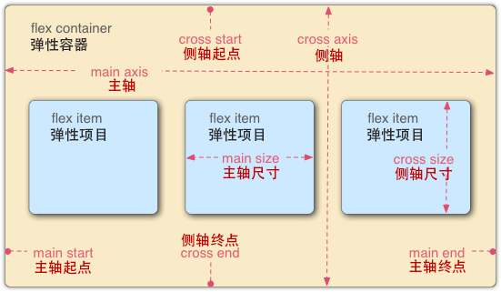

# 弹性盒子（Flexbox）

## 目录
1. [`flex`语法](#flex语法)
1. [`flex`布局实践](#flex布局实践)

---
>`flex`适合一维布局，`grid`适合二维布局。

### `flex`语法
> 参考：[Flex 布局教程：语法篇](http://www.ruanyifeng.com/blog/2015/07/flex-grammar.html)、[写给自己看的display: flex布局教程](https://www.zhangxinxu.com/wordpress/2018/10/display-flex-css3-css/)。



>1. 主轴：main axis。
>2. 侧轴（交叉轴）：cross axis。
>3. 默认的`direction: ltr`如下所示从左到右，若是`direction: rtl`则左右相反。
>4. `writing-mode`属性也会影响排版顺序。

1. Flex容器：设置为`display: flex;`（自己为块级）或`display: inline-flex;`（自己为行内）的元素。

    >1. 只决定子元素的排版方向和空隙展示类型。
    >2. 子元素的`float`、`clear`、`vertical-align`、`column-*`属性将失效。

    1. `flex-direction`：决定主轴的方向。

        1. `row`（默认）：水平方向，起点在左端。
        2. `row-reverse`：水平方向，起点在右端。
        3. `column`：垂直方向，起点在上沿。
        4. `column-reverse`：垂直方向，起点在下沿。
    2. `flex-wrap`：一条主轴排不下的情况，如何换行。

        1. `nowrap`（默认）：不换行。

            >若内容溢出，则表现和`white-space: nowrap`类似。
        2. `wrap`：换行，第一行在上方。
        3. `wrap-reverse`：换行，第一行在下方。

    - `flex-flow`：`flex-direction`（可选）、`flex-wrap`（可选）的简写形式，默认：`row nowrap`。

    3. `align-content`：多根主轴（一条主轴排不下，有换行）的对齐方式（不换行则该属性不起作用）。

        与`flex-wrap: wrap/wrap-reverse;`同时使用。

        >假设侧轴的方向为从上到下，起点就是上、终点就是下。

        1. `stretch`（默认）：

            拉伸所有子项来填满剩余空间。剩余空间平均的分配给每一行。

            1. 若子项未设置高度（或为：`auto`），则将占满容器分配的高度；
            2. 若子项设置了高度，则按照设置的高度去占据容器的高度；
            3. 若设置了`min/max`高度，则占据容器高度不能超出`min/max`设置的高度。
        2. `flex-start`：与侧轴的起点对齐。
        3. `flex-end`：与侧轴的终点对齐。
        4. `center`：侧轴的居中。
        5. `space-between`：两端对齐，子项之间的间隔都相等。(第一个项位于侧轴起点，最后一个项位于侧轴终点)
        6. `space-around`：每个子项两侧的间隔相等。（子项之间的间隔比子项与边框的间隔大一倍）
    4. `justify-content`：子项在主轴上的对齐方式（与轴的方向有关）。

        >假设主轴的方向为从左到右，起点就是左、终点就是右。

        1. `flex-start`（默认）：起点对齐。
        2. `flex-end`：终点对齐。
        3. `center`：居中。

            >Flex容器出现滚动条且`justify-content: 居中`会导致左边溢出无法查看，可以用外面嵌套一层处理。
        4. `space-between`：两端对齐，子项之间的间隔都相等。(第一个项位于起点，最后一个项位于终点)
        5. `space-around`：每个子项两侧的间隔相等。（子项之间的间隔比子项与边框的间隔大一倍）
    5. `align-items`：子项在侧轴上的对齐方式（与轴的方向有关）。

        >假设侧轴的方向为从上到下，起点就是上、终点就是下。

        1. `normal`（默认）
        2. `stretch`：

            拉伸所有子项来填满剩余空间。

            1. 若子项未设置高度（或为：`auto`），则将占满容器分配的高度；
            2. 若子项设置了高度，则按照设置的高度去占据容器的高度；
            3. 若设置了`min/max`高度，则占据容器高度不能超出`min/max`设置的高度。
        3. `flex-start`：起点对齐。
        4. `flex-end`：终点对齐。
        5. `center`：居中。
        6. `baseline`：子项的第一行文字的基线对齐。
2. Flex子项：Flex容器内的子元素。

    >[MDN：控制Flex子元素在主轴上的比例](https://developer.mozilla.org/zh-CN/docs/Web/CSS/CSS_Flexible_Box_Layout/Controlling_Ratios_of_Flex_Items_Along_the_Main_Ax)。

    1. `flex-grow`：子项的拉伸因子（放大比例）。

        >主轴方向上。

        1. 默认：`0`（若存在剩余空间，也不放大）。

        - 子项会以`flex-basis`为基础，沿主轴方向拉升剩余空间（若有剩余空间）。

            1. 若所有子项的`flex-grow`属性都为1，则它们将平分剩余空间（若有的话）。
            2. 若一个子项的`flex-grow`属性为2，其他子项都为1，则前者占据的剩余空间是其他子项的2倍。
    2. `flex-shrink`：子项的缩小比例。

        >主轴方向上。

        1. 默认：`1`（若空间不足，则该子项将缩小）。

        - 子项沿主轴方向缩小到`flex-basis`以下（若空间不足以塞满所有子项的`flex-basis`）。

            1. 若所有子项的`flex-shrink`属性都为1，则当空间不足时，都将等比例缩小。
            2. 若一个子项的`flex-shrink`属性为0，其他子项都为1，则当空间不足时，前者不缩小。
            3. 若一个子项的`flex-shrink`属性为2，其他子项都为1，则当空间不足时，前者缩小是其他子项的2倍。
    3. `flex-basis`：在分配多余空间或空间不足缩小之前，子项占据的主轴空间。

        >主轴方向上。

        1. 默认：`auto`（子项的原本占据空间，横轴为`width`，纵轴为`height`）。

        >浏览器根据这个属性，计算主轴是否有多余空间或是否空间不足。

    - `flex`：`flex-grow`、`flex-shrink`（可选）、`flex-basis`（可选）的简写形式，默认：`0 1 auto`。

        该属性有两个快捷值：`auto`（`1 1 auto`）和`none`（`0 0 auto`）。

    4. `align-self`：单个子项覆盖父元素的`align-items`。

        >与`align-items`类似。

        1. `auto`（默认）：继承父元素的`align-items`属性。
        2. `stretch`
        3. `flex-start`
        4. `flex-end`
        5. `center`
        6. `baseline`
    5. `order`：子项的排列顺序。数值越小，排列越靠前（整数值、允许负值），默认：`0`。

        ><details>
        ><summary>e.g. </summary>
        >
        >```html
        ><!-- 九宫格 -->
        ><style>
        >  ul {
        >    display: flex;
        >    flex-wrap: wrap;
        >
        >    width: 300px;
        >    height: 300px;
        >
        >    background-color: pink;
        >    padding: 0;
        >  }
        >
        >  li {
        >    width: 100px;
        >    height: 100px;
        >
        >    box-shadow: 0 0 5px red;
        >  }
        ></style>
        >
        ><ul>
        >  <li style="order: 1">1</li>
        >  <li style="order: 2">2</li>
        >  <li style="order: 3">3</li>
        >  <li style="order: 6">4</li>
        >  <li style="order: 9">5</li>
        >  <li style="order: 8">6</li>
        >  <li style="order: 7">7</li>
        >  <li style="order: 4">8</li>
        >  <li style="order: 5">9（空白）</li>
        ></ul>
        >```
        ></details>

    - `margin`：控制子项的间距。

        >`flex-basis`设置基础空间，再根据`margin`占用空间之后，剩下的容器空间才是剩余空间。

        1. `「正数或负数」`
        2. `auto`：占据所有剩余空间。若多个子项都是`auto`，则平分所有剩余空间。

- Flex容器内的子元素也可以设置为`display: flex;`，继续在其内部处理其子级的布局问题。

>测试flex效果的网站：[1](https://demo.agektmr.com/flexbox/)、[2](https://the-echoplex.net/flexyboxes/)、[3](https://codepen.io/justd/pen/yydezN)。

### `flex`布局实践
>参考：[Solved by Flexbox](https://magic-akari.github.io/solved-by-flexbox/)。

1. 栅格系统

    <details>
    <summary>充满剩余空间的子级添加：<code>flex-grow: 1;</code>；占用固定宽度的子级添加固定宽度或父级百分比宽度。</summary>

    ```html
    <style>
      .father {
        display: flex;
      }
      .son {
        box-shadow: 0 0 1px 1px red inset;
      }
    </style>

    <div class="father">
      <div class="son" style="flex-grow: 1">  <!-- 填补剩余空间 -->
        auto
      </div>
      <div class="son" style="width: 40px;">  <!-- 固定宽度 -->
        width: 40px
      </div>
      <div class="son" style="width: 50%;"> <!-- 父级百分比宽度 -->
        width: 50%
      </div>
    </div>
    ```
    </details>
2. 一边固定宽度，一边自适应宽度的：

    <details>
    <summary>固定的子级添加：<code>flex-shrink: 0; width: 固定宽度;</code>；自适应的子级添加：<code>flex-grow: 1;（overflow: hidden;）</code>。</summary>

    >可以用`flex-basis: 固定宽度; overflow: hidden;`代替`width: 固定宽度`。

    ```html
    <style>
      .father {
        display: flex;
      }
      .son1 {
        flex-shrink: 0; /* 当空间不足时，不缩小 */
        width: 50px; /* 固定宽度 */

        background: red;
      }
      .son2 {
        flex-grow: 1; /* 填补剩余空间 */
        overflow: hidden;   /* 内容不超过父级空间 */

        background: blue;
        margin-left: 10px;
      }
    </style>

    <div class="father">
      <div class="son1">固定宽度的，不能被挤压、也不自适应增加宽度</div>
      <div class="son2">自适应宽度的，占据剩下的所有内容</div>
    </div>
    ```
    </details>
3. 粘性页脚

    <details>
    <summary><code>&lt;body></code>添加：<code>display: flex; min-height: 100vh; flex-direction: column;</code>；主要内容添加：<code>flex-grow: 1;</code>。</summary>

    ```html
    <style>
      .body {
        display: flex;
        min-height: 100vh; /* 最小高度是屏幕高度 */
        flex-direction: column; /* 主轴的方向为垂直方向 */
      }

      .main {
        flex-grow: 1; /* 填补剩余空间 */
      }
    </style>

    <body class="body">
      <header>页头</header>
      <main class="main">主要内容<br></main>
      <footer>页脚</footer>
    </body>
    ```
    </details>
4. 水平居中并且可以内部水平滚动：

    <details>
    <summary>父级添加：<code>overflow-x: auto; text-align: center;</code>；子级添加：<code>display: inline-flex; align-items: center;</code>。</summary>

    ```html
    <style>
      .father {
        overflow-x: auto; /* 内嵌滚动条 */
        text-align: center; /* 子级行内元素居中 */
      }
      .son {
        display: inline-flex; /* 子级设置为行内元素 */
        align-items: center;
      }

      img {
        border: 2px solid blue;
      }
    </style>

    <div class="father">
      <div class="son">
        1到无数个：
      </div>
    </div>
    ```
    </details>
5. 内部图片高宽小于等于父级，且水平垂直居中、不拉伸：

    <details>
    <summary>父级添加：<code>display: flex; align-items: center; justify-content: center;</code>；子级图片添加：<code>max-width: 100%; max-height: 100%;</code>。</summary>

    ```html
    <style>
      .father {
        display: flex;
        align-items: center;
        justify-content: center;

        width: 400px;
        height: 400px;
        background-color: pink;
      }

      img {
        max-width: 100%;
        max-height: 100%;
      }
    </style>

    <div class="father">
      
    </div>
    ```
    </details>
6. <details>

    <summary>全屏居中并且可以内部滚动。</summary>

    1. 水平滚动

        ```html
        <style>
          body {
            overflow: hidden;
          }

          .fixed {
            /* 全屏蒙层 */
            position: fixed;
            left: 0;
            top: 0;
            right: 0;
            bottom: 0;

            /* 水平滚动 */
            overflow-x: auto;
            overflow-y: hidden;

            background: red;
          }

          .father {
            text-align: center; /* 子级行内元素居中 */

          }

          .son {
            display: inline-flex; /* 子级设置为行内元素 */
            min-height: 100vh;
            align-items: center;
          }

          img {
            border: 2px solid blue;
          }
        </style>

        <div class="fixed">
          <div class="father">
            <div class="son">
              1到无数个：
            </div>
          </div>
        </div>
        ```
    2. 垂直滚动

        ```html
        <style>
          body {
            overflow: hidden;
          }

          .fixed {
            /* 全屏蒙层 */
            position: fixed;
            left: 0;
            top: 0;
            right: 0;
            bottom: 0;

            /* 垂直滚动 */
            overflow-x: hidden;
            overflow-y: auto;

            background: red;
          }

          .father {
            text-align: center; /* 子级行内元素居中 */

          }

          .son {
            display: inline-flex; /* 子级设置为行内元素 */
            min-height: 100vh;
            align-items: center;

            justify-content: center;
            flex-direction: column;
          }

          img {
            border: 2px solid blue;
          }
        </style>

        <div class="fixed">
          <div class="father">
            <div class="son">
              1到无数个：
            </div>
          </div>
        </div>
        ```
    </details>
7. 最后一个子项居右

    <details>
    <summary>最后一个子项设置：<code>margin-left: auto;</code>。</summary>

    ```html
    <style>
      .father {
        display: flex;
      }
      .last {
        margin-left: auto;
      }
    </style>

    <div class="father">
      <div>son1</div>
      <div>son2</div>
      <div>son3</div>
      <div class="last">son4</div>
    </div>
    ```
    </details>
8. 固定高度内文字单行或多行自动垂直居中

    <details>
    <summary>父级添加：<code>display: flex; align-items: center; height: 最大高度;</code>；子级添加：<code>多行文本超出宽度则显示省略号</code>。</summary>

    ```html
    <style>
      .father {
        display: flex;
        align-items: center;

        height: 最大高度;
      }
      .son {
        display: block;
        display: -webkit-box;
        overflow: hidden;
        text-overflow: ellipsis;
        -webkit-box-orient: vertical;
        -webkit-line-clamp: 行数;

        line-height: 最大高度 / 行数;
        max-height: 最大高度;
      }
    </style>

    <div class="father">
      <div class="son">
        任一长度的文字内容，会自动垂直居中。
        任一长度的文字内容，会自动垂直居中。
        任一长度的文字内容，会自动垂直居中。
      </div>
    </div>
    ```
    </details>

>骰子的[CodePen demo](https://codepen.io/realgeoffrey/pen/OKbrrp)。
