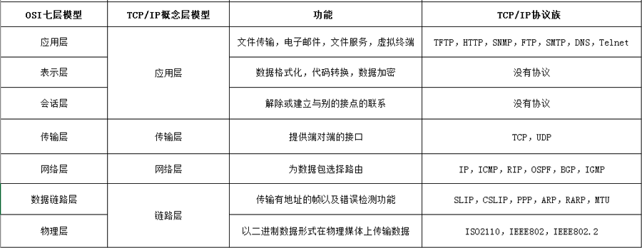
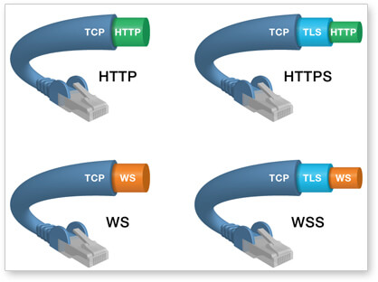
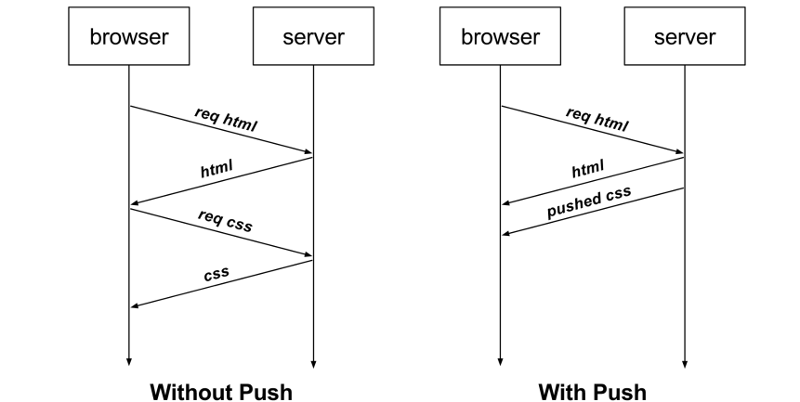
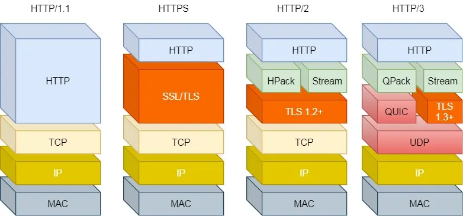

# HTTP相关

## 目录
1. [HTTP特点](#http特点)
1. [TCP/IP协议四层模型](#tcpip协议四层模型)
1. [TCP的三次握手、四次挥手](#tcp的三次握手四次挥手)
1. [输入URL后的HTTP流程-浏览器流程](#输入url后的http流程-浏览器流程)
1. [HTTP报文组成](#http报文组成)
1. [HTTP请求方法（HTTP request methods）](#http请求方法http-request-methods)
1. [HTTP状态码（HTTP status codes）](#http状态码http-status-codes)
1. [HTTP头（HTTP headers）](#http头http-headers)
1. [HTTP缓存](#http缓存)
1. [基于HTTP的功能追加的技术或协议](#基于http的功能追加的技术或协议)
1. [HTTPS相关](#https相关)

    1. [HTTPS](#https)
    1. [HTTP严格传输安全（HTTP strict transport security，HSTS）](#http严格传输安全http-strict-transport-securityhsts)
    1. [`Mixed Content`](#mixed-content)
1. [HTTP持久连接、WebSocket、服务器推送](#http持久连接websocket服务器推送)
1. [CORS（cross-origin resource sharing，跨域资源共享）](#corscross-origin-resource-sharing跨域资源共享)
1. [服务端验证用户状态](#服务端验证用户状态)

    1. [登录策略](#登录策略)
1. [HTTP协议迭代（HTTP/3、HTTP/2、HTTP/1）](#http协议迭代http3http2http1)
1. [其他网络概念](#其他网络概念)
1. [特殊的IP地址](#特殊的ip地址)

---
### HTTP特点
>HTTP（HyperText Transfer Protocol，超文本传输协议）通信通常通过TCP/IP连接进行，默认端口是TCP 80，但可以使用其他端口，以ASCII码传输。这并不妨碍HTTP在任何其他协议之上实现，HTTP只是假定了一个可靠的传输，任何能够提供可靠传输的协议都能够被使用。

1. 灵活可扩展

    1. 语义上自由：只规定了基本格式，比如空格分隔单词，换行分隔字段，其他的各个部分都没有严格的语法限制。
    2. 传输形式的多样性：允许传输任意类型的数据对象（`Content-Type`设置类型）。
2. 可靠传输

    （默认）基于TCP/IP。
3. client-server协议

    使用HTTP时，必定是一端担任客户端角色，另一端担任服务器端角色。虽然客户端和服务器端的角色可能会互换，但一条通信路线中角色是确定的。请求由客户端开始。

    >C/S、B/S结构。
4. 无状态（[cookie](https://github.com/realgeoffrey/knowledge/blob/master/网站前端/HTTP相关/README.md#服务端验证用户状态)弥补）

    通信过程不保存上下文信息，每次HTTP请求都是独立、无关的。
5. 无连接、短连接（[持久连接](https://github.com/realgeoffrey/knowledge/blob/master/网站前端/HTTP相关/README.md#http持久连接websocket服务器推送)弥补）

    每次TCP连接只处理一个请求-响应。每一次完整的HTTP通信都要建立单独的TCP连接，服务器处理完客户的请求、并收到客户的应答后，即断开TCP连接。可以节省传输时间。

### TCP/IP协议四层模型
>TCP/IP协议族：利用IP进行通信时所必须用到的协议群的统称，是为使用互联网而开发制定的协议族。

1. 分层

    >- OSI模型 和 TCP/IP协议四层模型
    >
    >    OSI是一种理论下的模型，未被直接应用；TCP/IP已被广泛使用，成为网络互联事实上的标准。
    >
    >    

    

    1. 应用层：HTTP、WebSocket、DNS、FTP（File Transfer Protocol，文件传输协议）

        决定了向用户提供应用服务时通信的活动。

        >SSL位于应用层和传输层中间。
    2. 传输层：TCP、UDP

        对上层应用层，提供处于网络连接中的两台计算机之间的数据传输。
    3. 网络层：IP

        处理在网络上流动的数据包（网络传输的最小数据单位）。该层规定了通过怎样的传输路径到达对方计算机，并把数据包传送给对方。与对方计算机之间通过多台计算机或网络设备进行传输时，网络层所起的作用就是在众多的选择中选择一条传输路径。
    4. 数据链路层：

        处理连接网络的硬件部分。包括控制操作系统、硬件的设备驱动、NIC（Network Interface Card，网络适配器，网卡），及光纤等物理可见部分（还包括连接器等一切传输媒介）。硬件上的范畴均在链路层的作用范围内。
2. 发送端从应用层往下传递，接收端则往应用层上传递：

    1. 发送端在层与层之间传输数据时，每经过一层时会被添加该层所属的头部信息（封装，encapsulate）。
    2. 接收端在层与层传输数据时，每经过一层时会把对应的头部去除（解封装）。

    
3. 与HTTP相关的协议

    1. 应用层：DNS（Domain Name System，域名系统）

        提供**域名**到**IP地址**之间的解析服务：通过域名查找IP地址、逆向通过IP地址反查域名。

        >计算机可以被赋予IP地址、主机名、域名。同一个服务器上的多个域名，使用DNS服务解析域名为同一个IP地址，因此在发送HTTP请求时，必须设置`Host`头部为指定主机名或域名的URI。
    2. 传输层：TCP（Transmission Control Protocol，传输控制协议）

        提供可靠的字节流服务（Byte Stream Service）：

        1. 字节流服务：为了方便传输，将大块数据分割成以报文段（segment）为单位的数据包进行管理。
        2. 可靠的：能够确认数据最终是否送达对方。三次握手（three-way handshaking）策略确保数据能到达目标。
    3. 网络层：IP（Internet Protocol，网际协议）

        把各种数据包经过中转传送给对方。使用ARP协议（Address Resolution Protocol）凭借MAC地址（Media Access Control Address）进行通信：

        1. IP地址指明了节点被分配到的地址，常变换。
        2. MAC地址是指网卡所属的固定地址，基本不会变化。

        - IPv4与IPv6的路由和寻址数量：

            1. IPv4

                `Math.pow(2, 32) === Math.pow(256, 4)`，如：`183.2.223.26`。
            2. IPv6

                `Math.pow(2, 128) === Math.pow(16, 32)`，如：`2001:0db8:86a3:08d3:1319:8a2e:0370:7344`。

                >在某些情况下，一个IPv6地址中间可能包含很长的一段`0`，可以把连续的一段`0`压缩为`::`。但为保证地址解析的唯一性，地址中`::`只能出现一次。
                >
                >e.g.
                >
                >```text
                >FF01:0:0:0:0:0:0:1101 → FF01::1101
                >0:0:0:0:0:0:0:1       → ::1
                >0:0:0:0:0:0:0:0       → ::
                >```

### TCP的三次握手、四次挥手


><details>
><summary>TCP协议头部的部分字段</summary>
>
>1. `sequence number`（`seq`）
>
>    资源的数据序列。
>2. `acknowledgement number`（`ack`）
>
>    对方所期望接收到的下一个序号，是上次已成功接收到`seq+1`。
>3. `ACK`
>
>    `1`：应答域（acknowledgement number）有效；`0`：应答域无效。
>4. `SYN`
>
>    用来建立连接。`SYN=1,ACK=0`：请求连接；`SYN=1,ACK=1`：响应连接。
>5. `FIN`
>
>    自己数据已经传输完成，断开自己的连接。
></details>

1. 建立连接的三次握手

    1. 客户端发送`SYN=1,seq=客户端序号`的连接请求。
    2. 服务端接收请求，发送`SYN=1,seq=服务端序号,ACK=1,ack=客户端序号+1`的响应消息。
    3. 客户端接收消息，发送`ACK=1,ack=服务端序号+1`的确认消息。
2. 断开连接的四次挥手

    1. 主机A发送`FIN=1,seq=主机A序号`的断开信息。
    2. 主机B接收消息，发送`ACK=1,ack=主机A序号+1`的响应消息。
    3. 主机B发送`FIN=1,seq=主机B序号`的断开信息。
    4. 主机A接收消息，发送`ACK=1,ack=主机B序号+1`的响应消息。

><details>
><summary>设计原因</summary>
>
>1. 三次握手原因：为了防止已失效的连接请求报文段突然又传送到服务端，让服务端误判后单方面建立连接。
>
>    1. client早先发出的连接请求报文段并没有丢失，而是在某个网络结点长时间滞留，以致延误到client连接释放以后的某个时间才到达server；
>    2. 本来这是一个早已失效的报文段，但server收到此失效的连接请求报文段后，误认为是client发出的一个新的连接请求，于是就向client发出确认报文段，同意建立连接。
>
>        1. 假设不采用「三次握手」，那么只要server发出确认，新的连接就建立了。由于现在client并没有发出建立连接的请求，因此不会理睬server的确认，也不会向server发送数据。但server却以为新的运输连接已经建立，并一直等待client发来数据。这样，server的很多资源就白白浪费掉了。
>        2. 采用「三次握手」的办法可以防止上述现象发生，client不会向server的确认发出确认，server由于收不到确认，就知道client并没有要求建立连接。
>2. 四次挥手原因：TCP是**全双工模式**（通信允许数据在两个方向上同时传输），需要通信的双方都确认才断开。
>
>    1. 当主机A发出FIN报文段时，只表示主机A已经没有数据要发送了；但是，这个时候主机A还是可以接受来自主机B的数据；
>    2. 当主机B返回ACK报文段时，表示主机B已经知道主机A没有数据发送了，但是主机B还是可以发送数据到主机A；
>    3. 当主机B也发送了FIN报文段时，这个时候就表示主机B也没有数据要发送了；
>    4. 当收到主机A返回ACK报文段时，表示主机A已经知道主机B没有数据发送了，之后彼此都中断这次TCP连接。
></details>

### 输入URL后的HTTP流程-浏览器流程
1. 获取域名的IP地址

    DNS解析：浏览器自身DNS缓存 -> 操作系统DNS缓存 -> 本地hosts文件 -> 路由器DNS缓存 -> 宽带运营商。
2. 建立TCP/IP连接

    发起「三次握手」（验证客户端），试图建立TCP/IP链接。

    >关闭TCP链接要「四次挥手」。

    - 建立TLS连接
3. 浏览器发送HTTP请求，服务器响应

    服务器端接受请求，根据路径参数、经过后端处理之后，把结果的数据返回浏览器。

- [HTTP缓存](https://github.com/realgeoffrey/knowledge/blob/master/网站前端/HTTP相关/README.md#http缓存)
- [页面解析渲染步骤](https://github.com/realgeoffrey/knowledge/blob/master/网站前端/前端内容/README.md#页面解析渲染步骤) -> [每一帧渲染流程](https://github.com/realgeoffrey/knowledge/blob/master/网站前端/HTML+CSS学习笔记/README.md#渲染性能rendering-performance)

### HTTP报文组成
1. request：

    ```text
    <method><空格><request-URI><空格><version><回车换行>    // 请求行
    <headers><回车换行>                                   // 请求头（可多行）
    <回车换行>                                            // 空行（CR+LF）
    <entity-body>                                       // 请求消息主体
    ```
2. response：

    ```text
    <version><空格><status code><空格><reason phrase><回车换行> // 状态行
    <headers><回车换行>                                       // 响应头（可多行）
    <回车换行>                                                // 空行（CR+LF）
    <entity-body>                                           // 响应消息主体
    ```

><details>
><summary>e.g.</summary>
>
>1. request
>
>    ```http
>    POST /home/ HTTP/1.1
>    Accept: */*
>    User-Agent: Mozilla/4.0 (compatible; MSIE 7.0; Windows NT 5.1; .NET CLR 2.0.50727)
>    Host: a.com
>    Content-Length: 465
>    Pragma: no-cache
>
>    {"info":""}
>    ```
>2. response
>
>    ```http
>    HTTP/1.1 200 OK
>    Server: nginx/1.9.15
>    Date: Tue, 27 Feb 2018 08:40:25 GMT
>    Content-Type: application/json;charset=UTF-8
>    Content-Length: 979
>    Cache-Control: max-age=0
>    Proxy-Connection: Close
>
>    {"errno":0,"errmsg":"","data":{""}}
>    ```
>
>tips: JSON格式不包含`undefined`，但包含`null`。因此注意发起请求时，会对字段值为`undefined`的直接删除，会保留字段值为`''`或`null`（后端应该都会同样处理为空）。
></details>

### HTTP请求方法（HTTP request methods）
>来自：[MDN：HTTP 请求方法](https://developer.mozilla.org/zh-CN/docs/Web/HTTP/Methods)。

1. GET：通常用来获取资源

    向指定的资源发出「显示」请求。使用GET方法应该只用在读取数据，而不应当被用于产生「副作用」的操作中。

><details>
><summary>GET与POST区别</summary>
>
>1. 幂等性、副作用
>
>    1. GET，幂等，无副作用
>    2. POST，非幂等，有副作用
>2. 浏览器
>
>    1. GET
>
>        1. URL可以被收藏，在导航栏会被保留成历史记录
>        2. 可以被HTTP缓存
>        3. 绝大部分HTML标签、CSS属性、等的地址只能是GET请求
>        4. 浏览器会把http header和data一并发送出去，服务器响应200 ok
>    2. POST
>
>        1. URL不可以被收藏，不会被保存历史记录
>        2. 不可以被HTTP缓存（除非手动设置）
>        3. 只有`<form method="post">`（`<button formmethod="">`或`<input formmethod="">`可以覆盖）或JS能发起POST请求
>        4. （有些浏览器的实现：）浏览器先发送header，服务器响应100 continue，浏览器再发送data，服务器响应200 ok
>3. 安全性
>
>    1. GET，参数在URL上暴露
>    2. POST，参数一般不在URL上暴露，而在响应消息主体中
>4. 编码类型（`enctype`）
>
>    1. GET，`application/x-www-form-urlencoded`。在表单中使用GET方法时，数据类型中只接受 ASCII 字符。
>    2. POST，``multipart/form-data`或`application/x-www-form-urlencoded`对二进制数据使用多部分编码。在表单提交时，POST方法不绑定表单数据类型，并允许二进制和ASCII字符。
>5. 语义
></details>

2. POST：提交数据

    向指定资源提交数据，请求服务器进行处理（如：提交表单或上传文件）。数据被包含在请求本文中。这个请求可能会创建新的资源或修改现有资源，或二者皆有。
3. PUT：修改数据

    向指定资源位置上传最新内容（文件）。
4. DELETE：删除资源（几乎用不到）

    请求删除指定资源位置的内容。
5. HEAD：获取资源的元信息

    与GET方法一样，都是向服务器发出指定资源的请求。只不过服务器将不传回资源的本文部分。在不必传输全部内容的情况下，获取关于该资源的信息（HTTP响应头）。
6. OPTIONS：列出可对资源实行的请求方法，用来跨域请求

    使服务器传回该资源所支持的所有HTTP请求方法。用「*」来代替资源名称，测试服务器功能是否正常运作。
7. TRACE：追踪请求-响应的传输路径

    回显服务器收到的请求，主要用于测试或诊断。
8. CONNECT：建立连接隧道，用于代理服务器

    HTTP/1.1协议中预留给能够将连接改为管道方式的代理服务器。通常用于SSL加密服务器的链接（经由非加密的HTTP代理服务器）。
9. PATCH：修改局部数据

    用于将局部修改应用到资源。
10. ~~LINK~~

    （已废弃）
11. ~~UNLINK~~

    （已废弃）

- 语义区别

    >1. 副作用
    >
    >     当发送完一个请求后，网站上的资源状态发生修改，即认为这个请求有副作用；反之，则无副作用。
    >2. 幂等性（idempotence）
    >
    >     多次请求某一个资源应该具有同样的副作用。

    | 请求类型 | 幂等 | 副作用 | 请求消息主体 |
    | :--- | :--- | :--- | :--- |
    | GET | 幂等 | 无副作用 | 一般不携带 |
    | POST | 非幂等 | 副作用 | 携带 |
    | PUT | 幂等 | 副作用 | 携带 |
    | DELETE | 幂等 | 副作用 | 一般不携带 |

### HTTP状态码（HTTP status codes）
>来自：[维基百科：HTTP状态码](https://zh.wikipedia.org/wiki/HTTP状态码)、[MDN：HTTP 响应代码](https://developer.mozilla.org/zh-CN/docs/Web/HTTP/Status)。

用以表示服务器HTTP响应状态的3位数字代码。

1. 1XX中间状态信息

    代表请求已被接受，需要继续处理；代表临时性、信息性的响应，只包含状态行和某些可选的响应头信息，始终以消息头后的第一个空行结尾；标示客户端应该采取的其他行动。

    1. 100 Continue

        客户端应当继续发送请求。这个临时响应是用来通知客户端它的部分请求已经被服务器接收，且仍未被拒绝。客户端应当继续发送请求的剩余部分，或若请求已经完成，则忽略这个响应。服务器必须在请求完成后向客户端发送一个最终响应。
    2. **101 Switching Protocols**

        服务器已经理解了客户端的请求，并将通过Upgrade消息头通知客户端采用不同的协议来完成这个请求。在发送完这个响应最后的空行后，服务器将会切换到在Upgrade消息头中定义的那些协议。如：HTTP升级为WebSocket。
    3. 102 Processing

        处理将被继续执行。
2. 2XX成功

    代表请求已成功被服务器接收、理解，并接受。

    1. **200 OK**

        请求已成功，请求所希望的响应头或数据体将随此响应返回。
    2. 201 Created

        请求已经被实现，而且有一个新的资源已经依据请求的需要而创建，且其URI已经随Location头信息返回。
    3. 202 Accepted

        服务器已接受请求，但尚未处理。正如它可能被拒绝一样，最终该请求可能会也可能不会被执行。在异步操作的场合下，没有比发送这个状态码更方便的做法了。
    4. 203 Non-Authoritative Information

        服务器已成功处理了请求，但返回的实体头部元信息不是在原始服务器上有效的确定集合，而是来自本地或第三方的复制。当前的信息可能是原始版本的子集或超集。
    5. **204 No Content**

        服务器成功处理了请求，但不需要返回任何实体内容，并且希望返回更新了的元信息（与200 OK相同，但没有响应实体）。始终以消息头后的第一个空行结尾。
    6. 205 Reset Content

        服务器成功处理了请求，且没有返回任何内容，并且要求请求者重置文档视图。该响应主要是被用于接受用户输入后，立即重置表单，以便用户能够轻松地开始另一次输入。始终以消息头后的第一个空行结尾。
    7. **206 Partial Content**

        服务器已经成功处理了部分GET请求。分块下载、断点续传，会带上响应头`Content-Range`。
    8. 207 Multi-Status

        代表之后的消息体将是一个XML消息，并且可能依照之前子请求数量的不同，包含一系列独立的响应代码。
3. 3XX重定向

    代表需要客户端采取进一步的操作才能完成请求。通常，这些状态码用来重定向，后续的请求地址（重定向目标）在本次响应的Location域中指明。

    1. 300 Multiple Choices

        被请求的资源有一系列可供选择的回馈信息，每个都有自己特定的地址和浏览器驱动的商议信息。用户或浏览器能够自行选择一个首选的地址进行重定向。
    2. **301 Moved Permanently**

        被请求的资源已永久移动到新位置，并且将来任何对此资源的引用都应该使用本响应返回的若干个URI之一。浏览器默认会做缓存优化，在第二次访问的时候自动访问重定向的那个地址。
    3. **302 Moved Temporarily** 或 **302 Found**

        被请求的资源临时从不同的URI响应请求。

        1. 浏览器请求服务端 ->
        2. 服务端返回status为302，包含响应header的`Location` ->
        3. 浏览器得到以上返回，向 响应header的`Location` 发起重定向请求（请求header、请求method：和上一个请求发起的一致、不能变化；同源cookie策略，上一个请求可以修改cookie以传递额外信息给重定向链接）

        >[Chrome在302重定向时对原请求产生2次请求](http://www.cnblogs.com/lyzg/p/6237841.html)
    4. **303 See Other**

        被请求的资源临时从不同的URI响应请求，且客户端应当把POST转化为GET方式访问那个资源。
    5. **304 Not Modified**

        协商缓存命中时会返回。始终以消息头后的第一个空行结尾。
    6. 305 Use Proxy

        被请求的资源必须通过指定的代理才能被访问。
    7. ~~306 Switch Proxy~~

        （已废弃）
    8. **307 Temporary Redirect**

        被请求的资源临时从不同的URI响应请求，且客户端不会把POST转化为GET访问那个资源。
4. 4XX客户端错误

    代表客户端看起来可能发生了错误，妨碍了服务器的处理。

    1. **400 Bad Request**

        当前请求无法被服务器理解。
    2. **401 Unauthorized**

        当前请求需要用户验证。
    3. *402 Payment Required*

        （预留）
    4. **403 Forbidden**

        服务器已经理解请求，但是拒绝执行它。
    5. **404 Not Found**

        资源未找到。
    6. **405 Method Not Allowed**

        请求行中指定的请求方法不能被用于请求相应的资源。
    7. 406 Not Acceptable

        请求的资源的内容特性无法满足请求头中的条件，因而无法生成响应实体。返回`Allow`响应头。
    8. 407 Proxy Authentication Required

        与401响应类似，只不过客户端必须在代理服务器上进行身份验证。
    9. 408 Request Timeout

        请求超时。
    10. 409 Conflict

        由于和被请求的资源的当前状态之间存在冲突，请求无法完成。
    11. 410 Gone

        被请求的资源在服务器上已经不再可用，而且没有任何已知的转发地址。
    12. 411 Length Required

        服务器拒绝在没有定义Content-Length头的情况下接受请求。
    13. 412 Precondition Failed

        服务器在验证在请求的头字段中给出先决条件时，没能满足其中的一个或多个。
    14. 413 Request Entity Too Large

        服务器拒绝处理当前请求，因为该请求提交的实体数据大小超过了服务器愿意或能够处理的范围。
    15. 414 Request-URI Too Long

        请求的URI长度超过了服务器能够解释的长度，因此服务器拒绝对该请求提供服务。
    16. 415 Unsupported Media Type

        对于当前请求的方法和所请求的资源，请求中提交的实体并不是服务器中所支持的格式，因此请求被拒绝。
    17. 416 Requested Range Not Satisfiable

        若请求中包含了Range请求头，并且Range中指定的任何数据范围都与当前资源的可用范围不重合，同时请求中又没有定义If-Range请求头。
    18. 417 Expectation Failed

        在请求头Expect中指定的预期内容无法被服务器满足，或这个服务器是一个代理服务器，它有明显的证据证明在当前路由的下一个节点上，Expect的内容无法被满足。
    19. 418 I'm a teapot

         客户端错误响应代码表示服务器拒绝冲泡咖啡，因为它是一个茶壶（这个错误是超文本咖啡壶控制协议的参考，这是1998年愚人节的笑话）。
    20. 421 There are too many connections from your internet address

        从当前客户端所在的IP地址到服务器的连接数超过了服务器许可的最大范围。
    21. 422 Unprocessable Entity

        请求格式正确，但是由于含有语义错误，无法响应。
    22. 423 Locked

        当前资源被锁定。
    23. 424 Failed Dependency

        由于之前的某个请求发生的错误，导致当前请求失败，如：PROPPATCH。
    24. *425 Unordered Collection*

        （未出现）
    25. 426 Upgrade Required

        客户端应当切换到TLS/1.0。
    26. 429 Too Many Requests

        客户端发送的请求过多。
    27. 431 Request Header Fields Too Large

        请求头的字段内容太大。
    28. 449 Retry With

        由微软扩展，代表请求应当在执行完适当的操作后进行重试。
    29. ~~451 Unavailable For Legal Reasons~~

        （已废弃）
5. 5XX服务器错误

    代表服务器在处理请求的过程中有错误或异常状态发生，也有可能是服务器意识到以当前的软硬件资源无法完成对请求的处理。

    1. **500 Internal Server Error**

        服务器出错。
    2. 501 Not Implemented

        服务器不支持当前请求所需要的某个功能。
    3. 502 Bad Gateway

        作为网关或代理工作的服务器尝试执行请求时，从上游服务器接收到无效的响应。
    4. **503 Service Unavailable**

        由于临时的服务器维护或过载，服务器当前无法处理请求。
    5. 504 Gateway Timeout

        作为网关或代理工作的服务器尝试执行请求时，未能及时从上游服务器（URI标识出的服务器，如：HTTP、FTP、LDAP）或辅助服务器（如：DNS）收到响应。
    6. 505 HTTP Version Not Supported

        服务器不支持，或拒绝支持在请求中使用的HTTP版本。
    7. 506 Variant Also Negotiates

        代表服务器存在内部配置错误：被请求的协商变元资源被配置为在透明内容协商中使用自己，因此在一个协商处理中不是一个合适的重点。
    8. 507 Insufficient Storage

        服务器无法存储完成请求所必须的内容。
    9. 509 Bandwidth Limit Exceeded

        服务器达到带宽限制。
    10. 510 Not Extended

        获取资源所需要的策略并没有被满足。

### HTTP头（HTTP headers）
1. 作用：

    添加附加信息、操作参数，用来准确描述正在获取的资源、发送端的行为。
2. 结构：

    不区分大小写的属性名后跟一个冒号，再紧跟它的值（不换行）组成，以`回车（CR）换行（LF）`符号序列结尾。值的内容可以以`; `分割（`,`分割单词）。值前面的空格会被忽略掉。自定义专用消息头可通过`X-`前缀来添加（已废弃。现在不再根据是否有`X-`前缀来鉴别是否是自定义头）。
3. 类型

    >具体内容：[MDN：HTTP 消息头](https://developer.mozilla.org/zh-CN/docs/Web/HTTP/Headers)、[rfc4229](https://tools.ietf.org/html/rfc4229)。

    1. 通用头部字段（general）

        >同时适用于请求和响应，但与最终消息主体中传输的数据无关的消息头。

        | 通用头部字段名 | 说明 |
        | :--- | :--- |
        | Cache-Control | 控制缓存的行为 |
        | Pragma | 仅有`Pragma: no-cache`一个值，与`Cache-Control: no-cache`效果一致，强制要求缓存服务器在返回缓存的版本之前将请求提交到源头服务器进行验证 |
        | Connection | 逐跳头部（控制不再转发给代理的头部）、持久连接的管理 |
        | Date | 创建报文的日期时间 |
        | Trailer | 报文末端的头部一览 |
        | Transfer-Encoding | 指定报文主体的传输编码方式 |
        | Upgrade | 升级为其他协议 |
        | Via | 代理服务器的相关信息。若这个请求经过了多个代理层，则Via头部就会有多个网关信息 |
        | Warning | 附加的警告信息 |
    2. 实体头部字段（entity）

        >同时适用于请求和响应，包含有关实体主体的更多信息。

        | 实体头部字段名 | 说明 |
        | :--- | :--- |
        | Allow | 资源可支持的HTTP请求方法 |
        | Content-Encoding | 实体主体适用的编码方式（如：gzip） |
        | Content-Language | 实体主体的语言（自然语言） |
        | Content-Length | 实体主体的大小（字节） |
        | Content-Location | 替代对应资源的URI |
        | Content-MD5 | 实体主体的报文摘要 |
        | Content-Range | 实体主体的位置范围，表示传输的Body数据在整体资源块中的字节范围 |
        | Content-Type | 实体主体的媒体类型（Multipurpose Internet Mail Extensions，MIME types）和编码格式。无论是前端还是后端发起，`Content-Type`必须要与传输的数据类型一一对应，否则解析失败 |
        | Expires | 实体主体过期的日期时间 |
        | Last-Modified | 资源的最后修改日期时间 |
    3. 请求头部字段（request）

        >包含更多有关要获取的资源或客户端本身信息的消息头。

        | 请求头部字段名 | 说明 |
        | :--- | :--- |
        | Origin | 请求源 |
        | Accept | 用户代理可处理的媒体类型，表示客户端期望服务器返回的媒体格式 |
        | Accept-Charset | 优先的字符集，表示客户端期望服务器返回的内容的编码格式 |
        | Accept-Encoding | 优先的内容编码，表示客户端期望服务器返回的编码 |
        | Accept-Language | 优先的语言（自然语言），表示客户端期望服务器返回的语言 |
        | TE | 优先的传输编码 |
        | Authorization | 服务器要求客户端的认证信息（令牌），对响应头WWW-Authenticate的应答 |
        | Proxy-Authorization | 代理服务器要求客户端的认证信息（令牌） |
        | Expect | 用于请求发送之前向服务器询问许可 |
        | From | 用户的电子邮箱地址 |
        | Host | 请求资源的主机名（必须添加）。一般无法修改，由请求URL确定 |
        | If-Match | 比较实体标记（ETag），相同则服务器接受请求 |
        | If-None-Match | 比较实体标记（ETag），不同则服务器接受请求 |
        | If-Modified-Since | 比较资源的更新时间（Last-Modified），之后时间有更新则服务器接受请求 |
        | If-Unmodified-Since | 比较资源的更新时间（Last-Modified），之后时间没有更新则服务器接受请求 |
        | If-Range | 比较ETag或Last-Modified，相同则作为范围请求处理；反之，则返回全体资源 |
        | Range | 实体的字节范围请求。断点续传，它表示客户端请求资源的一部分时指定的请求字节范围 |
        | Max-Forwards | 最大传输逐跳数 |
        | Referer | 发起请求的页面的上一个页面的URL |
        | User-Agent | HTTP客户端程序的信息 |
        | Cookie | 客户端存在的cookie（一次发送所有相关cookie） |

        >形如`If-xxx`这种样式的请求头部字段，都可称为条件请求。服务器接收到附带条件的请求后，只有判断指定条件为真时，才会执行请求。
    4. 响应头部字段（response）

        >包含有关响应的补充信息，如其位置或服务器本身（名称和版本等）的消息头。

        | 响应头部字段名 | 说明 |
        | :--- | :--- |
        | Accept-Ranges | 是否接受字节范围请求 |
        | Age | 推算资源创建经过时间（秒） |
        | ETag | 资源的匹配信息 |
        | Location | 令客户端重定向至指定URI。302跳转时，Location为目标URL |
        | WWW-Authenticate | 服务器对客户端的认证信息。401 Unauthorized错误码返回时必须携带 |
        | Proxy-Authenticate | 代理服务器对客户端的认证信息 |
        | Retry-After | 服务器升级时，客户端的请求会直接给予503(Service Unavailable)错误，通过在响应头里面加入Retry-After字段告知客户端何时服务可以恢复正常访问 |
        | Server | HTTP服务器的安装信息 |
        | Vary | 代理服务器缓存的管理信息 |
        | Set-Cookie | 服务端设置客户端cookie（一次可发送多个cookie） |
        | Content-Security-Policy | 控制用户代理在一个页面上可以加载使用的资源 |
4. 缓存、代理是否转发

    1. 逐跳（hop-by-hop）

        只对单次转发有效，会因通过缓存或代理而不再转发。需提供`Connection`头部字段。

        `Connection`、`Keep-Alive`、`Proxy-Authenticate`、`Proxy-Authorization`、`Trailer`、`TE`、`Transfer-Encoding`、`Upgrade`
    2. 端到端（end-to-end）

        会转发给请求、响应对应的最终接收目标，且必须保存在由缓存生成的响应中。

        除了上面8个。

### HTTP缓存
>参考：[浏览器缓存知识小结及应用](http://www.cnblogs.com/lyzg/p/5125934.html)。

只缓存**GET**请求。

1. 强缓存（本地缓存，Freshness）

    浏览器加载资源时，先根据这个资源之前响应头的`Expires`、`Cache-Control`判断它是否命中强缓存（判断是否到了过期时间）。

    1. 命中状态码：

        `200 OK (from 某某 cache)`

        >Chrome的DevTools的Network会显示该资源的Request Headers：`Provisional headers are shown.`
    2. 利用之前HTTP response header返回的`Expires`和`Cache-Control`

        >`Cache-Control`的优先级高于`Expires`（当服务器同时使用时，忽略~~Expires~~）。

        1. `Expires`：

            绝对时间。HTTP/1.0提出。

            1. 浏览器第一次跟服务器请求一个资源，服务器在返回这个资源的同时，会返回一系列响应头；

                Expires响应头表示资源过期的绝对时间。
            2. 浏览器在接收到这个资源后，会把这个资源连同所有响应头一起缓存下来；
            3. 浏览器再请求这个资源时，先从缓存中寻找。找到这个资源后，拿出它的Expires跟当前的请求时间进行对比：

                1. 若请求时间在Expires之前，命中缓存，返回`200 OK (from 某某 cache)`，从本地缓存中读取资源，不会发请求到服务器。
                2. 若没有命中缓存，发请求到服务器，根据响应头更新这个资源的Expires。
            >缺陷：受限于系统时间，若更改则会缓存失效；浏览器与服务端两端的实际时间不一致，可能会造成缓存混乱。
        2. `Cache-Control`：

            相对时间。秒级。HTTP/1.1提出。

            1. 浏览器第一次跟服务器请求一个资源，服务器在返回这个资源的同时，会返回一系列响应头；

                Cache-Control响应头表示（相对于请求发起时间的）资源过期的相对时间。
            2. 浏览器在接收到这个资源后，会把这个资源连同所有响应头一起缓存下来；
            3. 浏览器再请求这个资源时，先从缓存中寻找。找到这个资源后，根据它请求时间和Cache-Control设定的有效期，计算出一个资源过期时间，再拿这个过期时间跟当前的请求时间进行对比：

                >若请求头设置`cache-control: max-age=0`，则忽略强缓存（本地缓存），直接进行协商缓存。

                1. 若请求时间在过期时间之前，命中缓存，返回`200 OK (from 某某 cache)`，从本地缓存中读取资源，不会发请求到服务器。
                2. 若没有命中缓存，发请求到服务器，根据响应头更新这个资源的Cache-Control。

    >建议：资源[配置超长时间的强缓存；采用文件的数字签名（如：MD5）作为缓存更新依据](https://github.com/fouber/blog/issues/6)，`.html`设置不缓存或协商缓存或超短时间强缓存。

    - 启发式缓存（Heuristic Freshness）

        >只有在服务端没有返回明确的缓存策略时才会激活浏览器的启发式缓存策略。

        若一个资源响应头未设置 ~~`Expires`~~、~~`Cache-Control`~~，但响应头有设置`Last-Modified`信息，则浏览器会有一个默认的缓存策略（效果、状态码等，与 强缓存 一致），缓存时间：`(响应头的Date - 响应头的Last-Modified) * 0.1`。
2. 协商缓存（Validation）

    若没有命中强缓存，浏览器发送一个请求到服务器，服务端根据这个资源的`If-Modified-Since`（`Last-Modified`）、`If-None-Match`（`ETag`）判断它是否命中协商缓存（判断缓存资源和服务端资源是否一致）。

    1. 命中状态码：

        `304 Not Modified`
    2. 利用之前HTTP response header返回的`Last-Modified`、`ETag`作为HTTP request head发起的`If-Modified-Since`、`If-None-Match`

        >`ETag/If-None-Match`的优先级高于`Last-Modified/If-Modified-Since`（当服务器同时使用时，先判断If-None-Match。若中协议缓存，再判断If-Modified-Since；若没有中，不再判断）。

        1. `Last-Modified`与`If-Modified-Since`：

            绝对时间。服务器时间。秒级。

            1. 浏览器第一次跟服务器请求一个资源，服务器在返回这个资源的同时，会返回一系列响应头；

                Last-Modified响应头表示这个资源在服务器上的最后修改时间。
            2. 浏览器在接收到这个资源后，会把这个资源连同所有响应头一起缓存下来；
            3. 浏览器再请求这个资源时，带上If-Modified-Since请求头（Last-Modified的值）；
            4. 服务器收到资源请求时，拿If-Modified-Since和资源在服务器上最后修改时间进行对比：

                1. 若没有变化，命中缓存，返回`304 Not Modified`，但不返回资源内容。浏览器从本地缓存中读取资源。
                2. 若没有命中缓存，则返回资源内容，根据响应头更新这个资源的Last-Modified。

            >分布式部署，多台机器的Last-Modified必须保持一致。
        2. `ETag`与`If-None-Match`：

            1. 浏览器第一次跟服务器请求一个资源，服务器在返回这个资源的同时，会返回一系列响应头；

                ETag响应头表示这个资源在服务器上的唯一标识字符串，只要资源有变化这个串就改变。
            2. 浏览器在接收到这个资源后，会把这个资源连同所有响应头一起缓存下来；
            3. 浏览器再请求这个资源时，带上If-None-Match请求头（ETag的值）；
            4. 服务器收到资源请求时，拿If-None-Match和资源在服务器上生成新的ETag进行对比：

                1. 若值相同，命中缓存（还要考虑`Last-Modified/If-Modified-Since`），返回`304 Not Modified`，但不返回资源内容。浏览器从本地缓存中读取资源。
                2. 若没有命中缓存，则返回资源内容，根据响应头更新这个资源的ETag。

    - 使用选择

        - `ETag`的缺陷

            1. 分布式系统尽量关闭ETag（每台机器生成的ETag都会不一样）。
            2. 修改文件之后生成ETag需要消耗服务器性能。
        - `ETag`的必要性（`Last-Modified`缺陷）

            1. 某些文件会周期性地更改，但内容并不改变（仅改变修改时间），这时不希望客户端认为文件被修改了，而导致重新GET。
            2. 某些文件修改非常频繁（如：在1秒的时间内进行修改），If-Modified-Since能检查到的粒度是秒级的，这种修改无法判断（或说UNIX记录MTIME只能精确到秒）。
            3. 某些服务器不能精确地得到文件最后修改时间。

        因此具体某个资源只需运用ETag或Last-Modified的两者之一。

- 强缓存与协商缓存的联系：

    1. 相同：

        1. 若命中，则都是从客户端缓存中加载资源，而不是从服务器加载资源数据。
        2. 只有GET请求会被缓存，POST请求不会。
    2. 区别：

        1. 强缓存不发请求到服务器，协商缓存会发请求到服务器。
        2. 用户行为影响缓存使用情况

            | 用户操作 | 强缓存 | 协商缓存 |
            | :--- | :---: | :---: |
            | 地址栏回车 | 有效 | 有效 |
            | 页面链接跳转 | 有效 | 有效 |
            | 新开窗口 | 有效 | 有效 |
            | 前进、后退 | 有效 | 有效 |
            | 刷新 | **无效** | 有效 |
            | 强制刷新 | **无效** | **无效** |

- webpack的分包机制，考虑代码更新频率和缓存的问题

### 基于HTTP的功能追加的技术或协议
1. AJAX

    异步加载，局部更新。
2. Comet

    延迟响应。
3. WebSocket

    1. 服务器可以主动推送。
    2. 持久连接。
4. HTTPS
5. SPDY或HTTP/2
6. WebDAV

---
## HTTPS相关

### HTTPS
1. HTTP不足

    1. 通信使用明文（不加密），内容可能会被窃听。
    2. 不验证通信方的身份，可能遭遇伪装。
    3. 无法证明报文的完整性，可能已遭篡改。

        >中间人攻击（Man-In-The-Middle attack，MITM）。
2. HTTPS（HTTP Secure） = HTTP + 通信加密 + 证书认证 + 完整性保护

    >HTTPS并非是应用层的一种新协议。只是HTTP通信接口部分用SSL（Secure Socket Layer）或TLS（Transport Layer Security）协议代替（在应用层和传输层中间添加）。

    1. 加密

        1. 对称密钥加密（Common key crypto system，共享密钥加密）

            加密和解密同用一个密钥，必须将密钥发送给对方。
        2. 非对称加密（Public-key cryptography，公开密钥加密）：

            >处理速度较慢、安全性很高。

            发送密文的一方使用对方的公开密钥进行加密，对方收到被加密信息后再使用自己的私有密钥进行解密。

            ><details>
            ><summary>设计逻辑</summary>
            >
            >它需要两个密钥，一个是公开密钥，另一个是私有密钥；一个用作加密，另一个则用作解密。使用其中一个密钥把明文加密后所得的密文，只能用相对应的另一个密钥才能解密得到原本的明文；甚至连最初用来加密的密钥也不能用作解密。虽然两个密钥在数学上相关，但若知道了其中一个，则并不能凭此计算出另外一个；因此其中一个可以公开，称为公钥，任意向外发布；不公开的密钥为私钥，必须由用户自行严格秘密保管，绝不通过任何途径向任何人提供，也不会透露给要通信的另一方，即使他被信任。
            ></details>

        - 加密保证 = 对称密钥加密 + 非对称加密

            1. （建立TCP/IP连接、验证完证书有效性、获得服务器的公开密钥）
            2. 客户端传给服务器：使用公开密钥加密信息「后续会话采用对称加密的算法和密钥」；
            3. 服务器收到信息后，使用私有密钥提取出客户端提供的对称加密的算法和密钥，返回客户端：同意使用此对称密钥加密；
            4. 后续两者之间信息的传输就可以使用对称加密的方式。
    2. 认证：公开密钥的证书。

        由发布机构CA保证。
    3. 完整：附加MAC（Message Authentication Code）报文摘要判断是否遭到篡改。

- 为什么不一直使用HTTPS

    1. SSL处理速度变慢：通信速度降低、消耗大量CPU和内存。
    2. 证书需要购买。
- HTTPS也不一定安全，需要使用[HSTS](https://github.com/realgeoffrey/knowledge/blob/master/网站前端/HTTP相关/README.md#http严格传输安全http-strict-transport-securityhsts)才能最大限度避免被劫持。
- 混用HTTPS与HTTP导致浏览器提示[`Mixed Content`](https://github.com/realgeoffrey/knowledge/blob/master/网站前端/HTTP相关/README.md#mixed-content)。

### HTTP严格传输安全（HTTP strict transport security，HSTS）
一套互联网安全策略机制，强制浏览器使用HTTPS与网站进行通信（避免：先发出HTTP请求再302重定向为HTTPS），以减少会话劫持风险。

1. 必要性：HTTPS也不够安全

    浏览器向网站发起一次HTTP请求，在得到一个要求重定向的响应后，发起一次302重定向的HTTPS请求并得到最终的响应内容。在HTTP请求时，容易受到中间人攻击。
2. 开启HSTS方法：当客户端通过HTTPS发出请求时，在服务器返回的HTTP响应头中包含`Strict-Transport-Security`。

    <details>
    <summary><code>Strict-Transport-Security: max-age=秒数[; includeSubDomains][; preload]</code></summary>

    1. `max-age`（必选参数）：代表HSTS过期时间。
    2. `includeSubDomains`（可选参数）：若包含它，则意味着当前域名及其子域名均开启HSTS保护。
    3. `preload`（可选参数）：只有域名已加入到HSTS preload list时才需要使用到它。
    </details>
3. 效果（在有效期内、或域名在HSTS preload list内）

    1. 浏览器只能通过HTTPS发起相关域名（或包括子域名）的请求（若HTTP请求则会进行客户端内部307重定向为HTTPS请求）。
    2. 若浏览器发现当前连接不安全（网站证书有错误等），则显示错误，用户无法选择继续访问。
4. [HSTS preload list（浏览器预置HSTS域名列表）](https://github.com/chromium/hstspreload.org)，包含的域名硬编码进浏览器从而对这些域名默认开启HSTS保护。

>可以在Chrome地址栏输入`chrome://net-internals/#hsts`查看HSTS包含的域名情况。

### `Mixed Content`
`Mixed Content`（混合内容）：初始HTML内容通过安全的HTTPS连接加载（.html），但其他资源（如：样式表、脚本、图像、多媒体资源等）通过不安全的HTTP连接加载。

1. 现代浏览器会显示警告/错误，以向用户表明此页面包含不安全的资源

    1. 被动混合内容（提示warning，但还可以正常发出请求）：

        1. ``的`src`
        2. `<audio>`的`src`
        3. `video`的`src`
        4. `object`的子资源
    2. 主动混合内容（提示error，阻止发出请求）：

        1. `<script>`的`src`
        2. `<link>`的`href`
        3. 样式内的地址（如：`@font-sace`、`cursor`、`background-image`、等）
        4. `<picture>`的子资源（如：``）
        5. `XMLHttpRequest`请求
        6. `<iframe>`的`src`
        7. `<object>`的`data`
        8. `navigator.sendBeacon`请求
        9. Flash
2. 让页面中发起的HTTP请求自动转化为HTTPS请求进行发出：

    1. HTTP响应头：

        `Content-Security-Policy: upgrade-insecure-requests;`
    2. `.html`的`<meta>`

        `<meta http-equiv="Content-Security-Policy" content="upgrade-insecure-requests">`

---
### HTTP持久连接、WebSocket、服务器推送
1. HTTP持久连接（HTTP长连接，HTTP Persistent Connections，HTTP keep-alive，HTTP connection reuse）

    只要任意一端没有明确提出断开连接，则保持TCP连接状态，（不用重复连接）可以完成多个HTTP请求。单个客户端与服务器和代理服务器之间不应该维持超过2个持久连接。

    1. HTTP/1.1所有的连接默认是持久连接。
    2. HTTP/1.0设置：`Connection: Keep-Alive`。

>持久连接的管线化（pipelining）：将多个HTTP请求整批提交，但服务端必须按照顺序整批返回。（非管线化：发送请求后，需要收到响应了才能发送下一个请求）

2. WebSocket

    新的全双工通讯协议。在TCP建立之后，复用HTTP的握手通道，再进行一次握手后创建连接。

    1. 保持持久连接状态。
    2. 服务端能够主动推送。
    3. 头部信息小，减少通信量。
    4. 可以发送文本（`String`）、二进制数据（`Blob`实例或`Arraybuffer`实例）。
    5. 没有~~同源策略~~限制，客户端可以与任意服务器通信。
    6. 协议标识符`ws`，默认端口`80`；加密协议标识`wss`，默认端口`443`。

        >e.g. `ws://example.com:80/some/path`、`wss://example.com:443/some/path`

    - 相关头

        1. 请求头：

            `Connection: Upgrade`、`Upgrade: websocket`、`Sec-WebSocket-Key`
        2. 响应头：

            `Connection: Upgrade`、`Upgrade: websocket`、`Sec-WebSocket-Accept`

    
3. 服务器推送

    HTTP/2加入的，其允许服务器在客户端缓存中填充数据，通过一个叫**服务器推送**的机制来提前请求。

    >还没有收到浏览器的请求，服务器就把各种资源推送给浏览器。e.g. 浏览器只请求了index.html，但是服务器把index.html、style.css、example.png全部发送给浏览器。这样的话，只需要一轮HTTP通信，浏览器就得到了全部资源，提高了性能。

    

### CORS（cross-origin resource sharing，跨域资源共享）
>参考：[跨域资源共享 CORS 详解](http://www.ruanyifeng.com/blog/2016/04/cors.html)。

- 若服务端配置允许了某些或所有域名，就可以跨域响应；前端不需要进行额外工作，现代浏览器自动完成交互：

    >ie10+支持。

    现代浏览器一旦发现`XMLHttpRequest`或`fetch`等请求跨源，会自动添加一些附加的头信息（如：`Origin`），有时还会多出一次附加的请求（非简单请求的`OPTIONS`请求）。

><details>
><summary>简单/非简单请求区分</summary>
>
>- 同时满足以下两个条件为简单请求，否则为非简单请求：
>
>    1. 请求方法：
>
>         `HEAD`或`GET`或`POST`。
>    2. 请求头仅包含（浏览器自动添加的其他请求头也可以是简单请求，如：`Origin`）：
>
>         1. `Accept`
>         2. `Accept-Language`
>         3. `Content-Language`
>         4. `Content-Type`仅限于`application/x-www-form-urlencoded`或`multipart/form-data`或`text/plain`
></details>

1. 简单请求（simple request）

    1. HTTP请求：

        请求头需要：`Origin`（来自的域）。
    2. 响应：

        1. 允许跨域，则响应头包含：

            1. `Access-Control-Allow-Origin`：值为请求头`Origin`的值或`*`，表明接受跨域请求

                >若`Access-Control-Allow-Credentials`为`true`，则`Access-Control-Allow-Origin`不能为`*`，需要是明确的、与请求网页一致的域名。
            2. `Access-Control-Allow-Credentials`：（可选）是否允许发送cookie

                >跨域发送cookie需要：后台响应包含`Access-Control-Allow-Credentials: true`（且`Access-Control-Allow-Origin`不能为`*`） 且 前端请求包含`xhr = new XMLHttpRequest(); xhr.withCredentials = true`（`fetch(url,{ credentials: 'include', mode: 'cors' })`），浏览器才能在跨域请求中携带 未被标记为`samesite: strict`的cookie。
            3. `Access-Control-Expose-Headers`：（可选）CORS请求时，`XMLHttpRequest`只能拿到6个基本字段（`Cache-Control`、`Content-Language`、`Content-Type`、`Expires`、`Last-Modified`、`Pragma`），若需要其他字段，需在此指定
        2. 不允许跨域：

            若`Origin`指定的源不在许可范围内，服务器会返回一个正常的HTTP响应（状态码200，并可以返回正确数据），但没有任何CORS相关的头信息字段。浏览器根据响应头没有包含~~Access-Control-Allow-Origin~~则认定为跨域错误（被`XMLHttpRequest`的`onerror`回调函数捕获）。
2. 非简单请求（not-so-simple request）

    >非简单请求是那种对服务器有特殊要求的请求。先发起的预检请求可以避免跨域请求对服务器数据产生未预期的副作用；得到服务端允许后，浏览器才会发送正式的跨域请求（与简单请求一致）。

    1. 预检请求（preflight）

        >一般来说预检请求，指的就是`OPTIONS`请求。它会在浏览器认为即将要执行的请求可能会对服务器造成不可预知的影响时，由浏览器自动发出。通过预检请求，浏览器能够知道当前的服务器是否允许执行即将要进行的请求，只有获得了允许，浏览器才会真正执行接下来的请求。通常preflight请求不需要用户自己去管理和干预，它的发出的响应都是由浏览器和服务器自动管理的。HTTP状态码可以是200、204、等2XX，会被浏览器认为预检请求成功。

        1. 浏览器判断为非简单请求，自动发出`OPTIONS`方法的HTTP请求：

            请求头需要：`Origin`（来自的域）、`Access-Control-Request-Method`（需要进行跨域的请求方法）、`Access-Control-Request-Headers`（需要额外发送的头信息字段）。
        2. 响应：

            1. 允许跨域，则响应头包含：

                1. `Access-Control-Allow-Origin`：值为请求头`Origin`的值或`*`，表明接受跨域请求

                    >若`Access-Control-Allow-Credentials`为`true`，则`Access-Control-Allow-Origin`不能为`*`，需要是明确的、与请求网页一致的域名。
                2. `Access-Control-Allow-Methods`：服务器支持的所有跨域请求的请求方法
                3. `Access-Control-Allow-Headers`：（若HTTP请求头有`Access-Control-Request-Headers`则必须）服务器支持的所有跨域请求的请求头字段，以`,`分割
                4. `Access-Control-Allow-Credentials`：（可选）是否允许发送cookie

                    >跨域发送cookie需要：后台响应包含`Access-Control-Allow-Credentials: true`（且`Access-Control-Allow-Origin`不能为`*`） 且 前端请求包含`xhr = new XMLHttpRequest(); xhr.withCredentials = true`（`fetch(url,{ credentials: 'include', mode: 'cors' })`），浏览器才能在跨域请求中携带 未被标记为`samesite: strict`的cookie。
                5. `Access-Control-Max-Age`：（可选）本次预检请求的有效期，单位秒（-1：禁用预检缓存）
            2. 不允许跨域：

                若服务器否定了预检请求，服务器会返回一个正常的HTTP响应，但没有任何CORS相关的头信息字段。浏览器根据响应没有包含相关响应头则认定为跨域错误（被`XMLHttpRequest`的`onerror`回调函数捕获）。
    2. 一旦服务器通过预检请求，之后的每次跨域请求都与简单请求一致。

---
### 服务端验证用户状态
HTTP是无状态协议，通过session-cookie或token判断客户端的用户状态。

>1. 认证：输入密码，验证身份。
>2. 授权：资源所有者 赋予 用户，指定范围的资源操作权限。如：web服务器的session机制、web浏览器的cookie机制、颁发授权令牌（token）等都是一个授权的机制。
>3. 鉴权：鉴定（session/cookie/token）合法性、有效性。

1. session-cookie

    >**同源认证**（因为利用cookie）解决方案。

    1. session（会话）

        一种记录服务器和客户端**会话**状态的机制（服务器为了保存客户端状态，给每个客户端分配不同的「身份标识」session，保存在服务器，过期后销毁，客户端发请求时需要携带该标识session_id）。session是基于cookie实现的，session存储在服务器端，session_id存储在客户端的cookie中。
    2. cookie

        服务器生成，发送给客户端保存（`Set-Cookie`），再由客户端发送给服务器（`Cookie`）。cookie携带session_id（可以经过加密），能够匹配服务端的session。

    >若请求cookie未携带session_id，则服务端创建后设置进cookie；若请求cookie已携带session_id，则服务端直接使用它（无论是否登录）。因此一个会话从未登录到登录的session_id都会保持一致（跨越登录前后，保持同一个会话，利用session_id的取值就能取到同一个值）。
2. token（令牌）

    >最简单的token组成：uid（用户唯一的身份标识）、time（当前时间的时间戳）、sign（签名，加盐后哈希）。

    **访问资源接口（API）时所需要的资源凭证**。针对App与服务端的无状态API，不存储会话信息。与session-cookie方式没有直接关系、可一起使用、不冲突（如：用token第三方鉴权成功，服务端返回当前服务的session_id）。

    1. [OAuth（Open Authorization）](https://datatracker.ietf.org/doc/html/rfc6749)

        >行业标准**授权**协议。

        主要用来授权**第三方应用**获取有限的网页权限。**登录平台**经过**用户**授权，为**第三方应用**颁发一个有时效性的token，**第三方应用**能够通过该token获取**登录平台**的部分资源。
    2. [JWT（JSON Web Token）](https://datatracker.ietf.org/doc/html/rfc7519)

        >**跨域认证**解决方案。

        服务器认证以后，生成一个JSON对象（转成特殊结构的字符串）发回给客户端，客户端本地保存，当客户端与服务端通信时，都要发回这个token。服务端不保存任何session数据、变成无状态，从而比较容易实现扩展。JWT自包含用户信息、加密签名等数据，因此不需要（或很少）查数据库——但已颁发的JWT不方便通过服务端管理（如：失效销毁、修改信息）。

- <details>

    <summary>session、token对比：session和token的概念边界很模糊。<strong>用解析token的计算时间换取session的存储空间，从而减轻服务器的压力，减少频繁查询数据库session。</strong></summary>

    1. session：

        session_id存储在客户端的cookie，session数据存储在服务端，存储开销随用户量增加而增大。

        1. cookie的特性：http请求自动携带、同源同路径、JS可获取、容易受到CSRF攻击。
        2. session_id很短，请求响应体积小。
        3. （有状态）依赖服务端存储管理session（如：Redis），服务端方便删除、修改session。
    2. token：

        token存在客户端的任意形式，数据加密存储在token里（服务端不存）。

        1. 不一定依赖cookie，需要前后端配合使用token。
        2. token自身包含身份验证、权限选择等的所有或部分信息，因此比较大，请求响应体积大。服务端颁发时需要加密，服务端验证时需要解密。
        3. （无状态）服务端不存储token，已颁发的token不方便通过服务端管理（如：失效销毁、修改信息），因此需要设置较短有效期。
        4. （token中的一种基于JSON的开放标准：）JWT不需要（或很少）查数据库，直接在服务端进行校验（因为用户信息、加密签名都自包含在JWT中），不需要设计分布式存储方案、扩展性好。
    </details>

>从已经登录的客户端提取出登录信息（session_id或token），传递给其他客户端，再由其他客户端把登录信息注入cookie等存储-传输机制中，就可以转移登录状态到其他客户端（除非有做额外的逻辑去阻止转移登录状态，如：对设备信息、IP等进行存储对比）。

#### 登录策略
1. 单点登录（Single Sign On，SSO）

    在多个应用系统中，只需要登录一次，就可以访问其他相互信任的应用系统。

    1. 同域名：

        设置cookie的domain为顶级域名，其他按照正常登录策略即可。
    2. 跨域名：

        通过在一个中间域名统一登录后（认证），登录信息以cookie形式存储session_id在中间域名（授权）；当在这个中间域名鉴权成功后，重定向回原域名并带上能够验证登录状态的token；在原网站用token请求登录接口，鉴权成功后以cookie形式存储session_id在原网站域名（授权）。

todo: https://tsejx.github.io/blog/authentication/

2. OAuth2.0
3. 扫码登录
4. 一键登录

---
### HTTP协议迭代（HTTP/3、HTTP/2、HTTP/1）


1. [HTTP/3](https://www.rfc-editor.org/rfc/rfc9114.html)：基于QUIC的HTTP

    传输层使用QUIC协议（快速UDP网络连接）而不是~~TCP~~（建立连接慢；1个TCP连接的队头阻塞）。

    类似于HTTP/2（但HTTP/2通过1个TCP连接运行，所以在TCP层处理的数据包丢失检测和重传会阻止所有流），它是一个**多路复用协议**，QUIC通过UDP（无连接，不需要“握手”、“挥手”，因此快速）运行多个流，并为每个流独立实现数据包丢失检测和重传，因此如果发生错误，只有该数据包中包含数据的流才会被阻止。
2. [HTTP/2](https://www.rfc-editor.org/rfc/rfc9113.html)：为了更优异的表现

    与HTTP/1.1完全语义兼容，进一步减少网络延迟：

    1. **二进制协议**（二进制分帧层，frame）而不是~~文本协议~~。

        把请求、响应内容拆成多个二进制帧来传输，解析效率高；多个帧可以乱序发送，根据帧首部的流标识可以重新组装。
    2. **多路复用协议**。

        同域名下所有通信都在一个TCP连接上完成。一个TCP连接可以承载任意数量并行的双向数据流（stream）。移除了HTTP/1中顺序和阻塞的约束。

        >问题：
        >
        >1. TCP需要客户端-服务端三次握手建立连接。
        >2. TCP为了保证可靠传输，有一个“超时重传”机制，丢失的包必须等待重传确认，HTTP/2出现丢包时，整个TCP都要等待重传，那么就会阻塞该TCP连接中的所有请求。
        >3. 多路复用导致服务器压力上升：多路复用没有限制同时请求数。请求的平均数量与往常相同，但实际会有许多请求的短暂爆发，导致瞬时QPS暴增。
        >4. 多路复用容易Timeout：大批量的请求同时发送，由于HTTP/2连接内存在多个并行的流，而网络带宽和服务器资源有限，每个流的资源会被稀释，虽然它们开始时间相差更短，但却都可能超时。
    3. **压缩HTTP headers**。因为HTTP头在一系列请求中常常是相似的，其移除了重复和传输重复数据的成本。
    4. 其允许服务器在客户端缓存中填充数据，通过一个叫**服务器推送**的机制来提前请求。

- HTTPS
- CORS、CSP

3. [HTTP/1.1](https://www.rfc-editor.org/rfc/rfc9112.html)：标准化的协议

    消除了大量歧义内容并引入了多项改进：

    1. 连接可以复用（HTTP持久连接，一次TCP握手成功后，可以多次传递HTTP请求），节省了多次打开TCP连接加载网页文档资源的时间。

        >问题：
        >
        >复用但是按顺序复用，导致队头阻塞：虽然能公用一个TCP管道，但是在一个管道中同一时刻只能处理一个请求，在当前的请求没有结束之前，其他的请求只能处于阻塞状态。当顺序发送的请求序列中的一个请求因为某种原因被阻塞时，在后面排队的所有请求也一并被阻塞，会导致客户端迟迟收不到数据。针对方案：①将同一页面的资源分散到不同域名下，提升连接上限；②减少请求数量，合并小文件；③内联一些资源：css、base64图片、等。
    2. 增加管线化技术，允许在第一个应答被完全发送之前就发送第二个请求，以降低通信延迟。
    3. 支持响应分块。
    4. 引入额外的缓存控制机制。
    5. 引入内容协商机制，包括语言、编码、类型等。并允许客户端和服务器之间约定以最合适的内容进行交换。
    6. 凭借`Host`头，能够使不同域名配置在同一个IP地址的服务器上。

    - 1997年-2014年不断扩展

    ```http
    GET /static/img/header-background.png HTTP/1.1
    Host: developer.mozilla.org
    User-Agent: Mozilla/5.0 (Macintosh; Intel Mac OS X 10.9; rv:50.0) Gecko/20100101 Firefox/50.0
    Accept: */*
    Accept-Language: en-US,en;q=0.5
    Accept-Encoding: gzip, deflate, br
    Referer: https://developer.mozilla.org/zh-CN/docs/Glossary/Simple_header
    ```

    ```http
    200 OK
    Age: 9578461
    Cache-Control: public, max-age=315360000
    Connection: keep-alive
    Content-Length: 3077
    Content-Type: image/png
    Date: Thu, 31 Mar 2016 13:34:46 GMT
    Last-Modified: Wed, 21 Oct 2015 18:27:50 GMT
    Server: Apache

    (image content of 3077 bytes)
    ```
4. [HTTP/1.0](https://www.rfc-editor.org/info/rfc1945)：构建可扩展性

    >非官方标准。

    1. 协议版本信息现在会随着每个请求发送（`HTTP/1.0`被追加到了`GET`行）。

        ```http
        GET /mypage.html HTTP/1.0
        User-Agent: NCSA_Mosaic/2.0 (Windows 3.1)
        ```
    2. 状态码会在响应开始时发送，使浏览器能了解请求执行成功或失败，并相应调整行为（如更新或使用本地缓存）。

        ```http
        200 OK
        Date: Tue, 15 Nov 1994 08:12:31 GMT
        Server: CERN/3.0 libwww/2.17
        Content-Type: text/html
        <HTML>
        一个包含图片的页面
          
        </HTML>
        ```
    3. 引入了HTTP headers概念，无论是对于请求还是响应，允许传输元数据，使协议变得非常灵活，更具扩展性。

        在新HTTP headers的帮助下，具备了传输除纯文本HTML文件以外其他类型文档的能力（凭借`Content-Type`头）。

        ```http
        GET /myimage.gif HTTP/1.0
        User-Agent: NCSA_Mosaic/2.0 (Windows 3.1)
        ```

        ```http
        200 OK
        Date: Tue, 15 Nov 1994 08:12:32 GMT
        Server: CERN/3.0 libwww/2.17
        Content-Type: text/gif
        (这里是图片内容)
        ```
5. HTTP/0.9：单行协议

    >最初版本的HTTP协议并没有版本号，后来它的版本号被定位在0.9以区分后来的版本。

    1. 请求由单行指令构成，以唯一可用方法`GET`开头，其后跟目标资源的路径（一旦连接到服务器，协议、服务器、端口号这些都不是必须的）。

        ```http
        GET /mypage.html
        ```
    2. 响应也极其简单的：只包含响应文档本身。

        ```http
        <html>
          这是一个非常简单的 HTML 页面
        </html>
        ```

        只能传HTML文件。一旦出现问题，也只能返回包含问题描述的HTML文件。

### 其他网络概念
1. URI = URL + URN

    1. URI（Uniform Resource Identifier，统一资源标志符）

        标识一个资源。
    2. URL（Uniform Resource Locator，统一资源定位符）

        提供找到一个资源的地址。

    - URN（Uniform Resource Name，统一资源名称）

        （已不推荐使用）

    URI（URL）的结构：`scheme` `://` [`user:passwd@`] `host` [`:port`] `/path` [`?query`] [`#fragment`]

    >URL的锚点（`#fragment`）不会出现在HTTP请求中，因此可以避免中间人攻击。
2. 协议（protocol）：

    计算机与网络设备要互相通信，双方就必须基于相同的方法，确定的规则就是协议。

    >如何探测到通信目标、由哪一边先发起通信、使用哪种语言进行通信、怎样结束通信等规则都需要事先确定。
3. 通信数据转发程序

    1. 代理

        有转发功能的应用程序，扮演着位于服务器和客户端「中间人」的角色，接收由客户端发送的请求并转发给服务器，同时也接收服务器返回的响应并转发给客户端。

        包括：缓存代理（先将资源保存在代理）、透明代理（不加工报文）、非透明代理。

        >每次通过代理服务器转发请求或响应时，会追加写入`Via`头信息。

        - 正向、反向代理：

            1. 正向代理：客户端的代理，proxy和client同属一个LAN，对server透明。
            2. 反向代理：服务端的代理，proxy和server同属一个LAN，对client透明。

            
    2. 网关（gateway）

        1. 转发其他服务器通信数据的服务器，接收从客户端发送来的请求时，就像本身拥有资源的源服务器一样处理请求。
        2. 把一种协议转成另一种协议的设备。如：语音网关。
    3. 隧道

        在相隔甚远的客户端和服务器两者之间进行中转，使双方保持安全连接的应用程序。
4. CDN（Content Delivery Network，内容分发网络）

    在不同的地点创建缓存代理服务器，通过负载均衡技术、最优节点选择，将用户的请求重定向到最合适的缓存代理服务器（缓存整个HTTP请求-响应），减少源站的压力、提升加载速度。

    >1. 回源：当有用户访问某一个URL时，若被解析到的那个CDN节点没有缓存响应的内容、或缓存已经到期，则会回源站去获取。
    >
    >    CDN的地址后增加`?xx`，大部分情况当做一个新的资源，可用于强制回源（注意不要在代码中使用增加时间戳的CDN，否则每次都回源）。
    >2. 若使用HTTPS的CDN，回源也必须用HTTPS，全链路HTTPS堵死运营商劫持。
5. UDP（User Data Protocol，用户数据报协议）

    1. 非连接的协议，传输数据之前源端和终端不建立连接，当它想传送时就简单地去抓取来自应用程序的数据，并尽可能快地把它扔到网络上。在发送端，UDP传送数据的速度仅仅是受应用程序生成数据的速度、计算机的能力和传输带宽的限制；在接收端，UDP把每个消息段放在队列中，应用程序每次从队列中读一个消息段。
    2. 由于传输数据不建立连接，因此也就不需要维护连接状态，包括收发状态等，因此一台服务机可同时向多个客户机传输相同的消息。
    3. 信息包的首部很短，只有8个字节，相对于TCP的20个字节信息包的额外开销很小。
    4. 吞吐量不受拥挤控制算法的调节，只受应用软件生成数据的速率、传输带宽、源端和终端主机性能的限制。
    5. 使用尽最大努力交付，即不保证可靠交付，因此主机不需要维持复杂的链接状态表（这里面有许多参数）。
    6. 面向报文的。发送方的UDP对应用程序提供的报文，在添加首部后就向下交付给IP层。既不拆分，也不合并，而是保留这些报文的边界，因此，应用程序需要选择合适的报文大小。

    >`ping`命令来测试两台主机之间TCP/IP通信是否正常，原理就是向对方主机发送UDP数据包，然后对方主机确认收到数据包，若数据包是否到达的消息及时反馈回来，则网络就是通的。

    - TCP与UDP的区别：

        | 区别 | TCP | UDP |
        | :--- | :--- | :--- |
        | 连接性 | 面向连接，建立连接后（三次握手）才传输数据。 | 面向非连接，发送数据前不需建立连接。 |
        | 可靠性 | 提供可靠的服务（数据无差错、不丢失、不重复、按序到达）。 | 尽最大努力交付，不保证可靠性（任何必需的可靠性须由应用层提供）。 |
        | 拥塞控制 | 面向字节流（把数据看成一连串无结构的字节流），有流量控制（拥塞控制）。 | 面向报文，没有拥塞控制（网络出现拥塞不会使源主机的发送速率降低）。 |
        | 交互方式 | 点到点。 | 一对一、一对多、多对一、多对多。 |
        | 有序性 | 消息在传输过程中可能会乱序，后发送的消息可能会先到达，TCP会对其进行重新排序。 | 无序。 |
        | 协议头部字节数 | 20字节。 | 8字节。 |
        | 传输速度 | 慢（需要建立连接、保证可靠性、有序性） | 快 |
        | 最短的单次client-server发送数据包次数 | 三次握手初始化TCP + 查询包 + 响应包 + 四次分手断开TCP = 9 | 查询包 + 响应包 = 2 |

    在注重性能、传输速度且不需要重传的应用（如：视频电话、即时通讯），会选择使用UDP。其他情况，when in doubt, use TCP。

### 特殊的IP地址
1. `127.x.x.x`

    本地环回地址，主要用于测试或网络管理/路由更新，比物理接口稳定。

    - `127.0.0.1`

        只要使用这个地址发送数据，则数据包不会出现在网络传输过程中。
2. `10.x.x.x`、`172.16.x.x～172.31.x.x`、`192.168.x.x`

    私网地址，不与外网相连。
3. `255.255.255.255`

    广播地址（向网关获取本机IP地址）。
4. `0.0.0.0`

    源IP地址，发生在当设备启动时但又不知道自己IP地址的情况下。路由表中无法查询的包都将送至全零网络的路由。
