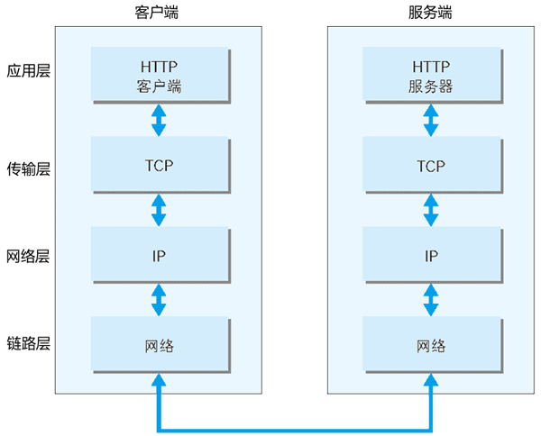
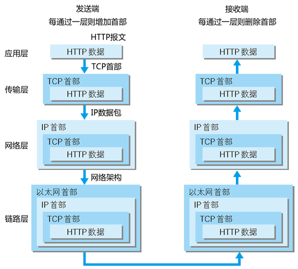
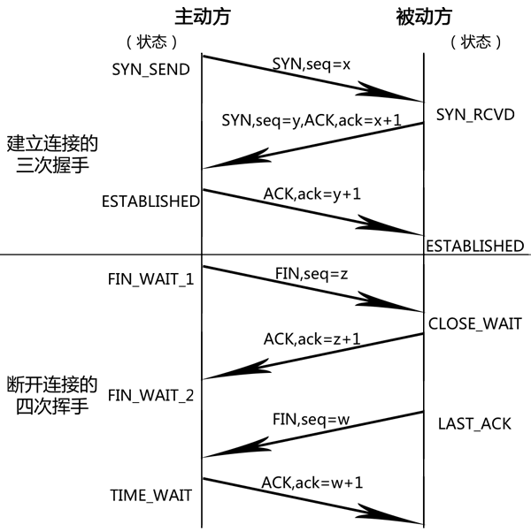
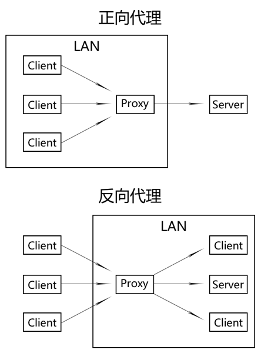

# HTTP相关
>1. HTTP（HyperText Transfer Protocol，超文本传输协议）是一个client-server协议。默认端口号80、无状态（cookie弥补）、以ASCII码传输。
>2. 使用HTTP时，必定是一端担任客户端角色，另一端担任服务器端角色。虽然客户端和服务器端的角色可能会互换，但一条通信路线中角色是确定的。请求由客户端开始。

### TCP/IP协议族
与互联网相关联的协议集合总称。

1. 分层

    

    1. 应用层（或包括：应用层、表示层、会话层）：

        决定了向用户提供应用服务时通信的活动。

        HTTP、WebSocket、DNS、FTP（File Transfer Protocol，文件传输协议）。

        >SSL位于应用层和传输层中间。
    2. 传输层：

        对上层应用层，提供处于网络连接中的两台计算机之间的数据传输。

        TCP、UDP。
    3. 网络层（网络互连层）：

        处理在网络上流动的数据包（网络传输的最小数据单位）。该层规定了通过怎样的传输路径到达对方计算机，并把数据包传送给对方。与对方计算机之间通过多台计算机或网络设备进行传输时，网络层所起的作用就是在众多的选择中选择一条传输路径。

        IP。
    4. 数据链路层（链路层、网络接口层）：

        处理连接网络的硬件部分。包括控制操作系统、硬件的设备驱动、NIC（Network Interface Card，网络适配器，网卡），及光纤等物理可见部分（还包括连接器等一切传输媒介）。硬件上的范畴均在链路层的作用范围内。
2. 发送端从应用层往下传递，接收端则往应用层上传递：

    1. 发送端在层与层之间传输数据时，每经过一层时会被添加该层所属的头部信息（封装，encapsulate）。
    2. 接收端在层与层传输数据时，每经过一层时会把对应的头部去除（解封装）。

    
3. 与HTTP相关的协议

    1. 应用层：DNS（Domain Name System，域名系统）

        提供域名到IP地址之间的解析服务：通过域名查找IP地址、逆向通过IP地址反查域名。

        >计算机可以被赋予IP地址、主机名、域名。同一个服务器上的多个域名，使用DNS服务解析域名为同一个IP地址，因此在发送HTTP请求时，必须设置`Host`头部为指定主机名或域名的URI。
    2. 传输层：TCP（Transmission Control Protocol，传输控制协议）

        提供可靠的字节流服务（Byte Stream Service）：

        1. 字节流服务：为了方便传输，将大块数据分割成以报文段（segment）为单位的数据包进行管理。
        2. 可靠的：能够确认数据最终是否送达对方。三次握手（three-way handshaking）策略确保数据能到达目标。
    3. 网络层：IP（Internet Protocol，网际协议）

        把各种数据包经过中转传送给对方。使用ARP协议（Address Resolution Protocol）凭借MAC地址（Media Access Control Address）进行通信：

        1. IP地址指明了节点被分配到的地址，常变换。
        2. MAC地址是指网卡所属的固定地址，基本不会变化。

### TCP的三次握手、四次挥手
>参考[简析TCP的三次握手与四次分手](http://www.jellythink.com/archives/705)。



>TCP协议头部的部分字段：
>
>    1. `sequence number`（`seq`）
>
>        资源的数据序列。
>    2. `acknowledgement number`（`ack`）
>
>        对方所期望接收到的下一个序号，是上次已成功接收到`seq+1`。
>    3. `ACK`
>
>        `1`：应答域（acknowledgement number）有效；`0`：应答域无效。
>    4. `SYN`
>
>        用来建立连接。`SYN=1,ACK=0`：请求连接；`SYN=1,ACK=1`：响应连接。
>    5. `FIN`
>
>        自己数据已经传输完成，断开自己的连接。

1. 建立连接的三次握手

    1. 客户端发送`SYN=1,seq=客户端序号`的连接请求。
    2. 服务端接收请求，发送`SYN=1,seq=服务端序号,ACK=1,ack=客户端序号+1`的响应消息。
    3. 客户端接收消息，发送`ACK=1,ack=服务端序号+1`的确认消息。
2. 断开连接的四次挥手

    1. 主机A发送`FIN=1,seq=主机A序号`的断开信息。
    2. 主机B接收消息，发送`ACK=1,ack=主机A序号+1`的响应消息。
    3. 主机B发送`FIN=1,seq=主机B序号`的断开信息。
    4. 主机A接收消息，发送`ACK=1,ack=主机B序号+1`的响应消息。

>1. 三次握手原因：
>
>    为了防止已失效的连接请求报文段突然又传送到了服务端，导致产生错误。client发出的第一个连接请求报文段并没有丢失，而是在某个网络结点长时间的滞留了，以致延误到连接释放以后的某个时间才到达server。本来这是一个早已失效的报文段。但server收到此失效的连接请求报文段后，就误认为是client再次发出的一个新的连接请求。于是就向client发出确认报文段，同意建立连接。假设不采用“三次握手”，那么只要server发出确认，新的连接就建立了。由于现在client并没有发出建立连接的请求，因此不会理睬server的确认，也不会向server发送数据。但server却以为新的运输连接已经建立，并一直等待client发来数据。这样，server的很多资源就白白浪费掉了。采用“三次握手”的办法可以防止上述现象发生，client不会向server的确认发出确认，server由于收不到确认，就知道client并没有要求建立连接。
>2. 四次挥手原因：
>
>    TCP是**全双工模式**（通信允许数据在两个方向上同时传输），当主机A发出FIN报文段时，只是表示主机A已经没有数据要发送了；但是，这个时候主机A还是可以接受来自主机B的数据；当主机B返回ACK报文段时，表示主机B已经知道主机A没有数据发送了，但是主机B还是可以发送数据到主机A；当主机B也发送了FIN报文段时，这个时候就表示主机B也没有数据要发送了，之后彼此都中断这次TCP连接。

### 输入URL后的HTTP流程
1. 获取域名的IP地址

    DNS解析：浏览器自身DNS缓存->操作系统DNS缓存->本地hosts文件->宽带运营商。
2. 建立TCP/IP连接

    发起“三次握手”（验证客户端），试图建立TCP/IP链接。

    >关闭TCP链接要“四次挥手”。
3. 浏览器发送HTTP请求，服务器响应

    服务器端接受请求，根据路径参数、经过后端处理之后，把结果的数据返回浏览器。

### HTTP报文组成
1. request：

    ```http
    <method> <request-URI> <version>        //请求行
    <headers>                               //请求头
                                            //空行（CR+LF）
    <entity-body>                           //请求消息主体
    ```
2. response：

    ```http
    <version> <status code> <reason phrase> //状态行
    <headers>                               //响应头
                                            //空行（CR+LF）
    <entity-body>                           //响应正文
    ```

### HTTP请求方法（HTTP request methods）
>来自[MDN：HTTP 请求方法](https://developer.mozilla.org/zh-CN/docs/Web/HTTP/Methods)。

1. GET

    向指定的资源发出“显示”请求。使用GET方法应该只用在读取数据，而不应当被用于产生“副作用”的操作中。
2. POST

    向指定资源提交数据，请求服务器进行处理（如提交表单或上传文件）。数据被包含在请求本文中。这个请求可能会创建新的资源或修改现有资源，或二者皆有。
3. PUT

    向指定资源位置上传最新内容（文件）。
4. DELETE

    请求删除指定资源位置的内容。
5. HEAD

    与GET方法一样，都是向服务器发出指定资源的请求。只不过服务器将不传回资源的本文部分。在不必传输全部内容的情况下，获取关于该资源的信息（HTTP响应头）。
6. OPTIONS

    使服务器传回该资源所支持的所有HTTP请求方法。用“*”来代替资源名称，测试服务器功能是否正常运作。
7. TRACE

    回显服务器收到的请求，主要用于测试或诊断。
8. CONNECT

    HTTP/1.1协议中预留给能够将连接改为管道方式的代理服务器。通常用于SSL加密服务器的链接（经由非加密的HTTP代理服务器）。
9. PATCH

    用于将局部修改应用到资源。
10. ~~LINK~~

    （废弃）
11. ~~UNLINK~~

    （废弃）

- 语义区别

    >1. 副作用
    >
    >     当发送完一个请求后，网站上的资源状态发生修改，即认为这个请求有副作用；反之，则无副作用。
    >2. 幂等性（idempotence）
    >
    >     多次请求某一个资源应该具有同样的副作用。

    | 请求类型 | 幂等 | 副作用 | 请求消息主体 |
    | :--- | :--- | :--- | :--- |
    | GET | 幂等 | 无副作用 | 一般不携带 |
    | POST | 非幂等 | 副作用 | 携带 |
    | PUT | 幂等 | 副作用 | 携带 |
    | DELETE | 幂等 | 副作用 | 一般不携带 |

### HTTP状态码（HTTP status codes）
>来自[维基百科：HTTP状态码](https://zh.wikipedia.org/wiki/HTTP状态码)。

用以表示服务器HTTP响应状态的3位数字代码。

1. 1XX消息

    代表请求已被接受，需要继续处理；代表临时性、信息性的响应，只包含状态行和某些可选的响应头信息，始终以消息头后的第一个空行结尾；标示客户端应该采取的其他行动。

    1. 100 Continue

        客户端应当继续发送请求。这个临时响应是用来通知客户端它的部分请求已经被服务器接收，且仍未被拒绝。客户端应当继续发送请求的剩余部分，或如果请求已经完成，忽略这个响应。服务器必须在请求完成后向客户端发送一个最终响应。
    2. 101 Switching Protocols

        服务器已经理解了客户端的请求，并将通过Upgrade消息头通知客户端采用不同的协议来完成这个请求。在发送完这个响应最后的空行后，服务器将会切换到在Upgrade消息头中定义的那些协议。
    3. 102 Processing

        处理将被继续执行。
2. 2XX成功

    代表请求已成功被服务器接收、理解，并接受。

    1. **200 OK**

        请求已成功，请求所希望的响应头或数据体将随此响应返回。
    2. 201 Created

        请求已经被实现，而且有一个新的资源已经依据请求的需要而创建，且其URI已经随Location头信息返回。
    3. 202 Accepted

        服务器已接受请求，但尚未处理。正如它可能被拒绝一样，最终该请求可能会也可能不会被执行。在异步操作的场合下，没有比发送这个状态码更方便的做法了。
    4. 203 Non-Authoritative Information

        服务器已成功处理了请求，但返回的实体头部元信息不是在原始服务器上有效的确定集合，而是来自本地或第三方的拷贝。当前的信息可能是原始版本的子集或超集。
    5. **204 No Content**

        服务器成功处理了请求，但不需要返回任何实体内容，并且希望返回更新了的元信息。响应可能通过实体头部的形式，返回新的或更新后的元信息。如果存在这些头部信息，则应当与所请求的变量相呼应。始终以消息头后的第一个空行结尾。
    6. 205 Reset Content

        服务器成功处理了请求，且没有返回任何内容，并且要求请求者重置文档视图。该响应主要是被用于接受用户输入后，立即重置表单，以便用户能够轻松地开始另一次输入。始终以消息头后的第一个空行结尾。
    7. **206 Partial Content**

        服务器已经成功处理了部分GET请求。
    8. 207 Multi-Status

        代表之后的消息体将是一个XML消息，并且可能依照之前子请求数量的不同，包含一系列独立的响应代码。
3. 3XX重定向

    代表需要客户端采取进一步的操作才能完成请求。通常，这些状态码用来重定向，后续的请求地址（重定向目标）在本次响应的Location域中指明。

    1. 300 Multiple Choices

        被请求的资源有一系列可供选择的回馈信息，每个都有自己特定的地址和浏览器驱动的商议信息。用户或浏览器能够自行选择一个首选的地址进行重定向。
    2. **301 Moved Permanently**

        被请求的资源已永久移动到新位置，并且将来任何对此资源的引用都应该使用本响应返回的若干个URI之一。
    3. **302 Found**

        被请求的资源临时从不同的URI响应请求。
    4. **303 See Other**

        被请求的资源临时从不同的URI响应请求，且客户端应当把POST转化为GET方式访问那个资源。
    5. **304 Not Modified**

        如果客户端发送了一个带条件的GET请求且该请求已被允许，而文档的内容（自上次访问以来或根据请求的条件）并没有改变，则服务器应当返回这个状态码。始终以消息头后的第一个空行结尾。
    6. 305 Use Proxy

        被请求的资源必须通过指定的代理才能被访问。
    7. ~~306 Switch Proxy~~

        （废弃）
    8. **307 Temporary Redirect**

        被请求的资源临时从不同的URI响应请求，且客户端不会把POST转化为GET访问那个资源。
4. 4XX客户端错误

    代表客户端看起来可能发生了错误，妨碍了服务器的处理。

    1. **400 Bad Request**

        由于包含语法错误，当前请求无法被服务器理解。除非进行修改，否则客户端不应该重复提交这个请求。
    2. **401 Unauthorized**

        当前请求需要用户验证。
    3. *402 Payment Required*

        （预留）
    4. **403 Forbidden**

        服务器已经理解请求，但是拒绝执行它。
    5. **404 Not Found**

        请求失败，请求所希望得到的资源未被在服务器上发现。
    6. 405 Method Not Allowed

        请求行中指定的请求方法不能被用于请求相应的资源。
    7. 406 Not Acceptable

        请求的资源的内容特性无法满足请求头中的条件，因而无法生成响应实体。返回`Allow`响应头。
    8. 407 Proxy Authentication Required

        与401响应类似，只不过客户端必须在代理服务器上进行身份验证。
    9. 408 Request Timeout

        请求超时。
    10. 409 Conflict

        由于和被请求的资源的当前状态之间存在冲突，请求无法完成。
    11. 410 Gone

        被请求的资源在服务器上已经不再可用，而且没有任何已知的转发地址。
    12. 411 Length Required

        服务器拒绝在没有定义Content-Length头的情况下接受请求。
    13. 412 Precondition Failed

        服务器在验证在请求的头字段中给出先决条件时，没能满足其中的一个或多个。
    14. 413 Request Entity Too Large

        服务器拒绝处理当前请求，因为该请求提交的实体数据大小超过了服务器愿意或能够处理的范围。
    15. 414 Request-URI Too Long

        请求的URI长度超过了服务器能够解释的长度，因此服务器拒绝对该请求提供服务。
    16. 415 Unsupported Media Type

        对于当前请求的方法和所请求的资源，请求中提交的实体并不是服务器中所支持的格式，因此请求被拒绝。
    17. 416 Requested Range Not Satisfiable

        如果请求中包含了Range请求头，并且Range中指定的任何数据范围都与当前资源的可用范围不重合，同时请求中又没有定义If-Range请求头。
    18. 417 Expectation Failed

        在请求头Expect中指定的预期内容无法被服务器满足，或这个服务器是一个代理服务器，它有明显的证据证明在当前路由的下一个节点上，Expect的内容无法被满足。
    19. 418 I'm a teapot

        当一个控制茶壶的HTCPCP收到BREW或POST指令要求其煮咖啡时应当回传此错误。
    20. 421 There are too many connections from your internet address

        从当前客户端所在的IP地址到服务器的连接数超过了服务器许可的最大范围。
    21. 422 Unprocessable Entity

        请求格式正确，但是由于含有语义错误，无法响应。
    22. 423 Locked

        当前资源被锁定。
    23. 424 Failed Dependency

        由于之前的某个请求发生的错误，导致当前请求失败，如PROPPATCH。
    24. *425 Unordered Collection*

        （未出现）
    25. 426 Upgrade Required

        客户端应当切换到TLS/1.0。
    26. 449 Retry With

        由微软扩展，代表请求应当在执行完适当的操作后进行重试。
    27. ~~451 Unavailable For Legal Reasons~~

        （废弃）
5. 5XX服务器错误

    代表服务器在处理请求的过程中有错误或异常状态发生，也有可能是服务器意识到以当前的软硬件资源无法完成对请求的处理。

    1. **500 Internal Server Error**

        服务器遇到了一个未曾预料的状况，导致了它无法完成对请求的处理。
    2. 501 Not Implemented

        服务器不支持当前请求所需要的某个功能。
    3. 502 Bad Gateway

        作为网关或代理工作的服务器尝试执行请求时，从上游服务器接收到无效的响应。
    4. **503 Service Unavailable**

        由于临时的服务器维护或过载，服务器当前无法处理请求。
    5. 504 Gateway Timeout

        作为网关或代理工作的服务器尝试执行请求时，未能及时从上游服务器（URI标识出的服务器，如HTTP、FTP、LDAP）或辅助服务器（如DNS）收到响应。
    6. 505 HTTP Version Not Supported

        服务器不支持，或拒绝支持在请求中使用的HTTP版本。
    7. 506 Variant Also Negotiates

        代表服务器存在内部配置错误：被请求的协商变元资源被配置为在透明内容协商中使用自己，因此在一个协商处理中不是一个合适的重点。
    8. 507 Insufficient Storage

        服务器无法存储完成请求所必须的内容。
    9. 509 Bandwidth Limit Exceeded

        服务器达到带宽限制。
    10. 510 Not Extended

        获取资源所需要的策略并没有被满足。

### HTTP头（HTTP headers）
1. 作用：

    添加附加信息、操作参数，用来准确描述正在获取的资源、发送端的行为。
2. 结构：

    不区分大小写的属性名后跟一个冒号，再紧跟它的值（不必换行）组成，以`回车（CR）换行（LF）`符号序列结尾。值前面的空格会被忽略掉。自定义专用消息头可通过`X-`前缀来添加（废弃）。
3. 类型

    >具体内容：[MDN：HTTP 消息头](https://developer.mozilla.org/zh-CN/docs/Web/HTTP/Headers)、[rfc4229](https://tools.ietf.org/html/rfc4229)。

    1. 通用头部字段（general）

        | 通用头部字段名 | 说明 |
        | :--- | :--- |
        | Cache-Control | 控制缓存的行为 |
        | Pragma | 要求所有中间服务器不返回缓存的资源 |
        | Connection | 逐跳头部（控制不再转发给代理的头部）、持久连接的管理 |
        | Date | 创建报文的日期时间 |
        | Trailer | 报文末端的头部一览 |
        | Transfer-Encoding | 指定报文主体的传输编码方式 |
        | Upgrade | 升级为其他协议 |
        | Via | 代理服务器的相关信息 |
        | Warning | 错误通知 |
    2. 请求头部字段（request）

        >形如`If-xxx`这种样式的请求头部字段，都可称为条件请求。服务器接收到附带条件的请求后，只有判断指定条件为真时，才会执行请求。

        | 请求头部字段名 | 说明 |
        | :--- | :--- |
        | Origin | 请求源 |
        | Accept | 用户代理可处理的媒体类型 |
        | Accept-Charset | 优先的字符集 |
        | Accept-Encoding | 优先的内容编码 |
        | Accept-Language | 优先的语言（自然语言） |
        | TE | 优先的传输编码 |
        | Authorization | 服务器要求客户端的认证信息 |
        | Proxy-Authorization | 代理服务器要求客户端的认证信息 |
        | Expect | 期待服务器的特定行为 |
        | From | 用户的电子邮箱地址 |
        | Host | 请求资源的主机名（必须添加） |
        | If-Match | 比较实体标记（ETag），相同则服务器接受请求 |
        | If-None-Match | 比较实体标记（ETag），不同则服务器接受请求 |
        | If-Modified-Since | 比较资源的更新时间（Last-Modified），之后时间有更新则服务器接受请求 |
        | If-Unmodified-Since | 比较资源的更新时间（Last-Modified），之后时间没有更新则服务器接受请求 |
        | If-Range | 比较ETag或Last-Modified，相同则作为范围请求处理；反之，则返回全体资源 |
        | Range | 实体的字节范围请求 |
        | Max-Forwards | 最大传输逐跳数 |
        | Referer | 请求来源地址 |
        | User-Agent | HTTP客户端程序的信息 |
        | Cookie | 客户端存在的cookie |
    3. 响应头部字段（response）

        | 响应头部字段名 | 说明 |
        | :--- | :--- |
        | Accept-Ranges | 是否接受字节范围请求 |
        | Age | 推算资源创建经过时间 |
        | ETag | 资源的匹配信息 |
        | Location | 令客户端重定向至指定URI |
        | WWW-Authenticate | 服务器对客户端的认证信息 |
        | Proxy-Authenticate | 代理服务器对客户端的认证信息 |
        | Retry-After | 对再次发起请求的时机要求 |
        | Server | HTTP服务器的安装信息 |
        | Vary | 代理服务器缓存的管理信息 |
        | Set-Cookie | 服务端设置客户端cookie |
    4. 实体头部字段（entity）

        | 实体头部字段名 | 说明 |
        | :--- | :--- |
        | Allow | 资源可支持的HTTP请求方法 |
        | Content-Encoding | 实体主体适用的编码方式（如gzip） |
        | Content-Language | 实体主体的自然语言 |
        | Content-Length | 实体主体的大小（字节） |
        | Content-Location | 替代对应资源的URI |
        | Content-MD5 | 实体主体的报文摘要 |
        | Content-Range | 实体主体的位置范围 |
        | Content-Type | 实体主体的媒体类型 |
        | Expires | 实体主体过期的日期时间 |
        | Last-Modified | 资源的最后修改日期时间 |
4. 缓存、代理是否转发

    1. 逐跳（hop-by-hop）

        只对单次转发有效，会因通过缓存或代理而不再转发。需提供`Connection`头部字段。

        `Connection`、`Keep-Alive`、`Proxy-Authenticate`、`Proxy-Authorization`、`Trailer`、`TE`、`Transfer-Encoding`、`Upgrade`
    2. 端到端（end-to-end）

        会转发给请求、响应对应的最终接收目标，且必须保存在由缓存生成的响应中。
        
        除了上面8个。

### HTTP缓存
>参考[浏览器缓存知识小结及应用](http://www.cnblogs.com/lyzg/p/5125934.html)。

只缓存GET请求。

1. 强缓存（本地缓存）

    浏览器加载资源时，先根据这个资源之前响应头的`Expires`、`Cache-Control`判断它是否命中强缓存（判断是否到了过期时间）。

    1. 命中状态码：

        `200 OK (from 某某 cache)`
    2. 利用之前HTTP response header返回的`Expires`和`Cache-Control`

        >`Cache-Control`的优先级高于`Expires`（当服务器同时使用时，忽略~~Expires~~）。

        1. `Expires`：

            绝对时间。HTTP/1.0提出。

            1. 浏览器第一次跟服务器请求一个资源，服务器在返回这个资源的同时，会返回一系列响应头。

                Expires响应头表示资源过期的绝对时间。
            2. 浏览器在接收到这个资源后，会把这个资源连同所有响应头一起缓存下来。
            3. 浏览器再请求这个资源时，先从缓存中寻找。找到这个资源后，拿出它的Expires跟当前的请求时间进行对比：

                1. 若请求时间在Expires之前，命中缓存，从本地缓存中读取资源，不会发请求到服务器。
                2. 若没有命中缓存，发请求到服务器，响应头更新这个资源的Expires。
        2. `Cache-Control`：

            相对时间。HTTP/1.1提出。

            1. 浏览器第一次跟服务器请求一个资源，服务器在返回这个资源的同时，会返回一系列响应头。

                Cache-Control响应头表示（相对于请求发起时间的）资源过期的相对时间。
            2. 浏览器在接收到这个资源后，会把这个资源连同所有响应头一起缓存下来。
            3. 浏览器再请求这个资源时，先从缓存中寻找。找到这个资源后，根据它请求时间和Cache-Control设定的有效期，计算出一个资源过期时间，再拿这个过期时间跟当前的请求时间进行对比：

                1. 若请求时间在过期时间之前，命中缓存，从本地缓存中读取资源，不会发请求到服务器。
                2. 若没有命中缓存，发请求到服务器，响应头更新这个资源的Cache-Control。

    >建议：[配置超长时间的本地缓存；采用内容摘要（MD5）作为缓存更新依据](https://github.com/fouber/blog/issues/6)。
2. 协商缓存

    若没有命中强缓存，浏览器发送一个请求到服务器，服务端根据这个资源的`If-Modified-Since`（`Last-Modified`）、`If-None-Match`（`ETag`）判断它是否命中协商缓存（判断缓存资源和服务端资源是否一致）。

    1. 命中状态码：

        `304 Not Modified`
    2. 利用之前HTTP response header返回的`Last-Modified`、`ETag`与HTTP request head发起的`If-Modified-Since`、`If-None-Match`

        >`ETag/If-None-Match`的优先级高于`Last-Modified/If-Modified-Since`（当服务器同时使用时，先判断If-None-Match。若中协议缓存，再判断If-Modified-Since；若没有中，不再判断）。

        1. `Last-Modified`与`If-Modified-Since`：

            绝对时间。服务器时间。秒级。

            1. 浏览器第一次跟服务器请求一个资源，服务器在返回这个资源的同时，会返回一系列响应头。

                Last-Modified响应头表示这个资源在服务器上的最后修改时间。
            2. 浏览器在接收到这个资源后，会把这个资源连同所有响应头一起缓存下来。
            3. 浏览器再请求这个资源时，带上If-Modified-Since请求头（Last-Modified的值）。
            4. 服务器收到资源请求时，拿If-Modified-Since和资源在服务器上最后修改时间进行对比：

                1. 若没有变化，命中缓存（还要考虑`ETag/If-None-Match`），返回304 Not Modified，但不返回资源内容。浏览器从本地缓存中读取资源。
                2. 若没有命中缓存，则返回资源内容，响应头更新这个资源的Last-Modified。

            >分布式部署，多台机器的Last-Modified必须保持一致。
        2. `ETag`与`If-None-Match`：

            1. 浏览器第一次跟服务器请求一个资源，服务器在返回这个资源的同时，会返回一系列响应头。

                ETag响应头表示这个资源在服务器上的唯一标识字符串，只要资源有变化这个串就改变。
            2. 浏览器在接收到这个资源后，会把这个资源连同所有响应头一起缓存下来。
            3. 浏览器再请求这个资源时，带上If-None-Match请求头（ETag的值）。
            4. 服务器收到资源请求时，拿If-None-Match和资源在服务器上生成新的ETag进行对比：

                1. 若值相同，命中缓存（还要考虑`Last-Modified/If-Modified-Since`），返回304 Not Modified，但不返回资源内容。浏览器从本地缓存中读取资源。
                2. 若没有命中缓存，则返回资源内容，响应头更新这个资源的ETag。
    3. 使用选择

        - `ETag`的缺陷

            1. 分布式系统尽量关闭ETag（每台机器生成的ETag都会不一样）。
            2. 修改文件之后生成ETag需要消耗服务器性能。
        - `ETag`的必要性

            1. 某些文件会周期性地更改，但内容并不改变（仅改变修改时间），这时不希望客户端认为文件被修改了，而导致重新GET。
            2. 某些文件修改非常频繁（如在1秒的时间内进行修改），If-Modified-Since能检查到的粒度是秒级的，这种修改无法判断（或说UNIX记录MTIME只能精确到秒）。
            3. 某些服务器不能精确地得到文件最后修改时间。

        因此具体某个资源只需运用ETag或Last-Modified的两者之一。

- 联系：

    1. 相同：

        1. 如果命中，都是从客户端缓存中加载资源，而不是从服务器加载资源数据。
        2. 只有GET请求会被缓存，POST请求不会。
    2. 区别：

        1. 强缓存不发请求到服务器，协商缓存会发请求到服务器。
        2. 用户行为影响缓存使用情况

            | 用户操作 | 强缓存 | 协商缓存 |
            | :--- | :---: | :---: |
            | 地址栏回车 | 有效 | 有效 |
            | 页面链接跳转 | 有效 | 有效 |
            | 新开窗口 | 有效 | 有效 |
            | 前进、后退 | 有效 | 有效 |
            | 刷新 | **无效** | 有效 |
            | 强制刷新 | **无效** | **无效** |

### 基于HTTP的功能追加的技术或协议
1. AJAX

    异步加载，局部更新。
2. Comet

    延迟响应。
3. WebSocket

    1. 服务器可以主动推送。
    2. 持久连接。
4. SPDY或HTTP/2
5. WebDAV

### HTTPS
1. HTTP不足

    1. 通信使用明文（不加密），内容可能会被窃听。
    2. 不验证通信方的身份，可能遭遇伪装。
    3. 无法证明报文的完整性，可能已遭篡改。

        >中间人攻击（Man-In-The-Middle attack，MITM）。
2. HTTPS（HTTP Secure） = HTTP + 通信加密 + 证书认证 + 完整性保护

    >HTTPS并非是应用层的一种新协议。只是HTTP通信接口部分用SSL（Secure Socket Layer）和TLS（Transport Layer Security）协议代替。

    1. 加密：共享密钥加密、公开密钥加密。

        1. 共享密钥加密（Common key crypto system，对称密钥加密）

            加密和解密同用一个密钥，必须将密钥发送给对方。
        2. 公开密钥加密（Public-key cryptography）：

            发送密文的一方使用对方的公开密钥进行加密处理，对方收到被加密的信息后，再使用自己的私有密钥进行解密。

            >处理速度较慢。
    2. 认证：公开密钥的证书。
    3. 完整：附加MAC（Message Authentication Code）报文摘要判断是否遭到篡改。

- 为什么不一直使用HTTPS

    1. SSL处理速度变慢：通信速度降低、消耗大量CPU和内存。
    2. 证书需要购买。

### HTTP长连接、WebSocket、HTTP/2
>短连接：每一个HTTP请求都要建立单独的TCP连接，然后断开。

1. 持久连接（HTTP Persistent Connections，HTTP keep-alive，HTTP connection reuse）

    只要任意一端没有明确提出断开连接，则保持TCP连接状态，可以完成多个HTTP请求。单个客户端与服务器和代理服务器之间不应该维持超过2个持久连接。

    1. HTTP/1.1所有的连接默认是持久连接。
    2. HTTP/1.0设置：`Connection:Keep-Alive`。

    >持久连接的管线化（pipelining）：将多个HTTP请求整批提交，但服务端必须按照顺序整批返回。
2. WebSocket

    新的全双工通讯协议。在HTTP建立之后，再进行一次握手后创建连接。

    1. 保持持久连接状态。
    2. 服务端能够主动推送。
    3. 头部信息小，减少通信量。

    >BrowserSync利用WebSocket，当监控的文件MD5发生变化时，向客户端发送刷新页面指令。
3. HTTP/2

    >主要基于SPDY协议演变而来。

    与HTTP/1.1完全语义兼容，进一步减少网络延迟：

    1. 二进制分帧

        在应用层（HTTP/2）和传输层（TCP/UDP）间增加一个二进制分帧层。
    2. 多路复用（multiplexing）

        >流（stream）、帧（frame）。

        允许通过单一连接（TCP）建立双向字节流。
    3. 数据流优先级。
    4. 头部压缩（header compression）。
    5. 服务端推送（server push）。

### 服务端验证用户状态
HTTP是无状态协议，通过session-cookie、token判断客户端的用户状态。

1. session-cookie

    1. session（会话）

        服务器为了保存客户端状态，给每个客户端分配不同的“身份标识”（保存在服务器，过期后销毁），客户端发请求时需要携带该标识。

        >session的运作通过session_id进行，session_id通常会保存在客户端的cookie中。
    2. cookie

        服务器生成，发送给客户端保存。cookie携带session_id（可以经过加密），能够匹配服务端的session。
2. token（令牌）

    >最简单的token组成：uid（用户唯一的身份标识）、time（当前时间的时间戳）、sign（加盐后哈希）。

    认证用户，授权APP。针对APP与服务端的无状态API。与session-cookie方式没有直接关系、可一起使用、不冲突。

### 其他网络概念
1. URI、URL

    1. URI（Uniform Resource Identifier，统一资源标志符）

        标识一个资源。
    2. URL（Uniform Resource Locator，统一资源定位符）

        提供找到一个资源的地址。

        >URI的子集。
2. 协议（protocol）：

    计算机与网络设备要互相通信，双方就必须基于相同的方法，确定的规则就是协议。

    >如何探测到通信目标、由哪一边先发起通信、使用哪种语言进行通信、怎样结束通信等规则都需要事先确定。
3. 通信数据转发程序

    1. 代理

        有转发功能的应用程序，扮演着位于服务器和客户端“中间人”的角色，接收由客户端发送的请求并转发给服务器，同时也接收服务器返回的响应并转发给客户端。

        包括：缓存代理（先将资源保存在代理）、透明代理（不加工报文）、非透明代理。

        >每次通过代理服务器转发请求或响应时，会追加写入`Via`头信息。

        - 正向、反向代理：

            1. 正向代理：客户端的代理，proxy和client同属一个LAN，对server透明。
            2. 反向代理：服务端的代理，proxy和server同属一个LAN，对client透明。

            
    2. 网关

        转发其他服务器通信数据的服务器，接收从客户端发送来的请求时，就像本身拥有资源的源服务器一样处理请求。

        能提供非HTTP的其他协议服务。
    3. 隧道

        在相隔甚远的客户端和服务器两者之间进行中转，使双方保持安全连接的应用程序。
4. CDN（Content delivery network，Content distribution network，内容分发网络）

    在不同的地点创建缓存代理服务器，通过负载均衡技术、最优节点选择，将用户的请求重定向到最合适的缓存代理服务器，减少源站的压力、提升加载速度。

    >回源：当有用户访问某一个URL的时候，如果被解析到的那个CDN节点没有缓存响应的内容，或者是缓存已经到期，就会回源站去获取。
5. UDP（User Data Protocol，用户数据报协议）

    1. 非连接的协议，传输数据之前源端和终端不建立连接，当它想传送时就简单地去抓取来自应用程序的数据，并尽可能快地把它扔到网络上。在发送端，UDP传送数据的速度仅仅是受应用程序生成数据的速度、计算机的能力和传输带宽的限制；在接收端，UDP把每个消息段放在队列中，应用程序每次从队列中读一个消息段。
    2. 由于传输数据不建立连接，因此也就不需要维护连接状态，包括收发状态等，因此一台服务机可同时向多个客户机传输相同的消息。
    3. 信息包的首部很短，只有8个字节，相对于TCP的20个字节信息包的额外开销很小。
    4. 吞吐量不受拥挤控制算法的调节，只受应用软件生成数据的速率、传输带宽、源端和终端主机性能的限制。
    5. 使用尽最大努力交付，即不保证可靠交付，因此主机不需要维持复杂的链接状态表（这里面有许多参数）。
    6. 面向报文的。发送方的UDP对应用程序提供的报文，在添加首部后就向下交付给IP层。既不拆分，也不合并，而是保留这些报文的边界，因此，应用程序需要选择合适的报文大小。

    >`ping`命令来测试两台主机之间TCP/IP通信是否正常，原理就是向对方主机发送UDP数据包，然后对方主机确认收到数据包，如果数据包是否到达的消息及时反馈回来，那么网络就是通的。

    - TCP与UDP的区别：

        | 区别 | TCP | UDP |
        | :--- | :--- | :--- |
        | 连接性 | 面向连接，建立连接后（三次握手）才传输数据。 | 面向非连接，发送数据前不需建立连接。 |
        | 可靠性 | 提供可靠的服务（数据无差错、不丢失、不重复、按序到达）。 | 尽最大努力交付，不保证可靠性（任何必需的可靠性须由应用层提供）。 |
        | 拥塞控制 | 面向字节流（把数据看成一连串无结构的字节流），有流量控制（拥塞控制）。 | 面向报文，没有拥塞控制（网络出现拥塞不会使源主机的发送速率降低）。 |
        | 交互方式 | 点到点。 | 一对一、一对多、多对一、多对多。 |
        | 有序性 | 消息在传输过程中可能会乱序，后发送的消息可能会先到达，TCP会对其进行重新排序。 | 无序。 |
        | 协议头部字节数 | 20字节。 | 8字节。 |
        | 传输速度 | 慢（需要建立连接、保证可靠性、有序性） | 快 |

    在注重性能、传输速度且不需要重传的应用（如视频电话、即时通讯），会选择使用UDP。其他情况，when in doubt, use TCP。