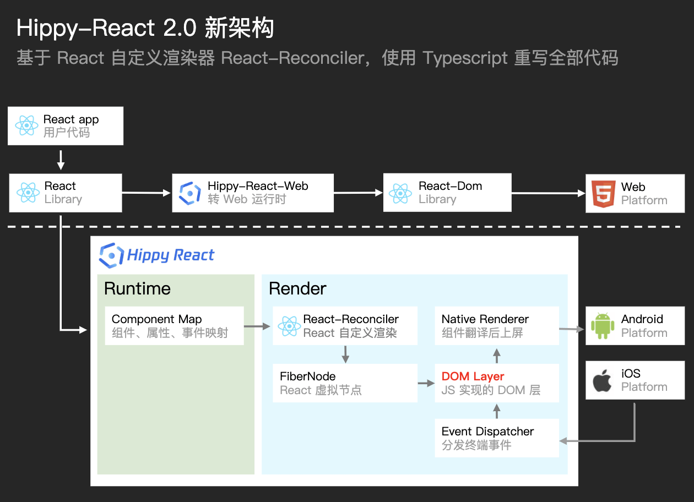

# Hippy学习笔记

## 目录
1. [Hippy](#hippy)
1. [hippy-react](#hippy-react)

---
### [Hippy](https://github.com/Tencent/Hippy)


1. 运行demo、调试

    >来自：[前端调试](https://hippyjs.org/#/guide/debug)。

    1. （可选）使用官网的发布版本（Latest release），不要用master分支代码跑demo
    2. 根目录执行`npm run build`
    3. 客户端demo运行

        1. iOS（/examples/ios-demo/）

            直接可以根据文档运行Xcode
        2. Android（/examples/android-demo/）

            1. Android Studio安装SDK

                1. 当提示 ToolChain 需要更新时全部选择拒绝（Gradle等）。
                2. 选择安装制定版本的SDK Tools：

                    >参考：[Hippy/issues/39](https://github.com/Tencent/Hippy/issues/39)。

                    1. Android SDK Build-Tools：28.0.3
                    2. CMake：3.6.4111459
            2. 配置自己sdk里面的cmake到环境变量
            3. 配置环境变量

                ```shell
                export ANDROID_HOME=/Users/「用户名」/Library/Android/sdk
                export PATH=${PATH}:${ANDROID_HOME}/tools
                export PATH=${PATH}:${ANDROID_HOME}/platform-tools
                ```
            4. `Task 'wrapper' not found in project`、`Task 'prepareKotlinBuildScriptModel' not found in project`：

                ```groovy
                // `build.gradle`文件最后添加：
                task wrapper(type: Wrapper) {
                  gradleVersion = '8.0.0'
                }

                task prepareKotlinBuildScriptModel {
                }
                ```
    4. 运行Hippy demo项目（/examples/hippy-react-demo/、/examples/hippy-vue-demo/）

        `npm run hippy:dev`、`npm run hippy:debug`

        1. Android调试（按步骤）：

            1. `adb reverse tcp:38989 tcp:38989`
            2. App点击：本地调试 -> 点击调试
            3. `chrome://inspect/#devices`打开Hippy debug tools for V8

                >根据<https://hippyjs.org/#/guide/debug?id=android>的要求，关闭`Discover USB devices`可以减少断连手机。
        2. iOS调试（按步骤）：

            1. 打开Safari，勾选：开发 -> 模拟器 xxx -> ️自动显示JSContext的网页检查器

                >调试H5页面时要关闭「️自动显示JSContext的网页检查器」，无效且影响页面切换性能。
            2. App点击：本地调试 -> 点击调试

                >若Safari没有调试信息，则重启App
2. 前端使用：

    1. 构建工具

        webpack
    2. 网络请求

        1. `fetch`
        2. `WebSocket`
        3. `cookie`（NetworkModule）
    3. 定时器

        `setTimeout/clearTimeout`、`setInterval/clearInterval`
    4. 日志

        `console.log/warn/error`

        - `console`日志会输出到iOS和Android系统日志中（Hippy 2.10.0之前）。

            >注意：若客户端系统打印多次日志，则可能是前端调用多次，也可能是客户端打印bug导致打印多次。
    5. 自定义字体

        `fontFamily`
    6. 二分法定位问题
3. 因为依赖客户端渲染的本质，所以最终需要在iOS和Android都真机测试才可以。

    iOS和Android的渲染结果可能不同，样式（截断、遮挡）、事件冒泡情况、等，容易产生区别。

### hippy-react


1. 组件

    >[组件文档](https://hippyjs.org/#/hippy-react/components)比较简单，更详细的用法在[demo](https://github.com/Tencent/Hippy/tree/master/examples/hippy-react-demo/src/components)或[源码](https://github.com/Tencent/Hippy/tree/master/packages/hippy-react/src/components)中。

    `<Image>`、`<ListView>`、`<Modal>`、`<Navigator>`、`<RefreshWrapper>`、`<ScrollView>`、`<TextInput>`、`<Text>`、`<View>`、`<ViewPager>`

    >组件功能需要完全按照文档描述来使用，不像前端标签那么灵活。如：`<View>`和`<ScrollView>`不能混用，`<ScrollView>`文档只有`contentContainerStyle`而没有 ~~`style`~~，`<View>`内部不能直接放字符串而需要放组件。

    1. 前端组件最终是传递给客户端，由客户端组件来实现呈现

        因此用客户端工具查看客户端组件时，可以根据组件名字前缀有`Hippy`的，判断其来自于前端。
    2. 客户端都是**单屏**视口（可以理解为外层包裹着一个宽高等于视口的flex父级容器），借助某些组件的内部滚动来实现多屏效果。

        >所有滚动都是：组件内部滚动。

        1. `<ScrollView>`

            支持：横向 或 竖向滚动（`horizontal`只能选择其一，不能同时横向、竖向滚动）。没有复用节点优化。

            1. 组件宽度/高度优先等于子组件总共的宽度/高度（就不用滚动）；若显式设置的宽度/高度小于子组件总共的宽度/高度则滚动。
            2. `<ScrollView>`内可嵌套所有组件（包括：`<ScrollView>`、`<ListView>`、`<ViewPager>`）。
        2. `<ListView>`

            支持：竖向滚动。复用节点优化：自动删除不在可视区的节点，对进入可视区的节点进行按类型复用。
        3. `<RefreshWrapper>`

            包裹一个`<ListView>`后支持：下滑刷新。

            - 新版本hippy，`<ListView>`支持下拉、上拉刷新功能（`renderPullHeader`/`onHeaderPulling`/`onHeaderReleased`、`renderPullFooter`/`onFooterPulling`/`onFooterReleased`），可以不需要`<RefreshWrapper>`配合下拉刷新。
        4. `<ViewPager>`

            支持：横向切换（类似Swiper）。

        - 其他组件都没有组件内部滚动功能（`overflow`只有`hidden/visible`2个属性值）。
    3. Tips（bug？）

        1. 官方属性/方法应该都能使用，只是有些属性/方法有各种问题（可能是触发时机偏晚、时序控制不好、兼容性不佳、等），导致实际情况无法满足效果而较少使用
        2. `<Image>`

            1. 需要显式设置`width`和`height`，才能显示。

                若是资源图且不知道高宽比例，可以用[`Image.getSize`](https://hippyjs.org/#/hippy-react/components?id=getsize)获取图片的宽高。
            2. 部分机型`onError`无法正常触发。

                可能是客户端对不同类型的图片地址采取的加载错误处理方案不同，如：http、base64、普通字符串、等。
            3. `padding`无法像CSS那样扩展图片的外部，因此若想要图片的点击范围大于图片内容，则需要在外部嵌套父级，父级设置`padding`并把点击事件放在父级。
        3. `<Text>`

            1. Android:

                1. `ellipsizeMode`仅支持`tail`。
                2. 截断中 有特殊字符（如一些标点符号） 或 与图片一起展示 时，截断会提前，不会在内容结尾处正常截断。
                3. 低版本Android机可能不支持`opacity`效果，可能导致整个文本渲染消失

                    用字体颜色`color: rgba(x,y,z, 透明度)`来代替。
                4. 渲染变化的节点，如果没有加`style`，会被渲染为空。

                    强制加上`style`设置一些样式内容。
                5. 某些渲染情况下，不设置`color`时会变成透明文字

                    需要显式设置`color`才能展示文字。
            2. 仅有`<Text>`有不同截断效果（ellipsizeMode），其他组件需要自己实现（计算字符数，结尾自己添加`...`或图片覆盖）。
            3. 不包裹在`<Text>`内的文字内容，无法渲染新值，只能展示首次渲染值。
            4. 文本若不设置`lineHeight`（或`height`），可能导致渲染出的行高影响整体渲染，甚至影响祖父元素的高度或间距，无法达到确定的"稳定状态"。

                若出现文字上下被截断的情况，则也试着设置大一些的`lineHeight`去解决。
            5. 若SDK没有处理好文字顺序的功能（如：右对齐、Right-to-Left的阿拉伯语），则考虑在外层包裹一层`<View>`用`flex-start/flex-end`处理。
            6. `fontStyle`只有`'normal/italic'`值，若要制作下划线或删除线等，则需要用额外节点处理（包裹一层<View>，然后absolute模拟）：

                ```jsx
                <View>
                  <Text numberOfLines={1}>文案</Text>
                  <View style={{ position: 'absolute', left: 0, right: 0, bottom: x, height: 1, backgroundColor: 'red' }}/>
                </View>
                ```
            7. `numberOfLines`设置会影响最大高度，文字排版几行才有几行的高度。
            8. `lineHeight`最好大于`fontSize`某个值（如：某些默认字体下`lineHeight`大于等于1.2倍`fontSize`），否则可能会导致行高不够裁切文字。

                >与CSS类似：
                >
                >1. 字体内容（content-area）高度 与`font-size`和`font-family`相关，与 ~~`line-height`~~ 无关。
                >2. 字体内容(content area) + 行间距(vertical spacing) = 行高(line-height)。其中行间距分上下部分，间距对半分。
                >
                >    若行高(line-height) 小于 字体内容(content area)，则行间距是负数，此时文字被裁切，上下行间部分重合。
        4. `<ViewPager>`

            >`height`和`flexBasis`类似。

            1. 需要父级容器还有空间 或 显式设置`height`，否则会导致内容高度为0。
            2. 不能在切换时改变`height`（会导致切换到一半卡住），可以设置延迟时间等待切换结束之后再改变`height`（>300ms）。
            3. 需要大于等于2个子节点。
            4. <details>

                <summary>制作普通的左右滑动切换，e.g.</summary>

                ```tsx
                import { useEffect, useState, useRef } from "react";
                import { pt, STATUS_BAR_HEIGHT } from "../utils";
                import { ScrollView, StyleSheet, Text, TouchableOpacity, View, ViewPager } from "react-native";
                import { event, getParameter } from "@tencent/kg-base";
                import FriendsList from "../components/FriendsCmp/FriendsList";

                const TAB_ARRAY: string[] = ["关注", "粉丝", "互关"];

                export default function Friends() {
                  // 强制刷新
                  const [show, setShow] = useState(true);
                  useEffect(() => {
                    !show && setTimeout(() => setShow(true));
                  }, [show]);

                  const viewPager = useRef<ViewPager>(null);

                  const [tab, setTab] = useState<0 | 1 | 2>(
                    [0, 1, 2].indexOf(Number(getParameter("tab"))) === -1 ? 0 : (Number(getParameter("tab")) as 0 | 1 | 2)
                  );

                  useEffect(() => {
                    event.on("router.enter", () => {
                      setShow(false);
                    });
                    return () => {
                      event.off("router.enter");
                    };
                  }, []);

                  return (
                    <View style={styles.wrap}>
                      <View style={styles.svTabWrap}>
                        <ScrollView horizontal={true} showsHorizontalScrollIndicator={!!__DEV__}>
                          <View style={{ width: pt(6) }} />
                          {TAB_ARRAY.map((value, index) => {
                            return (
                              <TouchableOpacity
                                key={index}
                                onPress={() => {
                                  if (index !== tab) {
                                    viewPager.current?.setPage(index);
                                  }
                                }}
                                style={styles.tabWrap}
                              >
                                <Text style={tab === index ? styles.tabTextActive : styles.tabText}>{value}</Text>
                                {tab === index ? <View style={styles.active} /> : null}
                              </TouchableOpacity>
                            );
                          })}
                        </ScrollView>
                      </View>

                      <ViewPager
                        ref={viewPager}
                        style={{ flex: 1 }}
                        initialPage={tab}
                        onPageSelected={({ position }) => {
                          setTab(position as 0 | 1 | 2);
                        }}
                      >
                        {TAB_ARRAY.map((value, index) => {
                          return (
                            <View key={index} style={{ flex: 1 }}>
                              {show ? <FriendsList tabIndex={index as 0 | 1 | 2} /> : null}
                            </View>
                          );
                        })}
                      </ViewPager>
                    </View>
                  );
                }

                const styles = StyleSheet.create({
                  wrap: {
                    flex: 1,
                    paddingTop: pt(92) - pt(35) + STATUS_BAR_HEIGHT
                  },
                  svTabWrap: {
                    height: pt(26)
                  },
                  tabWrap: {
                    paddingHorizontal: pt(14),
                    alignItems: "center"
                  },
                  tabText: {
                    lineHeight: pt(20),
                    fontSize: pt(14),
                    color: "rgba(0,0,0,0.4)",
                    height: pt(20)
                  },
                  tabTextActive: {
                    lineHeight: pt(20),
                    fontSize: pt(14),
                    color: "#000",
                    height: pt(20),
                    fontWeight: "bold"
                  },
                  active: {
                    width: pt(16),
                    height: pt(2),
                    borderRadius: pt(8),
                    backgroundColor: "#FF6D77",
                    marginTop: pt(4)
                  }
                });
                ```
                </details>

        5. 大部分（但不是所有）组件都有`onLayout`

            当**元素挂载**或者**布局改变**时被调用。返回节点实时的：宽高（`width`、`height`）、距离父级顶部(0,0)距离（`x`、`y`）。

            1. 若所有组件都套上`onLayout`，则可以滚动到指定组件位置和判断组件是否"曝光"。
            2. `onLayout`是异步的，并且可能触发时间比较慢，在组件渲染完毕之后上百毫秒（250ms？）才触发，也不一定按照排列顺序触发（如前面的组件比较复杂等原因）。
            3. 业务中解决问题，可以在节点内层或外层嵌套一层`<View>`并利用它的`onLayout`。
        6. `<ListView>`

            1. 改变渲染内容后（除了`onEndReached`触发之外）有时无法再触发`onEndReached`

                （除了`onEndReached`触发之外）改变渲染内容时，改变`<ListView>`的`key`属性。
            2. `getRowType`返回类型根据版本会有不同，旧版SDK（[@hippy/react](https://www.npmjs.com/package/@hippy/react)）需要字符串类型，新版SDK需要数字类型。

                >会在客户端层面报错（非前端层面，因此safari不报错），类似：`Error setting property 'type' of ListViewItem with tag #153: JSON value '0' of type NSNumber cannot be converted to NSString`。
            3. `renderRow`不支持横向排列、不足换行的方案（~~`flexDirection: 'row'`~~、~~`flexWrap: wrap或wrap-reverse`~~）。
            4. Android若第一次渲染内容无法达到底部，则不会触发 ~~`renderRow`~~、无法正确触发加载逻辑；iOS可能会多次触发`renderRow`。
        7. `<ScrollView>`、`<ListView>`的滚动事件，需要`onMomentumScrollEnd`（非用户触发的滚动结束）和`onScrollEndDrag`（用户触发的滚动结束）配合使用
        8. `<ScrollView>`

            1. 配合使用`contentContainerStyle`（在内层的内容容器生效）和`style`（在外层容器生效）

                - `<ScrollView>`会渲染里外2个容器：

                    1. flex相关样式可能要同时设置到`style`和`contentContainerStyle`上（尤其是在降级为H5页面时）

                        1. `style`是`<ScrollView>`自身外层的的样式，设置`flex: 1`占满其父级剩余空间。

                            Android的`borderRadius`有问题。
                        2. `contentContainerStyle`是`<ScrollView>`内部包裹一层的样式，设置`flexGrow: 1`可以使子项占满父级剩余空间并且正常滚动。

                        ><details>
                        ><summary>e.g.</summary>
                        >
                        >实现：内容不够时子项拉伸，内容足够时<ScrollView>滚动
                        >
                        >```jsx
                        ><View style={styles.container}>
                        >  <View style={{ width: 50, height: 100, backgroundColor: "red" }} />
                        >
                        >  <ScrollView style={styles.scrollviewStyle} contentContainerStyle={styles.scrollviewContentContainerStyle}>
                        >    <View style={styles.viewStyle}>1个或多个，满足效果</View>
                        >  </ScrollView>
                        >
                        >  <View style={{ width: 50, height: 100, backgroundColor: "red" }} />
                        ></View>
                        >
                        >const styles = StyleSheet.create({
                        >  container: {
                        >    flex: 1,
                        >    backgroundColor: "#a2a2a2",
                        >    alignItems: "center",
                        >  },
                        >  scrollviewStyle: {
                        >    flex: 1,
                        >    backgroundColor: "yellow",
                        >    width: 300,
                        >  },
                        >  scrollviewContentContainerStyle: {
                        >    alignItems: "center",
                        >    background: "white",
                        >    padding: 10,
                        >
                        >    // 关键设置
                        >    flexGrow: 1,  // 注意，不可以用：`flex: 1`。省去则仅正常滚动，不会内容不够时还占满父级
                        >  },
                        >  viewStyle: {
                        >    height: 200,
                        >    backgroundColor: "pink",
                        >    width: 200,
                        >    marginVertical: 50,
                        >
                        >    // 关键设置
                        >    flex: 1,   // 或：`flexGrow: 1`
                        >  },
                        >});
                        >```
                        ></details>

                        3. `horizontal={true}`横向滚动的左右间距问题，用 ~~`style`~~ 或 ~~`contentContainerStyle`~~ 不能达到预期效果的，尝试在子项中进行设置。
                    2. `<ScrollView>`转换为`<View>`时注意是否有`contentContainerStyle`，若有，则可能需要嵌套`<View>`

                        ><details>
                        ><summary>e.g.</summary>
                        >
                        >```jsx
                        ><ScrollView style={样式1} contentContainerStyle={样式2}>内容</ScrollView>
                        >
                        >转换 =>
                        >
                        ><View style={样式1}>
                        >  <View style={样式2}>
                        >    内容
                        >  <View>
                        ><View>
                        >```
                        ></details>
            2. 获取：滚动距离、内容总高度（视口高度+最大滚动距离 === 子级的总高度）、布局总高度（视口高度）

                >`<ListView>`可能类似。

                ```jsx
                // 下面3个值能够实时获取
                contentOffsetY = 0;          // 滚动距离
                contentSizeY = 0;            // 内容总高度（视口高度+最大滚动距离 === 子级的总高度）
                layoutMeasurementHeight = 0; // 布局总高度（视口高度）

                render () {
                  return (
                    <ScrollView
                      onLayout={(data) => {
                        this.layoutMeasurementHeight = data.layout.height
                      }}
                      onMomentumScrollEnd={(data) => {  // 滚动停止（非用户拖拽导致）
                        this.contentOffsetY = data.contentOffset.y;
                        this.contentSizeY = data.contentSize.height
                        this.layoutMeasurementHeight = data.layoutMeasurement.height
                      }}
                      onScrollEndDrag={(data) => {  // 滚动停止（用户拖拽导致）
                        this.contentOffsetY = data.contentOffset.y;
                        this.contentSizeY = data.contentSize.height
                        this.layoutMeasurementHeight = data.layoutMeasurement.height
                      }}
                    >
                      <View
                        onLayout={(data)=>{
                          this.contentSizeY = data.layout.height
                        }}
                      >
                        真正布局内容。。。
                      </View>
                    </ScrollView>
                  )
                }
                ```
            3. 有些SDK会给`<ScrollView>`默认设置`flex: 1`效果，可在外部加一个`<View>`节点限制来规避（或设置`flex: 0`，但未成功）
            4. 实现随着内容高度变化而自适应滚动或不滚动

                ```jsx
                // 内容不够则收缩至实际高度；内容超过外层flex: 1拥有的最高高度则内容滚动
                <View style={{ flexShrink: 1 }}>
                  <ScrollView>
                    ...内容
                  </ScrollView>
                </View>


                // 内容不够则收缩至实际高度，内容超过外层最大高度则内容滚动
                <View style={{ maxHeight: 123 }}>
                  <ScrollView>
                    ...内容
                  </ScrollView>
                </View>
                ```
        9. 降级到H5时，各回调函数的参数可能会变化，每个组件的实现要具体看降级时h5的源码
        10. 注意组件嵌套过多导致的性能、渲染问题
        11. `key`的diff有bug

            1. 带着`key`的组件可能挂载2次（触发2次`componentDidMount`）
            2. 复用组件会导致bug，可以用`key="index"`规避
        12. 各组件转换为H5组件时，可能会多套一层节点，注意`padding`或`margin`翻倍问题
        13. `render`返回多个节点会有渲染问题（React已支持）

            <details>
            <summary>e.g.</summary>

            ```jsx
            // 渲染错误：
            render() {
              return [1, 2, 3].map((item, index) => {
                return <Text key={index}>{index + 1}</Text>;
              });
            }


            // 渲染正确：
            render() {
              return (
                <>
                  {[1, 2, 3].map((item, index) => {
                    return <Text key={index}>{index + 1}</Text>;
                  })}
                </>
              );
            }
            ```
            </details>
        14. `<TextInput>`

            1. 数字为：`keyboardType="phone-pad"`。
            2. 显式设置`multiline={false}`，否则多行。
            3. 输入完毕判断：`onEndEditing`事件、`onBlur`事件、点击其他区域。
            4. 获取输入内容时机：`onEndEditing`事件、`onBlur`事件、`onChangeText`事件
            5. Android：

                1. 输入光标无法消除，除非设置`editable`为`false`。
                2. 调用节点`.blur()`（作用：触发节点`onBlur`事件）无效。

                    需要设置`editable`先为`false`再为`ture`才会触发节点`onBlur`事件（可能是需要触发页面渲染）。

                    >`onBlur`事件触发还会隐藏软键盘。
            6. iOS：

                1. 软键盘被唤起时，页面不会向上顶起，因此可能会挡住要输入的区域。

                    利用`onKeyboardWillShow`事件获得软键盘弹起时高度，把输入框区域垫高；输入完毕之后再恢复高度。
            7. 书写方式：

                ```jsx
                <TextInput
                  multiline={false}
                  style={{
                    flex: 1,
                    fontSize: 14,

                    height: 40,                          // Android必须大于40，不然显示不全
                    lineHeight: 38,

                    borderWidth: 1,
                    borderColor: 'black',
                    underlineColorAndroid: "transparent" // 去除Android特有的底部横线
                  }}
                  onChangeText={text => {
                    // text -> data
                  }}
                  value={data}
                />
                ```
        15. `「变量名」 && 「组件或嵌套组件」`，当`「变量名」`为`false`时，会用一个新的空`<Text>`替换`「组件或嵌套组件」`

            >`false && 「组件或嵌套组件」`因为一直都是`false`，所以不会有额外的空`<Text>`出现，直接忽略本句渲染。

            用三元运算符替换：`「变量名」 ? 「组件或嵌套组件」 : null`（`「变量名」`的`true/false`切换时，仅新增/删除`「组件或嵌套组件」`，不会有额外的空`<Text>`出现替换）
        16. 没有类似.html的DOM结构，不能动态向根节点插入内容，只能按照组件结构插入组件（`new Hippy`的`entryPage`）
        17. 每个组件（包括`<Text>`）都是块状的，不能像H5那样内联展示。但可以用如下方式制作类似`inline-block`的文字，支持不同颜色、换行、事件。

            ```jsx
            import { Text } from "react-native";

            <Text>      {/* 必须是 Text 包裹 Text */}
              <Text>    {/* 可以加样式、点击事件等所有属性 */}
                inline-block文字1
              </Text>
              <Text
                style={{ color: "red" }}
                onClick={() => {
                  console.log('点到我了')
                }}
              >
                inline-block文字2
              </Text>
              <Text>    {/* 可以加样式、点击事件等所有属性 */}
                inline-block文字3
              </Text>
            </Text>
            ```
        18. 列表项目曝光

            1. 若是`<ListView>`，则用`onAppear`或`onWillAppear`判断某子节点是否曝光。
            2. 若是`<ScrollView>`（`<ListView>`也同理），则用`onLayout`按顺序记录每个子节点的宽高，然后 父级`onScroll`的滚动距离 与 父级宽高、各子节点宽高 的关系。
        19. 制作swiper

            1. 最基本的滑块

                1. （必须宽度满屏）`<ScrollView>`配置`pagingEnabled={true}`
                2. （可设置宽度）`<ViewPager>`
            2. 有异化效果的滑块

                1. （必须宽度满屏）`<ScrollView>`

                    监控滚动事件，滚动结束后补偿滚动从而使子项居中，还可以利用滚动距离设置每一项的异化。

                    ><details>
                    ><summary>e.g.</summary>
                    >
                    >```tsx
                    >import { View, ScrollView, ScrollEvent } from "react-native";
                    >import { useRef } from "react";
                    >
                    >export default () => {
                    >  const ScrollViewRef = useRef<ScrollView | null>(null);
                    >  return (
                    >    <View style={{ height: 高度 }}>
                    >      <ScrollView
                    >        horizontal={true}
                    >        scrollEventThrottle={16}
                    >        showScrollIndicator={!!__DEV__}
                    >        contentContainerStyle={样式}
                    >        ref={ScrollViewRef}
                    >
                    >        onScroll={(obj: ScrollEvent) => {
                    >          // 异化子项：为每个子项计算与视图正中的距离
                    >        }}
                    >        onScrollBeginDrag={() => {
                    >          // 停止自动轮播
                    >        }}
                    >        onScrollEndDrag={(obj: ScrollEvent) => {
                    >          // 补偿滚动到合适位置（ScrollViewRef.current.scrollTo）
                    >
                    >          // 开始自动轮播
                    >        }}
                    >        onMomentumScrollEnd={(obj: ScrollEvent) => {
                    >          // （可选）补偿滚动到合适位置（ScrollViewRef.current.scrollTo）
                    >        }}
                    >      >
                    >        {子项}
                    >      </ScrollView>
                    >    </View>
                    >  );
                    >}
                    >```
                    ></details>
2. 模块

    >[模块文档](https://hippyjs.org/#/hippy-react/modules)比较简单，更详细的用法在[demo](https://github.com/Tencent/Hippy/tree/master/examples/hippy-react-demo/src/modules)或[源码](https://github.com/Tencent/Hippy/tree/master/packages/hippy-react/src/modules)中。

    1. 动画组件

        提供给前端React/Vue渲染使用的按时间变化的style中某样式属性值。

        1. `Animation`、`AnimationSet`

            ><details>
            ><summary>e.g.</summary>
            >
            >```tsx
            >import { View, Text, AnimationOption, Animation } from "react-native";
            >import { useEffect, useState } from "react";
            >
            >const DEFAULT = 1;
            >const NEXT_VALUE = 0;
            >
            >// 从0->1动画
            >const animationConfig1: AnimationOption = {
            >  mode: "timing",
            >  timingFunction: "ease-in-out",
            >  startValue: NEXT_VALUE,
            >  toValue: DEFAULT,
            >  duration: 3000
            >};
            >
            >// 从1->0动画
            >const animationConfig2: AnimationOption = {
            >  mode: "timing",
            >  timingFunction: "ease-in-out",
            >  startValue: DEFAULT,
            >  toValue: NEXT_VALUE,
            >  duration: 3000
            >};
            >
            >export default function Demo2() {
            >  const [opacity, setOpacity] = useState<Animation | typeof DEFAULT>(DEFAULT);
            >
            >  useEffect(() => {
            >    if (opacity !== DEFAULT) {
            >      opacity.start();
            >      opacity.onAnimationEnd(() => {
            >        opacity.destroy();
            >      });
            >    }
            >  }, [opacity]);
            >
            >  return (
            >    <>
            >      <View
            >        style={{
            >          backgroundColor: "red",
            >          width: 100,
            >          height: 100,
            >
            >          opacity: opacity
            >        }}
            >      />
            >      <Text
            >        onClick={() => {
            >          setOpacity(new Animation(animationConfig1));
            >        }}
            >      >
            >        opacity: 0=》1
            >      </Text>
            >      <Text
            >        onClick={() => {
            >          setOpacity(new Animation(animationConfig2));
            >        }}
            >      >
            >        opacity: 1 =》 0
            >      </Text>
            >    </>
            >  );
            >}
            >```
            ></details>

            - Tips（bug？）

                动画未完成不能中途`updateAnimation`（或者参数`startValue`必须是动画当前值）。
        2. [`setNativeProps`](https://hippyjs.org/#/style/setNativeProps?id=setnativeprops)

            直接操作最终的客户端UI组件样式（跳过前端执行后再传递给客户端渲染），性能更佳。

            ><details>
            ><summary>e.g.</summary>
            >
            >```tsx
            >import { View, UIManagerModule } from "react-native";
            >import { useRef } from "react";
            >
            >export default () => {
            >  const ViewRef = useRef<View | null>(null);
            >
            >  return (
            >      <View
            >        style={原样式}
            >        ref={ViewRef}
            >        onClick={() => {
            >          ViewRef.current &&
            >            UIManagerModule.getElementFromFiberRef?.(ViewRef.current)?.setNativeProps?.({
            >              style: {新样式（会合并到原样式中）},
            >            });
            >        }}
            >      />
            >  )
            >}
            >```
            ></details>
    2. `AsyncStorage`

        异步、持久化的键-值存储系统

        1. hippy

            返回Promise实例。
        2. h5

            返回与`window.localStorage`一致。
    3. `BackAndroid`

        监听Android实体键的back，在退出前做操作或拦截

        1. 开启：`BackAndroid.addListener(方法名)`
        2. 关闭：`BackAndroid.removeListener(方法名)`
    4. `Clipboard`

        读取或写入剪贴板
    5. `ConsoleModule`

        提供了将前端日志输出到iOS终端日志和Android logcat的能力。（Hippy 2.10.0之后，`console`不再能输出至终端日志）
    6. `Dimensions.get('window或screen')`

        获取设备的Hippy Root View或者屏幕尺寸的宽高

        - 按照设计稿等比例宽高：

            1. 自由放大缩小

                1. `width: 设计稿此物体宽 / 设计稿总宽 * Dimensions.get("window").width`
                2. `height: (设计稿此物体高 / 设计稿此物体宽) * 前面的width`
            2. 间距固定、单个物体占满：

                1. `width: Dimensions.get("window").width - 固定宽度`
                2. `height: (设计稿此物体高 / 设计稿此物体宽) * 前面的width`
            3. 间距固定、多个物品平均占满：

                1. `width: (Dimensions.get("window").width - 固定宽度) / 几个物品`
                2. `height: (设计稿此物体高 / 设计稿此物体宽) * 前面的width`

        >若是`position: "absolute"`要占满全屏且父级已占满全屏（高满屏或宽满屏），则可以用`top: 0; bottom: 0;`代替`Dimensions.get("window").height`，`left: 0; right: 0;`代替`Dimensions.get("window").width`。

        - Tips（bug？）

            1. （Android全面屏手机）`Dimensions.get('window').height`或横屏的`Dimensions.get('window').width`有可能会自动减少StatusBar的高度。

                >（React Native问题）市场上大多数的Android全面屏手机，一般都是以 刘海屏、水滴屏、挖孔屏 等异形屏的形式存在。屏幕在显示UI界面时，顶上的挖孔部分一般都是作为 状态栏 的形式存在。这其中的一些机型，在计算`Dimensions.get('window').height`时不将状态栏计算进去，但在实际渲染界面时又把状态栏作为可视区域。

                （网上较多是根据`Dimensions.get('window').height/Dimensions.get('window').width`比值判断出需要处理的Android全面屏，再一刀切加上StatusBar的高度。我感觉不妥，）需要更多地利用flex布局而不是~~确定尺寸~~的布局，或在最外层满屏的`<View>`上用`onLayout`异步获得渲染出的满屏高宽。
    7. `ImageLoaderModule`

        对远程图片进行相应操作：获取图片大小、预加载图片。
    8. `NetInfo`

        获取网络状态
    9. `NetworkModule`

        网络相关的模块，目前主要是操作Cookie。
    10. `PixelRatio`

        获取设备的像素密度(pixel density)
    11. `Platform`

        判断平台
    12. `Stylesheet`（`.hairlineWidth`、`.create()`）

        CSS样式表
    13. `UIManagerModule`

        提供了操作UI相关的能力。

    - 引入base64

        >默认情况下，webpack配置了针对小于某KB的图标进行转base64，所以一般情况不需要显式使用这个。

        `!!url-loader?modules!路径`，如：`import defaultSource from '!!url-loader?modules!./defaultSource.jpg';`

3. 自定义组件、自定义模块

    1. 自定义组件

        在需要渲染的地方通过`nativeName`属性指定到终端组件名称。

        >e.g. `<div nativeName="LinearGradientView">`
    2. 自定义模块

        1. 导入`callNative`或`callNativeWithPromise`
        2. 封装调用接口
        3. 导出模块
        4. 使用
4. 与Native通信方式（`桥协议`、JSI）：`import { callNative, callNativeWithPromise } from "@hippy/react"`

    >通用的，H5与Native通信方式：[`桥协议`或`自定义URL Scheme` + WebView提供给Native调用的全局回调函数（或匿名函数）](https://github.com/realgeoffrey/knowledge/blob/master/网站前端/Hybrid前端开发/README.md#native提供给hybrid宿主环境webview)。
5. 手势系统（点击事件、触屏事件）

    所有组件（或自定义组件）均支持监听手势系统（点击事件、触屏事件）。

    1. 点击事件

        1. `onClick`：点击
        2. `onPressIn`：开始触屏
        3. `onPressOut`：结束触屏
        4. `onLongClick`：长按

        - 回调参数：

            ```javascript
            {
              name: 「事件名」,
              id: 「控件的id」,
              target: 「控件的id」
            }
            ```
    2. 触屏事件

        1. `onTouchDown`：开始触屏
        2. `onTouchMove`：移动手指（持续触发回调）
        3. `onTouchEnd`：结束触屏
        4. `onTouchCancel`：被中断触屏

            若触发`onTouchCancel`则不触发`onTouchEnd`。

        - 回调参数：

            ```javascript
            {
              name: 「事件名」,
              id: 「控件的id」,
              target: 「控件的id」,
              page_x: 「触屏点相对于根元素的横坐标」,
              page_y: 「触屏点相对于根元素的轴坐标」
            }
            ```

    - 事件

        1. 事件冒泡

            点击事件、触屏事件均支持事件冒泡，由最上层组件往根元素冒泡触发事件回调。

            1. 若事件回调返回`false`，则冒泡。
            2. 若事件回调`不返回值`、或返回任何除了 ~~`false`~~ 的值，则不再冒泡。

            >注意使用UI库时，某些组件是否进行事件冒泡拦截。e.g. 大部分`<Button>`的实现，点击事件不会继续向上冒泡。
        2. 事件捕获

            在目标元素事件名添加`Capture`后缀，e.g. `onClickCapture`、`onTouchDownCapture`。
        3. 事件拦截

            父级组件拦截或中断子级组件的事件触发。所有触发在子级组件的事件都仅触发在父级组件。

            1. `onInterceptTouchEvent`：

                1. `true`：

                    1. 拦截所有手势事件（点击事件+触屏事件）。
                    2. 若父级组件在设置`onInterceptTouchEvent`为`true`之前，子级组件已经在处理触屏事件，则子级组件将收到一次`onTouchCancel`回调（如果子控件有注册该函数）。
                2. `false`（默认）：不拦截
            2. `onInterceptPullUpEvent`（貌似还未实现？）
        4. 事件穿透

            >客户端双端原生特性如此。

            1. 若对一个节点不设置事件监听，则对该节点的事件触发会穿透到下层（类似默认添加了CSS的`pointer-events: none;`）。
            2. 若设置了事件监听，则会承接住事件，事件不会透传至下层节点。

            >对于结构复杂的情况，可能违背这个逻辑，导致有覆盖的节点就不穿透。
6. 终端事件

    ```jsx
    import { HippyEventEmitter } from '@hippy/react';
    const hippyEventEmitter = new HippyEventEmitter();

    # 发送rotate事件并监听回调
    this.call = hippyEventEmitter.addListener('rotate', evt => console.log(evt.result));


    # 事件卸载
    this.call.remove();
    ```
7. 样式

    >1. Hippy的还原设计稿方案，与客户端的方案基本一致：[适配布局（与设计师协作思路）](https://github.com/realgeoffrey/knowledge/blob/master/网站前端/还原设计稿/README.md#适配布局与设计师协作思路)。
    >2. [React Native样式](https://reactnative.dev/docs/style)的子级。
    >3. 注意属性值要求是`Number`还是`String`，要严格遵守，不能互换。
    >4. 部分属性仅支持部分组件。如：`backgroundImage`仅支持`<View>`、不支持 ~~`<Text>`~~。

    1. 长度单位

        无单位、数值型（`Number`）。含义是dp或pt。不支持：~~百分比~~、~~任何单位（`px/em/rem/vw/vh`）~~。（部分机型）支持小数点、不取整。

        - 1px或小数点长度：

            （部分）客户端支持小数点数值（并非所有样式都支持，比如：有些机型不支持`width`，但支持`border`。以不同样式在具体机型的具体效果为准）。

            ```jsx
            import { View, PixelRatio, StyleSheet } from "react-native";

            <View style={{ width或height: 0.5 }}/>
            <View style={{ width或height: 1 / PixelRatio.get() }}/>
            <View style={{ width或height: StyleSheet.hairlineWidth || 0.333333 }}/>
            {/* StyleSheet.hairlineWidth 注意要存在，返回0.33... */}
            ```

    >属性名的方向：`left === start`、`right === end`。但貌似未实现 ~~`start`~~ 或 ~~`end`~~。

    2. 盒模型

        >类型CSS的`box-sizing: border-box;`（布局所占宽度 = width = content + padding左右 + border左右。高度同理）。

        1. `width`
        2. `height`
        3. `max/min`+`Width/Height`

            - Tips（bug？）

                1. `minWidth/minHeight`可能是`box-sizing: content-box 或 border-box`效果。
                2. `maxWidth/maxHeight`可能完全不生效。
        4. `border`

            1. 宽度（`Number`）

                1. `borderWidth`

                    >仅能设置为相同数值。
                2. `borderTopWidth`
                3. `borderRightWidth`
                4. `borderBottomWidth`
                5. `borderLeftWidth`
            2. 颜色

                属性值为颜色字符串。

                1. `borderColor`
                1. `borderTopColor`
                1. `borderRightColor`
                1. `borderBottomColor`
                1. `borderLeftColor`
            3. `borderStyle`

                1. `'solid'`（默认）
                1. `'dotted'`
                1. `'dashed'`
        5. `padding`（`Number`）

            1. `padding`

                >仅能设置为相同数值。优先级最低。
            2. `paddingVertical`

                >仅能设置为相同数值。
            3. `paddingHorizontal`

                >仅能设置为相同数值。
            4. `paddingTop`
            5. `paddingRight`
            6. `paddingBottom`
            7. `paddingLeft`
        6. `margin`（`Number`）

            1. `margin`

                >仅能设置为相同数值。
            2. `marginVertical`

                >仅能设置为相同数值。
            3. `marginHorizontal`

                >仅能设置为相同数值。
            4. `marginTop`
            5. `marginRight`
            6. `marginBottom`
            7. `marginLeft`
    3. 布局（flex）

        仅支持flex（，所以省略 ~~`display: flex`~~，所有组件全都只能是`flex`）。

        >与CSS的[flex](https://github.com/realgeoffrey/knowledge/blob/master/网站前端/HTML+CSS学习笔记/弹性盒子（Flexbox）.md#flex语法)略有不同。

        1. Flex容器

            1. `flexDirection`：决定主轴的方向。

                1. `'row'`：水平方向，起点在左端（CSS的`flex-direction`默认：`'row'`）。
                2. `'column'`（默认）：垂直方向，起点在上沿。
            2. `flexWrap`：一条主轴排不下的情况，如何换行。

                项的排布顺序。

                >与CSS的表现不同，也没有 ~~`alignContent`~~ 配合。还是只能配合`justifyContent`、`alignItems`使用。
            3. `justifyContent`：子项在主轴上的对齐方式（与轴的方向有关）。

                >与CSS的`justify-Content`表现一致。
            4. `alignItems`：子项在侧轴上的对齐方式（与轴的方向有关）。

                默认：`'stretch'`（CSS的`align-content`默认：`'normal'`）。

                >与CSS的`align-Items`表现一致。
            >无效属性：
            >
            >5. ~~`alignContent`~~：多根主轴（一条主轴排不下，有换行）的对齐方式（不换行则该属性不起作用）。
            >
            >    默认：`'flex-start'`（CSS的`align-content`默认：`'stretch'`）。
        2. Flex子项

            >都在主轴方向上。

            1. `flex`：占用容器中剩余空间的大小。

                1. `0`（默认）：元素没有弹性，不管父级容器空间，仅使用自身原本宽度/高度占据空间。

                    >也可能因为内容太多溢出父级，建议用`-1`代替。
                2. `「正整数」`：元素有弹性，`每个元素占用的剩余空间 = 自己的 flex 数值 / 所有同一级子容器的 flex 数字之和`。

                    >此时`flex: 「正整数」`等价于`flexGrow: 「正整数」, flexShrink: 1, flexBasis: 0`。

                3. `-1`：若空间不足则缩小到`minWidth/minHeight`。若空间没有不足，则使用自身原本宽度/高度占据空间。

                    适合可变元素后面紧跟着内容的情况。

                    >CSS的`flex-grow: 0`和`flex-shrink: 1`的默认表现。
                >子项铺满父级的主轴剩余空间：`flex: 1`；子项扩充满父级的侧轴：`alignSelf: 'stretch'`。

            >多个项：若都设置`flex: 1`（无论各项内容不一），则所有项占用空间大小均**一致**。若都设置`flexGrow: 1`，则各项先按照自己内容大小占据不同大小空间，再对剩余空间进行拉伸（各项所占空间**不一致**）。

            2. `flexGrow`：伸缩项目扩展的能力。

                默认：`0`。

                >与CSS的`flex-grow`表现一致。
            3. `flexShrink`：伸缩项目收缩的能力。

                默认：`0`（CSS的`flex-shrink`默认：`1`）。

                >与CSS的`flex-shrink`表现一致。

                - 父级`flexShrink: 1` + 子级`flex: 1`，可以实现：内容不够则收缩至实际高度/宽度；内容最大高度/宽度不超过外层flex: 1拥有的最大高度/宽度

                    ```jsx
                    <View>
                      <View style={{ flexShrink:1}}>
                        <Text style={{ flex: 1 }}>  // 也可以是<ScrollView>等 会变化的内容
                          自适应的内容
                        </Text>
                      </View>

                      <View>固定内容</View>
                    </View>
                    ```
            4. `flexBasis`：伸缩基准值。

                >与CSS的`flex-basis`表现一致。
            5. `alignSelf`：单个子项覆盖父元素的`alignItems`。

                >与CSS的`align-self`表现一致。
            >无效属性：~~`order`~~
    4. 颜色

        >包括所有颜色，如：border、字体、background、阴影。

        1. rgb

            e.g. `'#f0f'`、`'#ff00ff'`、`'rgb(255, 0, 255)'`
        2. rgba

            e.g. `'#f0ff'`、`'#ff00ff40'`、`'rgba(255, 0, 255, 0.5)'`
        3. hsl

            e.g. `'hsl(0, 33%, 69%)'`
        4. hsla

            e.g. `'hsla(0, 33%, 69%, 0.5)'`
        5. `'transparent'`

            >没有`'none'`，只能用`'transparent'`覆盖回无背景色。
        6. 颜色名字
    5. 字体

        1. `fontSize`
        2. `lineHeight`
        3. `color`
        4. `fontWeight`
    6. `transform: [{ 属性1: 值1 }, {属性2: 值2}]`

        >属性值是`object[]`。
    7. `backfaceVisibility`

        元素背面朝向观察者时是否可见。

        1. `'visible'`（默认）
        2. `'hidden'`
    8. 定位

        1. `position`

            1. `'relative'`（默认）
            2. `'absolute'`

                1. 起点：从父级`border`内开始计算（父级的`margin`、`padding`不影响子级`absolute`位置相对父级位置）；从本身的`margin`开始计算。

                    >与CSS表现一致。

            - 不支持 ~~`fixed`~~。若要制作`fixed`效果，则：

                ```jsx
                <View>      // 此处父级必须是全屏才可以：占满上下左右全屏。因为"absolute"仅能针对父级
                  <ScrollView></ScrollView>
                  <View style={{ position: "absolute", top: 0, bottom: 0, left: 0, right: 0 }}>类似fixed的效果</View>
                  <View style={{ position: "absolute", top: 0, left: 0, width: Dimensions.get("window").width, height: Dimensions.get("window").height }}>类似fixed的效果（不够优雅）</View>
                </View>
                ```
            - 若要制作全局定位（如：全屏居中、贴底部、贴顶部、等）的组件，因为`'absolute'`仅针对父级 且 Android子级不能超出父级（强制`'hidden'`）的限制，则其父级必须是占满上下左右全屏（视情况而定），但不要求是最外层元素。
        2. `top`
        3. `right`
        4. `bottom`
        5. `left`
    9. `zIndex`

        `position: relative/absolute`的节点，均按代码书写顺序进行堆叠，`zIndex`等效改变任何一个节点。

        1. `0`（默认）

            >（与CSS的[层叠上下文](https://github.com/realgeoffrey/knowledge/blob/master/网站前端/HTML+CSS学习笔记/README.md#层叠上下文stacking-context)略有不同）可以理解为：Hippy中任何一个组件，都形成层叠上下文且默认层叠顺序为`0`。因此层叠顺序仅在兄弟节点就确定了，不是兄弟节点无法改变堆叠顺序。
        2. `「整数」`
    10. `overflow`

        >`overflow`只有2个属性值，没有CSS的 ~~`scroll`~~，除了拥有滚动效果的组件（`<ScrollView>`、`<ListView>`、`<RefreshWrapper>`、`<ViewPager>`）之外，其他组件都不支持组件内滚动。

        子元素超过父容器的宽度/高度后的显示情况。

        1. `'visible'`（默认）
        2. `'hidden'`

            Android机型，大部分子级元素一定会被父级元素截断（就像：父级元素固定`overflow: 'hidden'`不可改变），但是部分客户端组件还是需要父级设置`overflow: 'hidden'`才截断。因此若需要做超过父级的节点，则必须往上不断提升该节点。但对于`border`等，父级还是需要`overflow: hidden`才能不被子级盖住。
    11. 背景

        >不能直接 ~~`background`~~，无效果。

        1. `backgroundImage`

            >1. URL不能缩写。不能用 ~~<https://placeholder.com/>~~？
            >2. 仅针对`<View>`等。

            e.g. `backgroundImage: import变量/require变量/"http资源"`
        2. `backgroundPositionX`
        3. `backgroundPositionY`
        4. `backgroundColor`

        - 实现背景图某些效果

            1. 本地资源制作背景图方式：

                ```jsx
                <View>
                  <Image source={{ uri: import变量/require变量/"http资源" }} style={{position: 'absolute', top: 0, left: 0, width: 宽, height: 高}} />
                  内部节点
                </View>
                ```

                或

                ```jsx
                <Image source={{ uri: import变量/require变量/"http资源" }} style={{width: 宽, height: 高}}>
                  内部节点
                </Image>
                ```

                或

                父级节点的style添加：`backgroundImage`
            2. 实现图片repeat效果

                `<Image>`的`resizeMode`（`cover`、`contain`、`stretch`、`repeat`、`center`）类似CSS的`object-fit`+`background-repeat`属性，但没有CSS那么多效果组合。

                ```jsx
                <Image
                  style={{ width: 图片真实宽度或倍数, height: 图片真实高度或倍数 }}
                  source={{ uri: 一倍图片 }}
                  resizeMode="repeat"
                />
                ```
    12. 外边框圆角（`Number`）

        1. `borderRadius`

            >仅能设置为相同数值。

            - Tips（bug？）

                1. 可能不支持`<Text>`
        2. `borderTopLeftRadius`、`borderTopRightRadius`、`borderBottomRightRadius`、`borderBottomLeftRadius`

            - Tips（bug？）

                1. Android用这种单独设置的属性会导致`overflow: 'hidden'`有问题。
                2. Android的`<LinearGradientView>`（nativeName="LinearGradientView"）对这种单独设置的属性支持不好（无效）。
                3. iOS若最终设置的4个角值不同，则导致`backgroundColor`渲染问题。应避免使用这些单独设置的属性：

                    1. 切图处理
                    2. 用一个子节点设置`borderRadius`模拟

                        ```tsx
                        <View style={{ paddingBottom: 10, backgroundColor: "颜色1" }}>...</View>
                        <View style={{ marginTop: -10 }}>
                          <View
                            style={{
                              borderRadius: 5,
                              height: 10,
                              backgroundColor: "颜色2",
                              position: "absolute",
                              top: 0,
                              left: 0,
                              right: 0,
                            }}
                          />
                          <View style={{ backgroundColor: "颜色2", marginTop: 5 }}>...</View>
                        </View>
                        ```
    13. `opacity`
    14. 阴影

        1. `boxShadow`+后缀

            >直接`boxShadow: '属性'`无效。

            ```javascript
            boxShadowOpacity: 0.6,
            boxShadowRadius: 5,
            boxShadowOffsetX: 10,
            boxShadowOffsetY: 10,
            // spread attr is only supported on iOS
            // spread 属性仅适用于iOS
            boxShadowSpread: 1,
            boxShadowColor: '#4c9afa',
            ```
        2. `textShadow`+后缀

            >直接`textShadow: '属性'`无效。

            ```javascript
            textShadowColor
            textShadowOffsetX   // 大于0才有效
            textShadowOffsetY   // 大于0才有效
            textShadowRadius
            ```

            ><details>
            ><summary>e.g.</summary>
            >
            >```javascript
            >textShadowColor: "#fff",
            >textShadowOffsetX: 0.1,
            >textShadowOffsetY: 0.1,
            >textShadowRadius: 5
            >```
            ></details>

    - 样式写法

        1. 内联样式

            e.g. `<View style={{ width: 100, height: 100, backgroundColor: 'red' }}/>`。
        2. 外部样式

            <details>
            <summary>e.g.</summary>

            ```jsx
            // 定义样式
            import { StyleSheet } from '@hippy/react'
            const styles = StyleSheet.create({
              itemStyle: {
                width: 100,
                height: 100,
                lineHeight: 100,
                borderWidth: 1,
                borderColor: '#4c9afa',
                fontSize: 80,
                margin: 20,
                color: '#4c9afa',
                textAlign: 'center'
              },
              verticalScrollView: {
                height: 300,
                width: 140,
                margin: 20,
                borderColor: '#eee',
                borderWidth: 1
              },
            });


            // 使用
            <Text style={styles.itemStyle}/>
            <Text style={styles.verticalScrollView}/>
            ```
            </details>
8. 无障碍

    组件属性`accessible`、`accessibilityLabel`。

    1. （因为兼容性，）尽量在原本就有事件的组件上增加无障碍属性，不要提升无障碍属性到祖先级组件。
    2. Tips（bug？）

        1. Android：

            1. 组件均需要`accessible`、`accessibilityLabel` + 事件（如：`onClick={()=>false}`）才能支持无障碍选中。

                >注意加了事件之后，不要影响到原来的事件逻辑（如：阻止了原有冒泡逻辑）。
            2. 父级`accessible={true}`，还会再选中子级的`accessible`。
            3. 弹窗之类的，无法屏蔽下层组件的无障碍选中。
        2. iOS：

            1. `<Text>`不需要加`accessible`、`accessibilityLabel`（可以设置`accessible={false}`关闭）；其他组件需要加`accessible`、`accessibilityLabel`。
            2. 父级`accessible={true}`，就不会再选中子级的`accessible`（但是可以阅读出所有子级的`accessibilityLabel`内容）。
