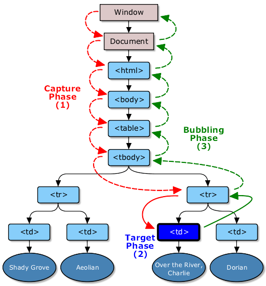

# JS学习笔记

## 技巧经验

### 易错点 or Tips
1. `var a = b = 1;/* b没有var的声明*/`

    在局部作用域中用如上写法，第二个以后的变量自动变成没有var定义的状态，意味着如果之前没有声明，那么就转化为全局变量的声明。
2. `var a = a || {};`

    1. 先声明提前`var a;`；
    2. 接着右侧的表达式`a || {}`先执行：根据规则先判断a的值是否为真，如果a为真，则返回a；如果a不为真，则返回后面的{}；
    3. 最后再将结果赋值给`a`。

    等价于：
    ```javascript
    /* 不是形参情况*/
    var a;

    if (a === 0 || a === "" || a === false || a === null || a === undefined) {
        a = {};
    }

    /* 形参情况*/
    function func(b) {
        if (b === 0 || b === "" || b === false || b === null || b === undefined) {
            b = {};
        }
    }
    ```
    >`var a = b || {};`与`if (c) {}`会因为b或c没有定义而报错，可以用`typeof`来使代码健壮：
    >
    >1. `var a = typeof b !== 'undefined' && b !== null ? b : {};`
    >2. `if (typeof c !== 'undefined' && c !== null) {}`
3. `if(var a = 1, b = 2, c = 3, false){/* 不执行*/}`

    逗号操作符`,`对每个操作对象求值（从左至右），然后返回最后一个操作对象的值。

    >`var`语句中的逗号不是逗号操作符，因为它不是存在于一个表达式中。尽管从实际效果来看，那个逗号同逗号运算符的表现很相似。但确切地说，它是`var`语句中的一个特殊符号，用于把多个变量声明结合成一个。
4. `var a = [10, 20, 30, 40][1, 2, 3];/* 40*/`

    1. `[10, 20, 30, 40]`被解析为数组；
    2. `[1, 2, 3]`被解析为属性调用，逗号操作符取最后一个值为结果。

    因此结果为数组`[10, 20, 30, 40]`的`[3]`属性值：`40`。
5. `{a: 'b'} + 1;/* 1*/`

    大括号视为代码块，没有返回值。需要给大括号加上小括号，表明为一个值：`({a: 'b'}) + 1;/* [object Object]1*/`。
6. HTML5的`audio`标签的自动播放属性`autoplay`

    wap端的部分浏览器无法自动播放，可以设置触屏的时候开始播放：

    ```html
    <audio src="1.mp3" controls="controls" autoplay="autoplay" id="audio">
        您的浏览器不支持 audio 标签
    </audio>

    <script>
        window.ontouchstart = function () {
            document.getElementById('audio').play();

            window.ontouchstart = null;
        }
    </script>
    ```
7. 浮点数的计算

    浮点数值计算会产生舍入误差，因此永远不要用条件语句判断某个特定浮点数值，也不要用JS进行复杂的计算。
    >避免浮点数运算误差函数：[用整数进行小数的四则运算](https://github.com/realgeoffrey/knowledge/blob/master/网站前端/JS方法积累/实用方法/README.md#原生js用整数进行小数的四则运算避免浮点数运算误差)。
8. 判断DOM是否支持某属性

    若要判定一个属性是否被DOM所支持，新建一个DOM来判断：`if('属性' in document.creatElement('某标签')){...}`。
    >在DOM中随意添加一个属性（DOM所没有的也可以），`此属性 in 此DOM`永远为真，不可以判断是否此DOM存在此属性（或方法）。
9. `eval`中直接执行`function`声明无效，必须用引号把`function`声明包裹起来才有效（尽量不用`eval`）

    ```javascript
    eval(function a() {});      //返回function a() {}，但是没有声明
    eval('function b() {}');    //返回undefined，声明成功
    ```

    >1. `if()`中的代码对于`function`的声明就是用`eval`带入方法当做参数，因此虽然返回true，但是方法没有被声明。
    >2. `setTimeout`与`setInterval`中第一个参数若使用字符串，也是使用`eval`把字符串转化为代码。
10. `if`、`for`以及`while`之类的判断语句中用赋值操作

    （大部分是误用）赋值的内容Boolen后为假会导致条件判断为假：`if(a = false){/* 不执行*/}`。
    >判断语句内只判断整体返回值是`true`还是`false`，与里面执行内容无关（尽管对其语法有所限制）。

### JS和jQuery（Zepto）获取的位置信息（纵轴为例）
1. DOM节点

    > `dom`为JS对象，`$dom`为jQuery（或Zepto）对象。

    1. 节点高度：

        1. 高度+padding：

            `dom.clientHeight` 或 `$dom.innerHeight()`
        2. 高度+padding+border：

            `dom.offsetHeight` 或 `$dom.outerHeight()`
    2. 节点内容高度：

        `dom.scrollHeight`
    3. 节点内滚动距离：

        `dom.scrollTop` 或 `$dom.scrollTop()`
    4. 节点顶部距离屏幕顶部：

        `dom.getBoundingClientRect().top - document.documentElement.clientTop`

        或

        `$dom.offset().top - $(window).scrollTop()`

        > 节点底部距离屏幕顶部：`dom.getBoundingClientRect().bottom`。
    5. 节点顶部距离文档顶部：

        `dom.getBoundingClientRect().top - document.documentElement.clientTop + (document.body.scrollTop || document.documentElement.scrollTop)`

        或

        `$dom.offset().top`
2. 文档和视窗

    1. 视窗高度：

        `window.innerHeight || document.documentElement.clientHeight || document.body.clientHeight`

        或

        `$(window).height()`
    2. 文档内容高度：

        `document.body.scrollHeight` 或 `$(document).height()`
    3. 文档滚动高度：

        `document.body.scrollTop || document.documentElement.scrollTop` 或 `$(window).scrollTop()`

>Zepto没有`innerHeight`和`outerHeight`，改为`height`。

### 节点与屏幕距离关系
1. jQuery或Zepto

    1. 节点**顶部**在**屏幕底部**以上

        `$dom.offset().top <= $(window).scrollTop() + $(window).height()`
    2. 节点**底部**在**屏幕顶部**以下

        `$dom.offset().top + $dom.outerHeight() >= $(window).scrollTop()`
    3. 节点在屏幕内

        以上`&&`结合。
2. 原生JS

    > 屏幕高度 = `window.innerHeight || document.documentElement.clientHeight || document.body.clientHeight` 或 `$(window).height()`。

    1. 节点**顶部**在**屏幕底部**以上

        `dom.getBoundingClientRect().top <= 屏幕高度`
    2. 节点**底部**在**屏幕顶部**以下

        `dom.getBoundingClientRect().bottom >= 0`
    3. 节点在屏幕内

        以上`&&`结合。

### 滚动定位
> 也可以给底部（或顶部）放置一个标记节点，当**这个节点的顶部在容器底部以上（或这个节点的底部在容器顶部以下）**时为滚动到底部（或顶部）。

1. DOM节点

    1. 内容滚动到底部：

        `dom.offsetHeight + dom.scrollTop >= dom.scrollHeight`
    2. 内容滚动到顶部：

        `dom.scrollTop === 0`
2. 文档

    >1. 屏幕高度 = `window.innerHeight || document.documentElement.clientHeight || document.body.clientHeight` 或 `$(window).height()`
    >2. 文档滚动高度 = `document.body.scrollTop || document.documentElement.scrollTop` 或 `$(window).scrollTop()`
    >3. 文档内容高度 = `document.body.scrollHeight` 或 `$(document).height()`

    1. 滚动到底部：

        `屏幕高度 + 文档滚动高度 >= 文档内容高度`
    2. 滚动到顶部：

        `文档滚动高度 === 0`

### JS代码风格规范（coding style guide）
1. 声明

    1. 变量声明

        无论语句在何处，无论是否会真正执行到，所有的`var`语句的**声明**都提前到作用域（函数内部或者全局）顶部执行（hoisting），但是具体**赋值**不会被提前。

        >e.g.
        >```javascript
        >var a = 1;
        >
        >(function () {
        >    console.log(a);    //undefined
        >
        >    var a = 2;
        >
        >    console.log(a);    //2
        >})();
        >
        >//等效于：
        >var a = 1;
        >
        >(function () {
        >    var a;
        >    console.log(a);    //undefined
        >
        >    a = 2;
        >
        >    console.log(a);    //2
        >})();

        声明变量是它所在上下文环境的不可配置属性（non-configurable property），非声明变量是可配置的（例如非声明变量可以被`delete`）。

        >建议：总是把所有变量声明都放在函数顶部，而不是散落在各个角落。

        相同作用域中，对同一个变量进行多次声明，则忽略第一次之后的声明（会执行变量赋值）。
    2. 函数声明

        也会被JS引擎提前到作用域顶部声明，因此代码中函数的调用可以出现在函数声明之前。

        >函数声明不应当出现在语句块之内（如条件语句等），语句块的函数也会提前声明，导致语义不清容易出错。
    3. 函数表达式（Function expressions）声明

        必须先声明：`var a = function(){...};`才可以使用，声明会被提前，但赋值不会被提前。
    4. 同名的变量声明和函数声明（不是函数表达式）

        同时声明的情况下（顺序不影响结果）：
        1. 变量仅声明不赋值：被赋值为函数。
        2. 变量赋值：被赋值为变量。

        >e.g.
        >```javascript
        >var a1 = 1;
        >function a1() {}
        >console.log(a1);    //1
        >
        >
        >function b2() {}
        >var b2 = 1;
        >console.log(b2);    //1
        >
        >
        >var c3;
        >function c3() {}
        >console.log(c3);    //function
        >
        >
        >function d4() {}
        >var d4;
        >console.log(d4);    //function
        >```

    >建议：先声明再使用。把函数声明紧接着放在变量声明之后。

2. 严格模式`use strict`

    可用于全局，也可以用于局部（如函数内）。

    >不推荐用在全局作用域中，因为当有JS文件合并时，一个文件的全局严格模式会导致整个文件都是严格模式。
    >全局可以用`(function(){'use strict';/* 执行内容*/}());`匿名函数方式使用。
3. 全等`===`（不全等`!==`）与等号`==`（不等`!=`）区别

    1. 当比较的两个值的类型不同时，`==`和`!=`都会强制类型转换，再进行转换后值的比较；

    2. 用`===`和`!==`则不会转换，若类型不同则直接返回`false`（`switch`语句比较值是全等模式比较）。

    >建议：都用`===`或`!==`进行比较。
4. 三元运算符应当仅仅用在条件赋值语句中，而不要作为if语句的替代：

    1. `var a = condition ? '1' : '2';`
    2. ~~`condition ? func1() : func2();`~~
5. 命名

    1. 变量命名的前缀应当是**名词**，函数命名的前缀应当是**动词**。
    2. 约定函数名：

        1. `can`、`has`、`is`开头的返回值是布尔型。
        2. `get`开头的返回是非布尔型。
        3. `set`开头的执行保存动作。
    3. 常量用大写字母和下划线分割，如`MAX_COUNT`。
    4. 构造函数用大驼峰命名法（Pascal Case），首字母大写（以非动词开头），单词首字母大写：

        1. `var a = new Person();/* 构造函数*/`
        2. `var b = getPerson();/* 普通函数*/`

        >这样对于首字母大写的函数即可认定为构造函数，否则为普通函数。
    5. 不要用多行的字符串写法

        ```javascript
        /* 不提倡的多行写法*/
        var a = 'abc\
        def';

        /* 一般写法*/
        var b = 'abc' +
            'def';
        ```
    6. 对象的属性、方法，与变量、方法命名规则相同。
    7. 若属性、变量、方法在表示其是私有的，可在开头加一个下划线`_`作为区分。
6. 使用字面量代替构造函数（普通函数）

    >好处：
    >1. 代码更少。
    >2. 不需要构造函数的“作用域解析”（scope resolution），提高性能。
    >3. 构造函数可以接收参数，返回的实例不可控、易混淆，字面量简单不出错。

    1. 对象

        ```javascript
        /* 不提倡的构造函数写法*/
        var a1 = new Object();
        a.attr1 = '...';
        var a2 = new Object({attr1: '...'});

        /* 提倡的字面量写法*/
        var b = {attr1: '...'};
        ```
    2. 数组

        ```javascript
        /* 不提倡的构造函数写法*/
        var arr1 = new Array('a', 'b');

        /* 提倡的字面量写法*/
        var arr2 = ['a', 'b'];
        ```
        ```
    3. 字符串

        ```javascript
        /* 不提倡的构造函数写法*/
        var str1 = new String('a');

        /* 提倡的字面量写法*/
        var str2 = 'a';
        ```

    - 其他数据类型
7. 注释规范

    1. 单行注释：`//`后不空格

        - 使用场景：

            1. 代码上方独占一行，缩进与备注内容一致，注释前必须空一行。
            2. 代码尾部（至少一个缩进）。
            3. 被注释的大段代码。
    2. 多行注释：`/*`和`*`后空一格

        - 使用场景：

            1. 代码上方独占多行，缩进与备注内容一致，注释前必须空一行。
            2. 作用：

                1. 难以理解的代码。
                2. 可能被误认为错误的代码。
                3. 浏览器特性hack。
    3. 函数注释规范（使用部分[JSDoc](http://usejsdoc.org/)）

        ```javascript
        /**
         * 方法描述
         * @constructor - （是否构造函数）
         * @param {Number} param1 - 参数描述，限制值为：1 描述|2 描述|3 描述
         * @param {Object|String|Boolean|Function|Array} param2 - 参数描述
         * @param {*} param3 = 'default' - 拥有默认值
         * @param {*} [param4] - 可选参数
         * @param [param5 = 'default'] - 可选参数拥有默认值
         * @param {...Number} param6 - 可重复使用参数
         * @returns {Object|Undefined} result - 参数描述
         */
        function func(param1, param2, param3, param4, param5, param6) {

            return result;
        }
        ```
8. [JS编程风格总结](http://www.ruanyifeng.com/blog/2012/04/javascript_programming_style.html)（programming style）

    1. 表示区块起首的大括号，不要另起一行。
    2. 调用函数的时候，函数名与左括号之间没有空格。
    3. 函数名与参数序列之间，没有空格。
    4. 所有其他语法元素与左括号之间，都有一个空格。
    5. 不要省略句末的分号。
    6. 不要使用`with`语句。
    7. 不要使用“相等”（`==`）运算符，只使用“严格相等”（`===`）运算符（同理仅适用`!==`，不使用`!=`）。
    8. 不要将不同目的的语句，合并成一行。
    9. 所有变量声明都放在函数的头部。
    10. 所有函数都在使用之前定义。
    11. 避免使用全局变量；*如果不得不使用，用大写字母表示变量名。*
    12. 不要使用`new`命令，改用`Object.create()`命令。
    13. 建构函数的函数名，采用首字母大写；其他函数名，一律首字母小写。
    14. 不要使用自增（`++`）和自减（`--`）运算符，用`+=`和`-=`代替。
    15. 总是使用大括号表示区块。
9. JS编码规范

    绝大部分同意[fex-team:tyleguide](https://github.com/fex-team/styleguide/blob/master/javascript.md#javascript编码规范)。

    >可以设置为IDE的**Reformat Code**的排版样式。
10. 用户体验

    1. 平稳退化：当浏览器不支持或禁用了JS功能后，访问者也能完成最基本的内容访问。

        1. 为JS代码预留出退路（a标签添加属性链接，用JS事件绑定去拦截浏览器默认行为）

            `<a href="真实地址" class="j-func">...</a>`

        2. ~~伪协议`javascript:`~~

            `<a href="javascript: func();">...</a>`

        3. ~~内嵌事件处理函数~~

            `<a href="#" onclick="func();return false;">...</a>`
    2. 渐进增强：先完成基本通用功能，再追加额外功能。
    3. 向前兼容：确保老版本浏览器基本可用，使之虽不能支持某些功能，但仍能基本访问。

        1. **能力检测：`if(func){func();}`**（最正确方式）。
        2. 怪癖检测：`try-catch`。
        3. 浏览器嗅探技术（用户代理检测）。
    4. 资源分离：把样式表和脚本分离出HTML。

        1. 使用外部资源。
        2. 不在HTML上用事件处理函数。
        3. 对只为DOM增添的内容，转移到外部资源中动态创建。
    5. 性能提升。

        1. 减少访问DOM（搜索结果保存在变量中）。
        2. 减少外链请求数量（合并JS、CSS、图片）。
        3. 压缩资源。
        4. 脚本放置在`</body>`前。
    6. 从URL输入之后就开始考虑[性能优化](https://github.com/realgeoffrey/knowledge/blob/master/网站前端/前端概念/README.md#页面载入解析步骤)，这是一个工程问题。

### 编程实践（programming practices）
1. UI层的松耦合

    1. 不要~~用JS修改CSS样式~~，JS只修改class（任何时刻，CSS中的样式都可以修改，而不必更新JS）。

        >特例：根据页面重新定位，可以用JS设定定位置（如`top`、`bottom`等）。
    2. 将HTML从JS中抽离，避免增加跟踪文本和结构性问题的复杂度。可以使用模板引擎，如[handlebars.js](https://github.com/wycats/handlebars.js)。
2. 避免使用全局变量

    >任何来自函数外的数据都应当以参数形式传递进函数，这样做可以将函数与其外部环境隔离开来，并且修改不会对程序其他部分造成影响。

    1. 单全局变量

        所创建的这个唯一全局对象名是独一无二的（不与内置API冲突），并将你所有的功能代码都挂载到这个全局对象上，因此每个可能的全局变量都成为唯一全局对象的属性（或方法），从而不会创建多个全局变量。
    2. 零全局变量（立即调用的函数表达式）

        隔离代码。

        ```javascript
        (function (win) {
            'use strict';
            /* 严格模式可以避免创建全局变量*/

            var doc = win.document;
            /* 代码*/
        }(window));
        ```
3. 事件处理

    1. 把事件处理（与用户行为相关的代码）与应用逻辑（与应用相关的功能性代码）隔离开。
    2. 不要分发事件：

        让事件处理函数成为接触到`event`对象的唯一函数，在event进入应用逻辑前完成用户相关操作（包括阻止默认事件或阻止冒泡等）。

    - JS的自定义事件建议直接使用jQuery：

        ```javascript
        $('选择器').on('自定义事件', function () {});
        $('选择器').trigger('自定义事件');
        ```
4. 将配置数据从代码中分离

    配置数据：URL、展示给用户的字符串、重复的值、设置、任何可能发生变更的值。

### 设计模式
1. 构造函数

    1. 普通版：

        ```javascript
        var oneConstructor = function () {
            /* 私有的内容*/
            var _para = {a: '私有的变量_para'},
                _func = function () {
                    console.log('私有的业务逻辑_func', _para);
                },
                _bindEvent = function () {  /* 绑定事件*/

                },
                _init = function () {   /* 初始化*/
                    _func();
                    _bindEvent();
                };

            _init();

            for (var _arr = [], _i = 0; _i < arguments.length; _i++) {
                _arr.push(arguments[_i]);
            }

            /* 公开的内容*/
            this.para = _arr;   //形参
            this.para_1 = {b: '公开的变量para_1（每个实例不共享）'};
            this.func_1 = function () {
                console.log('公开的业务逻辑func_1（每个实例不共享）');
            };
        };
        ```
    2. 拥有原型链内容（所有实例都共享）：

        ```javascript
        var oneConstructor = (function () {
            /* 私有的内容*/
            var _para = {a: '私有的变量_para'},
                _func = function () {
                    console.log('私有的业务逻辑_func', _para);
                },
                _bindEvent = function () {  /* 绑定事件*/

                },
                _init = function () {   /* 初始化*/
                    _func();
                    _bindEvent();
                };

            function Constructor() {
                _init();

                for (var _arr = [], _i = 0; _i < arguments.length; _i++) {
                    _arr.push(arguments[_i]);
                }

                /* 公开的内容*/
                this.para = _arr;   //形参
                this.para_1 = {b: '公开的变量para_1（每个实例不共享）'};
                this.func_1 = function () {
                    console.log('公开的业务逻辑func_1（每个实例不共享）');
                };
            }

            /* 原型链上，每个实例共享*/
            Constructor.prototype = {
                para_2: {c: '公开的变量para_2（在原型链上，每个实例共享）'},
                func_2: function () {
                    console.log('公开的业务逻辑func_2（在原型链上，每个实例共享）');
                }
            };

            /* 原型对象添加constructor属性*/
            if (typeof Object.defineProperty === 'function') {

                /* 使属性：不可以改变描述符、不可以删除、不可以枚举、不可以被赋值运算符改变*/
                Object.defineProperty(Constructor.prototype, 'constructor', {
                    value: Constructor
                });
            } else {
                Constructor.prototype.constructor = Constructor;
            }

            return Constructor;
        }());
        ```
2. 模块模式（单例模式+私有变量和特权方法）

    ```javascript
    var singletonObj = (function () {
        /* 私有变量和私有方法，无法直接访问，只能由return的对象字面量访问*/
        var _para = {a: '私有变量'},
            _func = function () {
                console.log('私有方法');
            };

        /* 单例模式，可以访问私有内容*/
        return {
            get: function () {  /* 特权方法*/
                _func();

                return _para;
            },
            set: function (para) {  /* 特权方法*/
                _func();

                _para = para;
            },
            para: {b: '公开对象'},
            func: function () {
                console.log('公开方法');
            }
        }
    }());
    ```
    >单例模式：
    >```javascript
    >var singletonObj = {
    >   para: {},
    >   func: function () {}
    >};
    >```

### wap端点透bug
>1. pc端没有`touch`一系列事件。
>2. wap端有`touchstart`、`touchmove`、`touchend`、`touchcancel`等`touch`一系列事件。
>3. Zepto用`touch`一系列事件封装了`tap`事件。

1. 点透现象：

    使用Zepto的`tap`事件绑定（或直接使用`touchstart`绑定）后，若此元素在触摸事件发生后离开原始位置（CSS或JS方式），底下同一位置正好有一个DOM元素绑定了`click`事件或有一个a标签，则会出现“点透”bug（触发了底下元素的点击事件）。
2. 原因：

    wap端触摸事件顺序：`touchstart`->`touchmove`->`touchend`->`click`，触摸一瞬间就触发`touchstart`（触摸结束后瞬间触发Zepto封装的`tap`事件），触摸结束后300ms才触发`click`事件。

    >有可能已经不存在此bug：被浏览器取消`click`事件的延时，或Zepto改变了`tap`事件实现。
3. 解决方法：

    1. 最佳实践：

        使用[fastclick.js](https://github.com/ftlabs/fastclick)（消除`click`的延时）后用`click`代替全部`tap`事件，这样pc端和wap端都可以一致用`click`事件并且不会出现wap端点透bug。
    2. 其他方法：

        1. 使用缓动动画，过度300ms延迟。
        2. 中间增加一层接受这个点透事件，然后去除此层。
        3. 使用[模拟点击事件](https://github.com/realgeoffrey/knowledge/blob/master/网站前端/JS方法积累/实用方法/README.md#原生js移动端模拟点击事件消除延时300毫秒后才触发click事件使点击事件提前触发)代替`click`。

### [函数防抖](https://github.com/realgeoffrey/knowledge/blob/master/网站前端/JS方法积累/实用方法/README.md#原生js防抖函数)、[函数节流](https://github.com/realgeoffrey/knowledge/blob/master/网站前端/JS方法积累/实用方法/README.md#原生js节流函数)
>都是用来控制某个函数在一定时间内执行多少次的技巧。

1. 防抖（Debounce）

    一个函数被调用后，在间隔时间内没有再次被调用才执行（或者一调用就执行，在间隔时间内没有再次被调用才可以进行下一次执行）；若在间隔时间内再次被调用，则刷新等待时间并且继续等待间隔时间结束后才执行。
2. 节流（Throttle）

    一个函数无法在间隔时间内连续执行，当上一次函数执行后过了规定的间隔时间后才能进行下一次该函数的调用。
    >可用`requestAnimationFrame`代替*时间设置为一帧的节流函数*：`throttle(func, 16) `。

### 跨域请求
>浏览器同源策略限制
>
>1. 不能通过`ajax`去请求不同源中的内容。
>2. 不同源的文档（`iframe`或`window.open`的新窗口）间不能进行JS的交互操作：DOM无法获取（可以获取window对象，但无法再进一步获取相应的属性和方法）；`Cookie`、`LocalStorage`和`IndexDB`无法读取。

1. `document.domain`相同则可以文档间互相操作

    >文档间：文档与`iframe`、文档与`window.open`的新窗口。

    把不同文档的`document.domain`设置为一致的值（仅允许设置为上一级域），即可双向通信、互相操作。

    >`Cookie`可以直接操作；`LocalStorage`、`IndexDB`只能通过`postMessage`通信。

    1. 与iframe通信：

        ```javascript
        //父窗口调用iframe的window对象
        var newIframe = document.getElementById('new-iframe').contentWindow;    //或：window.frames[0]

        //iframe调用父窗口的window对象
        var father = parent;
        ```
    2. 与`window.open`的新窗口通信：

        ```javascript
        //父窗口调用新打开窗口的window对象
        var newWin = window.open('某URL');

        //新打开窗口调用父窗口的window对象
        var father = window.opener;
        ```
2. `postMessage`文档间通信

    >文档间：文档与`iframe`、文档与`window.open`的新窗口。

    >ie8、ie9仅支持与`iframe`，ie10+支持与`iframe`、`window.open`的新窗口。不实行同源政策。

    ```javascript
    //发送方
    目标window对象.postMessage(message, '目标源地址或者*');

    //监听的文档
    window.addEventListener('message', function(e) {
      console.log(e);
    },false);
    ```
3. jsonp（服务端需要设置）

    >只支持**GET**请求。

    网页通过添加一个`<script>`元素，向服务器发起文档请求（不受同源政策限制）；服务器收到请求后，将数据放在一个指定名字的回调函数里传回网页直接执行。

    jQuery在`ajax`方法中封装了`jsonp`功能：

    ```javascript
    $.ajax({
        url: '接口地址',
        dataType: 'jsonp',
        jsonp: '与服务端约定的支持jsonp方法',  //前端唯一需要额外添加的内容
        success: function(data) {
            //data为跨域请求获得的服务端返回数据
        }
    })
    ```
4. CORS（服务端需要设置）

    >ie10+支持。

    若服务端配置允许了某些（或所有）域名，就可以进跨域请求（前端不需要进行额外工作）。
5. 其他方式

    1. 父窗口改变iframe的hash，iframe通过监听hash变化的`hashchange`事件获取父窗口信息
    
        >ie8+支持。若只改变hash值，页面不会重新刷新。
    
        ```javascript
        //父窗口改变iframe的hash值
        document.getElementById('new-iframe').src = '除了hash值，url不变（父级与iframe不需要同源）';
    
        //iframe窗口监听hash变化，以hash变化当做信息的传递
        window.onhashchange = function(){
            var message = window.location.hash;
            //...
        };
        ```
    2. 通过监听`window.name`传递信息
    
        >同会话（tab窗口）前后跳转的页面都可以读取和设置同一个`window.name`值。
    
        1. 父窗口打开一个子窗口，载入一个不同源的网页，该网页将信息写入window.name属性；
        2. 子窗口跳回一个与主窗口同域的网址；
        3. 主窗口可以读取子窗口的window.name值作为信息的传递。
    3. 图片地址

        只能发送GET请求，无法访问服务器的响应文本。只能浏览器向服务器单向通信。

        >常用来[统计](https://github.com/realgeoffrey/knowledge/blob/master/网站前端/JS方法积累/实用方法/README.md#原生js用请求图片作log统计)。

### 深复制（拷贝）实现思路
>参考[深入剖析JavaScript的深复制](http://jerryzou.com/posts/dive-into-deep-clone-in-javascript/)。

1. **递归赋值**（最全面方式）
2. 针对**仅能够被json直接表示的数据结构（对象、数组、数值、字符串、布尔值、null）**

    `JSON.parse(JSON.stringify(obj));`
3. 使用原型继承（单向不改变值）

    `Object.create(obj)`

>深复制要处理的坑：循环引用、各种引用类型。

### 数组的值传递
对于数组`arr`：

1. 清空数组

    1. `arr = [];/* 不改变原始数组（新赋值一个空数组）*/`
    2. `arr.length = 0;/* 改变原始数组*/`
    3. `arr.splice(0, arr.length);/* 改变原始数组*/`
2. 操作数组形参，不改变数组实参

    1. 浅复制：`arr = arr.slice();`或`arr = arr.concat();`或一层[循环遍历](https://github.com/realgeoffrey/knowledge/blob/master/网站前端/JS学习笔记/README.md#循环遍历)。
    2. 深复制：[代码实现](https://github.com/realgeoffrey/knowledge/blob/master/网站前端/JS方法积累/废弃代码/README.md#原生js深复制)。

### 数据创建方式
1. 对象

    ```javascript
    //对象字面量
    var obj1 = {a: 'b'};

    //构造函数实例化。对象包装器：如果参数是null或undefined，将会创建并返回一个空对象；否则，将返回一个与给定值对应类型的对象。
    var obj2 = new Object();            //{}
    var obj3 = new Object(1);           //等价于 new Number(1)
    var obj4 = new Object(true);        //等价于 new Boolean(true)
    var obj5 = new Object('str');       //等价于 new String('str')
    var obj6 = new Object({a: 'b'});    //{a: 'b'}

    //普通函数（与new的方式结果一致）
    var obj7 = Object();
    ```
2. 数组

    ```javascript
    //数组字面量
    var arr1 = [2, 3];          //[2, 3]

    //构造函数实例化
    var arr2 = new Array();     //[]
    var arr3 = new Array(2);    //[undefined, undefined]
    var arr4 = new Array(2, 3); //[2, 3]

    //普通函数（与new的方式结果一致）
    var arr5 = Array();         //[]
    var arr6 = Array(2);        //[undefined, undefined]
    var arr7 = Array(2, 3);     //[2, 3]
    ```
3. 字符串

    ```javascript
    //字符串字面量
    var str1 = 'string';

    //普通函数
    var str2 = String('string');

    //构造函数实例化
    var str3 = new String('string');


    console.log(typeof str1, str1 instanceof String);   //string false
    console.log(typeof str2, str2 instanceof String);   //string false
    console.log(typeof str3, str3 instanceof String);   //object true

    console.log(str1 === str2, str2 === str3);          //true false
    ```

- 其他数据类型，也有字面量方式和构造函数（或普通函数）方式。

### JS与jQuery的事件绑定
>1. 以点击事件`click`为例。
>2. `dom`代表DOM元素对象，`$dom`代表jQuery元素对象。
>3. `funcAttr`、`func0`、`funcIe`、`func2`为已经定义的方法。

1. 原生JS

    >参考[JavaScript 事件绑定机制](http://www.cnblog.me/2016/05/08/javascript-event-binding/)、[理解Javascript中的事件绑定与事件委托](https://segmentfault.com/a/1190000006667581)。

    1. HTML事件处理

        `<div onclick="funcAttr()"></div>`（不能同个事件监听多个处理程序）

        - 移除或修改绑定事件：

            1. 事件处理程序设置为空方法或修改方法：

                `funcAttr = function () {};`、`funcAttr = function () {/* 修改方法*/};`
            2. 移除或修改DOM元素的事件绑定属性：

                `dom.removeAttribute('onclick');`、`dom.setAttribute('onclick', '(function () {/* 修改方法*/} ())');`
    2. DOM0级事件处理

        >本质上，DOM0级事件处理等于HTML事件处理。

        `dom.onclick = func0;`（不能同个事件监听多个处理程序）

        - 移除或修改绑定事件：

            `dom.onclick = null;`、`dom.onclick = function () {/* 修改方法*/};`
    3. IE事件处理

        `dom.attachEvent('onclick', funcIe);`（可监听多个，需要参数完全对应才能解绑定）

        - 移除绑定事件：

            `dom.detachEvent('onclick', funcIe);`
    4. DOM2级事件处理

        >ie8-不兼容DOM2级事件处理。

        `dom.addEventListener('click', func2, false);`（可监听多个，需要参数完全对应才能解绑定）

        - 移除绑定事件：

            `dom.removeEventListener('click', func2, false);`

    - [兼容各浏览器的绑定、解绑事件](https://github.com/realgeoffrey/knowledge/blob/master/网站前端/JS方法积累/实用方法/README.md#原生js绑定解绑事件)
2. jQuery

    >来自[jQuery:Events](http://api.jquery.com/category/events/)。

    1. `on`（`one`类似）

        - 移除绑定事件：

            `off`
    2. 一系列`on`的事件绑定快捷方法:

        `click`、`dblclick`、`contextmenu`、`keydown`、`keyup`、`keypress`、`mousedown`、`mouseup`、`mousemove`、`mouseenter`、`mouseleave`、`mouseover`、`mouseout`、`hover`、`blur`、`focus`、`focusin`、`focusout`、`select`、`change`、`submit`、`ready`、`resize`、`scroll`
    3. 由`on`或`off`实现的：（废除或不建议）

        1. 绑定：~~`bind`~~、~~`live`~~、~~`delegate`~~
        2. 解绑：~~`unbind`~~、~~`die`~~、~~`undelegate`~~

### jQuery或Zepto相关
1. 当变量是jQuery或Zepto对象是，可以用`$`作为开头命名，利于与普通变量区别

    ```javascript
    var a = 1;
    var dom = $('a').get();
    var $dom = $('a');
    ```
2. 选择器
    1. `$('子','父') === $('父').find('子')`

        找到所有父级，若子级在此父级后面，则选择。
    2. ~~`$('父 子')`~~（效率低）

        找到所有子级，然后向前找出有父级的，则选择（与CSS相同的查询方式）。
3. 选择器选择到空内容

    无论选择器选取的内容是否为空，都返回数组，所以`if($(...)) {}`永远成立。因此用以下方法：

    1. `if($(...).length > 0) {}//若无则为0`
    2. `if($(...)[0]) {}//若无则为undefined`
4. `on`绑定效率

    >e.g. `$(eventHandler).on(event, selector, func);`

    1. 执行`on`方法的时刻，把所有满足条件的DOM对象安装指定的应用逻辑，成为**eventHandler**。有且仅有这些eventHandler绑定成功；之后动态生成的也满足条件的对象不再安装；对已生效的eventHandler处理DOM（比如删除类名）也不会使绑定内容失效（除非删除）；在eventHandler内动态增删的**selector**都可以由条件判定是否生效绑定内容。
    2. 绑定的eventHandler距离selector越近，效率越高。因此虽然把selector都绑定在`$(document)`上能够避免增删节点对事件绑定造成的影响，但确是低效的。
5. 判断是否加载成功，不成功则执行载入本地文件

    ```html
    <script>
        window.jQuery || document.write('<script src="本地地址"><\/script>');
    </script>
    ```
6. `focus`方法

    1. 直接调用，光标停留在文本开头或上一次光标停留的地方。
    2. 先清空文本再`focus`然后再添加文本，光标停留在文本结尾。

    [JSFiddle Demo](https://jsfiddle.net/realgeoffrey/zep4cr3p/)
7. [`deferred`](http://api.jquery.com/category/deferred-object/)

    >参考[阮一峰：jQuery的deferred对象详解](http://www.ruanyifeng.com/blog/2011/08/a_detailed_explanation_of_jquery_deferred_object.html)、[阮一峰：jQuery.Deferred对象](http://javascript.ruanyifeng.com/jquery/deferred.html)。

    1. `Promise对象`是`Deferred对象`的子集。相对于`Deferred对象`，`Promise对象`无法改变执行状态。

        `Promise对象`：

        1. 开放**与改变执行状态无关的方法**：`always`、`catch`、`done`、`fail`、`pipe`、`progress`、`promise`、`state`、`then`
        2. 屏蔽**与改变执行状态有关的方法**：`notify`、`notifyWith`、`reject`、`rejectWith`、`resolve`、`resolveWith`
    2. `$.ajax`返回`Promise对象`；允许把所有jQuery对象设置为`Promise对象`（如动画方法后接`.promise().done(方法)`）。

----
## 功能用法

### 判断类型
1. `Object.prototype.toString.apply(值);`或`call`

    1. 没有跨帧问题。
    2. 放入**内置对象**，返回`'[object 构造函数的名称]'`的字符串

        >特例：自定义类型返回`'[object Object]'`，*undefined*、*null*返回对应名字。

        1. `undefined` 或 不填 -> `'[object Undefined]'`
        2. `null` -> `'[object Null]'`
        3. `function(){}`（匿名或不匿名） -> `'[object Function]'`
        4. `[]` -> `'[object Array]'`
        5. `{}` -> `'[object Object]'`
        6. 数字 -> `'[object Number]'`
        7. 字符串 -> `'[object String]'`
        8. 布尔型对象 -> `'[object Boolean]'`
        9. Date对象 -> `'[object Date]'`
        10. RegExp对象 -> `'[object RegExp]'`
        11. arguments对象 -> `'[object Arguments]'`
        12. Error对象 -> `'[object Error]'`
        13. Math对象 -> `'[object Math]'`
        14. window对象 -> `'[object global]'`
        15. document对象 -> `'[object HTMLDocument]'`
        16. JSON对象 -> `'[object JSON]'`
        17. Map对象 -> `'[object Map]'`
        18. console对象 -> `'[object Console]'`
        19. Audio对象 -> `'[object HTMLAudioElement]'`
        20. 自定义类型实例 -> `'[object Object]'`

        >对于没有声明的变量，直接使用此行代码会报**引用不存在变量**的错误，因此需要：
        >
        >`if (typeof 变量 !== 'undefined' && Object.prototype.toString.call(变量) === '[object 某]') {}`
2. `typeof 值`

    1. 没有跨帧问题。
    2. 返回一个表示值类型的字符串。
    
        1. 字符串 -> `'string'`
        2. 布尔型 -> `'boolean'`
        3. 数值型 -> `'number'`
        4. `undefined` -> `'undefined'`
        5. 引用型 -> `'object'`
        6. 函数 -> `'function'`
        7. **`null`** -> **`'object'`**

        >1. 因为`typeof null`返回`'object'`，因此typeof不能判断是否是引用类型。
        >2. ie8-的DOM节点的方法返回不是~~function~~，而是`object`，因此只能用`方法名 in DOM`检测DOM是否拥有某方法。

3. `对象 instanceof 构造函数`

    1. 不能跨帧（iframe、window.open）。

        >跨帧：假设在一个浏览器的帧（frame A）里的一个对象传入到另外一个帧（frame B）中，两个帧都定义了一个相同构造函数APerson、BPerson，则：
        >
        >```javascript
        >frameAPersonInstance instanceof frameAPerson; //true
        >frameAPersonInstance instanceof frameBPerson; //false
        >```
    2. 判断是否是对象的构造函数（判断某个构造函数的prototype属性所指向的对象是否存在于另外一个要检测对象的原型链上）。
    3. 不仅检测对象本身，还检测至原型链。如`new Number() instanceof Object`返回true。
    4. **检测自定义类型的唯一方法。**
4. `属性 in 对象`

    1. 仅判断属性是否存在检测的对象上，不会去读取属性值。
    2. 检测至原型链。

    >1. `对象.hasOwnProperty(属性)`仅检查在当前实例对象，不检测其原型链。
    >2. ie8-的DOM对象并非继承自Object对象，因此没有hasOwnProperty方法。

### 循环遍历
>1. `continue`应用在循环（while、do-while、for、for-in），表示跳过当次循环；`break`应用在循环和switch，表示跳出整个循环。
>2. `forEach`、`map`、`filter`、`some`、`every`无法中止循环（`return`只结束回调函数）。
>3. `$.each/$dom.each`跳出循环用`return true`（功能类似于`continue`）和`return false`（功能类似于`break`）。

>`obj`为对象实例，`arr`为数组实例，$dom为jQuery对象。

1. 原生JS

    1. `while`或`do-while`

        ```javascript
        while (跳出判断) {

        }
        ```

        ```javascript
        do {

        } while (跳出判断);
        ```
    2. `for`

        ```javascript
        for (执行一次; 跳出判断; 每执行一次后执行) {

        }
        ```
    3. `for-in`

        ```javascript
        /* i为数组当前项的索引或对象当前项的属性名*/
        for (var i in obj或arr) {

        }
        ```
    4. Array方法

        1. `Array.prototype.forEach`

            对数组的每个元素执行一次提供的函数。

            ```javascript
            /* item为数组当前项的值，index为数组当前项的索引，array为arr，thisArg为回调函数中的this。返回值为undefined*/
            arr.forEach(function(item, index, array) {

            }, thisArg);
            ```
        2. `Array.prototype.map`

            创建一个新数组，其结果是该数组中的每个元素调用一个提供的函数。

            ```javascript
            /* item为数组当前项的值，index为数组当前项的索引，array为arr，thisArg为回调函数中的this。返回值为新数组*/
            arr.map(function(item, index, array) {

                /* return true;元素保留；return false;元素不保留*/
            }, thisArg);
            ```
        3. `Array.prototype.filter`

            使用指定的函数测试所有元素，并创建一个包含所有通过测试的元素的新数组。

            ```javascript
            /* item为数组当前项的值，index为数组当前项的索引，array为arr，thisArg为回调函数中的this。返回值为新数组*/
            arr.filter(function(item, index, array) {

                /* return true;元素保留；return false;元素不保留*/
            }, thisArg);
            ```
        4. `Array.prototype.some`

            测试数组中的某些元素是否通过了指定函数的测试。

            ```javascript
            /* item为数组当前项的值，index为数组当前项的索引，array为arr，thisArg为回调函数中的this。返回值为true（一个回调函数返回true）；false（回调函数没有一个返回true）*/
            arr.some(function(item, index, array) {

            }, thisArg);
            ```
        5. `Array.prototype.every`

            测试数组的所有元素是否都通过了指定函数的测试。

            ```javascript
            /* item为数组当前项的值，index为数组当前项的索引，array为arr，thisArg为回调函数中的this。返回值为false（一个回调函数返回false）；true（回调函数没有一个返回false）*/
            arr.every(function(item, index, array) {

            }, thisArg);
            ```
    5. `Object.keys`
2. jQuery

    1. `$.each`

        ```javascript
        /* index为数组当前项的索引或对象当前项的属性名或jQuery对象的索引，item为当前项的值（不是jQuery对象，是DOM对象，与this相同）*/
        $.each(obj或arr或$dom, function (index, item) {

        });
        ```
    2. `$dom.each`

        ```javascript
        /* index为jQuery对象的索引，item为当前项的值（不是jQuery对象，是DOM对象，与this相同）*/
        $dom.each(function (index, item) {

        });
        ```
    3. `$.grep`

        类似`Array.prototype.filter`
3. ES6的其他方法

    1. `for-of`

### 判断对象、方法是否定义
1. 判断对象方法是否可以执行

    ```javascript
    /* 对象已经定义 && 对象不为null && 对象方法存在*/
    if (typeof obj !== 'undefined' && obj !== null && typeof obj.func === 'function') {
        /* 对象方法已定义 可执行*/
    }
    ```
2. 判断全局对象方法是否可以执行

    ```javascript
    /* window的子对象存在 && 对象方法存在*/
    if (window.obj && typeof window.obj.func === 'function') {
        /* 对象方法已定义 可执行*/
    }
    ```
3. 判断是否需要重新定义

    ```javascript
    /* 对象不存在 || 对象不为null || 对象方法不存在*/
    if (typeof obj === 'undefined' || obj === null || typeof obj.func !== 'function') {
        /* 对象或对象方法没有定义 需重新定义*/
    }
    ```
4. 变量已定义

    ```javascript
    /* 变量已定义 && 变量不赋值为null*/
    if (typeof a !== 'undefined' && a !== null) {
        /* 对象已定义 可操作*/
    }
    ```

### Web Storage、cookie、session
>1. 前端基本仅使用Web Storage；cookie仅用于服务端判定登录状态。
>2. 浏览器数据存储方式：Cookie、Web Storage、manifest、IndexedDB。

1. Web Storage（`localStorage`、`sessionStorage`）

    1. 客户端保存，不参与和服务器的通信。
    2. 对象形式。
    3. 除了ie6、ie7外其他浏览器都支持（ie及FF需在web服务器里运行）。

        >ie6、ie7可以用它们独有的`UserData`代替使用。
    4. 单个对象数据大小5M+。
    5. 拥有方便的api

        调用`localStorage`、`sessionStorage`对象会为每个源（每个tab）创建独立的`Storage`对象，每个对象都拥有：`setItem`、`getItem`、`removeItem`、`clear`、`key`方法，`length`属性。
    6. 区别

        1. `localStorage`

            1. 同源共享。
            2. 持久化本地存储（关闭浏览器后继续保存；除非被清除，否则永久保存）。
            3. 应用场景：所有需要长期本地存储的数据。
        2. `sessionStorage`

            1. 同源且同会话（tab窗口）下共享。
            2. 会话级别存储。跳转页面为同源后仍旧有效（不同tab不共通），关闭浏览器后被清除（重新加载tab或关闭tab后恢复，值对任然存在）。
            3. 应用场景：需要拆分成多个子页面的填写数据。
2. `cookie`：

    1. 客户端保存，始终在http请求中携带（亲测chrome显示有些请求没有携带cookie，为何？），服务端接受和操作客户端cookie。
    2. 字符串形式。不能包含任何**逗号**、**分号**或**空格**（可使用`encodeURIComponent`编码，再用`decodeURIComponent`解码）。
    3. 所有浏览器都支持。
    4. 单域名下，cookie保存的数据不超过4k，数量（最少）20个。
    5. 源生的cookie接口不友好，需要程序员自己封装[操作cookie](https://github.com/realgeoffrey/knowledge/blob/master/网站前端/JS方法积累/实用方法/README.md#原生js操作cookie)。
    6. 同源且同路径共享。
    7. 默认（存储在内存）关闭浏览器后失效，设置失效时间（存储在硬盘）则到期后失效。
    8. 应用场景：服务端确定两次请求是否来自于同一个客户端，从而能够确认和保持用户的登录状态（无状态的HTTP协议上记录稳定的状态信息）。

    >僵尸cookie（[Zombie Cookie](https://en.wikipedia.org/wiki/Zombie_cookie)）是指那些删不掉的，删掉会自动重建的cookie。僵尸cookie是依赖于其他的本地存储方法，如flash的share object、html5的local storages等，当用户删除cookie后，自动从其他本地存储里读取出cookie的备份，并重新种植。
3. `session`：

    1. 服务端保存。
    2. 对象形式。
    3. 无状态值（无状态的HTTP协议），需要借助本地cookie进行配合。

>隐身模式策略：（大多数浏览器的策略）存储API仍然可用，并且看起来功能齐全，只是无法真正储存（比如分配储存空间为0）。

### 自执行匿名函数（拉姆达，λ，lambda）
立即调用的函数表达式。

1. 写法：

    1. `(function () {/* code*/}());`（推荐方式）
    2. `(function () {/* code*/})();`

    >1. `function`关键字当作一个**函数声明**的开始，函数声明的后面不能跟圆括号；
    >2. 将函数声明包含在圆括号中，表示**函数表达式**，函数表达式的后面可以跟圆括号，表示执行此函数。

    - 其他写法（不推荐方式）

        ```javascript
        (function () {}());
        (function () {})();
        [function () {}()];

        ~function () {}();
        !function () {}();
        +function () {}();
        -function () {}();

        delete function () {}();
        typeof function () {}();
        void function () {}();
        new function () {}();
        new function () {};

        var f = function () {}();

        1, function () {}();
        1 ^ function () {}();
        1 > function () {}();
        ```
2. 传值进自执行匿名函数可以避免闭包导致无法记录变量值的问题：

    ```javascript
    for (var i = 0; i < 3; i++) {
        //匿名函数
        (function (i) {
            $.ajax({
                url: 'url1',
                dataType: 'json',
                data: {}
            }).done(function (data) {
                console.log(i); //结果是传入进匿名函数的形参
            });
        }(i));
    }

    for (var i = 0; i < 3; i++) {
        //不用匿名函数
        $.ajax({
            url: 'url1',
            dataType: 'json',
            data: {}
        }).done(function (data) {
            console.log(i); //每个结果都是固定的最后一个值
        });
    }
    ```

### 拼接字符串
长字符串拼接使用`Array.prototype.join()`，而不使用`+`

1. `.join()`性能好，推荐方式：

    ```javascript
    var arr = [],
        i;

    for (i = 0; i < 100; i++) {
        arr[i] = '字符串' + i + '字符串';
    }

    return arr.join('');
    ```
2. ~~`+`性能差，不推荐方式~~：

    ```javascript
    var text = '',
        i;

    for (i = 0; i < 100; i++) {
        text = text + '字符串' + i + '字符串';
    }

    return text;
    ```

### 错误处理机制
>1. 当JS出现错误时，JS引擎就会根据JS调用栈逐级寻找对应的`catch`，如果**没有找到相应的catch handler**或**catch handler本身又有error**或者**又抛出新的error**，就会把这个error交给浏览器，浏览器会用各自不同的方式（IE以黄色三角图案显示在左下角，而firefix会显示在错误控制台中）显示错误信息给访问者，可以用`window.onerror`进行自定义操作。
>2. 在某个**JS block**（`<script>`标签或`try-catch`的`try`语句块）内，第一个错误触发后，当前JS block后面的代码会被自动忽略，不再执行，其他的JS block内代码不被影响。

1. [原生错误类型](https://github.com/realgeoffrey/knowledge/blob/master/网站前端/前端概念/基础概念.md#原生错误类型)
2. 处理代码中抛出的错误

    1. `try-catch-finally`

        1. `try`必须跟`catch`或`finally`或`catch + finally`同时出现。
        2. 如果有`catch`，一旦`try`中抛出错误以后就先执行`catch`中的代码，然后执行`finally`中的代码；
        3. 如果没有`catch`，`try`中的代码抛出错误后，就会先执行`finally`中的语句，然后将`try`中抛出的错误继续往上抛。
        4. 如果`try`中代码是以`return`、`continue`或`break`终止的，必须先执行完`finally`中的语句后再执行相应的`try`中的返回语句。
        5. 在`catch`中接收的错误，不会再向上提交给浏览器。
    2. `window.onerror`

        1. 没有通过`try-catch`处理的错误都会触发`window`对象的`onerror`。
        2. 用方法赋值给`window.onerror`后，但凡这个window中有JS错误出现，则会调用此方法。
        3. onerror方法会传入3个参数（至少），分别是**错误信息提示**、**javascript产生错误的document url**和**错误出现的行号**。
        4. 若方法返回`true`，浏览器不再显示错误信息；若返回`false`，浏览器还是会提示错误信息：

        ```javascript
        /**
         * window错误处理
         * @param {String} msg - 错误信息提示
         * @param {String} url - 错误出现url
         * @param {Number} line - 错误出现行号
         * @returns {Boolean} - true：不显示错误信息|false：显示
         */
        window.onerror = function (msg, url, line) {
            /* code*/

            return true;    //浏览器不再显示错误信息
        };
        ```
    3. 图像的`onerror`事件

        >1. 只要图像的src属性中的URL不能返回可以被识别的图像格式，就会触发图像的`onerror`事件。
        >2. 错误不会提交到`window.onerror`。

        1. ``标签的`onerror`事件

            ```html
            
            ```
        2. `Image`实例的属性

            ```javascript
            var img = new Image();

            img.onerror = function () {
                /* code*/
            };

            img.src = '错误地址';
            ```

        >与window对象的onerror事件处理函数不同，Image实例对象或img标签的onerror事件没有任何参数。
2. 运用策略

    1. 非客户端页面

        仅需在加载JS之前配置好`window.onerror`。
    2. 客户端内嵌页面

        1. 同样也需要在加载JS之前配置好`window.onerror`，来处理页面内错误。
        2. 客户端回调函数嵌套一层`try-catch`以提供**哪个方法发生错误等额外信息**。

            因为客户端调用前端的方法是直接通过函数运行JS代码，抛出错误时`window.onerror`传入的参数仅有第一个`message`参数（`file`、`line`以及其他参数都没有），所以必须在给客户端调用的JS方法中嵌套`try-catch`并且抛出能标识出所调用方法名字等信息。
        3. （可选）又因为要避免**JS代码还未加载完毕客户端就调用回调函数**，需在客户端调用前端JS回调函数的时候嵌套一层`try-catch`，在`catch`中提供调用哪个方法的信息。

            >仅能获取原始error的`message`信息，无法获取`line`等其他信息，因此还是必须前端在回调函数中嵌套`try-catch`

    >捕获错误的目的在于避免浏览器以默认方式处理它们；而抛出错误的目的在于提供错误发生具体原因的消息。

----
## 性能原理

### 函数
1. 每个函数都是一个`Function`对象，像普通对象一样拥有**属性**和**方法**。

    1. 函数默认有`length`（希望接收的命名参数个数）和`prototype`属性。
    2. `函数对象.caller`：保存调用当前函数的函数（嵌套的外一层函数）的引用。
    3. 函数内的`arguments.caller`：`undefined`（仅仅为了分清`arguments.caller`和`函数对象.caller`）。
    4. 函数内的`arguments.callee`是一个指针：其指向拥有`arguments`对象的函数（就是自身）。
    5. 函数继承的`toLocaleString`、`toString`、`valueOf`的返回值为：**经过浏览器处理过的函数代码（因浏览器而异）**。
2. 函数总有返回值。

    1. 执行函数：不显式`return`默认返回`undefined`。
    2. 实例化（`new`）：不显式`return`默认返回`this`。
3. 定义函数方法：

    1. 构造函数

        `new Function(参数);`

        把Function的构造函数当作函数一样调用（不使用new操作符）的效果与作为Function的构造函数调用一样，最明显的区别就是`this`变成`window`对象。
    2. 函数声明（函数语句）

        `function 名字(参数) {};`
    3. 函数表达式（function expression）

        `var 名字 = function(参数) {};`

        >命名函数表达式：`var 名字1 = function 名字2(参数) {};`，其中函数名`名字2`只能在函数体内部使用。
        >
        >例：
        >```javascript
        >var func1 = function func2() {
        >   console.log(typeof func1);  //function
        >   console.log(typeof func2);  //function
        >};
        >
        >func1();
        >
        >console.log(typeof func1);     //function
        >console.log(typeof func2);     //undefined
        >```

    >1. 通过函数声明和函数表达式定义的函数只会被解析一次；而构造函数定义的函数在每次构造函数被调用，函数体字符串都要被解析一次。
    >2. 不推荐使用Function构造函数创建函数，因为它需要的函数体作为字符串可能会阻止一些JS引擎优化，也会引起其他问题。
4. 实例化（new）一个构造函数

    `new`得到的对象拥有构造函数内用`this`定义的属性（或方法）以及原型链上的属性（或方法），在构造函数内`var`的变量和`function`无法被这个对象使用，只能在构造函数里使用（类似私有变量）。

    >相对于单全局变量，构造函数更加灵活，可以生成多个对象进行互相独立的操作。

    - `new`一个构造函数执行的步骤

        e.g. `var newObj = new Func(para);`

        1. 创建一个空对象（假设为obj）：

            `var obj = {};`
        2. 设置obj的`__proto__`为构造函数的原型：

            `obj.__proto__ = Func.prototype;`
        3. 使用obj作为上下文调用构造函数，并传入参数：

            `Func.call(obj, para);`
        4. newObj赋值

            1. 若Func返回**引用类型**，则这个引用类型的值赋值给newObj。
            2. 若Func返回基本类型或返回this或无返回，则obj赋值给newObj。
5. 函数调用类型
    
    1. 函数调用`alert();`或`(function () {}())`（立即执行函数）
        
        `this`->全局对象`window`
    2. 方法调用`console.log();`
        
        `this`->上级对象
    3. 构造函数调用`new RegExp();`
    
        `this`->新实例对象
    4. 间接调用`alert.call(传入的对象);`（或`apply`）
    
        `this`->传入的对象
6. `this`——调用函数的那个对象

    ```javascript
    var x = 1;
    
    function test() {
        console.log(this.x + '|' + _test() + '|' + (function () {return this.x;}()));
    
        function _test() {
            return this.x;
        }
    }
    
    /* ①方法没有对象调用（包括立即执行函数，并且与作用域无关），this代表全局对象Global（window）*/
    test();                 //1|1|1
    
    
    /* ②函数作为某个对象的方法调用，this指向上级对象*/
    var obj = {};
    obj.x = 2;
    obj.func = test;
    obj.func();             //2|1|1
    
    
    /* ③作为构造函数生成一个新对象，this指向这个新实例对象*/
    function Test2() {
        this.x = 4;
        console.log(this.x + '|' + _test() + '|' + (function () {return this.x;}()));
    
        function _test() {
            return this.x;
        }
    }
    var obj3 = new Test2(); //4|1|1
    
    
    /* ④apply或call调用，传入对象代替this调用*/
    var obj2 = {x: 3};
    obj.func.call(obj2);    //3|1|1
    ```

### 原型
1. 构造函数、原型、实例

    1. 只要创建了一个新函数，就会根据一组特定的规则为该函数创建一个`prototype`属性，指向函数的原型对象；所有原型对象都会自动获得一个`constructor`属性，指向**prototype属性所在函数**。
    
        互相连接：函数拥有一个`prototype`属性指向其原型对象，原型对象拥有一个`constructor`属性指向函数。
    2. 当调用构造函数创建一个新实例后（new），该实例的内部有一个`[[Prototype]]`属性（内部属性、没有标准方式访问，但部分高级浏览器在对象上支持`__proto__`访问），指向**构造函数的原型对象**。
    
        连接存在于实例与**原型对象**之间，而不直接存在于~~实例与构造函数~~之间（**实例**通过`[[Prototype]]`指向**原型对象**再间接与**构造函数**产生关联）。
        
    ```javascript
    var A = function () {
    
    };
    var a = new A();
    
    console.log('原型与构造函数：' + (A.prototype.constructor === A));
    console.log('实例与原型：' + (a.__proto__ === A.prototype));
    console.log('实例与构造函数:' + (a.__proto__.constructor === A));
    ```
2. 如果重写原型的值（不是添加），可以给原型添加`constructor`属性并指向**构造函数**（新对象的原型的`constructor`属性指向`Object`函数）。
    
    ```Javascript
    var A = function () {
        console.log('A');
    };

    A.prototype = {
        other: '...'
    };

    if (typeof Object.defineProperty === 'function') {

        /* 使属性：不可以改变描述符、不可以删除、不可以枚举、不可以被赋值运算符改变*/
        Object.defineProperty(A.prototype, 'constructor', {
            value: A
        });
    } else {
        A.prototype.constructor = A;
    }


    console.log(A.prototype);
    var a = new A();
    console.log(a.__proto__);
    ```
3. 通过**原型链**实现**继承**。

### 继承
1. 继承原理

    1. **将一个构造函数的实例（父类）赋值给另一个构造函数的原型（子类）**。
    2. 在子类构造函数内部调用父类构造函数。

    >Object的实例是所有函数的默认原型。因此，所有自定义类型都会继承默认方法：
    >`hasOwnProperty`、`isPrototypeOf`、`propertyIsEnumerable`、`toLocaleString`、`toString`、`valueOf`。
2. 继承方式

    1. 原型式继承

        `Object.create`（[Polyfill](https://github.com/realgeoffrey/knowledge/blob/master/网站前端/JS方法积累/实用方法/README.md#原生jsobjectcreate的polyfill)）

        >问题：包含引用类似值的属性，始终会共享给原型与所有实例（浅复制）。
    2. **寄生组合式继承**（最理想方式）

        通过借用构造函数来继承**属性**（在子类构造函数内部调用父类构造函数）；通过原型链的混成形式来继承**方法**。

        ```javascript
        /* 父类定义：*/
        function Father(fatherPara) {
            /* 父类属性*/
            this.fatherPrimitive = fatherPara;
            this.fatherReference = ['father1', 2, [{4: true}, undefined, null]];
        }
        
        /* 父类方法*/
        Father.prototype.fatherFun = function () {
            console.log(this.fatherPrimitive, this.fatherReference);
        };
        
        
        /* 子类定义：*/
        function Son(sonPara1, sonPara2) {
            /* 子类继承父类属性*/
            Father.call(this, sonPara1);
        
            /* 子类属性*/
            this.sonPrimitive = sonPara2;
            this.sonReference = ['son1', 2, [{4: true}, undefined, null]];
        }
        
        /* 子类继承父类方法*/
        Son.prototype = Object.create(Father.prototype, {constructor: {value: Son}});
        
        /* 子类方法*/
        Son.prototype.sonFun = function () {
            console.log(this.sonPrimitive, this.sonReference);
        };
        
        
        /* 使用测试*/
        var instance1 = new Father('父para');
        var instance2 = new Son('子para1', '子para2');
        console.log(instance1, instance2);
        ```

        >“子类继承父类方法”可以改为不使用`Object.create`的方式：
        >
        >```javascript
        >(function (subType, superType) {
        >    function _object(o) {
        >        function F() {}
        >        F.prototype = o;
        >        return new F();
        >    }
        >
        >    var prototype = _object(superType.prototype);
        >    prototype.constructor = subType;
        >    subType.prototype = prototype;
        >}(Son, Father));
        >```

### 闭包
1. 当函数内部定义了其他函数时，就创建了闭包。内部函数总是可以访问其所在的外部函数中声明的内容（链式作用域），即使外部函数被返回（寿命终结）之后。
2. 闭包是一种特殊的对象。它由两部分构成：**函数**、创建该函数的**环境**（链式作用域）。
3. 闭包的创建依赖于函数（函数是唯一拥有自身作用域的结构）。闭包通常用来创建私有变量或方法，使得这些内容不被外部随意访问，同时又可以通过指定的闭包函数接口来操作（将函数内部和外部连接起来）。

- 产生效果：
    1. 可以操作函数内部的私有内容（特权方法）。
    2. 让被操作的私有内容始终保持在内存中不被垃圾回收。
    3. 占用较多的内存。

### 内存机制
1. JS自动完成内存分配、[回收](https://github.com/realgeoffrey/knowledge/blob/master/网站前端/前端概念/README.md#垃圾回收)。
2. [变量](https://github.com/realgeoffrey/knowledge/blob/master/网站前端/前端概念/基础概念.md#js数据类型)在内存中的存储

    1. 栈内存（stack）：

        先进后出，寄存速度快，栈数据可共享，由系统自动分配，数据固定不够灵活，空间大小有限制，超出则栈溢出。
    2. 堆内存（heap）：

        顺序随意，寄存速度慢，由程序申请，操作简单，存储空间较大（取决于系统有效虚拟内存）。

    - 存储、指向

        1. 变量标识、基本数据类型、引用数据类型的地址，均保存在栈内存。变量标识指向基本类型、引用类型的地址。
        2. 引用数据类型，保存在堆内存。
3. 变量的值传递

    1. JS的变量都是**值传递**。

        变量指向的值复制给另一个变量去指向。
    2. 函数的参数也都是值传递。

        基本类型值的传递和基本类型变量复制一致（采用在栈内新建值），引用类型值的传递和引用类型变量的复制一致。

    - 引用类型的**浅、深复制（拷贝）**

        1. 浅复制

            1. 拷贝对象A时，对象B将拷贝A的所有字段。若字段是引用类型（内存地址），B将拷贝地址；若字段是基本类型，B将复制其值。
            2. 缺点是：如果改变了对象B（或A）所指向的内存地址存储的值，同时也改变了对象A（或B）指向这个地址的存储的值。
        2. 深复制

            1. 完全拷贝所有数据。
            2. 优点是：B与A不会相互依赖（A，B完全脱离关联）；缺点是：拷贝的速度更慢，代价更大。
4. 存储、值传递步骤举例

    e.g.

    ```javascript
    var a = 'test1';            //i
    var b = {'key': 'test1'};   //ii
    var c = a;                  //iii
    c = 'test2';                //iv
    var d = b;                  //v
    d['key'] = 'test2';         //vi
    ```

    1. `var a = 'test1';`步骤：

        1. 声明a，查找栈内存中是否存在a，不存在则创建，不管是已存在还是新创建的a，都指向undefined。
        2. 为a赋值，在栈内存中查找'test1'，无则栈内存中创建'test1'，然后让a指向'test1'。
    2. `var b = {'key': 'test1'};`步骤：

        1. 声明b（同声明a）。
        2. 为b赋值，堆内存中创建{'key': 'test1'}，栈内存中创建其堆地址url_b，让b指向url_b。
    3. `var c = a;`步骤：

        1. 声明c（同声明a）。
        2. 为c赋值，在栈内存中查找a，找不到则抛出错误，找到a则让c指向a所指向的'test1'。
    4. `c = 'test2';`步骤：

        1. 在栈内存中查找c，未找到则声明一个全局对象c。
        2. 为c赋新值，在栈内存中查找'test2'，无则栈内存中创建'test2'，然后让c指向'test2'。
    5. `var d = b;`步骤：

        1. 声明d（同声明a）。
        2. 为d赋值，在栈内存中查找b，找不到则抛出错误，找到b则让d指向b所指向的url_b。
    6. `d['key'] = 'test2'`步骤：

        1. 在栈内存中查找d，找不到则抛出错误，找到d则通过其所指向url_b找到堆内存中的{'key': 'test1'}。
        2. 修改堆内存中的{'key': 'test1'}为{'key': 'test2'}。

### 内存泄漏
> 内存泄露是指计算机内存逐渐丢失。当某个程序总是无法释放内存时，就会出现内存泄露。JS有内存回收机制（垃圾回收）。

1. 使用chrome的**Profiles**和**Timeline**面板来查看页面占用内存使用和变化。
2. 内存泄漏的原因以及防止建议：

    1. 全局变量不会被垃圾回收。
    2. 被闭包引用的变量不会被垃圾回收。
    3. DOM清空或删除时，事件绑定未清除导致内存泄漏：删除DOM的时候，先移除事件绑定。
    4. 被遗忘的计数器或回调函数：不使用时及时清除。
    5. 子元素存在引用引起的内存泄漏：

        

        1. 黄色是指直接被 JS变量所引用，在内存里。
        2. 红色是指间接被 JS变量所引用，如上图，refB 被 refA 间接引用，导致即使 refB 变量被清空，也是不会被回收的。
        3. 子元素 refB 由于 parentNode 的间接引用，只要它不被删除，它所有的父元素（图中红色部分）都不会被删除。

### 数据类型转换
>参考：[阮一峰：数据类型转换](http://javascript.ruanyifeng.com/grammar/conversion.html)。

1. 强制转换

    1. `Number(参数)`

        1. 基本类型：

            ```javascript
            Number('123');      //123
            Number('123a');     //NaN
            Number('');         //0

            Number(true);       //1
            Number(false);      //0

            Number(undefined);  //NaN

            Number(null);       //0
            ```

            `parseInt`与`Number`均忽略字符串前后的不可见字符。`parseInt`从前向后逐个解析字符，只要开头有数字则返回数值；`Number`判断只要有一个字符无法转成数值，则返回`NaN`。
        2. 引用类型：

            若参数是单个数值的数组、空数组、单个数值为undefined的数组，则返回数值、0、0；否则返回`NaN`。

            ```javascript
            Number([5]);            //5
            Number([]);             //0
            Number([undefined]);    //0

            Number([1, 2, 3]);      //NaN
            Number({});             //NaN
            ```
    2. `String(参数)`

        1. 基本类型：

            1. 数值：转为相应的字符串。
            2. 字符串：原来的值。
            3. 布尔值：`true`转为`'true'`，`false`转为`'false'`。
            4. `undefined`：转为`'undefined'`。
            5. `null`：转为`'null'`。
        2. 引用类型：

            若是数组，则返回该数组的字符串形式；否则返回一个类型字符串。

            ```javascript
            String([1, 2, 3]);  //'1,2,3'
            String({a: 1});     //'[object Object]''
            ```
    3. `Boolean(参数)`

        | 数据类型 | 转换为`true`的值 | 转换为`false`的值 |
        | :--- | :--- | :--- |
        | Boolean | `true` | `false` |
        | String | 任何非空字符串 | `''` |
        | Number | 任何非零数值（包括无穷大） | `0`、`-0`、`+0`、`NaN` |
        | Object | 任何对象 | `null` |
        | undefined |  | `undefined` |
2. 自动转换

    1. 触发情况：

        1. **运算数的数据类型**与**运算符的预期**不符。
        2. 不同类型的数据互相运算。
        3. 对非布尔值类型的数据求布尔值。
        4. 对非数值类型的数据使用一元运算符（`+`、`-`）

            e.g.

            ```javascript
            + '123';    //123
            - [123];    //-123
            ```
    2. 行为：

        预期什么类型的值，就调用该类型的转换函数。

        1. 自动转换为`Boolean`：

            1. `if`、`while`、`for`等条件语句。
            2. `条件运算 ? 表达式1 : 表达式2`。
            3. `!!条件运算`。
        2. 自动转换为`String`：

            主要发生在加法运算时。当一个值为字符串，另一个值为非字符串，则后者转为字符串。
        3. 自动转换为`Number`：

            除了加法运算符有可能把运算数转为字符串，其他运算符都会把运算数自动转成数值，包括一元运算符。

        - 加法运算：

            1. 若运算数有字符串，则都转换为字符串进行。
            2. 若运算数是数值或布尔值，则布尔值转换为数值（`true`->1、`false`->0）进行。
            3. 若运算数有引用类型，则先调用引用类型的`valueOf`，若值还不是基本类型，再调用`toString`。基本类型按照以上方式继续自动转换或运算出结果。
3. `==`与`!=`进行的强制类型转换步骤

    1. 首先看运算数有没有`NaN`，若存在`NaN`，则返回`false`。
    2. 再看运算数有没有`布尔值`，将布尔转换为数字（`true`->1、`false`->0）。
    3. 接着看运算数有没有`字符串`, 有三种情况：

        1. 对方是`对象`，对象使用`toString`进行转换；
        2. 对方是`数字`，字符串转数字；
        3. 对方是`字符串`，直接比较；
        4. 其他返回`false`。
    4. 若是`数字`，对方是`对象`，则对象取`valueOf`进行比较，其他一律返回`false`。
    5. 若运算数都是`对象`，那么比较的是它们的`引用值`（如果两个运算数指向同一对象，那么返回`true`，否则`false`）。
    6. `null`与`undefined`不会进行类型转换, 但它们俩相等。

### `||`和`&&`
1. `expr1 || expr2`：

    1. 如果expr1能转换成true（`Boolean(expr1)`）则返回expr1，否则返回expr2。
    2. 在Boolean环境（如if的条件判断）中使用时，两个操作结果中只要有一个为true，返回true；二者操作结果都为false时返回false。
2. `expr1 && expr2`：

    1. 如果expr1能转换成false（`Boolean(expr1)`）则返回expr1，否则返回expr2。
    2. 在Boolean环境（如if的条件判断）中使用时，两个操作结果都为true时返回true，否则返回false。

### DOM加载步骤、jQuery文档`ready`事件和JS的`onload`事件顺序
1. 解析Html结构；
2. 加载外部脚本和样式表文件；
3. 解析并执行脚本代码；
4. 构造Html DOM模型 -> 完成后执行`$(document).ready(function(){});`；
5. 加载图片等外部文件；
6. 页面加载完毕 -> 完成后执行`window.onload();`。

### 事件流（event flow）
1. 类型：

    1. 捕获：

        从外层元素到目标元素的过程，
    2. 冒泡：

        从目标元素到外层元素的过程。
2. DOM标准事件流触发顺序：

    

    1. 先**捕获**。
    2. 抵达目标

        1. 进行事件监听器处理（可以设置不再冒泡或不执行浏览器默认行为）。
        2. 执行浏览器默认行为（如a标签跳转）。
    3. 再**冒泡**。

    >ie10-的DOM事件流只有冒泡，没有~~捕获~~。

### 事件循环（event loop）
>参考[阮一峰：再谈Event Loop](http://www.ruanyifeng.com/blog/2014/10/event-loop.html)、[彻底理解同步、异步和事件循环(Event Loop)](https://segmentfault.com/a/1190000004322358)。
1. JS的主线程是单线程

    1. 原因：

        1. JS设计初衷是为了与用户互动、操作DOM等简单操作。
        2. 单线程提高效率。
        3. 多线程会带来复杂的同步问题。
    2. 结果：

        1. 程序在执行时必须排队，且一个程序不能中断另一个程序的执行。
        2. 没有任何代码是立即执行的，但一旦进程空闲则尽快执行。
    3. 弥补单线程计算量太大、事件耗时太久影响浏览器体验：

        1. 产生Web Worker标准，允许在后台创建多个线程，但完全受主线程控制，且不能操作DOM。
        2. 还有其他工作线程，分别处理：AJAX、DOM事件、定时器、读写文件。
2. 任务类型

    1. 同步任务（synchronous）：

        在主线程上排队执行的任务。
    2. 异步任务（asynchronous）：

        先挂起到对应的工作线程等待结果；有结果后，发起通知进入“任务队列”（或“消息队列”）；“执行栈”读取并执行“任务队列”的通知对应的回调函数。
3. 运行机制：

    1. 所有同步任务都在主线程上执行，形成一个“执行栈”（execution context stack），只有前一个任务执行完毕，才能执行后一个任务。
    2. 主线程之外，还存在一个“任务队列”（task queue）。只要异步任务有了运行结果，就在“任务队列”之中放置一个通知。
    3. 一旦“执行栈”中的所有同步任务执行完毕，系统就会读取“任务队列”，把**一个**通知对应的回调函数加入执行栈，开始执行。
    4. 主线程不断重复上面的第三步。

### 定时器`setInterval`、`setTimeout` && 重绘函数`requestAnimationFrame`
1. 定时器

    定时器触发会把*定时器处理程序*插入**等待执行队列**最后面。

    1. `setInterval`：

        1. 同一个被setInterval执行的函数只能插入一个*定时器处理程序*到**等待执行队列**。
        2. setInterval是每隔时间去尝试执行函数，不关注上一次是何时执行。
        3. 若setInterval触发时已经有它的*定时器处理程序*在**等待执行队列**中，则忽略此次触发。直到没有它的*定时器处理程序*在**等待执行队列**后才可以再次插入到**等待执行队列**（正在执行的不算在**等待执行队列**）。
        4. 相邻的2次*定时器处理程序*可能小于或大于（或等于）设定的间隔时间。无法确定*定时器处理程序*什么时候执行。
    2. `setTimeout`:

        [用setTimeout模拟setInterval](https://github.com/realgeoffrey/knowledge/blob/master/网站前端/JS方法积累/实用方法/README.md#原生js用settimeout模拟setinterval)，可以提高性能（上一次执行完毕间隔时间后再执行下一次，而不是固定间隔时间都尝试执行），并且可以确保每次*定时器处理程序*执行间隔一定大于（或等于）设置的间隔时间。
2. 重绘函数`requestAnimationFrame`

    >1. 高级浏览器才有定义此方法，因此需要[Polyfill](https://github.com/realgeoffrey/knowledge/blob/master/网站前端/JS方法积累/实用方法/README.md#原生jsrequestanimationframe和cancelanimationframe的polyfill)。
    >2. 类似`setInterval`实现[递归调用](https://github.com/realgeoffrey/knowledge/blob/master/网站前端/JS方法积累/实用方法/README.md#原生jsrequestanimationframe的递归)。

    1. 浏览器重绘之前（大部分浏览器是1秒钟60帧，也就是16.67ms进行一帧重绘）调用一次。
    2. 替代执行时机无法保证的`setTimeout`和`setInterval`进行动画操作，提升动画性能：

        1. 把每一帧中的所有DOM操作集中起来，在一次重绘或回流中完成动画，并且重绘或回流的时间间隔紧随浏览器的刷新频率。
        2. 仅仅绘制用户可见的动画。这意味着没把CPU或电池寿命浪费在绘制处于背景标签，最小化窗口，或者页面隐藏区域的动画上。
        3. 当浏览器准备好绘制时（空闲时），才绘制一帧，此时没有等待中的帧。意味着其绘制动画不可能出现多个排队的回调函数，或者阻塞浏览器。因此动画更平滑，CPU和电池使用被进一步优化。

### 数组的空位（hole）
>来自[阮一峰：数组的空位](http://javascript.ruanyifeng.com/grammar/array.html#toc6)、[阮一峰：数组的空位（ES6）](http://es6.ruanyifeng.com/#docs/array#数组的空位)。
1. 数组的空位：数组的某一个位置没有任何值

    1. 空位是可以读取的，返回`undefined`。
    2. 空位不是~~undefined~~，空位没有任何值。一个位置的值等于`undefined`，依然有值。
    3. 使用`delete`删除一个数组成员，会形成空位，并且不会影响`length`属性。
    4. 给一个数组的`length`属性赋予大于其长度的值，新创建的项都是空位。

    ```javascript
    [, , ,][0];                             //undefined
    0 in [undefined, undefined, undefined]; //true
    0 in Array.apply(null, new Array(3));   //true（密集数组：没有空位的数组）
    0 in new Array(3);                      //false（稀疏数组：有空位的数组）
    0 in [, , ,];                           //false
    ```

    >1. `new Array(数量)`（或`Array(数量)`）返回的是有空位的稀疏数组。
    >2. `Array.apply(null, new Array(数量));`返回的是没有空位的密集数组。
    >3. 若数组最后一个元素后面有逗号，并不会产生空位，而是忽略这个逗号：`[1, ].length === 1`。
3. ES5大多数情况下会忽略空位：

    1. `forEach`、`filter`、`every`、`some`、`find`、`findIndex`、`reduce`、`reduceRight`等遍历方法的回调函数会跳过空位；`map`的回调函数会跳过空位，但返回值保留空位。
    2. `join`、`toString`将`空位`、`undefined`、`null`处理成空字符串`''`。
4. ES6明确将空位转为`undefined`。