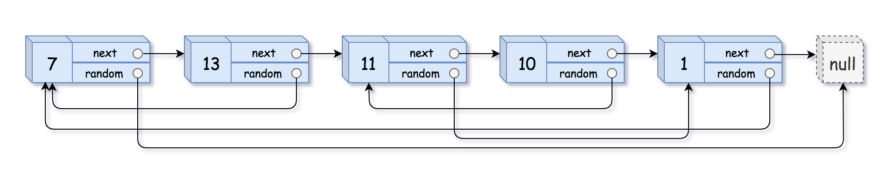

# [LeeCcode](https://leetcode-cn.com/)记录

## 目录
1. [简单](#简单)

    1. [用两个栈实现队列](#用两个栈实现队列)
    1. [包含min函数的栈](#包含min函数的栈)
    1. [从尾到头打印链表](#从尾到头打印链表)
    1. [反转链表](#反转链表)
    1. [替换空格](#替换空格)
    1. [左旋转字符串](#左旋转字符串)
    1. [数组中重复的数字](#数组中重复的数字)
    1. [在排序数组中查找数字 I](#在排序数组中查找数字-i)
    1. [0～n-1中缺失的数字](#0n-1中缺失的数字)
    1. [旋转数组的最小数字](#旋转数组的最小数字)
    1. [第一个只出现一次的字符](#第一个只出现一次的字符)
    1. [二叉树的镜像](#二叉树的镜像)
    1. [对称的二叉树](#对称的二叉树)
    1. [斐波那契数列](#斐波那契数列)
    1. [青蛙跳台阶问题](#青蛙跳台阶问题)
    1. [连续子数组的最大和](#连续子数组的最大和)
1. [中等](#中等)

    1. [复杂链表的复制](#复杂链表的复制)
    1. [二维数组中的查找](#二维数组中的查找)
    1. [从上到下打印二叉树 I](#从上到下打印二叉树-i)
    1. [从上到下打印二叉树 II](#从上到下打印二叉树-ii)
    1. [从上到下打印二叉树 III](#从上到下打印二叉树-iii)
    1. [树的子结构](#树的子结构)
    1. [股票的最大利润](#股票的最大利润)
    1. [礼物的最大价值](#礼物的最大价值)

---

>1. 二分搜索的时间复杂度：O(log n)。
>2. 对称的数据结构（如：二叉树），多用递归解题，从整体的对称性思考，把大问题分解成子问题进行递归，即不是单独考虑一部分(如：树的左子树)，而是同时考虑对称的两部分(如：左右子树)，从而写出对称性的递归代码。
>
>    1. 可能需要辅助函数。
>    2. 一般先找到匹配的根节点，再判断其子树是否匹配
>3. 动态规划：通过把原问题分解为相对简单的子问题的方式求解复杂问题的方法。
>
>    1. 状态定义
>
>        e.g. `dp(n)`定义为题目要求解的含义。
>    2. 转移方程（递归）
>
>        e.g. `dp(n)`与`dp(n-1)`等的关系。
>    3. 初始状态
>
>        e.g. 当`n`为最初的若干值时，`dp`的返回结果。
>    4. 返回值
>4. 动态规划（包含：递归、记忆化）的解题流程：
>
>    1. 先想递归
>    2. 发现重复计算
>    3. 通过记忆化等方法（填表）去掉重复计算
>    4. 若记忆法会导致内存超出等问题，则考虑使用滚动数组等方式压缩存储空间
>    5. 最后看下能不能通过利用**计算顺序**来做到去掉递归用的记忆化等方法（填表），从而进行直接顺序计算

## 简单

### 用两个栈实现队列
队列的声明如下，请实现它的两个函数 appendTail 和 deleteHead ，分别完成在队列尾部插入整数和在队列头部删除整数的功能。(若队列中没有元素，deleteHead 操作返回 -1 )

1. 解法

    ```javascript
    var CQueue = function () {
      // 2个栈，意味着只能 shift unshift 的数组
      // 实现队列，因此要实现类似数组的 unshift pop

      // 存放插入的数据
      this.arr1 = [];

      // 处理移出的数据。当为空时，从arr1中获取全部数据
      this.arr2 = [];
    };

    /**
     * @param {number} value
     * @return {void}
     */
    CQueue.prototype.appendTail = function (value) {
      this.arr1.unshift(value);
    };

    /**
     * @return {number}
     */
    CQueue.prototype.deleteHead = function () {
      if (this.arr2.length > 0) {
        return this.arr2.shift();
      } else if (this.arr1.length > 0) {
        while (this.arr1.length > 0) {
          this.arr2.unshift(this.arr1.shift());
        }
        return this.arr2.shift();
      } else {
        return -1;
      }
    };

    /**
     * Your CQueue object will be instantiated and called as such:
     * var obj = new CQueue()
     * obj.appendTail(value)
     * var param_2 = obj.deleteHead()
     */
    ```

### 包含min函数的栈
定义栈的数据结构，请在该类型中实现一个能够得到栈的最小元素的 min 函数在该栈中，调用 min、push 及 pop 的时间复杂度都是 O(1)。

示例：
```
MinStack minStack = new MinStack();
minStack.push(-2);
minStack.push(0);
minStack.push(-3);
minStack.min();   --> 返回 -3.
minStack.pop();
minStack.top();      --> 返回 0.
minStack.min();   --> 返回 -2.
```
1. 解法一

    ```javascript
    /**
     * initialize your data structure here.
     */
    var MinStack = function () {
      // 存放栈数据
      this.list = [];
      // 存放最小数
      this.minList = [];
    };

    /**
     * @param {number} x
     * @return {void}
     */
    MinStack.prototype.push = function (x) {
      this.list.unshift(x);

      if (this.minList.length === 0 || x <= this.minList[0]) {
        this.minList.unshift(x);
      }
    };

    /**
     * @return {void}
     */
    MinStack.prototype.pop = function () {
      if (this.list.length > 0) {
        const value = this.list.shift();

        if (value === this.minList[0]) {
          this.minList.shift();
        }
        return;
      }

      throw Error("栈内为空");
    };

    /**
     * @return {number}
     */
    MinStack.prototype.top = function () {
      if (this.list.length > 0) {
        return this.list[0];
      }

      throw Error("栈内为空");
    };

    /**
     * @return {number}
     */
    MinStack.prototype.min = function () {
      if (this.minList.length > 0) {
        return this.minList[0];
      }

      throw Error("栈内为空");
    };

    /**
     * Your MinStack object will be instantiated and called as such:
     * var obj = new MinStack()
     * obj.push(x)
     * obj.pop()
     * var param_3 = obj.top()
     * var param_4 = obj.min()
     */
    ```
2. 解法二

    ```javascript
    var MinStack = function () {
      // 存放栈数据
      this.list = [];
      // 存放最小数
      this.minList = [];
    };

    MinStack.prototype.push = function (x) {
      this.list.unshift(x);

      if (this.minList.length === 0) {
        this.minList.unshift(x);
      } else {
        this.minList.unshift(Math.min(x, this.minList[0]));
      }
    };

    MinStack.prototype.pop = function () {
      if (this.list.length > 0) {
        this.list.shift();
        this.minList.shift();
        return;
      }

      throw Error("栈内为空");
    };

    MinStack.prototype.top = function () {
      if (this.list.length > 0) {
        return this.list[0];
      }

      throw Error("栈内为空");
    };

    MinStack.prototype.min = function () {
      if (this.minList.length > 0) {
        return this.minList[0];
      }

      throw Error("栈内为空");
    };
    ```

### 从尾到头打印链表
输入一个链表的头节点，从尾到头反过来返回每个节点的值（用数组返回）。

示例：
```
输入：head = [1,3,2]
输出：[2,3,1]
```

1. 解法一

    ```javascript
    /**
     * Definition for singly-linked list.
     * function ListNode(val) {
     *     this.val = val;
     *     this.next = null;
     * }
     */
    /**
     * @param {ListNode} head
     * @return {number[]}
     */
    var reversePrint = function (head) {
      const arr = [];

      while (head) {
        arr.unshift(head.val);
        head = head.next;
      }

      return arr;
    };
    ```
2. 解法二

    ```javascript
    var reversePrint = function (head) {
      // 递归
      return head ? [...reversePrint(head.next), head.val] : [];
    };
    ```

### 反转链表
定义一个函数，输入一个链表的头节点，反转该链表并输出反转后链表的头节点。

示例:
```
输入: 1->2->3->4->5->NULL
输出: 5->4->3->2->1->NULL
```

1. 解法一

    ```javascript
    /**
     * Definition for singly-linked list.
     * function ListNode(val) {
     *     this.val = val;
     *     this.next = null;
     * }
     */
    /**
     * @param {ListNode} head
     * @return {ListNode}
     */
    var reverseList = function (head) {
      let beforeHead = null;

      while (head) {
        const nextHead = head.next;
        head.next = beforeHead;
        beforeHead = head;
        head = nextHead;
      }
      return beforeHead;
    };
    ```
2. 解法二

    ```javascript
    var reverseList = function (head) {
      // 递归
      if (head == null || head.next == null) {
        return head;
      }
      const newHead = reverseList(head.next);
      head.next.next = head;
      head.next = null;
      return newHead;
    };
    ```

### 替换空格
请实现一个函数，把字符串 s 中的每个空格替换成"%20"。

示例 1：
```
输入：s = "We are happy."
输出："We%20are%20happy."
```

1. 解法一

    ```javascript
    /**
     * @param {string} s
     * @return {string}
     */
    var replaceSpace = function (s) {
      // 还有 split/join 等解法
      return s.replace(/ /g, "%20");
    };
    ```
2. 解法二

    ```javascript
    var replaceSpace = function (s) {
      // 模拟的 C++ 语言中的可变长度字符串的实现原理，将其 N^2 的空间复杂度降低到 1
      const arr = s.split("");
      let oldLen = arr.length;
      let spaceCount = 0;
      for (let i = 0; i < oldLen; i++) {
        if (arr[i] === " ") spaceCount++;
      }
      arr.length += spaceCount * 2;
      // 数组遍历，一定要从后往前遍历，避免从前往后，造成字符被修改，导致错误！
      for (let i = oldLen - 1, j = arr.length - 1; i >= 0; i--, j--) {
        if (arr[i] !== " ") arr[j] = arr[i];
        else {
          arr[j - 2] = "%";
          arr[j - 1] = "2";
          arr[j] = "0";
          j -= 2;
        }
      }
      return arr.join("");
    };
    ```

### 左旋转字符串
字符串的左旋转操作是把字符串前面的若干个字符转移到字符串的尾部。请定义一个函数实现字符串左旋转操作的功能。比如，输入字符串"abcdefg"和数字2，该函数将返回左旋转两位得到的结果"cdefgab"。

示例 1：
```
输入: s = "abcdefg", k = 2
输出: "cdefgab"
```

示例 2：
```
输入: s = "lrloseumgh", k = 6
输出: "umghlrlose"
```

1. 解法一

    ```javascript
    /**
     * @param {string} s
     * @param {number} n
     * @return {string}
     */
    var reverseLeftWords = function (s, n) {
      // 以及其他简单拼接法
      return s.slice(n) + s.slice(0, n);
    };
    ```
2. 解法二

    ```javascript
    var reverseLeftWords = function (s, n) {
      if (n >= s.length) {
        return s;
      }
      // 复制一遍字符串，再截取
      return (s + s).slice(n, n + s.length);
    };
    ```

### 数组中重复的数字
找出数组中重复的数字。

在一个长度为 n 的数组 nums 里的所有数字都在 0～n-1 的范围内。数组中某些数字是重复的，但不知道有几个数字重复了，也不知道每个数字重复了几次。请找出数组中任意一个重复的数字。

示例 1：
```
输入：
[2, 3, 1, 0, 2, 5, 3]
输出：2 或 3
```

1. 解法一

    ```javascript
    /**
     * @param {number[]} nums
     * @return {number}
     */
    var findRepeatNumber = function (nums) {
      // 哈希表
      const oneSet = new Set();

      for (let i = 0, length = nums.length; i < length; i++) {
        if (oneSet.has(nums[i])) {
          return nums[i];
        }
        oneSet.set(nums[i]);
      }
    };
    ```
2. 解法二

    ```javascript
    var findRepeatNumber = function (nums) {
      // 排序后比较
      const sortedNums = nums.sort()
      for (let i = 0, length = sortedNums.length; i < length - 1; i++) {
        if (sortedNums[i] === sortedNums[i + 1]) {
          return sortedNums[i]
        }
      }
    };
    ```
3. 解法三

    ```javascript
    var findRepeatNumber = function (nums) {
      // 利用题目的条件：数字在下标范围内
      const tempNums = [];
      for (let i = 0, length = nums.length; i < length; i++) {
        if (tempNums[nums[i]] === nums[i]) {
          return nums[i];
        }
        tempNums[nums[i]] = nums[i];
      }
    };
    ```
4. 解法四

    ```javascript
    var findRepeatNumber = function (nums) {
      // 利用题目的条件：数字在下标范围内。并且不用额外的数组。自哈希
      for (let i = 0, length = nums.length; i < length; i++) {
        // 因为n的长度的数组数字都在0~n-1，所以：要不然所有数字各一个，要不然就必须会有重复
        // 尝试把每个位置放上等于下标的数字
        // 若当前数字跟对应的索引不相同，则交换。
        while (nums[i] !== i) {
          if (nums[i] === nums[nums[i]]) {
            return nums[i];
          }
          const temp = nums[i];
          nums[i] = nums[temp];
          nums[temp] = temp;
        }
      }
    };
    ```

### 在排序数组中查找数字 I
统计一个数字在排序数组中出现的次数。

示例 1:
```
输入: nums = [5,7,7,8,8,10], target = 8
输出: 2
```

示例 2:
```
输入: nums = [5,7,7,8,8,10], target = 6
输出: 0
```

nums 是一个非递减数组

1. 解法一

    暴力搜索、穷举搜索。

    ```javascript
    /**
     * @param {number[]} nums
     * @param {number} target
     * @return {number}
     */
    var search = function (nums, target) {
      let count = 0;
      nums.forEach((x) => {
        if (x === target) count++;
      });
      return count;
    };
    ```

    ```javascript
    var search = function (nums, target) {
      let left = 0;
      let right = nums.length - 1;

      // 左边搜索
      while (nums[left] !== target && left < nums.length) {
        ++left;
      }

      // 右边搜索
      while (nums[right] !== target && right >= 0) {
        --right;
      }

      return left <= right ? right - left + 1 : 0;
    };
    ```

    ```javascript
    const search = function (nums, target) {
      return nums.reduce((a, b) => (b === target ? a + 1 : a), 0);
    };
    ```
2. 解法二

    ```javascript
    var search = function (nums, target) {
      const length = nums.length;
      let start = -1;
      let end = -1;

      let left = 0;
      let right = length - 1;
      // 二分搜索：找到左边界，找到第一次出现
      while (left <= right) {
        let mid = Math.floor((left + right) / 2);
        if (nums[mid] === target) {
          start = mid;
          right = mid - 1;
        } else if (nums[mid] > target) {
          right = mid - 1;
        } else {
          left = mid + 1;
        }
      }

      if (start === -1) {
        return 0;
      }

      left = 0;
      right = length - 1;
      // 二分搜索：找到右边界，找到最后一次出现
      while (left <= right) {
        let mid = Math.floor((left + right) / 2);
        if (nums[mid] === target) {
          end = mid;
          left = mid + 1;
        } else if (nums[mid] > target) {
          right = mid - 1;
        } else {
          left = mid + 1;
        }
      }

      return end - start + 1;
    };
    ```
3. 解法三

    ```javascript
    var search = function (nums, target) {
      const leftIdx = binarySearch(nums, target, true);
      const rightIdx = binarySearch(nums, target, false);
      if (leftIdx !== rightIdx) {
        return rightIdx - leftIdx;
      }
      return 0;
    };

    // 二分搜索：nums中，第一个大于等于 或 第一个大于 target 的下标
    const binarySearch = (nums, target, equal) => {
      let left = 0;
      let right = nums.length - 1;
      // 定义超出数组长度（表明nums中不存在要求的下标）
      let resultIndex = nums.length;

      while (left <= right) {
        const mid = Math.floor((left + right) / 2);
        if (nums[mid] > target || (equal && nums[mid] === target)) {
          right = mid - 1;
          resultIndex = mid;
        } else {
          left = mid + 1;
        }
      }
      return resultIndex;
    };
    ```

### 0～n-1中缺失的数字
一个长度为n-1的递增排序数组中的所有数字都是唯一的，并且每个数字都在范围0～n-1之内。在范围0～n-1内的n个数字中有且只有一个数字不在该数组中，请找出这个数字。

示例 1:
```
输入: [0,1,3]
输出: 2
```

示例 2:
```
输入: [0,1,2,3,4,5,6,7,9]
输出: 8
```

1. 解法一

    暴力搜索、穷举搜索。

    ```javascript
    /**
     * @param {number[]} nums
     * @return {number}
     */
    var missingNumber = function (nums) {
      for (let i = 0; i < nums.length; i++) {
        if (nums[i] !== i) return i;
      }
      return nums.length;
    };
    ```

    ```javascript
    var missingNumber = function (nums) {
      let length = nums.length;
      // 等差数列求和
      let sum = (length + 1) * length / 2;
      for (let i of nums) {
        sum -= i;
      }
      return sum;
    };
    ```

    ```javascript
    var missingNumber = function (nums) {
      // 任何数字异或自己等于0，0异或任何数字等于这个数字
      let xor = 0;
      for (let i = 0; i < nums.length; i++) {
        xor ^= nums[i] ^ i;
      }
      return xor ^ nums.length;
    };
    ```
2. 解法二

    >开闭区间的选择？

    ```javascript
    var missingNumber = function (nums) {
      let left = 0;
      // 设置超出数组的下标，这样可以多判断一次，因为最大下标比长度小1，而最大数字等于长度
      let right = nums.length;
      // 二分搜索
      while (left < right) {
        const middle = Math.floor((left + right) / 2);
        if (nums[middle] === middle) {
          // middle可以排除
          left = middle + 1;
        } else {
          // middle不能被排除
          right = middle;
        }
      }
      return left;
    };
    ```

### 旋转数组的最小数字
把一个数组最开始的若干个元素搬到数组的末尾，我们称之为数组的旋转。

给你一个可能存在 重复 元素值的数组 numbers，它原来是一个升序排列的数组，并按上述情形进行了一次旋转。请返回旋转数组的最小元素。例如，数组 [3,4,5,1,2] 为 [1,2,3,4,5] 的一次旋转，该数组的最小值为1。

示例 1：

```
输入：[3,4,5,1,2]
输出：1
```

示例 2：

```
输入：[2,2,2,0,1]
输出：0
```

1. 解法一

    ```javascript
    /**
     * @param {number[]} numbers
     * @return {number}
     */
    var minArray = function (numbers) {
      const firstOne = numbers[0];
      const lastOne = numbers[numbers.length - 1];

      // 全部旋转（或者没有旋转）
      if (firstOne < lastOne) {
        return firstOne;
      }
      // 第一个和最后一个数字相等，用遍历
      else if (firstOne === lastOne) {
        for (let i = numbers.length - 1; i > 0; i--) {
          if (numbers[i] < numbers[i - 1]) {
            return numbers[i];
          }
        }
        return firstOne;
      }
      // 第一个比最后一个大，用二分搜索：找到 左边第一个小于firstOne的数
      else {
        let left = 0;
        let right = numbers.length - 1;
        let result = lastOne;

        while (left <= right) {
          const middle = Math.floor((left + right) / 2);
          if (numbers[middle] < firstOne) {
            right = middle - 1;
            result = numbers[middle];
          } else if (numbers[middle] >= firstOne) {
            left = middle + 1;
          }
        }
        return result;
      }
    };
    ```
2. 解法二

    ```javascript
    var minArray = function (numbers) {
      let left = 0;
      let right = numbers.length - 1;
      while (left < right) {
        const middle = Math.floor((right + left) / 2);
        if (numbers[middle] < numbers[right]) {
          right = middle;
        } else if (numbers[middle] > numbers[right]) {
          left = middle + 1;
        }
        // 若相等，则最右边的项一定不是目标（3种情况判断的结果）
        else {
          right -= 1;
        }
      }
      // 退出时，left === right
      return numbers[left];
    };
    ```

### 第一个只出现一次的字符
在字符串 s 中找出第一个只出现一次的字符。如果没有，返回一个单空格。

s 只包含小写字母。

示例 1:

```
输入：s = "abaccdeff"
输出：'b'
```

示例 2:

```
输入：s = ""
输出：' '
```

1. 解法一

    ```javascript
    /**
     * @param {string} s
     * @return {character}
     */
    var firstUniqChar = function (s) {
      const strArr = s.split("");
      return (
        strArr.find((str) => {
          return strArr.indexOf(str) === strArr.lastIndexOf(str);
        }) ?? " "
      );
    };
    ```
2. 解法二

    ```javascript
    var firstUniqChar = function (s) {
      const strArr = s.split("");
      const map = new Map();
      for (let str of strArr) {
        map.set(str, (map.get(str) ?? 0) + 1);
      }
      for (let val of map) {
        if (val[1] === 1) {
          return val[0];
        }
      }
      return " ";
    };
    ```
3. 解法三

    ```javascript
    var firstUniqChar = function (s) {
      for (let char of new Set(s)) {
        if (s.match(new RegExp(char, "g")).length === 1) {
          return char;
        }
      }
      return " ";
    };
    ```
4. 解法四

    ```javascript
    var firstUniqChar = function (s) {
      const arr = new Array(26).fill(0);
      const unicodeA = "a".charCodeAt(0);

      for (let c of s) {
        arr[c.charCodeAt(0) - unicodeA] += 1;
      }

      for (let c of s) {
        if (arr[c.charCodeAt(0) - unicodeA] === 1) {
          return c;
        }
      }
      return " ";
    };
    ```

### 二叉树的镜像
请完成一个函数，输入一个二叉树，该函数输出它的镜像。

例如输入：

```
         4
       /   \
      2     7
     / \   / \
    1   3 6   9
```

镜像输出：

```
     4
   /   \
  7     2
 / \   / \
9   6 3   1
```

示例 1：

```
输入：root = [4,2,7,1,3,6,9]
输出：[4,7,2,9,6,3,1]
```

1. 解法一

    不修改原二叉树。

    ```typescript
    class TreeNode {
      val: number;
      left: TreeNode | null;
      right: TreeNode | null;
      constructor(val?: number, left?: TreeNode | null, right?: TreeNode | null) {
        this.val = val === undefined ? 0 : val;
        this.left = left === undefined ? null : left;
        this.right = right === undefined ? null : right;
      }
    }

    function mirrorTree(root: TreeNode | null): TreeNode | null {
      // 递归
      if (root === null) {
        return root;
      }

      return new TreeNode(root.val, mirrorTree(root.right), mirrorTree(root.left));
    }
    ```
2. 解法二

    修改原二叉树。

    ```javascript
    var mirrorTree = function (root) {
      // 递归
      if (!root) {
        return null;
      }
      const temp = root.left;
      root.left = root.right;
      root.right = temp;

      mirrorTree(root.left);
      mirrorTree(root.right);

      return root;
    };
    ```

    ```typescript
    function mirrorTree(root: TreeNode | null): TreeNode | null {
      if (root === null) {
        return root;
      }
      // 二叉树广度优先，用队列
      const queue = [root];
      while (queue.length) {
        const node = queue.pop();
        const temp = node.left;
        node.left = node.right;
        node.right = temp;
        if (node.left) {
          queue.unshift(node.left);
        }
        if (node.right) {
          queue.unshift(node.right);
        }
      }
      return root;
    }
    ```

    ```typescript
    function mirrorTree(root: TreeNode | null): TreeNode | null {
      if (root === null) {
        return root;
      }
      // 二叉树深度优先（先序），用栈
      const stack = [root];
      while (stack.length) {
        const node = stack.shift();
        const temp = node.left;
        node.left = node.right;
        node.right = temp;
        if (node.left) {
          stack.unshift(node.left);
        }
        if (node.right) {
          stack.unshift(node.right);
        }
      }
      return root;
    }
    ```

### 对称的二叉树
请实现一个函数，用来判断一棵二叉树是不是对称的。如果一棵二叉树和它的镜像一样，那么它是对称的。

例如，二叉树 [1,2,2,3,4,4,3] 是对称的。

```
    1
   / \
  2   2
 / \ / \
3  4 4  3
```

但是下面这个 [1,2,2,null,3,null,3] 则不是镜像对称的:

```
    1
   / \
  2   2
   \   \
   3    3
```

示例 1：

```
输入：root = [1,2,2,3,4,4,3]
输出：true
```

示例 2：

```
输入：root = [1,2,2,null,3,null,3]
输出：false
```

- <details>

    <summary>解析：对称二叉树</summary>

    对于树中任意两个对称节点 L 和 R，一定存在：

    1. L.val = R.val：

        即此两对称节点值相等。
    2. L.left.val = R.right.val：

        即 L 的 左子节点 和 R 的 右子节点 对称。
    3. L.right.val = R.left.val：

        即 L 的 右子节点 和 R 的 左子节点 对称。
    </details>

1. 解法一

    ```javascript
    /**
     * Definition for a binary tree node.
     * function TreeNode(val) {
     *     this.val = val;
     *     this.left = this.right = null;
     * }
     */
    /**
     * @param {TreeNode} root
     * @return {boolean}
     */
    var isSymmetric = function (root) {
      return helper(root, root);
    };

    // 递归
    var helper = function (root1, root2) {
      if (root1 === null && root2 == null) {
        return true;
      }
      if (root1 == null || root2 == null) {
        return false;
      }

      return (
        root1.val == root2.val &&
        helper(root1.left, root2.right) &&
        helper(root1.right, root2.left)
      );
    };
    ```
2. 解法二

    ```javascript
    var isSymmetric = function (root) {
      if (root === null) {
        return true;
      }

      // 栈，需要对比的一双，一起推入和推出
      const stack = [];
      stack.unshift(root.left);
      stack.unshift(root.right);
      while (stack.length) {
        const left = stack.shift();
        const right = stack.shift();
        if (left === null && right === null) {
          continue;
        }
        if (left === null || right === null || left.val !== right.val) {
          return false;
        }
        stack.unshift(left.left);
        stack.unshift(right.right);
        stack.unshift(left.right);
        stack.unshift(right.left);
      }
      return true;
    };
    ```

### 斐波那契数列
写一个函数，输入 n ，求斐波那契（Fibonacci）数列的第 n 项（即 F(N)）。斐波那契数列的定义如下：

```
F(0) = 0,   F(1) = 1
F(N) = F(N - 1) + F(N - 2), 其中 N > 1.
```

斐波那契数列由 0 和 1 开始，之后的斐波那契数就是由之前的两数相加而得出。

答案需要取模 1e9+7（1000000007），如计算初始结果为：1000000008，请返回 1。

示例 1：

```
输入：n = 2
输出：1
```

示例 2：

```
输入：n = 5
输出：5
```

1. 解法一

    ```javascript
    /**
     * @param {number} n
     * @return {number}
     */
    var fib = function (n) {
      // 动态规划
      if (n < 2) {
        return n;
      }
      const modulo = 1000000007;
      let previous = 0;
      let current = 1;
      // 迭代：记录 前一个值 和 当前值
      for (let i = 2; i <= n; i++) {
        const temp = previous;
        previous = current;
        current =
          temp + current >= modulo
            ? temp + current - modulo
            : temp + current;
      }
      return current;
    };
    ```
2. 解法二

    ```javascript
    var fib = function (n) {
      // 递归

      // 保存计算过的结果，避免递归时超时
      this.map = this.map || new Map();
      if (this.map.has(n)) {
        return map.get(n);
      }

      if (n < 2) {
        map.set(n, n);
        return n;
      }

      const modulo = 1000000007;
      const result = ((fib(n - 1) % modulo) + (fib(n - 2) % modulo)) % modulo; // (a+b)%c === (a%c+b%c)%c
      map.set(n, result);
      return result;
    };
    ```
3. 解法三

    >todo：矩阵快速幂

### 青蛙跳台阶问题
一只青蛙一次可以跳上1级台阶，也可以跳上2级台阶。求该青蛙跳上一个 n 级的台阶总共有多少种跳法。

答案需要取模 1e9+7（1000000007），如计算初始结果为：1000000008，请返回 1。

示例 1：

```
输入：n = 2
输出：2
```

示例 2：

```
输入：n = 7
输出：21
```

示例 3：

```
输入：n = 0
输出：1
```

- <details>

    <summary>解析：青蛙跳台问题</summary>

    设跳上 n 级台阶有 f(n) 种跳法。在所有跳法中，青蛙的最后一步只有两种情况：跳上 1 级或 2 级台阶，即 f(n)=f(n−1)+f(n−2)。本题可转化为 求斐波那契数列第 n 项的值。
    </details>

1. 解法

    略。与上一题（[斐波那契数列](https://github.com/realgeoffrey/knowledge/blob/master/网站前端/JS方法积累/LeeCcode记录/README.md#斐波那契数列)）基本一致，改下初始值即可。

### 连续子数组的最大和
输入一个整型数组，数组中的一个或连续多个整数组成一个子数组。求所有子数组的和的最大值。

要求时间复杂度为O(n)。

示例1:

```
输入: nums = [-2,1,-3,4,-1,2,1,-5,4]
输出: 6
解释: 连续子数组 [4,-1,2,1] 的和最大，为 6。
```

1. 解法一

    ```javascript
    /**
     * @param {number[]} nums
     * @return {number}
     */
    var maxSubArray = function (nums) {
      // 动态规划
      let max = nums[0];
      for (let i = 1, tempResult = nums[0]; i < nums.length; i++) {
        // tempResult：以元素nums[i]为结尾 的连续子数组最大和
        tempResult = nums[i] + Math.max(tempResult, 0);
        max = Math.max(max, tempResult);
      }
      return max;
    };
    ```

---

## 中等

### 复杂链表的复制
请实现 copyRandomList 函数，复制一个复杂链表。在复杂链表中，每个节点除了有一个 next 指针指向下一个节点，还有一个 random 指针指向链表中的任意节点或者 null。

示例 1：

```
输入：head = [[7,null],[13,0],[11,4],[10,2],[1,0]]
输出：[[7,null],[13,0],[11,4],[10,2],[1,0]]
```

示例 2：

```
输入：head = [[1,1],[2,1]]
输出：[[1,1],[2,1]]
```

示例 3：

```
输入：head = [[3,null],[3,0],[3,null]]
输出：[[3,null],[3,0],[3,null]]
```

示例 4：
```
输入：head = []
输出：[]
解释：给定的链表为空（空指针），因此返回 null。
```

1. 解法一

    ```javascript
    /**
     * // Definition for a Node.
     * function Node(val, next, random) {
     *    this.val = val;
     *    this.next = next;
     *    this.random = random;
     * };
     */

    /**
     * @param {Node} head
     * @return {Node}
     */
    var copyRandomList = function (head, cachedMap = new Map()) {
      // 递归，哈希表
      if (head) {
        if (!cachedMap.has(head)) {
          cachedMap.set(head, {
            val: head.val,
            // 直接写在这里会导致栈溢出，因此先创建新的Map项，再递归
            // next: copyRandomList(head.next, cachedMap),
            // random: copyRandomList(head.random,cachedMap),
          });
          Object.assign(cachedMap.get(head), {
            next: copyRandomList(head.next, cachedMap),
            random: copyRandomList(head.random, cachedMap),
          });
        }

        return cachedMap.get(head);
      }

      return head;
    };
    ```
2. 解法二

    ```javascript
    var copyRandomList = function (head) {
      if (head === null) {
        return null;
      }
      // 创建新的Node，并改变旧的Node的next指向
      for (let node = head; node !== null; node = node.next.next) {
        const nodeNew = new Node(node.val, node.next, null);
        node.next = nodeNew;
      }
      // 复制random指向到新的Node
      for (let node = head; node !== null; node = node.next.next) {
        const nodeNew = node.next;
        nodeNew.random = node.random !== null ? node.random.next : null;
      }

      // 先保存新的Node的第一个，因为之后要设置新的Node链和旧的Node链不关联
      const headNew = head.next;

      // 恢复旧的Node的next指向，并设置新的Node的next指向
      for (let node = head; node !== null; node = node.next) {
        const nodeNew = node.next;
        node.next = node.next.next;
        nodeNew.next = nodeNew.next !== null ? nodeNew.next.next : null;
      }
      return headNew;
    };
    ```

### 二维数组中的查找
在一个 n * m 的二维数组中，每一行都按照从左到右递增的顺序排序，每一列都按照从上到下递增的顺序排序。请完成一个高效的函数，输入这样的一个二维数组和一个整数，判断数组中是否含有该整数。

示例:

```
现有矩阵 matrix 如下：

[
  [1,   4,  7, 11, 15],
  [2,   5,  8, 12, 19],
  [3,   6,  9, 16, 22],
  [10, 13, 14, 17, 24],
  [18, 21, 23, 26, 30]
]

给定 target = 5，返回 true。

给定 target = 20，返回 false。
```

1. 解法一

    ```javascript
    /**
     * @param {number[][]} matrix
     * @param {number} target
     * @return {boolean}
     */
    var findNumberIn2DArray = function (matrix, target) {
      const columnLength = matrix.length;
      const rowLength = matrix[0]?.length ?? 0;

      let column = 0;
      let row = rowLength - 1;
      // O(n+m)，从右上角开始行动（类似二叉树搜索或二分搜索）
      while (column < columnLength && row >= 0) {
        if (matrix[column][row] < target) {
          column++;
        } else if (matrix[column][row] > target) {
          row--;
        } else {
          return true;
        }
      }
      return false;
    };
    ```

    ```javascript
    var findNumberIn2DArray = function (matrix, target) {
      const columnLength = matrix.length;
      const rowLength = matrix[0]?.length ?? 0;

      let column = columnLength - 1;
      let row = 0;
      // O(n+m)，从左下角开始行动（类似二叉树搜索或二分搜索）
      while (column >= 0 && row < rowLength) {
        if (matrix[column][row] < target) {
          row++;
        } else if (matrix[column][row] > target) {
          column--;
        } else {
          return true;
        }
      }
      return false;
    };
    ```
2. 解法二

    ```javascript
    var findNumberIn2DArray = function (matrix, target) {
      // 列长度
      const columnLength = matrix.length;
      // 行长度
      const rowLength = matrix[0]?.length ?? 0;

      let column = columnLength - 1;
      let row = 0;
      // O(log n + log m)，从左下角开始行动（类似二叉树搜索或二分搜索）
      while (column >= 0 && row <= rowLength - 1) {
        const columnArr = matrix[column];

        // 搜索同行的数。若找到target则返回true；否则查找大于target且本行最小；若找不到则返回false
        if (columnArr[row] < target) {
          const result = hasTarget1({ arr: columnArr, target, start: row });
          if (Object.prototype.toString.call(result) === "[object Boolean]") {
            return result;
          } else {
            row = result;
          }
        }
        // 搜索同列的数。若找到target则返回true；否则查找小于target且本行最大；若找不到则返回false
        else if (columnArr[row] > target) {
          const result = hasTarget2({
            arr: matrix.map((rowArr) => {
              return rowArr[row];
            }),
            target,
            start: column,
          });
          if (Object.prototype.toString.call(result) === "[object Boolean]") {
            return result;
          } else {
            column = result;
          }
        }
        // 找到
        else {
          return true;
        }
      }
      return false;
    };

    /**
     * 针对Number型递增数组，从前往后二分搜索，
     * 若数组存在target则返回`true`；若不存在则返回 `大于target的数中最小的一个的数组下标`；若不存在大于target的数则返回 `false`
     * @param {number[]} arr  递增数组
     * @param {number} target 目标
     * @param {number} [start = 0] 数组开始下标
     * @param {number} [end = arr.length - 1] 数组结束下标
     * @return {boolean | number}
     */
    var hasTarget1 = function ({
      arr = [],
      target,
      start = 0,
      end = arr.length - 1,
    } = {}) {
      let left = start;
      let right = end;

      let foundBigger = false;

      while (left <= right) {
        const middle = Math.floor((left + right) / 2);
        if (arr[middle] > target) {
          right = middle - 1;
          foundBigger = middle;
        } else if (arr[middle] < target) {
          left = middle + 1;
        } else {
          return true;
        }
      }

      return foundBigger;
    };

    /**
     * 针对Number型递增数组，从后往前二分搜索，
     * 若数组存在target则返回`true`；若不存在则返回 `小于target的数中最大的一个的数组下标`；若不存在大于target的数则返回 `false`
     * @param {number[]} arr  递增数组
     * @param {number} target 目标
     * @param {number} [start = arr.length - 1] 数组开始下标
     * @param {number} [end = 0] 数组结束下标
     * @return {boolean | number}
     */
    var hasTarget2 = function ({
      arr = [],
      target,
      start = arr.length - 1,
      end = 0,
    } = {}) {
      let right = start;
      let left = end;

      let foundSmaller = false;

      while (right >= left) {
        const middle = Math.floor((right + left) / 2);
        if (arr[middle] > target) {
          right = middle - 1;
        } else if (arr[middle] < target) {
          left = middle + 1;
          foundSmaller = middle;
        } else {
          return true;
        }
      }

      return foundSmaller;
    };
    ```

### 从上到下打印二叉树 I
从上到下打印出二叉树的每个节点，同一层的节点按照从左到右的顺序打印。

例如:

给定二叉树: [3,9,20,null,null,15,7],

```
    3
   / \
  9  20
    /  \
   15   7
```

返回：

```
[3,9,20,15,7]
```

1. 解法一

    ```javascript
    /**
     * Definition for a binary tree node.
     * function TreeNode(val) {
     *     this.val = val;
     *     this.left = this.right = null;
     * }
     */
    /**
     * @param {TreeNode} root
     * @return {number[]}
     */
    var levelOrder = function (root) {
      if (root === null) {
        return [];
      }
      const result = [];
      // 二叉树广度优先，用队列
      const queue = [root];
      while (queue.length) {
        const node = queue.pop();
        result.push(node.val);
        if (node.left) {
          queue.unshift(node.left);
        }
        if (node.right) {
          queue.unshift(node.right);
        }
      }
      return result;
    };
    ```
2. 解法二

    ```typescript
    class TreeNode {
      val: number;
      left: TreeNode | null;
      right: TreeNode | null;
      constructor(val?: number, left?: TreeNode | null, right?: TreeNode | null) {
        this.val = val === undefined ? 0 : val;
        this.left = left === undefined ? null : left;
        this.right = right === undefined ? null : right;
      }
    }

    function levelOrder(root: TreeNode | null): number[] {
      let list: number[][] = [];
      levelHelper(list, root, 0);
      return list.reduce((prev, curr) => [...prev, ...curr], []);
    }

    // 二叉树深度优先（先序）+递归
    function levelHelper(list: number[][], root: TreeNode | null, level: number): void {
      if (root === null) {
        return;
      }
      // 有新的一层就创建一个新的空数组，每个数组存放当前层的所有数字
      if (level === list.length) {
        list.push([]);
      }
      list[level].push(root.val);
      levelHelper(list, root.left, level + 1);
      levelHelper(list, root.right, level + 1);
    }
    ```

### 从上到下打印二叉树 II
从上到下按层打印二叉树，同一层的节点按从左到右的顺序打印，每一层打印到一行。

例如:

给定二叉树: [3,9,20,null,null,15,7],

```
    3
   / \
  9  20
    /  \
   15   7
```

返回其层次遍历结果：

```
[
  [3],
  [9,20],
  [15,7]
]
```

1. 解法一

    ```javascript
    /**
     * Definition for a binary tree node.
     * function TreeNode(val) {
     *     this.val = val;
     *     this.left = this.right = null;
     * }
     */
    /**
     * @param {TreeNode} root
     * @return {number[]}
     */
    var levelOrder = function (root) {
      if (!root) {
        return [];
      }
      const result = [];
      // 二叉树广度优先，用队列
      const queue = [[root]];
      // 队列，每一项是一整层
      while (queue.length) {
        const currentRes = [];
        const currentChildren = [];
        queue.pop().forEach((node) => {
          currentRes.push(node.val);
          if (node.left) {
            currentChildren.push(node.left);
          }
          if (node.right) {
            currentChildren.push(node.right);
          }
        });
        if (currentChildren.length) {
          queue.unshift(currentChildren);
        }
        if (currentRes.length) {
          result.push(currentRes);
        }
      }
      return result;
    };
    ```
2. 解法二

    ```javascript
    var levelOrder = function (root) {
      if (root === null) {
        return [];
      }
      const result = [];
      // 二叉树广度优先，用队列
      const queue = [root];
      while (queue.length) {
        const currentNodes = [];
        // 推出一整层，再加入下一整层
        for (let i = 0, length = queue.length; i < length; i++) {
          const node = queue.pop();
          currentNodes.push(node.val);
          if (node.left) {
            queue.unshift(node.left);
          }
          if (node.right) {
            queue.unshift(node.right);
          }
        }
        result.push(currentNodes);
      }
      return result;
    };
    ```
3. 解法三

    ```javascript
    var levelOrder = function (root) {
      if (root === null) {
        return [];
      }
      const result = [];
      // 二叉树广度优先，用队列
      const queue = [[root, 0]];
      while (queue.length) {
        const [node, level] = queue.pop();
        if (result.length === level) {
          result.push([]);
        }
        result[level].push(node.val);
        if (node.left) {
          queue.unshift([node.left, level + 1]);
        }
        if (node.right) {
          queue.unshift([node.right, level + 1]);
        }
      }
      return result;
    };
    ```
4. 解法四

    ```typescript
    class TreeNode {
      val: number;
      left: TreeNode | null;
      right: TreeNode | null;
      constructor(val?: number, left?: TreeNode | null, right?: TreeNode | null) {
        this.val = val === undefined ? 0 : val;
        this.left = left === undefined ? null : left;
        this.right = right === undefined ? null : right;
      }
    }

    function levelOrder(root: TreeNode | null): number[] {
      let list: number[][] = [];
      levelHelper(list, root, 0);
      return list;
    }

    // 二叉树深度优先（先序）+递归
    function levelHelper(list: number[][], root: TreeNode | null, level: number): void {
      if (root === null) {
        return;
      }
      // 有新的一层就创建一个新的空数组，每个数组存放当前层的所有数字
      if (level === list.length) {
        list.push([]);
      }
      list[level].push(root.val);
      levelHelper(list, root.left, level + 1);
      levelHelper(list, root.right, level + 1);
    }
    ```

### 从上到下打印二叉树 III
请实现一个函数按照之字形顺序打印二叉树，即第一行按照从左到右的顺序打印，第二层按照从右到左的顺序打印，第三行再按照从左到右的顺序打印，其他行以此类推。

例如:

给定二叉树: [3,9,20,null,null,15,7],

```
    3
   / \
  9  20
    /  \
   15   7
```

返回其层次遍历结果：

```
[
  [3],
  [20,9],
  [15,7]
]
```

1. 解法

    略。与上一题（[从上到下打印二叉树 II](https://github.com/realgeoffrey/knowledge/blob/master/网站前端/JS方法积累/LeeCcode记录/README.md#从上到下打印二叉树-ii)）基本一致，根据奇偶改下每行输出即可。

### 树的子结构
输入两棵二叉树A和B，判断B是不是A的子结构。(约定空树不是任意一个树的子结构)

B是A的子结构， 即 A中有出现和B相同的结构和节点值。

例如:

给定的树 A:

```
     3
    / \
   4   5
  / \
 1   2
```

给定的树 B：

```
   4
  /
 1
```

返回 true，因为 B 与 A 的一个子树拥有相同的结构和节点值。

示例 1：

```
输入：A = [1,2,3], B = [3,1]
输出：false
```

示例 2：

```
输入：A = [3,4,5,1,2], B = [4,1]
输出：true
```

示例 3：

```
输入：A = [1,2,3,4,5], B = [1,2]
输出：true
```

1. 解法

    ```typescript
    class TreeNode {
      val: number;
      left: TreeNode | null;
      right: TreeNode | null;
      constructor(val?: number, left?: TreeNode | null, right?: TreeNode | null) {
        this.val = val === undefined ? 0 : val;
        this.left = left === undefined ? null : left;
        this.right = right === undefined ? null : right;
      }
    }

    function isSubStructure(A: TreeNode | null, B: TreeNode | null): boolean {
      if (A === null || B === null) {
        return false;
      }

      // 递归A的所有节点（先序遍历）：先找到匹配的根节点，再判断其子树是否匹配
      return dfs(A, B) || isSubStructure(A.left, B) || isSubStructure(A.right, B);
    }

    // 递归判断A为根节点的子树是否包含B
    function dfs(A: TreeNode | null, B: TreeNode | null): boolean {
      if (B === null) {
        return true;
      }
      if (A === null) {
        return false;
      }

      return A.val === B.val && dfs(A.left, B.left) && dfs(A.right, B.right);
    }
    ```

### 股票的最大利润
假设把某股票的价格按照时间先后顺序存储在数组中，请问买卖该股票一次可能获得的最大利润是多少？

示例 1:

```
输入: [7,1,5,3,6,4]
输出: 5
解释: 在第 2 天（股票价格 = 1）的时候买入，在第 5 天（股票价格 = 6）的时候卖出，最大利润 = 6-1 = 5 。
     注意利润不能是 7-1 = 6, 因为卖出价格需要大于买入价格。
```

示例 2:

```
输入: [7,6,4,3,1]
输出: 0
解释: 在这种情况下, 没有交易完成, 所以最大利润为 0。
```

1. 解法一

    ```javascript
    /**
     * @param {number[]} prices
     * @return {number}
     */
    var maxProfit = function (prices) {
      // 动态规划
      let minPrice = prices[0] || 0;    // 或 = Number.MAX_VALUE;
      let maxProfit = 0;
      for (let price of prices) {
        minPrice = Math.min(minPrice, price);
        maxProfit = Math.max(maxProfit, price - minPrice);
      }
      return maxProfit;
    };
    ```

### 礼物的最大价值
在一个 m*n 的棋盘的每一格都放有一个礼物，每个礼物都有一定的价值（价值大于 0）。你可以从棋盘的左上角开始拿格子里的礼物，并每次向右或者向下移动一格、直到到达棋盘的右下角。给定一个棋盘及其上面的礼物的价值，请计算你最多能拿到多少价值的礼物？

实例 1：

```
输入:
[
  [1,3,1],
  [1,5,1],
  [4,2,1]
]
输出: 12
解释: 路径 1→3→5→2→1 可以拿到最多价值的礼物
```

1. 解法一

    ```javascript
    /**
     * @param {number[][]} grid
     * @return {number}
     */
    var maxValue = function(grid) {

    };
    ```
