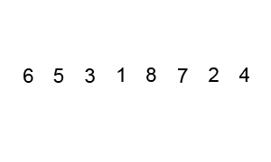
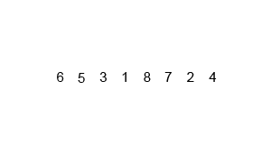
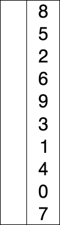

# JS方法积累——算法小结（*原生JS*）

## 排序算法

### 插入排序
```javascript
function insertionSort(arr) {
    if (Object.prototype.toString.call(arr) !== '[object Array]') {   /* 不是array*/

        return false;
    }

    var len = arr.length,
        i, tmp, j;

    for (i = 1; i < len; i++) { /* 逐个取出*/
        tmp = arr[i];   /* 被向前对比的一个元素*/

        for (j = i; j > 0 && arr[j - 1] > tmp; j--) {   /* 向前逐个对比*/
            arr[j] = arr[j - 1];    /* 前面的值向后移*/
        }

        arr[j] = tmp;   /* 被对比的元素插入替代位置*/
    }

    return arr;
}
```
>思路：
>
>1. 从第一个元素开始，该元素可以认为已经被排序
>2. 取出下一个元素，在已经排序的元素序列中从后向前扫描
>3. 如果该元素（已排序）大于新元素，将该元素移到下一位置
>4. 重复步骤3，直到找到已排序的元素小于或者等于新元素的位置
>5. 将新元素插入到该位置后
>6. 重复步骤2~5


### 希尔排序
```javascript
function shellSort(arr) {
    if (Object.prototype.toString.call(arr) !== '[object Array]') {   /* 不是array*/

        return false;
    }

    var len = arr.length,
        gap, i, j, temp;

    for (gap = Math.floor(len / 2); gap > 0; gap = Math.floor(gap / 2)) {   /* 不断分割成越来越大的区域分别进行插入排序*/

        for (i = gap; i < len; i++) {

            for (j = i; j > 0; j -= gap) {

                if (arr[j - gap] > arr[j]) {
                    temp = arr[j - gap];
                    arr[j - gap] = arr[j];
                    arr[j] = temp;
                } else {
                    break;
                }
            }
        }
    }

    return arr;
}
```
>思路：将元素分为几个区域来提升插入排序的性能。这样可以让一个元素可以一次性地朝最终位置前进一大步。然后算法再取越来越小的步长进行排序，算法的最后一步就是普通的插入排序，但是到了这步，需排序的数据几乎是已排好的了（此时插入排序较快）。

### 冒泡排序
```javascript
function bubbleSort(arr) {
    if (Object.prototype.toString.call(arr) !== '[object Array]') {   /* 不是array*/

        return false;
    }

    var len = arr.length,
        i, j, temp;

    for (i = 0; i < len; i++) { /* 一共比较趟数*/
        for (j = 0; j < len - i - 1; j++) { /* 每一趟比较的次数*/
            if (arr[j] > arr[j + 1]) {    /* 相邻的元素大的放后面*/
                temp = arr[j];
                arr[j] = arr[j + 1];
                arr[j + 1] = temp;
            }
        }
    }

    return arr;
}
```
>思路：
>
>1. 比较相邻的元素。如果第一个比第二个大，就交换它们两个。
>2. 对每一对相邻元素作同样的工作，从开始第一对到结尾的最后一对。这步做完后，最后的元素会是最大的数。
>3. 针对所有的元素重复以上的步骤，除了最后一个。
>4. 持续每次对越来越少的元素重复上面的步骤，直到没有任何一对数字需要比较。



### 快速排序
```javascript
function quickSort(arr) {
    if (Object.prototype.toString.call(arr) !== '[object Array]') {   /* 不是array*/

        return false;
    }

    var len = arr.length,
        left = [],
        right = [],
        mid = [arr[0]],
        i;

    if (len <= 1) { /* 递归边界条件*/

        return arr;
    }

    for (i = 1; i < len; i++) {
        if (arr[i] < mid[0]) {
            left.push(arr[i]);
        } else {
            right.push(arr[i]);
        }
    }
      

    return arguments.callee(left).concat(mid.concat(arguments.callee(right)));
}
```
>思路：
>
>1. 从数列中挑出一个元素，称为“基准”（pivot）。
>2. 重新排序数列，所有元素比基准值小的摆放在基准前面，所有元素比基准值大的摆在基准的后面（相同的数可以到任一边）。在这个分区结束之后，该基准就处于数列的中间位置。这个称为分区（partition）操作。
>3. 递归地（recursive）把小于基准值元素的子数列和大于基准值元素的子数列排序。


### 梳排序
```javascript
function combSort(arr) {
    if (Object.prototype.toString.call(arr) !== '[object Array]') {   /* 不是array*/

        return false;
    }

    var shrink_factor = 0.8,    /* 递减率*/
        gap = arr.length,
        swapped = 1,
        i, temp;

    while (gap > 1 || swapped) {    /* 未完成排序*/
        if (gap > 1){
            gap = Math.floor(gap * shrink_factor);  /* 更新间距*/
        }

        swapped = 0;

        for (i = 0; gap + i < arr.length; i++) {
            if (arr[i] > arr[i + gap]) {
                temp = arr[i];
                arr[i] = arr[i + gap];
                arr[i + gap] = temp;

                swapped = 1;    /* 进行过交换，因此还未排序好*/
            }
        }
    }

    return arr;
}
```
>思路：
>
>1. 改良自*泡沫排序*和*快速排序*，其要旨在于消除乌龟，亦即在阵列尾部的小数值，这些数值是造成泡沫排序缓慢的主因。
>2. 提出比较的两项间距可以大于1（泡沫排序仅比较相邻两项）。
>3. 开始时的间距设定为阵列长度，并在循环中以固定比率递减，通常递减率设定为1.3。

### 归并排序
```javascript
function mergeSort(arr) {
    if (Object.prototype.toString.call(arr) !== '[object Array]') {   /* 不是array*/

        return false;
    }

    function _merge(left, right) {   /* 合并2个已经分别排序好的数组*/
        var final = [];

        while (left.length && right.length) {   /* 对比2个数组第一个元素，小的加入新的数组并且从原来的数组中删去*/
            if (left[0] <= right[0]) {
                final.push(left.shift());
            } else {
                final.push(right.shift());
            }
        }

        return final.concat(left.concat(right));
    }

    return (function (arr) {
        var len = arr.length;

        if (len < 2) {  /* 递归边界条件*/

            return arr;
        }

        var mid = parseInt(len / 2, 10),
            _left = arr.slice(0, mid),
            _right = arr.slice(mid);

        return _merge(arguments.callee(_left), arguments.callee(_right));
    }(arr));
}
```
>思路：
>
>1. 将序列每相邻两个数字进行归并操作（将两个已经排序的序列合并成一个序列的操作），形成floor(n/2)个序列，排序后每个序列包含两个元素
>2. 将上述序列再次归并，形成floor(n/4)个序列，每个序列包含四个元素
>3. 重复步骤2，直到所有元素排序完毕



### 选择排序
```javascript
function selectionSort(arr) {
    if (Object.prototype.toString.call(arr) !== '[object Array]') {   /* 不是array*/

        return false;
    }

    var len = arr.length,
        i, j, min, temp;

    for (i = 0; i < len - 1; i++) {
        min = i;

        for (j = i + 1; j < len; j++) {  /* 找出最小的元素*/
            if (arr[min] > arr[j]) {
                min = j;
            }
        }

        temp = arr[min];
        arr[min] = arr[i];
        arr[i] = temp;
    }

    return arr;
}
```
>思路：
>
>1. 首先在未排序序列中找到最小（大）元素，存放到排序序列的起始位置。
>2. 然后，从剩余未排序元素中继续寻找最小（大）元素，然后放到已排序序列的末尾。以此类推，直到所有元素均排序完毕。



### 基数排序
```javascript
function radixSort(arr) {
    if (Object.prototype.toString.call(arr) !== '[object Array]') {   /* 不是array*/

        return false;
    }

    var bucket = [],
        len = arr.length,
        max = arr[0],
        loop, str, i, j, k, t;

    for (i = 0; i < 10; i++) {  /* 创建十个空桶（十进制），位数的每一次循环时放入这个位数对应值的被排序元素*/
        bucket[i] = [];
    }

    for (i = 1; i < len; i++) {   /* 获取被排序元素最高值*/
        if (arr[i] > max) {
            max = arr[i]
        }
    }

    loop = (max + '').length;   /* 获取最高值的位数*/

    for (i = 1; i <= loop; i++) {   /* 对每一个位数进行一次排序*/
        for (j = 0; j < len; j++) { /* 排序元素放入对应桶里*/
            str = arr[j] + '';  /* 排序元素字符串化（可以使用字符串的length属性）*/

            if (str.length >= i) {
                k = parseInt(str[str.length - i], 10);  /* e.g. 元素：'1234'.length=4，位数：百位数 i=3，'1234'[1]=2 => k=2 所以百位数上2的数字放入bucket[2]*/
                bucket[k].push(arr[j]);
            } else {    /* 元素的最高位小于位数都放入第一个桶内*/
                bucket[0].push(arr[j]);
            }
        }

        arr = [];   /* 清空数组*/

        for (j = 0; j < 10; j++) {  /* 把每个桶内数组放回原始数组中（桶内不排序）*/
            t = bucket[j].length;

            for (k = 0; k < t; k++) {
                arr.push(bucket[j][k]);
            }

            bucket[j] = [];
        }
    }

    return arr;
}
```
>思路：
>
>1. 其原理是将整数按位数切割成不同的数字，然后按每个位数分别比较。
>2. 从最低位开始，依次进行一次排序，排序结束后再用已经排序过的内容进行高一位的排序。这样从最低位排序一直到最高位排序完成以后，数列就变成一个有序序列。

### 堆排序
```javascript
function heapSort(arr) {
    if (Object.prototype.toString.call(arr) !== '[object Array]') {   /* 不是array*/

        return false;
    }

    function _swap(i, j) {   /* 替换数组内位置*/
        var tmp = arr[i];

        arr[i] = arr[j];
        arr[j] = tmp;
    }

    /*
     * 调整为最大堆，使得此父节点以下的子节点（所有后裔）永远小于各自的父节点
     * @param {Number} dad 父节点
     * @param {Number} end 调整到的长度
     * @returns undefined
     */
    function _maxHeapify(dad, end) {
        var son = dad * 2 + 1;  /* 父节点的左子节点位置*/

        if (son >= end) {   /* 子节点超出范围*/

            return;
        }

        if (son + 1 < end && arr[son] < arr[son + 1]) { /* 如果有右子节点，选择两个子节点中较大的*/
            son++;
        }

        if (arr[dad] <= arr[son]) {
            _swap(dad, son); /* 保证父节点大于子节点*/
            arguments.callee(son, end);
        }
    }

    var len = arr.length,
        i;

    arr = arr.slice(0); /* 浅复制*/

    for (i = Math.floor(len / 2) - 1; i >= 0; i--) {    /* i的初始值为堆的最后一个父节点，然后顺序往上操作其他父节点*/
        _maxHeapify(i, len);
    }

    for (i = len - 1; i > 0; i--) { /* 把已达成的最大堆的第一个元素（最大）放到末尾，并且重新进行减少长度的最大堆排序*/
        _swap(0, i);
        _maxHeapify(0, i);
    }

    return arr;
}
```
>思路：
>
>1. 循环进行：最大堆调整，移除在顶端的最大元素。
>2. 通常堆是通过一维数组来实现的。在数组起始位置为0的情形中：
>
>   - 父节点i的左子节点在位置(2*i+1);
>   - 父节点i的右子节点在位置(2*i+2);
>   - 子节点i的父节点在位置floor((i-1)/2);

### 洗牌算法
```javascript
function shuffle(arr) {
    if (Object.prototype.toString.call(arr) !== '[object Array]') {   /* 不是array*/

        return false;
    }

    var len = arr.length,
        lastOne, randomOne, temp;

    arr = arr.slice(0); /* 浅复制*/

    for (lastOne = len; lastOne > 0; lastOne--) {
        randomOne = Math.floor(Math.random() * lastOne);    /* lastOne长度内随机一个位置*/

        /* 元素交换*/
        temp = arr[lastOne];
        arr[lastOne] = arr[randomOne];
        arr[randomOne] = temp;
    }

    return arr;
}
```

----
## 其他算法

### 数组去重
>来自[JavaScript 数组去重](https://github.com/hanzichi/underscore-analysis/issues/9)。

1. 定义一个空数组变量，遍历需要去重的数组：若项的值不存在新数组中，则放入新数组；若已经存在，则丢弃。重复的项取最前的放入新数组。

    时间复杂度：O(n^2)。

    1. 使用`Array.prototype.indexOf`、`Array.prototype.filter`

        ```javascript
        function uniqueArr(arr) {

            return arr.filter(function (item, index, array) {

                return array.indexOf(item) === index;
            });
        }
        ```
    2. 不使用`Array.prototype.indexOf`、`Array.prototype.filter`

        ```javascript
        function uniqueArr(arr) {
            var newArr = [],
                i, j, iLen, jLen, item;

            for (i = 0, iLen = arr.length; i < iLen; i++) {
                item = arr[i];

                for (j = 0, jLen = newArr.length; j < jLen; j++) {
                    if (newArr[j] === item) {
                        break;
                    }
                }

                if (j === jLen) {
                    newArr.push(item);
                }
            }

            return newArr;
        }
        ```
2. 定义一个空数组变量，遍历需要去重的数组：若项的值在原数组中唯一，则放入新数组；若不唯一，丢弃并继续向后遍历。重复的项取最后的放入新数组。

    时间复杂度：O(n^2)。

    ```javascript
    function uniqueArr(arr) {
        var newArr = [],
            i, j, len;

        for (i = 0, len = arr.length; i < len; i++) {
            for (j = i + 1; j < len; j++) {
                if (arr[i] === arr[j]) {    //如果发现相同元素，则i自增并且进入下一个数的循环比较
                    i++;
                    j = i;
                }
            }

            newArr.push(arr[i]);
        }

        return newArr;
    }
    ```
3. 先排序原始数组（需要额外排序算法，否则只能处理Number型数据），第一项加入，之后每个项对比前一个项：若不同，则加入；若相同，则丢弃。

    时间复杂度：O(n) + 数组排序。

    ```javascript
    function uniqueArr(arr) {

        return arr.concat().sort().filter(function (item, index, array) {

            return !index || item != array[index - 1];  //排序后：第一项一定加入；第二项之后与前一项对比，不同则加入
        });
    }
    ```
4. 用对象（哈希表）去重（只能处理Number型数据）。

    时间复杂度：O(n)。

    ```javascript
    function uniqueArr(arr) {
        var obj = {};

        return arr.filter(function (item) {

            return obj.hasOwnProperty(item) ? false : (obj[item] = true);
        });
    }
    ```
5. ES6的`Array.from`、`Set`

    ```javascript
    function uniqueArr(arr) {

        return Array.from(new Set(arr));
    }
    ```

### 声明某长度并设定值的数组
e.g. 声明arr：长度为n，值为下标（或某固定值）

1. 直接创建并循环赋值

    1. 字面量

        ```javascript
        var n = 55;

        var arr = [],
            i;

        for (i = 0; i < n; i++) {
            arr[i] = i;
        }
        ```
    2. `Array`构造函数：

        ```javascript
        var n = 55;

        var arr = new Array(n),
            i, len;

        for (i = 0, len = arr.length; i < len; i++) {
            arr[i] = i;
        }
        ```
2. `Array.prototype.map`赋值

    1. `Array`：

        ```javascript
        var n = 55;

        var arr = Array.apply(null, new Array(n)).map(function (item, index) {

            return index;
        });
        ```
    2. `Array`、`join`、`split`：

        ```javascript
        var n = 55;

        var arr = new Array(n + 1).join().split('').map(function (item, index) {

            return index;
        });
        ```
    3. `Object.keys`、`Array`、`toString`、`split`：

        ```javascript
        var n = 55;

        var arr = Object.keys(new Array(n + 1).toString().split('')).map(function (item, index) {

            return index;
        });
        ```
3. ES6的`Array.from`

    ```javascript
    var n = 55;

    var arr = Array.from({length: n}, function (value, index) {

        return index;
    });
    ```
4. 纯手打字面量（性能最好方式）

----
## 算法思路

### 无缝轮播
1. 要求：

    一共有`n`数量的项（**1**,**2**,**3**,...,**n**），中间展示内容有`i`数量的项，左右（或上下）分别展示待轮播有`m`数量的项（轮播到任何项都可以看见左右`m`数量的项），可以无缝向左右（或上下）轮播。
2. 核心思路：

    1. 方法1：

        1. *原始项*前面复制*原始项*最后的 **n-(m+i)+1**项~**n**项 的一共`m+i`数量的项；*原始项*后面复制*原始项*最前的 **1**项~**m+i**项 的一共`m+i`数量的项。
        2. 因为前后新增了项，滚动前的初始位置要向左（或上）移动`m+i`数量的项的距离。
        3. 轮播到达*原始项*边缘：

            1. 右（或下）轮播：当完全播放完原始最后一项时（最后`i`数量的项全部轮播完毕），把整个轮播内容向左（或上）移动整个*原始项*的距离。
            2. 左（或上）轮播：当完全播放完原始最前一项时（最前`i`数量的项全部轮播完毕），把整个轮播内容向右（或下）移动整个*原始项*的距离。
    2. 方法2：

        不复制、移动整个DOM的方法。
    3. 方法3：

        改变单个项的堆叠层级。