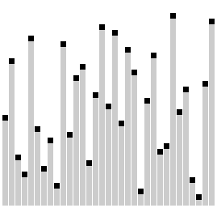
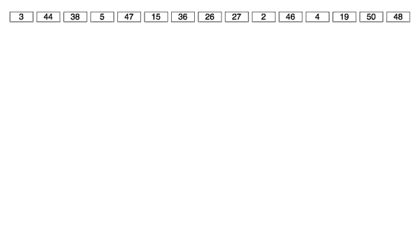

# JS方法积累——算法小结（*原生JS*）

>1. 稳定性：
>
>    稳定排序算法会让原本有相等键值的纪录维持相对次序。
>
>    >也就是如果一个排序算法是稳定的，当有两个相等键值的纪录R和S，且在原本的列表中R出现在S之前，在排序过的列表中R也将会是在S之前。
>2. 比较排序：
>
>    排序算法的一种，通过一个抽象的内容比较操作来确定两个元素中哪个应该放在序列前面。
>3. 算法复杂度：
>
>    1. 时间复杂度。
>    2. 空间复杂度。
>4. 线性时间：
>
>    一个被称为线性时间或`Ο(n)`时间的算法，表示此算法解题所需时间与输入资料的大小成线性比例。
>5. [数据结构](https://github.com/realgeoffrey/knowledge/blob/master/网站前端/前端概念/基础概念.md#数据结构data-structure)
>6. 鉴别arr是否是数组：
>
>    ```javascript
>    if (Object.prototype.toString.call(arr) !== '[object Array]') {   /* 不是数组*/
>
>        return false;
>    }
>    ```

## 排序算法
>部分排序算法演示：[visualgo](https://visualgo.net/sorting)。

### 洗牌算法
```javascript
function shuffle(arr) {
    var i, len, swapIndex, temp;

    arr = arr.slice();  //浅复制

    for (i = 0, len = arr.length; i < len; i++) {
        //i位置的数和[i, len-1]位置的数调换，保证每个数在任一位置的概率相同
        swapIndex = Math.floor(Math.random() * (len - i) + i);

        /* 元素交换*/
        temp = arr[swapIndex];
        arr[swapIndex] = arr[i];
        arr[i] = temp;
    }

    return arr;
}
```
>时间复杂度：O(n)。

### 插入排序
```javascript
function insertionSort(arr) {
    arr = arr.slice();  //浅复制

    var i, len, temp, j;

    for (i = 1, len = arr.length; i < len; i++) { /* 逐个取出与前面元素对比（前面元素已经排序）*/
        temp = arr[i];   //对比元素

        for (j = i - 1; j >= 0 && arr[j] > temp; j--) {   /* 向前逐个对比*/
            arr[j + 1] = arr[j];    //若前面元素大于对比元素，则前面元素向后移一位
        }

        arr[j + 1] = temp;   //对比元素插入空位
    }

    return arr;
}
```
>1. 思路：
>
>    - 顺序遍历元素（第一个元素默认已排序）：
>        - 取出对比元素，逐个遍历与前面排序元素对比：
>            1. 若排序元素大于对比元素，将排序元素向后移一位。
>            2. 否则将对比元素插入到排序元素后一位。
>2. 稳定、比较排序。
>3. 时间复杂度：O(n^2)。
>4. 空间复杂度：O(1)。


### 冒泡排序
```javascript
function bubbleSort(arr) {
    arr = arr.slice();  //浅复制

    var len = arr.length,
        i, j, temp;

    for (i = 0; i < len - 1; i++) { /* 一共比较趟数*/
        for (j = 0; j < len - i - 1; j++) { /* 每一趟比较的次数（已置底的不需要比较）*/
            if (arr[j] > arr[j + 1]) {    /* 相邻的元素大的放后面*/
                temp = arr[j];
                arr[j] = arr[j + 1];
                arr[j + 1] = temp;
            }
        }
    }

    return arr;
}
```
>1. 思路：
>
>    1. 比较相邻的元素：如果第一个比第二个大，就交换它们两个。
>    2. 对每一对相邻元素作同样的比较，从开始第一对到结尾的最后一对。这步做完后，最后的元素会是最大的数。
>    3. 针对所有的元素重复以上的步骤，除了已经置底的（遍历几次就有几个元素置底）。
>    4. 持续每次对越来越少的元素重复上面的步骤，直到没有任何一对数字需要比较。
>2. 稳定、比较排序。
>3. 时间复杂度：O(n^2)。
>4. 空间复杂度：O(1)。


### 快速排序
```javascript
function quickSort(arr) {
    arr = arr.slice();  //浅复制

    var len = arr.length,
        i, middle, leftArr, rightArr;

    if (len <= 1) { /* 递归边界条件*/

        return arr;
    } else {
        for (i = 1, middle = arr[0], leftArr = [], rightArr = []; i < len; i++) {   /* 以0索引元素为“基准”*/
            if (arr[i] < middle) {   /* 小于基准的元素放左数组*/
                leftArr.push(arr[i]);
            } else {       /* 大于等于基准的元素放右数组*/
                rightArr.push(arr[i]);
            }
        }

        return arguments.callee(leftArr).concat([middle].concat(arguments.callee(rightArr)));   //顺序合并左、中、右数组
    }
}
```
>1. 思路：
>
>    1. 从数列中挑出一个“基准”（pivot）元素。
>    2. 遍历其他元素，比基准值小的摆放在基准前面，比基准值大的摆在基准的后面（相同可以到放置任一边）。
>    3. 递归地把前后两数组进行相同操作。
>2. 不稳定、比较排序。
>3. 时间复杂度：平均O(n*log n)，最坏O(n^2)。
>4. 空间复杂度：O(log n)。


### 希尔排序
```javascript
function shellSort(arr) {
    arr = arr.slice();  //浅复制

    var len = arr.length,
        gap, i, j, temp;

    for (gap = Math.floor(len / 2); gap > 0; gap = Math.floor(gap / 2)) {   /* 不断分割成越来越大的区域进行插入排序*/
        for (i = gap; i < len; i++) {   /* 间隔为gap索引元素的插入排序*/
            temp = arr[i];

            for (j = i - gap; j >= 0 && arr[j] > temp; j -= gap) {
                arr[j + gap] = arr[j];
            }

            arr[j + gap] = temp;
        }
    }

    return arr;
}
```
>1. 思路：
>
>    将元素分为几个区域来提升*插入排序*的性能：让一个元素可以一次性朝最终位置前进一大步。算法再取越来越小的步长进行排序，最后是步长为1的插入排序。
>2. 不稳定、比较排序。
>3. 时间复杂度：根据步长取值而变化，最好O(n*log^2 n)，最坏O(n^2)。
>4. 空间复杂度：O(1)。

### 梳排序
```javascript
function combSort(arr) {
    arr = arr.slice();  //浅复制

    var SHRINK_FACTOR = 0.8,    //递减率
        len = arr.length,
        gap, swapped, i, temp;

    for (gap = len, swapped = true; gap > 1 || swapped; ) {
        if (gap > 1) {
            gap = Math.floor(gap * SHRINK_FACTOR);  //间距递减
        }

        swapped = false;

        for (i = 0; i < len - gap; i++) {
            if (arr[i] > arr[i + gap]) {
                temp = arr[i];
                arr[i] = arr[i + gap];
                arr[i + gap] = temp;

                swapped = true; //进行过交换，因此还未排序好
            }
        }
    }

    return arr;
}
```
>1. 思路：
>
>    1. 改良自*冒泡排序*（仅比较相邻两项），比较的两项间距可以大于1。
>    2. 开始时的间距设定为数列长度，并在循环中以固定比率递减（0.8）。
>    3. 当间距递减为1时，进行冒泡排序。
>2. 不稳定、比较排序。
>3. 时间复杂度：O(n^2)。
>4. 空间复杂度：O(1)。



### 归并排序
```javascript
function mergeSort(arr) {
    arr = arr.slice();  //浅复制

    var _merge = function (arrA, arrB) { /* 合并2个已经分别排序好的数组*/
            var newArr = [];

            /* 对比2个数组第一个元素，小的元素加入新数组并从原数组删去，直到至少一个数组为空*/
            while (arrA.length && arrB.length) {
                if (arrA[0] < arrB[0]) {
                    newArr.push(arrA.shift());
                } else {
                    newArr.push(arrB.shift());
                }
            }

            return newArr.concat(arrA.concat(arrB));    //顺序合并newArr、arrA、arrB数组
        },
        len = arr.length,
        midIndex, left, right;

    if (len <= 1) {  /* 递归边界条件*/

        return arr;
    } else {
        midIndex = Math.floor(len / 2);
        left = arr.slice(0, midIndex);
        right = arr.slice(midIndex);

        return _merge(arguments.callee(left), arguments.callee(right));
    }
}
```
>1. 思路：
>
>    1. 将相邻两个元素进行**归并操作**（将两个已经排序的数列合并成排序数列），每个排序后数列包含两个元素。
>    2. 重复以上操作，直到所有元素归并操作成一个数列。
>2. 稳定、比较排序。
>3. 时间复杂度：O(n*log n)。
>4. 空间复杂度：O(n)。


### 选择排序
```javascript
function selectionSort(arr) {
    arr = arr.slice();  //浅复制

    var len = arr.length,
        i, j, minIndex, temp;

    for (i = 0; i < len - 1; i++) {
        minIndex = i;

        for (j = i + 1; j < len; j++) {  /* 找出最小的元素*/
            if (arr[minIndex] > arr[j]) {
                minIndex = j;
            }
        }

        temp = arr[minIndex];
        arr[minIndex] = arr[i];
        arr[i] = temp;
    }

    return arr;
}
```
>1. 思路：
>
>    从剩余未排序元素中寻找最小（大）元素，放到已排序数列的末尾。直到所有元素均排序完毕。
>2. 不稳定、比较排序。
>3. 时间复杂度：O(n^2)。
>4. 空间复杂度：O(1)。


### 基数排序
```javascript
function radixSort(arr) {
    arr = arr.slice();  //浅复制

    var len = arr.length,
        i, bucket, max, maxLen, str, j, num, k, kLen;

    for (i = 0, bucket = []; i < 10; i++) { /* 创建十个空桶（十进制），每一位数循环先放入再倒出清空*/
        bucket[i] = [];
    }

    for (i = 1, max = arr[0]; i < len; i++) {   /* 获取元素最大值*/
        if (arr[i] > max) {
            max = arr[i];
        }
    }

    maxLen = max.toString(10).length;   //获取最大值元素的位数

    for (i = 1; i <= maxLen; i++) { /* LSD：从最低位（个位）到最高位，对每一个位数进行一次排序*/
        for (j = 0; j < len; j++) { /* 元素放入对应桶里*/
            str = arr[j].toString(10);

            if (str.length >= i) {  /* 根据数字第i位上的数字放置对应的桶。e.g. i=1：个位数字放置相应桶；i=2：十位数字放置相应桶*/
                num = parseInt(str[str.length - i], 10);    //获取i位置上的数字（i=1：个位；i=2：十位；i=3：百位...）
                bucket[num].push(arr[j]);
            } else {    /* 元素小于位数都放入第一个桶内（已经排序好的元素）；第一个桶还有放第i位是0的数，会在之后更高位被排序*/
                bucket[0].push(arr[j]);
            }
        }

        arr = [];   //清空数组以便从桶中接收排序好的数组

        for (j = 0; j < 10; j++) {  /* 把每个桶内数组放回原始数组中（桶内不排序）*/
            for (k = 0, kLen = bucket[j].length; k < kLen; k++) {
                arr.push(bucket[j][k]);
            }

            bucket[j] = [];
        }
    }

    return arr;
}
```
>1. 思路：
>
>    LSD：从最低位（个位）开始，依次进行一次排序，排序结束后再用已经排序过的内容进行高一位的排序。直到最高位排序结束。
>2. 稳定、非比较排序。
>3. 时间复杂度：平均O(k*n)（k：元素最大位数），最坏O(n^2)。



### 堆排序
```javascript
function heapSort(arr) {
    arr = arr.slice(); //浅复制

    var _swap = function (a, b) {    /* 替换数组内位置*/
            var temp = arr[a];

            arr[a] = arr[b];
            arr[b] = temp;
        },
        /*
         * （前提：子节点已经是最大堆）使父节点为最大堆，使得父节点以下的子节点（所有后裔）永远小于各自的父节点
         * @param {Number} dadIndex 父节点索引
         * @param {Number} endIndex 调整到的最末尾索引
         */
        _maxHeapify = function (dadIndex, endIndex) {
            var sonIndex = dadIndex * 2 + 1;  //父节点的左子节点位置

            if (sonIndex > endIndex) {   /* 递归边界条件：子节点超出范围*/

                return;
            } else {
                if (sonIndex + 1 <= endIndex && arr[sonIndex] < arr[sonIndex + 1]) { /* 若有右子节点，选择两个子节点中较大的*/
                    sonIndex++;  //父节点的右子节点位置
                }

                if (arr[dadIndex] <= arr[sonIndex]) {
                    _swap(dadIndex, sonIndex);    //保证父节点大于子节点
                    arguments.callee(sonIndex, endIndex); //因为子节点变化，所以递归一遍原本是最大堆的子节点
                }
            }
        },
        len = arr.length,
        i;

    for (i = Math.floor(len / 2) - 1; i >= 0; i--) {  /* i的初始值为堆的最后一个父节点*/
        _maxHeapify(i, len - 1);
    }

    for (i = len - 1; i > 0; i--) { /* 把已达成的最大堆的首元素放到末尾，并重新进行减少长度的最大堆排序*/
        /* 原本已经是最大堆，替换首元素之后需要执行一次最大堆函数，就再次成为为最大堆*/
        _swap(0, i);
        _maxHeapify(0, i - 1);
    }

    return arr;
}
```
>1. 思路：
>
>    1. 循环进行：创建最大堆，移除在顶端的最大元素。
>    2. 在数组起始位置为0的情形中：
>
>        1. 父节点i的左子节点在位置(2*i+1);
>        2. 父节点i的右子节点在位置(2*i+2);
>        3. 子节点i的父节点在位置Math.floor((i-1)/2);
>2. 不稳定、比较排序。
>3. 时间复杂度：O(n*log n)。
>4. 空间复杂度：O(1)。


### 计数排序
```javascript
function countingSort(arr) {
    var len = arr.length,
        min = Math.min.apply(null, arr),
        max = Math.max.apply(null, arr),
        countArr = [],
        newArr = [],
        i, j, k;

    for (i = 0; i < len; i++) { /* 元素值x出现次数->countArr[x]*/
        countArr[arr[i]] = countArr[arr[i]] ? countArr[arr[i]] + 1 : 1;
    }

    for (j = min; j < max; j++) {   /* 元素值x出现次数+值小于x元素出现计数累积->countArr[x]*/
        countArr[j + 1] = (countArr[j + 1] || 0) + (countArr[j] || 0);
    }

    for (k = len - 1; k >= 0; countArr[arr[k]]--, k--) {    /* 反向填充*/
        newArr[countArr[arr[k]] - 1] = arr[k];  //newArr[位置]=arr数据
    }

    return newArr;
}
```
>1. 思路：
>
>    1. 找出数列中最大、最小元素。
>    2. 统计值为i的元素出现的次数，存入count的第i项。对count每项计数累加，每一项和前一项相加。
>    3. 反向填充目标数组：将每个元素值i放在count(i)-1项，每放一个元素就将count(i)减去1。
>2. 稳定、非比较排序。
>3. 时间复杂度：O(n+k)（k：元素最大值）。
>4. 空间复杂度：O(n+k)。


----
## 搜索算法

### 二分搜索
1. 循环：

    ```javascript
    function binarySearch(arr, searchVal) {
        var leftIndex = 0,
            rightIndex = arr.length - 1,
            middleIndex;

        while (leftIndex <= rightIndex) {
            middleIndex = Math.floor((leftIndex + rightIndex) / 2);

            if (searchVal < arr[middleIndex]) { /* 目标小于中间数，在小的一堆找*/
                rightIndex = middleIndex - 1;
            } else if (searchVal > arr[middleIndex]) {  /* 目标大于中间数，在大的一堆找*/
                leftIndex = middleIndex + 1;
            } else {    /* 找到*/

                return middleIndex;
            }
        }

        /* 不存在*/
        return -1;
    }
    ```
    >空间复杂度：O(1)。
2. 递归：

    ```javascript
    function binarySearch(arr, searchVal, leftIndex, rightIndex) {
        if (typeof leftIndex === 'undefined' || typeof rightIndex === 'undefined') {
            leftIndex = 0;
            rightIndex = arr.length - 1;
        }

        var middle = Math.floor((rightIndex + leftIndex) / 2);

        if (leftIndex > rightIndex) {   /* 递归边界条件：不存在*/

            return -1;
        } else {
            if (searchVal < arr[middle]) { /* 目标小于中间数，在小的一堆找*/

                return arguments.callee(arr, searchVal, leftIndex, middle - 1);
            } else if (searchVal > arr[middle]) {  /* 目标大于中间数，在大的一堆找*/

                return arguments.callee(arr, searchVal, middle + 1, rightIndex);
            } else {    /* 递归边界条件：找到*/

                return middle;
            }
        }
    }
    ```
    >空间复杂度：O(log n)。

>1. 思路：
>
>    1. 在有序数组中查找某一特定元素的搜索算法，每一次比较都使搜索范围缩小一半。
>    2. 搜索过程从数组的中间元素开始：
>
>        1. 若中间元素正好是要查找的元素，则搜索过程结束。
>        2. 若某一特定元素大于或小于中间元素，则在数组大于或小于中间元素的那一半中查找，并且也从中间元素开始比较。
>        3. 若在某一步骤数组为空，则代表找不到。
>2. 时间复杂度：O(log n)。

----
## 其他算法

### 数组去重
>来自[JavaScript 数组去重](https://github.com/hanzichi/underscore-analysis/issues/9)。

1. 定义一个空数组变量，遍历需要去重的数组：若项的值不存在新数组中，则放入新数组；若已经存在，则丢弃。重复的项取最前的放入新数组。

    1. 使用`Array.prototype.indexOf`、`Array.prototype.filter`

        ```javascript
        function uniqueArr(arr) {

            return arr.filter(function (item, index, array) {

                return array.indexOf(item) === index;
            });
        }
        ```
    2. 不使用`Array.prototype.indexOf`、`Array.prototype.filter`

        ```javascript
        function uniqueArr(arr) {
            var newArr = [],
                i, j, iLen, jLen, item;

            for (i = 0, iLen = arr.length; i < iLen; i++) {
                item = arr[i];

                for (j = 0, jLen = newArr.length; j < jLen; j++) {
                    if (newArr[j] === item) {
                        break;
                    }
                }

                if (j === jLen) {
                    newArr.push(item);
                }
            }

            return newArr;
        }
        ```
    >时间复杂度：O(n^2)。
2. 定义一个空数组变量，遍历需要去重的数组：若项的值在原数组中唯一，则放入新数组；若不唯一，丢弃并继续向后遍历。重复的项取最后的放入新数组。

    ```javascript
    function uniqueArr(arr) {
        var newArr = [],
            len = arr.length,
            i, j;

        for (i = 0; i < len; i++) {
            for (j = i + 1; j < len; j++) {
                if (arr[i] === arr[j]) {    //如果发现相同元素，则i自增并且进入下一个数的循环比较
                    i++;
                    j = i;
                }
            }

            newArr.push(arr[i]);
        }

        return newArr;
    }
    ```
    >时间复杂度：O(n^2)。
3. 先排序原始数组（需要额外排序算法，否则只能处理Number型数据），第一项加入，之后每个项对比前一个项：若不同，则加入；若相同，则丢弃。

    ```javascript
    function uniqueArr(arr) {

        return arr.concat().sort().filter(function (item, index, array) {

            return !index || item != array[index - 1];  //排序后：第一项一定加入；第二项之后与前一项对比，不同则加入
        });
    }
    ```
    >时间复杂度：O(n) + 数组排序。
4. 用对象（哈希表）去重（只能处理Number型数据）。

    ```javascript
    function uniqueArr(arr) {
        var obj = {};

        return arr.filter(function (item) {

            return obj.hasOwnProperty(item) ? false : (obj[item] = true);
        });
    }
    ```
    >时间复杂度：O(n)。
5. ES6的`Array.from`、`Set`

    ```javascript
    function uniqueArr(arr) {

        return Array.from(new Set(arr));
    }
    ```

### 数组删去某值
1. 仅使用赋值操作：

    ```javascript
    function reduceArr(arr, delValue) {
        arr = arr.slice();

        var delCount = 0,
            i, len;

        for (i = 0, len = arr.length; i < len; i++) {
            if (arr[i] === delValue) {
                delCount++;
            } else if (delCount !== 0) {
                arr[i - delCount] = arr[i];
            }
        }

        arr.length = len - delCount;

        return arr;
    }
    ```
2. 使用`Array.prototype.splice`：

    ```javascript
    function reduceArr(arr, delValue) {
        arr = arr.slice();

        var i, len;

        for (i = 0, len = arr.length; i < len; i++) {
            if (arr[i] === delValue) {
                arr.splice(i, 1);
                i--;
            }
        }

        return arr;
    }
    ```
3. 使用新数组保存：

    ```javascript
    function reduceArr(arr, delValue) {
        var newArr = [],
            i, len;

        for (i = 0, len = arr.length; i < len; i++) {
            if (arr[i] !== delValue) {
                newArr.push(arr[i]);
            }
        }

        return newArr;
    }
    ```
4. 使用`Array.prototype.filter`（数组空位不遍历）：

    ```javascript
    function reduceArr(arr, delValue) {

        return arr.filter(function (value) {
            if (value !== delValue) {

                return true;
            }
        });
    }
    ```
>时间复杂度：O(n)。

### 声明某长度并设定值的数组
e.g. 声明arr：长度为n，值为下标（或某固定值）

1. 直接创建并循环赋值

    1. 字面量

        ```javascript
        var n = 55;

        var arr = [],
            i;

        for (i = 0; i < n; i++) {
            arr[i] = i;
        }
        ```
    2. `Array`构造函数：

        ```javascript
        var n = 55;

        var arr = new Array(n),
            i, len;

        for (i = 0, len = arr.length; i < len; i++) {
            arr[i] = i;
        }
        ```
2. `Array.prototype.map`赋值

    1. `Array`：

        ```javascript
        var n = 55;

        var arr = Array.apply(null, new Array(n)).map(function (item, index) {

            return index;
        });
        ```
    2. `Array`、`join`、`split`：

        ```javascript
        var n = 55;

        var arr = new Array(n + 1).join().split('').map(function (item, index) {

            return index;
        });
        ```
    3. `Object.keys`、`Array`、`toString`、`split`：

        ```javascript
        var n = 55;

        var arr = Object.keys(new Array(n + 1).toString().split('')).map(function (item, index) {

            return index;
        });
        ```
3. ES6的`Array.from`

    ```javascript
    var n = 55;

    var arr = Array.from({length: n}, function (value, index) {

        return index;
    });
    ```
4. 纯手打字面量（性能最好方式）

----
## 算法思路

### 无缝轮播
1. 要求：

    一共有`n`数量的项（**1**,**2**,**3**,...,**n**），中间展示内容有`i`数量的项，左右（或上下）分别展示待轮播有`m`数量的项（轮播到任何项都可以看见左右`m`数量的项），可以无缝向左右（或上下）轮播。
2. 核心思路：

    1. 方法1：

        1. *原始项*前面复制*原始项*最后的 **n-(m+i)+1**项~**n**项 的一共`m+i`数量的项；*原始项*后面复制*原始项*最前的 **1**项~**m+i**项 的一共`m+i`数量的项。
        2. 因为前后新增了项，滚动前的初始位置要向左（或上）移动`m+i`数量的项的距离。
        3. 轮播到达*原始项*边缘：

            1. 右（或下）轮播：当完全播放完原始最后一项时（最后`i`数量的项全部轮播完毕），把整个轮播内容向左（或上）移动整个*原始项*的距离。
            2. 左（或上）轮播：当完全播放完原始最前一项时（最前`i`数量的项全部轮播完毕），把整个轮播内容向右（或下）移动整个*原始项*的距离。
    2. 方法2：

        不复制、移动整个DOM的方法。
    3. 方法3：

        改变单个项的堆叠层级。