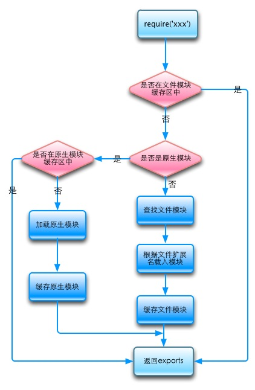

# JS模块化方案

## 目录
1. [CommonJS规范](#commonjs规范)
1. [ES6 Module](#es6-module)
1. [CommonJS与ES6 Module对比](#commonjs与es6-module对比)
1. [JS模块规范](#js模块规范)

---
### CommonJS规范
>参考：[阮一峰：require() 源码解读](http://www.ruanyifeng.com/blog/2015/05/require.html)、[CommonJS 详细介绍](https://neveryu.github.io/2017/03/07/commonjs/)、[阮一峰：JavaScript 模块的循环加载](http://www.ruanyifeng.com/blog/2015/11/circular-dependency.html)。

一个模块就是一个Node.js文件。

>主模块：通过命令行参数传递给Node.js以启动程序的模块，负责调度组成整个程序的其它模块完成工作。如：`node 文件名`、`package.json`的`main`。

- 概述（可对比ES6 Module）

    1. 执行阶段（运行时）进行模块加载（同步加载文件，阻塞JS进程）：确定模块的依赖关系、输入和输出的变量。

        因为本身就是**动态引入**，`module.exports`和`require`能够在任何位置使用（包括块级作用域）。
    2. 有自己单独作用域，不污染全局作用域，必须`module.exports`才能输出给其他模块。

        >不推荐`window.属性`。
    3. 模块的加载逻辑：

        1. 模块加载的顺序：按照其在代码中出现的顺序、引用则嵌套加载。
        2. 注入`exports`、`require`、`module`三个全局变量。
        3. 执行模块的源码：

            1. `require`第一次加载某模块，执行整个脚本，在内存生成一个缓存对象：

                `{ id: '...', exports: {...}, loaded: true/false, ... }`
            2. a模块执行时出现`require(b)`则进入b模块代码中执行，执行完毕后再回到a模块继续向下执行。
            3. 无论加载多少次，仅在第一次加载时运行，之后再被引用则直接返回已导出内容。

                >除非手动清除系统缓存。
            4. 「循环加载」（circular dependency）：

                引用之前已经被引用过的模块b，会直接返回模块b已导出的内容，而不会再进入模块b内执行。

                <details>
                <summary>e.g.</summary>

                ```js
                // 按①②③④⑤⑥的顺序执行


                // 入口
                ... // ①
                require('a模块'); // ②③④⑤执行后，②⑤导出a模块的内容2
                ... // ⑥


                // a模块
                ... // ②
                require('b模块'); // ③④执行后，③④导出b模块的内容
                ... // ⑤


                // b模块
                ... // ③
                require('a模块'); // ②导出a模块的内容1（因为a模块已经被引用过，所以直接使用a已经导出的内容，而不继续执行a的剩余代码）
                ... // ④
                ```
                </details>
        4. 将模块的`exports`值输出至缓存，以供其他模块`require`获取（或「循环加载」时，部分已经执行产生的`exports`供其他模块引用）。
        5. 若被`require`的模块没有`exports`，则仅执行一遍模块代码，返回`{}`。
    4. `require(a模块)`返回内存中a模块的`module.exports`指向的值

        1. `require(模块)`的变量可以设置为`let`或`const`（`var`也行，但不推荐）。
        2. 内存中a模块的属性可以被任何模块（a模块或其他模块）修改

            注意：修改 `导出的模块内` 值引用的部分不会修改导出的值。导出模块时出现的`引用:`或`赋值=`，就都遵循JS的[值传递](https://github.com/realgeoffrey/knowledge/blob/master/网站前端/JS学习笔记/README.md#内存机制)。
        3. 导出过之后，再次修改`module.exports = 其他`不影响a模块的缓存（原来缓存是基本数据类型或基本数据类型都不影响）。

        ><details>
        ><summary>e.g.</summary>
        >
        >```js
        >// index1.js
        >let a = 1;
        >let b = {
        >  value: 1,
        >};
        >function add() {
        >  a++;
        >  b.value++;
        >}
        >// 导出的是module.exports
        >// `module.exports = xx`或`module.exports.a = xx`都是值传递
        >module.exports = { // 值传递：对象内存地址
        >  a,   // 值传递：1
        >  b,   // 值传递：b的内存地址
        >  add  // 值传递：add的内存地址
        >};
        >
        >
        >// index2.js
        >const obj = require("./index1");
        >
        >console.log(obj.a, obj.b); // => 1 { value: 1 }
        >obj.add();
        >console.log(obj.a, obj.b); // => 1 { value: 2 }
        >obj.a++;
        >obj.b.value++;
        >console.log(obj.a, obj.b); // => 2 { value: 3 }
        >```
        ></details>
    5. CommonJS是一个单对象输出、单对象加载的模型：

        1. 所有要输出的对象统统挂载在`module.exports`上，然后暴露给外界。
        2. 通过`require`加载别的模块，`require`的返回值就是模块暴露的对象。
    6. `this`指向`export.modules`（若`export.modules = xx`，则`this`指向之前的引用地址，此时不再等于xx）
    7. 不能`require`ES6 Module的文件（.mjs）或代码（ES6 Module的语法）。
1. `module.exports`

    模块提供使用的`exports`值。

    - 允许用两种方式为导出赋值：

        1. `module.exports = 值`
        2. `module.exports.属性 = 值`

        >1. 每个模块执行前，`exports`指向`module.exports`：`exports = module.exports`
        >2. 若`exports = 值`或`module.exports = 值`则切断了`exports`与`module.exports`的连接，`exports`将没有导出效果（导出的永远是`module.exports`）。
        >
        >    ```js
        >    // e.g.
        >    console.log(module.exports, exports, module.exports=== exports)   // => {} {} true
        >    exports = {}    // 或 module.exports = {}
        >    console.log(module.exports, exports, module.exports === exports)  // => {} {} false
        >    ```
        >-  原理：Node.js在运行时为每个模块创建一个包装函数（自执行匿名函数，作用域隔离）：
        >
        >    ```js
        >    // 参数会设置好引用关系，如：exports = module.exports
        >
        >    (function(exports, require, module, __filename, __dirname) {   // 因此模块内可以直接使用这5个变量
        >      // 模块逻辑...
        >    })(相关参数)
        >
        >    // 最后模块导出：return module.exports
        >    ```
2. `require(X)`

    加载模块。读取并执行一个JS文件（`.js`后缀可以省略），返回该模块的`module.exports`值（没有导出内容则为`{}`）。

    >1. 被引入的内容就可以被各种解构。
    >2. 注意文件名大小写，可能导致引用路径失败（针对：开发时的系统大小写不敏感，上线或其他机器运行时系统大小写又敏感的情况）。

    - <details>

        <summary>查找逻辑</summary>

        

        >官方解析：[Modules: All together](https://nodejs.org/api/modules.html#all-together)。

        1. 若 X 以 `/`（绝对路径） 或 `./`、`../`（相对路径） 开头，则

            1. 根据 X 所在的父模块，确定 X 的绝对路径；
            2. 先将 X 当成**文件**，依次查找下面文件，只要其中有一个存在，就返回该文件，不再继续执行；

                `X` -> `X.js` -> `X.json` -> `X.node`
            3. 再将 X 当成**目录**，依次查找下面文件，只要其中有一个存在，就返回该文件，不再继续执行。

                `X/package.json的main字段` -> `X/index.js` -> `X/index.json` -> `X/index.node`
        2. 若 X 是核心模块（内置模块），则返回该模块，不再继续执行。

            >e.g. `require('http')`、`require('node:http')`

            可以使用`node:`前缀来识别核心模块，在这种情况下它会绕过require缓存。e.g. `require('node:http')`将始终返回内置的HTTP模块，即使有该名称的`require.cache`条目。核心模块列表：`module.builtinModules`。
        3. 若 X 不带路径且不是核心模块，则

            >当作安装在本地的模块。

            根据 X 所在的父模块，确定 X 可能的安装目录（node_modules/）：依次在每个安装目录node_modules中，将 X 当成**文件**（`X` -> `X.js` -> `X.json` -> `X.node`）或**目录**（`X/package.json的main字段` -> `X/index.js` -> `X/index.json` -> `X/index.node`）加载。若当前目录找不到，向上一层搜索 X，直到系统根目录。

            ><details>
            ><summary>e.g.</summary>
            >
            >1. 在`/home/xx/projects/foo.js`执行`require('bar')`：
            >
            >    1. 属于不带路径且不是核心模块，当作安装在本地的模块进行搜索；
            >    2. 依次搜索每一个目录，直到系统根目录：
            >
            >        ```text
            >        /home/xx/projects/node_modules/
            >        /home/xx/node_modules/
            >        /home/node_modules/
            >        /node_modules/
            >        ```
            >
            >        1. 搜索时，先将`bar`当作文件名，依次在`某某/node_modules/`尝试加载下面文件：
            >
            >            `bar`、`bar.js`、`bar.json`、`bar.node`
            >        2. 若都不成功，则说明`bar`可能是目录名，依次在`某某/node_modules/`尝试加载下面文件：
            >
            >            ```text
            >            bar/package.json（main字段）
            >            bar/index.js
            >            bar/index.json
            >            bar/index.node
            >            ```
            >    3. 都找不到则抛出`Error: Cannot find module 'bar'`。
            >2. `require('foo/bar')`与上面的查找类似，但是会认为`foo`是目录，`bar`是文件或目录
            >
            >    1. `./node_modules/foo/`
            >    2. `../node_modules/foo/`
            >    3. `../../node_modules/foo/`
            >    4. 直到系统根目录
            ></details>
        4. 抛出`Error: Cannot find module 'X'`。
        </details>

    - <details>

        <summary><code>require</code>实现逻辑模拟</summary>

        ```js
        // 执行`myRequire(filename)`逻辑：
        // 1. 先将filename转化为绝对路径（跳过Node.js查找流程）。若有缓存，则直接导出缓存
        // 2. fs读取这个绝对路径文件，获取`代码字符串`，根据绝对路径的文件后缀，执行不同的文件处理方法
        //  2.1. 若是.js文件，则包装成匿名函数执行 `(function(exports, require, module, __filename, __dirname) {代码字符串转化为的JS代码}(传参))`
        //  2.2. 若是.json文件，则直接 `module.exports=JSON.parse(代码字符串)`
        //  2.3. 其他（如：.node需要二进制插件加载），略
        // 3. 缓存模块（`{id: 绝对路径, exports: module.exports}`），并最终返回`module.exports`

        const path = require("node:path");
        const fs = require("node:fs");
        const vm = require("node:vm");

        // 创建模块
        function Module(id) {
          this.id = id; // id：最终路径
          this.exports = {}; // exports：模块执行后的`module.exports`
        }

        // 返回查找到的最终文件路径
        function resolveFileName(filename) {
          // 先将路径 转化为 绝对路径
          const r = path.resolve(__dirname, filename);
          // 文件路径是否存在，如果不存在，尝试添加 .js、.json 等后缀
          const isExists = fs.existsSync(r);
          if (isExists) {
            return r;
          } else {
            const keys = Object.keys(Module._extensions);
            for (let i = 0; i < keys.length; i++) {
              const ext = keys[i];
              const tryFileName = r + ext;
              if (fs.existsSync(tryFileName)) {
                return tryFileName;
              }
            }
            throw new Error("module not found!");
          }
        }

        // 执行模块
        function tryModuleLoad(module) {
          // 获取文件的后缀名
          const extname = path.extname(module.id);
          Module._extensions[extname](module); // 不同后缀执行不同的加载逻辑
        }

        // Node.js在运行时为每个模块创建一个包装函数（自执行匿名函数，作用域隔离）
        const wrapper = [
          "(function(exports, require, module, __filename, __dirname) {",
          "\n})",
        ];
        Module._extensions = {
          ".js"(module) {
            const scripts = fs.readFileSync(module.id, "utf8"); // 模块代码字符串
            const fnStr = wrapper[0] + scripts + wrapper[1];
            const fn = vm.runInThisContext(fnStr);
            const exports = module.exports; // exports 和 module.exports
            fn.call(
              exports, // this
              exports, myRequire, module, module.id, path.dirname(module.id),
            );
          },
          ".json"(module) {
            const scripts = fs.readFileSync(module.id, "utf8"); // 模块代码字符串
            try {
              module.exports = JSON.parse(scripts);
            } catch (err) {
              console.log("转换 失败！", err);
            }
          },
        };
        Module._cache = {};

        function myRequire(filename) {
          const id = resolveFileName(filename);
          const cacheModule = Module._cache[id];
          if (cacheModule) {
            console.log("缓存了");
            return cacheModule.exports;
          }
          const module = new Module(id);
          // 缓存模块
          Module._cache[id] = module;
          // 执行模块（加载这个模块）
          tryModuleLoad(module);

          return module.exports;
        }


        /* 使用测试 */
        var str1 = myRequire("./a");
        var str2 = myRequire("./a");

        console.log(myRequire("./a.json"));
        console.log(str1, str2);
        ```
        </details>

3. `module`

    - 当前模块对象。拥有以下属性：

        1. `module.id`：模块的识别符，通常是带有绝对路径的模块文件名。
        2. `module.filename`：模块的文件名，带有绝对路径。
        3. `module.loaded`：返回一个布尔值，表示模块是否已经完成加载。
        4. `module.parent`：返回一个对象，表示调用该模块的模块。
        5. `module.children`：返回一个数组，表示该模块要用到的其他模块。
        6. `module.exports`：表示模块对外输出的值。
        7. `module.paths`：返回一个数组，模块文件默认搜索目录（`某某/node_modules/`）。

    >所有模块都是Node.js内部`Module`构建函数的实例。

### ES6 Module
>参考：[阮一峰：Module 的语法](http://es6.ruanyifeng.com/#docs/module)、[阮一峰：Module 的加载实现](http://es6.ruanyifeng.com/#docs/module-loader)。

一个模块就是一个独立的文件。

>`.js`、`.mjs`文件、`<script>`遵循相同模块规则。

- 概述（可对比CommonJS）

    1. 预编译阶段进行模块加载（静态分析）：确定模块的依赖关系、输入和输出的变量。

        `export`和`import`可以放在模块的任何位置，但必须处于模块顶层（若处于块级作用域内会报错）。

        ><details>
        ><summary>预编译阶段无法解析<del>块级作用域</del>、<del>表达式</del>、<del>变量</del></summary>
        >
        >```js
        >// 报错（块级作用域）
        >if (x === 1) {
        >  import { foo } from 'module1';
        >} else {
        >  import { foo } from 'module2';
        >}
        >
        >// 报错（表达式）
        >import { 'f' + 'oo' } from 'my_module';
        >
        >// 报错（变量）
        >let module = 'my_module';
        >import { foo } from module;
        >```
        ></details>

        - **动态引入**可以在非模块顶层进行`import()`（返回Promise实例）
    2. 有自己单独作用域，不污染全局作用域，必须`export`才能输出给其他模块。在[严格模式](https://github.com/realgeoffrey/knowledge/blob/master/网站前端/前端内容/标准库文档.md#严格模式)下运行。

        >不推荐`window.属性`。
    3. 模块的加载逻辑：

        1. 预编译阶段确定模块加载顺序（最底层被依赖的模块——最后一个被`import`的模块，最先执行），代码运行时按照确定的顺序一次性执行整个模块代码。

            >感官上：遇到`import`时，不会跳去执行其他模块（模块执行顺序已经在预编译阶段确定），而是直接利用其他模块的引用。
        2. 一个模块仅能执行一次，无论被多少模块引入。模块引用只是获得其他模块的引用地址。
        3. 「循环加载」（circular dependency）：

            1. 「循环加载」时忽略之前已经被依赖过的模块，最后加载最先出现的「循环加载」的模块。

                ><details>
                ><summary>循环依赖关系为<code>入口 -> a -> b -> a</code>，模块执行顺序为<code>b -> a -> 入口</code>，完整执行完一个模块才会进入下一个模块执行</summary>
                >
                >e.g.
                >```js
                >// 按①②③④⑤⑥的顺序执行
                >
                >
                >// 入口
                >... // ⑤
                >import 'a模块'; // ①②③④执行后，③④导出的内容
                >... // ⑥
                >
                >
                >// a模块
                >... // ③
                >import 'b模块'; // ①②执行后，①②导出的内容
                >... // ④
                >
                >
                >// b模块
                >... // ①
                >import 'a模块'; // a模块未执行，导出为空
                >... // ②
                >```
                ></details>
            2. 「循环加载」的最先被执行模块无法获取其他模块的`import`值（除了`function`的提升），仅尝试声明。

                1. 若`import`module实例，则module实例被声明。
                2. 若`import`内容为`var`，则变量被声明，但未赋值。
                3. 若`import`内容为`let/const`，则变量未声明。
                4. 若`import`内容为`function`，则方法被声明，可以使用（后加载的模块内方法声明会提升至先加载模块中使用）。

                    <details>
                    <summary>e.g.</summary>

                    ```js
                    // a.mjs
                    import { bar } from './b'  // ①
                    console.log('a.mjs')
                    console.log(bar())
                    function foo1 () { return 'foo1' }  // 方法在执行①前就提升，从而有定义
                    var foo2 = () => 'foo2' // 不会提升
                    export { foo1, foo2 }


                    // b.mjs
                    import { foo1, foo2 } from './a'
                    console.log('b.mjs')
                    console.log(foo1())
                    try {console.log(foo2())} catch (e) {console.log(e)}
                    function bar () { return 'bar' }
                    export { bar }


                    // $ node a.mjs
                    b.mjs
                    foo1
                    TypeError: foo2 is not a function
                    a.mjs
                    bar
                    ```
                    </details>
                >1. 非「循环加载」的模块和「循环加载」第二个之后的模块，都能先获得`import`值（类似提升，还获得了引用值）。
                >2. JS不关心是否发生了「循环加载」，只生成一个指向被加载模块的引用，引用那个被导出的变量。
        4. （除了「循环加载」的第一个模块之外，）模块可以提升使用`import`内容（类似变量提升，且可获得引用值）。
    4. `import`内容与原模块导出的变量是**动态绑定**

        1. `import`导入的内容不能赋值（类似于`const`）。
        2. 导入/导出的内容 的属性可以被任何模块（自己或其他模块）修改。
        3. 导出/导入的接口名与原模块内部变量间，建立了一一对应的关系。使用接口就是**引用**原模块的变量（`default`被看做是对象）。

            注意：修改 `导出的模块内` 值引用的部分不会修改导出的值。导出模块都是导出变量，要注意变量`引用:`或`赋值=`时需要遵循JS的[值传递](https://github.com/realgeoffrey/knowledge/blob/master/网站前端/JS学习笔记/README.md#内存机制)。

            >`import { a } from '模块'`可以理解为：`'模块'`是一个固定对象，`a`是这个对象的属性名，且属性名不能赋值（但可以修改`a`内部属性）。
        4. 导出过之后，再次修改导出的变量会改变导出值。

            `default`当做是一个导出变量，因此`let obj = [];export default obj/* 值引用：obj的值传递给default */; obj = {};`并不能改变`default`导出的内容。

        ><details>
        ><summary>e.g.</summary>
        >
        >```js
        >// index.mjs
        >let a = 1;
        >let b = {
        >  value: 1,
        >};
        >let c = 1;
        >function add() {
        >  a++;
        >  b.value++;
        >  c++;
        >}
        >const obj = { // 值引用
        >  a,   // 值引用
        >  b,   // 值引用
        >  add  // 值引用
        >};
        >export default obj;    // 导出对象
        >export { c };          // 导出对象
        >
        >
        >// index2.mjs
        >import obj, { c } from "./index.mjs";
        >
        >console.log(obj.a, obj.b, c); // => 1 { value: 1 } 1
        >obj.add();
        >console.log(obj.a, obj.b, c); // => 1 { value: 2 } 2
        >obj.a++;
        >obj.b.value++;
        >// c++; // 不能修改import的变量
        >console.log(obj.a, obj.b, c); // => 2 { value: 3 } 2
        >```
        ></details>
    5. ES6 Module是一个多对象输出、多对象加载的模型：

        1. 输出任何模块内部的引用

            `export { A, B }`、`export { A as a, B }`、`export default A`、`export const A = { }`
        2. 加载模块中输出的任意引用

            `import A from ''`、`import * as A from ''`、`import { A, B } from ''`、`import { A as a, B } from ''`
    6. `this`指向`undefined`
    7. 可以整体`import`CommonJS的文件（.js且CommonJS语法）。

        1. 支持：`import 外号变量 from '模块'`（等价支持`import {default as 外号变量} from '模块'`）、`import * as Module实例 from '模块'`、`import '模块'`
        2. 不支持：`import {导出的变量[, 导出的变量]} from '模块'`

    >（CORS）跨域的模块资源无法`import`引入，也无法通过`<script>`以模块方式加载。

1. `export`

    模块可以导出多个内容，导出变量名不能重复（因此`default`只能导出一次）。

    >`default`可以当作导出的默认变量。

    1. `export 声明语句`
    2. `export {变量[, 变量]}`
    3. `export {变量 as 外号变量[, 变量 as 外号变量]}`

        >避免重命名；可以同一个变量使用多个外号变量。
    4. `export {变量[, 变量]} 或 {变量 as 外号变量[, 变量 as 外号变量]} 或 * form '模块'`

        >`export * form '模块'`导出除了`default`的内容，可以用`export { default } from '模块'`单独导出`default`。

        将其他模块的变量导入再导出，但本模块无法使用。

        ><details>
        ><summary>e.g.</summary>
        >
        >跨模块常量案例：
        >
        >```js
        >/* 单个常量文件 */
        >
        >// constants/db.js
        >export const db = {
        >  url: 'http://my.couchdbserver.local:5984',
        >  admin_username: 'admin',
        >  admin_password: 'admin password'
        >};
        >
        >// constants/user.js
        >export const users = ['root', 'admin', 'staff', 'ceo', 'chief', 'moderator'];
        >
        >
        >
        >/* 合并到文件 */
        >
        >// constants/index.js
        >export { db } from './db';
        >export { users } from './users';
        >
        >
        >
        >/* 要使用的文件引入 */
        >
        >// script.js
        >import { db, users } from './constants/index';
        >```
        ></details>

    >导出`default`和导出`{变量}`的区别：[Stack Overflow: When should I use curly braces for ES6 import?](https://stackoverflow.com/questions/36795819/when-should-i-use-curly-braces-for-es6-import/36796281#36796281)。

    5. `export default 表达式` === `export {变量 as default}`

        ><details>
        ><summary>e.g.</summary>
        >
        >```js
        >/* 表达式 */
        >number + 1
        >function () {}
        >ok ? 'YES' : 'NO'
        >Array.from(words).reverse().join('')
        >
        >/*
        >是语句，不是表达式
        >var a = 1
        >
        >流控制不会生效，请使用三元运算符表达式
        >if ...
        >*/
        >```
        ></details>

    >不允许：~~`export 值或变量名或方法名或类名`~~。必须输出`接口名`（`声明` 或 大括号包裹的`{变量名或方法名或类名}`）。
2. `import`

    1. `import {导出的变量[, 导出的变量]} from '模块'`

        >不允许 ~~`import {default} from '模块'`~~，因为`default`是关键字，不能作为变量名；允许`import {default as 外号变量} from '模块'`。
    2. `import {导出的变量 as 外号变量[, 导出的变量 as 外号变量]} from '模块'`

        >避免重命名。

        - 语法不支持直接在导入时解构

            e.g. ~~`import { 变量: { 解构变量 } } from '模块'`~~、~~`import { 变量 as 外号变量 : { 解构变量 } } from '模块'`~~、等。
    3. `import 外号变量 from '模块'` === `import {default as 外号变量} from '模块'`

        >仅接受模块导出的`default`内容。

        ><details>
        ><summary>不能直接解构<code>default</code></summary>
        >
        >需要2行代码进行：
        >
        >```js
        >import x, { c } from "./x";
        >const { a, b } = x;
        >
        >
        >// ./x.js
        >export default {
        >  a: 'a',
        >  b: 'b'
        >}
        >export const c =  'c'
        >```
        ></details>
    4. `import * as Module实例 from '模块'`

        >导出的变量（包括`default`）都成为`Module`实例的属性（相当于导出命名空间），以`Module实例.导出的变量`使用。`Module实例`和`Module实例.导出的变量`都是只读的，不可以赋值改变。
    5. `import '模块'`

        不引入模块里导出的内容，仅执行该模块代码。

><details>
><summary>使用ES6 Module前提</summary>
>
>1. 浏览器
>
>    1. 开启浏览器Module功能：
>
>        1. Chrome地址输入`chrome:flags`，打开`Experimental Web Platform`。
>        2. Firefox地址输入`about:config`，打开`dom.moduleScripts.enabled`。
>        3. Edge 地址输入`about:flags`，打开`Experimental JavaScript Features`。
>    2. 在`<script>`添加`type="module"`。
>2. Node.js
>
>    1. 运行`.mjs`后缀的文件名：`$ node 文件名.mjs`（Node.js 12以前要带`--experimental-modules`）
>    2. `.js`文件取决于`package.json`的`type: "module"`字段。
></details>

### CommonJS与ES6 Module对比
1. 语法差异

    1. CommonJS

        ```js
        const module = require('module')
        const { namedExport } = require('module')

        exports.xxx = xxx;
        module.exports = xxx;
        ```
    2. ES6 Module

        ```js
        import defaultExport from 'module'
        import { namedExport } from 'module'

        export { namedExport };
        export default namedExport
        ```
2. 引用目标差异

    1. CommonJS

        `require`是对导出内容（`module.exports`）的浅拷贝。
    2. ES6 Module

        `import`是对导出变量的引用。
3. 引用执行逻辑不同

    1. 依赖关系确定阶段不同，模块的加载逻辑不同

        1. CommonJS

            `require`是**运行时**执行，会在模块代码执行到`require`语句时加载下一个模块，若下个模块有缓存则返回缓存、若没有缓存则立即执行下一个模块中的代码（一个模块被执行过但没有执行完毕，也会缓存该模块供其他模块引用）。因此能够在任何位置使用`module.exports`和`require`（包括块级作用域）。
        2. ES6 Module

            `import`是**编译时**执行，在编译阶段，解析器会检查和处理`import`语句，并在编译阶段确定模块的依赖关系，模块必须完全执行完毕才会执行下一个模块（有一个独立的静态解析阶段，依赖关系的分析是在那个阶段完成的，最底层的模块第一个执行）。因此**只能在代码顶层使用`import`和`export`**。

            >利用ES6 Module的静态解析的webpack功能：tree shaking、scope hoisting。
    2. 同步、异步区别

        1. CommonJS

            `require`是同步执行（本地文件索引；后面的代码必须等待这个命令执行完，才会执行）。
        2. ES6 Module

            `import`在浏览器是异步执行（URL索引），循环引用时提升依赖项。
    3. 循环引用逻辑不同

        详情看上面各自的循环引用逻辑（搜索`「循环加载」（circular dependency）`）。
4. 其他细节

    1. CommonJS

        `this`指向`export.modules`；不能`require`ES6 Module的文件或代码。
    2. ES6 Module

        `this`指向`undefined`；可以整体`import`CommonJS的文件；严格模式下运行。
5. 环境兼容

    1. CommonJS

        Node.js中使用的模块机制，适用于Node.js的所有版本。
    2. ES6 Module

        ECMAScript 2015新增，在较新的浏览器或最新版本的Node.js（node 12 之后）中支持。

### JS模块规范


1. CommonJS规范
2. ES6 Module

>在webpack打包时，可以在JS文件中混用`require`和`export`，但是不能 ~~混用`import`和`module.exports`~~。最好统一为某一种规范去使用，不要混用。

3. [UMD规范](https://github.com/umdjs/umd)的简单示例：

    ```js
    (function (root, factory) {
        if (typeof define === 'function' && define.amd) {
            // AMD. Register as an anonymous module.
            define(['b', 'c'], factory);
        } else if (typeof define === 'function' && define.cmd) {
            // CMD
            define(function(require, exports, module) {
                module.exports = factory(require('b'), require('c'))
            })
        } else if (typeof module === 'object' && module.exports) {
            // Node. Does not work with strict CommonJS, but
            // only CommonJS-like environments that support module.exports,
            // like Node.
            module.exports = factory(require('b'), require('c'));
        } else {
            // Browser globals (root is window)
            root.returnExports = factory(root.b, root.c);
        }
    }(typeof self !== 'undefined' ? self : this, function (b, c) {
        // Use b in some fashion.

        // Just return a value to define the module export.
        // This example returns an object, but the module
        // can return a function as the exported value.
        return {};
    }));
    ```

    >可以设置webpack的[`output.libraryTarget`](https://webpack.docschina.org/configuration/output/#output-librarytarget)为`'umd'`自动导出UMD规范的代码。
