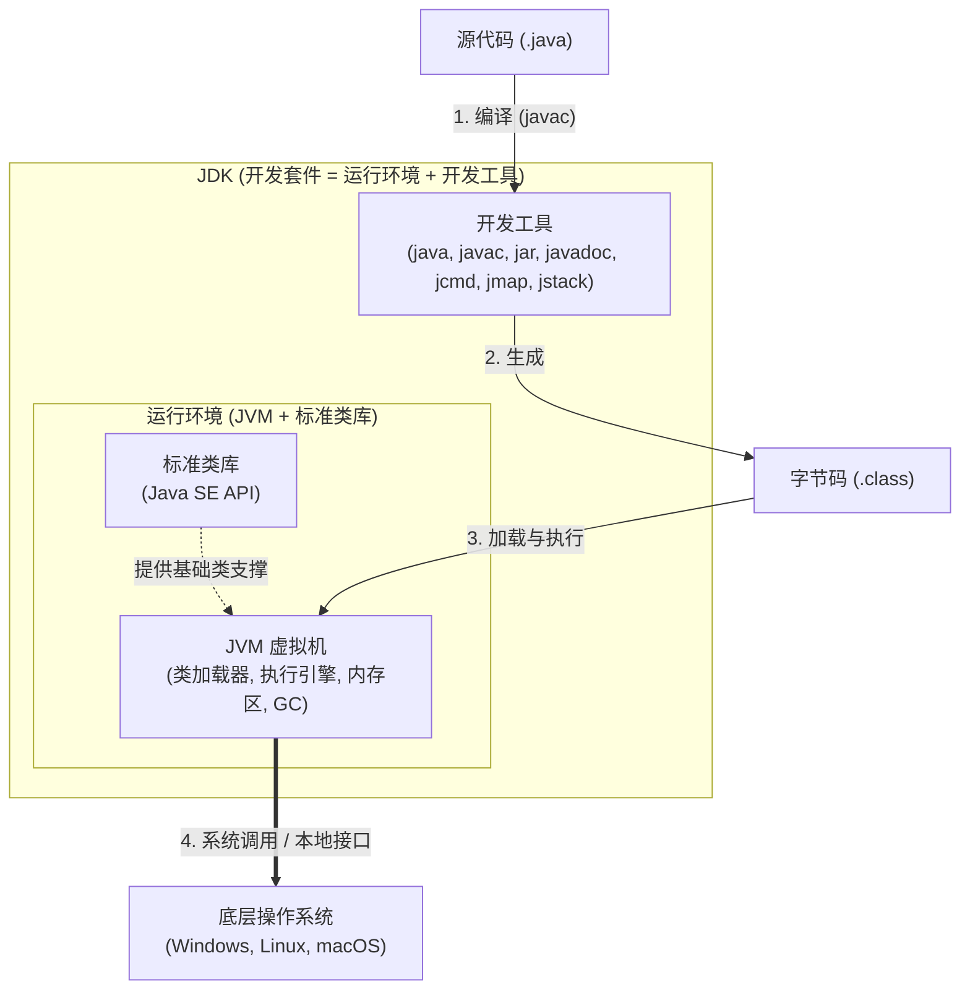

# Java学习笔记

## 目录
1. [Java 概览](#java-概览)
1. [Java SE 基础](#java-se-基础)
1. [后端工程与数据中间件](#后端工程与数据中间件)
1. [缩写解析](#缩写解析)

---

<details>
<summary>定位、资源与路线</summary>

1. 这份笔记面向“前端转全栈 Java”的学习场景；与 JS 基本一致的内容尽量少写，重点建立能做业务开发的知识骨架。

    1. 第一阶段：会写 Java 基础语法，能看懂并修改常见后端代码。
    1. 第二阶段：掌握 Spring Boot + MyBatis + MySQL，能独立完成基础 CRUD 接口。
    1. 第三阶段：补 Redis、消息队列、JVM、并发、性能调优等进阶内容。

    - <details>

        <summary>学习资源</summary>

        1. 视频

            1. 快速入门：[系列·狂神说Java系列（排序完毕）](https://space.bilibili.com/95256449/lists/393820?type=series)
            1. Java 基础：[【零基础 快速学Java】韩顺平 零基础30天学会Java](https://www.bilibili.com/video/BV1fh411y7R8)
            1. 补深度：[尚硅谷最新Java学习路线（AI赋能全新升级）](https://www.bilibili.com/opus/369163743450531164)
        1. 文本

            1. [廖雪峰：Java教程](https://liaoxuefeng.com/books/java/introduction/index.html)
        </details>
1. 学习路线

    推荐按下面顺序学习，不要一开始就陷入源码、JVM 参数、微服务治理这类细节。

    1. Java SE 基础
    2. Maven
    3. MySQL
    4. Spring / Spring Boot
    5. MyBatis
    6. Redis
    7. 消息队列
    8. 并发、JVM、性能优化

    - 前端转 Java 时，最容易卡住的点通常不是语法，而是下面三件事：

        - 类型系统更严格，编译期约束更多。
        - 后端代码更强调分层、事务、数据一致性。
        - 工程启动、依赖管理、数据库与中间件的协作成本更高。

    - 写或读一个 Java/Spring Boot 接口时，建议固定按这几问走：

        1. 请求怎么进来：URL、Method、Header、Query、Body、Session、CORS、Filter/Interceptor。
        1. 对象谁来管：这个类是不是 Bean，谁注册的，怎么注入，作用域是什么。
        1. 代码怎么分层：Controller 是否只做入口，Service 是否承载业务，Mapper 是否只管数据访问。
        1. 数据怎么一致：事务边界在哪里，异常会不会回滚，是否有并发、幂等、重复提交问题。
        1. SQL 怎么执行：Mapper 对应哪条 SQL，参数是否安全，结果怎么映射，索引/分页是否合理。
        1. 配置从哪来：application.yml、profile、Starter、自动配置、POM、环境变量谁生效。
        1. 运行在哪里：本地 JVM、内嵌 Tomcat、Docker 容器、K8s Pod、数据库/Redis/MQ 是否可达。
        1. 出错怎么查：先看请求是否到达，再看网关/HTTP Server，再看应用日志、trace、metrics、DB/中间件。

</details>

## Java 概览
### 版本演进
- Java 1.0 / 1.1 常见称呼是 JDK 1.0 / 1.1（Java Development Kit）。
- 1.2 到 1.4 常见叫法是 J2SE（Java 2 Platform, Standard Edition）。
- Java 5 的正式品牌常见写作 J2SE 5.0，也常被称为 Java 5；Java 6 起通常叫 Java SE（Java Platform, Standard Edition）。
- 日常说版本时，Java SE 8 / Java 8 / JDK 8 / JDK 1.8 通常指同一代（2014年）。

    下载地址：[Java SE 8 Archive Downloads (JDK 8u202 and earlier)](https://www.oracle.com/java/technologies/javase/javase8-archive-downloads.html)、[Java SE 8 Archive Downloads (JDK 8u211 and later)](https://www.oracle.com/java/technologies/javase/javase8u211-later-archive-downloads.html)（[Java downloads](https://www.oracle.com/java/technologies/downloads/)、[Java Archive](https://www.oracle.com/java/technologies/downloads/archive/)）

    >JDK 8u202解析：`8`代表主版本号，也就是 Java 8（在早期命名规范中也叫 JDK 1.8）。`u`是 Update（更新） 的缩写。`202`是更新号。Oracle 会定期发布这些 Update，主要包含安全漏洞修复、Bug 修复以及一些微小的性能调优，不涉及语法层面的大改动。
- Java 9 起主版本号不再写成 `1.x`，而是直接使用 9、10、11、17、21、25 这种形式。
- <details>

    <summary>本地版本管理：<a href="https://github.com/sdkman/sdkman-cli">SDKMAN!</a></summary>

    ```
    sdk list            # 列出 SDKMAN! 支持管理的候选项（java、maven、gradle、...）
    sdk list java       # 列出 Java 可安装、本地、已安装和当前使用的版本（通常 `>>>` 表示当前正在使用，底部图例为准）
    sdk list java | grep -E "installed|local only"  # 查看已安装或通过本地路径接管的 Java
    ls -l ~/.sdkman/candidates/java/                # 查看安装目录
    # 不同候选项的 sdk list 展示格式可能不同，以输出底部图例为准
    # 针对maven，可以根据sdk list maven查看标志信息（如：`+`local version；`*`installed；`>`currently in use）

    sdk install java                # 安装 Java 最新稳定版
    sdk install java 「支持的版本标识」 # 安装指定版本，版本标识从 sdk list java 中复制
    sdk install java 8.0.192-local /Library/Java/JavaVirtualMachines/jdk1.8.0_191.jdk/Contents/Home
    # 安装本地版本（sdk install java 「唯一的版本号」 「本地路径」）：先手动下载一个版本，然后让 SDKMAN! 接管（软链接）

    sdk use java 8.0.192-local          # 仅当前 shell 使用该 Java 版本

    sdk default java 8.0.192-local      # 设为默认版本，后续新 shell 生效

    sdk current             # 查看所有候选项当前使用的版本
    sdk current java        # 查看 Java 当前使用的版本

    sdk uninstall java 「已安装的版本号」

    sdk selfupdate  # 更新 SDKMAN! 自身
    ```
    </details>

### 平台体系
- **Java SE**：标准版，覆盖语言基础、标准类库、集合、IO/NIO、日期时间、并发、网络、反射、注解。
- **Java EE（Java Enterprise Edition） / Jakarta EE**：企业级规范体系，现已演进为 Jakarta EE。
- **Java ME**（Java Micro Edition）：面向早期嵌入式/移动设备，现在基本不是主流。

### 运行体系：JDK / JRE / JVM
- **JDK**：开发套件，包含 JVM、标准类库，以及 `$JAVA_HOME/bin` 下的开发和诊断工具；业务常用命令包括 `java`、`javac`、`jar`、`javadoc`、`jshell`、`jdeps`、`jlink`、`jcmd`、`jmap`、`jstack`。
- **JRE**（Java Runtime Environment）：运行环境，包含 JVM 和标准类库；Java 8 常见独立 JRE，现代 JDK 通常直接提供完整运行环境。
- **JVM**（Java Virtual Machine）：负责加载并执行 `.class` 字节码。



### 核心优势
- 跨平台：同一套字节码可以运行在不同平台的 JVM 上（一次编写，到处运行。Write Once, Run Anywhere。WORA）。
- 工程生态成熟：框架、数据库驱动、中间件集成非常完善。
- 垃圾回收：不需要像 C/C++ 那样手动管理内存。
- 稳定：在企业级业务系统里长期被验证。

>- “三高”是什么
>
>    - **高并发**：同一时间处理大量请求的能力。
>    - **高性能**：单机延迟和吞吐表现好。
>    - **高可用**：服务故障时仍能持续对外提供服务。
>
>“三高”主要是系统设计问题，语言和框架只是基础条件，不是全部答案。

## Java SE 基础
Java SE 基础按 8 个字回忆：**名、值、流、法、组、系、形、错**。

```text
名：包、import、访问控制、修饰符、Javadoc，解决名字从哪里来、谁能用。
值：变量、值、引用、内存、默认值、null、final、常量、事实不可变。
流：表达式、语句、代码块、if/switch、while/for、break/continue/return/throw。
法：方法、参数、返回、值传递、重载、可变参数、静态方法、实例方法、构造器。
组：数组、类、对象、字段、成员、初始化、this/super、封装。
系：继承、组合、转型、instanceof、多态、重写、字段隐藏、静态方法隐藏。
形：抽象类、接口、default 方法、枚举、记录、嵌套类、局部类、匿名类。
错：异常体系、受检/非受检、try-catch-finally、try-with-resources、throw/throws、自定义异常。
```

判断任何基础问题，只问三句：**名字能不能访问？编译期类型是什么？运行期对象和异常路径是什么？**

### 环境配置与运行
- 安装 JDK、Maven，并配置 `JAVA_HOME`、`PATH`。

    下载并安装 JDK、Maven，然后配置环境变量。例如 `~/.zshrc`：

    ```text
    # 方式1，手动管理版本
    # JDK版本
    export JAVA_HOME=/Library/Java/JavaVirtualMachines/jdk1.8.0_191.jdk/Contents/Home
    export PATH=$JAVA_HOME/bin:$PATH
    # Maven版本
    export M2_HOME=/usr/local/apache-maven-3.9.15
    export PATH=$M2_HOME/bin:$PATH


    # 方式2，SDKMAN管理
    #THIS MUST BE AT THE END OF THE FILE FOR SDKMAN TO WORK!!!
    export SDKMAN_DIR="$HOME/.sdkman"
    [[ -s "$HOME/.sdkman/bin/sdkman-init.sh" ]] && source "$HOME/.sdkman/bin/sdkman-init.sh"
    ```

    - 配置 IDE 的 Java 版本：

        1. Cursor：`java.configuration.runtimes`
        2. IDEA：`「文件」-「项目结构」-「项目」-「SDK」`（「编辑」配置好需要的SDK）
- 初学期建议先用 LTS 版本；老项目常见 Java 8，新项目常见 Java 17/21，是否使用更高版本以团队基线为准（团队统一约定的技术标准下限/默认线）。

- `javac 文件.java` → `类名.class`，编译为字节码；运行 `java 类名`（不写 `.class`）后，由 JVM 加载执行，热点代码可能经 JIT 编译为机器码。

    >可通过 `java 类名 参数1 参数2` 向 `main` 传入命令行参数，如：`public class 类名 { public static void main(String[] args) {} }`。传统项目入口常用这个标准签名。只有要被 JVM 直接当作程序入口启动的类，才必须有可启动的 `main` 方法。

### 类型转换与强类型规则
- Java 是强类型语言，变量和表达式都有编译期类型。
- 赋值、传参、返回值等上下文中的自动转换主要是**拓宽基本类型转换**：

    1. `byte` 可转为 `short/int/long/float/double`
    1. `short` 可转为 `int/long/float/double`
    1. `char` 可转为 `int/long/float/double`
    1. `int` 可转为 `long/float/double`
    1. `long` 可转为 `float/double`
    1. `float` 可转为 `double`
- 表达式运算中的规则叫**数值提升**：`byte`、`short`、`char` 参与大多数算术运算时先提升为 `int`，再按 `int -> long -> float -> double` 决定结果类型。
- 反向或不在拓宽规则内的转换是**收窄基本类型转换**，通常需要显式强转，可能截断、溢出或丢失精度。
- “拓宽”是 Java 官方转换规则，不等于完全无损；例如 `int -> float` 是拓宽转换，但大整数可能丢失低位精度。
- `boolean` 不能与数值类型互转。

<details>
<summary>类型转换示例</summary>

```java
int a = 10;
double b = a; // int -> double：拓宽基本类型转换，自动完成
// ❌ int c = b; // 编译错误：double -> int 是收窄转换，不能隐式完成
int c1 = (int) b; // 显式收窄：小数部分截断，非四舍五入
long L = a; // int -> long：拓宽转换
float F = a; // int -> float：拓宽转换，但大整数可能丢失精度
double D = F; // float -> double：拓宽转换
char ch = 'A';
int chAsInt = ch; // char -> int：拓宽转换，得到 UTF-16 代码单元数值
byte bt = (byte) a; // int -> byte：必须强转；超范围时按低位截断
short sh = (short) 32768; // 字面量默认 int，赋给 short 需强制，值溢出则按位模式截断
double expr = a + 1.0f; // 二元运算数值提升：int 与 float/double 运算时先提升到较宽类型再算
byte n = 1;
// ❌ char c2 = n; // 编译错误：byte -> char 不是拓宽转换，不能只按“范围大小”理解
char c3 = (char) n;
// String.valueOf 不是 (T)x 语法，是方法调用，把基本类型格式化成字符串。
String s = String.valueOf(a);
// ❌ String s1 = (String) a; // 编译错误：基本类型不能 (String) 强转
// char -> String 用 String.valueOf(ch) 或 "" + ch 或 Character.toString(ch)，不能 (String)ch。
```
</details>

### 基本类型与引用类型
Java 类型先分两类：**基本类型保存值本身**，**引用类型保存对象引用或 `null`**。变量具体在栈、堆还是对象内部，取决于它是局部变量、字段还是数组元素，不由“基本类型 / 引用类型”单独决定。

1. 基本类型一共 8 种

    | 类型 | 大小 | 范围或含义 | 说明 |
    | --- | --- | --- | --- |
    | `byte` | 1 字节 | -128 ~ 127 | 小整数 |
    | `short` | 2 字节 | -32768 ~ 32767 | 小整数 |
    | `int` | 4 字节 | -2^31 ~ 2^31 - 1 | 默认整数类型 |
    | `long` | 8 字节 | -2^63 ~ 2^63 - 1 | 长整数；需要 long 语义或超出 int 范围时加 `L` |
    | `float` | 4 字节 | 约 ±3.4E38 | 单精度浮点；浮点字面量通常要加 `F` |
    | `double` | 8 字节 | 约 ±1.8E308 | 默认浮点类型 |
    | `char` | 2 字节 | 0 ~ 65535 | UTF-16 代码单元，不等于任意 Unicode 字符 |
    | `boolean` | 未规定 | `true` / `false` | 不能参与数值运算 |

    - 基本类型规则

        - 基本类型不是对象，不能为 `null`，不能直接调用方法；需要对象能力时使用包装类型，如 `Integer`、`Double`、`Boolean`。
        - 整数字面量默认是 `int`，可自动拓宽给 `long`；需要 long 语义或超出 int 范围时写 `1L`。浮点字面量（如 `1.0`、`1e3`）默认是 `double`，赋给 `float` 通常写 `1.0F` 或显式强转。
        - 单引号是 `char`，双引号是 `String`；`String` 是引用类型，不是基本类型。
        - 位移运算结果看左操作数提升后的类型；复合赋值会隐式转回左值类型，普通 `=` 不会自动窄化。
        - 只要 `+` 的一侧是 `String`，结果就是字符串拼接；`boolean` 可以拼接成字符串，但不能参与数值运算。
        - 浮点数规则

            - `float` / `double` 基于 IEEE 754，分别对应 binary32 / binary64。
            - 后缀 `F/f` 表示 `float`；`1e-3` 是科学计数法。
            - 浮点运算是有限精度近似计算，不适合金额；金额优先用 `java.math.BigDecimal`。
            - 浮点除以零不抛 `ArithmeticException`：`1.0 / 0.0` 是 `Infinity`，`-1.0 / 0.0` 是 `-Infinity`，`0.0 / 0.0` 是 `NaN`。
            - `NaN` 表示非法或未定义结果：有序比较遇到 `NaN` 都是 `false`，`NaN == NaN` 是 `false`，`NaN != NaN` 是 `true`；用 `Float.isNaN` / `Double.isNaN` 判断。
            - `+0.0 == -0.0` 为 `true`，但符号会影响 `1.0 / ±0.0` 等结果；浮点排序或统一比较用 `Float.compare` / `Double.compare`。
            - `Math` / `StrictMath` 对 `NaN`、无穷大、正负零有明确规则；需要跨平台可复现时优先看 `StrictMath`。

    <details>
    <summary>表达式类型提升示例</summary>

    ```java
    byte b1 = 1;
    byte b2 = 2;
    int r1 = b1 + b2;      // byte + byte 先提升为 int

    char c = 'A';
    int r2 = c + 1;        // char 先提升为 int，结果是 66

    long l = 1L;
    long r3 = l + 2;       // int 与 long 运算，结果是 long

    float f = 1.5f;
    float r4 = f + 2;      // int 与 float 运算，结果是 float

    int r5 = 5 / 2;        // 两个 int 相除仍是 int，结果是 2
    double r6 = 5 / 2.0;   // 有 double 参与，结果是 2.5

    byte b3 = 1;
    b3 += 1;               // 等价于 b3 = (byte)(b3 + 1)
    // ❌ b3 = b3 + 1;     // 编译错误：b3 + 1 是 int，普通 = 不自动窄化

    String str = "sum=" + b1 + b2;    // "sum=12"
    String str2 = "sum=" + (b1 + b2); // "sum=3"
    ```
    </details>

3. 引用类型包括

    | 类型 | 例子 | 说明 |
    | --- | --- | --- |
    | 类类型 | `String`、普通类、包装类、枚举、记录 | 枚举、记录是特殊类 |
    | 接口类型 | `List`、`Runnable`、注解接口 | 注解接口是特殊接口 |
    | 数组类型 | `int[]`、`String[]`、`int[][]` | 数组本身是对象，元素可以是基本类型或引用类型 |
    | 类型变量 | `T`、`E` | 泛型形参，编译期参与类型检查 |

    - 引用类型规则

        - 引用变量保存的是引用值；引用值要么是 `null`，要么指向对象或数组。
        - 对 `null` 调用字段、方法或数组长度会抛 `NullPointerException`。
        - `==` 比较两个引用是否指向同一个对象；内容相等通常看类是否正确实现 `equals`。
        - 数组是引用类型：`int[]` 变量保存数组引用，数组对象里的元素才是 `int` 值。
        - 基本类型和引用类型不能互相强转；基本类型与包装类型之间可以自动装箱 / 拆箱，拆箱 `null` 会抛 `NullPointerException`。

    - 包装类

        | 基本类型 | 包装类 |
        | --- | --- |
        | `byte` | `Byte` |
        | `short` | `Short` |
        | `int` | `Integer` |
        | `long` | `Long` |
        | `float` | `Float` |
        | `double` | `Double` |
        | `char` | `Character` |
        | `boolean` | `Boolean` |
        | `void` | `Void`，表示 `void` 对应的类型对象，不能像普通值一样创建实例 |

        - 包装类是基本类型的引用类型版本，主要用于泛型、集合、可空值和工具方法。
        - 自动装箱：基本类型转包装类；自动拆箱：包装类转基本类型。拆箱 `null` 会抛 `NullPointerException`。
        - 包装类对象比较值优先用 `equals`；`==` 比较引用，只有判断 `null` 时稳定使用。
        - 包装类可能缓存常用值，如 `Integer.valueOf(127)` 通常复用缓存对象（常见范围 `-128 ~ 127`）；不要依赖缓存结果写 `==` 做值比较。
        - 常用方法：`Integer.parseInt("123")` 返回 `int`，`Integer.valueOf("123")` 返回 `Integer`，`String.valueOf(123)` 返回 `String`。
        - Java 可以有自定义包装类型，但它们只是普通类，不属于 Java 内置的 8 个基本类型包装类，也不支持自动装箱/拆箱。Void 是 void 的特殊占位类，主要用于泛型和反射场景。

    - <details>

        <summary><code>String</code>字面量与转义<code>\</code></summary>

        - 反斜杠 `\` 在源码字符串中表示“开始转义”，不是普通字符；如果字符串内容要包含反斜杠本身，写 `\\`。
        - 常见转义：`\\` 反斜杠，`\"` 双引号，`\n` 换行，`\r` 回车，`\t` 制表符，`\b` 退格，`\f` 换页。
        - `"\n"` 是一个换行字符；`"\\n"` 是两个字符：反斜杠和字母 `n`。
        - Unicode 转义写作 `\uXXXX`，如 `"\u0041"` 表示 `"A"`；它在 Java 源码词法处理早期生效，复杂场景下不要滥用。
        - 文本块（text block）用 `"""..."""` 表示多行字符串；Java 13/14 是预览功能，Java 15 起正式可用。
        - 文本块的起始 `"""` 后必须换行，适合 SQL、JSON、HTML 等多行文本；内部普通双引号通常不需要转义，反斜杠转义仍可用。
        </details>
    ```java
    int n = 10;             // 基本类型变量保存 int 值
    Integer boxed = n;      // 自动装箱：int -> Integer
    int m = boxed;          // 自动拆箱：Integer -> int

    String text = "hi";     // text 保存 String 对象引用
    String empty = null;    // null 可以赋给引用类型
    // ❌ empty.length();   // 运行期 NullPointerException

    String sql = """
            SELECT *
            FROM users
            WHERE name = "Tom"
            """;

    int[] nums = {1, 2, 3}; // nums 是引用，数组对象里的元素是 int
    ```

### 变量、值、引用与内存

```text
变量 variable
├─ 局部变量 local variable：声明在方法、构造器、初始化代码块、普通代码块内部
├─ 参数 parameter：声明在方法、构造器、lambda、catch、增强 for 的参数位置
├─ 字段 field：声明在类、接口、枚举、记录、注解接口的成员位置
│  ├─ 实例字段 instance field：不带 static，属于每个对象
│  └─ 静态字段 static field / class variable：带 static，属于类型本身
└─ 数组元素 array component：数组对象内部的槽位，可通过下标访问
```

>成员，包括：（静态、非静态）字段、方法、成员类型（第一层的嵌套类型）；不包括：构造器、（静态、实例）初始化代码块、局部变量、参数、局部类型。

>变量不包含方法。方法是行为，字段、局部变量、参数、数组元素才保存值。

| 类别 | 声明位置 | 默认值 | 归属与生命周期 |
| --- | --- | --- | --- |
| 局部变量 | 方法体、构造器体、代码块内部 | `没有默认值`，读取前必须明确赋值 | 随当前代码块级作用域结束而失效 |
| 参数 | 方法、构造器、lambda、catch、<br>增强 for 参数位置 | 不能像 JS 那样在参数列表中设置默认值；<br>进入作用域时已绑定值：<br>普通参数由实参传入，catch 等参数由运行期提供 | 本质是当前调用中的局部变量 |
| 实例字段 | 类型成员位置，不带 `static` | `有默认值` | 属于对象；每个对象有自己的一份 |
| 静态字段 | 类型成员位置，带 `static` | `有默认值` | 属于类型；同一个类加载器下共享一份 |
| 数组元素 | 数组对象内部 | `有默认值` | 属于数组对象；数组活着元素就存在 |

><details>
><summary>e.g. </summary>
>
>```java
>public class Xx {
>
>    // ========== 1. 字段（有默认值） ==========
>    static class User {
>        int age;
>        String name;
>        static boolean sex;
>    }
>
>    // ========== 2. 方法参数（调用时必须传值） ==========
>    static void test(int y) {
>        System.out.println("参数 y = " + y);
>
>        // ========== 3. 局部变量（无默认值，必须赋值后使用） ==========
>        int x;
>        // System.out.println(x); // ❌ 编译错误：局部变量读取前必须明确赋值
>        x = 10;
>        System.out.println("局部变量 x = " + x);
>    }
>
>    public static void main(String[] args) {
>
>        // --- 字段默认值 ---
>        User u = new User();
>        System.out.println("int 字段默认值:    " + u.age);        // 0
>        System.out.println("String 字段默认值: " + u.name);       // null
>        System.out.println("boolean 静态默认值: " + User.sex);    // false
>
>        // --- 数组元素默认值 ---
>        int[] nums = new int[3];
>        System.out.println("int 数组默认值:    " + nums[0]);      // 0
>
>        String[] names = new String[3];
>        System.out.println("String 数组默认值: " + names[0]);     // null
>
>        // --- 参数 & 局部变量 ---
>        test(1);
>        // test();  // ❌ 编译错误：参数必须传值
>    }
>}
>```
></details>

- 字段和数组元素的默认值

    | 类型 | 默认值 |
    | --- | --- |
    | `byte`、`short`、`int` | `0` |
    | `long` | `0L` |
    | `float` | `0.0f` |
    | `double` | `0.0d` |
    | `char` | `'\u0000'` |
    | `boolean` | `false` |
    | 引用类型 | `null` |

>Java 没有 `undefined`。

| 写法 | 变量里保存什么 | 对象在哪里 |
| --- | --- | --- |
| `int x = 18;` | 数字 `18` | 没有对象 |
| `User u = new User();` | 指向 `User` 对象的引用值 | `new User()` 创建的对象在堆中 |
| `String s = "Tom";` | 指向字符串对象的引用值 | 字符串对象在堆中，字面量通常来自字符串池 |
| `User[] users = new User[3];` | 指向数组对象的引用值 | 数组对象在堆中；每个元素初始为 `null` |
| `class User { int age; }` | `age` 保存整数值 | `age` 在所属 `User` 对象内部 |
| `class User { String name; }` | `name` 保存引用值或 `null` | 被引用的字符串对象在堆中或不存在 |

>简化模型：栈管方法调用过程，堆管对象生命周期。局部变量和参数在当前方法调用的栈帧里；`new` 出来的对象和数组在堆里；实例字段在对象内部；静态字段属于类，不属于某个对象。JVM 可能做逃逸分析、标量替换、锁消除优化，但这些优化不改变 Java 语言语义。

Java 只有值传递。传基本类型时复制具体值；传引用类型时复制引用值，不复制对象本体。

- `var`

    - `var` 是局部变量类型推断，不是动态类型；编译器根据初始化表达式推断出确定类型，之后不能当成其他类型使用。
    - `var` 只能用于能推断出类型的局部声明，常见于普通局部变量、`for` 初始化变量、增强 `for` 元素变量、try-with-resources 资源变量；不能用于字段、方法返回类型、普通方法参数。

    ```java
    void localScope(boolean ok) {
        int outer = 1;

        if (ok) {
            var text = "hi";        // 推断为 String
            int inner = outer + 1;  // 内层块可访问外层局部变量
        }

        // text 和 inner 已离开作用域，不能再访问
        // ❌ var value;        // 编译错误：var 必须有初始化表达式
        // ❌ var nothing = null; // 编译错误：无法从 null 推断类型
        // ❌ var arr = {1, 2, 3}; // 数组要写成：`var arr = new int[] {1, 2, 3};`
    }
    ```

- 作用域规则

    - 局部变量从声明处开始可见，到所在代码块结束失效（块级作用域）。
    - 字段在整个对象或类型中可用，但仍受访问权限控制。
    - 局部变量可以遮蔽字段，访问当前对象字段可写 `this.name`（若不会被遮蔽，则`this.`可以省略）。
    - 同一方法的重叠局部作用域中，不能重新声明同名局部变量或同名参数。

### 常量、事实不可变与 `final`

`final` 的核心含义是“只能赋值一次”，不是“对象一定不可变”。

| `final` 修饰的位置 | 含义 | 关键规则 |
| --- | --- | --- |
| 局部变量 | 只能赋值一次 | 可声明时赋值，也可稍后赋值一次 |
| 参数 | 方法体内不能重新给参数赋值 | 不能阻止调用方对象被修改 |
| 实例字段 | 每个对象内只能初始化一次 | 可在声明处、实例初始化代码块、构造器中完成初始化 |
| 静态字段 | 类型级变量只能初始化一次 | 可在声明处或静态代码块中完成初始化 |
| 引用变量 | 引用值不能换 | 被引用对象的字段仍可能变化 |
| 方法 | 子类不能重写 | 仍可被重载 |
| 类 | 不能被继承 | `String`、包装类、很多值类型设计会用它 |

```java
final int a = 1;
// ❌ a = 2; // 编译错误

final User user = new User();
user.name = "Li";       // 合法：对象状态变化
// ❌ user = new User(); // 编译错误：引用值变化
```

常量通常写成 `public static final`，命名用全大写加下划线：

```java
public static final int MAX_RETRY_COUNT = 3;
public static final String DEFAULT_CHARSET = "UTF-8";
```

- 更细的规则

    - `static final` 基本类型或 `String` 字段，如果用编译期常量表达式赋值，就是编译期常量；其他类使用它时，编译后可能直接把值写进自己的字节码。
    - `final` 字段可以先声明、后初始化，这叫空白 final 字段；实例字段必须在每条构造路径中赋值一次，静态字段必须在声明处或静态初始化代码块中赋值一次。
    - 局部变量没写 `final`，但赋值后不再修改，就是事实不可变。`lambda、局部类、匿名类`如果读取`外部局部变量`，该变量必须是 `final` 或事实不可变，否则编译报错；若读取的是字段则没有这个规则。
    - `final` 引用只保证变量不能改指向，不保证对象内容不变；真正的不可变类还要限制继承、字段修改、构造入参拷贝和 Getter 暴露。

### 包、`import` 与访问控制

包（`package`）是 Java 组织类型的命名空间。一个类型的全限定名 = 包名 + 类型名，例如 `com.example.demo.service.UserService`。包负责命名隔离、源码组织、编译输出组织、`包访问权限`边界。

```java
package com.example.demo.service;   // package 只写包名

import java.util.List;              // import 写具体类型名或 *（class、interface、enum、注解接口、record）
import static java.lang.Math.PI;    // import static 写具体静态成员或 *（静态字段、静态方法、枚举常量、静态嵌套类型）
```

- 包声明规则

    - `.java` 源文件最多声明一个 `package`。
    - `package` 必须位于有效代码最前面：注释和包注解之后，`import` 与顶级类型声明之前。
    - 同一个源文件里的所有顶级类型属于同一个包。
    - 同一个包的类型可以分散在多个 `.java` 文件里，只要声明相同包名。
    - 包名通常全小写，常用公司域名倒置加项目模块名，例如 `com.baidu.mall.order`。
    - 包路径通常与目录结构一致，例如 `com.example.demo.service` 对应 `com/example/demo/service`。
    - 不写 `package` 是默认包。默认包适合临时练习；具名包中的代码不能 `import` 默认包类型，也不能直接引用默认包类型。
    - 一个 `.java` 文件可以放多个顶级类型：类、接口、枚举、注解接口、记录。
    - 一个 `.java` 文件最多只能有一个 `public` 顶级类型，文件名必须与这个 `public` 顶级类型同名。
    - 没有写 `public` 的顶级类型是`包访问权限`（只有同一个包里的代码能访问，包外不能访问）。
    - 子包不是父包的一部分：`com.example` 与 `com.example.service` 是两个不同的包，`包访问权限`不能互通。

- `import` 规则

    - `import` 是编译期语法，只负责简化名称书写，不会加载整个包，不会执行被导入类型的代码。
    - 同包类型、同源文件里的其他顶级类型，以及 `java.lang` 包中直接声明的类型可以直接使用；`java.lang` 的子包不会自动导入，例如 `java.lang.annotation.ElementType` 仍需显式导入或使用全限定名。
    - 使用其他包下的类型时：可以写全限定名，例如 `java.util.List`；想把 `java.util.List` 简写成 `List`，写 `import java.util.List;`。
    - 类型导入有两种：`import 包.类型;`、`import 包.*;`。
    - 静态导入有两种：`import static 包.类型.静态成员;`、`import static 包.类型.*;`。
    - `import com.example.*;` 只导入 `com.example` 当前包下的类型，不递归导入子包 `com.example.service.UserService`。
    - Java 没有 `import ... as ...` 别名语法。
    - 多个来源出现同名类型时，`import` 不能替你选择；冲突处最好写全限定名。
    - `import` 不改变访问权限。能不能访问只由访问修饰符、调用方所在包、继承关系共同决定。

- 访问控制表

    | 写法 | 顶级类型是否可用 | 成员或构造器是否可用 | 访问范围 |
    | --- | --- | --- | --- |
    | `public` | 可用 | 可用 | 任意包中的代码可访问 |
    | `protected` | 不可用 | 可用 | 同包可访问；跨包时，仅子类可在继承访问语境中访问 |
    | 不写（包访问权限） | 可用 | 可用 | 仅同包可访问；子包不算同包 |
    | `private` | 不可用 | 可用 | 仅当前顶级类型及其嵌套类型内部可访问 |

    - 同文件不等于共享 `private`；嵌套关系才有 `private` 互访的特殊规则：

        - 两个并列顶级类仍不能互相访问对方的 `private` 成员。
        - 外部类与嵌套类属于同一个 nest，可以互相访问 `private` 成员（这是嵌套类型的特殊规则）。

### 关键字修饰符

<details>
<summary></summary>

| 声明位置 | 可用关键字 |
| --- | --- |
| 顶级普通类 | `public`、`abstract`、`final`、`sealed`、`non-sealed`、`strictfp` |
| 顶级接口 | `public`、`abstract`、`sealed`、`non-sealed`、`strictfp` |
| 顶级枚举 | `public`、`strictfp` |
| 顶级注解接口 | `public`、`abstract`、`strictfp` |
| 顶级记录 | `public`、`final`、`strictfp` |
| 成员普通类 | `public`、`protected`、`private`、`static`、`abstract`、`final`、`sealed`、`non-sealed`、`strictfp` |
| 成员接口 | `public`、`protected`、`private`、`static`、`abstract`、`sealed`、`non-sealed`、`strictfp` |
| 成员枚举 | `public`、`protected`、`private`、`static`、`strictfp` |
| 成员注解接口 | `public`、`protected`、`private`、`static`、`abstract`、`strictfp` |
| 成员记录 | `public`、`protected`、`private`、`static`、`final`、`strictfp` |
| 普通字段 | `public`、`protected`、`private`、`static`、`final`、`transient`、`volatile` |
| 接口字段 | `public`、`static`、`final` |
| 普通方法 | `public`、`protected`、`private`、`static`、`abstract`、`final`、`synchronized`、`native`、`strictfp` |
| 接口方法 | `public`、`private`、`abstract`、`default`、`static`、`strictfp` |
| 构造器 | `public`、`protected`、`private` |
| 局部普通类 | `abstract`、`final`、`strictfp` |
| 局部接口 | `abstract`、`strictfp` |
| 局部枚举 | `strictfp` |
| 局部记录 | `final`、`strictfp` |
| 局部变量 | `final` |
| 参数 | `final` |

- 组合限制

    - 顶级类型只能是 `public` 或`包访问权限`，不能写 `protected`、`private`、`static`。
    - 同一声明中不能重复写同一个修饰符。
    - `abstract` 和 `final` 语义冲突，不能同时修饰同一个类或同一个方法。
    - `abstract` 方法不能同时是 `private`、`static`、`final`、`native`、`synchronized`、`strictfp`。
    - 字段不能同时是 `final` 和 `volatile`。
    - 构造器不是方法，不能写返回值类型，不能写 `static`、`final`、`abstract`。
    - 局部变量和普通方法参数只能写 `final`；`var` 是局部变量类型推断关键字，不是修饰符。
    - 接口中的 `default`、`static`、`private` 方法必须有方法体；接口抽象方法不能有方法体。
    - 接口体中直接声明的成员类型隐式是 `public static`，不能写 `protected` 或 `private`。
    - `sealed` 类型通过 `permits` 限制直接子类型；直接子类型必须声明为 `final`、`sealed`、`non-sealed` 三者之一。
    - `non-sealed` 只能用于直接继承或实现某个 `sealed` 类型的类或接口，不能作为普通“可继承”标记随意使用。
    - `strictfp` 自 Java 17 起没有实际必要，新代码不建议使用。
    - 注解 `@Override`、`@Deprecated`、`@SuppressWarnings` 可写在声明前，但注解不是关键字修饰符。

</details>

### Javadoc
<details>
<summary></summary>

Javadoc 的类型信息来自 Java 签名，注释负责说明用途、参数语义、返回语义、异常语义、使用约束。

```java
/**
 * 根据用户 id 查询用户。
 *
 * @param id 用户 id，必须大于 0
 * @return 用户对象；不存在时返回 null
 * @throws IllegalArgumentException id 不大于 0 时抛出
 */
User findById(long id) {
    return null;
}
```

| 常用标签 | 用途 |
| --- | --- |
| `@param` | 说明参数 |
| `@return` | 说明返回值，`void` 方法不写 |
| `@throws` / `@exception` | 说明可能抛出的异常 |
| `@see` | 关联参考类、方法、文档 |
| `@since` | 标记从哪个版本加入 |
| `@deprecated` | 标记不推荐继续使用，并说明替代方案 |
| `@author` | 标记作者，团队项目通常不用 |
| `@version` | 标记版本，现代项目通常交给 Git |
| `@apiNote` | 写 API 使用说明 |
| `@implSpec` | 写实现必须遵守的约束 |
| `@implNote` | 写当前实现的补充说明 |

`javadoc 文件.java` 可以生成 HTML 文档。项目里更常见的是由 Maven、Gradle、IDE 或 CI 调用 Javadoc 工具。
</details>

### 语句、表达式与控制流
<details>
<summary></summary>

Java 代码块用 `{}` 包起来。能单独执行的结构叫语句；能计算出值或触发副作用的结构叫表达式。

| 类别 | 写法 |
| --- | --- |
| 空语句 | `;` |
| 代码块 | `{ statement1; statement2; }` |
| 局部变量声明语句 | `int n = 1;` |
| 表达式语句 | 赋值、前置自增、前置自减、后置自增、后置自减、方法调用、对象创建 |
| 分支语句 | `if`、`if-else`、`switch` |
| 循环语句 | `while`、`do-while`、传统 `for`、增强 `for` |
| 跳转语句 | `break`、`continue`、`return`、`throw` |
| 标签语句 | `label: statement`，可配合带标签的 `break` 或 `continue` |

- `if` 的条件必须是 `boolean`，不能把数字当真假值

    ```java
    int count = 1;
    // ❌ if (count) {}   // 编译错误
    if (count > 0) {}     // 合法
    ```

- `switch`

    ```java
    int level = 2;

    switch (level) {
        case 1:
            System.out.println("low");
            break;
        case 2:
            System.out.println("middle");
            break;
        default:
            System.out.println("unknown");
    }

    String label = switch (level) {
        case 1 -> "low";
        case 2 -> "middle";
        default -> "unknown";
    };
    ```

    - `switch` 规则

        - 传统 `case:` 写法会继续向下执行，通常需要 `break`。
        - `case ->` 写法不会向下穿透。
        - `switch` 表达式必须产生结果；代码块形式用 `yield` 返回分支结果。
        - 传统 `switch` 选择值支持 `byte`、`short`、`char`、`int`、`Byte`、`Short`、`Character`、`Integer`、`String`、枚举类型。
        - `long`、`float`、`double`、`boolean` 不能作为传统 `switch` 选择值。
        - `case` 标签不能重复；传统常量 `case` 必须是编译期常量或枚举常量。
        - `default` 最多写一个，可以放在任意位置；为了阅读，通常放最后。

- 循环规则

    ```java
    while (condition) {
        // condition 为 true 时执行循环体
    }

    do {
        // 至少执行一次
    } while (condition);

    for (int i = 0; i < 3; i++) {
        // 初始化；条件；迭代
    }

    for (int value : values) {
        // 增强 for
    }
    ```

- 增强 `for` 规则

    - 格式：`for (元素类型 元素名 : 遍历对象) { ... }`。
    - 遍历对象只能是数组，或实现了 `Iterable` 的对象。
    - `List`、`Set` 可直接增强 `for`。
    - `Map` 不能直接增强 `for`；遍历键值对用 `entrySet()`，遍历键用 `keySet()`，遍历值用 `values()`。
    - 循环变量是每次迭代拿到的元素值副本；给循环变量重新赋值，不会替换数组或集合中的元素。
    - 遍历集合时不要直接改集合结构；需要删除元素时用 `Iterator.remove()` 或收集后统一删除。
</details>

### 方法

```java
可选修饰符 返回值类型 方法名(参数类型 参数名, 参数类型 参数名) 可选throws声明 {
    方法体
}
```

- 返回值规则

    - `void` 表示没有返回值；可以写 `return;` 提前结束。
    - 非 `void` 方法必须保证每条正常结束路径都 `return` 一个兼容值。
    - 方法可以通过 `throw` 异常结束，此时不需要再写正常返回值。
    - 返回引用类型时，返回的是引用值；不是对象拷贝。

- 方法签名只看方法名和参数类型列表

    ```java
    int sum(int a, int b) { return a + b; }
    int sum(int a, int b, int c) { return a + b + c; }
    long sum(long a, long b) { return a + b; }
    ```

- 重载（Overload）

    - 重载成立条件

        - 方法名相同。
        - 参数个数不同，或参数类型不同，或参数类型顺序不同。
        - 不构成重载

            - 返回值类型不同不构成重载。
            - 参数名不同不构成重载。
            - 访问修饰符不同不构成重载。
            - `throws` 声明不同不构成重载。
    - 重载解析简化顺序

        1. 优先选择不需要装箱、拆箱、可变参数的普通调用；这里包含基本类型拓宽和引用向上转型。
        2. 再考虑需要装箱或拆箱的普通调用。
        3. 最后考虑可变参数调用。
        4. `null` 可匹配引用类型；多个互不隶属的引用类型同时匹配时会编译报“调用不明确”。

- 可变参数规则

    ```java
    int sum(int... nums) {
        int total = 0;
        for (int num : nums) {
            total += num;
        }
        return total;
    }
    ```

    - 写法：`类型... 变量名`。
    - 一个方法最多只能有一个可变参数。
    - 可变参数必须放在参数列表最后。
    - 方法体内，可变参数按数组使用。
    - 调用时可传 0 个实参、1 个实参、多个实参、同类型数组。

        ```java
        sum();                    // nums 长度为 0
        sum(1);                   // nums 长度为 1
        sum(1, 2, 3);             // nums 长度为 3
        sum(new int[]{1, 2, 3});  // 直接传数组
        ```
    - 传 `null` 时要小心：`sum(null)` 会把 `nums` 变成 `null`，方法体内访问 `nums.length` 会抛 `NullPointerException`。

- 方法调用方式按归属区分

    - 静态方法属于类，推荐写 `类名.静态方法()`。
    - 实例方法属于对象，写 `对象引用.实例方法()`。
    - 构造器不是方法，只能通过 `new 类名(...)` 或构造器内部的 `this(...)`、`super(...)` 调用。
    - “成员方法”容易产生歧义，建议直接说“静态方法”或“实例方法”。

### 数组

数组是引用类型；数组对象在堆中；数组对象创建后长度固定，运行期真实元素类型也固定；编译期会按变量的数组类型检查元素读写，引用类型数组还会在运行期检查实际存入的对象类型。

```java
int[] nums;   // 推荐
int nums2[];  // 合法，不推荐
```

- 初始化写法

    ```java
    int[] a = new int[3];           // 动态初始化：[0, 0, 0]
    int[] b = {10, 20, 30};         // 静态初始化简写
    int[] c = new int[]{10, 20, 30};

    int[] d;
    d = new int[]{10, 20, 30};      // 声明和赋值分开时必须写 new int[]{...}
    // ❌ d = {10, 20, 30};          // 编译错误
    // ❌ int[] e = new int[3]{1, 2, 3}; // 编译错误：长度和初始化列表不能同时写
    ```

- 访问、修改、长度

    ```java
    int[] nums = {10, 20, 30};
    System.out.println(nums[0]);     // 10
    nums[1] = 99;
    System.out.println(nums.length); // 3
    ```

    - 下标从 `0` 开始。
    - 最后一个下标是 `length - 1`。
    - 下标小于 `0` 或大于 `length - 1`，抛 `ArrayIndexOutOfBoundsException`。
    - 数组变量可以是 `null`；此时访问元素或 `.length` 会抛 `NullPointerException`。
    - 长度可以是 `0`，例如 `new int[0]`。

- 遍历数组

    ```java
    int[] nums = {10, 20, 30};

    for (int i = 0; i < nums.length; i++) {
        nums[i] = nums[i] + 1; // 需要下标时用传统 for
    }

    for (int num : nums) {
        System.out.println(num); // 只读取元素时用增强 for
    }
    ```

- 复制数组

    - `arr.clone()`：浅拷贝一维数组。
    - `Arrays.copyOf(arr, newLength)`：复制并可改变长度。
    - `System.arraycopy(src, srcPos, dest, destPos, length)`：把一段元素复制到目标数组。
    - 二维数组复制时，外层数组复制后，内层数组引用仍可能指向原来的内层数组。

- 多维数组

    ```java
    int[][] matrix1 = new int[3][4]; // 3 行，每行 4 列
    int[][] matrix2 = new int[3][];  // 先建外层，内层稍后单独建

    matrix2[0] = new int[]{1, 2, 3};
    matrix2[1] = new int[]{4, 5};
    matrix2[2] = new int[]{6};

    int[][][] cube = {{{1, 2}}, {{3, 4}}};
    ```

    Java 的多维数组本质是“数组里的元素还是数组”，所以可以是不规则数组，也叫锯齿数组。

- 数组协变陷阱

    ```java
    String[] names = {"A"};
    Object[] objects = names;       // 合法：数组协变
    // objects[0] = new Object();   // 编译通过；❌运行期抛 ArrayStoreException
    ```

    数组知道自己的运行期元素类型。`String[]` 可以赋给 `Object[]`，但不能真的存入非 `String` 对象。

- <details>

    <summary>稀疏数组</summary>

    稀疏数组不是 Java 内置类型，而是一种压缩存储思路：当二维数组中大部分元素都是默认值 `0` 时，只保存有意义的数据。

    一种表示方式是 `int[][] sparse`，每行 3 列：`行下标`、`列下标`、`值`。第 0 行保存原数组信息：`总行数`、`总列数`、`有效值个数`。

    ```java
    int[][] sparse = {
        {11, 11, 2},
        {1, 2, 1},
        {2, 3, 2}
    };
    /*
        原数组是 11 行 11 列，一共有 2 个非 0 值：
        array[1][2] = 1
        array[2][3] = 2
        其他位置默认值是 0
    */
    ```
    </details>

### 面向对象

OO = Object-Oriented，面向对象思想。OOP = Object-Oriented Programming，面向对象编程。Java 的 OOP 重点是：用类型组织代码，用对象承载状态，用方法表达行为，用继承和接口表达可替换关系。

```text
包 package
└─ 顶级类型 top-level type
    ├─ class：类
    ├─ interface：接口
    ├─ enum：枚举（特殊类）
    ├─ @interface：注解接口
    └─ record：记录（特殊类）

类 class
├─ 字段 field
│  ├─ 实例字段：属于对象
│  └─ 静态字段：属于类
├─ 方法 method
│  ├─ 实例方法：通过对象调用，可参与运行期多态
│  └─ 静态方法：通过类调用，不参与运行期多态
├─ 构造器 constructor：创建对象时初始化对象
├─ 实例初始化代码块 {}：每次 new 对象时执行
├─ 静态初始化代码块 static {}：类初始化时执行一次
└─ 嵌套类型 nested type：写在类型内部的类型

对象 object / instance
├─ 由 new 创建
├─ 拥有实例字段
├─ 可调用实例方法
└─ 可通过类共享静态字段和静态方法
```

- 类、对象、成员与初始化

    类是对象的模板，定义状态和行为；对象是类在运行期创建出来的实例。

    ```java
    class User {
        private String name;          // 实例字段
        private long createdAt;       // 实例字段
        private static int total;     // 静态字段

        static {                      // 静态初始化代码块：类初始化时执行一次
            total = 0;
        }

        {                             // 实例初始化代码块：每次 new 对象时执行
            createdAt = System.currentTimeMillis();
        }

        User(String name) {           // 构造器
            this.name = name;
            total++;
        }

        String getName() {            // 实例方法
            return name;
        }

        static int getTotal() {       // 静态方法
            return total;
        }
    }
    ```

    - 类体第一层结构（成员、构造器、初始化代码块）

        表里的“使用依赖”表示使用时依赖对象还是类本身；这些结构的源码位置都在类体内。

        | 类体元素 | 使用依赖 | 使用方式 |
        | --- | --- | --- |
        | 实例字段 | 对象状态，每个对象各有一份 | `对象引用.字段`，通常字段设为 `private` |
        | 实例方法 | 对象调用，执行时有 `this` | `对象引用.方法()` |
        | 静态字段 | 类状态，全类共享一份 | `类名.字段` |
        | 静态方法 | 类调用，没有 `this` | `类名.方法()` |
        | 构造器 | 对象创建过程 | `new 类名(...)` |
        | 实例初始化代码块 | 每次创建对象时执行 | 不手动调用 |
        | 静态初始化代码块 | 类初始化时执行一次 | 不手动调用 |
        | 静态嵌套类型 | 外部类的静态成员类型，不绑定外部对象 | `Outer.Nested`；可创建的类 / record 用 `new Outer.Nested(...)` |
        | 非静态成员内部类 | 外部类的成员类型，必须**绑定外部对象** | `outer.new Inner()`；外部类实例代码中可写 `new Inner()` |

    - 构造器规则

        - 构造器名必须与类名相同。
        - 构造器没有返回值类型，不能写 `void`。
        - 构造器可以重载。
        - 没写任何构造器时，编译器生成一个无参构造器。
        - 手写任意构造器后，编译器不再生成无参构造器。
        - 构造器第一行可以写 `this(...)` 调用本类其他构造器。
        - 构造器第一行可以写 `super(...)` 调用父类构造器。
        - 没写 `this(...)` 或 `super(...)` 时，编译器默认插入 `super()`（没有默认调用`this(...)`的场景）。
        - `this(...)` 与 `super(...)` 都要求第一行，所以一个构造器不能同时直接写这两个调用。
        - `this(...)` 不会跳过父类构造；除 `java.lang.Object` 外，构造器链最终都会显式调用 `super(...)` 或隐式调用 `super()`。
        - 父类没有无参构造器时，子类构造器必须显式写 `super(...)` 并传入匹配参数。

    - 初始化顺序按这条链记

        1. 首次主动使用某个类时，先初始化父类，再初始化当前类。
        2. 同一个类中，静态字段赋值和静态代码块按源码顺序执行一次。
        3. `new` 对象时，先为整条继承链上的实例字段填默认值。
        4. 构造器链从子类构造器入口开始，最终先进入最顶层父类构造。
        5. 对继承链上的每一层类：先执行父类构造流程；回到当前类后，按源码顺序执行当前类的实例字段赋值和实例初始化代码块；最后执行当前类构造器正文。

        ```java
        class Parent {
            static { System.out.println("Parent static"); }
            { System.out.println("Parent init"); }
            Parent() { System.out.println("Parent constructor"); }
        }

        class Child extends Parent {
            static { System.out.println("Child static"); }
            { System.out.println("Child init"); }
            Child() { System.out.println("Child constructor"); }
        }

        new Child();
        /*
        输出顺序是：
            Parent static
            Child static
            Parent init
            Parent constructor
            Child init
            Child constructor
        */
        ```

    - `this` 与 `super`

        - `this` 表示当前对象。
        - 在实例方法、构造器、实例初始化块中，访问当前对象的实例字段或调用实例方法时，`this.` 通常可以省略；当局部变量或参数遮蔽字段名时，用 `this.field` 区分。
        - `this.field` 访问当前对象字段，可解决局部变量遮蔽字段的问题。
        - `this(...)` 调用本类其他构造器，只能写在构造器第一行。
        - `super` 表示父类视角。
        - `super.field`、`super.method()` 访问父类中可见的成员。
        - `super(...)` 调用父类构造器，只能写在构造器第一行。

- 封装

    <details>
    <summary>封装不是“写 Getter / Setter”本身，而是把对象内部状态和实现细节收起来，只暴露稳定、必要、可校验的操作。</summary>

    - 字段通常写 `private`。
    - 需要外部读取时提供 Getter。
    - 需要外部修改时提供 Setter，并在 Setter 中做校验。
    - 不希望外部修改时只提供 Getter，或返回防御性拷贝。
    - 对集合字段，不要直接返回内部可变集合引用；可返回不可变视图或拷贝。
    - 封装目标是降低调用方对内部结构的依赖，使字段名、存储方式、校验逻辑变化时不影响外部代码。

    </details>
- 继承、组合、转型与 `instanceof`

    继承表达 is-a 关系；组合表达 has-a 关系。只为复用代码而继承，后期容易让父子类语义变形。

    ```java
    class Animal {}
    class Dog extends Animal {}          // 狗是动物：is-a

    class Engine {}
    class Car {
        private Engine engine;           // 车有发动机：has-a
    }
    ```

    - 继承规则

        - Java 类是单继承：只能 `extends` 一个直接父类，不能 `extends` 接口。
        - Java 类可 `implements` 多个接口；接口可 `extends` 多个接口。
        - 除 `Object` 自身外，所有类最终继承自 `java.lang.Object`。
        - 构造器不会被继承。
        - 父类 `private` 成员不能被子类直接访问。
        - 子类可以继承父类可见的实例方法，并可重写其中可重写的方法。
        - 子类可以定义与父类同名字段，这叫字段隐藏，不建议滥用。

    - 转型

        ```text
        类型转换：大概念
        ├─ 基本类型转换：int -> long（拓宽），double -> int（强转）
        ├─ 装箱 / 拆箱：int <-> Integer
        ├─ 引用类型转换
        │  ├─ 转型：继承 / 接口 / 多态，如 Dog -> Animal，Animal -> Dog
        │  └─ 其他：数组、泛型、null 有各自规则，不都叫“转型”
        └─ 字符串转换：任意值 -> String 表示，常见于字符串拼接；不是对象转型
        ```

        1. 向上转型总是安全

            ```java
            Dog dog = new Dog();
            Animal animal = dog;
            Object obj = dog;
            ```
        1. 向下转型需要真实对象支持

            ```java
            Animal animal = new Dog();
            Dog d1 = (Dog) animal; // 安全

            Animal other = new Animal();
            // Dog d2 = (Dog) other; // 编译通过，❌ 运行期抛 ClassCastException
            ```

            - 向下转型的安全写法:先用 `instanceof` 判断真实对象类型，再强转：

                ```java
                Animal animal = new Dog();

                if (animal instanceof Dog) {
                  Dog dog = (Dog) animal;
                  dog.run();
                }

                // Java 16+ 可以写得更短
                if (animal instanceof Dog dog) {
                  dog.run();
                }
                ```
        1. 若类型完全不可能转换，则编译期就会报错

            ```java
            String s = "x";
            Dog dog = (Dog) s; // ❌ 编译错误：String 和 Dog 没有可转换关系
            ```

    - `instanceof` 规则

        - 左侧必须是引用类型表达式或 `null`。
        - 右侧必须是可在运行期检查的类型。
        - 基本类型不能直接用 `instanceof`。
        - 左侧为 `null` 时结果为 `false`。
        - 编译器会先检查两边是否可能兼容，不可能兼容时直接编译错误。
        - 运行期看左侧对象真实类型；真实类型是右侧类本身、右侧类的子类、右侧接口的实现类、右侧接口子接口的实现类时，结果为 `true`。

        ```java
        interface Living {}
        interface Pet extends Living {}
        class Dog extends Animal implements Pet {
            void bark() {}
        }

        Animal a = new Dog();

        a instanceof Animal; // true
        a instanceof Dog;    // true
        a instanceof Pet;    // true
        a instanceof Living; // true
        null instanceof Dog; // false

        if (a instanceof Dog dog2) { // Java 16+ 模式匹配
          dog2.bark();
        }
        ```

- 多态与重写

    运行期多态成立需要三件事：存在继承或接口实现关系；父类或接口引用指向子类或实现类对象；调用的是可被重写的实例方法。

    ```java
    class Person {
        String name = "person";
        void talk() { System.out.println("person"); }
        static void type() { System.out.println("Person"); }
    }

    class Student extends Person {
        String name = "student";
        @Override
        void talk() { System.out.println("student"); }
        static void type() { System.out.println("Student"); }
    }

    Person p = new Student();
    p.talk();              // student：实例方法运行期看真实对象
    System.out.println(p.name); // person：字段编译期看声明类型
    p.type();              // Person：静态方法编译期看声明类型，不推荐用对象调用静态方法
    ```

    - 编译期和运行期的分工

        - 编译期看引用的声明类型，决定能不能访问某个成员。
        - 运行期看真实对象类型，决定重写后的实例方法执行哪一个实现。
        - 隐藏：子类同名字段，子类同签名静态方法。
        - 字段、静态方法 不参与运行期多态。隐藏：子类同名字段，子类同签名静态方法。
        - `private`、`final` 方法不能被重写。
        - 构造器不能被重写。

    - 重写（Override）规则

        - 发生在父子类或接口实现关系中。
        - 方法名相同。
        - 参数类型列表相同。
        - 返回类型相同，或返回父方法返回类型的子类型。
        - 访问权限不能比父方法更窄。
        - 受检异常范围不能比父方法更宽；运行期异常（RuntimeException 及其子类）不受这条限制。
        - 建议总是写 `@Override`，让编译器帮你检查。

- 抽象类、接口、枚举与记录

    - 抽象类（`abstract class`）

        抽象类是不能直接实例化的父类模板，适合给子类提供共同状态、共同实现，并把差异行为留给子类补全。

        | 分类 | 知识点 |
        | --- | --- |
        | 创建规则 | 不能直接 `new` 抽象类 |
        | 可声明结构 | 可以有实例字段、静态字段、普通实例方法、静态方法、`final` 方法、构造器、实例初始化代码块、静态初始化代码块 |
        | 抽象方法 | 可以有抽象方法，也可以没有抽象方法；抽象方法只有方法签名，没有方法体 |
        | 类声明规则 | 只要类中声明抽象方法，这个类必须声明为 `abstract` |
        | 子类实现规则 | 具体子类必须实现继承到的所有抽象方法；抽象子类可以不实现、部分实现或全部实现继承到的抽象方法 |
        | 构造规则 | 抽象类可以有构造器；创建子类对象时，父类抽象类部分仍会先初始化 |
        | 修饰符限制 | 抽象方法不能写 `private`、`static`、`final`，因为 `private` 无法被子类重写，`static` 属于类本身不走重写，`final` 禁止重写 |
        | 接口关系 | 抽象类可以实现接口；它可以不实现、部分实现或全部实现接口中的抽象方法 |
        | 默认方法关系 | 抽象类实现接口时，接口的 `default` 方法可按需重写；未实现的抽象方法留给具体子类 |
        | 使用边界 | 适合表达“有共同状态和部分共同实现”的父类型 |

    - 接口（`interface`）

        接口定义能力、契约和多态边界，强调“对象能做什么”，用于解耦调用方与具体实现。

        | 分类 | 知识点 |
        | --- | --- |
        | 创建规则 | 不能直接 `new` 接口 |
        | 实现方式 | 通常由普通类或抽象类通过 `implements` 实现；也可以通过匿名类创建接口实现对象 |
        | 函数式创建 | 函数式接口可以用 lambda 表达式或方法引用创建实现对象 |
        | 状态限制 | 没有构造器；没有普通初始化代码块；不能声明实例字段 |
        | 字段规则 | 字段默认且只能是 `public static final`，必须显式初始化 |
        | 抽象方法 | 抽象方法默认是 `public abstract`；实现类重写时必须写成 `public` |
        | 默认方法 | 可声明 `default` 方法，供实现类继承默认实现；`default` 方法是实例方法，可被实现类重写 |
        | 静态方法 | 可声明 `static` 方法，通过 `接口名.方法名()` 调用 |
        | 私有方法 | Java 9+ 可声明 `private` 方法和 `private static` 方法，供接口内部复用 |
        | 类实现接口 | 一个类可以实现多个接口；普通类必须实现接口中所有未实现的抽象方法 |
        | 抽象类实现接口 | 抽象类可以不实现、部分实现或全部实现接口中的抽象方法 |
        | 接口继承接口 | 一个接口可以继承一个或多个接口 |
        | 类优先规则 | 类继承来的实例方法优先于接口默认方法 |
        | 函数式接口 | 只有一个抽象方法的接口叫函数式接口，可用 `@FunctionalInterface` 标注 |
        | 标记接口 | 没有抽象方法的接口可以作为标记接口，例如 `Serializable` |
        | 封闭接口 | Java 17+ 的 `sealed interface` 可以限制允许实现它的类型 |
        | 使用边界 | 只表达能力规范时，优先考虑接口；需要共享状态、构造逻辑或较多部分实现时，优先考虑抽象类 |

        <details>
        <summary>默认方法冲突：多个接口的<code>default</code>方法冲突时，实现类必须重写并明确选择行为</summary>

        ```java
        interface A {
            default void hello() {
                System.out.println("A");
            }
        }

        interface B {
            default void hello() {
                System.out.println("B");
            }
        }

        class User implements A, B {
            @Override
            public void hello() {
                A.super.hello(); // 明确选择 A 的默认实现
                // 或者 B.super.hello();
                // 或者自己写全新的逻辑
            }
        }
        ```
        </details>

    | 抽象类与接口对比项 | 抽象类 | 接口 |
    | --- | --- | --- |
    | 直接实例化 | 不能直接 `new` | 不能直接 `new` |
    | 继承 / 实现数量 | 类只能 `extends` 一个父类 | 类可以 `implements` 多个接口 |
    | 继承其他类型 | 抽象类可以继承一个类、实现多个接口 | 接口可以继承一个或多个接口 |
    | 实例字段 | 可以有 | 不能有 |
    | 构造器 | 可以有，供子类初始化父类部分 | 没有 |
    | 普通实例方法 | 可以有 | 通过 `default` 提供默认实例方法 |
    | 静态方法 | 可以有 | 可以有，通过接口名调用 |
    | 私有辅助方法 | 可以有 | Java 9+ 可以有 |
    | 抽象方法实现压力 | 具体子类必须实现未实现的抽象方法 | 普通实现类必须实现未实现的抽象方法 |
    | 主要用途 | 复用共同状态、构造逻辑、部分实现 | 定义能力、契约、多实现多态边界 |

    >- 契约（`contract`）
    >
    >    契约是调用方和实现方共同依赖的规则，不是 Java 关键字。它说明能怎么调用、返回什么、什么情况抛异常，以及调用后状态如何变化。
    >
    >    | 场景 | 契约来源 | 实践含义 |
    >    | --- | --- | --- |
    >    | Java 接口 | 方法签名、文档、默认方法 | 调用方依赖接口，实现类负责遵守 |
    >    | 抽象类 | 抽象方法、`final` 模板方法、构造逻辑、可继承方法 | 子类补全差异行为，同时复用父类流程 |
    >    | 标准约定 | `equals` / `hashCode`、`Comparable` 等 | 集合、排序、去重依赖这些规则 |
    >    | Spring MVC API | 路由、HTTP Method、DTO、校验、错误响应 | 前后端按请求 / 响应结构协作 |
    >    | Service / Mapper | 方法语义、事务、返回值、异常、SQL 映射 | Controller 依赖 Service 业务契约，Service 依赖 Mapper 数据访问契约 |
    >
    >    契约不只等于类型签名，还包括参数能否为 `null`、返回值是否可能为 `null`、异常、事务、幂等、并发安全等行为边界。

    - 枚举（`enum`）

        枚举是特殊类，用于表达稳定闭集：状态、类型、选项、权限位、策略分支等。若值需要运行期动态增删、来自数据库字典或运营后台，则不适合直接写死成枚举。

        >先会写固定常量，再给常量绑定字段，最后再使用接口、常量行为、`EnumSet`、`EnumMap`。

        | 层次 | 解决的问题 | 关键写法 |
        | --- | --- | --- |
        | 固定常量 | 一组有限选项 | `enum Status { NEW, PAID }` |
        | 常量带数据 | 每个常量绑定业务码、文案、配置 | `PAID("P", "已支付")` + 构造器 + `private final` 字段 |
        | 常量带行为 | 不同常量有不同规则 | 常量类体 `{ ... }` 覆盖同一方法 |
        | 工程使用 | 对外传输、持久化、集合处理 | 存稳定业务码；用 `EnumSet`、`EnumMap` 处理枚举集合和映射 |

        | 主题 | 规则 |
        | --- | --- |
        | 常量位置 | 枚举常量必须写在枚举体最前面；后面还有成员时，常量列表必须以 `;` 结束 |
        | 构造器 | 只能省略访问修饰符或写 `private`；可重载；枚举类初始化时每个常量构造一次，外部不能 `new` |
        | 成员 | 可声明 实例字段、实例方法、静态字段、静态方法、静态初始化块和嵌套类型 |
        | 类关系 | 隐式继承 `java.lang.Enum<本枚举>`，不能再 `extends` 其他类，不能被外部继承；可以 `implements` 接口 |
        | 泛型限制 | 枚举不能声明自己的类型参数（不能写成`enum Xxx<T>`）；<br>枚举方法可以声明泛型方法（枚举里的某个方法可以写成`public <T> T method(...)`） |
        | 比较与分支 | 枚举常量是固定单例，比较优先用 `==`；`switch` 支持枚举，`null` 仍要单独处理 |

        | API / 约定 | 说明 |
        | --- | --- |
        | `values()` | 编译器生成，返回全部常量，顺序等于声明顺序 |
        | `valueOf(String)` | 编译器生成，按常量名精确匹配，大小写敏感；不认 `toString()` 或业务码；找不到抛 `IllegalArgumentException`，传 `null` 抛 `NullPointerException` |
        | `name()` | 返回常量名，适合代码内部识别；对外契约变化风险高 |
        | `ordinal()` / `compareTo()` | 依赖常量声明顺序，只适合临时查看或内部排序；不要持久化 |
        | `toString()` | 可重写，适合展示，不适合作为反查依据 |
        | 业务码反查 | 少量解析可遍历 `values()`；频繁解析可用 `static Map` 建索引，索引放静态初始化里，不放构造器里 |
        | `EnumSet` / `EnumMap` | 枚举专用集合和映射，比普通 `HashSet` / `HashMap` 更贴合枚举语义 |
        | 单例 | 每个枚举常量在同一 `ClassLoader` 内唯一；单常量枚举可做单例，但业务代码更常用 Spring Bean |
        | 低频细节 | 常量类体会生成特殊子类，`constant.getClass()` 可能不是声明枚举类；判断声明枚举类型用 `getDeclaringClass()` |

        <details>
        <summary>e.g. </summary>

        - 简单示例：常量、构造器、字段

            ```java
            enum OrderStatus {
                NEW("N", "新建"),
                PAID("P", "已支付"),
                SHIPPED("S", "已发货");

                private final String code;
                private final String label;

                OrderStatus(String code, String label) {
                    this.code = code;
                    this.label = label;
                }

                public String code() { return code; }

                public String label() { return label; }
            }

            class EnumBasicDemo {
                public static void main(String[] args) {
                    OrderStatus status = OrderStatus.PAID;

                    System.out.println(status.name());  // PAID，常量名
                    System.out.println(status.code());  // P，业务码
                    System.out.println(status.label()); // 已支付，展示文案
                    System.out.println(status == OrderStatus.valueOf("PAID")); // true
                }
            }
            ```
        - 拓展示例：接口、常量行为、反查、集合

            ```java
            import java.util.EnumMap;
            import java.util.EnumSet;

            interface Labeled {
                String label();
            }

            enum WorkflowStatus implements Labeled {
                NEW("N", "新建") {
                    @Override
                    boolean canCancel() { return true; }
                },
                PAID("P", "已支付") {
                    @Override
                    boolean canCancel() { return true; }
                },
                SHIPPED("S", "已发货"),
                REFUNDED("R", "已退款");

                private final String code;
                private final String label;

                WorkflowStatus(String code, String label) {
                    this.code = code;
                    this.label = label;
                }

                public String code() { return code; }

                @Override
                public String label() { return label; }

                boolean canCancel() { return false; }

                static WorkflowStatus fromCode(String code) {
                    for (WorkflowStatus status : values()) {
                        if (status.code.equals(code)) {
                            return status;
                        }
                    }
                    throw new IllegalArgumentException("Unknown status code: " + code);
                }
            }

            class EnumAdvancedDemo {
                public static void main(String[] args) {
                    WorkflowStatus status = WorkflowStatus.fromCode("P");

                    System.out.println(status.canCancel()); // true

                    Labeled labeled = status;
                    System.out.println(labeled.label()); // 已支付

                    EnumSet<WorkflowStatus> terminal =
                            EnumSet.of(WorkflowStatus.SHIPPED, WorkflowStatus.REFUNDED);
                    System.out.println(terminal.contains(status)); // false

                    EnumMap<WorkflowStatus, String> tips = new EnumMap<>(WorkflowStatus.class);
                    tips.put(WorkflowStatus.PAID, "等待发货");
                    System.out.println(tips.get(status)); // 等待发货
                }
            }
            ```
        </details>

    - <details>

        <summary>记录（<code>record</code>，Java 16+）</summary>

        - 定位：record 是“固定组件”的数据载体，适合 DTO、配置值、方法返回值、复合 key、不可变值对象；不适合需要可变生命周期、对象身份、复杂继承层级的实体模型。
        - 声明：`record User(String name, int age) {}`；record 可以声明泛型，最后一个组件可以是可变参数；组件列表里不写 `private` / `public` 这类访问修饰符。
        - 自动生成：每个组件会生成对应的 `private final` 字段、同名访问器、规范构造器，以及基于全部组件的 `equals`、`hashCode`、`toString`；访问器叫 `name()`，不是 JavaBean 风格的 `getName()`。
        - 构造器：
            - 紧凑规范构造器：`public User { ... }`，适合校验、归一化参数，字段赋值由编译器补全。
            - 完整规范构造器：`public User(String name, int age) { ... }`，需要显式给所有组件字段赋值。
            - 额外构造器：必须先调用 `this(...)`，最终仍回到规范构造器。
        - 可声明结构与限制：record 可以有实例方法、静态字段、静态方法、静态初始化块和嵌套类型；不能声明额外实例字段，也不能写实例初始化块。
        - 可变性：record 只保证组件字段引用不可重新赋值，不保证深不可变；组件如果是集合、数组或可变对象，通常要在构造器和访问器中做防御性拷贝。数组组件还要注意 `equals` / `hashCode` 默认比较数组引用，不比较数组内容。
        - 接口与继承：record 隐式 `final`，隐式继承 `java.lang.Record`，不能 `extends` 其他类，不能声明为 `abstract`；可以 `implements` 接口，也可以重写组件访问器。
        - 嵌套与模式匹配：record 可声明为顶级、成员或局部类型；成员 record 和局部 record 都隐式 `static`，不绑定外部对象；Java 21+ 的 record pattern 可在模式匹配中解构 record。

        ```java
        import java.util.*;

        interface HasCode { String code(); }

        record Product<T>(String code, String name, int cents, List<T> tags) implements HasCode {
            public static final String CURRENCY = "CNY";

            public Product {
                code = Objects.requireNonNull(code, "code").trim();
                name = Objects.requireNonNull(name, "name").trim();
                if (code.isEmpty() || name.isEmpty() || cents < 0) throw new IllegalArgumentException();
                tags = List.copyOf(tags);
            }

            public Product(String code, String name, int cents) {
                this(code, name, cents, List.of());
            }

            @Override
            public String code() { return code; }

            public boolean free() { return cents == 0; }

            public static Product<String> sample(String code) {
                return new Product<>(code, "sample", 0, List.of("demo"));
            }

            record Snapshot(String code, int cents) {}
        }

        record Point(int x, int y) {}

        class RecordDemo {
            public static void main(String[] args) {
                Product<String> p = Product.sample("A001");
                String code = p.code();
                int cents = p.cents();
                boolean same = p.equals(new Product<>("A001", "sample", 0, List.of("demo")));
                String text = p.toString();
                Product.Snapshot snapshot = new Product.Snapshot(p.code(), p.cents());

                Object obj = new Point(1, 2);
                if (obj instanceof Point(int x, int y)) {
                    System.out.println(x + y);
                }
            }
        }
        ```
    </details>

    | 需求 | 选择建议 |
    | --- | --- |
    | 有共同状态和部分实现 | 抽象类 |
    | 只约定能力或协议 | 接口 |
    | 值集合固定 | 枚举 |
    | 只承载一组不可重新赋值的数据 | 记录 |

- 嵌套类型

    嵌套类型是声明在另一个类型内部，或声明在方法、构造器、代码块内部的类型；顶级类型写在源文件第一层，不算嵌套类型。

    按声明位置记：

    - 成员类型：写在类型体第一层。
        - 非静态成员类：`class Inner {}`，**绑定外部对象**，可访问外部实例成员。
        - 静态成员类：`static class Nested {}`，不绑定外部对象。
        - 成员接口、成员枚举、成员注解接口、成员记录：`interface I {}`、`enum E {}`、`@interface A {}`、`record R(...) {}`，都隐式 `static`，不绑定外部对象。
    - 局部类型：写在方法、构造器或代码块内部。
        - 局部普通类：`class L {}`，可捕获 `final` 或事实不可变的局部变量；在实例上下文中也可访问外部对象。
        - 局部接口、局部枚举、局部记录：`interface I {}`、`enum E {}`、`record R(...) {}`，隐式 `static`，不捕获局部变量，也不绑定外部对象。
        - 注意：局部接口只能是普通接口，不能声明局部注解接口 `@interface A {}`。
    - 匿名类：`new 父类或接口(...) { ... }`，没有类型名，只能在表达式中现场创建对象；可捕获 `final` 或事实不可变的局部变量。

    >字段、方法、成员类型是成员；构造器和初始化代码块写在类体第一层，但不是成员。

    <details>
    <summary>e.g.</summary>

    ```java
    class User {
      private String name;

      class Profile {
        String ownerName() {
          return User.this.name; // 非静态成员类访问外部对象
        }
      }

      static class Address {
      }

      interface Validator {
        boolean ok(String value);
      }

      enum Role {
        ADMIN, MEMBER
      }

      @interface FieldName {
      }

      record Pair(String key, String value) {
      }

      void test() {
        int base = 10;

        class LocalHelper {
          int value() {
            return base; // 局部普通类读取外部局部变量，base 必须是 final 或事实不可变
          }
        }

        enum LocalRole {
          TEMP
        }

        record LocalPair(String key, String value) {}

        interface LocalValidator {
          boolean ok(String value);
        }

        Runnable task = new Runnable() {    // java.lang.Runnable
          @Override
          public void run() {
            System.out.println(base); // 匿名类也要求 base 是 final 或事实不可变
          }
        };

        task.run();
      }

      public static void main(String[] args) {
        // 创建方式
        User user = new User();
        User.Profile profile = user.new Profile(); // 外部对象.new 内部类()：绑定到 user

        User.Address address = new User.Address(); // 静态嵌套类：不需要外部对象
      }
    }
    ```
    </details>

    - 创建或使用语法

        先看类型写在哪里，再决定怎么创建：

        | 写法 | 怎么创建 / 使用 | 重点 |
        | --- | --- | --- |
        | `class User { class Profile {} }` | `user.new Profile()` | 非静态成员类绑定某个 `user` 对象 |
        | `class User { static class Address {} }` | `new User.Address()` | 静态成员类只借用 `User` 这个命名空间，不绑定 `user` 对象 |
        | `class User { enum Role { ADMIN } }` | `User.Role.ADMIN` | 成员枚举通过外部类型名访问常量 |
        | 方法里的 `class LocalHelper {}` | 当前方法内 `new LocalHelper()` | 只在当前代码块内可见 |
        | `new Runnable() { ... }` | 表达式位置直接创建 | 匿名类没有名字，声明和创建写在一起 |

        一句话：只有“非 `static` 成员类”创建时需要外部对象，所以语法是 `外部对象.new 内部类()`。

    - 细节规则

        | 问题 | 结论 |
        | --- | --- |
        | 什么叫内部类 | 严格说只包括非 `static` 的嵌套类：非静态成员类、局部普通类、匿名类 |
        | 谁绑定外部对象 | 非静态成员类一定绑定；静态成员类、成员接口、成员枚举、成员记录不绑定 |
        | 谁能读取方法里的局部变量 | 局部普通类和匿名类可以读，但变量必须是 `final` 或事实不可变 |
        | 局部接口 / 局部枚举 / 局部记录 | 隐式是 `static`，不捕获局部变量，也不绑定外部对象 |
        | 匿名类限制 | 没有类名，不能写构造器；只能继承一个父类或实现一个接口 |

        > 事实不可变：变量没有写 `final`，但赋值后没有再被修改。

### 异常处理：`try-catch-finally`、`throw`、`throws`
<details>
<summary></summary>

```text
Throwable
├─ Error：严重问题，通常不在业务代码中捕获
└─ Exception
    ├─ RuntimeException：运行期异常，不强制捕获
    └─ 非 RuntimeException 的 Exception：受检异常，必须捕获或继续声明 throws
```

- 编译器检查规则

    | 类型 | 怎么判断 | 编译器要求 |
    | --- | --- | --- |
    | 受检异常（`checked exception`） | `Throwable` 中不属于 `RuntimeException` 子类、也不属于 `Error` 子类 | 必须在当前方法内 `catch`，或在方法签名上 `throws`；否则不能通过编译 |
    | 非受检异常 | `RuntimeException` 子类和 `Error` 子类 | 可以捕获，但编译器不强制 |

- 常见运行期异常

    | 异常 | 常见原因 |
    | --- | --- |
    | `NullPointerException` | 对 `null` 调用字段、方法、数组长度 |
    | `ArrayIndexOutOfBoundsException` | 数组下标越界 |
    | `ClassCastException` | 向下转型时真实对象类型不匹配 |
    | `IllegalArgumentException` | 方法参数非法 |
    | `IllegalStateException` | 对象状态不允许当前操作 |
    | `NumberFormatException` | 字符串转数字失败 |
    | `ArithmeticException` | 整数除以 0 |
    | `UnsupportedOperationException` | 当前对象不支持该操作 |

- `try` 组合形式

    ```java
    try {
        risky();
    } catch (IOException e) {
        handle(e);
    }

    try {
        risky();
    } finally {
        cleanup();
    }

    try {
        risky();
    } catch (IOException e) {
        handle(e);
    } finally {
        cleanup();
    }

    try (BufferedReader reader = Files.newBufferedReader(path)) {
        return reader.readLine();
    } catch (IOException e) {
        throw new UncheckedIOException(e);
    }
    ```

- `catch` 规则

    - 多个 `catch` 时，子类异常写前面，父类异常写后面。
    - ❌ 先写 `catch (Exception e)`，后面再写 `catch (IOException e)` 会编译错误。
    - 多异常捕获可写 `catch (IOException | SQLException e)`。
    - 多异常捕获里的异常类型不能有父子关系。
    - 捕获后只记录日志但继续运行，要确认调用方能接受这个失败结果。
    - 捕获后重新抛出时，优先保留原异常作为 cause。

- `throw` 与 `throws`

    | 写法 | 位置 | 作用 |
    | --- | --- | --- |
    | `throw new IllegalArgumentException("id");` | 方法体内部 | 主动抛出一个异常对象 |
    | `void read() throws IOException` | 方法声明处 | 告诉调用方该方法可能抛出异常 |

    ```java
    void read(Path path) throws IOException {
        if (path == null) {
            throw new IllegalArgumentException("path 不能为空");
        }
        Files.readString(path);
    }
    ```

- `finally` 规则

    - `finally` 通常在 `try` 或 `catch` 结束后执行。
    - `finally` 常用于释放资源、恢复状态、清理临时数据。
    - 不建议在 `finally` 中写 `return`，因为它会覆盖 `try` 或 `catch` 中的返回值。
    - 不建议在 `finally` 中抛新异常，除非明确要覆盖原异常。
    - `System.exit(...)`、`Runtime.getRuntime().halt(...)`、JVM 崩溃、操作系统杀进程、机器断电、线程永远卡在 `try` 中时，`finally` 无法完成执行。

- `try-with-resources` 规则

    - 资源类型必须实现 `AutoCloseable`。
    - 小括号里声明的资源会自动关闭。
    - 多个资源按声明的反向顺序关闭。
    - `try` 中抛异常且关闭资源也抛异常时，关闭异常会作为 suppressed exception 挂到主异常上，可通过 `getSuppressed()` 读取。
    - 文件、网络连接、数据库连接、输入输出流优先使用这种写法。

- 自定义异常

    ```java
    class UserNotFoundException extends RuntimeException {
        UserNotFoundException(long id) {
            super("User not found: " + id);
        }
    }

    class ConfigLoadException extends Exception {
        ConfigLoadException(String message, Throwable cause) {
            super(message, cause);
        }
    }
    ```

- 业务参数错误通常用 `IllegalArgumentException`。
- 对象状态不允许操作通常用 `IllegalStateException`。
- 希望调用方被迫处理时继承 `Exception`。
- 希望调用方按业务需要选择处理时继承 `RuntimeException`。
</details>

### 泛型
泛型就是把“类型”作为参数：同一段代码可以处理不同类型，并由编译器阻止类型混用。

```java
List<String> names = new ArrayList<>();
names.add("Alice");
// ❌ names.add(1);              // 编译错误：只能放 String
String firstName = names.get(0); // 取出时不需要强转
```

- 核心术语

    | 术语 | 例子 | 含义 |
    | --- | --- | --- |
    | 类型形参 | `T` | 声明泛型时使用的类型变量 |
    | 类型实参 | `String` | 使用泛型时传入的具体类型 |
    | 参数化类型 | `List<String>` | 已指定类型实参的泛型类型 |
    | 原始类型 | `List` | 省略类型实参的旧式写法 |
    | 通配符 `?` | `List<?>` | 表示元素类型未知 |

    常见命名：`T` 表示 type，`E` 表示 element，`K/V` 表示 key/value，`R` 表示 result。

- 声明与使用范围

    1. 哪些声明可以声明自己的类型形参

        | 声明位置 | 是否可以 | 示例或边界 |
        | --- | --- | --- |
        | 普通类 | ✅ | `class Box<T>`；顶层、成员、局部类以及 `abstract`、`final`、`sealed` 普通类都可以 |
        | 普通接口 | ✅ | `interface Repository<T, ID>`；顶层、成员、局部接口都可以 |
        | 记录 | ✅ | `record Pair<K, V>(K key, V value)` |
        | 实例方法、静态方法 | ✅ | `<T> T id(T value)`；方法的 `T` 独立于所属类型 |
        | 构造器 | ✅ | `<T> Box(T value)`；所属类不必是泛型类 |
        | 枚举声明 | ❌ | 不能写 `enum Status<T>`；枚举中的方法和构造器可以自行声明类型形参 |
        | 注解接口及其元素方法 | ❌ | 不能写 `@interface Label<T>`，注解元素也不能声明 `<T>` |
        | `Throwable` 的直接或间接子类 | ❌ | 不能写 `class AppException<T> extends Exception` |
        | 记录的规范构造器 | ❌ | 规范构造器不能泛型；非规范构造器可以 |
        | 匿名类本身、Lambda | ❌ | 匿名类不能给自身声明类型形参，但类体中的方法仍可泛型；Lambda 不能声明 `<T>`，但可使用参数化目标类型 |
        | 字段、参数、局部变量、初始化块、包、模块 | ❌ | 不能声明自己的 `<T>`，只能使用作用域内已有的类型变量 |

    2. 哪些内容可以作为参数化类型的类型实参

        | 内容 | 是否可以 | 示例或边界 |
        | --- | --- | --- |
        | 普通类、枚举、记录 | ✅ | `Box<String>`、`Box<Day>`、`Box<Pair<String, Integer>>` |
        | 普通接口、注解接口 | ✅ | `Box<Runnable>`、`Box<Deprecated>` |
        | 数组 | ✅ | `Box<String[]>`、`Box<int[]>`；数组本身是引用类型 |
        | 参数化类型、类型变量 | ✅ | `Box<List<String>>`、`Box<T>` |
        | 通配符 `?` | ✅ | `Box<?>`、`Box<? extends Number>`、`Box<? super Integer>` |
        | 原始类型 | 语法允许 | `Box<List>` |
        | 八种基本类型 | ❌ | `byte`、`short`、`int`、`long`、`float`、`double`、`char`、`boolean` 应改用包装类 |
        | `void`、空类型 | ❌ | 不能写 `Box<void>`；`null` 是值，不是类型实参，空类型本身也没有名称 |
        | 交叉类型 | 不可以直接使用 | 不能写 `Box<Number & Comparable<?>>`；交叉类型用于上界或强制类型转换等特定位置 |
        | 数量或边界不匹配 | ❌ | `Pair<String>` 参数不足；若 `Box<T extends Number>`，则 `Box<String>` 违反上界 |

        >`Box<?>` 可作为变量或参数类型，但不能代替声明处的类型形参（`class Box<?>` 非法），也不能直接创建对象（`new Box<?>()` 非法，应写 `new Box<>()`）。显式方法或构造器类型实参同样不能使用通配符，例如 `Collections.<?>emptyList()`、`new <?> Box()` 非法。

- 常用声明

    ```java
    // 泛型类：一个 Box 对象始终保存同一种类型
    class Box<T> {
        private final T value;

        Box(T value) {
            this.value = value;
        }

        T get() {
            return value;
        }
    }

    Box<String> nameBox = new Box<>("Alice");
    Box<Integer> ageBox = new Box<>(18);

    // 泛型方法：T 只在本次方法调用中有效
    static <T> T first(List<T> list) {
        return list.get(0);
    }
    ```

    - 泛型方法的类型形参写在返回类型前，例如 `<T> T func(...)`。静态方法不能直接使用类声明的 `T`；如果静态方法也需要类型形参，必须自行声明，例如 `static <T> T first(...)`。

        >类上的泛型 T 是对象创建时才确定的实例类型，而 static 成员属于整个类、全局只有一份。由于不同实例可以对应不同的 T（如 String、Integer），静态成员无法同时代表所有可能的 T，因此 Java 禁止在静态成员中直接使用类级泛型 T。类泛型：`class Box<E>`，属于对象（实例），普通方法可以直接使用，static 方法不能使用。方法泛型：`<T> T method(T value)`，属于方法本身，普通方法和 static 方法都可以声明。
    - 类型形参的价值是表达关系，例如 `T first(List<T>)` 表示“返回类型与列表元素类型相同”。

- 类型推断

    - diamond `<>` 根据左侧类型或构造器参数推断类型实参：`List<String> list = new ArrayList<>();`。
    - `var` 推断整个局部变量类型：`var list = new ArrayList<String>();` 得到 `ArrayList<String>`；如果写成 `var list = new ArrayList<>();`，缺少目标类型和元素参数，通常得到 `ArrayList<Object>`。
    - 泛型方法通常也能自动推断：`String name = first(List.of("A", "B"));`。

- 上界

    | 写法 | 含义 | 典型用途 |
    | --- | --- | --- |
    | `<T>` | `T` 可以是任意引用类型 | 无特殊约束 |
    | `<T extends Number>` | `T` 必须是 `Number` 或子类 | 方法内可按 `Number` 使用 |
    | `<T extends Number & Comparable<T>>` | 多重上界 | 同时需要数值能力和比较能力 |

    - 多重边界用 `&`，如果包含类上界，类必须写第一个；接口上界可以多个。
    - 类型形参没有 `super` 下界写法；`super` 只用于通配符 `?`。

- 泛型不变、通配符 `?` 与 PECS

    泛型默认不协变：虽然 `Integer` 是 `Number` 的子类，但 `List<Integer>` 不是 `List<Number>`。否则就能通过 `List<Number>` 放入 `Double`，破坏原列表只能保存 `Integer` 的约束。

    判断方法：看编译器能把元素类型确定到什么范围。范围越宽，能安全执行的操作越少。

    | 写法 | `get()` 取出什么 | `add()` 放入什么 | 一句话理解 |
    | --- | --- | --- | --- |
    | `List<T>` | `T` | `T` | 类型确定，可以取出和放入同一种类型 |
    | `List<?>` | `Object` | 不能放入非 `null` 值 | 完全不知道元素是什么类型 |
    | `List<? extends Number>` | `Number` | 不能放入非 `null` 值 | 实际元素类型是 `Number` 或其某个子类型，适合取出 |
    | `List<? super Integer>` | `Object` | `Integer` | 实际元素类型是 `Integer` 或其某个父类型（如 `Number`、`Object`），适合放入 `Integer` |

    ```java
    static double sum(List<? extends Number> numbers) {
        double total = 0;
        for (Number number : numbers) {
            total += number.doubleValue();
        }
        return total;
    }

    static void addOne(List<? super Integer> target) {
        target.add(1);
    }
    ```

    - 记忆：只取用 `extends`，只放用 `super`，同时取放同一种类型用 `T`。
    - `?` 表示“某个未知类型”；`<T>` 表示“多个位置使用同一个类型”。

    >```text
    >int                     基本数据类型，不是对象
    >│ 自动装箱
    >▼
    >Integer                 int 对应的包装类
    >│ 继承
    >▼
    >Number                  所有数字包装类的公共父类
    >```

- 类型擦除与常见限制

    泛型主要在编译期工作：编译器先检查类型，再把参数化类型和类型变量转换为 JVM 使用的普通类型。类型擦除不等于“全部变成 `Object`”。

    | 源码 | 擦除后 |
    | --- | --- |
    | `List<String>` | `List` |
    | 无上界的 `T` | `Object` |
    | `<T extends Number>` 中的 `T` | `Number` |
    | `<T extends Number & Comparable<T>>` 中的 `T` | 第一个上界 `Number` |

    ```java
    // 源码
    Box<Integer> box = new Box<>();
    Integer value = box.get();

    // 擦除后可近似理解为
    Box box = new Box();
    Integer value = (Integer) box.get(); // 编译器补上强转
    ```

    - `List<String>` 和 `List<Integer>` 在运行期都是同一个 `List` 类；`m(List<String>)` 和 `m(List<Integer>)` 也都会擦除为 `m(List)`，所以不能同时重载。
    - 擦除导致重写前后的方法签名不一致时，编译器会生成桥接方法进行适配，保证重写和多态仍然有效。

        >桥接方法是Java 编译器自动生成的隐藏方法，用于解决泛型类型擦除后方法签名不一致的问题。它保留了父类擦除后的方法签名（如`Object get()`），内部仅负责调用子类真正实现的方法（如`String get()`），从而保证`Parent p = new Child(); p.get();`这样的多态调用仍然能够正确分派。桥接方法不是给开发者写业务逻辑用的，而是编译器为了兼容泛型擦除并维持方法重写和运行期多态而自动添加的一层适配
    - class 文件可以保留声明处的泛型签名供反射读取，但普通对象通常不知道自己的实际类型实参。

        >普通对象（实例）：由于泛型擦除，运行期通常只知道自己是 Box、ArrayList 等原始类型，而不知道自己最初是 Box<String>、Box<Integer> 或 ArrayList<String>。

    | 写法 | 问题 |
    | --- | --- |
    | ❌ `new T()` | 擦除后不知道要创建哪个具体类型 |
    | ❌ `T.class`、`List<String>.class` | 运行期没有对应的具体 `Class` 对象 |
    | ❌ `obj instanceof List<String>` | 运行期无法检查 `String`，只能判断 `obj instanceof List<?>` |
    | ❌ `new List<String>[10]` | 数组在运行期检查元素类型，与泛型擦除冲突 |

- 原始类型、堆污染与使用建议

    - 原始类型 `List` 只为兼容旧代码保留；新代码应使用 `List<T>`、`List<?>` 或具体参数化类型。
    - 原始类型、未经检查的强转和泛型可变参数可能把错误类型混入集合，称为**堆污染**；错误往往在稍后读取时表现为 `ClassCastException`。
    - 不要随意忽略 unchecked 警告。确需使用 `@SuppressWarnings("unchecked")` 时，应限制在最小作用域，并确认数据来源安全。
    - 返回值和字段尽量使用明确的泛型类型，避免原始类型和不必要的通配符 `?`。
    - 如果多个位置之间没有真实的类型关系，就不必为了“通用”而增加泛型。

<details>
<summary>e.g. </summary>

```java
import java.util.ArrayList;
import java.util.List;

public class GenericExample {
    interface Converter<T, R> {                 // 泛型接口
        R convert(T value);
    }

    record Pair<K, V>(K key, V value) {}        // 泛型记录

    static class Box<T extends Number & Comparable<T>> { // 泛型类和多重上界
        private final T value;

        <U> Box(U value, Converter<U, T> converter) { // 泛型构造器，U 独立于类的 T
            this.value = converter.convert(value);
        }

        T get() { return value; }
    }

    public static void main(String[] args) {
        Box<Integer> box = new Box<>("100", Integer::valueOf); // T 为 Integer，U 为 String
        var pair = new Pair<>("score", box.get());              // diamond + var

        List<Integer> source = List.of(pair.value());
        List<Number> target = new ArrayList<>();
        copy(source, target);                       // extends 读取，super 写入

        Number first = first(target);               // 泛型方法推断 T 为 Number
        printSize(target);                          // List<?>：元素类型未知
        System.out.println(first);                  // 100

        // List<Number> wrong = source;              // ❌ 泛型不变
        Class<?> a = new ArrayList<String>().getClass();
        Class<?> b = new ArrayList<Integer>().getClass();
        System.out.println(a == b);                  // true：类型实参被擦除
    }

    static <T> T first(List<T> list) {
        return list.get(0);
    }

    static <T> void copy(List<? extends T> source, List<? super T> target) {
        for (T item : source) {
            target.add(item);
        }
    }

    static void printSize(List<?> list) {
        System.out.println(list.size());
    }
}
```
</details>

### 注解、反射

注解负责“标记”，反射负责在**运行期**读取类型结构和操作对象。两者经常配合，但彼此独立。

| 概念 | 作用 | 谁处理 |
| --- | --- | --- |
| 注解（Annotation） | 给类、方法、字段、参数或类型附加元数据 | 编译器、注解处理器、框架或反射代码 |
| 反射（Reflection） | 在运行期读取类型结构、创建对象、访问成员 | 应用程序、框架或通用工具 |

>元数据：描述其他数据的数据，它不参与业务逻辑，而是告诉编译器、JVM 或框架如何理解、检查或处理某个类、方法、字段等程序元素

#### 注解（Annotation）

注解只保存信息，不会自己执行逻辑。完整过程是：**声明注解 → 标注程序元素 → 读取注解 → 读取方执行规则**。

```java
@注解名
@注解名(值)
@注解名(参数名 = 值)
```

| 读取方 | 典型作用 | 示例 |
| --- | --- | --- |
| 编译器或开发工具 | 校验代码、提示过时、抑制警告 | `@Override`、`@Deprecated`、`@SuppressWarnings`、`@SafeVarargs`、`@FunctionalInterface`、`@Serial`、`@Native` |
| 注解处理器 | 编译期检查或生成代码 | Lombok、MapStruct |
| 框架或反射代码 | 运行期读取配置并执行规则 | Spring、JUnit、自定义注解 |

1. 自定义注解

    使用 `@interface` 声明注解接口，使用时才写 `@注解名`：

    ```java
    import java.lang.annotation.ElementType;
    import java.lang.annotation.Retention;
    import java.lang.annotation.RetentionPolicy;
    import java.lang.annotation.Target;

    @Target(ElementType.FIELD)
    @Retention(RetentionPolicy.RUNTIME)
    @interface Label {
        // 注解元素
        String value();
        boolean required() default true;
    }

    class User {
        @Label(value = "用户名", required = false)
        private String name;

        User(String name) {
            this.name = name;
        }

        String hello(String prefix) {
            return prefix + name;
        }
    }
    ```

    - 注解元素是无参数、无方法体的方法，可以用 `default` 提供默认值。
    - 元素返回值只能是基本类型、`String`、`Class`、枚举、注解接口，或这些类型的一维数组。
    - 元素名是 `value` 且其他元素都有默认值时，`@Label(value = "用户名")` 可简写为 `@Label("用户名")`。

1. 元注解

    元注解用于约束“注解本身”：

    | 元注解 | 作用 |
    | --- | --- |
    | `@Target` | 限定注解可以标在哪里 |
    | `@Retention` | 决定注解保留到哪个阶段 |
    | `@Documented` | 让注解出现在 Javadoc 中 |
    | `@Inherited` | 类注解可由子类从父类继承；不作用于接口、字段或方法 |
    | `@Repeatable` | 允许同一位置重复使用同一种注解 |

    | `@Retention` 策略 | 保留范围 | 运行期反射可读 |
    | --- | --- | --- |
    | `SOURCE` | 只在源码中 | ❌ |
    | `CLASS`（默认） | 写入 `.class` | ❌ |
    | `RUNTIME` | 保留到运行期 | ✅ |

    `@Target` 常用值有 `TYPE`、`FIELD`、`METHOD`、`PARAMETER`、`CONSTRUCTOR`；其他值包括 `LOCAL_VARIABLE`、`ANNOTATION_TYPE`、`PACKAGE`、`MODULE`、`RECORD_COMPONENT`、`TYPE_PARAMETER` 和 `TYPE_USE`。`TYPE_USE` 表示几乎所有使用类型的位置。

    >只有 `RUNTIME` 注解才能通过反射读取。注解适合描述元数据，不适合承载业务流程。

#### 反射（Reflection）

反射把类、构造器、字段和方法表示为运行期对象，使程序可以查询类型结构、创建对象和访问成员。它补齐了 Java 普通语法无法在运行期按名称操作未知类型的能力，常用于框架扫描、依赖注入、序列化、ORM、测试工具和插件。

- <details>

    <summary>反射的「动态性」</summary>

    “动态”不是指对象会自动变化，而是指：**类名、构造器、字段名或方法名可以推迟到运行期再确定。**

    | | 普通调用 | 反射调用 |
    | --- | --- | --- |
    | 确定时间 | 编译期写明 `new User(...)`、`user.hello(...)` | 运行期根据名称查找类型和成员 |
    | 错误发现 | 编译器检查名称和参数类型 | 名称或参数不匹配通常到运行期才报错 |

    ```java
    // 类名和方法名可以来自启动参数或配置文件
    String className = args[0];  // main() 的第一个启动参数
    String methodName = args[1]; // main() 的第二个启动参数

    Class<?> type = Class.forName(className);
    Object user = type.getDeclaredConstructor(String.class).newInstance("Tom");
    Method method = type.getDeclaredMethod(methodName, String.class);
    Object result = method.invoke(user, "用户名: ");
    ```

    只要运行期提供的类型满足约定，同一段代码就能处理不同类型；代价是名称、参数或权限问题可能到运行期才暴露。

    >多态在编译期已经知道接口和方法名，只在运行期选择具体实现；反射连类型名或方法名也可以到运行期再确定。

    </details>

><details>
><summary>Java 与 JavaScript 的反射对比</summary>
>
>两者都能在运行期查看对象或类型，并按名称读写成员、调用方法或创建对象。
>
>| 对比点 | Java | JavaScript |
>| --- | --- | --- |
>| 语言特点 | 静态类型语言，反射是一套独立的运行期机制 | 动态类型语言，`obj[key]` 本身就能动态访问属性 |
>| 主要入口 | `Class`、`Constructor`、`Field`、`Method` | `Object`、`Reflect`、`Proxy` |
>| 类型与元数据 | 可读取 class 文件保留的类型结构、运行期注解和部分泛型声明 | 没有 Java 那样统一的类成员类型和注解元数据；TypeScript 类型通常在编译后擦除 |
>| 访问边界 | 受访问控制和模块规则限制 | 普通属性通常可查询，`#private` 私有字段不能直接反射访问 |
>
>`Reflect` 只是 JavaScript 反射能力的一部分；属性访问、原型查询和 `Proxy` 也体现了反射。
></details>

- 理解反射中的四类对象

    | 对象 | 描述什么 | 如何执行操作 |
    | --- | --- | --- |
    | `Class<User>` | `User` 类型，不是 `User` 实例 | 查询类型和成员 |
    | `Constructor<User>` | 构造器，不是创建出的对象 | `newInstance(...)` 创建对象 |
    | `Field` | 字段声明，不是某个实例的字段值 | `get(...)`、`set(...)` 读写字段 |
    | `Method` | 方法声明，不代表方法已经执行 | `invoke(...)` 调用方法 |

    同一个 `Field` 或 `Method` 可以操作多个 `User` 实例，因此它描述的是类的成员，不绑定某个具体对象。

1. 取得 `Class`

    ```java
    import java.lang.reflect.Constructor;
    import java.lang.reflect.Field;
    import java.lang.reflect.Method;

    Class<User> type = User.class;
    ```

    `User.class` 只是取得描述 `User` 类型的 `Class<User>`，不会创建 `User` 对象。普通类、接口、枚举、记录、注解接口、数组和基本类型都可以使用 `.class`；参数化类型 `List<String>.class` 和类型变量 `T.class` 不可以。

    | 方式 | 示例 | 特点 |
    | --- | --- | --- |
    | 类字面量 | `User.class` | 编译期已知类型，得到 `Class<User>` |
    | 已有对象 | `user.getClass()` | 取得非 `null` 对象的运行期实际类型 |
    | 类的全限定名 | `Class.forName("com.example.User")` | 按名称加载并默认初始化类 |
    | 指定类加载器 | `loader.loadClass("com.example.User")` | 使用指定的 `ClassLoader` 加载类，调用本身通常不触发初始化 |

    ```java
    ClassLoader loader = Thread.currentThread().getContextClassLoader();
    Class<?> loadedType = loader.loadClass("com.example.User");
    ```

    - 数组、基本类型和 `void` 也有 `Class` 对象，通常使用 `String[].class`、`int.class`、`void.class`；`Class.forName("int")` 不可用。
    - `Class.forName(name, false, loader)` 可以指定类加载器并禁止初始化；找不到类型时，`Class.forName()` 和 `loadClass()` 都会抛出 `ClassNotFoundException`。
    - 嵌套类型的二进制名称使用 `$`，例如 `Class.forName("com.example.Outer$Inner")`。
    - JVM 判断类型身份时同时考虑“全限定名 + 类加载器（`ClassLoader`）”；同名类由不同类加载器加载时仍是不同类型。

1. 查看并判断类型

    ```java
    String simpleName = type.getSimpleName();  // User
    String className = type.getName();         // User 或 com.example.User
    Class<? super User> parent = type.getSuperclass();
    Class<?>[] interfaces = type.getInterfaces();
    int modifiers = type.getModifiers();

    boolean a = type.isInstance(new User("Tom"));              // true
    boolean b = Object.class.isAssignableFrom(User.class);      // true
    ```

    - `clazz.isInstance(obj)` 判断对象是否属于 `clazz` 表示的类型，是运行期版本的 `instanceof`。
    - `target.isAssignableFrom(source)` 判断 `source` 类型的值能否赋给 `target` 类型的变量，阅读方向不能反过来。
    - `isInterface()`、`isEnum()`、`isAnnotation()`、`isArray()`、`isPrimitive()`、`isRecord()`、`isSealed()` 可继续判断类型种类。

1. 查找成员

    ```java
    Constructor<User> constructor =
            type.getDeclaredConstructor(String.class);
    Field field = type.getDeclaredField("name");
    Method method = type.getDeclaredMethod("hello", String.class);
    ```

    这里只是取得三个成员的描述对象，还没有创建对象、读取字段或调用方法。查找重载方法和构造器时，必须按声明顺序提供准确的参数类型。

    - `getFields()`、`getMethods()` 查找当前类型及继承得到的 `public` 成员；`getConstructors()` 只查找当前类的 `public` 构造器。
    - `getDeclaredFields()`、`getDeclaredMethods()`、`getDeclaredConstructors()` 查找当前类型自己声明的所有访问级别成员，不包含继承成员。
    - 成员对象可以继续查询名称、类型、修饰符、参数和异常；参数名只有使用 `-parameters` 编译后才可靠。

1. 通过构造器创建对象

    ```java
    User user = constructor.newInstance("Tom");
    ```

    这相当于普通代码：

    ```java
    User user = new User("Tom");
    ```

    区别是普通写法在编译期确定构造器，反射在运行期根据参数类型查找并调用。接口、抽象类不能直接实例化；参数数量或类型不匹配也会失败。

1. 读取注解并操作字段

    ```java
    Label label = field.getAnnotation(Label.class);

    if (!field.trySetAccessible()) {
        throw new IllegalAccessException("cannot access User.name");
    }

    Object oldValue = field.get(user); // Tom
    field.set(user, "Jerry");
    ```

    - `field.get(user)` 返回字段值，类型统一表现为 `Object`；`field.set(user, value)` 要求值与字段类型兼容。
    - 实例字段需要目标对象，静态字段可以传 `null`。
    - `trySetAccessible()` 尝试放宽访问检查，但 Java 模块规则不允许时会返回 `false`。
    - 只有 `@Retention(RUNTIME)` 的注解才能通过 `getAnnotation()` 等反射 API 读取。

1. 调用方法

    ```java
    String result = (String) method.invoke(
            user,
            label.value() + ": "
    );
    System.out.println(result); // 用户名: Jerry
    ```

    这相当于普通调用：

    ```java
    String result = user.hello("用户名: ");
    ```

    - `invoke()` 的第一个参数是目标对象，后面是方法实参；调用静态方法时目标对象可以传 `null`。
    - 反射调用的返回值统一表现为 `Object`；调用 `void` 方法时返回 `null`。
    - 参数不匹配会抛出 `IllegalArgumentException`；目标方法内部的异常会包装在 `InvocationTargetException` 中，可通过 `getCause()` 取得原始异常。

1. 读取泛型及其他运行期结构

    | 需求 | API 与边界 |
    | --- | --- |
    | 读取声明处的泛型签名 | `getGenericSuperclass()`、`getGenericInterfaces()`、`getGenericType()` |
    | 分析参数化类型 | `ParameterizedType.getActualTypeArguments()` |
    | 创建或操作动态数组 | `Array.newInstance()`、`Array.get()`、`Array.set()` |
    | 创建接口动态代理 | `Proxy.newProxyInstance()`、`InvocationHandler`；代理普通类通常需要字节码工具 |

    反射能读取 class 文件中保留的泛型声明，但不能恢复普通对象因类型擦除而丢失的类型实参。例如 `ArrayList<String>` 和 `ArrayList<Integer>` 的对象在运行期都只对应 `ArrayList.class`。

- 常见异常与使用边界

    | 异常 | 常见原因 |
    | --- | --- |
    | `ClassNotFoundException` | 根据名称找不到类型 |
    | `NoSuchFieldException`、`NoSuchMethodException` | 字段、方法或构造器名称、参数类型不匹配 |
    | `IllegalAccessException` | 没有访问权限 |
    | `InstantiationException` | 类型不能被实例化 |
    | `IllegalArgumentException` | 目标对象或参数不匹配 |
    | `InvocationTargetException` | 被调用方法或构造器内部抛出异常 |

    反射不能绕过类型擦除，也不能凭 `Class` 枚举 JVM 堆中的已有对象；源码注释和局部变量名也不一定保存在 class 文件中。

    普通业务代码优先使用显式 API、接口和多态；确实需要反射时，应将它集中在少数边界层，缓存重复查询的 `Class`、`Field`、`Method`，统一处理异常，并测试只能在运行期发现的类名、成员名和参数签名。

### 常用 API 与进阶主题

- `String`：不可变字符串；频繁拼接优先用 `StringBuilder`。
- 日期时间 API：优先用 `java.time`，如 `LocalDateTime`、`Instant`、`Duration`，少用旧的 `Date` / `Calendar`。
- 集合类：`List` 有序可重复；`Set` 不重复；`Map` 存键值对；遍历 `Map` 常用 `entrySet()`。
- IO 流：字节流处理二进制，字符流处理文本；资源关闭优先用 `try-with-resources`。
- 多线程基础：先掌握 `Thread`、`Runnable`、线程池、锁、可见性、原子性，再深入并发工具类。

---
## 后端工程与数据中间件

### 构建与依赖管理
- **Maven**

    Java 生态最常见的项目构建、依赖解析、插件执行和发布工具。

    1. 配置入口

        - Maven 的最终行为由三类入口共同决定：`settings.xml` 负责本机/用户运行环境，`pom.xml` 负责项目构建模型，`mvn` 命令或 IDE 操作决定本次执行。

            1. `settings.xml` 和 `pom.xml` 都是 XML，但根标签、schema、允许配置项和作用范围不同；不要把账号、代理、镜像等本机配置写进项目公共 `pom.xml`，也不要把依赖、插件构建规则放进 `settings.xml`。
            1. IDE 的 Maven 版本、Profiles 选择、运行/调试配置通常保存在 IDE 本地配置中（如 `.idea` 或其他目录），跨设备、跨 IDE 不一定同步；`同步所有Maven项目` / `重新加载所有Maven项目` 本质是让 IDE 重新读取 `pom.xml`，刷新项目模型和依赖解析状态。
        1. 运行环境配置：[`settings.xml`](./settings.xml)

            >参考：<https://maven.apache.org/ref/3.9.15/maven-settings/settings.html>

            1. 配置文件层级：用户级 `settings.xml` 通常位于 `${user.home}/.m2/settings.xml`；全局级 `settings.xml` 通常位于 Maven 安装目录的 `conf/settings.xml`；最终配置会合并生效，用户级配置优先级更高。
            1. 根级配置：`localRepository` 指定本地仓库路径，默认 `${user.home}/.m2/repository`；`interactiveMode` 控制是否允许交互输入，默认 `true`；`offline` 控制是否离线构建，默认 `false`。
            1. 仓库访问配置：`mirrors` 做远程仓库重定向；`servers` 保存仓库、镜像、发布目标认证；`proxies` 保存网络代理；这些配置属于本机运行环境，不应提交到公共项目 POM。

                >私服可以设置“下载需要账号密码”，也可以只让发布需要账号密码；这是私服服务端权限控制决定的。仓库、镜像、发布目标认证使用 `servers/server` 凭证，Maven 按实际访问的仓库或镜像 `id` 匹配；网络代理认证才使用 `proxies/proxy` 凭证。
            1. 本地环境扩展：`pluginGroups` 用于解析插件前缀；`profiles` / `activeProfiles` 用于注入本机差异，通常只适合放 `repositories`、`pluginRepositories` 和本地变量类 `properties`。
        1. 项目构建模型：[`pom.xml`](./pom.xml)

            >参考：<https://maven.apache.org/ref/3.9.15/maven-model/maven.html>

            1. 项目坐标：`groupId`、`artifactId`、`version`、`packaging`，用于唯一定位项目产物。
            1. 核心区域：`properties` 管公共变量；`dependencies` 声明依赖；`dependencyManagement` 集中管理依赖元信息但不直接引入依赖；`build` / `plugins` / `pluginManagement` 管构建插件；`modules` 管多模块；`repositories` 管依赖拉取仓库；`distributionManagement` 管发布目标。
            1. Maven 默认目录约定

                <details>
                <summary>“约定大于配置”</summary>

                1. 标准场景下，遵守 Maven 约定，少写甚至不写配置。
                1. Maven 用统一目录结构、生命周期、插件规则降低项目复杂度。
                1. 偏离默认约定时，再通过 pom.xml 显式配置。
                1. 它不是“不能配置”，而是“优先使用默认约定，配置只处理特殊情况”。
                </details>

                1. `pom.xml` 在项目根目录
                1. `src/main/java` 放主程序 Java 源码
                1. `src/main/resources` 放主程序资源配置（编译后进入 classpath）
                1. `src/test/java` 放测试源码
                1. `src/test/resources` 放测试资源
                1. `target` 是构建输出目录。

                <details>
                <summary>Maven 默认目录</summary>

                ```text
                my-maven-project/
                ├── pom.xml                  # Maven 项目配置文件，项目根配置
                │
                ├── src/
                │   ├── main/                # 主程序代码
                │   │   ├── java/            # 主程序 Java 源码
                │   │   │   └── com/
                │   │   │       └── example/
                │   │   │           └── App.java
                │   │   │
                │   │   └── resources/       # 主程序配置文件资源文件，编译后进入 classpath
                │   │       ├── application.properties
                │   │       ├── logback.xml
                │   │       └── static/
                │   │
                │   └── test/                # 测试代码
                │       ├── java/            # 测试 Java 源码
                │       │   └── com/
                │       │       └── example/
                │       │           └── AppTest.java
                │       │
                │       └── resources/       # 测试配置文件资源文件测试数据，测试时进入 test classpath
                │           └── test-data.json
                │
                └── target/                  # Maven 构建输出目录，执行 mvn compile/package 后生成
                    ├── classes/             # main/java 和 main/resources 编译后的结果
                    ├── test-classes/        # test/java 和 test/resources 编译后的结果
                    └── my-maven-project.jar # 打包产物，例如 jar/war
                ```
                </details>

                >Classpath（类路径）就是 Java 虚拟机（JVM）在运行程序时，用来寻找类（.class 文件）和资源文件（如 .xml、.yml、.properties、图片等）的“搜索目录”或“导航地图”。类似操作系统的`PATH`环境变量

            1. 多模块项目通常用父 `pom.xml` 的 `modules` 组织子模块，父工程常用 `packaging=pom` 并集中管理版本和公共插件配置；每个子模块再各自包含 `pom.xml` 与 `src/main` / `src/test` 目录；传统 `war` 项目还可能有 `src/main/webapp`。
    1. 依赖、仓库与版本管理

        1. 仓库类型

            按解析机制，Maven 仓库先分为 **本地仓库** 和 **远程仓库**；中央仓库、第三方仓库、私服、依赖仓库、插件仓库、发布仓库都是远程仓库按来源或用途的细分；镜像仓库是访问重定向规则，不是新增依赖来源。

            1. **本地仓库**：本机缓存和本机安装目录，默认 `${user.home}/.m2/repository`；远程下载的依赖、插件，以及 `mvn install` 安装的当前项目产物都会进入本地仓库。可在 `settings.xml` 的 `localRepository` 修改，也可用 `-Dmaven.repo.local=路径` 临时指定。
            1. **远程仓库**：本地仓库之外、通过 URL 访问的 Maven 仓库统称，常见协议是 `https`，也可以是 `file` 等。
            1. **中央仓库**：Maven 默认内置的公共远程仓库，仓库 `id` 通常是 `central`，地址是 `https://repo.maven.apache.org/maven2`；未额外配置仓库时，开源依赖通常从这里解析。
            1. **第三方仓库**：中央仓库和本团队私服之外，由厂商、开源组织或其他平台维护的远程仓库；它是新的依赖来源，通常需要在 `repositories` / `pluginRepositories` 中显式配置，可能要求认证，也可能托管中央仓库没有的包。
            1. **私服 / 内部仓库**：公司或团队自建的远程仓库，如 Nexus、Artifactory、Archiva；常用于缓存中央仓库、托管公司内部 jar、统一依赖来源和权限控制。
            1. **依赖仓库**：解析普通项目依赖的远程仓库，由 `repositories` 配置。
            1. **插件仓库**：解析 Maven 插件及插件依赖的远程仓库，由 `pluginRepositories` 配置。
            1. **发布仓库**：`mvn deploy` 的上传目标，由 `distributionManagement` 配置；正式版本通常发布到 `repository`，快照版本通常发布到 `snapshotRepository`，不等同于拉取依赖用的 `repositories`。
            1. **镜像仓库**：`settings.xml` 中 `mirrors` 配置的远程仓库替身；它用 `mirrorOf` 把匹配到的仓库请求改到镜像地址，常见值有 `central`、`*`、`external:*`、`*,!repoId`；同一个仓库最终只会选中一个镜像，聚合多个上游通常交给私服或仓库管理器。

        1. 依赖解析逻辑与优先级

            1. 解析顺序：先查本地仓库；本地没有，或 `SNAPSHOT` / 元数据按策略需要更新时，再查最终生效的远程仓库列表。
            1. 远程仓库候选来自当前 POM、父 POM、激活的 profile、全局/用户 settings，以及 Super POM 内置的 `central`；最终结果用 `mvn help:effective-pom` 和 `mvn help:effective-settings` 查看。
            1. 访问远程仓库前会先应用 `mirrors`：如果 `mirrorOf` 命中仓库 `id`，实际访问镜像地址；此时认证凭证匹配 `mirror.id`，不是原仓库 `id`。
            1. `releases` / `snapshots` 控制仓库是否用于正式版本或快照版本；`updatePolicy` 控制检查频率；离线模式 `-o` 或 `offline=true` 只使用本地仓库；`-U` 强制检查快照依赖和远程元数据更新。

        1. 配置方式

            1. 只使用中央仓库：通常不需要写 `repositories`，Maven 会从 Super POM 内置的 `central` 解析依赖。
            1. 项目共享依赖源：团队共同需要的第三方仓库或私服可写进项目 `pom.xml` 的 `repositories` / `pluginRepositories`；个人或机器差异更适合写在 `settings.xml` profile。
            1. 镜像统一出口：写在用户级或全局级 `settings.xml` 的 `mirrors`；公司统一入口常用 `mirrorOf=*` 或 `external:*`，只替换中央仓库可用 `mirrorOf=central`。
            1. 仓库认证：账号、密码、token、SSH key 写在 `settings.xml` 的 `servers`；拉取私服依赖、访问需登录镜像、`mvn deploy` 发布产物时才需要；`server.id` 必须匹配实际访问的 `repository`、`pluginRepository`、`distributionManagement` 或 `mirror` 的 `id`。
            1. 发布目标：`mvn deploy` 不看 `repositories`，发布地址由 `pom.xml` 的 `distributionManagement` 决定；正式版本用 `repository`，快照版本用 `snapshotRepository`，认证仍由 `settings.xml` 的 `servers` 提供。

        1. 依赖声明：普通依赖写在 `dependencies`；统一版本、scope、exclusions 等元信息写在父 POM、`dependencyManagement` 或 BOM（`type=pom`、`scope=import`）；`dependencyManagement` 不会自动引入依赖。
        1. 依赖范围：常见有 `compile`、`provided`、`runtime`、`test`，少用 `system`；可用 `optional` 控制传递，用 `exclusions` 排除冲突依赖。
        1. 版本仲裁：冲突通常按“路径最近优先”，路径相同再按声明顺序靠前优先；排查依赖冲突常用 `mvn dependency:tree`。
        1. `SNAPSHOT` 表示开发中版本，Maven 可按策略检查更新；正式版本应尽量不可变，便于复现构建。
        1. Maven 跨项目依赖通常认构建产物（jar），不是直接认另一个项目的源码；被依赖项目改动后，需要重新 `package` / `install`，或放到同一次 reactor 构建里。

    1. 构建执行、生命周期与问题排查

        1. Maven 有 `clean`、`default`、`site` 三套生命周期；常用默认生命周期阶段是 `validate`、`compile`、`test`、`package`、`verify`、`install`、`deploy`。
        1. 生命周期阶段只定义顺序，真正执行编译、测试、打包、发布的是插件 goal；`packaging` 会影响默认插件绑定，如 `jar` 绑定 `jar:jar`，`war` 绑定 `war:war`，常见阶段还会绑定 `surefire:test`、`install:install`、`deploy:deploy` 等目标。
        1. 常见构建配置包括 JDK 版本、编码、资源过滤、测试插件、打包插件、Spring Boot 插件、代码生成插件、静态检查插件；`jar` 常用于普通库或 Spring Boot 可执行包，`war` 常用于传统 Web 容器部署，`pom` 常用于父工程或 BOM。
        1. `mvn` 基本格式：`mvn [全局选项] [生命周期阶段或插件目标] [系统属性]`，如 `mvn clean install`、`mvn dependency:tree`、`mvn spring-boot:run`。
        1. 常用参数：`-s` 指定用户级 `settings.xml`，`-gs` 指定全局级 `settings.xml`，`-f` 指定 POM，`-P` 激活 profile，`-D` 传系统属性，`-o` 离线构建，`-U` 强制检查快照依赖更新。
        1. 多模块 reactor 构建会按模块依赖关系排序；`-pl` 选择模块，`-am` 同时构建所选模块需要的依赖模块，常用于跨模块改动后的同次构建。
        1. 阶段效果：`clean` 通常删除当前项目的 `target` 目录；`package` 生成 jar/war；`verify` 做集成测试或质量校验；`install` 把当前项目产物安装到本地仓库；`deploy` 发布到远程仓库，地址由 `distributionManagement` 决定，认证由 `settings.xml` 的 `servers` 提供。
        1. 跳过测试：`-DskipTests` 跳过测试执行但仍编译测试代码；`-Dmaven.test.skip=true` 连测试编译也跳过。
        1. 常用示例：`mvn -U -pl 项目路径 -am clean install -P环境 -Dmaven.test.skip=true`；`mvn -f 项目路径/pom.xml spring-boot:run -P环境 -Dmaven.test.skip=true`。日常优先用 IDE 的可视化操作（Profiles 选择、编辑配置、安装、运行或调试），排查或 CI 场景再显式写命令。
        1. 问题排查：最终 POM 看 `mvn help:effective-pom`，最终 Maven 配置看 `mvn help:effective-settings`，构建异常重点看 lifecycle phase、plugin goal、profile、JDK 版本和仓库解析结果。项目可使用 Maven Wrapper（`mvnw` / `mvnw.cmd`）固定 Maven 版本。

- **Gradle**

    更灵活，Android 和部分现代项目里较常见。

>对于多数后端初学者，先掌握 Maven 即可。

### Spring Boot 学习顺序

>Spring Boot 不是绕开 Java Web 和 Spring，而是在常见 Web 项目里把容器、MVC、持久层、配置和启动方式整合起来。
>
>记忆主线：**请求怎么进来 → 对象谁来管 → 接口怎么写 → SQL 怎么跑 → Boot 怎么整合**。
>
>学习顺序：**Java Web → Spring Framework → Spring MVC → MyBatis → Spring Boot**。

1. Java Web：HTTP 与 Servlet 基础

    >Tomcat 接请求，Servlet 处理请求，Filter 做链路前后处理，Cookie / Session 维持状态。

    1. <details>

        <summary><strong>通用 Web 知识</strong>：HTTP、Cookie、跨域、JSON、文件上传等</summary>

        - 请求响应：Method、URL、Path、Query、Header、Body、状态码、响应头、响应体、`Content-Type`、无状态。
        - 数据交换：JSON、REST、字符编码、文件上传、错误响应。
        - 浏览器相关：Cookie、CORS、CSRF。
        </details>
    1. **Java Web 专属重点**：Tomcat、Servlet、Filter、Listener、Session、WAR、Context Path、Servlet 生命周期。

        1. **容器与部署**：Tomcat 是常见 Servlet 容器，负责监听端口、接收请求、启动 Web 应用、管理 Servlet / Filter / Listener 生命周期；传统部署常见 WAR 包和 Context Path。
        1. **Servlet 入口**：`HttpServlet` 处理请求，`HttpServletRequest` / `HttpServletResponse` 表示请求和响应；重点理解参数读取、转发 / 重定向、字符编码和请求体读取边界。
        1. **请求链路**：Filter 处理编码、鉴权、日志、CORS 等横切逻辑；Listener 监听应用、请求、Session 生命周期。
        1. **会话状态**：Cookie 存在客户端，Session 数据存在服务端，`JSESSIONID` 关联同一会话；同时理解登录态、过期、退出和 CSRF 风险。
        1. **传统部署边界**：Servlet 是 Java Web 的核心规范；Spring MVC 基于 Servlet 封装 Controller、参数绑定和返回值处理，Spring Boot 再整合内嵌容器与自动配置。
    1. **后端分层实践**：Servlet / Controller 接请求，Service 写业务，DAO / Mapper 访问数据库。

        1. Servlet / Controller 负责入口，只做参数接收、校验、调用 Service、组织响应。
        1. Service 负责业务规则，不直接拼 SQL。
        1. DAO / Mapper 负责数据访问；DAO 是通用的数据访问对象概念，Mapper 通常指 MyBatis 的 SQL 接口。

            >1. DAO（Data Access Object，数据访问对象）：负责封装数据库操作。
            >2. Mapper：MyBatis 的 Mapper 通常是接口，例如 `UserMapper`；方法对应 XML 或注解里的 SQL，运行期由 MyBatis 生成代理实现。
        - 最小练习先做登录、退出、列表、新增，再迁移到 Spring MVC / Spring Boot。

    ><details>
    ><summary>对照只是帮助理解，不要完全等同：Java Web 多了 Servlet 规范、容器生命周期、线程模型、会话对象和 WAR 部署</summary>
    >
    >- Tomcat / Servlet 容器 ≈ HTTP Server + 应用组件生命周期管理。
    >- Servlet / Controller ≈ Express 路由处理函数；`HttpServletRequest` / `HttpServletResponse` ≈ `req` / `res`。
    >- Filter ≈ middleware；`JSESSIONID` ≈ session id cookie。
    >- Controller → Service → Mapper ≈ router/controller → service → repository。
    ></details>

1. Spring Framework：核心容器

    >Spring Framework 的核心不是接请求，而是管对象、装依赖、加增强、管事务。

    - 总览：

        Spring Framework 先按 6 个问题记；主线是**读定义、造对象、装依赖**，再扩展到生命周期、AOP 和事务。

        1. **谁管对象**：IoC 容器按 `BeanDefinition` 创建和管理 Bean；业务代码少主动 `new`，改成声明自己需要什么。
        1. **从哪注册**：XML、组件扫描、Java 配置、`@Import`、`FactoryBean`、Spring Boot 自动配置都能声明 Bean。
        1. **怎么装配**：构造器、Setter、字段、普通方法、`@Bean` 方法参数、`ObjectProvider`、`@Lookup` 都能注入依赖。
        1. **活多久**：常见作用域有 `singleton`、`prototype`、request、session、application、websocket；默认单例，同时要理解生命周期。
        1. **怎么增强**：看 AOP 的代理、切面、通知、切点。
        1. **事务怎么生效**：看事务边界、回滚规则和失效场景。

        >实战顺序：先理解 IoC / DI / Bean，再看 AOP 和事务，最后补生命周期、扩展点和其他基础能力；注入方式通常推荐构造器注入 > Setter 注入 > 字段注入。

    1. **IoC 容器与 Bean：先理解“谁创建对象”**

        - IoC（控制反转）：把对象创建、依赖组织、生命周期管理交给容器。它是一种思想，不是某一个注解。
        - Bean：被 Spring 容器创建、保存、装配、初始化、销毁的对象。普通 `new` 出来的对象不是 Spring Bean。
        - Container：保存 BeanDefinition、创建 Bean、解决依赖、触发生命周期回调。Spring Framework 的核心容器不负责接 HTTP 请求。

        - <details>

            <summary>细节：容器、Bean 注册、作用域、生命周期</summary>

            - `BeanFactory`：基础 IoC 容器，负责 Bean 定义读取、Bean 创建、依赖注入、作用域管理。
            - `ApplicationContext`：应用级容器，业务最常接触；在 `BeanFactory` 基础上增加国际化、事件发布、资源加载、环境配置、类型转换、校验、AOP 支持、Bean 后处理器。
            - BeanDefinition：Bean 的元信息，包括类名、作用域、构造参数、属性、初始化和销毁方法。容器先读定义，再创建对象。
            - 配置方式：XML、注解驱动、Java 配置都能混用；本质都是给容器提供 Bean 定义和基础设施配置。
            - Bean 注册来源：
                1. XML：`<bean>`、`<constructor-arg>`、`<property>`，常见于老项目。
                1. 组件扫描：`@Component`、`@Service`、`@Repository`、`@Controller` 配合 `@ComponentScan`，适合自己写的业务类。
                1. Java 配置：`@Configuration` + `@Bean`，适合第三方类、SDK 客户端、复杂构造对象。
                1. 模块导入：`@Import` 常见于框架封装和模块化配置。
                1. 工厂 Bean：`FactoryBean<T>` 适合创建过程复杂、暴露对象不是工厂本身的场景。
                1. 自动配置：Spring Boot 根据 classpath、配置项、条件注解声明 Bean；本质是框架预写的 Java 配置。
            - 常用 stereotype 注解：`@Component` 通用组件；`@Service` 业务服务；`@Repository` 数据访问组件；`@Controller` MVC 控制器；`@RestController` = `@Controller` + `@ResponseBody`。
            - 作用域：
                - `singleton`：一个容器中一个 Bean 实例，默认值，适合 Service、配置类、无状态组件。
                - `prototype`：每次获取创建新实例，容器创建和初始化后不继续完整托管销毁。
                - request / session / application / websocket：Web 场景下的请求、会话、应用、WebSocket 作用域。
            - 生命周期主线：**读取 BeanDefinition → 实例化 → 依赖注入 → Aware 回调 → 初始化前后处理 → 初始化方法 → 使用 → 销毁回调**。
            - 常见扩展点：`BeanDefinitionRegistryPostProcessor`、`BeanFactoryPostProcessor`、`BeanPostProcessor`、`@PostConstruct`、`InitializingBean`、`@PreDestroy`、`DisposableBean`。
            </details>

    1. **DI：再理解“依赖怎么进来”**

        - DI（依赖注入）：对象需要依赖时，由外部传入。DI 是 IoC 最常见的实现方式。
        - 构造器注入优先用于必需依赖；Setter 注入用于可选依赖；字段注入少用。
        - 自动装配是 DI 的执行过程，不等同于 Spring Boot 自动配置。

        - <details>

            <summary>细节：注入方式、自动装配、多候选处理</summary>

            - 构造器注入：对象创建后就是完整状态，便于测试；单构造器可省略 `@Autowired`。如果依赖太多，通常说明类职责过重。
            - Setter 注入：适合可选依赖、后置配置项，但对象可能短暂处于不完整状态。
            - 字段注入：适合简单 Demo 或少量老代码；不利于单元测试，隐藏依赖，不能注入 `final` 字段。
            - 普通方法注入：适合一组依赖一起传入，可表达组合配置，业务代码较少直接使用。
            - `@Bean` 方法参数：适合在配置类中组装对象，第三方对象依赖关系清晰。
            - `ObjectProvider<T>` / `Provider<T>`：适合延迟获取、可选获取、多候选按需选择。
            - `@Lookup`：适合单例 Bean 中按需获取新的原型 Bean，业务代码少用。
            - `@Autowired`：默认按类型找候选；多个候选时结合 `@Primary`、`@Qualifier`、参数名 / 字段名缩小范围。
            - `@Resource`：默认先按名称找，再按类型找，适合明确指定 Bean 名称。
            - `@Inject`：标准注入注解，语义接近按类型注入，常搭配 `@Named`。
            - 集合注入：`List<T>` 注入同类型所有 Bean，顺序可用 `@Order` / `Ordered` 控制；`Map<String, T>` 的 key 通常是 Bean 名称。
            - 多候选处理：单值注入时同类型多个 Bean 又无法确定唯一候选，会抛出 `NoUniqueBeanDefinitionException`。
            - 缺少候选处理：默认找不到依赖会启动失败；可用 `required = false`、`Optional<T>`、`@Nullable`、`ObjectProvider<T>` 表达可选依赖。
            - 装配时机：构造器注入发生在实例化时；字段、Setter、普通方法注入发生在实例化之后、初始化回调之前。
            </details>

    1. **AOP：理解“通用逻辑怎么插入业务方法前后”**

        - AOP 把日志、权限、事务、监控、异常处理等横切逻辑从业务方法中抽出，由代理统一插入。
        - Spring AOP 主要基于方法代理，不是任意代码点增强。
        - 只增强 Spring 容器管理的 Bean；自己 `new` 的对象不会被增强。

        - <details>

            <summary>细节：AOP 概念、通知类型、代理边界</summary>

            - 核心概念：
                - Aspect：切面，把切点和通知组合起来的类。
                - Pointcut：切点，描述哪些方法需要增强。
                - Advice：通知，描述增强逻辑和执行时机。
                - JoinPoint：连接点，Spring AOP 中主要是方法执行点。
                - Target：被代理的目标 Bean。
                - Proxy：代理对象，业务调用实际先进入代理，再由代理决定是否执行增强和目标方法。
            - 通知类型：
                - `@Before`：目标方法执行前。
                - `@After`：目标方法结束后，不区分正常返回还是异常退出。
                - `@AfterReturning`：目标方法正常返回后。
                - `@AfterThrowing`：目标方法抛出异常后。
                - `@Around`：包住目标方法前后，可控制是否继续执行目标方法，能力最强，也最容易写错。
            - 依赖与开启：
                - 普通 Spring 项目使用 AspectJ 表达式或注解式 AOP 时，通常引入 `org.aspectj:aspectjweaver`。
                - Spring Boot 项目优先引入 `spring-boot-starter-aop`，版本交给 Boot 依赖管理。
                - 注解式 AOP 通常通过 `@EnableAspectJAutoProxy` 开启；Spring Boot 满足条件时可由自动配置开启。
            - 实现方式：Spring API 接口式、XML 自定义切面式、注解式；新项目通常用 `@Aspect`、`@Pointcut`、`@Before` / `@Around`。
            - 代理机制：Spring AOP 可用 JDK 动态代理或 CGLIB；前者基于接口，后者基于运行期子类。
            - 生效边界：
                - 必须通过代理对象调用目标方法，同类内部 `this.xxx()` 自调用会绕过代理。
                - `private` 方法、`static` 方法、`final` 方法、`final` 类不适合作为代理增强目标。
            </details>

    1. **事务：理解“数据一致性怎么由框架托管”**

        - `@Transactional` 不是魔法，本质是 AOP 代理 + 事务管理器 + 数据库连接事务。
        - 事务通常放 Service 层，包住一组数据库写操作或读写组合。
        - 重点掌握传播行为、隔离级别、回滚规则、超时、只读和失效场景。

        - <details>

            <summary>细节：声明方式、属性、回滚和失效场景</summary>

            - 常见写法：
                - 注解式声明事务：在 Service 类或方法上写 `@Transactional`，最常用；方法上的配置优先级高于类上的配置。
                - 编程式事务：用 `TransactionTemplate.execute(...)` 包住一段逻辑，适合只想让方法中的一小段代码进入事务。
                - 底层手动控制：直接使用 `PlatformTransactionManager` 的 `getTransaction`、`commit`、`rollback`；灵活但样板代码多。
                - XML 声明事务：老项目中用 `<tx:advice>`、`<aop:config>` 或 `<tx:annotation-driven>` 配置。
                - 响应式事务：WebFlux / R2DBC 场景使用 `TransactionalOperator`，不要直接套用阻塞式 JDBC 事务写法。
            - 常用属性：`propagation`、`isolation`、`rollbackFor` / `noRollbackFor`、`timeout`、`readOnly`；`readOnly` 是只读提示，不应依赖它强制阻止写入。
            - 默认回滚：默认对 `RuntimeException` 和 `Error` 回滚；受检异常默认不回滚，需要用 `rollbackFor` 指定。
            - 隔离级别：`DEFAULT` 使用数据库默认级别；`READ_UNCOMMITTED`、`READ_COMMITTED`、`REPEATABLE_READ`、`SERIALIZABLE` 逐步增强隔离，实际效果受数据库实现影响。
            - 生效条件：Bean 被 Spring 容器管理；调用经过代理对象；存在匹配的事务管理器；数据库连接和存储引擎支持事务；异常按回滚规则向外抛出。
            - 常见失效场景：同类 `this.xxx()` 自调用；方法不适合代理；异常被吞；数据库或连接不支持事务；多数据源选错事务管理器；事务边界过细。
            </details>

    1. <details>

        <summary><strong>其他基础能力：先知道有，不必一开始深挖</strong></summary>

        - 资源加载：`Resource` / `ResourceLoader`。
        - 配置读取：`Environment` / `PropertySource`。
        - 事件机制：`ApplicationEvent` / `ApplicationListener` / `@EventListener`。
        - 类型转换：`ConversionService`。
        - 校验：Validator / Bean Validation。
        - 表达式：SpEL。
        - 国际化：`MessageSource`。
        </details>

    - 易混点与失效场景：

        1. IoC 是思想，DI 是实现方式。
        1. `@Component` 标在类上交给扫描；`@Bean` 标在方法上，把方法返回对象交给容器。
        1. `@Autowired` 负责从容器找对象注入，不负责把任意普通对象变成 Bean。
        1. Spring 默认单例只表示实例数量，不保证字段状态线程安全。
        1. 构造器循环依赖通常无法解决；Setter 循环即使能绕过，也说明设计需要拆分。

    ><details>
    ><summary>与前端 / Node.js 类比</summary>
    >
    >1. IoC / DI：核心是“业务代码少主动 `new` / 少主动抓依赖，更多声明自己需要什么”。判断标准是：谁负责创建对象，谁负责把依赖交给使用方。
    >
    >    - Vue `provide` / `inject`、React `Context` / `useContext` 更像 DI：下层取上层 Provider 提供的值；但它们不负责像 Spring 一样扫描、创建、装配、销毁业务对象。
    >    - Egg.js 更接近后端 IoC 直觉：Controller / Service 按目录约定被框架加载，业务代码通过 `ctx.service` / `this.service` 取用能力。
    >2. AOP 对比：Express middleware / Koa 洋葱模型是 HTTP pipeline，不是 Spring AOP 的方法代理。
    >    - React HOC、Nuxt middleware、Redux middleware、webpack plugin 都可以类比“统一入口增强”，但它们分别属于组件、路由、状态派发、构建流程，不等同于 Spring 运行期 AOP。
    ></details>

1. Spring MVC：Web 层封装

    >Spring MVC 把 Servlet 请求处理封装成 Controller 方法调用。

    - 总览：

        - 请求主线：HTTP → Servlet 容器（如 Tomcat）→ `DispatcherServlet` → HandlerMapping → HandlerAdapter → 参数绑定 → Controller → 返回值处理 → JSON / 页面。
        - 三层职责：
            1. **入口调度层**：`DispatcherServlet`、HandlerMapping、HandlerAdapter，负责把请求找到并调用 Controller 方法。
            1. **接口编排层**：Controller、参数解析、返回值处理，负责接参数、调 Service、返回 DTO / VO。
            1. **扩展治理层**：校验、异常、拦截器、CORS、消息转换器、格式转换，负责统一接口行为。

        >学习顺序：请求链路 → 路由映射 → 参数绑定 → 返回值 / JSON → 校验异常 → 扩展点。

    1. **请求入口与路由映射**

        - `DispatcherServlet` 是统一入口；HandlerMapping 负责匹配 Controller 方法；HandlerAdapter 负责适配和调用。
        - `@RestController` = `@Controller` + `@ResponseBody`，常用于 REST API。
        - `@RequestMapping` 是通用映射；`@GetMapping`、`@PostMapping`、`@PutMapping`、`@PatchMapping`、`@DeleteMapping` 是按 HTTP 方法拆开的快捷写法。
        - 路由可按 URL、HTTP 方法、参数、请求头、`Content-Type`、`Accept` 等条件匹配。

        - <details>

            <summary>细节：关键组件和路由条件</summary>

            - `DispatcherServlet`：Spring MVC 的前端控制器。
            - HandlerMapping：根据请求条件找到 handler。
            - HandlerAdapter：调用匹配到的 Controller 方法。
            - `consumes` 限制请求体类型，例如只接 `application/json`。
            - `produces` 声明返回类型，例如返回 `application/json`。
            </details>

    1. **参数绑定**

        - 核心问题：HTTP 数据来自哪里，要绑定到哪个 Java 方法参数。
        - 常用来源：Query / 表单、Path、Header、Cookie、Body、文件、Servlet 原生对象。
        - GET 查询条件常用 `@RequestParam` 或对象绑定；POST / PUT 的 JSON body 常用 `@RequestBody`。

        - <details>

            <summary>细节：常见参数注解</summary>

            - `@RequestParam`：Query / 表单参数。
            - `@PathVariable`：路径参数，例如 `/users/{id}`。
            - `@RequestBody`：JSON 请求体。
            - `@RequestHeader` / `@CookieValue`：请求头 / Cookie。
            - `MultipartFile` / `@RequestPart`：文件或 multipart 请求片段。
            - `@ModelAttribute`：把 Query / 表单字段绑定到对象。
            - `ConversionService` / Formatter：负责字符串到数字、枚举、时间等类型转换。
            </details>

    1. **返回值、JSON 与数据模型**

        - REST 接口通常返回 DTO / VO，由 HttpMessageConverter 和 Jackson 写成 JSON。
        - DTO / VO 表示接口入参、出参或展示数据；命名习惯可变，重点是不要直接等同 Entity / DO。
        - Controller 可以返回对象、`ResponseEntity`、文本或页面模型；前后端分离项目里主要返回 JSON。

        - <details>

            <summary>细节：返回值处理</summary>

            - `@ResponseBody`：把返回对象写入响应体。
            - `ResponseEntity<T>`：同时控制状态码、响应头和响应体。
            - `String`：在 `@Controller` 中可能是视图名，在 `@RestController` 中通常是响应体文本。
            - `Model` / `ModelAndView`：传统页面渲染的数据和视图。
            - Jackson 重点：时间格式、空值、字段命名、枚举、循环引用。
            - 内容协商：可根据 `Accept` 和配置选择 JSON、XML 或页面。
            </details>

    1. **接口规范、校验与异常**

        - 参数校验用 Bean Validation，例如 `@Valid`、`@Validated`、`@NotNull`、`@NotBlank`。
        - 统一异常处理用 `@ControllerAdvice` + `@ExceptionHandler`。
        - 统一返回、错误码、分页、排序、幂等性属于接口契约，不要在 Controller 里临时拼。

        - <details>

            <summary>细节：常用治理点</summary>

            - `@Valid` / `@Validated`：触发参数校验，后者支持分组。
            - 常见约束：`@NotNull`、`@NotBlank`、`@Size`、`@Email`。
            - `BindingResult`：可接在被校验参数后面手动处理校验结果；不接时通常交给统一异常处理。
            - `ResponseStatusException` / `@ResponseStatus`：把异常映射成 HTTP 状态码。
            - 错误响应建议稳定包含：HTTP 状态码、业务错误码、错误消息、字段错误、trace id。
            </details>

    1. **链路扩展与 MVC 配置**

        - Filter 属于 Servlet 层，更靠前，适合编码、CORS、日志、安全入口等底层处理。
        - Interceptor 属于 Spring MVC 层，更贴近 Controller，适合登录态、权限、审计、耗时统计。
        - ControllerAdvice 更适合统一异常、全局绑定和响应增强，不是普通请求拦截器。
        - `WebMvcConfigurer` 是常见 MVC 配置入口，可注册拦截器、CORS、格式转换器、消息转换器和静态资源映射。

        - <details>

            <summary>细节：扩展点选择</summary>

            - 越底层、越通用、越接近 Servlet，越适合 Filter。
            - 越贴近 Controller 调用前后，越适合 Interceptor。
            - 统一异常、全局绑定、响应增强，优先 ControllerAdvice。
            - CORS：跨域问题根因通常在服务端响应头或预检请求处理，不是前端单方面能解决；可在网关、Filter 或 Spring MVC CORS 配置中处理。
            - 自定义扩展：复杂项目可能会自定义 ArgumentResolver、Converter、Formatter、MessageConverter，但新手先掌握默认机制。
            </details>

    - 易混点与失效场景：

        1. `@RequestParam` 不是 `@PathVariable`：一个来自 Query / 表单，一个来自 URL 路径模板。
        1. `@RequestBody` 读取请求体，通常一个请求体只能可靠绑定一次，不适合多个 body 参数分散接收。
        1. `@RestController` 默认返回响应体；`@Controller` 默认可能走页面视图解析。
        1. Filter 比 Interceptor 更靠前；Interceptor 已经进入 Spring MVC。
        1. DTO / VO 属于接口层对象命名，团队习惯不同；不要把接口对象直接等同 Entity / DO。
        1. CORS 要看服务端响应头和预检请求，不能只改前端请求代码。
        1. Controller 负责 HTTP 入出口，不承载复杂业务。

    ><details>
    ><summary>与前端 / Node.js 类比</summary>
    >
    >1. 路由和参数：`@GetMapping` 类似 Express / Koa 路由；`@RequestParam`、`@PathVariable`、`@RequestBody` 分别对应 Query、路径参数、JSON body。
    >1. 中间件和拦截：Filter / Interceptor 类似 middleware，但 Filter 在 Servlet 层，Interceptor 在 Spring MVC 层。
    >1. 接口数据：DTO / VO 类似 TypeScript interface、Zod schema 或 API response type，用来约定接口数据结构，不等同数据库 Entity。
    ></details>

1. MyBatis（MyBatis-Plus）：持久层框架

    >MyBatis 把 Mapper 方法调用映射成 SQL 执行，再把数据库结果映射回 Java 对象；MyBatis-Plus 是 MyBatis 增强工具，补通用 CRUD、条件构造器和常用插件，但不替代 SQL 能力。

    - 总览：

        - 数据访问主线：Controller → Service → Mapper 接口 → MappedStatement → SQL → JDBC → 数据库 → ResultSet → 结果映射 → Java 对象。
        - 七类知识：

            1. **定位分层**：MyBatis 是 SQL Mapper，不是全自动 ORM；Service 管业务，Mapper 管 SQL 访问。
            1. **配置注册**：`DataSource`、Mapper 扫描、XML 位置、类型别名、驼峰映射、日志输出。
            1. **SQL 编写**：XML / 注解 / 动态 SQL；复杂查询、动态条件、复用片段通常放 XML 更清晰。
            1. **参数传入**：`#{}` 做安全参数绑定，`${}` 做文本拼接；多参数常用 `@Param` 明确命名。
            1. **结果映射**：`resultType` 处理简单映射，`resultMap` 处理列名、属性、关联关系和类型转换。
            1. **MyBatis-Plus**：`BaseMapper`、`IService`、Wrapper、分页、逻辑删除、自动填充、乐观锁等减少样板代码。
            1. **一致性与性能**：重点看分页、批量写入、N+1、索引、慢 SQL、SQL 注入。

    1. **定位与分层**

        - JDBC 是底层数据库 API；MyBatis 封装连接获取、参数设置、SQL 执行和结果映射，但 SQL 仍由开发者掌控。
        - Mapper 是数据访问接口，通过 `@Mapper` 或 `@MapperScan` 注册到 Spring，运行期由 MyBatis 生成代理对象。
        - Mapper 方法必须能找到对应 SQL：XML 中通常是 `namespace = Mapper 全限定名`，`id = 方法名`；注解 SQL 则直接写在方法上。
        - Mapper 只负责数据库读写，不承载复杂业务编排。

        - <details>

            <summary>细节：核心运行对象</summary>

            - Mapper 接口：定义 `findById`、`insert`、`update`、`deleteById` 等数据访问方法，本身通常没有实现类。
            - Mapper 代理对象：MyBatis 运行期生成，拦截方法调用并找到对应的 SQL 定义。
            - MappedStatement：一条 Mapper 方法对应的 SQL 元信息，包含 SQL、参数映射、返回映射等。
            - SqlSession：执行 SQL 的会话入口；Spring 项目通常由框架托管，不直接手写管理。
            - Executor：底层执行器，处理查询、更新、缓存和批处理等执行逻辑。
            - JDBC：真正和数据库驱动交互的底层 API，MyBatis 最终仍通过 JDBC 执行 SQL。
            </details>

    1. **配置、SQL 与参数**

        - Spring Boot 项目通常配置数据源、Mapper 扫描、Mapper XML 位置、驼峰映射、SQL 日志；配置错会导致 Mapper 找不到、SQL 找不到或字段映射失败。
        - SQL 可写在 XML 或注解里；短 SQL 可用注解，复杂查询、动态 SQL、复用片段优先 XML。
        - `#{}` 是参数绑定，接近 PreparedStatement 占位符；`${}` 是文本替换，只能用于表名、排序字段等严格白名单场景，不能直接拼用户输入。
        - 动态 SQL 用 `where`、`set`、`trim`、`if`、`choose`、`foreach` 组合条件，常用于搜索、批量操作、可选条件查询。

        - <details>

            <summary>细节：常见 SQL 写法</summary>

            - XML：`select`、`insert`、`update`、`delete`、`sql`、`include`，适合复杂查询和 SQL 复用。
            - 注解：`@Select`、`@Insert`、`@Update`、`@Delete`，适合短 SQL；复杂动态 SQL 不建议全部塞进注解。
            - 参数：单参数可直接取值；多参数优先用 `@Param("name")`，避免默认参数名不直观。
            - 批量：`foreach` 常用于 `IN (...)`、批量插入、批量更新条件。
            - 主键回填：插入后需要数据库生成主键时，关注 `useGeneratedKeys`、`keyProperty` 或对应数据库的主键返回方式。
            - 排序字段：不要直接接收前端字符串拼 `${orderBy}`，必须做字段白名单映射。
            </details>

    1. **结果映射与对象边界**

        - 简单字段可按字段名 / 驼峰规则自动映射；复杂结果用 `resultMap` 明确列到属性的关系。
        - `resultType` 适合单表或简单 DTO；`resultMap` 适合字段别名、嵌套对象、关联集合、枚举、类型转换等复杂场景。
        - 一对一、一对多、多表 join 可以映射，但复杂聚合结果不一定要强行映射成数据库 Entity。
        - 枚举、时间、JSON 字段、自定义类型通常要关注 TypeHandler 或框架默认转换。

        - <details>

            <summary>细节：resultType、resultMap、TypeHandler</summary>

            - `resultType`：适合字段简单、列名和属性容易自动对应的结果，例如 `UserEntity`、`UserDTO`。
            - `resultMap`：适合字段别名、嵌套对象、关联集合、复杂列到属性映射。
            - `id` / `result`：在 `resultMap` 中分别描述主键列和普通列到 Java 属性的映射。
            - `association`：描述一对一对象关系，例如订单结果里嵌套用户信息。
            - `collection`：描述一对多集合关系，例如用户结果里嵌套角色列表。
            - `TypeHandler`：处理 Java 类型和 JDBC 类型之间的转换，例如枚举、JSON、特殊时间类型。
            - DTO / VO / Entity / DO 命名因团队而异；重点是查询结果对象要匹配接口或业务用途，不要无脑暴露数据库表结构。
            </details>

    1. **MyBatis-Plus**

        - MyBatis-Plus 提供 `BaseMapper`、`IService` / `ServiceImpl`、条件构造器和常用插件，用来减少标准 CRUD 样板代码。
        - 常用能力：通用增删改查、分页、逻辑删除、自动填充、乐观锁、主键策略、LambdaQueryWrapper / LambdaUpdateWrapper。
        - Wrapper 适合拼常规条件；复杂 join、复杂统计、性能敏感查询仍建议写清楚 SQL。
        - MyBatis-Plus 不是替代 SQL 的黑盒 ORM；它更像是在 MyBatis 上加了一层常用 CRUD 和工程化插件。

        - <details>

            <summary>细节：常用能力边界</summary>

            - `BaseMapper<T>`：提供 `insert`、`deleteById`、`updateById`、`selectById`、`selectList` 等基础方法。
            - `IService<T>` / `ServiceImpl`：在 Mapper 之上封装批量保存、按条件查询、链式调用等常用 Service 能力。
            - 条件构造器：`QueryWrapper` / `UpdateWrapper` 用字段名字符串；`LambdaQueryWrapper` / `LambdaUpdateWrapper` 用方法引用，重构更稳。
            - 分页插件：负责分页 SQL 改写，但性能仍依赖索引、查询条件和 count SQL。
            - 逻辑删除：通常只是更新删除标记，不等于物理删除；唯一索引、历史数据查询要提前设计。
            - 自动填充：常用于创建时间、更新时间、创建人、更新人，通常配合 `MetaObjectHandler`。
            - 乐观锁：常用 version 字段处理并发更新冲突，只能发现冲突，不能自动解决业务冲突。
            - 主键策略：常见有数据库自增、雪花 ID、手动指定；要和数据库字段类型、分布式部署方式匹配。
            </details>

    1. **事务、性能与安全**

        - 多步数据库操作的事务边界见 Spring Framework 的事务小节；Mapper 层重点是 SQL 执行和结果映射。
        - 同一个业务动作里有多次写库、先查后改、扣库存、创建订单等场景，要优先考虑事务边界和异常回滚规则。
        - 性能重点：分页、大批量写入、N+1 查询、索引命中、慢 SQL、SQL 日志、连接池。
        - 安全重点：优先使用 `#{}`；排序、表名、列名等必须白名单后才可进入 `${}`。

        - <details>

            <summary>细节：常见排查方向</summary>

            - N+1 查询：循环中反复查数据库，通常要改成 join、批量查询或缓存。
            - 大分页：页数很深时 offset 成本高，可考虑游标、索引条件或搜索引擎方案。
            - 批量写入：关注批大小、事务大小、数据库锁、驱动批处理支持和 MyBatis 批处理执行器。
            - 慢 SQL：先看执行计划、索引、过滤条件、排序、回表、锁等待，不要只怀疑框架。
            - SQL 日志：开发阶段打开 SQL 和参数日志能帮助定位映射、参数和性能问题；生产要控制日志量和敏感信息。
            - 一级缓存 / 二级缓存：先知道有缓存机制，但业务里不要默认依赖它解决性能问题。
            </details>

    - 易混点与失效场景：

        1. MyBatis 是 SQL Mapper，不是 JPA / Hibernate 那类典型全自动 ORM。
        1. Mapper 方法名本身不自动生成 SQL；只有 MyBatis-Plus 的 `BaseMapper`、`IService` 等封装方法才有现成 CRUD。
        1. XML 的 `namespace`、SQL 的 `id`、Mapper 方法签名对不上，会出现绑定语句找不到或参数映射错误。
        1. `#{}` 是参数绑定，`${}` 是文本替换；后者接用户输入容易 SQL 注入。
        1. `resultMap` 解决对象映射问题，不解决 SQL 写错、N+1、索引失效这类查询问题。
        1. MyBatis-Plus 能减少 CRUD 样板，但复杂查询、复杂事务和性能问题仍要回到 SQL 与数据库设计。
        1. 逻辑删除、自动填充、乐观锁、分页都需要正确配置插件或字段注解，不是引入依赖后全部自动生效。

    ><details>
    ><summary>与前端 / Node.js 类比</summary>
    >
    >1. Mapper 类似 repository / dao：封装数据库访问，让 Service 不直接拼 SQL。
    >1. XML / 注解 SQL 类似把 SQL 模板集中管理；Mapper 方法类似调用一个有类型约束的数据访问函数。
    >1. `#{}` 类似参数化查询；`${}` 类似字符串拼接，只能用于白名单字段。
    >1. `resultMap` 类似把数据库列转换成接口需要的数据结构；MyBatis-Plus 类似常用 CRUD helper，但不能替代理解 SQL。
    ></details>

1. Spring Boot：整合与快速启动

    >Spring Boot 不是新的一套后端框架，而是把 Spring 应用常见的依赖、配置、启动、Web、数据访问、测试、观测和部署方式整合成可快速落地的工程模型。

    - 总览：

        - 组合关系：Spring Boot = Spring Framework + 自动配置 + Starter 依赖组合 + 版本管理（BOM）+ 外部化配置 + 生产级工程能力；常见后端 Web 项目再叠加 Spring MVC / Servlet 容器、数据访问框架和事务。
        - 启动主线：启动类 → `SpringApplication.run(...)` → 加载配置与环境 → `@SpringBootApplication` 触发组件扫描和自动配置 → 创建 Bean → Web 项目启动内嵌服务器 → 对外提供 HTTP 接口。
        - 学习目标：能独立创建项目、写接口、接数据库、管理配置、定位 Bean / 配置 / 事务 / JSON / SQL 问题，并知道测试、日志、监控和部署的基本闭环。
        - 八类知识：
            1. **启动与结构**：启动类、包扫描、Controller / Service / Mapper / DTO / 配置类 / 测试目录。
            1. **依赖与版本管理**：Starter、BOM、父 POM / Gradle 插件、依赖覆盖、兼容矩阵。
            1. **自动配置机制**：classpath、条件注解、默认 Bean、用户配置覆盖、条件报告。
            1. **配置与环境**：`application.yml`、profile、环境变量、命令行参数、配置绑定、敏感配置外置。
            1. **Web 接口工程**：Spring MVC、参数绑定、JSON、Validation、统一异常、CORS、文件上传、接口文档。
            1. **数据与事务整合**：数据源、连接池、MyBatis / MyBatis-Plus、事务、数据库迁移、Redis / MQ / 第三方服务。
            1. **测试与本地依赖**：单元测试、切片测试、集成测试、`@SpringBootTest`、Testcontainers、Docker Compose。
            1. **运行、观测与部署**：打包运行、日志、Actuator、Micrometer、健康检查、容器镜像、优雅停机、AOT / Native Image。

    1. **启动入口与项目结构**

        - `@SpringBootApplication` = `@SpringBootConfiguration` + `@EnableAutoConfiguration` + `@ComponentScan`。
        - 启动类通常放在根包下；它所在包会成为默认扫描起点，Controller、Service、Mapper、配置类、Entity、配置绑定类要放在扫描范围内。
        - `SpringApplication.run(...)` 创建并刷新 Spring 应用上下文；Servlet Web 项目还会创建内嵌 Web 服务器并注册 Spring MVC 的 `DispatcherServlet`。
        - 常见结构：启动类、Controller、Service、Mapper、Entity / DO、DTO / VO、配置类、异常处理、配置文件、测试目录、资源目录。
        - 前端转后端先建立分层习惯：接口对象、业务对象、数据对象边界清楚，不把 DTO / VO 直接等同数据库表。

        - <details>

            <summary>细节：启动、扫描和项目边界</summary>

            - 启动阶段粗略主线：准备 `Environment` → 读取配置 → 创建 `ApplicationContext` → 加载 BeanDefinition → 自动配置和组件扫描 → 实例化单例 Bean → 启动 WebServer → 发布启动完成事件。
            - `@ComponentScan` 决定哪些 `@Component`、`@Service`、`@Repository`、`@Controller`、`@RestController` 能被扫描成 Bean。
            - `@MapperScan` 常用于批量注册 MyBatis Mapper；没有扫描到 Mapper 时，Service 注入 Mapper 会失败。
            - `@ConfigurationPropertiesScan` 或 `@EnableConfigurationProperties` 可注册配置绑定类；只写 `@ConfigurationProperties` 不一定会自动成为 Bean。
            - `CommandLineRunner` / `ApplicationRunner` 可在应用启动后执行初始化逻辑，但不要放耗时阻塞或不可重试的关键业务。
            - 多模块项目要确认启动类所在模块能依赖到 Controller / Service / Mapper 所在模块，否则扫描到类也可能因为依赖缺失启动失败。
            - 启动类不要随意放到很深的子包，否则可能扫不到同级或上级包里的组件。
            </details>

    1. **Starter、BOM 与依赖管理**

        - Starter 是“依赖组合入口”，不是功能本身；它把一组常用库、自动配置和默认依赖组合在一起。
        - 常见 Starter：Web / WebMVC、WebFlux、Validation、AOP、JDBC、Test、Actuator、Security、Redis、Kafka、Mail；MyBatis / MyBatis-Plus 通常来自对应生态的 Boot Starter。
        - BOM / `spring-boot-starter-parent` / Gradle 插件负责统一依赖版本；普通业务依赖尽量不手写被 Boot 管理的版本号。
        - 新建或升级项目时要查当前官方兼容矩阵：Spring Boot 主版本、Spring Framework、Java、Jakarta EE、Servlet 容器、Spring Cloud、MyBatis / MyBatis-Plus、数据库驱动、监控 SDK 要一起匹配。
        - 依赖问题先看 `mvn dependency:tree` / Gradle dependency insight，再判断是版本冲突、重复依赖、缺 Starter、scope 错误，还是手动覆盖破坏了 Boot BOM。

        - <details>

            <summary>细节：常见依赖组合</summary>

            - Web API：Web / WebMVC Starter + Validation + Test + Actuator。
            - MyBatis 项目：Web / WebMVC Starter + 数据库驱动 + MyBatis Starter + 连接池 + Validation + Test。
            - 管理端或生产服务：Actuator + Micrometer + 日志配置 + 健康检查 + 指标导出。
            - 本地开发：devtools、Docker Compose 支持、Testcontainers 依赖按需加入；devtools 不进生产运行包。
            - 安全能力：Spring Security、OAuth2 Resource Server / Client、JWT 相关依赖按认证授权方案选择，不要先引入再到处关闭。
            - 响应式 WebFlux 和传统 Spring MVC 编程模型不同；普通 CRUD 后端先掌握 MVC / Servlet 栈。
            - 依赖名和 Starter 拆分会随 Boot 主版本演进，笔记里记能力类型，实际项目以当前 Boot 文档和生成器为准。
            </details>

    1. **自动配置机制与覆盖方式**

        - 自动配置根据 classpath、已有 Bean、配置项、Web 应用类型和条件注解决定是否创建默认 Bean；它本质仍是给 Spring 容器提供配置。
        - 典型条件：`@ConditionalOnClass` 看类是否存在，`@ConditionalOnMissingBean` 看用户是否已声明 Bean，`@ConditionalOnProperty` 看配置项是否开启。
        - 覆盖默认行为的优先顺序：先用配置项；配置项不够时声明自定义 Bean；再考虑排除某个自动配置；最后才看源码或写自定义自动配置。
        - 重点不是背自动配置源码，而是会回答：为什么某个 Bean 被创建、为什么没生效、默认配置在哪里、怎么最小代价覆盖。

        - <details>

            <summary>细节：自动配置排查点</summary>

            - classpath：有没有引入相关 Starter / 依赖，scope 是否正确，运行包里是否真的存在。
            - 条件注解：`@ConditionalOnClass`、`@ConditionalOnBean`、`@ConditionalOnMissingBean`、`@ConditionalOnProperty`、`@ConditionalOnWebApplication` 等决定配置是否生效。
            - Bean 冲突：同类型 Bean 多个时可能注入失败；自己声明同类型 Bean 后，自动配置可能退让。
            - 配置覆盖：配置项、配置类、自定义 Bean、`@Primary`、`@Qualifier`、`spring.autoconfigure.exclude` 都可能改变默认行为。
            - 排查入口：启动加 `--debug` 看 conditions report；Actuator 的 `conditions`、`beans`、`configprops`、`env` 能辅助定位。
            - 自动配置类内部细节通常不是稳定公共 API；业务项目优先依赖配置项和公开扩展点。
            </details>

    1. **配置管理、多环境与配置绑定**

        - `application.yml` / `application.properties` 放应用配置；profile 管理 dev / test / prod 等环境差异。
        - 配置来源有优先级：默认配置、配置文件、profile 配置、环境变量、系统属性、命令行参数、测试配置等；后加载或高优先级来源可能覆盖前面的值。
        - `@ConfigurationProperties` 适合绑定一组结构化配置；`@Value` 适合少量单值配置；复杂配置优先前者，便于类型校验、复用和测试。
        - 端口、数据库连接、日志级别、第三方服务地址、密钥都应按环境管理，敏感配置不要写死进仓库。
        - 配置文件只解决“应用需要什么值”；密钥管理、配置中心、容器环境变量、CI/CD 注入、权限控制是生产部署问题。

        - <details>

            <summary>细节：常见配置项与失效点</summary>

            - Web：端口、Context Path、文件上传大小、CORS、编码、错误响应。
            - 数据：数据源 URL、用户名、密码、连接池、MyBatis、事务、Flyway / Liquibase。
            - 日志：日志级别、输出格式、文件输出、trace id、SQL 日志、慢接口日志。
            - 环境：profile 激活、环境变量、启动参数、外部配置目录、容器环境变量命名。
            - 绑定：配置前缀、字段名松散绑定、嵌套对象、集合、默认值、Bean Validation 校验、不可变配置对象。
            - 敏感信息：密码、token、AK/SK、私钥不提交仓库；本地用示例配置，生产用环境变量、密钥管理或配置中心。
            - 排查：Actuator 的 `configprops` 查看绑定结果，`env` 查看属性来源；命令行参数和环境变量优先级高，常会覆盖文件里的值。
            </details>

    1. **Web 接口工程能力**

        - Web 闭环：路由、参数绑定、参数校验、DTO / VO、统一返回、统一异常、CORS、文件上传、分页、接口文档、访问日志、trace id。
        - 常见 Controller 方法参数：`@PathVariable` 接路径变量，`@RequestParam` 接 Query / 表单字段，`@RequestBody` 接 JSON Body，`@RequestHeader` 接请求头。
        - JSON 序列化 / 反序列化通常由 Jackson 处理；重点关注时间格式、枚举、空值、字段名、循环引用、请求体只能读一次等问题。
        - Validation 只解决字段和对象校验；跨字段、业务唯一性、权限、库存、状态机这类规则应放 Service。
        - 统一异常不是吞异常，而是把可预期错误转成稳定的 HTTP 状态码和响应结构，同时保留日志和排查信息。

        - <details>

            <summary>细节：接口开发清单</summary>

            - 路由：类上写资源前缀，方法上写 HTTP Method；接口语义尽量贴近 REST，但团队规范优先。
            - 入参：新增 / 修改用请求 DTO；查询用 Query 对象；分页参数统一约定页码、页大小、排序字段白名单。
            - 校验：Controller 入参用 `@Valid` / `@Validated`，错误由统一异常处理转成前端可消费的响应。
            - 出参：返回 VO / Response DTO，不直接暴露 Entity；字段命名、时间格式、金额精度要和前端契约一致。
            - 异常：`@ControllerAdvice` + `@ExceptionHandler` 处理校验失败、业务异常、权限异常、资源不存在、系统异常。
            - 跨域：开发环境和生产环境分开配置；CORS 不是认证授权，不能靠放开 CORS 解决安全问题。
            - 文件：限制大小、类型、存储位置、文件名安全、临时文件清理；大文件和对象存储要单独设计。
            - 接口文档：OpenAPI / Swagger 只描述契约，不替代真实测试；DTO 注释和校验规则要同步。
            - 安全：登录认证、权限、CSRF、XSS、限流、审计日志按业务要求接入；前端传来的用户 id / 角色不能直接信任。
            </details>

    1. **数据访问、事务与外部服务整合**

        - 数据闭环：配置 `DataSource` → 连接池 → Mapper / Repository → Service 事务 → SQL / ORM 映射 → 数据库迁移 → 监控慢 SQL。
        - MyBatis / MyBatis-Plus 项目重点看 Mapper 扫描、XML 位置、驼峰映射、SQL 日志、分页插件、逻辑删除、乐观锁、字段自动填充。
        - 事务规则见 Spring Framework 的事务小节；这里重点看数据源、Mapper、迁移、Redis / MQ / 第三方服务如何接入。
        - 本地依赖服务优先用 Docker Compose 或 Testcontainers / `@ServiceConnection` 管理，减少“本机装一堆服务”的环境漂移。
        - 扩展能力按业务需要补：Redis 缓存、消息队列、异步任务、定时任务、邮件、对象存储、第三方 HTTP 客户端。

        - <details>

            <summary>细节：数据和事务排查清单</summary>

            - 数据源：URL、driver、账号密码、连接池最大连接数、连接超时、数据库时区和字符集。
            - Mapper：`@MapperScan` 包路径、XML `namespace`、SQL `id`、参数名、`resultMap`、分页插件是否配置。
            - 事务：按 Spring Framework 的事务小节排查代理调用、异常传播和事务管理器。
            - 数据一致性：先定义事务边界，再考虑消息最终一致性、幂等、重试、补偿、分布式锁。
            - 数据库迁移：Flyway / Liquibase 管理表结构变更；避免手工改库后代码和环境不一致。
            - Redis：明确是缓存、会话、锁、计数器还是队列；关注过期、穿透、击穿、雪崩、一致性。
            - MQ：明确消息是否允许重复、丢失、乱序；消费者必须考虑幂等和失败重试。
            - 第三方调用：超时、重试、熔断、限流、鉴权、错误码映射、日志脱敏都要在 Service 边界设计。
            </details>

    1. **测试、本地开发与验证**

        - 测试层次：纯单元测试验证业务方法；切片测试验证 MVC / JSON / Mapper 等局部；集成测试验证 Spring 上下文和真实依赖协作。
        - `@SpringBootTest` 会启动较完整上下文，验证真实但成本高；不要把所有测试都写成完整集成测试。
        - 常见切片：Web 层测 Controller、JSON 和校验；数据层测 Mapper / Repository；配置绑定测 `@ConfigurationProperties`。
        - 本地开发用 devtools、热重启、Docker Compose、测试 profile、测试数据脚本提升反馈速度；CI 中要保证测试可重复、无本机依赖。

        - <details>

            <summary>细节：测试选择</summary>

            - 单元测试：Service 纯业务逻辑、工具类、策略类；依赖用 fake / mock，速度最快。
            - Web 测试：验证路由、参数绑定、校验失败、异常响应、JSON 字段，不一定启动真实服务器。
            - 数据测试：验证 SQL、映射、事务回滚、数据库约束；优先用和生产接近的数据库容器。
            - 集成测试：验证完整启动、配置、Bean 装配、外部服务协作；适合关键链路，不适合覆盖所有分支。
            - Testcontainers：用真实数据库、Redis、MQ 容器跑测试；`@ServiceConnection` 可减少测试配置样板。
            - 测试配置：用独立 profile、独立库、可重复数据初始化，避免误连开发库或生产库。
            - 验证顺序：先 `mvn test` / Gradle test，再运行应用，最后用 HTTP 客户端或前端联调验证接口契约。
            </details>

    1. **运行、部署、观测与生产化**

        - 常见 Servlet Web 项目可用内嵌 Tomcat 打成 JAR 运行，也可按旧模式打 WAR 部署到外部 Tomcat。
        - Spring Boot Maven / Gradle 插件可打可执行归档，也可构建容器镜像；容器环境要关注配置外置、端口、健康检查、资源限制和优雅停机。
        - Actuator + Micrometer 是观测基础，常接 Prometheus / OpenTelemetry / OTLP 等；结构化日志更适合容器和日志平台检索。
        - 生产接口至少要有健康检查、关键指标、错误日志、请求链路标识、慢请求定位、配置脱敏和启动失败诊断能力。
        - Native Image / AOT 可改善启动速度和内存占用，但会引入构建、反射、动态特性限制，适合有明确启动 / 资源约束的场景。

        - <details>

            <summary>细节：运行维护关注点</summary>

            - 启动：`java -jar`、Maven / Gradle 插件运行、IDE 运行配置、profile 和环境变量。
            - 打包：Maven / Gradle 构建，常见命令是 test / package；可执行 JAR 和普通 JAR 的结构不同。
            - 部署：JAR、WAR、容器镜像、配置外置、滚动发布、优雅停机、回滚策略。
            - 日志：区分访问日志、业务日志、错误日志、SQL 日志；生产日志要脱敏、可检索、带 trace id。
            - 指标：QPS、响应时间、错误率、JVM 内存、GC、线程池、连接池、数据库慢查询、MQ 堆积。
            - Actuator：`health`、`info`、`metrics`、`prometheus`、`loggers`、`mappings`、`beans`、`conditions`、`configprops`、`env` 常用于排查；暴露端点要做权限控制。
            - 容器：镜像层缓存、启动参数、资源限制、探针、时区、编码、证书、文件挂载。
            - AOT / Native Image：先确认业务是否真的需要更快启动或更低内存，再评估构建时间、调试成本、反射和动态代理限制。
            </details>

    - 易混点与失效场景：

        1. Spring Boot 不是替代 Spring Framework，而是帮你自动装配和整合 Spring 应用。
        1. Starter 不是功能本身，而是一组依赖和默认整合入口。
        1. BOM 管版本不等于能随意混搭生态版本；Spring Cloud、MyBatis-Plus、数据库驱动、监控 SDK 都要看兼容性。
        1. 自动配置不是魔法，条件不满足、Bean 冲突或配置错误都会导致不生效。
        1. 自己声明的 Bean 可能让自动配置退让；同类型多个 Bean 又没指定候选时会注入失败。
        1. 配置文件不是唯一配置来源；环境变量、命令行参数、测试配置可能覆盖 `application.yml`。
        1. `application.yml` 不能存明文密钥；生产配置应外置或走密钥管理、配置中心 / 环境变量。
        1. 内嵌服务器只适用于 Web 应用；Tomcat 是 Servlet Web 常见默认选择，不是所有 Spring Boot 应用都必须有。
        1. Controller 参数校验不能替代 Service 业务校验；DTO / VO 不能无脑等同 Entity。
        1. `@SpringBootTest` 启动成本高，不要把所有测试都写成完整集成测试。
        1. Actuator 不是只给开发看；生产可用它做健康检查和指标，但敏感端点必须加权限和暴露控制。
        1. Native Image / AOT 不是默认必选项，先确认启动速度、内存和部署成本是否真的需要。

    - 高频排障入口：

        1. 启动失败：先看第一段 `Caused by`，确认是端口占用、配置缺失、Bean 冲突、依赖缺失、数据库连不上，还是 Mapper / SQL 映射错误。
        1. 扫不到 Bean：检查启动类包位置、`@ComponentScan`、`@MapperScan`、模块依赖、类注解和测试上下文。
        1. 自动配置没生效：检查 Starter、classpath、条件报告、配置项、已有 Bean、profile 和排除项。
        1. 配置没读到：检查文件位置、文件格式、profile 激活、环境变量覆盖、配置前缀、字段名、配置绑定类是否注册。
        1. 接口 400 / 415 / 500：分别排查参数绑定、`Content-Type`、JSON 格式、校验异常、异常处理和返回序列化。
        1. 数据访问异常：检查数据源、事务、Mapper XML、参数名、字段映射、SQL 日志、数据库权限和连接池。
        1. 事务没回滚：按 Spring Framework 的事务小节检查代理调用、异常传播和事务管理器。
        1. 测试过慢或不稳定：减少完整上下文测试，拆切片测试，用固定 profile 和容器化依赖，避免共享外部状态。

    ><details>
    ><summary>与前端 / Node.js 类比</summary>
    >
    >1. Starter 类似“依赖包组合入口”，但它还会配合自动配置接上默认 Bean。
    >1. `application.yml` + profile 类似 `.env` / 多环境配置，但会被 Spring 类型绑定、条件装配和自动配置消费。
    >1. `@SpringBootApplication` 类似应用入口 + 依赖扫描 + 默认插件装配的组合开关，不只是 main 函数。
    >1. Controller 类似 router / controller，Service 类似业务层，Mapper / Repository 类似数据访问层。
    >1. Servlet Web 项目使用内嵌 Tomcat 时，类似 Node 应用自己启动 HTTP Server；Actuator 类似健康检查、指标和运行期诊断入口。
    >1. Testcontainers / Docker Compose 类似给本地和 CI 起真实依赖服务，避免每个人机器环境不同。
    ></details>

>1. 传统 SSM：**S**pring Framework + **S**pring MVC + **M**yBatis + XML/手动配置
>1. Spring Boot 版 SSM：**S**pring Boot + **S**pring MVC + **M**yBatis/**M**yBatis-Plus + 自动配置/少量配置

### 关系型数据库
- MySQL

    - 最常见的关系型数据库。
    - 先掌握建表、增删改查、索引、事务，再谈性能优化。
    - 业务开发重点：表结构设计、主键、唯一约束、外键取舍、分页查询、慢 SQL、事务隔离级别。

- PostgreSQL

### 缓存与内存数据
- Redis

    - 常用作缓存，也可用于分布式锁、计数器、会话、排行榜、延迟队列场景。
    - 要先理解缓存命中、过期、穿透、击穿、雪崩这些基础问题。
    - 常见数据结构：String、Hash、List、Set、Sorted Set；先按业务场景选结构，不要只把 Redis 当 Map 用。

### 消息队列
- **Kafka**

    偏日志流、吞吐高，常用于异步削峰、流式处理。
- **RabbitMQ**

    偏传统消息队列，路由能力更丰富，业务系统里也很常见。
- 核心问题：消息是否丢失、是否重复消费、消费失败怎么重试、顺序性是否重要、是否需要死信队列。

---
### 缩写解析

- `AOP`：Aspect-Oriented Programming，面向切面编程；把日志、权限、事务、埋点这类“每个接口都可能要做”的横切逻辑从业务代码里抽出来，类似前端统一封装请求拦截器、路由守卫或错误上报。
- `AOT`：Ahead-Of-Time，提前编译；在运行前先做一部分分析和生成，减少启动时的反射、扫描和动态处理成本，常见于 Spring AOT、Native Image 和启动优化。
- `BO`：Business Object，业务对象；通常用来承载 Service 层内部的业务语义和处理过程数据，可以组合多个 PO、DTO 或外部接口返回值，并补充业务计算后的字段、状态、规则判断结果等。它不一定直接对应数据库表，也不一定直接暴露给前端，更像“为了完成某段业务逻辑而组织出来的对象”；阅读代码时要重点看它在哪一层创建、流转和转换，避免把它和 `PO`、`DTO`、`VO` 混用。
- `BOM`：Bill Of Materials，依赖版本清单；用一组统一版本约束管理依赖，类似前端项目用 lockfile 或 monorepo 版本策略避免包版本互相打架。
- `Controller` / `controller`：控制器层；接收 HTTP / RPC 请求、做基础参数处理、调用 Service，再组织返回结果，前端可类比 router handler 或接口层。
- `DAO` / `Dao`：Data Access Object，数据访问对象；封装数据库访问细节，让业务层不用直接关心 SQL、连接和底层存储实现。
- `DDD`：Domain-Driven Design，领域驱动设计；围绕业务概念拆模型和边界，核心是让代码结构贴近业务语言，而不是只按数据库表或接口页面堆功能。
- `DI`：Dependency Injection，依赖注入；对象不自己 new 依赖，而是由容器传进来，类似组件依赖由框架或上下文统一组装，便于替换、测试和解耦。
- `DO`：Domain Object 或 Data Object，领域对象 / 数据对象；团队命名不完全统一，阅读时先看它服务于业务规则还是数据库结构。
- `domain`：领域层；放置实体、值对象、聚合、领域服务等核心业务规则，是业务含义最集中的层。
- `DTO` / `dto`：Data Transfer Object，数据传输对象；用于接口、RPC 或跨层传输数据，前端可理解为接口 request / response 的类型定义。
- `Dubbo`：Java RPC 框架；让一个服务像调用本地方法一样调用另一个服务，背后处理序列化、网络传输、注册发现和治理。
- `EasyExcel`：Java Excel 读写库；用于 XLSX 导入导出，适合大数据量流式处理，避免一次性把整份 Excel 都加载进内存。
- `Entity` / `entity`：实体对象；常对应数据库表或领域实体，通常带有唯一身份，和前端只展示用的数据结构不完全等价。
- `Impl` / `impl`：Implementation，实现类或实现包常用后缀；常见写法是接口定义能力，`Impl` 负责具体实现。
- `IoC`：Inversion of Control，控制反转；对象创建、依赖组装和生命周期交给容器控制，业务代码只声明自己需要什么。
- `Lombok`：Java 编译期代码生成工具；通过注解生成 getter、setter、构造方法等样板代码，读代码时要意识到有些方法不是手写出来的。
- `Mapper` / `mapper`：MyBatis 数据访问接口；方法通常对应一条 SQL 或一组数据库操作，是 Service 访问数据库的常见入口。
- `Nacos`：服务发现和配置管理组件；Spring Cloud Alibaba 生态常见，用于“服务在哪里”和“配置是什么”的集中管理。
- `PO`：Persistent Object，持久化对象；通常贴近数据库表结构，字段往往和表字段一一对应，不建议直接暴露给前端。
- `Repository`：仓储；DDD 中用于封装聚合持久化，Spring Data 中也作为数据访问抽象，可理解为比 DAO 更偏领域语义的数据入口。
- `SNAPSHOT`：开发中快照版本；Maven 可按策略检查更新，适合联调期迭代，但线上依赖通常更偏向稳定 release 版本。
- `Starter`：Spring Boot 依赖组合入口；把一组依赖和自动配置打包到一起，类似前端安装一个框架插件后获得默认配置和能力。
- `VO` / `vo`：View Object 或 Value Object；在接口场景常指返回给前端展示的数据对象，在 DDD 场景也可能指值对象，要按团队约定理解。
- `WAR`：Web Application Archive，Web 应用归档包；传统 Java Web 部署包，通常放到外部 Tomcat 等容器中运行。

<details>
<summary>Java 后端关键流程速查</summary>

1. Java 程序从源码到运行

    `.java 源码 -> javac 编译 -> .class 字节码 -> JAR / WAR 打包 -> JVM 运行 -> JIT 优化热点代码 -> GC 回收内存`

    - `JDK`：开发和构建要用，包含 `javac`、`java`、诊断工具等；前端可类比 Node.js + npm CLI 的开发环境。
    - `JRE` / `JVM`：运行 Java 程序的环境和虚拟机；JVM 负责加载类、执行字节码、管理内存。
    - `JAR`：Spring Boot 项目最常见的可运行包，常用 `java -jar app.jar` 启动。
    - `WAR`：传统 Web 应用包，通常交给外部 Tomcat 这类 Servlet 容器运行。
    - `GC` / `OOM`：GC 负责自动回收对象；OOM 表示内存不够，常和对象堆积、缓存过大、线程过多有关。

2. Spring Boot 应用怎么启动

    `main 方法 -> SpringApplication.run -> 读取配置 -> 组件扫描 -> 自动配置 -> 创建 Bean -> 启动内嵌 Tomcat -> 对外提供接口`

    - `@SpringBootApplication`：启动入口组合注解，包含配置类、组件扫描和自动配置语义。
    - `application.yml` / `application.properties`：应用配置入口，类似前端 `.env` + 配置对象，但会被 Spring 类型绑定和自动配置消费。
    - `profile`：环境分组，如 `dev`、`test`、`prod`，用于切换数据库、Redis、日志级别和第三方地址。
    - `Bean`：Spring 容器管理的对象；Controller、Service、Repository、配置类通常都会成为 Bean。
    - `DI` / `IoC`：依赖由容器注入，对象不用自己 new 依赖；这是 Spring 能统一装配、替换和测试的基础。
    - `Auto-configuration` / `Starter`：根据依赖和配置自动补默认 Bean，减少手写配置。
3. 一次接口请求怎么走

    ```text
    前端请求
    ├─ 情况 1：直接打到 Spring Boot 服务
    │  -> Spring MVC -> Controller -> Service -> Mapper / Repository -> MyBatis / JDBC -> DB -> Jackson JSON
    │
    └─ 情况 2：先打到网关
       -> 网关 -> Adapter -> RPC -> 后端 Service -> Mapper -> MyBatis / JDBC -> DB -> 网关返回 HTTP 响应
    ```

    - `前端请求`：浏览器 / App 按 URL、HTTP 方法、Query、Header 或 JSON body 发起请求。
    - `Spring MVC`：Spring Boot 直接接 HTTP 的入口链路，内部会经过 Filter、Interceptor、DispatcherServlet。
    - `网关`：统一 HTTP 入口，常负责路由、鉴权、限流、协议转换，再把请求交给 Adapter。
    - `Controller` / `Adapter`：接口入口；Controller 直接接 Spring MVC 请求，Adapter 接网关请求并适配成后端调用。
    - `RPC`：远程调用另一个服务，常见 Dubbo / Feign；如果业务就在本服务内，可以没有这一步。
    - `Service`：业务编排层，处理业务规则、事务边界，并调用数据访问层或外部服务。
    - `Mapper` / `Repository`：数据访问入口；通常交给 MyBatis / JDBC 执行 SQL，最后访问 DB。
    - `Jackson JSON` / `网关返回 HTTP 响应`：把后端对象转换成前端能接收的 HTTP 响应。
4. 分层和对象怎么流转

    `Query / Cmd / ReqDTO -> Controller / Adapter -> Application / Service -> domain / Entity -> Mapper -> PO / DB row -> VO / RespDTO -> response JSON`

    - `DTO`：跨接口或跨层传输的数据结构，接收请求和 RPC 参数时很常见。
    - `VO`：返回给前端展示的数据结构，应该贴近页面需要，不要直接暴露数据库对象。
    - `Service`：业务编排层，负责业务规则、事务边界、调用数据访问层或外部服务。
    - `domain`：领域层，放核心业务模型和规则；复杂业务不要把规则全塞进 Controller。
    - `Entity` / `PO`：常贴近数据库表或领域实体；是否等同要看团队规范。
    - `Mapper` / `Repository`：数据访问入口；Mapper 常见于 MyBatis，Repository 常见于 Spring Data 或 DDD 风格。
    - `Converter` / `Assembler`：对象转换位置，避免 Controller / Service 到处手写重复字段映射。
5. 数据库、SQL 和事务的主流程

    `Service 开启事务 -> Mapper 生成 SQL -> DataSource 获取连接 -> JDBC 执行 -> DB 返回 ResultSet -> MyBatis 映射对象 -> 事务提交 / 回滚`

    - `DataSource`：数据库连接来源，应用从连接池拿连接，避免每次请求都新建连接。
    - `MyBatis`：把 Java Mapper 方法和 SQL 绑定，再把查询结果映射成 Java 对象。
    - `MyBatis-Plus`：在 MyBatis 上补常用 CRUD、分页和拦截器能力，项目可能借它追加租户、数据权限等条件。
    - `#{}`：参数绑定，适合用户输入，能降低 SQL 注入风险；`${}` 是文本替换，只能用于严格白名单字段。
    - `resultMap`：复杂结果映射，如字段别名、一对一、一对多、枚举转换。
    - `@Transactional`：声明事务边界，默认遇到运行期异常回滚。
    - `ACID`：事务的原子性、一致性、隔离性、持久性；写操作联动多张表时尤其重要。
    - `Index`：索引决定查询是否快；分页、排序、模糊搜索、唯一约束都要关注索引设计。
6. 构建、依赖和部署怎么串起来

    `拉代码 -> 配 JDK / Maven -> 下载依赖 -> 编译 -> 测试 -> package -> 生成 JAR / WAR -> 启动服务 -> 看日志和健康检查`

    - `pom.xml`：Maven 项目配置，描述依赖、插件、构建和模块关系。
    - `BOM` / `dependencyManagement`：统一依赖版本，避免 Spring Boot、Spring Cloud、三方库版本冲突。
    - `mvnw` / `gradlew`：项目自带构建脚本，用来固定构建工具版本。
    - `clean` / `test` / `package` / `install`：常见 Maven 阶段；日常最常跑的是测试和打包。
    - `Docker Compose`：本地启动 MySQL、Redis、MQ 等依赖服务，适合联调和集成测试。
    - `Actuator`：Spring Boot 运行期端点，可看健康检查、指标、环境信息，生产环境要控制暴露范围。
7. 缓存、消息和服务间调用

    - `Redis`：常用作缓存、分布式锁、计数器、排行榜、Session；重点不是会命令，而是知道缓存命中、过期、穿透、击穿、雪崩怎么影响接口。
    - `TTL`：缓存或消息的存活时间；前端看到“数据偶尔旧”时，后端可能在用 TTL 换性能。
    - `MQ` / `Kafka` / `RabbitMQ`：把同步流程拆成异步流程，用于削峰、解耦、重试、事件通知。
    - `ACK` / `NACK` / `DLQ`：消息是否处理成功、是否重投、失败后是否进死信队列，是排查消息问题的关键。
    - `Dubbo` / `Feign`：服务间调用入口；一个后端接口可能还会继续请求其他服务。
    - `Nacos`：常见服务注册发现和配置管理组件；服务地址和配置不一定写死在代码里。
8. 排障时优先看什么

    `接口状态码 -> 错误响应 -> traceId / 日志 -> Controller 入参 -> Service 分支 -> SQL / 外部服务 -> 事务 / 缓存 / 消息 -> JVM 资源`

    - 先确认请求是否打到正确环境、路径、方法和参数，很多问题是 profile、网关路径或参数结构不一致。
    - 再用 `traceId` 串日志，定位异常栈、SQL、外部接口耗时和返回码。
    - 慢接口优先看 SQL、索引、外部服务、锁等待、缓存命中率，不要一上来就怀疑 JVM。
    - 线上内存和线程问题再看 `GC`、`jstack`、`jmap`、`JFR`、`OOM` 等 JVM 诊断信息。
    - 回归验证按风险选择：简单逻辑跑单测，涉及数据库 / Redis / MQ 的流程跑集成测试或本地联调。
</details>
