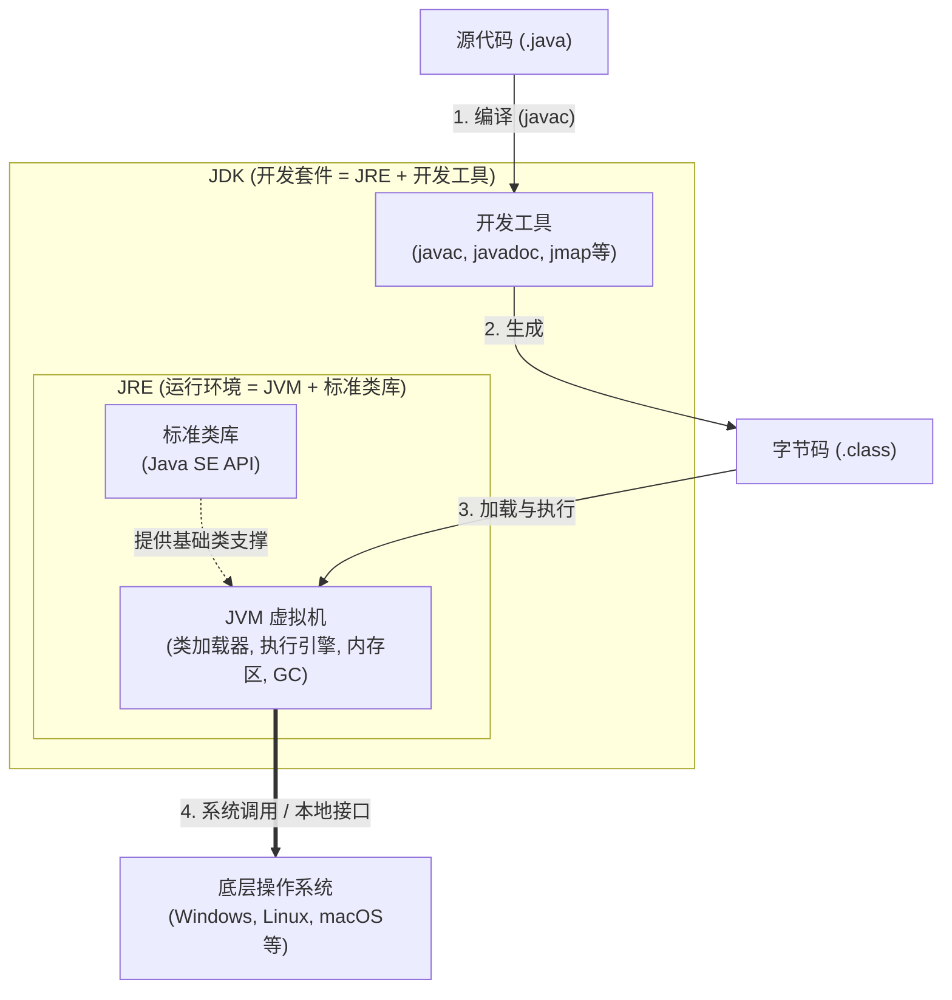

# Java学习笔记

## 目录
1. [背景](#背景)
1. [Java SE 基础](#java-se-基础)
1. [开发框架](#开发框架)
1. [中间件与数据](#中间件与数据)

---

<details>
<summary>定位、学习路线</summary>

1. 这份笔记面向“前端转全栈 Java”的学习场景（与js一致的就没记录），目标不是研究 JVM 底层原理，而是先建立能做业务开发的知识骨架。

    - 第一阶段：会写 Java 基础语法，能看懂并修改常见后端代码。
    - 第二阶段：掌握 Spring Boot + MyBatis + MySQL，能独立完成基础 CRUD 接口。
    - 第三阶段：补 Redis、消息队列、JVM、并发、性能调优等进阶内容。

    <details>
    <summary>学习资源</summary>

    1. 视频

        1. 快速入门：[系列·狂神说Java系列（排序完毕）](https://space.bilibili.com/95256449/lists/393820?type=series)
        1. Java 基础：[【零基础 快速学Java】韩顺平 零基础30天学会Java](https://www.bilibili.com/video/BV1fh411y7R8)
        1. 补深度：[尚硅谷最新Java学习路线（AI赋能全新升级）](https://www.bilibili.com/opus/369163743450531164)
    1. 文本

        1. [廖雪峰：Java教程](https://liaoxuefeng.com/books/java/introduction/index.html)
    </details>
1. 学习路线

    推荐按下面顺序学习，不要一开始就陷入源码、JVM 参数、微服务治理这类细节。

    1. Java SE 基础
    2. Maven
    3. MySQL
    4. Spring / Spring Boot
    5. MyBatis
    6. Redis
    7. 消息队列
    8. 并发、JVM、性能优化

    前端转 Java 时，最容易卡住的点通常不是语法，而是下面三件事：

    - 类型系统更严格，编译期约束更多。
    - 后端代码更强调分层、事务、数据一致性。
    - 工程启动、依赖管理、数据库与中间件的协作成本更高。

</details>

### 背景
#### Java 版本
- 1.2 以前通常叫 JDK（Java Development Kit）。
- 1.2 到 1.4 常见叫法是 J2SE（Java 2 Platform, Standard Edition）。
- Java 5 以后统一叫 Java SE（Java Platform, Standard Edition）。
- 日常说版本时，Java SE 8 / Java 8 / JDK 8 / JDK 1.8 通常指同一代（2014年）。

    下载地址：[Java SE 8 Archive Downloads (JDK 8u202 and earlier)](https://www.oracle.com/java/technologies/javase/javase8-archive-downloads.html)、[Java SE 8 Archive Downloads (JDK 8u211 and later)](https://www.oracle.com/java/technologies/javase/javase8u211-later-archive-downloads.html)（[Java downloads](https://www.oracle.com/java/technologies/downloads/)、[Java Archive](https://www.oracle.com/java/technologies/downloads/archive/)）

    >JDK 8u202解析：`8`代表主版本号，也就是 Java 8（在早期命名规范中也叫 JDK 1.8）。`u`是 Update（更新） 的缩写。`202`是更新的序号。代表这是 Java 8 发布的第 202 个更新版本。Oracle 会定期发布这些 Update，主要包含安全漏洞修复、Bug 修复以及一些微小的性能调优，不涉及语法层面的大改动。
- Java 9 起主版本号不再写成 `1.x`，而是直接使用 9、10、11、17、21 这种形式。

#### Java 平台家族
- **Java SE**：标准版，核心语法、集合、IO、并发等都在这里。
- **Java EE（Java Enterprise Edition） / Jakarta EE**：企业级规范体系，现已演进为 Jakarta EE。
- **Java ME**（Java Micro Edition）：面向早期嵌入式/移动设备，现在基本不是主流。

#### JDK、JRE、JVM
- **JDK**：开发套件，包含 JRE 和 `javac`、`jar`、`javadoc` 等工具。
- **JRE**（Java Runtime Environment）：运行环境，包含 JVM 和标准类库。
- **JVM**（Java Virtual Machine）：负责加载并执行 `.class` 字节码。



#### Java 的核心优势
- 跨平台：同一套字节码可以运行在不同平台的 JVM 上。
- 工程生态成熟：框架、数据库驱动、中间件集成非常完善。
- 垃圾回收：不需要像 C/C++ 那样手动管理内存。
- 稳定：在企业级业务系统里长期被验证。

>- “三高”是什么
>
>    - **高并发**：同一时间处理大量请求的能力。
>    - **高性能**：单机延迟和吞吐表现好。
>    - **高可用**：服务故障时仍能持续对外提供服务。
>
>“三高”主要是系统设计问题，语言和框架只是基础条件，不是全部答案。

### Java SE 基础
#### 入门与环境
- 安装 JDK、Maven，并配置 `JAVA_HOME`、`PATH`。

    下载安装JDK、Maven，并配置环境变量。e.g. `~/.zshrc`：

    ```text
    # JDK版本
    export JAVA_HOME=/Library/Java/JavaVirtualMachines/jdk1.8.0_191.jdk/Contents/Home
    export PATH=$JAVA_HOME/bin:$PATH

    # Maven版本
    export M2_HOME=/usr/local/apache-maven-3.9.14
    export PATH=$M2_HOME/bin:$PATH
    ```
- 初学期建议先用 LTS 版本；老项目常见 Java 8，新项目常见 Java 17/21。

- `javac 文件.java` → `类名.class`，编译为字节码；运行 `java 类名`（不写 `.class`）后，由 JVM 解释执行或经 JIT 编译为机器码，再交给 CPU 执行。

    >字节码是源代码经过编译器编译生成的，但它并不直接运行在物理硬件上，而是运行在虚拟机上。虚拟机会解释执行字节码指令，并将其转化为机器码让CPU实际执行。

    >可通过 `java 类名 参数1 参数2` 向 `main` 传入命令行参数，如：`public class 类名 { public static void main(String[] args) {} }`。`main` 方法需满足标准签名（含 `String[] args` 形参），因为 JVM 启动程序时会按该签名传递参数。
- `public` 顶级类的类名必须与文件名一致；一个 `.java` 文件最多只能有一个 `public` 顶级类。

#### 基础语法
##### 强类型
- Java 是强类型语言，变量声明必须有确定类型。
- 小范围数值类型可以向大范围类型隐式转换。
- 反向收窄转换需要显式强转，并可能丢失精度或溢出。
- `boolean` 不能与数值类型互转。

<details>
<summary>e.g.</summary>

```java
int a = 10;
double b = a; // int→double：隐式拓宽（按拓宽顺序：byte/short/char→int→long→float→double）
int c = b; // 反过来不行。编译错误：double→int 不能隐式收窄，需 (int)
int c1 = (int) b; // 强制收窄：小数部分截断，非四舍五入
long L = a; // int→long：隐式拓宽
float F = a; // int→float：隐式拓宽（可能损失整数精度，大 int 时明显）
double D = F; // float→double：隐式拓宽
char ch = 'A';
int chAsInt = ch; // char→int：隐式拓宽，得到 Unicode 码点
byte bt = (byte) a; // int→byte：必须强制；超范围时按低位截断
short sh = (short) 32768; // 字面量默认 int，赋给 short 需强制，值溢出则按位模式截断
double expr = a + 1.0f; // 二元运算数值提升：int 与 float/double 运算时先提升到较宽类型再算
// String.valueOf 不是 (T)x 语法，是方法调用，把基本类型格式化成字符串。
String s = String.valueOf(a);
String s1 = (String) a; // 编译错误：基本类型不能 (String) 强转
// char→String 用 String.valueOf(ch) 或 "" + ch 或 Character.toString(ch)，不能 (String)ch。
```
</details>

##### 数据类型
Java 的数据类型分为 基本类型（Primitive Types） 和 引用类型（Reference Types）。

1. 基本类型一共 8 种：

    | 类型     | 大小 | 成员变量默认值 | 取值范围                       | 说明     |
    | ------- | ---- | ------------ | ---------------------------- | ------- |
    | `byte`    | 1字节 | 0        | -128 ~ 127                     | 整数型   |
    | `short`   | 2字节 | 0        | -32,768 ~ 32,767               | 整数型   |
    | `int`     | 4字节 | 0        | -2,147,483,648 ~ 2,147,483,647 | 整数型（最常用） |
    | `long`    | 8字节 | 0L       | -2^63 ~ 2^63-1                 | 整数型 |
    | `float`   | 4字节 | 0.0f     | ~1.4E-45 ~ 3.4E+38             | 浮点型（单精度） |
    | `double`  | 8字节 | 0.0d     | ~4.9E-324 ~ 1.8E+308           | 浮点型（双精度） |
    | `char`    | 2字节 | '\u0000' | 0 ~ 65535（UTF-16 代码单元）     | 字符型   |
    | `boolean` | 未规定 | false    | true / false                   | 布尔型   |

    - 上表的默认值只适用于实例变量、静态变量、数组元素，局部变量必须先初始化。
    - 浮点数有精度问题，金额计算优先用 `BigDecimal`。
    - `char` 不等于“任意一个 Unicode 字符”，因为有些字符需要两个 UTF-16 代码单元表示。单引号是char，双引号是String。
    - 经过运算符后的类型变化（表达式里会先做数值提升，再计算）：

        - **二元数值提升**：两个数值操作数做二元运算时，Java 会先把两边提升到同一种类型再计算；规则是 `double` > `float` > `long` > `int`，`byte` / `short` / `char` 都会先变成 `int`。
        - **先记 2 条总规则**：

            - `byte` / `short` / `char` 参与大多数算术运算时，都会先提升为 `int`。
            - 表达式结果通常看“参与运算时最宽的数值类型”：`double` > `float` > `long` > `int`。
        - **一元运算** `+`、`-`、`~`：`byte` / `short` / `char` → `int`；`long` / `float` / `double` 保持原类型。
        - **二元算术 / 整型位运算** `+`、`-`、`*`、`/`、`%`、`&`、`|`、`^`：先做二元数值提升，再得到结果类型。
        - **比较运算** `<`、`>`、`<=`、`>=`、`==`、`!=`：两个都是数值基本类型时，也会先做二元数值提升；`boolean` 只能和 `boolean` 比较。
        - **位移运算** `<<`、`>>`、`>>>`：左右两边先做一元数值提升；结果类型看左操作数提升后的类型。
        - **复合赋值** `+=`、`-=` 等：先按普通运算计算，再隐式转换为左值类型；普通 `=` 不会自动做这种窄化转换。
        - **字符串拼接**：只要一侧是 `String`，`+` 就表示字符串拼接，结果一定是 `String`；`boolean` 不能参与数值运算（可以参与字符串拼接）。

        <details>
        <summary>e.g.</summary>

        ```java
        byte b1 = 1;
        byte b2 = 2;
        int r1 = b1 + b2;      // byte + byte -> int
        // byte r2 = b1 + b2;  // 编译错误，结果是 int，不能直接赋给 byte

        short s1 = 3;
        int r3 = -s1;          // 一元 - 后结果是 int

        char c = 'A';
        int r4 = c + 1;        // char 先提升为 int，结果是 66

        long l = 1L;
        long r5 = l + 2;       // int 与 long 运算，结果是 long

        float f = 1.5f;
        float r6 = f + 2;      // int 与 float 运算，结果是 float

        double d = 3.14;
        double r7 = d + f;     // float 与 double 运算，结果是 double

        int r8 = 5 / 2;        // 结果是 2，两个 int 相除仍是 int
        double r9 = 5 / 2.0;   // 有 double 参与，结果是 2.5

        byte b3 = 1;
        b3 += 1;               // 等价于 b3 = (byte)(b3 + 1)，会隐式转换为 byte
        // b3 = b3 + 1;        // 编译错误，b3 + 1 的结果是 int，普通 = 不会自动窄化为 byte

        String str = "sum=" + b1 + b2;    // "sum=12"
        String str2 = "sum=" + (b1 + b2); // "sum=3"
        ```
        </details>
2. 引用类型包括：

    - 类（Class）

        - 枚举（Enum）
        - 字符串（String）
    - 接口（Interface）

        - 注解（Annotation）
    - 数组（Array）
    - 类型变量（泛型形参，如 T、E）

    引用类型变量中保存的是对象引用，值要么是 `null`，要么指向某个对象。

    ```java
    String s = "abc";
    int[] arr = new int[5];
    ```

##### 先掌握这些基础语法
- 变量：类变量（`static`）、实例变量、局部变量

    变量必须先声明类型，再使用。判断变量和堆/栈的关系，先看它**声明在哪里**，再看它保存的是**基本类型值**还是**引用**。

    1. 局部变量（Local Variable）

        >变量位置：当前方法调用的**栈帧（Stack Frame）** 中。

        定义在方法里、参数列表里、或代码块里。

        ```java
        public void test() {
            int count = 0; // 局部变量
        }
        ```

        - 局部变量没有默认值，必须先赋值再读取。
        - 作用域通常只在当前方法或当前代码块内。
        - 如果是基本类型，值在栈帧里；如果是引用类型，引用在栈帧里，引用指向的对象仍在堆里。
    1. 实例变量（Instance Variable）

        >变量位置：跟随对象存放在**堆（Heap）** 中。

        定义在类里、方法外，不加 `static`。

        ```java
        public class User {
            String name; // 实例变量
            int age;     // 实例变量
        }
        ```

        - 属于对象；每 `new` 一个对象，就有自己的一份。
        - 有默认值：整数是 `0`，浮点数是 `0.0`，`boolean` 是 `false`，引用类型是 `null`（java里面没有 ~~`undefined`~~）。
        - 如果字段是基本类型，值直接在堆里的对象内部；如果字段是引用类型，对象内部保存引用，引用再指向另一个堆对象或 `null`。
    1. 类变量（Class Variable / Static Variable）

        >变量位置：类级共享，不在每个对象里，也不是方法栈里的局部变量。

        定义在类里、方法外，并且带 `static`。

        ```java
        public class User {
            static int total = 0; // 类变量
        }
        ```

        - 属于类本身，不属于某个对象。
        - 所有对象共享同一份类变量。
        - 如果是引用类型静态变量，静态变量保存引用；被引用的对象通常在堆里。

    前端可先这样理解：局部变量像函数内部的临时变量；实例变量像每个对象自己的属性；类变量像所有实例共享的一份状态。

    >局部变量没有默认值；成员变量（实例变量、类变量）有默认值。

    1. 数组是个“例外”吗？

        其实不是。如果你在方法里定义一个数组：

        ```java
        public void test() {
            int[] nums = new int[5]; // nums 是局部变量，必须初始化（new）
            System.out.println(nums[0]); // 此时输出 0
        }
        ```
        - 解释：

            - `nums` 这个变量本身在**栈**里，你必须用 `new` 赋值给它，否则不能用。
            - 但 `new int[5]` 创建的那个数组实体在**堆**里。
            - 因为数组实体在堆中，所以数组内部的元素（`nums[0]` 等）会自动获得默认值 `0`。

    1. 栈与堆（理解变量时够用版）

        先分清 3 个概念：

        - **变量**：一块可读写的存储位置；变量在哪里，主要看声明位置。
        - **引用**：指向对象的值；引用可以存在栈里，也可以存在堆里的对象字段或数组元素里。
        - **对象 / 数组本体**：`new` 出来的实体；通常在堆里。

        | 写法 | 变量/值在哪里 | 对象本体在哪里 |
        | --- | --- | --- |
        | `int a = 1;`（方法内） | `a` 的值在栈帧 | 没有对象 |
        | `User u = new User();`（方法内） | `u` 这个引用在栈帧 | `new User()` 在堆 |
        | `class User { int age; }` | `age` 跟随 `User` 对象在堆里 | `User` 对象在堆 |
        | `class User { String name; }` | `name` 这个引用在堆里的 `User` 对象内部 | `String` 对象在堆中；字面量通常来自字符串池 |
        | `int[] nums = new int[5];`（方法内） | `nums` 这个引用在栈帧 | 数组对象在堆，`nums[0]` 也在数组对象内部 |
        | `static int total;` | 类级共享，不随对象复制，也不是局部栈变量 | 没有对象 |

        | 对比项 | 栈（JVM Stack） | 堆（Heap） |
        | --- | --- | --- |
        | 归属 | 线程私有 | 线程共享 |
        | 存放 | 方法调用产生的栈帧；栈帧里有局部变量表、操作数栈等 | `new` 出来的对象、数组；对象里的实例字段、数组元素 |
        | 生命周期 | 方法调用入栈，方法结束出栈 | 对象不再被可达引用指向后，等待 GC 回收 |
        | 常见错误 | 递归太深等导致 `StackOverflowError` | 对象太多或太大导致 `OutOfMemoryError` |

        - 方法参数本质上也是局部变量：基本类型参数拷贝值，引用类型参数拷贝引用；Java 只有值传递。
        - 多个引用变量可以指向同一个堆对象；通过任意一个引用修改对象字段，其他引用看到的是同一个对象状态。
        - 栈负责“方法正在怎么执行”，堆负责“对象还活不活”；变量名本身主要是编译期概念，运行时看的是栈帧槽位和堆对象。
        - JVM 可能通过逃逸分析做优化（如标量替换），但不改变 Java 语义；初学按“局部变量看栈，`new` 对象看堆，字段跟对象走”理解即可。

        ```java
        class User {
            int age;       // 实例字段：值在堆里的 User 对象内部
            String name;   // 实例字段：引用在堆里的 User 对象内部
            static int total; // 静态字段：类级共享，不属于某个 User 对象
        }

        public void test() {
            int x = 18;            // x 的值在当前栈帧
            User u = new User();   // u 这个引用在栈帧；new User() 对象在堆
            u.age = 20;            // age 的值在堆里的 User 对象内部
            u.name = "Tom";        // name 引用在 User 对象内部，"Tom" 通常来自堆中的字符串池
        }
        ```

    **一句话总结：** 方法内的局部变量和参数看栈；`new` 出来的对象、数组看堆；实例字段跟对象走；`static` 字段跟类走。
- 常量：`final`
- 关键字修饰符

    出现在类型（或方法返回值类型）**之前**的**关键字修饰符**按声明位置不同而不同；常见全集如下（同一条声明里可组合，但受语法限制）：

    - **访问控制**：`public`、`protected`、`private`（不写则为包访问，无关键字）
    - **通用**：`static`、`final`
    - **仅类 / 接口 / 方法**：`abstract`
    - **仅方法**：`synchronized`、`native`、`strictfp`（`strictfp` 自 Java 17 起已弃用）
    - **仅字段**：`transient`、`volatile`
    - **接口实例方法**：`default`
    - **封闭类型（Java 17+）**：`sealed`、`non-sealed`，以及类头上的 `permits` 子句

    说明：局部变量只有 `final`（以及 `var` 推断类型，但 `var` 不算修饰符）；注解 `@…` 可写在修饰符前，但不算上述关键字修饰符。模块上的 `open` 等属于模块声明，不是成员/局部上的修饰符。
- 包机制

    包可以理解为 Java 的命名空间和目录组织方式，用来组织代码、避免同名冲突，并配合访问控制限制可见范围。

    ```java
    package com.example.demo.service; // package 只写包名；import 才写具体类名或 *
    ```

    - 核心规则：

        - `package` 写在源文件顶部（注释后、`import` 前）；一个 `.java` 文件最多声明一个包。
        - 顶级类声明（如 `public class 类名 {}`）写在 `package`、`import` 之后。
        - `package` 只写包名，不写类名。
        - 包名通常全小写，常见写法是公司域名倒置，如 `com.baidu.project`。
        - 包路径通常与目录结构一致，如 `com.example.demo.service` 对应 `com/example/demo/service`。
        - 不写 `package` 就是默认包；练习代码可以用，正式项目一般不要用。
    - `import` 规则：

        - 使用其他包下的类型且不写全限定名时，通常需要 `import`。
        - `java.lang` 下的类默认导入，如 `String`、`System`。
        - 同包下的类型可直接使用，不需要 `import`。
        - 也可以直接写全限定类名（FQN, Fully Qualified Name），如 `java.util.List`。
        - `import com.example.*;` 只导入当前包下的类型，不会导入子包。

            >`import com.example.*;` 不会把 `com.example.service.UserService` 一起导入。

        - `import` 只是简化类名书写，不会因为写了 `import` 就提前加载整个包或类；类加载由实际使用、反射、初始化等触发。

            >`import` 是编译期语法，作用是把冗长的全限定类名简化为简单类名；它不像 JS 的 `import` 那样执行模块加载。
        - `import 包.类;`、`import 包.*;`、`import static 包.类.静态成员;`、`import static 包.类.*;`（导入所有静态成员，导入后可直接写成员名）
        - 除 `java.lang.*` 外，其他标准库包通常也要显式 `import`。
        - 名称解析优先级（从高到低）：同包类型可直接用 -> 显式`import 具体类` -> 通配符`import ...*` -> `java.lang.*` 还会自动参与解析。

            >同包类型和显式 `import 具体类` 最明确；通配符 `import ...*` 与 `java.lang.*` 出现同名类型时可能产生歧义。
        - 如果两个包里有同名类，`import` 不能消除歧义，冲突时必须写全限定名。
    - 和访问权限的关系：

        - `public`：任何包都能访问。
        - 不写修饰符：只有同包可访问，叫包访问权限（package-private）。
        - `protected`：同包可访问；跨包时只有子类可访问。
        - `private`：只有当前类内部可访问。
    - 实际项目通常会按包分层，例如 `controller`、`service`、`mapper`、`entity`、`config`、`util`。
    - 常见坑：

        - 目录结构和 `package` 声明不一致，容易导致编译或 IDE 识别异常。
        - 默认包中的类不能被其他包 `import`。
        - 子包不是父包的一部分，`com.example` 和 `com.example.service` 是两个不同的包。

- Javadoc

    >类似于“去掉了 {type} 标注的 JSDoc”

    类型来自 Java 本身，注释只是补充说明

    - `javadoc 文件.java`生成文档
- 增强 `for`（for-each）：`for (元素类型 元素名 : 遍历对象) { ... }`

    - 元素类型：与元素实际类型一致，或其父类型/接口。
    - 遍历对象：数组，或实现 `Iterable` 的集合（如 `List`、`Set`）。
    - 常见纠错：`Map` 不能直接 for-each，通常遍历 `entrySet()` / `keySet()` / `values()`。
- 方法

    方法就是“把一段逻辑封装起来，之后可以重复调用”。

    `可选修饰符 返回值类型 方法名(参数类型 参数名, ...) { 方法体 }`

    - 返回值类型写 `void` 表示没有返回值。
    - 有返回值的方法必须返回与声明类型兼容的值。
    - 参数列表里要同时写“类型 + 参数名”。

    - Java 参数传递一律是值传递：

        - 传基本类型：传的是值本身。
        - 传引用类型：传的是引用值的副本，不是对象拷贝。

    - 重载（Overload）：同一个类中，方法名相同且参数列表不同（参数个数、类型或类型顺序不同）。

        ```java
        int sum(int a, int b) { return a + b; }
        int sum(int a, int b, int c) { return a + b + c; }
        ```

        仅返回值类型不同，不算重载。

        仅访问修饰符不同，不算重载。
    - 可变参数：`类型... 变量名`（`...`前后都可以加空格）

        ```java
        int sum(int... nums) {
            int total = 0;
            for (int num : nums) {
                total += num;
            }
            return total;
        }
        ```

        - 一个方法最多只能有一个可变参数。
        - 可变参数必须放在最后。
        - 调用时可传 `0..N` 个同类型实参，也可传同类型数组。
- 数组

    数组用于存放“一组相同类型的数据”。

    1. 声明

        推荐写法：`int[] nums`。`int nums[]`也合法但不推荐。
    1. 初始化

        >初始化指第一次赋值；赋值是更大的概念，包含初始化和后续重新赋值。

        1. 动态初始化：只给长度，元素使用默认值。

            ```java
            int[] nums = new int[3]; // [0, 0, 0]
            ```

        >同一个 `new` 表达式里，不能既写长度又写初始化列表，如 ~~`new int[3]{1, 2, 3}`~~ 非法。

        2. 静态初始化：直接给内容。

            ```java
            int[] nums1 = {10, 20, 30};
            int[] nums2 = new int[]{10, 20, 30};
            ```
        - 声明与赋值分开时，右侧必须使用`new 类型[]{...}`，不能只写 ~~`{...}`~~

            ```java
            int [] num1;
            num1 = new int[]{10, 20, 30}; // ✅
            num1 = {10, 20, 30}; // ❌
            ```
    1. 访问和修改

        ```java
        int[] nums = {10, 20, 30};
        System.out.println(nums[0]); // 10
        nums[1] = 99;                // 修改第二个元素
        ```

        - 数组下标从 `0` 开始。
        - 最后一个下标是 `length - 1`。
        - 越界会报 `ArrayIndexOutOfBoundsException`。
    1. 长度

        数组长度固定，创建后不能改；通过 `.length` 获取长度。

        ```java
        int[] nums = {10, 20, 30};
        System.out.println(nums.length); // 3
        ```

    遍历数组最常见两种写法：

    ```java
    int[] nums = {10, 20, 30};

    for (int i = 0; i < nums.length; i++) {
        System.out.println(nums[i]);
    }

    for (int num : nums) {
        System.out.println(num);
    }
    ```

    - 多维数组

        `int[][][] a = { { { 1, 2 } }, { { 3, 4 } } };`

    - 稀疏数组

        稀疏数组不是 Java 内置类型，而是一种压缩存储思路：当二维数组中大部分元素都是默认值（如 `0`）时，只保存有意义的数据。

        常见表示方式是 `int[][] sparse`，每行 3 列：`行下标`、`列下标`、`值`。通常第 0 行保存原数组信息：`总行数`、`总列数`、`有效值个数`。

        ```java
        int[][] sparse = {
            {11, 11, 2},
            {1, 2, 1},
            {2, 3, 2}
        };
        /*
        原数组是 11 行 11 列，一共有 2 个非 0 值
        这 2 个值分别在：
        array[1][2] = 1
        array[2][3] = 2
        其他位置默认都是 0
        */
        ```

- 面向对象：封装、继承、多态

    >OO = Object-Oriented，面向对象（一种思想/范式）；OOP = Object-Oriented Programming，面向对象编程

- 抽象类、接口、枚举
- 异常处理：`try-catch-finally`、`throws`

#### 常用 API 与进阶
业务开发里最常用的一批内容：

- `String`
- 日期时间 API
- 集合类：`List`、`Set`、`Map`
- 泛型
- 注解
- IO 流
- 反射
- 多线程基础

### 开发框架
#### 构建与依赖
- **Maven**：最常见的 Java 项目构建与依赖管理工具。

    1. ide配置Maven：

        1. 运行路径（如：cursor配置`/usr/local/apache-maven-3.9.14/bin/mvn`、IDEA配置`/usr/local/apache-maven-3.9.14`）
        2. 用户运行环境配置文件（如：`~/.m2/settings.xml`）

            >仓库地址（私服/镜像）、账号密码（私有仓库）、代理（proxy）、本地仓库路径。
    1. 项目内的pom.xml：项目级构建配置

        >依赖（dependencies）、构建流程（build）、插件（plugins）、模块结构（modules）。
    1. 配置文件（Profiles）选择配置

        >这个配置会设置在ide本地配置中（如：`.idea`或其他），注意跨设备跨应用不同步问题。
    1. 安装

        执行 Lifecycle（生存期）的`clean`、`install`（相当于`mvn clean install`），会按 Maven 生命周期运行到 `install` 阶段；其中 `install` 会把当前项目产物安装到本地仓库（根据 Maven 用户运行环境配置文件设置，默认 `~/.m2/repository`）。

        >1. `clean`：执行清理生命周期，通常会删除当前项目的 `target` 目录，清理上一次构建产物；不会删除本地仓库 `~/.m2/repository` 中的依赖。
        >1. `install`：执行默认生命周期直到 `install` 阶段（`validate`->`compile`->`test`->`package`->`verify`->`install`），并将当前项目产物安装到本地 Maven 仓库（默认 `~/.m2/repository`），供本机其他项目依赖。
        >
        >    同理，执行 `deploy` 就是执行默认生命周期直到 `deploy` 阶段：`validate`->`compile`->`test`->`package`->`verify`->`install`->`deploy`
        >1. `切换“跳过测试”模式`：切换 Maven 构建时是否跳过测试执行（Maven 生命周期的 `test` 阶段），类似 `mvn install -DskipTests`。

    >建议用ide的可视化操作（配置文件（Profiles）选择配置、编辑配置、安装、运行或调试）来代替mvn命令行，如：`mvn -U -pl 项目路径 -am clean install -P环境 -Dmaven.test.skip=true`、`mvn -f 项目路径/pom.xml spring-boot:run -P环境 -Dmaven.test.skip=true`

    1. `同步所有Maven项目`（或`重新加载所有Maven项目`）

        >1. `同步所有Maven项目`：让 IDE 按最新 `pom.xml` 重新导入 Maven 项目，更新模块结构、依赖、源码目录、资源目录、插件配置等信息。
        >1. `重新加载所有Maven项目`：通常与“同步所有Maven项目”作用接近，本质上都是让 IDE 重新读取所有 `pom.xml`，刷新 Maven 项目模型和依赖解析状态。
    - Maven 跨项目依赖通常认构建产物（jar），不是直接认另一个项目的源码；被依赖项目改动后，需要重新 `package` / `install`，或用 `-pl` / `-am` 放到同一次 reactor 构建里。

- **Gradle**：更灵活，Android 和部分现代项目里较常见。

>对于多数后端初学者，先掌握 Maven 即可。

#### Web 与持久层
- **Java Web**：Servlet、Filter、Listener 等传统 Web 基础。
- **Spring MVC**：处理 HTTP 请求、参数绑定、返回 JSON 等 Web 层能力。
- **MyBatis**：负责 SQL 映射和数据库访问。

可以简单理解为：

- Spring MVC 负责“接请求、回响应”
- MyBatis 负责“连数据库、执行 SQL”

#### Spring 全家桶
- **Spring Framework**：核心框架，提供 IoC、AOP、事务管理等能力。
- **Spring Boot**：在 Spring 基础上做自动配置，简化项目搭建和开发。

    启动标配：`@SpringBootApplication`（一个组合注解，主要包含：`@Configuration`、`@EnableAutoConfiguration`、`@ComponentScan`）

对业务开发来说，最重要的不是背概念，而是先理解常见分层：

- Controller：接收请求、返回响应
- Service：写业务逻辑
- Mapper / DAO：访问数据库

### 中间件与数据
#### MySQL
- 最常见的关系型数据库。
- 先掌握建表、增删改查、索引、事务，再谈性能优化。

#### Redis
- 常用作缓存，也可用于分布式锁、计数器、会话等场景。
- 要先理解缓存命中、过期、穿透、击穿、雪崩这些基础问题。

#### 消息队列
- **Kafka**：偏日志流、吞吐高，常用于异步削峰、流式处理。
- **RabbitMQ**：偏传统消息队列，路由能力更丰富，业务系统里也很常见。
