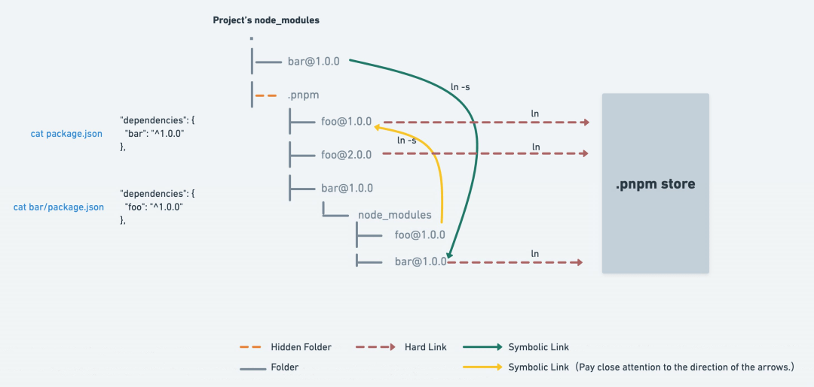
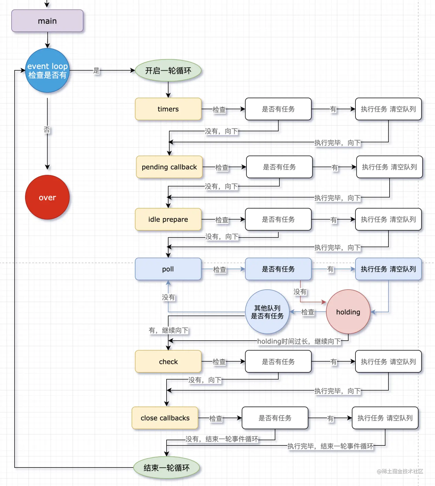

# Node.js学习笔记

## 目录
1. [安装](#安装)

    1. [nvm更新Node.js版本](#nvm更新nodejs版本)
    1. [n更新Node.js版本](#n更新nodejs版本)
1. [npm](#npm)

    1. [一个项目中同时安装、使用同个依赖包的不同版本](#一个项目中同时安装使用同个依赖包的不同版本)
    1. [依赖管理（npm、yarn、pnpm）](#依赖管理npmyarnpnpm)
1. [CommonJS规范](#commonjs规范)
1. [原理机制](#原理机制)

    1. [Node.js的运行机制](#nodejs的运行机制)
    1. [Node.js的`事件循环（event loop）`](#nodejs的事件循环event-loop)
    1. [特性](#特性)
    1. [Node.js核心模块（需要`require`引入）](#nodejs核心模块需要require引入)
    1. [Node.js全局变量](#nodejs全局变量)
    1. [Tips](#tips)
1. [工具使用](#工具使用)

    1. [Egg.js](#eggjs)
    1. [Koa](#koa)
    1. [express](#express)
    1. [pm2](#pm2)

---
## 安装

### nvm更新Node.js版本
1. macOS或Linux的[nvm](https://github.com/nvm-sh/nvm)：

    >若M1安装v15以下版本，建议终端打开[Rosetta模式](https://support.apple.com/en-hk/HT211861)：<https://github.com/nvm-sh/nvm/issues/2350>。

    ```shell
    nvm list-remote
    nvm install v新版本号
    nvm use v新版本号
    nvm alias default v新版本号

    nvm list
    nvm uninstall v旧版本号 # 若无法删除，则用管理员权限按要求设置文件夹权限，还可以去目录删除 /Users/「用户名」/.nvm/versions/node/v「版本号」
    ```

    >安装的全局软件包位置：`/Users/「用户名」/.nvm/versions/node/v「版本号」/lib/node_modules`
2. Windows的[nvm-windows](https://github.com/coreybutler/nvm-windows)：

    >安装nvm-windows时，需要删除原本安装在电脑上的Node.js。

    ```shell
    nvm node_mirror https://npmmirror.com/mirrors/node/    # 设置node源
    nvm npm_mirror https://npmmirror.com/mirrors/npm/      # 设置npm源

    nvm list available
    nvm install 新版本号
    nvm use 新版本号

    nvm list
    nvm uninstall 旧版本号      # 还可以再去目录中删除 C:\Users\「用户名」\AppData\Roaming\nvm\v「版本号」
    ```

>切换版本之后需重装Node.js的全局模块包。

### [n](https://github.com/tj/n)更新Node.js版本
>不支持Windows。

1. 安装

    ```shell
    npm install -g n

    # 或：brew、curl
    ```
2. 切换版本

    ```shell
    n ls


    # 安装最新的长期支持正式发布版本
    n lts

    # 安装最新正式发布版本
    n latest

    # 安装指定版本
    n 新版本号


    # 展示已经安装的版本，并选择使用哪个版本
    n


    # 删除指定版本
    n rm 旧版本号

    # 删除当前版本之外的所有版本
    n prune

    # 删除当前版本安装的node和npm
    n uninstall
    ```

---
### npm
npm（Node Package Manager）。

1. `npm`CLI

    >在任意命令后添加`-h`、`--help`查看当前命令的所有参数。在任意命令后添加`--verbose`查看完整日志；日志都可以在`~/.npm/_logs/`查看。

    1. 制作

        1. 登录

            `npm login`
        2. 初始化`package.json`

            `npm init/create/innit`

            - 修改初始化信息

                ```shell
                npm set init-author-name "名字"
                npm set init-author-email "邮箱"
                npm set init-license "MIT"
                ```

                >初始化信息会存放在`~/.npmrc`文件里。
        3. 调试开发

            `npm link`、`npm unlink`

            1. 仅本地

                1. 引用本地模块的仓库：`npm link 本地模块的路径`

                    - 取消：

                        引用本地模块的仓库：`npm unlink 模块名`
            2. 全局

                1. 本地模块：`npm link`

                    也支持bin。

                    - 取消：

                        本地模块：`npm unlink`
                2. 引用本地模块的仓库：`npm link 模块名`

                    - 取消：

                        引用本地模块的仓库：`npm unlink 模块名`
        4. 发布

            `npm publish [--tag <tag名，默认：latest>]`

            >1. 标签tag 和 版本号version关系：每次发布version需要设置tag，一个tag只对应一个version，tag指向最后发布到这个tag的version，可以删除tag（仅latest无法删除），version可以没有tag（tag被删除 或 被新的version设置同名tag）。
            >2. 注意：设置源为npm的网站（`https://registry.npmjs.org/`）才可以推送到官方npm。
        5. 「下线」

            >`npm unpublish [<@scope>/]<pkg>[@<version>]`只能下线24小时内发布的版本。

            `npm deprecate <pkg>[@<version>] <message>`
        6. 打印登录名

            `npm whoami`
        7. 登出

            `npm logout`
    2. 查看信息

        1. 查看模块官方信息

            `npm view [<@scope>/]<pkg>[@<version>] [<field>[.subfield]...]`

            - `npm view <pkg> versions`：展示所有版本
        2. 查看已安装的模块和依赖

            `npm list [[<@scope>/]<pkg> ...]`

            >仅查看顶层依赖：`npm list --depth=0`
        3. 查看已安装模块是否需要升级

            `npm outdated [[<@scope>/]<pkg> ...]`
        4. 查看、添加、删除 仓库的标签

            >latest标签无法删除，仅有latest标签对npm有特殊意义；标签名可以自定义，能够无限制地新增、删除；每个标签仅指向最后指向这个标签的版本号。

            ```shell
            npm dist-tag ls [<pkg>]                     # 打印所有标签
            npm dist-tag add <pkg>@<version> [<tag>]    # 把一个版本号 发布到一个标签
            npm dist-tag rm <pkg> <tag>                 # （发布）删除一个标签
            # 删除一个标签 或 其他版本号发布了同名标签，会导致原版本号不再拥有标签
            ```
    3. 安装

        >改变安装包的顺序会影响安装包的内容和依赖。

        - <details>

            <summary>手动安装npm自己</summary>

            1. 在本地Node.js同目录下创建目录`node_modules\npm`；
            2. 下载并解压<https://github.com/npm/cli/releases>至本地Node.js同目录下的`node_modules\npm`；
            3. 拷贝`node_modules\npm\bin`下面的`npm`、`npm.cmd`（、`npx`、`npx.cmd`）到本地Node.js同目录下。
            </details>

        1. 安装包

            安装的版本号受version和tag影响。安装到本地或全局的`node_modules`。全局安装会额外创建系统命令。

            1. 安装方式

                1. `npm install`安装所在目录的`package.json`文件描述内容

                    1. 最新（主版本号最新，第一个数）：

                        `*`、`x`
                    2. 次版本号最新（第二个数）：

                        `1`、`1.x`、`^1.2.3`
                    3. 补丁号最新（第三个数）：

                        `1.2`、`1.2.x`、`~1.2.3`
                    4. 确定的版本：

                        `1.2.3`

                    >`主版本号.次版本号.补丁号`，详细定义查看[Semantic](http://semver.org/lang/zh-CN/)。
                2. `npm install [<@scope>/]<name>[@<tag>]`

                    >- 若不确定安装具体版本号，则按下面的方式查找安装范围：
                    >
                    >    0. 除了latest标签，其他标签都不会默认被安装；无标签的版本号可以被默认安装。
                    >    1. 若范围内有latest标签，则使用latest标签的版本号。
                    >    2. 若范围内没有latest标签，则选用 无标签、且版本号满足<https://semver.org/lang/zh-CN/>的非先行版、且最后发布的版本号；
                    >    3. 若找不到满足前面要求的版本号，则安装报错。

                    1. 没有后缀，查找安装范围。
                    2. `@内容`

                        1. 具体版本号
                        2. 标签
                        3. 版本范围：`>`、`>=`、`<`、`<=` + 版本号，查找安装范围

                            >e.g. `npm install npm-devil@">=0.0.1 <0.0.5"`
                3. 参数

                    1. `--force`、`-f`：强制重新安装。

                        >当目录中已经存在指定模块，默认：不会重新安装已经安装的模块。或删除`node_modules`目录再重新安装。
                    2. `--save`、`-S`：安装信息保存到`package.json`的`dependencies`（执行时依赖插件）。
                    3. `--save-dev`、`-D`：安装信息保存到`package.json`的`devDependencies`（开发时依赖插件）。
                    4. `--save-optional`、`-O`：安装信息保存到`package.json`的`optionalDependencies`。
                    5. `--no-save`：不保存任何安装信息（不写入package.json、package-lock.json）。
            2. 作用域

                1. 本地：在本地被`require`引入后使用。
                2. 全局：在命令行中使用，或被全局命令引用。
        2. 升级

            `npm update [-g] [<pkg>...]`

            升级成功会把升级版本号自动写入`package.json`。

            >只更新顶层模块，而不更新依赖的依赖。可以使用`npm --depth 9999 update`更新依赖的依赖。

            - 升级npm自己

                1. macOS：`npm install -g npm`
                2. Windows：

                    >来自：[npm-windows-upgrade](https://github.com/felixrieseberg/npm-windows-upgrade)。

                    1. 以管理员身份运行[PowerShell](https://github.com/powershell/powershell)（Windows 7 SP1以上的系统自带）
                    2. 在PowerShell内执行

                        ```shell
                        Set-ExecutionPolicy Unrestricted -Scope CurrentUser -Force
                        npm install -g npm-windows-upgrade
                        npm-windows-upgrade
                        ```
        3. 卸载

            `npm uninstall [<@scope>/]<pkg>[@<version>]... [--save-prod|--save-dev|--save-optional] [--no-save]`
        4. 重装npm

            `curl -L https://www.npmjs.org/install.sh | sh`

            >若还是无法使用npm，建议重装Node.js。
        5. 验证缓存（垃圾收集不需要的数据、验证缓存的完整性）

            `npm cache verify`

            > - 除非回收磁盘空间，否则不要使用以下清空npm缓存
            >
            >    `npm cache clean -f`

        - `package-lock.json`

            更新成功（`npm update`）或第一次安装（`npm install`）时生成，用以记录当前状态下实际安装的各个npm包的具体来源和版本号。在存在此文件的根目录进行`npm install`，会按照完全相同的依赖关系进行安装。

            >1. 若使用lock机制，则应该将`package-lock.json`提交到版本控制。
            >2. 若不使用lock机制，则应该把`package-lock=false`加入`.npmrc`，并把`.npmrc`提交到版本控制。

            1. `version`：版本号
            2. `resolved`：软件包位置
            3. `integrity`：校验码
    4. 执行脚本

        1. `npm run 「package.json中scripts字段的命令」 -- 「添加脚本后面的参数」`

            非`-`开头的参数可以忽略`--`而传递。e.g. `npm run gulp runCss`等价于：`npm run gulp -- runCss`

            >执行的命令，优先找本地`node_modules/.bin`的命令，然后才找`$PATH`的命令（暂时未找到绕过**先找本地的**方法）。
        2. [npx](https://github.com/npm/npx)

            >1. 去`node_modules/.bin`路径检查命令是否存在，找到之后执行；
            >2. 找不到，就去环境变量`$PATH`里，检查命令是否存在，找到之后执行;
            >3. 还是找不到，自动下载一个临时的依赖包最新版本在一个临时目录，然后再运行命令，运行完之后删除，不污染全局环境。
        3. `npm exec`（类似npx）
        4. `npm init/create/innit <initializer>` 等价于 `npm init/create/innit create-<initializer>`：安装`create-<initializer>`后执行其主bin，类似`npm exec`或`npx`。

           ```shell
           npm init foo -> npm exec create-foo
           npm init @usr/foo -> npm exec @usr/create-foo
           npm init @usr -> npm exec @usr/create
           npm init @usr@2.0.0 -> npm exec @usr/create@2.0.0
           npm init @usr/foo@2.0.0 -> npm exec @usr/create-foo@2.0.0
           ```
   5. 对比

        [`npm diff --diff=「<pkg>@<version>或本地路径」 --diff=「<pkg>@<version>或本地路径」 [多个文件或文件夹]`](https://docs.npmjs.com/cli/commands/npm-diff)
2. [`package.json`](https://docs.npmjs.com/cli/v9/configuring-npm/package-json)字段

    包描述、说明文件。

    >npm、yarn、pnpm等，不同的包管理器配置不同。

    1. `name`

        仓库名。

        >组成：小写、无空格、字母数字下划线中划线。
    2. `version`

        版本号`x.x.x`。

        >`npm version [<newversion> | major | minor | patch | premajor | preminor | prepatch | prerelease | from-git]`更新`version`。
    3. `dependencies`

        生产环境依赖。

        >[node_modules 困境](https://zhuanlan.zhihu.com/p/137535779)。

        1. 安装依赖（`npm install`）是从（项目根目录）最外层往（引用处）最里层安装，若本层已经有同名但不同版本的库文件夹，则往里层尝试安装；
        2. 引用依赖是从（引用处）最里层往（项目根目录）最外层引用，一旦找到库目录就检索完毕。

        <details>
        <summary>e.g.</summary>

        1. 项目依赖逻辑：

            ```text
            .
            └── package.json
                .dependencies
                ├── A.v1
                |   .dependencies
                |   ├── B.v1
                |   ├── C.v1
                |   └── D.v1
                └── B.v2
                    .dependencies
                    ├── A.v2
                    └── C.v2
                        .dependencies
                        ├── A.v3
                        |   .dependencies
                        |   └── D.v1
                        └── D.v2
            ```
        2. `npm install`后的文件结构：

            ```text
            .
            ├── node_modules/
            |   ├── A.v1/
            |   |   └── node_modules/
            |   |       └── B.v1/
            |   ├── B.v2/
            |   |   └── node_modules/
            |   |       ├── A.v2/
            |   |       ├── C.v2/
            |   |       |   └── node_modules/
            |   |       |       └── A.v3/
            |   |       |           └── node_modules/
            |   |       |               └── D.v1/   # 注意，D.v1又安装了一遍
            |   |       └── D.v2/   # 注意，是C.v2引用D.v2，但安装在这里
            |   ├── C.v1/
            |   └── D.v1/
            |
            └── package.json
            ```
        </details>
    4. `devDependencies`

        开发、测试依赖。

        >- 何时不被安装：
        >
        >    1. 项目不会安装依赖库的`devDependencies`。
        >    2. `NODE_ENV`值为`production`时，项目不会安装自己的`devDependencies`。
        >
        >        >`export NODE_ENV=production;`。
        >    3. `npm install --production`不会安装自己的`devDependencies`。
    5. `peerDependencies`

        >本插件要使用的依赖库，但是本插件不去安装，要求宿主环境使用本插件时需要同时安装这些依赖库。

        在开发插件时，你的插件需要某些依赖的支持，但是你又没必要去安装，因为插件的宿主会去安装这些依赖。此时就可以用 peerDependencies 去声明一下需要依赖的插件和版本。如果出问题的话，npm 会有警告来提示使用者去解决版本中的冲突。
    6. `peerDependenciesMeta`

        配置`peerDependencies`行为的选项。
    7. `optionalDependencies`

        如果一个依赖关系可以被使用，但你希望npm在找不到它或安装失败的情况下继续进行，那么你可以把它放在optionalDependencies对象中。optionalDependencies中的条目会覆盖dependencies中同名的条目，所以通常最好只放在一个地方。
    8. `overrides`

        可以重写项目依赖的依赖，及其依赖树下某个依赖的版本号，进行包的替换。overrides 支持任意深度的嵌套。

        >如果在 yarn 里也想复写依赖版本号，需要使用 `resolution` 字段；在 pnpm 里复写版本号需要使用 `pnpm.overrides`或`pnpm.resolutions` 字段。
    9. `bundleDependencies`

        指定的包也将在发布或`npm pack`的时候一并被打包（当其他人使用这个包时，就可以直接使用打包在项目内的依赖，而不需要在通过包管理器去下载）。
    10. `main`

        代码入口，默认：`index.js`。

        >引用仓库的代码入口，不在引用链路内的仓库文件最终不会被使用到。

        - 其他非官方的代码入口（若不存在则退回`main`）：

            1. `module`：ES6 Module
            2. `unpkg`：`<script>`引用（针对[unpkg.com](https://unpkg.com/)）
            3. `jsdelivr`：`<script>`引用（针对[www.jsdelivr.com](https://www.jsdelivr.com/)）
    11. `browser`

        若是作用域浏览器客户端，则替代 ~~`main`~~ 使用。
    12. [`scripts`](https://npm.nodejs.cn/cli/using-npm/scripts)

        可执行脚本，用`npm run 脚本名`执行。

        - 钩子：`pre`（命令之前执行）、`post`（命令之后执行）、`prepare`、`dependencies`、等

            若执行时打印不出信息，则尝试执行时添加`--foreground-scripts`。[As of npm@7 these scripts run in the background. To see the output, run with: `--foreground-scripts`](https://docs.npmjs.com/cli/v10/using-npm/scripts#life-cycle-scripts).

    >`scripts`中命令能使用的环境变量：
    >
    >    1. `npm_package_多个名字`：可以拿到`package.json`里面的字段。e.g. `npm_package_version`、`npm_package_repository_type`等。
    >    2. `npm_config_名字`：可以拿到npm配置（`.npmrc`）。

    13. `config`

        配置仅`scripts`中命令能使用的环境变量，用法：`process.env.npm_package_config_键名`。

        ><details>
        ><summary>e.g.</summary>
        >
        >```js
        >// ./package.json
        >{
        >  "config" : { "xx" : "any thing" },
        >  "scripts" : { "start" : "node server.js" }
        >}
        >
        >
        >// ./server.js
        >console.log(process.env.npm_package_config_xx)
        >
        >
        >// 终端
        >$ npm run start
        >any thing
        >$ node server.js
        >undefined
        >```
        ></details>
    14. `files`

        将仓库作为依赖项安装时要包含的路径、文件的数组。
    15. `bin`

        `{ 新增的命令: 对应的可执行文件路径 }`
    16. `man`

        `man`说明文档路径。
    17. `directories: { bin: 路径, man: 路径 }`

        多命令、多说明文档。
    18. `engines`

        该仓库在哪个版本的Node.js（、npm、yarn、等）上运行。

        >e.g. `"engines": { "node": ">=0.10.3 <15" }`。
    19. `os`

        支持运行的操作系统。
    20. `cpu`

        支持运行的cpi架构。
    21. `private`

        设置为`true`，则无法`npm publish`，用于避免不小心公开项目。
    22. `publishConfig`

        发布时的配置（覆盖`.npmrc`）。
    23. `workspaces`

        工作区相关。
    24. `description`

        描述，也作为在npm官网被搜索的内容。
    25. `repository`

        仓库远程版本控制，可以是github等。

        ><details>
        ><summary>e.g.</summary>
        >
        >```json
        >"repository": {
        >    "type": "git",
        >    "url": "git@github.com:用户名/仓库名.git"
        >}
        >
        >// 针对Monorepo：
        >"repository": {
        >  "type": "git",
        >  "url": "https://github.com/用户名/仓库名.git",
        >  "directory": "packages/文件夹名"
        >}
        >```
        ></details>
    26. `keywords`

        在npm官网被搜索的关键字。
    27. `author`

        仓库作者。
    28. `contributors`

        仓库贡献者。
    29. `license`

        证书。
    30. `homepage`

        主页。
    31. `bugs`

        链接到软件包的问题跟踪器，最常用的是GitHub的issues页面。
    32. `funding`

        捐款。

    - 其他依赖库需要使用的特有属性，可以在相应的依赖库文档中找到如何使用它们：

        1. `eslintConfig`
        2. `babel`
        3. `browserslist`

            支持哪些浏览器（及其版本）。
        4. `gitHooks`
        5. `lint-staged`
        6. `sideEffects`

            >webpack
        7. `exports`
        8. `types`
        9. `jest`
        10. `husky`
        11. `「依赖库相关名字」`
3. 包的制作-使用

    1. 制作：

        按照CommonJS规范编写代码。
    2. 使用：

        1. 在Node.js环境下使用（`require`）

            >如：`vue-cli`。
        2. 在浏览器环境下使用

            1. 用打包工具（`webpack`、`browserify`、`rollup`）打包成能够在浏览器运行的JS代码。
            2. 直接制作可兼容在浏览器环境运行的代码。

            >如：`Vue.js`。
    - 作用域的包

        `@scope/project-name`
4. [`.npmrc`](https://docs.npmjs.com/cli/configuring-npm/npmrc)

    npm的配置文件，或全局修改：`npm config set xxx=yyy`（`npm config get xxx`查看`.npmrc`->全局；`npm config get xxx -g`查看全局）。

    >`npm config ls -l`查看所有已有配置和默认配置。

    - 常用：`package-lock`、`registry`、`audit`
    - 注释：`;`或`#`。
    - 优先级（降序）

        1. per-project config file (/path/to/my/project/.npmrc)
        2. per-user config file (~/.npmrc)
        3. global config file ($PREFIX/etc/npmrc)
        4. npm builtin config file (/path/to/npm/npmrc)
    - 针对部分配置名，在npm cli中用`--no-配置名`可以覆盖某个配置名的值

>项目中使用某个开源库时，要考虑它的License和文件大小（若使用webpack打包，则可以使用[webpack-bundle-analyzer](https://github.com/webpack-contrib/webpack-bundle-analyzer)进行分析）。

#### 一个项目中同时安装、使用同个依赖包的不同版本
>很容易导致ts类型的冲突，需要额外处理全局类型问题。

1. npm aliases（npm：6.9.0+）

    >[pnpm aliases](https://pnpm.io/zh/aliases)也类似。

    1. 安装带别名的指定仓库：

        `npm install 「别名」@npm:「[<@scope>/]<pkg>[@<version>]」 --save`
    2. 会写入package.json的依赖：

        ```json
        "dependencies": {
          "「别名」": "npm:「[<@scope>/]<pkg>[@<version>]」"
        }
        ```
    3. 使用时，根据「别名」进入指定的版本中
2. 发布一个其他依赖包，包含引用指定版本的目标依赖包，然后通过 其他依赖包+相对路径 引用

    >安装依赖（`npm install`）是从（项目根目录）最外层往（引用处）最里层安装，若本层已经有同名但不同版本的库文件夹，则往里层尝试安装。

    `"「其他依赖包」/node_modules/「目标依赖包」"`（若没有不同版本的同个依赖包，则路径错误）
3. （仅适合全新项目）Monorepo

    各子项目中的依赖互相隔离。

#### 依赖管理（npm、yarn、pnpm）
1. npm

    npm install：npm向registry查询模块压缩包的网址 -> 下载压缩包，存放在`~/.npm`目录 -> 解压压缩包到当前项目的node_modules目录。串行执行以上任务（慢）。

    1. npm@2-

        直接按照包依赖的树形结构下载填充本地目录结构，嵌套的node_modules结构（嵌套地狱）。
    2. npm@3+

        扁平化嵌套（副作用：~~不确定性~~、依赖分身、幽灵依赖）。尽量把依赖提升（hoist）到项目目录的node_modules（**幽灵依赖**），提升只能提升依赖的一个版本（不确定性，不确定提升哪个版本；之后`package-lock.json`解决，按照`package-lock.json`文件安装），后面再遇到相同包的不同版本，依然还是用嵌套的方式，可能相同版本在不同依赖位置嵌套安装多次（**依赖分身**）。

        >一些安装方式（可能与引用不同版本或循环引用之类的有关），会导致没有把依赖包安装到node_modules顶层，而是直接安装到嵌套的内部。尝试：`npm i npm-package-i@0.0.13 vue-eslint-parser@9.4.2`，然后观察`eslint-plugin-vue`被安装到了/node_modules/npm-package-i/node_modules/，而没有平铺在最外层。
2. yarn

    yarn install和npm install流程类似，但并行执行安装任务（快）。`yarn.lock`、扁平化（不同于npm，会把使用频率较大的版本安装到顶层目录），依然存在问题：幽灵依赖、依赖分身。

    >`yarn.lock`只包含版本锁定，并不确定依赖结构，需要结合`package.json`确定依赖结构。
3. pnpm

    pnpm install：项目直接依赖，作为软链接平铺安装在`./项目/node_modules` -> 真实依赖代码，从全局store硬链接到本地虚拟store（`./项目/node_modules/.pnpm`） -> 真实依赖内部 需要依赖其他仓库的，都通过 软链接 指向本地虚拟store。

    1. hard link（硬链接）

        全局store目录里存储依赖的hard links，所有项目都可以从全局store寻找到同一个依赖。不需要重复下载同一个包，只需要硬链接关联；一个包的不同版本也会用增量更新的方式维护多版本包。

        >hard links指通过索引节点来进行连接。在 Linux 的文件系统中，保存在磁盘分区中的文件不管是什么类型都给它分配一个编号，称为索引节点号(Inode Index)。在 Linux 中，多个文件名指向同一索引节点是存在的。比如：A 是 B 的硬链接（A 和 B 都是文件名`ln A B`），则 A 的目录项中的 inode 节点号与 B 的目录项中的 inode 节点号相同，即一个 inode 节点对应两个不同的文件名，两个文件名指向同一个文件，A 和 B 对文件系统来说是完全平等的。删除其中任何一个都不会影响另外一个的访问。
    2. symbolic link（软链接）

        >`ln -s A B`

        真实依赖内部 需要依赖其他仓库的 和 项目直接依赖，都通过 软链接 指向本地虚拟store（`./项目/node_modules/.pnpm`）。

    >硬链接+软链接：包安装速度极快、磁盘空间利用非常高效，解决了~~幽灵依赖~~、~~依赖分身~~问题。

    

    - 缺点：全局hard link，改了link的代码，所有项目都受影响（同一份代码）；不支持软链接的环境中，无法使用pnpm，如：Electron。

---
### [CommonJS规范](https://github.com/realgeoffrey/knowledge/blob/master/网站前端/JS模块化方案/README.md#commonjs规范)

---
## 原理机制

### Node.js的运行机制
1. [V8](https://v8.dev/)引擎（JS引擎）解析应用程序输入的JS脚本。

    >V8处理JS，除了 **正则表达式**、**JSON的处理** 之外，对于大部分操作都很快。
    >
    >1. 使用正则表达式时注意ReDoS（Regular expression Denial of Service，正则表达式拒绝服务攻击）风险。
    >2. `JSON.parse/stringify`随着输入参数线性增加执行时间。
2. 解析后的代码，能够与操作系统进行交互。

    >代码 -> Node.js内置模块 -> V8（internalBinding） -> C/C++ -> 操作系统
3. [libuv](https://github.com/libuv/libuv)负责Node.js的API的执行。将不同的任务分配给不同的线程，形成一个[Event Loop（事件循环）](https://github.com/realgeoffrey/knowledge/blob/master/网站前端/Node.js学习笔记/README.md#nodejs的事件循环event-loop)，以异步的方式将任务的执行结果返回给V8引擎。
4. V8引擎再将结果返回给应用程序。

>JS本身的`throw-try-catch`异常处理机制并不会导致内存泄漏，也不会让程序的执行结果出乎意料，但Node.js并不是存粹的JS。Node.js里大量的API内部是由C/C++实现，因此Node.js程序的运行过程中，代码执行路径穿梭于JS引擎内部和外部，而JS的异常抛出机制可能会打断正常的代码执行流程，导致C/C++部分的代码表现异常，进而导致内存泄漏等问题。


- <details>

    <summary><a href="https://nodejs.org/zh-cn/docs/meta/topics/dependencies/">Node.js依赖项</a></summary>

    1. 类库

        1. V8
        2. libuv
        3. llhttp
        4. c-ares
        5. OpenSSL
        6. zlib
    2. 工具

        1. npm
        2. gyp
        3. gtest
    </details>

### Node.js的`事件循环（event loop）`
与[浏览器的`事件循环（event loop）`](https://github.com/realgeoffrey/knowledge/blob/master/网站前端/JS学习笔记/README.md#浏览器的事件循环event-loop)类似。由libuv引擎实现。

```text
main
 ↓
                 # 宏任务                                               # 微任务（不是event loop）
                 ┌─────────────────────────────────┐                     process.nextTick
              ┌─>│  timers(setTimeout,setInterval) │                            ↓
              │  └─────────────┬───────────────────┘                          Promise
              │  ┌─────────────┴───────────────────┐
              │  │pending callbacks(OS,delayed I/O)│
              │  └─────────────┬───────────────────┘
              │  ┌─────────────┴───────────────────┐
              │  │   idle, prepare(Node.js core)   │
check         │  └─────────────┬───────────────────┘    ┌────────────┐
event loop ─→ │  ┌─────────────┴───────────────────┐    │ incoming:  │
              │  │           poll(a lot)           │<───┤connections,│
              │  └─────────────┬───────────────────┘    │ data, etc. │
              │  ┌─────────────┴───────────────────┐    └────────────┘
              │  │       check(setImmediate)       │
              │  └─────────────┬───────────────────┘
              │  ┌─────────────┴───────────────────┐
              └──┤         close callbacks         │
 ↓               └─────────────────────────────────┘
over
```

1. main

    启动入口文件，运行主函数。
2. event loop

    检查系统中是否有异步任务，决定是否进入事件循环。

    1. 6个队列，每个队列都需要 全部执行完毕整个队列 才会进入下一个队列。
    2. poll队列

        1. 若poll中没有回调函数需要执行（已是空队列），但（系统中）有异步任务，则会在这里等待其他队列中出现回调：

            0. 若poll出现新的回调函数，则执行直到poll为空队列，然后继续等待其他队列出现回调；
            1. 若其他队列中出现回调，则从poll向下执行队列check、close callbacks，之后进行新的event loop判断（判断是否有异步任务，有就继续新的event loop，没有就结束over）；
            3. 若Node.js线程一直holding在poll队列，等很长一段时间还是没有任务来临，则会自动断开等待（不自信表现），向下执行轮询流程，经过check、close callbacks后到达新的event loop判断；
        2. 若poll中没有回调函数需要执行（已是空队列），也没有异步任务，则向下执行轮询流程，经过check、close callbacks后到达新的event loop判断，判断没有异步任务，结束over。
3. over

    所有事情都完毕，也没有异步任务，结束。



4. 微任务

    **事件循环中，每执行一个回调之前，** 先按序清空`process.nextTick`、`Promise`。

    1. `process.nextTick`优先级最高（最快执行的异步函数）
    2. `Promise`

### 特性
1. 单线程

    ><details>
    ><summary>尽量不用同步方法，尽量不阻塞进程</summary>
    >
    >高开销的同步方法：
    >
    >1. `crypto`加密
    >
    >    1. `crypto.randomBytes`（同步版本）
    >    2. `crypto.randomFillSync`
    >    3. `crypto.pbkdf2Sync`
    >    - 同时你应当非常小心对加密和解密给予大数据输入的情况。
    >2. `zlib`压缩
    >
    >    1. `zlib.inflateSync`
    >    2. `zlib.deflateSync`
    >3. `fs`文件系统
    >4. `child_process`子进程
    >
    >    1. `child_process.spawnSync`
    >    2. `child_process.execSync`
    >    3. `child_process.execFileSync`
    ></details>

    不为单个客户端连接创建一个新的线程，而仅仅使用单一线程支持所有客户端连接。通过非阻塞I/O和事件驱动机制，让Node.js程序宏观上并行。

    1. 优点：没有线程创建、销毁的时间开销；不需维护多个线程耗费的内存，可同时处理更多的客户端连接；运行中的单线程CPU利用率饱和。
    2. 缺点：若单一客户端连接造成线程的阻塞或奔溃，则影响所有客户端连接。

    >事件循环不同于许多其他语言的模型，其它语言创建额外线程来处理并发工作：Java、PHP或.NET等服务器语言，会为每一个客户端连接创建一个新的线程或使用协程。
2. 非阻塞I/O

    回调函数异步执行，通过事件循环检查已完成的I/O进行依次处理。

    >1. 阻塞I/O、非阻塞I/O的区别：系统接收输入再到输出期间，能不能接收其他输入。
    >2. I/O主要指由[libuv](https://github.com/libuv/libuv)支持的，与系统磁盘和网络之间的交互。
    >3. 大多数Node.js核心API所提供的异步方法都遵从惯例：**错误信息优先**的回调模式（Error-first Callback，第一个参数是错误信息，若不报错则其值为`null`）。
    >
    >    `EventEmitter`类事件函数不属于此范畴。
3. 事件驱动

    用事件驱动（事件循环）来完成服务器的任务调度。

>1. Node.js开发应用程序：不善于计算，善于I/O（任务调度）。如：长连接的实时交互应用程序。
>2. Node.js服务器：没有根目录概念，没有web容器。URL通过顶层路由设计，呈递静态文件。
>3. 事件循环逻辑和触发JS时机都是由系统（C/C++）控制，在需要时才开启某个具体js调用栈。
>
>只有打通和后端技术的桥梁、实现互联互通，Node.js才能在公司业务中有更长远的发展。

### Node.js[核心模块](http://nodejs.cn/api/)（需要`require`引入）
>核心模块/内置模块 定义在[源代码的lib/文件](https://github.com/nodejs/node/tree/main/lib/)。同名加载时，核心模块优先级高于路径加载或自定义模块。可以使用`node:`前缀来识别核心模块（>=v16.0.0），在这种情况下它会绕过require缓存，不使用`node:`前缀就可以加载的核心模块列表暴露在`require('node:module').builtinModules`。

1. `http`：HTTP请求相关API

    1. 接口永远不会缓冲整个请求或响应，所以用户可以流式地传输数据。
    2. 为了支持所有可能的HTTP应用程序，Node.js的HTTP API都是非常底层的。

        它仅进行流处理和消息解析。它将消息解析为消息头和消息主体，但不会解析具体的消息头或消息主体。

    ><details>
    ><summary>e.g.</summary>
    >
    >1. Node.js原生处理POST/GET请求
    >
    >    ```js
    >    const http = require("http");
    >
    >    http
    >      .createServer((req, res) => {
    >        let body = "";
    >        req.on("data", (chunk) => {
    >          body += chunk.toString();
    >        });
    >        req.on("end", () => {
    >          // 接受完成
    >          const text = `收到${req.method}请求\nurl是：${req.url}${req.method === "POST" ? `\nbody是: ${body}` : ""}\n`;
    >          console.log(text);
    >          res.end(text);
    >        });
    >      })
    >      .listen(3000, "0.0.0.0");
    >    ```
    >2. Node.js原生发起POST请求
    >
    >    ```js
    >    const http = require("http");
    >
    >    const req = http.request(
    >      "路径",
    >      {
    >        method: "POST",
    >        headers: {
    >          "Content-Type": "application/json; charset=UTF-8",
    >        },
    >      },
    >      (res) => {
    >        res.setEncoding("utf8");
    >        let body = "";
    >        res.on("data", (chunk) => {
    >          body += chunk || "";
    >        });
    >        res.on("end", () => {
    >          // 响应接受完成
    >          console.log(body);   // body是GET/POST的响应内容
    >        });
    >      }
    >    );
    >
    >    req.on("error", (e) => {
    >      console.warn(e);
    >    });
    >
    >    req.write(JSON.stringify({ a: "发起的请求body" })); // 保证：发起请求的body和请求头匹配
    >    req.end();
    >    ```
    >3. Node.js原生发起GET请求
    >
    >    ```js
    >    const http = require("http");
    >
    >    const req = http.request(
    >      "路径",
    >      {
    >        method: "GET",
    >      },
    >      (res) => {
    >        res.setEncoding("utf8");
    >        let body = "";
    >        res.on("data", (chunk) => {
    >          body += chunk || "";
    >        });
    >        res.on("end", () => {
    >          // 响应接受完成
    >          console.log(body);   // body是GET/POST的响应内容
    >        });
    >      }
    >    );
    >
    >    req.on("error", (e) => {
    >      console.warn(e);
    >    });
    >
    >    req.end();
    >    ```
    ></details>
2. `http2`
3. `https`
4. `fs`：以标准POSIX函数为模型的方式与文件系统进行交互

    提供版本：异步、同步（+`Sync`）、基于Promise（`require("fs").promises`）。其他模块也类似。

    ><details>
    ><summary>e.g.</summary>
    >
    >```js
    >// 异步（结果在回调；若出错，则回调函数第一个参数不为null或undefined）
    >require('fs').rename('before.json', 'after.json', err => {
    >  if (err) {
    >    return console.error(err)
    >  }
    >  //完成
    >})
    >
    >
    >// 同步（阻塞线程，直到文件操作结束。结果在执行语句返回。需要try-catch等方式处理错误）
    >try {
    >  require('fs').renameSync('before.json', 'after.json')
    >  //完成
    >} catch (err) {
    >  console.error(err)
    >}
    >
    >
    >// Promise
    >require("fs").promises
    >  .rename("before.json", "after.json")
    >  .then((data) => {
    >    console.log('succeeded', data);
    >  })
    >  .catch((error) => {
    >    console.error('failed' ,error);
    >  });
    >```
    ></details>

    - 尽量选择使用**流**读写文件的内容

        >（不使用流的）读操作都会在返回数据之前将文件的全部内容读取到内存中，这意味着大文件会对内存的消耗和程序执行的速度产生重大的影响；（不使用流的）写操作都是在将全部内容写入文件之后才会将控制权返回给程序（在异步的版本中，这意味着执行回调）。

        - 导出文件需求：

            1. 后端返回json数据（无法利用流技术，只能完整保存在服务端内存中），前端根据数据生成文件并[创建下载](https://github.com/realgeoffrey/knowledge/blob/master/网站前端/JS方法积累/实用方法/README.md#原生js点击下载)。
            2. 后端直接返回文件，前端请求下载文件（get请求）

                1. 利用流技术，创建并保存文件在服务端；
                2. 利用流技术，把刚刚保存的文件传递给前端进行下载。
5. `events`：事件触发器

    >`EventEmitter`类：`require('events')`

    1. 所有能触发事件的对象都是`EventEmitter`类的实例。
    2. `EventEmitter`以注册的顺序同步地调用所有监听器。
6. `path`：处理文件路径

    >e.g. 当前文件所在目录的相对位置：`require('path').resolve(__dirname, '../../xx/xxx.txt')`
7. `stream`：数据流

    流是一种以高效的方式处理读/写文件、网络通信、或任何类型的端到端的信息交换。

    >e.g. 在传统的方式中，当告诉程序读取文件或通信时，这会将文件或信息从头到尾读入内存，然后进行处理。若使用流，则可以逐个片段地读取并处理（而无需全部保存在内存中），能够一边读取一边处理更加高效。

    1. 所有的流都是`EventEmitter`类的实例。
    2. Node.js提供了多种流对象（`fs`、`http`、`process`等都有流操作方式），除非要创建新类型的流实例，否则极少需要直接使用`stream`。
    3. 流类型：可读（Readable）、可写（Writable）、可读可写（Duplex）、可修改或转换数据（Transform）。

    >stream不需要手动创建缓冲区（buffer），在Node.js的流中将会自动创建。
8. `readline`：用于一次一行地读取可读流中的数据

>Buffer是数据以二进制形式临时存放在内存中的物理映射，stream为搬运数据的传送带和加工器，有方向、状态、缓冲大小。

9. `buffer`：缓冲区

    `Buffer`用于表示固定长度的字节序列。是JS`Uint8Array`的子类，并使用涵盖额外用例的方法对其进行扩展。

    >由于Buffer需要处理的是大量的二进制数据，假如用一点就向系统去申请，则会造成频繁的向系统申请内存调用，**所以Buffer所占用的内存不再由V8分配，而是在Node.js的C++层面完成申请，在JavaScript中进行内存分配。** 因此，这部分内存我们称之为堆外内存。
10. `string_decoder`：字符串解码器

    提供了用于将`Buffer`对象解码为字符串（以保留编码的多字节UTF-8和UTF-16字符的方式）的API。
11. `os`：提供了与操作系统相关的实用方法和属性
12. `util`：提供常用函数的集合，用于弥补核心JavaScript的功能过于精简的不足
13. `process`：进程

    `require("node:process") === process`
14. `child_process`：衍生子进程

    衍生的Node.js子进程独立于父进程，但两者之间建立的IPC通信通道除外。每个进程都有自己的内存，带有自己的V8实例。

    >由于需要额外的资源分配，因此不建议衍生大量的Node.js子进程。
15. `cluster`：集群（运行多个Node.js实例）

    创建共享服务器端口的子进程。为了充分利用多核系统，有时需要启用一组Node.js进程去处理负载任务。
16. `worker_threads`：工作线程（单个Node.js实例中并行运行多个应用程序线程）
17. `crypto`：加密

     OpenSSL的哈希、HMAC、加密、解密、签名、以及验证功能的一整套封装。
18. `zlib`：提供`Gzip、Deflate/Inflate、Brotli`的压缩功能

    >压缩和解压缩是围绕`stream`流API构建的。
19. `dgram`：数据报

    对UDP datagram sockets（UDP的数据报套接字）的一层封装。
20. `net`：用于创建基于流的TCP或IPC的服务器（`net.createServer`）与客户端（`net.createConnection`）
21. `dns`：解析域名
22. `url`：解析URL。
23. `querystring`：解析和格式化URL查询字符串
24. `tls`：实现安全传输层（TLS）及安全套接层（SSL）协议，建立在OpenSSL的基础上
25. `module`：模块

    提供几个对象属性。
26. `timers`

    >Node.js中的定时器函数实现了与网络浏览器提供的定时器API类似的API，但使用的是围绕Node.js事件循环构建的不同的内部实现。

    1. 定时器函数是全局的，所以不需要调用 ~~`require('node:timers')`~~ 来使用该API。
    2. 提供了一组可返回Promise对象的可供选择的定时器函数：`require('node:timers/promises')`。
27. `perf_hooks`：性能钩子

    实现w3c的Performance API的子类。
28. `assert`：断言
29. `repl`：REPL（交互式解释器）

    - 终端使用Node.js的REPL：

        1. `_`

            打印最后一次操作结果（不执行语句、没有副作用）。
        2. `.help`、`.editor`、`.break`、`.clear`、`.load`、`.save`、`.exit`
        3. 可以直接使用系统模块，不需要`require`引入。

            >e.g. REPL中`http === require('http')`。
30. `v8`：V8的api
31. `vm`：提供V8虚拟机上下文中进行编译和运行代码
32. `console`控制台

    `require("node:console").Console === console.Console`
33. `inspector`：与V8调试器交互
34. `tty`：终端

    >在大多数情况下，没有必要或不可能直接使用此模块。
35. C++相关

    1. C++ addons
    2. C/C++ addons with Node-API
    3. C++ embedder API

- Experimental功能

    1. `wasi`：实现WebAssembly系统接口规范
    2. `diagnostics_channel`：诊断通道
    3. `trace_events`：跟踪事件
    4. `async_hooks`：异步钩子去跟踪异步资源
    5. `Corepack`：管理包管理器的版本的工具
    6. `require('crypto').webcrypto`：实现Web Crypto API规范
    7. `require('stream').web`：网络流
    8. `test`：测试

- 弃用

    1. ~~`domain`~~
    2. ~~`punycode`~~

### Node.js[全局变量](http://nodejs.cn/api/globals.html)
Node.js的全局对象`global`是所有全局变量的宿主。

1. 仅在模块内有效

    1. `require`
    2. `exports`
    3. `module`
    4. `__filename`：当前正在执行的脚本所在文件夹的绝对路径+文件名。
    5. `__dirname`：当前正在执行的脚本所在文件夹的绝对路径。
2. `process`：描述当前Node.js进程状态的对象，提供了一个与操作系统的简单接口。

    1. `process.cwd()`：运行node命令时所在文件夹的绝对路径。
3. `Buffer`：二进制数据流。

    >虽然`Buffer`在全局作用域内可用，但仍然建议通过`import/require`语句显式地引用它：`const { Buffer } = require('node:buffer')`。

    可以将buffer视为整数数组：数组的每一项都是整数，并代表一个数据字节。
4. `setImmediate/clearImmediate`
5. 类似于浏览器的全局对象`window`所包含的全局变量

    1. `setTimeout/clearTimeout`、`setInterval/clearInterval`
    2. `console`
    3. `URL`、`URLSearchParams`
    4. `Error`

        >若在程序执行过程中引发了**未捕获的异常**或**未捕获的失败Promise实例**，则程序将崩溃。捕获未捕获的异常：
        >
        >1. 捕获未捕获的异常
        >
        >    ```js
        >    process.on('uncaughtException', err => {
        >      // 执行逻辑
        >    })
        >    ```
        >2. 捕获未捕获的失败Promise实例
        >
        >    ```js
        >    process.on('unhandledRejection', err => {
        >      // 执行逻辑
        >    })
        >    ```
    5. `debugger`

        1. `node inspect 脚本.js`：命令行调试
        2. `node --inspect 脚本.js`：与Chrome配合调试（默认：`--inspect=127.0.0.1:9229`。开启远程调试：`--inspect=「公共IP或0.0.0.0」:9229`）

            >有时因为运行的代码，就算退出了程序也无法关闭占用inspect的9229（默认）端口。需要手动杀死占用端口的进程，e.g. `lsof -i :9229`然后`kill -9 「PID」`。

            - `--debug-brk`：直接从第一行代码开始进行断点调试。
    6. `Blob`
    7. `Event`、`EventTarget`
    8. `TextDecoder`、`TextEncoder`
    9. `WebAssembly`
    10. `AbortController`、`AbortSignal`
    11. `BroadcastChannel`
    12. `queueMicrotask`

        将微任务放入队列以便调用回调。
    13. `MessageChannel`、`MessageEvent`、`MessagePort`
    14. `performance`
    15. `structuredClone`
    16. `DOMException`

### Tips
1. Node.js调试方式：

    1. 控制台输出`console`等。
    2. 通过Chrome的`<chrome://inspect/#devices>`，监听Node.js程序运行`node --inspect 文件`，可以使用`debugger`等在代码中进行断点调试。
    3. IDE调试

        1. VSCode
        2. WebStorm

            右上角`运行/调试文件`（`调试文件`会自动添加`--inspect`、`运行文件`不会，因此配置和scripts中都不需添加 ~~`--inspect`~~），在IDE内拥有类似chrome调试有的所有操作。

            >设置中关闭`不单步执行库脚本`。

        >IDE的调试实现了Node.js调试接口（`--inspect`）与IDE界面联动，但没有实现自动重启等功能，需要在运行命令中包含自动重启等功能。

    - 拓展调试

        1. typescript

            **运行/调试配置 - Node.js**：设置Node解释器（interpreter）+ ts配置文件（tsconfig.json），如：[ts-node](https://github.com/TypeStrong/ts-node)。
        2. 自动重启（如：nodemon、等）

            **运行/调试配置 - npm**：设置执行相关scripts，如：`"nodemon index.js"`、`"nodemon -e ts,tsx --exec ts-node index.ts"`（或通过配置文件）。
2. 服务端开发注意点：

    1. 相对于客户端，服务端要处理大量并发的请求。

        >需要学习服务端的各种 高并发、数据库IO 解决方案。前端处理客户端问题无法接触到这些，需要重新踩服务端的坑。

        虽然Node.js是单线程，但是各种异步的操作（如：数据库IO等）需要按照服务端的技术解决方案处理。
    2. 基本数据库的使用，以及如何在Node.js中使用。

        如：MySQL、Redis、MongoDB、等。
    3. 异常处理、错误报警

        对各种IO要进行异常处理（如：`try-catch`包裹所有IO代码），并需要把错误上报（打日志`console`或借助第三方监控告警）。
3. 与浏览器JS的区别

    除了全局变量、提供的模块、模块系统、API不同之外，在Node.js中，可以控制运行环境：除非构建的是任何人都可以在任何地方部署的开源应用程序，否则开发者知道会在哪个版本的Node.js上运行该应用程序——与浏览器环境（无法选择访客会使用的浏览器）相比起来非常方便。
4. Node.js运行环境退出（命令行执行完毕后自动退出）：

    代码运行完毕。包括：执行队列、任务队列、等待加入任务队列的其他线程任务，全都执行完毕，当不会有新的指令需要执行时，就自动退出Node.js的进程。e.g. 监听系统端口 或 `setTimeout`还未触发，意味着还有事件需要待执行。
5. 不管任何情况，始终保证要有回包，就算代码运行错误，也要兜底回包（`.end()`）
6. [CLI命令行](http://nodejs.cn/api/cli.html)（`man node`）

    ```shell
    node [options] [v8-options] [-e string | script.js | -] [--] [arguments ...]
    node inspect [-e string | script.js | - | <host>:<port>] ...
    node [--v8-options]
    ```

    1. 不带参数执行以启动交互式解释器。
    2. `-`：标准输入的别名。 类似于在其他命令行工具中使用 -，这意味着脚本是从标准输入读取的，其余的选项将传给该脚本。
    3. `--`：指示 node 选项的结束。 将其余参数传给脚本。 如果在此之前没有提供脚本文件名或评估/打印脚本，则下一个参数用作脚本文件名。

    >`node -e "「js代码文本」"`：eval执行字符串；`node -p "「js代码文本」"`：eval执行字符串（`-e`）并打印。
7. 抓包Node.js发起的http/https请求

    1. 本机全局代理到抓包软件、或用Proxifier等软件转发到抓包软件
    2. <details>

        <summary>或 代码设置Node.js发起请求时通过代理转发</summary>

        1. Node.js的`host`和`port`参数

            ```js
            const http = require("http");
            const req = http.request(
              {
                port: "8899",      // 代理端口
                host: "127.0.0.1", // 代理地址

                path: "http://127.0.0.1:8080/", // 访问地址
                method: "POST",
                headers: {
                  "Content-Type": "application/json; charset=UTF-8",
                },
              },
              (res) => {
                res.setEncoding("utf8");
                let body = "";
                res.on("data", (chunk) => {
                  body += chunk || "";
                });
                res.on("end", () => {
                  console.log(body); // body是POST请求后返回的响应body
                  // 返回接受完成
                });
              }
            );

            req.on("error", (e) => {
              console.warn(e);
            });

            req.write(JSON.stringify({ a: "发起的请求body" })); // 保证：发起请求的body和请求头匹配
            req.end();
            ```
        2. [axios](https://github.com/axios/axios)的`proxy`参数
        3. [request](https://github.com/request/request)的`proxy`参数
8. 最外层`return`语句

    Node.js支持最外层`return`语句，作为文件执行完毕作用（不影响命令的退出码）。浏览器不允许 ~~最外层`return`语句~~，会报错。
9. Node.js可以用ES6 Module规范运行文件

    `.mjs`文件总是以ES6 Module规范加载，`.cjs`文件总是以CommonJS规范加载，`.js`文件的加载取决于`package.json`的`type`字段的设置（`"module"`、`"commonjs"`默认）。

---
## 工具使用

### [Egg.js](https://github.com/eggjs/egg)
- 特性

    0. 基于Koa

        Koa：middleware（中间件，洋葱模型）、context（上下文、ctx）、async-await
    1. **约定优于配置**

        统一的约定（文件结构、插件引用方式、扩展逻辑，引用逻辑、参数与this的定义）。

        >在Koa的基础上进行增强最重要的就是基于一定的约定，根据功能差异将代码放到不同的目录下管理，从而极大降低应用的开发成本。
    2. 应用、框架、插件

        1. 应用

            最外层启动的egg应用，支持所有配置。
        2. 框架

            >[egg](https://github.com/eggjs/egg)是框架嵌套的最底层，该框架默认包含若干基本插件（./config/plugin.js）、中间件（./app/middleware/）、以及其他配置项（./app/extend/、./config/、./agent.js）。

            1. 框架是一个启动器（默认是 Egg），有了框架应用才能运行。框架起到封装器的作用，将多个插件的功能聚合起来统一提供。框架可以嵌套框架
            2. 一个框架除了不包含 ~~./app/router.js~~、~~./app/controller/~~ 之外，其他配置和应用一致

            - 应用或框架 引用框架

                ```json
                # package.json
                {
                  "egg": {
                    "framework": "框架仓库名"    # 默认引用：egg
                  },
                }
                ```
        3. 插件

            1. 一个插件只做具体的一件事，但插件间可以有依赖关系
            2. 一个插件除了不包含 ~~./app/router.js~~、~~./app/controller/~~、~~./config/plugin.js~~ 之外，其他配置和应用一致
            3. 插件目录结构

                ```text
                ├── 其他文件（夹）
                ├── config
                │   └── config.default.js
                └── package.json
                ```

                ```json
                # package.json
                {
                  "eggPlugin": {
                    "name": "myPlugin",                             # 插件名，配置依赖关系时会指定依赖插件的 name
                    "dependencies": [ "registry" ],                 # 当前插件强依赖的插件列表（如果依赖的插件没找到，应用启动失败）
                    "optionalDependencies": [ "vip" ],              # 当前插件的可选依赖插件列表（如果依赖的插件未开启，只会 warning，不会影响应用启动）
                    "env": [ "local", "test", "unittest", "prod" ]  # 指定在某些运行环境才开启当前插件
                  },
                }
                ```

            - 应用或框架 引用插件
1. 插件引用`./config/plugin.js`或`./config/plugin.{env}.js`（仅支持：应用、框架）

    >不存在 ~~`plugin.default.js`~~。

    ```js
    // ./config/plugin.js ①插件引用
    exports.插件名 = {
      enable: true, // 是否开启（默认：true）
      package: 'egg-myPlugin', // 从 node_modules 中引入
      path: path.join(__dirname, '../lib/plugin/egg-mysql'), // 从本地目录中引入
      env: ['local', 'unittest', 'prod'] // 只有在指定运行环境才能开启
    }


    // ./config/config.{env}.js ②插件配置
    exports.插件名 = {
      hello: 'world'
    }


    // ③除了提供的配置之外，还可以直接使用插件提供的功能
    app.插件名.xxx()   // 注入方式，在插件的app.js（或agent.js）的某个生命周期内直接赋值属性，如：app.插件名=对象 或 app.插件名.xxx=方法
    ```
2. 配置文件`./config/config.{env}.js`（全支持：应用、框架、插件）

    导出对象方式；导出方法方式，参数：`appInfo: {pkg,name,baseDir,HOME,root}`，返回对象。

    `app.config.属性`使用。

    1. `config.default.js`

        任何情况都使用，与其他配置文件合并使用（通过[extend2](https://github.com/eggjs/extend2)深复制），其他配置优先级高于default。

        ```js
        module.exports = {
          // 全局配置中间件：

          // 配置需要的中间件，数组顺序即为中间件的加载顺序
          middleware: [ '中间件文件名', ],
          // 中间件的 options 参数
          中间件文件名: {
            // 通用配置（enable、match、ignore）
            enable: true, // 或 match或ignore: 正则匹配路由才使用当前中间件
            配置
          },


          // 插件的参数
          插件名: {
            配置
          }
        }
        ```
    2. `config.local.js`开发模式、`config.unittest.js`测试模式、`config.prod.js`正式、其他自定义环境名

    - 插件、框架、应用 之间的配置文件 以及 具体环境、default 之间的配置文件，都是通过文件合并（通过[extend2](https://github.com/eggjs/extend2)深复制），而不是互相覆盖。
3. 扩展`./app/extend/`（全支持：应用、框架、插件） +

    1. `application.js`或`application.{env}.js`

        扩展app。

        >app对象指的是 Koa 的全局应用对象，全局只有一个，在应用启动时被创建。
    2. `request.js`或`request.{env}.js`

        扩展request。

        >Request 对象和 Koa 的 Request 对象相同，是**请求级别**的对象，它提供了大量请求相关的属性和方法供使用。
    3. `response.js`或`response.{env}.js`

        扩展response。

        >Response 对象和 Koa 的 Response 对象相同，是**请求级别**的对象，它提供了大量响应相关的属性和方法供使用。
    4. `context.js`或`context.{env}.js`

        扩展ctx。

        >Context 指的是 Koa 的请求上下文，是**请求级别**的对象，每次请求生成一个 Context 实例，简写成ctx。
    5. `helper.js`或`helper.{env}.js`

        扩展`ctx.helper.方法名()`、模板中直接使用`{{ helper.方法名() }}`。

        >定义的方法内，实例`this`等于helper对象，可以调用其他helper方法。
    6. `agent.js`或`agent.{env}.js`

        扩展agent。
- 运行环境

    1. 设置：`./app/config/env`文件内容 或 环境变量`EGG_SERVER_ENV`的值 或 根据环境变量`NODE_ENV`设置
    2. 代码获取：`app.config.env`
    3. 影响：不同的运行环境会对应egg不同的配置（config、plugin、extend）以及不同内部逻辑
    4. [与环境变量`NODE_ENV`关系](Https://www.eggjs.org/zh-CN/basics/env#与-node_env-的区别)
4. 启动初始化`./agent.js`、`./app.js`（全支持：应用、框架、插件）

    参数：`agent`或`app`

    1. 事件（`.on/once`）：`server`、`error`、`request`、`response`
    2. 导出class原型链方法（导出函数方式已作废），定义生命周期：

        1. 配置文件即将加载，为修改配置的最后机会（`configWillLoad`）
        2. 配置文件已加载完成（`configDidLoad`）
        3. 文件已加载完成（`didLoad`）
        4. 插件启动完毕（`willReady`）
        5. worker 准备就绪（`didReady`）
        6. 应用启动完成（`serverDidReady`）
        7. 应用即将关闭（`beforeClose`）

        - 插件提供的功能，在生命周期内加，e.g. <https://github.com/eggjs/egg-mysql/blob/master/app.ts#L12>、<https://github.com/eggjs/egg-mongoose/blob/master/lib/mongoose.js#L36>

>`this`属性：
>
>1. `.ctx`（`.request`、`.response`、`.app`、`.originalUrl`、`.req`、`.res`、`.socket`、`.logger`、`.helper`、`.service`）
>
>    继承koa的ctx，**请求级别**的对象，每次请求生成一个ctx实例。
>2. `.app`（`.config`、`.controller`、`.loggers`、`logger`、`.middlewares`、`.middleware`、`.router`、`.env`、`.name`、`.baseDir`、`.subdomainOffset`、`.httpclient`、`.serviceClasses`）
>3. `.config`
>4. `.service`
>5. `.logger`

5. 服务`./app/service/`（全支持：应用、框架、插件）

    导出class方式，实例：`this`。

    懒加载，只有使用时框架才实例化，`this.service.`、`ctx.service.`使用。**请求级别**的对象。

    >Service在复杂业务场景下用于做业务逻辑封装的一个抽象层：处理复杂业务逻辑；调用数据库或第三方服务。
6. 中间件`./app/middleware/`（全支持：应用、框架、插件）

    导出方法，参数：`options, app`（options：中间件的配置项，会将`app.config.中间件文件名`的值传递进来），这个方法返回中间件（参数：`ctx, next`）。

    ```js
    // ./app/middleware/中间件文件名.js
    module.exports = (options, app) => {
      return async function (ctx, next) {   // 返回中间件
        // this === ctx
        // await next()
      }
    }
    ```

    1. 全局使用中间件（会处理每一个请求）：

        1. 在应用中使用：

            ```js
            // 在`./config/config.{env}.js`中配置：参数、开启
            exports.middleware = ['中间件文件名', ];  // 开启
            exports.中间件文件名 = {  // 传入对应中间件的options
              参数
            };

            // 该配置最终将在启动时合并到`app.config.appMiddleware`
            ```
        2. 在框架和插件中使用：

            框架和插件不支持 ~~在 config.{env}.js 中匹配 middleware~~（但可以配置参数），需要用以下方式添加：

            ```js
            // 在`./config/config.{env}.js`中配置：仅参数。不能开启中间件
            // exports.middleware = ['中间件文件名', ];  // 不支持开启中间件
            exports.中间件文件名 = {  // 传入对应中间件的options
              参数
            };


            // 在`./app.js`中配置：开启
            module.exports = app => {
              // 在中间件最前面（或任意项位置）添加
              app.config.coreMiddleware.unshift/push('xx');  // 也可以插入：app.config.appMiddleware
            };
            ```

        应用层定义的中间件（`app.config.appMiddleware`）和框架默认中间件（`app.config.coreMiddleware`）都会被加载器加载，并挂载到 `app.middleware` 上（app.middleware顺序 等于 app.config.coreMiddleware顺序 + app.config.appMiddleware顺序）。
    2. 局部使用中间件（单路由生效）

        ```js
        // 在`./app/router.js`中配置：参数、开启
        module.exports = app => {
          const xx = app.middleware.xx({ threshold: 1024 });    // 手动传入options
          app.router.get('/', xx, app.controller.handler);
        };
        ```

    - 应用或框架或插件 配置中间件。应用、框架、插件 中的配置的中间件，不能有任何同名，否则启动时报错。
7. 控制器`./app/controller/`（仅支持：应用）

    导出class方式，实例：`this`；导出对象方式，属性方法参数：`ctx`（不推荐）。

    `app.controller.`使用，一般仅在router.js中使用。
8. 路由`./app/router.js`（仅支持：应用）

    导出方法，参数：`app`。

    不提供给开发者引用，主要用来描述请求 URL 和具体承担执行动作的 Controller 的对应关系，框架约定了 app/router.js 文件用于统一所有路由规则；路由 -> 控制器 -> 执行各种逻辑（包括service等）。

    ```js
    module.exports = app => {
      const { router, controller } = app;

      // 优先完全匹配；若非完全匹配，则从上往下匹配；若一个路由匹配成功，则不再匹配剩下路由

      // 直接映射 controller...文件夹/文件名.方法名（其他类型引用方式类似）
      router.all('/api/*', controller.home.api);
      router.get('*', controller.x.xx.index);

      // 通过冒号 `:x` 来捕获 URL 中的命名参数 x，放入 ctx.params.x
      router.get('/user/:id/:name', controller.user.info)
      // 通过自定义正则来捕获 URL 中的分组参数，放入 ctx.params 中
      router.get(/^\/package\/([\w-.]+\/[\w-.]+)$/, controller.package.detail)

      // 对 posts 按照 RESTful 风格映射到控制器 controller/posts.js 中
      router.resources('posts', '/posts', controller.posts)

      // 在 controller 处理之前添加任意数量的中间件
      router.get('/api/home', app.middleware.slow({ threshold: 1 }), controller.home.index)
    };
    ```

    >[完整路由定义](https://www.eggjs.org/zh-CN/basics/router#router-详细定义说明)。
9. 定时任务`./app/schedule/`（全支持：应用、框架、插件）

    从基类`Subscription`继承。导出对象方式；导出class方式，实例：`this`。导出内容的属性包含：`schedule`、`subscribe或task(ctx)`。

    配置了就直接启动，或手动执行`app.runSchedule('文件名 或 完整绝对路径')`。

    >1. 定时上报应用状态。
    >2. 定时从远程接口更新本地缓存。
    >3. 定时进行文件切割、临时文件删除。
- 静态资源`./app/public/`

    默认映射`/public/*` -> `app/public/*`。

- [目录结构](https://www.eggjs.org/zh-CN/basics/structure)

    ```text
    egg-project
    ├── package.json
    ├── config
    |   ├── plugin.js                   # 配置需要加载的插件
    |   ├── config.default.js           # 编写配置文件 config/config.{env}.js
    │   ├── config.prod.js
    |   ├── config.test.js (可选)
    |   ├── config.local.js (可选)
    |   └── config.unittest.js (可选)
    ├── agent.js (可选)                  # 自定义启动时的初始化工作（agent）
    ├── app.js (可选)                    # 自定义启动时的初始化工作
    ├── app
    │   ├── extend (可选)                # 框架的扩展
    │   │   ├── helper.js (可选)
    │   │   ├── request.js (可选)
    │   │   ├── response.js (可选)
    │   │   ├── context.js (可选)
    │   │   ├── application.js (可选)
    │   │   └── agent.js (可选)
    │   ├── service (可选)               # 编写业务逻辑层
    │   |   └── user.js
    │   ├── middleware (可选)            # 编写中间件
    │   |   └── response_time.js
    │   ├── controller                  # 解析用户的输入，处理后返回相应的结果
    │   |   └── home.js
    |   ├── router.js                   # 配置 URL 路由规则
    │   ├── schedule (可选)              # 定时任务
    │   |   └── my_task.js
    │   ├── public (可选)                # 放置静态资源
    │   |   └── reset.css
    │   ├── view (可选)                  # 放置模板文件，由模板插件约定
    │   |   └── home.tpl
    │   └── model (可选)                 # 放置领域模型，由领域类相关插件约定 ctx.model
    │       └── home.js
    └── test                            # 单元测试
        ├── middleware
        |   └── response_time.test.js
        └── controller
            └── home.test.js
    ```
- 配置文件加载顺序

    ①按以下文件（夹）顺序，②（框架、应用中的）所有插件 -> 框架（按嵌套顺序逆序） -> 应用（最初先执行一遍，然后最后再执行一遍），③按依赖关系逆序。④同名引用会被后面加载的覆盖。

    >egg可以理解为最底层的框架，该框架默认包含若干基本插件、中间件、以及其他配置项。

    1. ./package.json
    2. ./config/plugin.{env}.js
    3. ./config/config.{env}.js
    4. ./app/extend/ + application.{env}.js、request.{env}.js、response.{env}.js、context.{env}.js、helper.{env}.js
    5. ./agent.js
    6. ./app.js
    7. ./app/service
    8. ./app/middleware
    9. ./app/controller
    10. ./app/router.js

    - 启动服务时，会输出以下配置：

        1. 最终配置`./run/agent_config.json`、`./run/application_config.json`
        2. 配置的属性来源`./run/agent_config_meta.json`、`./run/application_config_meta.json`
        3. 服务启动时间`./run/agent_timing.json`、`./run/application_timing.json`
        4. 路由配置`./run/router.json`
- 本地开发[egg-bin](https://github.com/eggjs/egg-bin)；生产运行[egg-scripts](https://github.com/eggjs/egg-scripts)。
- [在框架上扩展Loader](https://www.eggjs.org/zh-CN/advanced/loader#扩展-loader)
- 日志

    等级区别：`NONE`（不打印日志）、`DEBUG`（.logger.debug及以上）、`INFO`（.logger.info及以上）、`WARN`（.logger.warn及以上）、`ERROR`（.logger.error及以上）

    1. `.logger.error()`会输出到错误日志文件
    2. `config.logger.level: 日志级别，默认：'INFO'`打印高于等于「日志级别」的日志到文件（`NONE`：关闭打印到文件）
    3. `config.logger.consoleLevel: 日志级别，默认：'INFO'`打印高于等于「日志级别」的日志到终端（`NONE`：关闭打印到终端）

### [Koa](https://github.com/koajs/koa)
关键点：级联（洋葱模型） + 通过上下文（ctx）在中间件间传递数据 + ctx.body的值为HTTP响应数据。

1. 级联（Cascading）：中间件按顺序执行，随着第二个参数`next`执行进入执行栈，所有中间件运行完毕后自动返回响应

    ```js
    const Koa = require('koa')
    const app = new Koa()

    // 按照①②③④⑤⑥执行后输出

    app.use(async (ctx, next) => {
      // ①
      await next()
      // ⑥
    })

    app.use((ctx, next) => {
      // ②
      return next().then(() => {
        // ⑤
      })
    })

    app.use((ctx, next) => {
      // ③
      return next()
    })

    app.use(async ctx => {
      // ④
    })

    app.use(async ctx => {
      // 前一个中间件没有执行`next`，因此后面的中间件不再被执行
    })

    app.listen(3000)
    ```

    >1. 为了能够更好的链式调用中间件，要使用`await next()`或`return next()`的方式，否则虽然会`next`进入下一个中间件，但下一个中间件的异步代码会导致请求先返回之后再处理异步后代码。
    >2. 中间件/拦截器的流程：从上到下，执行中间件，直到抵达路由匹配到的中间件为止，不再继续向下执行（若所有都不匹配，则执行兜底中间件）。
    >3. 不允许一个中间件中执行多次`next`（[koa-compose源码](https://github.com/koajs/compose/blob/master/index.js#L36)）。

    - 洋葱模型优点：

        1. 可读性和可维护性：洋葱模型将中间件按照顺序组织成层次结构，使得代码更具可读性和可维护性。每个中间件函数只需关注自身的特定任务，降低了代码的复杂性。
        2. 异步流程控制：洋葱模型使得开发人员可以方便地控制异步请求的处理流程。每个中间件函数可以在请求到达服务器之前和发送响应之后执行特定的操作，处理验证、日志记录、错误处理等任务。
        3. 错误处理：洋葱模型在处理错误时非常灵活。中间件函数可以通过`try-catch`捕获和处理错误，从而避免错误导致整个应用程序崩溃或中断请求处理流程。
        4. 中间件的扩展和定制：洋葱模型允许开发人员在请求的处理流程中动态地添加、删除或修改中间件函数。这种灵活性使得可以根据具体需求定制中间件的功能，从而满足不同的业务需求。
        5. 中间件能使用之后的中间件所添加的东西，方便中间件之间互相组合使用。
2. `const app = new Koa()`实例

    1. `app.context`

        上下文，可以添加新值
    2. `app.env`

        获取`NODE_ENV`的值（默认：`'development'`）
    3. `app.use(async (上下文, next) => {}))`

        使用中间件
    4. `app.callback()`

        返回一个函数，用于`http.createServer()`的第一个参数
    5. `app.listen(数字)`

        创建并返回HTTP服务器

        - <details>

            <summary>语法糖</summary>

            等价于：

            ```js
            const http = require('http');
            const Koa = require('koa');
            const app = new Koa();
            http.createServer(app.callback()).listen(数字);
            ```
            </details>
    6. `app.on('error', (err, ctx) => {})`

        >[koa的错误处理](https://github.com/koajs/koa/blob/master/docs/error-handling.md)。

        错误处理，中间件产生的 未捕获的 同步错误（或同步`ctx.throw`）都会捕获到这里

        >未捕获的异步错误用`process.on('uncaughtException', err => {})`捕获；未捕获的失败Promise实例用`process.on('unhandledRejection', err => {})`捕获。
    7. `app.keys = `

        设置签名的cookie密钥

    - 其他

        1. `app.maxIpsCount`

            从代理 ip 消息头读取的最大ip数（默认：`0`，表示无限）
        2. `app.middleware`

            所有用到的中间件的引用（数组）。
        3. `app.proxy = `

            若设置为`true`，则header fields将被信任
        4. `app.proxyIpHeader`

            代理 ip 消息头（默认：`'X-Forwarded-For'`）
        5. `app.subdomainOffset`

            `.subdomains`忽略的偏移量（默认：`2`）
        6. `app.emit(事件名[, ...args])`

            发起一个`EventEmitter`事件。
        7. `app.request`
        8. `app.response`
3. 上下文（context）

    >`app.context`、中间件的第一个参数。

    每一个请求都将创建一个新的上下文（来自`app.context`），并在中间件间引用传递和新赋值。

    - 对上下文的写入和读取

        1. 写入：

            1. 统一写入`app.context.新属性 = 值`
            2. 中间件写入

                ```js
                app.use((ctx) => {
                  ctx.新属性 = 值
                })
                ```
        2. 读取：

            ```js
            app.use((ctx) => {
              console.log(ctx.新属性)
            })
            ```

    - HTTP响应的内容：所有中间件执行结束之后的`ctx.body`值

    1. `.request`

        Koa的`Request`

        1. `.header` === `.request.header` === `.headers` === `.request.headers`
        1. `.header=` === `.request.header=` === `.headers=` === `.request.headers=`
        1. `.method` === `.request.method`
        1. `.method=` === `.request.method=`
        1. `.request.length`
        1. `.url` === `.request.url`
        1. `.url=` === `.request.url=`
        1. `.originalUrl` === `.request.originalUrl`
        1. `.origin` === `.request.origin`
        1. `.href` === `.request.href`
        1. `.path` === `.request.path`
        1. `.path=` === `.request.path=`
        1. `.query` === `.request.query`可能已经经过一次解码（和.url结果不一致）

            >框架或浏览器，都会默认解码一次query方便使用。
        1. `.query=` === `.request.query=`
        1. `.querystring` === `.request.querystring`
        1. `.querystring=` === `.request.querystring=`
        1. `.request.body`
        1. `.request.search`
        1. `.request.search=`
        1. `.host` === `.request.host`
        1. `.hostname` === `.request.hostname`
        1. `.request.URL`
        1. `.request.type`
        1. `.request.charset`
        1. `.fresh` === `.request.fresh`
        1. `.stale` === `.request.stale`
        1. `.socket` === `.request.socket`
        1. `.protocol` === `.request.protocol`
        1. `.secure` === `.request.secure`
        1. `.ip` === `.request.ip`
        1. `.ips` === `.request.ips`
        1. `.subdomains` === `.request.subdomains`
        1. `.is()` === `.request.is()`
        1. `.accepts()` === `.request.accepts()`
        1. `.acceptsEncodings()` === `.request.acceptsEncodings()`
        1. `.acceptsCharsets()` === `.request.acceptsCharsets()`
        1. `.acceptsLanguages()` === `.request.acceptsLanguages()`
        1. `.request.idempotent`
        1. `.get(请求头名)` === `.request.get(请求头名)`获取请求头中某个请求头的值
    2. `.response`

        Koa的`Response`

        1. `.response.header` === `.response.headers`
        1. `.body` === `.response.body`
        1. `.body=` === `.response.body=`
        1. `.response.socket`
        1. `.status` === `.response.status`
        1. `.status=` === `.response.status=`
        1. `.message` === `.response.message`
        1. `.message=` === `.response.message=`
        1. `.length` === `.response.length`
        1. `.length=` === `.response.length=`
        1. `.type` === `.response.type`
        1. `.type=` === `.response.type=`
        1. `.headerSent` === `.response.headerSent`
        1. `.redirect()` === `.response.redirect()`
        1. `.attachment()` === `.response.attachment()`
        1. `.response.get()`
        1. `.set()` === `.response.set()`
        1. `.append()` === `.response.append()`
        1. `.remove()` === `.response.remove()`
        1. `.lastModified` ≈ `.response.lastModified`
        1. `.lastModified=` === `.response.lastModified=`
        1. `.etag` ≈ `.response.etag`
        1. `.etag=` === `.response.etag=`
        1. `.response.is()`
        1. `.response.vary()`
        1. `.response.flushHeaders()`
    3. `.state`

        推荐的命名空间，用于通过中间件传递信息。

        ```js
        // 前面的中间件设置
        ctx.state.属性1 = 值

        // 后面的中间获得
        ctx.state.属性1
        ```
    4. `.app`

        应用程序实例引用（`const app = new Koa()`）。
    5. `.cookies`

        >使用[cookies](https://github.com/pillarjs/cookies)模块。

        1. `.cookies.get(名[, options])`
        2. `.cookies.set(名[, 值 [, options]])`
    6. `.throw([状态[, 信息[, properties]]])`

        抛出错误（可以被`try-catch`捕获处理）
    7. `.assert(值[, status[, 信息[, properties]]])`

        当`值`为`false`时抛出一个类似`.throw`的错误。与Node.js的`assert()`方法类似.

        e.g. `ctx.assert(ctx.state.user, 401, 'User not found. Please login!');`
    8. `.req`

        Node.js的`Request`
    9. `.res`

        Node.js的`Response`

        - 绕过Koa的`Response`处理是不被支持的. 应避免使用以下Node.js属性：

            1. ~~`res.statusCode`~~
            2. ~~`res.writeHead()`~~
            3. ~~`res.write()`~~
            4. ~~`res.end()`~~
    10. ~~`.respond`~~

        是否绕过Koa的`Response`。
4. 调试模式

    运行前添加环境变量：`DEBUG=koa*`

### [express](https://github.com/expressjs/express)
1. 通过回调实现异步函数，在多个回调、多个中间件中写起来容易逻辑混乱。
2. 回调函数的参数数量：

    1. 2个参数一般认为是路由（中间件）
    2. 3个参数一般认为是通用中间件
    3. 4个参数是错误处理中间件

        错误处理中间件，需要回调函数固定传4个参数（Error-first）。

    >无论是哪种类型的中间件，都是按代码顺序依次执行。

- express 与 koa 对比

    | 区别 | express | koa |
    | :--- | :--- | :--- |
    | 中间件模型 | 线性模型（没有 ~~async/await~~） | 洋葱模型（级联） |
    | 异步方式 | 基于回调函数 | 基于async/await |
    | 捕获错误 | Error-First模式（中间件的回调函数若写4个参数则固定作为错误处理中间件） | 使用try/catch的方式 |
    | 响应机制 | 调用API后立刻响应 | 所有中间件执行完之后才响应 |
    | 集成成度 | 集成度高，自带部分中间件 | 集成度低，没有捆绑任何中间件 |

### [pm2](https://github.com/Unitech/pm2)
后台运行、进程管理（自动重启、永保活动状态、不停机重新加载，显示进程信息，配置进程处理条件）、多进程运行、负载均衡、处理log输出。

1. [`pm2`CI](https://pm2.keymetrics.io/docs/usage/pm2-doc-single-page/)

    `pm2` +

    1. `start`、`stop`、`restart`、`startOrRestart`、`delete`、`reload` + 执行文件、进程名/进程id/all、配置脚本（.js、.json、.yml）

        1. `start 执行文件或配置脚本`

            1. `-- 「参数，已空格分隔」`

                传递进执行脚本。只能用在命令行最后，`--`之后的所有内容都将当做是参数。
            2. `--node-args="「参数」"`

                >相同：`--interpreter-args="「参数」"`。

                传递给Node.js的`node`运行命令（不是~~传递进执行脚本~~），如：`--inspect`。
            3. `--log 「out、error脚本路径」`

                1. `--output 「out脚本路径」`
                2. `--error 「error脚本路径」`
            4. `-i 「进程数：max、-1、数字」`

                cluster模式。

                1. `--merge-logs`

                    当多进程使用同一个进程名时，不用进程id区分log文件（同名的多进程写到同一个log文件）。
            5. `--watch`

                监听改动文件后重新执行指令（先kill再重启）

                1. `--ignore-watch="「文件或文件夹」"`
            6. `--interpreter=bash/python/ruby/coffee/php/perl/node`

                需要配置`exec_mode: fork`、`exec_interpreter: 对应语言`。
            7. `--max-memory-restart 「数字」K/M/G`

                达到最大内存就自动重启应用。
            8. `--restart-delay 「数字」ms`
            9. `--time`

                每行log前缀添加时间戳
            10. `--env 「环境名」`

                使用配置脚本中的`env_「环境名」`的环境变量配置。不传则默认使用配置脚本中`env`的环境变量配置。

                ><details>
                ><summary>e.g.</summary>
                >
                >```js
                >// 默认使用
                >"env": {
                >  "DEBUG": "this"
                >},
                >// 传`--env xx`时使用
                >"env_xx": {
                >  "DEBUG": "that"
                >}
                >```
                ></details>
            11. `--cron 「cron格式」`

                cron形式的自动重启配置
            12. `--no-daemon`

                不使用pm2自己的守护进程运行——前台运行（pm2默认后台运行，start后命令行就退出）。

        2. `stop all或进程名或进程id或执行文件或配置脚本`
        3. `restart all或进程名或进程id或执行文件或配置脚本`
        4. `startOrRestart all或进程名或进程id或执行文件或配置脚本`
        5. `delete all或进程名或进程id或执行文件或配置脚本`
        6. `reload all或进程名或进程id或配置脚本`

            如果是在cluster mode，reload会依序升级重启每一个程序，达到zero downtime升级
        7. `start/stop/restart/startOrRestart/delete/reload 配置脚本 --only 「进程名」`

            仅对某一个进程进行操作。

        >若使用配置脚本，则命令行参数大部分会被忽略（除了部分参数，如：`--env`、`--only`、等）。

        - 命令行参数都可以用配置脚本设置，参考：[pm2: Attributes available](https://pm2.keymetrics.io/docs/usage/application-declaration/#attributes-available)。
    2. `ecosystem/init`

        初始化`ecosystem.config.js`文件。
    3. `list/ls/l/status`
    4. `monit`
    5. `logs`

        1. `「进程名」`
        2. `--json`
        3. `--format`
    6. `reloadLogs`

        重载所有logs。
    7. `flush`

        清空所有logs。
    8. `describe 「进程id或进程名」`
    9. `show 「进程id或进程名」`
    10. `ping`

        判断pm2守护进程正在运行。
    11. `kill`

        杀掉pm2自己，包括所有：pm2程序、pm2运行的进程、等，然后重启pm2。

        >pm2卡死的时候使用。
    12. 系统重启或pm2自己的重启

        >重启信息记录在：`$HOME/.pm2/dump.pm2`。

        1. `startup`
        2. `save`
        3. `unstartup`
        4. `resurrect`
    13. `serve 「文件路径，默认：./」 「端口号，默认：8080」`

        静态服务。
    14. `install 「模块名」`

        1. `pm2 install typescript` -> `pm2 start app.ts --watch`
    15. `update`

        更新在内存中运行的pm2。

        >先在全局更新`npm install pm2@latest -g`，然后再更新在内存中运行的pm2。
    16. `deploy`

        部署、发布。
