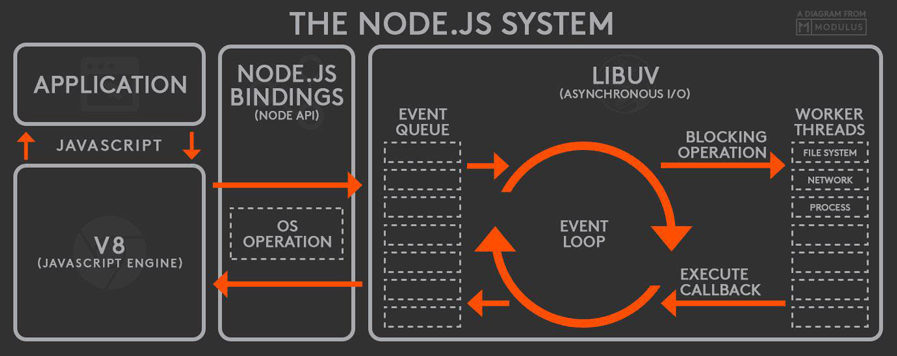

# Node.js学习笔记

### nvm更新Node.js版本
1. macOS或Linux的[nvm](https://github.com/creationix/nvm)：

    ```bash
    nvm list-remote
    nvm install v新版本号
    nvm use v新版本号
    nvm alias default v新版本号

    nvm list
    nvm uninstall v旧版本号     # 如果无法删除，可以去目录删除 /Users/用户名/.nvm/versions/node/v版本
    ```
2. Windows的[nvm-windows](https://github.com/coreybutler/nvm-windows)：

    >安装nvm-windows时，需要删除原本安装在电脑上的Node.js。

    ```bash
    nvm node_mirror https://npm.taobao.org/mirrors/node/    #设置node源：
    nvm npm_mirror https://npm.taobao.org/mirrors/npm/      #设置npm源：

    nvm list available
    nvm install v新版本号
    nvm use v新版本号

    nvm list
    nvm uninstall v旧版本号     # 还可以再去目录中删除 C:\Users\用户名\AppData\Roaming\nvm\v版本
    ```

>切换版本之后需重装Node.js的全局模块包。

### Node.js的运行机制:
1. V8引擎解析JS脚本。
2. 解析后的代码，调用Node API。
3. [libuv](https://github.com/libuv/libuv)负责Node API的执行。将不同的任务分配给不同的线程，形成一个Event Loop（事件循环），以异步的方式将任务的执行结果返回给V8引擎。
4. V8引擎再将结果返回给用户。



### npm
1. 命令

    >在任意命令后添加`-h`、`--help`查看当前命令的所有参数。

    1. 制作

        1. 登录

            `npm login`
        2. 初始化`package.json`

            `npm init`

            - 修改初始化信息

                ```bash
                npm set init.author.name "名字"
                npm set init.author.email "邮箱"
                npm set init.license "MIT"
                ```

                >初始化信息会存放在`~/.npmrc`文件里。
        3. 发布

            `npm publish [--tag <tag>]`

            >默认发布至**latest**标签。除了latest，其他标签都不会默认被安装。最后推送的latest版本会显示在npm官网。
        4. “下线”

            >`npm unpublish [<@scope>/]<pkg>[@<version>]`只能下线24小时内发布的版本。

            `npm deprecate <pkg>[@<version>] <message>`
        5. 打印登录名

            `npm whoami`
        6. 登出

            `npm logout`
    2. 查看信息

        1. 查看模块信息

            `npm info [<@scope>/]<pkg>[@<version>] [<field>[.subfield]...]`
        2. 查看安装的模块和依赖

            `npm list [[<@scope>/]<pkg> ...]`
        3. 查看、添加、删除仓库标签的最后版本

            >每个标签仅保留最后一个版本；latest标签无法删除。

            ```bash
            npm dist-tag ls [<pkg>]
            npm dist-tag add <pkg>@<version> [<tag>]
            npm dist-tag rm <pkg> <tag>
            ```
    3. 安装

        1. 安装包

            自动选择范围内最后发布的版本，安装到本地或全局的`node_modules`。全局安装会额外创建系统命令。

            1. 安装方式

                1. `npm install`安装所在目录的`package.json`文件描述内容

                    1. 最新（主版本号最新）：

                        `*`、`x`
                    2. 次版本号最新：

                        `1`、`1.x`、`^1.2.3`
                    3. 补丁号最新：

                        `1.2`、`1.2.x`、`~1.2.3`
                    4. 确定的版本：

                        `1.2.3`

                    >`主版本号.次版本号.补丁号`，详细定义查看[Semantic](http://semver.org/lang/zh-CN/)。
                2. `npm install [<@scope>/]<name>[@<tag>]`

                    1. 没有后缀，则最后发布的latest版本。
                    2. `@内容`

                        1. 具体版本号
                        2. 标签
                        3. 版本范围：`>`、`>=`、`<`、`<=` + 版本号。范围中最后发布的版本。

                            >e.g. `npm install npm-devil@">=0.0.1 <0.0.5"`
                3. 参数

                    1. `--force`、`-f`：强制重新安装。

                        >当目录中已经存在指定模块，默认将不会重新安装。或删除`node_modules`目录再重新安装。
                    2. `--save`、`-S`：安装信息保存到`package.json`的`dependencies`。
                    3. `--save-dev`、`-D`：安装信息保存到`package.json`的`devDependencies`。
                    4. `--save-optional`、`-O`：安装信息保存到`package.json`的`optionalDependencies`。
            2. 作用域

                1. 本地：在本地被`require`引入后使用。
                2. 全局：在命令行中使用，或被全局命令引用。
        2. 查看已安装模块是否需要升级

            `npm outdated [[<@scope>/]<pkg> ...]`
        3. 升级

            `npm update [-g] [<pkg>...]`

            >只更新顶层模块，而不更新依赖的依赖。可以使用`npm --depth 9999 update`更新依赖的依赖。

            - 升级npm自己

                `npm install -g npm`
        4. 卸载

            `npm uninstall [<@scope>/]<pkg>[@<version>]... [--save-prod|--save-dev|--save-optional] [--no-save]`
        5. 重装npm

            `curl -L https://www.npmjs.org/install.sh | sh`

            >若还是无法使用npm，建议重装Node.js。
        6. 验证缓存（垃圾收集不需要的数据、验证缓存的完整性）

            `npm cache verify`

            > - 除非回收磁盘空间，否则不要使用以下清空npm缓存
            >
            >    `npm cache clean -f`
    4. 执行脚本

        `npm run “package.json中scripts字段的命令”`
2. `package.json`字段

    1. `dependencies`

        生产环境依赖。
    2. `devDependencies`

        开发、测试依赖。

        >- 何时不被安装：
        >
        >    1. 项目不会安装依赖库的`devDependencies`。
        >    2. `NODE_ENV`值为`production`时，项目不会安装自己的`devDependencies`。
        >
        >        >`export NODE_ENV=production;`。
        >    3. `npm install --production`不会安装自己的`devDependencies`。
    3. `name`

        仓库名。

        >组成：小写、无空格、字母数字下划线中划线。
    4. `version`

        版本号`x.x.x`。

        >`npm version [<newversion> | major | minor | patch | premajor | preminor | prepatch | prerelease | from-git]`更新`version`。
    5. `description`

        描述，也作为在npm官网被搜索的内容。
    6. `main`

        代码入口，默认`index.js`。
    7. `scripts`

        可执行脚本，用`npm run 脚本名`执行。
    8. `repository`

        仓库远程版本控制，可以是github等。

        >e.g.
        >
        >```json
        >"repository": {
        >    "type": "git",
        >    "url": "git@github.com:用户名/仓库名.git"
        >}
        >```
    9. `keywords`

        在npm官网被搜索的关键字。
    10. `author`

        仓库作者。
    11. `license`

        证书。
    12. `homepage`

        主页。
    14. 其他
3. 包的制作-使用

    1. 制作：
    
        按照[CommonJS规范](https://github.com/realgeoffrey/knowledge/blob/master/网站前端/Node.js学习笔记/README.md#commonjs规范)编写代码。
    2. 使用：
    
        1. 在Node.js环境下使用（`require`）

            >如`vue-cli`。
        2. 在浏览器环境下使用

            1. 用打包工具（`webpack`、`browserify`、`rollup`）打包成能够在浏览器运行的JS代码。
            2. 直接制作可兼容在浏览器环境运行的代码。

            >如`Vue.js`。
4. 作用域的包

    `@scope/project-name`

- 改变安装包的顺序会影响安装包的内容和依赖。

### CommonJS规范
>参考[阮一峰：require() 源码解读](http://www.ruanyifeng.com/blog/2015/05/require.html)、[CommonJS 详细介绍](https://neveryu.github.io/2017/03/07/commonjs/)、[阮一峰：JavaScript 模块的循环加载](http://www.ruanyifeng.com/blog/2015/11/circular-dependency.html)。

- 概述

    1. 执行阶段（运行时）进行模块加载。
    2. 每个文件就是一个模块，有自己单独作用域，不污染全局作用域，必须`exports`才能输出给其他模块。

        >不推荐`window.属性`。
    3. `exports`和`require`能够在任何位置使用（包括块级作用域）。
    4. 模块的加载步骤：

        1. 模块加载的顺序：按照其在代码中出现的顺序、引用则嵌套加载。
        2. 注入`exports`、`require`、`module`三个全局变量。
        3. 执行模块的源码：

            1. `require`第一次加载某模块，执行整个脚本，在内存生成一个缓存对象：

                `{ id: '...', exports: {...}, ... }`
            3. 无论加载多少次，仅在第一次加载时运行，除非手动清除系统缓存。
            3. x模块执行时出现`require(y)`则进入y模块代码中执行，执行完毕后再回到x模块继续向下执行。
            4. 一旦出现“循环加载”，则被循环的模块对象的`exports`仅保存已经执行过的代码部分，然后因为`require(其他模块)`进入其他模块代码中执行，还未执行的部分等到代码返回原模块时继续执行（此时再去改变`exports`）。
        4. 将模块的`exports`值输出至缓存，以供其他模块`require`获取（或“循环加载”时，部分已经执行产生的`exports`供其他模块引用）。
    5. `require(x模块)`返回内存中x模块的`module.exports`指向的值，可以重新赋值和属性改写（属性改写会改变x模块的缓存值，所有`require(x模块)`都会共享）。

1. `require(X)`

    加载模块。读取并执行一个JS文件（`.js`后缀可以省略），返回该模块的`exports`值。

    1. 如果 X 以`/`、`./`或`../`开头

        1. 根据 X 所在的父模块，确定 X 的绝对路径。
        2. 将 X 当成**文件**，依次查找下面文件，只要其中有一个存在，就返回该文件，不再继续执行。

            `X`、`X.js`、`X.json`、`X.node`
        3. 将 X 当成**目录**，依次查找下面文件，只要其中有一个存在，就返回该文件，不再继续执行。

            `X/package.json（main字段）`、`X/index.js`、`X/index.json`、`X/index.node`
    2. 如果 X 是内置模块，返回该模块，不再继续执行。

        >e.g. `require('http')`
    3. 如果 X 不带路径且不是内置模版

        >当作安装在本地的模块。

        1. 根据 X 所在的父模块，确定 X 可能的安装目录。
        2. 依次在每个目录中，将 X 当成**文件**或**目录**加载。
    4. 抛出`not found`。

    >e.g.
    >
    >- 在`/home/ry/projects/foo.js`执行了`require('bar')`：
    >
    >    1. 属于不带路径情况，判断不是内置模块，当作安装在本地的模块进行搜索；
    >    2. 依次搜索每一个目录：
    >
    >        ```text
    >        /home/ry/projects/node_modules/
    >        /home/ry/node_modules/
    >        /home/node_modules/
    >        /node_modules/
    >        ```
    >
    >        1. 搜索时，先将`bar`当作文件名，依次在`某某/node_modules/`尝试加载下面文件：
    >
    >            `bar`、`bar.js`、`bar.json`、`bar.node`
    >        2. 如果都不成功，说明`bar`可能是目录名，依次在`某某/node_modules/`尝试加载下面文件：
    >
    >            ```text
    >            bar/package.json（main字段）
    >            bar/index.js
    >            bar/index.json
    >            bar/index.node
    >            ```
    >    3. 都找不到则抛出`not found`。
2. `exports`

    模块提供使用的`exports`值。

    - 允许用两种方式赋值：

        1. `module.exports = 值`（`exports = 变量`报错）
        2. `module.exports.属性 = 值`

    >`exports === module.exports`。
3. `module`

    - 当前模块对象。拥有以下属性：

        1. `module.id`：模块的识别符，通常是带有绝对路径的模块文件名。
        2. `module.filename`：模块的文件名，带有绝对路径。
        3. `module.loaded`：返回一个布尔值，表示模块是否已经完成加载。
        4. `module.parent`：返回一个对象，表示调用该模块的模块。
        5. `module.children`：返回一个数组，表示该模块要用到的其他模块。
        6. `module.exports`：表示模块对外输出的值。
        7. `module.paths`：返回一个数组，模块文件默认搜索目录（`某某/node_modules/`）。

    >所有模块都是Node内部`Module`构建函数的实例。
