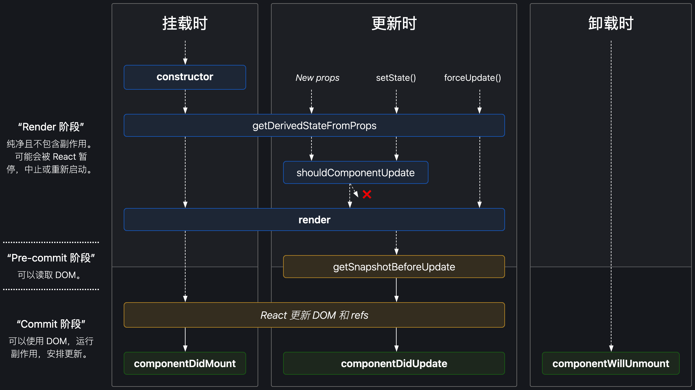
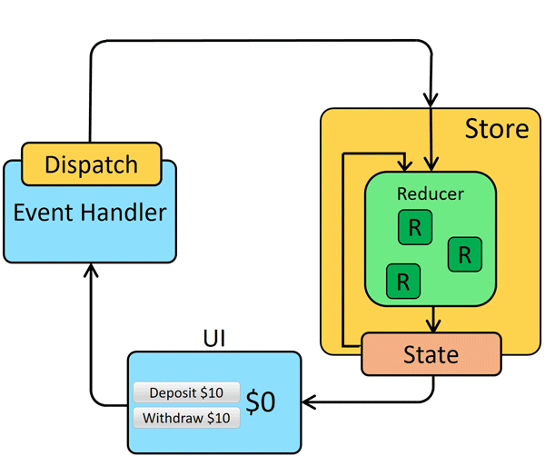
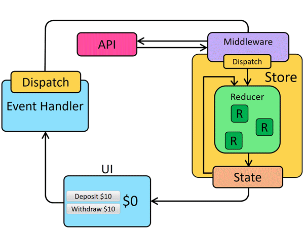

# React学习笔记

## 目录
1. [react](#react)

    1. [JSX](#jsx)
    1. [元素渲染](#元素渲染)
    1. [组件](#组件)
    1. [生命周期](#生命周期)
    1. [Hook](#hook)
    1. [与第三方库协同](#与第三方库协同)
    1. [Virtual DOM](#virtual-dom)
    1. [性能优化](#性能优化)
    1. [代码分割（动态加载）](#代码分割动态加载)
    1. [类型检查](#类型检查)
    1. [测试](#测试)
1. [create-react-app](#create-react-app)
1. [redux](#redux)

    1. [dva](#dva)
1. [mobx](#mobx)
1. [umi](#umi)
1. [react-native](#react-native)

    1. [核心概念](#核心概念)

---
### [react](https://github.com/facebook/react)

#### JSX
>（TS转译.tsx成为.jsx或.js，）Babel转译.jsx成为.js。

1. JSX是一个表达式

    >`if`、`for`不是表达式。
2. `return 组件`，若多行，则`(` `)`包裹组件
3. `<组件名称>`

    1. （`<组件名称>`）**必须**以大写字母开头。

        >大写字母表示用户定义组件，小写字母表示HTML标签。
    2. `.`

        `<对象.属性名>`（不要求~~大写字母开头~~）

        ><details>
        ><summary>e.g.</summary>
        >
        >```jsx
        >import React from "react";
        >
        >const myComponents = {
        >  datePicker: function datePicker (props) {
        >    return <div>传值data：{props.data}</div>;
        >  }
        >};
        >
        >export default (props) => {
        >  return <myComponents.datePicker data={props.data} />;
        >}
        >```
        ></details>
    3. 不能是表达式

        ><details>
        ><summary>e.g.</summary>
        >
        >```jsx
        >// 错误！不能是一个表达式。
        >return <components[props.storyType] story={props.story} />;
        >
        >// 正确！大写字母开头的变量（不能是小写字母开头）
        >const SpecificStory = components[props.storyType];
        >return <SpecificStory story={props.story} />;
        >```
        ></details>
4. 插入HTML的值都会自动进行HTML的字符实体（character entity）转义，避免XSS。
5. Props

    1. 采用小驼峰式（camelCase）定义标签的属性名称

        >类似DOM对象的`properties`名。

        任何标准的或自定义的DOM属性都是完全支持。

        1. （`class`是保留字，）`className`代替`class`

            >若在React中使用Web Components（这是一种不常见的使用方式），则使用`class`属性代替。
        2. `htmlFor`代替`for`
        3. 受控组件的：`value`、`onChange`、`selected`、`checked`
        4. 非受控组件的：`defaultValue`、`defaultChecked`
        5. `style`
        6. [事件名](https://zh-hans.reactjs.org/docs/events.html)

        - 特殊情况用`-`短横线隔开式（kebab-case）的属性名：

            1. 无障碍属性`aria-*`
            2. `data-*`

        - 特殊属性

            1. `dangerouslySetInnerHTML={{ __html: 'innerHtml内容' }}`

                为浏览器DOM提供innerHTML的替换方案。不会~~进行HTML的字符实体（character entity）转义~~，有XSS风险。
            2. `suppressContentEditableWarning`
            3. `suppressHydrationWarning`
    2. 赋值

        1. `{}`包裹JS表达式赋值给Props：

            `某prop={JS表达式}`
        2. 字符串字面量：

            `某prop="某字符串"`
        3. 若没有给Props赋值，则默认值是`true`：

            `某prop`
    3. `{...某对象}`展开元素

        很容易将不必要的props传递给不相关的组件，或者将无效的HTML属性传递给DOM。需要谨慎的使用该语法，如：`const {children, xx, otherProps} = props; return <组件名 {...otherProps} />`。

        >e.g. `<组件名 {...某对象} />`
    4. 包含在开始和结束标签之间的表达式内容将作为特定属性：`props.children`

        1. 可插入内容：

            1. 字符串字面量
            2. 组件、HTML标签
            3. `{JS表达式}`

                >1. `&&`、`||`
                >2. `condition ? true : false`
                >3. `Array`方法

                1. 任何数据类型（传递给组件的`props.children`使用）

                    >e.g. 函数、引用数据类型
                2. HTML标签间可返回：

                    组件、HTML标签、String类型、Number类型、数组

                    >其他数据类型可能导致报错。

                    - 渲染空白的返回：`false`、`true`、`null`、`undefined`、Symbol类型、BigInt类型
        2. 对空白的处理：

            1. 移除行首尾的空格以及空行
            2. 与标签相邻的空行均会被删除
            3. 文本字符串之间的新行会被压缩为一个空格
6. 元素组成的数组，会按顺序渲染（注意添加`key`）
7. 注释

    ```jsx
    {/* 单行注释 */}

    {/*
      多行注释
    */}
    ```

- <details>

    <summary>实现</summary>

    - 使用JSX语法前提（React16及之前）：

        1. 打包工具：需要`import React from "react";`。
        2. `<script>`加载：需要把`React`挂载到全局变量。

            - 为`非构建工具（未使用JSX预处理器）`处理的`<script>`，添加JSX支持：

                1. 添加`<script src="https://unpkg.com/babel-standalone@6/babel.min.js"></script>`；
                2. 在使用JSX的.js文件引用加上`type="text/babel"`。

    1. （React16及之前）Babel会把JSX转译成`React.createElement`函数调用，生成React元素

        >（React16及之前）JSX是`React.createElement(type或element[, props[, ...children]])`函数的语法糖（已废弃：~~`React.createFactory(type或element)`~~）。

        ><details>
        ><summary>e.g.</summary>
        >
        >```jsx
        >import React from 'react';
        >
        >const element = (
        >  <h1 className="greeting">
        >    Hello, world!
        >  </h1>
        >);
        >
        >
        >// 等价于：
        >import React from 'react';
        >
        >const element = React.createElement(
        >  'h1',
        >  {className: 'greeting'},
        >  'Hello, world!'
        >);
        >
        >
        >// => 创建React元素
        >const element = {   // 简化后的结构
        >  type: 'h1',
        >  props: {
        >    className: 'greeting',
        >    children: 'Hello, world!'
        >  }
        >};
        >```
        ></details>
    2. （React17及之后）JSX无需引入React

        ><details>
        ><summary>e.g.</summary>
        >
        >```jsx
        >function App() {
        >  return <h1>Hello World</h1>;
        >}
        >
        >
        >// => 编译结果：
        >// 由编译器引入（禁止自己引入！）
        >import {jsx as _jsx} from 'react/jsx-runtime';
        >
        >function App() {
        >  return _jsx('h1', { children: 'Hello world' });
        >}
        >```
        ></details>
    </details>

#### 元素渲染
>由`ReactDOM.render`对根DOM组件开始初始化-渲染，随着引入的子组件再以树状结构对子组件进行初始化-渲染。

1. `ReactDOM.render`

    渲染到根DOM（可多次调用）。
2. React DOM

    1. 管理根DOM内所有内容。
    2. 将React元素和它的子元素与它们之前的状态进行比较，并只会进行必要的更新来使DOM达到预期的状态（协调）。
3. React元素（React elements）

    1. 不可变对象（[immutable](https://zh.wikipedia.org/wiki/不可变对象)）
    2. 创建开销极小的**普通对象**
4. 组件渲染

    组件渲染完成后返回React元素。

    1. `render`方法（或函数组件）返回`null`，组件会正常运行和执行生命周期函数，只是不渲染出任何DOM（因为渲染空内容）。

- API

    1. `React.cloneElement(element[, props[, ...children]])`（已废弃：~~`React.addons.cloneWithProps`~~）

        克隆并返回新的React元素。

        >几乎等同于：`<element.type {...element.props} {...props}>{children}</element.type>` + 原element上的`key`和`ref`。添加的`props`的属性会覆盖`element`原本的属性。

        ><details>
        ><summary>e.g.</summary>
        >
        >把接受到的参数传递给`props.children`渲染：
        >
        >```tsx
        >const { children, ...otherProps } = props;
        >
        >return (
        >  <>
        >    {React.Children.map(children, (child) => {
        >      return React.cloneElement(child, {...otherProps, 新增参数: '值'});
        >    })}
        >  </>
        >)
        >```
        ></details>
    2. `React.isValidElement(对象)`

        验证对象是否为React元素。返回：`true/false`。
    3. `React.Children` + `.map/.forEach/.count/.only/.toArray`

        处理`this.props.children`

#### 组件
组件：它接受任意的入参（Props），并返回用于描述页面展示内容的React元素。

1. 组件类型：

    1. class组件（class components）

        ><details>
        ><summary>e.g.</summary>
        >
        >```jsx
        >class 组件名 extends React.Component {    // 或 React.PureComponent
        >  render() {
        >    return (
        >      <div className="m-div" onClick={this.props.onClick}>
        >        {this.props.value}
        >      </div>
        >    );
        >  }
        >}
        >```
        ></details>
    2. 函数组件（function components，FC）

        不能包含~~State~~（Hook弥补），没有~~生命周期~~（Hook弥补），没有~~this~~。

        ><details>
        ><summary>e.g.</summary>
        >
        >```jsx
        >function 组件名 (props) {
        >  // 没有this
        >
        >  function handleClick (e) {
        >    console.log(e, e.preventDefault);
        >  }
        >
        >  return (
        >    <div
        >      onClick={props.onClick}
        >      onClick={(e) => {props.onClick(e);}} // 匿名函数
        >      onClick={handleClick}
        >      onClick={(e) => {handleClick(e);}}   // 匿名函数
        >    >
        >      {props.value}
        >    </div>
        >  );
        >}
        >```
        ></details>
2. 限制

    1. Props不能被修改（只读）。
    2. 组件只能显性接受传入的Props内容（在外层传`style`、`className`等，需要在组件内接受并处理）。
    3. 组件需要以`default`方式导出。
3. State

    State是私有的，并且完全受控于当前组件，其父、子组件均不可见。

    1. 初始化：

        ```jsx
        class 组件名 extends React.Component {
          constructor(props) {  // 覆盖class的实例属性
            super(props)

            this.state = {
              value1: 1,
              value2: 2
            }
          }

          // 或
          state = {
            value2: 22,
            value3: 3
          }
        }


        // 结果：初始化的State为`{value1: 1, value2: 2}`
        ```
    2. 不要~~直接修改State~~，仅用`setState`（或`forceUpdate`）修改
    3. State的更新是异步的（`setState`是异步的，并且在同一周期内会对多个`setState`进行批处理，浅合并）

        >[原因讨论](https://github.com/facebook/react/issues/11527)。

        1. `this.props`和`this.state`可能会异步更新。

            给`setState`传递一个函数，而不是一个对象，就可以确保每次的调用都是使用最新版的`state`和`props`。

            ><details>
            ><summary>e.g.</summary>
            >
            >```jsx
            >// 错误
            >this.setState({
            >  counter: this.state.counter + this.props.increment,
            >});
            >
            >
            >// 正确
            >this.setState((state, props) => ({  // 第一个参数是上一个State，第二个参数是此函数运行时的Props
            >  counter: state.counter + props.increment
            >}));
            >```
            >
            >```jsx
            >incrementCount() {
            >  // 错误：调用一次 handleSomething 只能导致 + 1
            >  this.setState({count: this.state.count + 1});
            >
            >
            >  // 正确：调用一次 handleSomething 导致 + 3
            >  this.setState((state) => {
            >    return { count: state.count + 1 }
            >  });
            >}
            >
            >handleSomething() {
            >  this.incrementCount();
            >  this.incrementCount();
            >  this.incrementCount();
            >}
            >```
            ></details>
        2. 若要确保更新State之后执行方法，则使用`componentDidUpdate`或`setState`的第二个回调函数参数。
    4. `setState`设置相同的值：

        根据`shouldComponentUpdate`返回的值决定是否更新真实DOM（是否触发`render`）。

        >1. `React.Component`的`shouldComponentUpdate`默认返回`true`：总会更新DOM。
        >2. `React.PureComponent`的`shouldComponentUpdate`默认实现（修改实现会Warning提示）：浅比较`props`和`state`，若相同则返回`false`不更新，若不相同则返回`true`更新。
    5. 属性值改变的策略

        1. 模板中渲染相关的属性（如：要在模板内展示的属性 或 Props传值、`style`取值等），需要放到State中被观测（或放到store中被观测，如：redux、mobx），才能在这些值改变时通知视图重新渲染（`this.setState`）。

            >使用函数组件的话，放在`useState`等里效果相同。

            `this.setState(对象或函数, (/* 无参数 */) => {/* 更新后的回调 */})`函数是唯一能够更新`this.state.属性`的方式。

            - 不可变性（引用数据类型）

                >`state`、`props`、store、等，都建议遵循不可变性。

                ><details>
                ><summary>可以用<a href="https://github.com/immerjs/immer">immer</a>处理（与react组件配合方式：<a href="https://immerjs.github.io/immer/zh-CN/example-setstate">React & Immer</a>）。</summary>
                >
                >e.g.
                >
                >```javascript
                >import produce from "immer"
                >
                >const baseState = [
                >    {
                >        willDo: "Learn typescript",
                >        done: true
                >    },
                >    {
                >        willDo: "Try immer",
                >        done: false
                >    }
                >]
                >
                >const nextState = produce(baseState, draftState => {
                >    draftState.push({willDo: "Tweet about it"})
                >    draftState[1].done = true
                >})
                >```
                >
                >上面的示例中，对`draftState`的修改都会反映到`nextState`上，并且不会修改`baseState`。而immer使用的结构是共享的，`nextState`在结构上与`currentState`共享未修改的部分。
                ></details>

                不直接修改数据（或改变底层数据），而是用新值替换旧值。（对需要修改的State内容浅复制一层，对新值进行修改后覆盖原State）

                >优势：
                >
                >1. 简化复杂的功能，方便切换历史数、time-travel。
                >2. 跟踪数据的改变，方便确定数据是否发生了变化。
        2. 不在模板内展示的值（如：仅作为事件触发修改的状态值 或 仅在JS逻辑中改变的值），直接放在class中的实例属性中。

            >使用函数组件的话，放在`useRef`里效果相同。

            - 可以向组件中加入任意不参与数据流的额外字段，但是要在组件生命周期结束前清理（如：在`componentWillUnmount`中处理）。
        3. 所有这个组件的实例全部共用同一个值，不响应式更新，放在组件外部。

        ><details>
        ><summary>e.g.</summary>
        >
        >```jsx
        >let value = 0  // 该组件的所有实例共享
        >
        >class MyComponent extends React.Component {
        >  constructor (props) {
        >    super(props)
        >    this.state = {
        >      cur: 0    // 需要放到模板内展示
        >    }
        >  }
        >
        >  componentDidMount () {
        >    this.timerID = setInterval(
        >      () => {},
        >      1000
        >    );
        >  }
        >
        >  componentWillUnmount () {
        >    clearInterval(this.timerID);
        >  }
        >
        >  isLoading = false // 不需要在模板内展示
        >
        >  render () {
        >    return (
        >      <View
        >        onClick={() => {
        >          this.setState({                  // setState修改
        >            cur: this.state.cur + 1
        >          })
        >          this.isLoading = !this.isLoading // 直接赋值修改
        >          value = value + 1                // 直接赋值修改
        >        }}
        >        p1={this.state.cur}     // 能够响应式传递进去
        >        p2={this.isLoading}     // 不能响应式传递进去
        >        p3={value}              // 不能响应式传递进去
        >      >
        >        {this.state.cur}        {/* 值改变，能够响应式触发更新 */}
        >        {this.isLoading}        {/* 值改变，不能够响应式触发更新 */}
        >        {value}                 {/* 值改变，不能够响应式触发更新 */}
        >      </View>
        >    )
        >  }
        >}
        >```
        ></details>
    6. `forceUpdate`

        跳过 ~~`shouldComponentUpdate`~~，直接触发`render`。
4. Props

    >可以把任何东西当做Props传递，如：组件、函数、JS的任意数据类型。只读的，不应以任何方式修改。

    1. 默认值

        class组件的静态属性添加`defaultProps`（用于props未赋值，但又不能为`null`的情况）。

        ><details>
        ><summary>e.g.</summary>
        >
        >```jsx
        >class 组件名 extends React.Component {
        >  static defaultProps = {
        >    属性1: "默认值1",
        >    属性2: "默认值2"
        >  };
        >}
        >
        >// 或
        >组件名.defaultProps = {   // 覆盖class内部的静态属性
        >    属性2: "默认值2_",
        >    属性3: "默认值3"
        >}
        >
        >
        >// 结果：默认的Props为`{属性2: "默认值2_", 属性3: "默认值3"}`
        >```
        ></details>
    2. 特殊属性

        1. `key`的取值和逻辑，与[Vue中`key`的注意点（17.i）](https://github.com/realgeoffrey/knowledge/blob/master/网站前端/Vue.js学习笔记/README.md#指令--特殊attribute)一致

            >`key`不是Props（经过React特殊处理），无法传递给子节点。

            因为JSX的灵活，只要是能够`切换或条件判断`的都需要考虑`key`。包括：`Array`方法、数组、条件判断（`switch`、`if`）等。
        2. `ref`

            >`ref`不是Props（经过React特殊处理），无法传递给子节点。

            >不能在函数组件上使用`ref`属性，因为他们没有实例。e.g. ~~`<函数组件 ref={React.createRef()} />`~~。

            1. 由`React.createRef()`创建，`.current`获取DOM或子组件实例。

                1. 本组件内使用，获取DOM。
                2. 可以从父级传递`React.createRef()`实例到子组件：

                    >不能在函数组件中传入`ref`（因为函数组件没有实例）。

                    1. 引用子组件`ref=React.createRef()`，父组件获取子组件（不是子组件内部节点）。
                    2. 引用子组件`参数=React.createRef()`，父组件获得子组件内部节点的`ref`。
                    3. 引用子组件`ref=React.createRef()`，子组件是Refs转发（`React.forwardRef((props, ref) => {})`），父组件获取子组件内部节点的`ref`

                        - 在HOC中使用，获取HOC传入组件内部节点的`ref`
            2. 回调Refs

                传递函数给`ref`属性。组件挂载时，会调用`ref`回调函数，并传入DOM元素，当卸载时调用它并传入`null`。

                1. 在`componentDidMount`或`componentDidUpdate`触发前，React会保证`回调Refs`一定是最新的；
                2. 可以在组件间传递；
                3. 若回调Refs的函数是以内联函数的方式定义的，在更新过程中它会被执行两次，第一次传入参数`null`，然后第二次会传入参数DOM元素。

                    >这是因为在每次渲染时会创建一个新的函数实例，所以React清空旧的`ref`并且设置新的。通过将`ref`的回调函数定义成`class`的绑定函数的方式可以避免上述问题，但是大多数情况下它是无关紧要的。
            3. ~~`this.refs.值`~~（已废弃）

            ><details>
            ><summary>e.g.</summary>
            >
            >```jsx
            >// father
            >import React from "react";
            >import Son1 from "./Son1";
            >import Son2 from "./Son2";
            >import Son3 from "./Son3";
            >import Son4 from "./Son4";
            >export default class Father extends React.Component {
            >  constructor(props) {
            >    super(props);
            >    this.divRef = React.createRef();
            >    this.sonRef = React.createRef();
            >    this.sonDomRef = React.createRef();
            >    this.sonForwardRef = React.createRef();
            >    this.funcRef1 = null;
            >    this.funcRef2 = null;
            >  }
            >  render() {
            >    return (
            >      <div onClick={() => { console.log(this.divRef, this.sonDomRef, this.sonRef, this.sonForwardRef, this.funcRef1, this.funcRef2); }}>
            >        <div
            >          className="m-ref"
            >          ref={this.divRef} // 本组件内使用，获取DOM
            >        >
            >          this.divRef
            >        </div>
            >
            >        <Son1
            >          ref={this.sonRef} // 获取子组件（不是子组件内部DOM）
            >        />
            >
            >        <Son2
            >          refData={this.sonDomRef} // 获取子组件内部节点的`ref`
            >        />
            >
            >        <Son3
            >          ref={this.sonForwardRef} // 获取子组件内部节点的`ref`，要求子组件是Refs转发
            >        />
            >
            >        <div
            >          className="m-ref-func"
            >          ref={(dom) => { // 节点更新则触发2次，一次null一次dom
            >            console.log(dom, "m-ref-func");
            >            this.funcRef1 = dom;
            >          }}
            >        >
            >          this.funcRef1
            >        </div>
            >
            >        <Son4
            >          funcRef={(dom) => { // 节点更新则触发2次，一次null一次dom
            >            console.log(dom, "Son4");
            >            this.funcRef2 = dom;
            >          }}
            >        />
            >      </div>
            >    );
            >  }
            >}
            >
            >
            >// Son1
            ><div className="m-son-1">Son1</div>
            >
            >// Son2
            ><div className="m-son-2">
            >  <div className="m-son-2-ref" ref={this.props.refData}>
            >    Son2
            >  </div>
            ></div>
            >
            >// Son3
            >import React from "react";
            >export default React.forwardRef((props, ref) => {
            >  return (
            >    <div className="m-son-3">
            >      <div className="m-son-3-ref" ref={ref}>
            >        Son3
            >      </div>
            >    </div>
            >  );
            >});
            >
            >// Son4
            ><div className="m-son-4">
            >  <div className="m-son-4-ref" ref={this.props.funcRef}>
            >    Son4
            >  </div>
            ></div>
            >```
            ></details>

            - 适用场景

                >避免使用ref来做任何可以通过声明式实现来完成的事情。

                1. 管理焦点，文本选择或媒体播放。
                2. 触发强制动画。
                3. 集成第三方DOM库。
    3. 把DOM或React元素传入子组件

        1. `children`

            传入子组件内的内容（开始标签和结束标签之间的内容），都会在子组件的`props.children`中。
        2. 传参

        ><details>
        ><summary>e.g.</summary>
        >
        >```jsx
        >export default function Father () {
        >  return (
        >    <Son1
        >      aa={<Son2 />}             // 传参
        >      bb={<p>from Father 2</p>} // 传参
        >    >
        >
        >      {/*children*/}
        >      <p>from Father 3</p>
        >      <Son2 />
        >
        >    </Son1>
        >  );
        >}
        >
        >function Son1 (props) {
        >  return (
        >    <div className="m-son-1">
        >      {props.children}
        >      {props.aa}
        >      {props.bb}
        >    </div>
        >  );
        >}
        >
        >function Son2 (props) {
        >  return (
        >    <div className="m-son-2">Son2</div>
        >  );
        >}
        >```
        ></details>

        - 插槽（类似Vue）

            若父子组件的结构有耦合，则需要用插槽。

            ><details>
            ><summary>e.g.</summary>
            >
            >```tsx
            >// Father.tsx
            >import Son from "./Son";
            >export default function SlotCompoment() {
            >  return (
            >    <Son
            >      Slot={({ children }) => {
            >        return (
            >          <div>
            >            ②father's Slot 父组件数据
            >            {children}
            >          </div>
            >        );
            >      }}
            >      children={({ children }) => {
            >        return (
            >          <div>
            >            ④father's children 父组件数据
            >            {children}
            >          </div>
            >        );
            >      }}
            >    />
            >  );
            >}
            >```
            >
            >```tsx
            >// Son.tsx
            >interface Props {
            >  Slot: React.FC<{ children: React.ReactNode }>;
            >  children: React.FC<{ children: React.ReactNode }>;
            >}
            >export default function Son(props: Props) {
            >  // children需要换个变量名才可以<组件名>
            >  const { Slot, children: Children } = props;
            >
            >  return (
            >    <>
            >      ①slot son 子组件数据
            >      <Slot>
            >        <div>③slot son's Slot 子组件数据</div>
            >      </Slot>
            >      <Children>
            >        <div>⑤slot son's children 子组件数据</div>
            >      </Children>
            >    </>
            >  );
            >}
            >```
            >
            >```text
            >->
            >①slot son 子组件数据
            >②father's Slot 父组件数据
            >③slot son's Slot 子组件数据
            >④father's children 父组件数据
            >⑤slot son's children 子组件数据
            >```
            ></details>

    - 组合、~~继承~~

        用组合（`import`和Props）的方式、而不是 ~~继承（`extends`）~~ 的方式构建新组件。

        - 特例关系（specialization）

            一个组件是其他组件的特殊实例（special case）。

            ><details>
            ><summary>e.g.</summary>
            >
            >```jsx
            >function Dialog(props) {
            >  return (
            >    <FancyBorder color="blue">
            >      <h1 className="Dialog-title">
            >        {props.title}
            >      </h1>
            >      <p className="Dialog-message">
            >        {props.message}
            >      </p>
            >    </FancyBorder>
            >  );
            >}
            >
            >// WelcomeDialog 可以说是 Dialog 的特殊实例
            >function WelcomeDialog() {
            >  return (
            >    <Dialog
            >      title="Welcome"
            >      message="Thank you for visiting our spacecraft!" />
            >  );
            >}
            >```
            ></details>
5. 书写方式

    1. `render`函数中事件触发组件方法时传递`this`的绑定事件方式：

        >非React提供的事件监听回调函数的this绑定也同理。

        1. 仅一次声明（推荐）

            ```jsx
            class 组件名 extends React.Component {
              constructor (props) {
                super(props);

                // 关键代码：
                this.handleClick = this.handleClick.bind(this);
              }

              handleClick () {
                console.log(this, arguments) // 组件实例this, [事件回调参数]
              }

              render () {
                return (
                  <button onClick={this.handleClick} />
                );
              }
            }
            ```

            ```jsx
            class 组件 extends React.Component {
              // 关键代码：
              handleClick = (..._arguments) => {  // 注意: 这是 *实验性* 语法（默认启用此语法）
                console.log(this, _arguments); // 组件实例this, [事件回调参数]
              };

              render () {
                return (
                  <button onClick={this.handleClick} />
                );
              }
            }
            ```
        2. 组件render时会创建不同回调函数（不推荐）

            若这种写法作为Props传入子组件，则父级每次render都会导致传入子组件的这个Props变化，导致子组件重新渲染（性能问题）。

            ><details>
            ><summary>e.g.</summary>
            >
            >```jsx
            >class 组件 extends React.Component {
            >  handleClick () {
            >    console.log(this, arguments); // 组件实例this, [事件回调参数]
            >  };
            >
            >  render () {
            >    return (
            >      <button
            >        // handleClick的this指向组件实例
            >        onClick={this.handleClick.bind(this)}
            >        onClick={(e) => {this.handleClick(e);}}
            >
            >        // onClick={this.handleClick}  // handleClick的this指向undefined
            >      />
            >    );
            >  }
            >}
            >```
            ></details>
    2. `this.`会取到最新值，注意异步操作后的取值

        可以用解构的方式在方法顶部先固定`this.`当前的值，之后异步时使用。
6. 通信

    1. 父子组件间的通信（单向数据流/单向绑定）

        父级（Props） -> 子级。其中Props包括：数据（可以是父级的State） + 父级的方法。

        ><details>
        ><summary>e.g.</summary>
        >
        >```jsx
        >// 父级
        ><子组件
        >  必要属性1='你好'
        >  可选方法1={this.父级方法} // 父级方法的参数：子级调用时传入
        >/>
        >```
        >
        >```jsx
        >// 子级
        >import React from "react";
        >
        >import { View } from "react-native";
        >
        >// 可选Props
        >interface 组件PropsOptional {
        >  可选属性1?: boolean,
        >  可选属性2?: number,
        >  可选方法1?: () => void,
        >}
        >
        >// +必要Props
        >interface 组件Props extends 组件PropsOptional {
        >  必要属性1: string
        >}
        >
        >// State
        >interface 组件State {
        >  本地属性1: number
        >}
        >
        >export default class 组件 extends React.Component<组件Props, 组件State> {
        >  public static defaultProps: 组件PropsOptional = {
        >    可选属性1: false,
        >    可选属性2: 123,
        >  };
        >
        >  public readonly state: 组件State = {
        >    本地属性1: this.props.可选属性2 || 0
        >  };
        >
        >  public constructor (props: 组件Props) {
        >    super(props);
        >  }
        >
        >  public render () {
        >    const { 本地属性1 } = this.state;
        >    const { 必要属性1, 可选属性1, 可选方法1 } = this.props;
        >
        >    return(
        >        <View
        >          onClick={() => {
        >            this.setState({
        >              本地属性1: 本地属性1 + 1
        >            });
        >            可选方法1 && 可选方法1(子级参数);
        >          }}
        >        >
        >          <View>{本地属性1}</View>
        >          <View>{必要属性1}</View>
        >          <View>{可选属性1 ? '可选属性1: true' : '可选属性1: false'}</View>
        >        </View>
        >    );
        >  }
        >}
        >```
        ></details>
    2. 非父子组件通信

        1. 祖孙组件间的通信

            1. Props逐层往下传递
            2. 从祖辈向所有孙辈传递

                >兄弟节点间通信，可以通过在公共的祖先组件设置`Provider`并且`value`传递能够修改`value`值的方法，兄弟节点设置`Consumer`，进行通信。

                1. `const MyContext = React.createContext(默认值)`

                    返回`{ Provider, Consumer }`。
                2. 祖辈组件设置：`<MyContext.Provider value={/* 某个值 */}>`

                    >可以嵌套不同context的Provider。

                    当`Provider`的`value`值发生变化时，它内部所有孙辈节点的`this.context`和`Consumer组件`都会重新渲染。
                3. 孙辈组件使用的2种方式：

                    从组件树中离自身最近匹配`Provider`中读取到当前的`context`值。

                    1. `contextType`

                        class组件的静态属性添加`contextType`。

                        ><details>
                        ><summary>e.g.</summary>
                        >
                        >```jsx
                        >class 组件名 extends React.Component {
                        >  static contextType = MyContext;
                        >}
                        >
                        >// 或
                        >组件名.contextType = MyContext   // 覆盖class内部的静态属性
                        >```
                        ></details>

                        孙辈组件中通过`this.context`使用。
                    2. `<MyContext.Consumer>{(data) => { return 组件 }}</MyContext.Consumer>`

                        孙辈组件中通过`props.children`传入函数使用。

                        >`Provider`及其内部`Consumer组件`都不受制于`shouldComponentUpdate`函数，因此当`Consumer组件`在其祖辈组件退出更新的情况下也能更新。

                ><details>
                ><summary>e.g.</summary>
                >
                >```tsx
                >// 使用 Provider、Consumer
                >import React, { useState } from "react";
                >import { MyContext1 } from "../../context";
                >import TheContextSon from "./TheContextSon";
                >
                >export default function TheContext() {
                >  const [data, setData] = useState({ a: 10 });
                >
                >  return (
                >    <>
                >      <MyContext1.Provider value={{ state: data, dispatch: setData }}>
                >        {/* 子组件1、兄弟组件，正常工作 */}
                >        <TheContextSon />
                >
                >        {/* 子组件2、兄弟组件，正常工作 */}
                >        <TheContextSon />
                >      </MyContext1.Provider>
                >
                >      {/* 非子组件，无效，不变化 */}
                >      <TheContextSon />
                >    </>
                >  );
                >}
                >
                >
                >// ../TheContextSon.tsx
                >import React from "react";
                >import { MyContext1 } from "../../context";
                >
                >export default function TheContextSon() {
                >  return (
                >    <MyContext1.Consumer>
                >      {({ state, dispatch }) => {
                >        return (
                >          <div
                >            onClick={() => {
                >              dispatch({ a: state.a - 1 });
                >            }}
                >          >
                >            {JSON.stringify(state)}
                >          </div>
                >        );
                >      }}
                >    </MyContext1.Consumer>
                >  );
                >}
                >
                >
                >// ../../context.ts
                >import React from "react";
                >
                >export const MyContext1 = React.createContext({
                >  state: { a: 1 },
                >  dispatch(data: { a: number }) {},
                >});
                >```
                ></details>
        2. 通用

            1. 状态管理（redux、mobx）
            2. 开发人员维护事件订阅机制
            3. ~~其他能被任意地方调用的全局属性（如：cookie、Web Storage、window、等）~~

    >1. 若多个组件需要反映相同的变化数据，则将共享状态提升到最近的共同父组件中去。
    >
    >    应当依靠自上而下的数据流，而不是尝试在不同组件间同步State。
    >2. 若某些数据可以由Props或State推导得出，则它就不应该存在于State中
7. 样式

    1. `style`

        `style={[ 对象1, 判断 ? 对象2 : ''或null或undefined ]}`，空不能用`{}`。

        1. `style`在React应用中多用于在渲染过程中添加**动态计算**的样式。

            通常不推荐将`style`属性作为设置元素样式的主要方式。在多数情况下，应使用`className`属性来引用外部CSS样式表中定义的class。
        2. 样式不会自动补齐前缀。若需要，则需要手动补充。

            ><details>
            ><summary>e.g.</summary>
            >
            >```javascript
            >const divStyle = {
            >  transition: 'all',
            >
            >  MozTransition: 'all',
            >  OTransition: 'all',
            >  WebkitTransition: 'all',
            >  msTransition: 'all'      // 'ms' is the only lowercase vendor prefix
            >};
            >```
            ></details>
        3. React会自动添加`px`后缀到内联样式为数字的属性后。

            1. 如需使用`px`以外的单位，请将此值设为数字与所需单位组成的字符串。
            2. 并非所有样式属性都转换为像素字符串。有些样式属性是没有单位的，完整列表见：[react: isUnitlessNumber](https://github.com/facebook/react/blob/4131af3e4bf52f3a003537ec95a1655147c81270/src/renderers/dom/shared/CSSProperty.js#L15-L59)。
    2. `className`

        在其他地方全局引入`.css`文件（`import './x.css'` 或 html的css引入），`className="类名"`或`className={变量或类名字符串}`

        - 除了引入.css文件（或CSS预处理器文件）之外，其他支持：

            1. 局部作用域、CSS类模块：[css modules](https://github.com/css-modules/css-modules)（可以与CSS预处理器配合使用）
            2. CSS in JS方案：[styled-components](https://github.com/styled-components/styled-components)（运行时生成`<style>`类样式，供给生成的样式组件的className使用）

                >CSS in JS：CSS由JavaScript生成而不是~~在外部文件（.css文件或CSS预处理器文件）中定义~~。
8. 事件处理

    1. 小驼峰式（camelCase）定义事件名
    2. 事件处理函数的参数是一个[合成事件](https://zh-hans.reactjs.org/docs/events.html)（`e`）。

        1. 参数只能同步使用，异步不保存。
        2. 阻止默认行为、阻止冒泡，必须显式调用：`e.preventDefault()`、`e.stopPropagation()`。

    - debounce/throttle事件处理

        1. class组件

            ```jsx
            // 不随渲染而改变的函数
            debounceFunc = debounce((e, otherValue) => {
             // do something...
            }, 500);

            <input onChange={(e) => debounceFunc(e, 其他响应式数据)}>
            ```
        2. 函数组件

            ```jsx
            // 不随渲染而改变的函数（随依赖项而改变）
            const debounceFunc = useCallback(   // 或：useRef
              debounce((e, otherValue) => {
                // do something...
              }, 500),
              [依赖项]
            );

            <input onChange={(e) => debounceFunc(e, 其他响应式数据)}>
            ```
9. 特殊组件

    1. 高阶组件（higher order component，HOC）

        >是一种设计模式。

        参数为组件，返回值为新组件的函数。

        1. HOC不应该修改和继承传入的组件，而应该使用组合的方式，通过将组件包装在容器组件中实现功能。
        2. 是纯函数，没有副作用。
        3. 约定：

            1. 将不相关的Props传递给被包裹的组件。

                特殊属性无法传递：`ref`（可以利用Refs转发传递）、`key`。
            2. 最大化可组合性。
        4. 注意事项：

            1. 不要在`render`方法中使用

                ><details>
                ><summary>e.g.</summary>
                >
                >```jsx
                >render() {
                >  // 每次调用 render 函数都会创建一个新的 EnhancedComponent
                >  // EnhancedComponent1 !== EnhancedComponent2
                >  const EnhancedComponent = enhance(MyComponent);   // 应该在非render处仅创建一次
                >  // 这将导致子树每次渲染都会进行卸载，和重新挂载的操作！
                >  return <EnhancedComponent />;
                >}
                >```
                ></details>
            2. 务必复制静态方法

                >[hoist-non-react-statics](https://github.com/mridgway/hoist-non-react-statics)。

                ><details>
                ><summary>e.g.</summary>
                >
                >```jsx
                >import hoistNonReactStatic from 'hoist-non-react-statics';
                >
                >function enhance(WrappedComponent) {
                >  class Enhance extends React.Component {/*...*/}
                >  hoistNonReactStatic(Enhance, WrappedComponent);  // 把所有WrappedComponent的静态方法（不包括react原生静态方法）拷贝到Enhance
                >  return Enhance;
                >}
                >```
                ></details>
            3. `ref`（和`key`一样）不会被传递，需要使用`React.forwardRef`

        ><details>
        ><summary>e.g.</summary>
        >
        >```jsx
        >// 高阶组件 HOCComponent.js
        >import React from "react";
        >export default (WrappedComponent) =>
        >  class WrapperComponent extends React.Component {
        >    render () {
        >      console.log(this.props, 'HOCComponent')
        >      return <WrappedComponent {...this.props} />;
        >    }
        >  }
        >
        >
        >// 利用高阶组件生成的新组件 WrappedComponent.js
        >import React from "react";
        >import HOC from "./HOCComponent";
        >export default HOC(
        >  class WrappedComponent extends React.Component {
        >    render () {
        >      return <div>WrappedComponent</div>
        >    }
        >  }
        >);
        >
        >
        >// 使用组件
        ><WrappedComponent a='aa' b='bb' />
        >```
        ></details>
    2. `<React.Fragment>`

        1. 仅支持`key`属性。
        2. 短语法：`<>子节点</>`（不支持所有属性，包括不支持`key`属性）。
    3. 表单

        1. 受控组件（controlled components）

            >事件：`onChange`。每当表单字段变化时，该事件都会被触发。

            表单数据由React组件来管理。渲染表单的React组件还控制着用户输入过程中表单发生的操作（表单的`value`、`onChange`、`selected`、`checked`受组件控制）。React的State成为表单“唯一数据源”。

            1. `<input type="text">`、`<textarea type="text">`

                ><details>
                ><summary>e.g.</summary>
                >
                >```jsx
                >constructor (props) {
                >  super(props);
                >  this.state = { value: "初始化值" };
                >
                >  this.handleChange = this.handleChange.bind(this);
                >}
                >
                >handleChange (event) {
                >  this.setState({ value: event.target.value });
                >}
                >
                >render () {
                >  return (
                >    <input或textarea type="text" value={this.state.value} onChange={this.handleChange} />
                >  );
                >}
                >```
                ></details>
            2. `<input type="checkbox">`

                ><details>
                ><summary>e.g.</summary>
                >
                >```jsx
                >function Checkbox() {
                >  const [checked, setChecked] = React.useState(true);
                >
                >  return (
                >    <label>
                >      <input
                >        type="checkbox"
                >        checked={checked}
                >        onChange={() => setChecked(!checked)}
                >      />
                >      Check Me!
                >    </label>
                >  );
                >}
                >```
                ></details>
            3. `<input type="radio">`

                ><details>
                ><summary>e.g.</summary>
                >
                >```jsx
                >function Radio() {
                >  const [radioValue, setRadioValue] = useState<"chooseA" | "chooseB">("chooseB");
                >
                >  return <>
                >    <label htmlFor="chooseA">
                >      <input
                >        type="radio"
                >        name="choose"
                >        id="chooseA"
                >        value="chooseA"
                >
                >        checked={radioValue === "chooseA"}
                >        onChange={(e) => {
                >          setRadioValue(e.target.value as "chooseA");
                >        }}
                >      />
                >      选中A
                >    </label>
                >    <label htmlFor="chooseB">
                >      <input
                >        type="radio"
                >        name="choose"
                >        id="chooseB"
                >        value="chooseB"
                >
                >        checked={radioValue !== "chooseA"}
                >        onChange={(e) => {
                >          setRadioValue(e.target.value as "chooseB");
                >        }}
                >      />
                >      选中B
                >    </label>
                >  </>
                >}
                >```
                ></details>
            4. `<select>`

                ><details>
                ><summary>e.g.</summary>
                >
                >```jsx
                >// 单选
                >constructor (props) {
                >  super(props);
                >  this.state = { value: "coconut" };
                >
                >  this.handleChange = this.handleChange.bind(this);
                >}
                >
                >handleChange (event) {
                >  this.setState({ value: event.target.value });
                >}
                >
                >render () {
                >  return (
                >    <select value={this.state.value} onChange={this.handleChange}>
                >      <option value="grapefruit">葡萄柚</option>
                >      <option value="lime">酸橙</option>
                >      <option value="coconut">椰子</option>
                >      <option value="mango">芒果</option>
                >    </select>
                >  );
                >}
                >```
                >
                >```jsx
                >// 多选
                >constructor (props) {
                >  super(props);
                >  this.state = { value: ["coconut", "mango"] };
                >
                >  this.handleClick = this.handleClick.bind(this);
                >}
                >
                >handleClick (event) {
                >  const value = event.target.value;
                >
                >  this.setState((state) => {
                >    const oldValue = state.value.slice();
                >    if (oldValue.includes(value)) {
                >      oldValue.splice(oldValue.indexOf(value), 1);
                >    } else {
                >      oldValue.push(value);
                >    }
                >    return { value: oldValue };
                >  });
                >
                >}
                >
                >render () {
                >  return (
                >    <select multiple={true} value={this.state.value} onChange={this.handleClick}>
                >      <option value="grapefruit">葡萄柚</option>
                >      <option value="lime">酸橙</option>
                >      <option value="coconut">椰子</option>
                >      <option value="mango">芒果</option>
                >    </select>
                >  );
                >}
                >```
                ></details>

            - 在受控组件上写死`value`会阻止用户输入（除了 ~~`null/undefined`~~）。

                >e.g.
                >
                >1. 无法输入改变表单：`<input value="hi" />`。
                >2. 可以输入改变表单：`<input value={undefined} />`、`<input value={null} />`、`<input />`。
        2. 非受控组件（uncontrolled components）

            表单数据将交由DOM节点来处理。

            - 默认值`defaultValue`、`defaultChecked`

                >e.g. `<input defaultValue="默认值" type="text" ref={this.input} />`

            - `<input type="file" />`始终是一个非受控组件

            - `<input type="checkbox">`

                ><details>
                ><summary>e.g.</summary>
                >
                >```jsx
                >function Checkbox() {
                >  const [checked, setChecked] = React.useState(true);
                >
                >  return (
                >    <label>
                >      <input
                >        type="checkbox"
                >        checked={checked}
                >        onClick={() => setChecked(!checked)}
                >      />
                >      Check Me!
                >    </label>
                >  );
                >}
                >```
                ></details>

            ><details>
            ><summary>e.g.</summary>
            >
            >```jsx
            >constructor(props) {
            >  super(props);
            >  this.handleSubmit = this.handleSubmit.bind(this);
            >  this.fileInput = React.createRef();
            >}
            >handleSubmit(event) {
            >  event.preventDefault();
            >  alert(
            >    `Selected file - ${this.fileInput.current.files[0].name}`
            >  );
            >}
            >
            >render() {
            >  return (
            >    <form onSubmit={this.handleSubmit}>
            >      <label>
            >        Upload file:
            >        <input type="file" ref={this.fileInput} />
            >      </label>
            >      <br />
            >      <button type="submit">Submit</button>
            >    </form>
            >  );
            >}
            >```
            ></details>
    4. 错误边界（error boundaries）

        若一个class组件中定义了`static getDerivedStateFromError()`（渲染备用UI）或`componentDidCatch()`（打印错误信息）这两个生命周期方法中的任意一个（或两个）时，则它就变成一个错误边界。可以当做常规组件去使用。

        >任何未被错误边界捕获的错误将会导致整个React组件树被卸载。

        - 无法捕获错误的场景：

            1. 事件处理

                >利用`try-catch`弥补。
            2. 异步代码
            3. 服务端渲染
            4. 它自身抛出的错误

                若一个错误边界无法渲染错误信息，则错误会冒泡至最近的上层错误边界。
    5. 严格模式`<React.StrictMode>`

        >仅在开发模式下运行；它们不会影响生产构建。

        在开发模式中，对所有孙辈组件运行严格模式检查。

        1. 识别不安全的生命周期
        2. 关于使用过时字符串ref API的警告（`this.refs.值`）
        3. 关于使用废弃的`findDOMNode`方法的警告
        4. 检测意外的副作用

            - 故意重复调用以下函数来实现检测：

                1. class组件的`constructor`、`render`、`shouldComponentUpdate`
                2. class组件的生命周期方法`getDerivedStateFromProps`
                3. 函数组件体
                4. 状态更新函数 (即`setState`的第一个参数）
                5. 函数组件通过使用Hook：`useState`、`useMemo`或`useReducer`
        5. 检测[过时的context API](https://zh-hans.reactjs.org/docs/legacy-context.html)
    6. `React.memo`

        若组件在相同props的情况下渲染相同的结果，则可以通过将其包装在`React.memo`中调用，以此通过记忆组件渲染结果的方式来提高组件的性能表现。这意味着在这种情况下，React将跳过渲染组件的操作并直接复用最近一次渲染的结果。

        ><details>
        ><summary>e.g.</summary>
        >
        >```jsx
        >function MyComponent(props) {
        >  /* 函数组件，使用 props 渲染 */
        >}
        >function areEqual(prevProps, nextProps) {
        >  /*
        >  默认是浅比较props。
        >  若把 nextProps 传入 render 方法的返回结果 与 将 prevProps 传入 render 方法的返回结果一致则返回 true，
        >  否则返回 false。
        >  （与shouldComponentUpdate返回值相反）
        >  */
        >}
        >
        >export default React.memo(MyComponent[, areEqual]);
        >```
        ></details>
    7. `ReactDOM.createPortal(组件, 挂载去的DOM节点)`

        节点渲染挂载到存在于父组件以外的DOM节点。

        1. 除了挂载到其他DOM之外，其他特性均没有改变，视作其父组件引用的子组件。

            事件冒泡、context等所有行为，也在组件的父级-子级间进行，不会与挂载到的DOM节点有联系。
    8. `<Profiler id="id值" onRender={回调函数}>`

        >生产构建默认会被禁用。

        测量渲染一个React应用多久渲染一次以及渲染一次的“代价”。它的目的是识别出应用中渲染较慢的部分。
    9. `<React.Suspense>`、`React.lazy`

        代码分割（动态加载）。
10. 命名规范

    1. 事件监听Props命名为：`on[Event]`；事件监听处理函数命名为：`handle[Event]`。
11. `displayName`

    [React DevTools](https://github.com/facebook/react/tree/master/packages/react-devtools)使用该字符串来确定要显示的名字。

    1. class组件的静态属性`displayName` 或 `函数组件名.displayName` 赋值 `新组件名`

        ><details>
        ><summary>e.g.</summary>
        >
        >```jsx
        >class 组件名 extends React.Component {
        >  static displayName = '新组件名'
        >}
        >
        >// 或
        >组件名.displayName = '新组件名'   // 覆盖class内部的静态属性
        >
        >
        >// 结果：显示为：`新组件名`
        >```
        ></details>

        >默认显示：class组件名或函数组件名。
    2. `React.createContext()的对象.displayName = 「context名」`

        显示为：`「context名」.Provider`和`「context名」.Consumer`。

        >默认显示：`Context.Provider`和`Context.Consumer`。
    3. `React.forwardRef的匿名函数.displayName = 「Refs转发组件名」`

        显示为：`「Refs转发组件名」 ForwardRef`

        >默认显示：`Anonymous ForwardRef`或`「匿名函数名」 ForwardRef`。

#### 生命周期
>来自：[React: React.Component](https://zh-hans.reactjs.org/docs/react-component.html)。

1. `constructor(props)`

    1. 执行其他语句之前，必须先调用`super(props)`。
    2. 作用

        1. 通过给`this.state`赋值对象来初始化内部`state`（不能用 ~~`this.setState`~~）。
        2. 为事件处理函数绑定实例`this`。
    3. 避免将`props`的值复制给`state`。

    >避免引入任何副作用或订阅。
2. `static getDerivedStateFromProps(props, state)`

    >`this`指向类名，不指向~~实例~~。

    1. 调用`render`方法之前调用。
    2. 唯一作用：让组件在`props`变化时更新`state`、`state`的值在任何时候都取决于`props`（需要开发者自行判断）。

        返回一个对象来更新`state`，若返回`null`则不更新`state`。

        ><details>
        ><summary>e.g.</summary>
        >
        >```jsx
        >class ExampleComponent extends React.Component {
        >  // 在构造函数中初始化state 或 使用属性初始化器
        >  state = {
        >    isScrollingDown: false,
        >    lastRow: null,
        >  };
        >
        >  static getDerivedStateFromProps(props, state) {
        >    if (props.currentRow !== state.lastRow) {
        >      return {
        >        isScrollingDown: props.currentRow > state.lastRow,
        >        lastRow: props.currentRow,
        >      };
        >    }
        >
        >    // 返回 null 表示无需更新 state
        >    return null;
        >  }
        >}
        >```
        ></details>

    >此方法无权访问组件实例（`this`返回`undefined`）。

>[React：你可能不需要使用派生 state](https://zh-hans.reactjs.org/blog/2018/06/07/you-probably-dont-need-derived-state.html)

3. `shouldComponentUpdate(nextProps, nextState)`

    >`this.props`和`this.state`都是当前值（未改变的，不是 ~~`nextProps`~~、~~`nextState`~~）。调用组件方法`this.func`，组件方法用当前值，若需要用next值，要用传参的方式`this.func(nextProps, nextState)`或`其他方法(nextProps, nextState)`。

    1. 重新渲染前被触发。

        1. 返回`true`，更新真实DOM（触发`componentWillUpdate+render+componentDidUpdate`）；
        2. 返回`false`，（可能）跳过本次更新DOM（不触发 ~~`componentWillUpdate+render+componentDidUpdate`~~）。
    2. 首次渲染 或 调用`forceUpdate`时不执行。
    3. 不建议进行深层比较或使用`JSON.stringify`。这样非常影响效率，且会损害性能。

    >应该仅作为性能优化的方式而存在。不要企图依靠此方法来“阻止”渲染，因为这可能会产生bug。应该考虑使用内置的`PureComponent`组件。
4. `render()`

    >不可省略。应该为纯函数。
5. `getSnapshotBeforeUpdate(prevProps, prevState)`

    1. `render`触发之后、DOM真实渲染之前触发。
    2. 返回的值传递给`componentDidUpdate`的第三个参数。
6. `componentDidMount()`

    组件已经装载。

    >执行有副作用的操作。依赖DOM的初始化操作、网络请求、订阅。
7. `componentDidUpdate(prevProps, prevState, snapshot)`

    更新后会被立即调用。首次渲染时不执行。

    >`getSnapshotBeforeUpdate`返回的值作为第三个参数。
8. `componentWillUnmount()`

    1. 卸载组件。
    2. 注意内存泄漏（全局副作用）：手动绑定的事件（如：`addEventListener`）、订阅、计时器、http连接、以及任何需要手动关闭的内容，需要在`componentWillUnmount`手动清除。

    >`render`返回`null`时不会触发`componentWillUnmount`，只有组件被卸载才会触发。不应该调用 ~~`this.setState`~~，将永远不会重新渲染。
9. `UNSAFE_componentWillReceiveProps(nextProps)/componentWillReceiveProps`

    1. 当`props`发生变化时执行；若父组件导致组件重新渲染，即使`props`没有更改，也会执行。
    2. 首次渲染时不执行。
    3. 此函数可以通过调用`this.setState()`来更新组件状态。
10. `UNSAFE_componentWillUpdate(nextProps, nextState)/componentWillUpdate`

    1. 当组件收到新的`props`或`state`时，会在渲染之前执行。
    2. 首次渲染时不执行。

    >不可调用`this.setState`；在`componentWillUpdate`返回之前，你也不应该执行任何其他操作（例如，redux的`store.dispatch(某个action)`）触发对React组件的更新。
11. `UNSAFE_componentWillMount()/componentWillMount`

    >唯一会在服务端渲染时调用的生命周期。避免引入任何副作用或订阅。
12. 错误边界

    仅捕获子组件树中的错误，但它本身组件的错误无法捕获。捕获子组件树在渲染期间、生命周期方法、其整个树的构造函数中发生的错误。

    1. `static getDerivedStateFromError(error)`

        若后代组件抛出错误则被调用。它将抛出的错误作为参数，并返回一个对象以更新`state`。

        >必须是纯函数。
    2. `componentDidCatch(error, info)`

        1. 此生命周期在后代组件抛出错误后被调用。
        2. 参数：error，抛出的错误；info，带有componentStack key 的对象，其中包含有关组件引发错误的栈信息。
        3. 应该用于记录错误之类的情况。

        >允许执行副作用。

    >- 无法捕获错误的场景：
    >
    >    1. 事件处理
    >
    >        >利用`try-catch`弥补。
    >    2. 异步代码
    >    3. 服务端渲染
    >    4. 它自身抛出的错误
    >
    >        若一个错误边界无法渲染错误信息，则错误会冒泡至最近的上层错误边界。

>[生命周期图谱](https://projects.wojtekmaj.pl/react-lifecycle-methods-diagram/)。



#### Hook
Hook是一些可以在**函数组件**里“钩入”React state及生命周期等特性的**函数**。

- 使用规则：

    1. 只能在函数最外层调用Hook。不要在~~循环、条件判断或嵌套函数~~中调用。

        >在条件语句中有`return`的语句之后调用也不可以。
    2. 只能在React的函数组件 或 自定义Hook 中调用Hook。

        不能在~~class组件~~中使用；不要在~~其他JS函数~~中调用。

>运行规则：函数组件的函数体先执行，按顺序执行语句（包括hook）；hook的回调函数在函数组件的函数体执行完毕之后，按照类型和顺序执行。

1. `useState`

    `const [变量名, 修改变量的方法名] = useState(初始值 或 初始方法)`

    1. `变量名`

        值：一开始是初始值（或初始方法返回的值），后续是传入`修改变量的方法名`的新值（或函数返回的新值）。
    2. `修改变量的方法名`

        1. 可传入：新值 或 函数（`(旧值) => 新值`）
        2. 若`修改变量的方法名`的返回值和当前的值完全相同，则不会产生渲染、effect不会执行、也不会运行整个函数组件（子组件也跳过）。

            >使用`Object.is`进行比较。
        3. 与`this.setState`不同点：不会把新的state和旧的state进行合并，而是用新的state整个替换旧的state。
    3. 初始值可以是：值 或 函数（仅在初始渲染时调用）
2. `useReducer`

    >`useState`的替代方案。

    `const [变量名, 修改变量的方法名] = useReducer(reducer函数, 初始值或传入初始函数的值[, 初始函数])`

    1. 若`修改变量的方法名`的返回值和当前的值完全相同，则不会产生渲染、effect不会执行、也不会运行整个函数组件（子组件也跳过）。

        >使用`Object.is`进行比较。

    ><details>
    ><summary>e.g.</summary>
    >
    >```jsx
    >function init(initialCount) {
    >  return { count: initialCount?.count || initialCount || 0 };
    >}
    >
    >function reducer(state, action) {
    >  switch (action.type) {
    >    case 'increment':
    >      return {count: state.count + 1};
    >    case 'decrement':
    >      return {count: state.count - 1};
    >    case 'reset':
    >      return init(action.payload);
    >    default:
    >      throw new Error();
    >  }
    >}
    >
    >function Counter({initialCount}) { // props传入作为初始化数据
    >  // <Counter initialCount={数字}/>
    >  const [state, dispatch] = useReducer(reducer, initialCount, init);   // 若有最后一个初始化方法，则init(initialCount)为初始state
    >
    >  // <Counter initialCount={{ count: 数字 }}/>
    >  // const [state, dispatch] = useReducer(reducer, initialCount);  // 若没有最后一个初始化方法，则第二个参数直接为初始state
    >
    >  return (
    >    <>
    >      Count: {state.count}
    >      <button
    >        onClick={() => dispatch({type: 'reset', payload: initialCount})}>
    >        Reset
    >      </button>
    >      <button onClick={() => dispatch({type: 'decrement'})}>-</button>
    >      <button onClick={() => dispatch({type: 'increment'})}>+</button>
    >    </>
    >  );
    >}
    >```
    ></details>
3. `useEffect`

    >类似生命周期的效果：`componentDidMount`+`componentDidUpdate`+`componentWillUnmount`。接收一个包含命令式、且可能有副作用代码的函数。

    ```javascript
    useEffect(() => {
      /* 副作用逻辑 */

      return () => {
       /* 清除副作用逻辑 */
      }
    }[, 依赖项数组])
    ```

    1. React会在每次渲染**完成后**调用副作用函数，包括第一次渲染时。

        >虽然useEffect会在浏览器绘制后延迟执行，但会保证在任何新的渲染前执行。
    2. return的清除方法，会在下一次effect触发之前调用，也会在组件卸载前调用。
    3. `依赖项`，仅当依赖项内的值都变化才触发执行。

        >依赖项的每一项进行浅比较`Object.is()`判断是否变化。

        1. 确保数组中包含了**所有**`外部作用域中会发生变化`且`在effect中使用`的变量（包括要用到的`state`和`props`），否则代码会引用到*先前渲染中的旧变量*。

            >变量一般是其他hook方法产生的变量，也可以是任意变量。
        2. 若想执行只运行一次的effect（仅在组件挂载和卸载时执行），可以传递一个空数组（`[]`）作为第二个参数。

            >这就告诉React你的effect不依赖于props或state中的任何值，所以它永远都不需要重复执行。

            此时，effect内部的`props`和`state`就会一直保持其初始值。
    4. 可以把引用的函数放到effect内部，方便确认使用了哪些props和state。
    5. 使用`async-await`

        >`useEffect`应该返回一个方法（有其特别的意义：清除方法）。async方法返回的是Promise实例。

        ```jsx
        // 不可以
        useEffect(async () => {},)

        // 可以
        useEffect(() => {
          async function func1 () {}
          func()

          const func2 = async function () {}
          func2()

          (async function(){}())
        },)
        ```

><details>
><summary>执行时机</summary>
>
>1. `useEffect`
>
>    1. 首次渲染：
>
>        函数组件执行 -> React渲染 -> DOM修改 -> useEffect执行 -> 浏览器渲染
>    2. 非首次渲染：
>
>        函数组件执行 -> React渲染 -> DOM修改 -> 浏览器渲染 -> 上一个useEffect清除执行（使用上次useState产生值） -> useEffect执行
>    3. 卸载组件：
>
>        函数组件执行 -> React渲染 -> DOM修改 -> 浏览器渲染 -> 上一个useEffect清除执行（使用上次useState产生值）
>
>2. `useLayoutEffect`
>
>    1. 首次渲染：
>
>        函数组件执行 -> React渲染 -> DOM修改 -> useLayoutEffect执行 -> 浏览器渲染
>    2. 非首次渲染：
>
>        1. 函数组件执行 -> React渲染 -> DOM修改 -> 上一个useLayoutEffect清除执行（使用上次useState产生值） -> useLayoutEffect执行
>        2. -> 若导致函数组件需要再次执行，则再次 a. 执行一遍逻辑，直到没有JS代码执行
>        3. -> 浏览器渲染
>    3. 卸载组件：
>
>        函数组件执行 -> React渲染 -> DOM修改 -> 上一个useLayoutEffect清除执行（使用上次useState产生值） -> 浏览器渲染
>
>- useEffect + useLayoutEffect，同时执行，会按照useLayoutEffect微调执行useEffect时机
></details>

4. `useLayoutEffect`

    与`useEffect`函数签名一致。

    - 区别：

        1. `useEffect`

            DOM更新完、浏览器渲染完毕之后，异步调用useEffect函数。
        2. `useLayoutEffect`

            DOM变更之后同步执行useLayoutEffect函数，阻塞浏览器渲染（useLayoutEffect执行完毕之后线程才会去执行浏览器绘制）。
5. 自定义Hook

    通过自定义Hook，可以将组件逻辑提取到可重用的函数中。和使用官方hook一样的使用方式。

    1. 与React组件不同的是，自定义Hook不需要具有特殊的标识。我们可以自由的决定它的参数是什么，以及它应该返回什么（若需要的话）。换句话说，它就像一个正常的函数。但是它的名字应该始终以`use`开头。
    2. 自定义Hook更像是一种约定而不是功能。
    3. 若函数的名字以`use`开头并紧跟一个大写字母 且 调用其他Hook，则我们就说这是一个：自定义Hook。

        >`useSomething`的命名约定可以让我们的linter插件在使用Hook的代码中找到bug。
    4. 每次使用自定义Hook时，其中的所有state和副作用都是和其他自定义Hook以及其他组件完全隔离。

    >可参考使用：[react-use](https://github.com/streamich/react-use)。
6. `useContext`

    `const 变量名 = useContext(React.createContext的返回值)`，返回该`context`的当前值

    ><details>
    ><summary><code>useContext(MyContext)</code>相当于class组件中的<code>static contextType = MyContext</code>或<code>&lt;MyContext.Consumer&gt;</code>。</summary>
    >
    >1. 因此，使用`useContext`之后，就不需要使用`<MyContext.Consumer>`或`static contextType = MyContext`。
    >2. `useContext(MyContext)`只是让你能够读取`context`的值以及订阅`context`的变化。你仍然需要在上层组件树中使用`<MyContext.Provider>`来为下层组件提供`context`。
    ></details>

    1. 当前的context值由上层组件中距离当前组件最近的`<MyContext.Provider>`的`value`属性决定。
    2. 调用了`useContext`的组件总会在`context`值变化时重新渲染

        当组件上层最近的`<MyContext.Provider>`更新时，该Hook会触发重渲染，并使用最新传递给`<MyContext.Provider>`的value属性值。

        >即使祖先使用`React.memo`或`shouldComponentUpdate`，也会在组件本身使用useContext时重新渲染。

    ><details>
    ><summary>e.g.</summary>
    >
    >```tsx
    >// 祖先
    >import React, { useState } from "react";
    >import { MyContext2 } from "../../context";
    >import TheContextHook from "./TheContextHook";
    >
    >export default function TheHooks() {
    >  const [data, setData] = useState({ b: 10 });
    >
    >  return (
    >    <>
    >      <MyContext2.Provider value={{ state: data, dispatch: setData }}>
    >        <TheContextHook />  {/* 子组件1、兄弟组件，正常工作 */}
    >        <TheContextHook />  {/* 子组件2、兄弟组件，正常工作 */}
    >      </MyContext2.Provider>
    >
    >      <TheContextHook />    {/* 非子组件，无效，不变化 */}
    >    </>
    >  );
    >}
    >
    >
    >// ./TheContextHook.tsx
    >import React, { useContext } from "react";
    >import { MyContext2 } from "../../context";
    >
    >export default function TheContextHook() {
    >  const { state, dispatch } = useContext(MyContext2);
    >
    >  return (
    >    <div
    >      onClick={() => {
    >        dispatch({ b: state.b + 1 });
    >      }}
    >    >
    >      {JSON.stringify(state)}
    >    </div>
    >  );
    >}
    >
    >
    >// ../../context.ts
    >import React from "react";
    >
    >export const MyContext2 = React.createContext({
    >  state: { b: 1 },
    >  dispatch(data: { b: number }) {},
    >});
    >```
    ></details>
7. `useRef`

    `const 带current属性的变量 = useRef(current属性的初始值);`

    >1. `useRef`创建的是一个普通JS对象（`{ current: 值 }`），它和自建一个`{ current: 值 }`对象的唯一区别是：`useRef`会在每次渲染时返回同一个`ref`对象。
    >2. 当`ref`对象内容发生变化时，`useRef`并不会~~发起通知~~。变更`.current`属性不会~~引发组件重新渲染~~。

    1. DOM或子组件实例

        ><details>
        ><summary>e.g.</summary>
        >
        >```jsx
        >export default function UseRefDemo() {
        >  const inputEl = useRef(null);
        >  const onButtonClick = () => {
        >    // `current` 指向已挂载到 DOM 上的文本输入元素
        >    inputEl.current.focus();
        >  };
        >
        >  return (
        >    <>
        >      <input ref={inputEl} type="text" />
        >      <button onClick={onButtonClick}>Focus the input</button>
        >    </>
        >  );
        >}
        >```
        ></details>
    2. 方便地保存任何可变值

        1. 类似于一个class的实例属性。
        2. 除非正在做 懒加载，否则避免在渲染期间设置`refs`（可能导致意外的行为），通常应在`事件处理器`或`useEffect`中修改。

        ><details>
        ><summary>e.g.</summary>
        >
        >1. 事件处理器
        >
        >    ```jsx
        >    export default function UseRefDemo() {
        >      const xx = useRef(123);
        >
        >      return (
        >        <>
        >          <button onClick={() => { xx.current = xx.current + 1; }}>修改xx</button>
        >          <button onClick={() => { console.log(xx); }}>打印xx</button>
        >        </>
        >      );
        >    }
        >    ```
        >2. `useEffect`
        >
        >    ```jsx
        >    function Timer() {
        >      const intervalRef = useRef(0);
        >
        >      useEffect(() => {
        >        const id = setInterval(() => {
        >          // ...
        >        });
        >        intervalRef.current = id;
        >        return () => {
        >          clearInterval(intervalRef.current);
        >        };
        >      });
        >
        >      // ...
        >    }
        >    ```
        ></details>

><details>
><summary><code>useState</code>、<code>useRef</code>等，与Promise数据配合要注意在初始化时处理Promise实例可能导致的问题（有触发条件，暂不明确），建议初始化和赋值分开来</summary>
>
>1. `useState`
>
>    1. 建议写法：
>
>        ```tsx
>        const res0 = useRef<Function>(() => {});
>
>        const [pro0, setPro0] = useState<Promise<any>|null>(null);
>
>        useEffect(() => {
>          setPro0(
>            new Promise((resolve) => {
>              res0.current = resolve;
>            }),
>          );
>        }, []);
>
>        useEffect(() => {
>          pro0 && pro0.then((data)=>{
>            // do sth.
>          })
>        }, [pro0])
>
>        // 执行：res0.current()
>        ```
>    2. 可能出问题写法：
>
>        ```tsx
>        const res1 = useRef<Function>(() => {});
>
>        const [pro1] = useState(
>          new Promise((resolve) => {
>            res1.current = resolve;
>          })
>        );
>
>        useEffect(() => {
>          pro1.then((data)=>{
>            // do sth.
>          })
>        }, [])
>
>
>        // 执行：res1.current()
>        ```
>2. `useRef`
>    1. 建议写法：
>
>        ```tsx
>        const resolveFunc1 = useRef<Function>(() => {});
>
>        const promiseAll = useRef<Promise<any>|null>(null);
>
>        useEffect(() => {
>          // 不能把这个赋值，直接放在 useRef 初始化里面，可能导致问题
>          promiseAll.current = Promise.all([
>            new Promise((resolve1) => {
>              resolveFunc1.current = resolve1;
>            }),
>          ]);
>
>          promiseAll.current.then((data) => {
>            // do sth.
>          });
>        }, []);
>
>        // 执行：resolveFunc1.current()
>        ```
>    2. 可能出问题写法：
>
>        ```tsx
>        const resolveFunc1 = useRef<Function>(() => {});
>
>        // 直接初始化，里面赋值的resolveFunc1可能无法达到预期
>        const promiseAll = useRef<Promise<any>>(
>          Promise.all([
>            new Promise((resolve1) => {
>              resolveFunc1.current = resolve1;
>            }),
>          ])
>        );
>
>        useEffect(() => {
>          promiseAll.current.then((data) => {
>            // do sth.
>          });
>        }, []);
>
>        // 执行：resolveFunc1.current()
>        ```
>
>- 上面的2种写法可以简化为：
>
>    ```tsx
>    const resolveFunc1 = useRef<Function>(() => {});
>
>    useEffect(() => {
>      Promise.all([
>        new Promise((resolve1) => {
>          resolveFunc1.current = resolve1;
>        }),
>      ]).then((data) => {
>        // do sth.
>      });
>    }, []);
>
>    // 执行：resolveFunc1.current()
>    ```
></details>

8. `useMemo`

    ```jsx
    const memoizedValue = useMemo(
      () => computeExpensiveValue(a, b),
      [a, b]    // 依赖项数组
    );
    ```

    返回一个`memoized`值。

    1. 仅会在某个依赖项改变时才重新计算memoized值。
    2. 若没有提供依赖项数组（第二个参数为`undefined`），则`useMemo`在每次渲染时都会计算新的值。

        若提供空数组`[]`，则仅计算一次，之后渲染不会再改变值。
    3. 传入`useMemo`的函数会在渲染期间执行。

        不要在这个函数内部执行与渲染无关的操作。诸如副作用这类的操作属于`useEffect`的适用范畴，而不是 ~~`useMemo`~~。
    4. 若`useMemo`第一个参数返回的`computeExpensiveValue`返回的是Promise实例，则`useMemo`返回的是`Promise实例`。

        <details>
        <summary>e.g.</summary>

        ```jsx
        const memoizedValue = useMemo(
          () =>
            (async function (show) {
              await new Promise((resolve) => {
                setTimeout(resolve, 1000)
              })
              return show
            }(props.show)),
          [props.show]
        )


        memoizedValue   // Promise实例
        ```
        </details>

    >函数组件可以直接返回`useMemo(() => (组件内容), [依赖项])`，这样仅依赖项变化才会重新整个组件。

>`useMemo(() => fn, deps)`相当于`useCallback(fn, deps)`，均返回`fn`。

9. `useCallback`

    ```jsx
    const memoizedCallback = useCallback(
      (props) => {  // 传入 memoizedCallback 的参数会到达 props
        doSomething(a, b, props);
        // 方法内调用 memoizedCallback() 是旧的自己（不随依赖项改变）
      },
      [a, b]        // 依赖项数组
    );
    ```

    返回一个`memoized`回调函数。

    1. 必须传2个参数。具体逻辑查看`useMemo`。
    2. 若`useCallback`第一个参数方法返回Promise实例，则`useCallback`返回的是`返回Promise实例的方法`。

        <details>
        <summary>e.g.</summary>

        ```jsx
        const memoizedCallback = useCallback(
          async (data) => {
            await new Promise((resolve) => {
              setTimeout(resolve, 1000);
            });
            console.log(props.show, data);
          },
          [props.show]
        );


        memoizedCallback(123)    // 返回Promise实例
        ```
        </details>
    3. 引用自己会引用旧的自己（没有随依赖项变化）

        <details>
        <summary>可以写一个自定义Hook解决</summary>

        ```typescript
        // 生成不变化的函数，并且内部的所有变量都是实时的。不需要依赖项、可以引用自己
        const usePersistCallback = <T extends (...args: any) => any>(rawFunc: T) => {
          const func = useRef(rawFunc);

          useLayoutEffect(() => {
            func.current = rawFunc;
          });

          return useCallback((...args: Parameters<T>): ReturnType<T> => {
            return func.current(...(args as any));
          }, []);
        };


        /* 使用测试 */
        const func = usePersistCallback(()=>{
            // 可以使用任何变量，每次都会用最新值（不需要依赖项）
            // func是不变的变量
            // （最重要的：）内部引用`func()`，其内部的变量都可以用最新值
        })
        ```
        </details>

    >当想要`useEffect`限制执行次数，但依赖一些不变化的props或state时，很有用。
10. `useImperativeHandle`

    `useImperativeHandle(ref, createHandle, [deps])`

>若指定了一个`依赖项数组`作为`useEffect`、`useLayoutEffect`、`useMemo`、`useCallback`、`useImperativeHandle`的最后一个参数，它必须包含回调中的所有值，并参与React数据流。这就包括`props`、`state`，以及任何由它们衍生而来的东西。

11. `useDebugValue`

    `useDebugValue(value[, 格式化函数])`，在React开发者工具中显示`自定义Hook`的标签
12. `useDeferredValue`
13. `useTransition`
14. `useId`

><details>
><summary>从class迁移到Hook</summary>
>
>1. `constructor`：
>
>    函数组件不需要构造函数。你可以通过调用`useState`来初始化state。若计算的代价比较昂贵，则可以传一个函数给`useState`。
>2. `getDerivedStateFromProps`：
>
>    改为 在渲染时 安排一次更新。
>3. `shouldComponentUpdate`：
>
>    `React.memo`。
>4. `render`：
>
>    这是函数组件体本身。
>5. `componentDidMount`、`componentDidUpdate`、`componentWillUnmount`：
>
>    `useEffect`可以表达所有这些(包括 不那么 常见 的场景)的组合。
>6. `getSnapshotBeforeUpdate`、`componentDidCatch`、`getDerivedStateFromError`：
>
>    目前还没有这些方法的Hook等价写法，但很快会被添加。
></details>

- 例子

    1. 强制刷新函数组件

        ```jsx
        const [show, setShow] = useState(true);

        useEffect(() => {
            !show && setTimeout(() => setShow(true))
        }, [show])

        // 重新渲染触发。或其他时机触发。注意可能会导致子组件的`useEffect`等有依赖项的钩子多次执行
        const doRefreshShow = () => setShow(false)
        ```

#### 与第三方库协同
>React不会理会React自身之外的DOM操作。它根据内部虚拟DOM来决定是否需要更新，而且若同一个DOM被另一个库操作了，则React会觉得困惑而且没有办法恢复。

1. 协同而避免冲突的最简单方式就是防止React组件更新。

    1. 渲染无需更新的React元素，比如一个空的`<div>`。
    2. 利用`componentDidMount`和`componentWillUnmount`对React不会更新的React元素进行挂载和清理。

#### Virtual DOM
- [协调（reconciliation）](https://zh-hans.reactjs.org/docs/reconciliation.html)

    当一个组件的`props`或`state`变更，React会将最新返回的元素与之前渲染的元素进行对比（diff），以此决定是否有必要更新真实的DOM。当它们不相同时，React会最小化更新该DOM。这个过程被称为“协调”。

    >React16新增的协调引擎：[Fiber](https://github.com/facebook/react/tree/master/packages/react-reconciler)（介绍文章：[react-fiber-architecture](https://github.com/acdlite/react-fiber-architecture)），将整个更新划分为多个原子性的任务，这就保证了原本完整的组件的更新流程可以被中断与恢复，在浏览器的空闲期执行这些任务并且区别高优先级与低优先级的任务。

><details>
><summary>虚拟DOM系统的辩证思考：<a href="https://github.com/y8n/blog/issues/5">理解 Virtual DOM</a></summary>
>
>Virtual DOM的优势不在于单次的操作，而是在大量、频繁的数据更新下，能够对视图进行合理、高效的更新。
>
>1. Virtual DOM在牺牲部分性能的前提下，增加了可维护性，这也是很多框架的通性。
>2. 实现了对DOM的集中化操作，在数据改变时先对虚拟DOM进行修改，再反映到真实的DOM中，用最小的代价来更新DOM，提高效率。
>3. 打开了函数式UI编程的大门。
>4. 可以渲染到DOM以外的端，如：ReactNative、SSR。
></details>

#### 性能优化
1. 使用生产版本
2. 虚拟化长列表

    >如：[react-window](https://github.com/bvaughn/react-window)。
3. 渲染前的diff，可利用`shouldComponentUpdate`跳过

#### 代码分割（动态加载）
添加一个动态引入，就会新增一个`chunk`、不会~~把动态引入的代码加入`bundle`~~。策略：基于路由进行代码分割。

1. `import()`

    webpack提供的支持。`require`和非动态`import`不会进行代码分割。

    >e.g. `import("./math").then(math => { console.log(math.add(16, 26)); });`
2. `<React.Suspense>`渲染`React.lazy`

    >不支持服务端渲染。

    ><details>
    ><summary>e.g.</summary>
    >
    >```jsx
    >import React from 'react';
    >
    >const OtherComponent = React.lazy(() => import('./OtherComponent'));
    >
    >function MyComponent() {
    >  return (
    >    <React.Suspense fallback={<div>懒加载前展示的组件</div>}>
    >      多个懒加载组件
    >      <OtherComponent />
    >    </React.Suspense>
    >  );
    >}
    >```
    ></details>

#### 类型检查
1. PropTypes

    >利用：[prop-types](https://github.com/facebook/prop-types)。

    `类名.propTypes = { props名: 类型 }`
2. TypeScript

    >当出现.js使用正常（说明功能正常），但是换成.tsx就类型报错的情况，除了检查自己是否写错之外，也可能是框架bug，只能用设置为`any`来绕过。

#### 测试
1. react-dom/test-utils
2. react-test-renderer

---
### [create-react-app](https://github.com/facebook/create-react-app)
1. 模板：

    1. 搜索：[cra-template-*](https://www.npmjs.com/search?q=cra-template-*)
    2. 创建：`npx create-react-app 「文件夹名」 --template 「模板名」`

        >e.g. `npx create-react-app my-app --template typescript`
2. 必要文件

    1. `public/index.html`：页面模板

        1. 仅能使用`public/`内的文件。
        2. webpack不会处理`public/`内的文件。
        3. 引用`public/`路径：

            1. `public/`内使用`%PUBLIC_URL%`
            2. `src/`内使用`process.env.PUBLIC_URL`
    2. `src/index.js`：入口文件

        1. 业务文件仅能放到`src/`。
        2. webpack仅处理`src/`内的文件。
3. [`scripts`](https://create-react-app.dev/docs/available-scripts)
4. 模块的导出引入

    1. 支持ES6 Module（推荐）、CommonJS。
    2. 支持`import()`

    - 建议：仅导出单个内容时使用`export default 表达式`。
5. 环境变量

    >若要改变环境变量，则需要重启应用。

    1. 内容：

        1. `NODE_ENV`
        2. 以`REACT_APP_`开头的环境变量（不是以`REACT_APP_`开头的均无法获得）
    2. 使用：

        1. `src/`：`process.env.「名字」`
        2. `public/index.html`：`%「名字」%`

            >只有`public/index.html`可以使用环境变量，`public/`其他文件都不编译解析、直接拷贝到根目录供引用。
    3. 设置：

        1. 根目录下的`.env`等文件
        2. 临时：`REACT_APP_「变量」=「值」 npm start`（macOS）
        3. 设置环境变量：`export 「变量」=「值」`

        - [高级环境配置](https://create-react-app.dev/docs/advanced-configuration/)

            >小部分可以在代码中使用，大部分只是配置、无法在代码中输出。

### [redux](https://github.com/reduxjs/redux)
>支持：前端、服务端、客户端。

Web应用是一个状态机，视图与状态是一一对应的。让state的变化变得可预测。

1. 核心概念

    1. store

        通过传入`reducer`（作为root reducer）来创建。

        >若root reducer包含多个键-值（利用`combineReducers`组合），则把root reducer的任意一个键-值区域称为一个'切片'（slice），同时我们使用"切片 reducer"（slice reducer）这个术语，去形容负责更新该切片状态的reducer函数。

        ```javascript
        import { createStore } from 'redux'
        import reducers对象 from './reducers'  // reducers对象 === combineReducers({ reduce1: reduce函数1, reduce2: reduce函数2 })。root reducer

        // store 是通过传入一个reducer（root reducer）来创建的
        let store = createStore(reducers对象[, state初始状态])    // store === { getState, dispatch, subscribe }


        // react中的使用
        import { Provider } from 'react-redux'
        <Provider store={store}>
          子节点通过connect或useStore、useDispatch等来使用
        </Provider>
        ```

        1. 提供`store.getState()`获取当前state
        2. 提供`store.dispatch(某个action)`更新state

            >dispatch一个action可以形象的理解为“触发一个事件”。

            触发后，store将执行所有reducer函数（root reducer）并计算出更新后的state，之后调用getState()可以获取新state。

            >更新state的唯一方式。

            - 返回值

                1. `store.dispatch(某个action)`返回：`某个action`
                2. （若使用thunk，则）`store.dispatch(thunk函数)`返回：`thunk函数()`（可返回Promise实例）
        3. 通过`store.subscribe(监听函数)`注册监听器，并返回注销监听器方法，store变化后会触发`监听函数`

            >在react中使用react-redux代替手动书写`store.subscribe`监听逻辑。
        4. `store.replaceReducer(nextReducer)`

            设置store会使用的下一个reducer（替换store当前用来计算state的reducer）。
    2. state

        >来自服务端的state可以在无需编写更多代码的情况下被序列化并注入到前端（`JSON.stringify/parse`）。

        普通对象。store的当前值，不能被其他代码修改。

        1. Selector函数

            可以从store状态树中提取指定的片段。随着应用变得越来越大，会遇到应用程序的不同部分需要读取相同的数据，selector可以避免重复这样的读取逻辑。

            ><details>
            ><summary>e.g.</summary>
            >
            >```javascript
            >const selectXx = state => state.Xx
            >const currentXx = selectXx(store.getState())
            >```
            >
            >```javascript
            >import { connect } from 'react-redux'
            >
            >`connect`的第一个参数
            >```
            >
            >```javascript
            >import { useSelector } from 'react-redux'
            >
            >useSelector(Selector函数)
            >```
            ></details>
    3. action

        普通对象。`{ type: 「字符串」[, 多个参数（payload）: 值 ]}`，描述已发生事件，store数据的唯一来源。

        >可以将action视为描述应用程序中发生了什么的事件。

        1. `type`描述性的名字，会被定义成字符串常量

            通常把`type`写成`域/事件名称`，其中第一部分是这个action所属的特征或类别，第二部分是发生的具体事情。

            >当应用规模越来越大时，建议使用单独的模块或文件来存放action的type。e.g. `import { 常量1, 常量2 } from '../actionTypes'`
        2. 应该尽量减少在action中传递的数据（payload）
        3. action创建函数（action creator）：

            返回action的函数，作用是让你不必每次都手动编写action对象。

            >（若使用thunk，则）也可以返回`thunk函数`。
        4. 调用`store.dispatch(某个action)`将执行所有reducer函数（root reducer）并计算出更新后的state
    4. reducer

        函数。接受当前state和发送来的action，（仅基于state和action）返回新的state。

        >可以将reducer视为事件侦听器，该事件侦听器根据接收到的事件类型（action的type）来处理事件，当收到关注的action后，更新state。

        1. ~~不要进行~~：

            1. 修改传入的参数（state、action）
            2. 执行有副作用的操作。e.g. API请求或路由跳转、异步逻辑

                >reducer是纯函数：当传入参数相同时（state、action），返回的state也相同，没有副作用。
            3. 调用非纯函数。e.g. `Data.now()`或`Math.random`
        2. 默认情况 或 遇到未知的action时，返回旧的state

            ><details>
            ><summary>e.g.</summary>
            >
            >```javascript
            >switch (action.type) {
            >  case XXX:
            >    return Object.assign({}, state, action.data)
            >  default: // 默认情况 或 遇到未知的action时，返回旧的state
            >    return state
            >}
            >```
            ></details>
        3. 拆分reducer再合成：`combineReducers`（生成root reducer）

            ><details>
            ><summary>e.g.</summary>
            >
            >```typescript
            >import { combineReducers } from 'redux'
            >import reduce函数1 from '../xxSlice'
            >
            >const rootReducer = combineReducers({
            >  属性名1: reduce函数1,         // 只能一级对象，不能：属性名1: { 属性名2: reduce函数1, }
            >  属性名2: (state, action) => {
            >    switch (action.type) {
            >      case xxx:
            >        return Object.assign({}, state, action.data)
            >      default:
            >        return state
            >    }
            >  }
            >})
            >
            >export default rootReducer;
            >
            >// state的类型
            >export type RootState = ReturnType<typeof rootReducer>;
            >```
            ></details>

        - 一个reducer函数的一般流程：

            1. 检查reducer是否关心这个action

                1. 若是，则复制state，使用新值更新state副本，然后返回新state
                2. 否则，返回原来的state不变

        
3. 三大原则

    1. 单一数据源

        整个应用的state被储存在一棵object tree中，并且这个object tree只存在于唯一一个store中：store -> object tree -> 众多state。
    2. state是只读的，不可变的

        更新state的唯一方式：`store.dispatch(某个action)`。
    3. reducer是纯函数
4. api

    1. `createStore(reducer[, 初始state][, 中间件方法])`
    2. `combineReducers(reducers)`
    3. `applyMiddleware(...middlewares)`

        >e.g. `createStore(reducer, applyMiddleware(thunk, 其他中间件))`
    4. `bindActionCreators(action creators或value是action creator的对象, dispatch)`

        >唯一会使用到的场景是当需要把action creator往下传到一个组件上，却不想让这个组件觉察到Redux的存在，而且不希望把dispatch或Redux store传给它。

        若第一个参数是对象，则返回把这个value为不同action creator的对象，转成拥有同名key的对象。若第一个参数是方法，则返回一个方法。同时使用dispatch对每个action creator进行包装，以便可以直接调用它们。
    5. `compose(...functions)`

        >e.g. `createStore(reducer, compose(applyMiddleware(thunk), DevTools.instrument()))`
5. 工具

    1. 与React配合使用：[react-redux](https://github.com/reduxjs/react-redux)

        1. 访问store

            1. `Provider`

                `<Provider>`的所有孙辈的容器组件都可以访问`store`，而不必显式地传递它。

                ```jsx
                import React from 'react'
                import { render } from 'react-dom'
                import { Provider } from 'react-redux'
                import { createStore } from 'redux'
                import xx from './reducers'
                import App from './components/App'

                let store = createStore(xx)

                render(
                  <Provider store={store}>
                    <App />
                  </Provider>,
                  document.getElementById('root')
                )
                ```
            2. ~~手动监听`store.subscribe`~~
        2. 函数组件内使用（hooks）

            >也可以用`connect`，但是不推荐。以下hooks更推荐。

            `import { useSelector, useDispatch, useStore } from 'react-redux'`

            1. `useSelector`

                `const state切片值 = useSelector((state: RootState) => { return state.slice名 }[, 浅比较函数])`

                >`浅比较函数`可以直接用`import { shallowEqual } from 'react-redux'`，作用：浅比较前后`state切片值`是否相同，如果相同则不触发更新。
            2. `useDispatch`

                ```javascript
                const dispatch = useDispatch()

                dispatch(createSlice实例.actions.方法名(参数));
                ```
            3. `useStore`

                ```javascript
                // `{store.getState()}`不会随着state更新而触发视图更新
                const store = useStore()        // store === { dispatch, getState, replaceReducer, subscribe }
                ```
        3. class组件内使用

            ```javascript
            import { connect } from 'react-redux'

            export default connect(
              (state, ownProps) => { props某属性: state相关内容, },        // mapStateToProps：redux的store 映射到 组件的props。默认方法返回：state: state
              (dispatch, ownProps) => { props某方法: dispatch相关内容, }   // mapDispatchToProps：redux的dispatch 映射到 组件的props。默认方法返回：dispatch: dispatch
            )(class组件)
            ```
    2. 简化逻辑的最佳实践：[redux-toolkit](https://github.com/reduxjs/redux-toolkit)（包含：[redux](https://github.com/reduxjs/redux)、[redux-thunk](https://github.com/reduxjs/redux-thunk)、[reselect](https://github.com/reduxjs/reselect)、[immer](https://github.com/immerjs/immer)、等）

        ><details>
        ><summary>e.g.</summary>
        >
        >```jsx
        >// ./index.js
        >import ReactDOM from 'react-dom';
        >import store from './store';
        >import { Provider } from 'react-redux';
        >import Counter from '../features/counter/Counter';
        >
        >ReactDOM.render(
        >  <Provider store={store}>
        >    <Counter />
        >  </Provider>,
        >  document.getElementById('root')
        >);
        >```
        >
        >```typescript
        >// ./store.ts
        >import { configureStore, ThunkAction, Action, combineReducers } from '@reduxjs/toolkit';
        >import counterReducer from '../features/counter/counterSlice';
        >
        >// 默认启用了 redux-thunk 中间件
        >const store = configureStore({
        >  reducer: {   // 或 reducer: combineReducers({ counter: counterReducer, 其他: 其他Reducer })
        >    counter: counterReducer,
        >    其他: 其他Reducer
        >  },
        >});
        >
        >export default store;
        >
        >export type AppDispatch = typeof store.dispatch;
        >export type RootState = ReturnType<typeof store.getState>;
        >export type AppThunk<returnType = void> = ThunkAction<
        >  returnType,
        >  RootState,
        >  unknown,
        >  Action<string>
        >>;
        >```
        >
        >```jsx
        >// ../features/counter/counterSlice.js
        >import { createSlice } from '@reduxjs/toolkit';
        >
        >const counterSlice = createSlice({
        >  name: 'xx',      // 被用于生成的action type的前缀（不是切片名）
        >  initialState: {  // reducer的初始状态值
        >    value: 0,
        >  },
        >  reducers: {      // 其中的键会成为action type，而函数是当action type被分发时调用的reducer（有时候它们也会被称为"case reducers"，因为它们类似于switch语句中的case）。默认开启immer
        >    increment: state => {
        >      state.value += 1;
        >    },
        >    decrement: state => {
        >      state.value -= 1;
        >    },
        >    incrementByAmount: (state, action) => {
        >      state.value += action.payload;
        >    },
        >    // yyy: { reducer (state, action) {}, prepare回调函数 }
        >  },
        >});
        >
        >// action creator
        >export const { increment, decrement, incrementByAmount } = counterSlice.actions;
        >// createSlice会自动生成与我们编写的reducer函数同名的action creator，参数会成为action的payload，e.g. incrementByAmount(参数) -> {type: 'xx/incrementByAmount', payload: 参数}
        >
        >// thunk creator（action creator）
        >export const incrementAsync = amount => // 用法：dispatch(incrementAsync(数字))
        >  // thunk
        >  dispatch => {
        >    setTimeout(() => {
        >      dispatch(incrementByAmount(amount)); // 也可以继续触发thunk
        >    }, 1000);
        >  };
        >export const incrementAsync2 = (amount) => {
        >  return async (dispatch, getState) => {
        >    try {
        >      await sleep(1000);
        >      dispatch(incrementByAmount(amount));
        >    } catch (err) {
        >    }
        >  };
        >};
        >
        >// selector
        >export const selectCount = state => state.counter.value;
        >
        >// reducer
        >export default counterSlice.reducer;
        >```
        >
        >```jsx
        >// ../features/counter/Counter.js
        >import { useSelector, useDispatch } from 'react-redux'
        >import {
        >  increment,
        >  decrement,
        >  incrementByAmount,
        >  incrementAsync,
        >  incrementAsync2,
        >  selectCount
        >} from './counterSlice'
        >
        >export function Counter() {
        >  const count = useSelector(selectCount)
        >  const dispatch = useDispatch()
        >
        >  return (
        >    <div
        >      onClick={() => {
        >        dispatch(increment())
        >        dispatch(decrement())
        >        dispatch(incrementByAmount(1))
        >        dispatch(incrementAsync(2))
        >        dispatch(incrementAsync2(3))
        >      }}
        >    >
        >      {count}
        >    </div>
        >  )
        >}
        >```
        ></details>

        1. `configureStore`

            包装`createStore`以提供简化的配置选项和良好的默认预设。自动组合切片的reducer，添加你提供的任何Redux中间件。

            >默认启用了`redux-thunk`中间件；默认启用`redux-devtools`扩展。
        2. `createReducer`

            生成reducer。

            ```javascript
            const counter1 = createReducer(0, { // 初始状态值、action type的查找表。创建一个reducer来处理所有这些action type
              [INCREMENT]: state => state + 1,
              [DECREMENT]: state => state - 1
            })

            // 等价于：

            function counter2(state = 0, action) {
              switch (action.type) {
                case INCREMENT:
                  return state + 1
                case DECREMENT:
                  return state - 1
                default:
                  return state
              }
            }
            ```

            >自动启用`immer`。
        3. `createAction`

            生成action creator、action的type。

            1. `createAction(「type值」)(「payload值」)` 等于 `{ type: 「type值」, payload: 「payload值」 }`。
            2. `createAction(「type值」).toString()` 等于 `createAction(「type值」).type` 等于 `「type值」`。
            3. `createAction(「type值」, prepare回调函数)`
        4. `createSlice`

            >自动启用`immer`。
        5. `createAsyncThunk`

            接受一个action type和一个返回Promise实例的函数，并生成一个发起基于该Promise实例的`pending/fulfilled/rejected`的action类型的thunk。
        6. `createEntityAdapter`
        7. `createSelector`

            记忆化selector。

            >来自：[reselect](https://github.com/reduxjs/reselect)。
    3. 开发者工具：[redux-devtools](https://github.com/reduxjs/redux-devtools)
    4. 中间件（Middleware）

        把原本只能同步的`store.dispatch(某个action)`变成异步或更多功能。

        - 可实现

            1. `store.dispatch(参数)`时执行额外的逻辑（例如打印action的日志、状态）
            2. 暂停、修改、延迟、替换或停止dispatch的action
            3. 编写可以访问dispatch和getState的额外代码
            4. 教dispatch如何接受除普通action对象之外的其他值（e.g. 函数、Promise实例），通过拦截它们并dispatch实际action对象来代替

        

        1. [redux-thunk](https://github.com/reduxjs/redux-thunk)

            `store.dispatch(thunk函数 或 thunk函数生成器(参数))`，其中thunk函数的参数是`dispatch`、`getState`。

            >`thunk函数生成器`也是action creator。

#### [dva](https://github.com/dvajs/dva)
>基于redux和redux-saga的精简封装数据流方案。然后为了简化开发体验，还额外内置了react-router和fetch，所以也可以理解为一个轻量级的应用框架。

### [mobx](https://github.com/mobxjs/mobx)
1. computed

    （？某些情况下：）用到才去计算。每一次用到都会跑一遍计算的方法（类似vuex的getters返回一个函数的情况）。

### [umi](https://github.com/umijs/umi)
>路由+antd+dva等阿里系封装框架，类似next.js。

---
### [react-native](https://github.com/facebook/react-native)
1. 排版引擎：[yoga](https://github.com/facebook/yoga)
2. 样式

    [Stack Overflow: flex vs flexGrow vs flexShrink vs flexBasis in React Native?](https://stackoverflow.com/questions/43143258/flex-vs-flexgrow-vs-flexshrink-vs-flexbasis-in-react-native)
3. `Dimensions`

    `Dimensions.get('window')`尽管尺寸信息立即就可用，但它可能会在将来被修改（譬如设备的方向改变），所以基于这些常量的渲染逻辑和样式应当每次 render 之后都调用此函数，而不是将对应的值保存下来。

#### 核心概念
1. React Native = JavaScriptCore + ReactJS + Bridges

    1. JavaScriptCore负责JS代码解释执行

        >iOS自带，Android没有，所以RN打包后Android的包比iOS大。
    2. ReactJS负责描述和管理VirtualDom，指挥原生组件进行绘制和更新，同时很多计算逻辑也在js里面进行

        ReactJS自身是不直接绘制UI的，UI绘制是非常耗时的操作，原生组件最擅长这事情（，Flutter则自绘渲染）。
    3. Bridges用来翻译ReactJS的绘制指令给原生组件进行绘制，同时把原生组件接收到的用户事件反馈给ReactJS

        >要在不同的平台实现不同的效果就可以通过定制Bridges来实现。
