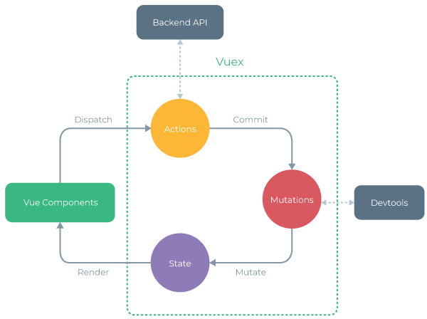
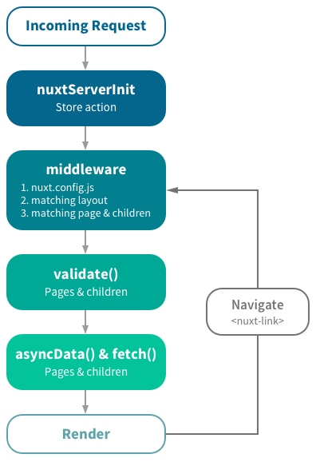

# Vue.js学习笔记

## 目录
1. [vue](#vue)

    1. [模板插值](#模板插值)
    1. [指令 && 特殊attribute](#指令--特殊attribute)
    1. [Vue实例的属性](#vue实例的属性)
    1. [组件](#组件)
    1. [单文件组件](#单文件组件)
    1. [过渡/动画](#过渡动画)
    1. [插件（plugin）](#插件plugin)
    1. [特性](#特性)
    1. [响应式系统](#响应式系统)
    1. [虚拟DOM系统](#虚拟dom系统)
    1. [例子](#例子)
    1. [SSR](#ssr)
1. [vue-router](#vue-router)
1. [vuex](#vuex)
1. [vue-cli](#vue-cli)
1. [nuxt](#nuxt)
1. [jQuery与Vue.js对比](#jquery与vuejs对比)
1. [其他概念](#其他概念)

---

>约定：`vm`（ViewModel）变量名表示：Vue实例。

## [vue](https://github.com/vuejs/vue)
- 心得

    1. 针对不在vue视图内出现的变量：

        >组件的多个实例会共用模块内、组件外的变量（闭包），组件内部的数据则互相独立（类似于`new`实例）。

        1. 若是常量，则可以放在组件外，用`const` + 大写和下划线组成。
        2. 若是会变化的量，则必须放在组件内（`data`或`computed`）。
    2. 注意内存泄漏（全局副作用）：

        1. 在Vue实例内部`new`的其他实例或DOM，应放在`data`内进行掌控，当使用完毕后引导垃圾回收。
        2. 在Vue实例内部手动绑定的事件（如：`addEventListener`）、计时器、http连接、以及任何需要手动关闭的内容，需要在`beforeDestroy`前手动清除（`destroyed`仅自动清除Vue自己定义、绑定的内容）。
    3. 请求异步数据的业务结构：

        1. 独立的API模块专门进行请求数据异步
        2. 在view层触发异步请求（页面创建钩子触发、或用户交互触发）

            1. 使用vuex（建议方式）：

                1. 在view层使用store的`dispatch`发起（模板的响应式数据使用store的`state/getters`）；
                2. 在store模块内引入异步API模块，在`actions`内请求异步数据，得到数据后`commit`改变`state`；
                3. 返回的数据保存位置：

                    1. （一般情况下，）保存在store的`state`，供所有组件使用。
                    2. 当且仅当数据仅是某组件单独使用时（不需要共享数据），`actions`的方法`return`数据给view层，保存在Vue组件实例的`data`。
            2. 不使用vuex、直接在view层引入API模块：

                返回的数据保存在Vue组件实例的`data`。
    4. 项目内文件的命名：

        1. 图片文件用：`_`；（除了.vue）其他所有文件用：`-`
        2. .vue组件用：大驼峰式（PascalCase）或`-`短横线隔开式（kebab-case）
        3. 路由.vue组件用：按该网站当前已有的路由规范命名，如：`-`短横线隔开式（kebab-case）

### 模板插值
1. 支持JS表达式（单个），不支持~~语句~~、~~流控制~~。

    <details>
    <summary>e.g.</summary>

    ```html
    <!-- 可行 -->
    {{ number + 1 }}
    {{ ok ? 'YES' : 'NO' }}
    {{ Array.from(words).reverse().join('') }}
    <div :id="'list-' + id"/>

    <!--
    是语句，不是表达式
    {{ var a = 1 }}

    流控制不会生效，请使用三元表达式
    {{ if ... }}

    不支持分号，无法添加多个表达式
    {{ message; 1 + 1 }}
    -->
    ```
    </details>
2. 只能访问部分全局变量（白名单）；不允许访问自定义的全局变量（引入的其他库变量仅在JS代码中使用）。
3. 作用域在所属Vue实例范围内。

    父级模板里的所有内容都是在父级作用域中编译的；子级模板里的所有内容都是在子级作用域中编译的。

    >特例：父级通过`v-slot="临时变量"`去使用子级`<slot>`给定的属性对应的值。
4. `v-slot`和`<slot>`

    用于父级（`v-slot:某名字`）向子组件（`<slot name="某名字">`）插入内容。
5. 所有渲染结果不包含`<template>`
6. 注意直接用.html写模板在DOM上的，不能用大写字母命名组件。

### 指令 && 特殊attribute
指令（directives）是带有`v-`前缀的DOM的特殊属性。

>JS表达式的值改变时，将响应式地改变DOM。

1. `:`参数

    用于添加指令后的参数。

    - `某指令:[表达式]`动态参数

        由表达式计算的结果为最终`:`后跟的值。

        >e.g. `v-bind:[表达式]='xx'`、`v-on:[表达式]='xx'`、`v-slot:[表达式]`。
2. `v-if`、`v-else`、`v-else-if`

    DOM或组件判定为`false`，则完全销毁（组件会调用`destroyed`）；判定为`true`，则新建。除非使用`<keep-alive/>`包裹。

    - 若切换的DOM或组件是相同的，则根据`key`属性是否相同判断是否复用（未设置`key`则也认为是相同）。

        ><details>
        ><summary>e.g.</summary>
        >
        >```vue
        ><template v-if="loginType === 'username'">
        >  <label>Username</label><!-- 复用 -->
        >  <input placeholder='username' key='username'><!-- 不复用（仅复用相同key值的DOM） -->
        >  <input placeholder='password'><!-- 复用 -->
        ></template>
        ><template v-else>
        >  <label>Email</label><!-- 复用 -->
        >  <input placeholder='address' key='email'><!-- 不复用 -->
        >  <input placeholder='password'><!-- 复用 -->
        ></template>
        >```
        ></details>
3. `v-for="值/(值, 键)/(值, 键, 索引) in/of JS表达式/整数"`

    ><details>
    ><summary>处于同一节点时，<code>v-for</code>比<code>v-if</code>优先级更高（<code>v-if</code>将分别重复运行于每个<code>v-for</code>循环中）</summary>
    >
    >```html
    ><!-- e.g. -->
    ><li v-for="li in lis" v-if="!li.isComplete">
    >  {{ li }} v-if在v-for循环的每一次都运行判断
    ></li>
    >```
    >
    >避免`v-if`和`v-for`同时用在同一个元素上。
    ></details>

    - 在组件中使用`v-for`时，必须添加`key`属性
    - 尽可能在使用`v-for`时提供`key`属性（除非输出的DOM非常简单，或刻意重用DOM以获取性能提升）

        ><details>
        ><summary>e.g.</summary>
        >
        >```html
        ><div v-for="(item, key) in items" :key="item.id || key">
        >  <!-- 内容 -->
        ></div>
        >```
        ></details>
    - `v-for`子组件时，最好都用`props`传入参数，而不用~~全局数据（如：vuex）~~

>（相同标签名的DOM或相同组件切换展示时，）没有提供`key`属性：若数据项的展示/顺序被改变，则Vue将不会~~销毁再新建DOM/移动DOM来匹配数据项的顺序~~，而是保持原DOM尽量不变化，尽量仅在原DOM上修改属性和内部内容，以确保渲染正确。

4. `v-bind`（`v-bind:xx`缩写：`:xx`）绑定DOM属性与JS表达式的结果

    >此DOM属性随表达式最终值改变而改变，直接修改此DOM属性值不改变表达式的值。

    1. 绑定修饰符：

        1. <details>

            <summary><code>.sync</code></summary>

            >仅为语法糖

            `<my-component :foo.sync="bar"/>`

            >监听`foo`值改变：可以用`@update:foo="方法"`（会传入新值）、或`watch` `bar`。

            等价于：

            `<my-component :foo="bar" @update:foo="val => bar = val"/>`


            - 若要达到效果（同步更新bar），还需要在组件中添加：

                ```javascript
                Vue.component('myComponent', {
                  props: ['foo'],
                  template: '<p @click="doIt">{{foo}}</p>',
                  methods: {
                    doIt () {
                      this.$emit('update:foo', 'new value') // 触发自己的事件（调用父级的回调函数），父级事件改变值，再传入子组件
                    }
                  }
                })
                ```
            >不能和表达式一起使用，仅能绑定属性名：错误：~~`v-bind:title.sync="属性名 + '!'"`~~。
            </details>
        2. `.prop`（绑定到DOM的`property`而不是HTML标签的 ~~`attribute`~~）
        3. `.camel`（小驼峰式camelCase转换为大驼峰式PascalCase）
    2. 特殊的DOM属性：

        1. 绑定`class`

            1. `:class="'a b'"`：`class="a b"`
            2. `:class="{ 'a': true, 'b': false }"`：`class="a"`
            3. `:class="['a', 'b']"`：`class="a b"`
            4. `:class="[{ 'a': true, 'b': false }, { 'c': true }, 'd', ['e']]"`：`class="a c d e"`
        2. 绑定`style`

            >1. 自动添加样式前缀。
            >2. CSS属性名可以用小驼峰式（camelCase）或`-`短横线隔开式（kebab-case，需用单引号包裹）命名。

            1. `:style="{ '属性名1': '属性值1', '属性名2': '属性值2' }"`
            2. `:style="[{ '属性名1': '属性值1' }, { '属性名2': '属性值2', '属性名3': '属性值3' }]"`

            - 多重值：渲染数组中最后一个被浏览器支持的值

                e.g. `:style="{ display: ['-webkit-box', '-ms-flexbox', 'flex'] }"`
    3. 传递给子组件DOM属性的值类型

        <details>
        <summary>e.g.</summary>

        ```html
        <!-- 传递字符串 -->
        <my-component some-prop="1">传递字符串'1'</my-component>
        <my-component some-prop="a">传递字符串'a'</my-component>

        <!-- 传递表达式的值 -->
        <my-component :some-prop="1">传递表达式：1（Number）</my-component>
        <my-component :some-prop="'1'">传递表达式：'1'（String）</my-component>
        <my-component :some-prop="a">传递表达式：a（变量是什么类型就是什么类型）</my-component>
        ```
        </details>
    4. 若不带参数的`v-bind="表达式"`，则绑定表达式的所有属性到DOM。

        <details>
        <summary>e.g.</summary>

        ```html
        <div id="test">
          <div v-bind="objs">绑定了title和href属性</div>
          <div v-bind="{alt: 123, href:'https://asd.asd'}">绑定了alt和href属性</div>
        </div>

        <script>
          const vm = new Vue({
            el: '#test',
            data: {
              objs: {
                title: 'My title',
                href: 'http://asd.asd'
              }
            }
          })
        </script>
        ```
        </details>
5. `v-on`（`v-on:xx`缩写：`@xx`）事件监听

    1. 事件修饰符：

        1. `.stop`（阻止冒泡）、`.prevent`（阻止默认行为）、`.capture`（捕获事件流）、`.self`（只当事件在该元素本身而不是子元素触发时才触发）、`.once`（事件将只触发一次）、`.passive`（滚动事件的默认滚动行为将立即触发，而不等待~~scroll~~事件完成）
        2. `.enter`、`.tab`、`.delete`、`.esc`、`.space`、`.up`、`.down`、`.left`、`.right`、`.数字键值`、[KeyboardEvent.key的短横线形式](https://developer.mozilla.org/zh-CN/docs/Web/API/KeyboardEvent/key/Key_Values)、`Vue.config.keyCodes`自定义的键位别名

            键盘。
        3. `.left`、`.right`、`.middle`

            鼠标。
        4. `.native`

            监听组件根元素的原生事件，仅在父级引用子组件处添加。
        5. `.exact`

            精确匹配（有其他按键则失败）。

        >- 可同时使用，但改变顺序会产生不同效果。
        >
        >    <details>
        >    <summary>e.g.</summary>
        >
        >    ```html
        >    <!-- Alt + C -->
        >    <input @keyup.alt.67="clear">
        >
        >    <!-- Ctrl + Click -->
        >    <div @click.ctrl="doSomething">...</div>
        >
        >    <!-- 会阻止所有点击的默认行为，该元素点击触发doThat -->
        >    <div @click.prevent.self="doThat">...</div>
        >
        >    <!-- 只会阻止该元素点击的默认行为，该元素点击触发doThat -->
        >    <div @click.self.prevent="doThat">...</div>
        >    ```
        >    </details>
    2. `$event`原生DOM事件的变量，仅能由HTML内联传入

        <details>
        <summary>e.g.</summary>

        ```html
        <div id="test">
          <a href="#" @click="a($event)">click（第一个）</a>
          <a href="#" @click="a(1, $event)">click（第二个）</a>
        </div>

        <script>
          const vm = new Vue({
            el: '#test',
            methods: {
              a: function (e1, e2) {
                console.log(e1, e2)
              }
            }
          })
        </script>
        ```
        </details>
    3. 自定义事件

        仅定义在父组件对子组件的引用上，只能由子组件内部`vm.$emit`触发，然后触发父级方法，再通过改变父级属性去改变子组件的`props`（或置换组件）。
    4. 支持不带参数绑定（值为**事件-监听器**的键-值的对象）

        >不支持修饰符。

        e.g. `<button v-on="{ mousedown: doThis, mouseup: doThat }"/>`
6. `v-slot`（`v-slot:xx`缩写：`#xx`）插槽

    只允许添加在`template`上（特例见下），且**不能~~嵌套~~使用**。子组件使用`<slot>`在内部插入父级引入的内容。

    >1. 只允许添加在`template`上的特例：被引用的子组件**只使用**默认插槽时，可以简写在引用的子组件上（若要使用多个插槽，则必须始终为所有的插槽使用完整的基于`<template>`的语法）。
    >
    >    e.g. `<子组件 v-slot:default>`、`<子组件 v-slot>`、`<子组件 #default>`
    >2. 若子组件没有包含`<slot name="某名字">`，则父组件引用子组件时的`v-slot:某名字"`的DOM会被抛弃。

    1. 后备内容

        1. 子组件中没有`name`属性或`name="default"`的`<slot>`，匹配父级中*去除所有包含`v-slot:某名字`的DOM*的内容（即：匹配没有`v-slot`或`v-slot`值为空的DOM和内容）。

            >`<slot>`默认`name`为：`default`。
        2. 子组件中`<slot>`的DOM内容，当且仅当没有父级匹配时显示。
    2. 具名插槽

        父级引用子组件，在元素内部添加的标签的DOM属性`v-slot:某名字`；会匹配子组件模板的`<slot name="某名字">`。
    3. 作用域插槽

        父级引用子组件时，使用子组件`<slot>`上的属性对应的值（除了`name`属性）。

        1. 子组件的模板：

            `<slot 组件属性1="字符串" :组件属性2="表达式">`

            >`<slot>`内部是子组件的作用域，和在其上添加的属性内容无关。
        2. 父级使用子组件`<slot>`上显性提供的属性对应值：

            `<template/子组件 v-slot="临时变量">{{ 临时变量.组件属性1 }}{{ 临时变量.组件属性2 }}</template/子组件>`

            （`临时变量 === { 组件属性1: '字符串'. 组件属性2: 表达式 }`）

            >`临时变量`支持解构。

    <details>
    <summary>e.g.</summary>

    ```vue
    // 父级
    <template>
      <div>
        <!-- 特例：被引用的子组件只使用默认插槽 -->
        <VSlotSon v-slot>父组件1</VSlotSon>
        <VSlotSon v-slot:default>父组件2</VSlotSon>
        <VSlotSon #default>父组件3</VSlotSon>

        <VSlotSon>
          <template v-slot:default>
            default 父级内容
          </template>
          <template v-slot:other1>
            other1 父级内容
          </template>
          <template v-slot:other2="sonData">
            other2 父级使用子级显性提供的属性对应值：
            {{ sonData.someData }}
            {{ sonData.a }}
            {{ sonData.b }}
          </template>
        </VSlotSon>
      </div>
    </template>

    <script>
    import VSlotSon from '@/components/VSlotSon.vue'

    export default {
      components: {
        VSlotSon
      }
    }
    </script>


    // 子级
    <template>
      <div>
        <slot>slot默认内容</slot>
        <br>
        <slot name="other1">other1 slot默认内容</slot>
        <br>
        <slot name="other2" :someData="obj" :a="obj.a" b="B!哈">other2 slot默认内容</slot>
        <br>
      </div>
    </template>

    <script>
    export default {
      data () {
        return {
          obj: { a: 'aaa', b: 'bbb' }
        }
      }
    }
    </script>
    ```
    </details>
7. `v-model`表单的双向绑定

    >忽略表单元素上的`value`、`checked`、`selected`等初始值，而仅通过Vue实例赋值。

    1. 表单修饰符：

        `.lazy`（`change`而不是~~input~~事件触发）、`.number`（输入值转为`Number`类型）、`.trim`（过滤首尾空格）
    2. 仅针对部分元素：`<input>`、`<textarea>`、`<select>`、组件
    3. <details>

        <summary>仅为语法糖</summary>

        1. 普通DOM

            `<input v-model="bar">`

            等价于：

            `<input :value="bar" @input="bar = $event.target.value">`
        2. 组件

            `<my-input v-model="bar"/>`

            等价于（默认：属性绑定为`value`、事件绑定为`input`）：

            `<my-input :value="bar" @input="bar = arguments[0]"/>`

            - 若要达到效果（双向数据绑定），还需要在组件中添加：

                ```javascript
                Vue.component('myInput', {
                  props: ['value'],
                  template: '<input :value="value" @input="updateValue($event)">',
                  methods: {
                    updateValue (e) {
                      this.$emit('input', e.target.value) // 触发自己的事件（调用父级的回调函数），父级事件改变值，再传入子组件
                    }
                  }
                })
                ```
        </details>
    4. 绑定的Vue实例的值：

        1. DOM的`value`属性的值；
        2. 若是`type="checkbox"`，则为`true/false`；
        3. 若要获得Vue实例的动态属性值，则：

            1. 用`:value="表达式"`；
            2. 若`type="checkbox"`，则用`:true-value="表达式" :false-value="表达式"`。
    >不能和表达式一起使用，仅能绑定属性名：错误：~~`v-model="属性名 + '!'"`~~。
8. `v-once`只渲染元素和组件一次

    随后的重新渲染，元素/组件及其所有的子节点将被视为静态内容并跳过。这可以用于优化更新性能。
9. `v-text`等价于：`{{  }}`
10. `v-html`输入真正HTML

    ><details>
    ><summary>与其他插值（如：模板插值）的区别</summary>
    >
    >1. `v-html`：`innerHTML`。
    >2. `v-text`、`{{ }}`及其他插值：`innerText（或textContent）`。
    >
    >    >`innerText`与`textContent`区别：[MDN:textContent](https://developer.mozilla.org/zh-CN/docs/Web/API/Node/textContent#与innerText的区别)。
    ></details>
11. `v-pre`不编译

    >e.g. `<p v-pre>{{ 不编译 }}</p>`
12. `v-show`

    总是渲染出DOM，根据值切换`display`值。

    >不支持`<template>`、不支持`v-else`。
13. `v-cloak`指令保持在元素上直到关联实例结束编译

    与CSS一起使用时，在编译完成前使用样式，编译完成后去除样式。
14. `.`修饰符

    >用于指出一个指令应该以特殊方式绑定。

    使用在`v-on`、`v-bind`、`v-model`后添加。
15. `|`使用filters过滤器，参数带入函数运行出结果（支持过滤器串联）

    仅可以在`{{ }}`和`v-bind`中使用（其他如：~~`v-html`~~ 无效、无法在Vue实例中使用）。

    <details>
    <summary>e.g.</summary>

    ```html
    <div id="test">
      <p>{{ 1 | a | b }}</p>    <!-- 3 -->
      <p>{{ num | a | b }}</p>  <!-- 5 -->
      <p :title="num | a | b"/>  <!-- 5 -->
    </div>

    <script>
      // 局部
      const vm = new Vue({
        el: '#test',
        data: {
          num: 2
        },
        filters: {
          a: function (e) {
            return e * 2
          },
          b: function (e) {
            return e + 1
          }
        }
      })


      // 全局
      Vue.filter('a', function (e) {})
      Vue.filter('b', function (e) {})
    </script>
    ```
    </details>
16. 自定义指令（在钩子函数中进行业务）

    `v-自定义指令名`（或`v-自定义指令名="表达式"`、`v-自定义指令名:参数`、`v-自定义指令名.修饰符`）

    ><details>
    ><summary>同一个节点可以添加多个不同参数/修饰符的同一个自定义指令名</summary>
    >
    >e.g. `<div v-observer:10="{ show: xx }" v-observer:20="{ show: yy }" />`：添加2个独立的自定义指令。
    ></details>

    ```javascript
    // 局部
    new Vue({
      // 在局部的模板内使用
      directives: {
        自定义指令名: 钩子对象,
      }
    })


    // 全局
    Vue.directive('自定义指令名', 钩子对象)
    ```

    ><details>
    ><summary><code>钩子对象</code></summary>
    >
    >```javascript
    >{
    >  // 只调用一次，指令第一次绑定到元素时调用。在这里可以进行一次性的初始化设置
    >  bind (el, binding, vnode) {},
    >
    >  // 被绑定元素插入父节点时调用 (仅保证父节点存在，但不一定已被插入文档中)
    >  inserted (el, binding, vnode) {},
    >
    >  // 所在组件的 VNode 更新时调用，但是可能发生在其子 VNode 更新之前。指令的值可能发生了改变，也可能没有。但是你可以通过比较更新前后的值来忽略不必要的模板更新
    >  update (el, binding, vnode, oldVnode) {},
    >
    >  // 指令所在组件的 VNode 及其子 VNode 全部更新后调用
    >  componentUpdated (el, binding, vnode, oldVnode) {},
    >
    >  // 只调用一次，指令与元素解绑时调用
    >  unbind (el, binding, vnode) {}
    >}
    >
    >// 可以把副作用的内容绑定到`el`，方便钩子函数之间传递信息
    >
    >// 钩子对象的函数的第二个参数
    >binding: {
    >  name         // 指令名，不包括`v-`前缀
    >  value        // 指令的绑定值，例如：`v-my-directive="1 + 1"`中，绑定值为`2`
    >  oldValue     // 指令绑定的前一个值，仅在`update`和`componentUpdated`钩子中可用。无论值是否改变都可用
    >  expression   // 字符串形式的指令表达式。例如：`v-my-directive="1 + 1"`中，表达式为`"1 + 1"`
    >  arg          // 传给指令的参数，可选。例如：`v-my-directive:foo`中，参数为`"foo"`
    >  modifiers    // 一个包含修饰符的对象。例如：`v-my-directive.foo.bar`中，修饰符对象为`{ foo: true, bar: true }`
    >}
    >```
    ></details>
17. 特殊attribute

    1. `key`

        <details>
        <summary>决定是否重用DOM（保持原DOM尽量不变化，尽量仅在原DOM上修改属性和内部内容，而不是<del>销毁再新建DOM/移动DOM来匹配数据项的顺序</del>）</summary>

         - key的特殊属性主要用在Vue的虚拟DOM算法，在新旧nodes对比时辨识VNode。

            1. 若不使用`key`，则Vue会使用一种最大限度减少动态元素并且尽可能的尝试修复/再利用相同类型元素的算法。
            2. 使用`key`，它会基于`key`的变化重新排列元素顺序，并且会移除`key`不存在的元素。
        </details>

        >针对：有相同父元素的子元素必须有独特的`key`（重复的`key`会造成渲染错误）。相同标签名的DOM切换展示、或相同组件间切换展示。`v-for`、`v-if`、`<transition/>`、`<transition-group/>`。

        1. 切换的DOM的没有`key`属性或`key`属性相同时：最大化重用DOM。
        2. 切换的DOM的`key`属性不同：不重用DOM。

        - `key`的取值：

            1. 不要用`v-for`生成的~~键或索引~~，因为重新渲染且项的顺序变化时会发生错误（每一个项的`key`都各自等于重新渲染之后的每一个项的`key`）。
            2. 尽量不要用随机数（如：`Math.random()`），除了小概率会碰撞之外，框架无法优化性能。
            3. 每项数据需要一个唯一值作为`key`（如：id），若原数据项没提供，则可在拉到数据时由前端额外加入。

                <details>
                <summary>e.g.</summary>

                ```javascript
                let localCounter = 1

                function getLocalCounter () {
                  return localCounter++
                }


                // 拉到的每个数据加入唯一id
                const item1 = {}
                item1._id = getLocalCounter()
                ```
                </details>
    2. `ref`

        被用来给原生DOM元素或子组件注册引用信息。引用信息注册在`vm.$refs`对象上。

        >1. 初始渲染时无法访问。
        >2. `vm.$refs`不是响应式的，因此不应该在`template`或`computed`做数据绑定。

        1. 添加在原生DOM：指向DOM元素

            >代替原生JS获取DOM，如：~~`document.getElementById`~~。
        2. 添加在子组件：指向子组件Vue实例。
    3. `is`

        有效标签或动态组件。
    4. ~~`slot`~~（已废弃，用`v-slot`代替）

        父级向子组件引入内容。
    5. ~~`slot-scope`、`scope`~~（已废弃，用`v-slot`代替）

        父级使用子组件字符串的作用域名字。
- <details>

    <summary>官方建议的顺序：<a href="https://cn.vuejs.org/v2/style-guide/#元素特性的顺序-推荐">元素特性的顺序</a></summary>

    1. 定义（提供组件的选项）

        - `is`
    2. 列表渲染（创建多个变化的相同元素）

        - `v-for`
    3. 条件渲染（元素是否渲染/显示）

        - `v-if`
        - `v-else-if`
        - `v-else`
        - `v-show`
        - `v-cloak`
    4. 渲染方式（改变元素的渲染方式）

        - `v-pre`
        - `v-once`
    5. 全局感知（需要超越组件的知识）

        - `id`
    6. 唯一的特性（需要唯一值的特性）

        - `ref`
        - `key`
        - `v-slot`
        - ~~`slot`~~
        - ~~`slot-scope`~~
        - ~~`scope`~~
    7. 双向绑定（把绑定和事件结合起来）

        - `v-model`
    8. 其它特性（所有普通的绑定或未绑定的特性）
    9. 事件（组件事件监听器）

        - `v-on`
    10. 内容（覆写元素的内容）

        - `v-html`
        - `v-text`
    </details>

### Vue实例的属性
`new Vue(对象)`

1. `el`（字符串）：选择器

    >限制：只在由`new`创建的Vue实例中。
2. `data`（对象或方法）：数据

    >限制：组件的`data`是方法且返回一个数据对象。

    以`_`或`$`开头的属性不会被Vue实例代理，但可以使用`vm.$data`访问（e.g. `vm.$data._property`）。

    >Vue内置的属性、API方法会以`_`或`$`开头，因此若看到不带这些前缀的Vue实例的属性时，则一般可认为是Vue实例代理的属性（`props`、`data`、`computed`、`methods`、`provide/inject`的属性，或`mixins`传入的属性）。
3. `computed`（对象）：依赖其他值（`props`、`data`、`computed`）的改变而执行，最后`return`值

    <details>
    <summary>默认：<code>get</code>（初始化时会调用一次）；显式设置：<code>set</code>（被赋值时执行）和<code>get</code></summary>

    当未设置`set`时，不能主动去设置`computed`的值（~~`this.计算属性 = 值`~~）；设置了`set`也不能改变自己的值（`set`函数里不能再循环设置自己的值）。

    ```javascript
    // e.g.
    const vm = new Vue({
      data: {
        firstName: 'firstname',
        lastName: 'lastname'
      },
      computed: {
        fullName: {
          // getter
          get: function () { // 初始化和this.firstName或this.lastName改变时调用；this.fullName被赋值时不会直接调用
            return this.firstName + ' ' + this.lastName
          },
          // setter
          set: function (newValue) { // this.fullName被赋值时调用
            const names = newValue.split(' ')
            this.firstName = names[0]
            this.lastName = names[names.length - 1]
            // 不允许`this.fullName = 值`会导致死循环
          }
        }
      }
    })

    // 运行 vm.fullName = 'John Doe' 时，setter 会被调用，vm.firstName 和 vm.lastName 也会相应地被更新
    ```
    </details>

    若`return`的内容不涉及Vue实例的响应式内容（非Vue实例的属性、或已经被`Object.freeze`处理而非响应式的Vue实例的属性），则`computed`的内容就不是响应式的（不进行Vue的响应式绑定处理）。

>在（`props`、）`data`、`computed`先定义再使用，而不要对未使用过的变量进行`this.新变量名 = 值`。

4. `watch`（对象）：被watch的值改变而执行函数（观察的值必须是`props`或`data`或`computed`的属性）

    1. 可以设置`immediate`参数（侦听开始后立即调用一次）
    2. 可以设置`deep`参数（监听的对象的属性修改时调用一次，无论嵌套多深的属性，属性的属性也触发）
    3. 键名可以是`属性1.子属性2`，来观察嵌套的属性值

    >还可以用`vm.$watch`来观察属性改变。

>执行顺序是：（`props` -> ）`data` -> `computed` -> `watch`。

5. `filters`（对象）：过滤器方法

    方法内部没有代理 ~~`this`~~ 到Vue实例。

    >因为不会被Vue实例代理，所以可以和Vue实例代理的属性同名（`props`、`data`、`computed`、`methods`、`provide/inject`的属性，或`mixins`传入的属性`）。
6. `components`（对象）：局部注册组件（仅在此Vue实例中可用）
7. `methods`（对象）：可调用方法

    >1. `new`methods里的方法，方法体内的`this`指向这个实例，而非~~Vue实例~~。建议不要在methods中添加构造函数，而改用`import`方式引入构造函数。
    >2. template的每次改变，都会导致VNode重新渲染，也会导致methods重新调用（无论methods使用的值是否变化）。
    >
    >    若在`template`里调用`methods`中的方法从而绑定了数据（因为template最终是成为render函数，且每一次的数据改变都会导致整个组件的VNode重新渲染（VNode在differ之后的nextTick才会真的在DOM中重新渲染），其他方式的数据都有缓存，而调用`methods`的值没有缓存），则数据由调用`methods`而绑定的值，会随着任意模板数据改变而重新执行求值（无论methods使用的值是否变化）。

><details>
><summary><code>methods</code>、生命周期钩子都能使用<code>async-await</code></summary>
>
>e.g.
>
>```javascript
>async mounted () {
>  await this.login()
>
>  console.log('等待上面await的Promise完成或失败后才往下继续执行')
>},
>methods: {
>  login () {
>    return new Promise((resolve, reject) => {
>      shouldLogin(err => {
>        if (err) {
>          reject(err)
>        }
>        resolve()
>      })
>    })
>  },
>
>  async openQuestion () {
>    await this.login()
>
>    console.log('等待上面await的Promise完成或失败后才往下继续执行')
>  }
>}
>```
></details>

8. 生命周期钩子

    1. `beforeCreate`

    >实例的（`props`、）`data`、`computed`、`watch`等实例内容的创建。

    2. `created`

    >渲染模板。

    3. `beforeMount`
    4. `mounted`

        >不判断子组件是否挂载完毕。若希望整个视图都渲染完毕，可以用`vm.$nextTick`。

    >页面加载后就要展现的数据，可以在`created`、`beforeMount`、`mounted`请求（`vue-router`、`nuxt`等封装了更方便的钩子，可控制更多执行时机，如：路由切换前后、数据加载完毕前后）。

    5. `beforeUpdate`
    6. `updated`

        >不判断子组件是否更新完毕。若希望整个视图都渲染完毕，可以用`vm.$nextTick`。
    7. `activated`

        >`<keep-alive/>`组件特有，内部组件激活时在内部组件调用。
    8. `deactivated`

        >`<keep-alive/>`组件特有，内部组件停用时在内部组件调用。
    9. `beforeDestroy`

        >可将大部分内存清理工作放在`beforeDestroy`。
    10. `destroyed`

        >调用后，Vue实例指示的所有内容都会解绑，所有Vue事件监听器会被移除，所有子实例也会被销毁。
    11. `errorCaptured`

    <details>
    <summary>生命周期图示</summary>

    
    </details>
9. `mixins`（数组，每一项为Vue实例的属性）：混入

    mixin数组每一项中的属性，都会合并到组件本身的选项（如：mixin的`methods`合并到组件的`methods`、mixin的`data`合并到组件的`data`）。

    1. 钩子函数都会调用：混入对象的钩子优先调用，组件自身的钩子之后调用。
    2. 非钩子函数属性，若有同名内容，则合并之后，组件自身内容覆盖mixin：

        `methods`、`components`、`directives`等，合并为同一个对象；对象内部键名冲突时（如：`methods`都有某同名方法），使用组件对象的内容、丢弃mixin的内容。

    - 作用域：

        1. 局部：组件局部注册，仅在本组件内起作用，对子组件无效。
        2. 全局：`Vue.mixin`全局注册，将会影响之后创建的（之前的不受影响）Vue实例，包括第三方模板。

- <details>

    <summary>官方建议的顺序：<a href="https://cn.vuejs.org/v2/style-guide/#组件-实例的选项的顺序-推荐">组件/实例的选项的顺序</a></summary>

    1. 副作用（触发组件外的影响）

        - `el`
    2. 全局感知（要求组件以外的知识）

        - `name`
        - `parent`
    3. 组件类型（更改组件的类型）

        - `functional`
    4. 模板修改器（改变模板的编译方式）

        - `delimiters`
        - `comments`
    5. 模板依赖（模板内使用的资源）

        - `components`
        - `directives`
        - `filters`
    6. 组合（向选项里合并属性）

        - `extends`
        - `mixins`
    7. 接口（组件的接口）

        - `inheritAttrs`
        - `model`
        - `props/propsData`
    8. 本地状态（本地的响应式属性）

        - `data`
        - `computed`
    9. 事件（通过响应式事件触发的回调）

        - `watch`
        - 生命周期钩子（按照它们被调用的顺序）

            - `beforeCreate`
            - `created`
            - `beforeMount`
            - `mounted`
            - `beforeUpdate`
            - `updated`
            - `activated`
            - `deactivated`
            - `beforeDestroy`
            - `destroyed`
            - `errorCaptured`
    10. 非响应式的属性（不依赖响应系统的实例属性）

        - `methods`
    11. 渲染（组件输出的声明式描述）

        - `template/render`
        - `renderError`
    </details>

### 组件
>所有Vue组件同时也都是Vue实例。

1. 组件属性：

    1. `template`（字符串）：组件的字符串模板
    2. `props`（数组或对象）：接受父级传递内容

        1. 数组：接受的DOM属性名
        2. 对象：`{ 接受的DOM属性名: 验证方式, }`

            - 验证方式：

                1. 原生构造器（`String`、`Number`、`Boolean`、`Function`、`Object`、`Array`）、或`Symbol`、`BigInt`、或`null`（允许任何类型）
                2. 上面类型组成的数组
                3. 对象

                    1. `type`：原生构造器、或`null`、或原生构造器的数组
                    2. `required`：是否必须（默认：`false`）
                    3. `default`：基本数据类型的值；对象或数组必须从工厂函数返回默认值（当且仅当没有传入时才使用或调用）

                    >`required`和`default`二选一。

                    4. `validator`：验证方法（对子组件的任何修改包括`v-show`修改以及自身`default`，都会触发所有prop的验证方法）

                    >props会在一个组件实例创建之前进行验证，所以实例的属性（如：`data`、`computed`、`methods`等）在`default`或`validator`函数中不可用。
    3. `data`（方法）：`return`数据对象

        ```javascript
        data () {   // 组件多个实例间不共享数据对象
          return {
            a: 0,
            b: ''
          }
        }
        ```

        >1. `v-for`循环的每个实例都调用创建一份。
        >2. 仅执行一次，父组件传进来的props改变也不再触发执行。
    4. `model`（对象，包含`prop`、`event`）：修改`v-model`默认使用的属性和事件
    5. `name`（字符串）

        默认：`undefined`。
    - 其他与Vue实例的属性相同（除了一些根级特有的选项）
2. 注册组件方式：

    >要确保在初始化Vue实例之前注册了组件。

    ```javascript
    // 局部
    new Vue({
        components: {
            '组件元素名': 对象 // 仅在此Vue实例中可用
        }
    })


    // 全局
    Vue.component('组件元素名', 对象)
    ```
3. 组件命名：

    >W3C规定的组件命名要求：小写，且包含一个`-`。

    1. JS注册组件或`props`：

        `-`短横线隔开式（kebab-case）、小驼峰式（camelCase）、大驼峰式（PascalCase）。
    2. HTML中：

        1. 仅能使用`-`短横线隔开式（把大/小驼峰式用`-`隔开并小写单词代替）
        2. 在JS字符串模版、`.vue`组件，可以使用额外方式

            <details>
            <summary>e.g.</summary>

            ```html
            <!-- HTML必须是`-`短横线隔开式 -->
            1. <kebab-cased-component/>
            2. <camel-cased-component/>
            3. <pascal-cased-component/>

            <!-- 在JS字符串模版、.vue组件额外可以使用 -->
            1. 无
            2. <camelCasedComponent/>
            3. <pascalCasedComponent/>
            3. <PascalCasedComponent/>

             <script>
             // 注册的组件
             new Vue({
               components: {
                 'kebab-cased-component': {},
                 camelCasedComponent: {},
                 PascalCasedComponent: {}
               }
             })
             </script>
            ```
            </details>
4. 使用组件：

    1. `<组件名/>`

        >不会导致渲染出错的方式：JS字符串模版、`.vue`组件。
    2. `<有效标签 is="组件名"/>`
    3.  动态组件：`<component :is="表达式"/>`

        >~~`<component is="组件名字符串"/>`~~ 也可执行，只不过写死了某个组件，没有了「动态」的意义。

        ```html
        <div id="test">
          <component :is="current1"/>
          <component :is="current2"/>
        </div>

        <script>
          const vm = new Vue({
            el: '#test',
            data: {
              current1: { template: '<p>111</p>' }, // 对象，则当作组件对象渲染
              current2: 'component2'                // 字符串，则搜索已注册的components
            },
            components: {
              component2: { template: '<p>222</p>' }
            }
          })
        </script>
        ```

        - `<keep-alive/>`包裹，保留它的状态或避免重新渲染。
    4. `<keep-alive/>`

        `<keep-alive>组件</keep-alive>`，会缓存不活动的组件实例，而不是销毁、重建。当组件在其内被切换时，组件的`activated`、`deactivated`被对应执行。
5. 通信

    >组件（Vue实例）有自己独立的作用域，虽然可以访问到互相依赖关系（`vm.$parent`、`vm.$children`、`vm.$refs`），但是不推荐（不允许）通过依赖获取、修改数据。

    1. 父子组件间的通信

        1. 父（`props`） -> 子：传入属性值；子（`vm.$emit`） -> 父：触发外部环境事件，外部事件再改变传进组件的`props`值。

            1. 父 -> 子：通过`props`向下传递初始化数据给子组件实例（不出现在DOM中）

                >（当`inheritAttrs`默认`true`时，）添加在DOM上而不在`props`的声明，则仅添加到子组件最外层的DOM属性，不传入子组件。其中`class`和`style`属性会合并，其他属性会覆盖。

                1. `props`是单向传递的：当父级的属性变化时，将传导给子组件，不会反过来

                    每次父组件更新时，子组件的所有prop都会更新为最新值。
                2. 不应该 ~~在子组件内部改变`props`~~（只能`vm.$emit`到父级再由父级传`props`进子组件来改变）。

                    1. 仅展示：直接在模板引用`props`。
                    2. 一次性传值（仅首次传值有效，后续传值无法修改`data`。故不推荐）：`props` -> `data`。
                    3. 每次对传值内容进行修改后使用：`props` -> `computed`。
                    4. 每次根据传值内容进行其他逻辑：`props` -> `watch`。

                    <details>
                    <summary>e.g.</summary>

                    ```javascript
                    Vue.component(
                      'myComponent',
                      {
                        props: ['father'], // 可以直接用在子组件内展示
                        data () {
                          return {
                            son1: this.father  // 仅接受首次传值，后续的props变化不再改变（不推荐）
                          }
                        },
                        computed: {
                          son2() {
                            return this.father // 每次对传值内容进行修改后使用
                          }
                        },
                        watch: {
                          father(data) { // 每次根据传值内容进行其他逻辑
                            console.log(data)
                          }
                        },
                        template: '<div>{{ father }}-{{ son1 }}- {{ son2 }}</div>'
                      }
                    )
                    ```
                    </details>

                >注意：避免**引用数据类型**导致的子组件改变父级。

                - 还可以通过`provide/inject`从父级向所有子孙后代传递数据。

                ><details>
                ><summary>传递<code>Function</code>数据类型</summary>
                >
                >```vue
                ><template>
                >  <div>
                >    <Son
                >      :func-data="funcData"
                >      :func-methods="funcMethods"
                >    />
                >  </div>
                ></template>
                >
                ><script>
                >import Son from '@/components/Son'
                >
                >function f () {
                >  return '父级方法'
                >}
                >
                >export default {
                >  name: 'Father',
                >  components: {
                >    Son
                >  },
                >  data () {
                >    return {
                >      funcData () {
                >        console.log(f())   // 传递给子组装件，f也是本组件方法
                >        console.log(this)  // 不会bind本组件上下文，this指向null（若传递给子组件并在`methods`使用，会bind子组件的上下文）
                >      }
                >    }
                >  },
                >  methods: {
                >    funcMethods () {
                >      console.log(f())     // 传递给子组装件，f也是本组件方法
                >      console.log(this)    // 会bind本组件上下文，this指向本组件（传递给子组件或其他bind都不改变this指向本组件）
                >    }
                >  }
                >}
                ></script>
                >```
                ></details>
            2. 子 -> 父：通过`vm.$emit`向上传递事件、参数

                >`vm.$listeners`能获得父级的所有能够从子级向上传递的事件。

                1. 在父级引用子组件处添加`@自定义事件1="父方法"`监听；

                    >若`自定义事件1`是原生事件，可以添加`.native`修饰符，监听组件根元素的原生事件（不再接收子组件的 ~~`vm.$emit`~~）。
                2. 在子组件方法体内添加`vm.$emit('自定义事件1', 参数)`向上传递。

                - 孙子 -> 父：

                    1. 下面「非父子组件通信」的方式。
                    2. 由子组件一层层往上传递给父级。

                        <details>
                        <summary>e.g.</summary>

                        1. 父级

                            ```html
                            <template>
                              <Emit1
                                @transmission="transmission"
                              />
                            </template>

                            <script>
                            import Emit1 from '@/components/Emit1'

                            export default {
                              name: 'Emit',
                              components: {
                                Emit1
                              },
                              methods: {
                                transmission (...data) {
                                  console.log('transmission', ...data)
                                }
                              }
                            }
                            </script>
                            ```
                        2. 中间传递的子级

                            1. 新增方法名（传递参数列表）

                                ```vue
                                <template>
                                  <Emit2
                                    @transmission="transmission"
                                  />
                                </template>

                                <script>
                                import Emit2 from '@/components/Emit2'

                                export default {
                                  components: {
                                    Emit2
                                  },
                                  methods: {
                                    transmission (...data) {
                                      this.$emit('transmission', ...data)   // 传递参数列表
                                    }
                                  }
                                }
                                </script>
                                ```
                            2. 不增加方法名（传递参数列表组成的数组）

                                ```vue
                                <template>
                                  <div>
                                    <!-- 不能用`...`展开元素，和Babel不兼容 -->

                                    <Emit2
                                      @transmission="$emit('transmission', Array.prototype.slice.call(arguments))"
                                    />
                                    <!-- 或 -->
                                    <Emit2
                                      @transmission="(...data) => $emit('transmission', data)"
                                    />
                                  </div>
                                </template>

                                <script>
                                import Emit2 from '@/components/Emit2'

                                export default {
                                  components: {
                                    Emit2
                                  }
                                }
                                </script>
                                ```
                        3. 孙子组件

                            ```vue
                            <template>
                              <a href="javascript:" @click="$emit('transmission', 1, [], {a:3})">
                                Emit2按钮
                              </a>
                            </template>
                            ```
                        </details>
                    3. 通过`provide/inject`从父级向所有子孙后代传递数据，传递父级的Vue实例（不推荐）。
        2. 父 -> 子：触发子组件的方法

            1. 父级引用子组件通过`$refs`直接调用子组件的方法（`vm.$refs.子组件引用名.子组件的methods方法()`）。
            2. 父级通过传递`props`，子组件`watch`而触发子组件方法（或其他方式让子组件能够`watch`而执行的方式，如：vuex）。
    2. 非父子组件通信

        1. 在简单的场景下，可以使用一个空的Vue实例作为中央事件总线。

            ```javascript
            const bus = new Vue()   // vm.$emit只能向自己的Vue实例发送触发事件通知

            // 触发组件 A 中的事件
            bus.$emit('事件名', 传参)

            // 在组件 B 创建的钩子中监听事件
            bus.$on('事件名', function (para) {})
            ```
        2. 或专门状态管理模式，如：[vuex](https://github.com/realgeoffrey/knowledge/blob/master/网站前端/Vue.js学习笔记/README.md#vuex)。
    - 组件的API来自三部分

        `<my-component :子属性="父属性" @父事件="父方法"><template v-slot:某名字="临时变量">插槽内容</template></my-component>`

        1. `props`：允许外部环境传递数据给组件。
        2. `events`：允许从组件内触发外部环境的副作用。
        3. `slots`：允许外部环境将额外的内容组合在组件中。
6. 内置组件

    1. `<component/>`
    2. `<transition/>`
    3. `<transition-group/>`
    4. `<keep-alive/>`
    5. `<slot/>`
- 杂项

    1. 父级引用组件时添加属性`ref="字符串"`，可以在Vue实例的`$refs`中访问子组件。
    2. 内联模板：

        引用组件时，添加`inline-template`DOM属性。组件的内容当作模板，而不是分发内容。
    3. `<script type=text/x-template id="id名">`

        ```javascript
        Vue.component('组件名', {
          template: '#id名'
        })
        ```
    4. 当组件中包含大量静态内容时，可以考虑使用`v-once`将渲染结果在组件注册的`template`字段里缓存起来。
    5. 若组件内有多个`if-else`的展示逻辑，则尽量创建新的子组件，把每个子组件的逻辑放到子组件内部。
    6. 异步组件。
    7. 高级异步组件。
    8. 递归组件。
    9. 循环组件。

### 单文件组件
1. （有导出的）组件内部可以直接引用自身组件（小心无止境的循环引用）
2. 大部分都用局部注册。除非是大范围的统一功能，才用全局方式，才用插件方式。
3. 样式引入

    1. 全局起作用（在任意地方引入样式，导致所有页面都使用样式）

        1. 在任意地方引入CSS文件（非 ~~`scoped`~~）

            >在多个组件多次引入同一个CSS文件（允许同时使用JS和CSS两种方式混合引入），最终只会引入同一个CSS文件一次。

            1. `<script>import '@/assets/文件名.css'</script>`
            2. `<style src="@/assets/文件名.css"/>`
        2. 在任意地方引入没有 ~~`scoped`~~ 的`<style>`：

            `<style>样式内容</style>`
        3. 在`public/index.html`中添加静态样式
    2. 局部样式

        1. `scoped`（[vue-loader的Scoped CSS](https://vue-loader.vuejs.org/zh/guide/scoped-css.html)）

            1. `scoped`方式引用整个样式文件：

                `<style scoped src="@/assets/文件名.css"/>`

                >~~全局起作用、无法识别`@`~~：`<style scoped>@import "../assets/文件名.css";</style>`。`<style>`内只能用相对路径，不能用`@/~`。
            2. `scoped`的`<style>`：

                `<style scoped>样式内容</style>`

            - 使用`scoped`的**单文件组件**内所有Element（包括**其引用的子组件**），都会添加自定义`attributes`（如：`data-v-2185bf6b`）；非Vue内部生成的节点（手动添加）不会添加自定义`attributes`。

                若已添加`scoped`的子组件也添加`scoped`，则增加一份子组件的自定义`attributes`。

                >深度作用选择器：若希望`scoped`样式中的一个选择器能够作用得「更深」（如：影响子组件），则可使用`>>>`或`/deep/`或`::v-deep`操作符（不支持预处理器，如：~~scss~~）。
                >
                >e.g.
                >```vue
                ><style scoped>
                >  .a >>> .b { /* 等价于：`.a /deep/ .b`或`.a ::v-deep .b` */ }
                >  .c > .d {}
                >
                >  // 编译为：
                >  .a[data-v-039c5b43] .b {}
                >  .c > .d[data-v-039c5b43] {}
                ></style>
                >```
        2. `module`（[vue-loader的CSS Modules](https://vue-loader.vuejs.org/zh/guide/css-modules.html)）

            在`<style>`添加`module`，即在Vue实例内加入`$style`对象，访问单文件组件内`<style module>`的选择器。
4. <details>

    <summary><del>可以在组件内部（或Vue实例内部）或外部，再创建另一个Vue实例，并且可以互相通信</del></summary>

    >不推荐、反模式。

    主要为了解决：要挂载到不在组件操作范围内的DOM、或组件外生成的DOM（如：富文本内要嵌入Vue实例）。

    ```javascript
    // 某单文件组件One.vue
    import Vue from 'vue'
    import store from '@/store'     // 若是nuxt，则直接使用实例上：vm.$store
    import router from '@/router'   // 若是nuxt，则直接使用实例上：vm.$router
    import OtherComponent from '@/components/Other.vue'

    export default {
      data () {
        return {
          text: '123',
          vm: null
        }
      },
      mounted () {
        // 新建一个Vue实例
        const OtherVue = Vue.extend(OtherComponent)  // 创建Vue子类，继续创建Vue实例需要再`new`创建好的子类
        this.vm = new OtherVue({  // 后定义，类似于mixin的合并逻辑（钩子：先定义执行 -> 后定义执行；非钩子：后定义执行、先定义忽略）
          store,  // 共享store。若是nuxt，则直接：store: this.$store
          router, // 共享router。若是nuxt，则直接：router: this.$router
          beforeDestroy () {    // 合并。先定义的钩子先执行，后定义的钩子后执行
            this.$el.remove()   // 删除dom自己
          },
          methods: {  // 合并。若属性名相同则后定义的覆盖先定义的
            changeFatherText: () => {
              this.text = Math.random() // this为当前的组件One.vue
            }
          },
          computed: {  // 合并。若属性名相同则后定义的覆盖先定义的
            myText: () => {
              return this.text  // // this为当前的组件One.vue
            }
          },
          propsData: {
            传入的props属性: 值
          }
        }).$mount()

        document.getElementById('other').appendChild(this.vm.$el)
      },
      beforeDestroy () {
        this.vm.$destroy()
      }
    }
    ```
    </details>

- 官方建议的单文件组件命名：

    1. 通用

        1. 两个及以上单词
        2. 大驼峰式（PascalCase）或`-`短横线隔开式（kebab-case）

            >选择一种方式后，应该在项目中始终仅使用这种方式，不要在同一个项目中混用两种命名方式。
    2. 基础组件名（以`Base`、`App`、`V`开头）

        应用特定样式和约定的基础组件（展示类的、无逻辑的、无状态的组件，绝对不包括~~全局状态，如：vuex~~），以一个特定的前缀开头，如：`Base`、`App`、`V`。
    3. 单例组件名（以`The`开头）

        只应该拥有单个活跃实例的组件应该以`The`前缀命名，以示其唯一性。每个页面最多使用一次，不接收~~props~~。
    4. 紧密耦合的组件名（以完整父组件名开头）

        和父组件紧密耦合的子组件应该以父组件名作为前缀命名。

### 过渡/动画
>此处描述的「帧」是`requestAnimationFrame`（在浏览器下一次重绘之前执行），而不是~~Vue的`nextTick`~~（在Vue控制的DOM下次更新循环结束之后执行）。

- 插入、更新、移除DOM时，提供过渡/动画的操作

    1. 在CSS过渡/动画中自动应用class（可配合使用第三方CSS动画库，如：[animate.css](https://github.com/daneden/animate.css)）
    2. 在过渡钩子函数中使用JS直接操作DOM（可配合使用第三方JS动画库，如：[velocity](https://github.com/julianshapiro/velocity)）

1. `<transition/>`（仅针对第一个子元素）

    >1. 过渡/动画效果仅加在第一个子元素上（子元素内部不会触发）。
    >2. `<transition/>`内仅能展示唯一一个子元素（多个元素用`<transition-group/>`）。
    >3. 不添加真实的DOM，只有逻辑（`<transition-group/>`会添加真实的DOM）。
    >4. 组件最外层是`<transition/>`无法触发动画，要在外部嵌套一层DOM。

    提供给包裹的第一个子元素（任何DOM或组件）**进入/离开**的过渡/动画效果。

    1. 触发条件：

        ①在`<transition/>`内嵌套子元素，在子元素上进行以下操作；或②引用根节点是`<transition/>`的组件，在父级引用上进行以下操作、或在此组件根节点`<transition/>`内嵌套的子元素进行以下操作：

        1. `v-if`（`v-else`、`v-else-if`）
        2. `v-show`
        3. `<component :is="表达式"/>`
    2. 触发机制：

        1. 自动嗅探目标元素是否应用了CSS过渡/动画。若是，则在恰当的时机添加/删除CSS类名。
        2. 若`<transition/>`添加了过渡钩子，则这些钩子函数在恰当的时机被调用。

        - 若以上都没有，则DOM操作在下一帧执行。
    3. 特殊的props（在`<transition/>`组件引用上添加）：

        1. `name`：用于自动生成CSS过渡/动画类名的前缀（默认：`'v'`）

            <details>
            <summary>在进入/离开的过渡/动画中，class切换（若监测到已手动添加了相关类的样式，才会切换）</summary>

            >1. 以`name`默认为`'v'`为例。
            >2. 过渡：CSS的`transition`；动画：CSS的`animation-@keyframes`。

            1. 进入过程

                1. `v-enter`：

                    >定义具体进入过渡的样式（若`v-enter-active`使用`animation-@keyframes`，则可以不设置`v-enter`的样式）。

                    定义进入过渡的开始状态。存在时间：在元素插入之前开始；在元素插入之后的下一帧结束（与此同时`v-enter-to`被添加）。
                2. `v-enter-active`：

                    >定义进入过渡/动画的过程时间、延迟、曲线函数（CSS的`transition`或`animation-@keyframes`）。

                    定义进入过渡/动画的整个状态。存在时间：在`v-enter`存在之后、且元素插入之前开始；在过渡/动画完成之后结束。
                3. `v-enter-to`：

                    >定义元素的初始状态（若和元素本身样式相同，则可以不设置`v-enter-to`的样式）。

                    定义进入过渡的结束状态。存在时间：在元素插入之后下一帧开始 (与此同时`v-enter`被移除)；在过渡/动画完成之后结束。
            2. 离开过程

                1. `v-leave`：

                    >定义元素的初始状态（若和元素本身样式相同，则可以不设置`v-leave`的样式）。

                    定义离开过渡的开始状态。存在时间：在离开过程触发时开始；下一帧结束（与此同时`v-leave-to`被添加）。
                2. `v-leave-active`：

                    >定义离开过渡/动画的过程时间、延迟、曲线函数（CSS的`transition`或`animation-@keyframes`）。

                    定义离开过渡/动画的整个状态。存在时间：在`v-leave`存在之后开始；在过渡/动画完成之后结束。
                3. `v-leave-to`：

                    >定义具体离开过渡的样式（若`v-leave-active`使用`animation-@keyframes`，则可以不设置`v-leave-to`的样式）。

                    定义离开过渡的结束状态。存在时间：在离开过程触发的下一帧开始（与此同时`v-leave`被移除）；在过渡/动画完成之后结束（与此同时元素移除）。
            </details>
        2. 自定义过渡/动画的类名

            >优先级高于普通的类名，主要用于和第三方CSS动画库配合，如：[animate.css](https://github.com/daneden/animate.css)。

            1. `enter-class`
            2. `enter-active-class`
            3. `enter-to-class`
            4. `leave-class`
            5. `leave-active-class`
            6. `leave-to-class`
        3. `type`：指定过渡事件类型（`'transition'`或`'animation'`。默认：自动检测出持续时间长的）
        4. `duration`：不根据过渡/动画的JS事件，而手动设置过渡/动画时间（毫秒）

            >e.g. `:duration="1000"`或`:duration="{ enter: 500, leave: 800 }"`
        5. `css`：是否使用CSS过渡/动画的class（默认：`true`。若`false`，则只触发过渡钩子）
        6. 过渡钩子事件：

            >建议对于仅使用JS过渡的`<transition/>`添加`:css="false"`。

            1. 进入过程

                1. `before-enter`
                2. `enter`（与CSS结合使用。当只用JS过渡时，在`enter`中必须调用函数的第二个参数`done`）
                3. `after-enter`
                4. `enter-cancelled`
            2. 离开过程

                1. `before-leave`
                2. `leave`（与CSS结合使用。当只用JS过渡时，在`leave`中必须调用函数的第二个参数`done`）
                3. `after-leave`
                4. `leave-cancelled`
        7. `appear`：是否在初始渲染时使用过渡/动画（默认：`false`）

            - （可选）初始渲染时使用额外的类名、钩子事件（`:appear="true"`）

                1. 初始渲染的自定义过渡/动画的类名：

                    1. `appear-class`
                    2. `appear-active-class`
                    3. `appear-to-class`
                2. 初始渲染的过渡钩子事件：

                    1. `before-appear`
                    2. `appear`
                    3. `after-appear`
                    4. `appear-cancelled`
        8. `mode`：（当有子元素切换时，）控制进入/离开的过渡顺序（`'out-in'`：先离开后进入；`'in-out'`：先进入后离开。默认：同时进行）
    4. `<transition/>`内嵌的子元素切换：

        1. 若是**原生DOM**子元素用`v-if`（`v-else`、`v-else-if`）作为切换，则必须在这些子元素上添加 **`key`** 属性。
        2. 若是**组件**子元素，则不需要额外添加 ~~`key`~~ 属性。

            1. 用`v-if`（`v-else`、`v-else-if`）作为切换。
            2. 用动态组件`<component :is="表达式"/>`进行切换。

>选择：仅渲染一个节点：`<transition/>`；渲染多个节点：`<transition-group/>`。

2. `<transition-group/>`

    >子元素必须添加 **`key`** 属性。

    1. 触发条件、触发机制与`<transition/>`类似。
    2. 特殊的props（在`<transition-group/>`组件引用上添加）：

        1. `tag`：子级外层嵌套的标签名（默认：`'span'`）
        2. `move-class`：用于自动改变定位时引用的类名（默认：`name`属性的值 + `'-move'`）

        - 除了 ~~`mode`~~ 无效之外，拥有与`<transition/>`相同的props

>自制可复用的过渡组件：把`<transition/>`或`<transition-group/>`作为根组件。

### 插件（plugin）
```javascript
// 插件是.js文件，应当有一个公开的install方法
const MyPlugin = {}
MyPlugin.install = function (Vue, options) { // 第一个参数是Vue构造器，第二个参数是Vue.use时传入的可选参数对象
  // 1. 添加全局方法或属性
  Vue.myGlobalMethod = function () {
    // 逻辑...
  }

  // 2. 添加全局资源（Vue.directive、Vue.filter、Vue.component）

  // 3. 全局混入
  Vue.mixin({
    created: function () {
      // 逻辑...
    },
  })

  // 4. 添加实例方法（约定用`$`开头来命名原型自定义属性）
  Vue.prototype.$myMethod = function (methodOptions) {
    // 逻辑...
  }
}


// 在其他地方使用
Vue.use(MyPlugin, { /* 向MyPlugin传入的参数 */ })  // Vue.use会自动阻止多次注册相同插件，届时只会注册一次该插件。
```

>- 制作插件供Vue项目使用：
>
>    1. 导出包含`install`的对象，这样项目`Vue.use(引入的包含install的对象)`就全局注册该插件。
>    2. 也可导出具体的内容（如：组件、自定义指令），由项目选择：
>
>        1. 调用对应的全局API全局注册（如：`Vue.directive('自定义指令名', 导出的自定义指令对象)`）
>        2. 在项目本地插件内局部注册（如：`directives: { '自定义指令名': 导出的自定义指令对象 }`）。
>
>    - 可以合起来导出：
>
>        ```javascript
>        import 组件名字 from './路径/组件名字.vue'
>
>        组件名字.install = (Vue, options = {}) => {
>          // 具体install注册组件的各种方式
>        }
>
>        export default 组件名字
>        ```
>
>        <details>
>        <summary>不推荐</summary>
>
>        ```javascript
>        import 组件名字 from './路径/组件名字.vue'
>
>        const plugin = {
>          install (Vue, options = {}) {
>            // 具体install注册组件的各种方式
>          }
>        }
>
>        // 会导致一些打包模式下出问题
>        export {
>          plugin as default,
>
>          组件名字
>        }
>        ```
>        </details>

### 特性
1. Vue实例代理的属性（`props`、`data`、`computed`、`methods`、`provide/inject`的属性，或`mixins`传入的属性），在内部`vm.名字`访问，可以直接使用，**所有属性名字都不能重复**（filters不属于同一类）；也有以`$`开头的Vue实例属性（如：`vm.$el`、`vm.$props`、`vm.$data`、`vm.$watch`）。

    只有已经被代理的内容是响应的（Vue实例被创建时传入的属性），值的改变（可能）会触发视图的重新渲染。
2. **Vue实例的属性**和**Vue实例的属性的属性**，慎用~~箭头函数~~，因为`this`的指向无法按预期指向Vue实例。
3. 因为HTML不区分大小写，所以大/小驼峰式命名的JS内容，在HTML使用时要转换为相应的`-`短横线隔开式。

    不受限制、不需要转换：JS字符串模版、`.vue`组件。

    >JS字符串模版：`<script type="text/x-template">`、JS内联模板字符串。
4. Vue实例（`Vue`）或Vue组件实例（`VueComponent`）挂载在DOM，会在这个DOM上增加`__vue__`属性指向这个Vue实例或Vue组件实例（生产环境也行）。

### 响应式系统
1. 当把对象传给Vue实例的`data`和vuex的store时，Vue将遍历此对象所有的属性，并使用`Object.defineProperty`把这些属性全部转为`getter/setter`（访问器属性）。

    - `Object.defineProperty`

        >类似的：`Object.defineProperties`。

        数据劫持，直接修改数据触发、或事件监听触发。

        - 针对数组，修改了数组的某些mutator方法，调用这些方法后也触发。
    >1. 针对不需要响应式变化的属性（但要展示到`template`），可以用`Object.freeze`处理，就不会进行`Object.defineProperty`响应式处理。
    >
    >    <details>
    >    <summary>e.g.</summary>
    >
    >    `x: Object.freeze({ y: 1 })`：
    >
    >    1. `x`是响应式的。
    >    2. `x`指向的对象不是响应式的，无法通过`x.y = 2`去响应式修改。
    >    3. 若`x = { y: 2 }`指向新的响应式对象，之后`x.y = 3`会响应式触发视图更新。
    >    </details>
    >2. 针对不需要展示到`template`的属性，可以不把属性初始化在`data`中，而是直接`vm.属性 = 值`在JS中使用（这个属性值无法绑定到`template`中显示，意味着给这个属性值赋值之后，`{{ 属性 }}`也总是为空）。
2. 每个组件实例都有相应的`watcher`实例对象，它会在组件渲染的过程中把属性记录为依赖，之后当依赖项的`setter`被调用时，会通知`watcher`重新计算，从而致使它关联的组件得以更新（[虚拟DOM系统](https://github.com/realgeoffrey/knowledge/blob/master/网站前端/Vue.js学习笔记/README.md#虚拟dom系统)）。
3. 响应式操作：Vue实例的`data`的属性值、vuex的store的属性值

    >约定：原对象、原数组、原属性均为已存在的、响应式的数据。

    1. 导致视图更新：

        1. 原数组的某些mutator方法：`push`、`pop`、`unshift`、`shift`、`reverse`、`sort`、`splice`
        2. 原属性赋值给任意类型的新值（`=`）

            - 原属性的属性值是原对象/原数组：

                1. 扩展原对象：`原对象 = Object.assign({}, 原对象, { 键: 新值 })`或`原对象 = { ...原对象, 键: 新值 }`
                2. 扩展原数组：`原数组 = [ 新值, ...原数组, 新值 ]`或`concat`等
                - 空对象/空数组赋值（`= []`、`= {}`）也是一次重新赋值操作
        3. `Vue.set(原对象/原数组, 键/索引, 新值)`：原对象/原数组添加**新**属性或修改原属性
        4. `Vue.delete(原对象/原数组, 键/索引)`：原对象/原数组删除原属性
    2. 无法检测原对象/原数组变动：

        >Vue不能检测到原对象属性的新增或删除，因此添加`Vue.set/delete`。

        1. 原对象的**新**属性赋值（`=`）。

            >替代方法：`Vue.set(原对象, 键, 新值)`或`原对象 = Object.assign({}, 原对象, { 键: 新值 })`或`原对象 = { ...原对象, 键: 新值 }`
        2. 原数组

            2. 原数组索引赋值（`=`），已存在索引或新增索引都不行。

                >替代方法：`Vue.set(原数组, 索引, 新值)`或`原数组.splice(索引, 1, 新值)`
            3. 直接修改原数组长度。

                >替代方法：`原数组.splice(新长度)`
            4. 原数组的最新mutator方法：`copyWithin`、`fill`

### 虚拟DOM系统
>Vue.js参考[snabbdom](https://github.com/snabbdom/snabbdom)的虚拟DOM实现。

><details>
><summary>约定</summary>
>
>1. 虚拟节点 (virtual node，VNode)：Vue通过建立一个VNode反映真实DOM结构。
>2. 虚拟DOM（virtual DOM）：由Vue组件树建立起来的整个**VNode树**。
></details>

- 一般算法实现步骤：

    1. 用JS对象模拟DOM结构，生成虚拟DOM；
    2. 比较前后两棵虚拟DOM的差异；
    3. 把差异应用到真正的DOM结构。

1. 在底层的实现上，Vue将模板编译成虚拟DOM渲染函数。

    <details>
    <summary>e.g.</summary>

    ```javascript
    // 虚拟DOM的伪代码（对象实现的树形结构）
    let domNode = {
      tag: 'ul',
      attributes: { id: 'myId' },
      children: [
        // where the LI's would go
      ]
    }
    ```
    </details>
2. 结合响应式系统，Vue能够智能地计算出最少需要重新渲染多少组件，并把DOM操作次数减到最少。

><details>
><summary>虚拟DOM系统的辩证思考：<a href="https://medium.com/@hayavuk/why-virtual-dom-is-slower-2d9b964b4c9e">Why Virtual DOM is slower</a></summary>
>
>根据定义，**虚拟DOM** 比 **精细地直接更新DOM（`innerHTML`）** 更慢。虚拟DOM是执行DOM更新的一种折衷方式、一种权衡，尽管没有提升性能，但带来很多好处，可以提升开发人员的开发效率（提供了开发人员：「用数据驱动视图」代替「频繁操作DOM」的能力）。
></details>

3. （响应式系统和）虚拟DOM系统只能单向操作DOM结构。

    若使用非Vue控制的方法直接修改DOM结构，无法~~反向对响应式系统和虚拟DOM系统起效果~~，将导致虚拟DOM系统与DOM结构不匹配。因此若使用了虚拟DOM系统，必须严格控制仅用此系统操作DOM结构。

### 例子
1. 使用debounce或throttle

    ```vue
    <template>
      <div>
        <input type="text" @input="handleInput" v-model="msg">
        {{ msg }}
      </div>
    </template>

    <script>
    import debounce from 'lodash.debounce'  // 或：import throttle from 'lodash.throttle'

    export default {
      data () {
        return {
          msg: ''
        }
      },
      methods: {
        // 不要使用箭头函数，因为实现代码中有用`call/apply`
        handleInput: debounce(function () {  // 或：throttle
          console.log(this)
        }, 500)
      }
    }
    </script>
    ```

    ```vue
    <template>
      <div>
        <div ref="referenceDom" style="position: fixed;">参照物DOM</div>
        ...
        <div ref="actDom">滚动需要判定的DOM</div>
        ...
      </div>
    </template>

    <script>
    import throttle from 'lodash.throttle'

    export default {
      data () {
        return {
          isTooHigh: false
        }
      },
      mounted () {
        window.addEventListener('scroll', this.scrollHandle)
      },
      beforeDestroy () {
        window.removeEventListener('scroll', this.scrollHandle)
      },
      methods: {
        // 不要使用箭头函数，因为实现代码中有用`call/apply`
        scrollHandle: throttle(function () {
          this.isTooHigh = this.$refs.actDom && this.$refs.actDom.getBoundingClientRect().bottom < this.$refs.referenceDom.offsetHeight
        }, 400),
      }
    }
    </script>
    ```

### [SSR](https://ssr.vuejs.org/zh/)
1. 若在`mounted`之前改变DOM，会导致「客户端激活」（client-side hydration）时，客户端的虚拟DOM（从服务端渲染完毕传递来的JSON字符串，在客户端解析而成。如：nuxt的`window.__NUXT__`）和服务端传来的DOM（服务端渲染完毕传输来的HTML）不同而出问题。

    ><details>
    ><summary>客户端激活时</summary>
    >
    >1. 在开发模式下，Vue将判断（从服务端渲染完毕传递来的JSON字符串，在客户端解析而成的）虚拟DOM（virtual DOM），是否与从服务端渲染完毕传输来的DOM结构（DOM structure）匹配。若无法匹配，则将退出混合模式，丢弃现有的DOM并从头开始渲染。
    >2. 在生产模式下，此检测会被跳过，以避免性能损耗。
    >3. 重新渲染可能导致页面抖动、闪屏。
    ></details>

    建议SSR的应用，不要在`mounted`之前进行能导致模板变化的数据修改。

    >服务端默认禁用模板数据的响应式，因此响应式操作仅会在客户端进行。但是如：`watch`的`immediate: true`的方法，在服务端也会执行，因此就需要`process.client/process.server`来判断是否允许服务端执行。

    >注意SSR与`v-html`中的有可能修改html的功能（比如：[lazysizes](https://github.com/aFarkas/lazysizes)会尽可能快地处理标记图片），会导致重新渲染。
2. 服务端也会调用的钩子：`beforeCreate`、`created`

    将全局副作用代码移动到服务端不会运行的生命周期钩子中（除了 ~~`beforeCreate`~~、~~`created`~~ 之外的其他钩子）

>（nuxt）把直出内容放在`asyncData/fetch`；把客户端异步请求放在`mounted`；不使用 ~~`beforeCreate/created/beforeMount`~~。

3. 接口依赖

    e.g.

    ```javascript
    function apiFetch () {      // 所有接口都返回Promise。错误处理：每个接口、每个Promise.all/race后添加`.then/catch`
      return Promise.all([      // 互不依赖的接口：apiA、apiB、apiC
        apiA.then(() => {
          return Promise.all([  // 依赖apiA的互不依赖的接口apiAA、apiAB、apiAC
            apiAA,
            apiAB,
            apiAC
          ])
        }),
        apiB,
        apiC
      ])
    }
    ```

---
### [vue-router](https://github.com/vuejs/vue-router)
1. 初始化

    ```javascript
    new Vue({
      router: new VueRouter({
        mode: 'hash或history或abstract',    // 默认：hash
        base: '/...基路径/',           // 仅在history模式下，设置应用的基路径
        routes: [
          // 普通路由
          {
            path: '路由参数',       // 除了path，其他都是可选
            component: 组件,
            name: '路由名',
            redirect: 路由参数,     // 重定向（URL变化）
            alias: 路由参数,        // 别名（URL不变化）
            props: 布尔或对象或函数, // 传参进组件（布尔值决定vm.$route.params是否被设置为组件属性；对象或函数则传入具体属性）。针对components要再嵌套一层对象
            beforeEnter: 方法,
            meta: '额外信息参数',
            caseSensitive: 布尔值,       // 匹配规则是否大小写敏感（默认：false）
            pathToRegexpOptions: 对象,   // 编译正则的选项
          },

          // 动态路由
          {
            path: ':动态路由',
            component: 组件
          },

          // 命名视图
          {
            path: '路由参数',
            components: {
              'default': 组件,
              '视图名1': 组件,
            },
            props: {
              'default': 布尔或对象或函数,
              '视图名1': 布尔或对象或函数
            }
          },

          // 嵌套路由（可以嵌套所有类型的路由）
          {
            path: '路由参数',
            component: 组件,
            children: [
              路由配置,
            ]
          },
        ],
        linkActiveClass: 'router-link-active',              // 激活<router-link/>的CSS类名
        linkExactActiveClass: 'router-link-exact-active',   // 精确激活<router-link/>的CSS类名
        scrollBehavior: 方法,
        parseQuery/stringifyQuery: 方法,
        fallback: 方法,
      }),
    })
    ```
2. 内置组件

    1. `<router-link/>`：导航

        1. `to`：目标地址
        2. `replace`：（默认：`false`）是否使用`replace`替换`push`
        3. `tag`：（默认：`a`）生成其他标签名
        4. `append`：（默认：`false`）是否是相对路径
        5. `exact`：（默认：`false`）：是否精确激活
        6. `event`：（默认：`'click'`）：触发导航的事件
        7. `active-class`：（默认：`'router-link-active'`）：链接激活时使用的CSS类名
        8. `exact-active-class`：（默认：`'router-link-exact-active'`）：被精确匹配时应该激活的CSS类名
    2. `<router-view/>`：渲染路由匹配的组件（可嵌套）

        `name`：（默认：`'default'`）命名视图的名字
3. 注入后在组件中增加

    1. `$router`：路由器实例对象

        1. `app`：Vue根实例
        2. `mode`：路由模式
        3. `currentRoute`：`$route`
        4. `beforeEach/beforeResolve/afterEach(方法)`：导航守卫
        5. `go(数字)`
        6. `back()`
        7. `forward()`
        8. `push(路由字符串或对象[, 完成回调函数[, 失败回调函数]])`
        9. `replace(路由字符串或对象[, 完成回调函数[, 失败回调函数]])`

        >若`push/replace`仅修改`search`值（或`history`模式的`hash`值），则不会改变路由也不刷新页面。如：`vm.$router.push/replace('?a=xx')`。

        10. `getMatchedComponents(location?)`
        11. `resolve(location, current?, append?)`
        12. `addRoutes(routes)`
        13. `onReady(callback, [errorCallback])`
        14. `onError(callback)`
    2. `$route`：当前激活的路由的状态信息

        1. `path`：绝对路径
        2. `params`：动态路由的路由参数对象
        3. `query`：查询参数对象
        4. `hash`：hash值
        5. `matched`：匹配到的路由数组
        6. `fullPath`：完整路径
        7. `name`：路由名称
        8. `redirectedFrom`：若存在重定向，则为重定向来源的路由名字

        - <details>

            <summary>检测路由变化，可以在组件中<code>watch</code>注入的<code>$route</code>或使用额外的钩子（导航守卫）</summary>

            ```javascript
            new Vue({
              watch: {
                '$route' (to, from) {
                  // 对路由变化作出响应...
                }
              }
            })
            ```
            </details>
    3. 增加钩子：`beforeRouteEnter`、`beforeRouteUpdate`、`beforeRouteLeave`
4. 导航守卫

    ><details>
    ><summary>守卫接收三个参数<code>to, from, next</code></summary>
    >
    >1. `to`：即将进入的目标`$route`
    >2. `from`：正在离开的`$route`
    >3. `next`：`resolve`方法
    ></details>

    1. 全局（通过router对象）

        1. `router.beforeEach((to, from, next) => {})`
        2. `router.beforeResolve((to, from, next) => {})`
        3. `router.afterEach((to, from) => {})`
    2. 路由配置中

        `beforeEnter (to, from, next) {}`
    3. 组件内新增钩子

        1. `beforeRouteEnter (to, from, next) {}`
        2. `beforeRouteUpdate (to, from, next) {}`
        3. `beforeRouteLeave (to, from, next) {}`

    - 完整的导航解析流程

        1. 导航被触发；
        2. 在失活的组件里调用`beforeRouteLeave`守卫；
        3. 调用全局的`beforeEach`守卫；
        4. 在重用的组件里调用`beforeRouteUpdate`守卫；
        5. 在路由配置里调用`beforeEnter`；
        6. 解析异步路由组件；
        7. 在被激活的组件里调用`beforeRouteEnter`；
        8. 调用全局的`beforeResolve`守卫；
        9. 导航被确认；
        10. 调用全局的`afterEach`钩子；
        11. 触发DOM更新；
        12. 用创建好的实例调用`beforeRouteEnter`中的`next`回调函数。
4. 注意

    1. 组件最大限度复用：路由切换时，若两个路由都渲染同个组件，则不会销毁重建，而是直接复用，因此被复用的组件的生命周期钩子不会再被调用。
    2. 匹配优先级：有时候，同一个路径可以匹配多个路由，此时，匹配的优先级就按照路由的定义顺序：谁先定义的，谁的优先级就最高。

### [vuex](https://github.com/vuejs/vuex)
>store的概念：vuex提供的容器，state的集合。

一个专为Vue.js应用程序开发的**状态管理模式**。采用集中式存储管理应用的所有组件的状态（仅一个实例对象就能负责保存整个应用的状态，「唯一数据源」），并以相应的规则保证状态以一种可预测的方式发生变化。vuex的状态存储是**响应式的**，若store中的状态发生变化，则有读取状态的组件（`computed`依赖状态或直接输出状态）也会相应地得到高效更新。



1. `state`

    状态（仅能在mutation方法体内改变state）。

    1. 通过store的`state.state名`（或`state.module名.state名`）获取。
    2. 响应规则（和[Vue的响应式系统](https://github.com/realgeoffrey/knowledge/blob/master/网站前端/Vue.js学习笔记/README.md#响应式系统)一致）

        >约定：原对象、原数组、原属性均为已存在的、响应式的数据。

        - 最好提前初始化所需的state（初始化的任何位置都被`Object.defineProperty`处理过，能够响应式更新）。

        1. 原数组的某些mutator方法：`push`、`pop`、`unshift`、`shift`、`reverse`、`sort`、`splice`
        2. 原属性赋值给任意类型的新值（`=`）
        3. 原对象/原数组添加**新**属性或修改原属性：

            1. `Vue.set(state或state.原对象/原数组, 键/索引, 新值)`
            2. `state.原对象 = Object.assign({}, state.原对象, { 键: 新值 })`
            3. `state.原对象 = { ...state.原对象, 键: 新值 }`
            4. `state.原数组 = 经过处理的新数组`
        4. 原对象/原数组删除原属性：Vue.delete(state或state.原对象/原数组, 索引/键)

    - <details>

        <summary><code>mapState</code></summary>

        返回对象，用于组件`computed`属性的简写（`data1 () { return this.$store.state.state1 }`）。

        ```javascript
        // 组件中
        import { mapState } from 'vuex'

        new Vue({
          computed: {
            ...mapState({
              // 不需要使用组件属性
              data1: 'state1',  // 等价于：data1: state => state.state1,

              // 需要使用组件属性
              data2 (state) {
                return state.state2 + this.组件属性
              }
            }),
            // 或
            ...mapState([ // computed使用与state属性相同名字可用数组
              'state1',
              'state2'
            ])
          },
        })
        ```
        </details>
2. `getters`

    由state或其他getter派生的值。

    1. 通过store的`getters['getter名']`（或`getters['module名/getter名']`）获取。
    2. 根据方法返回值的依赖而改变（仅能在自己的getter中改变值，不能在其他getter或mutations或actions改变值），store的计算属性。
    3. （就像Vue的`computed`一样，）getter的返回值会根据它的依赖被缓存起来，且只有当它的依赖值发生了改变才会被重新计算；若getter返回一个函数，每次都会去进行调用，而不会缓存结果。

    - <details>

        <summary><code>mapGetters</code></summary>

        返回对象，用于组件`computed`属性的简写（`data1 () { return this.$store.getters['getters1'] }`）。

        ```javascript
        // 组件中
        import { mapGetters } from 'vuex'

        new Vue({
          computed: {
            ...mapGetters({
              data1: 'getters1',
              data2: 'getters2',
            }),
            // 或
            ...mapGetters([ // computed使用与getters属性相同名字可用数组
              'getters1',
              'getters2'
            ])
          }
        })
        ```
        </details>
3. `mutations`

    改变state的唯一方式。

    1. 通过store调用`commit('mutation方法名'[, 参数])`或`commit({ type: 'mutation方法名'[, 参数的项: 值] })`（或`commit('module名/mutation方法名'[, 参数])`或`commit({ type: 'module名/mutation方法名'[, 参数的项: 值] })`）触发。
    2. 必须是同步函数。

        >返回的内容无效，使用时不会有返回值。
    3. 改变state使其保持与视图的响应——和[Vue的响应式系统](https://github.com/realgeoffrey/knowledge/blob/master/网站前端/Vue.js学习笔记/README.md#响应式系统)一致。

    - <details>

        <summary><code>mapMutations</code></summary>

        返回对象，用于组件`methods`方法的简写（`method1 (data) { this.$store.commit('mutate1', data) }`）。

        ```javascript
        // 组件中
        import { mapMutations } from 'vuex'

        new Vue({
          methods: {
            ...mapMutations({ // 方法都可传参数。e.g. this.method1(参数)
              method1: 'mutate1',
              method2: 'mutate2',
            }),
            // 或
            ...mapMutations([ // methods使用与mutations方法相同名字可用数组
              'mutate1',
              'mutate2'
            ])
          }
        })
        ```
        </details>
4. `actions`

    仅触发mutations，而不直接改变~~state~~。

    1. 通过store调用`dispatch('action方法名'[, 参数])`或`dispatch({ type: 'action方法名'[, 参数的项: 值] })`（或`dispatch('module名/action方法名'[, 参数])`或`dispatch({ type: 'module名/action方法名'[, 参数的项: 值] })`）触发。
    2. 可以进行异步操作。

        >可以返回任何内容，包括Promise。
    3. 第一个参数对象包含：`state`、`getters`、`commit`、`dispatch`（，模块模式还有：`rootState`、`rootGetters`）。

    - <details>

        <summary><code>mapActions</code></summary>

        返回对象，用于组件`methods`方法的简写（`method1 (data) { this.$store.dispatch('act1', data) }`）。

        ```javascript
        // 组件中
        import { mapActions } from 'vuex'

        new Vue({
          methods: {
            ...mapActions({ // 方法都可传参数。e.g. this.method1(参数)
              method1: 'act1',
              method2: 'act2',
            }),
            // 或
            ...mapActions([ // methods使用与actions方法相同名字可用数组
              'act1',
              'act2'
            ])
          }
        })
        ```
        </details>

><details>
><summary>非模块模式使用vuex</summary>
>
>```javascript
>import Vue from 'vue'
>import Vuex from 'vuex'
>
>Vue.use(Vuex) // 注入
>
>export default new Vuex.Store({ // 导出Vuex实例
>  state: { // 暴露的state数据
>    state1: 0,
>    state2: 0
>  },
>
>  getters: { // 暴露的state计算数据
>    getters1: (state, getters) => { // 第一个参数是state对象，第二个参数是getters对象（只读）
>      return state.state1
>    },
>    getters2: (state, getters) => {
>      return state.state2 + getters['getters1']
>    },
>    getters3: (state, getters) => { // 成员可以返回方法，若返回方法则不缓存，每次都需要调用执行
>      return () => state.state1 * 2
>    }
>  },
>
>  mutations: {  // 暴露的改变state的方法
>    mutate1 (state, 参数) { // 第一个参数是state对象，第二个参数是commit调用方法的第二个参数
>      // 仅同步操作
>      state.state1++
>    }
>  },
>
>  actions: {  // 暴露的触发mutations的方法（可异步操作，也可返回Promise实例，也可使用async-await，还可触发其他actions）
>    act1 (context, 参数) {  // 第一个参数是类似Vuex.Store实例对象（只读），第二个参数是dispatch调用方法的第二个参数
>      return new Promise((resolve, reject) => {
>        setTimeout(() => {
>          context.commit('mutate1', 参数)
>          resolve()
>        }, 0)
>      })
>    },
>    async act2 (context) {
>      await context.dispatch('act1', 123)  // 等待 act1 完成
>
>      console.log('act1完成后才往下继续执行')
>    }
>  }
>})
>
>
>// new Vue({ store: 上面导出的内容 })的实例中通过this.$store访问Vuex实例
>this.$store.state.state1            // 输出state
>this.$store.getters['getters1']     // 输出getters
>this.$store.getters['getters3']()   // 输出getters方法的值
>this.$store.commit('mutate1', 参数)  // 触发mutations
>this.$store.dispatch('act1', 参数)   // 触发actions
>```
></details>

5. 模块方式

    1. 模块内部

        >模块vuex对根vuex均是只读。

        1. getters的第三个参数`rootState`是根state、第四个参数`rootGetters`是根getters。
        2. actions的第一个参数`context`的：`rootState`属性是根state、`rootGetters`属性是根getters。

        >使用其他模块的信息：`rootState.模块名.state属性`、`rootGetters.模块名.getters属性`。

        3. **（组件使用）** state需要增加路径：store的`state.模块路径.state名`获取。
        4. 命名空间`namespaced`（主要针对getters、mutations、actions）

            >不使用`mapState`的直接使用states时，无论`namespaced`是`false/true`，都是相同的引用方式：`vm.$store.state.module名.state名`。

            1. `false`（默认）

                **（组件使用）** getters、mutations、actions是注册在全局命名空间，与非模块方式调用相同；无法针对某个模块而使用`mapState/mapGetters/mapMutations/mapActions`的第一个参数或`createNamespacedHelpers`。

                >此时若要用`mapState`，则只能：`...mapState({ 名字: state => state.module名.state名 })`
            2. `true`

                **（组件使用）** getters、mutations、actions调用要在名称中增加路径：`模块路径/名称`；可以针对某个模块而使用`mapState/mapGetters/mapMutations/mapActions`的第一个参数或`createNamespacedHelpers`。

                - actions的定义内部

                    1. 默认的`commit`和`dispatch`只对本模块；
                    2. 添加`{ root: true }`至第三参数，表示针对根vuex：

                        1. `commit('mutation方法名 或 模块名/mutation方法名', 参数, { root: true })`
                        2. `dispatch('action方法名 或 模块名/action方法名', 参数, { root: true })`
    2. 动态注册`registerModule`、动态卸载`unregisterModule`

- 若在`new`Vue实例时，把（已经`Vue.use(Vuex)`的）Vuex.Store实例通过`store`属性注入，则子组件内就能通过`vm.$store`访问此Vuex实例。

### [vue-cli](https://github.com/vuejs/vue-cli)
快速构建Vue应用的脚手架，可以使用Vue官方或第三方模板来进行Vue应用的配置，主要包括webpack等工具的配置。

1. 任何放置在public文件夹的静态资源都会被简单的复制，而不经过~~webpack~~。需要通过**绝对路径**来引用。

    >1. 绝对路径：`/images/foo.png`、`http://xxx`
    >2. 相对路径：以`.`、`~`、`@`开头。作为一个模块请求被webpack解析。
2. [环境变量](https://cli.vuejs.org/zh/guide/mode-and-env.html)

    1. 构建时：根据命令额外加载环境变量文件

        >构建时，Node.js环境中的`process.env`都会加入（但没有`BASE_URL`）。

        1. 所有情况 加载 `.env`
        2. `vue-cli-service serve` 加载 `.env.development`
        3. `vue-cli-service build` 加载 `.env.production`
    2. 客户端页面：自动添加环境变量文件中以`VUE_APP_`开头的环境变量

        >除了`VUE_APP_`开头的环境变量之外，还有`NODE_ENV`和`BASE_URL`会自动添加到客户端页面。

        1. 在.js访问：`process.env.VUE_APP_名字/NODE_ENV/BASE_URL`
        2. 在public的.html访问：`<%= VUE_APP_名字/NODE_ENV/BASE_URL %>`

### [nuxt](https://github.com/nuxt/nuxt.js)
基于Vue的通用应用框架（SPA或SSR），把webpack、babel、vue-server-renderer、vue-router、vuex、vue-meta等工具整合在一起，并通过自带的`nuxt.config.js`统一配置，不需要对每个工具进行单独配置。

>框架内的Vue组件都是以**Vue单文件组件**的形式，每一个`pages`目录下的组件都是一个页面路由。

1. 目录结构

    >大部分新增的方法都可以用`async-await`。

    1. `pages`：页面目录

        Vue单文件组件。目录中的`.vue`文件自动生成对应的路由配置和页面。

        <details>
        <summary><code>pages</code>目录下组件新增几个属性（其他目录下无效）</summary>

        1. `asyncData`（拥有上下文）

            >可在客户端**或**服务端渲染时调用（二选一）。

            页面组件被初始化前调用（组件还未创建，无法使用`this`引用组件实例）。`return`的数据与`data`方法返回的数据合并后返回当前页面组件，数据可以被修改（与`data`的数据一致）。
        2. `fetch`（拥有上下文）

            >可在客户端**或**服务端渲染时调用（二选一）。

            页面组件被初始化前调用（组件还未创建，无法使用`this`引用组件实例）。在渲染页面前操作状态（store）。

            ><details>
            ><summary>实现fetch跳转到错误页面，错误页面能正常跳回</summary>
            >
            >```javascript
            >// 某页面
            >export default {
            >  fetch ({ route, redirect, error }) {
            >    return new Promise((resolve, reject) => {
            >      // 某些原因触发重定向
            >      redirect(302, '/错误页面路由', { '指定query': route.fullPath }) // 浏览器路由会变化
            >      // 或：error({ 'statusCode': '302', message: '错误信息' })      // 浏览器路由不会变化
            >
            >      // resolve() // 没有重定向需要添加resolve()
            >    })
            >  }
            >}
            >
            >
            >// 错误页面操作
            >this.$router.replace(this.$route.query.指定query || '/')    // 刷新
            >this.$router.back()                                        // 回退
            >this.$router.replace('/')                                  // 返回首页
            >```
            ></details>

        >1. 调用时间在vue原本钩子调用之前：`asyncData`->`fetch`->vue原本钩子（`beforeCreate`->`props->data->computed->watch`->`created`...）。
        >2. `asyncData/fetch`若未返回完成状态的Promise（方法体内`return new Promise((resolve, reject) => {...})`），则不会向下执行之后的钩子（页面渲染失败、不输出页面，可以设置未完成和失败状态的组件或行为）。
        >
        >    若要使用`redirect`，不要再运行`reject`
        >3. 最佳实践：
        >
        >    1. 把页面展示所必须的请求放在`asyncData/fetch`，并返回Promise来控制完成后才继续执行代码，这样之后代码需要的异步数据就可以放心使用（否则store的数据可能还未初始化，`undefined.属性`会报错）。
        >    2. 把客户端的异步请求以及其他操作模板的行为都放在`mounted`及之后（否则可能导致「客户端激活」时，客户端的虚拟DOM和服务端传来的DOM不同而出问题）。
        >4. SSR的页面组件，可以在客户端用路由切换的方式在客户端触发`asyncData/fetch`（路由切换：`vm.$router.方法()`、或`<nuxt-link/>`、或`<router-link/>`）。

        3. `head`（`this`指向本组件vue实例）

            >在非页面组件也完全有效，如：`components`（组件目录）、`layouts`（布局目录）。

            添加、覆盖`nuxt.config.js`的`head`属性（按加载顺序，后引用的覆盖先前的值）。
        4. `layout`（拥有上下文）

            引用`layout`目录的布局文件。
        5. `middleware`

            引用`middleware`目录的中间件JS文件。
        6. `scrollToTop`

            控制页面渲染前是否滚动至页面顶部。默认：`false`。
        7. `transition`

            Vue的`<transition/>`组件配置。
        8. `validate`（拥有上下文）

            用于校验动态路由参数的有效性。`return false`则自动加载显示错误页面（加载layouts的error.vue，浏览器路由不会变化）。
        9. `watchQuery`

            1. （默认）search值修改时执行：

                `transition`、`middleware`、`layout`、`validate`
            2. 监听对应的参数字符串更改，search值修改时执行：

                `transition`、`middleware`、`layout`、`validate`、**`asyncData`**、**`fetch`**
        10. `loading`
        </details>
    2. `assets`：待编译资源目录

        默认使用webpack的vue-loader、file-loader、url-loader加载器进行编译的资源，如：`脚本（js、jsx、tsx、coffee）`、`样式（css、scss、sass、less）`、`模版（html、tpl）`、`JSON`、`图片`、`字体`文件。

        - 引用方式：组件中HTML、ES6引用`~/assets/`

        >对于不需要编译的静态资源可以放在`static`目录。
    3. `static`：静态资源目录

        不需要webpack编译的静态资源。该目录下的文件会映射至项目根路径。

        - 引用方式：组件中HTML引用`/`

        >生产环境不允许随便用第三方CDN，可以把不打包的资源放到`static`目录从而放到自己服务端里去引用。
    4. `components`：组件目录

        Vue单文件组件。提供给项目中所有组件使用。

        - 引用方式：组件中ES6引用`~/components/`
    5. `plugins`：Vue插件目录

        JS文件（可注入`Vue`，拥有上下文）。在Vue根应用的实例化前需要运行的Vue插件（Vue添加全局功能，仅执行一次。切换路由之后不再执行）。

        - 除了Vue原本就有的<code>Vue.use(<a href="https://github.com/realgeoffrey/knowledge/blob/master/网站前端/Vue.js学习笔记/README.md#插件plugin">插件</a>)</code>，还可用nuxt特有的`export default 方法`（操作context、inject）

            ><details>
            ><summary>e.g.</summary>
            >
            >```javascript
            >// plugins/stat-plugin.js
            >export default (context, inject) => {
            >  // 在Vue实例、组件、`pages`组件新增属性（`asyncData`、`fetch`、`layout`）的上下文.app、store的actions/mutations，创建`$stat`方法
            >  inject('stat', () => {})
            >
            >  // 直接在context上新建属性（不推荐），之后所有用到context的地方都能使用这个属性
            >  context.mydata = '值'
            >}
            >```
            ></details>
        - 引用方式：`nuxt.config.js`中加入`plugins`属性

            <details>
            <summary><code>nuxt.config.js</code>文件引用<code>plugins</code>目录下插件的方式</summary>

            ```javascript
            // nuxt.config.js
            module.exports = {
              plugins: [  // 一般也会配置在vendor.bundle.js中
                '~/plugins/插件文件名',
                { src: '~/plugins/插件文件名', ssr: false }  // ssr设置是否也在服务端运行。true（默认）：在服务端和客户端都运行；false：仅在客户端运行

                // 对于不支持ssr的插件，可以用ssr: false的方式引入，然后在plugins文件夹内配置安装
              ],
              ...
            }
            ```
            </details>
    6. `store`：状态目录

        >若`store`目录存在，则：引入`vuex` -> 增加`vuex`至vendor -> 设置Vue根实例的`store`属性。

        1. 创建

            1. 普通方式：

                `store/index.js`导出Vuex.Store实例对象，包含`state`、`getters`、`mutations`、`actions`属性。

                <details>
                <summary>e.g.</summary>

                ```javascript
                // store/index.js
                import Vuex from 'vuex';

                export default () => {
                  return new Vuex.Store({
                    state: {
                      state1: 0
                    },

                    getters: {
                      state2(state, getters) {
                        return state.state1;
                      },
                      state3(state, getters) {
                        return state.state1 * getters['state2'];
                      },
                    },

                    mutations: {
                      mutate1(state, data) {
                        state.state1 += data;
                      }
                    },

                    actions: {
                      act1(context, data) {
                        context.commit('mutate1', data);
                      }
                    }
                  });
                };
                ```
                </details>
            2. 模块方式：

                `store`目录下`index.js`为根vuex对象，其他每个`.js`文件被转换为以文件名命名的状态模块（开启`namespaced`）。都导出`state`、`getters`、`mutations`、`actions`变量。

                <details>
                <summary>e.g.</summary>

                ```javascript
                // store/index.js
                export const state = () => ({
                  num: 0
                });

                export const getters = {
                  num2(state, getters) {
                    return state.num;
                  },
                  num3(state, getters) {
                    return state.num * getters['num2'];
                  }
                };

                export const mutations = {
                  mutateNum(state, data) {
                    state.num += data;
                  }
                };

                export const actions = {
                  actNum(context, data) {
                    context.commit('mutateNum', data);
                  }
                };


                // store/module1.js
                export const state = () => ({
                  state1: 0
                });

                export const getters = {
                  state1(state, getters, rootState, rootGetters) {
                    return state.state1 + rootState.num + rootGetters['num2'];
                  }
                };

                export const mutations = {
                  mutateState1(state, data) {
                    state.state1 += data;
                  }
                };

                export const actions = {
                  actState1(context, data) {
                    context.commit('mutateState1', data + context.rootState.num + context.rootGetters['num2']);
                  }
                };
                ```
        2. 使用

            <details>
            <summary>创建并自动设置Vue根实例的<code>store</code>属性后，即可在组件的实例内使用<code>vm.$store</code>。引入所有<code>store</code>文件夹内的<code>.js</code>（<code>index.js</code>是非模块方式引入，其他文件均为模块方式引入）。</summary>

            ```vue
            <!--
            .vue组件中使用实例的$store：

            1. 根vuex
              this.$store.state.状态数据、
              this.$store.getters['状态计算数据']、
              this.$store.commit('mutation名', 第二个参数)、
              this.$store.dispatch('action名', 第二个参数)

            2. 模块vuex
              this.$store.state.模块名.状态数据、
              this.$store.getters['模块名/状态计算数据']、
              this.$store.commit('模块名/mutation名', 第二个参数)、
              this.$store.dispatch('模块名/action名', 第二个参数)
            -->
            <template>
              <button @click="func1">{{ $store.state.counter1 }}</button>
              <button @click="func2">{{ $store.getters['num2'] }}</button>

              <button @click="func3">{{ $store.state.module1.counter3 }}</button>
              <button @click="func4">{{ $store.getters['module1/num4'] }}</button>
            </template>

            <script>
              export default {
                methods: {
                  func1() {
                    this.$store.commit('increment1', 1);
                  },
                  func2() {
                    this.$store.dispatch('increment2', 1);
                  },
                  func3() {
                    this.$store.commit('module1/increment3', 1);
                  },
                  func4() {
                    this.$store.dispatch('module1/increment4', 1);
                  }
                }
              };
            </script>
            ```
            </details>
    7. `layouts`：布局目录

        Vue单文件组件。扩展默认布局（`default.vue`、`error.vue`）或新增自定义布局，在布局文件中添加`<nuxt/>`指定页面主体内容。

        >1. 可添加供所有页面使用的**通用组件**（另外：**静态**的自定义通用内容添加在根目录的`app.html`）。
        >
        >    所有路径最后都会嵌套在`default.vue`内，设置了`layout`的也会再次嵌套，`error.vue`也会再次嵌套。
        >2. layouts/error.vue被当做pages来使用（增加了/error的路由）：在layouts中创建了`error.vue`后，就不要 ~~在pages中创建`error.vue`~~。

        - 引用方式：`pages`组件中加入`layout`属性

            <details>
            <summary><code>pages</code>目录下组件引用<code>layouts</code>目录下布局的方式</summary>

            ```vue
            <!-- layouts/布局文件名.vue -->
            <template>
              <div>
                ...
                <通用组件/>
                <nuxt/>
                ...
              </div>
            </template>
            ...
            ```

            ```javascript
            // pages/页面名.vue
            export default {
              layout: '布局文件名',
              ...
            }
            ```
            </details>
    8. `middleware`：中间件目录

        JS文件（拥有上下文）。路由跳转之后，在页面渲染之前运行自定义函数（在加载plugins之前引入，但仅在首次路由加载和每次路由切换时执行）。执行顺序：`nuxt.config.js` -> `layouts` -> `pages`。

        >可以做权限、UA等判断后执行跳转、修改store或其他行为。

        - 引用方式：`nuxt.config.js`文件或`layouts`组件或`pages`组件中加入`middleware`属性

            <details>
            <summary><code>nuxt.config.js</code>文件或<code>layouts</code>或<code>pages</code>目录下组件引用<code>middleware</code>目录下中间件的方式</summary>

            ```javascript
            // middleware/中间件文件名.js
            export default function (context) {
              // 路由跳转之后，且在每页渲染前运行
            }
            ```

            ```javascript
            // nuxt.config.js
            module.exports = {
              router: {
                middleware: ['中间件文件名']
              },
              ...
            }


            // layouts/布局文件名.vue
            module.exports = {
              middleware: ['中间件文件名'],
              ...
            }


            // pages/页面名.vue
            module.exports = {
              middleware: ['中间件文件名'],
              ...
            }
            ```
            </details>
    9. 根目录中创建自定义文件夹，放置JS模块，提供给其他文件引用（如：`api`存放接口请求、`utils`存放通用方法）
    10. `.nuxt`：nuxt构建过程资源目录（不要修改、加入.gitignore）

        >`nuxt.config.js`的`buildDir`可修改。

    ><details>
    ><summary>别名</summary>
    >
    >1. `srcDir`：`~`或`@`
    >2. `rootDir`：`~~`或`@@`
    >
    >- 默认的`srcDir`等于`rootDir`
    ></details>
2. <details>

    <summary><code>nuxt.config.js</code>：配置文件</summary>

    >配置文件引入的内容不会打包进最终项目代码里。因此若需要使用一些敏感数据且不打算打包进最终项目代码，可以在`nuxt.config.js`引入敏感文件并写入`env`供给项目中使用。
    >
    >```javascript
    >// nuxt.config.js
    >var a = require('./a')  // 只打算用a.js文件中的一部分，不打算在项目代码中引入a.js
    >
    >module.exports = {
    >  env: {
    >    xxx: a.xxx  // process.env.xxx 或 上下文.env.xxx
    >  },
    >}
    >```

    1. `build`

        配置webpack构建。

        1. ~~`.vendor`~~（废弃）：

            >若在多个页面内都引用了某插件，默认情况下，在应用打包发布时，这个插件会被打包到每一个页面对应的JS。

            添加进公用插件`vendor.bundle.js`，避免每个页面都打包一次插件，以减少项目bundle的体积。

            <details>
            <summary>e.g.</summary>

            ```javascript
            module.exports = {
              build: {
                vendor: ['已安装插件名', '~/plugins/插件文件名']
              },
              ...
            }
            ```
            </details>

            >应用代码比库文件修改频繁，应尽量将（第三方）库打包至单独的文件中去（`vendor.bundle.js`）。
        2. `.analyze`

            使用[webpack-bundle-analyzer](https://github.com/webpack-contrib/webpack-bundle-analyzer)分析并可视化构建后的打包文件。
        3. `.extend`

            为客户端和服务端的构建配置进行手工的扩展处理。
    2. `buildDir`

        配置`.nuxt`（默认）目录。
    3. `css`

        配置全局（所有页面都引用）的样式，包括文件、模块、第三方库。

        <details>
        <summary>e.g.</summary>

        ```javascript
        module.exports = {
          css: [
            'bulma',                    // 直接加载一个 Node.js 模块。（在这里它是一个 Sass 文件）
            '@/assets/css/main.css',    // 项目里要用的 CSS 文件
            '@/assets/css/main.scss'    // 项目里要使用的 SCSS 文件
          ],
          ...
        }
        ```
        </details>
    4. `dev`

        配置开发/生产模式。
    5. `env`

        配置（客户端和服务端）环境变量（由`webpack.DefinePlugin`实现）。

        - 使用方式：

            1. `process.env.定义的值`
            2. `上下文.env.定义的值`

        >（不同于vue-cli，）`process.env`在客户端只返回空对象，需要明确环境变量名才可以在客户端展示（e.g. `process.env.某`）。
    6. `generate`

        当运行`nuxt generate`命令或在编码中调用`nuxt.generate()`时，Nuxt.js 会使用 generate 属性的配置。
    7. `globalName`
    8. `head`

        >`hid`是标签（如：`<meta>`等）的唯一的标识编号，用于覆盖父组件相同标签（vue-meta中默认是`vmid`）。

        配置HTML的公共静态内容，可在`pages`组件内重置。

        >来自：[vue-meta](https://github.com/declandewet/vue-meta)，可以设置多种内容，包括CSS文件、JS文件、style内容等，可以设置`htmlAttrs`、`headAttrs`、`bodyAttrs`。
    9. `hooks`
    10. `ignore`、`ignorePrefix`
    11. `loading`

        配置加载组件。
    12. `loadingIndicator`

        配置内置加载器样式。
    13. `mode`

        配置nuxt启动的服务端（开发模式、生产模式）是否使用SSR。使用SSR（默认）：`'universal'`；关闭SSR：`'spa'`。
    14. `modern`
    15. `modules`

        配置需要添加的nuxt模块。
    16. `modulesDir`
    17. `plugins`

        配置在Vue根应用的实例化前需要运行的JS插件。
    18. `render`
    19. `rootDir`

        配置根目录。
    20. `router`

        配置覆盖默认的`vue-router`配置。

        1. `router.mode`：

            配置路由模式（`history`或`hash`）。

            <details>
            <summary>e.g.</summary>

            ```javascript
            module.exports = {
              router: {
                mode: 'hash' // 默认：'history'
              },
              ...
            };
            ```
            </details>
        2. `router.middleware`：

            配置全局中间件。

            <details>
            <summary>e.g.</summary>

            ```javascript
            module.exports = {
              router: {
                middleware: ['中间件文件名']
              },
              ...
            };
            ```
            </details>
        3. `router.extendRoutes`

            添加自定义路由（无法覆盖pages自动生成的路由）。

            <details>
            <summary>e.g.</summary>

            ```javascript
            router: {
              extendRoutes (routes, resolve) {
                routes.push({
                  name: 'custom',
                  path: '*',
                  component: resolve(__dirname, 'pages/404.vue')
                })
              }
            }
            ```
            </details>
    21. `server`
    22. `serverMiddleware`
    23. `srcDir`

        配置源码目录。
    24. `transition`

        配置过渡效果属性的默认值。
    25. `vue.config`
    26. `watch`

        允许监听自定义文件来重新启动服务器。
    27. `watchers`
    28. `extractCSS`

        使用`extract-css-chunks-webpack-plugin`将主块中的CSS提取到一个单独的CSS文件中（自动注入模板），该文件允许单独缓存文件。

        >开发模式建议关闭，否则无法热更新样式：`extractCSS: process.env.NODE_ENV === 'production'`。
    </details>
3. <details>

    <summary>上下文（nuxt特有）</summary>

    >来自：[nuxt: 上下文对象](https://zh.nuxtjs.org/api/context/#上下文对象)。

    上下文对象存在于nuxt的生命周期中（在`plugins`、`middleware`、pages的`asyncData/fetch/validate`、store的`actions`。不在Vue的 ~~`vm`~~ 中），包含属性：

    1. `app`
    2. `route`
    3. `store`
    4. `params`
    5. `query`
    6. `redirect`

        浏览器路由会变化。（类似Vue的`vm.$router.push('/error')`）

        >若`redirect('/error')`，则先判断pages的error.vue，再判断layouts的error.vue。
    7. `error`

        跳转layouts的error.vue，浏览器路由不会变化。
    8. `env`
    9. `isStatic`
    10. `isDev`
    11. `isHMR`
    12. `req`
    13. `res`
    14. `beforeNuxtRender`
    15. `from`

    >可以在context出现的地方给context添加新属性（不能修改上面列出的已经存在的属性），但不推荐这么做。若要在context添加属性，则最好仅在`plugins`统一给context添加属性。
    </details>
4. 内置组件

    1. `<nuxt/>`

        仅在`layouts`组件中标识引入的`pages`组件。
    2. `<nuxt-child/>`

        仅在嵌套路由的`pages`组件中引入`pages`组件。
    3. `<nuxt-link/>`

        与`<router-link/>`一致。
    4. `<no-ssr/>`

        设置组件内部内容不在服务器渲染中呈现。
5. 流程

    <details>
    <summary>流程图</summary>

    
    </details>

    1. 页面加载时，先进行Vue、vue router、vuex的初始化，再初始化`middleware`，最后初始化`plugins`至Vue实例；随后在首次路由加载和每次路由切换时进行`middleware`导出方法的运行；最后进行页面的`asyncData`->`fetch`，然后进行组件的vue原本钩子（`beforeCreate`->`props->data->computed->watch`->`created`...）。
    2. 服务端渲染进行步骤至`created`（包括）。
    3. Vue组件的生命周期钩子中，仅有`beforeCreate`、`created`在客户端和服务端均被调用（服务端渲染），其他钩子仅在客户端被调用。
6. 路由

    依据`pages`目录结构和文件自动生成`vue-router`模块的路由配置；在`nuxt.config.js`的`generate`和`router`属性中修改默认路由配置。

    1. 动态路由：`.vue`文件或文件夹增加`_`前缀

        ```text
        pages/
        --| users/
        -----| _id.vue         # <- /users/id动态值
        -----| index.vue       # <- /users/
        # 或
        --| _num/
        -----| comments.vue    # <- /num动态值/comments
        -----| index.vue       # <- /num动态值/
        ```

        ><details>
        ><summary>针对动态路由进行静态化（<code>nuxt generate</code>），需要在服务端设置内部重定向</summary>
        >
        >1. nginx：
        >
        >    ```text
        >    location / {
        >      try_files $uri $uri/ /index.html;
        >    }
        >    ```
        ></details>

        - <details>

            <summary>验证动态路由的参数</summary>

            ```javascript
            export default {
              validate({ params }) {
                return /^\d+$/.test(params.userid); // 校验为数字
              },
              ...
            }
            ```
            </details>
    2. 嵌套路由：新增与`.vue`文件（父级）同名的文件夹存放子级，在父级内添加`<nuxt-child/>`展示子级

        >总是显示父级内容，其中`<nuxt-child/>`根据路由选择子级组件。

        ```text
        pages/
        --| users/
        -----| _id.vue         # 若路由为/users/id动态值，则父级内容的<nuxt-child/>指向此组件
        -----| index.vue       # 若路由为/users/，则父级内容的<nuxt-child/>指向此组件
        --| users.vue          # 父级内容
        ```

        - 父级、子级组件，根据`vm.$route.name`来判断在哪一个嵌套路由

            1. 路由`/mine`或`/mine/`（没有 ~~`/mine/index`~~）：路由名字`mine`
            2. 路由`/mine/post`或`/mine/post/`：路由名字`mine-post`
    3. 动态嵌套路由：动态的父级嵌套动态的子级

    - 在组件中使用`<nuxt-link/>`进行路由跳转（与vue-router的`<router-link/>`一致）
7. 视图

    1. `layouts`组件（可添加供所有页面使用的**通用组件**）
    2. `nuxt.config.js`的`head`属性
    3. 定制HTML模板

        在根目录添加`app.html`，可添加供所有页面使用的**静态**的自定义通用内容。

        <details>

        <summary><code>app.html</code></summary>

        ```html
        <!DOCTYPE html>
        <html {{ HTML_ATTRS }}>
          <head>
            {{ HEAD }}
          </head>
          <body {{ BODY_ATTRS }}>
            {{ APP }}
            其他自定义HTML内容
          </body>
        </html>
        ```
        </details>
8. 样式

    1. `<style src="@/assets/文件名.css"/>`多处引入会导致重复引入。

        >Vue在多个组件多次引入同一个CSS文件（允许同时使用JS和CSS两种方式混合引入），最终只会引入同一个CSS文件一次。
    2. 样式加载规则：

        1. nuxt的开发模式：pages引入的样式会在vue router路由抵达时按需加载，vue router路由切换时依旧保留之前已加载过的样式。
        2. nuxt的发布模式：提前统一加载所有全局样式，而不是路由抵达时才加载。

        >Vue提前统一加载所有全局样式，而不是路由抵达时才加载：在任意地方引入样式，导致所有页面都使用样式。

    - 策略：

        1. （除了使用`scoped`的`<style>`之外）在单独使用样式的pages中，仅用`<script>import '@/assets/文件名.css'</script>`，不用 ~~`<style src="@/assets/文件名.css"/>`~~
        2. 共用的样式加入`nuxt.config.js`的`css`
9. 使用预处理器

    （nuxt内置依赖了[vue-loader](https://github.com/vuejs/vue-loader)，因此若安装了对应的依赖包后，则能够）在组件中的`<template>`、`<script>`、`<style>`通过`lang`属性使用各种预处理器。

    <details>
    <summary>e.g.</summary>

    ```vue
    <!-- pug pug-plain-loader -->
    <template lang="pug">
      h1.red Hello {{ name }}!
    </template>

    <!-- coffeescript coffee-loader -->
    <script lang="coffee">
      export default data: ->
        { name: 'World' }
    </script>

    <!-- node-sass sass-loader -->
    <style lang="sass">
      .red
        color: red
    </style>
    <style lang="scss">
      .red {
        color: red
      }
    </style>
    ```
    </details>
10. 错误页面

    在layouts中创建`error.vue`可作为：页面报错后自动跳转、或调用上下文对象的`error`跳转、或路由`/error`的页面。

    >在layouts中创建了`error.vue`后，就不要 ~~在pages中创建`error.vue`~~。
11. 命令

    1. `nuxt`：以开发模式启动一个基于vue-server-renderer的服务端

        >1. 添加`--spa`：以SPA的方式打开服务，`asyncData/fetch`在客户端执行（因此所有请求都会在客户端发起），否则`asyncData/fetch`会在服务端执行。
        >2. 添加`--port 端口号`：指定端口号。
    2. `nuxt build`：利用webpack编译应用，压缩JS、CSS（用于发布SSR或SPA）

        >`--spa`：创建所有路由的`.html`文件，且这些`.html`都完全一致，加载时根据vue-router进行路由计算（可以刷新的SPA）。

        >vue相关资源不会自动tree shaking，但是会去除注释掉的内容（开发模式不会去除）；额外引用的文件会tree shaking+去除注释。
    3. `nuxt start`：以生产模式启动一个基于vue-server-renderer的服务端（依赖`nuxt build`生成的资源）
    4. `nuxt generate`：预渲染生成静态化文件（用于发布预渲染的静态页面）

        >创建所有路由的`.html`文件（去除动态路由），每个文件都是预渲染完成的不同页面。

        会跑一遍nuxt的流程（Vue、vue router、vuex的初始化 -> middleware、plugins的初始化 -> middleware -> asyncData、fetch -> beforeCreate...created），生成静态化文件。
    >增加`--help`参数查看nuxt命令可带参数。

    - 部署发布

        1. SSR

            `nuxt build` -> `nuxt start`
        2. 预渲染

            `nuxt generate`

            >1. 针对无动态数据的静态页面（没有服务端返回的动态数据）。
            >2. 忽略动态路由。
            >3. 构建时跑完一遍nuxt流程，所以客户端不会再进行~~asyncData、fetch~~的执行。
        3. SPA

            `nuxt build --spa`
12. 输出至生产环境的方案

    1. SSR：服务端渲染（与开发模式的SSR相同）。
    2. 静态化页面

        1. 针对`动态路由`要设置服务端重定向至`index.html`，用`history`路由模式。
        2. 针对**无法修改服务端设置**或**本地文件打开形式的访问（`file://`）**，用`hash`路由模式。

            >服务端是否设置重定向都可行。

### jQuery与Vue.js对比
1. 做的事情

    1. jQuery

        （旧时代到现在）相对于原生JS，更好的API，兼容性极好的DOM、AJAX操作。面向网页元素编程。
    2. Vue.js

        实现MVVM的vm和view的「双向绑定」（单向数据流），实现自己的组件系统。面向数据编程。
2. 优劣势对比

    1. jQuery

        1. 兼容性好，兼容基本所有当今浏览器；出现早，学习、使用成本低。
        2. 程序员关注DOM，频繁操作DOM；代码量较多且不好维护、扩展，当页面需求变化之后代码改动难度大。
    2. Vue.js

        1. 程序员关注数据，DOM的操作交给框架；代码清晰、强制规范，利于维护；有自己的组件系统。
        2. 不兼容旧版本浏览器；需要一些学习成本。

### 其他概念

1. 高阶组件（higher order component，HOC）

    >来自：[react：高阶组件](https://react.docschina.org/docs/higher-order-components.html)。

    react中对组件逻辑进行重用的高级技术。高阶组件是一个函数，且该函数接受一个组件作为参数，并返回一个新的组件。对比组件将props属性转变成UI，高阶组件则是将一个组件转换成另一个新组件。
