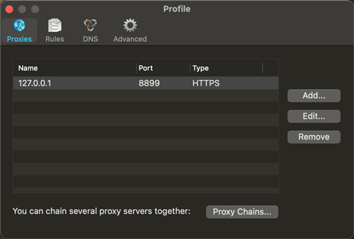
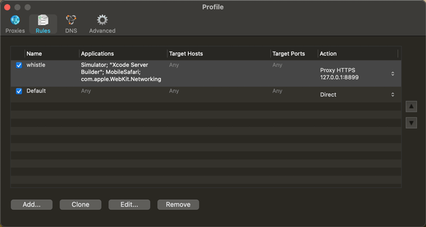
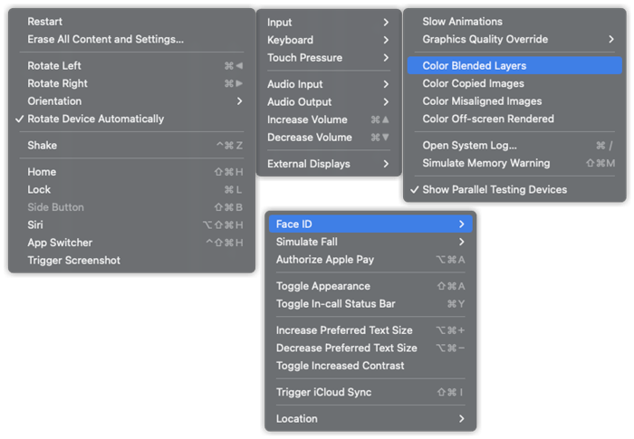

# 代码调试相关

## 目录
1. [前端调试方式](#前端调试方式)

    1. [JS](#js)
    1. [PC端](#pc端)
    1. [WAP端](#wap端)

        1. [WebView调试](#webview调试)
        1. [其他语言2Native调试](#其他语言2native调试)
        1. [其他调试方法](#其他调试方法)
    1. [浏览器调试（以Chrome为主）](#浏览器调试以chrome为主)
1. [服务端调试](#服务端调试)

---

## 前端调试方式

### JS
1. 展示：`console.log/info/warn/error`（`alert`）

    >（Value below was evaluated just now.）`console`引用类型的数据，在点击开来查看的这个时刻才去取引用类型的快照（意味着可以console之后再修改展示内容），打开之后不再关联。

    - 更好的展示：

        1. 缩进：`console.groupCollapsed/group`至`console.groupEnd`
        2. 表格：`console.table`
2. 调用栈：`console.trace`
3. 执行时间：`console.time`至`console.timeEnd`

- 监控告警

    根据错误日志，找到错误根源。

    1. 还原错误源代码、还原错误堆栈

        >SourceMap。
    2. 错误触发所在的UA（系统版本、app版本、浏览器版本）

        >判断是否是某些特定版本系统，如：低版本Android等。

### PC端
>1. 遵循[devtools-protocol](https://github.com/chromedevtools/devtools-protocol)协议的应用都拥有打开Chrome的[DevTools](https://developers.google.com/web/tools/chrome-devtools/)进行调试的能力。
>2. 遵循[JavaScriptCore](https://developer.apple.com/documentation/javascriptcore)协议的应用都拥有打开Safari的`开发`进行调试的能力。

1. Sources断点（`debugger`、配合SourceMap，通过Call Stack查看调用栈）。
2. Elements，右键标签可以Break On：子节点修改、attribute修改、Node移除。
3. Node.js

    通过Chrome的 <chrome://inspect/#devices>，监听Node.js程序运行`node --inspect 文件`，可使用`debugger`等进行断点调试、`console`打印等。

### WAP端

#### WebView调试
1. 使用页面模拟调试，如：[eruda](https://github.com/liriliri/eruda)、[vConsole](https://github.com/Tencent/vConsole)。
2. 针对**已开启调试功能的APP**连接对应的调试工具：

    >最佳方式：连接上电脑后借助 Chrome的DevTools（遵循devtools-protocol） 或 Safari的`开发`（遵循JavaScriptCore）。

    1. Android

        PC端的Chrome的Remote devices（<chrome://inspect/#devices>）可以调试**Android已开启调试功能的APP**的WebView。

        >Remote devices需要能够访问google，否则首次打开inspect页面会404。会自动联网更新相关SDK：控制台界面修复（低端机原本乱码，更新后会正常显示）、渲染器升级（低端机一开始不支持的CSS特性，更新后会支持）。

        - Android已开启调试功能的APP：

            1. Chrome
            2. 用<http://debugx5.qq.com/>打开TBS内核调试功能的[腾讯X5内核WebView](https://x5.tencent.com/)（如：Android的QQ、QQ浏览器、旧版微信）
            3. 开启调试功能的debug包APP

        >若PC端的Chrome识别不到手机WebView，可以下载[Android Debug Bridge (adb)](https://developer.android.google.cn/studio/releases/platform-tools.html?hl=zh-cn#downloads)（macOS可以用brew安装：`brew cask install android-platform-tools`）并运行（进入文件夹后运行`adb.exe devices`或`adb devices`连接手机设备）。

        >若APP没有开启调试功能，只能连接电脑的logcat看日志。
    2. iOS

        macOS的Safari的`开发`可以调试**iOS已开启调试功能的APP**的WebView。

        - iOS已开启调试功能的APP：

            1. Safari
            2. 开启调试功能的debug包APP

        >对于未开启调试功能的APP，内部的WebView可以进行元素样式、命令行调试（e.g. weiner、vConsole），但无法进行debugger调试。e.g. 微信APP内部的WebView，无法进行debugger调试（~~[spy-debugger](https://github.com/wuchangming/spy-debugger)~~、~~[ios-webkit-debug-proxy](https://github.com/google/ios-webkit-debug-proxy)~~ 均不能），只能作为APP的开发者或使用越狱版微信进行调试。

        >若APP没有开启调试功能，只能连接Xcode看日志。
3. 使用抓包工具查看请求、Map请求，如：[Charles](https://github.com/realgeoffrey/knowledge/blob/master/工具使用/Charles使用/README.md#charles使用)、[whistle](https://github.com/realgeoffrey/knowledge/blob/master/工具使用/whistle使用/README.md#whistle使用)。

    >Tips:
    >
    >1. 若命中强缓存（本地缓存），则不会发起请求，所以抓包工具也无法抓到命中强缓存（本地缓存）的资源，也就无法对这些资源进行代理操作。
    >2. （高版本Android默认禁止了明文通道、只信任系统CA证书，）客户端开发需要设置APP能够信任自定义CA证书，才能正常抓包。

#### 其他语言2Native调试
>1. iOS用Xcode模拟器运行客户端调试APP（Xcode文档：<https://developer.apple.com/documentation/xcode>）
>
>    若升级Xcode版本导致无法运行代码，可以尝试再安装一个[旧版本Xcode](https://developer.apple.com/download/all/?q=xcode)（或使用[XcodesApp
](https://github.com/RobotsAndPencils/XcodesApp)）。
>2. Android用真机安装APK调试APP（Android Studio文档：<https://developer.android.com/studio/intro>）

1. Android（真机）

    1. adb端口代理

        1. `adb reverse tcp:「手机端口号」 tcp:「PC端口号」`

            手机访问「手机端口号」的流量都会转发到PC的「PC端口号」。
        2. `adb forward tcp:「PC端口号」 tcp:「手机端口号」`

            PC访问「PC端口号」的流量都会转发到手机的「手机端口号」。
    2. debugger

        1. JS日志、断点：

            `chrome://inspect/#devices`设置Target`localhost:「PC端口号」`
        2. 客户端日志：

            1. `adb logcat`

                或：`adb shell`之后`logcat | grep 「筛选内容」`。
            2. Android Studio的logcat（需要安装SDK）
    3. 元素查看

        1. Android Studio的[Layout Inspector](https://developer.android.com/studio/debug/layout-inspector)

            结束选择Stop inspector。
    4. 性能调试

        >[检查GPU渲染速度和过度绘制](https://developer.android.com/topic/performance/rendering/inspect-gpu-rendering)。

        1. 「开发人员选项」 -> 「GPU呈现模式分析」：

            1. 「在屏幕上显示为条形图」
            2. Android Studio的[Profiler](https://developer.android.com/studio/profile/android-profiler)

                - [测试界面性能](https://developer.android.com/training/testing/performance)

                    ```shell
                    # 需要打开了「GPU呈现模式分析」为「在adb shell dumpsys gfxinfo中」
                    adb shell dumpsys gfxinfo 「PACKAGE_NAME」
                    adb shell dumpsys gfxinfo 「PACKAGE_NAME」 framestats
                    ```
        2. 「开发人员选项」 -> 「调试GPU过度绘制」
        3. PerfDog

    - Android Studio编译APK（Android Application Package）

        1. 改动代码 -> Make -> Run -> target获得APK

            >Make === Build === 编译。APK路径：app/build/outputs/apk/debug/app-debug.apk。

            1. Make一次后已生成编译好的文件，之后都可以直接Run 「项目名」（不需要再Make）

                1. 可以仅对改动的地方进行「增量」编译后运行：

                    1. `Make Module 「模块名」`
                    2. `Make Project`
                2. 使用Rebuild Project（或：Clean Project）删除已编译文件后重新编译整个项目
                3. 改动代码后若不编译，则Run的结果为之前编译的内容
        2. Run需要有target（真机或模拟器）

        - 若出问题，可以考虑：

            1. 报错哪些SDK没有安装，就去安装哪些SDK
            2. 若报错的某些SDK，但又明确SDK目录有这些文件夹，则可能之前先安装后删除时没有删除干净，导致文件夹存在，系统判定已装但使用报错。

                根据错误提示，尝试去SDK安装目录（如：`~/Library/Android/sdk/`），手动删除导致问题的某SDK文件夹，让其能够重新下载同步。
            3. Android Studio右上角的Project Structure（command + ;） -> SDK Location -> Android NDK location 设置ndk位置

        - <details>

            <summary>Gradle</summary>

            1. 一个自动化的项目构建工具，用来帮助开发人员自动构建项目。
            2. Project -> Gradle Scripts -> 查看 build.gradle 配置文件。

            >Gradle优势：
            >
            >1. `Apache Ant`可以自动化打包逻辑。
            >2. `Apache Maven`也可以自动化打包，相比于ant，它多做的事是帮你下载jar包。但是maven的打包逻辑太死板，定制起来太麻烦，不如ant好用。
            >3. `Gradle`又能自动下jar包，又能自己写脚本，并且脚本写起来还比ant好用。针对依赖的库，下载-编译-放到指定位置，直接import就可以使用。
            </details>
2. iOS（Simulator）

    >Xcode的Parallelization并行化设置为最大，增加编译效率。Xcode无法安装任何应用，只能安装代码编译上去的应用。

    1. Xcode模拟器构建运行App

        Run（command + R） 或 Run Without Building（command + control + R）

        >.ipa（iPhone application archive）文件仅支持真机；.app文件支持模拟器和真机。
    2. debugger

        1. JS日志、断点：

            Safari的网页检查器（自动显示JSContext、自动暂停连接到JSContext）

            >调试H5页面时要关闭「️自动显示JSContext的网页检查器」，无效且影响页面切换性能。
        2. 客户端日志：

            Xcode底部
    3. 元素查看

        1. Xcode的Debug View Hierarchy

            查看时会阻塞进程。结束点击Continue program excution。
    4. 性能调试

        1. （基础）Xcode -> Show the Debug navigator -> debug gauges
        2. （进阶）Xcode -> Product -> Profile
        3. PerfDog

    - Simulator

        >若模拟器内`command+其他`的快捷键无效，则尝试先按`option+其他`再按`command+其他`会有效。

        1. 代理到whistle（端口8899，或其他任意代理）

            1. Simulator内安装whistle证书

                Safari输入`127.0.0.1:8899`，安装、同意证书。
            2. Simulator设置http请求发送到8899

                1. 方法一：设置系统代理为8899，Simulator设置走系统代理
                2. 方法二：利用Proxifier V2（可代理PC所有应用到指定地址和端口）

                    - <details>

                        <summary>安装、配置Proxifier V2</summary>

                        1. Proxies

                            HTTPS 127.0.0.1:8899

                            
                        2. Rules

                            `Simulator; "Xcode Server Builder"; "MobileSafari"; "com.apple.WebKit.Networking"; `（针对部分APP需要+`「APP包名，如："com.tencent.QQKSong"」;`）

                            
                        3. 电脑同意权限并重启
                        </details>
        2. 关注顶部的操作

            

            1. 软键盘开启：

                Simulator -> I/O -> Keyboard -> 取消选择：Connect Hardware Keyboard

                >取消连接到硬件keyboard，这样就取消了连接到电脑的键盘，而使用iOS模拟器自己的键盘。
            2. 模拟定位：

                Simulator -> Features -> Location

                
            3. 复制-粘贴：

                Simulator -> Edit -> Automatically Sync Pasteboard

                >若失败，则：[Copy/Paste not working in XCode 13 Simulators with M1 Macbook Pro](https://stackoverflow.com/questions/71569778/copy-paste-not-working-in-xcode-13-simulators-with-m1-macbook-pro/73878520#73878520)（非M1亲测也可）。

- 若网络通信不通过发起HTTP请求，则会有其他客户端通讯协议。此时就不能用HTTP抓包查看请求，需要客户端通讯协议对应的通讯查看方式。
- 前端组件最终是传递给客户端，由客户端组件来实现呈现，因此用客户端工具查看客户端组件时，可以根据组件名字是否有前端标识，判断其是否来自于前端。

#### 其他调试方法
- Android真机调试：

    1. 开发人员选项

        >来自：[配置设备上的开发者选项](https://developer.android.com/studio/debug/dev-options)。

        - 打开方便调试

            1. 「显示触摸操作」
            2. 「指针位置」
            4. 「“仅充电”模式下允许ADB调试」
            5. 「保持唤醒状态」
            6. 「演示模式」
        - 可选

            1. 「显示布局边界」：会展示Native渲染边界，方便区分WebView的H5与Native内容，也可判断布局是否合理
            2. 「最小宽度」：设置手机的宽度dp
            3. 「GPU呈现模式分析」：渲染时间展示
            4. 「调试GPU过度绘制」：重复渲染展示
    2. 打开其他APP时设置的允许/拒绝信息，可以操作当前APP「清除数据」恢复提醒。
    3. 连接着的手机，无法识别，

        1. 刷新一下<chrome://inspect/#devices>
        2. 切换一下「USB 调试」的开关（或「撤销 USB 调试授权」后重新授权）

        - <chrome://inspect/#devices>中，关闭`Discover USB devices`可以减少断连手机。

- 其他策略

    1. 对于App内不方便查看的信息，可以把需要查看的信息发送HTTP请求、再抓包的方式进行调试。
    2. 上线的页面中藏着某些「后门」调试（如：隐蔽操作开启`console`）

        1. 可以在URL中判断某些特定的`search`值，以开启调试模式。

            >e.g. `xxx?debug=1`开启
        2. WAP端可以用一些隐蔽的手势触发log信息展示。

            ><details>
            ><summary>e.g.</summary>
            >
            >```javascript
            >let consolelogId = 0
            >
            >function wapConsole () {
            >  if (event.touches.length >= 4) {    // 4个触发点以上
            >    consolelogId += 1
            >
            >    if (consolelogId >= 2) {    // 2次以上触发
            >      // 展示隐藏的调试信息
            >      const newScript = document.createElement('script')
            >      const appendPlace = document.getElementsByTagName('body')[0] || document.getElementsByTagName('head')[0]
            >
            >      newScript.onload = function () { // 只能保证加载完成，但不能判断是否执行
            >        eruda.init()   // new VConsole()
            >        newScript.onload = null
            >      }
            >
            >      // onerror表示加载失败
            >
            >      newScript.src = '//unpkg.com/eruda'    // '//unpkg.com/vconsole'
            >
            >      appendPlace.appendChild(newScript)
            >
            >      document.removeEventListener('touchstart', wapConsole, false)
            >    }
            >  }
            >}
            >
            >document.addEventListener('touchstart', wapConsole, false)
            >```
            ></details>

### 浏览器调试（以Chrome为主）

>Chrome的DevTools文档：<https://developer.chrome.com/docs/devtools/overview/>

#### Console面板
>来自：[Chrome Developers:Console Utilities API reference](https://developer.chrome.com/docs/devtools/console/utilities/)。

1. `$0`、`$1`、`$2`、`$3`、`$4`

    返回在Elements面板中选中的 当前、上1个、上2个、上3个、上4个节点。
2. `monitor(「函数名」)`、`unmonitor(「函数名」)`

    观察/取消观察某函数，若观察的函数被调用，则输出函数名和参数。
3. `monitorEvents(「DOM」[, 事件名或事件名数组])`、`unmonitorEvents(「DOM」[, 事件名或事件名数组])`

    >Safari相同。

    观察/取消观察DOM的事件，若观察的DOM事件被触发，则输出事件名、事件对象。
4. `copy(「值或变量名」)`

    >Safari相同。

    拷贝一个对象（DOM也可）为字符串表示方式到系统剪切板。
5. `getEventListeners(「DOM」)`

    >Safari相同。

    获取注册到一个DOM上的所有事件监听器。

---
## [服务端调试](https://github.com/realgeoffrey/knowledge/blob/master/网站前端/服务端相关/README.md#接口错误排查)
