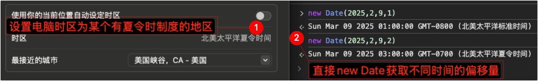
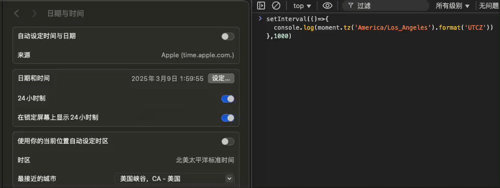

# 海外应用总结

## 目录
1. [语言问题（翻译）](#语言问题翻译)
1. [书写顺序](#书写顺序)
1. [翻译系统](#翻译系统)
1. [其他](#其他)
1. [多时区的一些问题解决方案](#多时区的一些问题解决方案)

---
### 语言问题（翻译）
1. 文字长短不一、文字高度不一
2. 书写顺序，`ltr`、`rtl`（整个界面布局习惯跟随书写顺序变化，关注用户交互体验）
3. 时间问题：日期显示，时区（偏移量），历法

    >[dayjs](https://github.com/iamkun/dayjs)
4. 数字标点（如：小数分隔符，千位分隔符）
5. 货币单位
6. 字符集
7. 复数规则（zero、one、two、few、many、other）

    >[js-lingui](https://github.com/lingui/js-lingui)
8. 性别问题
9. 序数（1st、2nd、3rd、4th、等）
10. 安全性和敏感性（文化、宗教与民族、地缘政治、节日、手势含义、当地法律法规、颜色含义、数字忌讳）

    >注意，是某地区的所有语言都需要过滤处理。e.g. taiwan地区的简体、繁体、英文，都需要把“国家”替换成“地区”；其他地区的简体、繁体、英文，都不做替换。
11. 词汇的上下文（如：某一个词汇有多重含义）、大小写含义变化的词

| 问题领域 | [ICU](https://github.com/unicode-org/icu)能解决吗？ | 解决方案/备注 |
| :--- | :--- | :--- |
| 日期/时间/时区/历法 | ✅ 完美 | "DateFormat, TimeZone, Calendar" |
| 数字/货币/百分比 | ✅ 完美 | "NumberFormat, Currency" |
| 复数规则/序数 | ✅ 完美 | "PluralRules, MessageFormat" |
| 字符集 | ✅ 完美 | Unicode 支持 |
| 语法性别 (文本内) | ✅ 完美 | MessageFormat (select) |
| 文字长度/高度 | ❌ 不能 | 靠 CSS 弹性布局、UI 设计规范 |
| 书写顺序 (RTL) | ⚠️ 仅数据 | ICU 提供算法，CSS 负责界面翻转 |
| 政治/地缘敏感词 | ❌ 不能 | 靠内容审查、CMS 术语表、自定义业务逻辑 |
| 颜色/禁忌/法律 | ❌ 不能 | 靠设计系统 (Design System) 和 法务合规 |

>[ICU与国际化（i18n）](https://github.com/realgeoffrey/knowledge/blob/master/网站前端/其他前端专项/ICU与国际化（i18n）/README.md)

### 书写顺序
>阿拉伯文、希伯来文，波斯文 等从右至左的语言文字。

0. HTML全局设置整个DOM

    >功能有限，很多样式问题无法处理到，如：`float`、绝对定位布局，更复杂的一些布局。

    `<html dir="ltr或rtl">`或`html{ direction: ltr或rtl; }`（该属性指定了块的基本书写方向，以及针对 Unicode 双向算法的嵌入和覆盖方向）
1. CSS设置左右翻转（镜像）

    1. 父级整体：`transform: scaleX(-1)`
    2. 子级的文字、某些图标等，再翻转回去：`transform: scaleX(-1)`、`text-align: right`

        可以写一个组件，包裹需要翻转回去的节点。

    ```html
    <!-- e.g. 利用 transform 实现全局镜像（左右颠倒） -->
    <div style="transform: scaleX(-1)">
      <!-- 文字向右对齐，重置镜像 -->
      <p style="transform: scaleX(-1); text-align: right;">
        居右 على الرغم من أن لديه بعض الصعوبات على سبيل المثال
        <br>، بعض الرجل يمكن أن مجرد فتح devtools وإزالة أو تغيير قسم
        'لانغ'. لمنع هذا ، أوصي بوضعه في المتغير.
        </Text>
        </View>
      </p>

      <!-- 镜像（左右颠倒） -->
      <div>
        镜像的内容123
      </div>
    </div>
    ```

    >具体参考：[苹果指南](https://developer.apple.com/cn/design/human-interface-guidelines/right-to-left)、[Material Design 指南](https://www.mdui.org/design/usability/bidirectionality.html)、[微软指南](https://learn.microsoft.com/zh-cn/windows/apps/design/globalizing/design-for-bidi-text)。
2. 劫持创建虚拟DOM的函数，对样式统一镜像修改

    >若是RN等，则可以考虑这一块由客户端SDK完成。

    如：`left/right`、`margin左右`、`padding左右`、`border左右`、`borderRadius左右`等颠倒，flex项的几个CSS属性起始方向`flex-start`和`flex-end`颠倒（实现`direction: rtl;`设置后的默认效果）。类似：[rtlcss](https://github.com/MohammadYounes/rtlcss)。

    ```js
    // e.g. React中重写`React.createElement`
    const oldCreateElement = React.createElement;

    export default function rtlReactHook() {
      if (!React._rtlHooked) {
        React.createElement = (type, props) => {
          if (isRtl) {
            // RTL样式统一镜像处理
            props.style = getRTLStyle(props.style);
          }
          return oldCreateElement.apply(null, arguments);
        };
        React._rtlHooked = true;
      }
    }
    ```
3. 细节注意

    1. 动画、绝对定位的数值是否考虑取负值
    2. 方向敏感的图标考虑是否翻转（在RTL下，箭头向右表示后退，向左表示前进），图标库需要重新设计
    3. 留意文字长度（如：阿拉伯文أَبْجَدِيَّة عَرَبِيَّة宽度较长）、留意文字高度（如：泰文อักษรไทย高度较高）

        >有点类似兼容颜文字。

        - 针对文字高度问题，解决方案：

            1. 不要写死`line-height`或`height`（或用`min-height`替代），让高的字体文字自动撑开。

                >无法按照UI设计的确定高度展示，因此处理比较粗糙。
            2. 针对特定的语言（如：泰文），设置更高的行高 或 计算dom.scrollHeight（渲染后的内容高度）大于dom.offsetHeight（设置高度、容器高度）就增加行高。

                - 进阶：先找到font-size和渲染高度的关系（如：确定泰文[音标]影响高度的细节和对应关系），再用上面的进行兜底。
- 双向文本（Bi-directional text）混排问题

    当LTR文、RTL文混在一起时，要解决文字书写顺序问题。最常用来处理双向文字的算法叫做Unicode 双向算法（[Unicode Bidirectional Algorithm](https://unicode.org/reports/tr9/)，Bidi算法）：文字的逻辑顺序（内存中的存储顺序）与显示顺序不是同一个方向。

    - unicode 定义来三种类型的字符，

        1. 强类型：大部分字符，方向确定，并且会影响前后字符的方向性。（ltr 的中英、rtl 的阿拉伯语）
        2. 弱类型：数字和数字相关的符号，方向确定，但不会影响前后字符的方向性。
        3. 中性字符：大部分的标点符号和空格，方向不确定，由上下文的bidi属性来决定其方向。

    ```text
    ar 1 times

    1 ar times // error

    // 强转换 ltr Mark
    U+200E
    ar &lrm; 1 times

    // U+202B direction rtl

    // 隔离 Isolate,避免受到其他字符影响
    // <bdi>
    &#x2066; ar &#x2069; 1 times

    // 覆盖 Override 展示内存方向
    // <bdo>
    // 强制将字符按内存顺序从左向右展示
    &#x202d; ar 1 times
    ```

### 翻译系统
>**国家/地区**：构建时、运行时都区分；**语言**：运行时替换。一个国家/地区 绑定 多个语言（App内的 语言 可以切换，国家/地区 不可以切换。国家/地区 在下载App时确定）。

1. 构建时，通过翻译系统的接口，拉取带翻译的.json文件到本地。
2. 开发时，用文本id（可以直接用文本内容）填入代码，展示时会被替换成翻译好的内容

    >语言包从代码中解藕，代码中只有翻译词条的引用id（id也可以语义化）。

    1. ~~方案一~~

        代码中提取待翻译词条，整理成资源文件或上传翻译平台，翻译完成后，最后下载到应用中。

        >最原始的：.excel搜集整理词条，传递给翻译人员，翻译完毕后再填写.excel内容到代码。
    2. 方案二

        1. 先由需求方总结出所有需要用到的翻译词条，并在翻译平台录入；
        2. 开发人员创建id指向翻译词条，再把各id填入代码业务位置，翻译人员并行在翻译平台逐条翻译词条。

        >优点：开发和翻译流程可以**并行**。缺点：需要和需求方进行词条的沟通，翻译的词条格式不可控（要求：需要需求方了解翻译的格式，或舍弃掉复数、性别等翻译，只实现最基本的变量替换翻译，或像i18next那样，单数和复数的词条分开翻译）。

    >- 翻译系统细节
    >
    >    1. 各角色权限划分：
    >
    >        开发仅关注引用翻译词条的id录入代码、构建、发布、验证；产品/运营仅关注词条罗列到翻译平台、审核角色权限等；翻译人员仅关注词条翻译。
    >    2. 支持词条的复用：
    >
    >        翻译词条 <-多对多-> 页面（需求）
    >    3. 审核词条、翻译机制；敏感词自动化校验
    >    4. 按项目（APP）区分权限，按页面区分权限
    >    5. 不同平台、语言的占位符校验、替换
3. 运行时热更新

    >旧的语言包都随着包发布，作为任何情况的兜底；新的语言包热更新。

    支持APP或H5发版之后，在运行时更新翻译结果（时机，如：重启APP或切换语言等），不需要重新安装APP或重新构建H5。

- 按国家/地区

    1. 构建时生成 根据文件后缀区分国家/地区 的代码文件，如：`.th.tsx/scss/js`

        >id->Indonesia、ms->Malaysia、th->Thailand、ph->Philippines、vi->Vietnam、me->Middle East。

        语言包可以都打包在一起（一般也不会很大）。
    2. 构建时、运行时，通过读取App环境变量（国家/地区或语言），根据代码if-else处理不同国家/地区逻辑

### 其他
1. 海外资源CDN加速，如：<https://www.akamai.com>
2. 海外支付体系的建设

### 多时区的一些问题解决方案
><details>
><summary>时区（Time Zone） !== 偏移量（Offset）</summary>
>
>1. 时区：[`IANA时区标识符，如"America/New_York"`](https://www.iana.org/time-zones)，时区指定的地区可以查询出一个或多个偏移量（是否处于夏令时）
>2. 偏移量：一个数字（或字符串），表示特定日期/时间值比UTC早或晚多少，如：`'+0800'`、`'GMT-0800'`
></details>

>[一文读懂全球化系统中的日期时间处理问题](https://mp.weixin.qq.com/s/0FM16km2qLUAaMyu4yf_6A)

1. 在A时区存储时间，在A或其他时区展示，期望展示正确的绝对时间：

    1. 方案一：时间戳（时间戳与时区无关，是一个绝对时间，一个时间戳在不同时区表达含义不会改变）
    2. 方案二：包含偏移量的时间字符串（e.g. `"2019-06-10T14:48:05.123+09:00"`、`"2019-06-10T14:48:05.123Z"`、`'Mon, 25 Dec 1995 13:30:00 GMT+0800'`、`'2008-01-02 01:00:00 +0530'`）
    - 额外产生问题（feature）：（若不做额外处理、直接`new Date(传参)`，则）不同时区看到的时间不同（因为时间戳相同，但展示的时区不同导致偏移量不同）
2. 在A时区存储时间，在A或其他时区展示，期望展示同一个时间刻度：

    1. 方案一：不包含时区、不包含偏移量的时间字符串（e.g. `2012-11-04T01:00:00`）（不能也不需要进行偏移，表示某个固定时区或固定偏移（如：UTC+0或服务端时区）的时间刻度）
    2. 方案二：客户端存时间戳要偏移到某个固定时区或固定偏移量（如：UTC+0或服务端时区）、取出的时间戳也要逆向偏移（~~有漏洞：请求参数可以修改，js代码可以修改，时间戳由客户端处理和决定 有风险。但没有其他更好方案~~）

        e.g. 假设客户端是UTC+8，获取`2024-05-28 0:0:0 UTC+8`是时间戳`x`，若要偏移成UTC+0时间刻度一致的`2024-05-28 0:0:0 UTC+0`则要存时间戳`x + 8*1000*60*60`；服务端取回的`y`表示UTC+0的`2024-05-28 0:0:0 UTC+0`，若直接在UTC+8的客户端`new Date(y)`则会展示`2024-05-28 8:0:0 UTC+8`，因此若要展示0点时间刻度，则要逆向偏移`new Date(y - 8*1000*60*60)`再去修改时间字符串后面的UTC字段。

    - feature：存和取 都是针对某个固定时区或固定偏移量进行，并不是客户端系统时区。如：客户端选择1点，其含义是某个固定时区或固定偏移量（如：UTC+0或服务端时区）的1点，服务端返回的时间戳也要处理展示成1点。

    ><details>
    ><summary>e.g.</summary>
    >
    >0. 前、后端以某个确定时区或偏移量为准
    >1. 时间选择器展示的时间 <-（正向）偏移（逆向）-> 进出时间选择器的值 === 后端的值
    >2. 针对`<el-date-picker>`，以下实现：参数传递和原组件一致，仅在原组件外做一层对输入输出值的偏移逻辑
    >
    >    1. <details>
    >
    >        <summary>实现</summary>
    >
    >        ```vue
    >        <template>
    >          <!-- 使用v-bind="$attrs"和v-on="$listeners"传递所有参数。ref传递给父级引用的ref -->
    >          <DatePicker
    >            ref="innerComponent"
    >            v-bind="$attrs"
    >            :value="originalValue"
    >            :defaultValue="originalDefaultValue"
    >            :popper-class="originalPopperClass"
    >            @input="
    >              originalValue = arguments[0];
    >              $emit('input', filterValueOutput(arguments[0], $attrs));
    >            "
    >            @change="$emit('change', filterValueOutput(arguments[0], $attrs))"
    >            v-on="otherListeners"
    >          >
    >            <!-- 传递插槽 -->
    >            <template v-for="(slotFunc, name) in $scopedSlots" #[name]="slotProps">
    >              <slot :name="name" v-bind="slotProps" />
    >            </template>
    >          </DatePicker>
    >        </template>
    >
    >        <script>
    >        import { DatePicker } from 'element-ui';
    >        import { valueEquals } from './utils';  // 来自：https://github.com/ElemeFE/element/blob/master/packages/date-picker/src/picker.vue#L308-L340
    >
    >        export default {
    >          components: { DatePicker },
    >          inheritAttrs: false, // 禁止将根元素的属性自动应用到根元素上
    >          props: {
    >            // 传入传出值（DatePicker的原生参数）
    >            value: {},
    >
    >            // 相同兼容处理的默认值（DatePicker的原生参数）
    >            defaultValue: {},
    >
    >            // 为了解决today问题，目前只能把today样式初始化掉，因此用了该插件不会有today的样式
    >            popperClass: {
    >              type: String,
    >              default: "",
    >            },
    >
    >            // 当DatePicker输出时，经过这个函数后输出
    >            filterValueOutput: {
    >              type: Function,
    >              // 输出, 组件入参
    >              default(val, attrs) {
    >                return val;        // todo：正向偏移逻辑
    >              },
    >            },
    >            // 参数输入给本组件时，经过这个函数后输入DatePicker
    >            filterValueInput: {
    >              type: Function,
    >              // 输入, 组件入参
    >              default(val, attrs) {
    >                return val;        // todo：逆向偏移逻辑
    >              },
    >            },
    >          },
    >          data() {
    >            return {
    >              parentRefName: undefined,
    >              originalValue: this.filterValueInput(this.value, this.$attrs),
    >            };
    >          },
    >          computed: {
    >            otherListeners() {
    >              const { input, change, ...others } = this.$listeners;
    >              return others;
    >            },
    >            originalDefaultValue() {
    >              return this.filterValueInput(this.defaultValue, this.$attrs);
    >            },
    >            originalPopperClass() {
    >              return `${this.popperClass} ilk-date-picker-popper-class`;
    >            },
    >          },
    >          watch: {
    >            value: {
    >              handler(val, oldVal) {
    >                if (!valueEquals(val, oldVal)) {
    >                  this.originalValue = this.filterValueInput(val, this.$attrs);
    >                }
    >              },
    >            },
    >          },
    >          mounted() {
    >            // 将内部组件的引用暴露给外部
    >            const [name] =
    >              Object.entries(this.$parent.$refs).find(([, vm]) => {
    >                return vm === this;
    >              }) ?? [];
    >            if (name) {
    >              this.parentRefName = name;
    >              this.$parent.$refs[name] = this.$refs.innerComponent;
    >            }
    >          },
    >          beforeDestroy() {
    >            // 清除引用以防内存泄漏
    >            if (this.parentRefName && this.$parent.$refs[this.parentRefName] === this.$refs.innerComponent) {
    >              this.$parent.$refs[this.parentRefName] = undefined;
    >            }
    >          },
    >        };
    >        </script>
    >
    >        <style lang="less">
    >        // 去除.today样式
    >        .ilk-date-picker-popper-class {
    >          .el-date-table td.today span {color: inherit;font-weight: inherit}
    >          .el-date-table td.today.end-date span, .el-date-table td.today.start-date span {color: inherit}
    >          .el-date-table td.selected span {color: #fff}
    >
    >          .el-month-table td.today .cell {color: inherit;font-weight: inherit}
    >          .el-month-table td.today.end-date .cell, .el-month-table td.today.start-date .cell {color: inherit}
    >          .el-year-table td.today .cell {color: inherit;font-weight: inherit}
    >
    >          .el-date-table td.current:not(.disabled) span {color: #fff;}
    >          .el-year-table td.current:not(.disabled) .cell, .el-month-table td.current:not(.disabled) .cell {color: #409EFF;}
    >          .el-year-table td.disabled .cell, .el-month-table td.disabled .cell {color: #c0c4cc;}
    >        }
    >        // 隐藏「此刻」
    >        .ilk-date-picker-popper-class {
    >          &.el-date-picker .el-picker-panel__link-btn:first-child {
    >            display: none;
    >          }
    >        }
    >        </style>
    >        ```
    >        </details>
    >    2. 注意
    >
    >        1. `picker-options`改为时区版本（不能直接用`Date`逻辑，要进行偏移）
    >        2. 前端初始化值不能直接用`Date`逻辑，要进行偏移
    >        3. 以上实现去除了.today样式、隐藏了「此刻」按钮
    >        4. 后端的值若不经过时间选择器（处理了输入输出的偏移）而直接展示，则需要先偏移后再展示
    >
    >            ```js
    >            import moment from 'moment-timezone';
    >
    >            // 支持 时间戳、不包含偏移量的时间字符串（'YYYY-MM-DDTHH:mm:ss.SSS'）、包含偏移量的时间字符串（'YYYY-MM-DDTHH:mm:ss.SSSZ'）
    >            function format(date, type = 'YYYY-MM-DD HH:mm:ss', config = { name: '', utcOffset: '' }) {    // config:{ name: 'America/New_York', utcOffset: 'UTC-04:00' }
    >              const { name, utcOffset } = config;
    >              if (name) {
    >                if (!date) return moment.tz(name).format(type);
    >                return moment.tz(date, name).format(type);
    >              } else if (utcOffset) {
    >                if (!date) return moment().utcOffset(utcOffset).format(type);
    >                if (typeof date === 'string') {
    >                  // 判断字符串是否包含时区偏移信息
    >                  const hasOffset = /[+-]\d{2}:?\d{2}$/.test(date) || /Z$/.test(date);
    >
    >                  // 若包含偏移量的字符串
    >                  if (hasOffset) {
    >                    return moment(date).utcOffset(utcOffset).format(type);
    >                  }
    >                  // 否则不包含偏移量的字符串
    >                  const tenantDateStr = moment(date).format(`YYYY-MM-DDTHH:mm:ss.SSS${utcOffset.replace('UTC', '')}`);
    >                  return moment(tenantDateStr).utcOffset(utcOffset).format(type);
    >                }
    >                return moment(date).utcOffset(utcOffset).format(type);
    >              }
    >              if (!date) return moment().format(type);
    >              return moment(date).format(type);
    >            }
    >            ```
    ></details>

    - 实行 夏令时（Daylight Saving Time，DST，夏时制） 制度的地区：会随着日期变化 而返回不同偏移量；每年有前后各1小时无法选中的时间（夏令时改变时间的临界点）。

        ><details>
        ><summary>因此偏移量每次都要计算，而不能缓存着偏移量。</summary>
        >
        >e.g. 美国某地在`2025年03月9日的02:00`进行夏令时切换：
        >
        >
        >
        ></details>

- 各种相关时间表达方式能够获取的信息

    1. （不包含时区、不包含偏移量的时间字符串）`2012-11-04T01:00:00`：时间刻度
    2. （包含偏移量的时间字符串）`2012-11-04T01:00:00-04:00`：时间刻度+偏移量（推算不出~~时区~~）
    3. 时间戳：若确定时区或偏移量后，则可以获得时间刻度（因此不同时区或不同偏移量会得出不同时间刻度，默认可以取本地的时区或取UTC+0偏移量）
    4. 时间戳+时区（`IANA时区标识符，如"America/New_York"`）：**（地区+）时区+时间刻度+偏移量**

        >因为有夏令时/冬令时的原因，所以时区算出的偏移量是会根据时间戳不同而变化。

        <details>
        <summary>e.g.</summary>

        ```js
        // 时间戳（等价于Date对象）：moment.tz(时间戳或Date对象, 时区) 等价于 moment(时间戳或Date对象).tz(时区)
        moment.tz(1741505400000,'America/New_York').format() ===
        moment(1741505400000).tz('America/New_York').format()
        ```
        </details>
    5. （包含偏移量的时间字符串）`2012-11-04T01:00:00-04:00`+时区：包含偏移量的时间字符串 等价于 时间戳，因此等于上一条 **（地区+）时区+时间刻度+偏移量**

        <details>
        <summary>e.g.</summary>

        ```js
        // 包含偏移量的时间字符串：moment.tz(包含偏移量的时间字符串, 时区) 等价于 moment(包含偏移量的时间字符串).tz(时区)
        moment.tz('2025-03-09T02:30:00-05:00','America/New_York').format() ===
        moment('2025-03-09T02:30:00-05:00').tz('America/New_York').format()
        ```
        </details>
    6. （不包含偏移量的时间字符串）`2012-11-04T01:00:00`+时区：若表达的是时区下的时间刻度，则可以算出时间戳，因此等于（上）上一条 **（地区+）时区+时间刻度+偏移量**

        <details>
        <summary>e.g.</summary>

        ```js
        // 时间刻度+目标时区的偏移量（不换算时间刻度，但会保证处理夏令时正确）
        moment.tz('2025-03-09T02:30:00','America/New_York').format()       // -> '2025-03-09T03:30:00-04:00'
        // moment对象换算成目标时区后的结果，保持时间戳不变
        moment('2025-03-09T02:30:00').tz('America/New_York').format()      // -> '2025-03-08T13:30:00-05:00'
        // 强制设定 时间刻度+目标时区的偏移量（不换算时间刻度，不处理夏令时因此会产生时间刻度不存在问题）
        moment('2025-03-09T02:30:00').tz('America/New_York',true).format() // -> '2025-03-09T02:30:00-05:00'

        // 但就算输入不存在的时间刻度，也可以正常解析
        moment('2025-03-09T02:30:00').tz('America/New_York',true).valueOf() ===
        moment.tz('2025-03-09T02:30:00','America/New_York').valueOf() ===
        moment('2025-03-09T02:30:00-05:00').valueOf()
        ```
        </details>

    >时间信息等价：`包含偏移量的时间字符串` 等价于 `时间戳` 等价于 `Date对象`

    ><details>
    ><summary>moment的相关方法</summary>
    >
    >1. `moment(...)`是本地模式。不明确的输入（没有偏移量）被假定为本地时间。明确的输入（带偏移量）调整为本地时间。
    >2. `moment.utc(...)`是 utc 模式（所有显示方式都将以 UTC 时间显示，而不是本地时间）。不明确的输入（没有偏移量）假定为 UTC。明确的输入调整为 UTC。
    >3. `moment.parseZone(...)`保留传入的输入区（解析字符串，但将生成的 moment对象 保存在固定偏移时区中，并在字符串中提供偏移量）。不明确的输入（没有偏移量）假定为 UTC。
    >4. （[moment-timezone](https://github.com/moment/moment-timezone)）`moment.tz(...)`可以解析特定时区的输入。
    ></details>
