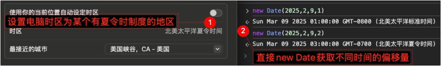

# 多时区

## 目录
1. [多时区的一些问题解决方案](#多时区的一些问题解决方案)

---

### 多时区的一些问题解决方案
><details>
><summary>时区（Time Zone） !== 偏移量（Offset）</summary>
>
>1. 时区：[`IANA时区标识符，如"America/New_York"`](https://www.iana.org/time-zones)，时区指定的地区可以查询出一个或多个偏移量（是否处于夏令时）
>2. 偏移量：一个数字（或字符串），表示特定日期/时间值比UTC早或晚多少，如：`'+0800'`、`'GMT-0800'`
>
>重要区别：时区是地理概念，包含历史规则和夏令时信息；偏移量只是数字，不包含历史信息。同一时区在不同时间可能有不同的偏移量（由于夏令时）。
></details>

>[一文读懂全球化系统中的日期时间处理问题](https://mp.weixin.qq.com/s/0FM16km2qLUAaMyu4yf_6A)

1. 在A时区存储时间，在A或其他时区展示，期望展示正确的绝对时间：

    1. 方案一：时间戳（时间戳与时区无关，是一个绝对时间，一个时间戳在不同时区表达含义不会改变）
    2. 方案二：包含偏移量的时间字符串（e.g. `"2019-06-10T14:48:05.123+09:00"`、`"2019-06-10T14:48:05.123Z"`、`'Mon, 25 Dec 1995 13:30:00 GMT+0800'`、`'2008-01-02 01:00:00 +0530'`）
    - 额外产生问题（feature）：（若不做额外处理、直接`new Date(传参)`，则）不同时区看到的时间不同（因为时间戳相同，但展示的时区不同导致偏移量不同）
2. 在A时区存储时间，在A或其他时区展示，期望展示同一个时间刻度：

    1. 方案一：不包含时区、不包含偏移量的时间字符串（e.g. `2012-11-04T01:00:00`）（不能也不需要进行偏移，表示某个固定时区或固定偏移（如：UTC+0或服务端时区）的时间刻度）
    2. 方案二：客户端存时间戳要偏移到某个固定时区或固定偏移量（如：UTC+0或服务端时区）、取出的时间戳也要逆向偏移（~~有漏洞：请求参数可以修改，js代码可以修改，时间戳由客户端处理和决定 有风险。但没有其他更好方案~~）

        e.g. 假设客户端是UTC+8，获取`2024-05-28 0:0:0 UTC+8`是时间戳`x`，若要偏移成UTC+0时间刻度一致的`2024-05-28 0:0:0 UTC+0`则要存时间戳`x + 8*1000*60*60`；服务端取回的`y`表示UTC+0的`2024-05-28 0:0:0 UTC+0`，若直接在UTC+8的客户端`new Date(y)`则会展示`2024-05-28 8:0:0 UTC+8`，因此若要展示0点时间刻度，则要逆向偏移`new Date(y - 8*1000*60*60)`再去修改时间字符串后面的UTC字段。

    - feature：存和取 都是针对某个固定时区或固定偏移量进行，并不是客户端系统时区。如：客户端选择1点，其含义是某个固定时区或固定偏移量（如：UTC+0或服务端时区）的1点，服务端返回的时间戳也要处理展示成1点。

    ><details>
    ><summary>e.g. Vue中使用Element UI日期选择器处理时区</summary>
    >
    >0. 前、后端以某个确定时区或偏移量为准
    >1. 时间选择器展示的时间 <-（正向）偏移（逆向）-> 进出时间选择器的值 === 后端的值
    >2. 针对`<el-date-picker>`，以下实现：参数传递和原组件一致，仅在原组件外做一层对输入输出值的偏移逻辑
    >
    >    注意：以下示例基于Vue 2和Element UI。Vue 3和Element Plus的API略有不同，但思路一致。
    >
    >    1. <details>
    >
    >        <summary>实现</summary>
    >
    >        ```vue
    >        <template>
    >          <!-- 使用v-bind="$attrs"和v-on="$listeners"传递所有参数。ref传递给父级引用的ref -->
    >          <DatePicker
    >            ref="innerComponent"
    >            v-bind="$attrs"
    >            :value="originalValue"
    >            :defaultValue="originalDefaultValue"
    >            :popper-class="originalPopperClass"
    >            @input="
    >              originalValue = arguments[0];
    >              $emit('input', filterValueOutput(arguments[0], $attrs));
    >            "
    >            @change="$emit('change', filterValueOutput(arguments[0], $attrs))"
    >            v-on="otherListeners"
    >          >
    >            <!-- 传递插槽 -->
    >            <template v-for="(slotFunc, name) in $scopedSlots" #[name]="slotProps">
    >              <slot :name="name" v-bind="slotProps" />
    >            </template>
    >          </DatePicker>
    >        </template>
    >
    >        <script>
    >        import { DatePicker } from 'element-ui';
    >        import { valueEquals } from './utils';  // 来自：https://github.com/ElemeFE/element/blob/master/packages/date-picker/src/picker.vue#L308-L340
    >
    >        export default {
    >          components: { DatePicker },
    >          inheritAttrs: false, // 禁止将根元素的属性自动应用到根元素上
    >          props: {
    >            // 传入传出值（DatePicker的原生参数）
    >            value: {},
    >
    >            // 相同兼容处理的默认值（DatePicker的原生参数）
    >            defaultValue: {},
    >
    >            // 为了解决today问题，目前只能把today样式初始化掉，因此用了该插件不会有today的样式
    >            popperClass: {
    >              type: String,
    >              default: "",
    >            },
    >
    >            // 当DatePicker输出时，经过这个函数后输出
    >            filterValueOutput: {
    >              type: Function,
    >              // 输出, 组件入参
    >              default(val, attrs) {
    >                return val;        // todo：正向偏移逻辑
    >              },
    >            },
    >            // 参数输入给本组件时，经过这个函数后输入DatePicker
    >            filterValueInput: {
    >              type: Function,
    >              // 输入, 组件入参
    >              default(val, attrs) {
    >                return val;        // todo：逆向偏移逻辑
    >              },
    >            },
    >          },
    >          data() {
    >            return {
    >              parentRefName: undefined,
    >              originalValue: this.filterValueInput(this.value, this.$attrs),
    >            };
    >          },
    >          computed: {
    >            otherListeners() {
    >              const { input, change, ...others } = this.$listeners;
    >              return others;
    >            },
    >            originalDefaultValue() {
    >              return this.filterValueInput(this.defaultValue, this.$attrs);
    >            },
    >            originalPopperClass() {
    >              return `${this.popperClass} ilk-date-picker-popper-class`;
    >            },
    >          },
    >          watch: {
    >            value: {
    >              handler(val, oldVal) {
    >                if (!valueEquals(val, oldVal)) {
    >                  this.originalValue = this.filterValueInput(val, this.$attrs);
    >                }
    >              },
    >            },
    >          },
    >          mounted() {
    >            // 将内部组件的引用暴露给外部
    >            const [name] =
    >              Object.entries(this.$parent.$refs).find(([, vm]) => {
    >                return vm === this;
    >              }) ?? [];
    >            if (name) {
    >              this.parentRefName = name;
    >              this.$parent.$refs[name] = this.$refs.innerComponent;
    >            }
    >          },
    >          beforeDestroy() {
    >            // 清除引用以防内存泄漏
    >            if (this.parentRefName && this.$parent.$refs[this.parentRefName] === this.$refs.innerComponent) {
    >              this.$parent.$refs[this.parentRefName] = undefined;
    >            }
    >          },
    >        };
    >        </script>
    >
    >        <style lang="less">
    >        // 去除.today样式
    >        .ilk-date-picker-popper-class {
    >          .el-date-table td.today span {color: inherit;font-weight: inherit}
    >          .el-date-table td.today.end-date span, .el-date-table td.today.start-date span {color: inherit}
    >          .el-date-table td.selected span {color: #fff}
    >
    >          .el-month-table td.today .cell {color: inherit;font-weight: inherit}
    >          .el-month-table td.today.end-date .cell, .el-month-table td.today.start-date .cell {color: inherit}
    >          .el-year-table td.today .cell {color: inherit;font-weight: inherit}
    >
    >          .el-date-table td.current:not(.disabled) span {color: #fff;}
    >          .el-year-table td.current:not(.disabled) .cell, .el-month-table td.current:not(.disabled) .cell {color: #409EFF;}
    >          .el-year-table td.disabled .cell, .el-month-table td.disabled .cell {color: #c0c4cc;}
    >        }
    >        // 隐藏「此刻」
    >        .ilk-date-picker-popper-class {
    >          &.el-date-picker .el-picker-panel__link-btn:first-child {
    >            display: none;
    >          }
    >        }
    >        </style>
    >        ```
    >        </details>
    >    2. 注意
    >
    >        1. `picker-options`改为时区版本（不能直接用`Date`逻辑，要进行偏移）
    >        2. 前端初始化值不能直接用`Date`逻辑，要进行偏移
    >        3. 以上实现去除了.today样式、隐藏了「此刻」按钮
    >        4. 后端的值若不经过时间选择器（处理了输入输出的偏移）而直接展示，则需要先偏移后再展示
    >
    >            ```js
    >            import moment from 'moment-timezone';
    >
    >            // 支持 时间戳、不包含偏移量的时间字符串（'YYYY-MM-DDTHH:mm:ss.SSS'）、包含偏移量的时间字符串（'YYYY-MM-DDTHH:mm:ss.SSSZ'）
    >            function format(date, type = 'YYYY-MM-DD HH:mm:ss', config = { name: '', utcOffset: '' }) {    // config:{ name: 'America/New_York', utcOffset: 'UTC-04:00' }
    >              const { name, utcOffset } = config;
    >              if (name) {
    >                if (!date) return moment.tz(name).format(type);
    >                return moment.tz(date, name).format(type);
    >              } else if (utcOffset) {
    >                if (!date) return moment().utcOffset(utcOffset).format(type);
    >                if (typeof date === 'string') {
    >                  // 判断字符串是否包含时区偏移信息
    >                  const hasOffset = /[+-]\d{2}:?\d{2}$/.test(date) || /Z$/.test(date);
    >
    >                  // 若包含偏移量的字符串
    >                  if (hasOffset) {
    >                    return moment(date).utcOffset(utcOffset).format(type);
    >                  }
    >                  // 否则不包含偏移量的字符串
    >                  const tenantDateStr = moment(date).format(`YYYY-MM-DDTHH:mm:ss.SSS${utcOffset.replace('UTC', '')}`);
    >                  return moment(tenantDateStr).utcOffset(utcOffset).format(type);
    >                }
    >                return moment(date).utcOffset(utcOffset).format(type);
    >              }
    >              if (!date) return moment().format(type);
    >              return moment(date).format(type);
    >            }
    >            ```
    ></details>

    - 实行 夏令时（Daylight Saving Time，DST，夏时制） 制度的地区：会随着日期变化 而返回不同偏移量；每年有前后各1小时无法选中的时间（夏令时改变时间的临界点）。

        ><details>
        ><summary>因此偏移量每次都要计算，而不能缓存着偏移量。</summary>
        >
        >e.g. 美国某地在`2025年03月9日的02:00`进行夏令时切换：
        >
        >
        >
        ></details>

- 各种相关时间表达方式能够获取的信息

    1. （不包含时区、不包含偏移量的时间字符串）`2012-11-04T01:00:00`：时间刻度
    2. （包含偏移量的时间字符串）`2012-11-04T01:00:00-04:00`：时间刻度+偏移量（推算不出~~时区~~）
    3. 时间戳：若确定时区或偏移量后，则可以获得时间刻度（因此不同时区或不同偏移量会得出不同时间刻度，默认可以取本地的时区或取UTC+0偏移量）
    4. 时间戳+时区（`IANA时区标识符，如"America/New_York"`）：**（地区+）时区+时间刻度+偏移量**

        >因为有夏令时/冬令时的原因，所以时区算出的偏移量是会根据时间戳不同而变化。

        <details>
        <summary>e.g.</summary>

        ```js
        // 时间戳（等价于Date对象）：moment.tz(时间戳或Date对象, 时区) 等价于 moment(时间戳或Date对象).tz(时区)
        moment.tz(1741505400000,'America/New_York').format() ===
        moment(1741505400000).tz('America/New_York').format()
        ```
        </details>
    5. （包含偏移量的时间字符串）`2012-11-04T01:00:00-04:00`+时区：包含偏移量的时间字符串 等价于 时间戳，因此等于上一条 **（地区+）时区+时间刻度+偏移量**

        <details>
        <summary>e.g.</summary>

        ```js
        // 包含偏移量的时间字符串：moment.tz(包含偏移量的时间字符串, 时区) 等价于 moment(包含偏移量的时间字符串).tz(时区)
        moment.tz('2025-03-09T02:30:00-05:00','America/New_York').format() ===
        moment('2025-03-09T02:30:00-05:00').tz('America/New_York').format()
        ```
        </details>
    6. （不包含偏移量的时间字符串）`2012-11-04T01:00:00`+时区：若表达的是时区下的时间刻度，则可以算出时间戳，因此等于（上）上一条 **（地区+）时区+时间刻度+偏移量**

        <details>
        <summary>e.g.</summary>

        ```js
        // 时间刻度+目标时区的偏移量（不换算时间刻度，但会保证处理夏令时正确）
        moment.tz('2025-03-09T02:30:00','America/New_York').format()       // -> '2025-03-09T03:30:00-04:00'
        // moment对象换算成目标时区后的结果，保持时间戳不变
        moment('2025-03-09T02:30:00').tz('America/New_York').format()      // -> '2025-03-08T13:30:00-05:00'
        // 强制设定 时间刻度+目标时区的偏移量（不换算时间刻度，不处理夏令时因此会产生时间刻度不存在问题）
        moment('2025-03-09T02:30:00').tz('America/New_York',true).format() // -> '2025-03-09T02:30:00-05:00'

        // 但就算输入不存在的时间刻度，也可以正常解析
        moment('2025-03-09T02:30:00').tz('America/New_York',true).valueOf() ===
        moment.tz('2025-03-09T02:30:00','America/New_York').valueOf() ===
        moment('2025-03-09T02:30:00-05:00').valueOf()
        ```
        </details>

    >时间信息等价：`包含偏移量的时间字符串` 等价于 `时间戳` 等价于 `Date对象`

    ><details>
    ><summary>moment的相关方法</summary>
    >
    >1. `moment(...)`是本地模式。不明确的输入（没有偏移量）被假定为本地时间。明确的输入（带偏移量）调整为本地时间。
    >2. `moment.utc(...)`是 utc 模式（所有显示方式都将以 UTC 时间显示，而不是本地时间）。不明确的输入（没有偏移量）假定为 UTC。明确的输入调整为 UTC。
    >3. `moment.parseZone(...)`保留传入的输入区（解析字符串，但将生成的 moment对象 保存在固定偏移时区中，并在字符串中提供偏移量）。不明确的输入（没有偏移量）假定为 UTC。
    >4. （[moment-timezone](https://github.com/moment/moment-timezone)）`moment.tz(...)`可以解析特定时区的输入。
    ></details>
