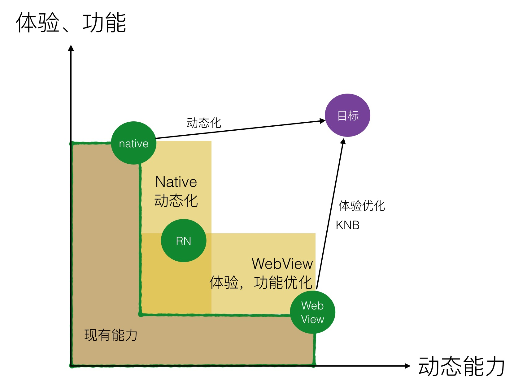
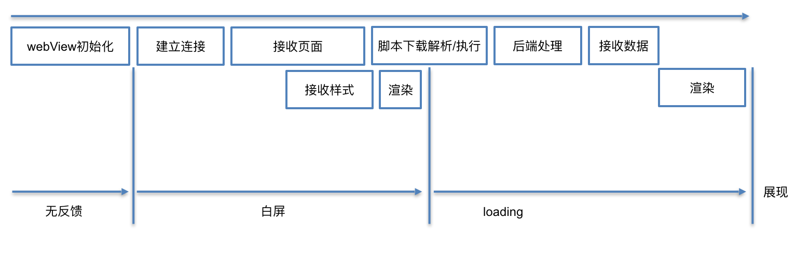

# 前端概念

## 目录
1. [前端涉及内容](#前端涉及内容)
1. [前端工程化](#前端工程化)
1. [网站性能优化](#网站性能优化)
1. [页面加载解析步骤](#页面加载解析步骤)
1. [前端「增量」原则](#前端增量原则)
1. [静态资源使用额外域名（domain hash）的原因](#静态资源使用额外域名domain-hash的原因)
1. [安全漏洞攻击](#安全漏洞攻击)
1. [前端与服务端配合细节](#前端与服务端配合细节)
1. [Hybrid App相关](#hybrid-app相关)

    1. [Native提供给Hybrid宿主环境（WebView）](#native提供给hybrid宿主环境webview)
    1. [Hybrid的前端处理](#hybrid的前端处理)
    1. [WebView性能](#webview性能)
---
### 前端涉及内容


>更详细的线路图：[Frontend Roadmap](https://github.com/kamranahmedse/developer-roadmap/blob/master/readme.md#-frontend-roadmap)。

1. 从本质上讲，所有Web应用都是一种运行在网页浏览器中的软件，这些软件的GUI（Graphical User Interface，图形用户界面）即为前端。
2. 服务端Node.js与各种终端的涌现，让前端进入了大前端范畴，这时的前端，已远远不只是浏览器端的页面实现技术，而是后端服务与人机界面的连接器。

    

### 前端工程化
>参考：[张云龙：前端工程——基础篇](https://github.com/fouber/blog/issues/10)。

1. 第一阶段：库/框架选型

    >提升开发效率。（使用自动化工具也能够提升开发效率，如：浏览器自动刷新、IDEs）
2. 第二阶段：简单构建优化

    >提升运行性能。

    对代码进行压缩、校验，以页面为单位进行简单的资源合并。
3. 第三阶段：JS/CSS模块化开发

    >提升维护效率。

    **分而治之**
    1. [JS模块化方案](https://github.com/realgeoffrey/knowledge/blob/master/网站前端/前端内容/标准库文档.md#js模块化方案)：

        CommonJS/AMD/CMD/ES6 Module/UMD
    2. CSS模块化方案：

        Sass/Less/Stylus等CSS预处理器的`import`、`mixin`特性支持实现。
4. 第四阶段：前端工程化

    >优化部署、开发。

    1. 组件化开发

        >模块化开发的升华。

        1. 页面上的每个**独立的**可视/可交互区域视为一个组件；
        2. 每个组件对应一个**工程目录**，组件所需的各种资源都在这个目录下**就近维护**；
        3. 由于组件具有独立性，因此组件与组件之间可以**自由组合**；
        4. 页面只不过是组件的容器，负责组合组件形成功能完整的界面；
        5. 当不需要某个组件，或想要替换组件时，可以整个目录替换、删除。

    2. 资源管理

        >静态资源加载的技术实现。

        解决思路：
        1. 静态资源管理系统 = 资源表 + 资源加载框架
        2. [大公司的静态资源优化方案](https://github.com/fouber/blog/issues/6)：

            1. 配置超长时间的本地缓存 —— 节省带宽，提高性能
            2. 采用文件的数字签名（如：MD5）作为缓存更新依据 —— 精确的缓存控制
            3. 静态资源CDN部署 —— 优化网络请求
            4. 非覆盖式更新资源 —— 平滑升级

### 网站性能优化
>性能优化是一个[工程](https://github.com/realgeoffrey/knowledge/blob/master/网站前端/前端内容/README.md#前端工程化)问题。

从输入URL到页面完成的具体优化。

1. URL输入：

    服务端对HTTP请求、资源发布和缓存、服务器配置的优化。

    1. 服务器开启gzip。

        >前端查看Response头是否有：`Content-Encoding: gzip`。
    2. 减少DNS查找，设置合适的TTL值，避免重定向。
    3. 使用CDN。
    4. [静态资源和API分开域名放置](https://github.com/realgeoffrey/knowledge/blob/master/网站前端/前端内容/README.md#静态资源使用额外域名domain-hash的原因)，减少cookie。
    5. 对资源进行缓存：

        1. 减少~~内嵌JS、CSS~~，使用外部JS、CSS。
        2. 使用[缓存相关HTTP头](https://github.com/realgeoffrey/knowledge/blob/master/网站前端/HTTP相关/README.md#http缓存)：`Expires` `Cache-Control` `Last-Modified/If-Modified-Since` `ETag/If-None-Match`。
        3. 配置超长时间的本地缓存，采用文件的数字签名（如：MD5）作为缓存更新依据。
    6. [非覆盖式更新资源](https://github.com/fouber/blog/issues/6)。
2. [载入页面](https://github.com/realgeoffrey/knowledge/blob/master/网站前端/前端内容/README.md#页面加载解析步骤)：

    前端对具体代码性能、CRP（Critical Rendering Path，关键渲染路径，优先显示与用户操作有关内容）的优化。

    >todo:DOMContentLoaded、First Contentful Paint、First Meaningful Paint、Onload

    1. 优化CRP：

        1. 减少关键资源、减少HTTP请求：

            1. 资源合并、去重。
            2. 首屏资源进行服务端渲染，不要在客户端异步加载并渲染。
            3. 非首屏资源延迟异步加载：

                1. 增量加载资源：

                    1. [图片的延迟加载（lazyload）](https://github.com/realgeoffrey/knowledge/blob/master/网站前端/JS方法积累/实用方法/README.md#jquery图片延时加载lazyload)。
                    2. AJAX加载（如：[滚动加载](https://github.com/realgeoffrey/knowledge/blob/master/网站前端/JS方法积累/实用方法/README.md#jquery滚动加载)、[IntersectionObserver判断DOM可见再发起异步加载](https://github.com/realgeoffrey/knowledge/blob/master/网站前端/JS方法积累/实用方法/README.md#原生jsdom展示或消失执行方法intersectionobserver)）。
                    3. 功能文件按需加载（模块化、组件化）。
                2. 使AJAX可缓存（当用GET方式时添加缓存HTTP头：`Expires` `Cache-Control` `Last-Modified/If-Modified-Since`）。
            4. 使用缓存代替每次请求（localStorage、sessionStorage、cookie等）
            5. 利用空闲时间[预加载](https://github.com/realgeoffrey/knowledge/blob/master/网站前端/JS学习笔记/README.md#预加载)。
            6. 第三方资源异步加载（`<script>`添加`defer/async`属性、动态创建或修改`<script>`）、第三方资源使用统一的CDN服务和设置[`<link>`预加载](https://github.com/realgeoffrey/knowledge/blob/master/网站前端/JS学习笔记/README.md#预加载)。
            7. 避免使用空链接的``、`<link>`、`<script>`、`<iframe>`（老版本浏览器依旧会请求）。
        2. 最小化字节：

            1. 压缩资源。
            2. 图片优化

                1. 压缩。
                2. 小图合并雪碧图。

                    >大图切小图：单个大文件需要多次HTTP请求获取。
                3. 合理使用Base64、WebP、`srcset`属性。

                    >1. 服务端（或CDN）处理图片资源，提供返回多种图片类型的接口（如：[七牛](https://developer.qiniu.com/dora/manual/3683/img-directions-for-use)）。
                    >2. [判断浏览器是否支持WebP](https://github.com/realgeoffrey/knowledge/blob/master/网站前端/JS方法积累/实用方法/README.md#原生js判断是否支持webp)，对不同浏览器请求不同的图片类型。
                    >3. 用`<source>/`的`type`、`srcset`、`sizes`、`media`等属性，让浏览器自动选择使用哪种资源（浏览器自动跳过不支持的资源）。
        3. 缩短CRP长度：

            CSS放在HTML顶部，JS放在HTML底部。
        4. 用户体验（减弱用户对加载时长的感知）：

            1. 骨架屏
            2. lazyload默认图
    2. 技术上优化：

        1. CSS性能：

            1. [CSS选择器性能](https://github.com/realgeoffrey/knowledge/blob/master/网站前端/HTML+CSS学习笔记/README.md#css选择器)。
            2. [渲染性能](https://github.com/realgeoffrey/knowledge/blob/master/网站前端/HTML+CSS学习笔记/README.md#渲染性能rendering-performance)

                1. 样式缩小计算范围、降低复杂度。
                2. 减少重绘和重排。
                3. 动画合理触发GPU加速。
                4. 尽量仅使用`opacity`、`transform: translate/scale/rotate/skew`处理动画。
        2. JS代码性能优化：

            1. 使用性能好的代码方式（微优化）

                1. 字面量创建数据，而不是构造函数。
                2. 缓存DOM的选择、缓存列表.length。
                3. [闭包合理使用](https://github.com/realgeoffrey/knowledge/blob/master/网站前端/JS学习笔记/README.md#闭包closure)。
                4. [避免内存泄漏](https://github.com/realgeoffrey/knowledge/blob/master/网站前端/JS学习笔记/README.md#内存泄漏)。
                5. 长字符串拼接使用`Array.prototype.join()`，而不使用`+`。
            2. 尽量使用事件代理，避免批量绑定事件。
            3. [定时器取舍，合理使用重绘函数代替](https://github.com/realgeoffrey/knowledge/blob/master/网站前端/JS学习笔记/README.md#定时器--重绘函数)。
            4. 高频事件（如：`scroll`、`mousemove`、`touchmove`）使用[函数防抖、函数节流](https://github.com/realgeoffrey/knowledge/blob/master/网站前端/JS学习笔记/README.md#函数防抖函数节流)，避免在高频事件中进行运行时间长的代码。
            5. 避免强制同步布局、避免布局抖动。
            6. 使用`Web Worker`处理复杂的计算。
            7. 正则表达式尽可能准确地匹配目标字符串，以减少不必要的回溯。
        3. HTML：

            1. 减少层级嵌套。
            2. 在拥有`target="_blank"`的`<a>`中添加`rel="noopener"`。

- [WebView优化](https://github.com/realgeoffrey/knowledge/blob/master/网站前端/前端内容/README.md#webview性能)：

    配合客户端开发落地优化方案。

>- <details>
>
>    <summary>优先优化对性能影响大、导致瓶颈的部分</summary>
>
>    1. 打开各种分析工具，根据建议逐条对照修改
>
>        1. [lighthouse](https://github.com/GoogleChrome/lighthouse)
>
>            1. DevTools的Audits
>            2. Chrome的扩展程序：[Lighthouse](https://chrome.google.com/webstore/detail/lighthouse/blipmdconlkpinefehnmjammfjpmpbjk)
>            3. Node.js全局安装[lighthouse](https://www.npmjs.com/package/lighthouse)并执行`lighthouse 域名`
>        2. 分析网站：
>
>            1. google的性能分析[PageSpeed Insights](https://developers.google.com/speed/pagespeed/insights/)
>            2. W3C
>
>                1. [标签验证](https://validator.w3.org/)
>                2. [CSS验证](https://jigsaw.w3.org/css-validator/validator.html.zh-cn)
>                3. [链接测试](https://validator.w3.org/checklink)
>            3. [性能测试](https://gtmetrix.com/)
>
>    2. 根据DevTools的Performance查询运行时导致帧数过高的代码。
>    3. 在客户端运行`window.performance`查询性能。
>    </details>
>- <details>
>
>    <summary>网络应用的生命期建议：</summary>
>
>    1. load
>
>        1000ms内完成CRP。
>    2. idle
>
>        进行50ms内的空闲时期预加载，包括图片、多媒体文件、后续内容（如：评论）。
>    3. animations
>
>        保证16ms/f的浏览器渲染时间。
>    4. response
>
>        100ms内对用户的操作做出响应。
>    </details>

### 页面加载解析步骤
todo

1. DOM构造解析步骤

    >参考：[全方位提升网站打开速度：前端、后端、新的技术](https://github.com/xitu/gold-miner/blob/master/TODO/building-a-shop-with-sub-second-page-loads-lessons-learned.md#前端性能)。

    

    1. 增量式生成一个文档对象模型（DOM），解析页面内容（`document`）。

        1. 加载DOM中所有CSS，生成一个CSS对象模型（CSSOM），描述对页面内容如何设置样式。

            加载CSS并构造完整的CSSOM之前，**阻塞渲染**（Render Tree渲染被暂停）。
        2. 加载DOM中所有JS，对DOM和CSSOM进行访问和更改。

            1. HTML中出现JS，**阻塞解析**（DOM构造被暂停）。
            2. 下载外部脚本`src`或内嵌脚本不用下载。
            3. 等待所有CSS被提取且CSSOM被构造完毕。

                ><details>
                ><summary>已经被提取的CSS（<code>&lt;link></code>、<code><style></code>、<code>style</code>内嵌样式），若再次修改或删除（或新添加），会再次影响CSSOM构造。</summary>
                >
                >以下代码可以实时在页面中编辑样式
                >```html
                ><style contenteditable style="display: block">
                >  a {
                >    color: red;
                >  }
                ></style>
                >
                ><a href="javascript:">a标签</a>
                >```
                ></details>
            4. 执行脚本，访问、更改DOM和CSSOM。

                ><details>
                ><summary>一个<code><script></code>最多执行一次。</summary>
                >
                >1. 已经执行过的脚本（`<script>`：外部脚本`src`或内嵌脚本），若再次修改或删除，不会再执行，也不会影响执行过的内容。已经执行过的脚本，若删除外部脚本`src`或删除内嵌脚本，之后再添加外部脚本`src`或添加内嵌脚本，也不会再次执行。
                >2. 没有执行过内容的空脚本`<script></script>`，若添加外部脚本`src`或添加内嵌脚本，会执行一次。
                ></details>
            5. DOM构造继续进行。

            ><details>
            ><summary><code><script></code>的加载、执行</summary>
            >
            >1. 没有`defer`或`async`：立即加载并执行（同步），阻塞解析。
            >2. `defer`：异步加载，在DOM解析完成后、`DOMContentLoaded`触发前执行，顺序执行。
            >
            >    >多个`defer`脚本不一定按照顺序执行，也不一定会在`DOMContentLoaded`事件触发前执行，因此最好只包含一个延迟脚本。
            >3. `async`：异步加载，加载完马上执行。
            >
            >    乱序执行，仅适用于不考虑依赖、不操作DOM的脚本。
            >
            >    >动态创建的`<script>`默认是`async`（可以手动设置`dom.async = false`）。
            >4. 模块化属性（在JS内部`import`的同级资源是并行、依赖资源是串行）：
            >
            >    1. `type="module"`：与`defer`相同。
            >    2. `type="module" async`：与`async`相同。
            >
            >
            >
            >- 按从上到下顺序解析页面内容，针对`<script>`（包括动态创建和修改`src`）：
            >
            >    1. 按文档顺序执行**原本就存在的**没有`defer`或`async`的`<script>`。
            >    2. （与上面的顺序无关，可交叉进行）按动态添加的时序（与位置无关）执行**动态加载的**没有`defer`或`async`的`<script>`；
            >    3. 添加`defer`或`async`的`<script>`或修改`<script>`的`src`，（无论是原本就存在的、还是动态加载的）异步加载、不确定顺序执行。
            ></details>
    2. DOM（parse HTML）和CSSOM（recalculate style）构造完成后，进行渲染：

        Render Tree（渲染树）：Layout -> Paint -> Composite

        >1. 一定要等待外链资源加载完毕（包括加载失败）才可以继续构建DOM或CSSOM。
        >2. 只有可见的元素才会进入渲染树。
        >3. DOM不存在伪元素（CSSOM中才有定义），伪元素存在render tree中。

    >1. 无论阻塞渲染还是阻塞解析，资源文件会不间断按顺序加载。
    >2. 若在DOM中删除`<style>`或`<link>`标签，则会马上改变CSSOM；若在DOM中删除`<script>`标签（无论是否还在加载外部脚本`src`），则不影响该脚本执行。
2. 事件完成顺序

    1. 解析DOM；
    2. 执行同步的JS和CSS

        1. 加载外部JS（和CSS）；
        2. （CSSOM先构造完毕）解析并执行JS；
    3. 构造DOM完毕（同步的JS会暂停DOM解析，CSSOM的构建会暂停JS执行）；

        完毕后触发：JS的`document.addEventListener('DOMContentLoaded', function () {}, false)` 或 jQuery的`$(document).ready(function () {})`。
    4. 加载图片、媒体资源等外部文件；
    5. 资源加载完毕。

        完毕后触发：JS的`window.addEventListener('load', function () {}, false)`。

- 判断JS、CSS文件是否加载完毕：

    1. JS

        1. 监听文件的`load`事件，触发则加载完成。
        2. 监听JS文件的`readystatechange`事件（大部分浏览器只有`document`能够触发），当文件的`readyState`值为`loaded/complete`则JS加载完成。
    2. CSS

        1. 监听文件的`load`事件，触发则加载完成。
        2. 轮询CSS文件的`cssRules`属性是否存在，当存在则CSS加载完成。
        3. 写一个特殊样式，轮询判断这个样式是否出现，来判断CSS加载完成。

### 前端「增量」原则
1. 「增量」原则：

    >「增量下载」是前端在工程上有别于客户端GUI软件的根本原因。

    前端应用没有安装过程，其所需程序资源都部署在远程服务器，用户使用浏览器访问不同的页面来加载不同的资源，随着页面访问的增加，渐进式地将整个程序下载到本地运行。
2. 由「增量」原则引申出的前端优化技巧几乎成为了**性能优化**的核心：

    1. 加载相关：延迟加载、AJAX加载、按需加载、预加载、请求合并压缩等策略。
    2. 缓存相关：缓存更新、缓存共享、非覆盖式更新资源等方案。
    3. 复杂的BigRender、BigPipe、Quickling、PageCache等技术。

### 静态资源使用额外域名（domain hash）的原因
1. cookie free

    cookie是同源（且同路径），不同域名可以避免~~某些静态资源携带不必要的cookie而占用带宽~~。
2. 浏览器对同一域名有HTTP并发数限制

    1. 客户端：PC端口号数量有限（65536个）、线程切换开销大。
    2. 服务端：服务器的负载、并发接收限制。
3. 动静分离，静态资源方便做CDN

    将网站静态资源（HTML、JS、CSS、图片、字体、多媒体资源等）与后台应用（API）分开部署。

    1. 缺点：

        1. 需要处理[跨域请求](https://github.com/realgeoffrey/knowledge/blob/master/网站前端/JS学习笔记/README.md#跨域请求)。
        2. 开发量大。
    2. 优点

        1. cookie free和HTTP并发限制的需要。
        2. API更加便利、易维护。
        3. 前后端分离开发。
        4. 减轻API服务端压力。

### 安全漏洞攻击
1. XSS

    跨站脚本（Cross-Site Scripting，XSS）是恶意代码注入网页。利用用户对指定网站的信任。

    1. 攻击方式

        >所有可输入的地方，若没有对输入数据进行处理的话，则都存在XSS漏洞。

        - 通过巧妙的方法注入恶意指令代码（HTML、JS或Java，VBScript，ActiveX，Flash）到网页内容，使用户加载并执行恶意程序。

            攻击成功后，能够：盗取用户cookie、破坏页面结构、重定向到其它地址等。
    2. 防御措施：

        1. 过滤用户输入（白名单）。

            >e.g. [js-xss](https://github.com/leizongmin/js-xss)
        2. HttpOnly

            cookie设置为HttpOnly不能在客户端使用~~document.cookie~~访问。
        3. 过滤技术：浏览器的XSS Auditor、W3C的Content-Security-Policy。

        >flash的安全沙盒机制配置跨域传输：crossdomian.xml
2. CSRF

    跨站请求伪造（Cross-Site Request Forgery，CSRF）是挟制用户在已登录的网页上执行非本意操作。利用网站对用户浏览器的信任。

    1. 攻击方式

        - 当用户已经得到目标网站的认可后，对目标网站进行请求操作。

            攻击成功后，能够：进行所有目标网站的请求操作。
    2. 防御措施

        1. 检查HTTP请求的Referer字段

            Referer：请求来源地址。

            >地址栏直接输入内容不会提供`Referer`。
        2. 添加校验token

            >token：判断用户当前的会话状态是否有效（短时效性）。

            操作请求需要提供额外的**不保存在浏览器上、保存在页面表单中**的随机校验码。可以放进请求参数、或自定义HTTP请求头。
3. 其他攻击

    1. 注入型劫持

        通过在正常的网页中注入广告代码（JS代码、`<iframe>`、其他标签等），实现页面弹窗提醒或者底部广告等。

        1. 攻击方式

            运营商劫持。
        2. 防御措施

            全链路HTTPS（若使用CDN，则必须CDN请求和回源都是HTTPS）。

            >额外增加劫持难度：前端还可以用[子资源完整性（SRI）](https://developer.mozilla.org/zh-CN/docs/Web/Security/子资源完整性)验证加载文件的数字签名。
    2. DNS攻击

        使域名指往不正确的IP地址。

        1. 攻击方式

            1. 针对DNS服务器：DDoS攻击。
            2. 针对用户：DNS欺骗或劫持（访问恶意DNS服务器）、DNS缓存服务器投毒或污染、本机劫持（hosts文件篡改、本机DNS劫持、SPI链注入、DHO插件）。
        2. 防御措施

            1. 使用安全的DNS服务器。
            2. VPN或域名远程解析。
            3. 查杀病毒，清空DNS缓存。
    3. SQL注入（SQL Injection）

        运行非法的SQL。
    4. OS命令注入攻击（OS Command Injection）

        通过Web应用，执行非法的操作系统命令。
    5. HTTP头部注入攻击（HTTP Header Injection）

        通过在响应头部字段内插入换行，添加任意响应头部或主体。
    6. 邮件头部注入攻击（Mail Header Injection）

        向邮件头部To或Subject内任意添加非法内容，可对任意邮件地址发送广告邮件或病毒邮件。
    7. 目录遍历攻击（Directory Traversal，Path Traversal）

        对本无意公开的文件目录，通过非法截断其目录路径后，达成访问目的。
    8. 远程文件包含漏洞（Remote File Inclusion）

        当部分脚本内容需要从其他文件读入时，利用指定外部服务器的URL充当依赖文件，让脚本读取之后，就可运行任意脚本。
    9. 强制浏览（Forced Browsing）

        从安置在Web服务器的公开目录下的文件中，浏览那些原本非自愿公开的文件。
    10. 不正确的错误消息处理（Error Handling Vulnerability）

        Web应用的错误信息内包含对攻击者有用的信息。
    11. 开放重定向（Open Redirect）

        假如指定的重定向URL到某个具有恶意的Web网站，那么用户就会被诱导至那个Web网站。
    12. 会话劫持（Session Hijack）

        通过某种手段拿到了用户的会话ID，并非法使用此会话ID伪装成用户。
    13. 会话固定攻击（Session Fixation）

        强制用户使用攻击者指定的会话ID。
    14. 点击劫持（ClickJacking）、界面伪装（UI Redressing）

        利用透明的按钮或链接做成陷阱，覆盖在Web页面上。然后诱使用户在不知情的情况下，点击那个链接访问内容。
    15. 密码破解（Password Cracking）

        1. 穷举法（Brute-force Attack，暴力破解法）

            对所有密钥集合构成的密钥空间（Keyspace）进行穷举。即，用所有可行的候选密码对目标的密码系统试错。
        2. 字典攻击

            利用事先收集好的候选密码（经过各种组合方式后存入字典），枚举字典中的密码。

            >如：生日日期数值化。

        - 一种安全的服务端存储密码方式：

            先利用给密码加盐（salt）的方式增加额外信息，再使用散列（hash）函数计算出散列值后保存。

            ><details>
            ><summary>加盐</summary>
            >
            >由服务器随机生成的一个字符串，保证长度足够长，且是真正随机生成。然后把它和密码字符串相连接（前后都可以）生成散列值。当两个用户使用了同一个密码时，由于随机生成的salt值不同，对应的散列值也将不同。这样一来，很大程度上减少了密码特征，攻击者也就很难利用自己手中的密码特征库进行破解。
            ></details>
    16. DoS攻击（Denial of Service attack）、服务停止攻击或拒绝服务攻击

        运行中的服务呈停止状态的攻击。

        1. 集中利用访问请求造成资源过载。

            DDoS（Distributed Denial of Service attack）利用多台计算机发起Dos攻击。
        2. 通过攻击安全漏洞使服务停止。
    17. Hash Collision DoS

        >参考：[HASH COLLISION DOS 问题](http://coolshell.cn/articles/6424.html)。

        Hash碰撞的拒绝式服务攻击（Hash Collision DoS）是对服务器进行恶意负载。

        1. 攻击方式

            >1. Hash：把任意长度的输入，通过散列算法，输出固定长度的散列值。
            >2. Hash Collision DoS：利用各语言Hash算法的「非随机性」，制造出无数value不同、key相同的数据，让Hash表成为一张单向链表，而导致整个网站的运行性能下降。

            - 找到hash算法漏洞，不断提交服务器请求导致无数hash碰撞，进而形成类似单向链表的存储结构。

                攻击成功后，能够：hash堆积、查询缓慢、服务器CPU高负荷、服务器内存溢出。
        2. 防御措施

            1. 升级hash算法。
            2. 限制POST参数个数和请求长度。
            3. 防火墙检测异常请求。

- 验证码

    仅能预防机器行为：防止广告机注册、发帖、评论，防止暴力破解密码。

    1. 服务端生成图片，前端根据图片发送请求给服务端验证。
    2. ~~前端生成并验证~~。

### 前端与服务端配合细节
1. 开发方式

    1. 并行（优先）：

        1. 先与服务端对接预期API，服务端产出API文档；
        2. 前端根据文档通过Mock方式开发（或服务端先提供Mock数据的API）；
        3. 当服务端API开发完毕后再用真实API加入前端页面（仅关闭Mock即可）。
    2. 串行：

        服务端比前端提前一个版本，交付的内容包括API+文档。
2. 分页加载、滚动加载

    1. 分页加载，前端用`第几页`+`每页几项`发起请求，服务端（提前）返回`总量`给前端做判断一共有几页。
    2. 滚动加载，用`游标`作为判断下一批请求内容的依据：

        - 分页的游标管理

            1. 普通情况，游标由前端（或客户端）管理

                前端用`游标id`发起请求，服务端返回`新的游标id`给前端作为下一次请求。
            2. 若快速变动的数据（如：推荐信息）、或要根据用户操作而快速改变的数据（如已推送给某用户的不再推送给ta、用户标记不喜欢的相关类型不再推送给ta），则游标由服务端管理。

                服务端用Redis等内存管理方式记录用户的ID，前端只需要每次请求相同的无参数接口就可从服务端返回分页数据。
    >- 若用分页加载的服务端接口实现滚动加载
    >
    >    1. 则可能出现请求到重复数据或略过数据的情况。（游标的，若没有管理好数据流，则也会出现重复数据或略过数据情况）。
    >    2. 前端（或客户端）也可以模拟游标管理方式：暴露一个加载更多的无参数接口，在接口内部实现类似服务端的游标管理。
    >
    >        <details>
    >        <summary>e.g.</summary>
    >
    >        ```javascript
    >        let arr = []    // 数据
    >        const size = 10 // 每页数量
    >        const total = 111 // 总量
    >
    >        function loadMore () {
    >          if (arr.length < total) {
    >            console.log('页数：', Math.ceil(arr.length / size) + 1)
    >            // 页码：Math.ceil(arr.length / size) + 1；每页数量：size
    >            // 用发起异步请求获取数据，数据插入arr
    >            arr = arr.concat(1, 2, 3, 4, 5, 6, 7, 8, 9, 0)
    >          } else {
    >            // 已经加载所有内容
    >          }
    >          return arr
    >        }
    >
    >        loadMore()  // 加载更多直接调用，不用管理状态
    >        ```
    >        </details>
3. 服务端文档要求

    API文档确定的字段，就算为空，也必须按照文档要求返回` `或`[]`或`{}`，不允许返回内容丢失字段。
4. 扁平化的需要

    不同接口、但类别相同的数据，都按照相同的结构约定数据格式（如：[normalizr](https://github.com/paularmstrong/normalizr)）。

    ><details>
    ><summary>前端可以进行数据扁平化，把不同接口返回的数据都根据类别按照hash的方式存放在各自类别的store，并再保存一份数组记录展示顺序（把数据库的hash保存的方式移植到前端也用hash保存）</summary>
    >
    >e.g. 一个接口返回的数据包括articles、users数据，进行扁平化
    >
    >```javascript
    >// articles的store（内聚）
    >const articles = {}  // articles的store
    >articles.all = {}  // 存放articles的元数据（元数据：完整的单项数据，用唯一的id进行hash索引）
    >articles.hot = {  // 存放articles的hot的展示顺序
    >  sequence: [], // 元数据的id顺序
    >  hasMore: true // 是否继续请求
    >}
    >articles.new = {  // 存放articles的new的展示顺序
    >  sequence: [], // 元数据的id顺序
    >  hasMore: true // 是否继续请求
    >}
    >articles.flattenData = (data) => { // 扁平化数据：把单项数据全部保存在同一个地方
    >  articles.all[data.id] = Object.assign({}, articles.all[data.id], data)
    >}
    >articles.changeSequence = (data) => { // 写入某业务的展示顺序
    >  const list = articles[data.category]
    >
    >  if (data.refresh) {
    >    list.sequence = data.sequence
    >  } else {
    >    list.sequence = list.sequence.concat(data.sequence)
    >  }
    >}
    >
    >
    >// 相同省略：users的store
    >
    >
    >// 请求articles.hot的数据。返回的数据包含多种类别数据（articles、users）
    >function handleData (arr, category) {  // 处理数据
    >  articles.changeSequence({  // 写入hot的展示顺序
    >    category: category,
    >    refresh: false,
    >    sequence: arr.map((data) => {
    >      articles.flattenData(data.articles)   // 把元数据合并至articles
    >      // users.flattenData(data.users)   // 把元数据合并至users
    >
    >      return data.articles.id  // 返回articles的id用于保存顺序
    >    })
    >  })
    >
    >  console.log(category, JSON.parse(JSON.stringify(articles)))  // 打印
    >}
    >
    >// 针对articles.hot的第一次请求
    >const data1 = [
    >  { articles: { id: '1', data: 'articles第一个数据' }, users: { id: 'a', data: 'users第I个数据' } },
    >  { articles: { id: '20', data: 'articles第二个数据' }, users: { id: 'b', data: 'users第II个数据' } },
    >  { articles: { id: '300', data: 'articles第三个数据' }, users: { id: 'c', data: 'users第III个数据' } },
    >  { articles: { id: '4000', data: 'articles第四个数据' }, users: { id: 'd', data: 'users第IV个数据' } }
    >]
    >handleData(data1, 'hot')
    >
    >// 针对articles.hot的第二次请求
    >const data2 = [
    >  { articles: { id: '5000', data: 'articles第五个数据' }, users: { id: 'E', data: 'users第V个数据' } },
    >  { articles: { id: '600', data: 'articles第六个数据' }, users: { id: 'F', data: 'users第VI个数据' } },
    >  { articles: { id: '70', data: 'articles第七个数据' }, users: { id: 'G', data: 'users第VII个数据' } },
    >  { articles: { id: '8', data: 'articles第八个数据' }, users: { id: 'H', data: 'users第VIII个数据' } },
    >  { articles: { id: '1', data: 'articles第一的覆盖内容' }, users: { id: 'a', data: 'users第I个的覆盖内容' } }
    >]
    >handleData(data2, 'hot')
    >
    >// 针对articles.new的第一次请求
    >const data3 = [
    >  { articles: { id: '5000', data: 'articles第五的覆盖内容' }, users: { id: 'E', data: 'users第V的覆盖内容' } },
    >  { articles: { id: '8', data: 'articles第八的覆盖内容' }, users: { id: 'H', data: 'users第VIII的覆盖内容' } },
    >  { articles: { id: '300', data: 'articles第三的覆盖内容' }, users: { id: 'c', data: 'users第III的覆盖内容' } },
    >  { articles: { id: '20', data: 'articles第二的覆盖内容' }, users: { id: 'b', data: 'users第II的覆盖内容' } }
    >]
    >handleData(data3, 'new')
    >
    >console.log('接口获得的数据都进行扁平化处理；在对应类别的store按照id存取数据，再保存一份存放顺序的数组')
    >```
    ></details>
5. 接口请求失败，不能帮用户静默再次请求

    1. 提示用户（针对必要展示的信息）

        让用户认知网络错误（或其他错误）并且给用户操作重新加载的功能（如：跳转到网络出错或404页面）。

        >需要请求数据的应用都需要设计404和网络错误等容错页面。
    2. 静默失败（针对增量加载的信息，如：滚动加载）

        不提示用户失败，当用户再次触发时再次请求（减少用户挫败感）。
6. 不能把服务端返回的（错误）信息直接发送给用户看见，需要转换成用户能看得懂的语言。

    ><details>
    ><summary>也不能把前端错误信息发送给用户。若必须发送给用户错误信息，也需要转换成用户能看得懂的语言。</summary>
    >
    >e.g.
    >
    >```javascript
    >try {
    >  asd
    >} catch (e) {
    >  alert(e)  // 不可以把不经过翻译的错误信息发送给用户
    >}
    >```
    ></details>

---
### Hybrid App相关

#### Native提供给Hybrid宿主环境（WebView）
Hybrid底层依赖Native提供的容器（WebView），上层使用HTML、CSS、JS进行业务开发。

1. 互相调用：

    1. Native调用WebView的JS方法（`window.前端定义方法`）
    2. WebView调用`桥协议`（`window.客户端定义方法`）、或触发`自定义URL Scheme`（`myscheme://客户端定义路径`）
2. 资源访问机制

    1. 以本地协议`file`方式访问Native内部资源。

        - 可以把前端要用的静态资源放到客户端本地（如：字体文件），本地页面通过类似`file:///android_asset/fonts/myFont.ttf`引用。
    2. 以远程`url`方式访问线上资源。
    3. 增量替换机制（不依赖发包更新）

        1. Native包内下载、解压线上的打包资源，再替换旧资源。
        2. ~~manifest~~
    4. URL限定，限制访问、跨域问题的解决方案

        1. 可以限制WebView的能发起的请求内容。
        2. 可以代替WebView进行会触发跨域的AJAX请求。
3. 页面在客户端内打开方式

    1. 针对产品功能性页面：

        用本地协议`file`方式打开客户端包内.html（.js、.css、图片等都在客户端包内）。

        - `file`打开的页面直接发起请求可能会有跨域问题，可以用客户端接口代理的方式请求服务端数据。
    2. 针对运营活动页面：

        用远程`url`方式请求。
4. 身份验证机制

    Native创建WebView时，根据客户端登录情况注入跟登录有关的cookie（session_id）或token。
5. 开发测试

    1. 提供**切换成线上资源请求方式**的功能，用代理工具代理成本地资源。

#### Hybrid的前端处理
1. 与Native配合方式：

    >1. 都是以**字符串**（数据用JSON字符串）的形式交互，向客户端传递：
    >
    >    1. 全局的方法名 -> 客户端调用`window.方法名(JSON数据)`
    >    2. 匿名函数 -> 客户端调用`(匿名函数(JSON数据))`
    >2. WebView无法判断是否安装了其他App。
    >3. 可以通过`查看注入的全局方法`、或`客户端调用回调函数`（、或`navigator.userAgent`）来判定H5页面是否在具体App内打开。
    >4. `桥协议`仅在App内部起作用；`自定义URL Scheme`是系统层面，所以可以额外针对跨App起作用（如：分享去其他App）；iOS的**通用链接**可以认为是高级的`自定义URL Scheme`。
    >5. Native和WebView交互需要时间，对时效性很高的操作会有问题。

    1. `桥协议`：Native注入全局方法至WebView的`window`，WebView调用则客户端拦截后触发Native行为。

        >1. 客户端注入方式：javascript伪协议方式`javascript: 代码`。
        >2. 注入JS代码可以在创建WebView之前（`[native code]`）或之后（全局变量JS注入）。
        >- 若注入的方法为`undefined`，则认为不在此App内部。
    2. `自定义URL Scheme`：拦截跳转（`<iframe>`或``设置`src`、点击`<a>`、`window.location.href`），触发Native行为。

        ><details>
        ><summary><code>URL Scheme</code></summary>
        >
        >是iOS和Android提供给开发者的一种WAP唤醒Native App方式（客户端用DeepLink实现）。Android应用在mainfest中注册自己的Scheme；iOS应用在App属性中配置。典型的URL Scheme：`myscheme://my.hostxxxxxxx`。
        ></details>

        >1. 客户端可以捕获、拦截任何行为（如：`console`、`alert`）。相对于注入全局变量，拦截方式可以隐藏具体JS业务代码，且不会被重载，方便针对不可控的环境。
        >2. 有些App会设置允许跳转的其他App的白名单或黑名单，如：微信白名单。
        >3. 除了增加回调函数且被客户端调用，否则无法准确判定是否在此App内部。
        >4. 跨App使用`自定义URL Scheme`，其后面的字符串要产生的行为仅目的App能理解。

        1. iOS

            1. iOS8-

                ```javascript
                var iframe = document.createElement('iframe');
                iframe.src = '自定义URL Scheme';
                iframe.style.display = 'none';
                document.body.appendChild(iframe);
                setTimeout(function () {
                  document.body.removeChild(iframe);
                }, 3000);

                location.href = '下载地址';
                ```
            2. iOS9+

                >`<iframe>`无效。

                ```javascript
                location.href = '自定义URL Scheme';

                setTimeout(function () {
                  location.href = '下载地址';
                }, 250);
                setTimeout(function () {
                  location.reload();
                }, 1000);
                ```
            3. iOS9+的Universal links（通用链接），可以从底层打开其他App客户端，跳过白名单（微信已禁用）

                >需要HTTPS域名配置、iOS设置等其他端配合。

                >参考：[通用链接（Universal Links）的使用详解](http://www.hangge.com/blog/cache/detail_1554.html)、[Universal Link 前端部署采坑记](http://awhisper.github.io/2017/09/02/universallink/)、[Support Universal Links](https://developer.apple.com/library/content/documentation/General/Conceptual/AppSearch/UniversalLinks.html#//apple_ref/doc/uid/TP40016308-CH12-SW2)。
        2. Android

            ```javascript
            location.href = '自定义URL Scheme';	  // 也可以用`<iframe>`

            var start = Date.now();
            setTimeout(function () {    // 尝试通过上面的唤起方式唤起本地客户端，若唤起超时（还在这个页面），则直接跳转到下载页（或做其他未安装App的事情）（浏览器非激活时，定时器执行时间会变慢/主线程被占用，所以会大于定时器时间之后才执行定时器内回调）
              if (Date.now() - start < 3100) {  // 还在这个页面，认为没有安装App
                location.href = '下载地址';
              }
            }, 3000);
            ```

        - 在WebView中通过应用宝页面**下载/打开**其他APP

            >参考：[关于微信中直接调起 Native App 的调研报告](https://blog.csdn.net/lixuepeng_001/article/details/78043418)。

            1. iOS：应用宝页面支持跳转至目标APP的App Store
            2. Android：应用宝页面支持下载/打开目标APP

                1. 在腾讯系APP中能识别是否安装了目标APP；在其他APP中无法判断。
                2. 填写`android_schema`可以传递信息至目标APP：腾讯系APP打开目标APP后会带着信息；其他APP会先触发一次信息。
                - 不用安装应用宝就支持打开目标APP功能；下载是去应用宝下载（会先要求安装应用宝APP）。

            - 拼接应用宝下载/打开目标APP的链接：

                1. 应用宝主链接：`https://a.app.qq.com/o/simple.jsp?`
                2. 跳转参数（search值，在`?`后面，用`&`分割）:

                    1. 包名：`pkgname=` + `com.xx.xxx`
                    2. 渠道包链接（可选）：`ckey=` + `CK1234567890123`
                    3. 目标APP内打开路径（可选）：`android_schema=` + `自定义URL Scheme://具体跳转路径`

                        >若有一些特殊字符，则可以用`encodeURIComponent`转义属性名和属性值。

                e.g. `https://a.app.qq.com/o/simple.jsp?pkgname=com.xx.xxx&ckey=xxxx&android_schema=xxxx://xx`

        >1. 微信分享在部分系统（低于微信客户端Android6.2）使用~~pushState~~导致签名失败，可查询[官方文档](https://mp.weixin.qq.com/wiki?t=resource/res_main&id=mp1421141115)；又因为一般是异步加载、配置微信的设置，所以要等待微信第三方文件和接口完成后才能够配置成功（才能够设置成功）。
        >2. Android的微信、QQ等X5内核可以用<http://debugx5.qq.com/>打开调试，可进行清除缓存等操作。
        >3. 长按没有 ~~`src`~~ 的``：
        >
        >    1. 在iOS微信webview，截屏这个``所在位置；
        >    2. 其他情况，可能导致保存图片错误、或不能进行保存。
    3. WebView提供给Native调用的全局回调函数（或匿名函数）。

        ><details>
        ><summary>对于动态创建的全局回调函数，要注意同名覆盖问题</summary>
        >
        >e.g.
        >
        >```javascript
        >let _localCounter = 1 // 同一个方法名快速请求时，可能 Date.now() 还没有变化
        >
        >function invokeJSBridge (method, arg, { hasCallback = true }) {
        >  return new Promise((resolve, reject) => {
        >    if (typeof window.客户端定义方法 === 'function') {
        >      let callbackName = ''
        >
        >      // 创建客户端回调
        >      if (hasCallback) {
        >        callbackName = `${method}CallbackName_${_localCounter}`
        >        _localCounter += 1
        >
        >        window[callbackName] = (res) => {    // todo: 增加定时器处理长时间未被客户端回调的方法
        >          try {
        >            resolve({ result: 'ok', data: JSON.parse(res) })
        >          } catch (e) {
        >            resolve({ result: 'error', data: res })
        >          }
        >          window[callbackName] = null
        >        }
        >      }
        >
        >      // 调用客户端方法
        >      window.客户端定义方法( // 桥协议
        >        method, // 方法名
        >        JSON.stringify(arg || {}),  // 传参
        >        callbackName  // 回调
        >      )
        >
        >      // 无客户端回调时直接完成
        >      if (!hasCallback) {
        >        resolve({ result: 'ok', data: '' })
        >      }
        >    } else {
        >      reject(arg)
        >    }
        >  })
        >}
        >
        >
        >/* 使用测试 */
        >invokeJSBridge('方法名', '参数')
        >  .then((res) => {  // 是客户端、且调用成功&&客户端执行回调
        >    // 根据res处理客户端执行之后业务
        >  })
        >  .catch((res) => { // 不是客户端
        >    // 非客户端业务
        >  })
        >```
        ></details>
    >接口设计可以带有「透传数据」：前端调用客户端方法时多传一个透传参数，之后客户端异步调用前端方法时带着这个参数的值。
2. 根据WebView的[错误处理机制](https://github.com/realgeoffrey/knowledge/blob/master/网站前端/JS学习笔记/README.md#错误处理机制)统计用户在Hybrid遇到的bug。
3. 调试webview：[代码调试方式](https://github.com/realgeoffrey/knowledge/blob/master/网站前端/JS学习笔记/README.md#代码调试方式)中针对移动端的部分。
4. 分享到其他App

    1. 通过JS触发Native App之间的切换分享（自己Native内可用桥协议，任意App均要起作用只能用Scheme）。
    2. 带分享信息参数去访问目标App提供的分享URL。

#### WebView性能
>参考：[WebView性能、体验分析与优化](https://tech.meituan.com/2017/06/09/webviewperf.html)。

1. 原生实现 VS. 页面实现

    1. Native App

        1. 高成本开发
        2. 原生性能体验
        3. 依赖发包更新
    2. Hybrid App

        1. 低成本开发、高效率、一套代码跨平台复用（因为就是输出页面）
        2. 性能不及原生应用（因为要初始化WebView，[前端「增量」原则](https://github.com/realgeoffrey/knowledge/blob/master/网站前端/前端内容/README.md#前端增量原则)决定）
        3. 不依赖Native发包更新（注意避免违反苹果的热更新条款）

    
2. WebView启动流程

    

    1. 相对于Native App的流畅体验，Hybrid App瓶颈一般都卡在WebView实例初始化，可能导致App卡顿、页面加载缓慢。

        WebView的初始化、保持，占用较多内存。
    2. 与浏览器不同，App中打开WebView的第一步并不是建立连接，而是启动浏览器内核。
    3. 除了[网站性能优化](https://github.com/realgeoffrey/knowledge/blob/master/网站前端/前端内容/README.md#网站性能优化)之外，能提升体验的办法基本要让Native配合调整（页面能做的不多，主要靠客户端开发投入）。
