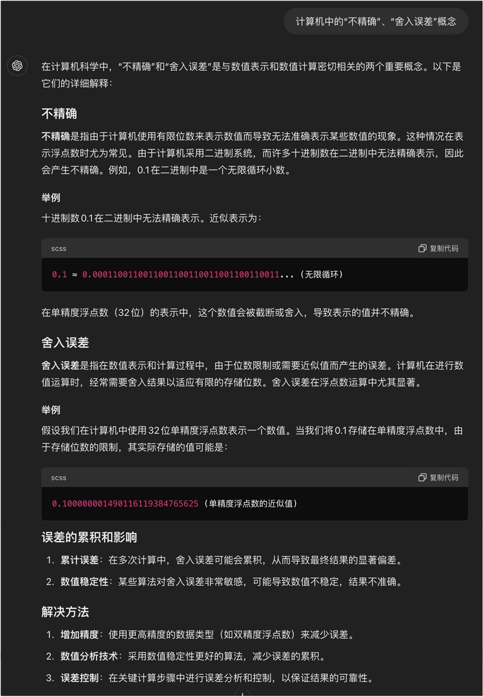
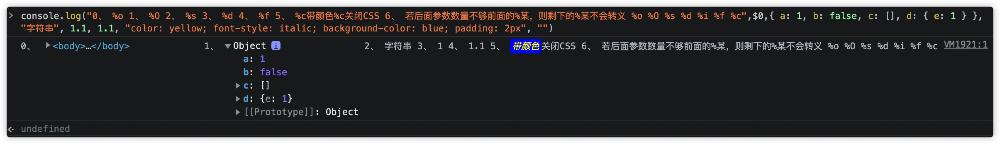

# 标准库文档

## 目录
1. [ECMAScript标准（部分）](#ecmascript标准部分)

    1. [属性描述](#属性描述)
    1. [`Object`](#object)
    1. [`Function`](#function)
    1. [`Array`](#array)
    1. [`String`](#string)
    1. [`Number`](#number)
    1. [`JSON`](#json)
    1. [`Date`](#date)
    1. [`Math`](#math)
    1. [严格模式](#严格模式)
1. [ES6](#es6)

    1. [ECMAScript 2015新增](#ecmascript-2015新增ecma-262-6th-edition新增)

        1. [`let`、`const`](#letconst)
        1. [箭头函数](#箭头函数)
        1. [简写对象的属性、方法](#简写对象的属性方法)
        1. [计算对象的属性名或方法名](#计算对象的属性名或方法名)
        1. [字符串的扩展](#字符串的扩展)
        1. [数值的扩展](#数值的扩展)
        1. [解构赋值、默认参数、剩余参数、展开元素](#解构赋值默认参数剩余参数展开元素)
        1. [ES6 Module](#es6-module)
        1. [`Promise`](#promise)
        1. [可迭代对象、异步可迭代对象](#可迭代对象异步可迭代对象)
        1. [`for-of`](#for-of)
        1. [`for-await-of`（ECMAScript 2018）](#for-await-ofecmascript-2018)
        1. [生成器（generators）](#生成器generators)
        1. [`async-await`（ECMAScript 2017）](#async-awaitecmascript-2017)
        1. [`class`、`class-extends`](#classclass-extends)
        1. [`super`](#super)
        1. [`new.target`](#newtarget)
        1. [`Symbol`](#symbol)
        1. [`Set`、`WeakSet`、`Map`、`WeakMap`](#setweaksetmapweakmap)
        1. [`Proxy`](#proxy)
        1. [`Reflect`](#reflect)
        1. [`BigInt`（ECMAScript 2019）](#bigintecmascript-2019)
    1. [ECMAScript 2016新增](#ecmascript-2016新增ecma-262-7th-edition新增)
    1. [ECMAScript 2017新增](#ecmascript-2017新增ecma-262-8th-edition新增)
    1. [ECMAScript 2018新增](#ecmascript-2018新增ecma-262-9th-edition新增)
    1. [ECMAScript 2019新增](#ecmascript-2019新增ecma-262-10th-edition新增)
    1. [ECMAScript 2020新增](#ecmascript-2020新增ecma-262-11th-edition新增)
    1. [ECMAScript 2021新增](#ecmascript-2021新增ecma-262-12th-edition新增)
    1. [ECMAScript 2022新增](#ecmascript-2022新增ecma-262-13th-edition新增)
    1. [ECMAScript 2023新增](#ecmascript-2023新增ecma-262-14th-edition新增)
1. [Web API标准（部分）](#web-api标准部分)

    1. [文档对象模型（DOM）](#文档对象模型dom)

        1. [`document`](#document)
    1. [Canvas](#canxvas)
    1. [浏览器对象模型（BOM）](#浏览器对象模型bom)

        1. `window`
        1. [`location`](#location)
        1. [`navigator`](#navigator)
        1. `screen`
        1. [`history`](#history)
    1. [`console`](#console)
    1. [`Blob`](#blob)
    1. Observers

        1. [`IntersectionObserver`](#intersectionobserver)
        1. [`MutationObserver`](#mutationobserver)
        1. [`PerformanceObserver`](#performanceobserver)
        1. `ResizeObserver`
        1. `ReportingObserver`
    1. [`Performance`](#performance)
    1. [`FormData`](#formData)
    1. [`fetch`](#fetch)
    1. [`Headers`](#headers)
    1. [`Request`](#request)
    1. [`Response`](#response)
    1. [`WebSocket`](#websocket)
    1. [`URL`](#url)
    1. [`URLSearchParams`](#urlsearchparams)
1. [jQuery标准（部分）](#jquery标准部分)

    1. [`Deferred`](#deferred)
    1. [jQuery事件类型](#jquery事件类型)
    1. [jQuery事件处理程序的事件对象](#jquery事件处理程序的事件对象)
1. [其他](#其他)

    1. [JS特殊字符](#js特殊字符)
    1. [this替代](#this替代)

---
## [ECMAScript标准](https://www.ecma-international.org/publications-and-standards/standards/ecma-262/)（部分）
对象的API，大部分都是针对`可枚举`且`自身（不在原型链上）`的属性；复制相关的API，都是浅复制。

### 属性描述
对象的每一个属性都对应一个「属性描述」对象，必须是`数据属性`或`访问器属性`两种形式之一。

1. 数据属性：

    1. `configurable`（默认：`false`）

        是否能修改（除了`value`之外的）描述符、是否能`delete`对象的该属性。

        >`configurable`为`false`：除了允许`writable`的`true`修改为`false`之外，不允许修改描述符（除了`value`之外，其他描述名都不可以修改：~~`configurable`~~、~~`enumerable`~~、~~`writable`~~、~~`get`~~、~~`set`~~）。
    2. `enumerable`（默认：`false`）

        是否可枚举。
    3. `writable`（默认：`false`）

        该属性是否能被赋值运算符`=`改变。
    4. `value`（默认：`undefined`）

        对象的该属性值。
2. 访问器属性：

    1. `configurable`
    2. `enumerable`
    3. `get`（默认：`undefined`）

        该属性的getter方法，此方法返回值为对象的该属性值。
    4. `set`（默认：`undefined`）

        该属性的setter方法，此方法接受一个参数，参数值为对象的该属性赋值运算符`=`右边的值。

    ><details>
    ><summary>不使用<del>Object.defineProperty/defineProperties</del>的写法</summary>
    >
    >```js
    >var obj = {
    >  get foo () {
    >    return 'getter'
    >  },
    >  set foo (value) {
    >    console.log('setter: ' + value)
    >  }
    >}
    >
    >
    >// 等价于：
    >var obj = Object.defineProperty({}, 'foo', {
    >  get: function () {
    >    return 'getter'
    >  },
    >  set: function (value) {
    >    console.log('setter: ' + value)
    >  },
    >  configurable: true,
    >  enumerable: true
    >})
    >
    >// 或等价于：
    >var obj = Object.defineProperties({}, {
    >  foo: {
    >    get: function () {
    >      return 'getter'
    >    },
    >    set: function (value) {
    >      console.log('setter: ' + value)
    >    },
    >    configurable: true,
    >    enumerable: true
    >  }
    >})
    >
    >
    >obj.foo        // "getter"
    >obj.foo = 123  // => "setter: 123"
    >obj.foo        // "getter"
    >obj.foo.a = 1  // 对字符串"getter"进行a属性赋值（基本包装类型），然后销毁
    >obj.foo.a      // undefined。对字符串"getter"取a属性（基本包装类型）
    >```
    ></details>

    >建议：使用更精确的set/get函数（e.g. `setBar`、`getBar`），减少使用 `setter`、`getter`（`set`、`get`）。

>1. 不使用`Object.defineProperty/defineProperties/create`设置属性描述的新建属性（如：给一个对象直接新增属性`=`、或新建对象），这些属性的`configurable`、`enumerable`、`writable`为`true`，`value`、`get`、`set`为直接设置的内容（若`get`、`set`未设置，则为`undefined`）。
>2. 直接赋值修改属性（`=`）不会导致属性描述被修改：`configurable`、`enumerable`、`writable`。

- 属性描述对象：

    >属性名支持：String类型、Symbol类型。

    ```js
    {  // 属性描述对象
        '属性名1': {  // 属性描述
            描述名1: 描述值1,
            描述名2: 描述值2
        },
        '属性名2': {
            描述名1: 描述值1,
            描述名2: 描述值2
        }
    };
    ```

    1. 属性描述对象 = `{ 属性名: 属性描述[, 属性名: 属性描述] }`

        1. `Object.defineProperties()`第二个参数
        2. `Object.getOwnPropertyDescriptors()`返回值
        3. `Object.create()`第二个参数
    2. 属性描述 = `{ 描述名: 描述值[, 描述名: 描述值] }`。

        1. `Object.defineProperty()`第三个参数
        2. `Object.getOwnPropertyDescriptor()`返回值

### `Object`
>来自：[MDN：Object](https://developer.mozilla.org/zh-CN/docs/Web/JavaScript/Reference/Global_Objects/Object#Properties)。

1. `Object`构造函数：

    1. `Object.preventExtensions(对象)`

        1. 描述：不可扩展对象。
        2. 返回：修改的对象。

        >不可扩展：不能添加新的属性（是否可以删除/修改已有属性，由属性的属性描述决定）。
    2. `Object.seal(对象)`

        1. 描述：密封对象。
        2. 返回：修改的对象。

        >密封：先调用`Object.preventExtensions(对象)`，再把对象的所有属性标记为`configurable: false`。
    3. `Object.freeze(对象)`

        1. 描述：冻结对象。
        2. 返回：修改的对象。

        >冻结：先调用`Object.seal(对象)`，再把对象的所有属性标记为`writable: false`。
    4. `Object.isExtensible(对象)`

        1. 描述：判断是否可扩展。
        2. 返回：`true/false`。
    5. `Object.isSealed(对象)`

        1. 描述：判断是否密封。
        2. 返回：`true/false`。
    6. `Object.isFrozen(对象)`

        1. 描述：判断是否冻结。
        2. 返回：`true/false`。

    >`冻结（freeze）` > `密封（seal）` > `不可扩展（preventExtensions）`。

    7. `Object.assign(目标对象, 多个源对象)`（ECMAScript 2015）

        1. 描述：向目标对象浅复制多个源对象（或数组）的所有自有（不在原型链上）可枚举属性（包括`Symbol`类型的属性）（用`=`来赋值）。
        2. 返回：修改的目标对象。

        >若想要深合并，则使用：[lodash](https://github.com/lodash/lodash)的merge、[deepmerge](https://github.com/KyleAMathews/deepmerge)、等。

        - 基本数据类型会被封装为对象

            ```js
            Object.assign({}, 'abc')        // -> {0: 'a', 1: 'b', 2: 'c'}
            // tips：只有字符串封装对象才拥有可枚举的自有属性

            Object.assign({}, true/false)   // -> {}
            Object.assign({}, 0/10)         // -> {}
            Object.assign({}, 10n)          // -> {}
            Object.assign({}, Symbol("fo")) // -> {}
            Object.assign({}, undefined)    // -> {}
            Object.assign({}, null)         // -> {}
            ```
    8. `Object.getPrototypeOf(对象)`

        1. 描述：返回对象的原型链（`[[Prototype]]`）。
        2. 返回：一个对象。

        >等价于：（非标准）`对象.__proto__`。

        >获取对象的所有属性（包括原型链上的属性）的方式：
        >
        >1. 方式一，通过`for-in`（但同名属性会仅以第一次搜索到的为准）
        >2. 方式二，一层层遍历对象和对象的原型链（但获取某些原型链的**值**会报错`Uncaught TypeError: Illegal invocation`，如：获取`navigator.__proto__`的属性值）
        >
        >    <details>
        >    <summary>e.g.</summary>
        >
        >    ```js
        >    function getKeyValue(obj) {
        >      const arr = Object.getOwnPropertyNames(obj);
        >
        >      for (let i of arr) {
        >        try {
        >          console.log(i, obj[i])
        >        } catch (e) {
        >          console.error(i, e)
        >        }
        >      }
        >    }
        >
        >    getKeyValue(navigator.__proto__)    // navigator.__proto__的所有属性都会报错，方法不会
        >    ```
        >    </details>
    9. `Object.setPrototypeOf(目标对象, 原型对象)`（ECMAScript 2015）

        1. 描述：原型对象作为目标对象的原型链的引用指向（`[[Prototype]]`）
        2. 返回：修改的目标对象。

        >等价于：（非标准）`目标对象.__proto__ = 原型对象`。
    10. `Object.create(原型对象[, 属性描述对象])`

        1. 描述：新建对象，原型对象作为原型链的引用指向（`[[Prototype]]`），属性描述对象作为自有（不在原型链上）属性。
        2. 返回：一个对象。
    11. `Object.defineProperty(对象, 属性名, 属性描述)`

        1. 描述：新建或修改对象的自有（不在原型链上）属性。
        2. 返回：修改的对象。

        ><details>
        ><summary>e.g.</summary>
        >
        >```js
        >const obj = {}
        >
        >Object.defineProperty(obj, 'foo', {
        >  value: 123,
        >  writable: true,
        >  enumerable: true,
        >  configurable: true
        >})
        >
        >let _bar
        >
        >Object.defineProperty(obj, 'bar', {
        >  get: function () { return _bar },
        >  set: function (val) { _bar = val },
        >  enumerable: true,
        >  configurable: true
        >})
        >```
        ></details>
    12. `Object.defineProperties(对象, 属性描述对象)`

        1. 描述：新建或修改对象的多个自有（不在原型链上）属性。
        2. 返回：修改的对象。

        ><details>
        ><summary>e.g.</summary>
        >
        >```js
        >const obj = {}
        >
        >let _bar
        >
        >Object.defineProperties(obj, {
        >  foo: {
        >    value: 123,
        >    writable: true,
        >    enumerable: true,
        >    configurable: true
        >  },
        >  bar: {
        >    get: function () { return _bar },
        >    set: function (val) { _bar = val },
        >    enumerable: true,
        >    configurable: true
        >  }
        >})
        >```
        ></details>
    13. `Object.getOwnPropertyDescriptor(对象, 属性名)`

        1. 描述：返回自有（不在原型链上）属性的属性描述。
        2. 返回：属性描述；若不存在属性，则`undefined`。

        ><details>
        ><summary>e.g.</summary>
        >
        >```js
        >const obj = { foo: 123 }
        >
        >Object.getOwnPropertyDescriptor(obj, 'foo')
        >// {
        >//   value: 123,
        >//   writable: true,
        >//   enumerable: true,
        >//   configurable: true
        >// }
        >```
        ></details>
    14. `Object.getOwnPropertyDescriptors(对象)`（ECMAScript 2017）

        1. 描述：返回属性描述对象，包含所有自有（不在原型链上）属性的属性描述。
        2. 返回：属性描述对象。

        ><details>
        ><summary>e.g.</summary>
        >
        >```js
        >const obj = {
        >  foo: 123,
        >  get bar() { return 'abc' }
        >}
        >
        >Object.getOwnPropertyDescriptors(obj)
        >// {
        >//   foo: {
        >//     value: 123,
        >//     writable: true,
        >//     enumerable: true,
        >//     configurable: true
        >//   },
        >//   bar: {
        >//     get: [Function: get bar],
        >//     set: undefined,
        >//     enumerable: true,
        >//     configurable: true
        >//   }
        >// }
        >```
        ></details>
    15. `Object.is(第一个值, 第二个值)`（ECMAScript 2015）

        1. 描述：来判断两个值是否是同一个值。
        2. 返回：`true/false`。

        >与`===`区别：`+0`与`-0`返回`false`；（+-）`NaN`与`NaN`返回`true`。
    16. `Object.entries(对象)`（ECMAScript 2017）

        1. 描述：返回所有自有（不在原型链上）可枚举属性的键-值数组组成的数组（不包括 ~~`Symbol`类型~~ 的属性）。
        2. 返回：一个数组。

        >e.g.
        >
        >1. `Object.entries({ a: 'x', b: 42 })  // [['a', 'x'], ['b', 42]]`
        >2. `Object.entries(['a', 'b'])         // [['0', 'a'], ['1', 'b']]`
        >3. 把生成的二维数组转化为字符串：
        >
        >    ```js
        >    // 二维数组转为 => a=b,c=4,e=f
        >    function stringify (arr, separator1 = '=', separator2 = ',') {
        >      return arr.reduce((a, b) => {
        >        return a.concat(b.join(separator1))
        >      }, []).join(separator2)
        >    }
        >
        >    console.log(stringify(Object.entries({ a: 'b', 'c': 4, 'e': 'f' }))) // => a=b,c=4,e=f
        >    ```

    >`Object.entries`与`Object.fromEntries`是相反的。

    17. `Object.fromEntries(可迭代对象)`（ECMAScript 2019）

        1. 描述：把键-值列表转换为一个对象。
        2. 返回：一个对象。

        >e.g. `Object.fromEntries(new Map([ ['foo', 'bar'], ['baz', 42] ])); // {foo: "bar", baz: 42}`、`Object.fromEntries([ ['0', 'a'], ['1', 'b'], ['2', 'c'] ]); // {0: "a", 1: "b", 2: "c"}`
    18. `Object.values(对象)`（ECMAScript 2017）

        1. 描述：返回所有自有（不在原型链上）可枚举属性的属性值组成的数组（不包括 ~~`Symbol`类型~~ 的属性）。
        2. 返回：一个数组。
    19. `Object.keys(对象)`

        1. 描述：返回所有自有（不在原型链上）可枚举属性的属性名组成的数组（不包括 ~~`Symbol`类型~~ 的属性）。
        2. 返回：一个数组。

        >`for-in`遍历 所有自有 + 整条原型链上 可枚举属性的属性名（不包括 ~~`Symbol`类型~~ 的属性），若 自有和原型链上 或 原型链上 有相同属性名，则仅输出一次，e.g. `for (let key in Object.create({ a: 'a1', b: 'b' }, { a: { value: 'a2', enumerable: true }, c: { value: 'c', enumerable: true } })) {console.log(key)}  // => a => c => b`，若相同属性名，则仅以第一次输出时的`enumerable`（是否可枚举）为准。
    20. `Object.getOwnPropertyNames(对象)`

        1. 描述：返回所有自有（不在原型链上）可枚举、不可枚举属性的属性名组成的数组（不包括 ~~`Symbol`类型~~ 的属性）。
        2. 返回：一个数组。
    21. `Object.getOwnPropertySymbols(对象)`

        1. 描述：返回所有自有（不在原型链上）的`Symbol`类型的属性名组成的数组。
        2. 返回：一个数组。

        >e.g. `Object.getOwnPropertySymbols({ [Symbol()]: 1, [Symbol()]: 2, [Symbol("aaa")]: 3, a: 4, }); // -> [Symbol(), Symbol(), Symbol(aaa)]`。
    22. `Object.hasOwn(对象, 属性名)`（ECMAScript 2022）

        1. 描述：判断是否是自有（不在原型链上）属性。
        2. 返回：`true/false`。

        >期望替代`Object.prototype.hasOwnProperty`。
    23. `Object.length`等于`1`
2. Object原型链（继承给所有实例）：

    0. `Object.prototype.constructor`等于`Object`
    1. `Object.prototype.hasOwnProperty(属性名)`

        1. 描述：判断是否是自有（不在原型链上）属性。
        2. 返回：`true/false`。

        >`对象.hasOwnProperty(属性名)`建议替代用：`Object.prototype.hasOwnProperty.call(对象, 属性名)`；更建议替代用：`Object.hasOwn(对象, 属性名)`。
    2. `Object.prototype.isPrototypeOf(对象)`

        1. 描述：判断实例（一般是方法）是否在对象的整条原型链（`[[Prototype]]`）上（与`instanceof`一样不能跨帧）。
        2. 返回：`true/false`。

        >`对象1.isPrototypeOf(对象2)`建议替代用：`Object.prototype.isPrototypeOf.call(对象1, 对象2)`。

        - `对象 instanceof 构造函数`

            1. 描述：判断`构造函数.prototype`是否存在于对象的整条原型链（`[[Prototype]]`）上。
            2. 返回：`true/false`。

        >```js
        >// e.g.
        >[] instanceof Object;               // true
        >// -> 等价于
        >Object.prototype.isPrototypeOf([]); // true
        >// -> 等价于
        >Object.prototype.isPrototypeOf.call(Object.prototype, []); // true
        >```
    3. `Object.prototype.propertyIsEnumerable(属性名)`

        1. 描述：判断是否是可枚举的自有（不在原型链上）属性。
        2. 返回：`true/false`。

        >`对象.propertyIsEnumerable(属性名)`建议替代用：`Object.prototype.propertyIsEnumerable.call(对象, 属性名)`。
    4. `Object.prototype.toString()`

        1. 描述：返回表示该对象的字符串。
        2. 返回：一个字符串。
    5. `Object.prototype.toLocaleString()`

        1. 描述：调用`toString`。用于被派生的对象重写，如：`Date`、`Array`、`TypedArray`、`Number`、`BigInt`有重写`toLocaleString`逻辑，没有重写的原型会直接调用其原型的`toString`。
        2. 返回：一个字符串。
    6. `Object.prototype.valueOf()`

        1. 描述：返回原始值。
        2. 返回：原始值。

### `Function`
>来自：[MDN：Function](https://developer.mozilla.org/zh-CN/docs/Web/JavaScript/Reference/Global_Objects/Function#属性和方法)。

1. Function实例属性：

    1. `.length`函数期望的参数数量

        1. 是定义的形参数量，不是调用时传入的实参数量。
        2. 计算到第一个具有默认值的参数之前，不包含剩余参数，形参的解构仅算一个参数数量。

        >e.g. `function func1(a,b, c=1,d,e){};func1.length === 2;`，`function func2(a,b,c, ...d){};func2.length === 3;`，`function func3(a,{b,c,d,e}){};func3.length === 2`。
    2. `.name`函数在创建时指定的名称（只读，只能用`Object.defineProperty`修改）

        通常是从函数的定义方式推断出来（详情见mdn）。
2. Function原型链（继承给所有实例）：

    0. `Function.prototype.constructor`等于`Function`
    1. `Function.prototype.call(this替代[, 多个参数])`

        1. 描述：指定当前作用域this和多个参数进行的函数调用。
        2. 返回：函数的返回值。
    2. `Function.prototype.apply(this替代[, 参数数组])`

        1. 描述：指定当前作用域this和参数（数组形式）进行的函数调用。
        2. 返回：函数的返回值。

    >1. 若实例需要使用其他原型链上的方法，则可以使用`构造函数.prototype.方法.call/apply(实例[, 参数])`
    >
    >    e.g. `arguments`不是~~Array~~类型所以无法调用原型链上的~~Array.prototype.方法~~，但可通过`Array.prototype.方法.call(arguments, 参数)`调用：`Array.prototype.slice.call(arguments, 参数1, 参数2))`。
    >2. 可以传递绑定的this
    >
    >    ```js
    >    // e.g.
    >
    >    // this 从 c.call 传递到 b.call 最后传递到 func.call，使回调函数执行时this绑定来自c.call传递下来的this
    >
    >    function a(func) {
    >      function b() {
    >        // ③
    >        func.call(this);
    >      }
    >      return function () {
    >        // ②
    >        b.call(this);
    >      };
    >    }
    >    var c = a(function () {
    >      console.log(this);
    >    });
    >    // ①
    >    c.call({ c: 1 });  // => { c : 1 }
    >    ```

    3. `Function.prototype.bind(this替代[, 多个参数])`

        1. 描述：创建新函数，当被调用时，当前作用域this被替代，并设置参数的值（不可改变，新函数的参数填补在原函数去除已设置参数的后面）。
        2. 返回：一个新函数（注意：`length`变化，`name`新增前缀`bound 「原名字」`）。

        >1. `new`实例化新函数时，`new.target`、`instanceof`、`this`、等都如预期工作，就好像构造函数从未被`bind`绑定一样（参数设置功能正常）。
        >
        >    1. 当`new`实例化新函数时，this替代不起作用（保持`new`实例化返回逻辑）。
        >    2. `new.target`指向最初的函数（无视绑定后产生的新函数）。
        >    3. 当将新函数作`instanceof`运算符右操作数时，`instanceof`会访问绑定函数内部存储的原函数，并读取其`prototype`属性。
        >3. 已被`bind`创建的新函数1（无论第一个参数是什么，空或`null`或`undefined` 也算绑定成功），之后再次使用`新函数1.bind`创建的新函数2（以及再用`新函数2.bind`创建的更多新函数n）无法再次改变this。
        >4. 新函数没有 ~~`prototype`~~ 属性，不能作为 ~~类`extends`的基类~~。
        >5. `新函数.toString()`返回的字符串中函数体部分为`{ [native code] }`。

    >因为箭头函数没有创建自己的this，而是向上查找上级作用域的this，所以`Function.prototype.call/apply/bind`无法指定箭头函数使用的this（this修改无效），但仍然可以添加参数。

    4. `Function.prototype.toString()`

        1. 描述：返回表示当前函数源代码的字符串。
        2. 返回：一个字符串。

        ><details>
        ><summary>打印（<code>console</code>、<code>alert</code>等）一个方法时，会自动调用方法的<code>toString</code>转换为字符串后输出</summary>
        >
        >```js
        >function a () {}
        >a.toString = () => `a's toString`;
        >
        >function b () {
        >  function c () {}
        >  c.toString = () => `c's toString`;
        >
        >  return c;
        >}
        >b.toString = () => `b's toString`;
        >
        >
        >alert(a);         // a's toString
        >console.log(b);   // b's toString
        >console.log(b()); // c's toString
        >```
        ></details>

        >同理，当需要打印某些类型的变量时（除了`undefined`、`null`没有属性；某些类型不允许某些打印），会调用变量的`toString`。

### `Array`
>来自：[MDN：Array](https://developer.mozilla.org/zh-CN/docs/Web/JavaScript/Reference/Global_Objects/Array#.E5.85.88.E5.89.8D.E7.9A.84.E7.89.88.E6.9C.AC.E4.B8.AD.E7.9A.84.E8.A1.8C.E4.B8.BA)。

ES5对[空位](https://github.com/realgeoffrey/knowledge/blob/master/网站前端/前端内容/基础知识.md#数组的空位hole)处理不一，保持空位，遍历时会跳过；ES6把空位都处理为`undefined`，遍历时保持空位执行。

1. Array构造函数：

    1. `Array.from(类数组对象或可迭代对象。[, 处理方法[, this替代]])`（ECMAScript 2015）

        >1. `Array.from`可以方便通过类数组对象创建非稀疏数组（没有空位），e.g. `Array.from('abc')`、`Array.from({length:10})`、[声明某长度并设定值的数组](https://github.com/realgeoffrey/knowledge/blob/master/网站前端/JS方法积累/实用方法/README.md#声明某长度并设定值的数组)。
        >2. 其他方案不够好。反例：`Array(n)`或`new Array(n)`创建长度为n、项全是空位的数组；`Array.of(1,2,3)`或`Array(1,2,3)`或`new Array(1,2,3)`需要手动填入各个项；`Array(参数)`或`new Array(参数)`容易弄混单参数和多参数区别；`Array.apply(null, new Array(123))`代码太长。

        1. 描述：从`类数组对象`或`可迭代对象`创建新的数组实例。处理方法会对新创建的数组执行`map`操作。空位会被设置为`undefined`（注意和`Array.prototype.slice.call(类数组对象或可迭代对象)`区别）。
        2. 返回：一个数组。

        >类数组对象：拥有`length`属性和索引元素的对象。e.g. `{ '0': 'a', '1': 'b', '2': 'c', length: 3 }`。判断是类数组对象：`typeof obj.length == 'number' && obj.length >= 0 && obj.length <= Number.MAX_SAFE_INTEGER`。
    2. `Array.isArray(值)`

        1. 描述：确定是否为数组。
        2. 返回：`true/false`。

        >鉴别arr是否是数组：
        >
        >1. `Array.isArray(arr)`
        >2. `Object.prototype.toString.call(arr) === '[object Array]'`（Polyfill）
        >3. `arr instanceof Array === true`（场景限制：`instanceof`不能跨帧：`<iframe>`、`window.open()`的新窗口）
        >4. ~~`arr.constructor === Array`~~（因为`.constructor`可以显式设置为`Array`，所以不靠谱）
    3. `Array.of(数组的每一项)`（ECMAScript 2015）

        1. 描述：根据参数创建数组。
        2. 返回：一个数组。

        >与（带不带`new`都一样的）`Array`构造函数的区别在对单个参数的返回值：`Array.of(3); // [3]`、`new Array(3);  // [, , ,]（空位）`。
    4. `Array.length`等于`1`
2. Array实例属性

    1. `.length`：元素个数
3. Array原型链（继承给所有实例）：

    >Array所有传参的「索引」都支持：①负数，从数组末尾开始计算：若`-array.length <= 索引 < 0`则索引为`索引 + array.length`（e.g. `数组.slice(-1)`返回包含最后一个项的数组或空数组）；若`-array.length > 索引`则索引为0之前（没有项被包含）。②若`索引 >= array.length`则索引为`array.length`（没有项被包含）。

    0. `Array.prototype.constructor`等于`Array`
    1. 改变调用对象（mutator方法）：

        1. `Array.prototype.push(添加的多项)`

            1. 描述：将一个或多个元素添加到数组的末尾。
            2. 返回：数组新长度。
        2. `Array.prototype.pop()`

            1. 描述：从数组中删除最后一个元素。
            2. 返回：从数组中删除的元素；若数组为空，则`undefined`。
        3. `Array.prototype.unshift(添加的多项)`

            1. 描述：将一个或多个元素添加到数组的开头。
            2. 返回：数组新长度。
        4. `Array.prototype.shift()`

            1. 描述：从数组中删除第一个元素。
            2. 返回：从数组中删除的元素；若数组为空，则`undefined`。
        5. `Array.prototype.reverse()`

            1. 描述：颠倒数组中元素的位置。
            2. 返回：修改后的数组。

            >```js
            >// 实现 从开始索引到结束索引 原地颠倒数组：
            >function reverse(arr = [], start, end) {
            >  start = Math.min(start ?? 0, arr.length - 1);
            >  end = Math.min(end ?? arr.length - 1, arr.length - 1);
            >
            >  while (start < end) {
            >    [arr[start], arr[end]] = [arr[end], arr[start]];
            >    start++;
            >    end--;
            >  }
            >  return arr;
            >}
            >```
        6. `Array.prototype.sort([排序方法])`

            1. 描述：排序数组。
            2. 返回：修改后的数组。

            ><details>
            ><summary>排序方法</summary>
            >
            >1. 若没有提供 排序方法，所有 非`undefined`、非空位 的数组元素都会被转换为字符串（数字也会转成字符串，所以`[10,8,7,9].sort() // -> [10, 7, 8, 9]`），并按照UTF-16码元顺序比较字符串进行排序。
            >2. 所有 非`undefined`、非空位 的数组元素都会按照 排序方法 的返回值进行排序；所有的 `undefined`、空位 元素都会被排序到数组的末尾，并且不调用 排序方法。
            >3. `function (a, b) {/* 返回小于0，a在b前；返回等于0，位置不变；返回大于0，a在b后 */}`。
            >4. 若是比较数字，`function (a, b) {return a - b;}`是升序。
            >5. 不同浏览器、Node.js等JS运行时环境 内核的排序算法不一致，甚至前后参数的顺序也不一致。因此不要依赖排序方法内单独参数判断。
            >
            >    ```js
            >    // 在不同浏览器、Windows的Node.js、macOS的Node.js 打印下面内容：
            >    var list = [1, 7, 2, 4, 5, 9, 10, 2]
            >
            >    list.sort((a, b) => {
            >      console.log(`a:${a}|b:${b}`)
            >      return a - b
            >    })
            >    ```
            >6. 当排序非ASCII字符的字符串（如：包含类似 e、é、è、a、ä 等字符的字符串）需要使用`String.prototype.localeCompare`将函数排序到正确的顺序。
            >
            >    `["réservé", "premier", "cliché", "communiqué", "café", "adieu"].sort(function (a, b) { return a.localeCompare(b); });`
            >7. 在 类数组对象 上调用`sort()`：排序方法 会读取 this 的 length 属性。然后它会收集在 0 到 length - 1 范围内所有已存在的整数键属性，对它们进行排序，然后写回。如果范围内存在缺失的属性，则相应的尾随属性将被删除，好像不存在的属性被排序到末尾一样。
            >
            >    ```js
            >    const arrayLike = {
            >      length: 3,
            >      unrelated: "foo",
            >      0: 5,
            >      2: 4,
            >    };
            >    console.log(Array.prototype.sort.call(arrayLike));
            >    // => { '0': 4, '1': 5, length: 3, unrelated: 'foo' }
            >    ```
            >8. 听说V8使用的是`TimSort`排序算法实现`sort`。
            ></details>
        7. `Array.prototype.splice(开始索引[, 删除数量[, 添加的多项]])`

            1. 描述：删除现有元素（，并在开始索引添加新元素）。
            2. 返回：删除元素的数组；若没有删除，则`[]`。

            >1. 若删除数量为空，则删除索引之后的所有项。
            >2. 若`arr.splice(位置1, 数量1, ...arr.splice(位置2, 数量2))`，则先进行参数的执行（第二个删除），被删除后新生成的数组再进行前面的删除并选择`位置1`进行插入。
        8. `Array.prototype.copyWithin(目标索引[, 开始索引[, 结束索引]])`（ECMAScript 2015）

            1. 描述：从目标索引的位置开始被浅复制数组的开始索引到结束索引（不包括）的元素。
            2. 返回：修改后的数组（数组长度不变）。
        9. `Array.prototype.fill(填充的值[, 开始索引[, 结束索引]])`（ECMAScript 2015）

            1. 描述：用填充的值去填充数组中从开始索引到结束索引（不包括）的元素。
            2. 返回：修改后的数组。

            >填充进的内容都是浅复制：若填充的值是引用数据类型，则填充的位置都指向同一个内存地址。
    2. 不改变调用对象（accessor方法）：

        1. `Array.prototype.concat(多个数组 或 值)`

            1. 描述：合并多个数组 或 值（浅复制）。
            2. 返回：合并的新数组。

            >会尝试对所有参数解一层嵌套：e.g. `[1, 2].concat(3, [4, 5])  // [1, 2, 3, 4, 5]`
        2. `Array.prototype.join([分割内容])`

            1. 描述：将数组的所有元素连接成字符串。
            2. 返回：字符串。

            >参数为空，默认：`,`。若参数为`''`，则元素之间没有间隙。
        3. `Array.prototype.slice([开始索引[, 结束索引]])`

            1. 描述：浅复制从开始索引到结束索引（不包括）的数组内容。
            2. 返回：提取元素的新数组；若无内容，则`[]`。

            >1. `Array.prototype.slice.call(类数组对象或可迭代对象)`：把类数组对象或可迭代对象转化为数组。保留空位（注意和`Array.from(类数组对象或可迭代对象)`区别）。
            >2. `Array.prototype.slice.call(类数组对象或可迭代对象[, 开始索引[, 结束索引]])`返回等于：先把类数组对象或可迭代对象转化为数组，再`数组.slice([开始索引[, 结束索引]])`。
        4. `Array.prototype.indexOf(查找的元素[, 开始索引])`

            1. 描述：向后查找数组中第一个给定元素。
            2. 返回：索引；若不存在（或查找的元素是`NaN`），则`-1`。

            >开始索引默认：`0`。
        5. `Array.prototype.lastIndexOf(查找的元素[, 开始索引])`

            1. 描述：向前查找数组中第一个给定元素。
            2. 返回：索引；若不存在（或查找的元素是`NaN`），则`-1`。

            >开始索引默认：数组长度-1。

        >因为`Array.prototype.indexOf/lastIndexOf`是用`===`进行判断，又`NaN !== NaN`，所以查找`NaN`总是返回`-1`。

        6. `Array.prototype.includes(查找的元素[, 开始索引])`（ECMAScript 2016）

            1. 描述：判断当前数组是否包含给定元素。
            2. 返回：`true/false`。

            >通过类似`===`判断是否相同，但额外能判断`NaN === NaN`成立。
        7. `Array.prototype.toString()`

            1. 描述：对每项调用`.toString()`，再调用`Array.prototype.join()`连接。
            2. 返回：字符串。
        8. `Array.prototype.toLocaleString()`

            1. 描述：对每项调用`.toLocaleString()`，再调用`Array.prototype.join()`连接。
            2. 返回：字符串。
        9. `Array.prototype.flat(数字 或 空)`（ECMAScript 2019）

            1. 描述：根据数字（默认：`1`）递归地将所有子数组元素拼接到新的数组中（浅复制）。移除数字深度的空位（保持摊开的项没有空位，非摊开的嵌套项不处理）。
            2. 返回：一个新数组。
        10. `Array.prototype.flatMap(回调函数[, this替代])`（ECMAScript 2019）

            1. 描述：等价于`Array.prototype.map(回调函数[, this替代]).flat()`（但更高效）。
            2. 返回：一个新数组。

            >空位不执行回调函数，移除1深度的空位（保持摊开的项没有空位，非摊开的嵌套项不处理）。
        11. `Array.prototype.at(索引)`（ECMAScript 2022）

            1. 描述：返回索引对应的元素。
            2. 返回：一个元素。
        12. `Array.prototype.toReversed`（ECMAScript 2023）

            类似`Array.prototype.reverse`，但不改变原数组。
        13. `Array.prototype.toSorted`（ECMAScript 2023）

            类似`Array.prototype.sort`，但不改变原数组。
        14. `Array.prototype.toSpliced`（ECMAScript 2023）

            类似`Array.prototype.splice`，但不改变原数组。
        15. `Array.prototype.with(索引, 值)`（ECMAScript 2023）

            1. 描述：替换索引处为指定的值。
            2. 返回：一个新数组。

            >总会创建一个密集数组（把原本空位改为`undefined`）。
        16. 遍历方法：

            >与`async-await`或`Promise`配合的异步Array方法，查看：[异步循环遍历](https://github.com/realgeoffrey/knowledge/blob/master/网站前端/JS学习笔记/README.md#异步循环遍历)。

            1. `Array.prototype.forEach(回调函数(当前值, 索引, 数组整体)[, this替代])`

                1. 描述：对数组的每个元素执行一次提供的函数。跳过空位。
                2. 返回：`undefined`。

                >回调函数`return`无意义；空位不执行回调函数。
            2. `Array.prototype.map(回调函数(当前值, 索引, 数组整体)[, this替代])`

                1. 描述：数组中的每个元素调用提供的函数，组成新的数组。跳过空位（保留空位至新数组）。
                2. 返回：一个新的数组。

                >回调函数`return`的值为新数组每个项的值（若`return`本项，则浅复制）；空位不执行回调函数，保留空位至新数组。
            3. `Array.prototype.filter(回调函数(当前值, 索引, 数组整体)[, this替代])`

                1. 描述：使用提供的函数测试所有元素，并创建包含所有通过测试的元素的新数组（浅复制）。跳过空位（新数组丢弃空位）。
                2. 返回：一个新的数组；若都不通过，则`[]`。

                >回调函数`return`的值为`true`，则把原项添加进新数组（浅复制），为`false`则丢弃；空位不执行回调函数，新数组丢弃空位。
            4. `Array.prototype.every(回调函数(当前值, 索引, 数组整体)[, this替代])`

                1. 描述：测试数组中是否所有元素都通过提供的函数（空数组或全空位数组，返回`true`）。跳过空位。
                2. 返回：`true/false`。

                >回调函数`return`的值为`true`，则继续判断下一项，为`false`则不再继续；空位不执行回调函数。
            5. `Array.prototype.some(回调函数(当前值, 索引, 数组整体)[, this替代])`

                1. 描述：测试数组中是否有一个元素通过提供的函数（空数组或全空位数组，返回`false`）。跳过空位。
                2. 返回：`true/false`。

                >回调函数`return`的值为`false`，则继续判断下一项，为`true`则不再继续；空位不执行回调函数。
            6. `Array.prototype.find(回调函数(当前值, 索引, 数组整体)[, this替代])`（ECMAScript 2015）

                1. 描述：查找数组中通过提供的函数的第一个元素。空位当做`undefined`。
                2. 返回：一个元素；若都不通过，则`undefined`。

                >回调函数`return`的值为`true`，则找到并返回该项的值，为`false`则继续判断下一项；空位的项的值作为`undefined`执行回调函数。
            7. `Array.prototype.findLast`（ECMAScript 2023）

                类似`Array.prototype.find`。
            8. `Array.prototype.findIndex(回调函数(当前值, 索引, 数组整体)[, this替代])`（ECMAScript 2015）

                1. 描述：查找数组中通过提供的函数的第一个元素的索引。空位当做`undefined`。
                2. 返回：索引；若都不通过，则`-1`。

                >回调函数`return`的值为`true`，则找到并返回该项的索引，为`false`则继续判断下一项；空位的项的值作为`undefined`执行回调函数。
            9. `Array.prototype.findLastIndex`（ECMAScript 2023）

                类似`Array.prototype.findIndex`。
            10. **`Array.prototype.reduce(回调函数(上一次调用返回的值, 当前值, 索引, 数组整体)[, 第一次调用回调函数的第一个参数])`**

                1. 描述：向后对数组应用提供的函数。跳过空位。
                2. 返回：函数累计处理的最后一个结果。

                >空位不执行回调函数。

            >`Array.prototype.reduce/reduceRight`，①数组项和第二个可选参数：若没有项也没有第二个参数，则报错；若项数量+第二个参数一共数量为1（项长度1+没有第二个参数 或 项长度0+有第二个参数），则不调用回调函数，返回这唯一的项/第二个参数；其他情况正常调用回调。②若第二个参数为空，则第一次回调由数组第一个项和第二个项传入执行。

            11. `Array.prototype.reduceRight(回调函数(上一次调用返回的值, 当前值, 索引, 数组整体)[, 第一次调用回调函数的第一个参数])`

                1. 描述：向前对数组应用提供的函数。跳过空位。
                2. 返回：函数累计处理的最后一个结果。

                >空位不执行回调函数。
            12. `Array.prototype.values()`（ECMAScript 2015）

                1. 描述：返回新的Array迭代器，该对象包含数组每个索引的值。
                2. 返回：一个Array迭代器。

                >`Array.prototype.values === Array.prototype[Symbol.iterator]`
            13. `Array.prototype.keys()`（ECMAScript 2015）

                1. 描述：返回新的Array迭代器，它包含数组中每个索引的键。
                2. 返回：一个Array迭代器。
            14. `Array.prototype.entries()`（ECMAScript 2015）

                1. 描述：返回新的Array迭代器（包含数组中每个索引的键-值）。
                2. 返回：一个Array迭代器。

### `String`
>来自：[MDN：String](https://developer.mozilla.org/cn/docs/Web/JavaScript/Reference/Global_Objects/String#Methods)。

JS内部，字符以UCS-2（UTF-16的子级）的格式储存。UTF-16结合了定长和变长两种编码方法，大部分字符使用两个字节编码，字符代码超出`Math.pow(16, 4) - 1`的使用四个字节。

对于那些需要4个字节储存的字符（Unicode码点大于`0xFFFF`的字符），JS会认为它们是2个字符（ES6之前）。对于ES6的语法内容或方法，4个字节储存的字符会正确按照单个字符处理。

1. String构造函数：

    1. `String.fromCharCode(多个Unicode数字)`

        1. 描述：使用Unicode值创建字符串（无法识别Unicode码点大于`0xFFFF`的字符）。
        2. 返回：一个字符串。

        >可以通过`\u+4位16进制数的Unicode值`输出字符串。如：`'\u00a9' === '©'`。
    2. `String.fromCodePoint(多个代码点序列数字)`（ECMAScript 2015）

        1. 描述：使用代码点序列创建字符串（支持Unicode码点大于`0xFFFF`的字符）。
        2. 返回：一个字符串。
    3. `String.raw({ row: 可迭代对象 }[, 多个值])` 或 `` String.raw`模板字符串` ``

        1. 描述：获取模板字符串的原始字面量值（将所有变量替换，且把`\`转义成`\\`）。
        2. 返回：一个字符串。
    4. `String.length`等于`1`
2. String实例属性

    1. `.length`：字符串长度

        >字符串长度不一定等于字符数：
        >
        >```js
        >var emoji = "😄";
        >console.log(emoji.length); // 2
        >
        >var adlam = "𞤲𞥋𞤣𞤫";
        >console.log(adlam.length); // 8
        >
        >var formula = "∀𝑥∈ℝ,𝑥²≥0";
        >console.log(formula.length); // 11
        >```
3. String原型链（继承给所有实例）：

    0. `String.prototype.constructor`等于`String`
    1. 跟HTML无关的方法：

        >String的方法均不改变调用对象（accessor方法）。

        1. `String.prototype.substr(开始索引[, 提取长度])`

            1. 描述：复制从开始索引的指定长度的字符串内容。
            2. 返回：截取的字符串。

            >若开始索引为负数，则加上字符串长度；若提取长度为0或负数，则返回`''`。
        2. `String.prototype.substring(开始索引[, 结束索引])`

            1. 描述：复制从开始索引到结束索引（不包括）的字符串内容。
            2. 返回：截取的字符串。

            >若参数为负数或`NaN`，则转换为0；若参数大于长度，则为转换为长度；若结束索引小于开始索引，则参数前后替换位置。
        3. `String.prototype.slice(开始索引[, 结束索引])`

            1. 描述：复制从开始索引到结束索引（不包括）的字符串内容。
            2. 返回：截取的字符串。

            >若参数为负数，则加上字符串长度；若结束索引比开始索引小，则返回`''`。
        4. `String.prototype.at(索引)`（ECMAScript 2022）

            1. 描述：返回特定位置的1个字符（对于拥有2个字符——4个字节的字，只能分别各返回1个字符——2个字节，导致乱码），索引允许正数和负数（负整数从数组中的最后一个字符开始倒数）。
            2. 返回：一个字符。
        5. `String.prototype.charAt(索引)`

            1. 描述：返回特定位置的1个字符（对于拥有2个字符——4个字节的字，只能分别各返回1个字符——2个字节，导致乱码）。
            2. 返回：一个字符；若超出范围或空字符，则`''`。
        6. `String.prototype.charCodeAt(索引)`

            1. 描述：返回特定位置的1个字符的Unicode值（对于拥有2个字符——4个字节的字，只能分别各返回1个字符——2个字节的Unicode值）。
            2. 返回：一个整数（小于`Math.pow(16, 4)`）；若超出范围或空字符，则`NaN`。

            >e.g. `'💩©'.charCodeAt(0) // 55357`、`'💩©'.charCodeAt(1) // 56489`、`'💩©'.charCodeAt(2) // 169`
        7. `String.prototype.codePointAt(索引)`（ECMAScript 2015）

            1. 描述：返回特定位置的字符的完整Unicode值（2或4个字节），或2个字符中的第2个字符。
            2. 返回：一个整数（小于`Math.pow(16, 5)`）；若超出范围或空字符，则`undefined`。

            >e.g. `'💩©'.codePointAt(0) // 128169`、`'💩©'.codePointAt(1) // 56489`、`'💩©'.codePointAt(2) // 169`

        >`charAt`、`charCodeAt`、`codePointAt`的参数`索引`将被转换为整数，`undefined`被转换为`0`。

        8. `String.prototype.split([分割内容[, 限定分割后输出数量]])`

            1. 描述：将字符串分割成数组。
            2. 返回：一个数组。

            >分割内容可以是正则表达式。若包含`捕获括号`的正则表达式，则匹配的每一个`捕获括号`的结果（包括`undefined`），都会单独添加到输出数组中。如：
            >
            >```js
            >'a1b22c'.split(/\d/)         //  ["a", "b", "", "c"]
            >'a1b22c'.split(/(\d)/)       // ["a", "1", "b", "2", "", "2", "c"]
            >'a1b22c'.split(/(\d)(\d)/)   //  ["a1b", "2", "2", "c"]
            >'a1b22c'.split(/(\d)?(\d)/)  // ["a", undefined, "1", "b", "2", "2", "c"]
            >```
        9. `String.prototype.indexOf(查找的元素[, 开始索引])`

            1. 描述：向后查找字符串中第一个给定元素（查找到的元素首部为返回的索引）。
            2. 返回：索引；若不存在，则`-1`。

            >开始索引默认：`0`。
        10. `String.prototype.lastIndexOf(查找的元素[, 开始索引])`

            1. 描述：向前查找字符串中第一个给定元素（查找到的元素首部为返回的索引）。
            2. 返回：索引；若不存在，则`-1`。

            >开始索引默认：数组长度。
        11. `String.prototype.includes(查找的元素[, 开始索引])`（ECMAScript 2015）

            1. 描述：判断当前字符串是否包含给定元素。
            2. 返回：`true/false`。
        12. `String.prototype.startsWith(查找的元素[, 开始索引])`（ECMAScript 2015）

            1. 描述：判断当前字符串是否以给定元素作为开头。
            2. 返回：`true/false`。
        13. `String.prototype.endsWith(查找的元素[, 结束索引])`（ECMAScript 2015）

            1. 描述：判断当前字符串是否以给定元素作为结尾。
            2. 返回：`true/false`。
        14. `String.prototype.trim()`

            1. 描述：删除两端的空白字符。
            2. 返回：修改后的字符串。
        15. `String.prototype.trimStart/trimLeft()`（ECMAScript 2019）

            1. 描述：字符串的开头删除空格。
            2. 返回：修改后的字符串。
        16. `String.prototype.trimEnd/trimRight()`（ECMAScript 2019）

            1. 描述：字符串的末端删除空格。
            2. 返回：修改后的字符串。
        17. `String.prototype.repeat()`

            1. 描述：字符串重复0到正无穷次。
            2. 返回：修改后的字符串。
        18. `String.prototype.padStart(目标长度数字[, 填充字符串])`（ECMAScript 2017）

            1. 描述：字符串开头填充指定的填充字符串（不够则循环重复，太长则截断，默认：`' '`），直到长度达到目标长度数字（若目标长度数字小于等于原字符串长度，则不改变原字符串）。
            2. 返回：修改后的字符串。
        19. `String.prototype.padEnd(目标长度数字[, 填充字符串])`（ECMAScript 2017）

            1. 描述：字符串尾部填充指定的填充字符串（不够则循环重复，太长则截断，默认：`' '`），直到长度达到目标长度数字（若目标长度数字小于等于原字符串长度，则不改变原字符串）。
            2. 返回：修改后的字符串。
        20. `String.prototype.replace(正则或字符串, 替换字符串或替换方法)`

            1. 描述：新的内容来替换被匹配的内容（字符串仅能替换第一个匹配，正则可以按正则表达式匹配）。
            2. 返回：修改后的字符串。

        >- 替换方法
        >
        >    1. 替换方法的参数：`「匹配到的字符串」, 「捕获组第一个匹配字符串」, 「捕获组第二个匹配字符串」, /* …, */ 「捕获组第n个匹配字符串」, 「原始字符串中 匹配到的字符串 的偏移量」, 「正在检查的原始字符串」, 「命名捕获组对象」`。
        >    2. 将为每个匹配调用该函数，并将 返回值 用作替换 「匹配到的字符串」。

        21. `String.prototype.replaceAll(正则或字符串, 替换字符串或替换方法)`（ECMAScript 2021）

            1. 描述：新的内容来替换被匹配的内容（字符串和正则可以替换所有匹配。当使用正则时，必须设置全局`g`标志）。
            2. 返回：修改后的字符串。
        22. `String.prototype.search(正则表达式)`

            1. 描述：向后查找字符串中第一个匹配内容。
            2. 返回：索引；若不匹配，则`-1`。
        23. `String.prototype.match(正则表达式)`

            1. 描述：使用正则表达式与字符串相比较。
            2. 返回：一个匹配结果的数组；若不匹配，则`null`。
        24. `String.prototype.matchAll(正则表达式)`（ECMAScript 2020）

            1. 描述：使用正则表达式与字符串相比较（正则必须设置全局`g`标志）。
            2. 返回：一个迭代器（不可重用，结果耗尽需要再次调用方法，获取一个新的迭代器）。
        25. `String.prototype.toLowerCase()`

            1. 描述：转换为小写。
            2. 返回：修改后的字符串。
        26. `String.prototype.toUpperCase()`

            1. 描述：转换为大写。
            2. 返回：修改后的字符串。
        27. `String.prototype.toLocaleLowerCase()`

            1. 描述：根据任何本地化特定的大小写映射，转换为小写。
            2. 返回：修改后的字符串。
        28. `String.prototype.toLocaleUpperCase()`

            1. 描述：根据任何本地化特定的大小写映射，转换为大写。
            2. 返回：修改后的字符串。
        29. `String.prototype.concat(多个字符串)`

            1. 描述：连接多个字符串。不影响原字符串。
            2. 返回：连接的新字符串。

            ><details>
            ><summary>因为性能和语法简洁原因，建议使用赋值操作符<code>+</code>替代。若长字符串拼接使用，则使用<code>Array.prototype.join()</code>。</summary>
            >
            >1. 因为在JS中，字符串是不可变的，每次对字符串进行修改或拼接操作时都会创建一个新的字符串对象。而`Array.prototype.join`方法在内部使用一个数组来存储要连接的字符串片段，然后将它们一次性地合并为一个字符串，这样可以减少创建中间字符串对象的数量，提高性能。
            >2. 相比之下，`+`运算符和`String.prototype.concat`方法在每次拼接操作时都会创建新的字符串对象，因此在进行大量字符串拼接时会导致频繁的内存分配和垃圾回收，从而对性能产生一定的影响。
            >
            >- 然而，需要注意的是，对于少量的字符串拼接操作，这些方法之间的性能差异并不明显，而且在某些情况下，使用`+`运算符或`String.prototype.concat`方法可能更简洁和易读。因此，在选择字符串拼接方法时，除了性能因素外，还应考虑代码的可读性和维护性。
            >- 总结起来，如果需要进行大量的字符串拼接操作，特别是在循环中或对大型数据集进行处理时，使用`Array.prototype.join`方法可能是更高效的选择。而对于少量的字符串拼接操作，可以根据个人偏好和代码的可读性选择使用`+`运算符或`String.prototype.concat`方法。
            >
            >1. `.join()`性能好（建议方式）
            >
            >    ```js
            >    var arr = [], i;
            >
            >    for (i = 0; i < 100; i++) { arr[i] = '字符串' + i + '字符串'; }
            >
            >    return arr.join('');
            >    ```
            >2. `+`、`String.prototype.concat(多个字符串)`性能差（不推荐）
            >
            >    ```js
            >    var text = '', i;
            >
            >                          // 或：text = text.concat('字符串', i, '字符串')
            >    for (i = 0; i < 100; i++) { text = text + '字符串' + i + '字符串'; }
            >
            >    return text;
            >    ```
            ></details>
        30. `String.prototype.valueOf()`

            1. 描述：返回String对象的原始值（primitive value）。
            2. 返回：一个字符串。
        31. `String.prototype.toString()`

            1. 描述：返回指定对象的字符串形式。
            2. 返回：一个字符串。

            >与`String.prototype.valueOf()`返回值一致。
        32. `String.prototype.localeCompare(比较的字符串[, locales[, options]])`

            1. 描述：判断字符串的排列顺序（编码中的位置）是否在给定元素的前面、后面或相同。
            2. 返回：若在前，则负数；若在后，则正数；若相同，则`0`。
        33. `String.prototype.normalize([Unicode标准化形式])`

            >Unicode标准化形式：`"NFC"`（默认）、`"NFD"`、`"NFKC"`或`"NFKD"`。

            1. 描述：按照指定的一种Unicode标准化形式将当前字符串正规化。
            2. 返回：修改后的字符串。

            >e.g. `'\u01D1'.normalize() === '\u004F\u030C'.normalize()`

### `Number`
>来自：[MDN：Number](https://developer.mozilla.org/zh-CN/docs/Web/JavaScript/Reference/Global_Objects/Number)。

<details>
<summary>JS采用IEEE 754标准，数值存储为固定64位（双精度浮点数）：符号位<code>1</code>位、指数位<code>11</code>位、数值位<code>52</code>位</summary>

>参考：[JavaScript 浮点数陷阱及解法](https://github.com/camsong/blog/issues/9)、[IEEE 754浮点数标准详解](http://c.biancheng.net/view/314.html)。

><details>
><summary>"不精确"、"舍入误差"</summary>
>
>
></details>

1. 整数

    1. 若整数大于或等于`Math.pow(2, 53)`或小于或等于`-Math.pow(2, 53)`，则会得到不精确的数。

        >不精确的数会等于一个跳跃过的数，如：`9179200084836087807`输出的是`9179200084836088000`，因此会`9179200084836087807 === 9179200084836088000`和`'9179200084836087807' == 9179200084836088000`（用来判断不精确数是否相同）。
    2. 若整数大于或等于`Math.pow(2, 1024)`，则JS无法表示，会返回`Infinity`。

    >因此接口返回的id等，最好用字符串返回，才不会因为超过了JS中最大的安全整数而导致问题。

    - 运算问题解决：ES6使用`BigInt`；ES5使用按位计算模拟。
2. 浮点数

    >一个十进制的小数，若小数部分能够被`p / (2 ** q)`表示（p、q可以是任意整数），则可以被有限数量的二进制数表示，否则只能用无限二进制表示。无限二进制数 舍入误差后正好和期望的十进制一致，看起来是“精确”的，其实是因为二进制数足够多，截断后的舍入误差还可以正好等于期望的十进制数。e.g. `(0.6).toPrecision(17) === '0.59999999999999998'`。

    （舍入误差后）展示期望的浮点数（文档只说`精度约为15到17位十进制数字`，大概意思是：15位及以内一定是准确、16~17位可能准确、17位以上已超出有效数字不准确）：15位有效数字内，小数点可以在任何位置。若超过有效数字，则（舍入误差后）可能展示与期望的浮点数不同的数。

    ><details>
    ><summary>判断是精确的浮点数</summary>
    >
    >```js
    >function checkFloatPrecision(numStr) {
    >  // 将字符串转换为浮点数
    >  const floatNum = parseFloat(numStr);
    >
    >  // 将浮点数转换回字符串
    >  const floatNumStr = floatNum.toString();
    >
    >  // 转换后的字符串是否与原始字符串相同
    >  return numStr === floatNumStr;
    >}
    >```
    ></details>
3. 浮点数的计算都可能导致结果出现奇怪小数、浮点数的四舍五入都可能不准确

    >浮点数的计算：因为二进制小数原本就靠舍入误差展示的十进制小数，通过二进制计算后的二进制小数会暴露更大的误差，从而没办法通过舍入误差展示期望的十进制数。

    浮点数的计算或四舍五入之后，不要进行~~条件语句判断（等于/不等于/大于/小于）去比较某个特定浮点数值~~，容易出纰漏。可以用`Number.EPSILON`进行判断结果值与目标值在误差范围内是否相等。

    - 运算问题解决：①放大倍数后成为整数（这里小心会有误差），替代小数进行四则运算，最后除以放大倍数；或②按位计算后，再判断小数点位置。

        >整数相除可以避免运算时误差，但展示小数的舍入误差无法避免。小数放大倍数也是浮点数计算，也会有误差。

>不要用JS进行复杂的计算。
</details>

>部分是ES6。

1. Number构造函数：

    1. 属性

        1. `Number.EPSILON`：两个可表示数之间的最小间隔（表示可接受的最小误差范围）。误差若小于这个值，则认为不存在误差、两值相等。

            >`Math.abs(0.2 - 0.3 + 0.1) < Number.EPSILON; // true`
        2. 能够准确地表示和正确地比较的安全整数：

            1. `Number.MAX_SAFE_INTEGER`：JS中最大的安全整数

                >`Number.MAX_SAFE_INTEGER === Math.pow(2, 53) - 1; // true`
            2. `Number.MIN_SAFE_INTEGER`：JS中最小的安全整数

                >`Number.MIN_SAFE_INTEGER === -(Math.pow(2, 53) - 1); // true`

            - `Number.MAX_SAFE_INTEGER === -Number.MIN_SAFE_INTEGER; // true`
        3. `Number.MAX_VALUE`：JS中能表示的最大数值

            >`-Number.MAX_VALUE`：JS中能表示的最小数值
        4. `Number.MIN_VALUE`：JS中能表示的最小正数

            >`-Number.MIN_VALUE`：JS中能表示的最大负数
        5. `Number.NaN`：`NaN`
        6. 溢出数：

            1. `Number.POSITIVE_INFINITY`：正无穷大

                >`Number.POSITIVE_INFINITY === Infinity; // true`
            2. `Number.NEGATIVE_INFINITY`：负无穷大

                >`Number.NEGATIVE_INFINITY === -Infinity; // true`
        >（+-）`NaN`、（+-）`Infinity`都是`Number`数据类型。
    2. 方法

        1. `Number.isNaN(值)`

            1. 描述：判断是否为`NaN`且类型为`Number`。
            2. 返回：`true/false`。

            >`isNaN(值)`会先`Number(值)`再判断；`Number.isNaN(值)`若值不是数字类型则返回`false`。
        2. `Number.isFinite(值)`

            1. 描述：判断是否为有穷数且类型为`Number`。
            2. 返回：`true/false`。

            >`isFinite(值)`会先`Number(值)`再判断；`Number.isFinite(值)`若值不是数字类型则返回`false`。
        3. `Number.isInteger(值)`

            1. 描述：判断是否为整数且类型为`Number`。
            2. 返回：`true/false`。

            >（+-）`NaN`、（+-）`Infinity`不是整数。
        4. `Number.isSafeInteger(值)`

            1. 描述：判断是否为安全整数且类型为`Number`。
            2. 返回：`true/false`。

            >安全整数范围：`[-(Math.pow(2, 53) - 1), Math.pow(2, 53) - 1]`。
        5. `Number.parseInt`：`parseInt`。

            >`~~「浮点数」`（2个按位非运算符`~`）等价于`parseInt(「浮点数」)`，且前者效率更高。
        6. `Number.parseFloat`：`parseFloat`。
2. Number原型链（继承给所有实例）：

    1. `Number.prototype.toFixed([数字])`

        1. 描述：指定小数点后数字个数（默认：`0`），省去的四舍五入（不准确），没有的小数位置补`0`（e.g. `(1.1).toFixed(2) === '1.10'`、`0.595 .toFixed(2) === '0.59'`）。
        2. 返回：一个字符串。

        >若要去除`toFixed`出现的末尾补`0`：①可以直接`Number(字符串)`。数字类型不会保留小数点末尾的0，只有字符串才能够保存，e.g. 输入`Number('1.120')`会输出`1.12`；②可以正则匹配去除 小数点后、结尾处 连续的`0`，e.g. `str.replace(/\.0*$/, '').replace(/(?<=\.\d*?)0+$/, '')`。

        >```ts
        >// 保留小数点后n位，四舍五入（不准确），位数不够，不补0，返回数字类型
        >function formatFloat(num: number, places: number = 0): number {
        >  return Math.round(num * Math.pow(10, places)) / Math.pow(10, places);    // 若改为Math.floor/ceil则向下/上取整
        >}
        >formatFloat(321201.595, 2) === 321201.59
        >// 分解：321201.595 * 100 === 32120159.499999996；Math.round(32120159.499999996) === 32120159；32120159 / 100 === 321201.59
        >
        >
        >// 利用 decimal.js 的精确四舍五入
        >Decimal(数字).toDecimalPlaces(保留小数点后n位, Decimal.ROUND_HALF_UP).toNumber()
        >// 利用decimal.js的精确向下取整
        >Decimal(数字).toDecimalPlaces(保留小数点后n位, Decimal.ROUND_DOWN).toNumber()
        >
        >function formatFloat({ num = 0, places = 2, mode = 'ROUND_HALF_UP', suffix = '' }) {
        >  try {
        >    return Decimal(num).toDecimalPlaces(places, Decimal[mode]).toString() + suffix;
        >  } catch (err) {
        >    return num;
        >  }
        >}
        >```

        >[decimal.js](https://github.com/MikeMcl/decimal.js)：`toSignificantDigits`保留多少位有效位数（若小数末尾为零则去除——不补`0`）、`toFixed`保留多少位小数位（必定返回设定的小数位数——补`0`）、`toDecimalPlaces`至多保留多少位小数位（若小数末尾为零则去除——不补`0`）。舍入模式：[Rounding modes](https://mikemcl.github.io/decimal.js/#modes)。
    2. `Number.prototype.toExponential([数字])`

        1. 描述：用指数形式，指定小数点后数字个数（默认：达到已有位数），省去的四舍五入（不准确）。
        2. 返回：一个字符串。
    3. `Number.prototype.toPrecision([数字])`

        1. 描述：指定精确位数（默认则类似`Number.prototype.toString()`），省去的四舍五入（不准确）。（数字范围：`[1, 100]`的整数）
        2. 返回：一个字符串。

        >在某些情况下会以指数表示法返回。

    >`toFixed/toExponential/toPrecision`采用类似**银行家舍入法**（四舍六入五考虑，五后非零就进一，五后为零看奇偶，五前为偶应舍去，五前为奇要进一）：四舍六入五考虑，五后非零就进一，五后为零不确定（但不根据前位的奇偶）。e.g. `(1.335).toFixed(2) === '1.33'`、`(1.345).toFixed(2) === '1.34'`、`(1.355).toFixed(2) === '1.35'`、`(1.365).toFixed(2) === '1.36'`、`(1.375).toFixed(2) === '1.38'`、`(1.385).toFixed(2) === '1.39'`。可以用[decimal.js](https://github.com/MikeMcl/decimal.js)的版本，能有确定的舍入逻辑。

    4. `Number.prototype.toString([数字])`

        1. 描述：数字转化为指定进制数的字符串（默认：10进制。参数范围必须在`[2,36]`之间，否则报错。36及以内的进制，符号从0至9再从a至z。e.g. `12`进制是`0~9ab`，`36`进制是`0~9a~z`）。
        2. 返回：一个字符串。

        ><details>
        ><summary>其他进制的字符串转化为10进制数：<code>parseInt(其他进制的字符串, 其他进制)</code></summary>
        >
        >e.g.
        >
        >```js
        >const num2 = 1234567890            // 数字
        >console.log(num2.toString(16))     // 数字->2至36进制字符串
        >
        >const str16 = '499602d2'           // 2至36进制字符串
        >console.log(parseInt(str16, 16))   // 2至36进制字符串->10进制数字
        >```
        >
        >[不同进制数互相转换](https://github.com/realgeoffrey/knowledge/blob/master/网站前端/JS方法积累/实用方法/README.md#原生js不同进制数互相转换)
        ></details>
    5. `Number.prototype.valueOf()`

        1. 描述：返回原始值数字。
        2. 返回：一个数字。
    6. `Number.prototype.toLocaleString([locales[, options]])`

        >参数文档：[MDN：Intl.NumberFormat() constructor](https://developer.mozilla.org/en-US/docs/Web/JavaScript/Reference/Global_Objects/Intl/NumberFormat/NumberFormat)。

        1. 描述：返回格式化之后的字符串。
        2. 返回：一个字符串。

        >e.g. `(123456789.45654).toLocaleString('zh', { maximumFractionDigits: 3 }) // -> 可能：'123,456,789.457'。可能数字没有变化`。自己实现加固定的分隔符：[数字增加分隔符](https://github.com/realgeoffrey/knowledge/blob/master/网站前端/JS方法积累/实用方法/README.md#原生js数字增加分隔符)。

    >数字直接调用Number原型链上方法的写法：
    >
    >1. ~~`10.toString(2) // SyntaxError: Unexpected token ILLEGAL`~~
    >2. 会转化为小数点
    >
    >    ```js
    >    10..toString(2)
    >    10.0.toString(2)
    >
    >    // "1010"
    >    ```
    >3. 通过额外的括号或方括号
    >
    >    ```js
    >    10['toString'](2);
    >    (10)['toString'](2);
    >    (10).toString(2)
    >
    >    // "1010"
    >    ```
    >4. `10 .toString(2) // "1010"`
    >5. `Number.prototype.toString.call(10,2); // "1010"`
    >6. `var a = 10; a.toString(2)   // "1010"`

### `JSON`
>来自：[MDN：JSON](https://developer.mozilla.org/zh-CN/docs/Web/JavaScript/Reference/Global_Objects/JSON#Methods)。

1. `JSON.parse(JSON字符串[, 处理方法])`

    1. 描述：将JSON字符串解析为JS值。处理方法会改造转换完毕的JS值。
    2. 返回：JS值。

    >1. 一般需要`try-catch`包裹。
    >2. 处理方法，由最内层开始，依次向外遍历：`(键, 值) => {/* return的内容替代「值」成为此「键」的值，没有return则删除此「键」（会产生数组的空位）；最顶层时，键为空字符串，返回的内容为整个JSON.parse表达式返回的值 */}`。
2. `JSON.stringify(JS值[, 处理方法或需要的属性名组成的数组[, 缩进空格数量或缩进字符串]])`

    1. 描述：将JS值自有（不在原型链上）可枚举属性解析为JSON字符串。
    2. 返回：JSON字符串 或 `undefined`。

    >1. 拥有`toJSON`属性的对象，会调用`toJSON()`，其结果替换这个对象。
    >
    >    1. `Date`类型默认有`toJSON`方法，返回字符串。
    >2. 不支持`BigInt`类型的值（`Uncaught TypeError: Do not know how to serialize a BigInt`）。
    >
    >    若设置了`BigInt.prototype.toJSON = 方法`（~~`实例.toJSON`~~ 不行），则不报错，使用`toJSON`。
    >3. 非数组对象的属性不保证以特定的顺序出现在序列化后的字符串中。
    >4. Boolean、Number、String、BigInt的基本包装类型在序列化过程中会自动转换成对应的原始值。
    >5. 值为：`undefined`、`方法`、`Symbol`类型的值
    >
    >    1. 非数组的对象中：`{属性名-值}`整个被忽略。e.g. `JSON.stringify({a:undefined,b:2}) // -> {"b":2}`
    >    2. 数组中：被转换成`null`。e.g. `JSON.stringify([undefined,'2']) // -> '[null,"2"]'`
    >    3. 直接处理：`undefined`。e.g. `JSON.stringify(Symbol("1")) // -> undefined`
    >6. 转化对象存在**循环引用**时，会抛出错误（除了自定义处理方法之外，抛出异常的唯一情况）。因此也需要`try-catch`包裹。
    >
    >    e.g. `var o = {}; o.a = o; JSON.stringify(o); // Uncaught TypeError: Converting circular structure to JSON`
    >7. 数组仅处理`0`到`数组.length-1`的项。
    >
    >    数组空位被转换为`null`。
    >8. 所有`Symbol`类型的属性键都会被忽略。
    >9. 不可枚举的属性被忽略。
    >
    >    1. 值为`Set`、`WeakSet`、`Map`、`WeakMap`类型，转化为空对象`{}`。
    >
    >        e.g. `JSON.stringify({a:new Set([1])}) // -> '{"a":{}}'`、`JSON.stringify(new Set([1])) // -> '{}'`
    >10. 值为（+-）`NaN`、（+-）`Infinity`，转化为`null`。

### `Date`
>来自：[MDN：Date](https://developer.mozilla.org/zh-CN/docs/Web/JavaScript/Reference/Global_Objects/Date#.E5.B1.9E.E6.80.A7)。

><details>
><summary>时区（Time Zone） !== 偏移量（Offset）</summary>
>
>1. 时区：[`IANA时区标识符，如"America/New_York"`](https://www.iana.org/time-zones)，时区指定的地区可以查询出一个或多个偏移量（是否处于夏令时）
>2. 偏移量：一个数字（或字符串），表示特定日期/时间值比UTC早或晚多少，如：`'+0800'`、`'GMT-0800'`
></details>

>1. `Date`仅保存系统当前时区的时间信息：无论参数传递的时间字符串表示的偏移量是什么，都会转化为系统当前时区存储和展示。
>2. 当前时间：系统设置的时间（系统修改成什么时间就返回什么时间）；当前时区：系统设置的时区（实行 夏令时 制度的地区，会随着日期变化 而返回不同偏移量）。
>3. `Date`类型接触到`-`、`*`、`/`等运算符后，会被转化成时间戳（Number类型）；`Date`类型接触到`+`，会被转化成时间字符串。

1. 调用构造函数：

    1. `new Date([毫秒/时间字符串/年, 月[, 日[, 时[, 分[, 秒[, 毫秒]]]]]])`

        创建Date实例（默认：当前时间）。

        >特例：旧版本iOS、macOS的safari内核中的`new Date('2013-10-21')`报错，需要改为`new Date('2013/10/21')`。

        >`-`时间字符串若包含时分秒毫秒，则表示当前系统时区的偏移量，否则表示UTC+0的偏移量；`/`时间字符串都表示当前系统时区的偏移量。
        >
        >e.g.
        >
        >1. `new Date('2019-10-10 0:0:0')`或`new Date('2019/10/10 0:0:0')`或`new Date('2019/10/10')` => 2019-10-10 0:0:0 UTC±当前系统时区的偏移量（等价于`moment('2019-10-10')._d`）
        >2. `new Date('2019-10-10')` => 2019-10-10 0:0:0 UTC+0（等价于`moment.utc('2019-10-10')._d`）

        >由于浏览器之间的差异与不一致性，强烈不推荐：~~使用Date构造函数（或与其等价的`Date.parse`）来解析日期字符串~~。
    2. `Date(参数无效)`

        创建当前时间的字符串。

    >无字面量创建Date的方式。若参数超出了合理范围，则会调整到相邻的时间。
2. Date构造函数：

    1. `Date.UTC(年, 月[, 日[, 时[, 分[, 秒[, 毫秒]]]]])`

        >与`new Date()`参数一致。

        1. 描述：自1970-01-01 00:00:00 UTC+0到参数日期的毫秒。
        2. 返回：一个数字。
    2. `Date.now()`

        1. 描述：自1970-01-01 00:00:00 UTC+0到当前时间的毫秒。
        2. 返回：一个数字。
    3. `Date.parse(时间字符串)`

        1. 描述：自1970-01-01 00:00:00 UTC+0到时间字符串的毫秒。
        2. 返回：一个数字；若参数不合法，则`NaN`。
    4. `Date.length`等于`7`
3. Date原型链（继承给所有实例）：

    1. getter：

        返回：一个数字。

        - `Date.prototype.getTimezoneOffset()`

            描述：UTC+0相对于当前时区的时间差值（分钟）。

            >获取UTC±当前系统时区的偏移量：`` `UTC${new Date().getTimezoneOffset() <= 0 ? '+' : '-'}${Math.abs(new Date().getTimezoneOffset() / 60)}` ``
        - `Date.prototype.getTime()`

            描述：自1970-01-01 00:00:00 UTC+0到Date对象时间的毫秒。
        1. `Date.prototype.getFullYear()`

            描述：当前时区的年。
        2. `Date.prototype.getMonth()`

            描述：当前时区的`[0, 11]`月。
        3. `Date.prototype.getDate()`

            描述：当前时区的`[1, 31]`日。
        4. `Date.prototype.getHours()`

            描述：当前时区的`[0, 23]`时。
        5. `Date.prototype.getMinutes()`

            描述：当前时区的`[0, 59]`分。
        6. `Date.prototype.getSeconds()`

            描述：当前时区的`[0, 59]`秒。
        7. `Date.prototype.getMilliseconds()`

            描述：当前时区的`[0, 999]`毫秒。
        8. `Date.prototype.getDay()`

            描述：当前时区的`[0, 6]`星期。

            >`0`：周天；`1`：周一；`6`：周六。
        9. `Date.prototype.getUTCFullYear()`

            描述：UTC+0的年。
        10. `Date.prototype.getUTCMonth()`

            描述：UTC+0的`[0, 11]`月。
        11. `Date.prototype.getUTCDate()`

            描述：UTC+0的`[1, 31]`日。
        12. `Date.prototype.getUTCHours()`

            描述：UTC+0的`[0, 23]`时。
        13. `Date.prototype.getUTCMinutes()`

            描述：UTC+0的`[0, 59]`分。
        14. `Date.prototype.getUTCSeconds()`

            描述：UTC+0的`[0, 59]`秒。
        15. `Date.prototype.getUTCMilliseconds()`

            描述：UTC+0的`[0, 999]`毫秒。
        16. `Date.prototype.getUTCDay()`

            描述：UTC+0的`[0, 6]`星期。

            >`0`：周天；`1`：周一；`6`：周六。
        17. ~~`Date.prototype.getYear`~~

        ><details>
        ><summary>e.g. </summary>
        >
        >```js
        >// 获取各种时间范围的日期区间
        >function getDateRanges() {
        >  const now = new Date()
        >  const formatDate = (date) => date.toISOString().split('T')[0]
        >
        >  // 近7天
        >  const last7Days = new Date(now)
        >  last7Days.setDate(now.getDate() - 6) // 包括今天所以减6
        >
        >  // 近30天
        >  const last30Days = new Date(now)
        >  last30Days.setDate(now.getDate() - 29) // 包括今天所以减29
        >
        >  // 近半年
        >  const lastHalfYear = new Date(now)
        >  lastHalfYear.setMonth(now.getMonth() - 6)
        >
        >  // 近一年
        >  const lastYear = new Date(now)
        >  lastYear.setFullYear(now.getFullYear() - 1)
        >
        >  // 今年和去年
        >  const thisYear = now.getFullYear()
        >  const lastFullYear = thisYear - 1
        >
        >  return {
        >    last7Days: [formatDate(last7Days), formatDate(now)], // ['2025-08-11', '2025-08-17']
        >    last30Days: [formatDate(last30Days), formatDate(now)], // ['2025-07-19', '2025-08-17']
        >    lastHalfYear: [formatDate(lastHalfYear), formatDate(now)], // ['2025-02-17', '2025-08-17']
        >    lastYear: [formatDate(lastYear), formatDate(now)], // ['2024-08-17', '2025-08-17']
        >    thisYear: [`${thisYear}-01-01`, `${thisYear}-12-31`], // ['2025-01-01', '2025-12-31']
        >    lastFullYear: [`${lastFullYear}-01-01`, `${lastFullYear}-12-31`], // [`'2024-01-01', '2024-12-31']
        >  }
        >}
        >```
        >
        >```ts
        >// 时间戳 => 20190414 周天 09:01:22
        >function formatDate(timestamp = Date.now()): string {
        >  // 2位数内的pad
        >  function pad(num: number): string {
        >    if (num < 10) {
        >      return `0${num}`;
        >    }
        >    return `${num}`;
        >  }
        >
        >  const date = new Date(timestamp);
        >
        >  const year = date.getFullYear();
        >  const month = pad(date.getMonth() + 1);
        >  const day = pad(date.getDate());
        >
        >  const weekday = ["天", "一", "二", "三", "四", "五", "六"][date.getDay()];
        >
        >  const hour = pad(date.getHours());
        >  const minute = pad(date.getMinutes());
        >  const second = pad(date.getSeconds());
        >
        >  return `${year}${month}${day} 周${weekday} ${hour}:${minute}:${second}`;
        >}
        >
        >
        >/* 使用测试 */
        >formatDate()
        >```
        ></details>
    2. setter：

        返回：一个数字（自1970-01-01 00:00:00 UTC+0到Date对象时间的毫秒）。

        >（除了`setTime`之外，）若参数超出了合理范围，则调整到相邻的时间（负数则减少1年/月/日/时/分/秒/毫秒，正数超过范围则增加1年/月/日/时/分/秒/毫秒）。

        - `Date.prototype.setTime(距1970-01-01 00:00:00 UTC+0的毫秒)`

            描述：设置时间。
        1. `Date.prototype.setFullYear(年[, 月[, 日]])`

            描述：设置当前时区的年。
        2. `Date.prototype.setMonth(月[, 日])`

            描述：设置当前时区的月，从0开始。
        3. `Date.prototype.setDate(日)`

            描述：设置当前时区的日，从1开始。
        4. `Date.prototype.setHours(时[, 分[, 秒[, 毫秒]]])`

            描述：设置当前时区的时，从0开始。
        5. `Date.prototype.setMinutes(分[, 秒[, 毫秒]])`

            描述：设置当前时区的分，从0开始。
        6. `Date.prototype.setSeconds(秒[, 毫秒])`

            描述：设置当前时区的秒，从0开始。
        7. `Date.prototype.setMilliseconds(毫秒)`

            描述：设置当前时区的毫秒，从0开始。
        8. `Date.prototype.setUTCFullYear(年[, 月[, 日]])`

            描述：设置UTC+0的年。
        9. `Date.prototype.setUTCMonth(月[, 日])`

            描述：设置UTC+0的月，从0开始。
        10. `Date.prototype.setUTCDate(日)`

            描述：设置UTC+0的日，从1开始。
        11. `Date.prototype.setUTCHours(时[, 分[, 秒[, 毫秒]]])`

            描述：设置UTC+0的时，从0开始。
        12. `Date.prototype.setUTCMinutes(分[, 秒[, 毫秒]])`

            描述：设置UTC+0的分，从0开始。
        13. `Date.prototype.setUTCSeconds(秒[, 毫秒])`

            描述：设置UTC+0的秒，从0开始。
        14. `Date.prototype.setUTCMilliseconds(毫秒)`

            描述：设置UTC+0的毫秒，从0开始。
        15. ~~`Date.prototype.setYear`~~
    3. 转换

        1. 转化为字符串：

            1. `Date.prototype.toDateString()`
            2. `Date.prototype.toISOString()`
            3. `Date.prototype.toJSON()`
            4. `Date.prototype.toLocaleDateString()`
            5. `Date.prototype.toLocaleString()`
            6. `Date.prototype.toLocaleTimeString()`
            7. `Date.prototype.toString()`
            8. `Date.prototype.toTimeString()`
            9. `Date.prototype.toUTCString()`
        2. 转换为数字：

            1. `Date.prototype.valueOf()`

### `Math`
>来自：[MDN：Math](https://developer.mozilla.org/zh-CN/docs/Web/JavaScript/Reference/Global_Objects/Math#Properties)。

>部分是ES6。

1. 方法

    >对参数先进行`Number(参数)`再进行方法；若参数无法转化为数字，则返回`NaN`。

    1. `Math.ceil(数字)`

        >[`Decimal.ROUND_CEIL`](https://mikemcl.github.io/decimal.js/#modes)逻辑。

        返回：数字向上取整后的整数值。
    2. `Math.floor(数字)`

        >[`Decimal.ROUND_FLOOR`](https://mikemcl.github.io/decimal.js/#modes)逻辑。

        返回：数字向下取整后的整数值。
    3. `Math.round(数字)`

        >[`Decimal.ROUND_HALF_CEIL`](https://mikemcl.github.io/decimal.js/#modes)逻辑：若参数的小数部分`＞0.5`，则舍入到相邻的绝对值更大的整数；若参数的小数部分`＜0.5`，则舍入到相邻的绝对值更小的整数；但若参数的小数部分恰好`===0.5`，则正数会进位、而负数会舍去（都变成更大的数）。

        返回：数字四舍五入后的整数值。
    4. `Math.random()`

        返回：`[0,1)`的伪随机数。
    5. `Math.abs(数字)`

        返回：数字的绝对值。
    6. `Math.max(多个数字)`

        返回：多个数字中的最大值。
    7. `Math.min(多个数字)`

        返回：多个数字中的最小值。
    8. `Math.pow(基数, 指数)`

        >`Math.pow(基数, 指数) === 基数 ** 指数`

        返回：基数的指数次幂。
    9. `Math.sqrt(数字)`

        返回：数字的平方根。
    10. `Math.log(数字)`

        返回：数字的自然对数。
    11. `Math.exp(数字)`

        返回：e的数字指数的值。

    >`1 * 弧度 === 1 * (180 / Math.PI)角度`。

    12. `Math.sin(弧度)`

        返回：弧度的正弦值。
    13. `Math.asin(数字)`

        返回：数字的反正弦值（弧度）。
    14. `Math.cos(弧度)`

        返回：弧度的余弦值。
    15. `Math.acos(数字)`

        返回：数字的反余弦值（弧度）。
    16. `Math.tan(弧度)`

        返回：弧度的正切值。
    17. `Math.atan(数字)`

        返回：数字的反正切值（弧度）。
    18. `Math.atan2(数字1, 数字2)`

        返回：数字2/数字1的反正切值（弧度）。
    19. `Math.trunc(数字)`

        返回：去除数字的小数部分，返回整数部分。
    20. `Math.sign(数字)`

        返回：根据数字是正数、负数、`0`、`-0`，分别返回`+1`、`-1`、`0`、`-0`。
    21. `Math.cbrt(数字)`

        返回：数字的立方根。
    22. `Math.hypot(多个数字)`

        返回：所有数字各自的平方和的平方根。
2. 属性

    1. `Math.PI`

        描述：圆周率，约等于：3.14159。
    2. `Math.E`

        描述：欧拉常数，自然对数的底数, 约等于：2.718。
    3. `Math.LN2`

        描述：2的自然对数, 约等于：0.693。
    4. `Math.LN10`

        描述：10的自然对数, 约等于：2.303。
    5. `Math.LOG2E`

        描述：以2为底E的对数, 约等于：1.443。
    6. `Math.LOG10E`

        描述：以10为底E的对数, 约等于：0.434。
    7. `Math.SQRT1_2`

        描述：1/2的平方根, 约等于：0.707。
    8. `Math.SQRT2`

        描述：2的平方根，约等于：1.414。

### 严格模式
>来自：[MDN：严格模式](https://developer.mozilla.org/zh-CN/docs/Web/JavaScript/Reference/Strict_mode)。

1. 作用范围：全局（一个代码块`<script>`内）或函数作用域。

    >合并一个全局的严格模式与其他非严格模式的代码，会导致所有合并代码均为严格模式。

    - 特殊：只要函数的参数使用了`默认参数`或`解构赋值`或`剩余参数`，就不能在函数体内显式指定严格模式。
2. 开启方式：作用域加上`"use strict";`；ES6 Module默认要求、ES6的`class`默认要求。

    >请确保`"use strict"`出现在脚本或函数的最顶部，否则严格模式可能无法启用。严格模式被开启后，无法再关闭。

    - 声明时是严格模式，调用执行时才按照严格模式执行（与调用位置无关）。

        <details>
        <summary>e.g.</summary>

        ```js
        var a = 2

        function foo () {
          console.log(this.a)
        }

        function bar () {
          'use strict'
          console.log(this.a)
        }

        ;(function () {
          'use strict'

          foo() // => 2。foo是在非严格模式下定义的，所以按照非严格模式执行
          bar() // TypeError: Cannot read property 'a' of undefined
        }())
        ```
        </details>

        >建议不要混用严格模式、非严格模式（但使用第三方库时难以避免）。
3. 影响

    1. 消除静默失败，改为错误抛出。
    2. 修复了JS引擎难以执行优化的错误，（有时候）相同代码运行得更快。
    3. 禁用在ECMAScript的未来版本中可能会定义的一些语法。
4. 相对于非严格模式，增加的限制（违背则抛出错误）：

    1. 将拼写错误转成异常

        1. 不允许**意外**创建全局变量。
        2. 不允许对`不可写`或`只读`或`不可扩展`的属性赋值或删除（引起非严格模式静默失败的情况）。
        3. 不允许重名属性名、参数名。
        4. 不允许`0数字`、`'\0数字'`代表8进制。

            >`0o数字`是ES6支持的8进制数。
        5. 不允许给基本数据类型设置属性。

            >基本数据类型：`Undefined`、`Null`、`Boolean`、`Number`、`String`、`Symbol`、`BigInt`。
    2. 简化变量使用

        1. 不允许使用`with`。
        2. 不允许删除变量。
    3. 安全

        1. `eval`不会在它的外层作用域引入变量。
        2. 不允许`eval`、`arguments`被绑定或赋值。
        3. `arguments`属性不与参数同步更新。

            >可以分别修改`arguments`属性或参数，两者不会同步。
        4. 不可删除、赋值、读取：`函数名.caller`、`函数名.arguments`、`arguments.caller`、`arguments.callee`。
        5. 没有调用对象的直接调用时，`this`指向`undefined`而不指向~~全局对象~~。
        6. 被[this替代](https://github.com/realgeoffrey/knowledge/blob/master/网站前端/前端内容/标准库文档.md#this替代)后`this`为传入的值（不会转化为~~基本包装类型~~；传入`null/undefined`就为`null/undefined`）。

            >在非严格模式，使用[this替代](https://github.com/realgeoffrey/knowledge/blob/master/网站前端/前端内容/标准库文档.md#this替代)：若是基本数据类型（除了`undefined/null`之外），则`this`为那个值的基本包装类型；若不传或传入`undefined/null`，则`this`为全局对象。
    4. 为未来的ES铺平道路

        1. 增加一些字符成为保留关键字（不能作为变量名或方法名或类名）。

            `implements`、`interface`、`let`、`package`、`private`、`protected`、`public`、`static`、`yield`
        2. 函数声明在语句块内（如：条件语句）是块级作用域效果（仅在语句块内生效）（；或不允许在语句块中使用函数声明）。

---
## ES6

>参考：[1.5万字概括ES6全部特性(已更新ES2020)](https://juejin.im/post/6844903959283367950)。

ES6是一个历史名词：一般指ES2015；也泛指ES5.1版以后的JS下一代标准，涵盖ES2015、ES2016、ES2017、ES2018、ES2019、ES2020、ES2021、ES2022等。

>虽然用babel转译ES6，但依然有部分机型/浏览器无法解析转译后的ES5代码，且越新的语法内容越多设备不支持。

### ECMAScript 2015新增（ECMA-262 6th Edition新增）

#### `let`、`const`
1. `let`、`const`（与`var`的区别）：

    1. （除了全局、函数作用域之外，）拥有块级作用域（声明变量仅在块级作用域中有效，离开块级作用域删除）。

        1. `{/* 块级作用域 */}`
        2. `with(){/* 块级作用域 */}`
        3. `if(){/* 块级作用域 */}`
        4. `for、for-in、for-of(/* 块级作用域-父级 */){/* 块级作用域-子级 */}`

            - 针对2个块级作用域，当闭包发生时（已经执行完毕，但异步任务返回父级作用域的变量）：

                1. 若父级作用域或子级作用域使用`var`创建的变量（`var`只有全局作用域和函数作用域，因此等于所有`for`共用同一个外部作用域的变量），则返回该变量最终值（与外部值相同）。
                2. 若父级作用域或子级作用域使用`let`（~~`const`~~ 无法改变值）创建的变量（块级作用域创建变量，与其他作用域隔离），则返回每一次循环时变量的值（外部不存在该变量）。

                ><details>
                ><summary>e.g.</summary>
                >
                >```js
                >for (let i = 1; setTimeout(() => { console.log('let i1:', i)}, 50), i < 3; i++) {  // => 1 => 2 => 3
                >  setTimeout(() => {
                >    console.log('let i2:', i)           // => 1 => 2
                >  }, 1000)
                >}
                >
                >
                >for (var i = 1; setTimeout(() => { console.log('var i1:', i)}, 50), i < 3; i++) {  // => 3 => 3 => 3
                >  setTimeout(() => {
                >    console.log('var i2:', i)           // => 3 => 3
                >  }, 1000)
                >}
                >
                >
                >let i  // 或`var i`
                >for (i = 1; setTimeout(() => { console.log('i1:', i)}, 50), i < 3; i++) {  // => 3 => 3 => 3
                >  setTimeout(() => {
                >    console.log('i2:', i)           // => 3 => 3
                >  }, 1000)
                >}
                >```
                ></details>

        >1. `for`的第一个该表达式可以使用`var`或`let`（或`const`）关键字声明新的变量：使用`var`声明的变量不是该循环的局部变量，而是与for循环处在同样的作用域中；用`let`（或`const`）声明的变量是该循环的局部变量（每次循环，**就像**函数传参那样，把形参传递给后面的执行语句，但若执行语句新建变量则不会触发重复变量名声明的错误提示）。
        >2. 除了`for`、`for-in`、`for-of`的父级块级作用域和子级块级作用域有嵌套作用域关系，其他的块级作用域（包括循环`for`、`for-in`、`for-of`、`while`、`do-while`的每一次迭代）都是互相独立。

        5. `while(){/* 块级作用域 */}`、`do{/* 块级作用域 */}while()`
        6. `try{/* 块级作用域 */}catch(e){/* 块级作用域 */}finally{/* 块级作用域 */}`
        7. `switch(){/* 块级作用域 */}`

        ><details>
        ><summary>ES6之前可以用的块级作用域：<code>with</code>（不安全、不推荐使用）、<code>try-catch</code></summary>
        >
        >```js
        >{                  // ES6的块级作用域
        >  let a = 2
        >  console.log(a)   // => 2
        >}
        >console.log(a)     // => ReferenceError: a is not defined
        >
        >
        >{
        >  try {
        >    throw undefined
        >  } catch (a) {    // ES6之前的块级作用域模拟
        >    a = 2
        >    console.log(a) // => 2
        >  }
        >}
        >console.log(a)     // => ReferenceError: a is not defined
        >```
        ></details>
    2. 声明的全局变量不是 ~~`window`~~ 的属性。

        >在全局上下文中，使用`var`声明的变量将作为**全局对象**的`不可配置属性`被添加：它的属性描述符无法被修改，也无法使用`delete`删除。
    3. 暂时性死区（temporal dead zone）：声明的变量直到控制流到达该变量被定义的代码行时才会被装载，所以在声明前使用会触发错误。

        >必要时提升，但没有提升的作用。在初始化之前，变量处于临时死区中并不可被访问。

        var会变量提升。
    4. 在同一作用域重复定义变量会抛出一个语法错误。
2. `const`

    1. 与`let`基本一致。
    2. 只能在声明时赋值，之后修改会引发语法错误。

- 变量声明的6种方式

    1. ES5：`var`、`function`
    2. ES6：`let`、`const`、`class`、`import`

>使用选择：用`let`、`const`完全替代`var`（不再使用 ~~`var`~~）；优先`const`，当确定需改变的变量才改用`let`。

#### 箭头函数
>箭头函数是匿名函数，适合非方法函数（匿名函数、函数表达式）。

1. 写法

    1. 函数体没有大括号，隐式返回表达式内容

        `参数 => 表达式` 或 `(一个或多个参数) => 表达式`

        >表达式是对象字面量时（期望返回这个对象字面量时），用`()`包裹，如：`() => ({ a:1 })`。
    2. 函数体有大括号，不会自动返回内容（默认返回：`undefined`），需要显式`return`

        `参数 => {块语句}`
    3. 无参数

        `() => 表达式` 或 `_ => 表达式`
    4. 没有~~内部名字~~的写法
    5. 与其他方法声明一样支持：形参的解构、默认参数、剩余参数，闭包等。
2. 不会创建箭头函数自己的`this`、`arguments`、`super`、`new.target`，根据[词法作用域](https://github.com/realgeoffrey/knowledge/blob/master/网站前端/程序员的自我修养/README.md#词法作用域动态作用域)的方式向上遍历查找。

    1. `this`

        不会创建自己的`this`（与`function`关键字、简写的方法不同），而使用封闭执行上下文最近（**就近原则**）的一个`this`值。因此对于[this替代](https://github.com/realgeoffrey/knowledge/blob/master/网站前端/前端内容/标准库文档.md#this替代)也无法改变箭头函数体内使用的`this`。

        <details>
        <summary>e.g.</summary>

        ```js
        function foo1 () {                  // 创建this
          return () => {                    // 不创建this
            return () => {                  // 不创建this
              return () => {                // 不创建this
                console.log('1:', this.id1) // this指向foo1方法的this（父级创建）
              }
            }
          }
        }

        var f1 = foo1.call({ id1: 1 })

        f1.call({ id1: 2 })()()             // => 1: 1
        f1().call({ id1: 3 })()             // => 1: 1
        f1()().call({ id1: 4 })             // => 1: 1

        var foo2 = () => {                  // 不创建this
          return () => {                    // 不创建this
            return () => {                  // 不创建this
              return () => {                // 不创建this
                console.log('2:', this.id2) // this指向全局对象window（父级若没有创建，则this指向全局）
              }
            }
          }
        }

        var f2 = foo2.call({ id2: 1 })

        f2.call({ id2: 2 })()()             // => 2: undefined
        f2().call({ id2: 3 })()             // => 2: undefined
        f2()().call({ id2: 4 })             // => 2: undefined

        var foo3 = () => {                  // 不创建this
          console.log('3:', this.id3)       // this指向全局对象window
        }

        foo3.bind({ id3: 1 })()             // => 3: undefined
        foo3.call({ id3: 2 })               // => 3: undefined
        ```
        </details>
3. 不能作为~~构造函数~~（不能对箭头函数使用 ~~`new`~~ 创建实例）。
4. 不能用作生成器（不能在箭头函数方法体内使用`yield`）。
5. 没有原型属性 ~~`prototype`~~，不能作为 ~~类`extends`的基类~~。

#### 简写对象的属性、方法
1. 简写属性

    对象直接写变量：属性名为变量名, 属性值为变量的值。

    <details>
    <summary>e.g.</summary>

    ```js
    var a = 'foo';
    var b = 42;
    var c = { d: 'e' };
    var obj = { a, b, c }; // 等价于：var obj = { a: a, b: b, c: c };


    function f (x, y) {
      return { x, y };     // 等价于：return { x: x, y: y };
    }
    ```
    </details>
2. 简写方法

    ```js
    var obj = { // 可以使用计算属性名
      property1 (parameters) {},       // 等价于（普通方法）： property1: function (parameters) {}
      * property2 (parameters) {},     // 等价于（生成器方法）： property2: function * (parameters) {}
      async property3 (parameters) {}, // 等价于（async方法）： property3: async function (parameters) {}

      get property4 () { return this.otherProp },      // 属性的取值器（getter）只能用这种简写方法方式
      set property4 (data) { this.otherProp = data }   // 属性的赋值器（setter）只能用这种简写方法方式
    }
    ```

    1. 简写的属性方法不能作为~~构造函数~~（不能对简写的属性方法使用`new`）。
    2. 简写的方法与`function`关键字一样产生`this`作用域。

    ><details>
    ><summary>并非所有情况都可以用简写</summary>
    >
    >```js
    >// 以下情况不适合用简写
    >var obj = {
    >  a: _.debounce(function (params) { // 使用apply的地方不能用箭头函数；传入obj.a的参数，会赋值给params
    >    console.log(this, params)
    >  }, 500)
    >}
    >```
    ></details>

#### 计算对象的属性名或方法名
`[JS表达式]`（若JS表达式的值不是字符串或Symbol类型，则会调用它的`toString`方法）

<details>
<summary>e.g.</summary>

```js
var a = 'a b c'
var b = { 'toString': () => 'bbb' }

var obj = {
  // 不可以和简写属性一起使用
  [a]: 1,

  // 可以和简写方法一起使用
  [1 + a] () {},
  [b]: function () {}
}
class Classname {
  [a] () {}
}


obj['a b c']  // 1
obj['1a b c'] // ƒ [1 + a] () {}
obj['bbb']    // ƒ () {}
Classname.prototype['a b c']  // ƒ [a] () {}
```
</details>

#### 字符串的扩展
1. 模板字符串（template literals）

    `` `内容` ``（返回字符串）

    1. 模板占位符

        `${部分JS表达式}`（返回字符串），内部还可嵌套模板字符串：`` ${部分JS表达式 + `另一个模板字符串` } ``。

        >若模板占位符内的结果是对象，则转换为字符串（`值.toString()`）输出；因为会把`undefined`或`null`变成其字符串，因此建议用`${JS表达式??''}`避免。

        - 不支持：

            1. ~~自动转义特殊字符~~
            2. ~~XSS预防~~
            3. ~~格式化特定语言的数字、日期~~
            4. ~~循环语句、条件语句~~
    2. 转义

        除了[字符串字面量转义内容](https://github.com/realgeoffrey/knowledge/blob/master/网站前端/前端内容/标准库文档.md#js特殊字符)（`'`和`"`不需要转义），还需转义：`` \` `` `\${`。
    3. 多行书写

        >空格、新行、缩进，原样输出至生成的字符串。
    4. `` String.raw`模板字符串` ``

        >等价于：`String.raw({ row: 可迭代对象 }[, 多个值])`。

        获取模板字符串的原始字面量值（将所有变量替换，且把`\`转义成`\\`）。
    5. 标签模板（tagged template literals）

        <details>
        <summary>e.g.</summary>

        ```js
        function myTag (strings, ...exp) {
          console.log(strings)
          console.log(exp)
        }

        var person = 'Mike'
        var age = 28
        myTag`that ${person} is a ${age}`
        // => ['that ', ' is a ', '', raw: ['that ', ' is a ', '']]
        // => ['Mike', 28]

        myTag`${'hello,'} that ${person} is a ${age}${222}`
        // => ['', ' that ', ' is a ', '', '', raw: ['', ' that ', ' is a ', '', '']]
        // => ['hello,', 'Mike', 28, 222]
        ```
        </details>
2. Unicode加强

    `\u{代码点序列}`

    >e.g. `'\u{1F4A9}' === '💩' === '\ud83d\udca9'`
3. 可以被`for-of`按完整字符遍历，`for`或`for-in`只能按1个字符-2个字节遍历。

#### 数值的扩展
1. 新增2进制、8进制写法

    1. 2进制：

        `0b二进制数`、`0B二进制数`
    2. 8进制：

        `0o八进制数`、`0O八进制数`

        >`0八进制数`（ES5，不推荐）
2. `Number`、`Math`对象的扩展

#### 解构赋值、默认参数、剩余参数、展开元素
>默认参数用`=`设置默认值，对象的解构用`:`换变量名；Typescript用`:`定义形状。所有涉及新变量创建和赋值都是[值传递](https://github.com/realgeoffrey/knowledge/blob/master/网站前端/JS学习笔记/README.md#内存机制)。

1. 解构赋值（destructuring assignment）

    >1. 浅复制。
    >2. 针对对象，解构自身和整条原型链（`[[Prototype]]`）上的（枚举+不枚举）属性（特殊：解构的剩余参数模式仅解构自身的属性）。

    1. 可迭代对象的解构：

        - 声明或赋值或函数形参：

            `[多个变量名]=可迭代对象`

        1. 可以嵌套任意深度的数组。

            >e.g. `[a, [b, [c]], d] = [null, [1, ['c']], {4: 'd'}]; // 等价于：a=null;b=1;c='c';d={4:'d'};`
        2. 可以留空位跳过被解构数组中的元素。

            >e.g. `[a, , d] = [null, [1, ['c']], {4: 'd'}];  // 等价于：a=null;d={4:'d'};`
        3. 解构内部支持：**默认参数**、**剩余参数**（可嵌套）。

            ><details>
            ><summary>e.g.</summary>
            >
            >```js
            >var [a, ...b] = []                     // -> a等于undefined  b等于[]
            >var [c, ...d] = [1]                    // -> c等于1          d等于[]
            >var [e, ...f] = [1, 2, 3]              // -> e等于1          f等于[2, 3]
            >var [g, ...[h, ...i]] = [1, 2, 3, 4]   // -> g等于1          h等于2        i等于[3, 4]
            >```
            ></details>
    2. 对象的解构（ECMAScript 2018）：

        - 声明或赋值或函数形参

            1. 声明：`var {对象名}=对象`（对象名为变量名）或`var {对象名:对象值}=对象`（对象值为变量名）
            2. 赋值：`({对象名}=对象)`（对象名为变量名）或`({对象名:对象值}=对象)`（对象值为变量名）

        >e.g. `({a, b: c} = {a: 'a的值', b: 'c的值'});    // 等价于：a='a的值';c='c的值';（没有b的赋值）`

        1. 可以嵌套任意深度的对象。

            ><details>
            ><summary>e.g.</summary>
            >
            >```js
            >const user = {
            >    education: {
            >        degree: 'Masters'
            >    }
            >}
            >
            >var { education: { degree } } = user   // 仅定义degree
            >var { education: { degree }, education } = user   // 定义degree 和 education
            >
            >function a ({ education: { degree } }) { // 仅定义degree
            >}
            >a(user)
            >```
            ></details>
        2. 解构内部支持：**默认参数**、**剩余参数**（剩余参数仅解构自身（不在原型链上）的属性，且剩余参数仅能作用于`...变量名`、不能再嵌套解构）。

            ><details>
            ><summary>e.g.</summary>
            >
            >```js
            >var { a, ...b } = {}                // -> a等于undefined  b等于{}
            >var { c, ...d } = { c: 1 }          // -> c等于1          d等于{}
            >var { e, ...f } = { f: 1, g: 2 }    // -> e等于undefined  f等于{ f: 1, g: 2 }
            >```
            ></details>
        3. 可以使用：计算对象的属性名或方法名。
        4. 可以对有特殊属性名的对象进行解构。

            >e.g. `var { '.a_b': a } = { '.a_b': 11 }; a === 11`

    ><details>
    ><summary>新创建的变量都是值传递，没有特别魔法</summary>
    >
    >```js
    >const obj = { a: { a: 1 }, b: "abc" };
    >let { a, b } = obj; // 值传递：obj.a传递给a变量，obj.b传递给b变量
    >obj.a.a = 2;
    >obj.b = "def";
    >console.log(a, b); // => { a: 2 } 'abc'
    >console.log(obj); // => { a: { a: 2 }, b: 'def' }
    >
    >const arr = [{ a: 1 }, "abc"];
    >let [k1, k2] = arr; // 值传递：arr[0]传递给k1变量，arr[1]传递给k2变量
    >arr[0].a = 2;
    >arr[1] = "edf";
    >console.log(k1, k2); // => { a: 2 } abc
    >console.log(arr); // => [ { a: 2 }, 'edf' ]
    >```
    ></details>

    3. 基本数据类型的解构：

        1. `null`和`undefined`报错`TypeError: null或undefined is not iterable (cannot read property Symbol(Symbol.iterator))`。
        2. 其他类型

            1. `[变量名]=其他类型`

                1. 字符串按顺序每一个字符赋值给每一个变量
                2. 除了字符串（可迭代对象）之外报错`TypeError: undefined is not a function`
            2. `{变量名}=其他类型`

                返回`undefined`，变量为默认参数值。
    4. 形参的解构：

        除了仅适用解构变量、不支持~~解构内部的剩余参数再嵌套解构~~之外，与非形参的解构一致。

        <details>
        <summary>e.g.</summary>

        1. 若需要解构形参是对象，则最佳实践：属性设置默认值、整个对象设置默认值`{}`。

            >如：`{x = 0, y = 0} = {}`。
        2. 若需要解构形参是数组，则最佳实践：项设置默认值、整个数组设置默认值`[]`。

            >如：`[x = 0, y = 0] = []`。

        ```ts
        // 写法一（better than 写法二）
        function m1({x = 0, y = 0} = {}) { // 若传入的是undefined或不传参，则解构：{x = 0, y = 0} = {}；否则解构：{x = 0, y = 0} = 传入的值
          return [x, y];
        }

        // 写法二（better than 没有加后面的默认值）
        function m2({x, y} = { x: 0, y: 0 }) { // 若传入的是undefined或不传参，则解构：{x, y} = { x: 0, y: 0 }；否则解构：{x, y} = 传入的值
          return [x, y];
        }


        // 函数没有参数的情况
        m1(); // [0, 0]
        m2(); // [0, 0]

        // x 和 y 都有值的情况
        m1({x: 3, y: 8}); // [3, 8]
        m2({x: 3, y: 8}); // [3, 8]

        // x 有值，y 无值的情况
        m1({x: 3}); // [3, 0]
        m2({x: 3}); // [3, undefined]

        // x 和 y 都无值的情况
        m1({}); // [0, 0];
        m2({}); // [undefined, undefined]

        m1({z: 3}); // [0, 0]
        m2({z: 3}); // [undefined, undefined]


        // 可迭代对象同理
        function m3([x = 0, y = 0] = []) {
          return [x, y];
        }

        m3();       // [0, 0]
        m3([1, 2]); // [1, 2]


        // typescript同理
        function m1({x = 0, y = 0}: {x?: number; y?: number} = {}) {
          return [x, y];
        }
        ```
        </details>

    - 若解构没有对应值，则变量赋值为`undefined`。
    - 避免被当做块语句导致错误。
2. 默认参数（default parameters）

    `形参名=JS值`

    1. `JS值`可以使用前置的形参变量。
    2. 不设定默认参数，等效于设定`形参名=undefined`。
    3. 当且仅当对应参数为`undefined`时才使用默认参数（不传参等效于传参为`undefined`）。
    4. [函数的默认参数](https://github.com/realgeoffrey/knowledge/blob/master/网站前端/JS学习笔记/README.md#函数-参数)。
    5. 解构内部可以使用剩余参数；剩余参数可以被解构。
3. 剩余参数（rest parameters）

    `...变量名`（生成数组或对象，若没有项也生成`[]`或`{}`）

    1. 仅有最后一个参数可以被标记为剩余参数。
    2. 解构内部可以使用剩余参数；剩余参数可以被解构。

    <details>
    <summary>e.g.</summary>

    ```js
    function a({ b, ...c }, ...d) {
      console.log(b, c, d);
    }

    a({ b: 1111, c: "asdasd", d: "asdasd" }, "asdasd", { asd: 123123 });
    // => 1111 {c: "asdasd", d: "asdasd"} ["asdasd", {asd: 123123}]
    ```
    </details>

>ES标准规定：使用`形参的解构`、`默认参数`或`剩余参数`的函数体内，禁止使用 ~~"use strict"~~。

4. 展开元素（spread operator）

    把`可迭代对象`或`对象`的**值或变量名**的自身（不在原型链上）的属性，全部拆分出使用（浅复制）。

    1. 可迭代对象

        `...可迭代对象的值或变量名`（非可迭代对象则报错`TypeError: 某 is not iterable (cannot read property Symbol(Symbol.iterator))`）

        >1. `...[]`不产生任何效果。e.g. `[...[]]   // []`
        >2. 仅对可迭代的项能够展开，如：`var a = []; a[1] = 'a1'; a['a'] = 'a2'; [...a] // [undefined, "a1"]`
    2. 对象（ECMAScript 2018）

        `...对象的值或变量名`（基本数据类型则不产生任何效果）

        >1. `...{}`、`...undefined`不产生任何效果。e.g. `{...{}}   // {}`、`{...undefined}   // {}`
        >2. 仅对可枚举的项能够展开。

>在某种程度上，`剩余参数`和`展开元素`相反：剩余参数会收集多个元素和「压缩」成一个单一的元素，产生新的变量；展开元素会「展开」变成多个元素，产生用逗号分隔的参数序列。

#### [ES6 Module](https://github.com/realgeoffrey/knowledge/blob/master/网站前端/JS模块化方案/README.md#es6-module)

#### `Promise`
><details>
><summary>Promise是什么</summary>
>
>Promise是异步编程的一种解决方案，它是一个对象，可以获取异步操作的消息，他的出现大大改善了异步编程的困境，避免了回调地狱，它比传统的解决方案回调函数和事件更合理和更强大。
>
>Promise对象表示一个异步操作的最终完成（或失败）及其结果值的表示。它可以看作是一个容器，用于保存异步操作的结果，并提供了一些方法来处理这个结果。
></details>

- 特性

    1. Promise实例的三种状态：**pending（未完成）**、**fulfilled（完成）**、**rejected（失败）**。起始是未完成状态，一旦状态发生改变（完成/失败），则无法再次改变状态。
    2. 未捕获的失败Promise实例会向全局抛出。

        浏览器用`window`的`unhandledrejection`或Node.js用`unhandledRejection`，处理全局未捕获的失败Promise实例。并不触发异常错误事件`error`或`uncaughtException`。

        >`new Promise((resolve, reject) => { setTimeout(() => { 错误 }, 0) })`不会捕获异步操作中的错误（同理，在`try-catch`或`async-await`等语法中的异步错误也无法被捕获，但可以捕获`await`的`reject`）。可以在异步回调内部再包一层`try-catch`、或用`window`的`error`事件捕获。
    3. 以下方法均返回Promise实例，都可以继续链式调用`then`、`catch`、`finally`（解决回调地狱）。

1. Promise实例拥有2个隐藏属性：

    1. `[[PromiseStatus]]`：状态（`pending`、`fulfilled`、`rejected`）
    2. `[[PromiseResult]]`：返回值
2. Promise构造函数：

    1. `new Promise((resolve, reject) => {/* resolve(参数) 或 reject(参数) */}) // 第一参数必填且必须是方法`

        创建一个Promise实例。调用方法内部的`resolve`则类似`Promise.resolve(参数)`，调用方法内部的`reject`则类似`Promise.reject(参数)`。

        1. 在Promise实例内部抛出错误被Promise实例获取，则返回失败状态，值为错误信息，函数体内不再继续向下执行，不会向上抛出错误。

            - 不要使用async方法作为参数函数传递（[no-async-promise-executor](https://zh-hans.eslint.org/docs/latest/rules/no-async-promise-executor)），因为async内部的报错将不再导致外部构造函数失败（若async报错，则构造函数将一直保持pending，直到`resolve, reject`被触发——然而此种情况很难触发）。

                ><details>
                ><summary>e.g.</summary>
                >
                >```js
                >new Promise((resolve, reject) => {
                >  // 3种状态改变的方式： resolve()、reject()、抛出错误被捕获（同步）
                >})
                >new Promise(async (resolve, reject) => {
                >  // 2种状态改变的方式： resolve()、reject()
                >  // 抛出错误 无法改变状态，容易出错
                >})
                >```
                ></details>
        2. 调用`resolve`或`reject`虽然已经确定了状态，但还会继续向下执行剩余函数体，之后抛出的错误不计算在Promise内，会向上抛出错误。
    2. `Promise.all(可迭代对象)`

        可迭代对象都完成（或空参数）则完成，有任一失败则失败。

        >向下链式传递的Promise实例`[[PromiseResult]]`为：所有成功项Promise实例`[[PromiseResult]]`组成的数组、或第一个失败项Promise实例`[[PromiseResult]]`（不是数组）。

    >`Promise.all`与`Promise.any`是相反的。

    3. `Promise.any(可迭代对象)`（ECMAScript 2021）

        若只要其中的一个成功，则返回那个已经成功的promise；若可迭代对象中没有一个成功（即所有的promises都失败或空参数），则返回一个失败的promise和`AggregateError`类型（用于把单一的错误集合在一起）的实例。
    4. `Promise.race(可迭代对象)`

        可迭代对象首个完成则完成，首个失败则失败。若空参数则pending。
    5. `Promise.allSettled(可迭代对象)`（ECMAScript 2020）

        类似`Promise.all`，区别在于会等待参数全部处理完毕后再统一返回（无论成功、失败），不会短路。若空参数则完成。状态只有`pending`或`fulfilled`，在其`[[PromiseResult]]`中保存参数的Promise实例结果，e.g. 成功的`[{status:"fulfilled",value:1}]`，失败的`[{status:"rejected",reason:1}]`。

        ><details>
        ><summary>实现：“并行”执行多个async-await方法，全部方法执行完毕后（无论成功/失败）再返回Promise实例</summary>
        >
        >```js
        >Promise.allSettled([
        >  // 2个并行
        >  (async () => {
        >    // 3个串行
        >    const res1 = await delay(100);
        >    const res2 = await delay(200);
        >    const [ { value: value3, reason: reason3 }, { value: value4, reason: reason4 }, res5, res6 ] = await Promise.allSettled([ Promise.reject(3), delay(400), Promise.reject(5), delay(600) ]) // 4个并行
        >    return [ res1, res2, value3, reason3, value4, reason4, res5, res6 ]
        >  })(),
        >  (async () => {
        >
        >  })(),
        >]).then((data) => console.log(data))
        >
        >function delay(ms) {
        >  return new Promise((resolve) => {
        >    setTimeout(() => {resolve(ms);}, ms);
        >  });
        >}
        >```
        ></details>

        ><details>
        ><summary>注意判断Promise实例结果是成功的才使用</summary>
        >
        >```js
        >const [res1, res2] = await Promise.allSettled([api1(), api2()])
        >
        >if (res1.status === 'fulfilled' && res1.value) {
        >    // 使用res1.value
        >}
        >```
        ></details>
    6. 手动创建完成/失败的Promise实例

        1. `Promise.resolve(参数) // 等价于：new Promise(resolve => resolve(参数))`

            - 不同参数类型对应的返回内容：

                >所有resolve均这个逻辑，包括：`Promise.resolve(值)`、`new Promise((resolve)=>{resolve(值)})`、`Thenable对象.then((resolve)=>{resolve(值)})`

                1. Promise实例：原封不动返回这个Promise实例。
                2. [拥有`then`属性方法的对象](https://developer.mozilla.org/zh-CN/docs/Web/JavaScript/Reference/Global_Objects/Promise/Promise#resolver_函数)：将这个对象转为Promise实例，然后立即调用这个对象的`then`方法：`对象.then(resolve, reject)`（若再次`resolve(包含then的对象)`，则无限继续调用`新对象.then(resolve, reject)`方法直至`resolve(不含then属性)`或`reject()`或保持pending状态）。调用`then`是异步。

                    ><details>
                    ><summary>Thenable（拥有<code>then</code>属性方法的对象）</summary>
                    >
                    >在Promise成为JS语言的一部分之前，JS生态系统已经有了多种Promise实现。尽管它们在内部的表示方式不同，但至少所有类Promise的对象都实现了Thenable接口。thenable对象实现了.then()方法，该方法被调用时需要传入两个回调函数，一个用于Promise完成时调用，一个用于Promise失败时调用。Promise也是thenable对象。
                    >
                    >为了与现有的Promise实现进行交互，JS语言允许在Promise的位置使用thenable对象。例如，Promise.resolve方法不仅可以解析Promise对象，还可以追踪thenable对象。
                    >
                    >```js
                    >// e.g.
                    >const aThenable = {
                    >  then(onFulfilled, onRejected) {
                    >    onFulfilled({
                    >      // thenable 对象resolve为另一个 thenable 对象
                    >      then(onFulfilled, onRejected) {
                    >        onFulfilled(42);
                    >      },
                    >    });
                    >  },
                    >};
                    >
                    >Promise.resolve(aThenable); // 一个完成状态，值为42的Promise
                    >```
                    ></details>
                3. 其他：完成状态的Promise实例，参数作为Promise实例`[[PromiseResult]]`。
        2. `Promise.reject(参数)  // 等价于：new Promise((resolve, reject) => reject(参数))`

            失败状态的Promise实例，参数作为Promise实例`[[PromiseResult]]`。

>1. `new Promise(回调)`的回调、`Promise.all/race/any/allSettled([回调])`的回调、`Promise.resolve/reject()`，都是同步任务。
>2. `Promise.prototype.then/catch/finally(回调)`的回调，都是异步任务（microtask）。

3. Promise原型链（继承给所有实例）

    1. `Promise.prototype.then(resolve回调函数, reject回调函数)`

        Promise实例完成/失败则执行对应回调。接受前一个链式`return`的值的`[[PromiseResult]]`作为参数；回调函数`return`的值作为Promise实例继续向下链式传递。

        >1. 若`resolve回调函数`不是函数，则透传之前完成状态的Promise实例状态和值到下一个链式。e.g. `.then()`或`.then(undefined,()=>{})`
        >2. 若`reject回调函数`不是函数，则透传之前失败状态的Promise实例状态和值到下一个链式。e.g. `.then(()=>{})`
    2. `Promise.prototype.catch(reject回调函数)`

        Promise实例失败则执行回调（Promise实例成功则跳过不执行）。接受前一个链式`return`的值的`[[PromiseResult]]`作为参数；回调函数`return`的值作为Promise实例继续向下链式传递。

        >1. 若`reject回调函数`不是函数，则透传之前失败状态的Promise实例状态和值到下一个链式。e.g. `.catch()`

        >因为链式的需要，建议`then`不要添加第二个参数，而都用`catch`处理失败情况。

    >（`then/catch`）链式调用：后面链式内容根据前面回调函数返回值判断是否执行，参数和状态为前面链式返回的Promise实例`[[PromiseResult]]`和`[[PromiseStatus]]`。每次链式调用`then`或`catch`都会产生一个新的Promise实例，新生成的Promise实例就是`then`或`catch`的返回（若返回非Promise类型则返回值类似包裹着`Promise.resolve(参数)`，若回调函数内抛出错误则返回`rejected`）

    3. `Promise.prototype.finally(finally回调函数)`（ECMAScript 2018）

        1. 无论Promise实例最终状态如何（完成/失败）都会执行回调；
        2. **不接受任何参数、无法知道Promise实例的完成/失败状态；**
        3. finally回调函数`return`的值只有失败状态（如：`return Promise.reject(信息)`） 或 finally回调函数报错 才作为Promise实例向下链式传递，否则向下链式传递的上一个链式的Promise实例（上一个状态可以是完成/失败）。

        >1. 若`finally回调函数`不是函数，则透传之前完成/失败状态的Promise实例状态和值到下一个链式。e.g. `.finally()`

><details>
><summary>e.g.</summary>
>
>```js
>const promiseObj = new Promise((resolve, reject) => {
>  resolve(data);  // 或失败：reject(err)
>})
>  .then((data) => {
>    if (data.result === 0) {  // 业务逻辑判断
>      // 可以继续return另一个Promise
>    } else {
>      throw new Error(data.message)  // 或：return Promise.reject(data.message);
>    }
>  })
>  .catch((msg) => {
>    console.warn(msg);
>    // 统一处理错误，还可以向外抛出失败状态：throw new Error(msg)或return Promise.reject(msg)
>  })
>  .finally(() => {
>    // 无论如何都执行
>  })
>
>promiseObj.then((data) => {
>  // 上面的Promise得出结果之后进行
>});
>```
></details>

#### 可迭代对象、异步可迭代对象
>1. 可迭代对象（iterable）：数据结构拥有`[Symbol.iterator]`属性方法（迭代器接口），调用返回迭代器。
>
>    - 可迭代对象的作用语法：
>
>        1. `for-of`
>        2. `...可迭代对象`
>        3. `yield * 可迭代对象`
>        4. 可迭代对象的解构赋值
>
>        >返回的值：调用可迭代对象的`[Symbol.iterator]`方法，获得迭代器，再遍历调用迭代器的`next`方法获得对象的value值，返回，直到对象的done属性为true。
>    - 判断是可迭代对象：`obj !== undefined && obj!==null && typeof obj[Symbol.iterator] === 'function'`
>2. 迭代器（iterator，遍历器）：对象实现`next`方法（`return`、`throw`方法可选），该方法返回包含`done`、`value`属性的对象。
>
>    e.g. Array迭代器、Set迭代器、Map迭代器。
>3. 异步可迭代对象（asynchronous iterable）：数据结构拥有`[Symbol.asyncIterator]`属性方法（异步迭代器接口），调用返回异步迭代器。
>4. 异步迭代器（asynchronous iterator，异步遍历器）：类似迭代器，区别是`next`方法返回一个Promise实例（其完成之后返回包含`done`、`value`属性的对象）。
><details>
><summary>e.g.</summary>
>
>```js
>const arr = ['a', 'b']  // 数组，是可迭代对象
>
>const iter = arr[Symbol.iterator]()  // 拥有next方法返回done、value属性组成的对象，是迭代器
>iter.next() // { value: 'a', done: false }
>iter.next() // { value: 'b', done: false }
>iter.next() // { value: undefined, done: true }
>```
></details>

1. 原生的可迭代对象：`Array`、`「TypedArrays」`、`Map`、`Set`、`arguments`、`NodeList`、`String`、`生成器`
2. <details>

    <summary>自定义：可迭代对象、异步可迭代对象</summary>

    ```js
    const obj1 = { // 可迭代对象
      [Symbol.iterator] () {
        let i = 0

        return {  // 迭代器
          next () {
            i++
            if (i < 10) {
              return { done: false, value: i }
            } else {
              return { done: true, value: undefined }
            }
          }
        }
      }
    }
    const iter1 = obj1[Symbol.iterator]()  // 迭代器
    iter1.next()  // {done: false, value: 1}


    const obj2 = {  // 可迭代对象
      [Symbol.iterator]: function * () {
        yield 1
        yield 2
        yield 3
      }
    }
    const iter2 = obj2[Symbol.iterator]()  // 迭代器
    iter2.next()  // {done: false, value: 1}


    const obj3 = { // 异步可迭代对象
      [Symbol.asyncIterator]: () => {
        const items = 'for-await-of'.split('')

        return {
          next: () => {
            return new Promise(resolve => {
              setTimeout(() => {
                resolve({
                  done: items.length === 0,
                  value: items.shift()
                })
              }, 500)
            })
          }
        }
      }
    }
    const iter3 = obj3[Symbol.asyncIterator]()  // 异步迭代器
    iter3.next()  // Promise实例，完成后值为{done: false, value: 'f'}
    ```
    </details>

- 异步生成器

    ```js
    async function * gen() {
      yield 'hello';
    }
    const genObj = gen();
    genObj.next().then(x => console.log(x));
    // { value: 'hello', done: false }
    ```

    - `yield *`跟一个异步迭代器

#### `for-of`
>`for-in`建议仅遍历对象：`for-in`遍历 所有自有 + 整条原型链上 可枚举属性的属性名（不包括 ~~`Symbol`类型~~ 的属性）；若是数组，则跳过空位。

1. 遍历 可迭代对象 中所有自有（不在原型链上）可枚举属性，不跳过空位。
2. 可以正确响应`break`、`continue`、`return`

><details>
><summary>若要额外获得每一项的key</summary>
>
>1. 额外变量自增记录。
>2. 改用`Array/Map/Set.prototype.forEach`。
>3. `for (let [key, value] of Object.entries(可迭代对象)) {}`。
></details>

#### `for-await-of`（ECMAScript 2018）
遍历可迭代对象或异步可迭代对象自身的项。调用自定义迭代钩子，并为每个不同属性的值执行语句。

<details>
<summary>e.g.</summary>

```js
async function process (iterable) {  // 传入 可迭代对象 或 异步可迭代对象
  for await (let val of iterable) {  // val：（异步）可迭代对象的（异步）迭代器执行next返回的（完成了的）对象中的value属性值
    console.log(val)
  }
}

process(['a', 'b', 'c'])  // microtask输出：'a' 'b' 'c'

// 异步可迭代对象
const asyncIterable = {
  [Symbol.asyncIterator]: () => {
    const items = '异步可迭代对象'.split('')

    return {
      next: () => {
        return new Promise(resolve => {
          setTimeout(() => {
            resolve({
              done: items.length === 0,
              value: items.shift()
            })
          }, 500)
        })
      }
    }
  }
}

process(asyncIterable)  // microtask每隔500输出：'异' '步' '可' '迭' '代' '对' '象'
```
</details>

#### 生成器（generators）
>调用的生成器，是可迭代对象、也是迭代器。生成器内建`[Symbol.iterator]`、`next`实现。协程的实现（可以交出函数的执行权，执行和中断）。

1. `function *`声明、`yield`语句。
2. 执行步骤：

    1. 调用生成器，返回一个生成器对象，函数体冻结不执行任何代码。
    2. 每次调用生成器对象的`next`，函数解冻并运行至下一个`yield`（或`return`），再次冻结。

        1. 返回值的`value`为`yield`或`return`后的表达式，且是惰性求值，只有执行到时才会执行表达式。

            1. 若函数体执行完毕（`return`），则`done`为`ture`；否则`done`为`false`。
            2. 若函数体执行完毕之后继续调用`next`，则返回固定的`{ value: undefined, done: true }`。
        2. `yield`的返回值，是下一次调用`next`传入的参数（默认：`undefined`）。

            >因此第一次调用`next`的传参没有意义。

    ><details>
    ><summary>e.g.</summary>
    >
    >```js
    >function * helloWorldGenerator () {
    >  alert(yield 'hello')
    >  var a = 'very' + (yield 'world')
    >  return a
    >}
    >
    >var hw1 = helloWorldGenerator()    // 不执行任何函数体内代码
    >hw1.next()  // 执行至第一个`yield`之前，`yield`冻结（未产生返回值）；把`yield`后的表达式的值作为value，`next`返回：{ value: 'hello', done: false }
    >hw1.next()  // 上次冻结处`yield`返回值为此处`next`传入参数；执行至下一个`yield`之前：`alert(undefined)`；把`yield`后的表达式的值作为value，`next`返回：{ value: 'world', done: false }，
    >hw1.next()  // 上次冻结处`yield`返回值为此处`next`传入参数；执行至`return`：`var a = 'very' + undefined`；把`return`后的表达式的值作为value，`next`返回：{ value: 'veryundefined', done: true }
    >hw1.next()  // 无函数体执行，`next`返回：{ value: undefined, done: true }
    >hw1.next()  // 无函数体执行，`next`返回：{ value: undefined, done: true }
    >
    >var hw2 = helloWorldGenerator()
    >hw2.next(1)    // 返回：{ value: 'hello', done: false }
    >hw2.next(2)    // 执行：`alert(2)`，返回：{ value: 'world', done: false }
    >hw2.next(3)    // 执行：`var a = 'very' + 3`，返回：{ value: 'very3', done: true }
    >hw2.next(4)    // 返回：{ value: undefined, done: true }
    >hw2.next(5)    // 返回：{ value: undefined, done: true }
    >```
    ></details>

>建议使用`async-await`替代生成器。

#### `async-await`（ECMAScript 2017）
>是生成器的语法糖：将定义generator函数的星号`*`替换成`async`，将`yield`替换成`await`。

1. 执行步骤：

    1. 内置执行器，调用即可执行直到遇到`await`（`await`后若是方法则同步执行该方法），等待`await`完成后（`Promise`）继续执行剩余函数体；

        >`await`后的剩余函数体：对这个`async`而言是同步的执行的代码，因此可以被`try-catch`捕获错误；对JS事件循环而言是异步任务microtask。
    2. `await`后的表达式类似包裹着`Promise.resolve(表达式)`；

        <details>
        <summary><code>await</code>返回的是后面的<code>[[PromiseResult]]</code>。如：若<code>a = await Promise.resolve(值)</code>，则<code>a === 值</code>（<code>a</code>不是<del>Promise实例</del>）。</summary>

        1. 若`var a = await Promise.resolve('值value')`，则`a === '值value'`。
        2. 若`var a = await Promise.reject('值value')`，则不会往下执行，不会执行到`var a = `的赋值操作。
        </details>
    3. `async`固定返回Promise实例（若返回非Promise实例，则返回值类似包裹着`Promise.resolve(返回值)`），在函数体返回前，是未完成状态；

        >若因为函数体内没有`await`而去除`async`标志，要注意此时的函数返回由原来返回Promise实例可能变成非Promise实例，影响调用函数之后是否可以链式调用Promise原型链方法（`then/catch/finally`）。
    4. 返回：

        1. `await`返回失败的Promise或`async`内部的错误（均表现为向上抛出错误异常，异常均可用`try-catch`捕获化解），不再继续向下执行函数体，导致`async`返回值为失败的Promise，Promise实例`[[PromiseResult]]`为错误/失败信息；

            >`async`方法内部未捕获的失败Promise实例，不会被`async`内部处理（`try-catch`包裹也不会处理）。未捕获的失败Promise实例会向全局抛出。
        2. 否则直到函数体执行完毕，根据`async`返回值决定Promise状态。

        >`async function func () { setTimeout(() => { 错误 }, 0) }`不会捕获异步操作中的错误（同理，在`try-catch`或`Promise`等语法中的异步错误也无法被捕获，但可以捕获`await`的`reject`）。可以在异步回调内部再包一层`try-catch`、或用`window`的`error`事件捕获。
    5. 支持顶层`await`（ECMAScript 2022）

        允许在模块的顶层使用从而不限制在async方法内部
2. <details>

    <summary>使用形式</summary>

    ```js
    // 函数声明
    async function foo1 () {}
    foo1().then(...)

    // 函数表达式
    const foo2 = async function () {}
    foo2().then(...)

    // 箭头函数
    const foo3 = async () => {}
    foo3().then(...)

    // 对象的方法
    let obj = { async foo4 () {} }
    obj.foo4().then(...)

    // Class的方法
    class Storage {
      constructor () {
        this.cachePromise = caches.open('avatars')
      }
      async getAvatar (name) {
        const cache = await this.cachePromise
        return cache.match(`/avatars/${name}.jpg`)
      }
    }
    const storage = new Storage()
    storage.getAvatar('jake').then(…)

    // 回调函数（匿名函数）
    dom.addEventListener('click', async function () {
      console.log(1)
      await new Promise(() => {})
      console.log(2)
    })

    // 自执行匿名函数，或ECMAScript 2022之后直接顶层使用await
    ;(async function () {}())
    ```
    </details>

- 对于完全确认不会报错的方法，`await 方法`外部就不需要包括`try-catch`

<details>
<summary>e.g.</summary>

```js
// 模拟异步操作
function asyncFunc (ms = 1000) {
  return new Promise((resolve, reject) => {
    if (Math.random() > 0.5) {
      setTimeout(resolve.bind(null, { code: 200, msg: '成功信息xx' }), ms)
    } else {
      setTimeout(reject.bind(null, new Error('失败信息xx')), ms)
    }
  })
}

async function a () {
  try {
    console.log('1. 同步执行')

    let result = await asyncFunc()  // await方法抛出错误或返回失败的Promise，则不再向下执行，直接进入错误处理的catch；否则函数向下执行

    console.log('2. 异步执行。会在上一行代码的await处等待Promise结果成功后才会执行，如果上一行代码的await返回失败，则上面就会抛出错误，错误没有被解决则此行代码不会被执行')

    // let [result2, result3] = await Promise.all([asyncFunc(), asyncFunc()]) // 同时触发

    if (result && result.code === 200) { // 业务逻辑判断
      // 可以继续await一个方法
      console.log(result.msg)
    } else {
      throw new Error('返回值不满足判断条件')
    }
  } catch (e) {
    console.warn(e.message)
    // 统一处理错误，还可以向外抛出失败状态：throw new Error(msg)或return Promise.reject(msg)
  } finally {
    // 无论如何都执行
  }
}


/* 使用测试 */
a().then(() => {}, () => {})    // async方法返回的是Promise实例；若方法体内抛出错误则状态失败，否则状态完成（包括默认返回的undefined）；返回值或抛出异常值为向下传递的值
```
</details>

#### `class`、`class-extends`
>构造函数（原型链）的语法糖。`class`的数据类型是`function`。

1. 类声明时：

    1. 类内部定义的`static`属性/方法直接是`类的属性`；
    2. 类内部定义的所有方法都在`类.prototype`；
    3. 类内部定义的属性是`实例的属性`。
    4. 私有字段`#`（ECMAScript 2022）

        除了`constructor`、`* [Symbol.iterator]`之外，class内部的任何声明都能够加上`#`。

        1. 私有 原型链方法、属性（访问器）、实例属性

            声明的实例私有内容：必须在class内部使用；继承的class或class外部，均不允许使用。

            - 支持`#属性 in 实例对象`语法

                ><details>
                ><summary>e.g.</summary>
                >
                >```js
                >class Foo {
                >  #brand;
                >
                >  static isFoo(obj) {
                >    return #brand in obj;
                >  }
                >}
                >
                >const x = new Foo();
                >
                >// ✅ works, it returns true
                >Foo.isFoo(x);
                >
                >// ✅ works, it returns false
                >Foo.isFoo({})
                >
                >// ❌ Uncaught SyntaxError: Private field '#brand' must be declared in an enclosing class
                >#brand in x
                >```
                ></details>
        2. 私有 静态属性、方法

            可以class内外使用（看起来和非私有的静态属性、方法使用方式一致）。
    5. 类静态初始化块（可以访问私有字段）（ECMAScript 2022）

        允许多个`static`块，在声明class时执行。`this`指向class自己（能访问class上的属性，不能~~访问实例属性~~）。

        ><details>
        ><summary>e.g.</summary>
        >
        >```js
        >let getDataX;
        >let getDataY;
        >
        >class Person {
        >  #x
        >  y = 'y'
        >  static a= 'a'
        >  static #b= 'b'
        >
        >  constructor(x) {
        >    this.#x = { data: x };
        >  }
        >
        >  // 允许多个`static`块，在声明class时执行。`this`指向class自己
        >  static {
        >    getDataX = (obj) => obj.#x;
        >    getDataY = (obj) => obj.y;
        >    console.log(Person.a)
        >    console.log(Person.#b)
        >  }
        >  static {
        >    console.log('i am one of the statics!', this === Person)
        >  }
        >}
        >
        >function readPrivateData(obj) {
        >  console.log(getDataX(obj).data);
        >}
        >
        >const john = new Person([2,4,6,8]); // => 'a' => 'b'
        >
        >readPrivateData(john);              // => [2,4,6,8]
        >console.log(getDataY(john))         // => 'y'
        >```
        ></details>

    >类声明时，类内部定义的属性/方法都不可枚举（类内部定义的静态属性是可枚举）、且方法都在[严格模式](https://github.com/realgeoffrey/knowledge/blob/master/网站前端/前端内容/标准库文档.md#严格模式)下运行。
2. 类内部的方法（尤其是`constructor`）内能新增`实例的属性/方法`或`类.prototype.属性/方法`。

    >实例化时（`constructor`）、或实例化之后（实例调用方法）触发：

    1. `this.新增属性 = 新值`：新增`实例的属性/方法`。
    2. `this.__proto__.新增属性 = 新值`：新增`类.prototype.属性/方法`。
3. 类声明完毕之后：

    1. 可以在`类.prototype`上再添加的属性/方法：

        1. `类.prototype.新增属性 = 新值`
        2. `Object.assign(类.prototype, { 新增属性: 新值 })`
        3. `Object.defineProperty(类.prototype, '新增属性', 数据属性或访问器属性)`（或`Object.defineProperties`）
    2. 可以在`类`上再添加静态方法：

        `类.新增属性 = 新值`
    >新增的内容为：可枚举（若属性描述为不可枚举则不可枚举）、在严格模式下运行。
4. 必须用`new`调用类，否则报错`TypeError: Class constructor 类名 cannot be invoked without 'new'`。
5. `this`指向：

    1. 内部定义的函数（包括箭头函数）的`this`指向实例或类名（static）
    2. 外部定义

        1. 外部定义的非箭头函数的`this`指向实例或类名（static）
        2. 外部定义的箭头函数的`this`指向window或global（严格模式为undefined）
6. 类不存在变量提升（要先声明类才能使用）。

    ><details>
    ><summary>原因：类可以继承、且类可以表达式写法，必须保证子类在父类之后定义。</summary>
    >
    >```js
    >let Foo = class {};
    >
    >class Bar extends Foo {}    // 若变量提升，则Foo还未定义，导致出错
    >```
    ></details>

```js
// 类声明
class 类名 {  // typeof 类名 === 'function'; 类名.name === '类名'
  // 内部方法在严格模式下运行
  // 没有`function`、没有`,`

  // 无法引用到 constructor（除了 子类在其构造函数内使用`super()`执行父类的构造函数 之外）
  // `类名.constructor === Object.constructor`（不知道指向哪里）
  // `类名 === 类名.prototype.constructor === 实例.__proto__.constructor`（指向类本身，而不指向内部的`constructor`方法）
  // constructor不是静态方法，`static constructor () {}`不是类名的构造函数
  constructor () {  // 在`new 类名(参数)`时执行
    // this指向实例
  }

  // 类名.prototype.原型链方法1
  // 实例通过原型链调用
  原型链方法1 () {
    // this指向实例
  }

  // 类名.prototype.原型链属性1
  // 实例后会在实例中也创建一个属性
  get 原型链属性1 () {
    // this指向实例
    return;
  }
  set 原型链属性1 (value) {
    // this指向实例
  }

  // 实例上的属性（原型和类名上不存在）
  属性1;
  属性2 = "初始值";
  属性3 = () => {
    // this指向实例
  };
  属性4 = function () {
    // this指向实例
  };

  // 类名.静态属性/静态方法
  // 可以和非静态属性/非静态方法重名
  static 静态属性1;
  static 静态属性2 = "初始值";
  static 静态属性3 = () => {
    // this指向类名
  };
  static 静态属性4 = function () {
    // this指向类名
  };

  static 静态方法1 () {
    // this指向类名
  }

  *[Symbol.iterator] () {  // for-of遍历实例时候执行
    // this指向实例
  }


  // 私有字段（和非私有基本类似），除了constructor、* [Symbol.iterator]之外，class内部的任何声明都能够加上#

  // 类名.prototype.#私有原型链方法1
  // 实例通过原型链调用
  #私有原型链方法1() {
    // this指向实例
  }

  // 类名.prototype.#原型链私有属性1
  // 实例后会在实例中也创建一个属性
  get #原型链私有属性1() {
    // this指向实例
    return;
  }
  set #原型链私有属性1(value) {
    // this指向实例
  }

  // 实例上的属性（原型和类名上不存在）
  #私有属性1;
  #私有属性2 = "初始值";
  #私有属性3 = () => {
    // this指向实例
  };
  #私有属性4 = function () {
    // this指向实例
  };
  // 类名.#私有静态属性/#私有静态方法
  // 可以和私有非静态属性/私有非静态方法重名
  static #私有静态属性1;
  static #私有静态属性2 = "初始值";
  static #私有静态属性3 = () => {
    // this指向类名
  };
  static #私有静态属性4 = function () {
    // this指向类名
  };

  static #私有静态方法1() {
    // this指向类名
  }

  // 允许多个static块，在声明class时执行
  static {
    // this指向类名
  }
  static {
    console.log(this === 类名);
  }
}

// 外部新增的方法默认不在严格模式下运行

// 类名.静态属性5/静态方法2
类名.静态属性5 = '值'
类名.静态方法2 = ()=>{
  // this指向window或global（严格模式为undefined）
}
类名.静态方法3 = function () {
  // this指向类名
}

// 类名.prototype.原型链属性1/原型链方法2
// 实例通过原型链调用
类名.prototype.原型链属性1 = '值'
类名.prototype.原型链方法2 = ()=>{
  // this指向window或global（严格模式为undefined）
}
类名.prototype.原型链方法3 = function () {
  // this指向实例
}

console.log(Object.getOwnPropertyNames(类名))
// => ["length", "prototype", "静态方法1", "name", "静态属性1", "静态属性2", "静态属性3", "静态属性4", "静态属性5", "静态方法2", "静态方法3"]

// 类表达式
const 类名 = class {}         // 类名.name === '类名'
const 类名 = class 内部类名 {} // 类名.name === '内部类名'


// 类的原型链
类名.prototype.constructor === 类名     // true
new 类名().__proto__ === 类名.prototype // true
// new 类名().__proto__.constructor === new 类名().constructor === 类名 // true
```

- `class-extends`继承

    1. 可继承所有父级原型上的方法、静态方法。
    2. 可以继承任何有`prototype`属性的函数（除了`Function.prototype`函数）和`null`，因此也可继承内置构造函数。
    3. 一个类只能继承一个父类。

    ```js
    class Father {}
    class Son extends Father {
      constructor(...args) {  // 省略则默认仅调用`super(...args)`
        super(...args)  // 子类的构造函数必须执行一次`super`
        // this.        // 调用了`super`之后才可以使用this
      }
    }


    Son.__proto__  === Father                                // true
    Son.prototype.__proto__ === Father.prototype             // true

    Father.__proto__ === Function.prototype                  // true
    Father.prototype.__proto__ === Object.prototype          // true

    new Son().__proto__.__proto__ === new Father().__proto__ // true
    ```

#### `super`
1. 指向当前对象的`原型对象`（只允许在对象的简写方法中使用，且必须带有属性/方法`super.属性/方法`）。
2. `class-extends`

    >1. 子类的构造函数中指向父类构造函数的调用（只允许在子类的构造函数中使用`super()`）；
    >2. 子类的任意函数中指向父类方法的访问（只允许在子类中使用，且必须带有属性/方法：`super.属性/方法`）。
    >3. `super`调用的父级方法中的`this`，均指向子类实例或子类。

    1. 通过`super()`调用父类构造函数（父类方法中的`this`指向子类实例）。

        >给子类的实例添加父类的`实例的属性`。
    2. 引用

        1. 通过`super.属性/方法`访问`父类.prototype.属性/方法`（父类方法中的`this`指向子类实例）。
        2. 在静态方法中，通过`super.属性/方法`访问为`父类.静态属性/静态方法`（父类静态方法中的`this`指向子类）
    3. 赋值（等价于`this.属性 = 新值`）

        1. `super.属性 = 新值`为子类实例赋值。
        2. 在静态方法中，`super.属性 = 新值`为子类赋值（静态属性/静态方法）。

#### `new.target`
1. 返回`new`命令作用于的那个构造函数。

    >若子类继承父类，则`super`调用父级时，`new.target`指向子类。
2. 若函数不是通过 ~~`new`~~ 命令调用，则返回`undefined`。
3. 若在函数外部使用，则报错`SyntaxError: new.target expression is not allowed here`。

><details>
><summary>e.g.</summary>
>
>```js
>class Father {
>  constructor() {
>    console.log(new.target.name);
>  }
>}
>class Son extends Father {
>  constructor() {
>    super()
>    console.log(new.target.name);
>  }
>}
>
>
>new Father() // => Father
>new Son()    // => Son => Son
>
>new.target   // Uncaught SyntaxError: new.target expression is not allowed here
>```
></details>

#### `Symbol`
>来自：[MDN：Symbol](https://developer.mozilla.org/zh-CN/docs/Web/JavaScript/Reference/Global_Objects/Symbol)。

- 特性

    新增的基本数据类型。可用作对象的属性键（唯一作用），能避免命名冲突的风险（创建一个`Symbol`类型的值与其他任何值不相等）。

    1. 作为属性键

        1. 不被大部分遍历方法返回：

            ~~`for-in`、`Object.entries/values/keys/getOwnPropertyNames`、`JSON.stringify`~~
        2. 能够返回：

            `Object.getOwnPropertySymbols`、对象的展开元素、Map类型的遍历、`Reflect.ownKeys`
        3. 能够复制：

            `Object.assign`
    2. 不可更改。
    3. 不可字符串拼接（`+`、`` `${Symbol类型的值}` ``）。
    4. 不可枚举、不可遍历。
    5. 是基本数据类型，不能添加属性。
    6. `Symbol`不能使用 ~~`new`~~ 创建实例。
    7. `JSON.stringify`会忽略，详情查看[JSON](https://github.com/realgeoffrey/knowledge/blob/master/网站前端/前端内容/标准库文档.md#json)。

    - 使用场景：

        1. 避免覆盖他人或第三方库的属性
        2. 属性不被意外访问到，可以模拟私有成员（但都可以通过`Object.getOwnPropertySymbols`等获取）

1. Symbol构造函数：

    1. 属性

        1. `Symbol.length`等于`0`
    2. <details>

        <summary>特殊（作为属性键）</summary>

        >[Well-Known Symbols](https://tc39.es/ecma262/#sec-well-known-symbols)。

        1. `Symbol.iterator`：为每一个对象定义了默认的迭代器
        2. `Symbol.match`：指定了匹配的是正则表达式而不是字符串
        3. `Symbol.replace`：指定了当一个字符串替换所匹配字符串时所调用的方法
        4. `Symbol.search`：指定了一个搜索方法，这个方法接受用户输入的正则表达式，返回该正则表达式在字符串中匹配到的下标
        5. `Symbol.split`：指向一个正则表达式的索引处分割字符串的方法
        6. `Symbol.hasInstance`：用于判断某对象是否为某构造器的实例
        7. `Symbol.isConcatSpreadable`：符号用于配置某对象作为`Array.prototype.concat()`方法的参数时是否展开其数组元素
        8. `Symbol.unscopables`：用于指定对象值，其对象自身和继承的从关联对象的`with`环境绑定中排除的属性名称
        9. `Symbol.species`：被构造函数用以创建派生对象
        10. `Symbol.toPrimitive`：指定了一种接受首选类型并返回对象原始值的表示的方法
        11. `Symbol.toStringTag`：用于创建对象的默认字符串描述
        </details>
    3. 方法

        1. `Symbol([描述])`

            >描述若不是String类型或`undefined`，则调用其`toString`方法转化为String类型。

            1. 描述：创建一个新的Symbol类型的值。不会~~放入全局symbol注册表中~~。
            2. 返回：一个新的Symbol类型的值。

        >**全局symbol注册表**：键是字符串，值是Symbol类型的值。

        2. `Symbol.for([描述])`

            >描述若不是String类型，则调用其`toString`方法转化为String类型。

            1. 描述：根据给定的描述（若默认`undefined`则转化为`'undefined'`），来从运行时的**全局symbol注册表**中找到对应的Symbol类型的值。若找到了，则返回它；否则，新建一个与该描述关联的Symbol类型的值，并放入**全局symbol注册表**中。
            2. 返回：一个 已存在的或新的 Symbol类型的值。
        3. `Symbol.keyFor(Symbol类型的值)`

            1. 描述：传入的Symbol类型的值 若在 **全局symbol注册表**中，则返回描述，否则返回`undefined`（传入的Symbol类型的值，若是**全局symbol注册表**中的值，则返回描述，否者返回`undefined`）。
            2. 返回：描述字符串 或 `undefined`（不存在）。
2. Symbol原型链（继承给所有实例）：

    1. `Symbol.prototype.description`：（只读）返回描述的字符串或`undefined`。
    2. `Symbol.prototype.toString()`

        1. 描述：返回当前Symbol类型的值的字符串表示。
        2. 返回：一个字符串。

        ><details>
        ><summary>e.g.</summary>
        >
        >```js
        >Symbol("desc").toString();   // "Symbol(desc)"
        >Symbol().toString();         // "Symbol()"
        >
        >// 内置通用（well-known）symbol
        >Symbol.iterator.toString();  // "Symbol(Symbol.iterator)
        >
        >// global symbols
        >Symbol.for("foo").toString() // "Symbol(foo)"
        >Symbol.for().toString()      // "Symbol(undefined)"
        >```
        ></details>
    3. `Symbol.prototype.valueOf()`

#### `Set`、`WeakSet`、`Map`、`WeakMap`

>`JSON.stringify/parse`会把这些类型的值统一转化为`{}`，可以用传入处理函数的方式自定义处理：[Stack Overflow: How do you JSON.stringify an ES6 Map?](https://stackoverflow.com/questions/29085197/how-do-you-json-stringify-an-es6-map)。

1. `Set`

    不重复**值**的集合（通过类似`===`判断是否相同，但额外能判断`NaN === NaN`成立）。

    - 特性

        1. 各种遍历方式遍历的顺序：均按照插入的顺序。
        2. 可以直接用`for-of`遍历、直接用`...Set类型的值`拆分。

            >变成数组类型：`[...new Set([44, 2, 3, 4])]; // -> [44, 2, 3, 4]`。
        3. 不可枚举
    1. Set构造函数：

        1. `new Set(可迭代对象 或 空)`

            返回Set实例。
    2. Set原型链（继承给所有实例）：

        1. `Set.prototype.size`

            返回Set实例中项的个数。
        2. `Set.prototype.has(项)`

            返回一个布尔值，表示Set实例中是否存在项。
        3. `Set.prototype.add(项)`

            在Set实例尾部添加项，返回该Set实例。
        4. `Set.prototype.delete(项)`

            若Set实例存在项，则移除并返回`true`；否则返回`false`。
        5. `Set.prototype.clear()`

            移除Set实例内的所有项，返回`undefined`。
        6. `Set.prototype.forEach(回调函数(当前项, 索引也是当前项, Set整体)[, this替代])`

            按照插入顺序调用，返回`undefined`。
        7. `Set.prototype.values/keys()`

            返回一个新的Set迭代器，该对象包含Set实例中的按插入顺序排列的所有项。
        8. `Set.prototype.entries()`

            返回一个新的Set迭代器，该对象包含Set实例中的按插入顺序排列的所有项的`[项, 项]`数组。为了使这个方法和`Map实例`保持相似，每个数组的键和值相等。
2. `WeakSet`

    - 与`Set`类似（不重复**值**的集合）。区别：

        1. 项必须是：引用数据类型 或 非 ~~全局symbol注册表（`Symbol.for()`创建）~~ 的Symbol实例。
        2. 不可枚举、不可遍历。

            >若可枚举的话，则其列表将会受垃圾回收机制的影响，从而得到不确定的结果。
        3. 弱引用：若没有其他的对WeakSet实例中项的引用，则项将会被当成垃圾回收掉，从而WeakSet实例不存在该项（WeakSet实例中项引用的对象，垃圾回收不会计算被`WeakSet`引用）。能够自动清理自身项。
        - 虽然不能遍历、无法获取所有当前内容、无法获取实例内项总数，但`WeakSet`比`Set`更适合跟踪对象引用，尤其是在涉及大量对象时。

    1. WeakSet构造函数：

        1. `new WeakSet(可迭代对象 或 空)`
    2. WeakSet原型链（继承给所有实例）：

        1. `WeakSet.prototype.has(值)`
        2. `WeakSet.prototype.add(值)`
        3. `WeakSet.prototype.delete(值)`
3. `Map`

    不重复**键**的`键-值`集合（通过类似`===`判断是否相同，但额外能判断`NaN === NaN`成立）。

    - 特性

        1. 项的`键`可以是任何值。

            >对象的键只能是`String`或`Symbol`类型，若不是，则会使用`键.toString()`转换后的字符串作为键。
        2. 各种遍历方式遍历的顺序：均按照插入的顺序。

        >Symbol类型的键名也可以遍历。

        3. 可以直接用`for-of`遍历、直接用`...Map类型的值`拆分。

            每项输出`[键, 值]`。

            >变成数组类型：
            >
            >1. `[...new Map([[ "abc", [123] ], [ ['edf'], "456" ]])] // -> [['abc', [123]], [['edf'], '456']]`等价于`[...new Map([[ "abc", [123] ], [ ['edf'], "456" ]]).entries()]`
            >2. `[...new Map([[ "abc", [123] ], [ ['edf'], "456" ]]).keys()] // -> ['abc', ['edf']]`
            >3. `[...new Map([[ "abc", [123] ], [ ['edf'], "456" ]]).values()] // -> [[123], '456']`
        4. 不可枚举

    1. Map构造函数：

        1. `new Map(内部项为可迭代对象 的 可迭代对象 或 空)`

            内部项的可迭代对象，取第一项为键，取第二项为值，若缺少，则`undefined`替代。

            ><details>
            ><summary>e.g.</summary>
            >
            >```js
            >var a = new Map(
            >  new Set([
            >    ['a', 'b'],
            >    ['c', 'd']
            >  ])
            >)
            >
            >var b = new Map(
            >  [
            >    new String('ab'),
            >    new String('cd')
            >  ]
            >)
            >
            >var c = new Map(
            >  [
            >    ['a', 'b'],
            >    ['c', 'd'],
            >    ['e'],
            >    [],
            >    ['g', 'h', 'i'],
            >  ]
            >)
            >```
            ></details>
    2. Map原型链（继承给所有实例）：

        1. `Map.prototype.size`

            返回Map实例中项的个数。
        2. `Map.prototype.has(键)`

            返回一个布尔值，表示Map实例中是否存在键。
        3. `Map.prototype.get(键)`

            返回值（引用）或`undefined`。
        4. `Map.prototype.set(键, 值)`

            在Map实例尾部添加或更新一个指定的键和值，返回该Map实例。
        5. `Map.prototype.delete(键)`

            若Map实例存在项，则移除并返回true；否则返回false。
        6. `Map.prototype.clear()`

            移除Map实例内的所有项，返回`undefined`。
        7. `Map.prototype.forEach(回调函数(当前值, 当前键, Map整体)[, this替代])`

            按照插入顺序调用，返回`undefined`。
        8. `Map.prototype.keys()`

            返回一个新的Map迭代器，该对象包含Map实例中的按插入顺序排列的所有键。
        9. `Map.prototype.values()`

            返回一个新的Map迭代器，该对象包含Map实例中的按插入顺序排列的所有值。
        10. `Map.prototype.entries()`

            返回一个新的Map迭代器，该对象包含Map实例中的按插入顺序排列的所有`[键, 值]`。
4. `WeakMap`

    - 与`Map`类似（不重复**键**的`键-值`集合）。区别：

        1. 项的键必须是：引用数据类型 或 非 ~~全局symbol注册表（`Symbol.for()`创建）~~ 的Symbol实例。
        2. 不可枚举、不可遍历。

            >若可枚举的话，则其列表将会受垃圾回收机制的影响，从而得到不确定的结果。
        3. 弱引用：若没有其他的对WeakMap实例中项的键的引用，则键将会被当成垃圾回收掉，从而WeakMap实例不存在该项（WeakMap实例中项的键引用的对象，垃圾回收不会计算被`WeakMap`引用）。能够自动清理自身项。
        - 虽然不能遍历、无法获取所有当前内容、无法获取实例内项总数，但`WeakMap`比`Map`更适合跟踪对象引用，尤其是在涉及大量对象时。

    1. WeakMap构造函数：

        1. `new WeakMap(内部项为可迭代对象 的 可迭代对象 或 空)`
    2. WeakMap原型链（继承给所有实例）：

        1. `WeakMap.prototype.has(键)`
        2. `WeakMap.prototype.get(键)`
        3. `WeakMap.prototype.set(键, 值)`
        4. `WeakMap.prototype.delete(键)`

#### `Proxy`
>修改的是程序默认形为，就形同于在编程语言层面上做修改，属于元编程（meta programming）。`Object.defineProperty/defineProperties`用于监听属性；`Proxy`用于监听整个对象。

用于创建一个对象的代理，从而实现基本操作的拦截和自定义。

`const proxy = new Proxy(target, handler)`、`const { proxy, revoke } = Proxy.revocable(target, handler)`


1. `target`

    被代理的对象，可以是任何类型的对象、数组、函数、等，甚至是另一个Proxy实例。
2. `handler`

    一个对象，它的属性提供了某些操作发生时所对应的处理函数（劫持）。

    >若不包含某些属性，则这些操作proxy会直接对target进行默认处理。若handler为空对象，则proxy透明地将所有操作转发给target。

    1. `apply: function (被代理的对象, 被调用时的上下文对象this, 被调用时的参数数组) {}`

        1. 拦截函数的调用

            会拦截：`proxy(...args)`、`Function.prototype.apply()`、`Function.prototype.call()`、`Reflect.apply()`。
        2. 约束：

            1. target必须是可被调用的——必须是一个函数对象。

        ><details>
        ><summary>e.g.</summary>
        >
        >```js
        >function sum (...params) {
        >  return params.reduce((a, b) => { return a + b }, 0)
        >}
        >
        >const handler = {
        >  apply: function (target, thisArg, argumentsList) {
        >    return target(...argumentsList) * 10
        >  }
        >}
        >
        >const sumTimes10 = new Proxy(sum, handler)
        >
        >
        >console.log(sum(1, 2, 3))         // => 3
        >console.log(sumTimes10(1, 2, 3))  // => 30
        >```
        ></details>
    2. `construct: function (被代理的对象, 被调用时的参数数组, 最初被调用的构造函数也就是最终代理实例) {}`

        1. 拦截实例化调用（`new`操作符）

            会拦截：`new proxy(...args)`、`Reflect.construct()`。
        2. 约束：

            1. 必须返回一个对象。
            2. 被代理的对象必须具有`[[Construct]]`内部方法（`new target()`必须有效）。

        ><details>
        ><summary>e.g.</summary>
        >
        >```js
        >function Monster (disposition) {
        >  this.disposition = disposition
        >}
        >
        >const handler1 = {
        >  construct (Target, args, newTarget) {
        >    console.log(Monster === Target)
        >    console.log(args)
        >    console.log(Proxy1 === newTarget)
        >    return new Target(...args)
        >  }
        >}
        >
        >const Proxy1 = new Proxy(Monster, handler1)
        >
        >
        >const m = new Proxy1('fierce', 2, 3)       // => true => ['fierce', 2, 3] => true
        >console.log(m.disposition)                 // => 'fierce'
        >```
        ></details>
    3. `set: function (被代理的对象, 将被设置的属性名或Symbol值, 新属性值, 最初被调用的对象receiver) {}`

        1. 拦截对象设置属性

            会拦截：`proxy[foo] = bar`、`proxy.foo = bar`、`Object.create(proxy)[foo] = bar`（原型链上的属性）、`Reflect.set()`。
        2. 约束：

            1. 必须返回Boolean类型。
            2. 违背了以下的Invariant，会抛出错误

                1. 若目标属性是一个不可写及不可配置的数据属性，则不能改变它的值。
                2. 若目标属性没有配置存储方法，即`[[Set]]`属性的是`undefined`，则不能设置它的值。
                3. 在严格模式下，`set`方法的返回`false`将会抛出TypeError异常。

        ><details>
        ><summary>e.g.</summary>
        >
        >```js
        >const monster = { eyeCount: 4 }
        >
        >const handler = {
        >  set (obj, prop, value, receiver) {
        >    console.log(receiver === proxy1)
        >    if ((prop === 'eyeCount') && ((value % 2) !== 0)) {
        >      console.log('Monsters must have an even number of eyes')
        >      return false
        >    }
        >    return Reflect.set(...arguments)  // 避免继承导致问题，需要传入最后一个参数receiver。错误：Reflect.set(obj, prop, value)
        >  }
        >}
        >
        >const proxy1 = new Proxy(monster, handler)
        >
        >
        >proxy1.eyeCount = 1           // => true => Monsters must have an even number of eyes
        >console.log(proxy1.eyeCount)  // => 4
        >proxy1.eyeCount = 2           // => true
        >console.log(proxy1.eyeCount)  // => 2
        >
        >const monster2 = {
        >  __proto__: proxy1
        >}
        >monster2.eyeCount = 1         // => false => Monsters must have an even number of eyes
        >monster2.eyeCount = 10        // => false
        >console.log(monster2.eyeCount)// => 10
        >console.log(proxy1.eyeCount)  // => 2
        >```
        ></details>
    4. `get: function (被代理的对象, 被获取的属性名, Proxy实例或继承它的对象receiver) {}`

        1. 拦截对象读取属性

            会拦截：`proxy[foo]`、`proxy.bar`、`Object.create(proxy)[foo]`（原型链上的属性）、`Reflect.get()`。
        2. 约束：

            1. 违背了以下的Invariant，会抛出错误

                1. 若要访问的目标属性是不可写以及不可配置的，则返回的值必须与该目标属性的值相同。
                2. 若要访问的目标属性没有配置访问方法，即`get`方法是`undefined`的，则返回值必须为`undefined`。

        ><details>
        ><summary>e.g.</summary>
        >
        >```js
        >const obj = {
        >  a: 1,
        >  secret: 123,
        >  get getSecret () {
        >    return this.secret
        >  }
        >}
        >
        >const p = new Proxy(
        >  obj,
        >  {
        >    get (target, property, receiver) {
        >      console.log(target === obj)
        >      console.log(property)
        >      console.log(receiver === p)
        >      if (property === 'secret') {
        >        return '不能告诉你'
        >      }
        >      return Reflect.get(...arguments)  // 避免继承导致问题，需要传入最后一个参数receiver。错误：Reflect.get(target, property)
        >    }
        >  }
        >)
        >
        >
        >p.a             // => true => 'a' => true -> 1
        >p.secret        // => true => 'secret' => true -> '不能告诉你'
        >p.getSecret     // => true => 'getSecret' => true -> 123
        >p.b             // => true => 'b' => true -> undefined
        >
        >const obj2 = {
        >  __proto__: p,
        >  secret: 456
        >}
        >obj2.getSecret  // => true => 'getSecret' => false -> 456
        >```
        ></details>
    5. `has: function (被代理的对象, 需要检查是否存在的属性名) {}`

        1. 拦截对象`in`操作符

            会拦截：`foo in proxy`、`foo in Object.create(proxy)`（原型链上的属性）、`with(proxy) { (foo); }`、`Reflect.has()`。
        2. 约束：

            1. 必须返回Boolean类型。
            2. 违背了以下的Invariant，会抛出错误

                1. 若目标对象的某一属性本身不可被配置，则该属性不能够被代理隐藏。
                2. 若目标对象为不可扩展对象，则该对象的属性不能够被代理隐藏。

        ><details>
        ><summary>e.g.</summary>
        >
        >```js
        >const monster = {
        >  _secret: 'easily scared',
        >  eyeCount: 4
        >}
        >
        >const handler = {
        >  has (target, key) {
        >    if (key[0] === '_') {
        >      return false
        >    }
        >    return key in target
        >  }
        >}
        >
        >const proxy1 = new Proxy(monster, handler)
        >
        >
        >console.log('a' in proxy1)        // => false
        >console.log('eyeCount' in proxy1) // => true
        >console.log('_secret' in proxy1)  // => false
        >console.log('_secret' in monster) // => true
        >```
        ></details>
    6. `deleteProperty: function (被代理的对象, 待删除的属性名) {}`

        1. 拦截对象属性`delete`

            会拦截：`delete proxy[foo]`、`delete proxy.foo`、`Reflect.deleteProperty()`。
        2. 约束：

            1. 必须返回Boolean类型。
            2. 违背了以下的Invariant，会抛出错误

                1. 若目标对象的属性是不可配置的，则该属性不能被删除。

        ><details>
        ><summary>e.g.</summary>
        >
        >```js
        >var obj = { a: 1, b: 2 }
        >
        >var p = new Proxy(obj, {
        >  deleteProperty: function (target, prop) {
        >    console.log(target === obj)
        >    console.log(prop)
        >    if (prop === 'a') {
        >      return Reflect.deleteProperty(target, prop)
        >    }
        >    return false
        >  }
        >})
        >
        >
        >delete p.a        // => true => 'a' -> true
        >delete p.b        // => true => 'b' -> false
        >console.log(p)    // => Proxy(Object) {b: 2}
        >console.log(obj)  // => {b: 2}
        >```
        ></details>
    7. `ownKeys: function (被代理的对象) {}`

        1. 拦截对象获取键的方法

            会拦截：`Object.getOwnPropertyNames()`、`Object.getOwnPropertySymbols()`、`for-in`、`Object.entries/values/keys`、`Reflect.ownKeys()`。
        2. 约束：

            1. 必须返回一个数组（项必须是String或Symbol类型）。
            2. 违背了以下的Invariant，会抛出错误

                1. 结果列表必须包含目标对象的所有不可配置（non-configurable）、自有（own）属性的键。
                2. 若目标对象不可扩展，那么结果列表必须包含目标对象的所有自有（own）属性的键，不能有其他值。
    8. `setPrototypeOf: function (被代理的对象, 对象新原型或为null) {}`

        1. 拦截对象设置原型

            会拦截：`Object.setPrototypeOf()`、`proxy.__proto__ = `、`Reflect.setPrototypeOf()`。
        2. 约束：

            1. 必须返回Boolean类型。
            2. 违背了以下的Invariant，会抛出错误

                1. 若target不可扩展，则原型参数必须与`Object.getPrototypeOf(target)`相同。
    9. `getPrototypeOf: function (被代理的对象) {}`

        1. 拦截对象读取原型

            会拦截：`Object.getPrototypeOf()`、`proxy.__proto__`、`Object.prototype.isPrototypeOf()`、`instanceof`、`Reflect.getPrototypeOf()`。
        2. 约束：

            1. 必须返回一个对象或`null`。
            2. 违背了以下的Invariant，会抛出错误

                1. 若目标对象是不可扩展的，则`Object.getPrototypeOf(proxy)`必须等于`Object.getPrototypeOf(target)`。
    10. `defineProperty: function (被代理的对象, 待检索其描述的属性名, 待定义或修改的属性的描述符) {}`

        1. 拦截对象设置属性描述

            会拦截：`Object.defineProperty()`、`Object.defineProperties()`、`Reflect.defineProperty()`。
        2. 约束：

            1. 必须返回Boolean类型。
            2. 违背了以下的Invariant，会抛出错误

                1. 若目标对象不可扩展，则不能添加属性。
                2. A property cannot be added as or modified to be non-configurable, if it does not exists as a non-configurable own property of the target object.
                3. A property may not be non-configurable, if a corresponding configurable property of the target object exists.
                4. 若属性已经存在，则再次设置`Object.defineProperty(target, prop, descriptor)`不会抛出异常。
                5. 在严格模式下，`defineProperty`方法的返回`false`将会抛出TypeError异常。
            3. 仅`enumerable`、`configurable`、`writable`、`value`、`get`、`set`有效，其他非标准属性会被丢弃。

        ><details>
        ><summary>e.g.</summary>
        >
        >```js
        >var obj = { a: 1 }
        >
        >var p = new Proxy(
        >  obj,
        >  {
        >    defineProperty: function (target, prop, descriptor) {
        >      console.log(target === obj)
        >      console.log(prop)
        >      console.log(descriptor)
        >      return Reflect.defineProperty(target, prop, descriptor)
        >    }
        >  }
        >)
        >
        >
        >Object.defineProperty(p, 'b', { // => true => b => {value: 2, enumerable: true, configurable: true}
        >  configurable: true,
        >  enumerable: true,
        >  value: 2,
        >  ignore: 3
        >})
        >
        >console.log(p)  // => Proxy(Object) {a: 1, b: 2}
        >```
        ></details>
    11. `getOwnPropertyDescriptor: function (被代理的对象, 需要返回描述的属性名) {}`

        1. 拦截对象获取属性描述

            会拦截：`Object.getOwnPropertyDescriptor()`、`for-in`、`Object.entries/values/keys`、`Reflect.getOwnPropertyDescriptor()`。
        2. 约束：

            1. 必须返回一个对象或`undefined`。
            2. 违背了以下的Invariant，会抛出错误

                1. A property cannot be reported as non-existent, if it exists as a non-configurable own property of the target object.
                2. A property cannot be reported as non-existent, if it exists as an own property of the target object and the target object is not extensible.
                3. A property cannot be reported as existent, if it does not exists as an own property of the target object and the target object is not extensible.
                4. A property cannot be reported as non-configurable, if it does not exists as an own property of the target object or if it exists as a configurable own property of the target object.
                5. The result of Object.getOwnPropertyDescriptor(target) can be applied to the target object using Object.defineProperty() and will not throw an exception.

        ><details>
        ><summary>e.g.</summary>
        >
        >```js
        >const monster = {
        >  eyeCount: 4,
        >  _eyeCount: 4
        >}
        >
        >const handler = {
        >  getOwnPropertyDescriptor (target, prop) {
        >    console.log(target === monster)
        >    console.log(prop)
        >    if (prop[0] === '_') {
        >      return undefined
        >    }
        >    return Object.getOwnPropertyDescriptor(target, prop)
        >  }
        >}
        >
        >const proxy1 = new Proxy(monster, handler)
        >
        >Object.getOwnPropertyDescriptor(proxy1, 'eyeCount')   // => true => 'eyeCount' -> {value: 4, writable: true, enumerable: true, configurable: true}
        >Object.getOwnPropertyDescriptor(proxy1, 'a')          // => true => 'a' -> undefined
        >Object.getOwnPropertyDescriptor(proxy1, '_eyeCount')  // => true => '_eyeCount' -> undefined
        >```
        ></details>
    12. `preventExtensions: function (被代理的对象) {}`

        1. 拦截对象设置不可扩展

            会拦截：`Object.preventExtensions()`、`Object.seal()`、`Object.freeze()`、`Reflect.preventExtensions()`。
        2. 约束：

            1. 必须返回Boolean类型。
            2. 违背了以下的Invariant，会抛出错误

                1. 若`Object.isExtensible(proxy)`是`false`，则`Object.preventExtensions(proxy)`只能是`true`。
    13. `isExtensible: function (被代理的对象, 需要检查是否存在的属性名) {}`

        1. 拦截对象的`Object.isExtensible()`

            会拦截：`Object.isExtensible()`、`Reflect.isExtensible()`。
        2. 约束：

            1. 必须返回Boolean类型。
            2. 违背了以下的Invariant，会抛出错误

                1. `Object.isExtensible(proxy)`必须等于`Object.isExtensible(target)`。

3. `revoke()`

    撤销的代理。一旦某个代理对象被撤销，它将变得几乎完全不可调用，在它身上执行任何的可代理操作都会抛出TypeError异常。一旦被撤销，这个代理对象便不可能被直接恢复到原来的状态，同时和它关联的目标对象以及处理器对象都有可能被垃圾回收掉。若再次调用撤销方法`revoke()`则不会有任何效果，但也不会报错。
4. `proxy`的局限性：

    1. 内建对象具有“内部插槽”，对这些对象的访问无法被代理。
    2. 私有类字段`#`也是如此，因为它们也是在内部使用插槽实现的。因此，代理方法的调用必须具有目标对象作为this才能访问它们。
    3. 对象的严格相等性检查`===`无法被拦截。

#### `Reflect`
操作对象的默认行为，应该使用它们将调用转发给目标对象。Reflect旨在补充Proxy，对于任意Proxy捕捉器，都有一个带有相同参数的Reflect调用：

1. `Reflect.apply`
2. `Reflect.construct`
3. `Reflect.set`
4. `Reflect.get`
5. `Reflect.has`
6. `Reflect.deleteProperty`
7. `Reflect.ownKeys`
8. `Reflect.setPrototypeOf`
9. `Reflect.getPrototypeOf`
10. `Reflect.defineProperty`
11. `Reflect.getOwnPropertyDescriptor`
12. `Reflect.preventExtensions`
13. `Reflect.isExtensible`

#### `BigInt`（ECMAScript 2019）
- `BigInt`不是~~构造函数~~，不能使用 ~~`new`~~ 创建实例。

1. 支持各种进制数。

### ECMAScript 2016新增（ECMA-262 7th Edition新增）
1. 新增：`Array.prototype.includes`
2. 新增：`**`幂运算符

    >类似于`Math.pow`。e.g. `2 ** 3 === 8  /* 2的3次方 */`

### ECMAScript 2017新增（ECMA-262 8th Edition新增）
1. 新增：`async-await`语法
2. 新增：`Object.entries`、`Object.values`、`Object.getOwnPropertyDescriptors`
3. 新增：`String.prototype.padStart`、`String.prototype.padEnd`
4. 新增：支持函数参数列表和调用中的尾逗号（e.g. `function func(a, b, c,) {}; func(1, 2,)`）
5. 新增：`SharedArrayBuffer`、`Atomics`（共享内存位置读取和写入）

### ECMAScript 2018新增（ECMA-262 9th Edition新增）
1. 新增：对象的解构赋值、对象的展开元素
2. 新增：正则表达式：命名捕获组、Unicode转义、反向断言、dotAll模式
3. 新增：`Promise.prototype.finally`
4. 新增：`for-await-of`
5. 移除带标签的模版字符串中转义序列的语法限制

    遇到不合法的字符串转义返回`undefined`，并且从`raw`上可获取原字符串。

### ECMAScript 2019新增（ECMA-262 10th Edition新增）
1. 新增：行分隔符（`U+2028`）和段分隔符（`U+2029`）符号现在允许在字符串文字中，与JSON匹配
2. 更改：`JSON.stringify`

    可返回不符合UTF-8标准的字符串。
3. 新增：`String.prototype.trimStart`、`String.prototype.trimEnd`
4. 新增：`Object.fromEntries`
5. 更改：`Array.prototype.sort`稳定性

    排序关键字相同的项目其排序前后的顺序不变，默认为稳定。
6. 新增：`Array.prototype.flat`、`Array.prototype.flatMap`

    扁平化数组，返回新数组；映射且扁平化数组，返回新数组（只能展开一层数组）。
7. 更改：`Function.prototype.toString`现在返回精确字符，包括空格和注释，函数原始代码（与编码一致）。
8. 更改：`try-catch`可以使用`catch(e){}`或`catch{}`；修改 catch 绑定
9. 新增：`Symbol.prototype.description`

### ECMAScript 2020新增（ECMA-262 11th Edition新增）
1. 新增：BigInt

    可以超过`Number.MIN_SAFE_INTEGER`至`Number.MAX_SAFE_INTEGER`。
2. 新增：`Promise.allSettled`
3. 新增：可选链`?.`（若操作符前是`undefined/null`则返回`undefined`，否则返回右边的属性值）

    >e.g. `null?.a`、`null?.['a'+'b']`、`null?.[0]`、`null?.()`

    1. 可选链不能用于赋值

        >e.g. `object?.property = 1; // Uncaught SyntaxError: Invalid left-hand side in assignment`
    2. 当在表达式中使用可选链时，若左操作数是`null`或`undefined`，表达式将不会被计算

        >e.g. `object?.[x++];   // 若object为null或undefined，则x++不会进行执行`
4. 新增：空值合并运算符`??`（若操作符左边的值是`undefined/null`则使用操作符后面的值）

    >`a ?? b`等价于`(a !== null && a !== undefined) ? a : b`。

    出于安全原因，JS禁止将`??` 与`&&`或`||`运算符一起使用，除非使用括号明确指定了优先级。e.g. `1 && 2 ?? 3 // 报错`、`(1 && 2) ?? 3 // 正常`。
5. 新增：动态引入`import()`（返回Promise实例）
6. 新增：`globalThis`

    ```js
    // ECMAScript 2020之前的解决方案
    const getGlobal = function(){
      if(typeof self !== 'undefined') return self
      if(typeof window !== 'undefined') return window
      if(typeof global !== 'undefined') return global
      throw new Error('unable to locate global object')
    }

    // ECMAScript 2020内置
    globalThis
    ```
7. 新增：`String.prototype.matchAll`
8. 更改：`for-in`标准化遍历顺序

    不同的引擎已就如何迭代属性达成一致，从而使行为标准化。

### ECMAScript 2021新增（ECMA-262 12th Edition新增）
1. 新增：`String.prototype.replaceAll`
2. 新增：`Promise.any`
3. 新增：`||=`、`&&=`、`??=`

    1. `a ||= b`等价于`a || (a = b)`
    1. `a &&= b`等价于`a && (a = b)`
    1. `a ??= b`等价于`a ?? (a = b)`
4. 新增：`WeakRef`
5. 新增：`_`分隔数字

    >e.g. `1_00 === 100`、`1_00 === 10_0`

### ECMAScript 2022新增（ECMA-262 13th Edition新增）
1. 新增：顶层`await`，允许在模块的顶层使用；
2. 新增：类的功能拓展

    1. 私有字段`#`

        1. 私有 原型链方法、属性（访问器）、实例属性

            支持`#属性 in 实例对象`语法
        2. 私有 静态属性、方法
    2. 类静态初始化块

        `static`
3. 新增：正则表达式的flag：`/d`。若有`/d`，则匹配数组新增`indices`属性，记录捕获的每个编号组的开始和结束索引。
4. 新增：Error对象的`cause`属性，可用于记录错误的因果链；

    ><details>
    ><summary>e.g.</summary>
    >
    >```js
    >try {
    >  // ···
    >} catch (error) {
    >  throw new Error(`当前错误信息`, { cause: error });
    >}
    >```
    ></details>
5. 新增：Strings、Arrays、「TypedArrays」的`at`方法，支持正整数 或 负整数索引（若给出正整数索引，则这种新方法与使用括号表示法访问具有相同的行为；若给出负整数索引，则就会从数组的最后一项开始检索）；
6. 新增：`Object.hasOwn`期望替代`Object.prototype.hasOwnProperty`。

    >`Object.prototype.hasOwnProperty.call(对象, 属性名)`改为使用：`Object.hasOwn(对象, 属性名)`。

### ECMAScript 2023新增（ECMA-262 14th Edition新增）
1. 新增：`Array.prototype.findLast`、`Array.prototype.findLastIndex`
1. 新增：`Array.prototype.toReversed`、`Array.prototype.toSorted`、`Array.prototype.toSpliced`
1. 新增：`Array.prototype.with`
1. 新增：Hashbang语法

    文件开头支持`#!/usr/bin/env node`，支持直接用`./文件名.js`执行（旧版本没有指定解释器，因此只能`node ./文件名.js`）。

    >当脚本在shell直接运行的时候，Hashbang语法才有意义，其他情况下JS解释器会把它当做注释。
1. 新增：`WeakMap`项的键支持 非 ~~全局symbol注册表（`Symbol.for()`创建）~~ 的Symbol实例

---
## Web API标准（部分）

### 文档对象模型（DOM）

#### `document`
>来自：[MDN：document](https://developer.mozilla.org/zh-CN/docs/Web/API/Document)。

1. 获取DOM

    1. 方法

        1. `document.querySelector(CSS选择器)`

            >1. 或`dom.querySelector(CSS选择器)`。
            >2. 从自己开始（包括自己）查找最近的一个祖先元素`dom.closest(CSS选择器)`。
        2. `document.querySelectorAll(CSS选择器)`

            >或`dom.querySelectorAll(CSS选择器)`。
        3. `document.getElementById(Id名)`
        4. `document.getElementsByTagName(标签名)`

            >`document.getElementsByTagNameNS(命名空间, 标签名)`
        5. `document.getElementsByClassName(类名)`
        6. `document.getElementsByName(name属性)`
    2. 属性（只读）

        1. `document.documentElement`

            返回文档的根元素（如：HTML的`<html>`）。

            >`document.getElementsByTagName('html')[0] === document.documentElement`
        2. `document.body`

            （可写）返回文档的`<body>`或`<frameset>`。

            >`document.getElementsByTagName('body')[0] === document.body`
        3. `document.scrollingElement`

            返回`document.documentElement`或`document.body`。

            >`document.scrollingElement === document.documentElement || document.body`
        4. `document.head`

            返回文档中`<head>`。

            >`document.getElementsByTagName('head')[0] === document.head`
        5. `document.styleSheets`

            返回文档中`<style>`、`<link rel="stylesheet">`组成的数组。
        6. `document.scripts`

            返回文档中`<script>`组成的数组。
        7. `document.images`

            返回文档中``组成的数组。
        8. `document.links`

            返回文档中具有`href`属性的`<area>`、`<a>`组成的数组。
        9. `document.embeds`

            返回文档中`<embed>`组成的数组。
        10. `document.forms`

            返回文档中`<form>`组成的数组。
2. [`document.execCommand(命令的名称, false, 额外参数)`](https://developer.mozilla.org/zh-CN/docs/Web/API/Document/execCommand)（已废弃）

    操作`contenteditable="true"`的DOM[文本选区覆盖](https://developer.mozilla.org/zh-CN/docs/Web/API/Selection)的内容。

    >操作的内容会读取原本已经应用的CSS内容。

    - `document.queryCommandState(命令的名称)`

        检查当前光标所在地方是否有某种样式，返回`true/false`。

### Canvas
>来自：[MDN：Canvas](https://developer.mozilla.org/zh-CN/docs/Web/API/Canvas_API)、[MDN：WebGL](https://developer.mozilla.org/zh-CN/docs/Web/API/WebGL_API)。

```html
<canvas id="j-canvas" width="" height="">canvas-unsupported content</canvas>

<script>
  const canvas = document.getElementById('j-canvas')
  if (canvas.getContext){
    const ctx = canvas.getContext('2d');
    // drawing code here: ctx.
  } else {
    // canvas-unsupported code here
  }
</script>
```

- 注意避免：生成的base64太长导致内存占用太大

    `ctx.toDataURL(「类型」)`支持`image/png`（默认）、`image/jpeg`、`image/webp`（不支持gif），图片分辨率为96dpi（修改方法：[stackoverflow: Higher DPI graphics with HTML5 canvas](https://stackoverflow.com/questions/14488849/higher-dpi-graphics-with-html5-canvas)）。

><details>
><summary><a href="https://github.com/niklasvh/html2canvas">html2canvas</a>踩坑</summary>
>
>1. 在iOS，针对`font-size: 0`或`line-height: 0`会产生一些错误渲染问题。
>2. 用``替代 ~~`background-image`等css背景~~，解决图片模糊问题。
>3. 注意`scale`参数，可以设置为固定（如：2）来覆盖默认的 ~~`window.devicePixelRatio`~~，避免canvas渲染过大。
>4. 注意设置固定的`width`、`windowWidth`、`height`、`windowHeight`，避免高分辨率的浏览器canvas渲染过大。
>
>    考虑保证：`width === windowWidth`、`height === windowHeight`。
>
>e.g.
>
>```js
>html2canvas(document.getElementById("j-html2canvas"), {
>  scale: 2,
>  windowWidth: 640,
>  windowHeight: 1136,
>  width: 640,
>  height: 1136
>}).then(canvas => {
>  let url = "";
>
>  if (isAndroid) {
>    url = canvas.toDataURL("image/webp");
>  } else {
>    url = canvas.toDataURL("image/jpeg", 0.8);
>  }
>});
>```
></details>

- canvas与webgl关系

    1. Canvas

        Canvas API提供了一个通过JavaScript 和 HTML的<canvas>元素来绘制图形的方式，聚焦于2D图形。较简单。
    2. WebGL

        1. WebGL（Web图形库）是一个JavaScript API，可在任何兼容的Web浏览器中渲染高性能的交互式3D和2D图形，而无需使用插件。WebGL通过引入一个与OpenGL ES 2.0非常一致的API来做到这一点，该API可以在HTML5 <canvas>元素中使用。 这种一致性使API可以利用用户设备提供的**硬件图形加速**(与canvas 2D区别)。
        2. webgl可以看成OpenGL的javaScript 的适应版本，OpenGL则是可以直接调用计算机GPU算力的一个3d api，WebGL是一种3D绘图标准，且性能优于canvas。所以现在能用WebGL的都用WebGL，有些项目用canvas是因为部分手机不支持WebGL。
        3. JavaScript -> WebGL -> OpenGL -> .... -> 显卡 -> 并把最终渲染出来图形 呈现到Canvas。
        4. 但是 WEBGL 的浏览器支持性还不是特别好，所以在不支持 WebGL 的情况下，只能使用 Canvas 2D api，这就是很多库的兜底策略，如：[three.js](https://github.com/mrdoob/three.js)（3d）、[PixiJS](https://github.com/pixijs/pixijs)（2d）等。
        5. 较复杂，依赖数学图形学知识。

### 浏览器对象模型（BOM）

#### `window`

#### `location`
>`location`中改变路由或刷新页面都会改变`document.referrer`。

#### `navigator`
- 信息都在原型链上：

    ```js
    Object.keys(window.navigator)           // -> []
    JSON.stringify(window.navigator)        // -> '{}'


    var _navigator = {};
    for (var i in navigator) _navigator[i] = navigator[i];

    console.log(JSON.stringify(_navigator)) // => 有信息
    ```

#### `screen`

#### `history`
>来自：[MDN：history](https://developer.mozilla.org/zh-CN/docs/Web/API/History)。

1. 属性

    1. `history.length`

        返回（只读）浏览历史记录的数量。
    2. `history.state`

        返回（只读）当前页面的state对象。
    3. `history.scrollRestoration`

        返回/设置重新加载页面时是否滚动到之前位置。`auto`（默认）滚动至之前位置；`manual`滚动至页面顶部。
2. 方法

    1. `history.go(数字)`

        跳转跨度几个浏览历史记录，正数向前、负数向后、`0`或不传参则刷新当前页面。
    2. `history.back()`

        等价于：`history.go(-1)`。
    3. `history.forward()`

        等价于：`history.go(1)`。
    4. `history.pushState(state对象, 标题字符串, URL字符串)`

        >不触发页面刷新、不触发`hashchange`事件，若设置跨域网址则报错。不会改变`document.referrer`。

        添加并切换到一个最新的浏览历史记录，地址栏变成URL字符串。
    5. `history.replaceState(state对象, 标题字符串, URL字符串)`

        >不触发页面刷新、不触发`hashchange`事件，若设置跨域网址则报错。不会改变`document.referrer`。

        覆盖现在所在的浏览历史记录，地址栏变成URL字符串。

    >1. `state对象`：
    >
    >    - 可以是任何类型的值。可填`null`。
    >
    >    1. `history.state`返回的值。
    >    2. window的`popstate`事件触发时，回调函数的参数的`state`属性。
    >    3. `history.pushState`、`history.replaceState`的第一个参数。
    >2. `标题字符串`：页面标题。但所有浏览器目前都忽略这个值，可填`null`。
    >3. `URL字符串`：修改浏览器的地址栏，必须同域。
    >4. `history.go/back/forward`对于`document.referrer`：
    >
    >    1. 若导致重新载入页面（之前是重新载入而记录进`history`），则改变`document.referrer`。
    >    2. 若没有导致重新载入页面（之前是`history.pushState/replaceState`而记录进`history`），则不会改变`document.referrer`。

- window的`popstate`事件

    1. 文档的`history`变化时触发：

        1. 点击浏览器倒退/前进按钮时。
        2. 调用`history.back/forward/go`时。
        3. 使用`location`修改URL但不重新载入页面时。

            >`location.hash/search`赋值导致改变URL时触发，其他情况不触发。
    2. 调用 ~~`pushState`~~ 或 ~~`replaceState`~~ 时不触发；页面第一次加载时不触发；内部`<iframe>`不触发。

>[小tips-一种移动端模拟实现返回拦截的方案](https://juejin.im/post/5c919cd75188252d5379db69)。

### `console`
1. 字符串替换：

    `console.log等(字符串包含若干个%某, 多个参数)`（若后面参数数量不够前面的%某，则剩下的%某不会转义）

    | 替代字符串 | 描述 |
    | :--- | :--- |
    | `%o` | 替换为DOM节点 |
    | `%O` | 替换为JS对象 |
    | `%s` | 替换为字符串 |
    | `%d`或`%i` | 替换为整数 |
    | `%f` | 替换为浮点数 |
    | `%c` | 定义CSS（后面的都使用这个CSS，直到后面有新的`%c`被赋值） |

    >e.g. `console.log("0、 %o 1、 %O 2、 %s 3、 %d 4、 %f 5、 %c带颜色%c关闭CSS 6、 若后面参数数量不够前面的%某，则剩下的%某不会转义 %o %O %s %d %i %f %c",$0,{ a: 1, b: false, c: [], d: { e: 1 } }, "字符串", 1.1, 1.1, "color: yellow; font-style: italic; background-color: blue; padding: 2px", "")`
    >
2. `console.table`

    适合针对数组、对象打印成表格方式展示。
3. `console.dir`

    适合针对DOM、函数打印其属性。

### `Blob`
>`Blob`（binary large object，二进制大型对象）：用2进制的方式处理文件（展示、下载、传输）。

1. `Blob`

    1. 创建实例：`new window.Blob([数组[, options]])`

        1. `数组`：

            一个由`ArrayBuffer`、`ArrayBufferView`、`Blob`、`DOMString`等对象混合构成的数组。
        2. `options`：

            1. `type`：被放入到Blob实例中的数组内容的[MIME类型](https://developer.mozilla.org/zh-CN/docs/Web/HTTP/Basics_of_HTTP/MIME_types)。
            2. `endings`
    2. 实例的属性：

        1. `.size`：数据大小（字节）。
        2. `.type`：实例包含数据的[MIME类型](https://developer.mozilla.org/zh-CN/docs/Web/HTTP/Basics_of_HTTP/MIME_types)。
2. 创建Blob URL（伪协议）：`URL.createObjectURL(Blob实例、File实例、MediaSource实例)`

    返回URL对象的DOMString（`blob:http://地址`或`blob:https://地址`）。

    >可用于Blob实例内容的访问、下载，如：文件下载，图片展示。
3. 获取Data URL（Base64）值

    1. `FileReader实例.readAsDataURL(Blob实例、File实例)`

        1. Blob实例的Base64值

            ```js
            const reader = new window.FileReader()  // FileReader实例
            reader.addEventListener('loadend', (e) => {
              console.log(e.target.result)  // 文件的内容。该属性仅在读取操作完成后才有效，数据的格式取决于使用哪个方法来启动读取操作。
            })

            const blob = new window.Blob(['任意有效值'])

            reader.readAsDataURL(blob)         // result：Base64
            // reader.readAsArrayBuffer(blob)  // result：ArrayBuffer数据对象
            // reader.readAsBinaryString(blob) // result：原始二进制数据
            // reader.readAsText(blob)         // result：一个字符串以表示所读取的文件内容
            ```
        2. 本地文件的Base64值

            >`input节点.files`是`FileList`，`FileList`的每一项是`File`实例，`File`基于`Blob`。

            ```html
            <input type="file" id="j-input">

            <script>
            document.getElementById('j-input').addEventListener('change', function (e) {
              const reader = new window.FileReader()  // FileReader实例
              reader.addEventListener('loadend', (e) => {
                console.log(e.target.result)  // 文件的内容。该属性仅在读取操作完成后才有效，数据的格式取决于使用哪个方法来启动读取操作。
              })

              const file = e.target.files[0]

              reader.readAsDataURL(file)         // result：Base64
              // reader.readAsArrayBuffer(file)  // result：ArrayBuffer数据对象
              // reader.readAsBinaryString(file) // result：原始二进制数据
              // reader.readAsText(file)         // result：一个字符串以表示所读取的文件内容
            })
            </script>
            ```
    2. `canvas实例.toDataURL([类型][, 参数])`
    3. `btoa/atob`

        1. 简单支持任意字符串输入（但输出的不是输入的base64值，而是输入的encodeURI/encodeURIComponent后字符串的base64值）：

            `btoa(encodeURI("任意字符串"))`、`decodeURI(atob(btoa(encodeURI("任意字符串"))))`
        2. 支持任意字符串转换为它的base64值

            1. `btoa(unescape(encodeURIComponent("任意字符串")))`、`decodeURIComponent(escape(atob(btoa(unescape(encodeURIComponent("任意字符串"))))))`

                >不能用~~encodeURI/decodeURI~~。
            2. [MDN：Base64 Unicode 问题](https://developer.mozilla.org/zh-CN/docs/Glossary/Base64#unicode_问题)（`TextEncoder`、`TextDecoder`）
    4. Node.js：`Buffer.from('任意字符串', 'utf-8').toString('base64')`

>文件上传/下载后 展示预览、指定下载文件名（由响应头`Content-Disposition`控制），可以用 Blob URL（`URL.createObjectURL(Blob实例、File实例、MediaSource实例)`） 或 Data URL（base64） ，写入`/<video>/<audio>/<iframe>`的`src`、`<a download="文件名.文件类型">`的`href`、`window.open`。

### `IntersectionObserver`
>参考：[MDN：Intersection Observer API](https://developer.mozilla.org/zh-CN/docs/Web/API/Intersection_Observer_API)。

```js
// 提供异步观察目标元素与其祖先元素或顶级文档视窗(viewport)交叉状态的方法
// 异步、不随着目标元素的滚动同步触发
// 规格写明，IntersectionObserver的实现，应该采用requestIdleCallback()，即只有线程空闲下来，才会执行观察者
// 这个观察者的优先级非常低，只在其他任务执行完，浏览器有了空闲才会执行
const io = new window.IntersectionObserver(
  // 在target和root的交集越过threshold时被执行（大于时执行一次，小于时执行一次，不断往复）；初始化observe某dom时执行（observe同一个dom多次，仅第一次触发回调；unobserve后再observe同个dom，会再次触发回调）
  (entries, options) => {
    // entries：观察元素的`IntersectionObserverEntry`实例数组（异步触发，一次触发entries可能有1个或多个项，取决于执行前判定已触发的观察个数）
    //   intersectionRect   目标元素和视窗（根）相交的矩形信息 可以称为相交区域
    //   boundingClientRect 目标元素的矩形信息
    //   intersectionRatio  相交区域和目标元素的比例值   intersectionRect/boundingClientRect 不可见时小于等于0
    //   isIntersecting     目标元素可见性变化（只能间隔变化：这一次true，下一次必须false，循环往复） Boolean值 可见为true。有兼容性问题，可用`entries[项].intersectionRatio > threshold`替代（true：可见、false：可见）
    //   rootBounds         根元素的矩形信息，没有指定根元素就是当前视窗的矩形信息
    //   target             观察的目标元素
    //   time               返回一个记录从实例化IntersectionObserver到交叉被触发的时间的时间戳

    // options：实例化IntersectionObserver时的第二个参数
  },
  {
    // root       观察的相对物：浏览器视口 或 观察的目标元素的祖先元素。默认：null
    // threshold  交叉比例，决定何时触发回调函数，类型：number | Array<number>。默认：[0]
    // rootMargin 用来扩大/缩小交集计算区域。默认：'0px 0px 0px 0px'
  }
)

// 属性（实例化IntersectionObserver时的第二个参数中的属性）
io.root
io.thresholds
io.rootMargin

// 方法
io.observe(dom1)   // 开始观察，接受一个DOM节点对象（一个IntersectionObserver实例对同一个DOM多次观察，与一次观察效果相同）
io.observe(dom2)

io.unobserve(dom1) // 停止观察 接受一个element元素

io.takeRecords()   // 返回已检测到但尚未由观察者的回调函数处理的entries（即将传给回调函数的第一个参数）。若调用此函数，则不会再触发尚未触发的回调函数。通常在disconnect之前调用，来处理尚未异步处理的回调

io.disconnect()    // 关闭观察者
```

>Demo: [DOM展示或消失执行方法（IntersectionObserver）](https://github.com/realgeoffrey/knowledge/blob/master/网站前端/JS方法积累/实用方法/README.md#原生jsdom展示或消失执行方法intersectionobserver)。

### `MutationObserver`
>参考：[MDN：MutationObserver](https://developer.mozilla.org/zh-CN/docs/Web/API/MutationObserver)。

```js
// 提供观察DOM所做更改的能力
// 是异步任务中的microtask
const mo = new window.MutationObserver(
  // 观察到DOM发生变化时被执行
  (records, observer) => {
    // records：独立DOM变化的`MutationRecord`实例数组（异步触发，一次触发records可能有1个或多个项，取决于执行前判定已触发的观察个数）
    //   type 变化类型。attributes|childList|characterData
    //   target
    //   addedNodes
    //   removedNodes
    //   previousSibling
    //   nextSibling
    //   attributeName
    //   attributeNamespace
    //   oldValue

    // observer：本实例（mo === observer）
  }
)

// 方法
mo.observe(  // 开始观察
  dom1, // 接受观察的DOM
  { // attributes、childList、characterData至少有一个必须为true
    attributes: true,               // 观察属性变化。默认：false
    childList: true,                // 观察添加或删除子节点。默认：false
    characterData: true             // 观察文本的变化

    // attributeFilter: ['属性名'],  // 要观察的特定属性名称的数组。默认：所有属性名
    // attributeOldValue: true,     // 包含有改动的属性的上一个值
    // characterDataOldValue: true, // 包含有改动的文本的上一个值

    // subtree: true                // 以上所有配置都同时观察后代节点。默认：false
  }
)
mo.observe(
  dom2,
  {
    attributes: true,
    childList: true,
    characterData: true

    // attributeFilter: ['属性名'],
    // attributeOldValue: true,
    // characterDataOldValue: true,

    // subtree: true
  }
)
// e.g. lazysizes 使用 mo.observe( document.documentElement, { childList: true, subtree: true, attributes: true } ) 来监听整个文档的变化

mo.takeRecords() // 返回已检测到但尚未由观察者的回调函数处理的records（即将传给回调函数的第一个参数）。若调用此函数，则不会再触发尚未触发的回调函数。通常在disconnect之前调用，来处理尚未异步处理的回调

mo.disconnect()  // 关闭观察者（没有unobserve方法，只能全部关闭）
```

### `PerformanceObserver`
>参考：[MDN：PerformanceObserver](https://developer.mozilla.org/zh-CN/docs/Web/API/PerformanceObserver)。

```js
// 监测性能度量事件，包含：
//   1. 测量请求（Request）和响应（Response）之间的处理时间（浏览器）
//   2. 在从数据库中检索数据时计算持续时间。（Node.js）
//   3. 抽象精确的时间信息，使用 Paint Timing API，比如 First Paint 或 First Contentful Paint 时间
//   4. 使用"User Timing API"、"Navigation Timing API"、"Network Information API"、"Resource Timing API"和"Paint Timing API"访问性能指标
// 在 Web Worker 中可用
// 异步
var po = new window.PerformanceObserver(    // Node.js：`const { performance } = require('perf_hooks')`
  // 在浏览器的性能时间轴记录下一个新的 performance entries 的时候将会被通知
  (entryList, observer) => {
    // entryList：性能观察条目的`PerformanceObserverEntryList`实例
    //   以下均返回`PerformanceEntry`（`PerformanceMark`、`PerformanceMeasure`、`PerformanceFrameTiming`、`PerformanceNavigationTiming`、`PerformanceResourceTiming`）实例数组（异步触发，一次触发entryList可能有1个或多个`PerformanceEntry`实例，取决于执行前判定已触发的观察个数）
    //   getEntries()
    //   getEntriesByType()
    //   getEntriesByName()

    // observer: 本实例（po === observer）
  }
)

// （构造函数）属性
window.PerformanceObserver.supportedEntryTypes  // entryTypes支持的值的数组

// 方法
po.observe({
  entryTypes: [
    // window.PerformanceObserver.supportedEntryTypes的项
  ]
})

po.takeRecords() // 返回已检测到但尚未由观察者的回调函数处理的entryList（即将传给回调函数的第一个参数）。若调用此函数，则不会再触发尚未触发的回调函数。通常在disconnect之前调用，来处理尚未异步处理的回调

po.disconnect()  // 关闭观察者
```

### `Performance`
1. [navigation-timing](https://github.com/w3c/navigation-timing)

    

    统计页面从打开到加载完成的时间数据，基本覆盖所有性能优化参数指标。但无法统计内存占用相关情况。

    1. 标准1（已废弃）：`window.performance.timing`
    2. 标准2：`PerformanceNavigationTiming`

    >1. 优化参照
    >
    >    1. 白屏时间（First Paint，FP）、首元素可见：`performance.timing.domLoading - performance.timing.fetchStart`
    >
    >        .html下载完成并开始解析HTM。
    >    2. 首屏可见（FCP，First Contentful Paint）：`白屏时间 + 首屏渲染时间`
    >
    >        解析到首屏底部的某个DOM（如：`MutationObserver`或用`<script>`标记）。
    >    3. 首屏可交互（TTI，Time to Interactive）：`performance.timing.domContentLoadedEventEnd - performance.timing.fetchStart`
    >
    >        非异步JS都执行完毕。
    >    4. 加载完成：`performance.timing.loadEventEnd - performance.timing.fetchStart`
    >
    >        触发window的load事件（所有资源加载完毕）。
    >    5. 第一字节时间（Time to First Byte，TTFB）
    >
    >        一个衡量对资源的请求和响应的第一个字节开始和到达之间时间的指标。它有助于识别 Web 服务器何时对请求的响应速度太慢。
    >    6. 首次内容绘制（First Contentful Paint，FCP）
    >
    >        测量页面从开始加载到页面内容的任何部分在屏幕上完成渲染的时间。对于该指标，"内容"指的是文本、图像（包括背景图像）、元素或非白色的元素。可以通过`PerformanceObserver`来测量。
    >    7. 最大内容绘制（Largest Contentful Paint，LCP）
    >
    >        表示从用户请求网址到在视口中渲染最大可见内容元素所需的时间。可以通过`PerformanceObserver`这个类来测量。
    >    8. 首次有意义的绘制（First Meaningful Paint，FMP）
    >
    >        在页面加载过程中，用户认为有意义的内容开始出现的时间，例如主要文本、图像或关键交互元素。
    >2. 结果判断：
    >
    >    （在控制变量的情况下）埋点上报统计出优化前后的点击/展示的变化。

### `FormData`
>参考：[MDN：FormData](https://developer.mozilla.org/zh-CN/docs/Web/API/FormData)。

1. `new FormData(<from>元素或空)`
2. `FormData.prototype.append/delete/entries/forEach/get/getAll/has/keys/set/values`

><details>
><summary>e.g.</summary>
>
>```js
>const formData = new FormData()
>formData.append(名, 值[, 文件名])
>// ...等
>```
></details>

### `fetch`
>参考：[MDN：WorkerOrGlobalScope.fetch()](https://developer.mozilla.org/zh-CN/docs/Web/API/WindowOrWorkerGlobalScope/fetch)。

`fetch(地址或Request实例[, 配置])`：发起请求，返回Promise实例（Promise实例完成的参数是`Response`实例）。

<details>
<summary>配置</summary>

1. `method`：请求方法，默认：`'GET'`。
2. `headers`：请求头，`Headers`实例或对象。
3. `body`：请求的body信息，`Blob`、`BufferSource`、`FormData`、`URLSearchParams`或`USVString`对象。

    >注意：`GET`或`HEAD`方法的请求不能包含 ~~`body`~~。
4. `mode`：请求的模式，`'cors'`、`'no-cors'`或`'same-origin'`。
5. `credentials`：是否发送cookie，`'include'`、`'same-origin'`、`'omit'`。
6. `cache`：如何处理缓存，`'default'`、`'no-store'`、`'reload'`、`'no-cache'`、`'force-cache'`或`'only-if-cached'`。
7. `redirect`：`'follow'`（自动重定向）、`'error'`（如果产生重定向将自动终止并且抛出一个错误）或`'manual'`（手动处理重定向）。
8. `referrer`：`'client'`、`'no-referrer'`或URL。
9. `referrerPolicy`：指定了HTTP头部referer字段的值。'`no-referrer`'、`'no-referrer-when-downgrade'`、`'origin'`、`'origin-when-cross-origin'`、`'unsafe-url'`。
10. `integrity`
11. `signal`
12. `keepalive`
</details>

>e.g. `fetch("地址", { headers: { 'Content-Type': 'application/json' }, method: "POST", body: JSON.stringify({a: 1, b: 2}) })`。

>`fetch`是一项新技术，不是 ~~`XMLHttpRequest`~~ 实现（`axios`在浏览器是`XMLHttpRequest`封装实现）。`fetch`和`XMLHttpRequest`的请求传递的信息和处理逻辑略有不同。

### `Headers`
>参考：[MDN：Headers](https://developer.mozilla.org/zh-CN/docs/Web/API/Headers)。

1. `new Headers(对象或Headers实例或空)`
2. `Headers.prototype.append/delete/entries/forEach/get/has/keys/set/values`

### `Request`
>参考：[MDN：Request](https://developer.mozilla.org/zh-CN/docs/Web/API/Request)。

1. `new Request(地址或Request实例[, 配置])`

>`new Request()`参数与于`fetch()`参数完全一致。

### `Response`
>参考：[MDN：Response](https://developer.mozilla.org/zh-CN/docs/Web/API/Response)。

1. `new Response(body, 配置)`

    1. 传参：

        1. `body`：`null`、`Blob`、`BufferSource`、`FormData`、`ReadableStream`、`URLSearchParams`或`USVString`对象。
        2. `配置`：

            1. `status`：response的状态码，如：`200`。
            2. `statusText`：与状态码关联的状态消息，如：`OK`。
            3. `headers`：response的任何headers，`Headers`实例或对象。
    2. 实例的属性：

        `.headers`、`.ok`、`.status`、`.statusText`、`.url`、`.type`、`.redirected`等
    3. 实例的方法：

        `.json`、`.text`、`.formData`、`.blob`、`.arrayBuffer`、`.clone`、等
    4. 实例实现了`Body`接口

### `WebSocket`
>参考：[MDN：WebSocket](https://developer.mozilla.org/zh-CN/docs/Web/API/WebSocket)。

1. `new WebSocket(ws服务器URL[, 子协议的字符串或数组])`

    1. 原型链属性

        1. `.CONNECTING === 0`、`.OPEN === 1`、`.CLOSING === 2`、`.CLOSED === 3`
        2. `.onclose`、`onerror`、`onmessage`、`onopen`
        3. `.binaryType`（websocket连接所传输二进制数据的类型：`'blob'`、`'arraybuffer'`）
        4. `bufferedAmount`（未发送至服务器的字节数）
        5. `extensions`（服务器已选择的扩展值）
        6. `protocol`（服务器端选中的子协议的字符串或数组，实例化时的第二个参数）
        7. `readyState`（链接状态：`.CONNECTING`、`.OPEN`、`.CLOSING`、`.CLOSED`）
        8. `url`（链接的绝对路径）
    2. 原型链方法

        1. `.send(文本（String）或 二进制数据（Blob实例或Arraybuffer实例）)`
        2. `.close([状态码[, 关闭原因]])`

            >状态码：[MDN：WebSocket关闭码](https://developer.mozilla.org/zh-CN/docs/Web/API/CloseEvent)。
    3. 实例事件

        `close`（或`.onclose`）、`error`（或`.onerror`）、`message`（或`.onmessage`）、`open`（或`.onopen`）

>Node.js实现WebSocket的服务端和客户端（不支持~~浏览器~~）：[ws](https://github.com/websockets/ws)。

### URL
1. `new URL(字符串)`、`URL.parse(字符串)`：

    `.hash`、`.host`、`.hostname`、`.href`、`.origin`、`.password`、`.pathname`、`.port`、`.protocol`、`.search`、`.searchParams`、`.username`、`.toString()`、`.toJSON()`

    | 特性 | `new URL()` | `URL.parse()`（新接口） |
    | :--- | :--- | :--- |
    | 错误处理 | 无效URL时抛出`TypeError` | 无效URL时返回 `null` |
    | 控制流 | 必须使用`try...catch`处理异常 | 仅判断是否等于`null`即可 |
    | 返回值 | 总是返回`URL`对象或抛出异常 | 返回`URL`对象或`null` |
2. `URL.canParse(字符串)`
3. `URL.createObjectURL(Blob实例、File实例、MediaSource实例)`、`URL.revokeObjectURL(URL.createObjectURL创建的对象)`

### URLSearchParams
1. `new URLSearchParams(字符串 或 键值对 或 对象)`：

    `.size`、`[Symbol.iterator]()`、`.append()`、`.delete()`、`.entries()`、`.forEach()`、`.get()`、`.getAll()`、`.has()`、`.keys()`、`.set()`、`.sort()`、`.toString()`、`.values()`

---
## jQuery标准（部分）

### `Deferred`
>参考：[阮一峰：jQuery的deferred对象详解](http://www.ruanyifeng.com/blog/2011/08/a_detailed_explanation_of_jquery_deferred_object.html)、[阮一峰：jQuery.Deferred对象](http://javascript.ruanyifeng.com/jquery/deferred.html)、[jQuery：延迟对象](https://www.jquery123.com/category/deferred-object/)。

1. Deferred对象

    1. 创建Deferred对象：

        `$.Deferred()`
    2. Deferred对象的状态：

        1. 触发状态：

            1. 改变状态：

                `.resolve()`、`.resolveWith()`、`.reject()`、`.rejectWith()`

            2. 状态不改变，仅发起一个通知：

                `.notify()`、`notifyWith()`

            - 以上所有方法仅在pending状态有效

                1. `.resolve/resolveWith()`触发函数：`.done`、`.always()`、`.then(第一个参数)`
                2. `.reject/rejectWith()`触发函数：`.fail`、`.always()`、`.then(第二个参数)`、`.catch()`
                3. `.notify/notifyWith()`触发函数：`.progress()`、`.then(第三个参数)`
        2. 获得状态：`.state()`

            返回三者之一：`'pending'`、`'resolved'`、`'rejected'`。
    2. 当Deferred对象状态改变后（或发起`notify`通知），根据相应的状态触发回调

        1. 向下传递调用方法的对象本身：`.done()`、`.fail()`、`.progress()`、`.always()`。

            >Deferred对象调用则返回Deferred对象；Promise对象调用则返回Promise对象。

            <details>
            <summary>e.g.</summary>

            ```js
            var deferred = $.Deferred()
              .done(function (msg) {
                console.log('resolve', msg);
              })
              .fail(function (msg) {
                console.error('reject', msg);
              })
              .progress(function (msg) {
                console.log('notify', msg);
              })
              .always(function (msg) {
                console.log('always', msg);
              });

            // deferred.resolve('信息');   // 执行done，再执行always
            // deferred.reject('信息');    // 执行fail，再执行always
            // deferred.notify('信息');    // 执行progress
            ```
            </details>
        2. 向下传递回调函数的`return`内容：`.then(解决, 拒绝, 通知)`、`.catch(拒绝)`。

            >返回为Promise对象。

            <details>
            <summary>e.g.</summary>

            ```js
            var deferred = $.Deferred();
            var promise = deferred
              .then(
                function (e) {
                  return e;
                }, function (e) {
                  return e;
                }, function (e) {
                  return e;
                });

            promise
              .done(function (msg) {
                console.log('resolve', msg);
              })
              .fail(function (msg) {
                console.error('reject', msg);
              })
              .progress(function (msg) {
                console.log('notify', msg);
              })
              .always(function (msg) {
                console.log('always', msg);
              });

            // deferred.resolve('信息'); // 执行then第一个参数，再执行done，最后执行always
            // deferred.reject('信息');  // 执行then第二个参数，再执行fail，最后执行always
            // deferred.notify('信息');  // 执行then第三个参数，再执行progress
            ```
            </details>
        3. 且判断：`jQuery.when(Deferred对象或其他值)`。

            若传入的不是Deferred对象，则当做立即解决的值：`$.Deferred().resolve(参数)`。

            >返回为Promise对象。
    3. 改变为Promise对象：`.promise()`。
2. Promise对象

    >`Deferred对象`的子集。

    1. 相对于Deferred对象，Promise对象无法改变执行状态：

        1. 屏蔽~~与改变执行状态有关的方法~~：

            `resolve`、`resolveWith`、`reject`、`rejectWith`、`notify`、`notifyWith`
        2. 开放**与改变执行状态无关的方法**：

            `done`、`fail`、`progress`、`always`、`then`、`catch`、`promise`、`state`
    2. `$.ajax`返回`Promise对象`。
    3. 允许把所有jQuery对象设置为Promise对象（如：动画方法后接`.promise().done(方法)`，使节点所有动画都结束后调用方法）。

[CodePen demo](https://codepen.io/realgeoffrey/pen/xvRMog)

### jQuery事件类型
1. 浏览器事件

    1. `resize`

        仅针对`$(window)`。

        1. 监听：`$(window).resize(func)`、`$(window).on('resize', func)`
        2. 手动触发：`$(window).resize()`、`$(window).trigger('resize')`
    2. `scroll`

        不冒泡。仅监听自己DOM的滚动，子节点滚动不触发。

        1. 监听：`.scroll(func)`、`.on('scroll', func)`
        2. 手动触发：`.scroll()`、`.trigger('scroll')`

        ><details>
        ><summary>可以用其他方式实现阻止scroll冒泡效果（滚动冒泡、滚动穿透）</summary>
        >
        >1. CSS：`overscroll-behavior`实现滚动不传播给祖先。
        >2. 针对WAP的[JS实现](https://github.com/realgeoffrey/knowledge/blob/master/网站前端/JS方法积累/实用方法/README.md#原生js针对wap的阻止滚动冒泡仅dom)：在触摸开始时，若发现滚动区域已经处于极限状态时，则手工设置`scrollTop`的值使其未达到极限状态。
        >3. CSS：父级的`overflow: hidden/scroll`切换。
        ></details>
    3. `error`（建议用原生事件）

        不冒泡。

        >jQuery不推荐`on`等方式绑定`window`的`error`事件，只通过原生的`window`的`error`定义。

        1. 监听：`.on('error', func)`
        2. 手动触发：`.trigger('error')`
    4. `load`（不可靠、建议用原生事件）

        不冒泡。适用于任何可使用`URL`关联的元素：``、`<link>`、`<script>`、`<iframe>`、`window`。

        >资源完全加载完毕后触发。

        1. 监听：`.on('load', func)`
        2. 手动触发：`.trigger('load')`
    5. `ready`

        仅针对`$(document)`。

        >DOM加载解析完毕后触发。若不在ready后才操作DOM，会导致DOM的`properties`可能尚未设置完毕，从而获取到DOM默认的`properties`。

        1. 监听：`$(document).ready(func)`、`$(func)`、`$().ready(func)`
2. 表单事件

    1. `blur`

        不冒泡，直接绑定后无法监听子节点`blur`的冒泡。但可以用事件代理（自动转换为`focusout`），

        1. 监听：`.blur(func)`、`.on('blur', func)`
        2. 手动触发：`.blur()`、`.trigger('blur')`
    2. `focus`

        不冒泡，直接绑定后无法监听子节点`focus`的冒泡。但可以用事件代理（自动转换为`focusin`），

        1. 监听：`.focus(func)`、`.on('focus', func)`
        2. 手动触发：`.focus()`、`.trigger('focus')`
    3. `focusout`

        1. 监听：`.focusout(func)`、`.on('focusout', func)`
        2. 手动触发：`.focusout()`、`.trigger('focusout')`
    4. `focusin`

        1. 监听：`.focusin(func)`、`.on('focusin', func)`
        2. 手动触发：`.focusin()`、`.trigger('focusin')`
    5. `change`

        >按钮选择改变、文本内容修改并且失去焦点、文件选择变化。原始的`input`事件是有输入内容就触发。

        1. 监听：`.change(func)`、`.on('change', func)`
        2. 手动触发：`.change()`、`.trigger('change')`
    6. `select`

        >鼠标选中输入框的文字。

        1. 监听：`.select(func)`、`.on('select', func)`
        2. 手动触发：`.select()`、`.trigger('select')`
    7. `submit`

        1. 监听：`.submit(func)`、`.on('submit', func)`
        2. 手动触发：`.submit()`、`.trigger('submit')`
3. 键盘事件

    1. `keydown`

        哪一个键被按下。按住不断触发。

        1. 监听：`.keydown(func)`、`.on('keydown', func)`
        2. 手动触发：`.keydown()`、`.trigger('keydown')`
    1. `keyup`

        哪一个键被按下。按住抬起仅触发一次。

        1. 监听：`.keyup(func)`、`.on('keyup', func)`
        2. 手动触发：`.keyup()`、`.trigger('keyup')`
    1. `keypress`

        实际输入的文本。按住不断触发。

        1. 监听：`.keypress(func)`、`.on('keypress', func)`
        2. 手动触发：`.keypress()`、`.trigger('keypress')`
4. 鼠标事件

    `mousedown`、`mouseup`、`click`、`dblclick`、`contextmenu`、`mousemove`、`hover`、`mouseenter`、`mouseleave`、`mouseover`、`mouseout`

### jQuery事件处理程序的事件对象
只有在事件处理程序执行期间，事件对象才会存在；一旦事件处理程序执行完毕，事件对象就会销毁。
>约定：`/* jQuery（或Zepto）对象包装的DOM元素 */$dom.on(..., function (e) {});`、`this`为默认值。

1. `e.originalEvent === window.event`
2. `e.currentTarget`

    在事件冒泡过程中的当前DOM元素（事件绑定的DOM），`e.currentTarget === this`。
3. `e.target`

    最深层被触发的目标元素（捕获的终点、冒泡的起点）。

    >ie是`事件对象.srcElement`。
4. `e.delegateTarget`

    绑定的宿主。
5. `e.relatedTarget`

    在事件中涉及的其它任何DOM元素。
6. `e.pageX/Y`

    鼠标相对于文档的左/上边缘的位置。
7. `e.data`

    传入处理函数的额外参数。
8. `e.namespace`

    事件被触发时包含的命名空间。
9. `e.type`

    事件类型名。
10. `e.which`

    返回键盘或鼠标（左键：1；中键：2；右键：3）的数字。
11. `e.result`

    获取前一个事件的返回值。
12. `e.timeStamp`

    触发时的时间戳。
13. `e.eventPhase`

    当前事件处理程序所在阶段：`0`，没有事件正在被处理；`1`，捕获；`2`，处于目标；`3`，冒泡。
14. `e.trusted`

    是否为用户触发：`true`，用户或浏览器触发；`false`，JS触发。
15. `e.preventDefault()`

    默认事件行为将不再触发。

    >ie是`事件对象.returnValue = false`。
16. `e.isDefaultPrevented()`

    事件对象是否调用过`e.preventDefault()`。
17. `e.stopPropagation()`

    阻止事件捕获和冒泡。

    >ie是`事件对象.cancelBubble = true`。
18. `e.isPropagationStopped()`

    事件对象是否调用过`e.stopPropagation()`。
19. `e.stopImmediatePropagation()`

    阻止当前DOM剩余的事件处理程序执行 并且 阻止事件捕获和冒泡。
20. `e.isImmediatePropagationStopped()`

    事件对象是否调用过`e.stopImmediatePropagation()`。

- 也会把`window.event`的部分属性复制至`e`

    1. `e.key`

        返回键盘的[键名](https://www.w3.org/TR/uievents-key/)，如：`'1'`。
    2. `e.code`

        >jQuery没有引入，仅在原生事件中。

        返回键盘的[键名](https://www.w3.org/TR/uievents-code/)，如：`'Digit1'`。

---
## 其他

### JS特殊字符
转义字符：`\`。

>转义字符不会计算在：字符串的`length`，字符串的`replace`等。

1. 字符串字面量：

    >来自：[MDN：在字符串中使用的特殊字符](https://developer.mozilla.org/zh-CN/docs/Web/JavaScript/Guide/Grammar_and_types#在字符串中使用的特殊字符)。

    | 字符 | 表示的意义（需要转义的特殊字符）|
    | :--- | :--- |
    | `'\''` | `"'"` |
    | `'\"'` | `'"'` |
    | `'\\'` | `'\'` |
    | `'\0'` | `null` |
    | `'\b'` | 退格符 |
    | `'\f'` | 换页符 |
    | `'\n'` | 换行符 |
    | `'\r'` | 回车符 |
    | `'\t'` | Tab (制表符) |
    | `'\v'` | 垂直制表符 |
    | `'\一至三个8进制数'` | 用8进制数指定Unicode的[Latin-1](https://zh.wikipedia.org/wiki/ISO/IEC_8859-1) |
    | `'\x两个16进制数'` | 用16进制数指定Unicode的Latin-1 |
    | `'\u四个16进制数'` | 用16进制数指定[Unicode](https://zh.wikipedia.org/wiki/Unicode字符列表) |
    | `'\u{一至六个16进制数}'` | 用16进制数指定Unicode的[码位](https://zh.wikipedia.org/wiki/码位) |

    >可以给其他所有字符前面添加`\`，`\`会被忽略（不推荐）。e.g. `'\a' === 'a'`。
2. 模板字符串：

    除了**字符串字面量**的转义内容（`'`和`"`不需要转义），还需转义：

    | 字符 | 表示的意义（需要转义的特殊字符） |
    | :--- | :--- |
    | `` \` `` | `` ` `` |
    | `\${` | `${`（单独出现`${`表示模板占位符的开始） |
3. 正则表达式字面量：

    需要转义的特殊字符：`(` `)`  `[` `]`  `{` `}`  `\`  `/`  `^`  `$`  `|`  `?`  `*`  `+`  `.`

### this替代
某些方法允许传入的参数来设置this的指向：

1. `Function.prototype.call/apply/bind`
2. `Array.prototype.forEach/map/filter/every/some/find/findIndex`
3. `Array.from`
4. `Set.prototype.forEach`
5. `Map.prototype.forEach`
6. `「TypedArrays」.prototype.forEach/map/filter/every/some/find/findIndex`
7. [`NodeList.prototype.forEach`](https://developer.mozilla.org/en-US/docs/Web/API/NodeList/forEach)
8. [`「DOMTokenList」.prototype.forEach`](https://developer.mozilla.org/zh-CN/docs/Web/API/DOMTokenList/forEach)
9. 等
