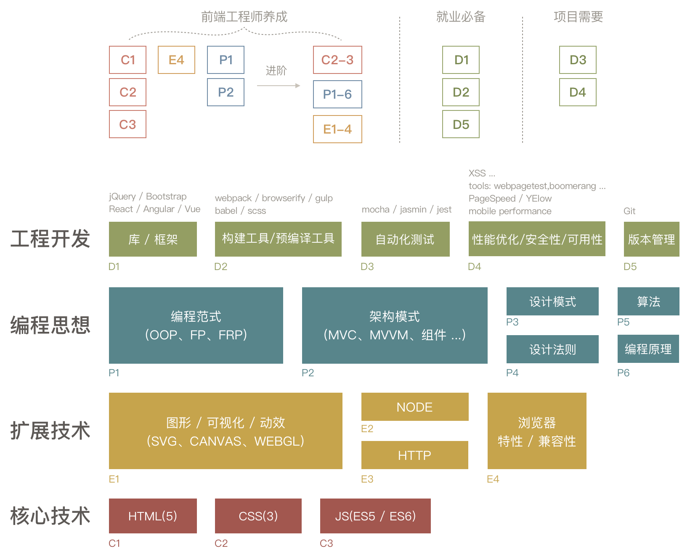

# 前端概念

从本质上讲，所有Web应用都是一种运行在网页浏览器中的软件，这些软件的GUI（Graphical User Interface，图形用户界面）即为前端。

### 前端涉及内容


>更详细线路图：[developer-roadmap](https://github.com/kamranahmedse/developer-roadmap/blob/master/README.md#-front-end-roadmap)。

### 前端工程化
>参考[张云龙：前端工程——基础篇](https://github.com/fouber/blog/issues/10)。

1. 第一阶段：库/框架选型

    >提升开发效率。（使用自动化工具也能够提升开发效率，如浏览器自动刷新、IDE）
2. 第二阶段：简单构建优化

    >提升运行性能。

    对代码进行压缩、校验，以页面为单位进行简单的资源合并。
3. 第三阶段：JS/CSS模块化开发

    >提升维护效率。

    **分而治之**
    1. JS模块化方案：

        CommonJS/AMD/CMD/ES6 Module/UMD
    2. CSS模块化方案：

        sass/less/stylus等预处理器的import、mixin特性支持实现。
4. 第四阶段：前端工程化

    >优化部署、开发。

    1. 组件化开发

        >模块化开发的升华。

        1. 页面上的每个**独立的**可视/可交互区域视为一个组件；
        2. 每个组件对应一个**工程目录**，组件所需的各种资源都在这个目录下**就近维护**；
        3. 由于组件具有独立性，因此组件与组件之间可以**自由组合**；
        4. 页面只不过是组件的容器，负责组合组件形成功能完整的界面；
        5. 当不需要某个组件，或想要替换组件时，可以整个目录替换、删除。

    2. 资源管理

        >静态资源加载的技术实现。

        解决思路：
        1. 静态资源管理系统 = 资源表 + 资源加载框架
        2. [大公司的静态资源优化方案](https://github.com/fouber/blog/issues/6)：

            1. 配置超长时间的本地缓存 —— 节省带宽，提高性能
            2. 采用内容摘要（MD5）作为缓存更新依据 —— 精确的缓存控制
            3. 静态资源CDN部署 —— 优化网络请求
            4. 资源发布路径实现非覆盖式发布 —— 平滑升级

### 页面载入解析步骤
>参考[全方位提升网站打开速度：前端、后端、新的技术](https://github.com/xitu/gold-miner/blob/master/TODO/building-a-shop-with-sub-second-page-loads-lessons-learned.md#前端性能)。


1. 增量式生成一个文档对象模型（DOM），解析页面内容（HTML标签）。

    1. 加载DOM中所有CSS，生成一个CSS对象模型（CSSOM），描述对页面内容如何设置样式。

        加载CSS并构造完整的CSSOM之前，**阻塞渲染**（Render Tree渲染被暂停）。
    2. 加载DOM中所有JS，对DOM和CSSOM进行访问和更改。

        1. HTML中出现JS，**阻塞解析**（DOM构造被暂停）。
        2. 下载脚本或内嵌脚本不用下载。
        3. 等待所有CSS被提取且CSSOM被构造完毕。
        4. 执行脚本，访问、更改DOM和CSSOM。
        5. DOM构造继续进行。

        >`<script>`执行：
        >
        >    1. 没有`defer`或`async`：立即加载并执行（同步），阻塞解析。
        >    2. `defer`：异步加载，在DOM解析完成后、`DOMContentLoaded`触发前执行，顺序执行。
        >
        >        >多个`defer`脚本不一定按照顺序执行，也不一定会在`DOMContentLoaded`事件触发前执行，因此最好只包含一个延迟脚本。
        >    3. `async`：异步加载，加载完马上执行。
        >
        >        乱序执行，仅适用于不考虑依赖、不操作DOM的脚本。
        >
        >    
2. DOM（parse HTML）和CSSOM（recalculate style）构造完成后，进行渲染：

    Render Tree（渲染树）：Layout -> Paint -> Composite

    >1. 一定要等待外链资源加载完毕（包括加载失败）才可以继续构建DOM或CSSOM。
    >2. 只有可见的元素才会进入渲染树。
    >3. DOM不存在伪元素（CSSOM中才有定义），伪元素存在render tree中。

>无论阻塞渲染还是阻塞解析，资源文件会不间断按顺序加载。

### 浏览器缓存
1. [HTTP定义的缓存机制](https://github.com/realgeoffrey/knowledge/blob/master/网站前端/HTTP相关/README.md#http缓存)
2. 其他缓存机制（不建议方式）

    1. HTML的`meta`标签设置缓存情况：

        e.g. 设置不缓存：

        ```html
        <meta http-equiv="pragma" content="no-cache">
        <meta http-equiv="cache-control" content="no-cache">
        <meta http-equiv="expires" content="0">
        ```
    2. html标签属性`manifest`应用程序缓存：

        ```html
        <html manifest=".manifest文件/.appcache文件">
        ```

### 垃圾回收
>垃圾回收器会按照固定的时间间隔（或代码执行中预定的时间）周期性地执行，找出不再继续使用的变量，然后释放其占用的内存。

垃圾回收器必须跟踪并判断变量是否有用，对于不再有用的变量打上标记，以备将来回收。

1. **标记清除（mark-and-sweep）**（现代浏览器使用方式）

    垃圾回收器在运行时给存储在内存中的所有变量加上标记；然后，去掉环境中的变量以及被环境中变量引用的变量的标记；最后，对那些带标记的值进行释放。
2. 引用计数（reference counting）

    跟踪记录每个值被引用的次数，被引用一次加1，引用取消就减1，当引用次数为0时，则说明没有办法再访问这个值了，当垃圾回收器下次运行时，释放引用次数为0的值所占空间。

    >可能产生一个严重的问题：循环引用，引用次数永远不会是0。

>用`变量 = null;`等方法，让变量成为零引用，从而进行清除元素、垃圾回收（导致内存泄露的情况除外）。

### 自动插入分号机制（Automatic Semicolon Insertion，ASI）
1. ASI机制不是说在解析过程中解析器自动把分号添加到代码中，而是说解析器除了分号还会以换行为基础按一定的规则作为断句（EOC）的依据，从而保证解析的正确性。
2. 解析器会尽量将新行并入当前行，当且仅当符合ASI规则时才会将新行视为独立的语句：

    1. `;`空语句
    2. `var`语句
    3. 表达式语句（一定会产生一个值）
    4. `do-while`语句（不是`while`）
    5. `continue`语句
    6. `break`语句
    7. `return`语句
    8. `throw`语句

>前置分号策略：只要对行首字符进行token判断是否为：`[` `(` `+` `-` `/`五个符号之一，就在其前面增加分号。

### 静态资源使用额外域名（domain hash）的原因
1. cookie free

    cookie是同源（且同路径），不同域名可以避免~~某些静态资源携带不必要的cookie而占用带宽~~。
2. 浏览器对同一域名有HTTP并发数限制

    1. 客户端：PC端口数量有限（65536个）、线程切换开销大。
    2. 服务端：服务器的负载、并发接收限制。
3. 动静分离，静态资源方便做CDN

    将网站静态资源（HTML、JS、CSS、图片、字体、多媒体资源等）与后台应用（API）分开部署。

    1. 缺点：

        1. 需要处理[跨域请求](https://github.com/realgeoffrey/knowledge/blob/master/网站前端/JS学习笔记/README.md#跨域请求)。
        2. 不利于SEO。
        3. 开发量大。
    2. 优点

        1. cookie free和HTTP并发限制的需要。
        2. API更加便利、易维护。
        3. 前后端分离开发。
        4. 减轻API服务端压力。

### 安全漏洞攻击
1. XSS

    跨站脚本（Cross-Site Scripting，XSS）是恶意代码注入网页。利用用户对指定网站的信任。

    1. 攻击方式

        >所有可输入的地方，若没有对输入数据进行处理的话，则都存在XSS漏洞。

        - 通过巧妙的方法注入恶意指令代码（HTML、JS或Java，VBScript，ActiveX，Flash）到网页内容，使用户加载并执行恶意程序。

            攻击成功后，能够：盗取用户Cookie、破坏页面结构、重定向到其它地址等。
    2. 防御措施：

        1. 过滤用户输入（白名单）。
        2. HttpOnly

            Cookie设置为HttpOnly不能在客户端使用~~document.cookie~~访问。
        3. 过滤技术：浏览器的XSS Auditor、W3C的Content-Security-Policy。

        >flash的安全沙盒机制配置跨域传输：crossdomian.xml
2. CSRF

    跨站请求伪造（Cross-Site Request Forgery，CSRF）是挟制用户在已登录的网页上执行非本意操作。利用网站对用户浏览器的信任。

    1. 攻击方式

        - 当用户已经得到目标网站的认可后，对目标网站进行请求操作。

            攻击成功后，能够：进行所有目标网站的请求操作。
    2. 防御措施

        1. 检查HTTP请求的Referer字段

            Referer：请求来源地址。
        2. 添加校验token

            操作请求需要提供额外的**不保存在浏览器上、保存在页面表单中**的随机校验码。可以放进请求参数、或自定义HTTP请求头。
        3. 请求操作要求输入实时生成的验证码。
3. 其他攻击

    1. DNS攻击

        使域名指往不正确的IP地址。

        1. 攻击方式

            1. 针对DNS服务器：DDoS攻击。
            2. 针对用户：DNS欺骗或劫持（访问恶意DNS服务器）、DNS缓存服务器投毒或污染、本机劫持（hosts文件篡改、本机DNS劫持、SPI链注入、DHO插件）。
        2. 防御措施

            1. 使用安全的DNS服务器。
            2. VPN或域名远程解析。
            3. 查杀病毒，清空DNS缓存。
    2. SQL注入（SQL Injection）

        运行非法的SQL。
    3. OS命令注入攻击（OS Command Injection）

        通过Web应用，执行非法的操作系统命令。
    4. HTTP头部注入攻击（HTTP Header Injection）

        通过在响应头部字段内插入换行，添加任意响应头部或主体。
    5. 邮件头部注入攻击（Mail Header Injection）

        向邮件头部To或Subject内任意添加非法内容，可对任意邮件地址发送广告邮件或病毒邮件。
    6. 目录遍历攻击（Directory Traversal，Path Traversal）

        对本无意公开的文件目录，通过非法截断其目录路径后，达成访问目的。
    7. 远程文件包含漏洞（Remote File Inclusion）

        当部分脚本内容需要从其他文件读入时，利用指定外部服务器的URL充当依赖文件，让脚本读取之后，就可运行任意脚本。
    8. 强制浏览（Forced Browsing）

        从安置在Web服务器的公开目录下的文件中，浏览那些原本非自愿公开的文件。
    9. 不正确的错误消息处理（Error Handling Vulnerability）

        Web应用的错误信息内包含对攻击者有用的信息。
    10. 开放重定向（Open Redirect）

        假如指定的重定向URL到某个具有恶意的Web网站，那么用户就会被诱导至那个Web网站。
    11. 会话劫持（Session Hijack）

        通过某种手段拿到了用户的会话ID，并非法使用此会话ID伪装成用户。
    12. 会话固定攻击（Session Fixation）

        强制用户使用攻击者指定的会话ID。
    13. 点击劫持（ClickJacking）、界面伪装（UI Redressing）

        利用透明的按钮或链接做成陷阱，覆盖在Web页面上。然后诱使用户在不知情的情况下，点击那个链接访问内容。
    14. 密码破解（Password Cracking）

        1. 穷举法（Brute-force Attack，暴力破解法）

            对所有密钥集合构成的密钥空间（Keyspace）进行穷举。即，用所有可行的候选密码对目标的密码系统试错。
        2. 字典攻击

            利用事先收集好的候选密码（经过各种组合方式后存入字典），枚举字典中的密码。

            >如生日日期数值化。

        - 一种安全的服务端存储密码方式：

            先利用给密码加盐（salt）的方式增加额外信息，再使用散列（hash）函数计算出散列值后保存。

            >加盐：由服务器随机生成的一个字符串，保证长度足够长，且是真正随机生成。然后把它和密码字符串相连接（前后都可以）生成散列值。当两个用户使用了同一个密码时，由于随机生成的salt值不同，对应的散列值也将不同。这样一来，很大程度上减少了密码特征，攻击者也就很难利用自己手中的密码特征库进行破解。
    15. DoS攻击（Denial of Service attack）、服务停止攻击或拒绝服务攻击

        运行中的服务呈停止状态的攻击。

        1. 集中利用访问请求造成资源过载。

            DDoS（Distributed Denial of Service attack）利用多台计算机发起Dos攻击。
        2. 通过攻击安全漏洞使服务停止。
    16. Hash Collision DoS

        >参考[HASH COLLISION DOS 问题](http://coolshell.cn/articles/6424.html)。

        Hash碰撞的拒绝式服务攻击（Hash Collision DoS）是对服务器进行恶意负载。

        1. 攻击方式

            >1. Hash：把任意长度的输入，通过散列算法，输出固定长度的散列值。
            >2. Hash Collision DoS：利用各语言Hash算法的“非随机性”，制造出无数value不同、key相同的数据，让Hash表成为一张单向链表，而导致整个网站的运行性能下降。

            - 找到hash算法漏洞，不断提交服务器请求导致无数hash碰撞，进而形成类似单向链表的存储结构。

                攻击成功后，能够：hash堆积、查询缓慢、服务器CPU高负荷、服务器内存溢出。
        2. 防御措施

            1. 升级hash算法。
            2. 限制POST参数个数和请求长度。
            3. 防火墙检测异常请求。

### 前端“增量”原则
1. “增量”原则：
    >“增量下载”是前端在工程上有别于客户端GUI软件的根本原因。

    前端应用没有安装过程，其所需程序资源都部署在远程服务器，用户使用浏览器访问不同的页面来加载不同的资源，随着页面访问的增加，渐进式地将整个程序下载到本地运行。
2. 由“增量”原则引申出的前端优化技巧几乎成为了**性能优化**的核心：

    1. 加载相关：延迟加载、AJAX加载、按需加载、预加载、请求合并压缩等策略。
    2. 缓存相关：缓存更新、缓存共享、非覆盖式发布等方案。
    3. 复杂的BigRender、BigPipe、Quickling、PageCache等技术。

### 网站性能优化
1. 网络应用的生命期建议：

    1. load

        1000ms内完成CRP。
    2. idle

        进行50ms内的空闲时期预加载，包括图片、多媒体文件、后续内容（如评论）。
    3. animations

        保证16ms/f的浏览器渲染时间。
    4. response

        100ms内对用户的操作做出响应。
2. 优化原则与指南

    >来自[张云龙：前端工程与性能优化](https://github.com/fouber/blog/issues/3)。

    | 优化方向 | 优化手段 |
    | :--- | :--- |
    | 请求数量 | 合并脚本和样式表，雪碧图，拆分初始化负载，划分主域 |
    | 请求带宽 | 开启gzip，资源压缩、去重，图像优化 |
    | 缓存利用 | 使用CDN，使用外部JS和CSS，HTTP头添加缓存相关内容，减少DNS查找，使AJAX可缓存 |
    | 页面结构 | 将样式表放在顶部、脚本放在底部，尽快完成文档渲染 |
    | 代码校验 | 避免CSS表达式，避免重定向 |
3. 从输入URL到页面完成的具体优化：

    >性能优化是一个[工程](https://github.com/realgeoffrey/knowledge/blob/master/网站前端/前端概念/README.md#前端工程化)问题。

    1. URL输入：

        服务端对HTTP请求、资源发布和缓存、服务器配置的优化。

        1. 服务器开启gzip。

            >前端查看Response头是否有：`Content-Encoding:gzip`。
        2. 使用CDN。
        3. 对资源进行缓存：

            1. 减少~~内嵌JS、CSS~~，使用外部JS、CSS。
            2. 使用[缓存相关的HTTP头](https://github.com/realgeoffrey/knowledge/blob/master/网站前端/HTTP相关/README.md#http缓存)：Expires、Cache-Control、Last-Modified/If-Modified-Since、ETag/If-None-Match。
        4. 减少DNS查找，设置合适的TTL值，避免重定向。
        5. [静态资源和API分开域名放置](https://github.com/realgeoffrey/knowledge/blob/master/网站前端/前端概念/README.md#静态资源使用额外域名domain-hash的原因)。
        6. [非覆盖式发布](https://github.com/fouber/blog/issues/6)。
    2. [载入页面](https://github.com/realgeoffrey/knowledge/blob/master/网站前端/前端概念/README.md#页面载入解析步骤)：

        前端对具体代码性能、CRP（Critical Rendering Path，关键渲染路径，优先显示与用户操作有关内容）的优化。

        1. 技术上优化：

            1. CSS性能：

                1. [CSS选择器性能](https://github.com/realgeoffrey/knowledge/blob/master/网站前端/HTML+CSS学习笔记/README.md#css选择器)。
                2. [渲染性能](https://github.com/realgeoffrey/knowledge/blob/master/网站前端/HTML+CSS学习笔记/README.md#渲染性能rendering-performance)。
            2. JS代码性能优化：

                1. 使用性能好的代码方式（如：字面量创建数据、减少访问DOM、[定时器取舍](https://github.com/realgeoffrey/knowledge/blob/master/网站前端/JS学习笔记/README.md#定时器--重绘函数)等）。
                2. [闭包合理使用](https://github.com/realgeoffrey/knowledge/blob/master/网站前端/JS学习笔记/README.md#闭包closure)。
                3. [避免内存泄漏](https://github.com/realgeoffrey/knowledge/blob/master/网站前端/JS学习笔记/README.md#内存泄漏)。
                4. [函数防抖、函数节流](https://github.com/realgeoffrey/knowledge/blob/master/网站前端/JS学习笔记/README.md#函数防抖函数节流)。
        2. 优化CRP：

            1. 减少关键资源：

                1. 资源合并、去重。
                2. 非首屏资源延迟异步加载：

                    1. 增量加载资源：

                        1. [图片的延迟加载](https://github.com/realgeoffrey/knowledge/blob/master/网站前端/JS方法积累/实用方法/README.md#jquery或zepto图片延时加载)。
                        2. AJAX加载（如：[滚动加载](https://github.com/realgeoffrey/knowledge/blob/master/网站前端/JS方法积累/实用方法/README.md#jquery或zepto滚动加载)）。
                        3. 功能文件按需加载（模块化、组件化）。
                    2. 使AJAX可缓存（当用GET方式时添加缓存响应头）。
                3. 利用空闲时间[预加载](https://github.com/realgeoffrey/knowledge/blob/master/网站前端/JS学习笔记/README.md#预加载)。
            2. 最小化字节：

                1. 压缩资源。
                2. 图片优化

                    压缩、大图切小图、小图合并雪碧图、Base64、WebP。
                >单个大文件需要多次与服务器往返来获取。
            3. 缩短CRP长度：

                CSS放在HTML顶部，JS放在HTML底部。