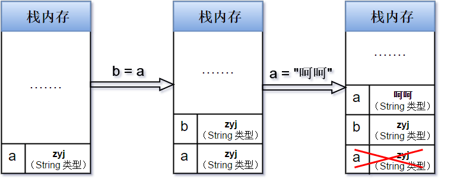
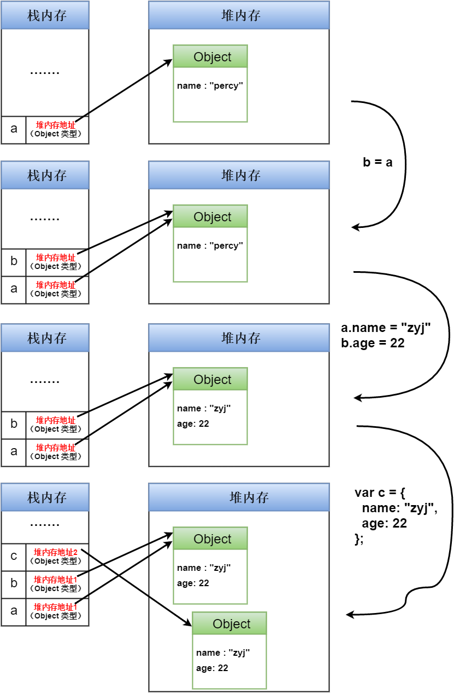

# 基础概念

### HTTP状态码（HTTP Status Code）
>来自[维基百科：HTTP状态码](https://zh.wikipedia.org/wiki/HTTP%E7%8A%B6%E6%80%81%E7%A0%81)。

用以表示网页服务器HTTP响应状态的3位数字代码。

1. 1XX消息

    代表请求已被接受，需要继续处理；代表临时性、信息性的响应，只包含状态行和某些可选的响应头信息，始终以消息头后的第一个空行结尾；标示客户端应该采取的其他行动。

    1. 100 Continue

        客户端应当继续发送请求。这个临时响应是用来通知客户端它的部分请求已经被服务器接收，且仍未被拒绝。客户端应当继续发送请求的剩余部分，或者如果请求已经完成，忽略这个响应。服务器必须在请求完成后向客户端发送一个最终响应。
    2. 101 Switching Protocols

        服务器已经理解了客户端的请求，并将通过Upgrade消息头通知客户端采用不同的协议来完成这个请求。在发送完这个响应最后的空行后，服务器将会切换到在Upgrade消息头中定义的那些协议。
    3. 102 Processing

        处理将被继续执行。
2. 2XX成功

    代表请求已成功被服务器接收、理解，并接受。

    1. 200 OK

        请求已成功，请求所希望的响应头或数据体将随此响应返回。
    2. 201 Created

        请求已经被实现，而且有一个新的资源已经依据请求的需要而创建，且其URI已经随Location头信息返回。
    3. 202 Accepted

        服务器已接受请求，但尚未处理。正如它可能被拒绝一样，最终该请求可能会也可能不会被执行。在异步操作的场合下，没有比发送这个状态码更方便的做法了。
    4. 203 Non-Authoritative Information

        服务器已成功处理了请求，但返回的实体头部元信息不是在原始服务器上有效的确定集合，而是来自本地或者第三方的拷贝。当前的信息可能是原始版本的子集或者超集。
    5. 204 No Content

        服务器成功处理了请求，但不需要返回任何实体内容，并且希望返回更新了的元信息。响应可能通过实体头部的形式，返回新的或更新后的元信息。如果存在这些头部信息，则应当与所请求的变量相呼应。始终以消息头后的第一个空行结尾。
    6. 205 Reset Content

        服务器成功处理了请求，且没有返回任何内容，并且要求请求者重置文档视图。该响应主要是被用于接受用户输入后，立即重置表单，以便用户能够轻松地开始另一次输入。始终以消息头后的第一个空行结尾。
    7. 206 Partial Content

        服务器已经成功处理了部分GET请求。
    8. 207 Multi-Status

        代表之后的消息体将是一个XML消息，并且可能依照之前子请求数量的不同，包含一系列独立的响应代码。
3. 3XX重定向

    代表需要客户端采取进一步的操作才能完成请求。通常，这些状态码用来重定向，后续的请求地址（重定向目标）在本次响应的Location域中指明。

    1. 300 Multiple Choices

        被请求的资源有一系列可供选择的回馈信息，每个都有自己特定的地址和浏览器驱动的商议信息。用户或浏览器能够自行选择一个首选的地址进行重定向。
    2. 301 Moved Permanently

        被请求的资源已永久移动到新位置，并且将来任何对此资源的引用都应该使用本响应返回的若干个URI之一。
    3. 302 Found

        请求的资源现在临时从不同的URI响应请求。
    4. 303 See Other

        对应当前请求的响应可以在另一个URI上被找到，而且客户端应当采用GET的方式访问那个资源。
    5. 304 Not Modified

        如果客户端发送了一个带条件的GET请求且该请求已被允许，而文档的内容（自上次访问以来或者根据请求的条件）并没有改变，则服务器应当返回这个状态码。始终以消息头后的第一个空行结尾。
    6. 305 Use Proxy

        被请求的资源必须通过指定的代理才能被访问。
    7. ~~306 Switch Proxy~~

        （废弃）
    8. 307 Temporary Redirect

        请求的资源现在临时从不同的URI响应请求。
4. 4XX客户端错误

    代表客户端看起来可能发生了错误，妨碍了服务器的处理。

    1. 400 Bad Request

        由于包含语法错误，当前请求无法被服务器理解。除非进行修改，否则客户端不应该重复提交这个请求。
    2. 401 Unauthorized

        当前请求需要用户验证。
    3. *402 Payment Required*

        （预留）
    4. 403 Forbidden

        服务器已经理解请求，但是拒绝执行它。
    5. 404 Not Found

        请求失败，请求所希望得到的资源未被在服务器上发现。
    6. 405 Method Not Allowed

        请求行中指定的请求方法不能被用于请求相应的资源。
    7. 406 Not Acceptable

        请求的资源的内容特性无法满足请求头中的条件，因而无法生成响应实体。
    8. 407 Proxy Authentication Required

        与401响应类似，只不过客户端必须在代理服务器上进行身份验证。
    9. 408 Request Timeout

        请求超时。
    10. 409 Conflict

        由于和被请求的资源的当前状态之间存在冲突，请求无法完成。
    11. 410 Gone

        被请求的资源在服务器上已经不再可用，而且没有任何已知的转发地址。
    12. 411 Length Required

        服务器拒绝在没有定义Content-Length头的情况下接受请求。
    13. 412 Precondition Failed

        服务器在验证在请求的头字段中给出先决条件时，没能满足其中的一个或多个。
    14. 413 Request Entity Too Large

        服务器拒绝处理当前请求，因为该请求提交的实体数据大小超过了服务器愿意或者能够处理的范围。
    15. 414 Request-URI Too Long

        请求的URI长度超过了服务器能够解释的长度，因此服务器拒绝对该请求提供服务。
    16. 415 Unsupported Media Type

        对于当前请求的方法和所请求的资源，请求中提交的实体并不是服务器中所支持的格式，因此请求被拒绝。
    17. 416 Requested Range Not Satisfiable

        如果请求中包含了Range请求头，并且Range中指定的任何数据范围都与当前资源的可用范围不重合，同时请求中又没有定义If-Range请求头。
    18. 417 Expectation Failed

        在请求头Expect中指定的预期内容无法被服务器满足，或者这个服务器是一个代理服务器，它有明显的证据证明在当前路由的下一个节点上，Expect的内容无法被满足。
    19. 418 I'm a teapot

        当一个控制茶壶的HTCPCP收到BREW或POST指令要求其煮咖啡时应当回传此错误。
    20. 421 There are too many connections from your internet address

        从当前客户端所在的IP地址到服务器的连接数超过了服务器许可的最大范围。
    21. 422 Unprocessable Entity

        请求格式正确，但是由于含有语义错误，无法响应。
    22. 423 Locked

        当前资源被锁定。
    23. 424 Failed Dependency

        由于之前的某个请求发生的错误，导致当前请求失败，例如PROPPATCH。
    24. *425 Unordered Collection*

        （未出现）
    25. 426 Upgrade Required

        客户端应当切换到TLS/1.0。
    26. 449 Retry With

        由微软扩展，代表请求应当在执行完适当的操作后进行重试。
    27. ~~451 Unavailable For Legal Reasons~~

        （废弃）
5. 5XX服务器错误

    代表服务器在处理请求的过程中有错误或者异常状态发生，也有可能是服务器意识到以当前的软硬件资源无法完成对请求的处理。

    1. 500 Internal Server Error

        服务器遇到了一个未曾预料的状况，导致了它无法完成对请求的处理。
    2. 501 Not Implemented

        服务器不支持当前请求所需要的某个功能。
    3. 502 Bad Gateway

        作为网关或者代理工作的服务器尝试执行请求时，从上游服务器接收到无效的响应。
    4. 503 Service Unavailable

        由于临时的服务器维护或者过载，服务器当前无法处理请求。
    5. 504 Gateway Timeout

        作为网关或者代理工作的服务器尝试执行请求时，未能及时从上游服务器（URI标识出的服务器，例如HTTP、FTP、LDAP）或者辅助服务器（例如DNS）收到响应。
    6. 505 HTTP Version Not Supported

        服务器不支持，或者拒绝支持在请求中使用的HTTP版本。
    7. 506 Variant Also Negotiates

        代表服务器存在内部配置错误：被请求的协商变元资源被配置为在透明内容协商中使用自己，因此在一个协商处理中不是一个合适的重点。
    8. 507 Insufficient Storage

        服务器无法存储完成请求所必须的内容。
    9. 509 Bandwidth Limit Exceeded

        服务器达到带宽限制。
    10. 510 Not Extended

        获取资源所需要的策略并没有被满足。

### 盒模型
1. 每个元素都被表示为一个矩形的盒子，盒子有四个边：

    外边距边（margin）、边框边（border）、内填充边（padding）、内容边（content）。
2. `box-sizing`值：

    >以宽度为例。

    1. `content-box`（默认）

        布局所占宽度 = width + padding左右 + border左右
    2. `border-box`

        布局所占宽度 = width = content + padding左右 + border左右
    3. ~~`padding-box`~~

        （废弃）
3. [margin合并](https://github.com/realgeoffrey/knowledge/tree/master/网站前端/HTML+CSS学习笔记#margin合并)

>ie低版本盒模型比较特殊。

### 选择器类型
1. CSS选择器

    >来自[阮一峰：CSS选择器笔记](http://www.ruanyifeng.com/blog/2009/03/css_selectors.html)、参考[W3C:selectors](https://www.w3.org/TR/selectors/#selectors)。

    1. 基本选择器

        1. `*`

            通配符选择器，匹配所有元素。
        2. `E`

            元素选择器，匹配使用E标签的元素。
        3. `.className`

            类选择器，匹配class属性中包含“className”的元素。
        4. `#idName`

            ID选择器，匹配id属性等于“idName”的元素。
    2. 关系选择器

        1. `E1,E2`

            多元素选择器，同时匹配E1元素或E2元素，E1和E2之间用逗号分隔。
        2. `E1 E2`

            后代元素选择器，匹配属于E1元素后代的E2元素，E1和E2之间用空格分隔。
        3. `E1>E2`

            子元素选择器，匹配E1元素的子元素E2。
        4. `E1+E2`

            毗邻元素选择器，匹配紧随E1元素之后的同级元素E2。
        5. `E1~E2`

            同级元素选择器，匹配在E1元素之后的同级E2元素。
    3. 属性选择器

        >1. 属性值的**引号**可加可不加；若属性值含有**空格**或**特殊字符**，必须用引号包围。
        >2. 建议始终用（双）引号包围属性值。

        1. `[attrName]`

            匹配具有“attrName”属性的元素，不考虑它的值。
        2. `[attrName=val]`

            匹配“attrName”属性等于“val”的元素。
        3. `[attrName~=val]`

            匹配“attrName”属性具有多个空格分隔的值、其中一个值等于“val”的元素。
        4. `[attrName|=val]`

            匹配“attrName”属性具有多个连字号`-`分隔的值、其中一个值以“val”开头的元素。主要用于lang属性，比如"en"、"en-us"、"en-gb"等。
        5. `[attrName^=val]`

            属性“attrName”的值以“val”开头的元素。
        6. `[attrName$=val]`

            属性“attrName”的值以“val”结尾的元素。
        7. `[attrName*=val]`

            属性“attrName”的值包含“val”字符串的元素。
    4. 伪元素选择器

        1. `:first-line`

            匹配元素的第一行。
        2. `:first-letter`

            匹配元素的第一个字母。
        3. `:before`

            在元素之前插入生成的内容。
        4. `:after`

            在元素之后插入生成的内容。
    5. 伪类选择器

        1. 普通伪类

            1. `:first-child`

                匹配父元素的第一个子元素。
            2. `:link`

                匹配未被点击的链接。
            3. `:visited`

                匹配已被点击的链接。
            4. `:active`

                匹配鼠标已经对其按下、还没有释放的元素。
            5. `:hover`

                匹配鼠标悬停其上的元素。
            6. `:focus`

                匹配获得当前焦点的元素。
            7. `:lang(val)`

                匹配lang属性等于“val”的元素。
        2. 与用户界面有关的伪类

            1. `:enabled`

                匹配表单中激活的元素。
            2. `:disabled`

                匹配表单中禁用的元素。
            3. `:checked`

                匹配表单中被选中的`radio`（单选框）或`checkbox`（复选框）。
            4. `::selection`

                匹配用户当前选中的元素。
        3. 结构性伪类

            1. `:root`

                匹配文档的根元素，对于HTML文档，就是HTML元素。
            2. `:nth-child(num)`

                匹配其父元素的第num个子元素，第一个编号为1。
            3. `:nth-last-child(num)`

                匹配其父元素的倒数第num个子元素，倒数第一个编号为1。
            4. `:nth-of-type(num)`

                与`:nth-child(num)`作用类似，但是仅匹配使用同种标签的元素。
            5. `:nth-last-of-type(num)`

                与`:nth-last-child(num)`作用类似，但是仅匹配使用同种标签的元素。
            6. `:first-child`

                匹配父元素的第一个子元素，等同于`:nth-child(1)`。
            7. `:last-child`

                匹配父元素的最后一个子元素，等同于`:nth-last-child(1)`。
            8. `:first-of-type`

                匹配父元素下使用同种标签的第一个子元素，等同于`:nth-of-type(1)`。
            9. `:last-of-type`

                匹配父元素下使用同种标签的最后一个子元素，等同于`:nth-last-of-type(1)`。
            10. `:only-child`

                匹配父元素下仅有的一个子元素，等同于`:first-child:last-child`或`:nth-child(1):nth-last-child(1)`。
            11. `:only-of-type`

                匹配父元素下使用同种标签的唯一一个子元素，等同于`:first-of-type:last-of-type`或`:nth-of-type(1):nth-last-of-type(1)`。
            12. `:empty`

                匹配一个不包含任意子元素的元素，注意，文本节点也被看作子元素。
            13. `:not(selector)`

                匹配不符合“selector”选择器的元素，注意，“selector”不能再包含`:not`。
            14. `:target`

                匹配文档URI的片段标识符，对应相同id属性的元素。
2. jQuery专有选择器

    >来自[jQuery:Selectors](https://api.jquery.com/category/selectors/)。

    jQuery兼容CSS所有选择器，并且自己扩展了一些。
    因为不是CSS规范的一部分，专有选择器无法利用本机DOM的`querySelectorAll`提升性能。为了提高代码性能，建议使用`filter`、`not`、`has`、`eq`等jQuery方法以及转化为CSS规范的选择器，来合理使用。

    1. `[attrName!=val]`

        匹配“attrName”属性不等于“val”的元素。
    2. `:first`

        匹配文档顺序的第一个元素。
    3. `:last`

        匹配文档顺序的最后一个元素。
    4. `:eq(num)`

        匹配文档顺序的第num个元素，0位第一个，-1为倒数第一个。
    5. `:even`

        匹配文档顺序的偶数元素，索引为0、2、4…。
    6. `:odd`

        匹配文档顺序的奇数元素，索引为1、3、5…。
    7. `:gt(num)`

        匹配索引大于（不包括等于）num的元素，0位第一个，-1为倒数第一个。
    8. `:lt(num)`

        匹配索引小于（不包括等于）num的元素，0位第一个，-1为倒数第一个。
    9. `:button`

        匹配`button, [type=button]`的元素。
    10. `:file`

        匹配`['type=file']`的元素。
    11. `:image`

        匹配`[type=image]`的元素。
    12. `:input`

        匹配`input, textarea, select, button`的元素。
    13. `:password`

        匹配`[type=password]`的元素。
    14. `:radio`

        匹配`[type=radio]`的元素。
    15. `:reset`

        匹配`[type=reset]`的元素。
    16. `:submit`

        匹配`[type=submit]`的元素。
    17. `:text`

        匹配`[type=text]`的元素。
    18. `:selected`

        匹配选中的元素（适用于`option`标签）。
    19. `:parent`

        匹配一个包含任意子元素的元素，注意，文本节点也被看作子元素。
    20. `:contains(val)`

        匹配含有“val”字符串（区分大小写）的元素，可以是后代包含。
    21. `:animated`

        匹配此时处于动画进度中的元素。
    22. `:has(selector)`

        匹配符合“selector”选择器的元素。
    23. `:header`

        匹配`h1, h2, h3, h4, h5, h6`的元素。
    24. `:hidden`

        匹配隐藏的元素。
    25. `:visible`

        匹配显示的元素。

### JS数据类型
1. 基本数据类型：

    `Undefined`、`Null`、`Boolean`、`Number`、`String`

    >ES6新引入一个基本数据类型：`Symbol`，表示特殊的、不可变的数据。

    - 存放在栈内存（Stack），按值访问

        
2. 引用类型：

    `Object`（由`Object`原型链继承的其他所有引用类型）

    - 存放在堆内存（Heap），按指针访问

        

### JS特殊字符

转义字符：`\`。

| 字符 | 表示的意义 |
| :---: | :--- |
| `\0` | `null` |
| `\b` | 退格符 |
| `\f` | 换页符 |
| `\n` | 换行符 |
| `\r` | 回车符 |
| `\t` | Tab (制表符) |
| `\v` | 垂直制表符 |
| `\'` | `'` |
| `\"` | `"` |
| `\\` | `\` |
| `\XXX` |  |
| `\xXX` |  |
| `\uXXXX` |  |
| `\u{XXXXX}` |  |

### 进制数
1. 二进制表示：

    `0b数值`、`0B数值`
2. 八进制表示：

    `0数值`、`0o数值`、`0O数值`
3. 十六进制表示：

    `0x数值`、`0X数值`

JS内部会自动将八进制、十六进制、二进制转为十进制。

- [不同进制数转换](https://github.com/realgeoffrey/knowledge/tree/master/网站前端/JS方法积累/实用方法#原生js不同进制数转换)