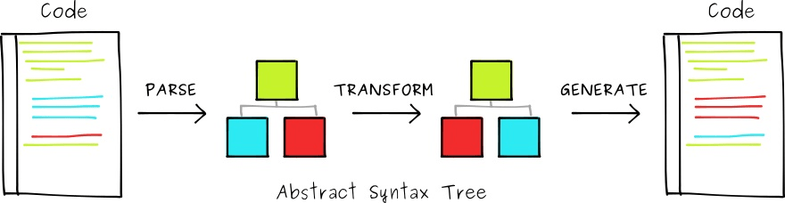
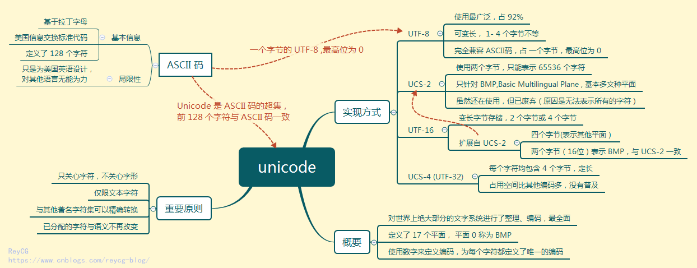
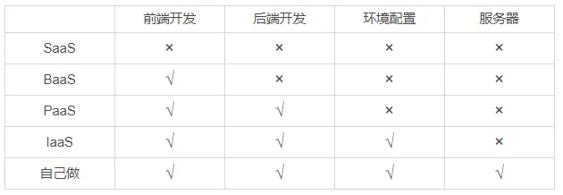
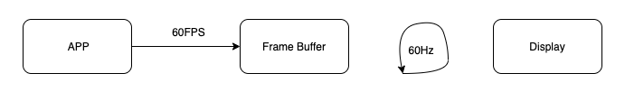
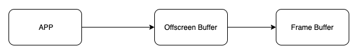

# 程序员的自我修养

>一切都是为了解耦，解耦为了重用和扩展。

## 目录
1. [数据库](#数据库)
1. [bug调试策略](#bug调试策略)
1. [编译器编译原理](#编译器编译原理)
1. [行业术语](#行业术语)

    1. [设计模式](#设计模式)
    1. [哈希函数](#哈希函数)
    1. [ASCII](#ascii)
    1. [Unicode](#unicode)
    1. [Base64](#base64)
    1. [抽象语法树（abstract syntax tree，AST）](#抽象语法树abstract-syntax-treeast)
    1. [平稳退化（优雅降级）、渐进增强](#平稳退化优雅降级渐进增强)
    1. [向前兼容、向后兼容](#向前兼容向后兼容)
    1. [自底向上、自顶向下](#自底向上自顶向下)
    1. [MV*](#mv)
    1. [直出、同构、预渲染、单页应用程序](#直出同构预渲染单页应用程序)
    1. [测试驱动开发、行为驱动开发](#测试驱动开发行为驱动开发)
    1. [灰度发布、A/B测试](#灰度发布ab测试)
    1. [编程范式](#编程范式)
    1. [软编码、硬编码](#软编码硬编码)
    1. [强、弱类型，静、动态类型](#强弱类型静动态类型)
    1. [循环、遍历、迭代、递归](#循环遍历迭代递归)
    1. [递归、尾调用、尾递归](#递归尾调用尾递归)
    1. [求值策略（evaluation strategy）](#求值策略evaluation-strategy)
    1. [云服务](#云服务)
    1. [胶水语言（glue languages）](#胶水语言glue-languages)
    1. [词法作用域、动态作用域](#词法作用域动态作用域)
    1. [中台](#中台)
    1. [BFF（backends for frontends，服务于前端的后端）](#bffbackends-for-frontends服务于前端的后端)
    1. [单工、半双工、全双工](#单工半双工全双工)
    1. [CGI（common gateway interface）](#cgicommon-gateway-interface)
    1. [RPC（remote procedure call）](#rpcremote-procedure-call)
    1. [Pipeline as Code（流水线即代码）原则](#pipeline-as-code流水线即代码原则)
    1. [序列化、反序列化](#序列化反序列化)
    1. [函数、方法](#函数方法)
    1. [字节码、机器码](#字节码机器码)
    1. [JS的解释执行、即时编译、运行前编译](#JS的解释执行即时编译运行前编译)
    1. [iOS的离屏渲染](#ios的离屏渲染)
1. [文件类型](#文件类型)
1. [端口](#端口)

---
### 数据库
1. 数据库类型

    1. 关系型数据库（relational database management system，RDBMS）

        Oracle、MySQL

        >database->table->row(column)。
    2. 非关系型数据库（not only SQL，NoSQL）

        >数据存储不需要固定的模式，无需多余操作就可以横向扩展。

        1. 面向文档数据库（document-oriented）

            MongoDB

            >database->collection->document(field)。
        2. 键-值存储数据库

            Redis、IndexedDB
        3. 列存储数据库（column-oriented）
        4. 图形数据库（graph）
2. 关系型数据库的范式

    数据库的表结构所符合的某种设计标准（消除冗余、高效利用磁盘空间、简洁组织数据）的级别。

    1. 第一范式（1NF）

        属性不可再分。

        >属性不可以是集合、数组、记录等组合型数据。
    2. 第二范式（2NF）

        （符合1NF，）非主属性**完全依赖**于主键（而不是依赖于主键的一部分）。

        >只有单主键的表，若符合1NF，一定满足2NF。

        >1. 主键：一个表只能有一个主键，表的唯一索引，唯一标识和区分表中的每一行数据，不能为空（null）。
        >2. 复合主键：一个表的主键含有1个以上的字段组成`primary key(字段1, 字段2, ...)`，不要求其中的字段是唯一的，但要求复合主键的多字段联合标识保证唯一索引。
        >3. 联合主键：多个表的各自主键，（联表查询）组合起来确定数据唯一性。
    3. 第三范式（3NF）

        （符合2NF，）消除**传递依赖**。

        >属性不依赖于其它非主属性。
    4. 巴斯-科德范式（BCNF）

        （符合3NF，）主属性不依赖于主属性，每个表中只有一个候选键（在一个表中每行的值都不相同的属性，则称为候选键）。

    >实际工作中，一个数据库设计符合3NF或BCNF就足够（甚至2NF）。

    - 第四范式（4NF）、第五范式（5NF）...

    >1. 范式越高，数据的冗余度越小。
    >2. 没有冗余的数据库设计是可以做到的。但是，没有冗余的数据库未必是最好的数据库，有时为了提高运行效率，就必须降低范式标准，适当保留冗余数据。
    >
    >    具体做法：在概念数据模型设计时遵守第三范式，降低范式标准的工作放到物理数据模型设计时考虑。降低范式就是增加字段，允许冗余。
    >
    >    >e.g. 在一些数据表中不仅存作为外键的user_id，同样存user_name，这样虽然违反3NF增加了user_name字段，但是却提高了效率，减少了获取user_id后再去user表中获取user_name的操作。
    >3. 范式解决的数据库问题
    >
    >    1. 操作异常
    >
    >        1. 插入异常
    >
    >            若某实体随着另一个实体的存在而存在，即缺少某个实体时无法表示这个实体。
    >        2. 更新异常
    >
    >            若更改表所对应的某个实体实例的单独属性时，需要将多行更新。
    >        3. 删除异常
    >
    >            若删除表的某一行来反映某实体实例失效时，导致另一个不同实体实例信息丢失。
    >    2. 数据冗余
    >
    >        相同的数据在多个地方存在，或表中的某个列可以由其他列计算得到。
3. 数据库设计

    >已经在投入使用的数据库，基本只能添加属性或表，而无法更改或删除属性或表。因此前期数据库结构设计不好，投入使用后就很难调优。

    1. 需求分析

        1. 数据是什么
        2. 数据有哪些属性
        3. 数据、属性的特点（存储特点、生命周期、增长速度、是否需要放入数据库）
    2. 逻辑设计

        ER图逻辑建模，实体之间、表之间的对应关系（一对一、一对多、多对多），使用范式约束。

        >两个表有多对多关系时，需要借助额外关系表包含有两表的主键（外键）来维护。
    3. 物理设计

        1. 选择数据库管理系统（DBMS）。
        2. 定义数据库、表、字段的命名规范。

            1. 可读性原则：利用大小写来格式化库对象名字，下划线分割字段的单词。
            2. 表意性原则：对象的名字能够描述它所标识的对象。
            3. 长名原则：不缩写。
        3. 根据选择的DBMS选择字段类型。

            1. 数字类型性能优于字符类型。
            2. char和varchar选择。
            3. decimal精确，float非精确。
            4. 时间类型int和datetime选择。
        4. 反范式化设计。

            >对第三范式进行违反，空间换时间。

            1. 减少表的关联数量。
            2. 增加数据的读取效率。
            3. 反范式化要适度。
    4. 维护优化

        1. 维护数据字典
        2. 新的需求建表、维护表结构
        3. 索引优化
        4. 大表拆分

        >随着投入使用时间越久并且在维护阶段容易忽略数据库设计，数据库的结构会越复杂。因此在维护阶段也需要按照以上步骤进行数据库设计。
4. 事务（transaction，数据库事务）

    数据库管理系统（DBMS）执行过程中的一个逻辑单位，由一个有限的数据库操作序列构成。

    1. 为数据库操作序列提供从失败中恢复到正常状态的方法，同时提供数据库即使在异常状态下仍能保持一致性的方法。
    2. 当多个应用程序在并发访问数据库时，提供隔离应用程序的方法，以防止彼此的操作互相干扰。

    - 为保证事务是正确可靠，必须具备ACID特性：

        1. 原子性（atomicity）：事务作为一个整体被执行，包含其中的数据库操作，要么全部被执行、要么都不执行。
        2. 一致性（consistency）：事务应确保数据库的状态从一个一致状态转变为另一个一致状态。
        3. 隔离性（isolation）：多个事务并发执行时，一个事务的执行不应影响其他事务的执行。
        4. 持久性（durability）：已被提交的事务对数据库的修改应该永久保存在数据库中。
- 针对mysql的查询优化

    todo

    建立索引

    场景：数据表读多写少

    为什么：因为 MySQL 的底层逻辑是 B+ 树，然后 B+ 树的每一个节点存储的是指针，然后叶子节点才是对应的数据。

    MySQL 查询的时候都是先找索引，没有的话才是回表查询。

    in > not in

    ≠

    select *

    正确使用联合索引，从左到右的匹配规则

    show profiles 查出问题

    redis 缓存

    最大范围的类型varchar(65535) > text

    **DATETIME > TIMESTAMP**

    sequelize

    批量操作

    事务管理支持回退

    对 Node 使用友好

    定义索引方便 indexes

    小表驱动大表

    索引的值最好是自增，不会

    B+数，二分查找的思路

    InnoDB

    索引调优

### bug调试策略
>参考：[程序员新人怎样在复杂代码中找 bug？](https://www.zhihu.com/question/23019630/answer/23369396)。

1. 打断点、输出中间值、堆栈跟踪
2. 优先解决可重现bug

    可重现的bug特别好找，反复调试测试就好了，先把好解决的干掉，这样最节约时间。
3. **二分法定位**

    把程序逻辑一点点注释掉，看看还会不会出问题，类似二分查找的方法，逐步缩小问题范围。

    >如：模板引擎内错误。
4. 模拟bug现场

    问自己「若要自己实现bug描述的现象要怎么写代码才行」。
5. 放大bug现象

    有些bug现象不太明显，那么就想办法增大它的破坏性，把现象放大。这只是个思路，具体怎么放大只能根据具体的代码来定。
6. 小黄鸭调试法

    对着同事或小黄鸭复述一遍完整问题、代码意图，很可能找到之前因定性思维而遗漏的点。
7. 咨询有经验的同事

    对于某些bug没有头绪或者现象古怪不知道从哪里下手，找有经验的同事问一下思路，因为在那种开发多年的大型系统里，经常会反复出现同样原因的bug，原因都类似，改了一处，过一阵子另外一处又冒出来，而且无法根治。

    >为了保持兼容性，很多时候不能修改已经存在的容易出错接口。
8. 制作辅助调试工具

    针对某些bug编写一些调试辅助工具。

    >如：给没有上报错误的代码，扫描每个函数入口和出口插入上报功能。
9. 掩盖问题

    虽然这样做有点不厚道，但是有时不得不这么做。有些bug找不到真正的root cause，但是又要在规定时间内解决，那么我们就可以治疗症状而不去找病因。

    >如：用`try-catch`掩盖一些奇怪的崩溃。不到万不得已不要这么干，未来可能会付出更大代价。

- 前端相关的[代码调试](https://github.com/realgeoffrey/knowledge/blob/master/网站前端/代码调试相关/README.md#代码调试相关)

### 编译器编译原理
>来自：[the-super-tiny-compiler](https://github.com/jamiebuilds/the-super-tiny-compiler)。

（广义的）编译器：把一种语言代码转为另一种语言代码的程序。

1. 解析（parsing）

    >[对 Parser 的误解](http://www.yinwang.org/blog-cn/2015/09/19/parser)。

    `原始代码`（先转化为`Token`，再）转化为[`AST`](https://github.com/realgeoffrey/knowledge/blob/master/网站前端/程序员的自我修养/README.md#抽象语法树abstract-syntax-treeast)。

    1. 词法分析（lexical analysis）

        接收原始代码，分割成Token（一个数组，分割代码字符串的种类：数字、标签、标点符号、运算符、等，源代码中最小单位）。

        >正则表达式的DFA。
    2. 语法分析（syntactic analysis）

        接收之前生成的Token，转换成AST。

        >上下文无关文法（CFG）、正则表达式的BNF

    ><details>
    ><summary>e.g. lisp代码 -> Token -> AST</summary>
    >
    >1. 原始代码（lisp）：
    >
    >    `(add 2 (subtract 4 2))`
    >2. 生成的Token：
    >
    >    ```js
    >    [
    >      { type: 'paren',  value: '('        },
    >      { type: 'name',   value: 'add'      },
    >      { type: 'number', value: '2'        },
    >      { type: 'paren',  value: '('        },
    >      { type: 'name',   value: 'subtract' },
    >      { type: 'number', value: '4'        },
    >      { type: 'number', value: '2'        },
    >      { type: 'paren',  value: ')'        },
    >      { type: 'paren',  value: ')'        }
    >    ]
    >    ```
    >3. 生成的AST：
    >
    >    ```js
    >    {
    >      type: 'Program',
    >      body: [{
    >        type: 'CallExpression',
    >        name: 'add',
    >        params: [
    >          {
    >            type: 'NumberLiteral',
    >            value: '2'
    >          },
    >          {
    >            type: 'CallExpression',
    >            name: 'subtract',
    >            params: [
    >              {
    >                type: 'NumberLiteral',
    >                value: '4'
    >              },
    >              {
    >                type: 'NumberLiteral',
    >                value: '2'
    >              }
    >            ]
    >          }
    >        ]
    >      }]
    >    }
    >    ```
    ></details>
2. 转换（transformation）

    >让它能做到编译器期望它做到的事情。

    遍历AST的所有节点，使用visitor中对应类型的处理函数，对不同类型的节点进行逻辑处理。一般会生成一个新的AST。
3. 代码生成（code generation）

    >可能会和转换有重叠。

    根据最终的AST或之前的Token输出新的语言代码。



---
## 行业术语
><details>
><summary>其他💻📖对开发人员有用的定律、理论、原则和模式：<a href="https://github.com/nusr/hacker-laws-zh">hacker-laws-zh</a>。</summary>
>
>博主们无法做到的2个事情：[过早优化效应 (Premature Optimization Effect)](https://github.com/nusr/hacker-laws-zh#过早优化效应-premature-optimization-effect)、[你不需要它原则 (YAGNI)](https://github.com/nusr/hacker-laws-zh#你不需要它原则-yagni)？
></details>

1. 「架构」是对客观不足的妥协（硬件不足、网络太慢、开发资源有限等客观不足）；
2. 「规范」是对主观不足的妥协（开发者水平参差不齐的主观不足）。

### 设计模式
一个设计模式是一个可复用的软件解决方案。

>1. 设计模式是为了封装变化，让各个模块可以独立变化。精准地使用设计模式的前提是能够精准的预测需求变更的走向。在开发者满足了「知道所有设计模式为什么要被发明出来」的前提后，剩下的其实都跟编程没关系，而跟开发者的领域知识和领域经验有关系。
>2. 设计模式的定义：在面向对象软件设计过程中针对特定问题的简洁而优雅的解决方案。通俗地说，设计模式是在某种场合下对某个问题的一种解决方案。再通俗地说，设计模式就是给面向对象软件开发中的一些好的设计取个名字。

1. 单例模式（singleton）

    单例对象的类必须保证只有一个实例存在。
2. 工厂模式（factory）

    提供一个创建一系列相关或相互依赖对象的接口（方法），而无需指定他们具体的类。

    >不用~~new~~的方法调用。
3. 构造函数模式（constructor）

    `new`创建实例，方法中this代表新创建的对象。
4. 观察者模式（observer）

    >又称「发布/订阅模式」（publish-subscribe）

    定义对象间的一对多的依赖关系，以便当一个对象的状态发生改变时，所有依赖于它的对象都得到通知并自动刷新。
5. 桥接模式（bridge）

    将抽象与实现隔离开来，使用关联关系而不是继承关系，以便二者独立变化、减少耦合。

    >1. 抽象化：将复杂物体的一个或几个特性抽离出去只注意其他特性的行动或过程。在面向对象编程中就是将对象共同的性质抽取出去从而形成类的过程。
    >2. 实现化：针对抽象化给出具体实现，与抽象化是一个互逆过程，对抽象化事物的进一步具体化。
    >3. 脱耦：将抽象化和实现化之间的耦合解脱开，或将它们之间的强关联改换成弱关联，将两个角色之间的继承关系改为关联关系。
6. 装饰者模式（decorator）

    把类中的装饰功能从类中搬除，简化原来的类，把类的核心职责和装饰功能区分开。通过装饰功能的方法，动态地将功能附加到对象上。若要扩展功能，装饰者提供了比继承更有弹性的替代方案。
7. 组合模式（composite）

    组合多个对象形成树形结构以表示具有「整体—部分」关系的层次结构，对单个对象（即叶子对象）和组合对象（即容器对象）的使用具有一致性。
8. 门面模式（facade）

    他隐藏了系统的复杂性并向客户端提供了一个可以访问系统的接口。
9. 适配器模式（adapter）

    将一个类的接口转换成客户希望的另外一个接口。适配器模式使得原本由于接口不兼容而不能一起工作的那些类可以一起工作，使用这种模式的对象又叫包装器，因为他们是在用一个新的接口包装另一个对象。
10. 享元模式（flyweight）

    运用共享技术有效地支持大量细粒度的对象。
11. 代理模式（proxy）

    此模式最基本的形式是对访问进行控制。代理对象和另一个对象（本体）实现的是同样的接口，可是实际上工作还是本体在做，它才是负责执行所分派的任务的那个对象或类，代理对象不会在另以对象的基础上修改任何方法，也不会简化那个对象的接口。
12. 命令模式（command）

    将一个请求封装为一个对象，从而使你可用不同的请求对客户进行参数化；对请求排队或记录请求日志，以及支持可取消的操作。

    命令对象是一个操作和用来调用这个操作的对象的结合体，所有的命名对象都有一个执行操作，其用途就是调用命令对象所绑定的操作。
13. 职责链模式（chain of responsibility）

    为解除请求的发送者和接收者之间耦合，而使多个对象都有机会处理这个请求。将这些对象连成一条链，并沿着这条链传递该请求，直到有一个对象处理它。

    职责链由多个不同类型的对象组成：发送者是发出请求的对象，而接收者则是接收请求并且对其进行处理或传递的对象，请求本身有时也是一个对象，它封装着与操作有关的所有数据。

### 哈希函数
哈希函数（Hash function、散列函数、散列算法）：对任意一组输入数据进行计算，得到一个固定长度的输出摘要。

- 特性：

    1. 输出一致性：输出保持相同长度
    2. 雪崩效用：任何输入的变化都将导致输出巨大变化
    3. 单向：只能从输入推出输出，不能反向从输出推出输入
    4. 避免碰撞：发生碰撞概率低

常见的哈希函数：MD5、SHA家族、BLAKE、等。

>1. 不同系统、不同编程语言对MD5或SHA实现的逻辑相同（对同一内容，用不同实现的MD5或SHA得出结果相同）。
>2. 用不同的行分隔符（`\n`、`\r`、`\r\n`）打开同一个文本文件，会造成MD5或SHA输出结果不同。

1. MD5（message-digest dlgorithm，消息摘要算法）

    输入不定长度信息，输出固定长度128-bits（32位16进制数，`Math.pow(2, 128) === Math.pow(16, 32)`）的算法。

    >1. 可被破解、无法防止碰撞（collision），因此不适用于安全性认证。
    >2. 因其普遍、稳定、快速的特点，仍广泛应用于普通数据的错误检查领域。如：文件传输的可靠性检查。
2. SHA（secure hash algorithm，安全散列算法）

    输入不定长度信息，（根据算法不同）输出（不同）固定长度的算法。

    >安全、破解难度大：SHA-2、SHA-3。已被破解：SHA-1。

|          | ~~MD5~~                    | ~~SHA-1~~          | SHA-2                  | SHA-3                |
| -------- | ---------------------- | -------------- | ---------------------- | -------------------- |
| 推出时间 | 1992                     | 1995          | 2002                    | 2008                 |
| 输出长度 | 128 bits                 | 160 bits      | 256 / 512 bits          | 224/256/384/512 bits |
| 哈希冲突 | 较多                      | 较多          | 很少                     | 很少                 |
| 安全等级 | 低，已被成功破解            | 低，已被成功破解 | 高                      | 高                   |
| 应用    | 已被弃用，仍用于数据完整性检查 | 已被弃用       | 加密货币交易验证、数字签名等 | 可用于替代 SHA-2     |

### ASCII
ASCII码（American Standard Code for Information Interchange、美国标准信息交换码）是基于拉丁字母的一套电脑编码系统、字符集。它定义了一个用于代表现代英文的字典。第一位始终是`0`，**只定义了128个字符**（之后又扩展了第一位是`1`的128个），包含控制字符和可显示字符：

1. 序号0~31：常用于控制像打印机一样的外围设备
2. 序号32~127：常用键盘上都可以被找到

>参考：[ASCII码表](https://www.asciim.cn/)。

因为ASCII只能表示128个字符（以及之后又扩展的128个），每个国家就各自来对ASCII字符集做了拓展（如：最具代表性的就是国内的GB类的汉字编码模式）。各自的拓展既满足不了涵盖所有字符的要求，又导致各字符规则不互通，因此之后诞生了Unicode。

### Unicode
>1. Unicode和ASCII都是一种**字符集**；
>2. UTF-8、UTF-16、UTF-32、UCS-2、GBK 都是Unicode的一种**编码方式（Encoding Form）**。

| Unicode编码方式 | 字节长度 | 支持范围 | 优点 | 缺点 |
| :--- | :--- | :--- | :--- | :--- |
| UTF-8 | 1（兼容ASCII）、2、3或4字节 | **全Unicode范围**（U+0000~U+10FFFF） | 高效传输，**兼容ASCII** |  |
| UTF-16 | 2或4字节 | **全Unicode范围**（U+0000~U+10FFFF） |  |  |
| UTF-32 | 4字节 | **全Unicode范围**（U+0000~U+10FFFF） | 编码简单 | 占用空间大 |
| GB 2312 | 1（兼容ASCII）或2字节 | 6763个汉字、682个字符 | 简单高效，覆盖常用简体中文。**兼容ASCII** | 不支持生僻字和国际字符 |
| GBK | 1（兼容ASCII）、2或4字节 | 扩展GB 2312，支持更多字符 | 兼容GB 2312，支持生僻字和部分国际字符。**兼容ASCII** | 不支持Unicode全集 |
| GB 18030 | 1（兼容ASCII）、2或4字节 | **全Unicode范围**（U+0000~U+10FFFF） | 全面支持Unicode，兼容GB 2312和GBK。**兼容ASCII** | 比UTF-8复杂，不是国际通用标准（是中国国家标准） |

Unicode（Universal Coded Character Set、UCS、国际编码字符集合)：包含全世界所有字符的一个字符集（计算机只要支持这个字符集，就能显示所有的字符，不会有乱码）。从`0`开始，为每个符号指定一个编号，叫做「码点」（code point）。

- JS的Unicode书写方式：

    1. `\u` + `4位16进制数`
    2. `\u{16进制数}`
    3. `\x` + `2位16进制数`
    4. `\` + `3位8进制数`

    >若要求的位数不足，则前面补`0`。

    JS内部会自动将Unicode转为字符。

    >[字符串转换为Unicode、字符串所占字节数](https://github.com/realgeoffrey/knowledge/blob/master/网站前端/JS方法积累/实用方法/README.md#原生js转化为unicode反转字符串字符串长度所占字节数)。



### Base64
Base64是编解码，主要的作用不在于安全性，Base64编码的核心作用在于让内容能在各个网关间无错的传输。

>产生原因：因为有些网络传送渠道并不支持所有的字节（如：传统的邮件只支持可见字符的传送，像ASCII码的控制字符就不能通过邮件传送；图片二进制流的每个字节不可能全部是可见字符）。最好的方法就是在不改变传统协议的情况下，做一种扩展方案来支持二进制文件的传送。把不可打印的字符也能用可打印字符来表示，问题就解决了。Base64编码应运而生，Base64就是一种基于64个可打印字符（`A-Z`、`a-z`、`0-9`、`+`、`/`）来表示二进制数据的表示方法（还有一个填充字符`=`，不属于64个可打印字符里的范畴）。

1. 优点

    1. 可以将二进制数据（如：图片）转化为可打印字符，方便传输数据
    2. 对数据进行简单的加密，肉眼是安全的
    3. 若是在html或者css处理图片，则可以减少http请求
2. 缺点

    1. 内容编码后体积变大，至少**1/3**
    2. 编码和解码需要额外工作量
    3. 无法缓存（最多只能缓存包含base64字符串的文件）

### 抽象语法树（abstract syntax tree，AST）
源代码的抽象语法结构的树状表现形式。

- 针对JS

    1. JavaScript的语法是为开发者而设计，但不适合程序理解。因此需要转化为AST用于程序分析。
    2. 通过JavaScript Parser把代码转化为一棵AST，这棵树定义了代码的结构，通过操纵这棵树，可以精准地定位到声明语句、赋值语句、运算语句等，实现对代码的分析、优化、变更等操作。

        >JavaScript Parser：把JS源码转化为AST的解析器（浏览器会把JS源码通过解析器转为AST，再进一步转化为字节码或直接生成机器码）。
    3. 常见用途：

        1. 代码语法的检查、代码风格的检查、代码的格式化、代码的高亮、代码错误提示、代码自动补全。

            >e.g. ESLint、IDE。
        2. 代码压缩加密混淆。

            >e.g. ES5的[UglifyJS2](https://github.com/mishoo/UglifyJS2)、ES6的[terser](https://github.com/terser/terser)。
        3. 优化变更代码、改变代码结构使达到想要的结构。

            >e.g. Babel、打包工具、不同模块化方案间转换、CoffeeScript/TypeScript/JSX转化为原生JS。

### 平稳退化（优雅降级）、渐进增强
1. 平稳退化（graceful degradation，优雅降级）：

    首先使用最新的技术面向现代浏览器构建最强的功能及用户体验，然后针对低版本浏览器的限制，逐步衰减那些无法被支持的功能及体验。
2. 渐进增强（progressive enhancement）：

    从最基本的可用性出发，在保证站点页面在低版本浏览器的可用性、可访问性的基础上，逐步增加功能及提高用户体验。

### 向前兼容、向后兼容
1. 向前兼容（forwards compatibility）：

    在将来的场景中还可以兼容使用。
2. 向后兼容（backwards compatibility）：

    在过去的场景中还可以兼容使用。

### 自底向上、自顶向下
1. 自底向上（bottom-up）：

    先编写出基础程序段，然后再逐步扩大规模、补充和升级某些功能。
2. 自顶向下（top-down）：

    将复杂的大问题分解为相对简单的小问题，找出每个问题的关键、重点所在，然后用精确的思维定性、定量地描述问题。

### MV*
MV\*的本质都一样：在于Model与View的桥梁\*。\*各种模式不同，主要是Model与View的数据传递流程不同。

1. MVC

    1. Model

        数据模型。最底下的一层，核心，对客观事物的抽象，是程序需要操作的数据或信息。
    2. View

        用户界面。最上面的一层，直接面向最终用户，提供给用户的操作界面，是程序的外壳、数据模型的具体表现形式。
    3. Controller

        业务逻辑。中间的一层，根据用户在「视图层」输入的指令来处理「数据层」的数据，也把「数据层」的改变反映给「视图层」。
2. MVP

    1. Model
    2. View
    3. Presenter
3. MVVM

    面向数据编程，把所有精力放在数据处理，尽可能减少对网页元素的处理（针对前端）。

    1. Model
    2. View
    3. ViewModel

        View与ViewModel双向绑定（data-binding），一个变动会触发另一个改变。

### 直出、同构、预渲染、单页应用程序
>这里的**渲染**是指：根据JS、CSS文件解析构造DOM达到最终页面效果的过程。

1. 直出（server-side rendering，SSR，服务端渲染）

    >针对接口请求结果固定的页面。

    Web后端渲染并输出内容（相对于：客户端AJAX请求数据并渲染DOM，CSR，Client Side Rendering），代替客户端耗费渲染性能。

    1. WebServer向CGI（common gateway interface，公共网关接口）拉取数据，把数据连同前端文件一起返回，客户端进行页面渲染。

        >客户端不需要请求其他前端文件。
    2. WebServer向CGI拉取数据，在服务器中根据模板渲染，再返回给客户端。

        >客户端不需要请求其他前端文件、客户端不需要运行时渲染。

    >1. 验证：「查看网页源代码」看是否有直出内容、或Chrome的DevTools的Network查看html请求的Response是否有直出内容、或网页禁用JS后还能看到JS渲染的内容。
    >2. 容错：若直出内容不是必须的，增加请求失败后的容错（如：`try-catch`、`Promise`后的`then/catch`）。
    >3. 选择：对必要的内容进行直出（SEO强相关、首屏资源）；在服务端请求越多接口、渲染越多、最终文件越大，输出给客户端时间就越久。

- 流式服务端渲染（streaming server-side rendering）

    在生成HTML时就将其逐步发送给客户端，使得浏览器能够开始逐步渲染和显示页面。充分利用 SSR 和 流式传输 的优势，提供了更流畅的用户体验和更快的感知性能，解决了SSR需要完全渲染完整页面后再发送的长耗时问题。

    >react18。
2. 同构（isomorphic javascript）

    Web前端与Web后端（直出端）使用同一套代码方案（JavaScript）。

    >同构的代码要注意在服务端环境（Node.js）和浏览器环境是使用同一套代码，必须要做兼容处理，如：
    >
    >    1. 在Node.js环境不能出现DOM、BOM、`window`操作，而变成操作`global`。
    >    2. 在Vue中某些钩子专门针对单一的环境，不要把操作浏览器环境（或Node.js环境）的代码放在两端都会执行的钩子中。
3. 预渲染（prerendering，构建时预加载）

    >针对无动态数据的静态页面。

    在前端代码构建时（利用Node.js插件等）就渲染好页面，不需要服务端或客户端渲染。

><details>
><summary>好处</summary>
>
>1. 更好的SEO
>
>    大部分搜索引擎在爬页面时不支持客户端渲染（JS）、或不支持客户端异步请求（AJAX）。
>2. 更好的初始加载性能（内容到达时间，time-to-content）
>
>    不用或减少浏览器渲染和渲染文件下载。
>3. 更好的维护性
>
>    同构使用同一套代码。
></details>
>
>权衡：需要准备相应的服务器负载，并明智地采用缓存策略。

4. 单页应用程序（single page web application，SPA）

    仅有一张Web页面的应用，是加载单个HTML页面并在用户与应用程序交互时动态更新该页面的Web应用程序。SEO不友好，异步加载数据、首屏渲染需要浏览器时间。

- Jamstack对比各Web建站技术栈

    >来自：[Jamstack，下一代Web建站技术栈？](https://zhuanlan.zhihu.com/p/281085404)。

    | 特性 | Jamstack | 纯静态网站 | 传统动态网站 | 单页应用（SPA） | SSR应用 |
    | :--- | :--- | :--- | :--- | :--- | :--- |
    | 使用CDN全站加速 | ✅ | ✅ | ❌ | ✅ |  |
    | 方便的内容管理 | ✅ | ❌ | ✅ | ✅ | ✅ |
    | SEO友好 | ✅ | ✅ | ✅ | ❌ | ✅ |
    | 首屏渲染速度 | ✅ | ✅ | ❌ | ❌ | ✅ |
    | 不需要在线服务 | ✅ | ✅ | ❌ | ✅ | ❌ |
    | 安全性 | ✅ | ✅ |  | ✅ |  |

### 测试驱动开发、行为驱动开发
1. 测试驱动开发（test-driven development，TDD）

    先写测试，后写功能实现。目的是通过测试用例来指引实际的功能开发，让开发人员首先站在全局的视角来看待需求。
2. 行为驱动开发（behavior-driven development，BDD）

    要求更多人员参与到软件的开发中来，鼓励开发者、QA、相关业务人员相互协作。由商业价值来驱动，通过用户接口（如：GUI）理解应用程序。

- 其他定义

    1. 单元测试（unit testing）：针对程序模块进行正确性检验的测试工作，隔离程序部件并证明这些单个部件是正确的。程序单元是应用的最小可测试部件。在面向过程编程中，一个单元就是单个程序、函数、过程等；在面向对象编程中，最小单元就是对象的方法。
    2. 回归测试：修改了旧代码后，重新进行测试以确认修改没有引入新的错误或导致其他代码产生错误。
    3. 白盒测试：说白了就是代码的逻辑是否正确，流程逻辑，函数调用，异常处理等等，如：单元测试。
    4. 黑盒测试：主要是对一个功能的验证，不关心代码的具体实现，如：端到端测试、集成测试。

### 灰度发布、A/B测试
1. 灰度发布

    对某一产品的发布逐步扩大使用群体范围。
2. A/B测试

    同时发布多种方案，从几种方案中选择最优方案。

>灰度方案：
>
>1. 前端、后端：
>
>    1. 集群机器部署不同功能的版本
>    2. 提供不同的URL对应不同功能的版本
>2. 客户端：
>
>    根据手机唯一识别号（比如：末尾是奇偶数 或 0~4，等）下发不同的功能配置

### 编程范式
编程范式（programming paradigm）：从事软件工程的一类典型的风格，提供并决定了程序员对程序执行的看法。

1. 面向对象编程、面向过程编程、面向服务的体系结构

    1. 面向对象编程（object oriented programming）：

        把对象作为程序的基本单元，包含数据和操作数据的函数。
    2. 面向过程编程（procedure oriented programming）：

        以一个具体的流程（事务过程）为单位，考虑它的实现。
    3. 面向服务的体系结构（service oriented architecture）
2. 声明式编程、函数式编程、命令式编程

    1. 声明式编程（declarative Programming）

        强调"做什么"，而不是"怎么做"。开发者通过声明所需的结果，而非编写详细的步骤和指令来实现目标。开发者将重点放在定义问题和描述期望结果上，而不是指定如何达到结果。常见的声明式编程范例包括：SQL、HTML和CSS。
    2. 函数式编程（functional programming）

        是一种声明式编程范式，它将计算视为数学函数的求值过程。强调使用纯函数（Pure Functions），它们不依赖于外部状态，且对于给定的输入始终产生相同的输出。鼓励不可变性、数据转换和函数组合，避免副作用和共享状态。常见的函数式编程语言包括：Haskell、Clojure和JavaScript（部分支持函数式编程）。

        >[函数式编程术语](https://github.com/shfshanyue/fp-jargon-zh)。

        >副作用：一个函数修改了自己范围之外的资源，就叫做有副作用，反之，就是没有副作用。如：修改全局变量、修改输入参数所引用的对象、调用其他有副作用的函数、读写文件、网络传输、界面交互显示。
    3. 命令式编程（imperative programming）

        强调"如何做"，开发者需要编写详细的指令和步骤来实现目标。程序是一系列的指令，通过改变程序状态来达到目标。开发者需要关注控制流、可变状态和命令的顺序执行。常见的命令式编程语言包括：C、Java和Python。

    >约定式路由 和 声明式路由 是在软件开发中常用的两种路由设计方式：
    >
    >1. 约定式路由（conventional routing）：
    >
    >    - 在约定式路由中，路由规则和行为是通过约定和默认规则来定义的。通常将 URL 和页面的路径一一对应，不需要显式地定义每个页面的路由信息。
    >    - 这种方式适用于简单的页面导航，尤其是对于基于约定的项目结构和 URL 结构，能够简化开发人员的工作，因为它们可以根据一致的命名约定自动生成路由。
    >2. 声明式路由（declarative routing）：
    >
    >    - 在声明式路由中，开发人员会显式地定义路由规则，通常使用特定的语法或配置。开发人员需要明确说明每个路由项，包括 URL、组件和潜在的其他参数。
    >    - 这种方式更适用于复杂的单页面应用（SPA）或需要更精细控制的场景，因为它允许开发人员定义更多关于路由行为和参数的信息。
    >
    >选择使用约定式路由还是声明式路由取决于项目的规模、复杂性和开发团队的偏好。约定式路由适用于简单的项目和页面结构，而声明式路由可为更复杂的应用提供更丰富的配置和控制。

### 软编码、硬编码
1. 软编码

    运行期间传入参数。
2. 硬编码

    将参数直接以固定值的形式写在源码中。

    >魔术字符串：在代码之中多次出现、与代码形成强耦合的某一个具体的字符串或者数值。应该尽量消除魔术字符串，改由含义清晰的变量替代。

><details>
><summary>e.g.</summary>
>
>```js
>// 最软
>function func(num) {
>  ...
>  if (value < num)
>  ...
>}
>
>
>// 有点软
>const NUM = 10;
>function func() {
>  ...
>  if (value < NUM)
>  ...
>}
>
>
>// 硬
>function func() {
>  ...
>  if (value < 10)
>  ...
>}
>```
></details>

- <details>

    <summary>视频编码领域</summary>

    1. 软编码

        使用CPU进行编码。实现直接、简单，参数调整方便，升级易，但CPU负载重，性能较硬编码低，低码率下质量通常比硬编码要好一点。
    2. 硬编码

        使用非CPU进行编码（如：显卡GPU、专用的DSP、FPGA、ASIC芯片等）。性能高，低码率下通常质量低于硬编码器，但部分产品在GPU硬件平台移植了优秀的软编码算法（如：X264）的，质量基本等同于软编码。
    </details>

### 强、弱类型，静、动态类型
>参考：[弱类型、强类型、动态类型、静态类型语言的区别是什么？](https://www.zhihu.com/question/19918532)。

1. 强、弱类型

    1. 强类型（strongly typed）

        偏向于不容忍隐式类型转换。
    2. 弱类型（weakly typed）

        偏向于容忍隐式类型转换。
2. 静、动态类型

    1. 静态类型（statically typed）

        在**编译时**进行类型检查。

        - 显式、隐式的静态类型

            1. 显式：类型是语言语法的一部分。
            2. 隐式：类型通过编译时推导。
    2. 动态类型（dynamically typed）

        在**运行时**进行类型检查。


><details>
><summary>另一种理解方式</summary>
>
>- 前置基础概念
>
>    1. program errors
>
>        1. trapped errors：导致程序终止执行（如：除以0，Java中数组越界访问）
>        2. untrapped errors：出错后继续执行，但可能出现任意行为（如：C里的缓冲区溢出、Jump到错误地址）
>    2. forbidden behaviours
>
>        语言设计时可以定义：所有**untrapped errors**、某些trapped errors的行为。
>    3. well behaved、ill behaved
>
>        1. well behaved：程序执行不可能出现forbidden behaviors。
>        2. ill behaved：程序执行可能出现forbidden behaviors。
>
>
>
>1. 红色区域外：well behaved（type soundness）
>2. 红色区域内：ill behaved
>
>3. 强类型：一种语言的所有程序都是灰色（well behaved）
>4. 弱类型：一种语言的程序存在红色（ill behaved）
>
>5. 静态类型：编译时拒绝红色（ill behaved）的程序
>6. 动态类型：运行时拒绝红色（ill behaved）的程序
>
>7. 所有程序都在黄框以外：类型安全
></details>

### 循环、遍历、迭代、递归
1. 循环（loop）

    一种**重复**执行特定代码块的控制结构。它允许在满足特定条件的情况下多次执行相同的代码块。

    ```js
    // e.g.
    for (let i = 1; i <= 5; i++) {
      console.log(i);
    }
    ```
2. 遍历（traversal）

    按照一定的规则或顺序**访问数据结构中的每个元素或节点**。遍历可以用于访问数组、链表、树等数据结构中的元素，并对它们进行相应的操作。

    ```js
    // e.g.
    const arr = [1, 2, 3, 4, 5];
    for (const element of arr) {
      console.log(element);
    }
    ```
3. 迭代（iteration）

    重复执行一段代码，每次都**根据上一次迭代的结果计算下一次迭代的值**。迭代通常使用循环结构来实现。

    ```js
    // e.g. while循环进行迭代计算斐波那契数列
    function fibonacci(n) {
      let a = 0;
      let b = 1;
      let i = 2;
      while (i <= n) {
        const temp = a + b;
        a = b;
        b = temp;
        i++;
      }
      return b;
    }

    console.log(fibonacci(6)); // 输出：8
    ```
4. 递归（recursion）

    一种在函数内部**调用自身**的编程技术。通过将问题分解为更小的子问题，递归函数可以重复地调用自己，直到达到基本情况（递归终止条件）。

    ```js
    // e.g.
    function factorial(n) {
      if (n === 0) {
        return 1;
      }
      return n * factorial(n - 1);
    }

    console.log(factorial(5)); // 输出：120
    ```

### 递归、尾调用、尾递归
><details>
><summary>函数调用会在内存形成一个「调用帧」（call frame），保存调用位置和内部变量等信息。所有的调用帧形成一个「调用栈」（call stack）</summary>
>
>e.g. 若在函数A的内部调用函数B，则在A的调用帧上方，还会形成一个B的调用帧。等到B运行结束，将结果返回到A，B的调用帧才会消失。若函数B内部还调用函数C，那就还有一个C的调用帧在B的上方，以此类推。
></details>

1. 递归（recursion）

    函数调用自身，称为递归。

    >递归非常耗费内存，因为需要同时保存成千上百个调用帧，很容易发生「栈溢出」错误（stack overflow）。
2. 尾调用（tail call）

    一个函数的最后一个动作是返回（另）一个函数的调用结果。

    - 尾调用优化（尾调用消除）：系统仅保留内层函数（被调用者）的调用帧，消除外层函数（调用者）的调用栈。

        只有不再用到外层函数（调用者）的内部变量，内层函数的调用帧才能取代外层函数的调用帧。

        ><details>
        ><summary>优化原理</summary>
        >
        >```js
        >// 尾调用由于是函数的最后一步操作，所以不需要保留外层函数的调用记录，
        >// 因为调用位置、内部变量等信息都不会再用到，
        >// 所以只要直接用内层函数的调用记录，取代外层函数的调用记录就可以了。
        >
        >function f () {
        >  let m = 1
        >  let n = 2
        >  return g(m + n)
        >}
        >f()
        >
        >// 等同于
        >function f () {
        >  return g(3)
        >}
        >f()
        >
        >// 等同于
        >g(3)
        >
        >// 上面代码中，如果函数g不是尾调用，函数f就需要保存内部变量m和n的值、g的调用位置等信息。
        >// 但由于调用g之后，函数f就结束了，所以执行到最后一步，完全可以删除f()的调用记录，只保留g(3)的调用记录。
        >```
        ></details>
3. 尾递归

    尾调用函数自身。

    - 实现了尾调用优化的语言，尾递归可以降低空间复杂度、避免栈溢出。

        尾递归的实现：改写递归函数，确保最后一步只调用自身；把所有用到的内部变量改写成函数的参数，以支持尾调用优化。

### 求值策略（evaluation strategy）
定义传入函数的实参：何时、以何种次序求值给函数的实参，何时把它们代换入函数，代换以何种形式发生。

1. 严格求值：参数在进入程序之前就经过计算求值

    1. 参数计算顺序：从左到右、从右到左
    2. 参数传递内容：

        1. 传值调用（call by value）
        2. 传引用调用（call by reference）
        3. 传共享对象调用（call by sharing）

            修改形参的属性将会影响到实参；重新赋值将不会影响实参。传值调用的特例。

    >JS实参的求值策略：从左到右、传值调用（传共享对象调用）的严格求值。
2. 非严格求值：参数的计算求值根据传入函数后的使用情况进行（惰性求值，在函数内有用到才求值）

### 云服务
>参考：[一文搞懂什么是SaaS、BaaS、PaaS和IaaS](https://mp.weixin.qq.com/s?__biz=MzUyMDc3MzQ4Mw==&mid=2247483977&idx=1&sn=b7c956431f9b961da21f12e2e15a1f49)。

1. IaaS（Infrastructure as a Service，基础设施即服务）
2. PaaS（Platform as a Service，平台即服务）
3. BaaS（Backend as a Service，后端即服务）
4. SaaS（Software as a Service，软件即服务）



- Serverless（无服务器架构）

    >[Serverless](https://woai3c.github.io/introduction-to-front-end-engineering/12.html)

    Serverless 是一种 ​无服务器架构理念，包含 FaaS 和 BaaS 两类服务。其核心是：​开发者无需管理服务器资源，所有底层运维（如：服务器配置、负载均衡）由云厂商负责。

    - FaaS（Function as a Service，函数即服务）

        FaaS是一种将应用逻辑封装为 ​独立函数 的服务模型。开发者仅需编写函数代码，由云平台负责 ​事件触发、资源调度及自动扩缩容，函数执行结束后资源立即释放。函数仅在特定事件（如：API调用、文件上传）触发时运行，无事件时资源零占用。例如：电商秒杀场景中，FaaS 函数可瞬时扩容处理突发流量，结束后自动释放资源。

### 胶水语言（glue languages）
能够通过操作系统调用其他语言的程序、获取并处理其执行的结果和输入输出的语言，都可以被称作胶水语言（通常是脚本语言）。一个系统由多种语言编写，把不同的语言编写的模块打包起来，最外层使用胶水语言调用这些封装好的包。

- 胶水语言的例子:

    1. Shell scripts（如：Unix shell、Windows PowerShell等）
    2. Python
    3. Ruby
    4. Lua
    5. Tcl
    6. Perl
    7. PHP
    8. VBScript
    9. JavaScript
    10. JScript

### 词法作用域、动态作用域
1. 词法作用域（lexical scoping，静态作用域）：

    1. 作用域在函数声明定义时确定，作用域链基于函数声明时的作用域链嵌套。
    2. 关注函数在何处声明。
    3. 变量叫做词法变量。
    4. 函数中遇到*既不是形参也不是函数内部定义的局部变量*的变量时，去函数声明定义时的环境中查询（由函数声明处由内向外搜索变量）。

    >JS是词法作用域。
2. 动态作用域（dynamic scoping）：

    1. 作用域在函数调用时确定，作用域链基于调用栈。
    2. 关注函数从何处调用，其作用域链是基于运行时的调用栈。
    3. 变量叫做动态变量。
    4. 函数中遇到*既不是形参也不是函数内部定义的局部变量*的变量时，到函数调用时的环境中查询（由函数调用处由内向外搜索变量）。

### 中台
1. 业务上层抽象
2. 目的：跨业务的数据/技术方案互通、减少重复建设

### BFF（backends for frontends，服务于前端的后端）
后端只提供细粒度的API服务，BFF层根据业务去整合调用后端API，提供给前端应用使用。

1. 使用BFF后的请求流程：

    1. 后端 掌握着数据库的增删改查 或 只提供细粒度的API服务，但是不接受 非BFF层 的请求。
    2. 中间的BFF层根据需要，请求上层的后端，可以对请求进行 ssr、接口代理、接口聚合 等操作。
    3. 前端向BFF层拿数据，不向后端拿数据。
2. 前端用Node.js做的BFF层：

    >[为什么互联网公司开始用node.js做web服务的中间件？有什么好处吗？](https://www.zhihu.com/question/264563447/answer/282533202)。

    1. SSR

        >若不需要SSR，则不推荐让前端来做BFF层。后面的接口代理、接口聚合，有更适合的方式解决，如：用nginx、服务端人员来做。
    2. 接口代理
    3. 接口聚合

### 单工、半双工、全双工
1. 单工（simplex communication）：

    一方只能发信息，另一方则只能收信息，通信是单向的。
2. 半双工（half duplex）：

    >HTTP/1.0、HTTP/1.1。

    双方都能发信息，但同一时间则只能一方发信息。
3. 全双工（full duplex）：

    >HTTP/2、WebSocket。

    >实现难度、成本较大。
    >
    >1. 需要解决哪一个请求包对应哪一个响应包的问题。
    >2. 需要标记包长的字段，以解决粘包、不完整包问题。

    双方不仅都能发信息，而且能够同时发送。

### CGI（common gateway interface）
（不是一门编程语言，）是HTTP服务器与服务端应用程序（动态脚本语言）之间通信的一种协议。优点是能够把HTTP服务器与服务端应用程序（动态脚本语言）分离开来，

>类似的有：（FastCGI、）Java Servlet、等。

1. HTTP服务器收到客户端（浏览器）的HTTP请求，启动CGI程序，并通过环境变量、标准输入传递数据；
2. CGI进程把获得的请求信息交给应用程序（动态脚本语言）处理；
3. 应用程序（动态脚本语言）返回结果给CGI进程，CGI进程将处理结果通过标准输出、标准错误，传递给HTTP服务器；
4. HTTP服务器收到CGI返回的结果，构建HTTP响应，返回给客户端，并杀死CGI进程。

>1. 最初的CGI：从server fork出一个进程，仅仅处理这一个请求，处理完成就退出，处理的过程是从环境变量中获取HTTP头，从标准输入中读取POST数据，从标准输出中输出HTTP响应。由于需要不停地创建和销毁进程，这种实现方式性能是比较低下的，功能也受到许多限制。
>2. FastCGI是CGI的一种改进：它在单个连接上接受连续的多个请求，一个一个进行处理，提高了吞吐量。

### RPC（remote procedure call）
主要目的是做到不同服务间调用方法像同一服务间调用本地方法一样。

1. Call ID映射

    >AJAX通过IP寻址（可以是IP，也可以是域名通过DNS解析出IP）；PRC通过特有服务寻址（可以是IP，也可以是通过ID映射IP）。
2. 序列化和反序列化（二进制协议）

    >本地调用直接通过传参入栈；PRC远程传输需要序列化和反序列化处理参数传递。
3. 网络传输

    >PRC依赖网络实现远程传输。

>可参考：[知乎：谁能用通俗的语言解释一下什么是 RPC 框架？](https://www.zhihu.com/question/25536695/answer/221638079)。

### Pipeline as Code（流水线即代码）原则
1. 通过 `编码` 而 非~~配置~~ 进行持续集成/持续交付（CI/CD）的方式定义部署流水线。
2. CI配置文件也应该如同项目源代码一样，存放在项目仓库中。

    1. 这可以极大简化了解和维护CI/CD的成本。
    2. CI配置文件纳入Git版本管理，可以被其他人提MR修改，修改历史也很容易追溯追溯。在开源共建场景，这十分重要，因为协同开发者不仅要看到你的源代码，还需要知道你的构建流程。

### 序列化、反序列化
1. 序列化

    将数据结构或对象转换成二进制串的过程。

    >JS中类似`JSON.stringify`功能。
2. 反序列化

    将在序列化过程中所生成的二进制串转换成数据结构或者对象的过程。

    >JS中类似`JSON.parse`功能。

### 函数、方法
1. 函数（function）可以独立被执行，所有参数都以显式传递。
2. 方法（method）与一个对象关联，方法被隐式传递给调用它的对象，方法能够对类的实例中包含的数据进行操作。

### 字节码、机器码
1. 字节码（Bytecode）：

    - 字节码是一种中间表示形式，它位于源代码和机器码之间。它通常是一种由字节组成的二进制格式，可以在特定虚拟机（如：Java虚拟机）上执行。字节码是源代码经过编译器编译生成的，但它并不直接运行在物理硬件上，而是运行在虚拟机上。虚拟机会解释执行字节码指令，并将其转化为机器码来实际执行。
    - 字节码的优势在于它是与特定虚拟机平台无关的，只要在目标平台上有相应的虚拟机，字节码就可以被执行。这使得字节码具有跨平台的特性，同一份字节码可以在不同的操作系统和硬件上运行。
2. 机器码（Machine Code，机器指令）：

    - 机器码是计算机可以直接执行的指令。它是由二进制代码表示的，直接与硬件体系结构相关。机器码是处理器能够理解和执行的最低级别的指令集。
    - 与字节码不同，机器码是特定于硬件体系结构的。不同的处理器和计算机架构有着不同的机器码格式和指令集。因此，特定的机器码只能在与其兼容的硬件上执行。

对比：字节码是一种中间表示形式，在虚拟机上执行，具有跨平台的特性，它由编译器将源代码编译生成，并在虚拟机中解释执行；机器码是与硬件相关的二进制指令，直接运行在物理硬件上。不同的硬件体系结构有不同的机器码格式和指令集。

### JS的解释执行、即时编译、运行前编译
1. 解释执行（Interpretation）

    JS引擎**逐行**读取抽象语法树（AST）或字节码，并将其转换为可执行的机器码，不进行额外的编译过程。

    1. 优点：快速启动和灵活性，因为代码无需事先编译，可以直接执行；
    2. 缺点：性能通常较低，因为代码在每次执行时都需要解释和翻译成机器指令。
2. 即时编译（Just-In-Time Compilation，JIT）

    一种动态编译技术，**运行时**将抽象语法树（AST）或字节码**先编译**再转换为高效的机器代码，然后执行该机器代码。

    1. 优点：执行速度快，因为代码被编译成机器代码后，无需再进行解释和翻译。通常会对热点代码（被频繁执行的代码）进行优化。
    2. 缺点：需要额外的时间进行编译过程，因此在代码刚开始执行时可能会有一些延迟。

>1. 现代的JS引擎通常采用混合策略，结合解释执行和即时编译。引擎会根据代码的热度来决定是否进行即时编译（热点代码会被优先编译为机器代码，而冷门代码仍然可以通过解释执行来执行）。
>2. 这种混合策略可以在代码的启动阶段快速执行，并在后续执行中根据需要进行优化，以平衡性能和启动速度之间的权衡。这也是为什么现代JS引擎在执行复杂的JS应用程序时能够提供高性能的原因之一。

3. 运行前编译（Ahead-of-Time，AOT）

    **构建或部署时**提前将JS代码编译为机器代码，从而在运行时获得更高的执行性能。

    >运行前编译通常适用于静态的JS代码，即代码在构建或部署时是已知的。对于动态生成的代码或需要动态执行的代码，可能无法进行完全的运行前编译，而需要在运行时进行解释执行或即时编译。

### iOS的离屏渲染
1. 当前屏幕渲染（On-Screen Rendering）：GPU的渲染操作是在当前用于显示的屏幕缓冲区中进行

    正常情况下，如果要在显示屏上显示内容，我们至少需要一块与屏幕像素数据量一样大的帧缓冲区(frame buffer)，作为像素数据存储区域，而这也是GPU存储渲染结果的地方。

    
2. 离屏渲染（Off-Screen Rendering）：GPU在当前屏幕缓冲区以外新开辟一个（离屏）缓冲区进行渲染操作

    如果有时因为一些限制，无法把渲染结果直接写入frame buffer，而是先暂存在另外的GPU内存区域，处理完毕后再写入frame buffer。

    

    - 离屏渲染增大了系统的负担，会影响App性能：

        1. 离屏渲染需要额外的GPU空间
        2. 容易掉帧：若离屏渲染完成后最终存入帧缓存的时间 超过 浏览器渲染一帧的时间，则造成卡顿

---
### 文件类型
1. 一般来说，计算机文件可以分为两类：`文本文件`、`二进制文件`。
2. 计算机并不是通过文件名后缀（或文件的MIME类型）来区分不同的文件类型，而是通过“魔数”（Magic Number）来区分：对于某一些类型的文件，起始的几个字节内容都是固定的，根据这几个字节的内容就可以判断文件的类型。
3. JS可以用[file-type](https://github.com/sindresorhus/file-type)判断。

### 端口
`IP`（或`域名`）定位到具体的服务器地址；`端口`+`协议`确定服务器内具体的应用程序（应用程序监听指定端口号+明确仅接受某些传输协议）。

>单个协议下，端口号不能冲突。e.g. 若某应用监听了TCP:80端口，则其他应用程序不能再监听TCP:80，但可以监听UDP:80端口。

1. Well-Known Ports（公认端口）

    0~1023（`2**10 - 1`）。它们紧密绑定于一些服务。通常这些端口的通讯明确表明了某种服务的协议。

    >e.g. FTP:21、SSH:22、telnet:23、HTTP:80、HTTPS:443。
2. Registered Ports（注册端口）

    1024~49151。它们松散地绑定于一些服务。不同的程序可以根据自己的需要进行注册监听。
3. Dynamic, private or ephemeral ports（动态、私有或临时端口）

    49152~65535（`2**16 - 1`）。“动态端口”，没有端口可以被正式地注册占用，计算机随机临时分配给应用程序或请求。
