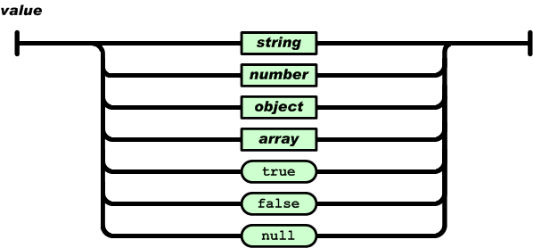
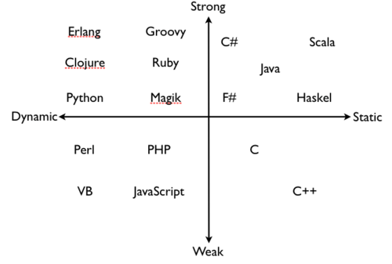
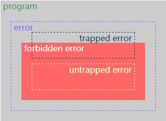

# 程序员的自我修养

>一切都是为了解耦，解耦为了重用和扩展。

## 目录
1. [数据结构（data structure）](#数据结构data-structure)
1. [设计模式](#设计模式)
1. [数据库](#数据库)
1. [bug调试方式](#bug调试方式)
1. [MD5 && SHA](#md5--sha)
1. [前端与服务端配合细节](#前端与服务端配合细节)
1. [JSON](#json)
1. [字体类型](#字体类型)
1. [程序设计思路、开发方式、行业术语](#程序设计思路开发方式行业术语)

    1. [平稳退化（优雅降级）、渐进增强](#平稳退化优雅降级渐进增强)
    1. [向前兼容、向后兼容](#向前兼容向后兼容)
    1. [自底向上、自顶向下](#自底向上自顶向下)
    1. [MV*](#mv)
    1. [直出、同构、预渲染、单页应用程序](#直出同构预渲染单页应用程序)
    1. [测试驱动开发、行为驱动开发](#测试驱动开发行为驱动开发)
    1. [灰度发布、A/B测试](#灰度发布ab测试)
    1. [编程范式](#编程范式)
    1. [软编码、硬编码](#软编码硬编码)
    1. [强、弱类型，静、动态类型](#强弱类型静动态类型)
    1. [递归、尾调用、尾递归](#递归尾调用尾递归)
    1. [柯里化（currying）](#柯里化currying)
    1. [求值策略（evaluation strategy）](#求值策略evaluation-strategy)
    1. [云服务](#云服务)
    1. [树的遍历](#树的遍历)
    1. [抽象语法树（abstract syntax tree，AST）](#抽象语法树abstract-syntax-treeast)
    1. [胶水语言（glue languages）](#胶水语言glue-languages)
    1. [词法作用域、动态作用域](#词法作用域动态作用域)
1. [Unicode](#unicode)
1. [编译器原理](#编译器原理)

---
### 数据结构（data structure）
>更详细的数据结构：[javascript-algorithms](https://github.com/trekhleb/javascript-algorithms)。

计算机中存储、组织数据的方式；意味着接口或封装（一个数据结构可被视为两个函数之间的接口）。

>1. `程序 = 数据结构 + 算法`：数据结构是为解决特定情况下的问题而设计的存储数据方式，算法是操作该数据结构的方法。
>2. 系统架构的关键因素是数据结构而非~~算法~~：选择正确的数据结构可以提高算法的效率；选择最适合的数据结构，决定了程序设计的困难程度与最终成果的质量、表现。

1. 数组（array）

    必须在使用前预先请求固定、连续专用空间，不能再改变（数据溢出问题）。
2. 栈（stack）

    后进先出（LIFO，Last In First Out）：仅允许在顶端进行插入数据、删除数据。
3. 队列（queue）

    先进先出（FIFO，First In First Out）：仅允许在后端进行插入数据，在前端进行删除数据。
4. 链表（linked list）

    一种线性表，但不会按线性的顺序存储数据，而是在每一个节点里存到下一个节点的指针。

    >1. 优点：使用链表结构可以克服数组链表需要预先知道数据大小的缺点，链表结构可以充分利用计算机内存空间，实现灵活的内存动态管理。
    >2. 缺点：链表失去了数组随机读取的优点，同时链表由于增加了结点的指针域，空间开销较大。
5. 树（tree）

    一种抽象数据类型，具有层次关系的集合。

    - 具有以下的特点：

        1. 每个节点有零个或多个子节点。
        2. 没有父节点的节点称为根节点。
        3. 每一个非根节点有且只有一个父节点。
        4. 每个节点可以分为多个不相交的子树。
6. 堆（heap）

    1. n个元素序列{k1,k2...ki...kn}，当且仅当满足下列关系时称之为堆：

        `(ki <= k2i,ki <= k2i+1)`或`(ki >= k2i,ki >= k2i+1)`（`(i = 1,2,3,4...n/2)`）。
    2. 堆的实现

        通过构造二叉堆（binary heap，二叉树的一种）：

        1. 任意节点小于（或大于）它的所有后裔，最小元（或最大元）在堆的根上（根节点最大的堆叫做最大堆或大根堆，根节点最小的堆叫做最小堆或小根堆）。
        2. 堆总是一棵完全二叉树（除了最底层，其他层的节点都被元素填满，且最底层尽可能地从左到右填入）。
7. 散列表（hash）

    （也叫哈希表，）根据键（Key）直接访问在内存存储位置。通过计算一个关于键-值的函数（散列函数），将所需查询的数据映射到表（散列表）中一个位置来访问记录，不需比较便可直接取得所查记录。

    >构建哈希表，用空间换时间。
8. 图（graph）

    表示物件与物件之间的关系的方法，由一些小圆点（顶点或结点）和连结这些圆点的线（边）组成。

### 设计模式
一个设计模式是一个可复用的软件解决方案。

>1. 设计模式是为了封装变化，让各个模块可以独立变化。精准地使用设计模式的前提是能够精准的预测需求变更的走向。在开发者满足了「知道所有设计模式为什么要被发明出来」的前提后，剩下的其实都跟编程没关系，而跟开发者的领域知识和领域经验有关系。
>2. 设计模式的定义：在面向对象软件设计过程中针对特定问题的简洁而优雅的解决方案。通俗地说，设计模式是在某种场合下对某个问题的一种解决方案。再通俗地说，设计模式就是给面向对象软件开发中的一些好的设计取个名字。

1. 单例模式（singleton）

    单例对象的类必须保证只有一个实例存在。
2. 工厂模式（factory）

    提供一个创建一系列相关或相互依赖对象的接口（方法），而无需指定他们具体的类。

    >不用~~new~~的方法调用。
3. 构造函数模式（constructor）

    `new`创建实例，方法中this代表新创建的对象。
4. 观察者模式（observer）

    >又称「发布/订阅模式」（publish-subscribe）

    定义对象间的一对多的依赖关系，以便当一个对象的状态发生改变时，所有依赖于它的对象都得到通知并自动刷新。
5. 桥接模式（bridge）

    将抽象与实现隔离开来，使用关联关系而不是继承关系，以便二者独立变化、减少耦合。

    >1. 抽象化：将复杂物体的一个或几个特性抽离出去只注意其他特性的行动或过程。在面向对象编程中就是将对象共同的性质抽取出去从而形成类的过程。
    >2. 实现化：针对抽象化给出具体实现，与抽象化是一个互逆过程，对抽象化事物的进一步具体化。
    >3. 脱耦：将抽象化和实现化之间的耦合解脱开，或将它们之间的强关联改换成弱关联，将两个角色之间的继承关系改为关联关系。
6. 装饰者模式（decorator）

    把类中的装饰功能从类中搬除，简化原来的类，把类的核心职责和装饰功能区分开。通过装饰功能的方法，动态地将功能附加到对象上。若要扩展功能，装饰者提供了比继承更有弹性的替代方案。
7. 组合模式（composite）

    组合多个对象形成树形结构以表示具有「整体—部分」关系的层次结构，对单个对象（即叶子对象）和组合对象（即容器对象）的使用具有一致性。
8. 门面模式（facade）

    他隐藏了系统的复杂性并向客户端提供了一个可以访问系统的接口。
9. 适配器模式（adapter）

    将一个类的接口转换成客户希望的另外一个接口。适配器模式使得原本由于接口不兼容而不能一起工作的那些类可以一起工作，使用这种模式的对象又叫包装器，因为他们是在用一个新的接口包装另一个对象。
10. 享元模式（flyweight）

    运用共享技术有效地支持大量细粒度的对象。
11. 代理模式（proxy）

    此模式最基本的形式是对访问进行控制。代理对象和另一个对象（本体）实现的是同样的接口，可是实际上工作还是本体在做，它才是负责执行所分派的任务的那个对象或类，代理对象不会在另以对象的基础上修改任何方法，也不会简化那个对象的接口。
12. 命令模式（command）

    将一个请求封装为一个对象，从而使你可用不同的请求对客户进行参数化；对请求排队或记录请求日志，以及支持可取消的操作。

    命令对象是一个操作和用来调用这个操作的对象的结合体，所有的命名对象都有一个执行操作，其用途就是调用命令对象所绑定的操作。
13. 职责链模式（chain of responsibility）

    为解除请求的发送者和接收者之间耦合，而使多个对象都有机会处理这个请求。将这些对象连成一条链，并沿着这条链传递该请求，直到有一个对象处理它。

    职责链由多个不同类型的对象组成：发送者是发出请求的对象，而接收者则是接收请求并且对其进行处理或传递的对象，请求本身有时也是一个对象，它封装着与操作有关的所有数据。

### 数据库
1. 数据库类型

    1. 关系型数据库（relational database management system，RDBMS）

        Oracle、MySQL

        >database->table->row(column)。
    2. 非关系型数据库（not only SQL，NoSQL）

        >数据存储不需要固定的模式，无需多余操作就可以横向扩展。

        1. 面向文档数据库（document-oriented）

            MongoDB

            >database->collection->document(field)。
        2. 键值存储数据库（键-值）

            Redis
        3. 列存储数据库（column-oriented）
        4. 图形数据库（graph）
2. 关系型数据库的范式

    数据库的表结构所符合的某种设计标准（消除冗余、高效利用磁盘空间、简洁组织数据）的级别。

    1. 第一范式（1NF）

        属性不可再分。

        >属性不可以是集合、数组、记录等组合型数据。
    2. 第二范式（2NF）

        （符合1NF，）非主属性**完全依赖**于主键。

        >只有单主键的表，若符合1NF，一定满足2NF。
    3. 第三范式（3NF）

        （符合2NF，）消除**传递依赖**。

        >属性不依赖于其它非主属性。
    4. 巴斯-科德范式（BCNF）

        （符合3NF，）主属性不依赖于主属性。

        >每个表中只有一个候选键（在一个表中每行的值都不相同的属性，则称为候选键）。

    >实际工作中，一个数据库设计符合3NF或BCNF就足够（甚至2NF）。

    - 第四范式（4NF）、第五范式（5NF）...

    >1. 范式越高，数据的冗余度越小。
    >2. 没有冗余的数据库设计是可以做到的。但是，没有冗余的数据库未必是最好的数据库，有时为了提高运行效率，就必须降低范式标准，适当保留冗余数据。
    >
    >    具体做法：在概念数据模型设计时遵守第三范式，降低范式标准的工作放到物理数据模型设计时考虑。降低范式就是增加字段，允许冗余。
    >
    >    >e.g. 在一些数据表中不仅存作为外键的user_id，同样存user_name，这样虽然违反3NF增加了user_name字段，但是却提高了效率，减少了获取user_id后再去user表中获取user_name的操作。
    >3. 范式解决的数据库问题
    >
    >    1. 操作异常
    >
    >        1. 插入异常
    >
    >            若某实体随着另一个实体的存在而存在，即缺少某个实体时无法表示这个实体。
    >        2. 更新异常
    >
    >            若更改表所对应的某个实体实例的单独属性时，需要将多行更新。
    >        3. 删除异常
    >
    >            若删除表的某一行来反映某实体实例失效时，导致另一个不同实体实例信息丢失。
    >    2. 数据冗余
    >
    >        相同的数据在多个地方存在，或表中的某个列可以由其他列计算得到。
3. 数据库设计

    >已经在投入使用的数据库，基本只能添加属性或表，而无法更改或删除属性或表。因此前期数据库结构设计不好，投入使用后就很难调优。

    1. 需求分析

        1. 数据是什么
        2. 数据有哪些属性
        3. 数据、属性的特点（存储特点、生命周期、增长速度、是否需要放入数据库）
    2. 逻辑设计

        ER图逻辑建模，实体之间、表之间的对应关系（一对一、一对多、多对多），使用范式约束。

        >两个表有多对多关系时，需要借助额外关系表包含有两表的主键（外键）来维护。
    3. 物理设计

        1. 选择数据库管理系统（DBMS）。
        2. 定义数据库、表、字段的命名规范。

            1. 可读性原则：利用大小写来格式化库对象名字，下划线分割字段的单词。
            2. 表意性原则：对象的名字能够描述它所标识的对象。
            3. 长名原则：不缩写。
        3. 根据选择的DBMS选择字段类型。

            1. 数字类型性能优于字符类型。
            2. char和varchar选择。
            3. decimal精确，float非精确。
            4. 时间类型int和datetime选择。
        4. 反范式化设计。

            >对第三范式进行违反，空间换时间。

            1. 减少表的关联数量。
            2. 增加数据的读取效率。
            3. 反范式化要适度。
    4. 维护优化

        1. 维护数据字典
        2. 新的需求建表、维护表结构
        3. 索引优化
        4. 大表拆分

        >随着投入使用时间越久并且在维护阶段容易忽略数据库设计，数据库的结构会越复杂。因此在维护阶段也需要按照以上步骤进行数据库设计。
4. 事务（transaction，数据库事务）

    数据库管理系统（DBMS）执行过程中的一个逻辑单位，由一个有限的数据库操作序列构成。

    1. 为数据库操作序列提供从失败中恢复到正常状态的方法，同时提供数据库即使在异常状态下仍能保持一致性的方法。
    2. 当多个应用程序在并发访问数据库时，提供隔离应用程序的方法，以防止彼此的操作互相干扰。

    - 为保证事务是正确可靠，必须具备ACID特性：

        1. 原子性（atomicity）：事务作为一个整体被执行，包含其中的数据库操作，要么全部被执行、要么都不执行。
        2. 一致性（consistency）：事务应确保数据库的状态从一个一致状态转变为另一个一致状态。
        3. 隔离性（isolation）：多个事务并发执行时，一个事务的执行不应影响其他事务的执行。
        4. 持久性（durability）：已被提交的事务对数据库的修改应该永久保存在数据库中。

### bug调试方式
>参考：[程序员新人怎样在复杂代码中找 bug？](https://www.zhihu.com/question/23019630/answer/23369396)。

1. 打断点、输出中间值、堆栈跟踪
2. 优先解决可重现bug

    可重现的bug特别好找，反复调试测试就好了，先把好解决的干掉，这样最节约时间。
3. **二分法定位**

    把程序逻辑一点点注释掉，看看还会不会出问题，类似二分查找的方法，逐步缩小问题范围。

    >如：模板引擎内错误。
4. 模拟bug现场

    问自己「若要自己实现bug描述的现象要怎么写代码才行」。
5. 放大bug现象

    有些bug现象不太明显，那么就想办法增大它的破坏性，把现象放大。这只是个思路，具体怎么放大只能根据具体的代码来定。
6. 小黄鸭调试法

    对着同事或小黄鸭复述一遍完整问题、代码意图，很可能找到之前因定性思维而遗漏的点。
7. 咨询有经验的同事

    对于某些bug没有头绪或者现象古怪不知道从哪里下手，找有经验的同事问一下思路，因为在那种开发多年的大型系统里，经常会反复出现同样原因的bug，原因都类似，改了一处，过一阵子另外一处又冒出来，而且无法根治。

    >为了保持兼容性，很多时候不能修改已经存在的容易出错接口。
8. 制作辅助调试工具

    针对某些bug编写一些调试辅助工具。

    >如：给没有上报错误的代码，扫描每个函数入口和出口插入上报功能。
9. 掩盖问题

    虽然这样做有点不厚道，但是有时不得不这么做。有些bug找不到真正的root cause，但是又要在规定时间内解决，那么我们就可以治疗症状而不去找病因。

    >如：用`try-catch`掩盖一些奇怪的崩溃。不到万不得已不要这么干，未来可能会付出更大代价。

- 前端的[代码调试方式](https://github.com/realgeoffrey/knowledge/blob/master/网站前端/JS学习笔记/README.md#代码调试方式)

### MD5 && SHA
>1. 不同系统、不同编程语言对MD5或SHA实现的逻辑相同（对同一内容，用不同实现的MD5或SHA得出结果相同）。
>2. 用不同的行分隔符（`\n`、`\r`、`\r\n`）打开同一个文本文件，会造成MD5或SHA输出结果不同。

1. MD5（message-digest dlgorithm，消息摘要算法）

    输入不定长度信息，输出固定长度128-bits（32位16进制数，`Math.pow(2,128) === Math.pow(16,32)`）的算法。

    >1. 可被破解、无法防止碰撞（collision），因此不适用于安全性认证。
    >2. 因其普遍、稳定、快速的特点，仍广泛应用于普通数据的错误检查领域。如：文件传输的可靠性检查。
2. SHA（secure hash algorithm，安全散列算法）

    输入不定长度信息，（根据算法不同）输出（不同）固定长度的算法。

    >安全、破解难度大：SHA-2、SHA-3。

>[MD5以及各SHA家族对比](https://zh.wikipedia.org/wiki/SHA家族#SHA函数对比)

### 前端与服务端配合细节
1. 开发方式

    1. 并行（优先）：

        1. 先与服务端对接预期API，服务端产出API文档；
        2. 前端根据文档通过Mock方式开发（或服务端先提供Mock数据的API）；
        3. 当服务端API开发完毕后再用真实API加入前端页面（仅关闭Mock即可）。
    2. 串行：

        服务端比前端提前一个版本，交付的内容包括API+文档。
2. 分页加载、滚动加载

    1. 分页加载，前端用`第几页`+`每页几项`发起请求，服务端（提前）返回`总量`给前端做判断一共有几页。
    2. 滚动加载，用`游标`作为判断下一批请求内容的依据：

        - 分页的游标管理

            1. 普通情况，游标由前端（或客户端）管理

                前端用`游标id`发起请求，服务端返回`新的游标id`给前端作为下一次请求。
            2. 若快速变动的数据（如：推荐信息）、或要根据用户操作而快速改变的数据（如已推送给某用户的不再推送给ta、用户标记不喜欢的相关类型不再推送给ta），则游标由服务端管理。

                服务端用Redis等内存管理方式记录用户的ID，前端只需要每次请求相同的无参数接口就可从服务端返回分页数据。
    >- 若用分页加载的服务端接口实现滚动加载
    >
    >    1. 则可能出现请求到重复数据或略过数据的情况。（游标的，若没有管理好数据流，则也会出现重复数据或略过数据情况）。
    >    2. 前端（或客户端）也可以模拟游标管理方式：暴露一个加载更多的无参数接口，在接口内部实现类似服务端的游标管理。
    >
    >        <details>
    >        <summary>e.g.</summary>
    >
    >        ```javascript
    >        let arr = []    // 数据
    >        const size = 10 // 每页数量
    >        const total = 111 // 总量
    >
    >        function loadMore () {
    >          if (arr.length < total) {
    >            console.log('页数：', Math.ceil(arr.length / size) + 1)
    >            // 页码：Math.ceil(arr.length / size) + 1；每页数量：size
    >            // 用发起异步请求获取数据，数据插入arr
    >            arr = arr.concat(1, 2, 3, 4, 5, 6, 7, 8, 9, 0)
    >          } else {
    >            // 已经加载所有内容
    >          }
    >          return arr
    >        }
    >
    >        loadMore()  // 加载更多直接调用，不用管理状态
    >        ```
    >        </details>
3. 服务端文档要求

    API文档确定的字段，就算为空，也必须按照文档要求返回` `或`[]`或`{}`，不允许返回内容丢失字段。
4. 扁平化的需要

    不同接口、但类别相同的数据，都按照相同的结构约定数据格式（如：[normalizr](https://github.com/paularmstrong/normalizr)）。

    ><details>
    ><summary>前端可以进行数据扁平化，把不同接口返回的数据都根据类别按照hash的方式存放在各自类别的store，并再保存一份数组记录展示顺序（把数据库的hash保存的方式移植到前端也用hash保存）</summary>
    >
    >e.g. 一个接口返回的数据包括articles、users数据，进行扁平化
    >
    >```javascript
    >// articles的store（内聚）
    >const articles = {}  // articles的store
    >articles.all = {}  // 存放articles的元数据（元数据：完整的单项数据，用唯一的id进行hash索引）
    >articles.hot = {  // 存放articles的hot的展示顺序
    >  sequence: [], // 元数据的id顺序
    >  hasMore: true // 是否继续请求
    >}
    >articles.new = {  // 存放articles的new的展示顺序
    >  sequence: [], // 元数据的id顺序
    >  hasMore: true // 是否继续请求
    >}
    >articles.flattenData = (data) => { // 扁平化数据：把单项数据全部保存在同一个地方
    >  articles.all[data.id] = Object.assign({}, articles.all[data.id], data)
    >}
    >articles.changeSequence = (data) => { // 写入某业务的展示顺序
    >  const list = articles[data.category]
    >
    >  if (data.refresh) {
    >    list.sequence = data.sequence
    >  } else {
    >    list.sequence = list.sequence.concat(data.sequence)
    >  }
    >}
    >
    >
    >// 相同省略：users的store
    >
    >
    >// 请求articles.hot的数据。返回的数据包含多种类别数据（articles、users）
    >function handleData (arr, category) {  // 处理数据
    >  articles.changeSequence({  // 写入hot的展示顺序
    >    category: category,
    >    refresh: false,
    >    sequence: arr.map((data) => {
    >      articles.flattenData(data.articles)   // 把元数据合并至articles
    >      // users.flattenData(data.users)   // 把元数据合并至users
    >
    >      return data.articles.id  // 返回articles的id用于保存顺序
    >    })
    >  })
    >
    >  console.log(category, JSON.parse(JSON.stringify(articles)))  // 打印
    >}
    >
    >// 针对articles.hot的第一次请求
    >const data1 = [
    >  { articles: { id: '1', data: 'articles第一个数据' }, users: { id: 'a', data: 'users第I个数据' } },
    >  { articles: { id: '20', data: 'articles第二个数据' }, users: { id: 'b', data: 'users第II个数据' } },
    >  { articles: { id: '300', data: 'articles第三个数据' }, users: { id: 'c', data: 'users第III个数据' } },
    >  { articles: { id: '4000', data: 'articles第四个数据' }, users: { id: 'd', data: 'users第IV个数据' } }
    >]
    >handleData(data1, 'hot')
    >
    >// 针对articles.hot的第二次请求
    >const data2 = [
    >  { articles: { id: '5000', data: 'articles第五个数据' }, users: { id: 'E', data: 'users第V个数据' } },
    >  { articles: { id: '600', data: 'articles第六个数据' }, users: { id: 'F', data: 'users第VI个数据' } },
    >  { articles: { id: '70', data: 'articles第七个数据' }, users: { id: 'G', data: 'users第VII个数据' } },
    >  { articles: { id: '8', data: 'articles第八个数据' }, users: { id: 'H', data: 'users第VIII个数据' } },
    >  { articles: { id: '1', data: 'articles第一的覆盖内容' }, users: { id: 'a', data: 'users第I个的覆盖内容' } }
    >]
    >handleData(data2, 'hot')
    >
    >// 针对articles.new的第一次请求
    >const data3 = [
    >  { articles: { id: '5000', data: 'articles第五的覆盖内容' }, users: { id: 'E', data: 'users第V的覆盖内容' } },
    >  { articles: { id: '8', data: 'articles第八的覆盖内容' }, users: { id: 'H', data: 'users第VIII的覆盖内容' } },
    >  { articles: { id: '300', data: 'articles第三的覆盖内容' }, users: { id: 'c', data: 'users第III的覆盖内容' } },
    >  { articles: { id: '20', data: 'articles第二的覆盖内容' }, users: { id: 'b', data: 'users第II的覆盖内容' } }
    >]
    >handleData(data3, 'new')
    >
    >console.log('接口获得的数据都进行扁平化处理；在对应类别的store按照id存取数据，再保存一份存放顺序的数组')
    >```
    ></details>
5. 接口请求失败，不能帮用户静默再次请求

    1. 提示用户（针对必要展示的信息）

        让用户认知网络错误（或其他错误）并且给用户操作重新加载的功能（如：跳转到网络出错或404页面）。

        >需要请求数据的应用都需要设计404和网络错误等容错页面。
    2. 静默失败（针对增量加载的信息，如：滚动加载）

        不提示用户失败，当用户再次触发时再次请求（减少用户挫败感）。
6. 不能把服务端返回的（错误）信息直接发送给用户看见，需要转换成用户能看得懂的语言。

    ><details>
    ><summary>也不能把前端错误信息发送给用户。若必须发送给用户错误信息，也需要转换成用户能看得懂的语言。</summary>
    >
    >e.g.
    >
    >```javascript
    >try {
    >  asd
    >} catch (e) {
    >  alert(e)  // 不可以把不经过翻译的错误信息发送给用户
    >}
    >```
    ></details>

### JSON
>- 从结构上看，所有的数据（data）最终都可以分解成三种类型：
>
>    1. 标量（scalar）
>
>        单独的字符串（`String`）或数字（`Number`）或其他值（`Boolean`、`Null`等）。
>    2. 序列（sequence）
>
>        >又称为：数组（array）、列表（list）。
>
>        若干个相关的数据按照一定顺序排序在一起。
>    3. 映射（mapping）
>
>        >又称为：散列（hash）、字典（dictionary）
>
>        键-值。

1. JSON（JavaScript Object Notation）是一种数据交换格式

    1. 定义明确简单

        易于人阅读和编写、也易于机器解析和生成。
    2. 采用完全独立于语言的文本格式

        能够跨编程语言传输数据。

        >因为传递的是文本格式，所以无法传递byte类型数据（二进制文件，如：图片）。
2. JSON的数据类型

    >来自：[www.json.org](https://www.json.org/json-zh.html)。

    >作者-道格拉斯·克罗克福特（Douglas Crockford）-设计的JSON实际上是JavaScript的一个子集，并且声称JSON的规格永远不必升级，因为该规定的都规定了。

    1. `Object`

        

        >注意：键名必须使用双引号`"`；不能增加额外的逗号`,`。
    2. `Array`

        

        >注意：不能增加额外的逗号`,`。
    3. `String`

        

        >注意：字符串必须使用双引号`"`。
    4. `Number`

        

        >注意：必须是十进制；浮点数不能省略小数点前的`0`（错误：~~`.1`~~；正确：`0.1`）。
    5. `true`、`false`、 `null`

    >不支持JS的其他基本数据类型：~~`Undefined`~~、~~`Symbol`~~、~~`BigInt`~~。

    - 以上数据类型在`键值`的任意组合、嵌套

        

    - 间隔区域可添加任意数量的空白` `
    - 字符集必须是Unicode的UTF-8
3. [JS使用JSON](https://github.com/realgeoffrey/knowledge/blob/master/网站前端/前端内容/标准库文档.md#json)
4. JSON的发展

    1. [JSON Schema](https://json-schema.org/)
    2. [MessagePack](https://msgpack.org/)
    3. [JSON5](https://github.com/json5/json5)

- <details>

    <summary>JSON与XML的对比</summary>

    1. XML（Extensible Markup Language，可扩展标记语言）

        在JSON出现之前，大家一直用XML来传递数据。

        因为XML是一种纯文本格式，所以它适合在网络上交换数据。XML本身不算复杂，但是，加上DTD、XSD、XPath、XSLT等一大堆复杂的规范以后……即使你努力钻研几个月，也未必搞得清楚XML的规范。
    2. JSON出现

        终于，在2002年的一天，道格拉斯·克罗克福特（Douglas Crockford）发明了JSON这种超轻量级的数据交换格式。

        由于JSON非常简单，很快就风靡Web世界，并且成为ECMA标准。几乎所有编程语言都有解析JSON的库，而在JavaScript中，我们可以直接使用JSON，因为JavaScript内置了JSON的解析。

    - 现在

        1. JSON和XML都是数据交换语言，完全独立于任何程序语言的文本格式。
        2. JSON的存在是典型的20%功能解决80%需求。为什么不要XML？因为里面80%的功能你不需要，等你需要时你就明白，这事只能XML干，JSON不行。
    </details>

### 字体类型
- 按字体的展示特性

    1. 是否有衬线

        >衬线：字形笔画末端的装饰细节部分

        1. 衬线体（serif）
        2. 无衬线体（sans-serif）
    2. 是否等宽

        >等宽针对：大小写的英文字母。

        1. 等宽字体（monospaced font）
        2. 非等宽字体

1. 计算机字体类型

    1. 点阵字体（bitmap font）
    2. 轮廓字体（outline font，描边字体）

        1. PostScript字体
        2. TrueType字体（.ttf）
        3. OpenType字体（.otf）
    3. 笔画字体（stroke-based font）
2. 中国书法字体类型

    1. 篆
    2. 隶
    3. 楷
    4. 行
    5. 草

><details>
><summary>CSS的<code>font-family</code>：设置值时，在列表末尾应该添加至少一个通用字符族名。</summary>
>
>`font-family`会继承父级，但若子级设置了`font-family`就不再向上继承（覆盖），无论子级设置的字体是否全都不可用（未找到字体）。因此无论如何，都应该在设置字体时在列表末尾添加至少一个通用字符族名（否则按照浏览器默认字体处理）。如：`font-family: 字体族名, 通用字体族名;`。
>
>- CSS的通用字体族名：
>
>    1. `serif`
>
>        带衬线字体，笔画结尾有特殊的装饰线或衬线。
>    2. `sans-serif`
>
>        无衬线字体，即笔画结尾是平滑的字体。
>    3. `monospace`
>
>        等宽字体，即字体中每个字宽度相同。
>    4. `cursive`
>
>        草书字体。这种字体有的有连笔，有的还有特殊的斜体效果。因为一般这种字体都有一点连笔效果，所以会给人一种手写的感觉。
>    5. `fantasy`
>
>        主要是那些具有特殊艺术效果的字体。
>    6. `system-ui`
>
>        从浏览器所处平台处获取的默认用户界面字体。
>    7. `math`
>
>        针对显示数学相关字符的特殊样式问题而设计的字体：支持上标和下标、跨行括号、嵌套表达式和具有不同含义的 double struck glyph。
>    8. `emoji`
>
>        专门用于呈现 Emoji 表情符号的字体。
>    9. `fangsong`
>
>        一种汉字字体，介于宋体和楷体之间。这种字体常用于某些政府文件。
></details>

---
## 程序设计思路、开发方式、行业术语
>其他💻📖对开发人员有用的定律、理论、原则和模式：[hacker-laws-zh](https://github.com/nusr/hacker-laws-zh)。

1. 「架构」是对客观不足的妥协（硬件不足、网络太慢、开发资源有限等客观不足）；
2. 「规范」是对主观不足的妥协（开发者水平参差不齐的主观不足）。

### 平稳退化（优雅降级）、渐进增强
1. 平稳退化（graceful degradation，优雅降级）：

    首先使用最新的技术面向现代浏览器构建最强的功能及用户体验，然后针对低版本浏览器的限制，逐步衰减那些无法被支持的功能及体验。
2. 渐进增强（progressive enhancement）：

    从最基本的可用性出发，在保证站点页面在低版本浏览器的可用性、可访问性的基础上，逐步增加功能及提高用户体验。

### 向前兼容、向后兼容
1. 向前兼容（forwards compatibility）：

    在将来的场景中还可以兼容使用。
2. 向后兼容（backwards compatibility）：

    在过去的场景中还可以兼容使用。

### 自底向上、自顶向下
1. 自底向上（bottom-up）：

    先编写出基础程序段，然后再逐步扩大规模、补充和升级某些功能。
2. 自顶向下（top-down）：

    将复杂的大问题分解为相对简单的小问题，找出每个问题的关键、重点所在，然后用精确的思维定性、定量地描述问题。

### MV*
MV\*的本质都一样：在于Model与View的桥梁\*。\*各种模式不同，主要是Model与View的数据传递流程不同。

1. MVC

    1. Model

        数据模型。最底下的一层，核心，对客观事物的抽象，是程序需要操作的数据或信息。
    2. View

        用户界面。最上面的一层，直接面向最终用户，提供给用户的操作界面，是程序的外壳、数据模型的具体表现形式。
    3. Controller

        业务逻辑。中间的一层，根据用户在「视图层」输入的指令来处理「数据层」的数据，也把「数据层」的改变反映给「视图层」。
2. MVP

    1. Model
    2. View
    3. Presenter
3. MVVM

    面向数据编程，把所有精力放在数据处理，尽可能减少对网页元素的处理（针对前端）。

    1. Model
    2. View
    3. ViewModel

        View与ViewModel双向绑定（data-binding），一个变动会触发另一个改变。

### 直出、同构、预渲染、单页应用程序
>这里的**渲染**是指：根据JS、CSS文件解析构造DOM达到最终页面效果的过程。

1. 直出（server-side rendering，SSR，服务端渲染）

    >针对接口请求结果固定的页面。

    Web后端渲染并输出内容（相对于：客户端AJAX请求数据并渲染DOM），代替客户端耗费渲染性能。

    1. WebServer向CGI拉取数据，把数据连同前端文件一起返回，客户端进行页面渲染。

        >客户端不需要请求其他前端文件。
    2. WebServer向CGI拉取数据，在服务器中根据模板渲染，再返回给客户端。

        >客户端不需要请求其他前端文件、客户端不需要运行时渲染。

    >1. 验证：「查看网页源代码」看是否有直出内容、或devTool的Network查看html请求的Response是否有直出内容、或网页禁用JS后还能看到JS渲染的内容。
    >2. 容错：若直出内容不是必须的，增加请求失败后的容错（如：`try-catch`、`Promise`后的`then/catch`）。
    >3. 选择：对必要的内容进行直出（SEO强相关、首屏资源）；在服务端请求越多接口、渲染越多、最终文件越大，输出给客户端时间就越久。
2. 同构（isomorphic javascript）

    Web前端与Web后端（直出端）使用同一套代码方案（JavaScript）。

    >同构的代码要注意在服务端环境（Node.js）和浏览器环境是使用同一套代码，必须要做兼容处理，如：
    >
    >    1. 在Node.js环境不能出现DOM、BOM、`window`操作，而变成操作`global`。
    >    2. 在Vue中某些钩子专门针对单一的环境，不要把操作浏览器环境（或Node.js环境）的代码放在两端都会执行的钩子中。
3. 预渲染（prerendering，构建时预加载）

    >针对无动态数据的静态页面。

    在前端代码构建时（利用Node.js插件等）就渲染好页面，不需要服务端或客户端渲染。

><details>
><summary>好处</summary>
>
>1. 更好的SEO
>
>    大部分搜索引擎在爬页面时不支持客户端渲染（JS）、或不支持客户端异步请求（AJAX）。
>2. 更好的初始加载性能（内容到达时间，time-to-content）
>
>    不用或减少浏览器渲染和渲染文件下载。
>3. 更好的维护性
>
>    同构使用同一套代码。
></details>
>
>权衡：需要准备相应的服务器负载，并明智地采用缓存策略。

4. 单页应用程序（single page web application，SPA）

    仅有一张Web页面的应用，是加载单个HTML页面并在用户与应用程序交互时动态更新该页面的Web应用程序。

### 测试驱动开发、行为驱动开发
>单元测试（unit testing）：针对程序模块进行正确性检验的测试工作，隔离程序部件并证明这些单个部件是正确的。程序单元是应用的最小可测试部件。在面向过程编程中，一个单元就是单个程序、函数、过程等；在面向对象编程中，最小单元就是对象的方法。

1. 测试驱动开发（test-driven development，TDD）

    先写测试，后写功能实现。目的是通过测试用例来指引实际的功能开发，让开发人员首先站在全局的视角来看待需求。
2. 行为驱动开发（behavior-driven development，BDD）

    要求更多人员参与到软件的开发中来，鼓励开发者、QA、相关业务人员相互协作。由商业价值来驱动，通过用户接口（如：GUI）理解应用程序。

### 灰度发布、A/B测试
1. 灰度发布

    对某一产品的发布逐步扩大使用群体范围。
2. A/B测试

    同时发布多种方案，从几种方案中选择最优方案。

### 编程范式
编程范式（programming paradigm）：从事软件工程的一类典型的风格，提供并决定了程序员对程序执行的看法。

1. 面向对象编程、面向过程编程、面向服务的体系结构

    1. 面向对象编程（object oriented programming）：

        把对象作为程序的基本单元，包含数据和操作数据的函数。
    2. 面向过程编程（procedure oriented programming）：

        以一个具体的流程（事务过程）为单位，考虑它的实现。
    3. 面向服务的体系结构（service oriented architecture）
2. 函数式编程、命令式编程

    1. 函数式编程（functional programming）

        一个程序会被看作是一个无状态的函数计算的序列。更加强调程序执行的结果而非执行的过程，倡导利用若干简单的执行单元让计算结果不断渐进。
    2. 命令式编程（imperative programming）

        关心解决问题的步骤。

### 软编码、硬编码
1. 软编码

    运行期间传入参数。
2. 硬编码

    将参数直接以固定值的形式写在源码中。

    >魔术字符串：在代码之中多次出现、与代码形成强耦合的某一个具体的字符串或者数值。应该尽量消除魔术字符串，改由含义清晰的变量代替。

><details>
><summary>e.g.</summary>
>
>```javascript
>// 最软
>function func(num) {
>  ...
>  if (value < num)
>  ...
>}
>
>
>// 有点软
>const NUM = 10;
>function func() {
>  ...
>  if (value < NUM)
>  ...
>}
>
>
>// 硬
>function func() {
>  ...
>  if (value < 10)
>  ...
>}
>```
></details>

- <details>

    <summary>视频编码领域</summary>

    1. 软编码

        使用CPU进行编码。实现直接、简单，参数调整方便，升级易，但CPU负载重，性能较硬编码低，低码率下质量通常比硬编码要好一点。
    2. 硬编码

        使用非CPU进行编码（如：显卡GPU、专用的DSP、FPGA、ASIC芯片等）。性能高，低码率下通常质量低于硬编码器，但部分产品在GPU硬件平台移植了优秀的软编码算法（如：X264）的，质量基本等同于软编码。
    </details>

### 强、弱类型，静、动态类型
>参考：[弱类型、强类型、动态类型、静态类型语言的区别是什么？](https://www.zhihu.com/question/19918532)。

1. 强、弱类型

    1. 强类型（strongly typed）

        偏向于不容忍隐式类型转换。
    2. 弱类型（weakly typed）

        偏向于容忍隐式类型转换。
2. 静、动态类型

    1. 静态类型（statically typed）

        在**编译时**进行类型检查。

        - 显式、隐式的静态类型

            1. 显式：类型是语言语法的一部分。
            2. 隐式：类型通过编译时推导。
    2. 动态类型（dynamically typed）

        在**运行时**进行类型检查。



><details>
><summary>另一种理解方式</summary>
>
>- 前置基础概念
>
>    1. program errors
>
>        1. trapped errors：导致程序终止执行（如：除以0，Java中数组越界访问）
>        2. untrapped errors：出错后继续执行，但可能出现任意行为（如：C里的缓冲区溢出、Jump到错误地址）
>    2. forbidden behaviours
>
>        语言设计时可以定义：所有**untrapped errors**、某些trapped errors的行为。
>    3. well behaved、ill behaved
>
>        1. well behaved：程序执行不可能出现forbidden behaviors。
>        2. ill behaved：程序执行可能出现forbidden behaviors。
>
>
>
>1. 红色区域外：well behaved（type soundness）
>2. 红色区域内：ill behaved
>
>3. 强类型：一种语言的所有程序都是灰色（well behaved）
>4. 弱类型：一种语言的程序存在红色（ill behaved）
>
>5. 静态类型：编译时拒绝红色（ill behaved）的程序
>6. 动态类型：运行时拒绝红色（ill behaved）的程序
>
>7. 所有程序都在黄框以外：类型安全
></details>

### 递归、尾调用、尾递归
><details>
><summary>函数调用会在内存形成一个「调用帧」（call frame），保存调用位置和内部变量等信息。所有的调用帧形成一个「调用栈」（call stack）</summary>
>
>e.g. 若在函数A的内部调用函数B，则在A的调用帧上方，还会形成一个B的调用帧。等到B运行结束，将结果返回到A，B的调用帧才会消失。若函数B内部还调用函数C，那就还有一个C的调用帧在B的上方，以此类推。
></details>

1. 递归（recursion）

    函数调用自身，称为递归。

    >递归非常耗费内存，因为需要同时保存成千上百个调用帧，很容易发生「栈溢出」错误（stack overflow）。
2. 尾调用（tail call）

    一个函数的最后一个动作是返回（另）一个函数的调用结果。

    - 尾调用优化（尾调用消除）：系统仅保留内层函数（被调用者）的调用帧，消除外层函数（调用者）的调用栈。

        只有不再用到外层函数（调用者）的内部变量，内层函数的调用帧才能取代外层函数的调用帧。

        ><details>
        ><summary>优化原理</summary>
        >
        >```javascript
        >// 尾调用由于是函数的最后一步操作，所以不需要保留外层函数的调用记录，
        >// 因为调用位置、内部变量等信息都不会再用到，
        >// 所以只要直接用内层函数的调用记录，取代外层函数的调用记录就可以了。
        >
        >function f () {
        >  let m = 1
        >  let n = 2
        >  return g(m + n)
        >}
        >f()
        >
        >// 等同于
        >function f () {
        >  return g(3)
        >}
        >f()
        >
        >// 等同于
        >g(3)
        >
        >// 上面代码中，如果函数g不是尾调用，函数f就需要保存内部变量m和n的值、g的调用位置等信息。
        >// 但由于调用g之后，函数f就结束了，所以执行到最后一步，完全可以删除f()的调用记录，只保留g(3)的调用记录。
        >```
        ></details>
3. 尾递归

    尾调用函数自身。

    - 实现了尾调用优化的语言，尾递归可以降低空间复杂度、避免栈溢出。

        尾递归的实现：改写递归函数，确保最后一步只调用自身；把所有用到的内部变量改写成函数的参数，以支持尾调用优化。

### 柯里化（currying）
把接受多个参数的函数变换成接受单一参数（最初函数的第一个参数）的函数，并且返回接受余下参数的新函数。

### 求值策略（evaluation strategy）
定义传入函数的实参：何时、以何种次序求值给函数的实参，何时把它们代换入函数，代换以何种形式发生。

1. 严格求值：参数在进入程序之前就经过计算求值

    1. 参数计算顺序：从左到右、从右到左
    2. 参数传递内容：

        1. 传值调用（call by value）
        2. 传引用调用（call by reference）
        3. 传共享对象调用（call by sharing）

            修改形参的属性将会影响到实参；重新赋值将不会影响实参。传值调用的特例。

    >JS实参的求值策略：从左到右、传值调用（传共享对象调用）的严格求值。
2. 非严格求值：参数的计算求值根据传入函数后的使用情况进行（惰性求值，在函数内有用到才求值）

### 云服务
>参考：[有哪些通俗易懂的例子可以解释 IaaS、PaaS、SaaS 的区别？](https://www.zhihu.com/question/21641778)。

1. IaaS（Infrastructure as a Service，基础设施即服务）
2. PaaS（Platform as a Service，平台即服务）
3. SaaS（Software as a Service，软件即服务）
- BaaS（Backend as a Service，后端即服务）
- FaaS（Function as a Service，函数即服务）
- Serverless（无服务器架构）

### 树的遍历
树的遍历（树的搜索）：一种图的遍历，指的是按照某种规则，不重复地访问某种树的所有节点的过程。

1. 深度优先搜索（depth-first search，DFS）：沿着树的深度遍历树的节点，尽可能深的搜索树的分支

    1. 首先将根节点放入栈中。
    2. 从栈中取出第一个节点，并检验它是否为目标。

        1. 若找到目标，则结束搜寻并回传结果；
        2. 否则将它某一个尚未检验过的直接子节点加入栈中。
    3. 重复步骤2。
    4. 若不存在未检测过的直接子节点。

        1. 将上一级节点加入栈中。
        2. 重复步骤2。
    5. 重复步骤4。
    6. 若栈为空，则表示整张图都检查过了——亦即图中没有欲搜寻的目标。结束搜寻并回传「找不到目标」。
2. 广度优先搜索（breadth-first search，BFS，宽度优先搜索，横向优先搜索）：从根节点开始，沿着树的宽度遍历树的节点

    1. 首先将根节点放入队列中。
    2. 从队列中取出第一个节点，并检验它是否为目标。

        1. 若找到目标，则结束搜索并回传结果；
        2. 否则将它所有尚未检验过的直接子节点加入队列中。
    3. 重复步骤2。
    4. 若队列为空，表示整张图都检查过了——亦即图中没有欲搜索的目标。结束搜索并回传「找不到目标」。

### 抽象语法树（abstract syntax tree，AST）
>来自：[Abstract Syntax Tree 抽象语法树简介](https://div.io/topic/1994)。

源代码的抽象语法结构的树状表现形式。

- 针对JS

    1. JavaScript的语法是为开发者而设计，但不适合程序理解。因此需要转化为AST用于程序分析。
    2. 通过JavaScript Parser把代码转化为一棵AST，这棵树定义了代码的结构，通过操纵这棵树，可以精准地定位到声明语句、赋值语句、运算语句等，实现对代码的分析、优化、变更等操作。

        >JavaScript Parser：把JS源码转化为AST的解析器（浏览器会把JS源码通过解析器转为AST，再进一步转化为字节码或直接生成机器码）。
    3. 常见用途：

        1. 代码语法的检查、代码风格的检查、代码的格式化、代码的高亮、代码错误提示、代码自动补全。

            >e.g. ESLint、IDE。
        2. 代码混淆压缩。

            >e.g. ES5的[UglifyJS2](https://github.com/mishoo/UglifyJS2)、ES6的[terser](https://github.com/terser/terser)。
        3. 优化变更代码、改变代码结构使达到想要的结构。

            >e.g. Babel、打包工具、不同模块化方案间转换、CoffeeScript/TypeScript/JSX转化为原生JS。

### 胶水语言（glue languages）
能够通过操作系统调用其他语言的程序、获取并处理其执行的结果和输入输出的语言，都可以被称作胶水语言（通常是脚本语言）。一个系统由多种语言编写，把不同的语言编写的模块打包起来，最外层使用胶水语言调用这些封装好的包。

- 胶水语言的例子:

    1. Shell scripts（如：Unix shell、Windows PowerShell等）
    2. Python
    3. Ruby
    4. Lua
    5. Tcl
    6. Perl
    7. PHP
    8. VBScript
    9. JavaScript
    10. JScript

### 词法作用域、动态作用域
1. 词法作用域（lexical scoping，静态作用域）：

    1. 作用域在函数声明定义时确定，作用域链基于函数声明时的作用域链嵌套。
    2. 关注函数在何处声明。
    3. 变量叫做词法变量。
    4. 函数中遇到*既不是形参也不是函数内部定义的局部变量*的变量时，去函数声明定义时的环境中查询（由函数声明处由内向外搜索变量）。

    >JS是词法作用域。
2. 动态作用域（dynamic scoping）：

    1. 作用域在函数调用时确定，作用域链基于调用栈。
    2. 关注函数从何处调用，其作用域链是基于运行时的调用栈。
    3. 变量叫做动态变量。
    4. 函数中遇到*既不是形参也不是函数内部定义的局部变量*的变量时，到函数调用时的环境中查询（由函数调用处由内向外搜索变量）。

---
### Unicode
Unicode：包含全世界所有字符的一个字符集（计算机只要支持这个字符集，就能显示所有的字符，再也不会有乱码）。从`0`开始，为每个符号指定一个编号，叫做「码点」（code point）。

>Unicode和ASCII都是一种**字符集**；UTF-8是Unicode的一种**编码方式（Encoding Form）**。

- JS的Unicode书写方式：

    1. `\u` + `4位16进制数`
    2. `\u{16进制数}`
    3. `\x` + `2位16进制数`
    4. `\` + `3位8进制数`

    >若要求的位数不足，则前面补`0`。

    JS内部会自动将Unicode转为字符。

    >[字符串转换为Unicode、字符串所占字节数](https://github.com/realgeoffrey/knowledge/blob/master/网站前端/JS方法积累/实用方法/README.md#原生js转化为unicode反转字符串字符串长度所占字节数)。

### 编译器原理
>来自：[the-super-tiny-compiler](https://github.com/jamiebuilds/the-super-tiny-compiler)。

（广义的）编译器：把一种语言代码转为另一种语言代码的程序。

1. 解析（parsing）

    `原始代码`（先转化为`Token`，再）转化为[`AST`](https://github.com/realgeoffrey/knowledge/blob/master/网站前端/程序员的自我修养/README.md#抽象语法树abstract-syntax-treeast)。

    1. 词法分析（lexical analysis）

        接收原始代码，分割成Token（一个数组，分割代码字符串的种类：数字、标签、标点符号、运算符，等）。
    2. 语法分析（syntactic analysis）

        接收之前生成的Token，转换成AST。

    ><details>
    ><summary>e.g. lisp代码 -> Token -> AST</summary>
    >
    >1. 原始代码（lisp）：
    >
    >    `(add 2 (subtract 4 2))`
    >2. 生成的Token：
    >
    >    ```javascript
    >    [
    >      { type: 'paren',  value: '('        },
    >      { type: 'name',   value: 'add'      },
    >      { type: 'number', value: '2'        },
    >      { type: 'paren',  value: '('        },
    >      { type: 'name',   value: 'subtract' },
    >      { type: 'number', value: '4'        },
    >      { type: 'number', value: '2'        },
    >      { type: 'paren',  value: ')'        },
    >      { type: 'paren',  value: ')'        }
    >    ]
    >    ```
    >3. 生成的AST：
    >
    >    ```javascript
    >    {
    >      type: 'Program',
    >      body: [{
    >        type: 'CallExpression',
    >        name: 'add',
    >        params: [
    >          {
    >            type: 'NumberLiteral',
    >            value: '2'
    >          },
    >          {
    >            type: 'CallExpression',
    >            name: 'subtract',
    >            params: [
    >              {
    >                type: 'NumberLiteral',
    >                value: '4'
    >              },
    >              {
    >                type: 'NumberLiteral',
    >                value: '2'
    >              }
    >            ]
    >          }
    >        ]
    >      }]
    >    }
    >    ```
    ></details>
2. 转换（transformation）

    >让它能做到编译器期望它做到的事情。

    遍历AST的所有节点，使用visitor中对应类型的处理函数，对不同类型的节点进行逻辑处理。
3. 代码生成（code generation）

    >可能会和转换有重叠。

    根据最终的AST或之前的Token输出新的代码。
